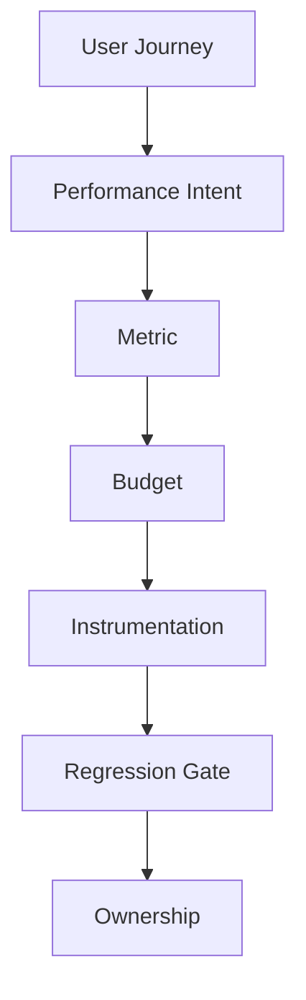
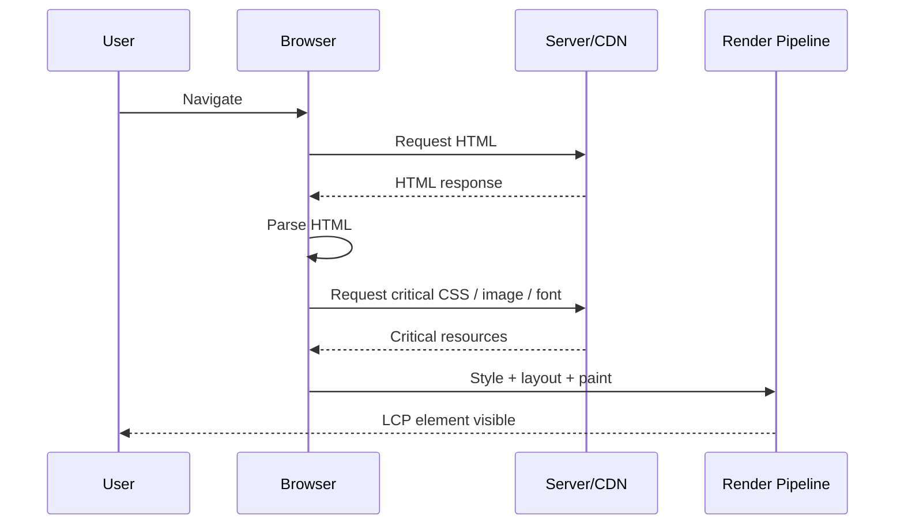
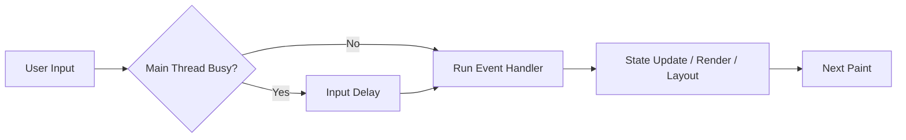

------
title: Learn Advanced JavaScript for Web / Frontend Engineering - Part 019
description: User-centric performance engineering with Core Web Vitals, field data, lab data, budgets, diagnostics, and production regression gates.
series: learn-javascript-frontend-advanced
seriesTitle: Learn Advanced JavaScript for Web / Frontend Engineering
order: 19
partTitle: Performance Engineering and Core Web Vitals
tags:
  - javascript
  - frontend
  - performance
  - core-web-vitals
  - lcp
  - inp
  - cls
  - observability
  - series
date: 2026-06-27
---

# Part 019 — Performance Engineering and Core Web Vitals

> Target part ini: kamu mampu memperlakukan frontend performance sebagai **engineering system**, bukan aktivitas kosmetik di akhir sprint. Kamu akan mampu membaca Core Web Vitals, membedakan field/lab data, menghubungkan metric ke user journey, membuat performance budget, dan memasang regression gate yang masuk akal.

Part 017 dan 018 membahas rendering strategy, hydration, resumability, dan islands. Sekarang kita masuk ke pertanyaan operasional:

```txt
Apakah aplikasi terasa cepat bagi user nyata, di device nyata, pada jaringan nyata?
```

Frontend performance yang matang bukan sekadar:

- bundle lebih kecil;
- Lighthouse score 100;
- pakai lazy loading;
- hapus dependency;
- memoization di mana-mana.

Itu semua bisa membantu, tetapi bukan definisi performance.

Performance engineering adalah kemampuan untuk:

1. mendefinisikan pengalaman user yang harus cepat;
2. mengukur pengalaman tersebut dengan metric yang benar;
3. menemukan bottleneck dominan;
4. memperbaiki bottleneck dengan trade-off eksplisit;
5. mencegah regresi masuk production.

---

## 1. Kaufman Skill Framing

### 1.1 Deconstruct the Skill

Untuk menguasai performance engineering modern, pecah skill menjadi:

1. memahami perbedaan **perceived performance** dan **raw speed**;
2. memahami Core Web Vitals: **LCP**, **INP**, **CLS**;
3. memahami metric pendukung: TTFB, FCP, TBT, long tasks, JS bytes, resource waterfall;
4. membedakan field data dan lab data;
5. menghubungkan metric ke route, device, network, dan segment user;
6. membuat performance budget;
7. melakukan diagnosis LCP;
8. melakukan diagnosis INP;
9. melakukan diagnosis CLS;
10. memasang regression gate di CI/CD;
11. membuat ownership model agar performance tidak menjadi tanggung jawab “seseorang nanti”.

### 1.2 Learn Enough to Self-Correct

Setiap kali performance buruk, jangan langsung bertanya:

```txt
Apa yang bisa kita optimize?
```

Pertanyaan yang lebih benar:

```txt
Metric mana yang buruk, untuk user mana, di route mana, pada fase pengalaman yang mana?
```

Tanpa itu, optimasi berubah menjadi ritual.

Checklist self-correction:

```txt
1. Apakah masalah terjadi di field data atau hanya lab data?
2. Apakah buruknya global, route-specific, atau segment-specific?
3. Apakah bottleneck ada di server, network, render, JavaScript, image, font, atau layout?
4. Apakah user sedang loading halaman, berinteraksi, atau melihat layout berubah?
5. Apakah perubahan yang direncanakan memperbaiki metric target atau hanya membuat code terasa lebih rapi?
6. Apakah ada regression gate agar masalah tidak kembali?
```

### 1.3 Deliberate Practice

Latihan wajib:

- ambil 3 route berbeda: landing, dashboard, detail page;
- ukur Core Web Vitals lab dan field;
- identifikasi top 3 bottleneck per route;
- buat performance budget;
- buat before/after trace;
- tulis postmortem mini untuk satu regression;
- pasang synthetic performance check di CI untuk route kritikal.

---

## 2. Mental Model: Performance Is a User Journey Contract

Performance bukan sifat aplikasi secara umum. Performance adalah kontrak per journey.

Contoh:

```txt
Search page:
- user harus melihat input secepat mungkin;
- typing tidak boleh lag;
- result boleh streaming/bertahap;
- filter harus terasa responsif.

Admin dashboard:
- shell boleh tampil cepat;
- widget berat boleh lazy;
- interaction utama tidak boleh blocked oleh chart rendering.

Checkout:
- payment form harus stabil;
- submit harus idempotent;
- loading state harus jelas;
- layout shift tidak boleh mengubah posisi tombol kritikal.
```

Satu angka global tidak cukup. Top-tier engineer akan memecah performance menjadi **journey-level SLO**.



---

## 3. Core Web Vitals: Apa yang Sebenarnya Diukur

Core Web Vitals adalah metric user-centric yang saat ini berfokus pada tiga aspek:

| Metric | Mengukur | Pertanyaan User |
|---|---|---|
| LCP | loading performance | “Konten utama sudah terlihat?” |
| INP | responsiveness/interactivity | “Aplikasi merespons input saya dengan cepat?” |
| CLS | visual stability | “Layout tetap stabil atau tiba-tiba loncat?” |

Jangan hafal metric sebagai angka saja. Hafalkan sebagai **keluhan user**.

```txt
LCP buruk  -> user menunggu konten utama.
INP buruk  -> user merasa UI berat / delay / macet.
CLS buruk  -> user kehilangan orientasi atau salah klik.
```

---

## 4. LCP — Largest Contentful Paint

### 4.1 Mental Model

LCP mengukur kapan elemen konten terbesar di viewport awal selesai dirender.

Biasanya elemen LCP adalah:

- hero image;
- product image;
- heading besar;
- banner;
- card utama;
- poster video;
- large text block.

LCP bukan “halaman selesai load”. LCP adalah kapan user melihat konten utama yang bermakna.

### 4.2 LCP Critical Path

Untuk memperbaiki LCP, pikirkan rantai ini:



Jika LCP buruk, penyebab umum:

1. server response lambat;
2. HTML lambat datang;
3. CSS blocking terlalu besar;
4. LCP image terlambat ditemukan;
5. LCP image terlalu besar;
6. font blocking;
7. client-side rendering menunda konten utama;
8. hydration atau JavaScript blocking main thread sebelum paint;
9. CDN/cache strategy buruk;
10. route terlalu bergantung pada API waterfall.

### 4.3 LCP Diagnosis Matrix

| Symptom | Kemungkinan Penyebab | Investigasi |
|---|---|---|
| TTFB tinggi | server lambat, edge miss, DB/API lambat | server trace, CDN logs |
| FCP cepat tapi LCP lambat | hero image/font/resource terlambat | waterfall, priority, preload |
| LCP berupa image besar | format/dimensi/priority salah | image audit |
| LCP text terlambat | font blocking atau CSS blocking | font loading strategy |
| LCP hanya buruk di mobile | CPU/network rendah, JS berat | mobile trace, throttling |
| LCP buruk di SPA route | client render/API waterfall | route waterfall profiling |

### 4.4 LCP Optimization Order

Jangan mulai dari micro-optimization. Urutan rasional:

```txt
1. Pastikan server/edge response cepat.
2. Pastikan HTML mengandung struktur konten utama secepat mungkin.
3. Kurangi render-blocking CSS.
4. Pastikan LCP resource ditemukan cepat.
5. Beri prioritas pada LCP resource.
6. Optimalkan ukuran, format, dan dimensi image.
7. Hindari JavaScript blocking sebelum first paint/LCP.
8. Kurangi dependency client render untuk above-the-fold content.
```

### 4.5 LCP Anti-Patterns

```txt
- Hero image hanya muncul setelah JavaScript fetch config.
- CSS global besar memblokir render semua route.
- Font custom wajib sebelum text tampil.
- SPA blank shell menunggu bundle besar.
- LCP image lazy-loaded.
- Carousel menjadi LCP dan memuat 5 image sekaligus.
- API waterfall menentukan content above-the-fold.
```

---

## 5. INP — Interaction to Next Paint

### 5.1 Mental Model

INP mengukur responsiveness halaman terhadap interaksi user. Secara praktis, INP buruk berarti:

```txt
User melakukan input, tetapi browser tidak segera memperlihatkan respons visual berikutnya.
```

Interaksi bisa berupa:

- click;
- tap;
- keyboard input;
- selection;
- interaction lain yang memicu event handling.

INP bukan hanya “event handler lambat”. INP dipengaruhi oleh:

1. input delay — event menunggu main thread kosong;
2. processing duration — handler dan work terkait berjalan;
3. presentation delay — browser belum sempat paint respons berikutnya.

### 5.2 Main Thread Capacity Model

Browser main thread mengerjakan banyak hal:

```txt
JavaScript execution
style calculation
layout
paint preparation
event handling
framework rendering
hydration
JSON parsing
DOM mutation
third-party scripts
```

INP buruk biasanya adalah masalah kapasitas main thread.



### 5.3 Penyebab Umum INP Buruk

| Area | Contoh Masalah |
|---|---|
| JavaScript | handler berat, loop besar, JSON parse besar |
| Framework | rerender tree terlalu luas, memoization salah, context blast radius |
| DOM | layout thrashing, DOM mutation besar |
| Hydration | user input terjadi saat hydration masih menguasai main thread |
| Third-party | analytics/chat/ads script blocking |
| Data | filtering/sorting besar di main thread |
| UI | virtualized list salah konfigurasi, chart render berat |

### 5.4 INP Optimization Order

```txt
1. Temukan interaction yang buruk, bukan sekadar script yang berat.
2. Ambil trace saat interaction terjadi.
3. Identifikasi apakah delay ada sebelum handler, selama handler, atau sebelum paint.
4. Kurangi blocking work di critical interaction path.
5. Persempit rerender scope.
6. Pecah task panjang.
7. Pindahkan compute berat ke worker bila cocok.
8. Kurangi third-party impact.
9. Validasi dengan field data.
```

### 5.5 Contoh: Filter Table Lambat

Masalah umum:

```tsx
function UsersTable({ users }) {
  const [query, setQuery] = useState("");

  const filtered = users.filter(user =>
    user.name.toLowerCase().includes(query.toLowerCase())
  );

  return (
    <>
      <input value={query} onChange={e => setQuery(e.target.value)} />
      <Table rows={filtered} />
    </>
  );
}
```

Jika `users` besar dan `Table` berat, setiap keypress dapat menyebabkan:

```txt
input event -> state update -> filter besar -> render besar -> layout besar -> delayed paint
```

Perbaikan tidak selalu “pakai useMemo”. Pilihan nyata:

- debounce query untuk fetch/filter;
- render input update lebih prioritas daripada table update;
- virtualize table;
- index data;
- pindahkan filtering ke worker;
- gunakan server-side search;
- batasi jumlah row visible;
- pecah component boundary;
- gunakan transition bila framework mendukung.

Top-tier engineer memilih berdasarkan bottleneck, bukan resep.

---

## 6. CLS — Cumulative Layout Shift

### 6.1 Mental Model

CLS mengukur ketidakstabilan visual. User tidak peduli layout engine; user peduli ketika:

```txt
Tombol pindah saat hendak diklik.
Konten turun karena banner muncul.
Card melompat karena image belum punya ukuran.
Font swap mengubah ukuran text.
```

### 6.2 Penyebab Umum CLS

| Penyebab | Contoh |
|---|---|
| Image/video tanpa reserved size | card berubah tinggi setelah image load |
| Ads/embed | slot tidak punya dimensi tetap |
| Font loading | FOIT/FOUT mengubah metrics |
| Dynamic content | banner/alert disisipkan di atas konten |
| Skeleton salah ukuran | placeholder tidak match final content |
| Late hydration changes | server HTML dan client render berbeda |
| Route transition buruk | scroll/focus/layout tidak dipulihkan benar |

### 6.3 CLS Prevention Rules

```txt
1. Reserve space untuk semua media.
2. Jangan insert content di atas existing content tanpa intent user.
3. Skeleton harus mendekati ukuran final.
4. Gunakan font strategy yang stabil.
5. Hindari client-only personalization yang mengubah above-the-fold layout terlambat.
6. Pastikan SSR dan client render deterministic.
7. Test dengan network lambat dan font/image cache kosong.
```

---

## 7. Field Data vs Lab Data

### 7.1 Field Data

Field data berasal dari user nyata.

Kelebihan:

- merepresentasikan device, network, browser, geography nyata;
- menunjukkan dampak production;
- bisa disegmentasi berdasarkan route/device/user cohort;
- cocok untuk SLO.

Kekurangan:

- butuh traffic;
- diagnosis lebih sulit;
- data terlambat;
- sulit untuk debugging deterministik.

### 7.2 Lab Data

Lab data berasal dari environment terkendali.

Kelebihan:

- repeatable;
- cocok untuk debugging;
- cocok untuk CI baseline;
- bisa pakai trace detail.

Kekurangan:

- tidak selalu merepresentasikan user nyata;
- bisa misleading bila device/network setting tidak realistis;
- score bisa bagus sementara field data buruk.

### 7.3 Rule of Thumb

```txt
Field data menentukan apakah user terkena masalah.
Lab data membantu menemukan dan memperbaiki penyebab.
```

Jangan debat field vs lab. Gunakan keduanya.

---

## 8. Metric Pendukung yang Harus Dipahami

### 8.1 TTFB

Time to First Byte membantu membaca server/edge/network latency. TTFB tinggi sering memperburuk LCP.

### 8.2 FCP

First Contentful Paint menunjukkan kapan konten pertama terlihat. FCP bagus tetapi LCP buruk berarti halaman mulai tampil, tetapi konten utama terlambat.

### 8.3 TBT

Total Blocking Time berguna di lab untuk memahami blocking main-thread work. Walaupun bukan Core Web Vital field utama, TBT sering berkorelasi dengan masalah responsiveness.

### 8.4 Long Tasks

Long task adalah sinyal bahwa main thread terlalu lama tidak memberi kesempatan browser memproses input/render.

### 8.5 Resource Waterfall

Waterfall menunjukkan urutan discovery/download resource. Banyak LCP issue terlihat jelas dari waterfall.

---

## 9. Performance Budget

Performance budget adalah batas yang disepakati agar aplikasi tidak memburuk perlahan.

Budget harus mencakup:

| Budget Type | Contoh |
|---|---|
| User metric | LCP p75, INP p75, CLS p75 |
| Resource | JS initial KB, CSS KB, image KB |
| Runtime | long task count, hydration duration |
| Route | route-specific budget |
| Third-party | max third-party script cost |
| Build | chunk count, duplicate dependency |

### 9.1 Budget yang Buruk

```txt
Bundle harus kecil.
Lighthouse harus hijau.
Performance harus cepat.
```

Ini tidak actionable.

### 9.2 Budget yang Baik

```txt
Product detail page:
- LCP p75 mobile <= target yang disepakati tim.
- INP p75 mobile tetap dalam kategori good.
- CLS p75 tetap dalam kategori good.
- Initial JS route tidak boleh naik > 10 KB gzip tanpa review.
- Tidak boleh ada single long task > 200 ms pada initial interaction flow.
- LCP image harus discoverable dari HTML atau preload policy yang eksplisit.
```

Catatan: angka target bisa mengikuti threshold publik, tetapi tim mature juga menyesuaikan dengan bisnis, geography, device mix, dan risk tolerance.

---

## 10. Performance Ownership Model

Performance gagal bukan hanya karena code buruk. Sering gagal karena tidak ada ownership.

### 10.1 Anti-Pattern Organisasi

```txt
- Performance baru dicek sebelum release besar.
- Hanya satu engineer peduli performance.
- Product menambah third-party script tanpa budget.
- Design menambah animation berat tanpa review runtime.
- Backend mengubah latency API tanpa visibility ke LCP.
- CI tidak memblokir regression.
```

### 10.2 Ownership yang Lebih Sehat

```txt
Route owner bertanggung jawab atas performance route.
Platform/frontend infra menyediakan tooling dan guardrail.
Design system menyediakan primitive yang performant dan accessible.
Backend/API owner memberi latency SLO untuk critical journey.
Product memahami trade-off feature vs performance.
```

---

## 11. Regression Gate

Performance harus masuk pipeline.

Minimal gate:

```txt
1. Bundle analysis pada PR.
2. Lighthouse/WebPageTest/synthetic check untuk route kritikal.
3. Trace comparison untuk interaction penting.
4. Alert dari field data bila p75 memburuk.
5. Review wajib untuk dependency besar dan third-party script.
```

### 11.1 CI Gate Tidak Boleh Naif

Jangan memblokir PR hanya karena satu run synthetic flake. Lebih baik:

- pakai median dari beberapa run;
- bandingkan dengan baseline branch;
- gunakan threshold toleransi;
- pisahkan hard gate dan soft warning;
- simpan artifact trace untuk debugging.

---

## 12. Route-Level Performance Review Template

Gunakan template ini saat review route penting.

```md
# Performance Review: <route>

## User Journey
- Primary user intent:
- Critical above-the-fold content:
- Critical interaction:

## Metrics
- LCP field:
- INP field:
- CLS field:
- Lab profile date:

## Bottleneck Hypothesis
- Server:
- Network:
- CSS/font:
- Image:
- JavaScript:
- Rendering:
- Third-party:

## Findings
1.
2.
3.

## Decision
- Fix now:
- Accept risk:
- Monitor:

## Regression Gate
- Budget:
- CI check:
- Owner:
```

---

## 13. Case Study: Slow Product Detail Page

### 13.1 Symptom

```txt
Mobile users complain product page feels slow.
Lighthouse score varies.
Field data shows LCP p75 poor on product pages.
```

### 13.2 Bad Response

```txt
Let's memoize components.
Let's remove comments.
Let's minify more.
Let's rewrite to another framework.
```

### 13.3 Good Response

```txt
1. Segment field data by route/device/network.
2. Confirm LCP element.
3. Inspect waterfall.
4. Check TTFB.
5. Check whether LCP image is discovered early.
6. Check image size/format/dimensions.
7. Check CSS/font blocking.
8. Check whether client-side rendering delays product content.
9. Check third-party script before LCP.
10. Validate fix using lab trace and field data after deploy.
```

### 13.4 Possible Findings

```txt
- HTML returns quickly.
- Product data embedded in HTML.
- LCP element is product image.
- Product image URL only generated after carousel JS initializes.
- Image is lazy-loaded despite being above-the-fold.
- Carousel library adds large JS before image priority.
```

### 13.5 Better Fix

```txt
- Render primary image in HTML.
- Mark image with correct priority/loading policy.
- Reserve dimensions.
- Lazy-load secondary carousel images.
- Defer carousel interactivity until after primary content is visible.
- Add route budget for LCP image discovery.
```

---

## 14. Performance and Architecture Are Coupled

Performance is not a patch. Architecture creates performance envelope.

| Architecture Choice | Performance Consequence |
|---|---|
| Client-only rendering | LCP depends on JS/API path |
| Large global provider | Small interaction rerenders large tree |
| Centralized mega-store | Update blast radius increases |
| Heavy design system primitive | Every product inherits cost |
| Unbounded table | INP/layout pressure |
| Third-party script in head | LCP/INP risk |
| No route splitting | initial JS cost grows |
| No cache model | repeated waterfalls |
| Hydrate whole page | main-thread pressure |

Top 1% frontend engineer melihat performance sejak desain arsitektur, bukan setelah QA.

---

## 15. Deliberate Practice Lab

### Lab 1 — LCP Investigation

Ambil satu route dengan hero image.

Tugas:

1. rekam trace dengan cold cache;
2. identifikasi LCP element;
3. cari kapan resource LCP ditemukan;
4. cari apakah CSS/font blocking;
5. buat satu improvement;
6. ukur ulang.

Output:

```txt
Before:
- LCP element:
- Discovery time:
- Resource size:
- Blocking cause:

After:
- Change:
- Result:
- Remaining risk:
```

### Lab 2 — INP Investigation

Ambil interaction berat: search/filter/toggle/modal open.

Tugas:

1. rekam performance trace saat interaction;
2. cari input delay;
3. cari handler duration;
4. cari render/layout cost;
5. pecah task atau perkecil rerender;
6. ukur ulang.

### Lab 3 — CLS Investigation

Ambil halaman dengan image, font, banner, atau dynamic content.

Tugas:

1. jalankan dengan network lambat;
2. kosongkan cache;
3. rekam layout shift;
4. identifikasi source shift;
5. reserve size/fix insertion strategy;
6. validasi ulang.

---

## 16. Checklist Produksi

Sebelum route critical dianggap production-ready:

```txt
[ ] Core Web Vitals dipantau di field data.
[ ] Route critical punya owner.
[ ] LCP element diketahui.
[ ] LCP critical path dipahami.
[ ] Initial JS route punya budget.
[ ] Critical interaction sudah diprofiling.
[ ] Tidak ada third-party script tanpa review.
[ ] Layout shift source sudah dicek.
[ ] Image/font strategy jelas.
[ ] Synthetic check berjalan di CI atau release pipeline.
[ ] Regression alert tersedia.
[ ] Performance exception didokumentasikan.
```

---

## 17. Common Mistakes

```txt
- Menganggap Lighthouse score sama dengan user experience.
- Mengoptimasi bundle tanpa melihat LCP element.
- Menggunakan memoization tanpa profiling.
- Menganggap SSR otomatis cepat.
- Mengabaikan mobile CPU.
- Mengukur hanya local machine high-end.
- Tidak membedakan cold cache dan warm cache.
- Tidak mengukur after deploy.
- Tidak punya owner untuk regression.
- Menaruh semua third-party script di head.
```

---

## 18. What Good Looks Like

Engineer yang matang bisa berkata:

```txt
Route ini lambat bukan karena React/Vue/JS secara umum.
Masalah dominannya adalah LCP image ditemukan terlambat karena hanya muncul setelah client carousel initialized.
Fix paling berdampak adalah render primary image di HTML, reserve dimensions, dan defer carousel JS.
Risiko regression akan kita jaga dengan budget route dan synthetic waterfall check.
```

Itu jauh lebih kuat daripada:

```txt
Kita perlu optimize frontend.
```

---

## 19. References

- Google Search Central — Core Web Vitals and Google Search
- web.dev — Web Vitals
- Chrome DevTools — Performance panel
- MDN — Web performance guides
- W3C/WHATWG platform documentation for browser behavior

---

## 20. Ringkasan

Performance engineering adalah disiplin sistemik.

Core insight:

```txt
LCP = konten utama terlihat.
INP = input user mendapat respons visual cepat.
CLS = layout tetap stabil.
```

Tetapi metric hanya awal. Engineer top-tier menghubungkan metric ke journey, bottleneck, architecture, ownership, dan regression gate.

Part berikutnya akan masuk lebih dalam ke **JavaScript Performance Profiling**: flame chart, long tasks, main-thread scheduling, expensive rendering, dan metode membaca trace tanpa menebak-nebak.
