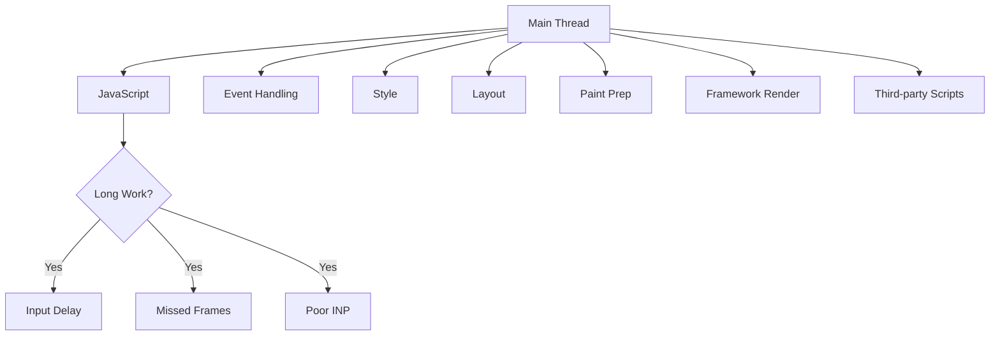
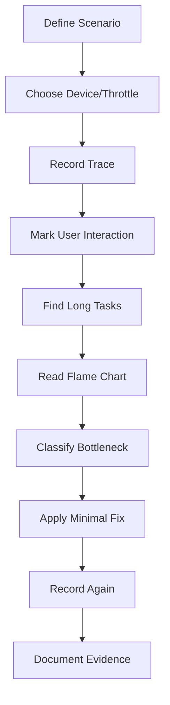

------
title: Learn Advanced JavaScript for Web / Frontend Engineering - Part 020
description: JavaScript runtime performance profiling with Chrome DevTools, flame charts, long tasks, main-thread contention, render cost, and optimization strategy.
series: learn-javascript-frontend-advanced
seriesTitle: Learn Advanced JavaScript for Web / Frontend Engineering
order: 20
partTitle: JavaScript Performance Profiling
tags:
  - javascript
  - frontend
  - performance
  - profiling
  - chrome-devtools
  - flame-chart
  - long-tasks
  - main-thread
  - series
date: 2026-06-27
---

# Part 020 — JavaScript Performance Profiling

> Target part ini: kamu mampu membaca performance trace secara sistematis, menemukan penyebab runtime bottleneck, membedakan compute/render/layout/network cost, dan memilih optimasi yang tepat tanpa bergantung pada tebakan seperti “pakai memoization saja”.

Part 019 membahas performance dari sisi user-centric metrics: LCP, INP, CLS, field data, lab data, budget, dan regression gate. Part ini memperbesar kaca pembesar pada satu area yang paling sering menyebabkan UI terasa berat:

```txt
JavaScript runtime work di main thread.
```

Masalah performance JavaScript jarang muncul sebagai “function X lambat” secara terisolasi. Lebih sering ia muncul sebagai kombinasi:

- event handler terlalu berat;
- framework rerender terlalu luas;
- layout dipaksa sinkron;
- JSON parsing besar;
- dependency initialization mahal;
- third-party script mengganggu;
- hydration mengambil main thread;
- data transformation berjalan saat user sedang input;
- DOM update menyebabkan style/layout/paint mahal.

Profiling adalah cara mengubah keluhan subjektif menjadi bukti teknis.

---

## 1. Kaufman Skill Framing

### 1.1 Deconstruct the Skill

Untuk menguasai JavaScript performance profiling, pecah skill menjadi:

1. memahami main thread sebagai resource terbatas;
2. memahami task, microtask, frame, paint, dan input scheduling;
3. mampu merekam trace yang representatif;
4. mampu membaca flame chart;
5. mampu membedakan self time dan total time;
6. mampu menemukan long task;
7. mampu membaca call tree dan bottom-up view;
8. mampu menghubungkan JS execution ke rendering cost;
9. mampu mengidentifikasi forced synchronous layout;
10. mampu mengukur framework render cost;
11. mampu membedakan bottleneck CPU, network, memory, dan layout;
12. mampu membuat before/after evidence.

### 1.2 Learn Enough to Self-Correct

Saat UI terasa lambat, jangan langsung menyimpulkan:

```txt
State management-nya salah.
Framework-nya lambat.
Butuh web worker.
Butuh useMemo.
```

Pertanyaan self-correction:

```txt
1. Interaction mana yang lambat?
2. Trace direkam pada device/network yang realistis?
3. Apakah main thread busy sebelum input diproses?
4. Apakah event handler mahal?
5. Apakah render tree terlalu luas?
6. Apakah layout/paint mahal setelah JS?
7. Apakah ada forced sync layout?
8. Apakah third-party script ikut berjalan?
9. Apakah bottleneck terjadi saat initial load, hydration, atau interaction?
10. Apakah fix terbukti dari trace before/after?
```

### 1.3 Deliberate Practice

Latihan wajib:

- profile satu page load;
- profile satu interaction berat;
- profile satu route transition;
- profile satu list/table besar;
- profile satu form dengan async validation;
- tulis diagnosis berbasis trace;
- buat satu fix dan ukur before/after.

---

## 2. Mental Model: Main Thread Is a Shared Critical Resource

Browser main thread bukan hanya menjalankan JavaScript.

Ia juga menangani:

```txt
- event dispatch;
- script execution;
- style calculation;
- layout;
- paint preparation;
- DOM operations;
- framework rendering;
- garbage collection work;
- some parsing/compilation work;
- coordination with compositor;
- parts of third-party scripts.
```

Jika JavaScript menahan main thread terlalu lama, browser tidak punya kesempatan cukup untuk:

- memproses input;
- menjalankan animation frame;
- melakukan layout/paint;
- merespons scroll/click/typing;
- menampilkan feedback visual.



Core model:

```txt
Responsiveness = ability to return control to browser frequently enough.
```

---

## 3. What a Trace Actually Shows

Performance trace adalah timeline aktivitas browser.

Secara sederhana:

```txt
x-axis = waktu
stack height = call stack / nested work
block width = durasi
warna/kategori = jenis aktivitas
```

Kamu tidak membaca trace seperti log linear. Kamu membaca trace seperti peta beban kerja.

Pertanyaan utama:

```txt
1. Kapan user melakukan aksi?
2. Apa yang sedang dilakukan main thread saat itu?
3. Task mana yang terlalu panjang?
4. Function mana yang dominan?
5. Apakah JS memicu style/layout/paint besar?
6. Apakah work bisa dipindahkan, diperkecil, ditunda, atau dipecah?
```

---

## 4. Flame Chart Fundamentals

### 4.1 Stack Shape

Flame chart menunjukkan call stack dari aktivitas runtime.

```txt
Wide block  = function/task memakan waktu lama.
Tall stack  = nested calls dalam task.
Top-level block = task besar.
Child block = function yang dipanggil.
```

Contoh konseptual:

```txt
Task: click handler 180ms
  handleClick 170ms
    setState 20ms
    filterRows 80ms
    renderTable 50ms
    commitDom 20ms
```

### 4.2 Total Time vs Self Time

Dua konsep penting:

| Konsep | Arti |
|---|---|
| Total time | Waktu function termasuk child calls |
| Self time | Waktu function sendiri tanpa child calls |

Contoh:

```txt
renderApp total time = 120ms
renderApp self time  = 5ms
```

Artinya `renderApp` bukan masalah langsung. Ia memanggil subtree yang mahal.

Sebaliknya:

```txt
normalizeRows total time = 90ms
normalizeRows self time  = 88ms
```

Artinya function itu sendiri melakukan kerja berat.

---

## 5. Long Tasks

Long task adalah sinyal bahwa browser tertahan terlalu lama dalam satu task.

Dampak long task:

```txt
- input menunggu;
- animation frame miss;
- rendering tertunda;
- feedback visual lambat;
- INP memburuk;
- UI terasa freeze.
```

### 5.1 Common Sources

```txt
- parsing JSON besar;
- sorting/filtering array besar;
- synchronous validation berat;
- chart rendering;
- syntax highlighting;
- markdown parsing;
- hydration besar;
- route transition render besar;
- third-party script initialization;
- huge reducer update;
- deep clone besar;
- expensive serialization/deserialization.
```

### 5.2 Long Task Triage

Untuk setiap long task, tanyakan:

```txt
1. Apakah task terjadi saat load atau interaction?
2. Apakah task berada di critical path user?
3. Apakah bisa dihindari?
4. Apakah bisa ditunda?
5. Apakah bisa dipecah?
6. Apakah bisa dipindahkan ke worker?
7. Apakah bisa dikurangi dengan data structure berbeda?
8. Apakah bisa dipersempit scope render-nya?
```

---

## 6. Profiling Workflow

### 6.1 Jangan Mulai dari Code

Mulai dari pengalaman user.

```txt
Bad:
Aku akan cari function lambat di codebase.

Good:
Interaction "typing search query on users table" terasa delay di mobile. Aku akan profile flow itu dengan CPU throttling dan data size production-like.
```

### 6.2 Workflow Standar



### 6.3 Scenario Definition

Trace buruk biasanya berasal dari scenario yang buruk.

Scenario yang baik:

```txt
User opens /cases/123 on mobile mid-tier device, waits until main content visible, opens escalation panel, types comment, selects assignee, submits.
```

Scenario buruk:

```txt
Aku record halaman sebentar.
```

---

## 7. Bottleneck Classification

Setelah menemukan task mahal, klasifikasikan.

| Bottleneck | Sinyal | Fix Typical |
|---|---|---|
| CPU compute | self time tinggi di pure JS | algorithm/data structure/worker/chunking |
| Framework render | banyak component render | boundary, memoization, state ownership |
| DOM mutation | commit/update DOM besar | batch, reduce DOM size, virtualization |
| Layout | Recalculate Style/Layout mahal | avoid layout thrash, simplify layout |
| Paint/composite | paint besar, layer issue | reduce paint area, compositor-friendly CSS |
| Network parse | large JSON parse | pagination, streaming, smaller payload |
| Hydration | initial main thread busy | reduce islands, defer, RSC/server boundary |
| Third-party | unknown/vendor scripts | defer, sandbox, remove, budget |
| GC pressure | frequent GC pauses | reduce allocation, reuse structures |

---

## 8. Forced Synchronous Layout

Forced synchronous layout terjadi saat JavaScript menulis sesuatu yang memengaruhi layout, lalu segera membaca layout.

Contoh:

```js
box.style.width = "400px";
const height = box.offsetHeight; // browser dipaksa flush layout sekarang
```

Jika dilakukan dalam loop:

```js
for (const item of items) {
  item.style.width = "400px";
  const height = item.offsetHeight;
  item.style.height = `${height + 10}px`;
}
```

Ini bisa menjadi layout thrashing.

### 8.1 Better Pattern

Pisahkan read dan write.

```js
const heights = items.map(item => item.offsetHeight);

items.forEach((item, index) => {
  item.style.height = `${heights[index] + 10}px`;
});
```

Lebih baik lagi, hindari manual measurement bila CSS/layout primitive bisa menyelesaikan.

### 8.2 Layout Read APIs yang Perlu Diwaspadai

```txt
offsetWidth / offsetHeight
clientWidth / clientHeight
scrollWidth / scrollHeight
getBoundingClientRect()
getComputedStyle()
```

Bukan berarti API ini dilarang. Artinya harus digunakan sadar fase rendering.

---

## 9. Framework Render Profiling

Framework modern membantu membangun UI, tetapi tidak menghapus biaya render.

Pertanyaan profiling:

```txt
1. State update apa yang memicu render?
2. Component mana yang rerender?
3. Apakah rerender diperlukan?
4. Apakah expensive computation berjalan saat render?
5. Apakah props berubah referentially tanpa makna?
6. Apakah context update meledakkan subtree?
7. Apakah list key stabil?
8. Apakah component boundary terlalu besar?
```

### 9.1 Render Blast Radius

Masalah umum:

```tsx
<AppProvider value={{ user, theme, permissions, filters, updateFilters }}>
  <HugeApplication />
</AppProvider>
```

Jika `filters` berubah, seluruh consumer dalam provider value bisa terdampak tergantung framework/pattern.

Model yang lebih baik:

```txt
Pisahkan state berdasarkan update frequency dan ownership.
```

```tsx
<UserProvider value={user}>
  <ThemeProvider value={theme}>
    <PermissionsProvider value={permissions}>
      <SearchFiltersProvider value={filters}>
        <Application />
      </SearchFiltersProvider>
    </PermissionsProvider>
  </ThemeProvider>
</UserProvider>
```

Namun jangan over-split tanpa bukti. Split boundary jika trace menunjukkan blast radius nyata.

### 9.2 Memoization Is Not Free

Memoization punya biaya:

- dependency comparison;
- memory retention;
- complexity;
- stale dependency bug;
- false confidence;
- harder code review.

Gunakan memoization ketika:

```txt
1. computation mahal;
2. input sering sama;
3. render sering terjadi;
4. cache tidak menahan memory berbahaya;
5. trace membuktikan bottleneck.
```

---

## 10. Data Size and Algorithmic Cost

Frontend sering lupa bahwa algorithmic complexity tetap berlaku.

Contoh buruk:

```js
const rowsWithOwner = rows.map(row => ({
  ...row,
  owner: users.find(user => user.id === row.ownerId),
}));
```

Jika `rows = 10_000` dan `users = 10_000`, ini O(n*m).

Lebih baik:

```js
const userById = new Map(users.map(user => [user.id, user]));

const rowsWithOwner = rows.map(row => ({
  ...row,
  owner: userById.get(row.ownerId),
}));
```

Top-tier frontend engineer tidak hanya tahu framework. Ia tetap memikirkan complexity.

---

## 11. JSON Parsing and Payload Cost

Kadang bottleneck bukan rendering, tetapi payload.

Problem:

```txt
API mengirim 5MB JSON.
Browser download selesai.
Lalu main thread parsing JSON besar.
Lalu transform data.
Lalu render list besar.
```

Trace bisa menunjukkan long task setelah response selesai.

Fix options:

```txt
- paginate;
- server-side filtering;
- reduce fields;
- normalize payload;
- stream data bila cocok;
- parse/process di worker;
- avoid client transform besar;
- render partial/virtualized.
```

---

## 12. Web Workers: Kapan Berguna

Worker berguna untuk compute yang:

- mahal;
- tidak butuh akses DOM langsung;
- bisa dipisahkan dari UI;
- punya input/output serializable atau transferable;
- tidak terlalu sering crossing boundary.

Worker tidak otomatis mempercepat semua hal.

Biaya worker:

```txt
- serialization/deserialization;
- message passing;
- lifecycle management;
- bundling complexity;
- duplicated code/dependency;
- debugging lebih sulit;
- cancellation/progress perlu didesain.
```

Rule:

```txt
Gunakan worker jika bottleneck adalah compute yang bisa diisolasi dan biaya komunikasi lebih kecil daripada blocking main thread.
```

---

## 13. Scheduling and Chunking

Tidak semua work perlu selesai dalam satu task.

Contoh chunking:

```js
async function processInChunks(items, processItem, chunkSize = 100) {
  for (let i = 0; i < items.length; i += chunkSize) {
    const chunk = items.slice(i, i + chunkSize);

    for (const item of chunk) {
      processItem(item);
    }

    await new Promise(resolve => setTimeout(resolve, 0));
  }
}
```

Ini memberi browser kesempatan memproses input/render di antara chunk.

Catatan:

- `setTimeout(0)` bukan magic;
- chunk size perlu diukur;
- microtask loop bisa tetap menahan rendering;
- untuk visual update, `requestAnimationFrame` bisa lebih sesuai;
- untuk background work, idle scheduling bisa dipertimbangkan;
- API scheduling modern perlu dicek compatibility sebelum digunakan production-wide.

---

## 14. Third-Party Scripts

Third-party script sering menjadi blind spot.

Contoh:

```txt
analytics
ads
chat widget
A/B testing
heatmap
session replay
payment SDK
captcha
social embed
```

Risiko:

- blocking load;
- long task saat init;
- layout shift;
- network contention;
- privacy/security risk;
- unpredictable updates;
- sulit diprofiling karena minified/vendor code.

### 14.1 Third-Party Budget

Setiap third-party harus punya:

```txt
- owner;
- purpose;
- loading strategy;
- allowed routes;
- performance budget;
- fallback behavior;
- removal criteria;
- security review.
```

---

## 15. Garbage Collection and Allocation Pressure

GC pause bisa muncul saat aplikasi membuat banyak object sementara.

Contoh allocation-heavy render:

```js
function renderRows(rows) {
  return rows
    .map(row => ({ ...row, label: formatLabel(row) }))
    .filter(row => row.visible)
    .map(row => ({ ...row, score: computeScore(row) }));
}
```

Masalahnya bukan `map` secara moral buruk. Masalahnya allocation pressure dan repeated work jika terjadi pada path yang sering.

Perbaikan bisa berupa:

- memoization yang tepat;
- precompute di boundary lain;
- normalize data;
- avoid repeated object recreation;
- reduce render frequency;
- process incrementally;
- use stable references where meaningful.

---

## 16. Case Study: Slow Escalation Panel

### 16.1 Scenario

```txt
User membuka case detail.
User klik "Open escalation panel".
Panel butuh 600ms sebelum terlihat responsif.
```

### 16.2 Trace Finding

```txt
Interaction task: 420ms
- handleOpenPanel: 15ms self
- loadPermissionsFromCache: 20ms
- normalizeCaseHistory: 160ms self
- renderTimeline: 130ms
- layout: 60ms
- paint: 35ms
```

### 16.3 Diagnosis

Bottleneck bukan click handler. Bottleneck dominan:

```txt
normalisasi history + render timeline + layout panel
```

### 16.4 Bad Fix

```txt
Wrap handleOpenPanel with useCallback.
```

Ini hampir tidak menyentuh bottleneck.

### 16.5 Better Fix

```txt
1. Pre-normalize case history saat data masuk.
2. Virtualize timeline jika panjang.
3. Render panel shell segera.
4. Defer heavy timeline detail setelah panel visible.
5. Reserve panel layout agar tidak reflow besar.
6. Profile ulang interaction.
```

---

## 17. Before/After Evidence Format

Setiap performance fix harus punya bukti.

```md
# Performance Fix Evidence

## Scenario
- Route:
- Device/profile:
- Network:
- Data size:
- User action:

## Before
- Main long task:
- Top function/self time:
- Layout/paint cost:
- User metric impact:

## Change
- Code/design change:
- Trade-off:

## After
- Main long task:
- Top function/self time:
- Layout/paint cost:
- User metric impact:

## Risk
- Regression possibility:
- Guardrail:
```

---

## 18. Optimization Decision Matrix

| Problem | First-Class Fix | Avoid Prematurely |
|---|---|---|
| Large list render | virtualization/pagination | random memo everywhere |
| Expensive pure compute | better algorithm/worker/chunking | framework rewrite |
| Huge rerender scope | state ownership/boundary | global caching hacks |
| Layout thrashing | read/write separation/CSS redesign | hiding symptoms |
| Slow initial JS | code split/defer/remove | minification-only thinking |
| Third-party long task | defer/remove/route-limit | blaming app code only |
| JSON parse heavy | smaller payload/pagination | optimizing component render only |
| Hydration cost | reduce client boundary | more client-side state |

---

## 19. Profiling Checklist

```txt
[ ] Scenario jelas dan realistis.
[ ] Device/network/CPU setting dicatat.
[ ] Trace mencakup user action target.
[ ] Long tasks diidentifikasi.
[ ] Flame chart dibaca dari top-level task ke child cost.
[ ] Self time vs total time dibedakan.
[ ] Bottleneck diklasifikasi: JS/render/layout/paint/network/vendor/GC.
[ ] Fix kecil dan terarah dipilih.
[ ] Before/after trace disimpan.
[ ] Regression guardrail ditentukan.
```

---

## 20. Common Mistakes

```txt
- Mengoptimasi tanpa trace.
- Melihat average, bukan worst relevant interaction.
- Mengukur di laptop high-end saja.
- Menganggap semua masalah selesai dengan memoization.
- Tidak membedakan render cost dan commit/layout cost.
- Mengabaikan payload size dan JSON parsing.
- Mengabaikan third-party script.
- Menggunakan worker untuk problem yang bottleneck-nya DOM.
- Memecah task dengan microtask sehingga rendering tetap tertahan.
- Tidak menyimpan before/after evidence.
```

---

## 21. What Good Looks Like

Engineer matang akan berkata:

```txt
Interaction ini lambat karena satu long task 420ms setelah click.
Self time terbesar ada di normalizeCaseHistory, lalu renderTimeline dan layout panel.
useCallback tidak relevan karena handler self time kecil.
Kita akan pre-normalize data, virtualize timeline, render shell dulu, lalu profile ulang.
```

Bukan:

```txt
Kayaknya React lambat.
```

---

## 22. Deliberate Practice Lab

### Lab 1 — Flame Chart Reading

1. Rekam trace initial load.
2. Cari top 3 long tasks.
3. Untuk setiap long task, tulis:
   - durasi;
   - top-level task;
   - function dominan;
   - self/total time;
   - kategori bottleneck.

### Lab 2 — Interaction Profiling

1. Pilih interaction yang terasa lambat.
2. Rekam trace dengan CPU throttling.
3. Mark input time.
4. Cari input delay, handler cost, render/layout cost.
5. Buat fix kecil.
6. Rekam ulang.

### Lab 3 — Algorithmic Refactor

1. Cari transform data O(n*m).
2. Ubah menjadi Map/index O(n+m).
3. Ukur sebelum/sesudah.
4. Pastikan memory tidak memburuk signifikan.

### Lab 4 — Chunking

1. Ambil processing list besar.
2. Proses dalam satu task.
3. Catat long task.
4. Ubah menjadi chunked processing.
5. Catat trade-off total duration vs responsiveness.

---

## 23. References

- Chrome DevTools — Performance panel and flame chart documentation
- MDN — Performance APIs and browser rendering behavior
- web.dev — Interaction and responsiveness guidance
- React/Vue/Svelte framework profiler documentation sesuai stack yang digunakan

---

## 24. Ringkasan

JavaScript performance profiling adalah disiplin membaca bukti.

Core insight:

```txt
Jangan optimize berdasarkan rasa.
Profile scenario user nyata.
Temukan long task.
Baca flame chart.
Klasifikasi bottleneck.
Terapkan fix minimal.
Ukur before/after.
Pasang guardrail.
```

Part berikutnya akan membahas **Network Performance and Delivery**: HTTP cache, CDN, request waterfall, priority, compression, preconnect/preload, dan strategi delivery frontend modern.
