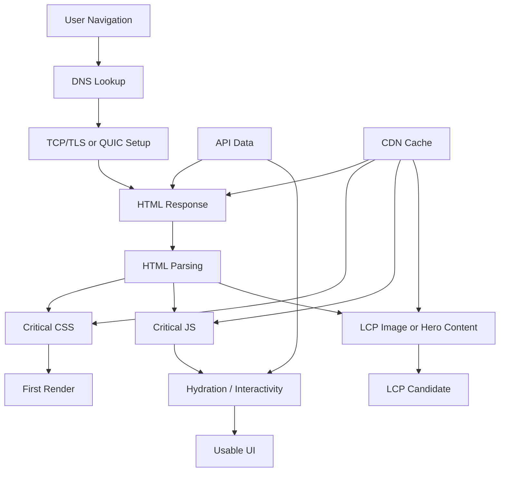
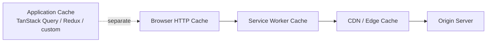
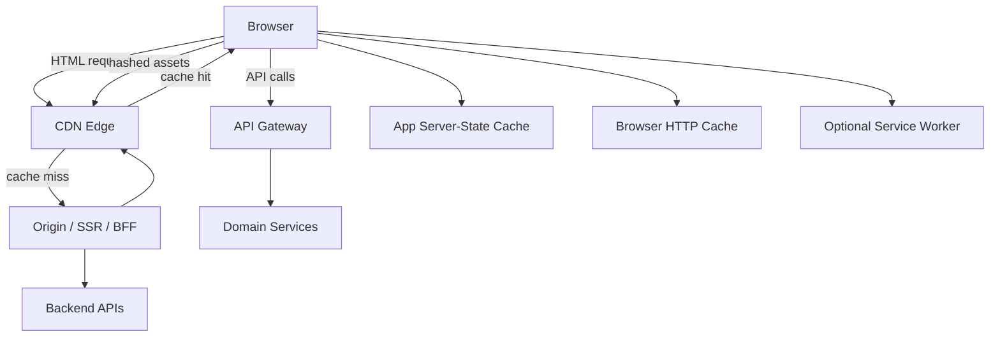

------
title: Learn Advanced JavaScript for Web / Frontend Engineering - Part 021
description: Network performance and delivery engineering for modern frontend systems, covering HTTP caching, resource hints, CDN strategy, request waterfalls, API delivery, compression, and production diagnostics.
series: learn-javascript-frontend-advanced
seriesTitle: Learn Advanced JavaScript for Web / Frontend Engineering
order: 21
partTitle: Network Performance and Delivery
tags:
  - javascript
  - frontend
  - performance
  - network
  - http
  - caching
  - cdn
  - resource-hints
  - core-web-vitals
  - series
date: 2026-06-27
---

# Part 021 — Network Performance and Delivery

> Target part ini: kamu mampu mendesain delivery frontend sebagai sistem distribusi: cepat, cacheable, konsisten, aman, observable, dan tidak rapuh saat traffic, latency, browser, CDN, atau API berubah.

Part 019 dan Part 020 membahas performance dari sisi user experience dan JavaScript runtime. Part ini memperluas area diagnosis ke sisi yang sering lebih menentukan dari micro-optimization JavaScript:

```txt
Network delivery.
```

Frontend modern bukan hanya bundle JavaScript. Ia adalah grafik dependensi lintas jaringan:

- HTML document;
- CSS;
- JavaScript chunks;
- fonts;
- images;
- API responses;
- third-party scripts;
- CDN edge;
- browser cache;
- service worker cache;
- application cache;
- server rendering stream;
- route prefetch;
- user-specific authorization state.

Engineer yang kuat tidak hanya bertanya:

```txt
Bundle saya berapa KB?
```

Pertanyaan yang lebih tepat:

```txt
Resource kritis apa yang dibutuhkan untuk membuat user melihat, memahami, dan menggunakan halaman ini?
Resource mana yang bisa ditunda?
Resource mana yang bisa dicache?
Resource mana yang tidak boleh bocor lintas user/tenant?
Resource mana yang menciptakan waterfall?
```

---

## 1. Kaufman Skill Framing

### 1.1 Deconstruct the Skill

Network performance terdiri dari beberapa sub-skill:

1. membaca request waterfall;
2. memahami latency, bandwidth, dan connection setup;
3. memahami HTTP caching;
4. membedakan browser cache, CDN cache, application cache, dan service worker cache;
5. mendesain cache policy untuk HTML, asset, API, image, dan font;
6. mengendalikan critical resource loading;
7. memakai resource hints dengan tepat;
8. menghindari preload/prefetch yang justru merusak prioritas browser;
9. memecah bundle tanpa menciptakan waterfall chunk;
10. mengoptimalkan API delivery;
11. memahami CDN dan edge caching;
12. mengukur field impact, bukan hanya local Lighthouse score.

### 1.2 Learn Enough to Self-Correct

Saat halaman lambat, jangan langsung menyimpulkan:

```txt
Bundle terlalu besar.
Server lambat.
Butuh CDN.
Butuh prefetch semua route.
Butuh HTTP/3.
```

Gunakan pertanyaan korektif:

```txt
1. Apakah bottleneck-nya TTFB, download, render-blocking, JS execution, atau API waterfall?
2. Resource apa yang berada di critical path LCP?
3. Apakah cache hit rate rendah?
4. Apakah HTML terlalu agresif dicache sehingga user melihat data stale?
5. Apakah asset immutable belum diberi content hash?
6. Apakah preload dipakai untuk resource yang benar-benar dibutuhkan segera?
7. Apakah API request serial padahal bisa paralel?
8. Apakah CDN cache key memasukkan header/query yang membuat cache fragmentation?
9. Apakah resource pihak ketiga mengambil bandwidth/main-thread lebih awal dari resource utama?
10. Apakah field data membuktikan optimasi ini membantu user nyata?
```

### 1.3 Remove Practice Barriers

Untuk latihan part ini, siapkan minimal:

- Chrome DevTools Network panel;
- Chrome DevTools Performance panel;
- Lighthouse atau PageSpeed Insights;
- WebPageTest bila tersedia;
- local throttling profile seperti Slow 4G / Fast 3G;
- akses header response di browser;
- kemampuan membaca `curl -I`;
- kemampuan membaca output build bundle;
- minimal satu aplikasi frontend dengan route dan API nyata.

### 1.4 Practice Loop

```txt
Pilih satu halaman → rekam waterfall → tandai critical path → ukur LCP/TTFB/INP/CLS → ubah satu variabel → bandingkan trace → tulis decision log.
```

Jangan melakukan 5 optimasi sekaligus. Itu membuatmu tidak tahu mana yang benar-benar berdampak.

---

## 2. Mental Model: Network as a Constraint Graph

Network performance bukan hanya ukuran file. Model yang lebih akurat:

```txt
User-perceived speed = f(latency, connection setup, server time, cache hit, prioritization, compression, critical dependency graph, CPU after download)
```

Diagram sederhana:



Yang membuat sistem ini sulit:

- dependency tidak selalu eksplisit;
- browser punya scheduler sendiri;
- CDN punya cache key sendiri;
- framework punya preload/prefetch strategy sendiri;
- API punya latency dan consistency sendiri;
- user punya device/network berbeda;
- production berbeda dari local dev.

---

## 3. Latency, Bandwidth, and Critical Path

### 3.1 Latency vs Bandwidth

Dua metrik jaringan sering disamakan, padahal efeknya berbeda.

| Faktor | Makna | Efek pada Frontend |
|---|---|---|
| Latency | Waktu bolak-balik request/response | Membuat waterfall serial sangat mahal |
| Bandwidth | Kapasitas transfer data | Membuat file besar mahal |
| Packet loss | Paket hilang dan perlu retransmit | Membuat koneksi terasa tidak stabil |
| Server time | Waktu server menghasilkan response | Mempengaruhi TTFB |
| Cache hit | Response tersedia dekat user | Mengurangi server time dan transfer |
| Prioritization | Resource mana yang diproses lebih dulu | Menentukan apakah resource kritis menang atau kalah |

File kecil tetap bisa lambat jika butuh banyak round trip serial. File besar bisa cukup cepat jika dicache, dikompresi, dan bukan bagian critical path.

### 3.2 Critical Path

Critical path adalah rangkaian resource yang harus selesai sebelum user mendapat hasil penting.

Untuk halaman dashboard:

```txt
HTML → CSS → route chunk → auth/session API → dashboard data API → chart library → render chart
```

Untuk halaman artikel:

```txt
HTML → critical CSS → hero image → font fallback strategy
```

Untuk internal case management system:

```txt
HTML → shell CSS → route chunk → permission model → case summary API → workflow state API → action availability
```

Optimasi terbaik sering bukan mempercepat semua resource, tetapi memindahkan resource keluar dari critical path.

---

## 4. Reading a Request Waterfall

### 4.1 What to Look For

Saat membaca waterfall, jangan hanya melihat request paling lambat. Cari struktur.

Checklist:

```txt
1. Request apa yang pertama muncul setelah document?
2. Resource mana yang render-blocking?
3. Apakah ada API request yang baru mulai setelah JS selesai download dan execute?
4. Apakah ada chain import dynamic yang menyebabkan chunk waterfall?
5. Apakah font memblokir text rendering?
6. Apakah hero image terlambat ditemukan?
7. Apakah third-party script mulai terlalu awal?
8. Apakah banyak request kecil serial?
9. Apakah response besar tidak dikompresi?
10. Apakah cache status sesuai harapan?
```

### 4.2 Waterfall Smells

| Smell | Gejala | Penyebab Umum | Perbaikan |
|---|---|---|---|
| Late LCP image discovery | Hero image baru diminta setelah JS jalan | Image dibuat client-side | Render image di HTML/SSR atau preload selektif |
| API after hydration | Data request baru mulai setelah bundle execute | SPA-only data fetching | SSR loader, route loader, prefetch, parallel fetch |
| Chunk waterfall | Chunk A memuat chunk B memuat chunk C | Dynamic import terlalu granular | Gabungkan boundary atau preload dependency |
| Font delay | Text invisible/late swap | Font blocking, no fallback | `font-display`, preload font kritis |
| Third-party contention | Resource vendor memakan bandwidth/main thread | Script analytics/ads/chat terlalu awal | Delay, consent gate, async, sandbox |
| Cache miss on immutable assets | Asset hash tetap di-download | Header cache salah | `max-age=31536000, immutable` untuk hashed assets |
| HTML stale | User melihat UI versi lama | HTML dicache terlalu agresif | HTML revalidate/no-cache dengan CDN policy tepat |

---

## 5. HTTP Caching Mental Model

HTTP caching bukan “simpan file agar cepat”. Ia adalah kontrak validitas response.

```txt
Cache answers: can this stored response be reused for this request, this user, this variant, at this time?
```

### 5.1 Cache Layers



Masing-masing layer punya tujuan berbeda.

| Layer | Tujuan | Risiko |
|---|---|---|
| Browser HTTP cache | Menghindari request ulang dari browser | Stale asset atau data user-specific bocor bila header salah |
| CDN cache | Mendekatkan response ke user global | Cache key salah, purge sulit, tenant leak |
| Service worker cache | Offline, custom routing, app shell | Cache invalidation kompleks |
| Application cache | Server state, optimistic UI, deduplication | Stale data, permission drift, memory growth |
| In-memory module cache | Reuse data selama session | Tidak survive reload, mudah leak |

### 5.2 Fresh vs Stale

Response fresh dapat dipakai tanpa validasi ulang. Response stale perlu revalidation atau fetch ulang, tergantung policy.

Contoh header untuk hashed static asset:

```http
Cache-Control: public, max-age=31536000, immutable
```

Aman jika filename mengandung content hash:

```txt
app.9f3a8c1.js
styles.2bd91aa.css
```

Tidak aman jika filename stabil:

```txt
app.js
styles.css
```

### 5.3 HTML Cache Policy

HTML biasanya harus lebih hati-hati dari asset.

Untuk app shell yang sering berubah:

```http
Cache-Control: no-cache
```

`no-cache` bukan berarti tidak disimpan sama sekali. Artinya response boleh disimpan, tetapi harus divalidasi sebelum dipakai kembali.

Untuk halaman yang benar-benar sensitif/user-specific:

```http
Cache-Control: private, no-store
```

Gunakan `no-store` saat response tidak boleh disimpan oleh cache manapun.

### 5.4 API Cache Policy

API policy tergantung data.

| Data | Contoh | Policy Awal yang Masuk Akal |
|---|---|---|
| Public stable | Country list, product category public | CDN cache + `s-maxage` |
| Public dynamic | Article list, public search result | short TTL + stale-while-revalidate |
| User private | Profile, permission, inbox | `private`, usually no shared cache |
| Sensitive | Token, payment, legal document | `no-store` |
| Tenant-scoped | Case data, organization config | cache key must include tenant/auth dimensions or avoid shared cache |

### 5.5 Cache Key and Vary

Cache hit bukan hanya soal URL. Cache key dapat dipengaruhi oleh:

- method;
- scheme/host/path/query;
- selected headers;
- cookies;
- authorization;
- locale;
- device hints;
- CDN configuration.

`Vary` memberi tahu cache bahwa response berubah berdasarkan header tertentu.

Contoh:

```http
Vary: Accept-Encoding
```

Untuk localization:

```http
Vary: Accept-Language
```

Hati-hati: terlalu banyak variasi membuat cache fragmentation.

```txt
Cache fragmentation = banyak versi response disimpan, tapi masing-masing jarang hit.
```

### 5.6 Stale-While-Revalidate

Pattern ini berguna untuk data public yang boleh sedikit stale.

```http
Cache-Control: public, max-age=60, stale-while-revalidate=300
```

Artinya secara konseptual:

```txt
0-60 detik: response fresh
60-360 detik: stale boleh disajikan sementara cache revalidate di background
>360 detik: harus fetch ulang sebelum disajikan
```

Jangan gunakan untuk data yang secara hukum/bisnis tidak boleh stale.

---

## 6. Static Asset Delivery Strategy

### 6.1 Immutable Hashed Assets

Rule production yang kuat:

```txt
Jika content berubah, URL harus berubah.
Jika URL tidak berubah, content tidak boleh berubah.
```

Ini memungkinkan cache agresif:

```http
Cache-Control: public, max-age=31536000, immutable
```

Build tool modern biasanya menghasilkan content-hashed files.

Contoh output:

```txt
/assets/index-6D3x9a.js
/assets/vendor-react-8Lk2a.js
/assets/dashboard-2Paa1.css
```

### 6.2 HTML as Manifest Pointer

HTML menunjuk ke asset hash terbaru.

```html
<script type="module" src="/assets/index-6D3x9a.js"></script>
<link rel="stylesheet" href="/assets/index-Az11.css" />
```

Maka HTML harus revalidate lebih sering daripada asset.

### 6.3 The Deploy Race

Failure mode umum:

```txt
1. User membuka HTML lama.
2. Deploy baru menghapus asset lama dari CDN/origin.
3. HTML lama menunjuk asset lama.
4. Browser request asset lama → 404.
5. App blank.
```

Mitigasi:

- jangan hapus asset lama terlalu cepat;
- gunakan retention window;
- pastikan CDN purge tidak menghapus hashed asset yang masih mungkin direferensikan;
- buat fallback reload jika dynamic import gagal;
- monitor chunk load errors.

Contoh handler:

```js
window.addEventListener('error', (event) => {
  const target = event.target;

  if (target instanceof HTMLScriptElement && target.src.includes('/assets/')) {
    console.warn('Script asset failed to load', target.src);
  }
});

window.addEventListener('unhandledrejection', (event) => {
  if (String(event.reason).includes('Failed to fetch dynamically imported module')) {
    // In production, record telemetry first.
    // Then show a safe "new version available" recovery UI.
  }
});
```

---

## 7. Resource Hints

Resource hints membantu browser menemukan resource lebih awal. Mereka bukan magic. Salah pakai bisa membuat resource penting kalah prioritas.

### 7.1 dns-prefetch

```html
<link rel="dns-prefetch" href="https://cdn.example.com" />
```

Gunakan untuk domain yang kemungkinan akan dipakai, tetapi tidak cukup penting untuk membuka koneksi penuh.

### 7.2 preconnect

```html
<link rel="preconnect" href="https://api.example.com" crossorigin />
```

Preconnect membuka koneksi lebih awal. Gunakan untuk origin kritis yang hampir pasti dibutuhkan.

Jangan preconnect ke terlalu banyak origin. Koneksi juga resource.

### 7.3 preload

```html
<link
  rel="preload"
  as="image"
  href="/images/hero.avif"
  imagesrcset="/images/hero-800.avif 800w, /images/hero-1600.avif 1600w"
  imagesizes="100vw"
/>
```

Preload cocok untuk resource kritis yang telat ditemukan oleh parser.

Contoh yang masuk akal:

- LCP image yang direferensikan dari CSS atau client rendering;
- critical font yang pasti dipakai above the fold;
- module utama yang diketahui critical oleh framework.

Contoh buruk:

- preload semua image;
- preload route yang belum tentu dikunjungi;
- preload resource besar yang tidak dipakai di initial viewport;
- preload tanpa `as` yang benar.

### 7.4 modulepreload

```html
<link rel="modulepreload" href="/assets/dashboard-route-A1b2.js" />
```

`modulepreload` membantu browser mengambil dependency module lebih awal. Build tool sering menghasilkan ini otomatis.

### 7.5 prefetch

```html
<link rel="prefetch" href="/assets/settings-route-K9d.js" />
```

Prefetch untuk resource yang mungkin dibutuhkan nanti, bukan sekarang.

Risiko:

- membuang bandwidth mobile;
- mengganggu resource kritis;
- memuat data yang tidak relevan;
- masalah privasi jika prefetch URL sensitif.

### 7.6 Fetch Priority

Untuk resource yang benar-benar kritis:

```html

```

Gunakan sebagai sinyal, bukan pengganti struktur HTML yang benar.

---

## 8. JavaScript Delivery and Chunk Design

### 8.1 Bundle Size Is Not the Whole Story

Ukuran bundle mempengaruhi:

- download time;
- parse time;
- compile time;
- execution time;
- memory;
- hydration delay.

Tetapi chunk design juga mempengaruhi:

- request waterfall;
- cache reuse;
- invalidation frequency;
- route transition speed;
- duplication;
- failure surface.

### 8.2 Chunk Boundary Heuristics

| Boundary | Cocok Untuk | Risiko |
|---|---|---|
| Entry chunk | Core shell | Terlalu besar jika semua masuk entry |
| Route chunk | Route-level code splitting | Route transition delay |
| Component chunk | Heavy rarely-used component | Chunk waterfall jika terlalu granular |
| Vendor chunk | Stable shared dependency | Cache invalidation jika terlalu besar/campur |
| Feature chunk | Vertical slice besar | Duplication bila shared deps tidak dikontrol |

### 8.3 Bad Splitting

```txt
main.js
  imports route-dashboard.js
    imports chart.js
      imports date-lib.js
        imports locale.js
```

Jika semua baru ditemukan serial, user menunggu beberapa round trip.

### 8.4 Better Splitting

```txt
HTML
  modulepreload main.js
  modulepreload route-dashboard.js
  modulepreload chart-vendor.js
```

Atau gabungkan dependency yang selalu dipakai bersama.

### 8.5 Dynamic Import Recovery

Dynamic import bisa gagal karena:

- deploy race;
- jaringan putus;
- CDN edge belum sinkron;
- ad blocker salah blok;
- captive portal;
- user membuka tab lama.

Contoh wrapper:

```js
export async function loadRoute(importer, options = {}) {
  const { retries = 1 } = options;

  for (let attempt = 0; attempt <= retries; attempt++) {
    try {
      return await importer();
    } catch (error) {
      if (attempt === retries) {
        throw new RouteChunkLoadError('Route chunk failed to load', { cause: error });
      }

      await new Promise((resolve) => setTimeout(resolve, 250 * (attempt + 1)));
    }
  }
}

class RouteChunkLoadError extends Error {
  constructor(message, options) {
    super(message, options);
    this.name = 'RouteChunkLoadError';
  }
}
```

Recovery UI sebaiknya tidak langsung reload tanpa konteks. Tampilkan pesan seperti:

```txt
A new version is available or the network is unstable. Please refresh to continue.
```

---

## 9. CSS, Fonts, and Images

### 9.1 CSS

CSS dapat render-blocking. Strategi:

- critical CSS untuk above-the-fold jika perlu;
- hindari CSS bundle global raksasa;
- split CSS per route bila build tool mendukung;
- jangan injeksi CSS terlambat untuk layout utama;
- hindari `@import` CSS waterfall.

### 9.2 Fonts

Font strategy mempengaruhi LCP dan CLS.

Checklist:

```txt
1. Apakah font benar-benar perlu custom?
2. Apakah system font cukup?
3. Apakah font subset digunakan?
4. Apakah format modern seperti woff2 digunakan?
5. Apakah font punya width/metric-compatible fallback?
6. Apakah font-display sesuai?
7. Apakah font kritis dipreload?
```

Contoh:

```css
@font-face {
  font-family: "InterVariable";
  src: url("/fonts/inter-var.woff2") format("woff2");
  font-display: swap;
}
```

### 9.3 Images

Image sering menjadi LCP candidate.

Checklist:

- gunakan dimensi eksplisit `width` dan `height`;
- gunakan responsive images;
- pakai format modern jika tersedia;
- jangan lazy-load LCP image;
- lazy-load image below-the-fold;
- compress berdasarkan visual quality, bukan sekadar ukuran;
- gunakan CDN image transform bila masuk akal.

Contoh:

```html

```

---

## 10. API Delivery Performance

### 10.1 API Waterfall

Bad pattern:

```txt
GET /me
  → GET /organizations/current
    → GET /permissions
      → GET /cases/123
        → GET /cases/123/workflow
```

Ini mahal karena latency serial.

Better pattern:

```txt
GET /bootstrap
  returns: user, org, permissions, feature flags

parallel:
  GET /cases/123
  GET /cases/123/workflow
```

Atau server-side composition jika critical path sangat penting.

### 10.2 Batching vs Overfetching

Batching mengurangi request overhead, tetapi bisa menciptakan response besar dan coupling.

| Strategi | Keuntungan | Risiko |
|---|---|---|
| Many small APIs | Modular, cacheable | Waterfall, overhead |
| Single bootstrap API | Cepat untuk initial load | Coupling, overfetch |
| GraphQL | Flexible selection | Complexity, N+1 backend, cache semantics |
| BFF | Frontend-optimized payload | Extra service ownership |
| Edge composition | Dekat user | Debugging dan consistency lebih sulit |

### 10.3 Payload Design

Payload besar tidak hanya mahal di network. Ia juga mahal di:

- JSON parse;
- memory allocation;
- validation;
- normalization;
- rendering;
- cache storage.

Contoh payload smell:

```json
{
  "case": {
    "id": "C-1001",
    "timeline": [/* 10,000 events */],
    "attachments": [/* full metadata for all files */],
    "auditTrail": [/* full immutable history */]
  }
}
```

Better:

```json
{
  "case": {
    "id": "C-1001",
    "summary": { "status": "UNDER_REVIEW", "risk": "HIGH" },
    "timelinePreview": { "latest": [], "total": 10000 },
    "attachmentsSummary": { "total": 124 },
    "auditSummary": { "latestRevision": 42 }
  }
}
```

Detail di-load berdasarkan intent.

### 10.4 Request Coalescing

Jika banyak komponen meminta resource sama, jangan kirim request duplikat.

```js
const inFlight = new Map();

export function fetchOnce(key, requestFactory) {
  if (inFlight.has(key)) {
    return inFlight.get(key);
  }

  const promise = requestFactory().finally(() => {
    inFlight.delete(key);
  });

  inFlight.set(key, promise);
  return promise;
}
```

Dalam production, pattern ini biasanya di-handle oleh data library. Tetapi mental model-nya tetap penting.

### 10.5 Abort and Backpressure

Network performance juga tentang tidak mengerjakan hal yang tidak lagi relevan.

```js
let currentController = null;

export async function searchCases(query) {
  currentController?.abort();
  currentController = new AbortController();

  const response = await fetch(`/api/cases?q=${encodeURIComponent(query)}`, {
    signal: currentController.signal,
  });

  return response.json();
}
```

Untuk autocomplete, cancellation sering lebih penting daripada caching.

---

## 11. CDN and Edge Delivery

### 11.1 What CDN Actually Optimizes

CDN membantu:

- mengurangi latency geografis;
- menyerap traffic;
- cache static/public content;
- terminate TLS dekat user;
- image optimization;
- edge redirects/rewrites;
- shielding origin.

CDN tidak otomatis memperbaiki:

- API waterfall;
- JavaScript execution cost;
- invalid cache headers;
- user-specific data leakage;
- excessive third-party scripts;
- bad chunk graph.

### 11.2 CDN Cache Key Design

Cache key yang buruk:

```txt
path + all query params + all cookies
```

Akibat:

```txt
Hampir semua request menjadi miss.
```

Cache key yang terlalu sempit:

```txt
path only
```

Akibat:

```txt
Response tenant/user/locale bisa bocor.
```

Design cache key berdasarkan variasi yang benar-benar mempengaruhi response.

### 11.3 Surrogate Keys and Purge

Untuk content public yang perlu invalidation granular:

```http
Surrogate-Key: article-123 author-99 homepage
Cache-Control: public, s-maxage=300, stale-while-revalidate=3600
```

Kemudian purge berdasarkan surrogate key.

Konsepnya:

```txt
URL adalah alamat response.
Surrogate key adalah grup invalidation.
```

### 11.4 Edge Logic Risk

Edge function kuat, tetapi bisa menciptakan logic tersembunyi.

Risiko:

- business rule tersebar antara app dan edge;
- observability lebih sulit;
- local reproduction sulit;
- cache invalidation menjadi implisit;
- vendor lock-in;
- cold start/region variance.

Gunakan edge untuk logic yang memang dekat dengan delivery:

- redirects;
- A/B assignment ringan;
- geo/language routing;
- header normalization;
- bot filtering;
- cache key control.

Hindari meletakkan workflow domain kompleks di edge jika tidak punya alasan kuat.

---

## 12. Compression

### 12.1 What to Compress

Compress text-based assets:

- HTML;
- CSS;
- JS;
- SVG;
- JSON;
- WASM often compresses well depending content.

Jangan mengandalkan compression untuk format yang sudah compressed:

- JPEG;
- PNG tertentu;
- AVIF/WebP;
- video;
- zip.

### 12.2 Brotli, gzip, and Precompressed Assets

Untuk static assets, precompression biasanya lebih baik daripada compress on the fly.

Output:

```txt
app.abc123.js
app.abc123.js.br
app.abc123.js.gz
```

Server/CDN menyajikan berdasarkan `Accept-Encoding`.

### 12.3 Compression Is Not Free

Compression dapat mengurangi transfer size, tetapi:

- kompresi server butuh CPU;
- decompression client juga butuh CPU;
- level kompresi ekstrem belum tentu worth it;
- small files kadang tidak signifikan.

Production approach:

```txt
Precompress static assets at build/deploy time.
Use sane dynamic compression for API/HTML.
Measure CPU and latency.
```

---

## 13. Priority and Browser Scheduling

Browser tidak hanya mengunduh resource sesuai urutan HTML. Browser memberi prioritas berdasarkan tipe resource, lokasi, render impact, dan hints.

Prinsip:

```txt
Do not fight the browser scheduler unless you have evidence.
```

Contoh salah:

```html
<link rel="preload" as="script" href="/analytics-heavy.js" />
<link rel="preload" as="image" href="/hero.avif" />
```

Analytics mungkin bersaing dengan hero image.

Contoh lebih baik:

```html
<link rel="preload" as="image" href="/hero.avif" />
<script async src="/analytics.js"></script>
```

Atau delay analytics setelah interaction/consent/idle bila sesuai produk.

---

## 14. Third-Party Scripts

Third-party scripts sering menjadi performance dan security risk.

Kategori:

- analytics;
- tag manager;
- chat widget;
- A/B testing;
- ads;
- payment;
- maps;
- monitoring;
- social embeds.

Checklist review:

```txt
1. Apakah script dibutuhkan pada initial load?
2. Apakah bisa dimuat setelah consent?
3. Apakah bisa dimuat setelah idle?
4. Apakah bisa sandboxed dalam iframe?
5. Apakah ada SRI/CSP policy?
6. Apakah ukurannya dipantau?
7. Apakah long task-nya muncul di field data?
8. Apakah vendor punya SLA/performance regression history?
9. Apakah failure-nya memblokir app utama?
10. Apakah data user yang dikirim sesuai privacy policy?
```

Pattern:

```js
function loadScript(src) {
  return new Promise((resolve, reject) => {
    const script = document.createElement('script');
    script.src = src;
    script.async = true;
    script.onload = resolve;
    script.onerror = reject;
    document.head.append(script);
  });
}

requestIdleCallback(() => {
  loadScript('https://example-analytics.invalid/sdk.js').catch((error) => {
    console.warn('Analytics failed to load', error);
  });
});
```

Tetap evaluasi apakah `requestIdleCallback` tersedia dan apakah fallback diperlukan.

---

## 15. Server Timing and Observability

Network optimization tanpa observability mudah berubah menjadi tebak-tebakan.

### 15.1 Server-Timing Header

Backend dapat mengirim timing detail:

```http
Server-Timing: db;dur=42, app;dur=88, cache;desc="MISS"
```

Browser DevTools dapat menampilkan informasi ini.

Gunakan untuk membedakan:

- origin compute lambat;
- DB lambat;
- cache miss;
- edge lambat;
- transfer besar;
- client processing lambat.

### 15.2 Resource Timing API

Resource Timing membantu mengukur resource load di browser.

Contoh:

```js
const resources = performance.getEntriesByType('resource');

for (const resource of resources) {
  if (resource.initiatorType === 'script') {
    console.log({
      name: resource.name,
      duration: resource.duration,
      transferSize: resource.transferSize,
      encodedBodySize: resource.encodedBodySize,
      decodedBodySize: resource.decodedBodySize,
    });
  }
}
```

Gunakan secara hati-hati di telemetry agar tidak mengirim URL sensitif.

### 15.3 Navigation Timing

Contoh high-level:

```js
const [nav] = performance.getEntriesByType('navigation');

console.log({
  ttfb: nav.responseStart - nav.requestStart,
  domInteractive: nav.domInteractive,
  loadEventEnd: nav.loadEventEnd,
});
```

Untuk production, gunakan library RUM atau pipeline telemetry yang sudah distandardkan.

---

## 16. Network Performance Budget

Budget bukan hanya ukuran bundle.

Contoh budget route:

```yaml
route: /cases/:id
budgets:
  initial_js_gzip: <= 180KB
  route_js_gzip: <= 120KB
  css_gzip: <= 60KB
  lcp_image: <= 160KB
  critical_requests_before_lcp: <= 8
  api_requests_before_interactive: <= 3
  p75_lcp_mobile: <= 2500ms
  p75_inp_mobile: <= 200ms
  p75_cls: <= 0.1
  cache_hit_static_assets: >= 95%
  chunk_load_error_rate: <= 0.05%
```

Budget harus punya owner dan enforcement.

| Budget | Owner |
|---|---|
| Initial JS | Frontend platform |
| Route chunk | Feature team |
| Image bytes | Design/content/platform |
| API latency | Backend/BFF |
| CDN hit rate | Platform/SRE |
| Third-party cost | Product/marketing + frontend |

---

## 17. Debugging Playbooks

### 17.1 LCP Lambat

```txt
1. Identifikasi LCP element.
2. Apakah LCP element text atau image?
3. Apakah resource ditemukan dari HTML atau baru setelah JS?
4. Apakah TTFB tinggi?
5. Apakah CSS/JS memblokir render?
6. Apakah image terlalu besar?
7. Apakah image kalah prioritas?
8. Apakah font membuat text terlambat terlihat?
9. Apakah server rendering bisa mengirim markup lebih awal?
10. Apakah field data menunjukkan masalah pada mobile/network tertentu?
```

### 17.2 API Lambat

```txt
1. Apakah lambat di network atau server?
2. Apakah response cacheable?
3. Apakah request serial?
4. Apakah payload terlalu besar?
5. Apakah query backend lambat?
6. Apakah response bisa dipisah menjadi critical dan non-critical?
7. Apakah data bisa di-prefetch berdasarkan navigasi?
8. Apakah invalidation policy jelas?
```

### 17.3 Cache Bug

```txt
1. Response apa yang stale/salah?
2. Layer cache mana yang menyajikan response?
3. Cache key apa yang dipakai?
4. Header apa yang dikirim origin?
5. Apakah CDN override header?
6. Apakah service worker ikut campur?
7. Apakah application cache menyimpan response lama?
8. Apakah tenant/user/locale masuk key?
9. Apakah purge/invalidation sudah terjadi?
10. Apakah browser perlu hard reload karena header lama?
```

### 17.4 Chunk Load Error

```txt
1. Apakah terjadi setelah deploy?
2. Apakah asset lama masih tersedia?
3. Apakah CDN purge terlalu agresif?
4. Apakah user membuka tab lama?
5. Apakah dynamic import URL benar?
6. Apakah CSP/ad blocker memblokir?
7. Apakah network offline/captive portal?
8. Apakah telemetry mencatat route, build id, asset URL?
```

---

## 18. Production Decision Matrix

| Problem | First Diagnosis | Common Fix | Dangerous Fix |
|---|---|---|---|
| LCP image terlambat | Lihat discovery time | Render image di HTML, preload selektif | Preload semua image |
| API waterfall | Waterfall dan tracing | Parallelize, bootstrap endpoint, BFF | Gabung semua data tanpa batas |
| Asset tidak cache | Header dan filename | Content hash + immutable | Cache HTML agresif |
| Bundle besar | Bundle analyzer + trace | Route splitting, dependency trimming | Split semua hal kecil |
| CDN miss tinggi | Cache key dan headers | Normalize key, TTL, purge strategy | Cache user-specific response |
| Third-party lambat | Long task attribution | Delay/sandbox/remove | Load lebih awal dengan preload |
| Font CLS | Layout shift attribution | Metrics-compatible fallback | Hide text sampai font siap |

---

## 19. Mermaid: Delivery Architecture



---

## 20. Exercises

### Exercise 1 — Waterfall Annotation

Pilih satu route produksi/staging. Rekam Network waterfall dengan throttling.

Buat tabel:

| Resource | Critical? | Blocking? | Cache Status | Size | Start Time | Owner | Action |
|---|---|---|---|---:|---:|---|---|

Target:

```txt
Kamu bisa menjelaskan kenapa LCP/interactive terjadi di timestamp tertentu.
```

### Exercise 2 — Cache Policy Audit

Audit header untuk:

- HTML;
- JS hashed asset;
- CSS hashed asset;
- font;
- image;
- API public;
- API private;
- API tenant-scoped.

Tulis policy yang benar dan alasan.

### Exercise 3 — Chunk Failure Recovery

Simulasikan deploy race:

1. build app;
2. serve HTML lama;
3. hapus asset lama;
4. buka route lazy-loaded;
5. pastikan UI tidak blank tanpa pesan.

### Exercise 4 — API Waterfall Refactor

Ambil halaman yang memuat data serial. Refactor menjadi:

- parallel request;
- bootstrap endpoint;
- atau route loader/server composition.

Bandingkan before/after.

### Exercise 5 — Third-Party Budget

Daftar semua third-party script. Untuk masing-masing, catat:

- owner bisnis;
- ukuran;
- timing load;
- long tasks;
- data yang dikirim;
- blocking risk;
- fallback saat gagal.

---

## 21. Engineering Checklist

Sebelum merge perubahan delivery besar:

```txt
[ ] Critical path dipahami dan didokumentasikan.
[ ] LCP element diketahui.
[ ] HTML, asset, API punya cache policy berbeda.
[ ] Hashed assets immutable.
[ ] HTML tidak dicache secara berbahaya.
[ ] User/private/tenant data tidak masuk shared cache tanpa key aman.
[ ] Resource hints dipakai selektif.
[ ] Tidak ada chunk waterfall yang jelas.
[ ] Dynamic import failure punya recovery.
[ ] Fonts/images punya strategi stabil.
[ ] API critical tidak serial tanpa alasan.
[ ] CDN cache key dan purge strategy jelas.
[ ] Third-party scripts punya budget dan owner.
[ ] Field metrics dipantau setelah release.
```

---

## 22. Common Anti-Patterns

### 22.1 “Cache Everything”

Ini berbahaya. Cache harus tahu scope validitas.

```txt
Public immutable asset ≠ user profile ≠ tenant case data ≠ HTML shell.
```

### 22.2 “Preload Everything”

Preload adalah klaim prioritas. Jika semua resource prioritas tinggi, tidak ada yang prioritas tinggi.

### 22.3 “Split Every Component”

Code splitting terlalu granular bisa memperburuk latency karena waterfall dan overhead.

### 22.4 “CDN Will Fix It”

CDN tidak memperbaiki dependency graph yang salah atau JavaScript yang berat.

### 22.5 “Local Lighthouse Is Enough”

Local lab test membantu diagnosis, tetapi field data menentukan dampak nyata.

---

## 23. Summary

Network performance frontend adalah disiplin desain sistem distribusi.

Mental model utama:

```txt
Performance bukan hanya byte size.
Performance adalah critical path, cache validity, priority, latency, consistency, dan user-perceived readiness.
```

Engineer top-tier mampu:

- membaca waterfall seperti dependency graph;
- membedakan cache layer;
- mendesain cache policy sesuai data sensitivity;
- mengurangi serial network dependency;
- memakai resource hints dengan bukti;
- mengendalikan chunk graph;
- men-debug deploy race;
- mengukur field impact setelah release.

Part berikutnya akan masuk ke strategi off-main-thread: Web Workers, transferable objects, SharedArrayBuffer, OffscreenCanvas, dan WebAssembly.

---

## References

- MDN Web Docs — HTTP caching.
- MDN Web Docs — Cache-Control.
- MDN Web Docs — rel=preload.
- web.dev — Resource hints.
- web.dev — Fetch Priority API.
- web.dev — Core Web Vitals and LCP guidance.
- Chrome DevTools — Network and Performance panels.
- Vite documentation — build options, CSS code splitting, and module preload behavior.
