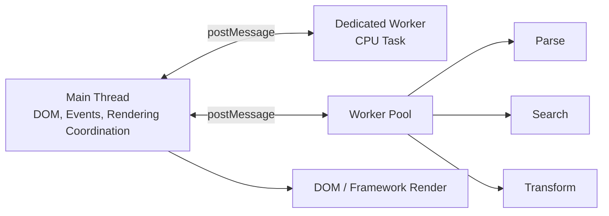
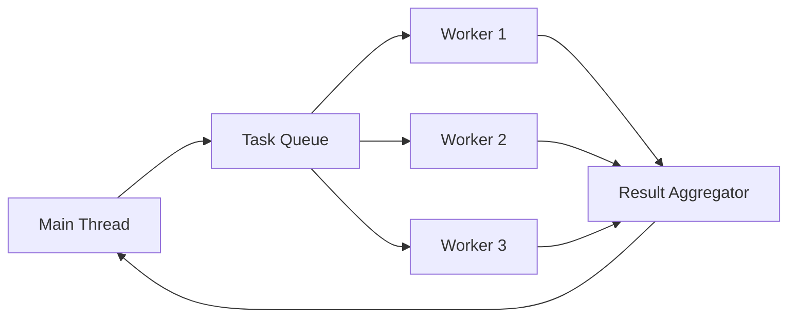
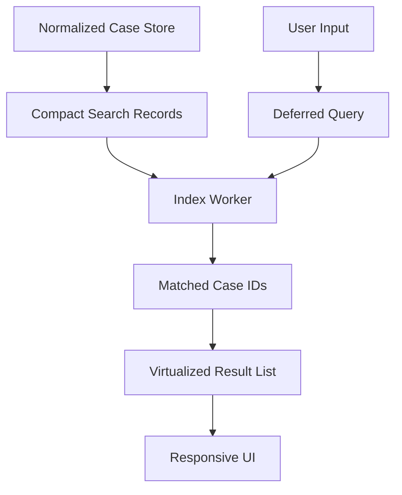

------
title: Learn Advanced JavaScript for Web / Frontend Engineering - Part 022
description: Off-main-thread frontend architecture with Web Workers, transferable objects, structured clone, SharedArrayBuffer, Atomics, OffscreenCanvas, and WebAssembly integration.
series: learn-javascript-frontend-advanced
seriesTitle: Learn Advanced JavaScript for Web / Frontend Engineering
order: 22
partTitle: Web Workers, WASM, and Off-Main-Thread Architecture
tags:
  - javascript
  - frontend
  - web-workers
  - wasm
  - webassembly
  - performance
  - concurrency
  - off-main-thread
  - sharedarraybuffer
  - series
date: 2026-06-27
---

# Part 022 — Web Workers, WASM, and Off-Main-Thread Architecture

> Target part ini: kamu mampu memindahkan pekerjaan berat keluar dari main thread tanpa menciptakan arsitektur yang lebih lambat, lebih sulit di-debug, atau salah secara concurrency.

Part 020 membahas profiling JavaScript di main thread. Part 021 membahas network delivery. Part ini membahas keputusan berikutnya saat bottleneck memang berasal dari kerja CPU, parsing, transformasi data, encoding, image processing, atau komputasi berat:

```txt
Haruskah pekerjaan ini tetap di main thread, dipecah menjadi chunks, dipindahkan ke Worker, atau ditulis sebagai WebAssembly?
```

Jawaban yang matang tidak dimulai dari “pakai Worker”. Jawaban yang matang dimulai dari model biaya.

---

## 1. Kaufman Skill Framing

### 1.1 Deconstruct the Skill

Off-main-thread engineering terdiri dari sub-skill:

1. memahami main thread ownership atas UI;
2. memahami batas Worker: tidak punya DOM langsung;
3. memahami structured clone;
4. memahami transferable objects;
5. memahami cost message passing;
6. mendesain task protocol;
7. mendesain cancellation dan timeout;
8. mendesain progress reporting;
9. memahami worker pool;
10. memahami SharedArrayBuffer dan Atomics;
11. memahami cross-origin isolation requirement;
12. memahami kapan WebAssembly memberi manfaat;
13. memahami overhead JS ↔ WASM boundary;
14. menguji dan mengobservasi worker failure.

### 1.2 Learn Enough to Self-Correct

Sebelum memindahkan pekerjaan ke Worker, tanya:

```txt
1. Apakah bottleneck terbukti CPU/main-thread?
2. Apakah pekerjaan cukup besar untuk membayar biaya message passing?
3. Apakah data yang dikirim besar?
4. Apakah data bisa ditransfer, bukan diclone?
5. Apakah pekerjaan butuh DOM?
6. Apakah hasil harus sinkron untuk render berikutnya?
7. Apakah cancellation diperlukan?
8. Apakah ordering hasil penting?
9. Apakah Worker lifecycle jelas?
10. Apakah error dan telemetry tersedia?
```

### 1.3 Remove Practice Barriers

Untuk latihan:

- gunakan Chrome DevTools Performance panel;
- gunakan Performance monitor atau Task Manager browser;
- buat dataset JSON besar;
- buat fungsi CPU-bound seperti fuzzy search, diffing, parsing, image transform;
- bandingkan main thread vs Worker;
- ukur cost clone vs transfer;
- catat before/after INP dan long task.

### 1.4 Practice Loop

```txt
Profile → isolate CPU task → define worker protocol → measure clone/transfer overhead → add cancellation/error handling → compare field-like interaction behavior.
```

---

## 2. Mental Model: Main Thread Is the UI Coordinator

Browser main thread menangani banyak hal:

- menjalankan JavaScript UI;
- memproses event input;
- menghitung style/layout;
- menyiapkan paint;
- menjalankan framework render/hydration;
- memproses DOM update;
- menjalankan timer/callback;
- menjalankan sebagian work third-party.

Jika main thread sibuk, user melihat:

- input delay;
- animation jank;
- scroll tersendat;
- click tidak responsif;
- hydration lama;
- UI freeze.

Worker memberi thread terpisah untuk JavaScript, tetapi tidak otomatis membuat aplikasi cepat.



Prinsip utama:

```txt
Worker bukan tempat membuang semua logic.
Worker adalah boundary untuk pekerjaan yang bisa berjalan asynchronous, tidak butuh DOM langsung, dan cukup mahal untuk dipindahkan.
```

---

## 3. Types of Workers and Related APIs

### 3.1 Dedicated Worker

Dedicated Worker dimiliki oleh satu page/script context.

Use case:

- parsing file besar;
- fuzzy search;
- image processing;
- data transform;
- compression/decompression;
- expensive validation;
- report generation.

Main:

```js
const worker = new Worker(new URL('./case-search.worker.js', import.meta.url), {
  type: 'module',
});

worker.postMessage({ type: 'PING' });

worker.onmessage = (event) => {
  console.log('Worker response', event.data);
};
```

Worker:

```js
self.onmessage = (event) => {
  if (event.data.type === 'PING') {
    self.postMessage({ type: 'PONG' });
  }
};
```

### 3.2 Shared Worker

Shared Worker dapat diakses oleh beberapa browsing context dari origin yang sama.

Use case:

- koordinasi antar tab;
- shared connection state;
- shared cache computation;
- multi-tab session coordination.

Namun support dan operational complexity perlu dievaluasi. Banyak aplikasi lebih memilih BroadcastChannel, storage event, atau service worker tergantung kebutuhan.

### 3.3 Service Worker

Service Worker adalah worker khusus sebagai network proxy programmable untuk origin.

Use case:

- offline;
- app shell caching;
- background sync;
- push notification;
- request interception;
- cache strategy.

Service Worker bukan general-purpose CPU worker untuk UI task. Ia punya lifecycle dan constraints berbeda.

### 3.4 Worklets

Worklet adalah lightweight execution context untuk area tertentu:

- Paint Worklet;
- Audio Worklet;
- Animation Worklet;
- Layout Worklet, tergantung support.

Gunakan ketika problem cocok dengan pipeline browser spesifik. Jangan pakai worklet sebagai pengganti worker umum.

### 3.5 OffscreenCanvas

OffscreenCanvas memungkinkan rendering canvas dilakukan di luar main thread pada skenario tertentu.

Use case:

- chart besar;
- image manipulation;
- visualization;
- game/animation tertentu;
- rendering preview yang berat.

---

## 4. Worker Boundary Design

Worker boundary harus diperlakukan seperti API internal.

Bad boundary:

```js
worker.postMessage(anything);
```

Good boundary:

```ts
type WorkerRequest =
  | { id: string; type: 'SEARCH_CASES'; query: string; limit: number }
  | { id: string; type: 'PARSE_EXPORT'; buffer: ArrayBuffer }
  | { id: string; type: 'CANCEL'; targetId: string };

type WorkerResponse =
  | { id: string; type: 'SUCCESS'; result: unknown }
  | { id: string; type: 'PROGRESS'; completed: number; total: number }
  | { id: string; type: 'ERROR'; error: SerializedError };
```

Boundary yang baik punya:

- request id;
- explicit operation type;
- typed payload;
- success response;
- error response;
- progress response;
- cancellation semantics;
- versioning bila perlu;
- telemetry hooks.

---

## 5. Structured Clone vs Transferable Objects

### 5.1 Structured Clone

Saat mengirim data ke worker dengan `postMessage`, browser menggunakan structured clone untuk banyak tipe data.

Contoh:

```js
worker.postMessage({
  type: 'PROCESS_ROWS',
  rows: largeRows,
});
```

Ini dapat mahal bila `largeRows` besar karena data dicopy secara mendalam.

### 5.2 Transferable Objects

Transferable object memindahkan ownership resource ke context lain.

Contoh:

```js
const buffer = new ArrayBuffer(1024 * 1024 * 32);

worker.postMessage(
  { type: 'PROCESS_BUFFER', buffer },
  [buffer]
);

console.log(buffer.byteLength); // biasanya 0 setelah transfer
```

Mental model:

```txt
Clone = copy data.
Transfer = move ownership.
Share = same memory visible to multiple agents, requires synchronization.
```

### 5.3 Decision Table

| Data | Recommended Passing Mode | Reason |
|---|---|---|
| Small config object | Clone | Simpler, overhead kecil |
| Large ArrayBuffer | Transfer | Avoid deep copy |
| ImageBitmap | Transfer if supported | Efficient media pipeline |
| Large object graph | Avoid or normalize | Clone expensive |
| Shared numeric buffer | SharedArrayBuffer | Requires synchronization and isolation |
| Functions/classes/DOM nodes | Do not pass | Not cloneable or bad boundary |

---

## 6. Designing a Worker RPC Layer

Raw worker messaging cepat menjadi sulit dikelola. Buat wrapper kecil.

### 6.1 Main Thread Client

```js
export class WorkerClient {
  #worker;
  #pending = new Map();

  constructor(workerUrl) {
    this.#worker = new Worker(workerUrl, { type: 'module' });

    this.#worker.onmessage = (event) => {
      const message = event.data;
      const pending = this.#pending.get(message.id);

      if (!pending) {
        return;
      }

      if (message.type === 'SUCCESS') {
        this.#pending.delete(message.id);
        pending.resolve(message.result);
      }

      if (message.type === 'ERROR') {
        this.#pending.delete(message.id);
        pending.reject(deserializeError(message.error));
      }

      if (message.type === 'PROGRESS') {
        pending.onProgress?.(message);
      }
    };
  }

  request(type, payload, options = {}) {
    const id = crypto.randomUUID();
    const { transfer = [], signal, onProgress } = options;

    if (signal?.aborted) {
      return Promise.reject(new DOMException('Aborted', 'AbortError'));
    }

    const promise = new Promise((resolve, reject) => {
      this.#pending.set(id, { resolve, reject, onProgress });
    });

    const abort = () => {
      this.#worker.postMessage({ id: crypto.randomUUID(), type: 'CANCEL', targetId: id });
      this.#pending.delete(id);
    };

    signal?.addEventListener('abort', abort, { once: true });

    this.#worker.postMessage({ id, type, payload }, transfer);

    return promise.finally(() => {
      signal?.removeEventListener('abort', abort);
    });
  }

  terminate() {
    this.#worker.terminate();
    for (const pending of this.#pending.values()) {
      pending.reject(new Error('Worker terminated'));
    }
    this.#pending.clear();
  }
}

function deserializeError(error) {
  const result = new Error(error.message);
  result.name = error.name ?? 'WorkerError';
  result.stack = error.stack;
  return result;
}
```

### 6.2 Worker Handler

```js
const cancelled = new Set();

self.onmessage = async (event) => {
  const message = event.data;

  if (message.type === 'CANCEL') {
    cancelled.add(message.targetId);
    return;
  }

  try {
    if (message.type === 'SEARCH_CASES') {
      const result = await searchCases(message.id, message.payload);
      if (!cancelled.has(message.id)) {
        self.postMessage({ id: message.id, type: 'SUCCESS', result });
      }
      return;
    }

    throw new Error(`Unknown worker message type: ${message.type}`);
  } catch (error) {
    self.postMessage({
      id: message.id,
      type: 'ERROR',
      error: serializeError(error),
    });
  } finally {
    cancelled.delete(message.id);
  }
};

async function searchCases(id, { query, rows }) {
  const result = [];

  for (let index = 0; index < rows.length; index++) {
    if (cancelled.has(id)) {
      return [];
    }

    const row = rows[index];
    if (matches(row, query)) {
      result.push(row.id);
    }

    if (index % 1000 === 0) {
      self.postMessage({
        id,
        type: 'PROGRESS',
        completed: index,
        total: rows.length,
      });

      await yieldToWorkerLoop();
    }
  }

  return result;
}

function yieldToWorkerLoop() {
  return new Promise((resolve) => setTimeout(resolve, 0));
}

function serializeError(error) {
  return {
    name: error.name,
    message: error.message,
    stack: error.stack,
  };
}
```

Catatan: worker juga punya event loop. Jika satu task CPU berjalan terlalu lama, worker tidak bisa memproses cancel message sampai task yield.

---

## 7. Cancellation, Ordering, and Stale Results

Worker memperkenalkan concurrency. Concurrency memperkenalkan stale result.

Contoh problem:

```txt
User mengetik: a → ab → abc
Request worker untuk "a" selesai terakhir.
UI menampilkan hasil "a" padahal input sekarang "abc".
```

Mitigasi di main thread:

```js
let latestSearchVersion = 0;

async function runSearch(query) {
  const version = ++latestSearchVersion;

  const result = await workerClient.request('SEARCH_CASES', { query });

  if (version !== latestSearchVersion) {
    return;
  }

  renderSearchResult(result);
}
```

Atau gunakan `AbortController` dan worker-side cancellation.

---

## 8. Worker Pool

Satu worker cukup untuk banyak kasus. Worker pool berguna jika:

- task CPU banyak dan independen;
- workload dapat dipartisi;
- device punya core cukup;
- overhead scheduling tidak lebih besar dari manfaat.

Jangan membuat pool sebesar `navigator.hardwareConcurrency` secara buta. Browser, OS, tab lain, dan main thread juga butuh CPU.

Heuristic:

```js
const logicalCores = navigator.hardwareConcurrency ?? 4;
const poolSize = Math.max(1, Math.min(4, logicalCores - 1));
```

### 8.1 Work Queue



### 8.2 Pool Risks

- CPU contention;
- memory duplication;
- ordering complexity;
- cancellation complexity;
- mobile battery drain;
- difficult profiling;
- worse performance on low-end devices.

Production approach:

```txt
Start with one worker.
Measure.
Add pool only when task parallelism is proven.
Limit pool size.
Expose kill switch/feature flag for heavy worker mode.
```

---

## 9. SharedArrayBuffer and Atomics

### 9.1 When Shared Memory Matters

SharedArrayBuffer allows memory shared between agents. This avoids clone/transfer for repeated communication but introduces synchronization complexity.

Use cases:

- high-frequency numeric computation;
- audio/video processing;
- WASM threads;
- ring buffers;
- low-latency producer/consumer;
- advanced visualization pipelines.

Not good for:

- ordinary UI state;
- form state;
- typical API data;
- small request/response worker tasks;
- business workflow state.

### 9.2 Cross-Origin Isolation

SharedArrayBuffer availability in browsers is constrained by security requirements. In modern browser environments, using it for high-resolution shared memory scenarios commonly requires cross-origin isolation through headers such as:

```http
Cross-Origin-Opener-Policy: same-origin
Cross-Origin-Embedder-Policy: require-corp
```

This affects embedding and third-party resources.

Before adopting SharedArrayBuffer, audit:

```txt
1. Are all subresources compatible with COEP?
2. Do third-party scripts/images/fonts send required headers?
3. Does the app embed cross-origin iframes?
4. Does any product flow rely on being opened by another origin?
5. Can deployment/CDN consistently set headers?
```

### 9.3 Atomics

Atomics provide synchronization operations.

Example conceptual flag:

```js
const shared = new SharedArrayBuffer(Int32Array.BYTES_PER_ELEMENT);
const flag = new Int32Array(shared);

// Worker A
Atomics.store(flag, 0, 1);
Atomics.notify(flag, 0);

// Worker B
Atomics.wait(flag, 0, 0);
console.log('flag changed');
```

Use Atomics carefully. This is no longer ordinary frontend programming; it is concurrent systems programming.

---

## 10. WebAssembly Mental Model

WebAssembly is useful when:

- you have CPU-heavy code;
- the algorithm benefits from lower-level execution;
- you can reuse Rust/C/C++/Go/AssemblyScript code;
- data can be represented efficiently in linear memory;
- JS ↔ WASM boundary crossings are controlled;
- startup/compile cost is acceptable;
- bundle size is acceptable.

WebAssembly is not automatically faster for every task.

### 10.1 JS vs WASM Decision Table

| Problem | JS | Worker | WASM | Worker + WASM |
|---|---|---|---|---|
| Small UI calculation | Good | Overkill | Overkill | Overkill |
| Large JSON transform | Maybe | Good | Usually not unless numeric/structured | Maybe |
| Fuzzy search over many records | Maybe | Good | Maybe | Good if algorithm benefits |
| Image processing | Maybe slow | Good | Good | Often best |
| Crypto/compression | Maybe Web Crypto native better | Maybe | Good if custom | Good |
| Regex/string-heavy UI logic | Often JS good | Maybe | Not always | Depends |
| CAD/visualization/math | Maybe | Good | Good | Often best |

### 10.2 WASM Linear Memory

WASM uses linear memory. Passing rich JS objects into WASM usually requires serialization or copying into memory.

Bad expectation:

```txt
I can pass my complex JavaScript object graph into WASM and it will magically be faster.
```

Better model:

```txt
Represent data as typed arrays or compact binary format.
Minimize boundary crossings.
Batch work.
Return compact result.
```

### 10.3 Boundary Crossing

Bad:

```txt
Call WASM once per row for 100,000 rows.
```

Better:

```txt
Copy/transfer data once.
Call WASM once for a batch.
Return compact summary.
```

### 10.4 WASM Startup Cost

Costs include:

- download;
- compile;
- instantiate;
- memory allocation;
- glue code initialization;
- possible worker startup.

For small tasks, this overhead can dominate.

---

## 11. OffscreenCanvas Pattern

Main thread:

```js
const canvas = document.querySelector('canvas');
const offscreen = canvas.transferControlToOffscreen();

const worker = new Worker(new URL('./chart-renderer.worker.js', import.meta.url), {
  type: 'module',
});

worker.postMessage(
  {
    type: 'INIT_CANVAS',
    canvas: offscreen,
    width: canvas.clientWidth,
    height: canvas.clientHeight,
  },
  [offscreen]
);
```

Worker:

```js
self.onmessage = (event) => {
  const message = event.data;

  if (message.type === 'INIT_CANVAS') {
    const ctx = message.canvas.getContext('2d');
    renderChart(ctx, message.width, message.height);
  }
};
```

Use this when canvas rendering itself is heavy and can be decoupled from DOM.

---

## 12. Data Modeling for Worker Tasks

Worker-friendly data is:

- serializable;
- compact;
- stable;
- detached from DOM/framework objects;
- preferably transferable for large binary data;
- not tied to closures or class instances.

Bad payload:

```js
worker.postMessage({
  componentInstance,
  domNode,
  store,
  callback: () => {},
  rowsWithMethods,
});
```

Good payload:

```js
worker.postMessage({
  type: 'BUILD_INDEX',
  records: rows.map((row) => ({
    id: row.id,
    title: row.title,
    status: row.status,
    assignee: row.assigneeName,
  })),
});
```

Even better for very large data:

```js
const encoded = new TextEncoder().encode(JSON.stringify(compactRecords));

worker.postMessage(
  { type: 'BUILD_INDEX_BUFFER', buffer: encoded.buffer },
  [encoded.buffer]
);
```

Measure. Encoding can also be expensive.

---

## 13. Error Handling

Worker errors can disappear if not handled.

Main:

```js
worker.onerror = (event) => {
  reportWorkerError({
    message: event.message,
    filename: event.filename,
    lineno: event.lineno,
    colno: event.colno,
  });
};

worker.onmessageerror = (event) => {
  reportWorkerError({
    message: 'Worker message could not be deserialized',
    dataType: typeof event.data,
  });
};
```

Worker:

```js
self.addEventListener('unhandledrejection', (event) => {
  self.postMessage({
    id: 'global',
    type: 'ERROR',
    error: {
      name: 'UnhandledRejection',
      message: String(event.reason?.message ?? event.reason),
    },
  });
});
```

Production telemetry should include:

- worker script version;
- build id;
- operation type;
- duration;
- payload size category;
- browser;
- device memory/hardware concurrency where allowed;
- failure reason;
- cancellation count;
- timeout count.

---

## 14. Timeouts and Circuit Breakers

Worker task bisa hang karena bug atau pathological input.

```js
function withTimeout(promise, ms, onTimeout) {
  let timeoutId;

  const timeout = new Promise((_, reject) => {
    timeoutId = setTimeout(() => {
      onTimeout?.();
      reject(new Error(`Worker task timed out after ${ms}ms`));
    }, ms);
  });

  return Promise.race([promise, timeout]).finally(() => {
    clearTimeout(timeoutId);
  });
}
```

Untuk task yang benar-benar stuck, cancellation message mungkin tidak diproses. Kadang satu-satunya recovery adalah terminate worker.

```js
worker.terminate();
```

Buat worker lifecycle bisa dibuat ulang.

---

## 15. Profiling Worker Work

### 15.1 What to Measure

Ukur:

- main-thread long task sebelum/sesudah;
- INP sebelum/sesudah;
- worker task duration;
- serialization time;
- transfer time;
- memory impact;
- startup time;
- first result time;
- cancellation responsiveness.

### 15.2 Mark and Measure

Main:

```js
performance.mark('search-worker-start');

const result = await workerClient.request('SEARCH_CASES', { query, rows });

performance.mark('search-worker-end');
performance.measure('search-worker', 'search-worker-start', 'search-worker-end');
```

Worker:

```js
const startedAt = performance.now();
const result = search(payload);
const duration = performance.now() - startedAt;

self.postMessage({
  id,
  type: 'SUCCESS',
  result,
  meta: { duration },
});
```

### 15.3 Success Criteria

Worker migration berhasil jika:

```txt
[ ] Main-thread long tasks berkurang.
[ ] Interaction delay membaik.
[ ] Total user-perceived latency tidak memburuk signifikan.
[ ] Memory tidak naik berbahaya.
[ ] Cancellation benar.
[ ] Error handling benar.
[ ] Fallback tersedia.
```

Jika UI tetap lambat karena rendering hasil terlalu besar, Worker tidak menyelesaikan akar masalah.

---

## 16. Common Patterns

### 16.1 Search Index Worker

Pattern:

```txt
Main loads records → Worker builds index → Main sends query → Worker returns ids → Main renders visible rows only.
```

Jangan return seluruh row jika main thread sudah punya normalized map.

```js
// Worker returns ids only.
self.postMessage({
  id,
  type: 'SUCCESS',
  result: { ids: matchedIds },
});
```

### 16.2 File Import Worker

Pattern:

```txt
User selects file → Main transfers ArrayBuffer → Worker parses/validates chunks → Worker reports progress → Main shows summary → User confirms import.
```

Important:

- never block UI during parse;
- validate in chunks;
- report errors with row/field context;
- support cancellation;
- avoid storing full invalid file in memory twice.

### 16.3 Diff Worker

Pattern:

```txt
Main sends two snapshots → Worker computes diff → Main renders virtualized diff view.
```

For large snapshots, avoid object graph clone. Use compact representation.

### 16.4 Image Processing Worker

Pattern:

```txt
Main creates ImageBitmap/File buffer → transfer to Worker → process using OffscreenCanvas/WASM → return Blob/bitmap/result metadata.
```

---

## 17. Anti-Patterns

### 17.1 Worker for Tiny Work

If work takes 2ms, moving it to Worker can make it slower.

```txt
Worker overhead > computation cost.
```

### 17.2 Passing Huge Object Graphs

Structured clone of large nested objects can create a new bottleneck.

### 17.3 No Cancellation

Search/autocomplete/import tasks without cancellation often produce stale UI and wasted CPU.

### 17.4 Worker Owns Business Truth

Worker should not secretly own domain state that UI and backend also own.

Better:

```txt
Worker computes derived result.
Main/application state owns source of truth.
```

### 17.5 Ignoring Low-End Devices

A worker pool that improves desktop may hurt mobile due to CPU/battery/memory contention.

### 17.6 WASM as Performance Decoration

WASM is not a badge. It must earn its complexity.

---

## 18. Framework Integration

### 18.1 React/Vue/Svelte Boundary

Do not pass component state objects directly. Extract plain data.

React example:

```js
const searchInput = useDeferredValue(input);

useEffect(() => {
  const controller = new AbortController();

  workerClient
    .request('SEARCH_CASES', { query: searchInput }, { signal: controller.signal })
    .then((result) => {
      setMatchedIds(result.ids);
    })
    .catch((error) => {
      if (error.name !== 'AbortError') {
        setError(error);
      }
    });

  return () => controller.abort();
}, [searchInput]);
```

This keeps UI reactive while expensive search is outside main thread.

### 18.2 Server Components and Workers

Server Components solve server/client boundary and reduce client JS. They do not replace Worker for client-side CPU tasks.

Decision:

```txt
Can the work happen on server before sending UI?
  Yes → server/SSR/RSC might be better.
  No, because it uses local file/device/user interaction → Worker may be better.
```

---

## 19. Security and Policy

Worker scripts are code. Treat them like application code.

Checklist:

```txt
[ ] Worker script path controlled.
[ ] CSP allows only intended worker sources.
[ ] User-provided files parsed defensively.
[ ] WASM module source trusted.
[ ] Cross-origin isolation headers tested if using SharedArrayBuffer.
[ ] Third-party resources compatible with COOP/COEP.
[ ] Error messages do not leak sensitive data.
[ ] Worker does not bypass authorization assumptions.
```

CSP example concept:

```http
Content-Security-Policy: default-src 'self'; script-src 'self'; worker-src 'self';
```

Adapt to actual app requirements.

---

## 20. Case Study: Regulatory Case Search UI

### 20.1 Problem

A case management frontend has 80,000 locally available case summaries for offline-capable search.

Symptoms:

- typing freezes after 2 characters;
- INP poor on low-end laptops;
- main thread shows long tasks > 400ms;
- search result rendering also heavy.

### 20.2 Bad Fix

```txt
Add debounce 500ms.
```

This hides some symptoms but makes search feel delayed and does not reduce worst-case CPU enough.

### 20.3 Better Architecture



### 20.4 Invariants

```txt
1. Main thread owns source case data.
2. Worker owns derived search index.
3. Worker returns ids, not full records.
4. Newer query result must win over older query result.
5. Index rebuild must be cancellable or versioned.
6. Result rendering must be virtualized.
```

### 20.5 Result

A successful refactor should show:

- fewer main-thread long tasks;
- improved typing responsiveness;
- bounded memory overhead;
- predictable stale-result handling;
- easier profiling.

---

## 21. Decision Framework

```txt
Is the task user-visible and synchronous with immediate render?
  Yes → keep small, schedule/yield, reduce work.
  No → continue.

Is the task CPU-heavy and independent of DOM?
  No → Worker may not fit.
  Yes → continue.

Is payload small or transferable?
  No → redesign payload first.
  Yes → continue.

Is the algorithm simple JS enough?
  Yes → Worker with JS likely enough.
  No → evaluate WASM.

Does WASM reduce total latency after startup and boundary cost?
  No → do not use WASM.
  Yes → use Worker + WASM for isolation.
```

---

## 22. Engineering Checklist

Before adopting Worker/WASM:

```txt
[ ] Bottleneck proven with profiling.
[ ] Task does not need DOM.
[ ] Payload is clone-safe or transferable.
[ ] Message protocol typed and versionable.
[ ] Request id exists.
[ ] Cancellation exists where needed.
[ ] Stale result handling exists.
[ ] Error handling exists.
[ ] Timeout/recovery exists.
[ ] Worker lifecycle clear.
[ ] Memory impact measured.
[ ] Low-end device tested.
[ ] Main-thread render of results measured.
[ ] Security/CSP considered.
[ ] SharedArrayBuffer isolation requirements understood if used.
[ ] WASM startup/boundary cost measured if used.
```

---

## 23. Exercises

### Exercise 1 — Main Thread vs Worker

Buat fungsi filtering 100,000 records.

Measure:

- main thread duration;
- input responsiveness;
- worker duration;
- structured clone cost;
- total time to show result.

Tulis conclusion:

```txt
Apakah Worker memperbaiki user experience atau hanya memindahkan waktu tunggu?
```

### Exercise 2 — Transfer vs Clone

Kirim `ArrayBuffer` 50MB ke worker:

1. tanpa transfer list;
2. dengan transfer list.

Bandingkan:

- duration;
- memory;
- usability of original buffer after transfer.

### Exercise 3 — Cancellation

Buat search worker. Ketik cepat `a`, `ab`, `abc`, `abcd`.

Pastikan:

- hasil lama tidak pernah menimpa hasil baru;
- task lama tidak terus menghabiskan CPU;
- UI tetap responsive.

### Exercise 4 — WASM Evaluation

Pilih satu algoritma CPU-heavy. Implementasikan:

- JS main thread;
- JS worker;
- WASM main thread;
- WASM worker.

Bandingkan total latency, startup cost, memory, dan kompleksitas.

### Exercise 5 — Worker Failure Drill

Simulasikan:

- worker script 404;
- worker throw error;
- message tidak cloneable;
- task hang;
- dynamic import worker gagal setelah deploy.

Pastikan UI punya recovery path.

---

## 24. Summary

Off-main-thread architecture bukan trik performance. Ia adalah keputusan boundary.

Mental model utama:

```txt
Main thread harus tetap responsive.
Worker memindahkan CPU work, tetapi menambah biaya message passing, lifecycle, error handling, cancellation, dan data modeling.
WASM dapat membantu CPU-heavy work, tetapi hanya jika boundary cost dan startup cost terkendali.
```

Engineer top-tier mampu:

- membuktikan bottleneck sebelum migrasi;
- mendesain protocol worker yang eksplisit;
- memilih clone/transfer/share dengan benar;
- menghindari stale result;
- mengukur main-thread improvement;
- memperhitungkan low-end devices;
- menggunakan WASM karena evidence, bukan hype.

Part berikutnya akan masuk ke TypeScript sebagai type system untuk frontend architecture: bukan hanya annotation, tetapi modeling state, API contract, component contract, dan refactoring safety.

---

## References

- MDN Web Docs — Web Workers API.
- MDN Web Docs — Structured clone algorithm.
- MDN Web Docs — Transferable objects.
- MDN Web Docs — SharedArrayBuffer.
- MDN Web Docs — Atomics.
- MDN Web Docs — OffscreenCanvas.
- MDN Web Docs — WebAssembly.
- web.dev and Chrome documentation — performance profiling and main-thread responsiveness.
