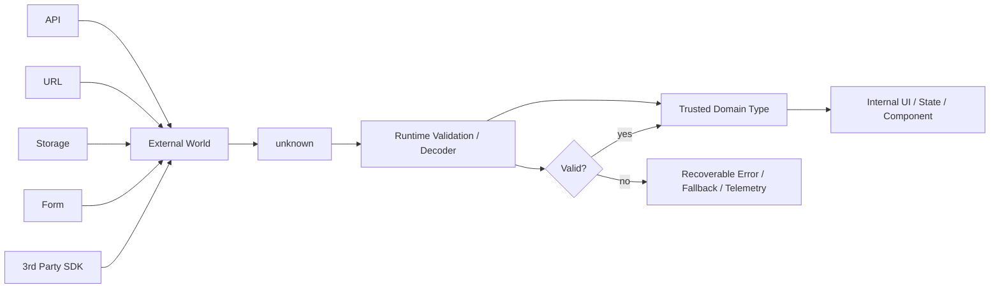
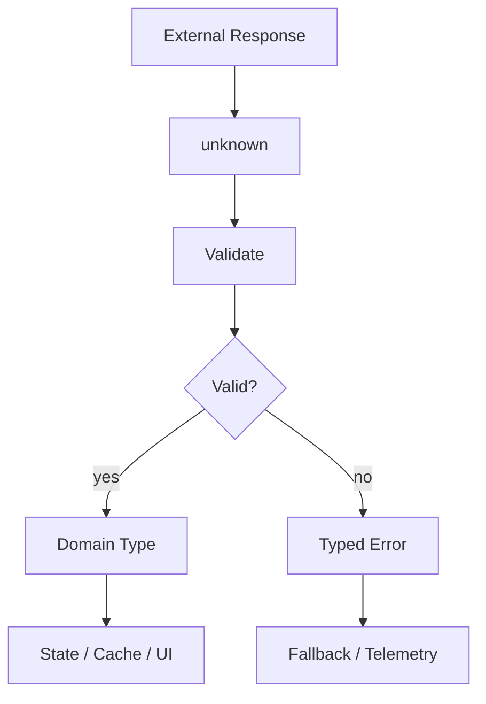

# Part 023 — Type Systems with TypeScript for Frontend

## 1. Posisi Part Ini dalam Roadmap

Kita sudah membahas runtime JavaScript, event loop, async control, browser rendering, state modeling, architecture boundaries, data fetching, routing, rendering strategy, performance, dan off-main-thread architecture.

Part ini membahas **TypeScript sebagai alat engineering untuk menjaga invariant frontend**, bukan sekadar "JavaScript dengan type annotation".

Tujuan akhirnya bukan agar kode terlihat pintar. Tujuannya adalah agar sistem frontend:

1. sulit direpresentasikan dalam state yang salah;
2. mudah direfactor tanpa takut merusak flow bisnis;
3. punya kontrak jelas antar component, feature, API, cache, router, dan form;
4. bisa membedakan error compile-time, runtime, data-contract, dan user-input error;
5. tidak menyembunyikan uncertainty di balik `any`, `as`, atau type yang terlalu longgar.

Untuk engineer yang sudah kuat di Java/Go/.NET, mental model pentingnya adalah ini:

> TypeScript bukan Java. TypeScript adalah **gradual structural type system** di atas JavaScript runtime. Type-nya membantu sebelum runtime, tetapi runtime tetap JavaScript.

Itu berarti type system TypeScript sangat berguna, tetapi tidak otomatis memberi safety seperti bahasa nominal statically typed penuh.

---

## 2. Kaufman Skill Deconstruction

Dalam framework Josh Kaufman, kita pecah skill menjadi sub-skill yang bisa dilatih cepat dan diberi feedback.

Untuk TypeScript frontend, skill besarnya adalah:

> Mampu memodelkan UI, data, async state, domain rule, dan component contract sehingga impossible states makin sulit dibuat dan perubahan sistem makin aman.

### 2.1 Sub-Skill Utama

| Sub-skill | Pertanyaan yang Harus Bisa Dijawab |
|---|---|
| Type mental model | Apa bedanya static type, runtime value, narrowing, widening, structural typing, dan inference? |
| Domain modeling | Bagaimana memodelkan workflow UI dengan union, state machine, branded type, dan invariant? |
| Runtime boundary | Kapan compile-time type tidak cukup dan perlu runtime validation? |
| Component contract | Bagaimana mendesain props agar misuse sulit terjadi? |
| API typing | Bagaimana menjaga kontrak response API, error shape, pagination, dan permissions? |
| Generic design | Kapan generics meningkatkan reuse dan kapan justru membuat API sulit dipahami? |
| Refactoring | Bagaimana type system membantu migrasi besar secara bertahap? |
| Escape hatch control | Kapan boleh memakai `unknown`, `any`, `as`, non-null assertion, dan `satisfies`? |

### 2.2 Practice Loop

Latihan efektif bukan "menambahkan type ke semua function". Latihan yang lebih tepat:

1. ambil flow UI nyata;
2. identifikasi state yang valid dan invalid;
3. ubah state menjadi discriminated union;
4. pindahkan parsing external data ke boundary;
5. buat component API yang tidak menerima kombinasi props invalid;
6. refactor tanpa test manual besar;
7. ukur: berapa banyak bug yang sekarang menjadi compile error?

---

## 3. Mental Model: TypeScript Tidak Mengubah Runtime

TypeScript type dihapus saat build. Browser tidak menjalankan type. Yang berjalan tetap JavaScript.

```ts
function formatPrice(value: number) {
  return value.toFixed(2);
}
```

Saat runtime, `number` tidak ada. Jika data dari API ternyata string, runtime tetap bisa crash.

```ts
const response = await fetch("/api/price");
const data = await response.json();

// Ini compile jika kita paksa type, tetapi belum tentu benar saat runtime.
const price = data.price as number;
formatPrice(price);
```

Masalahnya bukan TypeScript lemah. Masalahnya adalah kita menaruh kepercayaan di boundary yang belum divalidasi.

### 3.1 Aturan Emas

> TypeScript dapat menjaga data yang sudah masuk ke model internal, tetapi tidak dapat menjamin kebenaran data external tanpa runtime validation.

External boundary meliputi:

- HTTP API response;
- URL query params;
- localStorage/sessionStorage;
- postMessage;
- Web Worker message;
- BroadcastChannel;
- feature flag service;
- CMS content;
- form input;
- third-party SDK;
- server-rendered serialized state;
- data dari DOM attribute;
- file upload.

Semua boundary itu harus dianggap `unknown` sampai dibuktikan.

```ts
const raw: unknown = await response.json();
```

Baru setelah validasi, data boleh menjadi domain type.

```ts
type Money = {
  amount: number;
  currency: "IDR" | "USD" | "EUR";
};

function isMoney(value: unknown): value is Money {
  if (typeof value !== "object" || value === null) return false;

  const record = value as Record<string, unknown>;

  return (
    typeof record.amount === "number" &&
    ["IDR", "USD", "EUR"].includes(record.currency as string)
  );
}
```

### 3.2 Diagram Boundary



---

## 4. Structural Typing: Bukan Nominal Typing

TypeScript memakai structural typing. Dua object compatible jika bentuknya compatible, bukan karena berasal dari class/type yang sama.

```ts
type UserId = string;
type ProductId = string;

function loadUser(id: UserId) {
  // ...
}

const productId: ProductId = "p_123";
loadUser(productId); // Compile, karena keduanya string.
```

Ini berbeda dari bahasa nominal seperti Java class tertentu atau opaque type tertentu.

### 4.1 Branded Type untuk Domain Identifier

Untuk menghindari tertukarnya ID, pakai branded type.

```ts
type Brand<T, Name extends string> = T & { readonly __brand: Name };

export type UserId = Brand<string, "UserId">;
export type ProductId = Brand<string, "ProductId">;

function toUserId(value: string): UserId {
  if (!value.startsWith("usr_")) {
    throw new Error("Invalid user id");
  }

  return value as UserId;
}

function loadUser(id: UserId) {
  // ...
}

const raw = "usr_123";
const userId = toUserId(raw);
loadUser(userId);
```

Sekarang `ProductId` tidak bisa sembarang masuk ke function yang membutuhkan `UserId`.

### 4.2 Kapan Branded Type Layak?

Gunakan branded type untuk value yang:

- bentuk primitive-nya sama, tetapi makna domainnya berbeda;
- salah pakai bisa menyebabkan data leak, permission bug, atau corruption;
- sering berpindah antar boundary;
- dipakai sebagai cache key, route param, atau mutation target.

Contoh yang layak:

```ts
type TenantId = Brand<string, "TenantId">;
type CaseId = Brand<string, "CaseId">;
type WorkflowInstanceId = Brand<string, "WorkflowInstanceId">;
type ISODateString = Brand<string, "ISODateString">;
type EmailAddress = Brand<string, "EmailAddress">;
```

Hindari branding berlebihan untuk value lokal kecil yang tidak punya risiko domain.

---

## 5. Literal Types dan Union sebagai Domain Vocabulary

Frontend sering punya state diskrit:

- loading;
- success;
- empty;
- forbidden;
- validation error;
- stale;
- optimistic;
- conflict;
- offline;
- draft;
- submitted.

Jangan modelkan ini sebagai boolean acak.

### 5.1 Boolean Explosion

Contoh buruk:

```ts
type ViewState = {
  isLoading: boolean;
  isError: boolean;
  isEmpty: boolean;
  isForbidden: boolean;
  data?: Case[];
  error?: Error;
};
```

State ini mengizinkan kombinasi mustahil:

```ts
const impossible: ViewState = {
  isLoading: true,
  isError: true,
  isEmpty: true,
  data: [{ id: "case_1" } as Case],
};
```

Kalau state mustahil bisa direpresentasikan, UI eventually akan menampilkan kondisi yang salah.

### 5.2 Discriminated Union

Model yang lebih aman:

```ts
type CasesViewState =
  | { status: "idle" }
  | { status: "loading" }
  | { status: "success"; data: Case[] }
  | { status: "empty" }
  | { status: "forbidden"; reason: string }
  | { status: "error"; error: Error };
```

Sekarang setiap state membawa data yang relevan untuk status tersebut.

```ts
function renderCases(state: CasesViewState) {
  switch (state.status) {
    case "idle":
      return "Ready";
    case "loading":
      return "Loading";
    case "success":
      return `${state.data.length} cases`;
    case "empty":
      return "No cases";
    case "forbidden":
      return `Forbidden: ${state.reason}`;
    case "error":
      return state.error.message;
  }
}
```

TypeScript melakukan narrowing berdasarkan discriminant `status`.

### 5.3 Exhaustiveness Check

Tambahkan compile-time guard agar penambahan status baru memaksa semua consumer diperbarui.

```ts
function assertNever(value: never): never {
  throw new Error(`Unexpected value: ${JSON.stringify(value)}`);
}

function renderCases(state: CasesViewState) {
  switch (state.status) {
    case "idle":
      return "Ready";
    case "loading":
      return "Loading";
    case "success":
      return `${state.data.length} cases`;
    case "empty":
      return "No cases";
    case "forbidden":
      return `Forbidden: ${state.reason}`;
    case "error":
      return state.error.message;
    default:
      return assertNever(state);
  }
}
```

Jika nanti ditambah:

```ts
type CasesViewState =
  | { status: "idle" }
  | { status: "loading" }
  | { status: "success"; data: Case[] }
  | { status: "empty" }
  | { status: "forbidden"; reason: string }
  | { status: "stale"; data: Case[] }
  | { status: "error"; error: Error };
```

Maka switch yang belum menangani `stale` akan gagal compile.

---

## 6. Modeling Async State

Async frontend bukan cuma `loading | error | data`. Production async state sering lebih kompleks.

Misalnya, data table workflow bisa punya:

- initial loading;
- loaded;
- refreshing;
- failed initial load;
- failed background refresh;
- optimistic mutation;
- conflict;
- forbidden;
- offline;
- partial data.

### 6.1 Naive Async Type

```ts
type AsyncState<T> = {
  loading: boolean;
  data?: T;
  error?: Error;
};
```

Ini terlalu lemah.

### 6.2 Better Async State

```ts
type AsyncState<T, E = Error> =
  | { status: "idle" }
  | { status: "loading" }
  | { status: "success"; data: T; refreshedAt: Date }
  | { status: "refreshing"; data: T; refreshedAt: Date }
  | { status: "error"; error: E }
  | { status: "refresh-error"; data: T; error: E; refreshedAt: Date };
```

Perhatikan perbedaan penting:

- `error` tanpa data berbeda dari `refresh-error` dengan stale data;
- `loading` awal berbeda dari `refreshing` setelah data ada;
- UI bisa menampilkan stale data sambil memberi warning.

### 6.3 Type Utility untuk Derived State

```ts
function hasData<T, E>(state: AsyncState<T, E>): state is Extract<AsyncState<T, E>, { data: T }> {
  return "data" in state;
}

function canRenderContent<T, E>(state: AsyncState<T, E>) {
  return hasData(state);
}
```

Tetapi hati-hati: terlalu banyak utility type guard bisa menyembunyikan branch domain yang seharusnya eksplisit.

---

## 7. TypeScript untuk Workflow State Machine

Frontend enterprise sering mempresentasikan workflow: enforcement lifecycle, approval, onboarding, dispute, checkout, case management, review queue.

Jangan modelkan workflow sebagai string longgar.

### 7.1 State dan Event

```ts
type CaseState =
  | { value: "draft"; editable: true }
  | { value: "submitted"; submittedAt: Date }
  | { value: "under-review"; assignedReviewerId: UserId }
  | { value: "needs-info"; requestedFields: string[] }
  | { value: "approved"; approvedAt: Date }
  | { value: "rejected"; reason: string };

type CaseEvent =
  | { type: "submit" }
  | { type: "assign-reviewer"; reviewerId: UserId }
  | { type: "request-info"; fields: string[] }
  | { type: "approve" }
  | { type: "reject"; reason: string }
  | { type: "resubmit" };
```

### 7.2 Transition Function

```ts
function transition(state: CaseState, event: CaseEvent): CaseState {
  switch (state.value) {
    case "draft":
      if (event.type === "submit") {
        return { value: "submitted", submittedAt: new Date() };
      }
      return state;

    case "submitted":
      if (event.type === "assign-reviewer") {
        return { value: "under-review", assignedReviewerId: event.reviewerId };
      }
      return state;

    case "under-review":
      if (event.type === "request-info") {
        return { value: "needs-info", requestedFields: event.fields };
      }
      if (event.type === "approve") {
        return { value: "approved", approvedAt: new Date() };
      }
      if (event.type === "reject") {
        return { value: "rejected", reason: event.reason };
      }
      return state;

    case "needs-info":
      if (event.type === "resubmit") {
        return { value: "submitted", submittedAt: new Date() };
      }
      return state;

    case "approved":
    case "rejected":
      return state;

    default:
      return assertNever(state);
  }
}
```

### 7.3 Apa yang Belum Aman?

Function di atas masih mengizinkan event yang tidak relevan masuk, lalu diabaikan.

Untuk beberapa domain, itu acceptable. Untuk domain kritis, kita bisa modelkan allowed events berdasarkan state.

```ts
type EventsFor<S extends CaseState["value"]> =
  S extends "draft"
    ? Extract<CaseEvent, { type: "submit" }>
    : S extends "submitted"
      ? Extract<CaseEvent, { type: "assign-reviewer" }>
      : S extends "under-review"
        ? Extract<CaseEvent, { type: "request-info" | "approve" | "reject" }>
        : S extends "needs-info"
          ? Extract<CaseEvent, { type: "resubmit" }>
          : never;
```

Namun jangan over-engineer. Kalau type terlalu kompleks sampai tim tidak bisa membaca, type system berubah dari safety net menjadi accidental complexity.

---

## 8. Component Props Contract

Component API adalah public API internal. Salah desain props menyebabkan misuse menyebar ke banyak call site.

### 8.1 Anti-Pattern: Props Kombinasi Invalid

```tsx
type ButtonProps = {
  label: string;
  href?: string;
  onClick?: () => void;
  disabled?: boolean;
  loading?: boolean;
  variant?: "primary" | "secondary" | "danger";
};
```

Apa masalahnya?

- `href` dan `onClick` bisa ada bersamaan;
- `disabled` untuk link ambigu;
- `loading` dengan `href` mungkin tidak masuk akal;
- button submit tidak dimodelkan;
- accessibility state tidak eksplisit.

### 8.2 Discriminated Props

```tsx
type BaseButtonProps = {
  label: string;
  variant?: "primary" | "secondary" | "danger";
};

type ActionButtonProps = BaseButtonProps & {
  kind: "action";
  onClick: () => void;
  disabled?: boolean;
  loading?: boolean;
};

type LinkButtonProps = BaseButtonProps & {
  kind: "link";
  href: string;
  external?: boolean;
};

type SubmitButtonProps = BaseButtonProps & {
  kind: "submit";
  formId?: string;
  disabled?: boolean;
  loading?: boolean;
};

type ButtonProps = ActionButtonProps | LinkButtonProps | SubmitButtonProps;
```

```tsx
function Button(props: ButtonProps) {
  switch (props.kind) {
    case "action":
      return (
        <button type="button" disabled={props.disabled || props.loading} onClick={props.onClick}>
          {props.loading ? "Loading..." : props.label}
        </button>
      );

    case "submit":
      return (
        <button type="submit" form={props.formId} disabled={props.disabled || props.loading}>
          {props.loading ? "Submitting..." : props.label}
        </button>
      );

    case "link":
      return (
        <a href={props.href} target={props.external ? "_blank" : undefined} rel={props.external ? "noreferrer" : undefined}>
          {props.label}
        </a>
      );

    default:
      return assertNever(props);
  }
}
```

### 8.3 Component Contract Rule

> Jangan biarkan props menerima kombinasi yang component tidak bisa tangani secara benar.

Jika kombinasi tidak valid secara UX, accessibility, atau business rule, encode di type.

---

## 9. Controlled vs Uncontrolled Props

Component sering mendukung mode controlled dan uncontrolled.

### 9.1 Anti-Pattern

```ts
type ToggleProps = {
  checked?: boolean;
  defaultChecked?: boolean;
  onChange?: (checked: boolean) => void;
};
```

Ini mengizinkan mode campur.

### 9.2 Explicit Mode

```ts
type ControlledToggleProps = {
  mode: "controlled";
  checked: boolean;
  onChange: (checked: boolean) => void;
};

type UncontrolledToggleProps = {
  mode: "uncontrolled";
  defaultChecked?: boolean;
  onChange?: (checked: boolean) => void;
};

type ToggleProps = ControlledToggleProps | UncontrolledToggleProps;
```

Atau jika ingin API ergonomic:

```ts
type ControlledToggleProps = {
  checked: boolean;
  onChange: (checked: boolean) => void;
  defaultChecked?: never;
};

type UncontrolledToggleProps = {
  defaultChecked?: boolean;
  checked?: never;
  onChange?: (checked: boolean) => void;
};

type ToggleProps = ControlledToggleProps | UncontrolledToggleProps;
```

`never` di sini mencegah prop tertentu muncul di mode yang salah.

---

## 10. API Response Typing

API response type harus memisahkan:

1. transport success/failure;
2. application success/failure;
3. validation error;
4. authorization error;
5. domain conflict;
6. partial success;
7. pagination state.

### 10.1 Jangan Typing Response Terlalu Naif

```ts
type ApiResponse<T> = {
  data: T;
  error?: string;
};
```

Masalah:

- Apakah `data` ada saat error?
- Apakah error string cukup?
- Apakah unauthorized sama dengan validation error?
- Apakah conflict bisa dipulihkan?
- Apakah response bisa partial?

### 10.2 Typed Result

```ts
type ApiSuccess<T> = {
  ok: true;
  data: T;
  requestId: string;
};

type ApiFailure =
  | {
      ok: false;
      kind: "network";
      message: string;
      retryable: true;
    }
  | {
      ok: false;
      kind: "unauthorized";
      message: string;
      retryable: false;
    }
  | {
      ok: false;
      kind: "forbidden";
      message: string;
      retryable: false;
    }
  | {
      ok: false;
      kind: "validation";
      fieldErrors: Record<string, string[]>;
      retryable: false;
    }
  | {
      ok: false;
      kind: "conflict";
      serverVersion: string;
      message: string;
      retryable: false;
    };

type ApiResult<T> = ApiSuccess<T> | ApiFailure;
```

Consumer sekarang dipaksa menangani error secara eksplisit.

```ts
function getErrorMessage(result: ApiResult<unknown>) {
  if (result.ok) return null;

  switch (result.kind) {
    case "network":
      return "Network issue. Please retry.";
    case "unauthorized":
      return "Please sign in again.";
    case "forbidden":
      return "You do not have access.";
    case "validation":
      return "Please fix the highlighted fields.";
    case "conflict":
      return "This item changed on the server.";
    default:
      return assertNever(result);
  }
}
```

### 10.3 Pagination Type

```ts
type PageCursor = Brand<string, "PageCursor">;

type Page<T> = {
  items: T[];
  nextCursor: PageCursor | null;
  totalCount?: number;
};

type PaginatedResult<T> = ApiResult<Page<T>>;
```

Jangan gunakan `string | null` longgar untuk cursor jika cursor berpindah lintas feature dan cache key.

---

## 11. URL and Route Param Typing

URL adalah external input. Jangan percaya route param.

```ts
function parseCaseId(value: string | null): CaseId | null {
  if (!value) return null;
  if (!/^case_[a-zA-Z0-9]+$/.test(value)) return null;
  return value as CaseId;
}
```

Route loader harus mengubah string menjadi domain type.

```ts
const caseId = parseCaseId(searchParams.get("caseId"));

if (!caseId) {
  return { status: "invalid-route" as const };
}
```

Jangan biarkan component domain menerima `string` biasa jika sebenarnya butuh `CaseId`.

---

## 12. `unknown` vs `any`

`any` mematikan type checking. `unknown` memaksa narrowing.

```ts
function unsafe(value: any) {
  return value.profile.address.city.toUpperCase();
}
```

Compile, tetapi rapuh.

```ts
function safer(value: unknown) {
  if (
    typeof value === "object" &&
    value !== null &&
    "profile" in value
  ) {
    // masih perlu narrowing lebih lanjut
  }
}
```

### 12.1 Rule

Gunakan `unknown` untuk data yang belum dipercaya. Gunakan `any` hanya untuk:

- migrasi legacy sementara;
- boundary library yang benar-benar tidak bisa diketik;
- test spike/prototype;
- escape hatch yang diberi komentar dan issue tracking.

Contoh acceptable:

```ts
// TODO(FE-1289): Replace legacy widget any payload with typed adapter.
function adaptLegacyWidgetPayload(payload: any): WidgetEvent {
  // validation and normalization here
}
```

Tapi `any` harus berhenti di adapter, tidak menyebar ke domain.

---

## 13. Type Assertion: `as` adalah Pinjaman Risiko

`as` bukan validasi. Ia hanya memberi tahu compiler untuk percaya.

```ts
const user = rawUser as User;
```

Kalimat sebenarnya:

> "Saya mengambil alih tanggung jawab dari compiler. Jika salah, runtime yang akan membayar."

### 13.1 Kapan `as` Masuk Akal?

Masuk akal jika:

- baru saja melakukan runtime check;
- TypeScript tidak bisa mengekspresikan invariant yang kita tahu benar;
- binding browser/library typing kurang presisi;
- memakai branded type setelah validasi.

```ts
function toTenantId(value: string): TenantId {
  if (!/^tenant_[a-z0-9]+$/.test(value)) {
    throw new Error("Invalid tenant id");
  }

  return value as TenantId;
}
```

Tidak masuk akal jika dipakai untuk "membungkam error".

---

## 14. `satisfies` untuk Menjaga Shape Tanpa Menghilangkan Literal

`as` sering terlalu memaksa. `satisfies` berguna untuk memastikan object memenuhi contract tanpa kehilangan literal precision.

```ts
type RouteConfig = Record<string, {
  title: string;
  requiresAuth: boolean;
}>;

const routes = {
  dashboard: { title: "Dashboard", requiresAuth: true },
  login: { title: "Login", requiresAuth: false },
} satisfies RouteConfig;
```

Keuntungan:

- compiler mengecek shape;
- key literal `dashboard | login` tetap tersedia;
- tidak memaksa object menjadi `Record<string, ...>` terlalu cepat.

```ts
type RouteName = keyof typeof routes;
```

---

## 15. Generics: Abstraction dengan Parameter

Generics dipakai saat type sebuah function/class/component bergantung pada input atau konfigurasi.

### 15.1 Simple Generic

```ts
function first<T>(items: T[]): T | undefined {
  return items[0];
}
```

### 15.2 Generic API Client

```ts
type Decoder<T> = (value: unknown) => T;

async function getJson<T>(url: string, decode: Decoder<T>): Promise<ApiResult<T>> {
  try {
    const response = await fetch(url);

    if (!response.ok) {
      return {
        ok: false,
        kind: response.status === 401 ? "unauthorized" : "network",
        message: `Request failed with ${response.status}`,
        retryable: response.status >= 500,
      } as ApiFailure;
    }

    const raw: unknown = await response.json();
    const data = decode(raw);

    return {
      ok: true,
      data,
      requestId: response.headers.get("x-request-id") ?? "unknown",
    };
  } catch (error) {
    return {
      ok: false,
      kind: "network",
      message: error instanceof Error ? error.message : "Unknown network error",
      retryable: true,
    };
  }
}
```

Generics di sini useful karena response type bergantung pada decoder.

### 15.3 Generic Component Pitfall

Generic component bisa cepat menjadi sulit dipakai.

```tsx
type SelectProps<T> = {
  items: T[];
  value: T;
  onChange: (value: T) => void;
  getLabel: (item: T) => string;
};
```

Masalah tersembunyi:

- equality `value === item` belum tentu benar;
- object identity bisa berubah setiap fetch;
- serialization ke URL tidak jelas;
- accessibility label dan ID belum stabil.

Lebih production-ready:

```tsx
type SelectOptionId = Brand<string, "SelectOptionId">;

type SelectOption<T> = {
  id: SelectOptionId;
  label: string;
  value: T;
  disabled?: boolean;
};

type SelectProps<T> = {
  options: SelectOption<T>[];
  selectedId: SelectOptionId | null;
  onChange: (option: SelectOption<T>) => void;
};
```

Generic bukan pengganti domain key.

---

## 16. Conditional Types dan Mapped Types

Powerful, tapi harus dipakai hati-hati.

### 16.1 Mapped Type untuk Form Errors

```ts
type FieldErrors<T> = {
  [K in keyof T]?: string[];
};

type CreateCaseInput = {
  title: string;
  description: string;
  assigneeId: UserId | null;
};

type CreateCaseErrors = FieldErrors<CreateCaseInput>;
```

### 16.2 Conditional Type

```ts
type ApiData<T> = T extends ApiSuccess<infer Data> ? Data : never;
```

`infer` bisa mengambil type dari struktur lain.

### 16.3 Rule

Gunakan type-level programming untuk mengurangi duplikasi kontrak, bukan untuk menulis "program kedua" yang lebih sulit dibaca daripada runtime code.

Jika type butuh komentar panjang agar engineer lain paham, pertimbangkan API yang lebih sederhana.

---

## 17. Type-Driven Refactoring

TypeScript sangat berguna saat refactor besar.

### 17.1 Strategy: Make Illegal Usage Fail Compile

Misalnya kita ingin mengganti `status: string` menjadi union.

Sebelum:

```ts
type Task = {
  id: string;
  status: string;
};
```

Sesudah:

```ts
type TaskStatus = "todo" | "in-progress" | "blocked" | "done";

type Task = {
  id: TaskId;
  status: TaskStatus;
};
```

Compile error akan muncul di lokasi-lokasi yang sebelumnya memakai status arbitrary.

### 17.2 Migration Adapter

Untuk API lama:

```ts
function parseTaskStatus(value: unknown): TaskStatus {
  switch (value) {
    case "todo":
    case "in-progress":
    case "blocked":
    case "done":
      return value;
    default:
      return "todo";
  }
}
```

Ini membuat ketidakpastian berhenti di boundary.

### 17.3 Refactoring Playbook

1. Tambahkan type baru.
2. Tambahkan adapter dari legacy shape.
3. Ubah internal domain memakai type baru.
4. Biarkan compile error menunjukkan call site.
5. Perbaiki call site dari boundary ke leaf.
6. Hapus compatibility layer setelah migration selesai.

---

## 18. Compiler Configuration sebagai Policy

`tsconfig.json` bukan formalitas. Ia adalah policy engineering.

Minimal untuk codebase serius:

```json
{
  "compilerOptions": {
    "strict": true,
    "noImplicitOverride": true,
    "noUncheckedIndexedAccess": true,
    "exactOptionalPropertyTypes": true,
    "useUnknownInCatchVariables": true,
    "noFallthroughCasesInSwitch": true,
    "noImplicitReturns": true
  }
}
```

### 18.1 Flag Penting

| Flag | Mengapa Penting |
|---|---|
| `strict` | Mengaktifkan mode type checking lebih aman. |
| `noUncheckedIndexedAccess` | Akses array/object index menjadi mungkin `undefined`. Cocok untuk frontend yang banyak membaca map/cache. |
| `exactOptionalPropertyTypes` | Membedakan property absent dan `undefined`. Penting untuk patch/update payload. |
| `useUnknownInCatchVariables` | Error di `catch` tidak otomatis `any`. |
| `noImplicitReturns` | Mencegah branch function lupa return. |
| `noFallthroughCasesInSwitch` | Mengurangi bug switch. |

### 18.2 Exact Optional Property Types

Tanpa flag ini, optional sering disamakan dengan `undefined`.

Untuk PATCH API, perbedaannya penting:

```ts
type PatchUser = {
  displayName?: string;
};
```

- property absent: jangan update;
- `displayName: undefined`: bisa berarti clear atau invalid, tergantung kontrak.

Frontend harus eksplisit karena payload patch sering berdampak langsung ke data server.

---

## 19. Runtime Validation Pattern

TypeScript saja tidak cukup untuk external data. Gunakan decoder/validator.

Bisa manual atau library seperti Zod, Valibot, ArkType, io-ts, atau schema dari OpenAPI/GraphQL.

### 19.1 Manual Decoder

```ts
type User = {
  id: UserId;
  name: string;
  role: "admin" | "reviewer" | "viewer";
};

function decodeUser(value: unknown): User {
  if (typeof value !== "object" || value === null) {
    throw new Error("User must be object");
  }

  const record = value as Record<string, unknown>;

  if (typeof record.id !== "string") {
    throw new Error("User.id must be string");
  }

  if (typeof record.name !== "string") {
    throw new Error("User.name must be string");
  }

  if (!["admin", "reviewer", "viewer"].includes(record.role as string)) {
    throw new Error("User.role invalid");
  }

  return {
    id: toUserId(record.id),
    name: record.name,
    role: record.role as User["role"],
  };
}
```

Manual decoder verbose, tetapi jelas. Untuk domain besar, library schema lebih scalable.

### 19.2 Boundary Rule



Jangan masukkan raw response ke cache sebelum validasi. Jika cache berisi data kotor, semua consumer ikut tercemar.

---

## 20. TypeScript dan React Hooks

### 20.1 State Inference Pitfall

```tsx
const [items, setItems] = useState([]);
```

Ini bisa menjadi `never[]` atau type yang kurang tepat tergantung konteks.

Lebih jelas:

```tsx
const [items, setItems] = useState<Case[]>([]);
```

### 20.2 Nullable State

```tsx
const [selectedCase, setSelectedCase] = useState<Case | null>(null);
```

Jangan menghindari `null` dengan dummy object. Dummy object menciptakan state palsu.

### 20.3 Reducer dengan Discriminated Action

```tsx
type Action =
  | { type: "load-start" }
  | { type: "load-success"; cases: Case[] }
  | { type: "load-error"; error: Error }
  | { type: "select"; caseId: CaseId };

function reducer(state: State, action: Action): State {
  switch (action.type) {
    case "load-start":
      return { ...state, cases: { status: "loading" } };
    case "load-success":
      return { ...state, cases: { status: "success", data: action.cases, refreshedAt: new Date() } };
    case "load-error":
      return { ...state, cases: { status: "error", error: action.error } };
    case "select":
      return { ...state, selectedCaseId: action.caseId };
    default:
      return assertNever(action);
  }
}
```

Reducer memberi tempat alami untuk state transition dan exhaustive action handling.

---

## 21. Type-Level Accessibility Contracts

Accessibility sering bisa dibantu type.

Contoh dialog:

```ts
type DialogProps =
  | {
      title: string;
      ariaLabel?: never;
    }
  | {
      title?: never;
      ariaLabel: string;
    };
```

Dialog harus punya accessible name dari title visual atau aria label. Jangan izinkan keduanya hilang.

```tsx
function Dialog(props: DialogProps & { children: React.ReactNode }) {
  // ...
}
```

Contoh icon button:

```ts
type IconButtonProps = {
  icon: React.ReactNode;
  ariaLabel: string;
  onClick: () => void;
};
```

Jangan biarkan icon-only button tanpa label.

---

## 22. Permission Modeling

Frontend permission bukan enforcement utama. Server tetap sumber kebenaran. Tetapi frontend perlu model permission agar UI tidak misleading.

### 22.1 Jangan Pakai Boolean Acak

```ts
type UserPermissions = {
  canEdit: boolean;
  canDelete: boolean;
  canApprove: boolean;
};
```

Ini boleh untuk UI sederhana, tetapi domain kompleks butuh reason.

```ts
type PermissionDecision =
  | { allowed: true }
  | { allowed: false; reason: "missing-role" | "case-locked" | "tenant-mismatch" | "workflow-state" };

type CasePermissions = {
  edit: PermissionDecision;
  approve: PermissionDecision;
  reject: PermissionDecision;
  requestInfo: PermissionDecision;
};
```

UI bisa menjelaskan mengapa action disabled.

```tsx
function ActionButton({ decision }: { decision: PermissionDecision }) {
  if (decision.allowed) {
    return <button>Approve</button>;
  }

  return <button disabled title={decision.reason}>Approve</button>;
}
```

---

## 23. Cache Key Typing

Cache bug sering muncul karena key terlalu longgar.

```ts
const key = ["case", id];
```

Apa type `id`? UserId? CaseId? TenantId? string dari URL?

Buat helper.

```ts
type QueryKey<T extends readonly unknown[]> = T & { readonly __brand: "QueryKey" };

function caseQueryKey(tenantId: TenantId, caseId: CaseId): QueryKey<readonly ["case", TenantId, CaseId]> {
  return ["case", tenantId, caseId] as QueryKey<readonly ["case", TenantId, CaseId]>;
}
```

Tidak semua codebase perlu branding query key, tetapi sistem multi-tenant, high-risk, atau compliance-heavy sering diuntungkan.

---

## 24. Anti-Patterns

### 24.1 `as` di Mana-Mana

```ts
const user = response.data as User;
```

Ini bukan typing; ini bypass.

### 24.2 `any` sebagai Pelumas Refactor

`any` memang mempercepat hari ini, tetapi membuat refactor berikutnya lebih mahal.

### 24.3 Type Terlalu Mirip Database

```ts
type UserRow = {
  id: string;
  created_at: string;
  deleted_at: string | null;
};
```

Frontend domain mungkin butuh:

```ts
type User = {
  id: UserId;
  createdAt: Date;
  status: "active" | "deleted";
};
```

Jangan biarkan storage schema bocor ke UI jika UI punya domain model sendiri.

### 24.4 Optional Property Berlebihan

```ts
type Case = {
  id?: string;
  title?: string;
  assignee?: User;
  status?: string;
};
```

Ini membuat setiap consumer harus defensif. Lebih baik pecah:

```ts
type CaseSummary = {
  id: CaseId;
  title: string;
  status: CaseStatus;
};

type CaseDetail = CaseSummary & {
  assignee: User | null;
  description: string;
  history: CaseHistoryEvent[];
};
```

### 24.5 Type-Level Cleverness Tanpa Payoff

Jika generic/conditional/mapped type tidak meningkatkan safety nyata, jangan pakai hanya agar terlihat advance.

---

## 25. Review Checklist

Gunakan checklist ini saat review TypeScript frontend.

### 25.1 Domain Model

- Apakah ID penting sudah dibedakan dari string biasa?
- Apakah state diskrit memakai union, bukan boolean explosion?
- Apakah impossible states dicegah?
- Apakah transition penting dimodelkan eksplisit?
- Apakah permission punya reason, bukan hanya boolean?

### 25.2 Boundary

- Apakah API response diperlakukan sebagai `unknown` sebelum validasi?
- Apakah URL params divalidasi?
- Apakah localStorage/sessionStorage divalidasi?
- Apakah worker/postMessage payload punya schema?
- Apakah third-party SDK diisolasi di adapter?

### 25.3 Component API

- Apakah props mengizinkan kombinasi invalid?
- Apakah controlled/uncontrolled mode jelas?
- Apakah accessibility requirement dikodekan di type?
- Apakah event callback payload cukup domain-specific?

### 25.4 Escape Hatch

- Apakah ada `any` yang bocor keluar adapter?
- Apakah `as` digunakan setelah validasi atau hanya membungkam compiler?
- Apakah non-null assertion `!` benar-benar aman?
- Apakah `satisfies` bisa menggantikan `as`?

---

## 26. Production Decision Matrix

| Problem | Pattern yang Disarankan | Hindari |
|---|---|---|
| API response tidak dipercaya | `unknown` + decoder | `as ApiResponse` langsung |
| Banyak boolean state | Discriminated union | `isLoading`, `isError`, `isEmpty` bersamaan |
| ID domain tertukar | Branded type | Semua ID sebagai `string` |
| Props invalid combination | Union props + `never` | Props optional acak |
| Large refactor | Type-driven migration | Big bang rewrite tanpa boundary |
| Dynamic config object | `satisfies` | `as SomeConfig` |
| External SDK payload | Adapter typed boundary | SDK type bocor ke semua feature |
| Form patch payload | exact optional modeling | Undefined semantics tidak jelas |

---

## 27. Latihan Terarah

### Latihan 1 — Convert Boolean State ke Union

Ambil state berikut:

```ts
type LegacyState = {
  loading: boolean;
  saving: boolean;
  error?: string;
  data?: CaseDetail;
};
```

Ubah menjadi discriminated union yang membedakan:

- idle;
- loading;
- loaded;
- saving loaded data;
- load error;
- save error with previous data.

Ukuran keberhasilan: tidak ada state yang bisa loading dan loaded error secara ambigu.

### Latihan 2 — Typed Button API

Desain `Button` yang mendukung:

- normal action;
- submit;
- link;
- destructive action dengan confirmation;
- loading state.

Ukuran keberhasilan: `href` tidak bisa digabung dengan `onClick` jika mode link, dan destructive action wajib punya confirmation label.

### Latihan 3 — API Decoder

Buat decoder untuk:

```ts
type CaseDetail = {
  id: CaseId;
  title: string;
  state: CaseState;
  assignee: User | null;
};
```

Ukuran keberhasilan: raw invalid API response tidak bisa masuk ke cache.

### Latihan 4 — Cache Key Safety

Desain helper query key untuk:

- tenant list;
- case list per tenant;
- case detail;
- case history;
- user permissions.

Ukuran keberhasilan: tidak mungkin tertukar `UserId` dan `CaseId` tanpa compile error.

---

## 28. Failure Modes yang Harus Diwaspadai

### 28.1 False Sense of Safety

TypeScript compile bukan bukti runtime benar. Boundary tetap harus divalidasi.

### 28.2 Type Drift

API berubah, type frontend tidak berubah, dan developer tetap memakai assertion.

Solusi:

- generate type dari OpenAPI/GraphQL jika memungkinkan;
- contract test;
- runtime validation untuk critical boundary;
- observability untuk decode failure.

### 28.3 Over-Generic API

Abstraction terlalu umum sehingga domain hilang.

```ts
function update<T>(entity: T): Promise<T>;
```

Mungkin terlihat reusable, tetapi tidak membawa invariant domain.

### 28.4 Optional Everywhere

Optional property terlalu banyak membuat UI penuh defensive checks.

Pisahkan type berdasarkan lifecycle:

```ts
type DraftCase = { title?: string };
type ValidCaseInput = { title: string };
type PersistedCase = { id: CaseId; title: string };
```

### 28.5 `never` Tidak Dipakai untuk Exhaustiveness

Tanpa assertNever, penambahan union member bisa diam-diam tidak dirender.

---

## 29. Mental Model Akhir

TypeScript frontend yang matang bukan sekadar:

```ts
const x: string = "hello";
```

Melainkan desain yang menjawab:

- state apa saja yang valid?
- state apa yang mustahil dan harus dicegah?
- data mana yang dipercaya dan mana yang external?
- component contract mana yang bisa disalahgunakan?
- error mana yang recoverable?
- permission mana yang hanya UI hint dan mana yang server-enforced?
- refactor apa yang bisa dibantu compiler?

Top-tier frontend engineer memakai type system sebagai **architecture feedback loop**.

Compiler bukan tujuan. Compiler adalah alarm dini.

---

## 30. Ringkasan

Kita sudah membahas:

- TypeScript sebagai gradual structural type system;
- perbedaan compile-time type dan runtime value;
- `unknown`, `any`, `as`, `satisfies`, branded type;
- discriminated union untuk state dan API result;
- component props contract;
- typed async state;
- workflow state machine;
- runtime validation boundary;
- tsconfig sebagai policy engineering;
- type-driven refactoring;
- review checklist dan failure modes.

Part berikutnya membahas **error handling, observability, and debuggability**: bagaimana frontend production menangkap error, menghubungkan client failure dengan backend trace, menjaga source maps aman, dan membuat debugging tidak bergantung pada tebakan.

---

## References

- TypeScript Handbook — Narrowing: https://www.typescriptlang.org/docs/handbook/2/narrowing.html
- TypeScript Handbook — Generics: https://www.typescriptlang.org/docs/handbook/2/generics.html
- TypeScript TSConfig Reference: https://www.typescriptlang.org/tsconfig/
- MDN JavaScript Data Types and Structures: https://developer.mozilla.org/en-US/docs/Web/JavaScript/Data_structures
- MDN TypeScript overview: https://developer.mozilla.org/en-US/docs/Glossary/TypeScript
