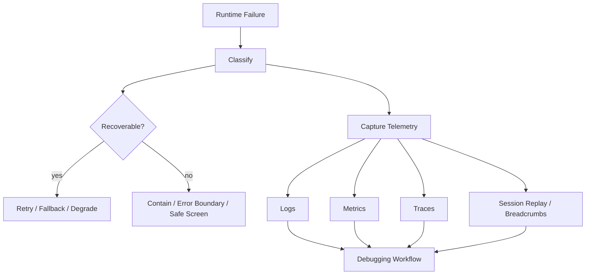
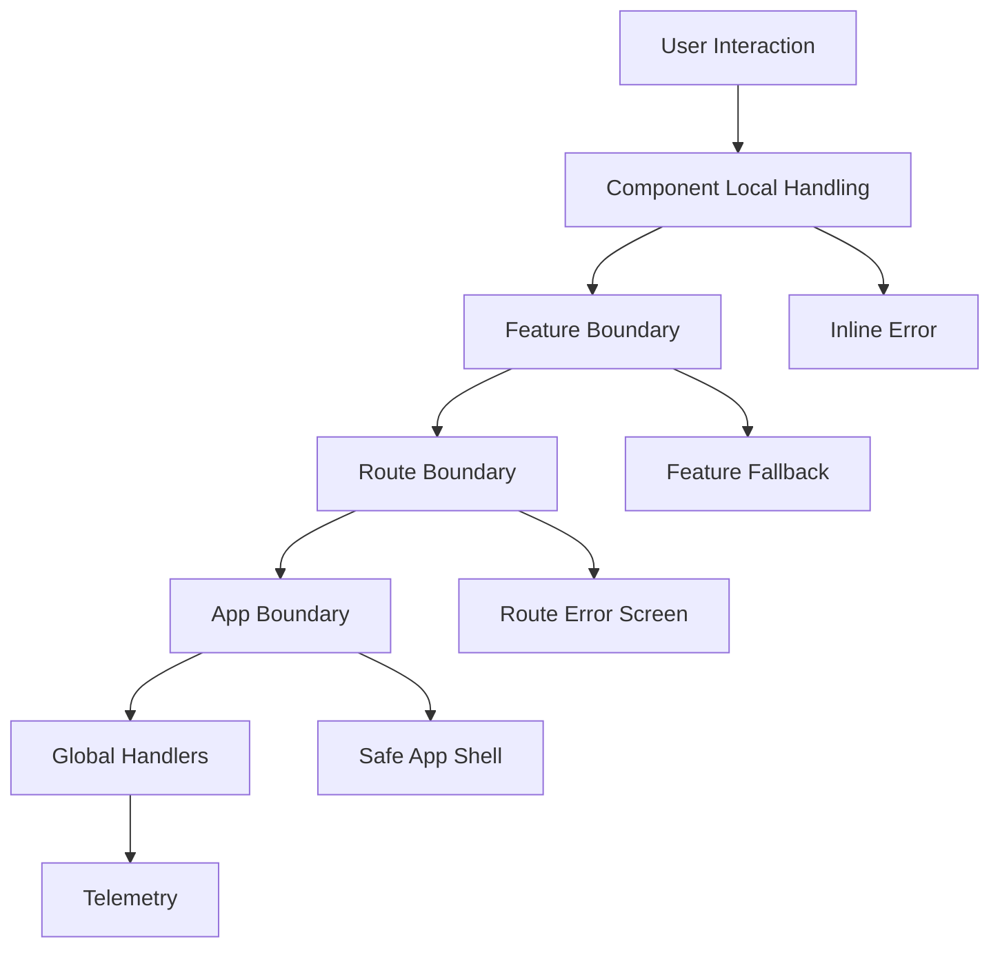
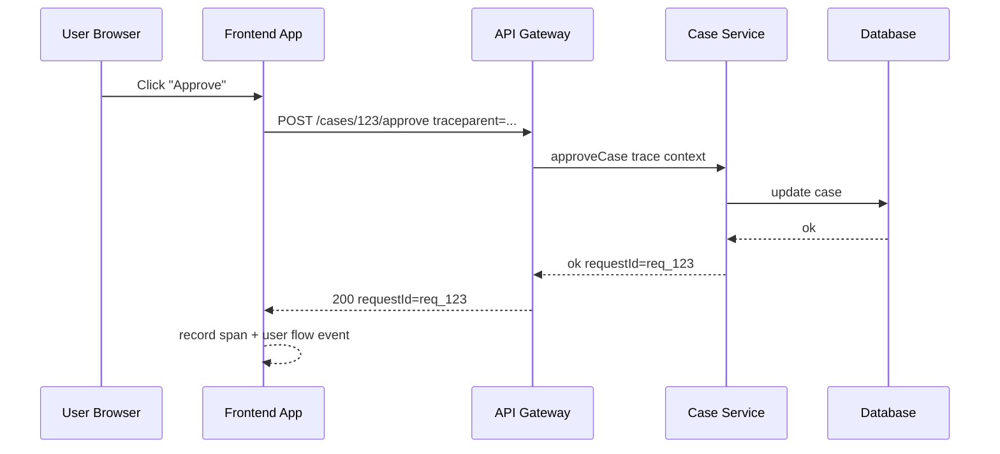
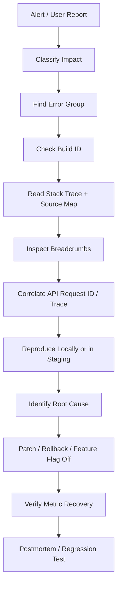

# Part 024 — Error Handling, Observability, and Debuggability

## 1. Posisi Part Ini dalam Roadmap

Part sebelumnya membahas TypeScript sebagai alat untuk mencegah state invalid dan memperkuat kontrak. Namun type system tidak menghapus kebutuhan reliability runtime.

Frontend production tetap bisa gagal karena:

- network unreliable;
- browser berbeda;
- extension mengubah page;
- memory pressure;
- API berubah;
- deployment mismatch;
- stale asset;
- third-party script crash;
- user session expired;
- race condition;
- hydration mismatch;
- data corrupt di storage;
- device lambat;
- timezone/locale edge case;
- permission berubah;
- service worker menyajikan asset lama.

Part ini membahas bagaimana frontend engineer top-tier membuat failure bisa:

1. ditangkap;
2. diklasifikasikan;
3. dipulihkan jika mungkin;
4. diobservasi;
5. dikorelasikan dengan backend;
6. didebug dengan bukti, bukan perasaan.

---

## 2. Mental Model: Error Handling ≠ Observability ≠ Debugging

Tiga hal ini sering dicampur.

| Area | Pertanyaan Utama | Output |
|---|---|---|
| Error handling | Apa yang aplikasi lakukan saat gagal? | fallback, retry, recovery, user message |
| Observability | Apa yang sistem laporkan tentang dirinya? | logs, metrics, traces, events, session replay |
| Debuggability | Seberapa cepat engineer bisa menemukan root cause? | source maps, correlation ID, breadcrumbs, repro steps |

Error handling berfokus pada user experience saat failure.

Observability berfokus pada visibility terhadap sistem production.

Debuggability berfokus pada kemampuan engineer memahami failure dengan cepat.

Top-tier frontend membutuhkan ketiganya.



---

## 3. Error Taxonomy untuk Frontend

Jangan perlakukan semua error sebagai `Something went wrong`.

### 3.1 Kategori Praktis

| Category | Contoh | User Experience | Telemetry Priority |
|---|---|---|---|
| Programmer error | undefined access, invariant broken | Contain dan laporkan | High |
| Network error | offline, timeout, DNS, connection reset | Retry/degrade | Medium/High |
| HTTP error | 401, 403, 404, 409, 422, 500 | Specific message/action | Medium/High |
| Validation error | invalid form field | Inline correction | Low/Medium |
| Authorization error | role/tenant mismatch | Explain or redirect | High if unexpected |
| Data contract error | API shape invalid | Fallback + report | High |
| Hydration/rendering error | server/client mismatch | Contain route/segment | High |
| Resource loading error | chunk load failed, image failed | Retry/reload fallback | Medium/High |
| Third-party error | analytics/payment widget crash | Isolate/degrade | Medium |
| Browser capability error | unsupported API | Feature fallback | Medium |
| Storage error | quota exceeded, corrupt localStorage | Clear/recover | Medium |

### 3.2 Recoverable vs Non-Recoverable

Recoverable error:

- retry might work;
- user can change input;
- auth refresh can fix;
- fallback data can be used;
- component can degrade gracefully.

Non-recoverable error:

- invariant broken;
- code chunk incompatible;
- data contract invalid in critical path;
- app version mismatch;
- security-critical state mismatch.

### 3.3 Typed Error Model

```ts
type AppError =
  | {
      kind: "network";
      message: string;
      retryable: true;
      cause?: unknown;
    }
  | {
      kind: "http";
      status: number;
      requestId?: string;
      retryable: boolean;
      cause?: unknown;
    }
  | {
      kind: "validation";
      fieldErrors: Record<string, string[]>;
      retryable: false;
    }
  | {
      kind: "authorization";
      reason: "unauthenticated" | "forbidden" | "tenant-mismatch";
      retryable: false;
    }
  | {
      kind: "contract";
      boundary: string;
      message: string;
      rawSample?: unknown;
      retryable: false;
    }
  | {
      kind: "programmer";
      message: string;
      cause?: unknown;
      retryable: false;
    };
```

Dengan model seperti ini, UI dan telemetry bisa membuat keputusan lebih presisi.

---

## 4. Error Handling Layer

Frontend error handling sebaiknya berlapis.



### 4.1 Local Handling

Cocok untuk error yang user bisa perbaiki langsung:

- field validation;
- upload file terlalu besar;
- invalid date range;
- optimistic mutation gagal;
- permission action disabled.

```tsx
function CreateCaseForm() {
  const [error, setError] = useState<AppError | null>(null);

  async function submit(input: CreateCaseInput) {
    setError(null);

    const result = await createCase(input);

    if (!result.ok) {
      if (result.error.kind === "validation") {
        setError(result.error);
        return;
      }

      throw toUnexpectedError(result.error);
    }
  }

  return (
    <form>
      {error?.kind === "validation" ? <ValidationSummary error={error} /> : null}
      {/* fields */}
    </form>
  );
}
```

### 4.2 Feature Boundary

Cocok untuk widget/section yang boleh gagal tanpa menjatuhkan halaman.

Contoh:

- recommendation panel;
- analytics chart;
- notification widget;
- sidebar metadata;
- third-party embedded tool.

### 4.3 Route Boundary

Cocok untuk halaman yang tidak bisa dirender tanpa data utama.

Contoh:

- case detail route gagal load;
- tenant tidak ditemukan;
- forbidden route;
- invalid route param.

### 4.4 App Boundary

Cocok sebagai containment terakhir agar seluruh aplikasi tidak white screen.

Tetapi jangan menjadikan app boundary sebagai satu-satunya error handling. Kalau semua error sampai app boundary, user experience buruk dan root cause lebih sulit diklasifikasi.

---

## 5. React Error Boundaries

Error boundary menangkap error rendering di subtree React dan menampilkan fallback UI. Error boundary tidak menggantikan `try/catch` untuk async event handler.

### 5.1 Apa yang Ditangkap

Error boundary cocok untuk:

- error saat render;
- error di lifecycle component class;
- error saat constructor component class;
- error yang terjadi di subtree render.

Tidak cocok untuk:

- async callback;
- event handler biasa;
- server-side rendering error tertentu;
- error di luar React tree.

### 5.2 Pattern

```tsx
type ErrorBoundaryState = {
  error: Error | null;
};

class ErrorBoundary extends React.Component<
  { fallback: React.ReactNode; children: React.ReactNode },
  ErrorBoundaryState
> {
  state: ErrorBoundaryState = { error: null };

  static getDerivedStateFromError(error: Error): ErrorBoundaryState {
    return { error };
  }

  componentDidCatch(error: Error, info: React.ErrorInfo) {
    captureFrontendError(error, {
      componentStack: info.componentStack,
      boundary: "FeatureBoundary",
    });
  }

  render() {
    if (this.state.error) {
      return this.props.fallback;
    }

    return this.props.children;
  }
}
```

### 5.3 Boundary Granularity

Boundary terlalu tinggi:

- satu widget crash menjatuhkan seluruh app;
- user kehilangan context;
- telemetry kurang spesifik.

Boundary terlalu rendah:

- terlalu banyak boilerplate;
- fallback UI tidak konsisten;
- sulit mengelola reset.

Praktisnya:

- app shell boundary;
- route boundary;
- feature/widget boundary untuk area non-critical atau third-party;
- suspense/error boundary pairing untuk data-driven UI.

---

## 6. Async Error Handling

`try/catch` hanya menangkap error yang di-`await` atau thrown dalam call stack yang sama.

```ts
try {
  setTimeout(() => {
    throw new Error("Not caught here");
  }, 0);
} catch (error) {
  // tidak menangkap error di callback async
}
```

### 6.1 Always Await or Handle Promise

```ts
async function save(input: Input) {
  try {
    await saveCase(input);
  } catch (error) {
    handleError(error);
  }
}
```

Hindari floating promise:

```ts
saveCase(input); // error bisa unhandled
```

Jika sengaja fire-and-forget, eksplisitkan:

```ts
void sendAnalyticsEvent(event).catch((error) => {
  captureNonCriticalError(error, { feature: "analytics" });
});
```

### 6.2 Unhandled Rejection

Tambahkan global fallback, tetapi jangan bergantung sepenuhnya padanya.

```ts
window.addEventListener("unhandledrejection", (event) => {
  captureFrontendError(event.reason, {
    source: "unhandledrejection",
  });
});
```

### 6.3 Global Error

```ts
window.addEventListener("error", (event) => {
  captureFrontendError(event.error ?? event.message, {
    source: "window.error",
    filename: event.filename,
    lineno: event.lineno,
    colno: event.colno,
  });
});
```

Global handlers adalah last resort. Mereka membantu visibility, bukan recovery utama.

---

## 7. Network Error Handling

Fetch hanya reject untuk network-level failure. HTTP 404/500 tetap menghasilkan resolved `Response` dengan `ok === false`.

```ts
async function request(input: RequestInfo, init?: RequestInit): Promise<Response> {
  const response = await fetch(input, init);

  if (!response.ok) {
    throw new HttpError(response.status, response.statusText, response);
  }

  return response;
}
```

### 7.1 HTTP Error Mapping

| Status | Frontend Meaning | Suggested Handling |
|---|---|---|
| 400 | malformed request | telemetry, bug investigation |
| 401 | unauthenticated | refresh token or redirect login |
| 403 | forbidden | show no-access state |
| 404 | resource missing | not found route/state |
| 409 | conflict | show conflict resolution |
| 422 | validation | inline field errors |
| 429 | rate limited | backoff and message |
| 500 | server failure | retry/fallback/report |
| 503 | unavailable | retry later/degraded mode |

### 7.2 Retry Policy

Not every request should retry.

Retry good candidates:

- idempotent GET;
- transient 503;
- network timeout;
- background refresh.

Retry risky candidates:

- non-idempotent POST;
- payment submission;
- destructive mutation;
- workflow transition.

For mutations, prefer idempotency keys if retry is required.

```ts
type RetryPolicy = {
  maxAttempts: number;
  baseDelayMs: number;
  retryableStatus: number[];
};
```

### 7.3 Abort vs Error

Cancellation is not failure.

```ts
try {
  await fetch(url, { signal });
} catch (error) {
  if (error instanceof DOMException && error.name === "AbortError") {
    return;
  }

  throw error;
}
```

Do not report user navigation cancellation as production error.

---

## 8. Resource Loading and Chunk Errors

Modern frontend often code-splits. A deployment can create this scenario:

1. user opens app version A;
2. deployment publishes version B;
3. user navigates to lazy route;
4. browser asks for chunk from version A;
5. CDN no longer has old chunk;
6. dynamic import fails.

### 8.1 Chunk Load Fallback

When lazy import fails:

- detect chunk load error;
- offer reload;
- avoid infinite reload loop;
- record app version and asset version;
- keep old assets available long enough if possible.

```ts
function isChunkLoadError(error: unknown) {
  return error instanceof Error && /loading chunk|dynamic import/i.test(error.message);
}
```

### 8.2 Deployment Policy

Reliable frontend deployment should:

- fingerprint assets;
- keep previous assets during rollout window;
- avoid deleting old chunks immediately;
- use cache headers carefully;
- expose build ID in app telemetry;
- include build ID in error reports.

---

## 9. Observability Signals

Frontend observability combines several signal types.

| Signal | Use |
|---|---|
| Error events | crash, exception, failed invariant |
| Logs/breadcrumbs | contextual timeline before failure |
| Metrics | rate, latency, user impact, vitals |
| Traces | distributed request path client → backend |
| Session replay | user interaction context |
| Feature events | business flow progress/failure |
| Resource timing | network waterfall |
| Web vitals | performance user experience |

### 9.1 Avoid Telemetry Noise

Telemetry that nobody acts on is operational debt.

Capture fewer, better events:

- include classification;
- include severity;
- include feature/screen;
- include user impact;
- include correlation IDs;
- sample high-volume non-critical events;
- redact sensitive data.

---

## 10. Structured Error Capture

Bad telemetry:

```ts
captureException(error);
```

Better telemetry:

```ts
captureFrontendError(error, {
  severity: "error",
  feature: "case-detail",
  operation: "load-case",
  route: "/cases/:caseId",
  tenantId,
  caseId,
  requestId,
  traceId,
  buildId: __BUILD_ID__,
  appVersion: __APP_VERSION__,
});
```

### 10.1 Event Schema

```ts
type FrontendErrorEvent = {
  timestamp: string;
  severity: "info" | "warning" | "error" | "fatal";
  source: "react-boundary" | "window.error" | "unhandledrejection" | "api-client" | "manual";
  feature: string;
  operation?: string;
  route?: string;
  message: string;
  stack?: string;
  componentStack?: string;
  requestId?: string;
  traceId?: string;
  buildId: string;
  userImpact: "none" | "degraded" | "blocked" | "data-loss-risk";
  tags?: Record<string, string>;
};
```

Schema penting agar data bisa dianalisis konsisten.

---

## 11. Correlation ID dan Distributed Debugging

Frontend jarang gagal sendiri. Banyak failure melibatkan backend.

### 11.1 Request ID

Backend sebaiknya mengembalikan request ID.

```http
x-request-id: req_abc123
```

Frontend menyimpan request ID pada error report.

```ts
const requestId = response.headers.get("x-request-id") ?? undefined;
```

Saat user melapor, engineer bisa mencari log backend dengan request ID yang sama.

### 11.2 Trace Context

Distributed tracing menghubungkan client span dengan backend span.



### 11.3 Practical Rule

Every critical API call error should capture:

- route;
- operation;
- HTTP method;
- status;
- request ID;
- trace ID if available;
- duration;
- retry attempt;
- app build ID;
- user flow ID.

---

## 12. Frontend Tracing

Tracing answers:

- Which user action triggered this work?
- Which API call was slow?
- Did client spend time rendering or waiting network?
- Did backend error propagate to UI?
- Did one operation fan out into many requests?

### 12.1 Span Model

```ts
type Span = {
  name: string;
  startTime: number;
  endTime?: number;
  attributes: Record<string, string | number | boolean>;
  status: "ok" | "error";
};
```

Example conceptual spans:

```text
user.click.approve_case
  api.POST./cases/:id/approve
  cache.invalidate.case_detail
  ui.render.case_detail
```

### 12.2 What to Trace

Trace critical flows, not every click.

Good candidates:

- checkout;
- login;
- case approval;
- file upload;
- dashboard initial load;
- search;
- workflow transition;
- report generation.

---

## 13. Metrics for Frontend Reliability

Metrics should represent user impact.

### 13.1 Core Reliability Metrics

| Metric | Meaning |
|---|---|
| JS error rate | errors per session/pageview |
| Fatal error rate | sessions reaching app-level failure |
| API failure rate | failed requests by endpoint/status |
| Chunk load failure rate | deployment/cache issue indicator |
| Form submission failure rate | business flow blocker |
| Auth refresh failure rate | session stability |
| Decode/contract failure rate | API/frontend drift |
| Feature success rate | user journey reliability |

### 13.2 Performance + Reliability Together

Performance degradation can become reliability issue.

Examples:

- INP poor because main thread blocked;
- user double-submits because button does not respond;
- request timeout due to huge JS bundle delaying fetch;
- memory leak causes tab crash.

Metrics should connect frontend performance to product/business flows.

---

## 14. Logging and Breadcrumbs

Frontend logs should be structured and sparse.

### 14.1 Breadcrumb Timeline

Breadcrumbs are short contextual events before an error.

```ts
type Breadcrumb = {
  timestamp: string;
  category: "navigation" | "ui" | "api" | "state" | "feature";
  message: string;
  data?: Record<string, unknown>;
};
```

Examples:

```ts
addBreadcrumb({
  category: "navigation",
  message: "Route changed",
  data: { from: "/cases", to: "/cases/case_123" },
});

addBreadcrumb({
  category: "api",
  message: "Load case failed",
  data: { status: 500, requestId: "req_123" },
});
```

### 14.2 Do Not Log Sensitive Data

Never log:

- passwords;
- tokens;
- full authorization headers;
- PII unless explicitly allowed and redacted;
- sensitive case content;
- payment data;
- secrets in URL;
- raw form data from regulated flows.

Prefer IDs and classification.

---

## 15. Source Maps

Production JavaScript is usually bundled, minified, transformed, and split. Stack traces from minified files are often useless without source maps.

A source map maps transformed code back to original source.

### 15.1 Why Source Maps Matter

Without source maps:

```text
TypeError: Cannot read properties of undefined
  at t.n (app.3fa93.js:1:49203)
```

With source maps:

```text
TypeError: Cannot read properties of undefined
  at CaseTimeline.tsx:142:17
```

### 15.2 Security Trade-Off

Do not casually expose full source maps publicly if code contains sensitive implementation detail.

Common production approach:

- generate source maps in CI;
- upload source maps to error monitoring provider;
- do not serve source maps publicly, or restrict access;
- ensure build ID matches uploaded artifacts;
- verify stack trace deobfuscation during release.

### 15.3 Source Map Checklist

- Does every deployed JS asset have matching source map?
- Are source maps uploaded before traffic reaches new build?
- Is build ID attached to error events?
- Are old source maps retained for rollback/debugging?
- Are source maps protected from public access if needed?
- Are stack traces symbolicated correctly in staging?

---

## 16. Debugging Workflow

Debugging production frontend should be systematic.

### 16.1 Workflow



### 16.2 First Questions

Ask:

1. Is it new after a deployment?
2. Is it isolated to one browser/device/locale?
3. Is it tied to one route/feature?
4. Is it tied to one tenant/role/permission?
5. Is it a data shape issue?
6. Is it a network/backend issue?
7. Is it a stale asset/chunk issue?
8. Is user blocked or degraded?

### 16.3 Do Not Start with Guessing

Bad debugging:

> "Maybe useEffect dependency? Try adding optional chaining."

Better debugging:

> "This error started in build 2026.06.27.4, route `/cases/:id`, browser Safari 18, role reviewer, after API response with request ID req_123 returned a missing `timeline.events` field. Root cause likely contract drift."

---

## 17. Reproducibility

Frontend bugs are often environment-sensitive.

Capture:

- app version/build ID;
- route and query params shape;
- browser and version;
- OS/device class;
- viewport;
- locale/timezone;
- feature flags;
- user role/tenant type;
- network state;
- service worker version;
- API request ID;
- last breadcrumbs.

### 17.1 Minimal Repro Template

```md
## Symptom

## Impact
- affected route:
- affected role:
- affected browser/device:
- first seen:
- build ID:

## Evidence
- error group:
- stack trace:
- source map status:
- request ID / trace ID:
- breadcrumbs:

## Reproduction
1.
2.
3.

## Expected

## Actual

## Suspected Boundary
- API contract / component state / route param / cache / storage / rendering / third-party
```

---

## 18. Session Replay

Session replay can be powerful, but risky.

Useful for:

- seeing user path before crash;
- understanding UI state that logs missed;
- reproducing flaky interaction bugs;
- diagnosing rage clicks/dead clicks.

Risks:

- privacy;
- sensitive content exposure;
- high storage cost;
- overcollection;
- regulatory constraints.

### 18.1 Safe Replay Practices

- mask input fields by default;
- mask sensitive content containers;
- disable replay for regulated flows if needed;
- sample sessions;
- bind replay to error events;
- set retention policy;
- document data handling.

---

## 19. Feature Flags and Error Recovery

Feature flags are not only release tools. They are recovery tools.

When a feature causes production failure, faster options:

1. disable flag;
2. reduce rollout percentage;
3. disable specific route/widget;
4. fall back to old implementation;
5. rollback deployment.

### 19.1 Flag Context in Telemetry

Every error event should include relevant flag state.

```ts
type FeatureFlagSnapshot = Record<string, boolean | string | number>;
```

Without flag context, rollout-related bugs are harder to isolate.

---

## 20. Invariant Checks

Some errors should fail fast in development and report clearly in production.

```ts
function invariant(condition: unknown, message: string): asserts condition {
  if (!condition) {
    throw new Error(`Invariant failed: ${message}`);
  }
}
```

Usage:

```ts
invariant(caseId !== null, "CaseDetail requires a valid caseId");
```

### 20.1 Invariant vs User Error

Invariant error:

- developer/system bug;
- should be reported;
- user usually cannot fix.

User error:

- invalid input;
- should be explained;
- not necessarily telemetry error.

Do not report expected validation errors as high-severity exceptions.

---

## 21. Data Contract Failures

Data contract failure means API returned a shape frontend cannot safely use.

### 21.1 Decoder with Telemetry

```ts
function decodeOrReport<T>(boundary: string, raw: unknown, decode: (value: unknown) => T): T | null {
  try {
    return decode(raw);
  } catch (error) {
    captureFrontendError(error, {
      severity: "error",
      source: "api-client",
      feature: boundary,
      userImpact: "blocked",
    });

    return null;
  }
}
```

### 21.2 Contract Error Should Include

- API endpoint;
- response version if any;
- missing/invalid field path;
- request ID;
- frontend build ID;
- decoder version;
- sample redacted shape.

Avoid logging full raw response if sensitive.

---

## 22. Storage and Persistence Errors

`localStorage` can fail:

- quota exceeded;
- private browsing restrictions;
- JSON parse error;
- old schema version;
- user manually changed storage;
- cross-version incompatible data.

### 22.1 Safe Storage Read

```ts
type StorageResult<T> =
  | { ok: true; value: T }
  | { ok: false; reason: "missing" | "parse-error" | "invalid-schema" };

function readJsonFromStorage<T>(key: string, decode: (value: unknown) => T): StorageResult<T> {
  const raw = localStorage.getItem(key);

  if (raw === null) {
    return { ok: false, reason: "missing" };
  }

  try {
    const parsed: unknown = JSON.parse(raw);
    return { ok: true, value: decode(parsed) };
  } catch {
    return { ok: false, reason: "parse-error" };
  }
}
```

### 22.2 Storage Versioning

Persisted client state should include version.

```ts
type PersistedDraftV2 = {
  version: 2;
  title: string;
  description: string;
  updatedAt: string;
};
```

When schema changes, migrate or discard explicitly.

---

## 23. Service Worker Debuggability

Service worker can introduce confusing bugs:

- stale HTML serving new JS assumptions;
- old JS calling new API;
- cache-first strategy serving obsolete data;
- offline fallback masking real failure;
- multiple tabs using different app versions.

### 23.1 Telemetry Fields

Include:

- service worker registration status;
- service worker version;
- cache strategy;
- controlled/uncontrolled page;
- app shell version;
- asset build ID.

### 23.2 Update UX

For critical apps, show controlled update prompt:

> A new version is available. Reload to update.

Avoid silently replacing app under active workflow if it risks data loss.

---

## 24. Privacy and Compliance

Frontend observability can easily collect too much.

### 24.1 Data Classification

Before adding telemetry, classify:

| Data | Allowed? | Notes |
|---|---|---|
| build ID | yes | useful for release debugging |
| route pattern | yes | prefer pattern over full URL if query sensitive |
| request ID | yes | not user secret |
| user ID | maybe | hash/pseudonymize if needed |
| tenant ID | maybe | depends on policy |
| raw API response | risky | redact or avoid |
| form value | risky | avoid by default |
| token/header | no | never log |
| stack trace | yes with care | may reveal code paths |

### 24.2 Principle

> Collect enough to debug, not enough to recreate sensitive user data.

---

## 25. Alerting

Alert on user-impacting symptoms, not every individual error.

Good alerts:

- fatal error rate exceeds threshold;
- checkout/case-submit success rate drops;
- chunk load error spikes after deploy;
- API 500 rate for critical route spikes;
- contract decoder failure begins after backend release;
- INP/LCP regression crosses budget;
- auth refresh failure spikes.

Bad alerts:

- every console error;
- every 404 image;
- expected validation errors;
- noise from browser extensions;
- non-actionable third-party warnings.

### 25.1 Alert Routing

Alert should include owner.

| Signal | Owner |
|---|---|
| case detail render crash | owning feature team |
| global app fatal error | frontend platform team |
| API 500 from case service | backend owning team + frontend if user impact |
| chunk load spike | release/platform team |
| web vitals regression | feature team owning changed route |

---

## 26. Browser Extension Noise

Production frontend error tools often capture errors from browser extensions.

Indicators:

- stack contains `chrome-extension://`;
- script URL not from your domain/CDN;
- message from known extension injection;
- impossible code path absent from source map.

Filter or downgrade severity, but do not blindly ignore until confirmed.

---

## 27. Error Budget Thinking

Frontend reliability should have budget.

Example:

```text
Critical flow success rate: 99.5%
Fatal JS error sessions: < 0.2%
Chunk load failure rate: < 0.05%
Contract decode failure: 0 for critical APIs
```

When budget is burned, stop feature work and fix reliability.

This turns reliability from vague quality concern into operational constraint.

---

## 28. Debuggable Code Patterns

### 28.1 Name Operations

Bad:

```ts
await mutate(data);
```

Better:

```ts
await approveCaseMutation({ caseId, version });
```

Telemetry and stack traces become easier to interpret.

### 28.2 Preserve Cause

```ts
throw new Error("Failed to approve case", { cause: error });
```

Preserving cause helps chain low-level and high-level failures.

### 28.3 Avoid Swallowing Errors

Bad:

```ts
try {
  await save();
} catch {
  // ignore
}
```

Better:

```ts
try {
  await save();
} catch (error) {
  captureFrontendError(error, {
    feature: "case-editor",
    operation: "autosave",
    severity: "warning",
    userImpact: "degraded",
  });
}
```

### 28.4 Make State Transitions Observable

For complex workflow UI, log feature-level events:

```ts
recordFeatureEvent("case.transition.submitted", {
  caseId,
  from: "draft",
  to: "submitted",
});
```

Do not log sensitive payload.

---

## 29. Release Debugging

Many frontend incidents are release-related.

### 29.1 Build Metadata

Expose build metadata at runtime:

```ts
declare const __BUILD_ID__: string;
declare const __COMMIT_SHA__: string;
declare const __APP_VERSION__: string;
```

Add to telemetry.

```ts
const runtimeMetadata = {
  buildId: __BUILD_ID__,
  commitSha: __COMMIT_SHA__,
  appVersion: __APP_VERSION__,
};
```

### 29.2 Release Health Checklist

After deploy, watch:

- JS error rate;
- fatal session rate;
- chunk load failures;
- API failure rate;
- critical flow success;
- web vitals;
- source map symbolication;
- browser-specific spikes.

---

## 30. Testing Observability Itself

Do not assume telemetry works.

Test:

- synthetic render error reaches monitoring;
- source map symbolication works;
- request ID captured on API error;
- user flow span appears;
- PII redaction works;
- chunk load fallback works;
- global unhandled rejection handler works;
- error boundary fallback displays.

### 30.1 Staging Drill

Create a staging route:

```tsx
function ThrowTestError() {
  throw new Error("Synthetic frontend test error");
}
```

Only accessible in non-production or admin-only environment.

Verify capture pipeline end-to-end.

---

## 31. Incident Response Playbook

When production frontend breaks:

1. classify severity;
2. identify build/version scope;
3. check recent deploys/flags;
4. determine affected routes/users/browsers;
5. confirm source maps;
6. inspect traces/request IDs;
7. mitigate first: flag off, rollback, route disable, cache purge;
8. patch root cause;
9. add regression test;
10. write short postmortem.

### 31.1 Severity Example

| Severity | Definition | Action |
|---|---|---|
| SEV1 | app unusable or critical flow blocked broadly | immediate mitigation/rollback |
| SEV2 | major feature broken for significant users | urgent fix or flag off |
| SEV3 | degraded experience with workaround | scheduled fix |
| SEV4 | low impact/no user impact | backlog/cleanup |

---

## 32. Review Checklist

### 32.1 Error Handling

- Are expected errors handled locally?
- Are unexpected errors captured by boundary?
- Are async errors awaited or caught?
- Are abort/cancel events excluded from error noise?
- Are validation errors not reported as fatal exceptions?
- Are retry policies idempotency-aware?

### 32.2 Observability

- Does telemetry include build ID?
- Are route pattern and feature name included?
- Is request ID captured from failed API calls?
- Are sensitive fields redacted?
- Are error events classified by severity and impact?
- Are feature flags included for rollout debugging?

### 32.3 Debuggability

- Are source maps generated and uploaded?
- Is stack trace symbolication verified?
- Is there enough breadcrumb context?
- Can frontend error be correlated to backend logs/traces?
- Is there a known owner for each alert?
- Are extension/third-party noises filtered?

---

## 33. Anti-Patterns

### 33.1 Catch Everything, Show Generic Toast

```ts
catch {
  toast("Something went wrong");
}
```

This hides classification and weakens recovery.

### 33.2 Optional Chaining as Error Handling

```ts
const city = user?.profile?.address?.city;
```

Optional chaining can be correct. But if `profile` is required by contract, optional chaining hides contract failure.

### 33.3 Reporting Expected User Errors as Exceptions

Validation errors are product flow, not necessarily system failure.

### 33.4 No Build ID in Error Reports

Without build ID, source map matching and release correlation become fragile.

### 33.5 Public Source Maps Without Policy

Source maps are useful, but exposure should be a deliberate security decision.

### 33.6 Logging Raw Payloads

Raw payload logging may leak sensitive data.

### 33.7 Ignoring Browser/Device Dimension

Some bugs only appear in Safari, low memory Android, specific locale, or old WebView.

---

## 34. Latihan Terarah

### Latihan 1 — Error Taxonomy Refactor

Ambil API client yang melempar generic `Error`. Ubah menjadi `AppError` union dengan kategori:

- network;
- HTTP;
- validation;
- authorization;
- contract.

Ukuran keberhasilan: UI bisa membedakan retry, login redirect, forbidden state, dan inline validation.

### Latihan 2 — Error Boundary Placement

Untuk aplikasi dashboard, tentukan boundary:

- app shell;
- route;
- chart widget;
- notification panel;
- third-party embed.

Ukuran keberhasilan: satu widget crash tidak menjatuhkan seluruh route.

### Latihan 3 — Source Map Release Drill

Buat synthetic production-like build, upload source maps ke monitoring, trigger error, dan pastikan stack trace menunjuk ke file asli.

Ukuran keberhasilan: engineer bisa menemukan source line tanpa membaca minified bundle.

### Latihan 4 — Correlation ID Flow

Tambahkan capture request ID dari response header ke error event.

Ukuran keberhasilan: frontend error dapat dicari di backend log dengan ID yang sama.

### Latihan 5 — Telemetry Redaction

Buat utility yang menghapus token, password, email, dan free-text sensitive content dari telemetry payload.

Ukuran keberhasilan: event tetap berguna tanpa data sensitif.

---

## 35. Production Decision Matrix

| Problem | Recommended Response | Avoid |
|---|---|---|
| Render crash in widget | Feature error boundary + telemetry | App-wide white screen |
| API 422 | Inline validation | Fatal error toast |
| API 401 | Auth refresh/login redirect | Infinite retry |
| API 409 | Conflict UI | Blind overwrite |
| Dynamic import failure | Reload fallback + build telemetry | Infinite reload loop |
| Contract decode failure | Fallback + high-severity report | Optional chaining everywhere |
| Offline request | Offline state/retry queue if needed | Generic server error |
| User navigation abort | Ignore/don't report as error | Pollute error dashboard |
| Unknown production crash | Source maps + breadcrumbs + request ID | Guess from minified stack |
| Third-party script crash | Isolate boundary/sandbox | Let it crash core app |

---

## 36. Mental Model Akhir

Reliable frontend bukan frontend yang tidak pernah error. Itu tidak realistis.

Reliable frontend adalah frontend yang:

- membedakan expected vs unexpected failure;
- menahan blast radius;
- memberi user recovery path;
- mengirim telemetry yang cukup untuk diagnosis;
- tidak mengirim data sensitif;
- bisa dikorelasikan dengan backend;
- bisa dipulihkan cepat lewat rollback/flag;
- punya regression test setelah incident.

Top-tier frontend engineer tidak hanya menulis UI yang berjalan di laptop sendiri. Mereka membuat UI yang bisa dipahami saat gagal di production.

---

## 37. Ringkasan

Kita sudah membahas:

- perbedaan error handling, observability, dan debugging;
- taxonomy error frontend;
- local/feature/route/app/global error handling layer;
- React error boundary;
- async and unhandled rejection handling;
- network/HTTP/retry/abort strategy;
- chunk load failure dan deployment mismatch;
- logs, breadcrumbs, metrics, traces, session replay;
- source maps dan release metadata;
- correlation ID dan distributed debugging;
- privacy/compliance boundary;
- alerting, incident response, dan reliability checklist.

Part berikutnya membahas **testing strategy for frontend systems**: bagaimana menyusun unit, integration, E2E, contract, visual, accessibility, dan performance regression tests tanpa membuat test suite lambat, flaky, dan mahal dirawat.

---

## References

- React — Error Boundaries: https://legacy.reactjs.org/docs/error-boundaries.html
- React — Component / Catching rendering errors with an Error Boundary: https://react.dev/reference/react/Component#catching-rendering-errors-with-an-error-boundary
- MDN — Window error event: https://developer.mozilla.org/en-US/docs/Web/API/Window/error_event
- MDN — Window unhandledrejection event: https://developer.mozilla.org/en-US/docs/Web/API/Window/unhandledrejection_event
- MDN — Source map glossary: https://developer.mozilla.org/en-US/docs/Glossary/Source_map
- Chrome DevTools — Debug your original code instead of deployed with source maps: https://developer.chrome.com/docs/devtools/javascript/source-maps
- OpenTelemetry JavaScript Browser Getting Started: https://opentelemetry.io/docs/languages/js/getting-started/browser/
- OpenTelemetry JavaScript Documentation: https://opentelemetry.io/docs/languages/js/
