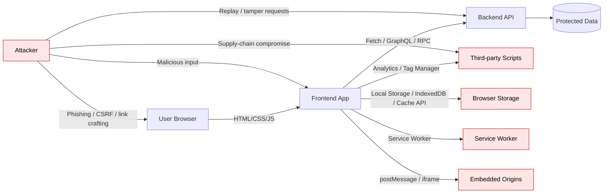
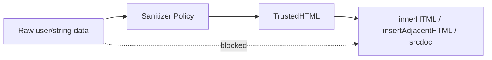
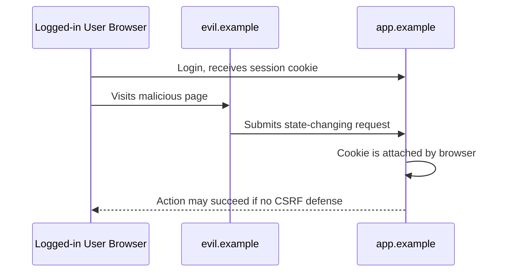
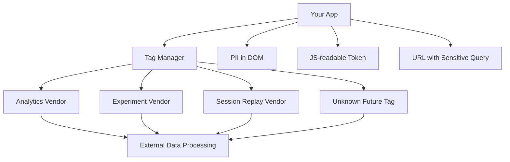

# Part 027 — Security for Modern Frontends

Frontend security is not a checklist at the end of delivery. It is a set of architectural invariants that must hold while untrusted input, third-party code, browser APIs, user identity, network calls, and cached data interact inside an environment the user controls.

The advanced frontend engineer does not think, “Can this page render correctly?” They also ask:

1. Can attacker-controlled data become executable code?
2. Can a user perform an operation they are not authorized to perform?
3. Can sensitive data appear in storage, logs, analytics, URLs, screenshots, caches, or third-party tools?
4. Can one tenant, account, role, origin, tab, frame, or browser context affect another?
5. Can dependency, build, CDN, extension, service worker, or configuration drift break security assumptions?

This part builds the mental model and review discipline required to answer those questions.

---

## 1. Kaufman Skill Deconstruction

Security is too broad to learn as one topic. We will deconstruct frontend security into a set of production sub-skills.

| Sub-skill | What You Must Be Able To Do | Common Failure |
|---|---|---|
| Threat modeling | Identify attacker, asset, trust boundary, entry point, and abuse path | Treating security as a scanner report |
| XSS defense | Prevent user-controlled data from becoming executable script/HTML | Sanitizing too late or trusting framework escaping blindly |
| Authorization boundary | Separate UI visibility from server-side permission enforcement | Hiding buttons and calling it security |
| Session/token handling | Choose safe session transport and storage strategy | Storing bearer tokens in `localStorage` without threat analysis |
| CSRF defense | Understand cookie credential behavior and state-changing requests | Assuming JSON APIs cannot be CSRFed |
| CORS reasoning | Configure origin access without confusing CORS with authentication | `Access-Control-Allow-Origin: *` plus credentials mistakes |
| Browser isolation | Use CSP, Trusted Types, iframe sandboxing, COOP/COEP where needed | Adding headers without measuring what they actually protect |
| Dependency risk | Control npm, CDN, third-party script, and build-chain risk | Treating frontend packages as harmless assets |
| Data leakage control | Prevent sensitive data from leaking to logs, URL, analytics, cache, DOM | Putting tokens or PII in query strings and error events |
| Security testing | Convert threats into tests, gates, and observability | Relying only on manual QA or annual penetration tests |

### Kaufman target performance

After this part, you should be able to review a frontend feature and produce a clear security assessment:

```txt
Feature: Tenant-scoped case-management dashboard
Assets: PII, enforcement history, role-sensitive actions, audit notes
Trust boundaries: browser/client, API, analytics, embedded documents, third-party scripts
Main risks: stored XSS in rich text note, tenant cache leak, client-side access-control bypass, token exposure, unsafe postMessage
Required controls: server authorization, contextual escaping, CSP, Trusted Types for unsafe sinks, tenant-scoped query keys, no PII in URL/logs, allowlisted message origin
Verification: unit sanitization tests, E2E authorization tests, CSP report monitoring, dependency audit, manual keyboard/security review
```

That is the level of practical output expected from a senior/top-tier frontend engineer.

---

## 2. Core Mental Model: Browser Code Is Not Trusted Code

Frontend code runs on the user's device. The user can inspect it, modify it, pause it, replay requests, replace storage, alter network calls, and script the browser. Therefore:

> The frontend may guide, validate, optimize, and protect the user experience. It must not be the final authority for security decisions.

This gives us several invariants.

### Security invariants

| Invariant | Meaning |
|---|---|
| Authorization is server-side | Frontend role checks are UX controls, not security controls |
| Input is hostile until validated at the correct boundary | Client validation improves UX; server validation protects the system |
| Output must be context-aware encoded | HTML, attribute, URL, CSS, and JS contexts are different |
| Secrets do not belong in frontend bundles | Anything shipped to the browser is public |
| Tokens are bearer capability objects | Whoever holds a bearer token can usually act as the user |
| Origin is not identity | Same-origin policy controls browser access; it does not prove user intent |
| CORS is not authorization | CORS controls which browser origins can read responses |
| Client cache is not neutral | Cache keys, persistence, and invalidation can leak cross-tenant or cross-user data |
| Third-party script is privileged code | A script loaded into your page can often observe and modify your page |
| Security controls need observability | CSP, auth failures, suspicious navigation, and dependency drift need signal |

---

## 3. Frontend Threat Model

A useful threat model starts with relationships, not vulnerabilities.



Every edge in this graph creates a question:

| Edge | Question |
|---|---|
| User input → app | Can attacker-controlled input reach an executable sink? |
| App → API | Are requests authorized, authenticated, scoped, and auditable? |
| App → storage | Could sensitive data persist longer than intended? |
| App → third party | Can external scripts read PII, tokens, DOM, or events? |
| App → iframe/postMessage | Are origins and message schemas verified? |
| Service worker → cache/network | Can stale or poisoned cache bypass auth assumptions? |
| Browser history/URL → user/share | Can secrets leak through URL, referrer, logs, or screenshots? |

---

## 4. XSS: The Central Frontend Vulnerability Class

Cross-site scripting happens when attacker-controlled data is interpreted by the browser as executable code or active markup.

There are many variants:

| Type | Example |
|---|---|
| Reflected XSS | Search query echoed into HTML response unsafely |
| Stored XSS | User comment saved to DB and rendered later as HTML |
| DOM XSS | Client script reads URL/hash/storage and writes into an unsafe DOM sink |
| Mutation XSS | Browser/parser mutation turns seemingly safe markup into executable shape |
| Template injection | Data crosses from template value into template code |
| Rich text XSS | Sanitizer policy allows dangerous attributes/protocols |

### The dangerous mental shortcut

Many engineers say:

> “We use React/Vue/Svelte, so XSS is solved.”

That is false. Frameworks usually escape text interpolation by default, but they cannot protect every boundary:

- raw HTML escape hatches;
- third-party widgets;
- Markdown/rich-text rendering;
- SVG/MathML edge cases;
- URL construction;
- `iframe srcdoc`;
- inline event handlers in raw HTML;
- unsafe DOM APIs;
- dependency-generated markup;
- server-rendered template fragments;
- hydration mismatch paths.

### Unsafe sinks

Common browser APIs that deserve special attention:

```js
// Dangerous when value can be influenced by an attacker
element.innerHTML = value;
element.outerHTML = value;
element.insertAdjacentHTML('beforeend', value);
document.write(value);
iframe.srcdoc = value;
script.text = value;

// Also dangerous depending on context
location.href = userControlledUrl;
anchor.href = userControlledUrl;
element.setAttribute('onclick', userControlledCode);
```

### Safer output by default

Prefer APIs that create text or nodes rather than parse HTML.

```js
function renderUserName(container, userName) {
  container.textContent = userName;
}
```

For URLs, validate protocol and origin explicitly.

```js
const ALLOWED_PROTOCOLS = new Set(['https:']);

export function safeExternalUrl(raw) {
  const url = new URL(raw, window.location.origin);

  if (!ALLOWED_PROTOCOLS.has(url.protocol)) {
    throw new Error(`Blocked unsafe protocol: ${url.protocol}`);
  }

  return url.toString();
}
```

This prevents obvious `javascript:` URL injection. It does not solve every navigation, redirect, or phishing risk. For security-sensitive redirects, validate allowlisted origins and paths.

---

## 5. Context-Aware Output Encoding

There is no universal escaping function.

| Context | Risk | Safer Strategy |
|---|---|---|
| HTML text | `<script>`, tags, entities | Text interpolation / `textContent` |
| HTML attribute | quote breaking, event handlers | Attribute encoding, allowlisted attributes |
| URL | `javascript:`, open redirect, credential leak | `URL` parsing, protocol/origin allowlist |
| CSS | style injection, URL loading | Avoid user CSS; use tokens/classes |
| JavaScript string | script context break-out | Do not inject data into executable script |
| Raw HTML | active content | Sanitizer with strict policy + Trusted Types |

The best senior-level habit is not “escape more.” It is:

> Avoid entering dangerous output contexts unless the feature genuinely requires it.

If the feature does require raw HTML, make that boundary explicit in architecture.

```txt
User Markdown -> Markdown parser -> Sanitizer policy -> TrustedHTML -> isolated renderer component
```

Do not allow arbitrary components to call raw HTML APIs.

---

## 6. Trusted Types

Trusted Types is a browser mechanism designed to reduce DOM XSS by requiring dangerous DOM sinks to receive typed trusted values instead of arbitrary strings.

Conceptually:



Example policy shape:

```js
const policy = trustedTypes.createPolicy('app-html', {
  createHTML(input) {
    return sanitizeHtml(input); // Use a real sanitizer policy here.
  },
});

const trusted = policy.createHTML(markdownHtml);
container.innerHTML = trusted;
```

A mature frontend codebase should centralize unsafe sinks behind a small number of reviewed APIs.

```ts
export function renderTrustedHtml(element: Element, value: TrustedHTML) {
  element.innerHTML = value;
}
```

The review rule is simple:

> If a pull request introduces `innerHTML`, `outerHTML`, `insertAdjacentHTML`, `srcdoc`, or raw HTML rendering, it requires security review.

---

## 7. Content Security Policy

Content Security Policy is a browser-enforced policy that restricts what a page is allowed to load and execute.

A practical CSP strategy is phased:

1. Start in `Content-Security-Policy-Report-Only` mode.
2. Collect violations.
3. Remove inline scripts and dynamic eval usage.
4. Add nonces or hashes for legitimate scripts.
5. Restrict script sources.
6. Add reporting.
7. Enforce.
8. Keep monitoring.

Example baseline policy:

```http
Content-Security-Policy:
  default-src 'self';
  script-src 'self' 'nonce-{RANDOM_PER_RESPONSE}' 'strict-dynamic';
  object-src 'none';
  base-uri 'self';
  frame-ancestors 'none';
  img-src 'self' data: https:;
  style-src 'self' 'unsafe-inline';
  connect-src 'self' https://api.example.com;
  report-to csp-endpoint;
```

This is not a copy-paste production policy. CSP must match the application. A bad CSP often creates false confidence.

### CSP design principles

| Principle | Why It Matters |
|---|---|
| Avoid broad wildcards | `*` weakens policy and hides real dependencies |
| Avoid `unsafe-eval` | Eval-like APIs increase injection impact |
| Minimize `unsafe-inline` | Inline script makes XSS mitigation harder |
| Use per-response nonces | Static nonces are not nonces |
| Use `frame-ancestors` | Helps prevent clickjacking/framing attacks |
| Use report-only rollout | Prevents breaking production while learning dependencies |
| Monitor reports | CSP without feedback decays quickly |

---

## 8. CSRF: User Intent vs Browser Credential Behavior

Cross-site request forgery abuses the browser's willingness to attach credentials, usually cookies, to requests made from another site.

The core risk:



CSRF defense is usually a combination of:

| Control | Role |
|---|---|
| `SameSite` cookies | Reduces cross-site cookie sending |
| CSRF token | Binds request to legitimate page/session |
| Origin/Referer check | Verifies source of state-changing request |
| Custom headers | Forces CORS preflight for cross-site API attempts |
| Idempotency keys | Prevents duplicate/replay side effects |
| Re-authentication | Protects high-risk actions |

### Common misconception

> “Our API uses JSON, so CSRF does not apply.”

Not necessarily. If authentication uses cookies, the browser may attach them. You still need to reason about `SameSite`, CORS, content types, preflight, and server-side checks.

### Cookie guidance

A typical secure session cookie shape:

```http
Set-Cookie: __Host-session=opaque-session-id;
  Path=/;
  Secure;
  HttpOnly;
  SameSite=Lax
```

For cross-site embedded applications or federated flows, `SameSite=None; Secure` may be required. That increases the importance of CSRF tokens and origin checks.

---

## 9. Token Storage: The Trade-off Nobody Gets for Free

There is no perfect browser token storage.

| Storage | Strength | Risk |
|---|---|---|
| In-memory | Reduced persistence | Lost on reload; still exposed to running XSS |
| `localStorage` | Simple persistence | Readable by XSS; long-lived exposure |
| `sessionStorage` | Tab-scoped persistence | Readable by XSS; still persists per tab |
| IndexedDB | Structured storage | Readable by XSS; cache lifecycle complexity |
| HttpOnly cookie | Not readable by JS | CSRF risk; cookie scoping complexity |
| Backend-for-Frontend session | Keeps tokens server-side | Requires BFF infrastructure |

A robust rule:

> The more powerful and long-lived the token, the less it belongs in JavaScript-readable storage.

For high-risk apps, prefer a server-managed session or BFF pattern where the browser holds an opaque HttpOnly session cookie, and actual access/refresh tokens stay server-side.

### Token handling anti-patterns

Avoid:

```txt
- access_token in URL query string
- refresh_token in localStorage
- JWT payload used as authorization source without server verification
- tokens sent to analytics or error reporting
- tokens logged in Redux/devtools/session replay
- tenant or role trusted from client-side decoded JWT alone
- long-lived bearer token in service worker cache
```

---

## 10. CORS: Read Access, Not Authorization

CORS is a browser mechanism that allows a server to tell browsers which origins are allowed to read cross-origin responses.

CORS does not stop non-browser clients from making requests. It does not prove user identity. It does not replace server authorization.

### Dangerous configuration

```http
Access-Control-Allow-Origin: *
Access-Control-Allow-Credentials: true
```

This combination is invalid in modern browsers for credentialed requests, but similar dynamic reflection mistakes happen often:

```js
// Bad: reflects arbitrary Origin
res.setHeader('Access-Control-Allow-Origin', req.headers.origin);
res.setHeader('Access-Control-Allow-Credentials', 'true');
```

Safer shape:

```js
const allowedOrigins = new Set([
  'https://app.example.com',
  'https://admin.example.com',
]);

function applyCors(req, res) {
  const origin = req.headers.origin;

  if (allowedOrigins.has(origin)) {
    res.setHeader('Access-Control-Allow-Origin', origin);
    res.setHeader('Vary', 'Origin');
    res.setHeader('Access-Control-Allow-Credentials', 'true');
  }
}
```

Still, CORS is not permission logic. Every protected API must authorize the user and requested resource.

---

## 11. Client-Side Access Control Is Not Real Access Control

Frontend permission checks are useful for UX:

```tsx
{canApproveCase(user, caseRecord) && <ApproveButton />}
```

But the API must still enforce:

```txt
Can user U approve case C at this lifecycle state for tenant T with role R and delegation D?
```

For regulatory, finance, healthcare, or internal case management systems, the authorization model should be auditable and testable.

### Frontend permission invariant

```txt
Frontend permission checks must be a projection of backend policy, not an independent policy system.
```

A mature design uses:

- server-provided capabilities/action lists;
- disabled/hidden UI based on capabilities;
- server-side enforcement for every mutation;
- E2E tests that try forbidden requests directly;
- audit events for denied and accepted actions;
- state-machine-aware authorization.

Example capability response:

```json
{
  "caseId": "CASE-123",
  "state": "UNDER_REVIEW",
  "capabilities": {
    "canEdit": true,
    "canApprove": false,
    "canEscalate": true,
    "canExportSensitiveData": false
  }
}
```

Do not infer high-risk permission solely from role names stored in local state.

---

## 12. Sensitive Data Leakage

Frontend systems leak data through more channels than teams expect.

| Channel | Example Leakage |
|---|---|
| URL | `/cases?ssn=...` copied to support ticket |
| Referrer | External link receives full URL with query data |
| Analytics | Form values sent as event properties |
| Error reporting | Request body, headers, tokens, stack context |
| Session replay | PII captured in DOM/text inputs |
| Logs | Debug logs printed in production |
| Cache | Tenant data stored under non-tenant key |
| Local storage | Sensitive records persist after logout |
| Browser history | Search terms, IDs, or filters expose sensitive info |
| Screenshots | Automated reporting captures hidden fields |

### Data classification at frontend boundary

Every feature should classify data before implementation.

| Class | Examples | Frontend Rule |
|---|---|---|
| Public | Marketing copy, public docs | Cache freely |
| Internal | Non-sensitive admin metadata | Restrict logs and analytics |
| Personal | Name, email, address | Minimize, redact, expire |
| Sensitive | Identity, financial, health, enforcement evidence | No URL/log/session replay; strict access |
| Secret | Tokens, keys, credentials | Never expose to JS-readable surfaces unless specifically designed |

### Redaction pattern

```ts
type TelemetryAttributes = Record<string, string | number | boolean>;

const SENSITIVE_KEYS = /token|secret|password|ssn|nik|passport|authorization/i;

export function redactTelemetry(input: Record<string, unknown>): TelemetryAttributes {
  const output: TelemetryAttributes = {};

  for (const [key, value] of Object.entries(input)) {
    if (SENSITIVE_KEYS.test(key)) {
      output[key] = '[REDACTED]';
      continue;
    }

    if (typeof value === 'string' || typeof value === 'number' || typeof value === 'boolean') {
      output[key] = value;
    }
  }

  return output;
}
```

Redaction must happen before data leaves the browser process.

---

## 13. Third-Party Script Risk

Third-party scripts run with high privilege in your page. Analytics, tag managers, chat widgets, experimentation tools, fraud tools, maps, payment widgets, and session replay scripts may observe DOM content, keystrokes, URLs, cookies accessible to JS, local storage, network timings, and user behavior.

### Risk model



### Controls

| Control | Purpose |
|---|---|
| Vendor allowlist | Prevent uncontrolled tag sprawl |
| CSP `script-src` | Restrict script origins |
| Subresource Integrity | Detect changed static CDN assets |
| Data masking | Prevent PII in replay/analytics |
| Contract review | Align legal/security obligations |
| Runtime monitoring | Detect unexpected domains/scripts |
| Self-hosting where appropriate | Reduce supply-chain surface |
| Sandbox iframe | Isolate untrusted widgets where possible |

Do not let marketing tag management silently become your production code deployment system.

---

## 14. `postMessage`, Iframes, and Embedded Origins

`postMessage` is often used for embedded flows: payments, identity, support widgets, document previews, and micro-frontends.

Unsafe receiver:

```js
window.addEventListener('message', (event) => {
  // Bad: accepts any origin and any shape
  updateUserSession(event.data.token);
});
```

Safer receiver:

```ts
const ALLOWED_ORIGINS = new Set(['https://identity.example.com']);

type IdentityMessage = {
  type: 'identity:completed';
  requestId: string;
  code: string;
};

function isIdentityMessage(value: unknown): value is IdentityMessage {
  if (!value || typeof value !== 'object') return false;

  const record = value as Record<string, unknown>;

  return record.type === 'identity:completed'
    && typeof record.requestId === 'string'
    && typeof record.code === 'string';
}

window.addEventListener('message', (event) => {
  if (!ALLOWED_ORIGINS.has(event.origin)) return;
  if (!isIdentityMessage(event.data)) return;

  completeIdentityFlow(event.data);
});
```

### Iframe hardening

```html
<iframe
  src="https://documents.example.com/viewer/123"
  sandbox="allow-scripts allow-same-origin"
  referrerpolicy="no-referrer"
  loading="lazy"
></iframe>
```

Be careful with `allow-same-origin` plus `allow-scripts`; together they can weaken sandbox isolation for same-origin content.

---

## 15. Browser Security Headers

Security headers define browser-enforced constraints.

| Header | Use |
|---|---|
| `Content-Security-Policy` | Restrict script/resource execution and loading |
| `X-Content-Type-Options: nosniff` | Reduce MIME sniffing risk |
| `Referrer-Policy` | Limit referrer leakage |
| `Permissions-Policy` | Restrict browser features like camera/geolocation |
| `Strict-Transport-Security` | Enforce HTTPS on future visits |
| `Cross-Origin-Opener-Policy` | Isolate browsing context group |
| `Cross-Origin-Embedder-Policy` | Required for some powerful isolation scenarios |
| `Cross-Origin-Resource-Policy` | Control cross-origin resource embedding |
| `Set-Cookie` attributes | Control cookie scope/security |

A practical baseline:

```http
Strict-Transport-Security: max-age=31536000; includeSubDomains
X-Content-Type-Options: nosniff
Referrer-Policy: strict-origin-when-cross-origin
Permissions-Policy: camera=(), microphone=(), geolocation=()
Content-Security-Policy: default-src 'self'; object-src 'none'; base-uri 'self'; frame-ancestors 'none'
```

Always test headers in staging and production-like environments. Security headers can break integrations, workers, iframes, CDN assets, and embedded authentication flows.

---

## 16. Service Worker and PWA Security

Service workers are powerful because they can intercept network requests and serve cached responses. That also makes them security-sensitive.

### Risks

| Risk | Example |
|---|---|
| Persistent compromised script | Bad service worker remains after deploy rollback |
| Auth cache leak | Protected API response cached and served after logout |
| Tenant cache confusion | Same cache key used across tenants/accounts |
| Offline stale authorization | User sees action/data no longer allowed |
| Cache poisoning | Incorrectly cached error/redirect used as valid response |
| Update drift | Old worker controls clients longer than expected |

### Invariants

```txt
- Never cache sensitive user-specific data without explicit expiration and scope.
- Cache key must include every dimension that affects data visibility.
- Logout must clear sensitive client caches.
- Service worker update behavior must be tested.
- Offline mode must distinguish "view stale data" from "perform authorized mutation".
```

Example cache naming:

```ts
function tenantScopedCacheName({ appVersion, tenantId, userId }: {
  appVersion: string;
  tenantId: string;
  userId: string;
}) {
  return `app:${appVersion}:tenant:${tenantId}:user:${userId}`;
}
```

Do not use this blindly. In highly sensitive systems, avoid persistent protected data caches entirely unless risk-assessed.

---

## 17. Dependency and Supply-Chain Security

Modern frontend builds often execute thousands of packages during install/build and ship many of them to production.

Threats include:

- malicious package takeover;
- dependency confusion;
- typosquatting;
- compromised maintainer credentials;
- malicious postinstall scripts;
- vulnerable transitive dependencies;
- compromised CDN asset;
- build artifact tampering;
- lockfile drift;
- unreviewed package updates;
- secret leakage in build logs.

### Controls

| Layer | Control |
|---|---|
| Package manager | Lockfiles, immutable installs, audit, provenance where available |
| Repository | Dependency review, CODEOWNERS, branch protection |
| CI | Least-privilege tokens, no secrets on untrusted PRs, pinned actions |
| Build | Reproducible build discipline, artifact signing where needed |
| Runtime | CSP, SRI for static CDN scripts, runtime domain monitoring |
| Governance | Package adoption review, owner assignment, update cadence |

### Package adoption review

Before adding a dependency, ask:

```txt
1. What problem does it solve?
2. Can platform API solve it now?
3. Is it runtime or dev-only?
4. How many transitive dependencies does it add?
5. Is it maintained?
6. Does it execute postinstall scripts?
7. Does it access network, filesystem, eval, or dynamic code loading?
8. What is our exit strategy if it becomes unmaintained?
```

Frontend excellence includes saying “no” to unnecessary dependencies.

---

## 18. Secure API Interaction Patterns

A secure frontend API layer should centralize authentication, authorization assumptions, retry, cancellation, telemetry redaction, and error handling.

```ts
type ApiRequestOptions = {
  method?: 'GET' | 'POST' | 'PUT' | 'PATCH' | 'DELETE';
  body?: unknown;
  signal?: AbortSignal;
  idempotencyKey?: string;
};

export async function apiRequest<T>(path: string, options: ApiRequestOptions = {}): Promise<T> {
  const headers = new Headers({
    Accept: 'application/json',
  });

  if (options.body !== undefined) {
    headers.set('Content-Type', 'application/json');
  }

  if (options.idempotencyKey) {
    headers.set('Idempotency-Key', options.idempotencyKey);
  }

  const response = await fetch(`/api${path}`, {
    method: options.method ?? 'GET',
    headers,
    body: options.body === undefined ? undefined : JSON.stringify(options.body),
    credentials: 'same-origin',
    signal: options.signal,
  });

  if (response.status === 401) {
    throw new Error('Unauthenticated');
  }

  if (response.status === 403) {
    throw new Error('Forbidden');
  }

  if (!response.ok) {
    throw new Error(`API request failed: ${response.status}`);
  }

  return response.json() as Promise<T>;
}
```

This is still not enough. For production, add:

- runtime schema validation at API boundary;
- correlation IDs;
- redacted error logging;
- permission-aware response models;
- clear handling for `401`, `403`, `409`, `422`, `429`, and `5xx`;
- idempotency keys for side-effecting operations;
- abort handling for navigation and superseded requests.

---

## 19. Frontend Security Testing Strategy

Security tests should be derived from threats.

| Threat | Test Type |
|---|---|
| DOM XSS through URL params | Unit + E2E payload test |
| Rich text XSS | Sanitizer fixture tests |
| Unauthorized action | API contract + E2E direct request test |
| Tenant cache leak | Integration test with account switch |
| CSRF | Backend integration/security test |
| CSP regression | Header assertion + CSP report monitoring |
| Token leakage | Log/telemetry redaction test |
| Unsafe postMessage | Unit tests for origin/schema validation |
| Dependency vulnerability | CI audit + dependency review |

### Example XSS regression test idea

```ts
import { test, expect } from '@playwright/test';

test('search query is rendered as text, not executable HTML', async ({ page }) => {
  const payload = ``;

  await page.goto(`/search?q=${encodeURIComponent(payload)}`);

  await expect(page.getByText(payload)).toBeVisible();
  await expect(page.evaluate(() => (window as any).__xss)).resolves.toBeUndefined();
});
```

Do not use only toy payloads. Maintain a fixture set for the dangerous contexts your app actually supports.

---

## 20. Production Security Review Checklist

Use this checklist before shipping high-risk frontend features.

### Input and output

- [ ] All user-controlled data paths are identified.
- [ ] Raw HTML usage is eliminated or isolated.
- [ ] Rich text/Markdown rendering has sanitizer policy tests.
- [ ] Unsafe DOM sinks require reviewed wrappers.
- [ ] URL construction validates protocol/origin/path.

### Authentication and authorization

- [ ] No secrets are shipped in frontend bundle.
- [ ] Authorization decisions are enforced server-side.
- [ ] UI permissions are based on backend capabilities where possible.
- [ ] Direct forbidden API calls are tested.
- [ ] `401`, `403`, and session expiry behavior is correct.

### Session and storage

- [ ] Token/session storage strategy is documented.
- [ ] Sensitive data is not stored in URL, local storage, logs, replay, or analytics.
- [ ] Logout clears sensitive caches.
- [ ] Tenant/user dimensions are included in cache keys.

### Browser controls

- [ ] CSP is deployed or planned with report-only rollout.
- [ ] Security headers are asserted in integration tests.
- [ ] Iframes use sandboxing and `frame-ancestors` policy where relevant.
- [ ] `postMessage` validates origin and schema.

### Supply chain

- [ ] New dependencies were reviewed.
- [ ] Lockfile is committed and immutable in CI.
- [ ] Third-party scripts are allowlisted.
- [ ] Analytics/session replay masks sensitive data.

### Observability

- [ ] Security-relevant failures are visible.
- [ ] CSP reports are monitored.
- [ ] Suspicious auth/permission failures can be correlated.
- [ ] Telemetry redacts sensitive fields.

---

## 21. Senior Engineering Judgment

Security decisions are trade-offs, but the trade-offs must be explicit.

Poor reasoning:

```txt
We put the token in localStorage because it is easy.
```

Better reasoning:

```txt
We use an HttpOnly SameSite=Lax session cookie backed by a server-side session because the app handles sensitive regulatory records. This reduces token theft from XSS, while CSRF is controlled with SameSite, CSRF token, Origin verification, and server authorization. We accept BFF complexity because the risk profile justifies it.
```

Poor reasoning:

```txt
We allow HTML because product wants formatted comments.
```

Better reasoning:

```txt
We support Markdown subset only. The rendering pipeline is Markdown parser -> sanitizer allowlist -> TrustedHTML wrapper -> isolated component. Raw HTML is disabled. The sanitizer has malicious fixture tests and the CSP includes Trusted Types enforcement in supported browsers.
```

---

## 22. Deliberate Practice Loop

### Exercise 1 — Threat model a feature

Pick a frontend feature with data entry, file preview, API mutation, and role-based UI. Produce:

```txt
- assets
- actors
- trust boundaries
- entry points
- abuse cases
- controls
- tests
- residual risks
```

### Exercise 2 — XSS sink inventory

Search a codebase for:

```txt
innerHTML
outerHTML
insertAdjacentHTML
dangerouslySetInnerHTML
srcdoc
eval
new Function
setAttribute(
postMessage
localStorage
sessionStorage
```

Classify each usage as:

```txt
safe / suspicious / unsafe / unknown
```

### Exercise 3 — Token/storage decision memo

Write a one-page memo choosing between localStorage, memory, HttpOnly cookie, or BFF session for a sensitive dashboard.

Include:

```txt
- threat model
- XSS impact
- CSRF impact
- refresh behavior
- logout behavior
- operational complexity
- chosen approach
```

### Exercise 4 — CSP rollout

Design a CSP rollout plan:

```txt
1. Inventory scripts/styles/connections.
2. Deploy report-only.
3. Fix inline/eval violations.
4. Add nonce/hash strategy.
5. Add report endpoint.
6. Enforce in low-risk route.
7. Expand gradually.
8. Alert on regressions.
```

---

## 23. Summary

Frontend security is the discipline of preserving system invariants in a hostile client environment.

The key mental models:

1. The browser is a trust boundary, not a trusted runtime.
2. XSS is data crossing into executable context.
3. CORS is browser read control, not authentication or authorization.
4. Cookies reduce token theft from JavaScript but require CSRF reasoning.
5. Client permissions improve UX but must mirror server enforcement.
6. Third-party scripts are privileged code.
7. Service workers and caches can preserve old security assumptions longer than intended.
8. Security controls without observability decay.

A top-tier frontend engineer is not expected to replace an application security specialist. They are expected to design features so security review is tractable, threats are explicit, controls are testable, and sensitive failure modes are not discovered only after production incidents.

---

## References

- OWASP Top 10 2025: `https://owasp.org/Top10/2025/en/`
- OWASP Top 10 Client-Side Security Risks: `https://owasp.org/www-project-top-10-client-side-security-risks/`
- MDN Content Security Policy: `https://developer.mozilla.org/en-US/docs/Web/HTTP/Guides/CSP`
- MDN Content-Security-Policy Header: `https://developer.mozilla.org/en-US/docs/Web/HTTP/Reference/Headers/Content-Security-Policy`
- MDN Same-Origin Policy: `https://developer.mozilla.org/en-US/docs/Web/Security/Same-origin_policy`
- MDN CORS: `https://developer.mozilla.org/en-US/docs/Web/HTTP/Guides/CORS`
- MDN Cookies and SameSite: `https://developer.mozilla.org/en-US/docs/Web/HTTP/Headers/Set-Cookie`
- web.dev Security Headers: `https://web.dev/articles/security-headers`
