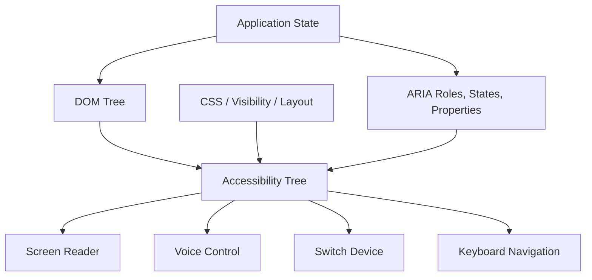
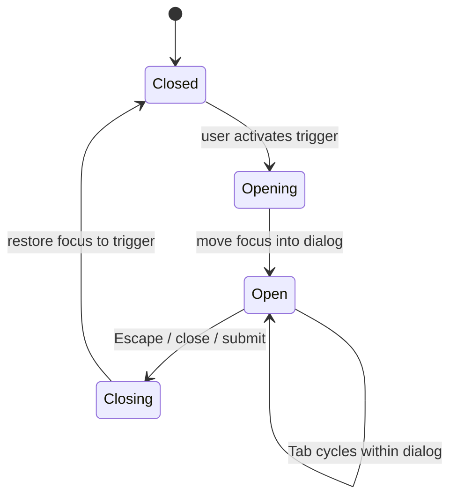
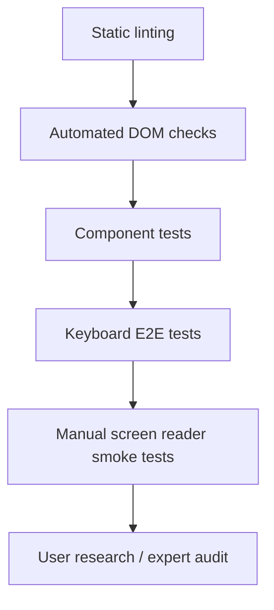
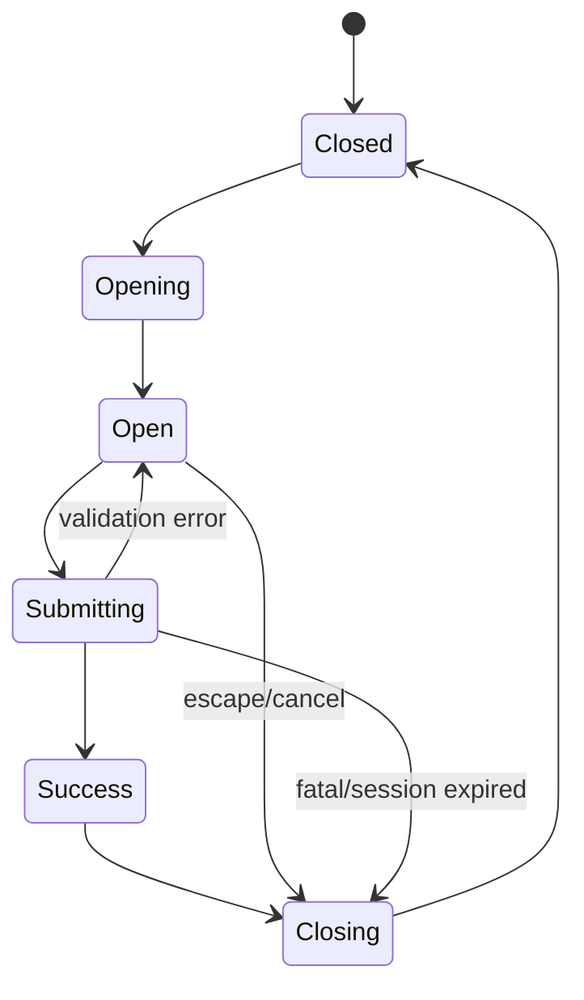

# Part 028 — Accessibility as Engineering Discipline

Accessibility is not decoration, compliance paperwork, or a last-minute audit. For frontend engineering, accessibility is the discipline of making the user interface expose correct semantics, state, structure, feedback, and interaction paths to different human abilities and assistive technologies.

An inaccessible frontend is usually not “missing ARIA.” It is usually a broken contract between:

- the DOM;
- the accessibility tree;
- visual design;
- keyboard behavior;
- focus lifecycle;
- application state;
- routing;
- validation;
- asynchronous feedback;
- assistive technology expectations.

This part treats accessibility as a system property.

---

## 1. Kaufman Skill Deconstruction

To become strong at frontend accessibility, decompose it into observable skills.

| Sub-skill | What You Must Be Able To Do | Common Failure |
|---|---|---|
| Semantic modeling | Choose native elements that communicate role and behavior | Building buttons out of `div` elements |
| Accessibility tree reasoning | Understand what assistive tech receives from DOM/ARIA | Testing only visual output |
| Keyboard interaction | Support tab order, activation, shortcuts, roving focus where needed | Mouse-only widgets |
| Focus management | Move, preserve, trap, restore, and announce focus intentionally | Route/modal opens with lost focus |
| Forms and errors | Associate labels, descriptions, constraints, errors, and summaries | Red border without programmatic error |
| ARIA correctness | Use roles/states/properties only when needed and valid | Adding ARIA that conflicts with native semantics |
| Dynamic content | Announce async changes without noise | Toasts/spinners invisible to screen readers |
| Visual accessibility | Contrast, zoom, reduced motion, target size, layout robustness | Pixel-perfect UI that fails at 200% zoom |
| Testing | Combine automated, keyboard, screen reader, and E2E checks | Assuming Lighthouse score equals accessible |
| Governance | Encode accessibility in design system and CI | Treating a11y as individual hero work |

### Kaufman target performance

After this part, you should be able to review a complex UI and produce an accessibility assessment like this:

```txt
Component: Case Assignment Dialog
Native semantics: dialog, form, combobox/listbox, buttons
Keyboard model: Tab enters dialog; Escape closes; combobox follows APG pattern; focus restored to opener
State exposure: aria-expanded, aria-controls, aria-activedescendant, aria-invalid, aria-describedby
Validation: errors announced and linked to fields; summary receives focus on failed submit
Visual: contrast passes AA; layout works at 200% zoom; reduced motion respected
Tests: axe scan, keyboard path test, Playwright focus assertions, manual NVDA/VoiceOver smoke test
Risk: custom combobox requires strict APG conformance; prefer native select if requirements allow
```

That is engineering-level accessibility.

---

## 2. Core Mental Model: The Accessibility Tree Is an API

Browsers derive an accessibility tree from DOM, CSS, and ARIA. Assistive technologies consume that tree to expose UI to users.



This means accessibility is not just visual styling. It is API design.

If a custom component visually looks like a tab, but the accessibility tree exposes it as anonymous text, it is not a tab. If a form field visually has an error, but the error is not programmatically associated, the UI is not communicating the error to all users.

### Accessibility invariants

| Invariant | Meaning |
|---|---|
| Native first | Prefer semantic HTML before ARIA |
| Name, role, value | Interactive elements must expose what they are and their state |
| Keyboard parity | Anything actionable by pointer must be actionable by keyboard |
| Focus is state | Focus must be intentionally managed across dynamic UI |
| Errors must be programmatic | Validation feedback must be associated and discoverable |
| Visual state needs semantic state | Selected, expanded, checked, busy, invalid must not be only CSS |
| Motion must be optional | Respect reduced motion for non-essential animation |
| Accessibility cannot be fully automated | Automation catches classes of issues, not user experience completeness |

---

## 3. WCAG 2.2 as an Engineering Map

WCAG is organized around four principles: Perceivable, Operable, Understandable, and Robust. These are often called POUR.

| Principle | Engineering Translation |
|---|---|
| Perceivable | Users can perceive information through more than one sensory path |
| Operable | Users can operate the interface with available input methods |
| Understandable | Users can understand content, state, errors, and flow |
| Robust | Markup and behavior work across assistive technologies and user agents |

WCAG conformance uses success criteria at levels A, AA, and AAA. In most product contexts, AA is the practical compliance target, but engineering teams should understand the product/legal context before declaring a target.

### WCAG is necessary but not sufficient

WCAG helps define testable requirements. However, a UI can technically pass many automated checks and still be frustrating or inefficient for real assistive technology users.

Therefore use WCAG as the floor, not the ceiling.

---

## 4. Native HTML First

The most reliable accessibility strategy is to use native elements correctly.

Bad custom button:

```html
<div class="button" onclick="submitForm()">Submit</div>
```

Problems:

- not focusable by default;
- no button role;
- no keyboard activation semantics;
- no disabled semantics;
- may not be discoverable by assistive tech;
- requires manually recreating browser behavior.

Better:

```html
<button type="submit">Submit</button>
```

Native controls provide semantics, keyboard support, form behavior, focus behavior, and accessibility mappings that are hard to replicate correctly.

### Native-first decision rule

```txt
If a native HTML element satisfies the interaction model, use it.
If requirements exceed native behavior, first question the requirement.
If custom behavior is still necessary, implement the full semantic and keyboard contract.
```

---

## 5. Name, Role, Value

For interactive controls, assistive technologies need at least:

| Concept | Meaning |
|---|---|
| Name | What is this control called? |
| Role | What kind of thing is it? |
| Value/state | What is its current value or state? |

Examples:

```html
<button aria-expanded="false" aria-controls="filters-panel">
  Filters
</button>

<section id="filters-panel" hidden>
  <!-- filter controls -->
</section>
```

The button has:

```txt
Name: Filters
Role: button
State: collapsed/expanded
Relationship: controls filters-panel
```

### Accessible name sources

Common sources of accessible names:

```html
<button>Save</button>

<label for="email">Email</label>
<input id="email" type="email" />

<button aria-label="Close dialog">×</button>

<h2 id="dialog-title">Assign case</h2>
<div role="dialog" aria-labelledby="dialog-title"></div>
```

Avoid using `aria-label` to paper over poor visible labels. Visible text is usually better for all users.

---

## 6. Keyboard Interaction

Keyboard support is not only “press Tab and hope.” Different widgets have different expected keyboard models.

### Basic keyboard expectations

| Interaction | Expected Behavior |
|---|---|
| `Tab` | Move to next focusable element |
| `Shift+Tab` | Move to previous focusable element |
| `Enter` | Activate links/buttons, submit forms where appropriate |
| `Space` | Activate buttons/checkboxes, toggle relevant controls |
| `Escape` | Close dismissible overlays/dialogs/menus where appropriate |
| Arrow keys | Navigate inside composite widgets like menus, tabs, listboxes |
| Home/End | Often move to first/last item in composite widgets |

### Do not destroy tab order

Avoid positive `tabindex`:

```html
<!-- Bad: creates artificial and fragile focus order -->
<button tabindex="3">Third</button>
<button tabindex="1">First</button>
<button tabindex="2">Second</button>
```

Prefer DOM order matching visual/logical order.

Use `tabindex="0"` only when custom focusability is genuinely needed, and `tabindex="-1"` for programmatic focus targets.

---

## 7. Focus Management

Focus is application state. Treat it as seriously as data state.

### Common focus failure modes

| Scenario | Failure |
|---|---|
| Modal opens | Focus remains behind modal |
| Modal closes | Focus disappears or goes to top of page |
| Route changes | Screen reader user receives no context |
| Validation fails | User is not moved to error summary/field |
| Toast appears | Announcement is never exposed |
| Loading finishes | Focus jumps unexpectedly |
| Virtualized list updates | Focused item unmounts |
| Tab panel changes | Active tab and panel relationship breaks |

### Modal focus lifecycle



Minimal dialog skeleton:

```html
<button id="assign-button">Assign case</button>

<div
  role="dialog"
  aria-modal="true"
  aria-labelledby="assign-title"
  hidden
>
  <h2 id="assign-title">Assign case</h2>
  <button type="button">Close</button>
  <form>
    <label for="assignee">Assignee</label>
    <input id="assignee" name="assignee" />
    <button type="submit">Assign</button>
  </form>
</div>
```

For production, implement or use a well-tested dialog primitive that handles:

- initial focus;
- focus trap;
- inert background;
- Escape behavior;
- scroll lock;
- nested dialog policy;
- focus restore;
- screen reader announcement;
- cleanup on unmount.

---

## 8. ARIA: Powerful, Dangerous, Often Unnecessary

ARIA can repair missing semantics only when used correctly. It cannot make non-interactive behavior accessible by itself.

### The first rule

> Do not use ARIA when native HTML already provides the semantics and behavior.

Bad:

```html
<div role="button" onclick="save()">Save</div>
```

Better:

```html
<button type="button">Save</button>
```

### ARIA can lie

```html
<div role="checkbox" aria-checked="true">
  Receive notifications
</div>
```

This announces as a checkbox, but unless you implement focusability, keyboard toggle, state updates, form integration, and disabled behavior, the component is semantically misleading.

### ARIA state must match visual and application state

```tsx
function Disclosure({ open, onToggle, children }) {
  return (
    <>
      <button
        type="button"
        aria-expanded={open}
        aria-controls="advanced-options"
        onClick={onToggle}
      >
        Advanced options
      </button>
      <div id="advanced-options" hidden={!open}>
        {children}
      </div>
    </>
  );
}
```

The bug to avoid:

```txt
Panel is visually open, but aria-expanded remains false.
```

That is state drift.

---

## 9. Composite Widgets

Composite widgets include tabs, menus, listboxes, trees, grids, comboboxes, and carousels. These are high-risk accessibility components because they require coordinated keyboard behavior and ARIA state.

### Roving `tabindex`

For some widgets, only one item is in the Tab order; arrow keys move focus inside the widget.

```tsx
function RovingTabList({ tabs, activeIndex, setActiveIndex }) {
  return (
    <div role="tablist" aria-label="Case sections">
      {tabs.map((tab, index) => (
        <button
          key={tab.id}
          role="tab"
          id={`tab-${tab.id}`}
          aria-selected={index === activeIndex}
          aria-controls={`panel-${tab.id}`}
          tabIndex={index === activeIndex ? 0 : -1}
          onClick={() => setActiveIndex(index)}
          onKeyDown={(event) => {
            if (event.key === 'ArrowRight') setActiveIndex((index + 1) % tabs.length);
            if (event.key === 'ArrowLeft') setActiveIndex((index - 1 + tabs.length) % tabs.length);
          }}
        >
          {tab.label}
        </button>
      ))}
    </div>
  );
}
```

This is only part of the solution. A full implementation must also move focus when active index changes and link panels correctly.

### `aria-activedescendant`

Some widgets keep DOM focus on an input while exposing a virtual active option.

```html
<input
  role="combobox"
  aria-expanded="true"
  aria-controls="assignee-listbox"
  aria-activedescendant="assignee-option-2"
/>

<ul id="assignee-listbox" role="listbox">
  <li id="assignee-option-1" role="option">Ayu</li>
  <li id="assignee-option-2" role="option" aria-selected="true">Bima</li>
</ul>
```

Comboboxes are complex. Prefer native controls unless product requirements justify custom behavior.

---

## 10. Forms, Validation, and Error Semantics

Forms are where accessibility and correctness intersect strongly.

### Label association

Good:

```html
<label for="case-title">Case title</label>
<input id="case-title" name="title" />
```

Also good:

```html
<label>
  Case title
  <input name="title" />
</label>
```

Bad:

```html
<span>Case title</span>
<input name="title" />
```

A visual label is not always a programmatic label.

### Error association

```html
<label for="amount">Penalty amount</label>
<input
  id="amount"
  name="amount"
  inputmode="decimal"
  aria-invalid="true"
  aria-describedby="amount-help amount-error"
/>
<p id="amount-help">Enter the amount in IDR.</p>
<p id="amount-error">Amount is required before approval.</p>
```

The field exposes:

```txt
- label
- input type expectations
- invalid state
- help text
- error message
```

### Failed submit flow

For complex forms, use an error summary.

```html
<div role="alert" tabindex="-1" id="error-summary">
  <h2>There are 3 problems with this form</h2>
  <ul>
    <li><a href="#amount">Penalty amount is required</a></li>
    <li><a href="#assignee">Assignee is required</a></li>
  </ul>
</div>
```

On submit failure:

```js
const summary = document.getElementById('error-summary');
summary?.focus();
```

Do not move focus on every keystroke. Move focus intentionally after user action.

---

## 11. Dynamic Content and Live Regions

SPAs update content without full page loads. Assistive technologies may not announce these changes unless you expose them correctly.

### Polite status

```html
<div role="status" aria-live="polite">
  Saving draft...
</div>
```

Use for non-urgent updates.

### Assertive alert

```html
<div role="alert">
  Your session is about to expire.
</div>
```

Use sparingly. Too many assertive announcements create noise.

### Async state invariant

```txt
If visual UI communicates loading, success, failure, or changed result count, assistive technology should also be able to perceive it.
```

Examples:

```html
<div role="status" aria-live="polite">
  24 results found.
</div>
```

```html
<button type="submit" aria-busy="true">
  Saving...
</button>
```

Avoid announcing every tiny state transition. Announce meaningful outcomes.

---

## 12. Routing and Page-Level Accessibility

SPA routing can break browser and screen reader expectations because the page does not truly reload.

On route change, handle:

| Concern | Recommended Behavior |
|---|---|
| Document title | Update to represent new view |
| Main heading | Ensure each route has meaningful `h1` |
| Focus | Move focus to main content or heading when appropriate |
| Scroll | Restore or reset intentionally |
| Announcement | Optionally announce route change in polite live region |
| Loading | Expose route transition state |

Example route shell:

```html
<a href="#main" class="skip-link">Skip to main content</a>

<header>...</header>
<nav aria-label="Primary">...</nav>

<main id="main" tabindex="-1">
  <h1>Case details</h1>
  <!-- route content -->
</main>
```

After navigation:

```js
const main = document.getElementById('main');
main?.focus();
```

Do this with nuance. Some intra-page transitions should preserve focus instead of moving it.

---

## 13. Visual Accessibility

Visual accessibility is not only color contrast.

### Contrast

Text and UI controls need sufficient contrast. But contrast is only one dimension.

### Zoom and reflow

Users may zoom to 200% or use large text. Layout should not require horizontal scrolling for ordinary reading and interaction.

Common failures:

```txt
- fixed-height cards clipping text
- sticky headers covering focused fields
- modals exceeding viewport without scroll strategy
- icon-only controls without accessible names
- text embedded in images
- line-height too tight for larger fonts
```

### Motion

Respect `prefers-reduced-motion`.

```css
@media (prefers-reduced-motion: reduce) {
  *,
  *::before,
  *::after {
    animation-duration: 0.01ms !important;
    animation-iteration-count: 1 !important;
    scroll-behavior: auto !important;
    transition-duration: 0.01ms !important;
  }
}
```

Use this carefully. Some transitions are meaningful state communication; replace them with non-motion equivalents when needed.

### Target size and pointer alternatives

Pointer targets should be easy to activate. Drag-only interactions require alternatives.

```txt
Bad: reorder items only by drag-and-drop.
Better: provide Move up / Move down controls and keyboard support.
```

---

## 14. Hidden Content and Visibility

Different hiding techniques affect different users.

| Technique | Visible? | In accessibility tree? | Use Case |
|---|---:|---:|---|
| `display: none` | No | No | Truly hidden content |
| `hidden` | No | No | Collapsed inactive content |
| `visibility: hidden` | No | Usually no | Invisible but layout reserved |
| `aria-hidden="true"` | Maybe | No | Hide decorative/duplicate content from AT |
| visually hidden CSS | No | Yes | Text for screen readers |
| `inert` | Visible maybe | Not interactive | Disable background during modal |

Visually hidden utility:

```css
.visually-hidden {
  position: absolute;
  width: 1px;
  height: 1px;
  padding: 0;
  margin: -1px;
  overflow: hidden;
  clip: rect(0, 0, 0, 0);
  white-space: nowrap;
  border: 0;
}
```

Do not put focusable content inside `aria-hidden="true"` containers. That creates severe navigation confusion.

---

## 15. Accessibility in Component Architecture

Accessibility must be encoded in components, not remembered by every feature team.

### Component contract example

```ts
type DialogProps = {
  open: boolean;
  title: string;
  initialFocusRef?: React.RefObject<HTMLElement>;
  returnFocusRef?: React.RefObject<HTMLElement>;
  closeOnEscape?: boolean;
  onClose: () => void;
};
```

The dialog primitive owns:

```txt
- role="dialog"
- aria-modal
- title association
- focus trap
- initial focus
- Escape behavior
- focus restore
- background inertness
- scroll lock policy
- nested modal policy
```

Feature teams should not reimplement these in every dialog.

### Design-system accessibility requirements

| Primitive | Required Contract |
|---|---|
| Button | Native button, loading state, disabled semantics, accessible name |
| Link | Real `a href` for navigation, visible focus state |
| Dialog | Focus lifecycle, modal semantics, escape/restore |
| Tabs | APG keyboard model, selected state, panel relationship |
| Combobox | Name, expanded state, option semantics, keyboard model |
| Toast | Live region strategy and dismissal |
| Form field | Label/help/error association |
| Table/grid | Header association, keyboard model if interactive |
| Menu | Correct menu semantics only for application menus, not generic nav |

Accessibility debt in primitives multiplies across the product.

---

## 16. Testing Strategy

Accessibility testing must combine multiple methods.



### Automated tools catch common issues

Automated checks can find:

- missing labels;
- invalid ARIA attributes;
- insufficient contrast in some cases;
- missing alt text;
- duplicate IDs;
- landmark issues;
- basic role violations.

They often cannot fully verify:

- whether the chosen interaction pattern is understandable;
- whether focus movement is helpful;
- whether screen reader announcements are too noisy;
- whether the accessible name is meaningful;
- whether custom keyboard behavior matches user expectations;
- whether task completion is efficient.

### Playwright keyboard test example

```ts
import { test, expect } from '@playwright/test';

test('assignment dialog traps and restores focus', async ({ page }) => {
  await page.goto('/cases/123');

  const opener = page.getByRole('button', { name: 'Assign case' });
  await opener.focus();
  await page.keyboard.press('Enter');

  const dialog = page.getByRole('dialog', { name: 'Assign case' });
  await expect(dialog).toBeVisible();

  await expect(page.getByLabel('Assignee')).toBeFocused();

  await page.keyboard.press('Escape');
  await expect(dialog).toBeHidden();
  await expect(opener).toBeFocused();
});
```

### Testing matrix

| Level | Tooling | Purpose |
|---|---|---|
| Lint | eslint-plugin-jsx-a11y or equivalent | Catch obvious semantic mistakes |
| Component | Testing Library | Verify roles, names, states, labels |
| E2E | Playwright | Verify keyboard path and focus lifecycle |
| Automated a11y | axe/Lighthouse-like tooling | Catch common WCAG violations |
| Manual | NVDA/JAWS/VoiceOver/TalkBack | Validate real assistive tech experience |
| Design review | Token/component review | Prevent inaccessible patterns early |

---

## 17. Screen Reader Testing Practical Notes

Screen readers differ. Browsers differ. Operating systems differ.

A practical minimum smoke matrix:

| Platform | Common Pairing |
|---|---|
| Windows | NVDA + Firefox/Chrome |
| macOS | VoiceOver + Safari |
| iOS | VoiceOver + Safari |
| Android | TalkBack + Chrome |

You do not need to test every feature in every combination every time. Use risk-based selection:

- custom widgets;
- modals;
- forms;
- data grids;
- complex navigation;
- async flows;
- high-value user journeys.

### What to check manually

```txt
1. Can user discover the page structure by headings/landmarks?
2. Can user identify each control by name and role?
3. Are state changes announced correctly?
4. Can user complete the task without mouse?
5. Are errors understandable and linked to fields?
6. Does focus move predictably?
7. Is there too much announcement noise?
8. Does the reading order match visual/logical order?
```

---

## 18. Complex UI Case Studies

### Case 1: Data table vs grid

If table is read-only data, use semantic table.

```html
<table>
  <caption>Open enforcement cases</caption>
  <thead>
    <tr>
      <th scope="col">Case ID</th>
      <th scope="col">Status</th>
      <th scope="col">Owner</th>
    </tr>
  </thead>
  <tbody>
    <tr>
      <th scope="row">CASE-123</th>
      <td>Under review</td>
      <td>Ayu</td>
    </tr>
  </tbody>
</table>
```

If it behaves like a spreadsheet with cell focus, editing, selection, and arrow-key navigation, it becomes a much more complex grid pattern. Do not use `role="grid"` lightly.

### Case 2: Toast notifications

A toast that says “Saved” visually but is not announced creates uncertainty for screen reader users.

```html
<div role="status" aria-live="polite" aria-atomic="true">
  Draft saved
</div>
```

For destructive or urgent failures, use assertive alert carefully.

### Case 3: Icon-only button

```html
<button type="button" aria-label="Delete case note">
  <svg aria-hidden="true" focusable="false">...</svg>
</button>
```

Do not rely on SVG title alone unless behavior is verified across target assistive tech.

### Case 4: Disabled actions

A disabled button may not be focusable and may hide the reason from keyboard users.

Consider:

```html
<button type="button" disabled aria-describedby="approve-disabled-reason">
  Approve
</button>
<p id="approve-disabled-reason">
  This case cannot be approved until evidence review is complete.
</p>
```

In some designs, a focusable explanation near the action is better than a disabled control with no discoverable reason.

---

## 19. Accessibility and State Machines

Many accessibility bugs are state machine bugs.

Example modal states:



Each transition has accessibility obligations.

| Transition | Obligation |
|---|---|
| Closed → Opening | Save return focus target |
| Opening → Open | Move focus to title/first field |
| Open → Submitting | Expose busy state |
| Submitting → Open error | Announce error and focus summary/field |
| Submitting → Success | Announce success |
| Closing → Closed | Restore focus or choose safe fallback |

This is why accessibility belongs in workflow modeling, not only component styling.

---

## 20. Accessibility Review Checklist

### Structure

- [ ] Page has meaningful `title`.
- [ ] Page has one clear primary `h1`.
- [ ] Headings form a logical outline.
- [ ] Landmarks are present and not excessive.
- [ ] Skip link exists for repeated navigation.

### Controls

- [ ] Native controls are used where possible.
- [ ] Every control has accessible name.
- [ ] Role matches behavior.
- [ ] State is exposed: expanded, selected, checked, invalid, busy.
- [ ] Disabled/unavailable actions are understandable.

### Keyboard

- [ ] All actions are keyboard reachable.
- [ ] Focus order is logical.
- [ ] Visible focus indicator is strong.
- [ ] No keyboard trap except intentional modal trap.
- [ ] Composite widgets follow expected keyboard model.

### Focus

- [ ] Dialogs move focus in and restore focus out.
- [ ] Route changes manage focus intentionally.
- [ ] Validation failures focus useful target.
- [ ] Async content does not steal focus unexpectedly.
- [ ] Virtualized content does not unmount focused item without strategy.

### Forms

- [ ] Labels are programmatically associated.
- [ ] Help text is linked through `aria-describedby` where needed.
- [ ] Errors use `aria-invalid` and are linked.
- [ ] Error summary is reachable and useful.
- [ ] Required fields are communicated clearly.

### Dynamic content

- [ ] Loading/saving/result updates are exposed.
- [ ] Live regions are used sparingly and intentionally.
- [ ] Toasts are announced or redundant with page state.
- [ ] Progress is communicated for long operations.

### Visual

- [ ] Contrast meets target.
- [ ] Layout works with zoom and large text.
- [ ] UI works in high contrast/forced colors where relevant.
- [ ] Motion respects `prefers-reduced-motion`.
- [ ] Pointer targets are sufficiently large.

### Testing

- [ ] Automated a11y checks pass for critical views.
- [ ] Keyboard E2E tests cover critical journeys.
- [ ] Manual screen reader smoke test completed for high-risk widgets.
- [ ] Design-system primitives have accessibility contract tests.

---

## 21. Anti-Patterns

### Anti-pattern 1: ARIA as paint

```html
<div role="button">Save</div>
```

ARIA changes semantics, not behavior. You still owe focus and keyboard support.

### Anti-pattern 2: Hidden accessible mess

```html
<div aria-hidden="true">
  <button>Focusable but hidden from assistive tech</button>
</div>
```

This creates inconsistent navigation.

### Anti-pattern 3: Placeholder as label

```html
<input placeholder="Email" />
```

Placeholder disappears, has poor contrast in many designs, and is not a reliable label substitute.

### Anti-pattern 4: Visual-only error

```html
<input class="error" />
```

A red border does not communicate the problem programmatically.

### Anti-pattern 5: Custom everything

Building custom select, date picker, combobox, menu, dialog, grid, and tooltip primitives without deep accessibility investment creates systemic risk.

---

## 22. Accessibility Governance

For large teams, accessibility must be moved left into design and platform.

### Governance model

| Stage | Accessibility Gate |
|---|---|
| Design | Pattern reviewed; contrast and interaction model defined |
| Component | Primitive implements semantic/keyboard/focus contract |
| Feature | Uses approved primitives or documents exception |
| Pull request | Lint, component tests, keyboard path review |
| CI | Automated a11y checks on critical pages |
| Release | Risk-based manual smoke testing |
| Production | User feedback, support triage, regression tracking |

### Definition of done for interactive feature

```txt
- Works with keyboard only.
- Exposes correct name, role, value, and state.
- Has visible focus state.
- Handles loading, success, and error accessibly.
- Has no obvious automated a11y violations.
- Critical path has at least one keyboard E2E test.
- If custom widget, follows documented pattern and has manual AT smoke test.
```

---

## 23. Deliberate Practice Loop

### Exercise 1 — Accessibility tree inspection

Pick a complex component and inspect it in browser accessibility tools.

Write down:

```txt
- role
- accessible name
- state
- description
- focusability
- parent/child structure
- mismatch from visual UI
```

### Exercise 2 — Keyboard-only journey

Complete a critical workflow without mouse:

```txt
1. Open page.
2. Navigate to form.
3. Fill fields.
4. Trigger validation error.
5. Fix error.
6. Submit.
7. Confirm success.
```

Record every focus issue.

### Exercise 3 — Fix a custom control

Take a custom dropdown or tab component and make it conform to expected keyboard/ARIA behavior.

Deliverables:

```txt
- component code
- keyboard behavior table
- accessibility tree screenshot/notes
- Playwright focus test
- manual screen reader notes
```

### Exercise 4 — Design-system contract

Write an accessibility contract for one primitive:

```txt
Component: Dialog
Required roles/attributes:
Keyboard behavior:
Focus lifecycle:
Screen reader behavior:
Testing requirements:
Known limitations:
```

---

## 24. Summary

Accessibility is frontend correctness across different human abilities and assistive technologies.

The key mental models:

1. The accessibility tree is an API.
2. Native HTML is the highest-leverage accessibility tool.
3. ARIA must match behavior and state; otherwise it lies.
4. Keyboard support is not optional for interactive UI.
5. Focus is application state.
6. Dynamic content requires intentional announcements.
7. Automated tools are useful but incomplete.
8. Design-system primitives determine accessibility at scale.
9. Accessibility bugs are often state, routing, validation, and lifecycle bugs.

A top-tier frontend engineer does not treat accessibility as a specialist-only concern. They design components, workflows, and review gates so accessible behavior is the default path, not a heroic exception.

---

## References

- WCAG 2.2 Recommendation: `https://www.w3.org/TR/WCAG22/`
- W3C WCAG Overview: `https://www.w3.org/WAI/standards-guidelines/wcag/`
- WCAG 2.2 Quick Reference: `https://www.w3.org/WAI/WCAG22/quickref/`
- WAI-ARIA Authoring Practices Guide: `https://www.w3.org/WAI/ARIA/apg/`
- WAI-ARIA Keyboard Interface Practice: `https://www.w3.org/WAI/ARIA/apg/practices/keyboard-interface/`
- MDN Accessibility: `https://developer.mozilla.org/en-US/docs/Web/Accessibility`
- MDN ARIA: `https://developer.mozilla.org/en-US/docs/Web/Accessibility/ARIA`
