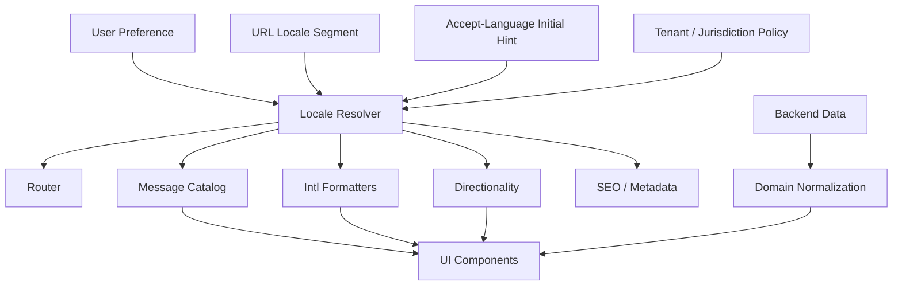
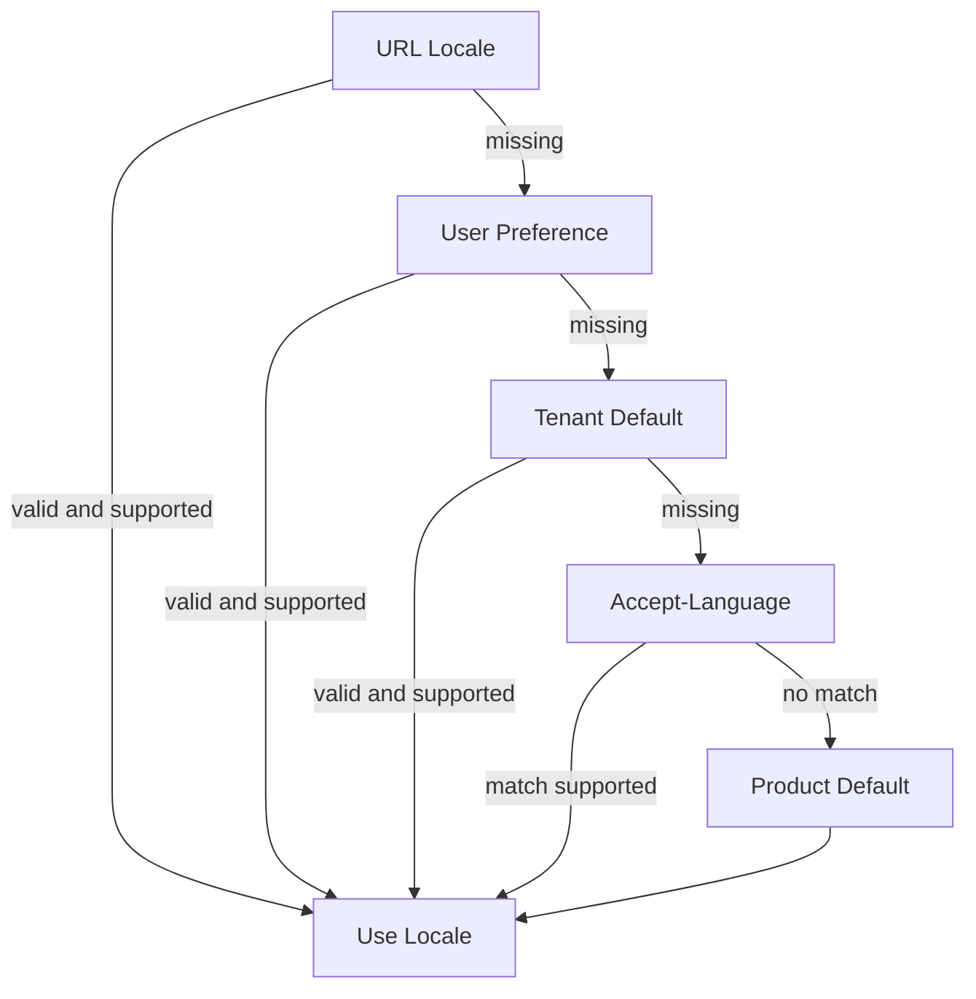
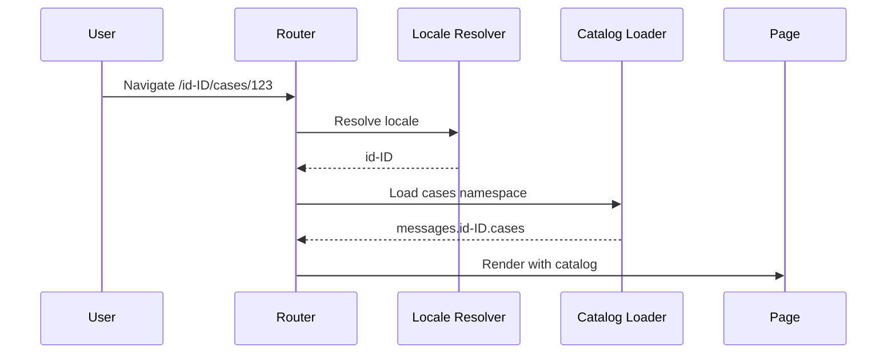

# Part 029 — Internationalization, Localization, and Time

Internationalization is the engineering discipline of making a frontend system capable of operating correctly across languages, locales, writing systems, currencies, calendars, time zones, legal formats, and cultural expectations.

Localization is the act of adapting the product for a specific locale.

The difference matters:

```txt
Internationalization = design the system so localization is possible and safe.
Localization        = provide locale-specific language, data, formatting, assets, and behavior.
```

A system that hardcodes English strings, US date formats, LTR layouts, plural rules, and local machine time is not merely “not translated yet.” It is architecturally hostile to localization.

This part treats i18n and time correctness as core frontend engineering, not as an afterthought.

---

## 1. Kaufman Skill Deconstruction

To become strong at frontend internationalization, decompose the skill into observable sub-skills.

| Sub-skill | What You Must Be Able To Do | Common Failure |
|---|---|---|
| Locale modeling | Distinguish language, region, script, numbering system, calendar, and timezone | Treating `en` and `en-US` as interchangeable |
| Message design | Externalize text while preserving grammar, variables, pluralization, and context | String concatenation with translated fragments |
| Formatting | Format dates, numbers, currency, units, lists, relative time, and names using locale-aware APIs | Hardcoding `MM/DD/YYYY` or comma decimal separator |
| Unicode handling | Reason about code units, code points, grapheme clusters, normalization, emoji, and text length | Breaking strings by `.length` or `slice()` |
| Time correctness | Separate instant, local date, timezone, duration, and calendar representation | Storing future appointments as local strings |
| Directionality | Support RTL, bidi text, logical CSS, mirroring, and icon policy | Reversing layout with visual CSS hacks only |
| Translation workflow | Design stable keys, context, screenshots, QA, and release process | Translators receive isolated words without meaning |
| Routing and content | Model locale in URL, metadata, content negotiation, and SEO | Locale hidden in global state only |
| Testing | Validate formats, plural categories, RTL layout, pseudo-localization, timezone edge cases | Testing only `en-US` on developer laptop |
| Governance | Put i18n contracts into components, design system, CI, and review process | Reliance on heroic manual fixes before launch |

### Kaufman target performance

After this part, you should be able to review a frontend feature and produce an i18n assessment like this:

```txt
Feature: Case Hearing Scheduler
Locales: en-US, en-GB, id-ID, ar-EG, ja-JP
Locale source: URL segment, persisted preference fallback, Accept-Language initial hint
Text: all user-visible strings externalized with stable message IDs
Pluralization: ICU-style plural messages for count-dependent text
Date/time: hearing instant stored in UTC; rendered with case jurisdiction timezone
Local dates: filing deadline modeled as calendar date, not midnight UTC instant
Formats: Intl.DateTimeFormat, Intl.NumberFormat, Intl.RelativeTimeFormat
Direction: supports dir="rtl" at document/root boundary; logical CSS used
Testing: pseudo-locale, RTL smoke, DST transition, timezone matrix, screenshot diff
Risk: legal notices require jurisdiction-approved translations; block release without legal QA
```

That is engineering-level i18n.

---

## 2. Core Mental Model: Locale Is Not Language

A language is not enough to localize an application.

```txt
Language: en, id, ar, ja
Region: US, GB, ID, EG, JP
Script: Latn, Arab, Hans, Hant
Calendar: gregory, buddhist, japanese, islamic
Numbering system: latn, arab, hanidec
Timezone: Asia/Jakarta, Europe/London, America/New_York
Currency: USD, GBP, IDR, JPY
Direction: ltr, rtl
```

A locale tag such as `en-US`, `en-GB`, `zh-Hans-CN`, or `sr-Cyrl-RS` carries more information than a simple language code.

### Wrong model

```txt
User speaks English -> show English strings -> done
```

### Better model

```txt
User locale influences:
- language of messages
- date and time format
- numbering system
- currency display
- plural rules
- collation/search/sort behavior
- list formatting
- text direction
- fallback chain
- legal/compliance content
- route/content variant
```

### Locale-related invariants

| Invariant | Why It Matters |
|---|---|
| Language is not region | `en-US` and `en-GB` differ in dates, spelling, and sometimes legal wording |
| Locale is not timezone | A user can use `en-US` while located in `Asia/Jakarta` |
| Timezone is not offset | Offset changes due to daylight saving and historical rules |
| Currency is not locale | A user in Indonesia can view USD invoices |
| Direction is not always language-only | Mixed-language content can contain bidi fragments |
| Translation is not formatting | Translated text still needs locale-aware values |
| User preference is not the only source | Jurisdiction, tenant, document language, or case region may override UI language |

---

## 3. The Internationalization System Boundary

In a production frontend, i18n is a cross-cutting architecture concern.



The frontend i18n boundary must answer:

```txt
1. What locale is active?
2. Who owns locale selection?
3. How is locale represented in URL and app state?
4. What fallback chain is allowed?
5. Which values are formatted on client vs server?
6. Which strings are legal/compliance approved?
7. How do we test locale correctness before release?
```

---

## 4. JavaScript Intl API as a Platform Primitive

Modern JavaScript provides the `Intl` namespace for language-sensitive formatting and comparison.

Important APIs include:

| API | Use Case |
|---|---|
| `Intl.DateTimeFormat` | Locale-aware date/time formatting |
| `Intl.NumberFormat` | Number, currency, percent formatting |
| `Intl.PluralRules` | Locale-specific plural category selection |
| `Intl.RelativeTimeFormat` | “3 days ago”, “in 2 hours” |
| `Intl.ListFormat` | Locale-aware list joining |
| `Intl.DisplayNames` | Localized names of languages, regions, scripts, currencies |
| `Intl.Collator` | Locale-aware sorting/search comparison |
| `Intl.Segmenter` | Locale-sensitive segmentation of words/graphemes/sentences |
| `Intl.Locale` | Locale parsing and manipulation |

Do not hand-roll these unless there is a very specific domain reason.

### Example: number formatting

```ts
const amount = 1234567.89;

new Intl.NumberFormat("en-US", {
  style: "currency",
  currency: "USD",
}).format(amount);
// "$1,234,567.89"

new Intl.NumberFormat("id-ID", {
  style: "currency",
  currency: "IDR",
}).format(amount);
// "Rp1.234.567,89" depending on runtime locale data
```

### Example: date formatting

```ts
const instant = new Date("2026-06-27T05:30:00Z");

new Intl.DateTimeFormat("en-GB", {
  dateStyle: "full",
  timeStyle: "short",
  timeZone: "Europe/London",
}).format(instant);

new Intl.DateTimeFormat("id-ID", {
  dateStyle: "full",
  timeStyle: "short",
  timeZone: "Asia/Jakarta",
}).format(instant);
```

Notice the key distinction:

```txt
The instant is the same.
The representation changes by locale and timezone.
```

### Formatter construction cost

Creating formatters repeatedly can be wasteful in hot paths.

Prefer memoized formatters:

```ts
type DateFormatterKey = `${string}|${string}|${string}`;

const dateFormatterCache = new Map<DateFormatterKey, Intl.DateTimeFormat>();

function getDateFormatter(locale: string, timeZone: string, dateStyle: Intl.DateTimeFormatOptions["dateStyle"]) {
  const key: DateFormatterKey = `${locale}|${timeZone}|${dateStyle ?? "default"}`;

  let formatter = dateFormatterCache.get(key);

  if (!formatter) {
    formatter = new Intl.DateTimeFormat(locale, {
      dateStyle,
      timeZone,
    });
    dateFormatterCache.set(key, formatter);
  }

  return formatter;
}
```

This is especially relevant for tables, virtualized lists, logs, timelines, and dashboards.

---

## 5. Message Design: Do Not Concatenate Human Language

This is one of the most important rules:

```txt
Never build user-facing sentences by concatenating translated fragments.
```

Bad:

```ts
const text = t("youHave") + " " + count + " " + t("newMessages");
```

This assumes English word order, spacing, pluralization, and grammar.

Better:

```txt
inbox.unreadMessageCount =
  one: "You have {count} new message"
  other: "You have {count} new messages"
```

Even better in a system using ICU-style messages:

```txt
{count, plural,
  =0 {You have no new messages}
  one {You have one new message}
  other {You have # new messages}
}
```

### Message design invariants

| Invariant | Explanation |
|---|---|
| Full sentence per message | Preserve grammar and word order |
| Variables are typed | Date, number, currency, person name, and count are not arbitrary strings |
| Plurals use locale rules | English has one/other; other languages may have more categories |
| Context is provided | Translators need screen, state, and user intent |
| Keys are stable | Translation keys should not change because English copy changes |
| Rich text is structured | Avoid raw HTML in translations unless explicitly sanitized and controlled |
| Legal text is governed | Compliance copy may need approval, versioning, and audit trail |

---

## 6. Translation Key Strategy

A translation key is a product API.

Bad key:

```txt
submit
```

Why bad?

```txt
- Submit what?
- Button or heading?
- Formal or casual?
- Reusable or context-specific?
- Does change in English require new translation?
```

Better:

```txt
case.assignment.form.submitButton.label
```

Good keys encode domain and usage, not only English content.

### Key strategy options

| Strategy | Example | Pros | Cons |
|---|---|---|---|
| Semantic key | `case.form.submitButton.label` | Stable, contextual | Requires discipline |
| English-as-key | `"Submit case"` | Fast, simple | Key churn when copy changes; weak context |
| Hash key | `msg_9a81f` | Stable, tool-friendly | Not human-readable |
| Hybrid | `case.form.submitButton.label = "Submit case"` | Practical for teams | Needs extraction governance |

For complex engineering teams, semantic keys usually scale better.

### Translation metadata

Every non-trivial message should carry enough metadata for localization.

```json
{
  "id": "case.assignment.form.assignee.label",
  "defaultMessage": "Assignee",
  "description": "Label for the user/person field in the case assignment form.",
  "screen": "Case Assignment Dialog",
  "placeholders": {},
  "notes": "Noun. Do not translate as action verb."
}
```

For risky strings:

```json
{
  "id": "case.enforcement.notice.legalDisclaimer",
  "defaultMessage": "This notice does not constitute final agency action.",
  "description": "Legal disclaimer shown before enforcement notice submission.",
  "requiresLegalApproval": true,
  "jurisdictions": ["US-FED", "ID-OJK"],
  "version": "2026-06-27"
}
```

---

## 7. Pluralization Is a Domain Bug Factory

Pluralization is not just adding `s`.

Bad:

```ts
const label = `${count} item${count === 1 ? "" : "s"}`;
```

This assumes English.

Use `Intl.PluralRules` or an i18n library that uses CLDR plural categories.

```ts
const rules = new Intl.PluralRules("en-US");

const messages = {
  one: "1 item",
  other: "{count} items",
};

function formatItemCount(count: number) {
  const category = rules.select(count);
  const template = messages[category as "one" | "other"] ?? messages.other;

  return template.replace("{count}", String(count));
}
```

A real system should not implement message formatting manually like this, but the example shows the mental model.

### Plural categories

Plural categories are not simply singular/plural. CLDR plural categories may include:

```txt
zero
one
two
few
many
other
```

Your message infrastructure should support all categories required by target locales.

### Pluralization invariants

| Invariant | Explanation |
|---|---|
| Counts use plural rules | Never concatenate `s` |
| Zero may need special wording | “No cases assigned” often reads better than “0 cases assigned” |
| Ordinals differ from cardinals | “1 item” and “1st item” use different rules |
| Variables preserve number formatting | `#` or count should be locale-formatted |
| Translations own grammar | Do not force source-language sentence structure |

---

## 8. Rich Text Messages Without Security Debt

Many UIs need messages with links or emphasized fragments.

Bad:

```tsx
<div dangerouslySetInnerHTML={{ __html: t("termsHtml") }} />
```

This creates XSS and governance risk unless the translation pipeline is heavily controlled and sanitized.

Better: structured rich text placeholders.

```tsx
<Trans
  id="signup.terms.notice"
  components={{
    termsLink: <a href="/terms" />,
    privacyLink: <a href="/privacy" />,
  }}
/>
```

Message:

```txt
By continuing, you agree to our <termsLink>Terms</termsLink> and <privacyLink>Privacy Policy</privacyLink>.
```

### Rich text invariants

| Invariant | Explanation |
|---|---|
| Translators control order | Link placement may move by language |
| Developers control elements | Translation cannot inject arbitrary HTML |
| Components are named semantically | `termsLink`, not `link1` |
| Accessibility is preserved | Links/buttons keep accessible names and focus behavior |
| Sanitization is explicit | If HTML is unavoidable, sanitize at boundary and document risk |

---

## 9. Locale Negotiation and Fallback

Locale resolution is a policy decision.

Inputs may include:

```txt
- URL locale segment: /id/cases
- User profile preference
- Tenant default
- Browser Accept-Language
- Case/document language
- Jurisdiction requirement
- Product default
```

A common resolution strategy:



### Example resolver

```ts
const supportedLocales = ["en-US", "en-GB", "id-ID", "ar-EG", "ja-JP"] as const;
type SupportedLocale = (typeof supportedLocales)[number];

function isSupportedLocale(value: string): value is SupportedLocale {
  return (supportedLocales as readonly string[]).includes(value);
}

function resolveLocale(input: {
  urlLocale?: string;
  userLocale?: string;
  tenantLocale?: string;
  acceptedLocales?: string[];
  defaultLocale: SupportedLocale;
}): SupportedLocale {
  const candidates = [
    input.urlLocale,
    input.userLocale,
    input.tenantLocale,
    ...(input.acceptedLocales ?? []),
    input.defaultLocale,
  ];

  for (const candidate of candidates) {
    if (candidate && isSupportedLocale(candidate)) {
      return candidate;
    }
  }

  return input.defaultLocale;
}
```

This example is intentionally conservative. In production, you may also implement language fallback:

```txt
pt-BR -> pt -> default
zh-Hant-TW -> zh-Hant -> zh -> default
```

But fallback must be explicit and tested.

### Fallback risks

| Risk | Example |
|---|---|
| Silent mixed language UI | Half English, half Indonesian screen |
| Wrong legal copy | Fallback to generic text where jurisdiction-specific text is required |
| Wrong script | Serbian Latin fallback for Cyrillic users |
| Wrong region | `en-US` date format shown to `en-GB` users |
| Missing namespace | Feature-specific bundle not loaded before route render |

---

## 10. Locale in the URL

For public or shareable pages, locale should usually be visible in the URL.

```txt
/en-US/cases/123
/id-ID/cases/123
/ar-EG/cases/123
```

Benefits:

```txt
- shareable localized links
- stable SSR behavior
- SEO and metadata alignment
- cache partitioning by locale
- easier debugging
- deterministic route loading
```

Risks of hiding locale in client-only state:

```txt
- first render language flicker
- wrong SSR content
- cache contamination
- non-shareable localized pages
- analytics ambiguity
- search engines see only default language
```

### Route design options

| Option | Example | Good For | Trade-off |
|---|---|---|---|
| Path segment | `/id-ID/cases` | Public, SSR, SEO | Route complexity |
| Subdomain | `id.example.com` | Region/language sites | Infra complexity |
| Domain | `example.co.id` | Country-specific product/legal | Highest operational cost |
| Query param | `/cases?lang=id-ID` | Internal tools, experiments | Less canonical |
| Cookie only | `/cases` | Auth-only app with simple needs | SSR/cache complexity |

For internal enterprise apps, URL segment or persisted user preference may both be valid. For public content, URL-visible locale is usually safer.

---

## 11. Time: The Most Expensive “Simple” Problem

Time bugs survive code review because timestamps look simple.

They are not simple.

You must distinguish:

| Concept | Meaning | Example |
|---|---|---|
| Instant | A point in global time | `2026-06-27T05:30:00Z` |
| Local date | Calendar date without time/zone | `2026-06-27` |
| Local time | Wall-clock time without date/zone | `09:00` |
| Zoned date-time | Local date/time in a named timezone | `2026-06-27 09:00 Asia/Jakarta` |
| Offset date-time | Date/time with numeric UTC offset | `2026-06-27T09:00:00+07:00` |
| Duration | Amount of elapsed time | `PT2H` |
| Calendar period | Human calendar amount | `1 month`, `1 business day` |
| Recurrence | Rule generating events | Every Monday at 09:00 in Asia/Jakarta |

### Critical invariant

```txt
Do not use one representation for all time concepts.
```

A deadline date, a flight departure, a hearing schedule, a timer duration, and a recurring meeting are different types.

---

## 12. Instants vs Calendar Dates

### Instant example

A case hearing starts at the same global moment for everyone:

```txt
2026-06-27T05:30:00Z
```

Render it differently by timezone:

```ts
const hearingStart = new Date("2026-06-27T05:30:00Z");

function formatHearingStart(locale: string, timeZone: string) {
  return new Intl.DateTimeFormat(locale, {
    dateStyle: "full",
    timeStyle: "short",
    timeZone,
  }).format(hearingStart);
}
```

### Calendar date example

A filing deadline is a jurisdictional calendar date:

```txt
2026-06-27
```

Do not model this as:

```txt
2026-06-27T00:00:00Z
```

Why?

Because midnight UTC may render as the previous or next date in another timezone.

```txt
2026-06-27T00:00:00Z
Asia/Jakarta -> 2026-06-27 07:00
America/Los_Angeles -> 2026-06-26 17:00
```

If the business concept is “June 27 in the jurisdiction calendar,” store it as a date-only value plus the governing jurisdiction/timezone if needed.

### Rule of thumb

| Business Concept | Store As |
|---|---|
| Audit log timestamp | Instant |
| User created record at | Instant |
| Hearing starts at global time | Instant plus display timezone policy |
| Filing deadline date | Local date |
| Store opening hours | Local time plus timezone/location |
| Recurring weekly meeting | Recurrence rule plus timezone |
| SLA duration | Duration or instant deadline, depending on rule |
| Billing month | Calendar period |

---

## 13. Timezone Is Not Offset

Do not store only `+07:00` if you mean `Asia/Jakarta`.

Offset is a numeric difference from UTC at one moment.

Timezone is a named set of historical and future rules.

```txt
America/New_York can be -05:00 or -04:00 depending on date.
Europe/London can be +00:00 or +01:00 depending on date.
```

For future events, store timezone name.

```json
{
  "eventId": "hearing-123",
  "localDate": "2026-11-02",
  "localTime": "09:00",
  "timeZone": "America/New_York"
}
```

Then compute the instant using timezone rules.

### Timezone failure modes

| Failure | Cause | Impact |
|---|---|---|
| Event shifts by one hour | Stored offset instead of timezone | DST change breaks schedule |
| Deadline appears previous day | Stored date-only as UTC midnight | Legal/compliance confusion |
| User sees wrong timezone | Browser timezone assumed | Cross-jurisdiction work incorrect |
| Recurrence drifts | Added fixed hours instead of calendar recurrence | Weekly 9 AM becomes 10 AM |
| Audit logs ambiguous | Local timestamps without offset/zone | Impossible forensic reconstruction |

---

## 14. JavaScript Date Hazards

`Date` represents an instant internally, but many methods expose local timezone behavior.

Common hazards:

```ts
new Date("2026-06-27")
```

This looks like a local date, but parsing semantics can surprise developers because representation and display depend on timezone.

Avoid using `Date` as a general-purpose date/time domain model.

### Safer strategy

Use explicit domain types at the app boundary:

```ts
type InstantIsoString = string & { readonly __brand: "InstantIsoString" };
type LocalDateString = string & { readonly __brand: "LocalDateString" };
type TimeZoneId = string & { readonly __brand: "TimeZoneId" };

type Hearing = {
  id: string;
  startInstant: InstantIsoString;
  displayTimeZone: TimeZoneId;
};

type FilingDeadline = {
  id: string;
  dueDate: LocalDateString;
  jurisdictionTimeZone: TimeZoneId;
};
```

Branding does not validate runtime data, but it makes incorrect mixing harder in TypeScript.

### Validation boundary

```ts
function parseLocalDate(value: unknown): LocalDateString {
  if (typeof value !== "string" || !/^\d{4}-\d{2}-\d{2}$/.test(value)) {
    throw new Error("Invalid local date");
  }

  return value as LocalDateString;
}
```

---

## 15. Temporal API Awareness

The JavaScript ecosystem has long relied on `Date`, but modern JavaScript work includes the Temporal proposal/API direction for better date/time modeling. When available in your target runtime or via a vetted polyfill, Temporal-style types provide clearer separation between concepts such as instant, plain date, plain time, zoned date-time, and duration.

The architectural lesson is independent of API availability:

```txt
Model time concepts explicitly.
Do not let Date become your domain model.
```

A Temporal-style design would distinguish:

```txt
Temporal.Instant
Temporal.PlainDate
Temporal.PlainTime
Temporal.ZonedDateTime
Temporal.Duration
```

Even when using `Date`, your application types should preserve those distinctions.

---

## 16. Relative Time Is Not Just Subtraction

Bad:

```ts
const daysAgo = Math.floor((Date.now() - createdAt.getTime()) / 86_400_000);
return `${daysAgo} days ago`;
```

Problems:

```txt
- English-only
- pluralization bug
- calendar/daylight-saving edge cases
- wrong thresholds
- stale display if not updated
```

Better:

```ts
const rtf = new Intl.RelativeTimeFormat("en-US", {
  numeric: "auto",
});

rtf.format(-1, "day");
// "yesterday"
```

### Relative time policy

| Context | Recommended Display |
|---|---|
| Social feed | Relative time with live update |
| Audit log | Absolute timestamp with timezone |
| Legal deadline | Absolute date/time, no vague relative phrasing |
| Notification | Relative plus hover/detail absolute |
| Long-running workflow | Business-specific status, not raw duration only |

In regulatory or compliance workflows, relative time can be dangerous if it hides the exact deadline.

---

## 17. Sorting and Searching Across Locales

Do not sort localized strings using raw `<` or `Array.prototype.sort()` without a comparator.

Bad:

```ts
names.sort();
```

Better:

```ts
const collator = new Intl.Collator("id-ID", {
  sensitivity: "base",
  usage: "sort",
});

names.sort(collator.compare);
```

For search/filter:

```ts
const searchCollator = new Intl.Collator("tr-TR", {
  sensitivity: "base",
  usage: "search",
});
```

Locale-sensitive comparison matters for accents, case, and language-specific rules.

### Search invariants

| Invariant | Explanation |
|---|---|
| Use collator for user-facing sort | Raw Unicode order is not human order |
| Search rules are locale-sensitive | Case folding differs across languages |
| Normalize input if needed | Equivalent Unicode forms may compare differently in naive code |
| Backend and frontend must align | Different collation rules cause inconsistent pagination/search |

---

## 18. Unicode: Strings Are Not Arrays of Characters

JavaScript strings are sequences of UTF-16 code units.

This creates surprises.

```ts
"💥".length;
// 2

"🇮🇩".length;
// 4
```

User-perceived characters are grapheme clusters, not necessarily one code unit or one code point.

### Dangerous operations

```ts
value.length
value.slice(0, 10)
value[0]
```

These may split emoji, combined marks, flags, or complex scripts.

### Safer segmentation

Use `Intl.Segmenter` where available:

```ts
function countGraphemes(locale: string, input: string): number {
  const segmenter = new Intl.Segmenter(locale, {
    granularity: "grapheme",
  });

  return [...segmenter.segment(input)].length;
}
```

### Unicode failure modes

| Failure | Example |
|---|---|
| Broken truncation | Emoji cut in half |
| Wrong character count | Form says 10 chars but user sees 5 |
| Search mismatch | Composed vs decomposed accented characters |
| Security spoofing | Confusable characters in usernames/domains |
| Cursor bugs | Text input selection splits grapheme cluster |
| Backend mismatch | DB length constraint counts bytes, UI counts characters |

---

## 19. Unicode Normalization

Some visually identical strings can have different underlying code point sequences.

Example conceptually:

```txt
é as single composed code point
é as e + combining acute accent
```

JavaScript provides `String.prototype.normalize()`.

```ts
const normalized = input.normalize("NFC");
```

### Normalization policy

| Context | Recommendation |
|---|---|
| Search indexing | Normalize consistently on both client and server |
| User display | Preserve user-intended text unless normalization is required |
| Identifiers | Apply strict normalization and validation |
| Security-sensitive fields | Consider confusable detection and policy |
| File names | Be careful across operating systems |

Normalization is not simply “always normalize everything.” It is a boundary policy.

---

## 20. RTL and Bidirectional Text

Right-to-left support is not a final CSS flip.

Languages such as Arabic and Hebrew require RTL layout and bidi text handling.

### Directionality layers

```txt
Document direction: <html dir="rtl">
Component layout: logical CSS properties
Text fragments: dir="auto" where content language is unknown
Icons: mirror only when meaning is directional
Animations: review intent
Charts/maps: often not mirrored
```

### Use logical CSS

Prefer:

```css
.card {
  padding-inline-start: 1rem;
  padding-inline-end: 1rem;
  margin-block-end: 1rem;
  border-inline-start: 4px solid currentColor;
}
```

Avoid:

```css
.card {
  padding-left: 1rem;
  margin-bottom: 1rem;
  border-left: 4px solid currentColor;
}
```

Logical properties adapt to writing mode and direction.

### Directionality component contract

```tsx
type Direction = "ltr" | "rtl";

function AppShell({ direction }: { direction: Direction }) {
  return (
    <div dir={direction} data-direction={direction}>
      {/* application */}
    </div>
  );
}
```

### RTL failure modes

| Failure | Cause |
|---|---|
| Layout still LTR | Physical CSS properties everywhere |
| Icons incorrectly mirrored | No icon mirroring policy |
| Mixed text order confusing | Missing `dir="auto"` for user-generated content |
| Keyboard navigation unexpected | Component assumes left/right semantics |
| Charts unreadable | Blindly mirrored visualization |
| Screenshot tests meaningless | No RTL test baseline |

---

## 21. Forms and Locale-Sensitive Input

Formatting output is easier than parsing input.

Input fields must handle:

```txt
- decimal separators
- grouping separators
- currency symbols
- localized digits
- calendar-specific dates
- phone numbers
- addresses
- names
- postal codes
```

### Avoid over-localizing machine input

For many domain fields, native standardized input may be safer:

```txt
ISO date picker value: YYYY-MM-DD
Backend date value: YYYY-MM-DD
Displayed date: locale formatted
```

Display localized values, but store canonical values.

### Number input caution

`<input type="number">` is not a full internationalized numeric entry solution. It has browser behavior differences and may not match user expectations for localized decimal separators.

For complex financial/regulatory forms, consider:

```txt
- text input with locale-aware parser
- strict canonical model
- formatted display on blur
- unformatted editing mode on focus
- server-side validation
```

### Input contract example

```ts
type MoneyInputValue = {
  canonicalMinorUnits: number;
  currency: string;
  displayValue: string;
  locale: string;
};
```

### Parsing invariant

```txt
Never assume formatted output can be safely parsed back by reversing string replacements.
```

---

## 22. Names, Addresses, and Phone Numbers

Human identity data is culturally variable.

Avoid assumptions like:

```txt
- everyone has first name and last name
- names fit ASCII
- postal code is numeric
- phone number has fixed national format
- address line order is universal
- province/state exists everywhere
```

### Safer name model

```txt
Display name: what the user wants shown
Legal name: structured only if required by legal process
Sortable name: locale/jurisdiction-specific if needed
```

### Form design principles

| Principle | Explanation |
|---|---|
| Ask only what you need | Avoid over-structuring global identity |
| Preserve Unicode | Do not ASCII-strip names |
| Separate display from legal fields | Legal workflows may require exact names |
| Validate by jurisdiction | Postal/phone rules are country-specific |
| Allow long text | Names and addresses can exceed local assumptions |

---

## 23. Translation Loading and Performance

Message catalogs can become large.

Strategies:

| Strategy | Use Case | Trade-off |
|---|---|---|
| Bundle all translations | Small internal app | Fast logic, large JS |
| Locale bundle per language | Most apps | Extra request per locale |
| Namespace by route/feature | Large apps | Loading complexity |
| Server-render messages | SSR-heavy app | Server/client consistency needed |
| Edge-cached locale pages | Public content | Invalidation complexity |

### Route-level catalog loading



### Loading invariants

| Invariant | Explanation |
|---|---|
| No raw keys in UI | Missing messages should fail loudly in non-production |
| Fallback is visible in QA | Mixed-language fallback must be detectable |
| Catalog version matches app | Stale catalog can break placeholders |
| Message placeholders are validated | Translation must include required variables |
| SSR/client catalogs align | Avoid hydration mismatch |

---

## 24. Pseudo-Localization

Pseudo-localization helps detect UI that cannot handle real translations.

Examples:

```txt
English: Save case
Pseudo: [!! Šååvvêê çååšêê !!]
```

Pseudo-locale can test:

```txt
- longer text expansion
- missing externalization
- clipping/truncation
- hardcoded strings
- layout rigidity
- bidirectional issues
- placeholder mismatch
```

### Pseudo-localization policy

Add pseudo-locale to development and CI visual testing.

```txt
/en-XA/cases -> expanded accented pseudo text
/ar-XB/cases -> pseudo RTL mode
```

Do not wait for translators to find layout bugs.

---

## 25. SEO, Metadata, and Public Content

For public multilingual sites, frontend i18n affects SEO and crawlers.

Engineering concerns:

```txt
- localized URLs
- canonical URLs
- alternate language links
- localized metadata
- server-rendered content
- sitemap per locale
- locale-specific structured data
- correct document lang attribute
```

At minimum:

```html
<html lang="id-ID" dir="ltr">
```

For alternate URLs, public sites typically need explicit alternate language metadata. Implementation depends on your framework and routing strategy.

Internal enterprise apps may not need SEO, but still need `lang`, `dir`, and correct formatting.

---

## 26. SSR, Hydration, and Locale Consistency

Locale mismatch causes hydration bugs.

Example failure:

```txt
Server renders date in en-US timezone UTC.
Client hydrates in id-ID timezone Asia/Jakarta.
Text differs.
Hydration warning appears.
```

### Hydration-safe i18n invariants

| Invariant | Explanation |
|---|---|
| Server and client use same locale | Locale must be resolved before rendering |
| Server and client use same timezone policy | Do not let browser default unexpectedly differ |
| Formatted strings are deterministic | Avoid `new Date()` during render without stable input |
| Catalogs are version-aligned | Placeholder mismatch breaks render |
| Fallback is deterministic | Server and client must pick same fallback |

### Safer render pattern

```tsx
function HearingTime({ instant, locale, timeZone }: {
  instant: string;
  locale: string;
  timeZone: string;
}) {
  const formatted = new Intl.DateTimeFormat(locale, {
    dateStyle: "medium",
    timeStyle: "short",
    timeZone,
  }).format(new Date(instant));

  return <time dateTime={instant}>{formatted}</time>;
}
```

Do not omit `locale` and `timeZone` and rely on runtime defaults.

---

## 27. API Contract for Localized Frontends

Backends should not send fully localized UI strings for every use case, but they may need to send localized domain content.

Separate:

| Data Type | Owner |
|---|---|
| UI chrome text | Frontend/app translation catalog |
| Domain enum code | Backend canonical data |
| Localized enum label | Either frontend catalog or backend dictionary, but be consistent |
| Legal notice text | Legal/content system, often backend-owned |
| User-generated text | User/content owner; preserve language/direction metadata if known |
| Timestamp instant | Backend canonical UTC instant |
| Local date | Backend canonical date string |
| Currency amount | Backend canonical amount/currency |

### Enum strategy

Backend sends:

```json
{
  "status": "PENDING_REVIEW"
}
```

Frontend maps:

```ts
const statusMessageIdByCode = {
  PENDING_REVIEW: "case.status.pendingReview",
  APPROVED: "case.status.approved",
  REJECTED: "case.status.rejected",
} as const;
```

This avoids backend sending English labels that leak into localized UI.

But for legal or tenant-configured text, backend/content-system ownership may be correct.

---

## 28. Caching and Locale Partitioning

Locale affects cache keys.

Cache must vary by:

```txt
- locale
- timezone policy if formatted server-side
- tenant/jurisdiction
- auth/permission where relevant
- content version
```

### Cache bug example

```txt
User A requests /cases in en-US.
CDN caches rendered page.
User B requests /cases in id-ID.
CDN returns English page.
```

Fix options:

```txt
- locale in path: /en-US/cases and /id-ID/cases
- Vary header policy where appropriate
- per-locale cache key
- avoid caching personalized localized pages publicly
```

### Application cache key

```ts
type QueryKey = readonly [
  "case",
  string,
  {
    locale: string;
    tenantId: string;
  }
];
```

If API response contains localized fields, locale belongs in the query key.

If API response is canonical and frontend formats locally, locale may not belong in data fetch key, but still belongs in render memoization.

---

## 29. Design System Integration

A design system must be internationalization-aware.

Component contracts should include:

| Component | I18n Contract |
|---|---|
| Button | Label supplied externally; supports text expansion |
| Modal/Dialog | Title/body/action labels externalized; focus order works RTL |
| Table | Locale-aware sort labels; date/number cells receive formatted values |
| DatePicker | Calendar/locale/timezone policy documented |
| MoneyInput | Currency/locale parser/formatter contract |
| Toast | Message externalized; duration not too short for long translations |
| Tabs | RTL arrow behavior policy |
| IconButton | Accessible label externalized |
| EmptyState | Text expansion and pluralization supported |
| Pagination | Locale-aware item count and page labels |

### Component anti-pattern

```tsx
function DeleteButton() {
  return <button>Delete</button>;
}
```

Better:

```tsx
type DeleteButtonProps = {
  label: string;
  onDelete: () => void;
};

function DeleteButton({ label, onDelete }: DeleteButtonProps) {
  return <button onClick={onDelete}>{label}</button>;
}
```

Even better for domain-specific components:

```tsx
function DeleteCaseButton({ caseId }: { caseId: string }) {
  const t = useTranslations("case.actions");

  return (
    <button onClick={() => deleteCase(caseId)}>
      {t("deleteCase")}
    </button>
  );
}
```

Choose ownership intentionally.

---

## 30. Testing Strategy for I18n and Time

Testing only default locale is not enough.

### Minimum test matrix

```txt
en-US  -> baseline English, US date/number behavior
en-GB  -> English language, different date conventions
id-ID  -> Indonesian locale, decimal/currency behavior
ar-EG  -> RTL and Arabic plural/number behavior
ja-JP  -> non-Latin assumptions, compact labels, calendar/name behavior
pseudo -> text expansion and missing externalization
```

### Timezone matrix

```txt
UTC
Asia/Jakarta
America/New_York
Europe/London
Pacific/Auckland
```

Include DST-sensitive zones even if your main market does not observe DST, because users/admins/servers may operate elsewhere.

### Edge cases

| Case | What To Test |
|---|---|
| DST spring forward | Local time that does not exist |
| DST fall back | Ambiguous local time |
| End of month | Adding one month to Jan 31 |
| Leap year | Feb 29 |
| Year boundary | Week/year display |
| Timezone crossing | UTC date differs from local date |
| Long translation | Layout expansion |
| RTL | Layout, icons, keyboard |
| Missing message | Fallback behavior |
| Placeholder mismatch | Runtime/CI failure |

### Playwright timezone/locale example

```ts
import { test, expect } from "@playwright/test";

test.use({
  locale: "id-ID",
  timezoneId: "Asia/Jakarta",
});

test("renders hearing time in Indonesian locale", async ({ page }) => {
  await page.goto("/id-ID/cases/123");
  await expect(page.getByTestId("hearing-time")).toContainText(/2026|27/);
});
```

Do not assert full localized strings too aggressively unless you control runtime locale data. Prefer stable semantic checks where appropriate.

---

## 31. Observability for I18n Bugs

I18n bugs are often invisible in default dashboards.

Track:

```txt
- active locale
- fallback locale used
- missing translation key
- placeholder mismatch
- formatting error
- timezone selected
- user timezone vs jurisdiction timezone mismatch
- RTL mode
- catalog version
- route locale
```

### Structured event example

```json
{
  "event": "i18n.missing_message",
  "messageId": "case.assignment.form.submitButton.label",
  "locale": "id-ID",
  "fallbackLocale": "en-US",
  "route": "/id-ID/cases/123/assign",
  "catalogVersion": "2026.06.27"
}
```

Do not log sensitive user content or full translated legal text unnecessarily.

---

## 32. Production Governance

A top-tier team treats i18n as a release gate.

### Governance checklist

```txt
[ ] All user-visible strings externalized
[ ] No string concatenation for translated sentences
[ ] Plurals handled with locale rules
[ ] Dates/times use explicit locale/timezone
[ ] Local date and instant are modeled separately
[ ] Number/currency/unit formatting uses Intl or approved formatter
[ ] URL/metadata locale strategy documented
[ ] RTL mode tested for supported locales
[ ] Pseudo-localization run for critical flows
[ ] Missing translation behavior defined
[ ] Translation keys include context/descriptions
[ ] Legal/compliance strings have approval path
[ ] Screenshots/context available to translators
[ ] CI validates placeholder consistency
[ ] Observability tracks missing/fallback messages
```

### Pull request review questions

```txt
1. Does this introduce user-facing text?
2. Are messages full sentences with context?
3. Does count-dependent text use pluralization?
4. Does this display date/time/number/currency?
5. Is timezone explicit?
6. Is this value an instant, date-only, duration, or recurrence?
7. Does layout handle longer translations?
8. Does RTL change anything?
9. Are translations loaded before render?
10. Could localized API response leak across cache boundaries?
```

---

## 33. Regulatory / Case Management Example

Consider an enforcement lifecycle UI.

### Requirements

```txt
- investigator in Jakarta views case created in London
- hearing scheduled in jurisdiction timezone
- filing deadline is a local legal date
- audit log must be exact and forensic
- legal notice must use approved localized copy
- attachments may contain multilingual titles
- dashboard aggregates counts by status
```

### Correct model

```ts
type CaseSchedule = {
  hearingStartInstant: InstantIsoString;
  hearingTimeZone: TimeZoneId;
  filingDeadlineDate: LocalDateString;
  filingDeadlineJurisdiction: string;
};

type AuditEvent = {
  occurredAt: InstantIsoString;
  actorId: string;
  actionCode: string;
};

type LocalizedLegalNotice = {
  noticeCode: string;
  locale: SupportedLocale;
  approvedVersion: string;
  body: string;
};
```

### UI rendering policy

```txt
Hearing time:
  show in jurisdiction timezone
  optionally show user's timezone as secondary

Filing deadline:
  show date only
  show jurisdiction/timezone note if relevant

Audit log:
  show exact timestamp with timezone
  include machine-readable instant in <time dateTime="...">

Legal notice:
  use approved locale version
  block fallback if no approved translation exists
```

This is the difference between “localized UI” and defensible domain behavior.

---

## 34. Common Anti-Patterns

| Anti-pattern | Why It Fails | Better Approach |
|---|---|---|
| Hardcoded strings | Cannot localize safely | Externalized message catalog |
| String concatenation | Breaks grammar | Full-message translation |
| `count === 1` plural | English-only | CLDR plural rules |
| Browser default timezone | Wrong for jurisdiction workflows | Explicit timezone policy |
| UTC midnight for dates | Date shifts across zones | Date-only type |
| Raw `.length` for characters | Unicode bug | Grapheme segmentation |
| Physical CSS for layout | RTL failure | Logical properties |
| Locale only in cookie | SSR/cache/SEO issues | URL-visible locale when needed |
| Translation HTML injection | XSS risk | Structured rich text messages |
| Legal fallback to English | Compliance risk | Approved translation gate |

---

## 35. Practice Drills

### Drill 1 — Replace hardcoded formatting

Take an existing page and remove:

```txt
- manual date formatting
- manual currency formatting
- manual pluralization
- hardcoded English labels
```

Replace with locale-aware messages and `Intl` formatters.

Deliverable:

```txt
before/after diff
locale matrix screenshot
notes on edge cases discovered
```

### Drill 2 — Time modeling review

Find every date/time field in a workflow and classify it:

```txt
instant
local date
local time
zoned date-time
duration
calendar period
recurrence
```

Deliverable:

```txt
time model table
storage representation
rendering policy
test cases
```

### Drill 3 — RTL hardening

Run one route in RTL mode.

Check:

```txt
layout
icons
keyboard behavior
focus order
scrollbars
charts
tables
forms
modals
```

Deliverable:

```txt
RTL bug list
root cause category
fix proposal
screenshots
```

### Drill 4 — Translation workflow design

Design a translation workflow for a critical feature.

Include:

```txt
message extraction
key naming
translator context
screenshot handoff
placeholder validation
legal review
catalog versioning
fallback policy
release gate
```

---

## 36. Summary

Internationalization is not a translation checkbox. It is an architecture concern that touches routing, rendering, cache, formatting, domain modeling, accessibility, testing, and release governance.

The key mental models:

1. Locale is not language.
2. Formatting is not translation.
3. Human language must not be concatenated from fragments.
4. Pluralization is locale-specific.
5. JavaScript strings are not arrays of user-perceived characters.
6. Time concepts must be modeled explicitly.
7. Timezone is not offset.
8. Local date is not UTC midnight.
9. RTL support requires layout, behavior, and testing policy.
10. I18n correctness must be built into design system and CI.

A top-tier frontend engineer designs the product so new locales, new jurisdictions, and new regulatory text can be added without rewriting the UI architecture.

---

## References

- MDN Intl: `https://developer.mozilla.org/en-US/docs/Web/JavaScript/Reference/Global_Objects/Intl`
- MDN Intl.DateTimeFormat: `https://developer.mozilla.org/en-US/docs/Web/JavaScript/Reference/Global_Objects/Intl/DateTimeFormat`
- MDN Intl.NumberFormat: `https://developer.mozilla.org/en-US/docs/Web/JavaScript/Reference/Global_Objects/Intl/NumberFormat`
- MDN Intl.PluralRules: `https://developer.mozilla.org/en-US/docs/Web/JavaScript/Reference/Global_Objects/Intl/PluralRules`
- MDN Intl.Segmenter: `https://developer.mozilla.org/en-US/docs/Web/JavaScript/Reference/Global_Objects/Intl/Segmenter`
- ECMA-402 Internationalization API: `https://tc39.es/ecma402/`
- Unicode CLDR Project: `https://cldr.unicode.org/`
- ICU Message Formatting: `https://unicode-org.github.io/icu/userguide/format_parse/messages/`
- W3C Internationalization: `https://www.w3.org/International/`
