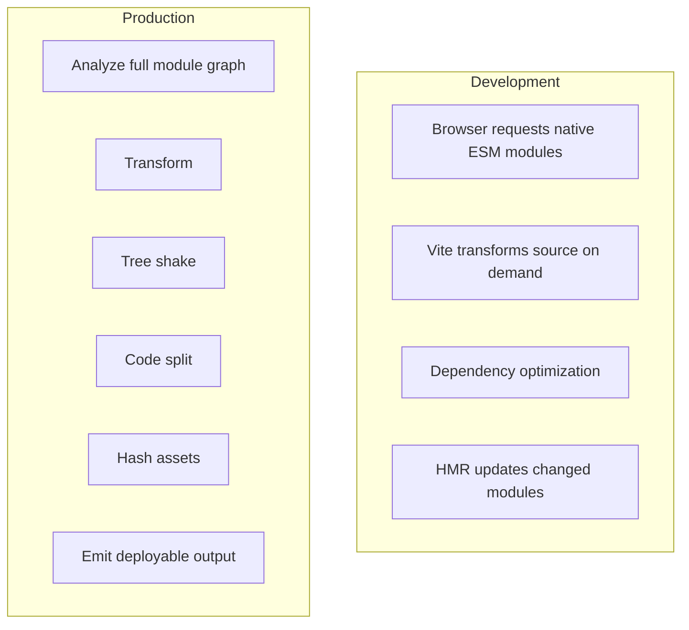
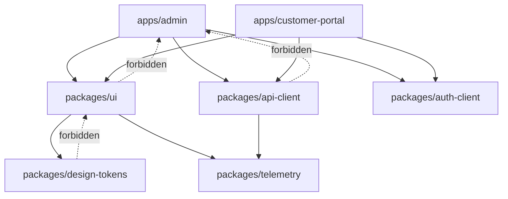
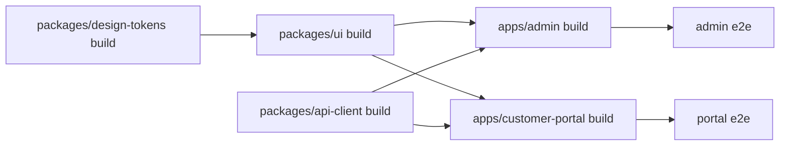
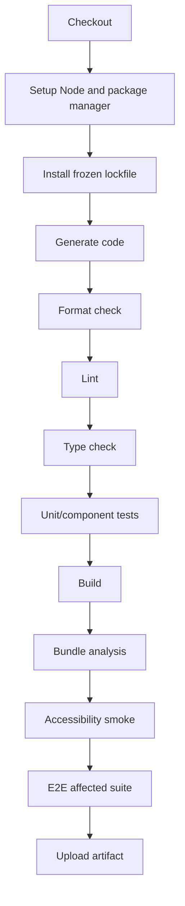
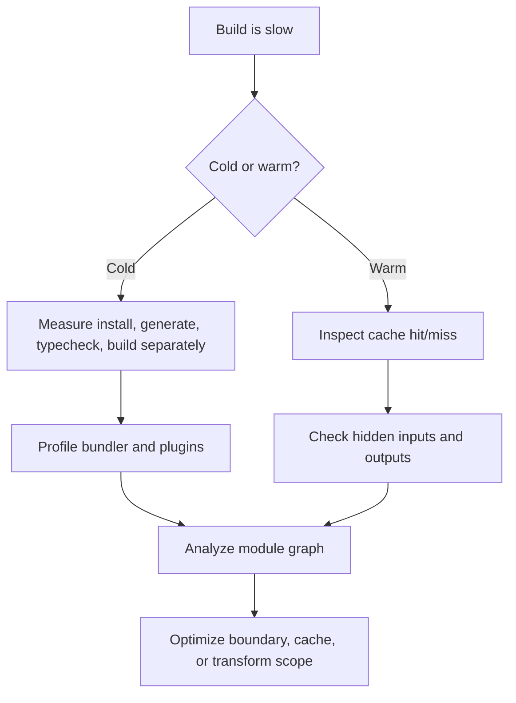

# Part 031 — Build Tooling, Vite, Monorepo, and CI

A frontend build system is not only a way to turn source files into JavaScript bundles.

It is the engineering control plane for local feedback, dependency resolution, type safety, code quality, test execution, asset generation, environment binding, release reproducibility, and deployment confidence.

A weak build system makes a strong codebase feel unreliable.

A strong build system makes large frontend work boring, predictable, fast, and reviewable.

```txt
Frontend build engineering = source graph + dependency graph + transformation pipeline + artifact contract + CI gates
```

This part focuses on the operational layer around modern frontend development:

- Vite as a modern dev/build foundation
- package manager correctness
- monorepo boundaries
- internal package design
- deterministic CI
- cache-aware pipelines
- artifact release discipline
- failure modes that create production risk

We will not repeat basic `npm install`, simple `vite create`, or introductory bundling concepts. The goal is to understand the system deeply enough to design, debug, and govern a production frontend platform.

---

## 1. Kaufman Skill Deconstruction

Kaufman's method starts by decomposing a skill into small sub-skills that can be practiced deliberately. For build tooling, the important point is that the skill is not "knowing Vite config options". The skill is the ability to reason from source code to deployed artifact.

| Sub-skill | What You Must Be Able To Do | Common Failure |
|---|---|---|
| Build pipeline modeling | Explain every transformation from source to deployed artifact | Treat build output as magic |
| Dependency resolution | Predict which package version is installed and why | Version drift, duplicate React, broken peer dependencies |
| Dev server diagnosis | Debug slow startup, HMR failure, dependency optimization, and import graph problems | Randomly deleting `node_modules` as primary strategy |
| Production build design | Control chunking, asset hashing, source maps, targets, and output manifest | Huge bundles, unstable hashes, broken CDN caching |
| Environment handling | Separate build-time config, runtime config, and secrets | Secrets leaked into client bundle |
| Monorepo design | Define apps/packages boundaries, dependency direction, and task graph | Shared code becomes a junk drawer |
| Internal package contracts | Publish or consume package APIs safely inside the repo | Deep imports and circular dependencies |
| CI determinism | Ensure install/build/test results are reproducible | "Works locally" becomes normal |
| Cache engineering | Cache the right things with correct invalidation | Stale builds, incorrect test pass, wasted compute |
| Release gates | Decide what must pass before merge/deploy | CI is slow but still misses important risks |
| Incident diagnosis | Trace a production bug back to build, dependency, or environment cause | Debugging only application code while build caused the issue |

### Kaufman target performance

After this part, you should be able to review a frontend repository and produce this kind of assessment:

```txt
The build is not deterministic because CI uses a mutable install mode and the package manager version is not pinned.
The monorepo has no public package boundaries: applications deep-import package internals.
The Vite production output is cache-hostile because assets are not separated from runtime config.
The test pipeline has no affected-task strategy, so the team disabled expensive tests instead of making them targeted.
The release artifact cannot be promoted between environments because environment values are baked into the bundle.
```

That level of diagnosis is the target.

---

## 2. Mental Model: Frontend Delivery Pipeline

A production frontend pipeline transforms source intent into deployable artifacts.

```mermaid
flowchart LR
  A[Source files] --> B[Package manager]
  B --> C[Type check]
  C --> D[Lint and static rules]
  D --> E[Unit/component tests]
  E --> F[Build transform]
  F --> G[Bundle and assets]
  G --> H[Artifact manifest]
  H --> I[Deploy target]
  I --> J[Runtime config]
  J --> K[Browser execution]
```



Each edge has an invariant.

| Edge | Invariant |
|---|---|
| Source → Package manager | Dependency graph must be reproducible |
| Package manager → Type check | Types must match installed runtime versions |
| Type check → Lint | Static constraints must encode team decisions |
| Lint → Tests | Tests must run against the same source graph that will build |
| Tests → Build | Build must not silently ignore broken assumptions |
| Build → Artifact | Artifact must be immutable, cacheable, and inspectable |
| Artifact → Deploy | Deploy must not rebuild unpredictably |
| Deploy → Runtime | Runtime config must not require leaking secrets |
| Runtime → Browser | Browser support target must match real users |

Senior frontend engineers debug the pipeline by finding which invariant was broken.

---

## 3. Vite as a System, Not a Command

Vite is commonly introduced as a fast frontend tool. That is true, but insufficient.

Architecturally, Vite separates two concerns:

1. a development server optimized for fast feedback;
2. a production build pipeline optimized for deployable output.

In modern Vite, this is not just an implementation detail. It shapes the ergonomics of local development and the constraints of production delivery.



### 3.1 Dev server model

In development, Vite leans on browser-native ES modules. Instead of bundling the entire application before the browser can load it, source modules can be transformed on demand.

This is why large projects can feel much faster in development than traditional bundle-first setups.

But this model creates its own diagnosis categories:

| Symptom | Likely Area |
|---|---|
| Slow first startup | Dependency pre-bundling, cold cache, massive dependency graph |
| Slow page load in dev | Too many source modules requested by browser |
| HMR updates reload the page | Module boundary not HMR-safe |
| Duplicate library instance | Dependency resolution or linked workspace issue |
| Works in dev but fails in build | Dev transformation and production build differ |
| Works after deleting cache | Dependency optimizer cache invalidation issue |

The wrong lesson is "Vite is magic and sometimes cache breaks".

The better lesson is: Vite has a dev-time module graph and dependency optimization layer. You need to understand when that graph differs from production.

### 3.2 Dependency pre-bundling

Dependencies from `node_modules` are often authored in many formats: ESM, CommonJS, deep entry points, conditional exports, and many small internal files. Vite pre-bundles dependencies in development so the browser does not need to request thousands of files and so CommonJS dependencies can be converted for ESM usage.

Operationally, dependency pre-bundling is a feedback-loop optimization.

It should not be treated as a correctness boundary.

Correctness should come from:

- valid package exports;
- stable dependency versions;
- compatible peer dependencies;
- no duplicate singleton libraries;
- repeatable installs;
- production build verification.

### 3.3 Production build model

A production build is a whole-graph operation. The build must answer questions the dev server can defer:

- Which modules are reachable?
- Which exports can be removed?
- Which chunks should be emitted?
- Which assets need content hashes?
- Which browser syntax target is allowed?
- Which files are entry points?
- Which dynamic imports become lazy chunks?
- Which CSS is extracted?
- Which source maps are emitted?
- Which manifest maps logical assets to hashed files?

Production build output is not just `dist/`.

It is a contract with your hosting layer.

```txt
Build artifact contract:
- immutable hashed assets
- stable entry HTML or server entry
- manifest for server/CDN integration
- source maps handled according to security policy
- runtime config strategy defined
- browser target explicitly known
```

---

## 4. Build Artifact Design

A build artifact should be immutable.

That means the artifact produced by CI should be the exact artifact that gets deployed. Rebuilding per environment is a common source of drift.

Bad pipeline:

```txt
merge -> install -> build for staging -> deploy staging
      -> install again -> build for production -> deploy production
```

Better pipeline:

```txt
merge -> install -> test -> build once -> store artifact -> promote same artifact to staging/prod
```

### 4.1 Why build-once matters

If each environment rebuilds independently, these can differ:

- dependency resolution;
- package manager version;
- environment variables;
- build target;
- plugin behavior;
- generated file order;
- timestamps;
- remote asset availability;
- optional dependencies;
- native binary versions.

When production fails, you no longer know whether the staging artifact was equivalent.

### 4.2 Runtime config vs build-time config

Frontend teams often accidentally bake environment into the JavaScript bundle.

That is acceptable for true build-time constants:

```txt
BUILD_TIME_OK:
- feature compilation branch
- app version
- commit SHA
- static public base path
- compile-time dead code flag
```

It is risky for environment-specific values:

```txt
RUNTIME_PREFERRED:
- API base URL
- tenant settings
- feature flags
- public analytics keys
- region routing
- CDN domain
```

It is forbidden for secrets:

```txt
NEVER_IN_CLIENT_BUNDLE:
- private API key
- database credential
- service account token
- signing secret
- internal admin token
```

A browser-delivered JavaScript bundle is public. Minification is not confidentiality.

### 4.3 Runtime config patterns

Common strategies:

| Pattern | How It Works | Best For | Risk |
|---|---|---|---|
| Build-time env | Inject values during build | Static apps with few environments | Rebuild per environment |
| `/config.json` | Browser fetches config before app boot | Artifact promotion across environments | Boot dependency and caching issues |
| Server-injected script | HTML includes `window.__APP_CONFIG__` | SSR/backend integrated apps | XSS and escaping must be correct |
| Edge rewrite | CDN/edge injects config | Multi-region deployments | Operational complexity |
| Feature flag SDK | Runtime flags from service | Controlled rollout | Startup latency and failure policy |

A mature app documents which one it uses and why.

---

## 5. Package Manager Correctness

Package managers are part of your runtime supply chain.

They are not interchangeable wrappers around `node_modules`.

A production repository should explicitly define:

- package manager name;
- package manager version;
- Node.js version;
- lockfile policy;
- install mode;
- workspace layout;
- dependency update process;
- vulnerability response process.

### 5.1 Lockfile as reproducibility boundary

The lockfile records concrete resolved dependency versions. Without it, two installs from the same `package.json` can produce different trees.

For production frontend engineering, lockfile discipline is mandatory.

```txt
Policy:
- commit the lockfile
- CI uses frozen/immutable install
- package manager version is pinned
- dependency updates go through review
- lockfile-only diffs are treated as dependency changes
```

A lockfile diff can change production behavior even when application source did not change.

### 5.2 Semver is not a safety guarantee

Semantic versioning expresses an author's compatibility promise. It does not guarantee that:

- no bug was introduced;
- no transitive dependency changed behavior;
- no build output changed;
- no type definitions changed incompatibly;
- no browser target changed;
- no dependency was compromised.

Treat dependency updates like code changes.

### 5.3 Dependency classes

| Class | Meaning | Common Mistake |
|---|---|---|
| `dependencies` | Required at runtime or bundle/build runtime | Putting every tool here |
| `devDependencies` | Required for development/build/test | Assuming they cannot affect production artifact |
| `peerDependencies` | Consumer must provide compatible version | Ignoring peer warnings |
| `optionalDependencies` | May be unavailable depending on platform | CI differs from local machine |
| `bundledDependencies` | Shipped inside package | Hidden supply-chain surface |

In frontend applications, dev dependencies absolutely affect production artifacts because they include compilers, bundlers, plugins, transformers, linters, type checkers, and test tools.

### 5.4 Duplicate singleton risk

Some libraries behave badly when duplicated:

- React and React DOM mismatch;
- state management singletons;
- CSS-in-JS runtime instances;
- design-system context packages;
- i18n registries;
- telemetry SDKs;
- feature flag clients.

Common root causes:

- incompatible peer dependency ranges;
- workspace package symlinks;
- nested dependencies;
- alias mismatch;
- local package incorrectly declares `dependencies` instead of `peerDependencies`;
- multiple versions allowed by semver ranges.

Diagnosis commands vary by package manager, but the mental model is always the same: inspect the installed tree and find who requires each version.

---

## 6. Monorepo Is an Architecture Choice

A monorepo is not automatically better than multiple repositories.

It trades repository coordination problems for internal architecture and tooling problems.

```txt
Multi-repo pain: coordination, version drift, cross-repo refactoring cost
Monorepo pain: scaling, ownership boundaries, CI cost, accidental coupling
```

Use a monorepo when you want stronger coordination across related packages and applications.

Do not use a monorepo to avoid thinking about boundaries.

### 6.1 Good reasons for a frontend monorepo

| Reason | Why It Helps |
|---|---|
| Shared design system | Components and tokens evolve with applications |
| Shared domain clients | API contract packages can be reused consistently |
| Cross-app refactoring | One PR can update library and consumers |
| Unified CI policy | Common quality gates are easier to enforce |
| Internal platform packages | Tooling, eslint configs, tsconfigs, test utilities can be centralized |
| Consistent dependency governance | One lockfile or catalog can constrain versions |

### 6.2 Bad reasons

| Reason | Why It Fails |
|---|---|
| "Everything in one place is simpler" | Only true before scale arrives |
| "We can share anything" | Shared code without ownership becomes unstable |
| "It avoids package publishing" | Internal packages still need API contracts |
| "CI will be easier" | CI becomes harder unless task graph is designed |
| "Architecture will emerge" | Coupling emerges faster than architecture |

### 6.3 Workspace shape

A practical frontend monorepo often looks like this:

```txt
repo/
  apps/
    admin/
    customer-portal/
    marketing-site/
  packages/
    ui/
    design-tokens/
    api-client/
    auth-client/
    telemetry/
    eslint-config/
    tsconfig/
    test-utils/
  tooling/
    scripts/
    generators/
  docs/
```

This structure is not important by itself. The dependency direction is important.



Rule:

```txt
Applications depend on packages.
Packages do not depend on applications.
Lower-level packages should not import higher-level product concepts.
```

### 6.4 Boundary types

| Boundary | Example | Contract |
|---|---|---|
| UI primitive | `@org/ui/button` | Props, events, accessibility, styling hooks |
| Domain client | `@org/billing-client` | Typed API functions and error model |
| Configuration | `@org/eslint-config` | Static rules and allowed overrides |
| Test utilities | `@org/test-utils` | Render wrappers, mock factories, fixtures |
| Platform SDK | `@org/telemetry` | Event schema, privacy policy, batching behavior |
| Token package | `@org/design-tokens` | Token names, modes, generated artifacts |

Every package should answer:

```txt
Who owns this?
Who may import this?
What is public?
What is internal?
How is it versioned?
How is breaking change handled?
How is it tested?
```

---

## 7. Internal Package API Design

Internal packages fail when they are treated as folders.

They should be treated as products with APIs.

### 7.1 Public entry points

Avoid this:

```ts
import { normalizeMoney } from '@org/billing-client/src/utils/money';
```

Prefer this:

```ts
import { normalizeMoney } from '@org/billing-client';
```

Deep imports bypass the package contract. They make refactoring harder and allow consumers to depend on implementation details.

### 7.2 Export map discipline

A package should intentionally expose entry points:

```json
{
  "name": "@org/billing-client",
  "type": "module",
  "exports": {
    ".": {
      "types": "./dist/index.d.ts",
      "import": "./dist/index.js"
    },
    "./testing": {
      "types": "./dist/testing.d.ts",
      "import": "./dist/testing.js"
    }
  }
}
```

This creates a contract.

It also prevents consumers from depending on arbitrary internal files.

### 7.3 Source consumption vs built package consumption

In monorepos, applications may consume package source directly or consume built package output.

| Mode | Benefit | Cost |
|---|---|---|
| Source consumption | Fast iteration, simple local debugging | App build must transform package source correctly |
| Built consumption | Closer to published package behavior | Requires package build ordering |
| Hybrid | Source in dev, built in CI/publish | More configuration complexity |

There is no universal answer. The invariant is that CI must test the same contract you rely on in deployment.

### 7.4 Peer dependency policy for shared UI packages

A shared UI package should usually not bundle framework singletons.

For example, a React UI package normally declares React as a peer dependency:

```json
{
  "peerDependencies": {
    "react": "^19.0.0",
    "react-dom": "^19.0.0"
  },
  "devDependencies": {
    "react": "catalog:",
    "react-dom": "catalog:"
  }
}
```

The peer says: the consuming app supplies the runtime instance.

The dev dependency says: this package can build/test itself locally.

---

## 8. Task Graph Engineering

A monorepo CI pipeline should not run every task for every change if the graph can determine a smaller safe subset.

The key concept is the task graph.



If `packages/design-tokens` changes, UI and apps may need rebuild/retest.

If only `apps/admin/src/AdminPage.tsx` changes, the customer portal should not necessarily run E2E tests.

### 8.1 Task properties

Each task should define:

| Property | Example |
|---|---|
| Inputs | source files, config files, lockfile, env schema |
| Outputs | `dist/**`, coverage, generated types |
| Dependencies | `build` depends on upstream `build` |
| Cacheability | deterministic tasks can be cached |
| Runtime side effects | tests needing DB/browser/network may not be fully cacheable |
| Parallelism | independent tasks can run concurrently |

A task is cache-safe only if all relevant inputs are included in the cache key and outputs are deterministic.

### 8.2 Cache invalidation reality

Bad cache design creates false confidence.

| Hidden Input | Failure |
|---|---|
| Node version | Native package or syntax behavior differs |
| Package manager version | Dependency tree differs |
| Environment variable | Build uses old API URL or feature flag |
| Generated file | Type check passes against stale generated code |
| Browser version | E2E behavior differs |
| OS dependencies | Screenshot tests drift |
| Time/network | Test is nondeterministic |

When using build caching tools, the hard part is not enabling cache. The hard part is modeling inputs and outputs correctly.

---

## 9. CI Pipeline Design

CI is not a punishment machine.

CI is a risk filter.

A good CI pipeline catches high-risk mistakes quickly and gives clear feedback.

### 9.1 Baseline frontend CI stages



Not every project needs every stage on every commit, but every stage should have an explicit risk reason.

### 9.2 Gate taxonomy

| Gate | Catches | Should Block Merge? |
|---|---|---|
| Format | Noise and style churn | Usually yes if enforced |
| Lint | Static rule violations and unsafe patterns | Yes |
| Type check | Contract mismatch | Yes |
| Unit tests | Local logic regression | Yes |
| Component tests | UI behavior regression | Yes for critical packages |
| Build | Transformation/runtime artifact failure | Yes |
| Bundle budget | Performance regression | Yes if budget mature; warn if new |
| Accessibility smoke | Severe interaction/semantic failures | Yes for critical surfaces |
| E2E | Cross-system workflow regression | Yes for critical path |
| Visual regression | UI drift | Depends on product context |
| Security audit | Known dependency risk | Policy-dependent |

Do not add gates without ownership.

A gate nobody owns becomes ignored noise.

### 9.3 Fast feedback vs full confidence

Use layered CI:

```txt
PR fast path:
- install
- lint
- typecheck
- unit/component tests affected by change
- build affected apps

PR extended path:
- bundle budget
- selected E2E
- accessibility smoke

Main branch:
- full build matrix
- full E2E critical paths
- artifact publish

Nightly:
- dependency audit
- browser matrix
- visual regression broad suite
- performance lab runs
```

This keeps PR feedback fast while maintaining deeper coverage elsewhere.

---

## 10. Environment and Secret Handling

The frontend build is dangerous because it turns configuration into public code.

A safe rule:

```txt
Anything available to client-side JavaScript is public to the user.
```

### 10.1 Public vs private environment variables

| Variable | Client Bundle? | Notes |
|---|---:|---|
| Public API base URL | Sometimes | Fine if endpoint is public and auth is separate |
| Public analytics key | Sometimes | Usually not secret, but still privacy-sensitive |
| OAuth client ID | Sometimes | Public identifier, not a secret |
| OAuth client secret | Never | Must stay server-side |
| Database URL | Never | Critical leak |
| Signing key | Never | Critical leak |
| Feature flag | Depends | May reveal roadmap or experiments |
| Tenant ID | Depends | Could expose business metadata |

### 10.2 Environment schema

Do not read env variables ad hoc across the codebase.

Centralize and validate them.

```ts
// env.ts
const required = (name: string): string => {
  const value = import.meta.env[name];
  if (!value) throw new Error(`Missing env: ${name}`);
  return value;
};

export const env = {
  appVersion: required('VITE_APP_VERSION'),
  publicApiBaseUrl: required('VITE_PUBLIC_API_BASE_URL'),
};
```

For larger systems, use a schema validation library and generate docs from the schema.

### 10.3 Runtime config bootstrap

A runtime config bootstrap can look like this:

```ts
type RuntimeConfig = {
  apiBaseUrl: string;
  region: string;
  flagsEndpoint: string;
};

async function loadRuntimeConfig(): Promise<RuntimeConfig> {
  const response = await fetch('/config.json', { cache: 'no-store' });
  if (!response.ok) throw new Error('Failed to load runtime config');
  return response.json();
}

async function boot() {
  const config = await loadRuntimeConfig();
  startApp({ config });
}
```

This supports artifact promotion, but you now need a boot failure screen, timeout policy, and cache policy.

---

## 11. Build Performance Diagnosis

Build performance problems are usually graph problems.

### 11.1 Common slow build causes

| Cause | Explanation | Response |
|---|---|---|
| Too many entry points | Build analyzes too many independent graphs | Split app or reduce unnecessary entries |
| Heavy transforms | Babel/SWC/plugins run on too many files | Narrow include/exclude patterns |
| Type check coupled to build | Build waits for full project TS diagnostics | Separate transpile and typecheck stages |
| Large dependency graph | Too much imported code | Analyze bundle and dependency tree |
| Ineffective cache | Inputs too broad or outputs missing | Fix task graph and cache keys |
| Generated code churn | Timestamps/random output invalidate cache | Make generation deterministic |
| Circular packages | Build order unstable or repeated | Refactor package boundaries |
| CSS pipeline cost | PostCSS/Sass processing broad globs | Scope CSS transformations |
| Source maps | Full source maps expensive | Tune by environment |

### 11.2 Diagnosis flow



Never optimize build performance without measurements.

### 11.3 Separate concerns

A common anti-pattern is one overloaded command:

```json
{
  "scripts": {
    "build": "eslint . && tsc --noEmit && vite build && playwright test"
  }
}
```

This is hard to cache, parallelize, and diagnose.

Prefer separate tasks:

```json
{
  "scripts": {
    "lint": "eslint .",
    "typecheck": "tsc --noEmit",
    "test": "vitest run",
    "build": "vite build",
    "e2e": "playwright test"
  }
}
```

Then let CI or a task runner compose them.

---

## 12. Bundle Governance

A production bundle is a cost imposed on users.

Bundle size is not the only performance metric, but uncontrolled bundle growth is one of the most visible symptoms of weak frontend governance.

### 12.1 Bundle budget types

| Budget | Example |
|---|---|
| Initial JS | `<= 180 KB gzip` on critical route |
| Route chunk | `<= 80 KB gzip` per lazy route |
| Vendor chunk | No single vendor dependency above threshold without approval |
| CSS | Critical CSS bounded per route |
| Image budget | Hero images responsive and compressed |
| Third-party budget | Explicit owner for every third-party script |
| Parse/execute time | Max main-thread cost on target device |

A top-tier team budgets by user experience, not only by file size.

### 12.2 Import governance

Dangerous imports often look innocent:

```ts
import { format } from 'large-date-library';
import * as icons from '@icon-pack/all-icons';
import { everything } from '@org/shared';
```

Governance options:

- ESLint restricted imports;
- package export maps;
- bundle analyzer reports;
- CI budget checks;
- dependency ownership policy;
- package review for new dependencies;
- route-level code splitting;
- design-system icon strategy.

### 12.3 Dependency acceptance checklist

Before adding a dependency:

```txt
- What problem does it solve?
- Is the problem core or incidental?
- Can platform APIs solve it?
- What is its bundle cost?
- Does it support ESM and tree shaking?
- Is it maintained?
- What transitive dependencies does it bring?
- Does it duplicate existing functionality?
- Does it affect security posture?
- Who owns upgrades?
- How do we remove it later?
```

Dependency removal cost is part of dependency adoption cost.

---

## 13. Source Maps Policy

Source maps are essential for production debugging, but they expose source structure if served publicly.

Policy options:

| Policy | Behavior | Trade-off |
|---|---|---|
| Public source maps | Serve `.map` files with assets | Easy debugging, source exposure |
| Private uploaded source maps | Upload to monitoring tool, do not serve publicly | Better security, tooling dependency |
| No production source maps | Do not generate/upload | Harder incident debugging |
| Hidden source maps | Generate maps without source map URL comment | Useful for upload-only workflow |

A mature policy separates:

- local source maps;
- staging source maps;
- production private source maps;
- source map retention;
- access control;
- source content inclusion;
- incident debugging workflow.

---

## 14. Generated Code and Contracts

Generated code is common in frontend systems:

- OpenAPI clients;
- GraphQL types;
- design tokens;
- icon components;
- route manifests;
- translation keys;
- feature flag definitions;
- protobuf clients;
- mock service worker handlers.

Generated code creates a contract problem.

### 14.1 Commit or generate in CI?

| Strategy | Benefit | Cost |
|---|---|---|
| Commit generated code | Reviewable diffs, no generation needed at install | Large diffs, merge conflicts |
| Generate in CI | Source of truth is schema | CI complexity, local setup cost |
| Hybrid | Commit critical generated artifacts, generate transient ones | Policy complexity |

The decision depends on the artifact.

Design tokens and API clients are often worth committing when they are consumed broadly and diffs are meaningful.

Ephemeral caches and build manifests should not be committed.

### 14.2 Contract drift

A dangerous workflow:

```txt
Backend OpenAPI changes -> frontend generated client not updated -> typecheck still passes against stale client -> runtime fails
```

Better:

```txt
Schema change -> generated client diff -> contract tests -> frontend compile/test -> deploy coordination
```

---

## 15. CI for Browser Testing

Browser tests are expensive, but critical for frontend confidence.

The build pipeline must decide where browser tests fit.

### 15.1 Browser test placement

| Stage | Test Type | Notes |
|---|---|---|
| PR fast | Component tests, small E2E smoke | Keep under tight time budget |
| PR extended | Critical user journeys | May run for affected apps only |
| Main | Full critical suite | Blocks artifact promotion |
| Nightly | Broad browser/device matrix | Finds ecosystem drift |
| Release candidate | Performance/accessibility/browser matrix | For high-risk releases |

### 15.2 Artifacts from failed tests

Failed browser tests should upload:

- trace file;
- screenshot;
- video if useful;
- console logs;
- network logs;
- application logs;
- commit SHA;
- browser version;
- environment metadata.

A failed test without diagnostic artifacts wastes engineering time.

---

## 16. Practical Configuration Skeleton

This is not a universal template. It is a shape to reason from.

```txt
repo/
  apps/
    admin/
      vite.config.ts
      package.json
      src/
  packages/
    ui/
      package.json
      src/
    eslint-config/
    tsconfig/
  package.json
  pnpm-workspace.yaml
  turbo.json
  tsconfig.base.json
```

### 16.1 Root package scripts

```json
{
  "scripts": {
    "lint": "turbo lint",
    "typecheck": "turbo typecheck",
    "test": "turbo test",
    "build": "turbo build",
    "e2e": "turbo e2e"
  },
  "packageManager": "pnpm@11.0.0"
}
```

The exact version is illustrative. The important invariant is that the package manager is pinned.

### 16.2 Workspace dependency catalog

```yaml
packages:
  - apps/*
  - packages/*

catalog:
  typescript: ^5.9.0
  vite: ^8.0.0
  react: ^19.2.0
  react-dom: ^19.2.0
  eslint: ^9.0.0
```

Catalogs help avoid dependency version drift across workspace packages.

### 16.3 Task graph shape

```json
{
  "tasks": {
    "build": {
      "dependsOn": ["^build"],
      "outputs": ["dist/**"]
    },
    "typecheck": {
      "dependsOn": ["^build"],
      "outputs": []
    },
    "test": {
      "dependsOn": ["^build"],
      "outputs": ["coverage/**"]
    },
    "lint": {
      "outputs": []
    },
    "e2e": {
      "dependsOn": ["build"],
      "outputs": ["test-results/**", "playwright-report/**"]
    }
  }
}
```

Again, the exact tool is less important than the model:

```txt
Tasks declare dependencies, inputs, outputs, and cache behavior.
```

---

## 17. Failure Modes

### 17.1 "Works locally, fails in CI"

Likely causes:

- Node version mismatch;
- package manager mismatch;
- non-frozen install locally;
- missing generated file;
- case-sensitive path issue;
- environment variable missing;
- browser dependency missing;
- timezone/locale difference;
- test relies on network or time;
- optional native dependency differs by OS.

Diagnosis:

```txt
1. Compare Node/package manager versions.
2. Reproduce with clean install and frozen lockfile.
3. Run same CI command locally in container if possible.
4. Check generated artifacts.
5. Check env schema.
6. Inspect failing task logs, not only final error.
```

### 17.2 "Works in dev, fails in production build"

Likely causes:

- dynamic import path unsupported;
- dependency uses Node-only API;
- production minification exposes side effect bug;
- tree shaking removes assumed side effect;
- CSS ordering differs;
- environment variable differs;
- browser target excludes syntax transform;
- SSR/client boundary issue;
- CommonJS/ESM interop mismatch.

### 17.3 "Production works until refresh on a route"

Likely causes:

- SPA fallback misconfigured;
- CDN serves 404 instead of app shell;
- base path incorrect;
- asset path absolute/relative mismatch;
- server rewrite missing for nested route.

### 17.4 "Users see old UI after deploy"

Likely causes:

- HTML cached too long;
- service worker serving stale assets;
- un-hashed assets;
- CDN invalidation wrong;
- runtime config cached incorrectly;
- asset manifest mismatch.

### 17.5 "Chunk load error after deployment"

Likely causes:

- user has old HTML referencing deleted chunk;
- CDN cache inconsistency;
- non-atomic deployment;
- old service worker cache;
- asset cleanup too aggressive.

Mitigations:

- keep old hashed assets for a retention window;
- deploy atomically;
- avoid deleting previous version immediately;
- implement chunk load error recovery;
- coordinate service worker update policy.

---

## 18. Review Checklist

Use this when reviewing a frontend repository.

### 18.1 Package and dependency checklist

```txt
[ ] package manager is pinned
[ ] Node version is pinned
[ ] lockfile is committed
[ ] CI uses frozen/immutable install
[ ] dependency update process exists
[ ] duplicate singleton libraries are checked
[ ] peer dependency warnings are treated seriously
[ ] workspace dependency versions are coordinated
[ ] new dependencies require justification
```

### 18.2 Build checklist

```txt
[ ] production build is run in CI
[ ] build target matches supported browsers
[ ] source map policy is explicit
[ ] assets are hashed
[ ] HTML/runtime config caching is explicit
[ ] chunk load failure strategy exists
[ ] bundle budget exists for critical routes
[ ] build artifact is immutable
[ ] same artifact can be promoted across environments where possible
```

### 18.3 Monorepo checklist

```txt
[ ] apps and packages have clear ownership
[ ] dependency direction is enforced
[ ] public package entry points are explicit
[ ] deep imports are restricted
[ ] internal packages have tests
[ ] task graph declares dependencies and outputs
[ ] cache behavior is understood
[ ] affected-task strategy exists
```

### 18.4 CI checklist

```txt
[ ] stages map to explicit risks
[ ] PR fast path is fast enough to use
[ ] expensive tests are targeted or scheduled
[ ] failed browser tests upload artifacts
[ ] generated code drift is caught
[ ] environment schema is validated
[ ] cache misses can be diagnosed
[ ] flaky tests have owner and policy
```

---

## 19. Practice Loop

### Exercise 1 — Build graph map

Pick a frontend repository and draw:

```txt
source -> dependency install -> generated code -> typecheck -> lint -> test -> build -> artifact -> deploy
```

For each edge, write one invariant and one failure mode.

### Exercise 2 — Dependency duplicate audit

Find whether your app has duplicate versions of:

- React or framework runtime;
- router;
- state manager;
- design system;
- telemetry SDK;
- date library;
- validation library.

Explain which duplicates are safe and which are dangerous.

### Exercise 3 — Runtime config redesign

Take an app that uses build-time environment variables. Redesign it so the same artifact can be promoted from staging to production.

Document:

- runtime config source;
- boot failure behavior;
- cache policy;
- security risk;
- deployment changes.

### Exercise 4 — CI risk map

Create a table:

| CI Stage | Risk It Catches | Average Runtime | Owner | Required? |
|---|---|---:|---|---|

Then propose one improvement that reduces runtime without reducing confidence.

### Exercise 5 — Monorepo boundary hardening

Choose one shared package and define:

- public exports;
- forbidden deep imports;
- peer dependencies;
- test contract;
- versioning policy;
- owner;
- migration path for breaking changes.

---

## 20. Senior-Level Heuristics

1. Build output is a product artifact, not a temporary directory.
2. The lockfile is source code for your dependency graph.
3. CI should be a risk filter, not a ritual.
4. Cache without correct inputs is a correctness bug.
5. Monorepo boundaries must be designed; folder structure does not enforce architecture.
6. Internal packages need public APIs even if they are never published to npm.
7. Build once, promote artifacts when possible.
8. Secrets do not become safe because they are minified.
9. Bundle budgets need owners and user-impact rationale.
10. If deleting `node_modules` is the team's default fix, the team lacks a dependency diagnosis model.

---

## 21. References

- Vite Documentation — Building for Production: https://vite.dev/guide/build
- Vite Documentation — Dependency Pre-Bundling: https://vite.dev/guide/dep-pre-bundling
- Vite Blog — Vite 8.0: https://vite.dev/blog/announcing-vite8
- pnpm Workspaces: https://pnpm.io/workspaces
- pnpm Catalogs: https://pnpm.io/catalogs
- Turborepo Documentation: https://turborepo.dev/docs
- Turborepo Caching: https://turborepo.dev/docs/crafting-your-repository/caching
- MDN — JavaScript modules: https://developer.mozilla.org/en-US/docs/Web/JavaScript/Guide/Modules
- MDN — Source map: https://developer.mozilla.org/en-US/docs/Glossary/Source_map

---

## 22. What Comes Next

Build tooling gives us the delivery substrate.

The next part moves from tooling to strategic engineering judgment: choosing between React, Vue, Svelte, and native web/platform-first architecture. The goal is not to crown a winner. The goal is to choose the right trade-off for a product, team, runtime, and maintenance horizon.
