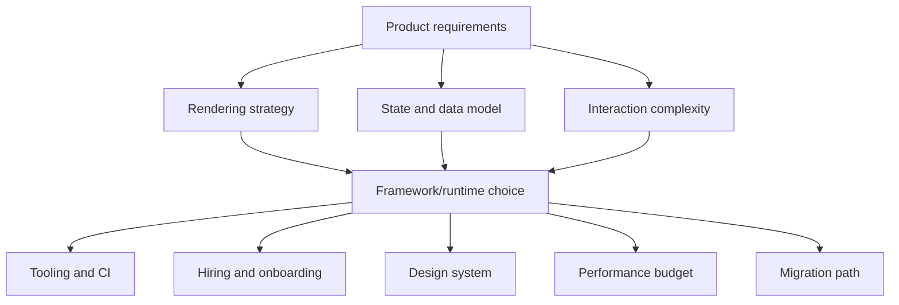
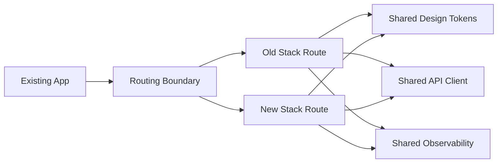

# Part 032 — Framework Decision-Making: React, Vue, Svelte, Native Web

A top-tier frontend engineer does not ask, "Which framework is best?"

That question is poorly framed.

The better question is:

```txt
Given this product, team, runtime, organization, delivery model, and maintenance horizon, which UI architecture creates the best risk-adjusted outcome?
```

React, Vue, Svelte, and native web platform approaches each optimize different constraints. They also create different failure modes.

This part gives you a decision model, not a popularity ranking.

---

## 1. Kaufman Skill Deconstruction

Framework decision-making is a compound skill.

| Sub-skill | What You Must Be Able To Do | Common Failure |
|---|---|---|
| Constraint discovery | Identify product, team, runtime, and organization constraints | Choose based on preference or hype |
| Rendering model analysis | Compare client rendering, SSR, streaming, hydration, islands, and server components | Treat all frameworks as interchangeable component systems |
| Reactivity model analysis | Understand how updates propagate and where complexity hides | Debug stale state by superstition |
| Ecosystem risk assessment | Evaluate routing, data, testing, design system, forms, i18n, accessibility, and hiring | Count GitHub stars instead of operational fit |
| Performance modeling | Predict JS cost, hydration cost, runtime scheduling cost, and bundle shape | Assume benchmark results transfer directly to product reality |
| Team fit assessment | Match framework mental model to team skill and codebase maturity | Optimize for individual taste |
| Migration planning | Estimate incremental adoption, coexistence, strangler patterns, and rewrite risk | Big-bang rewrite with unclear success criteria |
| Governance design | Define conventions, boundaries, lint rules, and review criteria | Framework freedom becomes architecture entropy |
| Failure-mode analysis | Identify the ways a framework choice can fail over years | Focus only on first delivery speed |

### Kaufman target performance

After this part, you should be able to write a decision record like this:

```txt
We choose Vue for this internal workflow platform because the team needs strong conventions, template readability, incremental adoption, and lower variance in component style.
We reject React for this project not because React is weak, but because the current team has no RSC/SSR expertise and the product does not need React's broader ecosystem.
We reject Svelte because the organization requires a larger hiring pool and long-lived design system compatibility across multiple teams.
We will revisit in 18 months if the product becomes more performance-sensitive or the platform team matures.
```

That is an engineering decision. "React is more popular" is not.

---

## 2. The Decision Frame

Framework choice affects many layers:



A framework is not a local implementation detail if it shapes:

- routing;
- server/client boundaries;
- state model;
- component contracts;
- testing strategy;
- build pipeline;
- accessibility patterns;
- design-system API;
- team onboarding;
- hiring;
- observability;
- deployment architecture.

### 2.1 Decision dimensions

| Dimension | Question |
|---|---|
| Product type | Is this content, workflow, dashboard, editor, commerce, collaboration, or embedded widget? |
| Interaction density | How much client-side interactivity exists per screen? |
| Rendering need | SPA, SSR, SSG, streaming, server components, islands, or mostly static? |
| Data model | Server state heavy, local state heavy, real-time, offline-first, or form-heavy? |
| Team skill | What mental models does the team already have? |
| Organization scale | One team or many teams sharing a platform? |
| Ecosystem dependency | How much do you need mature libraries and integrations? |
| Runtime budget | How strict are JS, hydration, and main-thread budgets? |
| Longevity | Is this a 6-month product or 7-year platform? |
| Hiring | Can you hire and onboard at required speed? |
| Governance | Can you enforce conventions? |
| Migration | Are you starting greenfield or replacing existing UI? |

### 2.2 Product archetypes

| Product | Typical Pressure | Framework Implication |
|---|---|---|
| Marketing/content site | LCP, static generation, low JS | Astro/native web/Svelte/Vue/React with strong static discipline |
| Internal admin | Forms, tables, permissions, workflow state | React or Vue often strong due to ecosystem and conventions |
| Complex dashboard | Server state, charts, filters, URL state | React/Vue with mature data/routing/testing stack |
| Collaborative editor | Real-time state, custom rendering, performance | Framework may be peripheral; core model matters more |
| Ecommerce | SSR/SSG, personalization, performance, experiments | Meta-framework and caching strategy dominate |
| Embedded widget | Small bundle, isolation, host compatibility | Web Components, Preact, Svelte, or platform-first often attractive |
| Design-system platform | API stability, accessibility, cross-app reuse | React/Vue depending on consumer base; Web Components for cross-framework reach |
| Regulated workflow platform | auditability, state machines, role/security clarity | Framework with strong conventions and testability matters more than syntax |

---

## 3. React: Runtime Flexibility and Ecosystem Gravity

React is a library for building user interfaces from components. Its power comes from a small component model combined with enormous ecosystem gravity.

React's core mental model:

```txt
UI = function of state
components describe desired UI
React reconciles changes and commits updates
side effects are explicit through framework lifecycle primitives
```

Modern React is not just "components and hooks". In production architecture, React is also:

- a rendering runtime;
- a scheduling model;
- a server/client boundary model when used with React Server Components;
- a large ecosystem contract;
- a design-system platform target;
- a hiring market;
- a migration ecosystem.

### 3.1 React strengths

| Strength | Why It Matters |
|---|---|
| Ecosystem depth | Routing, data fetching, forms, testing, charts, design systems, SSR frameworks |
| Hiring pool | Easier to staff large teams |
| Component composition | Strong model for reusable UI abstractions |
| Cross-platform story | React Native and React ecosystem concepts can transfer |
| Server Components direction | Enables server/client split in compatible frameworks |
| Tooling maturity | DevTools, testing libraries, linting, framework integrations |
| Community problem coverage | Many edge cases have known patterns |

### 3.2 React costs

| Cost | Why It Happens |
|---|---|
| High architectural variance | React is flexible; teams can invent incompatible patterns |
| Hook misuse | Effects, dependencies, stale closures, and render semantics require discipline |
| Framework dependency | Production React often depends on Next.js/Remix/custom stack decisions |
| Hydration/runtime cost | Client interactivity can become expensive if boundaries are careless |
| State management fragmentation | Many libraries and patterns can coexist poorly |
| Over-rendering risk | Poor memoization and state placement cause avoidable work |
| RSC complexity | Server/client boundaries add new failure modes |

### 3.3 React is a strong fit when

```txt
- You need a large ecosystem and hiring pool.
- Multiple teams will build on shared component abstractions.
- You need mature design-system support.
- Product complexity is high and long-lived.
- You can enforce conventions through platform/lint/review.
- You need Next.js/Remix-style production architecture.
- You may benefit from React Native or shared mental models.
```

### 3.4 React is a risky fit when

```txt
- The team lacks discipline around effects, state ownership, and boundaries.
- The product is mostly static but ships a large client runtime anyway.
- The organization cannot standardize data/routing/form patterns.
- The team expects React alone to provide architecture.
- RSC/SSR is adopted without understanding cache/security/runtime consequences.
```

### 3.5 React decision note

React is often the safest organizational choice, not always the simplest technical choice.

The senior move is to pair React with a strict architecture:

- route/data conventions;
- state ownership rules;
- effect usage rules;
- component API standards;
- bundle budgets;
- testing strategy;
- framework boundary documentation;
- RSC/server-client policy if applicable.

Without governance, React codebases often become a collection of local opinions.

---

## 4. Vue: Integrated Conventions and Progressive Adoption

Vue is a progressive framework centered on declarative rendering, component composition, and a built-in reactivity system. It can be adopted incrementally, but it also supports full application architecture through its ecosystem.

Vue's core mental model:

```txt
Templates declare UI
reactive state drives updates
Composition API organizes logic
Single-File Components group template, script, and style
```

Vue often feels more integrated than React because many choices are more standardized:

- templates;
- Single-File Components;
- Composition API;
- built-in reactivity primitives;
- Vue Router;
- Pinia;
- official style conventions;
- SFC compiler tooling.

### 4.1 Vue strengths

| Strength | Why It Matters |
|---|---|
| Integrated mental model | Easier to standardize code style across teams |
| Templates | Readable UI structure and constrained rendering syntax |
| Composition API | Logic reuse with explicit reactive primitives |
| SFC ergonomics | Component code is organized predictably |
| Incremental adoption | Can enhance server-rendered pages or scale to SPA |
| Official ecosystem | Router/state/docs are cohesive |
| Lower variance | Fewer radically different architectural styles than React |

### 4.2 Vue costs

| Cost | Why It Happens |
|---|---|
| Reactivity caveats | Proxy/reactive semantics require understanding |
| Ecosystem smaller than React | Some enterprise integrations may have fewer options |
| Template abstraction | Highly dynamic rendering can be less direct than JSX |
| TypeScript complexity in advanced components | Generic component APIs can become subtle |
| Hiring varies by region | React talent pool may be larger in many markets |
| Meta-framework choice still matters | Nuxt/server architecture requires separate decision-making |

### 4.3 Vue is a strong fit when

```txt
- The team benefits from stronger conventions.
- You want approachable component structure without giving up advanced composition.
- Internal tools, dashboards, and workflow apps need consistency.
- Incremental adoption is valuable.
- You want a cohesive official ecosystem.
- The team prefers template-first UI over JSX-heavy abstraction.
```

### 4.4 Vue is a risky fit when

```txt
- Your organization has deep React platform investment.
- You need React-specific ecosystem libraries or hiring scale.
- You require highly custom render abstraction where JSX is materially simpler.
- The team treats reactivity as magic and cannot debug dependency tracking.
```

### 4.5 Vue decision note

Vue is often excellent for teams that want balance:

```txt
more integrated than React
less radical than Svelte
more framework-shaped than native web
```

The senior risk is not Vue itself. The risk is assuming conventions eliminate architecture. You still need boundaries for data, state, forms, routing, caching, accessibility, and testing.

---

## 5. Svelte: Compiler-First UI and Explicit Reactivity

Svelte is different because much of the framework work happens at compile time. Instead of shipping a large general-purpose runtime abstraction, Svelte compiles components into efficient JavaScript updates.

Svelte's modern mental model:

```txt
Write component logic
mark reactive values explicitly
compiler analyzes and generates update code
runtime coordination is smaller than virtual-DOM-heavy approaches
```

Svelte 5 introduced runes as explicit reactivity primitives. That makes reactivity more portable and visible than older implicit `$:` patterns.

### 5.1 Svelte strengths

| Strength | Why It Matters |
|---|---|
| Compiler-first model | Less runtime abstraction for many UI cases |
| Small output potential | Attractive for performance-sensitive interfaces |
| Direct syntax | Often less boilerplate for local component state |
| Explicit runes | Reactivity can be represented directly in code |
| Great fit for focused apps | Product teams can move quickly with less ceremony |
| SvelteKit integration | Full-stack app architecture available |

### 5.2 Svelte costs

| Cost | Why It Happens |
|---|---|
| Smaller ecosystem | Fewer enterprise-grade options than React |
| Hiring pool | May be harder to staff large organizations |
| Compiler semantics | Advanced behavior requires understanding generated model |
| Migration churn | Svelte 5 mental model differs from Svelte 4 patterns |
| Design-system reach | Cross-framework consumers may need wrappers or Web Components |
| Less universal convention in enterprises | Fewer established large-org patterns |

### 5.3 Svelte is a strong fit when

```txt
- You need high performance with low runtime overhead.
- The app is greenfield or has limited integration constraints.
- The team is small-to-medium and can align on conventions.
- You value compiler-driven UI and concise component code.
- Bundle size and startup cost are primary constraints.
- You can accept a smaller ecosystem in exchange for simplicity/performance.
```

### 5.4 Svelte is a risky fit when

```txt
- You need a very large hiring pool immediately.
- Your organization already has deep React/Vue design-system investment.
- You require many niche enterprise integrations.
- You cannot tolerate framework migration churn.
- You need cross-team governance patterns that are already proven internally.
```

### 5.5 Svelte decision note

Svelte can be a powerful choice when product constraints reward low runtime cost and the team can own framework expertise.

Do not choose Svelte only because examples look simpler.

Choose it when its compiler-first architecture maps to your product's actual constraints.

---

## 6. Native Web / Platform-First Architecture

Native web means building primarily with browser platform APIs:

- HTML;
- CSS;
- DOM;
- Web Components;
- Custom Elements;
- Shadow DOM;
- standard events;
- progressive enhancement;
- server-rendered HTML;
- small JavaScript modules.

This is not anti-framework ideology.

It is a legitimate architecture option when the platform is enough.

### 6.1 Platform-first strengths

| Strength | Why It Matters |
|---|---|
| Low dependency surface | Smaller supply-chain and upgrade risk |
| Long-term durability | Platform APIs outlive framework trends |
| Progressive enhancement | Works well for content/forms/server-rendered apps |
| Interoperability | Web Components can cross framework boundaries |
| Small JS budget | Good for performance-sensitive surfaces |
| Host integration | Useful for embedded widgets and multi-framework environments |

### 6.2 Platform-first costs

| Cost | Why It Happens |
|---|---|
| More manual architecture | You must design state/routing/data patterns yourself |
| Less ergonomic complex UI | Frameworks solve many repeated problems |
| Browser edge cases | Platform APIs require compatibility knowledge |
| Testing patterns less standardized | Team must define conventions |
| Design-system complexity | Styling, theming, and accessibility need discipline |
| Reactivity absent by default | You must choose or build change propagation |

### 6.3 Native web is a strong fit when

```txt
- The app is mostly content, forms, or server-rendered workflows.
- You need embedded widgets across unknown host applications.
- JavaScript budget is extremely strict.
- Longevity and interoperability matter more than rich client abstraction.
- You can rely on progressive enhancement.
- The team has strong platform knowledge.
```

### 6.4 Native web is a risky fit when

```txt
- The app has complex client-side state and interactions.
- The team lacks DOM/event/accessibility expertise.
- You need rapid delivery of many standard app patterns.
- You will accidentally build a worse private framework.
- Governance is weak and every team invents its own primitives.
```

### 6.5 Web Components as design-system boundary

Web Components are most compelling as interoperability boundaries, not necessarily as a full app framework.

Good use cases:

- cross-framework design-system primitives;
- embedded widgets;
- microfrontend host boundaries;
- design tokens and themed components;
- progressive enhancement islands.

Hard parts:

- form participation;
- accessibility semantics;
- SSR/hydration story;
- styling/theming across Shadow DOM;
- event and property conventions;
- testing across framework wrappers.

---

## 7. Comparison by Architecture Dimension

### 7.1 Rendering and hydration

| Dimension | React | Vue | Svelte | Native Web |
|---|---|---|---|---|
| Client rendering | Excellent | Excellent | Excellent | Manual |
| SSR | Mature through frameworks | Mature through Nuxt/custom | Mature through SvelteKit | Server templates/native |
| Streaming | Strong in React ecosystem | Framework-dependent | Framework-dependent | Server-dependent |
| Server Components | React-specific | Not equivalent | Not equivalent | N/A |
| Islands | Possible through meta-frameworks | Possible through meta-frameworks | Natural fit with compiler/meta-frameworks | Natural with progressive enhancement |
| Hydration cost | Can be high if careless | Can be moderate/high depending app | Often lower potential | Optional/minimal |

### 7.2 State and reactivity

| Dimension | React | Vue | Svelte | Native Web |
|---|---|---|---|---|
| Core state model | Explicit render state | Proxy-based reactivity | Rune/compiler reactivity | Manual/platform APIs |
| Derived state | Memo/hooks/libraries | computed/watch | derived/effect | Manual |
| Effect model | Powerful but easy to misuse | Watchers/effects | Effects/runes | Events/observers/manual |
| Debug difficulty | Stale closures/effects | Reactive dependency tracking | Compiler/rune semantics | Custom architecture |
| Team convention need | High | Medium | Medium | Very high |

### 7.3 Ecosystem and scale

| Dimension | React | Vue | Svelte | Native Web |
|---|---|---|---|---|
| Ecosystem size | Very large | Large | Medium | Platform + libraries |
| Hiring pool | Very large | Medium/large by region | Smaller | Depends on platform skill |
| Enterprise adoption | Very high | High in many regions | Growing | Strong for platform primitives |
| Design-system tooling | Very mature | Mature | Growing | Complex but interoperable |
| Migration resources | Very high | High | Medium | Case-specific |

### 7.4 Performance default vs performance ceiling

Do not confuse default performance with achievable performance.

```txt
Default performance = what average teams get without much discipline
Performance ceiling = what expert teams can achieve with deliberate architecture
```

| Framework | Default Risk | Expert Ceiling |
|---|---|---|
| React | Can ship too much JS and over-render | Excellent with RSC, code splitting, profiling, strict boundaries |
| Vue | Usually good defaults, can still over-render or over-hydrate | Excellent with disciplined reactivity and SSR/static strategy |
| Svelte | Often low runtime overhead | Excellent for small/medium interactive surfaces |
| Native Web | Very low possible JS | Excellent for progressive/content/forms, but complex apps need custom discipline |

Performance is not a framework property alone. It is an architecture property.

---

## 8. Decision Matrix

Use a weighted score only after constraints are clear.

Example criteria:

| Criterion | Weight | React | Vue | Svelte | Native Web |
|---|---:|---:|---:|---:|---:|
| Team familiarity | 5 | 5 | 3 | 2 | 3 |
| Ecosystem need | 5 | 5 | 4 | 3 | 2 |
| Runtime budget | 4 | 3 | 4 | 5 | 5 |
| Design-system reuse | 5 | 5 | 4 | 3 | 4 |
| Hiring | 4 | 5 | 3 | 2 | 3 |
| SSR/static fit | 4 | 5 | 5 | 5 | 4 |
| Long-term maintainability | 5 | 4 | 4 | 3 | 4 |
| Migration cost | 5 | depends | depends | depends | depends |

Do not copy these scores. Replace them with project-specific evidence.

### 8.1 Scoring anti-patterns

Avoid:

```txt
React = 10 because popular
Vue = 8 because nice docs
Svelte = 9 because fast
Native = 6 because no framework
```

Prefer:

```txt
React ecosystem score is high because we need mature rich-table, chart, form, auth, and observability integrations in the next two quarters.
Svelte runtime score is high because the product is an embedded widget with strict 50KB initial JS budget.
Vue team-fit score is high because three teams already ship Vue SFCs and have established lint/test conventions.
Native web migration score is high because the app is currently server-rendered and only needs progressive enhancement.
```

---

## 9. Framework Choice by Scenario

### 9.1 New enterprise workflow platform

Typical constraints:

- complex forms;
- permission-dependent screens;
- auditability;
- data grids;
- state machines;
- long maintenance horizon;
- many engineers;
- design-system needs;
- test automation;
- observability.

Likely good choices:

- React if ecosystem, hiring, and platform team are priorities.
- Vue if team benefits from stronger conventions and cohesive official patterns.

Risky choices:

- Svelte if hiring/governance/ecosystem risk is not acceptable.
- Native-only if the client-side workflow complexity is high.

### 9.2 High-performance marketing site

Typical constraints:

- LCP;
- SEO;
- mostly static content;
- low JS;
- CMS integration;
- occasional interactive islands.

Likely good choices:

- Astro/platform-first/islands.
- Svelte or Vue with strict static generation.
- React only if paired with strict JS budget and framework discipline.

Risky choice:

- SPA-first architecture.

### 9.3 Embedded customer widget

Typical constraints:

- unknown host app;
- small bundle;
- style isolation;
- no global conflicts;
- easy integration;
- versioned script delivery.

Likely good choices:

- Web Components.
- Svelte compiled widget.
- Preact or small runtime.

Risky choices:

- Heavy React app unless host already uses React or isolation strategy is strong.

### 9.4 Complex SaaS dashboard

Typical constraints:

- data fetching;
- cache invalidation;
- filters in URL;
- charts;
- tables;
- role-based UI;
- critical workflows;
- performance over time.

Likely good choices:

- React with a disciplined data/router stack.
- Vue with Pinia/router/query stack.

Svelte can work well but requires deliberate ecosystem validation.

### 9.5 Cross-framework design system

Typical constraints:

- multiple consuming frameworks;
- accessibility;
- theming;
- versioning;
- stable component contracts.

Likely choices:

- Web Components for primitive interoperability.
- Framework-specific wrappers for ergonomics.
- Separate design tokens from component implementation.

Risk:

- Trying to make one component model feel native in every framework without wrappers.

---

## 10. Migration and Coexistence Strategy

Framework decisions are often not greenfield. Existing code exists.

### 10.1 Migration options

| Strategy | Description | Best For | Risk |
|---|---|---|---|
| Big-bang rewrite | Replace entire app | Rare cases with small app and clear freeze window | High failure probability |
| Strangler | New routes/features use new stack | Large apps | Requires routing/coexistence boundary |
| Island migration | Replace interactive components gradually | Server-rendered apps | State sharing across islands |
| Microfrontend | Independent deployable frontend modules | Large org autonomy | Runtime/integration complexity |
| Design-system first | Build shared primitives, migrate surfaces | UI consistency initiatives | Slow visible progress |
| Platform extraction | Extract API/state/tooling first | Monorepo/platform maturity | Requires strong ownership |

The default senior recommendation is strangler or island migration, not rewrite.

### 10.2 Migration invariants

```txt
- Users must not experience workflow regression.
- Authentication/session must remain coherent.
- Routing must support old and new surfaces.
- Design system must bridge visual consistency.
- Observability must distinguish old/new stack errors.
- Test coverage must protect migration boundaries.
- Rollback must be possible per route or feature.
```

### 10.3 Coexistence boundary



Share stable platform packages, not internal UI state.

---

## 11. Governance After Choosing

The framework choice is the beginning, not the end.

A strong decision includes governance.

### 11.1 React governance example

```txt
- Use framework router conventions; no ad hoc global routers.
- Server/client component boundaries documented per route.
- Effects require clear external synchronization reason.
- No data fetching directly inside random leaf components unless using approved query layer.
- Component props use discriminated unions for variant complexity.
- Bundle budget enforced per route.
- State ownership documented for shared workflows.
```

### 11.2 Vue governance example

```txt
- Use Composition API and <script setup> for new components.
- Reactive state belongs in composables or stores according to ownership rules.
- Watchers require explicit cleanup and reason.
- Pinia stores model domain state, not arbitrary component convenience.
- SFC style conventions define scoped/global/token usage.
- Route-level data fetching and error handling standardized.
```

### 11.3 Svelte governance example

```txt
- Use Svelte 5 runes consistently for new code.
- Effects are for synchronization, not derived state.
- Stores/runes usage policy documented.
- Component events and bindable props follow design-system conventions.
- SvelteKit load/error boundaries standardized.
- Generated output and bundle cost monitored.
```

### 11.4 Native web governance example

```txt
- Custom Elements naming and versioning policy.
- Shadow DOM usage policy.
- Event naming and payload contracts.
- Form participation rules.
- Accessibility testing required for every component.
- Progressive enhancement baseline documented.
- No private mini-framework without architecture review.
```

---

## 12. Anti-Patterns

### 12.1 Framework as identity

```txt
"We are a React shop."
```

This can be useful for staffing and platform consistency.

It becomes harmful when it prevents product-appropriate architecture.

Better:

```txt
"React is our default application framework because it matches our platform, hiring, design-system, and ecosystem constraints. Exceptions require an ADR."
```

### 12.2 Benchmark-driven selection

Benchmarks are useful signals. They are not product architecture decisions.

A framework that wins a micro-benchmark can still fail your product because of:

- missing ecosystem;
- weak hiring pool;
- poor team fit;
- integration complexity;
- insufficient testing support;
- migration risk;
- governance failure.

### 12.3 Rewrite fantasy

A rewrite is attractive because it imagines a clean world.

Real rewrites inherit:

- unclear requirements;
- hidden behavior;
- undocumented edge cases;
- customer-specific workflows;
- old bugs users rely on;
- integration contracts;
- data assumptions;
- organizational pressure.

Choose incremental migration unless there is a compelling reason not to.

### 12.4 Framework without architecture

Frameworks solve rendering and component abstraction.

They do not automatically solve:

- domain modeling;
- cache invalidation;
- authorization;
- auditability;
- observability;
- accessibility governance;
- test strategy;
- release discipline;
- team ownership.

---

## 13. Architecture Decision Record Template

Use this ADR when choosing a frontend framework.

```md
# ADR: Frontend Framework Choice for <Product>

## Status
Accepted / Proposed / Superseded

## Context
- Product type:
- User journeys:
- Interaction density:
- Rendering requirements:
- Performance budget:
- Accessibility/security/regulatory constraints:
- Team skill:
- Existing platform investment:
- Maintenance horizon:

## Options Considered
- React
- Vue
- Svelte
- Native Web / Web Components
- Other:

## Decision
We choose <option>.

## Rationale
- Constraint 1:
- Constraint 2:
- Constraint 3:

## Trade-offs Accepted
- Cost 1:
- Cost 2:
- Cost 3:

## Rejected Options
### React
Rejected because...

### Vue
Rejected because...

### Svelte
Rejected because...

### Native Web
Rejected because...

## Governance
- Routing:
- State:
- Data fetching:
- Forms:
- Styling/design system:
- Testing:
- Accessibility:
- Performance:

## Migration Plan
- Phase 1:
- Phase 2:
- Phase 3:

## Revisit Trigger
- Team size exceeds...
- Bundle budget fails...
- Product becomes...
- Framework support changes...
```

---

## 14. Decision Heuristics

### 14.1 Choose React when

```txt
You need maximum ecosystem depth, hiring availability, long-lived platform investment, design-system maturity, and are willing to enforce architecture strictly.
```

### 14.2 Choose Vue when

```txt
You want a cohesive framework with strong conventions, approachable component structure, good TypeScript support, and balanced complexity for product teams.
```

### 14.3 Choose Svelte when

```txt
You value compiler-first UI, low runtime overhead, concise component code, and can own a smaller but capable ecosystem.
```

### 14.4 Choose native web/platform-first when

```txt
The platform is enough, JavaScript budget is strict, progressive enhancement matters, or interoperability across unknown hosts is the central constraint.
```

### 14.5 Choose no new framework when

```txt
The existing stack is adequate and the real problem is architecture, state modeling, build tooling, testing, or governance.
```

This last heuristic is important. Many framework migrations are attempts to escape codebase problems that will reappear in the next framework.

---

## 15. Practice Loop

### Exercise 1 — Constraint interview

Pick a real or hypothetical product. Answer:

```txt
- What are the top 5 user journeys?
- What is the required rendering strategy?
- What is the JS performance budget?
- What is the expected team size?
- What is the maintenance horizon?
- What integrations are required?
- What design-system constraints exist?
- What migration constraints exist?
```

Do not choose a framework until this is complete.

### Exercise 2 — Decision matrix with evidence

Create a weighted matrix for React, Vue, Svelte, and native web.

For every score above 3, write evidence.

For every score below 3, write mitigation.

### Exercise 3 — Failure-mode analysis

For your preferred framework, list 10 ways the choice can fail over two years.

Example:

```txt
React chosen -> no state conventions -> three competing data-fetching patterns -> duplicated cache bugs -> workflow inconsistency
```

Then define preventive controls.

### Exercise 4 — Migration plan

Assume you have a 7-year-old SPA. Design a migration strategy that does not require a big-bang rewrite.

Include:

- routing boundary;
- shared auth/session;
- design tokens;
- observability;
- test coverage;
- rollback mechanism;
- first route to migrate;
- success metric.

### Exercise 5 — ADR writing

Write an ADR choosing one framework and rejecting the others. The rejection section must be respectful and constraint-based, not preference-based.

---

## 16. Senior-Level Heuristics

1. Framework choice is risk allocation.
2. Popularity reduces some risks but increases complacency risk.
3. Performance comes from architecture, not framework branding.
4. A framework with fewer choices can be better for teams with weak governance.
5. A flexible framework requires stronger conventions.
6. Compiler-first systems shift complexity from runtime to build semantics.
7. Native web is powerful when the platform is enough and dangerous when you accidentally rebuild a private framework.
8. Rewrites usually underestimate hidden behavior.
9. The best framework decision includes an exit strategy.
10. Most frontend failures are not framework failures; they are boundary, state, data, and governance failures.

---

## 17. References

- React Documentation: https://react.dev/
- React Server Components: https://react.dev/reference/rsc/server-components
- Vue Introduction: https://vuejs.org/guide/introduction
- Vue Single-File Component `<script setup>`: https://vuejs.org/api/sfc-script-setup
- Vue API Reference: https://vuejs.org/api/
- Svelte 5 Migration Guide: https://svelte.dev/docs/svelte/v5-migration-guide
- Svelte Reactivity Docs: https://svelte.dev/docs/svelte/svelte-reactivity
- MDN — Web Components: https://developer.mozilla.org/en-US/docs/Web/API/Web_components
- MDN — Custom Elements: https://developer.mozilla.org/en-US/docs/Web/API/Web_components/Using_custom_elements
- MDN — Shadow DOM: https://developer.mozilla.org/en-US/docs/Web/API/Web_components/Using_shadow_DOM

---

## 18. What Comes Next

The next part applies this decision-making to one of the most common modern production stacks: Next.js production architecture.

We will focus on App Router, Server Components, caching, streaming, deployment topology, self-hosting constraints, and failure modes.
