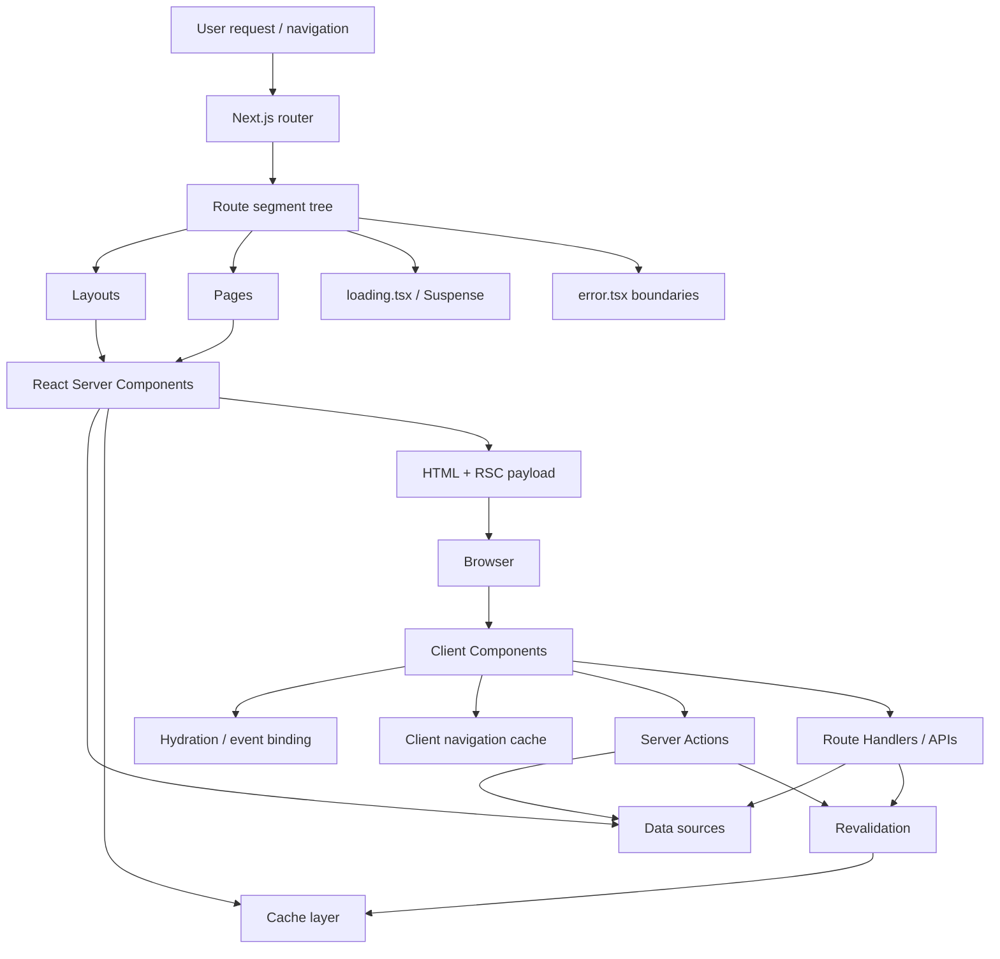
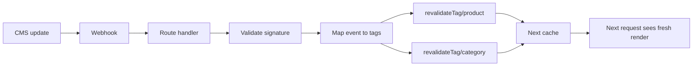
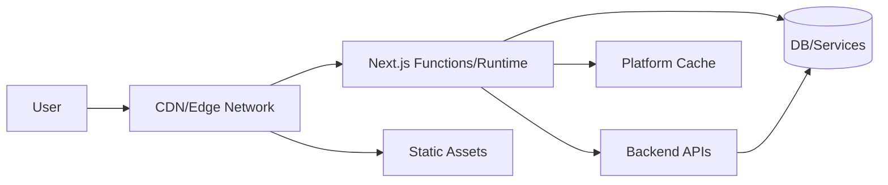
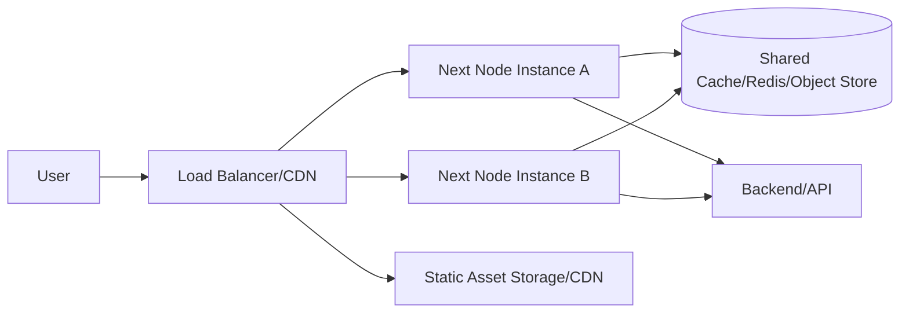
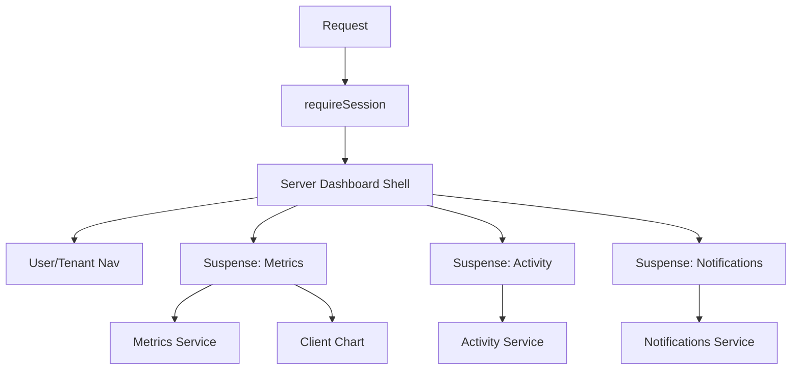
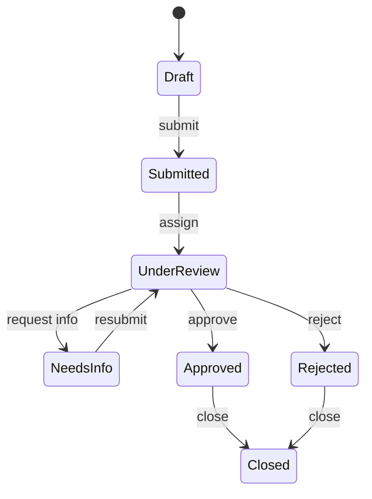

# Part 033 — Next.js Production Architecture

Next.js is often introduced as a React framework.

That description is technically true, but architecturally insufficient.

For production engineering, Next.js is better understood as a **distributed rendering, routing, data, caching, and deployment system** built around React, the browser, the server, and the network edge.

A weak Next.js codebase treats it as:

```txt
React + file-based routing + some server rendering.
```

A strong Next.js codebase treats it as:

```txt
A route-segmented application platform where rendering location, cache lifetime, mutation boundary, interactivity boundary, and deployment topology are explicit architectural decisions.
```

This part gives you that operating model.

We are not learning how to create a page.

We are learning how to design a production Next.js system that survives scale, team growth, cache invalidation, auth complexity, performance pressure, and operational incidents.

---

## 1. Kaufman Skill Deconstruction

The advanced skill is not "knowing Next.js APIs".

The advanced skill is being able to answer:

```txt
For each route segment, what runs where, when is it computed, what is cached, what can mutate it, how is it invalidated, how does it stream, how does it fail, and how do we observe it?
```

| Sub-skill | What You Must Be Able To Do | Common Failure |
|---|---|---|
| Route architecture | Design route groups, layouts, templates, loading/error boundaries, and URL ownership | File tree mirrors UI without architecture |
| Server/client boundary | Decide what belongs in Server Components, Client Components, Server Actions, API routes, and external services | Put `use client` everywhere to make errors disappear |
| Caching model | Understand request memoization, route cache, data cache, cache components, revalidation, and CDN cache | Cache accidentally, then debug stale data by superstition |
| Streaming model | Place Suspense/loading boundaries around meaningful latency units | Stream arbitrary fragments that do not improve UX |
| Mutation design | Design forms, Server Actions, route handlers, optimistic UI, invalidation, and authorization checks | Mutate data without invalidating dependent UI |
| Deployment topology | Know differences between Vercel, Node self-hosting, Docker, static export, edge runtime, and serverless | Assume local behavior equals production behavior |
| Performance engineering | Control JS budget, hydration cost, LCP/INP/CLS, bundle split, image/font delivery, and third-party scripts | Measure only Lighthouse after implementation |
| Security | Protect auth/session, CSRF, XSS, server-only secrets, redirects, headers, and dependency surface | Trust client boundaries or hide secrets in client bundle |
| Observability | Correlate frontend, route handler, server component, server action, and backend traces | Debug production using screenshots and guesses |
| Migration governance | Migrate Pages Router/legacy React code incrementally | Big-bang rewrite around framework novelty |

### Kaufman target performance

After this part, you should be able to review a Next.js architecture and produce a decision record like:

```txt
The product catalogue route is mostly static, with per-locale path generation and tag-based revalidation from CMS webhooks.
The pricing block is dynamic and streamed behind Suspense because it depends on customer segment and region.
The cart route is dynamic and uncached because it is user-specific.
Product image assets are immutable and CDN-cached.
Mutations run through Server Actions for form-first flows and route handlers for external integrations.
All mutation paths call revalidateTag for affected product/customer/cache groups.
Client Components are restricted to interactive islands: filters, cart drawer, comparison widget, and analytics consent.
```

That is the level of reasoning we want.

---

## 2. Mental Model: Next.js as a Route-Segmented Execution Graph

A Next.js app is not one runtime.

It is a graph of execution zones.



Each route segment has decisions:

| Decision | Question |
|---|---|
| Rendering location | Server, client, edge, static build, request time? |
| Data ownership | Is data public, user-specific, tenant-specific, permission-specific, or session-specific? |
| Cache lifetime | Is the response immutable, time-bound, tag-bound, manually invalidated, or never cached? |
| Interactivity | Which UI regions need browser JS? |
| Failure boundary | What happens if data, auth, network, or component rendering fails? |
| Loading boundary | What is visible immediately? What can stream later? |
| Mutation boundary | Who is allowed to write? What invalidates after write? |
| Observability boundary | What trace/log/metric explains this route in production? |

The route tree is an architecture diagram that happens to be stored as files.

Treat it that way.

---

## 3. What Next.js Is Responsible For

Next.js can own many layers:

```txt
routing
rendering
code splitting
server/client component graph
HTML generation
RSC payload generation
data fetching conventions
caching and revalidation
image optimization
font optimization
metadata
headers and redirects
middleware
route handlers
server actions
deployment adapters
observability hooks
```

But ownership does not mean you should put all system responsibilities inside Next.js.

A production architecture still needs clear boundaries:

| Responsibility | Usually Belongs In |
|---|---|
| Domain rules | Backend/domain service or shared domain package |
| Authorization source of truth | Server-side service or policy layer |
| UI composition | Next.js route tree/components |
| Request-specific rendering | Server Components / route handlers |
| Browser interaction | Client Components |
| Long-running jobs | Backend workers, not route handlers |
| External webhooks | Route handlers or backend gateway |
| Durable cache | CDN/shared cache/Redis/database, depending on semantics |
| Audit logs | Backend system of record |
| Analytics events | Client + server instrumentation with privacy controls |

A common failure is turning the Next.js app into an accidental backend.

The rule:

```txt
Next.js may orchestrate presentation and request-time composition.
It should not become the only place where durable domain behavior exists.
```

---

## 4. App Router as Architecture Boundary

The App Router introduced route segments, nested layouts, Server Components, streaming, and colocated loading/error UI as first-class architecture primitives.

A route segment is not only a path folder.

It is a boundary for:

- layout persistence;
- data fetching scope;
- error handling;
- loading behavior;
- metadata;
- rendering strategy;
- cache behavior;
- code splitting;
- ownership by team or feature.

Example structure:

```txt
app/
  (marketing)/
    layout.tsx
    page.tsx
    pricing/
      page.tsx
  (app)/
    layout.tsx
    dashboard/
      loading.tsx
      error.tsx
      page.tsx
    cases/
      layout.tsx
      [caseId]/
        page.tsx
        loading.tsx
        error.tsx
  api/
    webhooks/
      cms/
        route.ts
```

This tree communicates:

```txt
marketing routes are separated from authenticated app routes
case detail has its own loading/error model
webhooks are explicit route handlers
shared app layout can own navigation, auth shell, and telemetry context
```

A weak tree communicates nothing except URLs.

---

## 5. Route Groups

Route groups let you organize without changing URL paths.

```txt
app/
  (public)/
    about/page.tsx       -> /about
  (authenticated)/
    settings/page.tsx    -> /settings
```

Use route groups for architectural grouping:

| Route Group | Purpose |
|---|---|
| `(marketing)` | Public, mostly static, SEO-sensitive pages |
| `(app)` | Authenticated application shell |
| `(admin)` | Higher-permission operational tools |
| `(checkout)` | Revenue-critical transactional flow |
| `(experiments)` | Isolated beta/feature-flagged routes |

Avoid route groups as vague folders like `(components)` or `(misc)`.

They should express runtime or ownership boundaries.

---

## 6. Layouts, Templates, and Pages

A **layout** persists across navigation inside its segment.

A **template** can force remount behavior.

A **page** is the leaf route UI.

Mental model:

```txt
layout = persistent shell/state boundary
template = remount boundary
page = route leaf
```

Use layout for:

- navigation shell;
- route-level providers;
- auth-gated shells;
- stable sidebar/header;
- telemetry context;
- route group theming;
- slow but stable data shared across children.

Use template when remounting is semantically required:

- reset animation lifecycle;
- reset local state between sibling routes;
- force effect cleanup;
- isolate route transitions.

Use page for:

- route-specific composition;
- route-specific data dependencies;
- leaf loading/error behavior;
- route metadata.

Failure mode:

```txt
Putting request-specific user data in a persistent layout can create stale shell behavior or overly broad dynamic rendering.
```

---

## 7. Server Components: Default, Not Magic

React Server Components are components that run in a server environment separate from the client app. They can run at build time or per request depending on framework behavior and route/cache configuration.

The value is not only performance.

The value is **boundary clarity**.

Server Components are good for:

- reading from database or backend APIs;
- accessing secrets through server-only code;
- rendering non-interactive UI;
- avoiding client bundle bloat;
- composing data-heavy pages;
- reducing client-side fetch waterfalls;
- moving permission-sensitive reads to server;
- streaming slow regions.

Server Components are not good for:

- event handlers;
- browser APIs;
- local interactive state;
- effects;
- subscriptions to browser events;
- imperative DOM operations.

The rule:

```txt
Start server-side. Move to client only when browser interactivity requires it.
```

Do not make everything server-side.

Make everything **explicitly located**.

---

## 8. Client Components as Interactive Islands

A Client Component is not "bad".

It is a declaration that this part of the tree needs browser runtime behavior.

Use Client Components for:

- click/keyboard handlers;
- local state;
- effects;
- browser APIs;
- subscriptions;
- animation control;
- forms with rich client behavior;
- charts that need canvas/SVG interaction;
- drag-and-drop;
- virtualized lists;
- optimistic UI.

But Client Components have costs:

```txt
client JS bytes
parse/compile time
hydration work
event binding
state lifecycle
browser memory
bundle dependency risk
```

A mature codebase treats `use client` like a cost-bearing architectural marker.

Bad:

```tsx
'use client'

export default function ProductPage() {
  // Entire route becomes client-heavy because one button needed state.
}
```

Better:

```tsx
// ProductPage.server.tsx
import AddToCartButton from './AddToCartButton.client'

export default async function ProductPage({ params }) {
  const product = await getProduct(params.id)

  return (
    <main>
      <ProductSummary product={product} />
      <AddToCartButton productId={product.id} />
    </main>
  )
}
```

The button is interactive.

The whole product page is not.

---

## 9. Boundary Design: Server vs Client

Decision matrix:

| UI/Data Need | Server Component | Client Component |
|---|---:|---:|
| Needs browser event handler | No | Yes |
| Reads database directly | Yes | No |
| Uses secret token | Yes | No |
| Renders static/product content | Yes | Rarely |
| Uses `window`, `document`, `localStorage` | No | Yes |
| Needs high-frequency UI state | No | Yes |
| Can be streamed progressively | Yes | Sometimes with Suspense |
| Must be excluded from client bundle | Yes | No |
| Requires optimistic interaction | Sometimes with Server Action | Yes |

Design rule:

```txt
The server/client split should follow data sensitivity and interactivity, not component folder convenience.
```

---

## 10. The `use client` Blast Radius

When a module is marked `use client`, its imports become part of the client component graph unless carefully separated.

This creates a common leak:

```tsx
'use client'

import { expensiveServerOnlyHelper } from '@/lib/reporting'
```

Even if the helper is not obviously used in the browser, the import graph can cause bundling failures, bundle bloat, or accidental exposure of inappropriate code.

Mitigation:

```txt
server-only modules must not be imported into client modules
client utilities must not import server utilities
shared modules must be pure and browser-safe
use lint rules and package boundaries to enforce this
```

Recommended package structure:

```txt
src/
  server/
    db.ts
    auth.ts
    policy.ts
  client/
    analytics.ts
    browser-storage.ts
  shared/
    schema.ts
    formatting.ts
    constants.ts
```

Do not put everything under `lib/` and hope humans remember boundaries.

---

## 11. Data Fetching in Server Components

Server Components can fetch data directly.

This changes frontend architecture:

Old SPA model:

```txt
browser loads JS
JS renders shell
client fetches data
loading spinner
data arrives
component renders
```

Server Component model:

```txt
request route
server fetches data near render
server streams HTML/RSC payload
browser receives useful UI earlier
client hydrates only interactive parts
```

But this does not remove data architecture.

It makes data architecture more important.

Questions per fetch:

| Question | Why It Matters |
|---|---|
| Is this public or user-specific? | Prevent cache leaks |
| Is it permission-sensitive? | Avoid static/durable cache misuse |
| Can it be stale? | Determine cache lifetime |
| What invalidates it? | Prevent stale UI |
| Is it on critical path? | Decide streaming boundary |
| Can it fail independently? | Decide error boundary |
| Is the backend slow? | Decide parallelization, timeout, fallback |
| Is it duplicated across components? | Decide memoization/cache ownership |

A route full of `await fetch()` calls is not automatically well-designed.

---

## 12. Parallel vs Sequential Fetching

Sequential fetching is sometimes correct, but often accidental.

Accidental waterfall:

```tsx
const user = await getUser()
const org = await getOrg(user.orgId)
const dashboard = await getDashboard(org.id)
```

Maybe `org` depends on `user`, but `dashboard` might not.

Better:

```tsx
const user = await getUser()
const [org, notifications, flags] = await Promise.all([
  getOrg(user.orgId),
  getNotifications(user.id),
  getFeatureFlags(user.id),
])
```

Even better, if UI can stream:

```tsx
export default async function DashboardPage() {
  const user = await getUser()

  return (
    <DashboardShell user={user}>
      <Suspense fallback={<MetricsSkeleton />}>
        <MetricsPanel userId={user.id} />
      </Suspense>
      <Suspense fallback={<ActivitySkeleton />}>
        <ActivityFeed userId={user.id} />
      </Suspense>
    </DashboardShell>
  )
}
```

The point is not to parallelize everything.

The point is to make dependency edges explicit.

---

## 13. Caching: The Hardest Part of Production Next.js

Caching is where many Next.js systems fail.

Not because caching is bad.

Because caching has hidden dimensions:

```txt
what is cached?
where is it cached?
who is it cached for?
how long is it valid?
what invalidates it?
what happens while revalidating?
what happens across deployments?
what happens across multiple instances?
what happens under permission changes?
```

In modern Next.js documentation, caching is no longer a single behavior. It is a set of mechanisms across route rendering, data fetching, component output, and client navigation.

You need a cache inventory.

---

## 14. Cache Inventory

Create a table like this for every production route:

| Cache Surface | Example | Risk |
|---|---|---|
| Browser HTTP cache | Static assets, images, fonts | Serving old JS/CSS if cache headers wrong |
| CDN cache | Public pages, static assets | Tenant/user data leak if personalized responses cached |
| Next route output cache | Static/pre-rendered routes | Stale page after CMS/domain update |
| Data cache | Cached fetch/DB data | Stale data across route segments |
| Component/cache boundary | Cached component output | Wrong personalization if key too broad |
| Router/client cache | Client navigation payload | Stale view after mutation |
| Application cache | Query cache/local state | Conflicting source of truth |
| Service worker cache | Offline/resource cache | Serving incompatible app shell |
| Backend cache | API/database cache | Invalidation not aligned with UI |

A top-tier engineer asks:

```txt
Is this cache scoped by tenant, user, locale, permission, experiment, and data version?
```

If not, there is probably a bug waiting.

---

## 15. Cache Components and Explicit Caching

Next.js 16 introduced Cache Components as a move toward making caching more explicit and flexible.

The high-level architectural lesson is independent of exact API shape:

```txt
Caching should be explicit at meaningful boundaries.
```

Explicit cache design means:

- route owners know what is cached;
- cache keys are reviewable;
- invalidation paths are known;
- user-specific data is not accidentally durable;
- stale data behavior is intentional;
- cache behavior can be tested.

Poor design:

```txt
We do not know why this route is static.
```

Good design:

```txt
This product detail shell is cached by productId + locale.
Inventory and customer pricing are dynamic and streamed separately.
CMS updates call revalidateTag('product:{id}') and revalidateTag('category:{id}').
```

---

## 16. Previous Caching Model: Still Important

Many production applications will still use or migrate from older App Router cache behavior.

You must understand concepts such as:

- `fetch` cache options;
- time-based revalidation;
- tag-based revalidation;
- path-based revalidation;
- route segment config;
- dynamic rendering triggers;
- static generation;
- ISR-style regeneration;
- custom cache handler for self-hosted/distributed environments.

Do not blindly mix caching models.

Write down which model the codebase uses:

```txt
This codebase uses Cache Components for new routes.
Legacy routes still use fetch revalidate/tag APIs.
Migration rule: no route may mix hidden default caching with user-specific data.
```

---

## 17. Static, Dynamic, and Hybrid Routes

A route can be:

| Route Type | Best For | Avoid When |
|---|---|---|
| Static | Public content, docs, marketing, catalog shell | User-specific or rapidly changing data |
| ISR/revalidated | CMS, product catalog, landing pages | Strong consistency requirements |
| Dynamic SSR | Authenticated dashboards, personalized views | Public immutable pages |
| Streaming hybrid | Mixed fast shell + slow regions | If loading boundaries create layout chaos |
| Client-heavy SPA | Rich tool/editor/workspace | SEO/content routes with low interactivity |

Example:

```txt
/docs/page       static
/blog/[slug]     static + tag revalidation
/product/[id]    static shell + streamed inventory/pricing
/dashboard       dynamic authenticated SSR
/editor/[id]     dynamic shell + client-heavy workspace
```

Do not ask, "Should the app be SSR?"

Ask route by route.

---

## 18. Revalidation Strategy

Revalidation should be modeled like event propagation.



Do not let arbitrary systems call arbitrary invalidation.

Use a mapping layer:

```ts
function tagsForCmsEvent(event: CmsEvent): string[] {
  switch (event.type) {
    case 'product.updated':
      return [`product:${event.productId}`, `category:${event.categoryId}`]
    case 'navigation.updated':
      return ['navigation']
    default:
      return []
  }
}
```

Revalidation bugs usually happen because domain events and cache keys drift apart.

---

## 19. Cache Key Design

A cache key is a compressed model of correctness.

If the key omits a dimension, the cache lies.

Possible key dimensions:

```txt
resource id
locale
currency
tenant
user role
permission version
feature flag state
experiment bucket
region
preview/draft mode
API version
data schema version
```

Examples:

```txt
product:123:en-US
price:123:tenant-7:segment-enterprise:currency-USD
navigation:tenant-7:locale-id-ID:role-admin
case:998:permission-version-42
```

Dangerous:

```txt
product:123
```

Maybe product content is public.

Maybe price, availability, and entitlement are not.

---

## 20. Streaming and Suspense as UX Architecture

Streaming is not a performance trick.

It is a UX and latency architecture.

Bad streaming:

```txt
Every widget appears at random times.
The page layout jumps.
The user cannot tell what is important.
```

Good streaming:

```txt
Critical shell appears quickly.
Primary task region appears as soon as possible.
Secondary panels stream later with stable skeletons.
Slow/non-critical data does not block navigation.
```

Place Suspense boundaries around meaningful latency units:

| Boundary | Good Candidate? | Reason |
|---|---:|---|
| Entire app shell | Usually no | Too coarse |
| User-specific sidebar | Sometimes | Shell can render separately |
| Main metrics chart | Yes | Slow and self-contained |
| Small label text | No | Boundary overhead/noise |
| Activity feed | Yes | Independent, often slow |
| Critical form fields | Usually no | User needs stable interaction |

---

## 21. Loading UI Rules

A `loading.tsx` or Suspense fallback is part of product behavior.

Good loading UI:

- preserves layout dimensions;
- communicates what is loading;
- avoids spinner-only full-page blocking;
- prioritizes primary task path;
- does not steal focus;
- does not create layout shift;
- does not hide already-known data;
- has timeout/error behavior.

Bad loading UI:

- skeleton mismatch;
- nested spinners;
- layout jump;
- no error fallback;
- invisible loading state for screen readers;
- user cannot cancel or navigate away from slow flow.

The test:

```txt
Throttle network and CPU.
Can a user still understand where they are and what is happening?
```

---

## 22. Error Boundaries and Failure Isolation

Next.js route error files allow segment-level error isolation.

A good production app does not have one global error page for every failure.

Failure should be isolated by recoverability:

| Failure | Boundary |
|---|---|
| Dashboard metrics unavailable | Metrics panel fallback |
| Activity feed timeout | Feed fallback/retry |
| Auth expired | App shell redirect/login renewal |
| Permission denied | Route-level forbidden view |
| Product not found | `not-found.tsx` |
| Fatal invariant violation | Segment error boundary + telemetry |
| Deployment chunk mismatch | Global recovery/reload policy |

Error UI must include:

- user-safe message;
- retry option when valid;
- correlation ID for support;
- telemetry event;
- no leaked secrets;
- accessible focus handling.

---

## 23. Metadata and SEO Architecture

For public routes, metadata is not decorative.

It affects discoverability, sharing, indexing, and correctness.

Model metadata by route type:

| Route | Metadata Source | Risk |
|---|---|---|
| Marketing | Static content config | Stale title/description |
| Blog/CMS | CMS content | Missing social previews |
| Product | Product catalog | Out-of-stock/indexing mismatch |
| Auth app | Usually noindex | Leaking private route metadata |
| Search/filter pages | URL-derived | Infinite index surface |

Production checklist:

```txt
canonical URL exists
locale alternates are correct
private routes are not indexable
social image generation is bounded and cached
metadata fetches do not block critical path unnecessarily
CMS preview does not leak to public cache
```

---

## 24. Route Handlers

Route handlers are useful for:

- external webhooks;
- BFF-style API endpoints;
- auth callbacks;
- file upload signing;
- lightweight server APIs;
- cache revalidation endpoints;
- server-only integration glue.

But route handlers can become a hidden backend.

Avoid putting complex domain workflows directly in route handlers.

Prefer:

```txt
route handler -> validate request -> call domain/application service -> return response
```

Not:

```txt
route handler contains all business logic, DB queries, retries, policies, and side effects
```

Route handler checklist:

- validates method/content-type;
- validates auth/session/signature;
- validates body/schema;
- enforces authorization server-side;
- handles idempotency when needed;
- uses timeout/retry policy intentionally;
- returns safe error shape;
- logs correlation ID;
- does not cache private responses accidentally.

---

## 25. Server Actions

Server Actions can simplify form-first mutations by allowing server-side functions to be invoked from UI flows.

Architecturally, treat them as mutation endpoints with a nicer call model.

They still need:

```txt
authentication
authorization
input validation
idempotency
transaction boundary
error mapping
cache invalidation
telemetry
audit logging when relevant
```

Example shape:

```ts
'use server'

export async function updateProfileAction(input: unknown) {
  const session = await requireSession()
  const parsed = ProfileSchema.parse(input)

  await authorize(session.user, 'profile:update', parsed.userId)

  const result = await updateProfile({
    actorId: session.user.id,
    ...parsed,
  })

  revalidateTag(`profile:${parsed.userId}`)

  return { ok: true, profile: result }
}
```

Do not trust the client because the function is colocated with UI.

Server Actions are server entry points.

---

## 26. Mutation and Invalidation Matrix

Create a matrix:

| Mutation | Data Changed | Cache Tags/Paths | Client State | Side Effects |
|---|---|---|---|---|
| Update profile | profile, navigation name | `profile:{id}`, `nav:{tenant}` | update optimistic card | audit log |
| Add cart item | cart, inventory reservation | `cart:{user}`, maybe product availability | cart drawer optimistic | analytics |
| Publish article | CMS article, sitemap, homepage | `article:{id}`, `home`, `sitemap` | preview state reset | search indexing |
| Change permission | ACL, visible nav, case access | `user:{id}`, `permission-version:{tenant}` | force refetch/session refresh | audit/security alert |

Without this table, you will forget invalidation paths.

---

## 27. Auth Architecture

Auth in Next.js must be designed across server, client, cache, middleware, and backend.

Do not reduce auth to:

```txt
If no token, redirect to login.
```

Auth dimensions:

| Dimension | Question |
|---|---|
| Authentication | Who is the user? |
| Authorization | What may this user do? |
| Session freshness | Is the session still valid? |
| Tenant context | Which organization/workspace? |
| Permission version | Has access changed since cache/session was created? |
| Cache scoping | Can this response be cached for anyone else? |
| Token storage | Where do credentials live? |
| Redirect safety | Can user-controlled URL create open redirect? |

Architecture rule:

```txt
Server-side authorization is mandatory for any protected data or mutation.
Client-side checks are UX hints only.
```

---

## 28. Middleware: Use Carefully

Middleware can be useful for:

- lightweight redirects;
- locale negotiation;
- request tagging;
- basic auth gating;
- header manipulation;
- A/B bucketing;
- coarse route protection.

But middleware is not a general application layer.

Be cautious with:

- heavy computation;
- database calls;
- complex authorization;
- large dependencies;
- hidden latency on every request;
- edge runtime constraints;
- debugging complexity.

Rule:

```txt
Middleware should classify and route requests, not execute domain workflows.
```

---

## 29. Runtime Choice: Node, Edge, Static

Runtime is an architecture decision.

| Runtime | Good For | Watch Out |
|---|---|---|
| Static export | pure static sites, docs, marketing | no dynamic server features |
| Node server | broad compatibility, DB clients, long-lived server behavior | scaling, cache persistence, server ops |
| Serverless | request-driven workloads | cold starts, connection pooling, execution limits |
| Edge runtime | low-latency request transforms, geolocation, lightweight personalization | limited APIs, package compatibility, debugging |
| Client/browser | high interaction, offline, local state | JS cost, security, device variability |

Do not choose edge because it sounds advanced.

Choose it when latency, routing, or regional request handling justify constraints.

---

## 30. Self-Hosting Considerations

Self-hosting Next.js requires operational ownership.

Checklist:

```txt
How are build artifacts produced and promoted?
How are static assets served?
Where is the Next.js cache stored?
Is ISR/revalidation shared across instances?
How are image optimization and fonts handled?
How are logs/traces/metrics collected?
How are environment variables injected?
How are health checks implemented?
How are zero-downtime deploys handled?
How are rolling deploys protected from asset mismatch?
How are cache flushes coordinated?
```

A single-instance local test proves very little about distributed cache behavior.

If you run multiple containers, cache persistence and sharing become production questions.

---

## 31. Deployment Topology Diagrams

### Vercel-like managed deployment



### Self-hosted Node deployment



The important difference:

```txt
Managed platforms hide and standardize cache/runtime behavior.
Self-hosting requires you to design it.
```

---

## 32. Static Assets and Immutable Delivery

Static assets should be boring.

Boring means:

- content-hashed filenames;
- immutable cache headers;
- CDN delivery;
- correct compression;
- no serving stale HTML pointing to missing chunks;
- no long-cache mutable files;
- deployment retains previous assets long enough for open sessions.

Deployment failure mode:

```txt
User loads HTML from version N.
Deployment promotes version N+1.
User later requests chunk from version N.
Chunk no longer exists.
Application crashes.
```

Mitigation:

```txt
content-hashed assets
asset retention window
chunk-load error recovery
safe rolling deployments
CDN invalidation discipline
```

---

## 33. Image and Font Strategy

Images and fonts affect LCP and CLS heavily.

Checklist:

```txt
critical hero image has correct priority/loading behavior
image dimensions prevent layout shift
responsive sizes are correct
remote image domains are restricted
expensive image transformations are cached
font loading avoids invisible text
font subsets are used where possible
font metrics do not cause layout shift
```

Bad image strategy:

```txt
Large unoptimized hero image loaded after JS.
No width/height.
Remote image provider unbounded.
Every request triggers transformation.
```

Good image strategy:

```txt
Hero image is sized, prioritized, compressed, cached, and monitored as LCP candidate.
```

---

## 34. Bundle and Client JS Governance

Server Components can reduce client JavaScript, but only if you govern the client graph.

Track:

- route-level JS bytes;
- shared chunk growth;
- third-party dependency weight;
- accidental client imports;
- hydration time;
- parse/compile time;
- component-level expensive renders;
- client component count per route.

Policy example:

```txt
No route may add more than 20KB gzip JS without performance review.
No server-only package may be imported from a client graph.
All new third-party scripts require owner, purpose, budget, and fallback behavior.
```

This is not bureaucracy.

It is how performance stays good after month twelve.

---

## 35. Environment Configuration

Environment variables are not just strings.

They define deployment behavior.

Classify them:

| Category | Example | Exposure |
|---|---|---|
| Server secrets | DB password, private API key | server only |
| Public config | analytics public key, feature flag client key | client-safe only |
| Build-time config | release version, build environment | baked into artifact |
| Runtime config | service URL, region | resolved at startup/request |
| Tenant config | per-tenant settings | loaded securely per request |

Rule:

```txt
Anything exposed to the browser is public.
Naming conventions do not make secrets safe.
```

Also avoid building one artifact per environment unless you have a deliberate reason.

Prefer promotion of immutable artifacts with runtime configuration where platform constraints allow it.

---

## 36. Security Headers

Next.js apps should have explicit security header policy.

Common headers:

```txt
Content-Security-Policy
X-Content-Type-Options
Referrer-Policy
Permissions-Policy
Strict-Transport-Security
Cross-Origin-Opener-Policy
Cross-Origin-Resource-Policy
```

CSP is particularly important for reducing XSS blast radius, but hard to retrofit.

Approach:

```txt
start in report-only mode
inventory scripts/styles/images/connect sources
audit third-party scripts
remove unsafe-inline where possible
use nonce/hash strategy where needed
enforce gradually
monitor violations
```

Do not copy a random CSP header.

A CSP is an executable model of what the app is allowed to load and execute.

---

## 37. API and BFF Boundary

Next.js often acts as a Backend-for-Frontend.

That can be useful when:

- backend API is too coarse/fine for UI;
- server-side composition improves latency;
- secrets must not reach browser;
- you need UI-specific aggregation;
- you need request-specific personalization.

But BFF logic needs boundaries.

Good:

```txt
app route -> server component -> BFF/domain client -> backend services
```

Risky:

```txt
React component directly contains backend orchestration, retry policy, auth rules, DTO transformation, and side effects.
```

Create a server-side service layer:

```txt
server/
  clients/
    billing-client.ts
    cases-client.ts
  services/
    dashboard-service.ts
    permission-service.ts
  policies/
    access-policy.ts
```

The UI should compose results, not become a hidden service mesh.

---

## 38. DTO and Serialization Boundaries

Data crossing from server to client must be serializable and safe.

Avoid sending:

- secrets;
- internal IDs not needed by client;
- excessive nested data;
- raw permission structures;
- database rows with hidden fields;
- unstable object shapes;
- class instances that do not serialize predictably.

Prefer view models:

```ts
type CaseHeaderView = {
  caseId: string
  title: string
  status: 'draft' | 'under-review' | 'closed'
  assigneeName: string | null
  canEdit: boolean
}
```

A view model is a contract.

It also shrinks payloads and protects internal schema.

---

## 39. Observability Architecture

You need observability at multiple layers:

```txt
browser interaction
client errors
route navigation
RSC/server render time
route handler latency
server action latency
backend API latency
cache hit/miss
revalidation events
streaming boundaries
hydration errors
chunk load failures
```

Minimum production telemetry:

| Signal | Purpose |
|---|---|
| Web Vitals | User-centric performance |
| Client error rate | Runtime reliability |
| Route render latency | Server-side performance |
| Server action errors | Mutation reliability |
| Route handler latency | API/BFF health |
| Cache hit/miss | Cache correctness/performance |
| Revalidation events | Staleness debugging |
| Chunk load errors | Deployment/asset mismatch |
| Auth redirects | Session health |
| 403/404 rate | Authorization/routing correctness |

Correlation ID should flow across:

```txt
browser -> Next route/server action/handler -> backend API -> database/job/audit logs
```

Without correlation, incidents become archaeology.

---

## 40. Logging Rules

Do log:

- route/action name;
- duration;
- status/failure class;
- correlation ID;
- tenant/org id if allowed;
- user id hash or internal safe identifier;
- cache hit/miss;
- validation failure category;
- dependency name.

Do not log:

- passwords;
- raw tokens;
- cookies;
- full PII payloads;
- card/payment data;
- full request bodies by default;
- private document content;
- secrets in environment variables.

Logging is part of the security boundary.

---

## 41. Testing Strategy for Next.js

A Next.js testing strategy should cover boundaries, not only components.

| Test Type | What It Protects |
|---|---|
| Type checks | DTO/view model/API contract drift |
| Unit tests | pure mapping/policy/formatting logic |
| Component tests | interaction behavior and accessibility |
| Route integration tests | data loading, auth, error/loading states |
| Server action tests | validation, authorization, mutation, invalidation |
| Route handler tests | webhook/API contract and security |
| E2E tests | critical journeys across browser/server |
| Visual tests | layout/design-system regressions |
| Performance checks | JS budget and Core Web Vitals risk |
| Security checks | headers, dependency risk, secret scanning |

Critical tests:

```txt
private route cannot be cached publicly
mutation invalidates correct tags
unauthorized mutation is rejected server-side
loading boundary appears under slow backend
error boundary records telemetry
client component does not import server-only package
```

---

## 42. Governance: Folder Structure

A scalable folder structure optimizes for ownership and boundary clarity.

Example:

```txt
src/
  app/
    (marketing)/
    (app)/
    api/
  features/
    cases/
      components/
      server/
      client/
      schemas/
      tests/
    billing/
    users/
  shared/
    ui/
    formatting/
    validation/
  server/
    auth/
    db/
    clients/
    observability/
  client/
    analytics/
    storage/
```

Rules:

```txt
app/ composes routes
features/ owns domain UI modules
server/ contains server-only infrastructure
client/ contains browser-only infrastructure
shared/ contains environment-safe pure code
```

Enforce boundaries with linting, package exports, and review.

---

## 43. Naming Conventions

Naming is architecture compression.

Recommended conventions:

| Suffix/Folder | Meaning |
|---|---|
| `.client.tsx` | browser-interactive component |
| `.server.tsx` | server-only component/helper |
| `.action.ts` | Server Action/mutation entry |
| `.schema.ts` | validation/schema definitions |
| `.view.ts` | view model mapping |
| `.policy.ts` | authorization/policy logic |
| `.repo.ts` | database/repository access if used |
| `.query.ts` | read model/query composition |

Do not overdo suffixes.

Use them where boundary confusion is costly.

---

## 44. Migration from Pages Router

Do not migrate for novelty.

Migrate for architectural benefit:

- reduce client JS;
- improve data/rendering model;
- improve nested route layout;
- stream slow regions;
- align with future React features;
- simplify server-side composition;
- isolate old/new routes.

Migration strategy:

```txt
1. Inventory routes by risk and traffic.
2. Keep Pages Router routes stable.
3. Start with low-risk public routes.
4. Establish App Router conventions.
5. Migrate shared UI into environment-safe modules.
6. Move server-only logic out of client imports.
7. Add route-level performance/behavior tests.
8. Migrate authenticated flows gradually.
9. Delete compatibility layers when coverage is complete.
```

Avoid:

```txt
rewriting all routes before conventions stabilize
mixing data models unpredictably
using App Router without cache policy
turning migration into design-system rewrite + auth rewrite + framework rewrite at once
```

---

## 45. Performance Readiness Checklist

Before production:

```txt
Route JS budget defined
Client component graph reviewed
Critical LCP image optimized
Font loading strategy verified
Streaming boundaries tested under throttling
Hydration errors monitored
Third-party scripts inventoried
Bundle analyzer reviewed
Web Vitals reporting enabled
Lab + field performance workflow defined
Slow backend dependency has fallback
Cache hit/miss observable
```

Performance is not a final pass.

It is a route-level design constraint.

---

## 46. Security Readiness Checklist

```txt
Server-side auth on all protected reads/mutations
No secrets in client bundle
Open redirects prevented
CSRF/session strategy documented
CSP plan exists
Security headers configured
Webhook signatures verified
Input validation on server entry points
File upload signing constrained
Private data never statically cached
Preview/draft mode protected
Dependency and supply-chain scanning enabled
Logs avoid sensitive payloads
```

Security failures in Next.js often come from confusing UI boundaries with trust boundaries.

A Client Component boundary is not a security boundary.

---

## 47. Reliability Readiness Checklist

```txt
Segment error boundaries exist for recoverable failures
not-found behavior is explicit
Loading states tested under slow data
Server actions handle validation and domain errors
Route handlers return stable error shapes
Chunk-load recovery exists
Fallbacks avoid blank screens
Critical routes have E2E coverage
Observability includes route/action names
Rollback process tested
Cache invalidation events are logged
```

Reliability is mostly boring until it is absent.

---

## 48. Common Failure Modes

| Failure | Root Cause | Prevention |
|---|---|---|
| Everything becomes client-side | `use client` used to escape RSC thinking | Require boundary review |
| Stale data after mutation | Missing revalidation path | Mutation/invalidation matrix |
| User data leaked through cache | Cache key omits user/tenant/permission | Cache classification review |
| Slow dashboard despite SSR | Sequential server fetch waterfall | Dependency graph + streaming |
| Broken deployment after release | Old HTML references missing chunks | Asset retention and chunk recovery |
| Edge runtime package failure | Node-only package used at edge | Runtime compatibility review |
| Middleware latency spike | Heavy logic in middleware | Keep middleware lightweight |
| Server Action bypasses auth | Treating colocated action as trusted | Server-side auth mandatory |
| Bundle bloat returns | Client graph not monitored | JS budget gate |
| Difficult incidents | Missing correlation IDs | Observability design |

---

## 49. Architecture Review Template

Use this for every meaningful Next.js route or feature.

```md
# Route Architecture Review

## Route
- Path:
- Owner:
- Product goal:

## Runtime and rendering
- Static/dynamic/hybrid:
- Server Components:
- Client Components:
- Streaming boundaries:

## Data
- Data sources:
- Public/private/user/tenant-specific:
- Fetch dependency graph:
- Failure behavior:

## Cache
- Cache surfaces:
- Cache keys:
- Revalidation triggers:
- Permission dimensions:

## Mutations
- Server Actions:
- Route handlers:
- Validation:
- Authorization:
- Idempotency:
- Invalidation:

## Performance
- LCP candidate:
- JS budget:
- Hydration risk:
- Third-party scripts:

## Security
- Auth model:
- Secret exposure risk:
- Headers/CSP:
- Redirect/file/upload risk:

## Observability
- Logs:
- Metrics:
- Traces:
- Web Vitals:
- Correlation ID:

## Tests
- Unit:
- Integration:
- E2E:
- Accessibility:
- Performance:
```

---

## 50. Mini Case Study: Product Detail Route

Requirements:

```txt
SEO-sensitive
public product content
localized descriptions
price can vary by region/customer segment
inventory changes often
reviews update occasionally
add-to-cart interactive
CMS updates should appear quickly
```

Architecture:

```mermaid
flowchart TD
  R[/product/[id]/] --> SC[Server Product Page]
  SC --> PC[Cached Product Content]
  SC --> INV[Dynamic Inventory]
  SC --> PR[Dynamic Pricing]
  SC --> REV[Cached Reviews]
  SC --> BTN[Client AddToCartButton]
  BTN --> ACT[Server Action: addToCart]
  ACT --> CART[Cart Service]
  ACT --> RV[Revalidate cart/user tags]
```

Decisions:

| Concern | Decision |
|---|---|
| Product description | cached by product + locale |
| Price | dynamic by region/customer segment |
| Inventory | dynamic or short-lived cache |
| Reviews | cached with tag revalidation |
| Add to cart | Client Component + Server Action |
| LCP | optimized product hero image |
| SEO | metadata generated from product content |
| Error | product not found vs inventory unavailable separated |

Key risk:

```txt
Do not cache personalized price under product-only key.
```

---

## 51. Mini Case Study: Authenticated Dashboard

Requirements:

```txt
private route
user-specific metrics
slow analytics backend
notifications
team switcher
permissions can change
charts are interactive
```

Architecture:



Decisions:

| Concern | Decision |
|---|---|
| Rendering | dynamic authenticated SSR |
| Cache | private/request-scoped unless explicitly tenant-safe |
| Streaming | metrics/activity/notifications independent |
| Client JS | charts and filters only |
| Auth | server-side authorization for all data |
| Permission changes | permission version included in data/session strategy |
| Observability | service latency per panel |

Key risk:

```txt
Dashboard data is almost never safe for public route cache.
```

---

## 52. Mini Case Study: Internal Workflow Platform

Requirements:

```txt
case management
state transitions
role-based permissions
auditability
forms with autosave
documents/attachments
notifications
long-lived sessions
```

Architecture:



Next.js role:

```txt
route composition
server-rendered case shell
client form islands
action entry points
view model mapping
permission-aware UI hints
```

Backend role:

```txt
state transition authority
audit log
document storage
workflow rules
notifications
authorization source of truth
```

Key rule:

```txt
Next.js may present workflow state, but backend owns durable transition validity.
```

---

## 53. Deliberate Practice

### Exercise 1 — Cache classification

Pick 10 routes from a real or imagined app.

For each route, classify:

```txt
public/private
static/dynamic/hybrid
cache key dimensions
revalidation trigger
personalization dimensions
mutation dependencies
```

If you cannot fill the table, the architecture is under-specified.

### Exercise 2 — `use client` audit

Find every `use client` boundary in a codebase.

For each:

```txt
why is it client?
what imports does it pull?
what is the JS cost?
can the boundary be moved lower?
is any server-only logic imported?
```

Goal: reduce client graph without breaking UX.

### Exercise 3 — Streaming redesign

Take a slow dashboard route.

Draw:

```txt
data dependency graph
critical shell
streamable panels
error boundaries
fallback UI
metrics to observe
```

Then implement one Suspense boundary that improves actual perceived UX.

### Exercise 4 — Mutation/invalidation matrix

Pick 5 mutations.

For each:

```txt
input schema
authorization rule
transaction boundary
cache invalidation
optimistic UI behavior
audit/telemetry
failure mapping
```

Do not write code until the matrix is complete.

---

## 54. Production Review Rubric

| Level | Behavior |
|---|---|
| Junior | Can build pages and use framework APIs |
| Mid | Can structure routes, components, and data fetching reasonably |
| Senior | Can design server/client/cache/mutation boundaries intentionally |
| Staff | Can define platform conventions, migration strategy, observability, performance budgets, and operational controls |
| Top 1% | Can predict failure modes before they happen and design route-level architecture that remains correct under scale, team growth, and production incidents |

The goal is not to worship Next.js.

The goal is to use it as a controlled execution platform.

---

## 55. Practical Checklist Before Starting a New Next.js Feature

```txt
1. What route segments are affected?
2. What data is public/private/user-specific/tenant-specific?
3. What should run on server vs client?
4. What is cached and how is it invalidated?
5. What mutations exist and what do they invalidate?
6. What loads first and what streams later?
7. What fails independently?
8. What is the LCP candidate?
9. What client JS is truly required?
10. What telemetry proves correctness in production?
11. What tests protect the route boundary?
12. What security assumptions must be reviewed?
```

If a design cannot answer these, implementation is premature.

---

## 56. References

- Next.js Documentation: https://nextjs.org/docs
- Next.js App Router Caching: https://nextjs.org/docs/app/getting-started/caching
- Next.js Fetching Data: https://nextjs.org/docs/app/getting-started/fetching-data
- Next.js Self-Hosting Guide: https://nextjs.org/docs/app/guides/self-hosting
- Next.js Incremental Static Regeneration: https://nextjs.org/docs/app/guides/incremental-static-regeneration
- React Server Components Reference: https://react.dev/reference/rsc/server-components
- MDN HTTP Caching: https://developer.mozilla.org/en-US/docs/Web/HTTP/Caching
- Web.dev Core Web Vitals: https://web.dev/vitals/

---

## 57. What Comes Next

Next.js production architecture is one framework-specific application of the previous 32 parts.

The next part generalizes everything into **frontend system design case studies**.

We will practice architectural reasoning across:

```txt
dashboard
workflow engine UI
collaborative editor
ecommerce frontend
internal admin platform
offline-first app
```

That is where skill becomes judgment.
