# Part 034 — Frontend System Design Case Studies

This part is where the series becomes practical architecture.

So far, we have studied language semantics, browser internals, event loop behavior, memory, rendering, state modeling, reactivity, components, data fetching, routing, hydration, performance, workers, TypeScript, observability, testing, security, accessibility, i18n, design systems, tooling, framework choice, and Next.js.

A top-tier frontend engineer can combine those into real systems.

That is the skill this part trains.

The question is not:

```txt
Can you build a page?
```

The question is:

```txt
Can you design a frontend system whose state, data, rendering, interaction, failure, performance, security, accessibility, and operability remain coherent under real-world pressure?
```

We will use six case studies:

1. executive analytics dashboard;
2. regulatory workflow/case-management UI;
3. collaborative document editor;
4. ecommerce product and checkout frontend;
5. internal admin platform;
6. offline-first field application.

Each case study uses the same architecture lens.

---

## 1. Kaufman Skill Deconstruction

Frontend system design is a compound skill.

| Sub-skill | What You Must Be Able To Do | Failure Mode |
|---|---|---|
| Requirement compression | Turn vague product needs into constraints and invariants | Build UI from screens only |
| State modeling | Separate source, derived, local, remote, URL, server, and workflow state | Duplicate state everywhere |
| Data architecture | Design fetch, cache, consistency, invalidation, and failure behavior | Use random fetches in components |
| Rendering strategy | Choose SPA/SSR/SSG/streaming/islands/client-heavy per route | One rendering mode for all routes |
| Interaction design | Model forms, keyboard, focus, optimistic UI, and race conditions | Happy-path click demo only |
| Performance design | Define budgets, critical path, JS cost, rendering cost, and network cost | Optimize after regressions hit production |
| Reliability design | Place loading/error/retry/offline boundaries | Blank screens and unrecoverable failures |
| Security design | Protect trust boundaries, permissions, cache, tokens, and input | Treat UI checks as authorization |
| Accessibility design | Define semantic structure, keyboard model, focus, errors, and announcements | Add ARIA late and hope |
| Operability design | Define logs, metrics, traces, alerts, and debugging strategy | Production bugs become guesswork |

### Kaufman target performance

After this part, you should be able to produce a concise architecture proposal like:

```txt
This dashboard is dynamic and user-specific, but the shell and navigation can be server-rendered.
Metrics panels stream independently behind stable Suspense boundaries.
Filters live in URL state because users share dashboard views.
Chart rendering is client-only and virtualized where needed.
The application cache is keyed by tenant, user role, date range, and metric definition version.
Permission changes invalidate navigation and metric access.
Web Vitals, panel latency, backend dependency latency, and cache hit/miss are observed per route.
```

That is not implementation detail.

That is frontend system design.

---

## 2. Universal Frontend System Design Template

Use this template before writing code.

```md
# Frontend System Design

## Product goal
- Who uses it?
- What decision/task does it support?
- What is unacceptable failure?

## Constraints
- Performance:
- Accessibility:
- Security:
- Browser/device:
- Network:
- Compliance:
- Team/maintenance:

## State model
- Source state:
- Derived state:
- Local state:
- URL state:
- Server/cache state:
- Workflow state:
- Persistence:

## Rendering model
- Route type:
- Server/client split:
- Streaming/hydration strategy:
- Critical UI path:

## Data model
- Data sources:
- Fetch graph:
- Cache keys:
- Invalidation:
- Consistency model:

## Interaction model
- Main user journeys:
- Keyboard/focus:
- Forms:
- Optimistic UI:
- Race conditions:

## Reliability model
- Loading states:
- Error boundaries:
- Retry/recovery:
- Offline/slow network:
- Data loss prevention:

## Security model
- Auth/authz:
- Sensitive data:
- Cache safety:
- Input handling:
- Third-party risk:

## Observability
- Metrics:
- Logs:
- Traces:
- User impact:
- Debug artifacts:

## Testing
- Unit:
- Integration:
- E2E:
- Accessibility:
- Performance:
- Security:
```

This template prevents shallow architecture.

---

## 3. Case Study A — Executive Analytics Dashboard

### 3.1 Problem

Build a dashboard for executives and managers to inspect business metrics.

Requirements:

```txt
multiple metric cards
interactive charts
date range filters
tenant-specific data
role-based metric visibility
shareable dashboard URLs
slow analytics backend
export to CSV/PDF
mobile read-only mode
near-real-time refresh for some metrics
```

Hidden constraints:

```txt
numbers must be trustworthy
users compare screenshots in meetings
filters must be reproducible
permission leaks are high severity
backend queries can be expensive
dashboards often become performance bottlenecks
```

The UI is not just visualization.

It is a decision-support system.

---

### 3.2 Core Invariants

```txt
A user must never see a metric they are not authorized to see.
A shared URL must reproduce the same filter state subject to current permissions.
A chart must indicate whether data is fresh, stale, partial, or failed.
A slow metric must not block the entire dashboard shell.
A filter change must not mix old and new metric results silently.
```

These invariants drive architecture.

---

### 3.3 State Model

| State | Owner | Persistence | Notes |
|---|---|---|---|
| Selected date range | URL | shareable | canonical filter state |
| Tenant/workspace | app shell/server session | session | affects all queries |
| Metric definitions | server/cache | versioned | changes invalidate panels |
| Metric result | server/application cache | short-lived | keyed by tenant/user role/filter/version |
| Chart hover/zoom | client local | ephemeral | should not affect URL unless deep-linkable |
| Export job status | server state | durable/async | may outlive page |
| Refresh interval | client/app config | ephemeral/config | must pause when hidden |

Avoid storing dashboard filters only in component state.

If meeting participants cannot share a URL, the dashboard is operationally weak.

---

### 3.4 Architecture

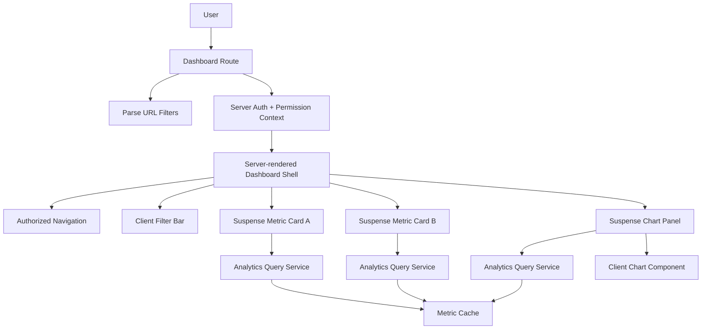

Rendering decision:

```txt
Authenticated dynamic shell.
Independent metric panels stream.
Charts hydrate only interactive portions.
Filters are client-interactive but URL-backed.
```

---

### 3.5 Data Fetching and Cache Keys

Cache key example:

```txt
metric:{metricId}:tenant:{tenantId}:role:{roleHash}:range:{from}-{to}:grain:{grain}:definition:{metricDefinitionVersion}
```

Why include role?

Because role may alter accessible rows, dimensions, or aggregation level.

Why include metric definition version?

Because the same `metricId` may change formula over time.

Why include tenant?

Because cross-tenant cache leak is severe.

---

### 3.6 Consistency Model

Dashboard metrics rarely need strong read-after-write consistency unless users just triggered a data-changing action.

Use explicit freshness labels:

```txt
Updated 2 minutes ago
Data delayed by 15 minutes
Partial data: 2 sources unavailable
Export uses data as of 10:30
```

A stale but labeled number is often acceptable.

A stale unlabeled number erodes trust.

---

### 3.7 Interaction Model

Filter change flow:

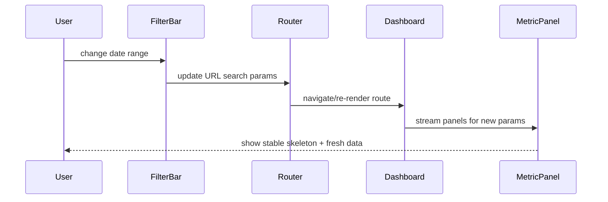

Rules:

```txt
filter state is canonicalized before URL update
invalid date ranges are rejected or normalized
old metric result is not displayed as if it matches new filters
pending state is visible
keyboard users can operate filter controls
```

---

### 3.8 Failure Modes

| Failure | Cause | Design Response |
|---|---|---|
| Whole dashboard blank | one panel throws | segment/panel error boundary |
| Wrong data in shared URL | filters not canonicalized | URL schema parser |
| Permission leak | cache key omits role/tenant | permission-scoped cache key |
| Chart freezes UI | too many points on main thread | sampling/aggregation/worker/canvas strategy |
| Misleading freshness | no freshness metadata | freshness contract from backend |
| Export mismatch | export uses different filters | export request uses same parsed URL state |
| Auto-refresh overloads backend | polling all panels blindly | visibility-aware polling and server push where justified |

---

### 3.9 Testing Strategy

```txt
unit: filter parser, cache key builder, metric view model
integration: panel loading/error/freshness states
contract: analytics API response shape and freshness metadata
E2E: share URL -> same filters -> authorized metrics only
accessibility: keyboard filters, chart summaries, focus after navigation
performance: chart render under large data, INP during filter change
security: role/tenant cache isolation test
```

The most valuable tests protect invariants, not implementation details.

---

## 4. Case Study B — Regulatory Workflow / Case-Management UI

### 4.1 Problem

Build a frontend for complex case handling.

Requirements:

```txt
case lifecycle states
role-based actions
task queues
case detail pages
document upload/review
comments and internal notes
assignment/escalation
audit trail
SLA timers
bulk operations
high compliance sensitivity
```

This is not CRUD.

This is a UI over a regulated state machine.

---

### 4.2 Core Invariants

```txt
A transition visible in the UI must also be authorized and valid on the server.
A case view must reflect the user's current permission scope.
Draft form data must not be silently lost.
Audit-relevant user actions must be captured server-side.
Bulk operations must make partial success/failure explicit.
SLA and escalation indicators must use a consistent time source.
```

The UI must support defensibility.

That means clarity, traceability, and correctness under edge cases.

---

### 4.3 Workflow State Model

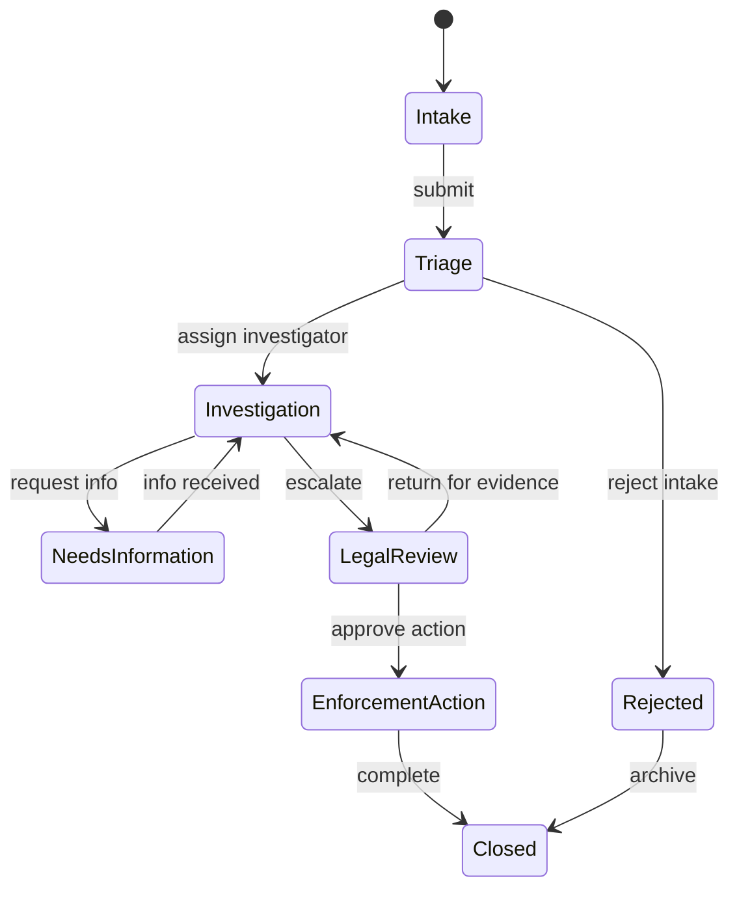

Frontend state layers:

| State | Source of Truth | UI Role |
|---|---|---|
| Case lifecycle state | backend workflow engine | render status/actions |
| Allowed transitions | backend policy response | enable/disable/hide actions |
| Draft form edits | client + draft API | prevent data loss |
| Assignment queue | backend query | task list |
| SLA timer | backend canonical timestamp | display urgency |
| Audit history | backend append-only log | read-only timeline |
| UI tabs/panels | URL/local state | navigation within case |

Do not derive allowed transitions only in the client.

The client may display hints.

The backend decides.

---

### 4.4 Architecture

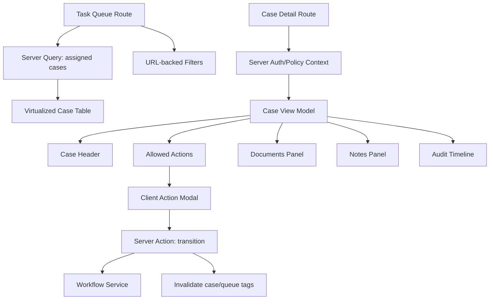

Rendering decision:

```txt
Queue can be server-rendered with URL filters and client table interactivity.
Case detail shell is server-rendered for permission correctness.
Action forms are client islands backed by server mutations.
Audit timeline can stream or paginate.
```

---

### 4.5 State Transition UI

Bad transition UI:

```txt
Button appears because status === 'Investigation'.
```

Good transition UI:

```txt
Button appears because server policy says current user may perform transition X for case version Y.
```

Mutation payload:

```ts
type TransitionRequest = {
  caseId: string
  expectedVersion: number
  transition: 'request-info' | 'escalate' | 'approve-action'
  reason: string
  evidenceIds?: string[]
}
```

Why `expectedVersion`?

To detect concurrency conflicts.

If another reviewer changed the case, the UI must not blindly apply stale actions.

---

### 4.6 Concurrency and Conflict Handling

Conflict scenario:

```txt
Reviewer A opens case at version 12.
Reviewer B escalates case to LegalReview, version 13.
Reviewer A attempts to reject using version 12.
Server rejects with conflict.
UI must reload and explain the case changed.
```

UI behavior:

```txt
show conflict message
show what changed if available
preserve user's draft reason
reload allowed transitions
avoid duplicate side effects
```

This is where mature workflow UIs differ from CRUD apps.

---

### 4.7 Bulk Operations

Bulk operations need explicit partial state.

```txt
20 cases selected
15 transitioned successfully
3 skipped due to permission
2 failed due to version conflict
```

Result model:

```ts
type BulkResult = {
  total: number
  succeeded: CaseResult[]
  skipped: CaseResult[]
  failed: CaseResult[]
}
```

Never show only:

```txt
Bulk operation failed.
```

That destroys operational trust.

---

### 4.8 Audit and Observability

Audit is not the same as frontend logging.

| Signal | Purpose |
|---|---|
| Audit log | legal/regulatory history |
| Frontend event | UX/product analytics |
| Application log | debugging |
| Trace | distributed latency/correlation |
| Metric | aggregate health |

Frontend should not be the source of truth for audit.

But it must preserve correlation:

```txt
user action correlation ID -> server transition -> audit entry -> notification -> UI refresh
```

---

### 4.9 Accessibility

Workflow platforms are often used for long sessions.

Critical accessibility requirements:

```txt
keyboard navigation for queues and case actions
clear focus after modal open/close
screen-reader accessible status changes
error summaries for long forms
semantic headings for case sections
table headers and sorting controls
visible focus indicators
no color-only SLA severity
```

Accessibility is part of operational correctness.

If a reviewer cannot navigate a critical workflow reliably, the system is defective.

---

### 4.10 Testing Strategy

```txt
unit: transition view model, permission mapping, SLA formatting
integration: action modal conflict handling, draft preservation
contract: workflow API allowed transitions and version conflict shape
E2E: assign -> investigate -> escalate -> audit visible
accessibility: modal focus trap, table keyboard navigation, error summary
security: unauthorized transition rejected server-side
performance: task queue virtualization with large result set
```

---

## 5. Case Study C — Collaborative Document Editor

### 5.1 Problem

Build a collaborative editor for rich documents.

Requirements:

```txt
multiple users editing same document
presence indicators
comments
autosave
offline/poor network tolerance
conflict resolution
version history
large documents
keyboard-heavy interaction
low-latency typing
```

This is one of the hardest frontend systems.

The primary constraint is not page rendering.

It is maintaining a responsive local editing experience while synchronizing shared state.

---

### 5.2 Core Invariants

```txt
Typing must remain responsive under network variance.
Local edits must not disappear silently.
Remote edits must merge according to a defined model.
Document history must be recoverable.
Presence must be eventually correct but not treated as durable truth.
Autosave state must be visible.
Keyboard behavior must be predictable.
```

---

### 5.3 Architecture

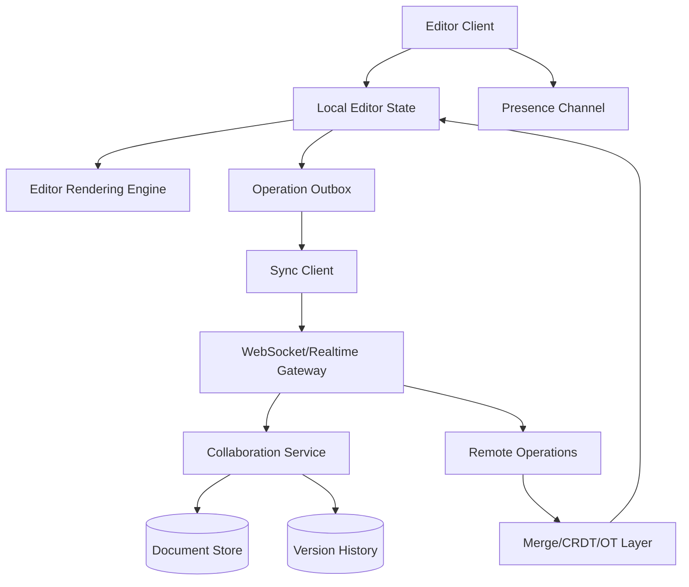

Rendering decision:

```txt
Mostly client-heavy interactive app.
Initial shell can be server-rendered.
Editor runtime is client-owned.
Expensive parsing/diffing can move to worker.
```

---

### 5.4 State Model

| State | Owner | Consistency |
|---|---|---|
| Local document buffer | editor client | immediate |
| Pending operations | client outbox | durable until ack |
| Canonical document | collaboration backend | eventual/serialized by protocol |
| Presence | realtime service | ephemeral eventual |
| Comments | backend + client cache | eventual with conflict policy |
| Version history | backend | durable |
| Selection/cursor | client/local + presence | ephemeral |
| Autosave status | sync client | derived |

Do not route all keystrokes through React state if it causes re-render pressure.

Editor internals often need specialized state management.

---

### 5.5 Synchronization Strategy

You need an explicit collaboration model:

| Model | Notes |
|---|---|
| Last-write-wins | simple, unsafe for rich concurrent editing |
| Locking | simpler consistency, worse collaboration UX |
| Operational Transform | mature but complex |
| CRDT | strong offline/eventual merge properties, data overhead/complexity |
| Server-authoritative patches | good when collaboration is limited |

The frontend must align with backend conflict semantics.

Do not invent merge behavior in the UI without system-level agreement.

---

### 5.6 Responsiveness

Typing has a much tighter latency budget than route navigation.

Rules:

```txt
local edit applies synchronously
network send is asynchronous
ack updates save state, not typed content
heavy serialization/diffing moves off main thread
remote operations batch when safe
selection updates are throttled
presence does not block editing
```

Use workers for:

- document diff;
- markdown/rich-text parsing;
- search indexing;
- large spellcheck/lint operations;
- export preparation;
- CRDT compaction if expensive.

---

### 5.7 Autosave State Machine

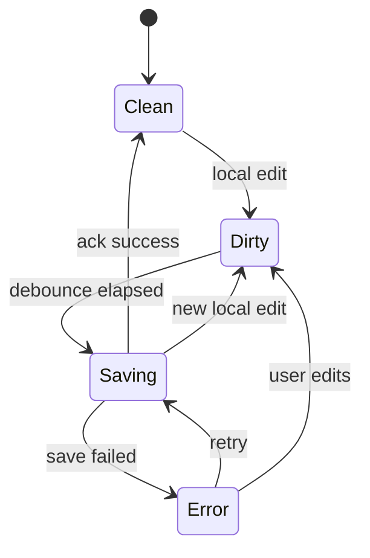

The UI should distinguish:

```txt
Saved
Unsaved changes
Saving...
Offline - changes stored locally
Save failed - retrying
Conflict detected
```

Never hide save uncertainty.

---

### 5.8 Failure Modes

| Failure | Cause | Response |
|---|---|---|
| Typing lag | React re-renders too much | isolate editor state, memoization, virtualization |
| Lost edits | outbox not durable | local persistence + ack protocol |
| Duplicate operations | retry not idempotent | operation IDs |
| Presence lies | stale connection state | heartbeat/expiry |
| Remote edit jumps cursor | bad selection transform | selection transform tests |
| Huge doc freezes | full reparse/render | incremental parse, virtualized rendering, worker |
| Offline confusion | no sync state | explicit offline/autosave UI |

---

### 5.9 Testing Strategy

```txt
unit: operation transform/merge, selection mapping, autosave state machine
property tests: random operation sequences preserve document invariants
integration: offline edit -> reconnect -> merge
E2E: two browser contexts editing same document
performance: typing latency under large document
accessibility: keyboard shortcuts, focus, screen reader labels
reliability: websocket reconnect/backoff/outbox replay
```

For collaborative systems, deterministic simulation tests are extremely valuable.

---

## 6. Case Study D — Ecommerce Product and Checkout Frontend

### 6.1 Problem

Build an ecommerce frontend.

Requirements:

```txt
SEO-sensitive product/category pages
fast LCP
faceted search
cart drawer
checkout flow
localized currency/content
inventory and price changes
promotions
payment integration
analytics
high traffic spikes
```

Ecommerce is a performance, correctness, and conversion system.

---

### 6.2 Core Invariants

```txt
Public content must load fast.
Price shown at checkout must be authoritative.
Inventory state must be clearly communicated.
Cart mutations must be idempotent.
Payment-sensitive flows must not leak secrets.
Analytics must not block purchase.
Localized price/content must be correct.
```

---

### 6.3 Route Strategy

| Route | Rendering | Cache |
|---|---|---|
| Home | static/ISR | CMS tag revalidation |
| Category | static/ISR + dynamic filters | category/product tags |
| Product detail | static shell + dynamic price/inventory | product tag + dynamic pricing |
| Search | dynamic or edge/server depending backend | query-dependent |
| Cart | dynamic/user-specific | private/no public cache |
| Checkout | dynamic/session-specific | no public cache |
| Order confirmation | dynamic/private | noindex/no public cache |

One ecommerce app has many rendering modes.

A single global choice is lazy architecture.

---

### 6.4 Architecture

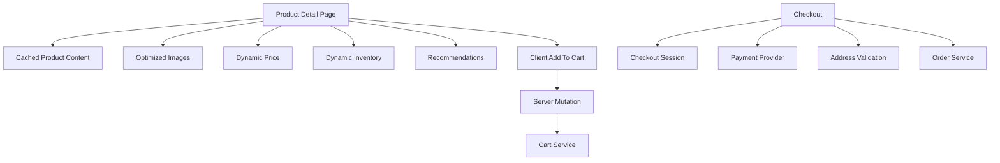

---

### 6.5 Product Page Data Split

| Data | Cache Policy | Reason |
|---|---|---|
| Product title/description | cached/revalidated | public CMS/catalog content |
| Hero image | immutable CDN | performance |
| Price | dynamic or segmented cache | varies by region/customer/promo |
| Inventory | short TTL/dynamic | changes quickly |
| Reviews | cached/revalidated | eventually consistent acceptable |
| Recommendations | async/streamed | non-critical |
| Cart count | user-specific | private |

Key rule:

```txt
Do not let dynamic private data make the whole route slow if it can be isolated.
```

---

### 6.6 Checkout State Machine

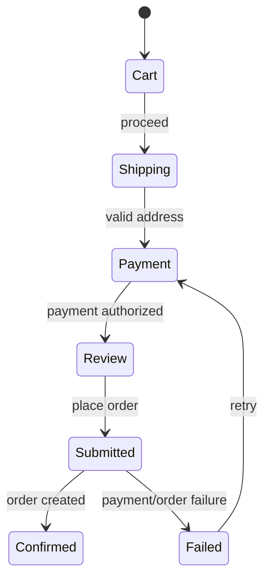

Checkout state must handle:

```txt
payment authorization failure
inventory changed
price changed
address invalid
session expired
network retry
duplicate submit
browser back button
```

---

### 6.7 Mutation Design

Cart mutation payload:

```ts
type AddToCartRequest = {
  productId: string
  variantId: string
  quantity: number
  idempotencyKey: string
}
```

Why idempotency?

Because users double-click, networks retry, and mobile browsers repeat requests.

Checkout mutation must be even stricter:

```txt
server validates cart
server validates price
server validates inventory
server validates payment session
server creates order once
server emits audit/order events
```

The frontend can improve UX.

It cannot be the authority for price/order correctness.

---

### 6.8 Performance Priorities

For ecommerce:

```txt
LCP of product/category pages
INP for filters/cart interaction
CLS from images/promos/fonts
search response latency
checkout input responsiveness
third-party script cost
analytics/payment provider loading
```

Do not load every marketing script before product content.

Third-party scripts need governance.

---

### 6.9 Testing Strategy

```txt
unit: price formatting, cart reducer, checkout state machine
integration: inventory changed during checkout, promo invalidation
E2E: browse -> add to cart -> checkout -> confirmation
performance: product LCP, filter INP, script budget
security: no public cache for cart/checkout, token handling
accessibility: forms, errors, keyboard, payment iframe integration
observability: conversion funnel errors, payment failure categories
```

---

## 7. Case Study E — Internal Admin Platform

### 7.1 Problem

Build an internal admin platform used by support, operations, finance, or compliance teams.

Requirements:

```txt
search users/orders/cases
view/edit records
bulk actions
audit trail
role-based permissions
complex tables
filters
saved views
dangerous actions
high data density
```

Admin platforms are often treated as low-polish internal tools.

That is dangerous.

Internal tools can create severe production damage.

---

### 7.2 Core Invariants

```txt
Dangerous actions must require explicit confirmation and authorization.
Every privileged mutation must be auditable.
Search/filter state should be shareable and reproducible.
Bulk changes must show partial results.
PII exposure must follow role and purpose.
Tables must remain usable with keyboard and screen readers.
```

---

### 7.3 Architecture

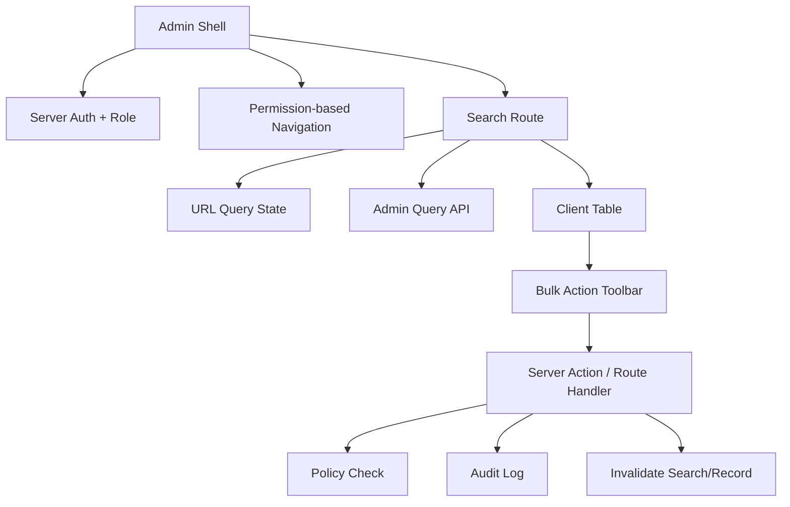

Rendering decision:

```txt
Authenticated dynamic shell.
Search result table may be server-driven or client-enhanced.
Bulk operations are mutation flows with explicit partial results.
```

---

### 7.4 URL State for Search

Admin search state should usually be in URL:

```txt
/users?query=alice&status=active&role=reviewer&page=3&sort=createdAt.desc
```

Benefits:

- shareable with teammates;
- reproducible for support tickets;
- browser back/forward works;
- saved views can store query params;
- QA can link bug states.

Use schema parsing:

```ts
type UserSearchParams = {
  query: string
  status: 'active' | 'disabled' | 'locked' | null
  role: string | null
  page: number
  sort: 'createdAt.desc' | 'createdAt.asc' | 'name.asc'
}
```

Invalid URL state should normalize or show a safe error.

---

### 7.5 Dangerous Action Pattern

Example: disable user account.

Flow:

```txt
1. User opens action menu.
2. UI checks permission hint.
3. User opens confirmation modal.
4. Modal explains consequence.
5. User types reason or confirmation phrase if high risk.
6. Server validates authz and input.
7. Server performs mutation transactionally.
8. Server writes audit event.
9. UI invalidates record/search caches.
10. UI shows result and recovery path if available.
```

Do not rely on disabled buttons.

The server must reject unauthorized actions.

---

### 7.6 Table Performance

Admin tables fail through scale.

Design decisions:

| Concern | Option |
|---|---|
| Pagination | server-side for large data |
| Sorting | server-side if dataset large/authorized |
| Filtering | URL-backed and server-authoritative |
| Virtualization | useful for many visible rows |
| Column visibility | local/user preference |
| Export | async server job for large result sets |
| Bulk selection | selection by IDs or query snapshot |

Danger:

```txt
Select all 50 visible rows vs select all 12,384 matching query.
```

Make scope explicit.

---

### 7.7 Security and Privacy

Admin UIs need purpose limitation.

Questions:

```txt
Which roles can see PII?
Is sensitive data masked by default?
Are reads audited, or only writes?
Can support impersonate users?
Is impersonation visible and audited?
Are exports rate-limited and logged?
Does search expose records outside tenant/region/policy?
```

Frontend design should reduce accidental exposure:

- mask sensitive fields by default;
- require reveal action with audit;
- avoid putting sensitive data in URL;
- avoid localStorage for sensitive views;
- apply noindex/private cache headers;
- restrict screenshots/session replay for sensitive pages.

---

### 7.8 Testing Strategy

```txt
unit: URL parser, permission view model, bulk result reducer
integration: dangerous action modal + server rejection
E2E: search -> edit -> audit visible
accessibility: data table headers, keyboard row actions, focus after modal
security: unauthorized action hidden and server-rejected
performance: large search result interaction, virtualized table
privacy: sensitive fields masked by role
```

---

## 8. Case Study F — Offline-First Field Application

### 8.1 Problem

Build a web app for field workers using tablets or laptops in unstable network conditions.

Requirements:

```txt
works offline
captures forms/photos/notes
syncs when online
handles conflicts
shows sync status
supports app updates
protects sensitive data on device
large forms
long sessions
```

Offline-first is not "cache some files".

It is distributed systems on the client.

---

### 8.2 Core Invariants

```txt
User-entered data must not disappear because network changed.
Every local mutation must have durable local identity.
Sync must be idempotent.
Conflict resolution must be explicit.
The user must know what is synced, pending, failed, or conflicted.
Sensitive local data must be protected according to risk.
App updates must not break unsynced drafts.
```

---

### 8.3 Architecture

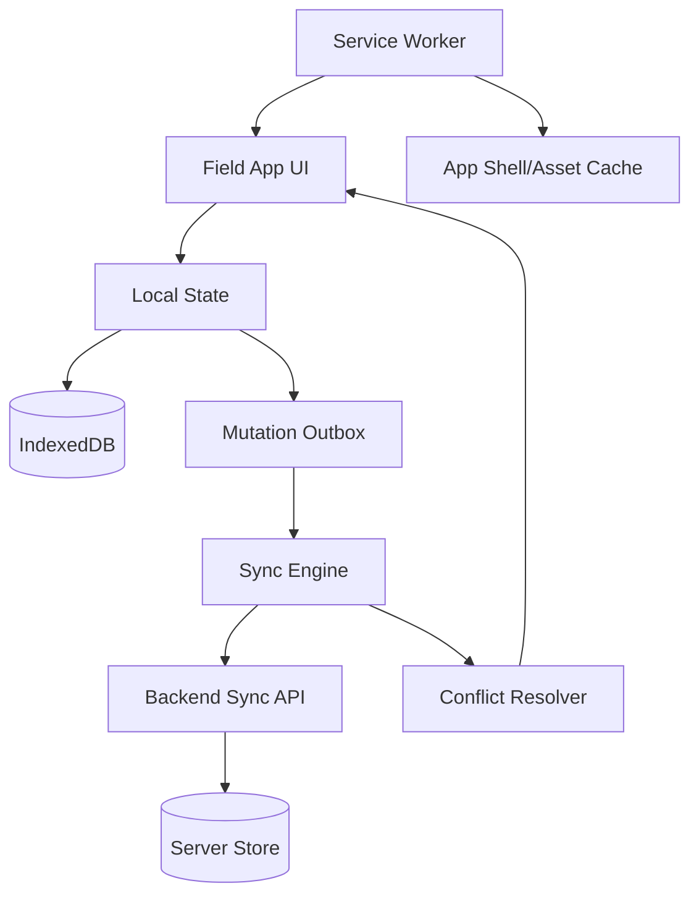

Rendering decision:

```txt
Client-heavy app shell.
Service worker caches shell/assets.
IndexedDB stores durable local data.
Sync engine owns network reconciliation.
```

---

### 8.4 Local Data Model

| Local Store | Purpose |
|---|---|
| drafts | user form drafts |
| outbox | pending mutations |
| attachments | photos/files pending upload |
| reference data | lookup tables/forms/config |
| sync metadata | last sync, versions, errors |
| conflict records | unresolved conflicts |

Each local mutation needs:

```txt
clientMutationId
entityId
operation type
payload
createdAt
attempt count
status
lastError
baseVersion if conflict detection is needed
```

---

### 8.5 Sync State Machine

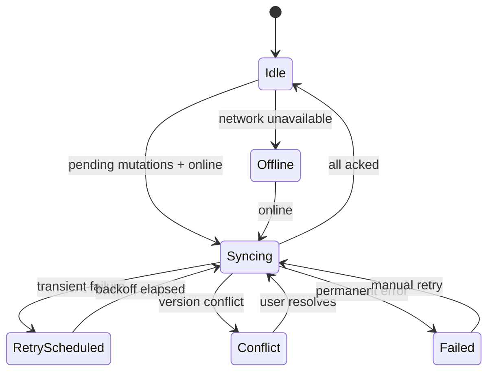

The sync engine should be explicit.

Do not scatter sync behavior across components.

---

### 8.6 Conflict Strategies

| Conflict Type | Strategy |
|---|---|
| Independent fields | merge automatically if safe |
| Same field edited | user choice or domain rule |
| Deleted remotely, edited locally | restore, discard, or create new based on domain |
| Attachment conflict | keep both or require review |
| Reference data changed | prompt user to revalidate form |

Frontend must show conflict meaningfully:

```txt
Your inspection note conflicts with a newer server version.
Server value: ...
Your value: ...
Choose which to keep or edit manually.
```

Avoid generic:

```txt
Sync failed.
```

---

### 8.7 Service Worker Risk

Service workers can improve offline behavior, but introduce risks:

```txt
stale app shell
stale API cache
broken update lifecycle
multiple tabs with different app versions
cached auth-sensitive responses
hard-to-debug network behavior
```

Rules:

```txt
cache static assets deliberately
avoid caching private API responses unless explicitly designed
version local schemas
migrate IndexedDB carefully
show update available state
protect unsynced data before activating breaking update
```

---

### 8.8 Security

Offline data is physically exposed on user devices.

Questions:

```txt
What sensitive data is stored locally?
Can it be encrypted?
How is session expiry handled offline?
Can a lost device retain data?
Are attachments stored safely?
Should data be wiped after logout?
Can screenshots/session replay capture sensitive fields?
```

Do not pretend browser local storage equals secure storage.

Risk depends on data sensitivity, device management, and threat model.

---

### 8.9 Testing Strategy

```txt
unit: sync state machine, conflict resolver, local schema migration
integration: offline create -> reload -> still exists -> reconnect -> sync
E2E: network toggle during form submission
performance: large draft list and attachment queue
security: logout clears local sensitive data where required
reliability: app update with pending outbox
accessibility: sync status announcements and form error summaries
```

Offline-first systems require chaos testing.

Turn the network off mid-flow.

Reload the browser.

Close the tab.

Open two tabs.

Upgrade the app.

Then check whether data survived.

---

## 9. Cross-Case Patterns

Across all six case studies, the same patterns recur.

### 9.1 URL State for Reproducibility

Use URL state when users need:

```txt
shareability
back/forward behavior
saved views
support/debug links
analytics segmentation
```

Good candidates:

- dashboard filters;
- admin search;
- table sorting;
- selected tab when deep-linkable;
- product filters;
- pagination.

Bad candidates:

- sensitive tokens;
- long draft content;
- private PII;
- high-frequency cursor/hover state;
- large serialized objects.

---

### 9.2 Server Authority for Trust

Client can guide.

Server must decide.

Applies to:

```txt
permissions
workflow transitions
price
inventory
payment/order creation
audit events
PII access
data export
```

A disabled button is not authorization.

A hidden menu is not security.

---

### 9.3 Explicit Freshness

Many systems tolerate stale data.

Few tolerate invisible stale data.

Show:

```txt
last updated
sync status
partial results
pending mutations
stale/offline mode
source unavailable
conflict state
```

Frontend correctness often means making uncertainty visible.

---

### 9.4 Boundary-Oriented Error Handling

Avoid global blank failure.

Design boundaries:

| Boundary | Example |
|---|---|
| route | inaccessible case |
| panel | dashboard metric failed |
| form | validation/submission failed |
| item | one row action failed |
| sync | one mutation conflict |
| editor | presence disconnected but editing continues |

Users should keep working where safe.

---

### 9.5 Cache Keys Encode Correctness

If a cache key omits a relevant dimension, it is wrong.

Common dimensions:

```txt
user
tenant
role
permission version
locale
currency
region
feature flag
experiment
resource version
query params
time range
```

Cache design is not optimization only.

It is correctness design.

---

### 9.6 Main Thread Is a Shared Resource

Dashboards, editors, admin tables, and ecommerce filters all compete with user input.

Protect the main thread:

```txt
virtualize large lists
batch expensive updates
avoid sync layout thrashing
move heavy compute to workers
limit chart point count
avoid unnecessary hydration
measure INP under CPU throttle
```

The user does not care that the algorithm is elegant if typing lags.

---

### 9.7 Forms Are State Machines

Every serious app has form complexity:

```txt
pristine
dirty
validating
valid
invalid
submitting
submitted
failed
conflicted
offline queued
```

Treat forms as state machines, especially for:

- checkout;
- workflow actions;
- admin dangerous actions;
- offline drafts;
- long regulatory forms;
- multi-step onboarding.

---

### 9.8 Observability Is Product Infrastructure

Minimum observability questions:

```txt
Which route failed?
Which user journey was affected?
Was it client, server, cache, network, backend, or third-party?
How many users were impacted?
Can support correlate the user's report with logs/traces?
Can engineering reproduce from URL/state/event data safely?
```

Without observability, frontend incidents are anecdotes.

---

## 10. A General Decision Matrix

Use this matrix when evaluating a new frontend feature.

| Feature Signal | Architecture Response |
|---|---|
| SEO/content-heavy | static/SSR, minimal client JS, metadata, image optimization |
| Highly interactive | client islands or SPA workspace, state isolation, performance profiling |
| User-specific private data | dynamic rendering, private cache, server auth |
| Slow independent panels | streaming/Suspense, panel error boundaries |
| Shareable filters | URL state schema |
| Complex workflow | state machine, server-authoritative transitions, audit |
| Expensive computation | worker/WASM/server precompute |
| Long forms | draft persistence, validation layers, recovery |
| Offline requirement | service worker + IndexedDB + sync engine |
| High compliance risk | server authz, audit trail, PII minimization, deterministic logs |
| Large tables | server pagination/filtering, virtualization, explicit bulk semantics |
| Third-party dependency | budget, fallback, security review, observability |

---

## 11. Architecture Smells

| Smell | Why It Is Dangerous |
|---|---|
| All state in one global store | ownership and lifecycle become unclear |
| Every component fetches independently | waterfalls, duplication, inconsistent errors |
| Cache without invalidation plan | stale/incorrect UI |
| Client-only permissions | security bug |
| Spinner-only loading | poor UX and accessibility |
| No URL state for shareable views | poor reproducibility/support |
| No error boundary below app root | failure blast radius too large |
| No freshness metadata | users trust stale data incorrectly |
| `any` at API boundaries | type system cannot protect runtime contracts |
| Massive Client Component route | hydration/performance cost |
| Service worker caches everything | stale/private data risk |
| Bulk action result is boolean | hides partial failure |
| No correlation ID | production debugging blind spot |

---

## 12. Staff-Level Review Questions

Ask these in design review:

```txt
What are the invariants?
Who owns the source of truth?
What can be stale, and how does the user know?
Which state belongs in URL, local memory, cache, server, or durable storage?
What is the rendering mode per route?
What is the critical path for first useful UI?
What happens under slow network and slow CPU?
What happens if one dependency fails?
What are the cache key dimensions?
What invalidates each cached result?
What is the authorization boundary?
What data crosses server/client boundaries?
How are long-running or retryable mutations handled?
How is accessibility verified?
How will production incidents be debugged?
What can go wrong after six months of feature growth?
```

If the team cannot answer, the design is not ready.

---

## 13. Practice Drill 1 — Design a Dashboard Route

Design an analytics dashboard route with:

```txt
6 metric cards
2 charts
date range filter
team filter
export CSV
one slow backend service
role-based metric visibility
```

Deliverables:

```txt
route/rendering decision
state classification
cache key design
streaming boundaries
error boundaries
performance budget
a11y checklist
test plan
observability signals
```

Constraint:

```txt
Do not write component code until the design is complete.
```

---

## 14. Practice Drill 2 — Design a Case Transition Flow

Design a case transition modal.

Inputs:

```txt
caseId
current status
case version
allowed transitions
required reason
optional documents
role-based permissions
```

Deliverables:

```txt
state machine
server action/API contract
validation strategy
conflict handling
cache invalidation
audit correlation
keyboard/focus design
tests
```

---

## 15. Practice Drill 3 — Design Offline Draft Sync

Design offline draft sync for a field form.

Deliverables:

```txt
local schema
outbox model
sync state machine
retry/backoff policy
conflict resolution UI
service worker cache policy
app update behavior
data loss test cases
```

---

## 16. Practice Drill 4 — Review an Existing Frontend

Pick an existing codebase.

Score each category from 1 to 5:

| Category | Score | Evidence |
|---|---:|---|
| State ownership clarity |  |  |
| Data/cache consistency |  |  |
| Rendering strategy |  |  |
| Performance governance |  |  |
| Accessibility |  |  |
| Security boundaries |  |  |
| Testing confidence |  |  |
| Observability |  |  |
| Failure isolation |  |  |
| Architecture maintainability |  |  |

Then pick the top three risks.

Do not refactor randomly.

Refactor the highest-risk boundary first.

---

## 17. The Top 1% Pattern

A top 1% frontend engineer does not merely know more APIs.

They see the frontend as a distributed, stateful, user-facing system.

They reason in terms of:

```txt
source of truth
invariants
latency
staleness
permission
failure blast radius
rendering cost
network cost
main-thread cost
user trust
operational recovery
```

They ask better questions earlier.

They use framework features as tools, not identities.

They make uncertainty visible.

They design systems that can be debugged.

---

## 18. Final Checklist for Any Frontend System Design

```txt
1. Define the user task and unacceptable failures.
2. Write invariants before components.
3. Classify all state.
4. Identify source of truth for every state type.
5. Choose rendering mode per route/region.
6. Design server/client boundaries.
7. Design fetch graph and cache keys.
8. Define invalidation events.
9. Define loading/error/retry/offline behavior.
10. Define interaction and focus model.
11. Define accessibility requirements.
12. Define security boundaries.
13. Define performance budgets.
14. Define observability signals.
15. Define tests by risk.
16. Review failure modes.
17. Only then implement.
```

This is the discipline that turns frontend from page construction into systems engineering.

---

## 19. References

- MDN Web Performance: https://developer.mozilla.org/en-US/docs/Web/Performance
- MDN Service Worker API: https://developer.mozilla.org/en-US/docs/Web/API/Service_Worker_API
- MDN IndexedDB API: https://developer.mozilla.org/en-US/docs/Web/API/IndexedDB_API
- MDN History API: https://developer.mozilla.org/en-US/docs/Web/API/History_API
- MDN Fetch API: https://developer.mozilla.org/en-US/docs/Web/API/Fetch_API
- WAI-ARIA Authoring Practices Guide: https://www.w3.org/WAI/ARIA/apg/
- WCAG 2.2: https://www.w3.org/TR/WCAG22/
- OWASP Top 10: https://owasp.org/www-project-top-ten/
- Web.dev Core Web Vitals: https://web.dev/vitals/

---

## 20. What Comes Next

The next part is the final capstone:

```txt
Part 035 — Capstone: Top 1% Frontend Engineer Operating Model
```

It will synthesize the whole series into:

- operating model;
- engineering judgment checklist;
- architecture review rubric;
- production-readiness checklist;
- debugging playbook;
- deliberate practice plan;
- final portfolio-grade capstone project.

After Part 035, the series is complete.
