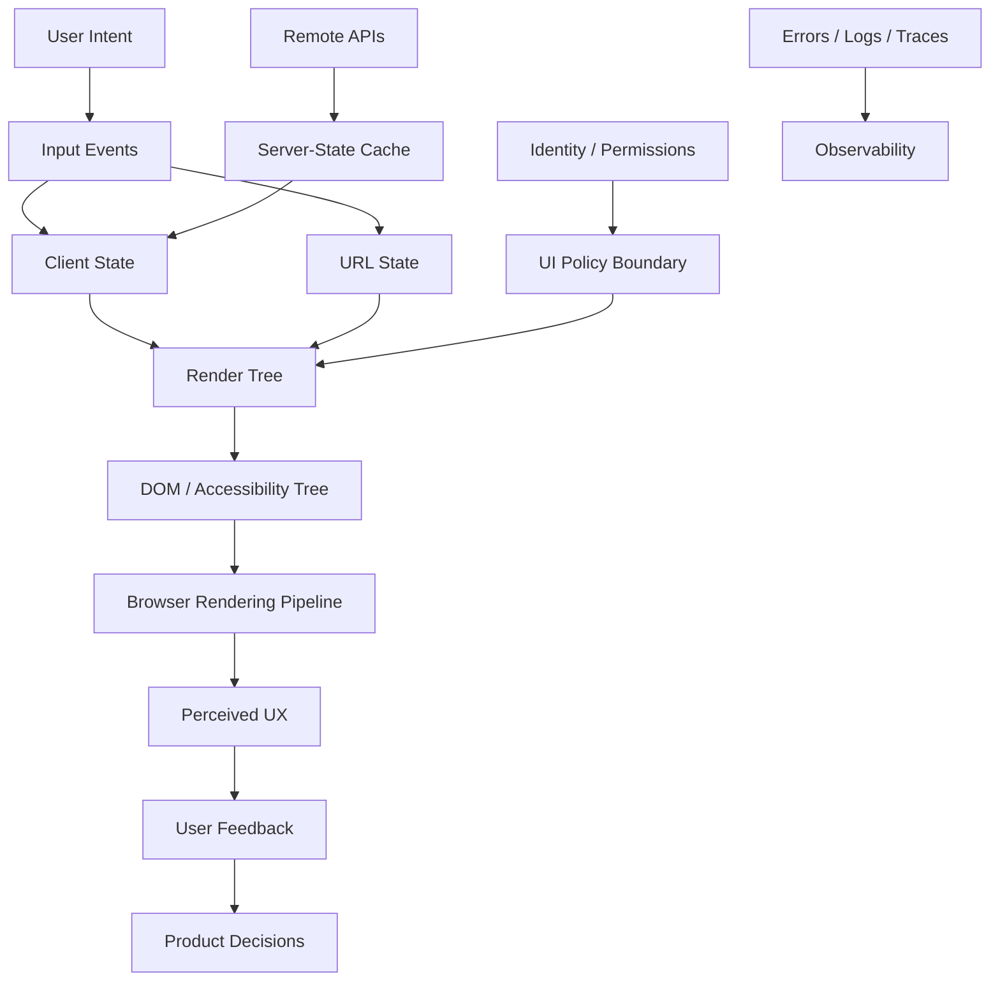
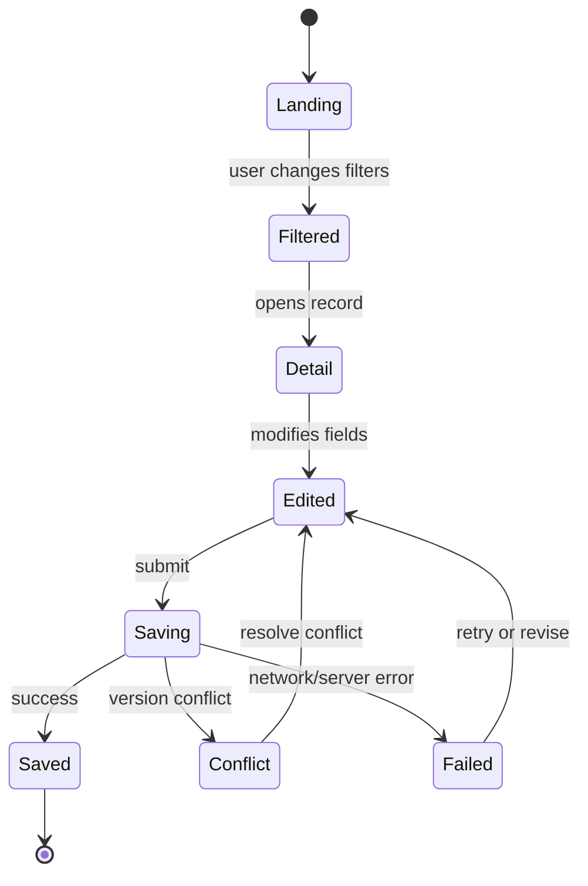
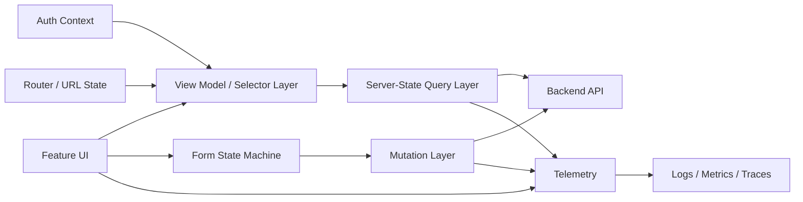
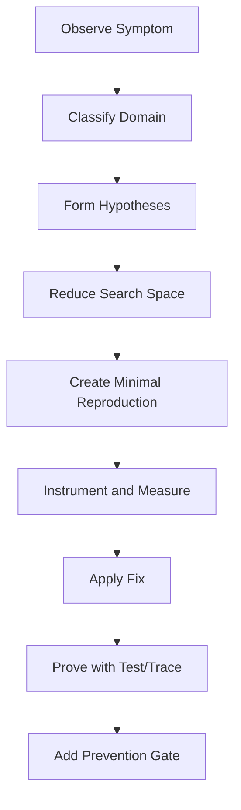
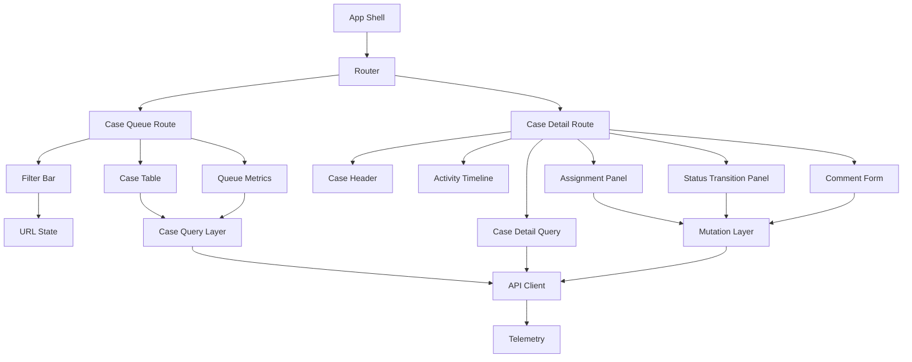
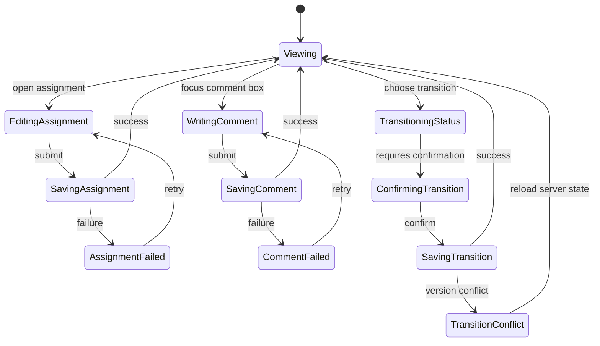
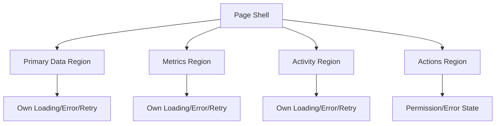
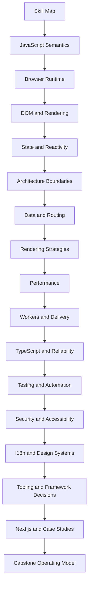

# Part 035 — Capstone: Top 1% Frontend Engineer Operating Model

This is the final part of the series.

The purpose is not to add one more topic.

The purpose is to compress everything into an operating model you can use when building, reviewing, debugging, scaling, and defending frontend systems in production.

A strong frontend engineer can write components.

A senior frontend engineer can ship features reliably.

A top-tier frontend engineer can reason across language semantics, browser runtime, state, rendering, network, accessibility, security, observability, team boundaries, product constraints, and incident pressure without losing the system model.

That is the level this capstone targets.

---

## 1. The Final Kaufman Frame

Josh Kaufman's learning model is useful because it avoids vague learning goals.

The useful question is not:

```txt
Do I know frontend?
```

The useful question is:

```txt
Can I perform the critical frontend engineering behaviors under realistic constraints?
```

For this capstone, the target performance is:

> Given an ambiguous frontend problem, produce a production-grade design, implement a thin vertical slice, prove correctness with tests and instrumentation, diagnose expected failure modes, and explain trade-offs clearly enough for architectural review.

This requires four layers.

| Layer | Skill | Evidence |
|---|---|---|
| Language/runtime | Understand what JavaScript and the browser actually do | Can explain bugs using event loop, memory, DOM, rendering, and module semantics |
| System design | Model UI as state, data, rendering, interaction, and effects | Can draw boundaries, invariants, ownership, and failure modes |
| Production engineering | Make the system observable, secure, accessible, performant, and testable | Can define gates, budgets, dashboards, alerts, and rollback criteria |
| Judgment | Choose appropriate trade-offs for the context | Can reject unnecessary complexity and defend necessary complexity |

The capstone is therefore not a toy app.

It is a pressure test of engineering judgment.

---

## 2. The Top-Tier Frontend Engineer Mental Model

Frontend engineering is often misframed as UI implementation.

A more accurate model is:

```txt
Frontend = distributed, stateful, user-facing runtime system
```

It runs across:

1. browser engines;
2. devices with different CPU, memory, network, and input constraints;
3. APIs with latency and partial failure;
4. server rendering environments;
5. CDN and cache layers;
6. authentication and authorization systems;
7. accessibility technology;
8. analytics and observability pipelines;
9. product workflows and human error.

A page is only the visible artifact.

The real system is a graph of state, data, execution, rendering, interaction, and policy.



The top-tier habit is to always ask:

```txt
Where is the source of truth?
What invariant must hold?
What can happen out of order?
What can fail partially?
What happens under slow CPU, slow network, low memory, and assistive technology?
How will we know in production?
```

---

## 3. The Engineer's Map of Frontend Reality

A mature frontend design must account for eleven domains.

| Domain | Core Question | Bad Smell |
|---|---|---|
| Language semantics | What does the JavaScript runtime guarantee? | Debugging by superstition |
| Scheduling | What runs now, later, before paint, or after paint? | Microtask starvation, jank, race conditions |
| DOM/rendering | What invalidates style, layout, paint, or compositing? | Layout thrashing and unexplained visual instability |
| State | What state exists, who owns it, and what derives from it? | Multiple sources of truth |
| Data/cache | What is fresh, stale, invalidated, or optimistic? | Random refetches and cache leaks |
| Routing | What is represented in URL/history/navigation lifecycle? | Back button breaks product state |
| Components | What are the contracts and composition boundaries? | Prop soup and implicit coupling |
| Performance | What user-visible metric are we protecting? | Optimizing bundle size while INP is broken |
| Security | Where are trust boundaries and attacker-controlled inputs? | Client-side authorization assumptions |
| Accessibility | Can users operate, perceive, understand, and recover? | Mouse-only flows and broken focus |
| Operability | How do we observe, debug, and rollback? | Production bugs require guessing |

The mistake is treating these as separate checklists.

They interact.

For example:

- optimistic UI is a state, cache, accessibility, security, and observability problem;
- SSR is a rendering, cache, data, security, deployment, and hydration problem;
- a modal route is a routing, focus, keyboard, URL, and history problem;
- a slow dashboard is a network, rendering, JavaScript, data shape, virtualization, and product requirement problem.

Top-tier work is integration.

---

## 4. The Architecture Review Template

Use this template before building large frontend features.

### 4.1 Problem statement

Write the problem in one paragraph.

```txt
We need to build [capability] for [users] so they can [outcome].
The feature must support [scale/performance/security/accessibility constraints].
The system must remain correct when [failure/edge conditions].
```

Bad problem statement:

```txt
Build the new dashboard page.
```

Better problem statement:

```txt
Build an operational dashboard for case supervisors to triage regulatory cases by risk, SLA, status, and assignment. The page must load a useful shell within the LCP budget, support deep links for filters, preserve keyboard navigation, avoid leaking cross-tenant data through caches, and degrade gracefully when metrics APIs fail independently.
```

### 4.2 User and workflow model

Define:

1. primary user role;
2. secondary roles;
3. critical task;
4. failure recovery path;
5. permission model;
6. expected data volume;
7. expected interaction frequency;
8. device/network context.

The workflow model matters because frontend bugs often come from missing transitions.



### 4.3 State inventory

List every state category.

| State Category | Example | Source of Truth | Persistence | Owner |
|---|---|---|---|---|
| URL state | filters, page, selected tab | URL | browser history/shareable | router |
| server state | case list, metrics | API/cache | remote + cache | data layer |
| local UI state | drawer open, active menu | component | memory | component |
| form state | draft edits, dirty fields | form controller | memory/session/draft store | form module |
| derived state | visible rows, computed badges | computed | recomputable | selector/computed layer |
| auth state | permissions, tenant | identity provider/API | session | auth module |
| ephemeral state | hover, focus | DOM/browser | transient | browser/component |

Rule:

> If you cannot name the owner of a state, you will eventually duplicate it.

### 4.4 Invariants

Invariants are stronger than requirements.

Requirements describe desired behavior.

Invariants describe what must always remain true.

Examples:

```txt
A user must never see records outside their active tenant.
A submitted form must not send stale optimistic data as confirmed data.
A route must be reloadable without hidden in-memory state.
A destructive action must require an intentional confirmation path.
A cached response must be scoped by tenant, permission set, locale, and relevant filters.
A screen reader user must receive equivalent state transition information.
```

Write invariants before implementation.

They become test cases, cache key design, telemetry labels, and review criteria.

### 4.5 Boundary diagram

Every non-trivial frontend feature should have a boundary diagram.



The point is not diagram beauty.

The point is to reveal hidden coupling.

---

## 5. Production Readiness Rubric

A feature is not production-ready because it works on your laptop.

It is production-ready when it is correct, operable, reversible, measurable, accessible, secure, and maintainable under expected real-world pressure.

Use this rubric.

### 5.1 Functional correctness

| Question | Required Evidence |
|---|---|
| Are all workflow states modeled? | State diagram or reducer/state machine |
| Are edge cases explicit? | Empty/loading/error/partial/conflict/unauthorized/offline states |
| Are async races controlled? | Abort, deduplication, request ordering, idempotency |
| Are reload/deep link flows supported? | URL state tests |
| Are destructive actions recoverable or confirmed? | UX review + tests |

### 5.2 Data correctness

| Question | Required Evidence |
|---|---|
| Are query keys complete? | Cache key includes tenant, user, locale, permissions, filters |
| Is invalidation documented? | Invalidation matrix |
| Are optimistic updates reversible? | Rollback path and conflict handling |
| Is stale data labeled or refreshed intentionally? | Stale/fresh policy |
| Are partial failures supported? | Independent error boundaries |

### 5.3 Performance readiness

| Question | Required Evidence |
|---|---|
| Is the critical path defined? | LCP candidate and resource waterfall |
| Is interaction latency protected? | INP-sensitive paths profiled |
| Is visual stability protected? | CLS risks reviewed |
| Is JavaScript budget defined? | Route-level bundle and long-task budget |
| Is network behavior measured? | Field metrics and lab trace |

### 5.4 Accessibility readiness

| Question | Required Evidence |
|---|---|
| Is semantic structure correct? | Heading, landmark, label review |
| Is keyboard operation complete? | Keyboard test script |
| Is focus managed through route/modal/error transitions? | Focus plan and tests |
| Are async updates announced when needed? | Live region policy |
| Are error messages associated with fields? | Form accessibility tests |

### 5.5 Security readiness

| Question | Required Evidence |
|---|---|
| Are attacker-controlled values identified? | Threat model |
| Is authorization enforced server-side? | Backend contract; no UI-only enforcement |
| Is token/session handling safe? | Session design review |
| Is cache scoped safely? | Tenant/user/permission cache key proof |
| Are third-party scripts governed? | CSP and dependency policy |

### 5.6 Operability readiness

| Question | Required Evidence |
|---|---|
| Can we detect failure? | Error rate, latency, conversion, blank-screen metrics |
| Can we debug user impact? | Correlation IDs, source maps, traces, breadcrumbs |
| Can we rollback safely? | Release flag or deployment rollback plan |
| Can support reproduce issues? | Route/state snapshot or diagnostic context |
| Are alerts actionable? | Thresholds tied to user impact |

---

## 6. The Frontend Architecture Decision Record

Use ADRs for decisions that have future cost.

Do not write ADRs for everything.

Write them for choices that affect boundaries, ownership, migration, performance, security, or team workflow.

### ADR template

```md
# ADR: <Decision Title>

## Status
Proposed | Accepted | Superseded | Deprecated

## Context
What problem exists? What constraints matter? What facts are known?

## Decision
What are we choosing?

## Alternatives Considered
What did we reject and why?

## Consequences
What becomes easier? What becomes harder? What risks remain?

## Guardrails
How do we prevent misuse?

## Review Trigger
When should this decision be revisited?
```

### Good ADR topics

| Topic | Why It Needs an ADR |
|---|---|
| Rendering strategy per route group | Affects deployment, caching, hydration, performance |
| Data fetching/cache library | Affects consistency, invalidation, mutation flow |
| Design system token architecture | Affects all product UI migration |
| State management boundary | Affects feature ownership and debugging |
| Microfrontend/module federation | Affects release, runtime, dependency, and failure boundaries |
| Error/observability standard | Affects incident response and supportability |
| Accessibility governance | Affects compliance, component contracts, QA |

A good ADR makes future disagreement cheaper.

---

## 7. Debugging Playbook

Debugging is not random exploration.

It is hypothesis reduction.

The general loop:

```txt
Observe → Classify → Isolate → Reproduce → Instrument → Fix → Prove → Prevent
```



### 7.1 Symptom classifier

| Symptom | Likely Domain | First Tool |
|---|---|---|
| Click feels delayed | INP/main thread/scheduling | Performance trace |
| Data flashes then reverts | cache/race/optimistic update | network log + query cache inspection |
| Works after refresh only | state initialization/router hydration | reload/deep-link test |
| Modal traps user | focus/keyboard/accessibility | keyboard script + accessibility tree |
| Page jumps during load | CLS/layout/image/font | performance trace + layout shift regions |
| User sees wrong tenant data | cache key/auth boundary | cache inspection + API logs |
| Random E2E failure | async flake/timing/test isolation | trace viewer |
| Memory grows per navigation | retained reference/detached DOM | heap snapshots |
| Hydration warning | server/client render mismatch | server payload + client render diff |
| Blank screen after deploy | chunk load/runtime error | error logs + source maps + release artifact map |

### 7.2 Event loop bugs

Ask:

1. Is work being queued as task, microtask, animation frame, or idle callback?
2. Is a microtask chain starving paint?
3. Is the UI expecting DOM to update before a synchronous read?
4. Is a promise callback running before a browser rendering opportunity?
5. Is cancellation missing after route change or component unmount?

Common fix patterns:

```js
// Abort work that no longer belongs to the current UI state.
const controller = new AbortController();

fetch('/api/search?q=' + encodeURIComponent(query), {
  signal: controller.signal,
});

return () => controller.abort();
```

```js
// Let the browser paint before expensive non-critical work.
requestAnimationFrame(() => {
  requestIdleCallback(() => {
    warmNonCriticalCache();
  });
});
```

Do not use scheduling APIs as decoration.

Use them to protect user-perceived responsiveness.

### 7.3 State bugs

Ask:

1. Is this source state or derived state?
2. Does another owner also mutate it?
3. Can this state be reconstructed from URL/server/cache?
4. Does this state survive navigation, reload, or back/forward as intended?
5. Is stale closure capturing a previous value?

Bad smell:

```js
const [items, setItems] = useState([]);
const [filteredItems, setFilteredItems] = useState([]);
const [count, setCount] = useState(0);
```

Better:

```js
const filteredItems = useMemo(
  () => items.filter(item => matchesFilter(item, filter)),
  [items, filter]
);

const count = filteredItems.length;
```

Do not store what can be derived unless you have a measured reason.

### 7.4 Data/cache bugs

Ask:

1. Is the query key complete?
2. Is the mutation invalidating all affected reads?
3. Is optimistic state rolled back on failure?
4. Is stale data acceptable for this screen?
5. Is cache scoped by tenant/user/permission/locale?

Example invalidation matrix:

| Mutation | Affected Query | Strategy |
|---|---|---|
| Update case assignment | case detail, case list, assignee workload | optimistic detail update + invalidate list/workload |
| Add comment | case detail, activity feed | append optimistic comment + reconcile server ID |
| Change status | case detail, queue counts, SLA dashboard | pessimistic or optimistic depending on workflow risk |
| Delete draft | draft list, draft detail | remove cache immediately + handle undo window |

The fastest UI is dangerous if it is wrong.

### 7.5 Rendering/performance bugs

Ask:

1. What is the user-visible metric?
2. Is the bottleneck network, CPU, layout, paint, JavaScript, image, font, or third-party script?
3. Is the route shipping too much JavaScript?
4. Is expensive work happening during input?
5. Is rendering invalidating layout repeatedly?

Common anti-pattern:

```js
for (const row of rows) {
  row.element.style.width = container.offsetWidth + 'px';
}
```

This can interleave reads and writes in a way that forces layout repeatedly.

Better pattern:

```js
const width = container.offsetWidth;

for (const row of rows) {
  row.element.style.width = `${width}px`;
}
```

Measure before and after.

A performance fix without measurement is only a guess.

### 7.6 Accessibility bugs

Ask:

1. Can the flow be completed using keyboard only?
2. Is focus visible and intentionally moved after route/modal/error transitions?
3. Is semantic HTML sufficient before adding ARIA?
4. Are field errors programmatically associated?
5. Does async state change need announcement?

Bad modal behavior:

```txt
Open modal → focus stays behind overlay → screen reader keeps reading background → Escape does nothing → close loses previous focus
```

Better modal invariant:

```txt
Open modal → focus moves into modal → tab stays inside modal → Escape closes if allowed → close restores previous focus
```

Accessibility is not only compliance.

It is interaction correctness.

---

## 8. Review Checklist for Pull Requests

A top-tier reviewer does not only ask whether code works.

They ask whether the change preserves the system.

### 8.1 General review questions

```txt
Is this change located in the right architectural layer?
Does it create a new source of truth?
Does it hide async behavior inside presentation components?
Does it change cache or routing semantics?
Does it introduce unbounded memory, listeners, timers, observers, or promises?
Does it handle empty, loading, error, unauthorized, and partial states?
Does it preserve keyboard and screen reader behavior?
Does it expose sensitive data in client state, logs, cache, URL, or analytics?
Can it be tested deterministically?
Can it be observed in production?
```

### 8.2 Code review smell table

| Smell | Risk | Better Direction |
|---|---|---|
| Fetch inside deeply nested component | hidden data dependency | route/feature data boundary |
| Boolean explosion | invalid UI states | discriminated union/state machine |
| `any` around API response | runtime boundary hidden | parse/validate unknown input |
| Large component with unrelated effects | lifecycle coupling | split by ownership/effect boundary |
| Duplicated server data in local state | stale UI | server-state cache + derived view model |
| Route state stored only in memory | broken reload/share/back | URL state |
| Custom button div | accessibility regression | semantic button/component primitive |
| Silent catch block | undebuggable failure | typed error path + telemetry |
| Global singleton mutable store | cross-user/session leak risk | scoped provider/cache |
| Optimistic update without rollback | correctness bug | mutation transaction model |

### 8.3 Approval standard

Approve when:

1. the change is understandable;
2. the right layer owns the behavior;
3. edge states are represented;
4. tests prove the risky parts;
5. telemetry exists for production impact;
6. accessibility and security are not afterthoughts;
7. complexity is justified by constraints.

Request changes when:

1. correctness depends on timing luck;
2. state ownership is unclear;
3. errors are swallowed;
4. behavior cannot be tested;
5. cache invalidation is unspecified;
6. accessibility is broken;
7. sensitive data boundary is unclear.

---

## 9. The Frontend Failure Mode Catalog

Use this catalog during design and incident review.

### 9.1 State failure modes

| Failure | Cause | Prevention |
|---|---|---|
| Impossible UI state | independent booleans | discriminated union/state machine |
| Stale derived state | storing derived values | compute from source state |
| Lost form edits | navigation/reload not modeled | dirty guard/draft persistence |
| Cross-route state bleed | global state without scope | route/feature scoped providers |
| Stale closure | async callback captures old state | functional updates/ref/event callback pattern |

### 9.2 Async failure modes

| Failure | Cause | Prevention |
|---|---|---|
| Out-of-order response wins | no request sequencing | abort or ignore stale responses |
| Double submit | missing idempotency | disable/pending state/server idempotency key |
| Retry storm | naive retry | exponential backoff/jitter/budget |
| Zombie update | component unmounted/route changed | cancellation/lifecycle ownership |
| Hidden partial failure | one API failure blanks whole page | isolated error boundaries |

### 9.3 Performance failure modes

| Failure | Cause | Prevention |
|---|---|---|
| Poor LCP | heavy hero image/server delay/render-blocking resources | optimize critical path |
| Poor INP | long tasks during input | split work/offload/memoize appropriately |
| High CLS | late image/font/ad/layout insertion | reserve space/stable dimensions |
| Slow route transition | too much JS/data waterfall | code splitting/parallel data/preload |
| Memory bloat | retained DOM/listeners/cache | cleanup/profiling/cache eviction |

### 9.4 Security failure modes

| Failure | Cause | Prevention |
|---|---|---|
| XSS | unsafe HTML/script injection | encode/sanitize/CSP/Trusted Types |
| CSRF | credentialed state-changing request without protection | SameSite/CSRF token/origin checks |
| Data leakage | cache/log/URL contains sensitive data | data classification/cache scoping/redaction |
| UI-only authorization | frontend hides but API permits | server-side authorization |
| Supply-chain compromise | ungoverned dependencies/scripts | lockfile policy/SCA/CSP/script inventory |

### 9.5 Accessibility failure modes

| Failure | Cause | Prevention |
|---|---|---|
| Keyboard trap | incorrect focus handling | keyboard test and focus contract |
| Silent async update | no live announcement | aria-live/status pattern |
| Unlabeled control | visual-only label | semantic label association |
| Broken route transition | focus remains on removed element | route focus management |
| ARIA misuse | role without behavior | semantic-first component primitive |

---

## 10. Final Capstone Project

Build a production-grade frontend slice for a complex workflow application.

Recommended domain:

```txt
Regulatory Case Management Frontend
```

This matches the kind of frontend where correctness, auditability, permission boundaries, workflow state, performance, accessibility, and operator efficiency all matter.

### 10.1 Product context

Users manage enforcement cases.

Each case has:

1. status;
2. risk score;
3. assigned officer;
4. SLA deadline;
5. evidence documents;
6. comments/activity timeline;
7. workflow transitions;
8. permissions;
9. audit history.

The UI must support:

1. case queue dashboard;
2. filterable/searchable case list;
3. case detail page;
4. assignment mutation;
5. status transition mutation;
6. comment submission;
7. evidence upload placeholder;
8. optimistic but safe updates;
9. deep links;
10. accessibility and keyboard operation;
11. observability events;
12. partial failure handling.

### 10.2 Architecture constraints

Assume:

| Constraint | Target |
|---|---|
| Users | 500 internal users |
| Records | 100k cases, paginated/search API |
| Auth | user belongs to tenant and role |
| Data sensitivity | high |
| Rendering | app shell can be SSR or SPA; detail can fetch client/server depending stack |
| Performance | fast queue interaction more important than perfect first paint |
| Offline | not required, but transient network failure must be recoverable |
| Accessibility | keyboard and screen reader paths required |
| Testing | unit/component/integration/E2E for risky paths |

### 10.3 Required deliverables

Create these artifacts.

| Deliverable | Purpose |
|---|---|
| Architecture proposal | Explain design and trade-offs |
| State model | Define workflow, UI, URL, server, and form state |
| Data/cache design | Define query keys, invalidation, optimistic behavior |
| Component contract map | Define feature/container/presentational/design-system boundaries |
| Error model | Define recoverable/unrecoverable/partial failures |
| Performance budget | Define route JS, LCP/INP/CLS, data waterfall constraints |
| Accessibility plan | Define focus, keyboard, semantics, announcements |
| Security review | Define trust boundaries, cache scoping, logging redaction |
| Test strategy | Define which risks are covered by which tests |
| Observability plan | Define metrics/events/errors/traces |
| Thin implementation | Build one vertical slice |
| Final review | Compare implementation to rubric |

### 10.4 Suggested vertical slice

Build this end-to-end:

```txt
Case Queue → Filter/Search → Open Case Detail → Assign Officer → Add Comment → Transition Status → Observe Result
```

This slice forces you to model:

1. URL filters;
2. paginated server state;
3. derived queue metrics;
4. form validation;
5. async mutations;
6. optimistic or pessimistic updates;
7. permission-aware UI;
8. partial errors;
9. focus management;
10. route navigation;
11. telemetry;
12. tests.

### 10.5 Minimum implementation architecture



### 10.6 Example state machine



### 10.7 Query key design

Example:

```ts
type CaseQueueQueryKey = readonly [
  'caseQueue',
  {
    tenantId: string;
    userId: string;
    permissionVersion: string;
    locale: string;
    filters: {
      status?: string[];
      risk?: string[];
      assignee?: string;
      search?: string;
      page: number;
      pageSize: number;
      sort: string;
    };
  }
];
```

Why so much detail?

Because cache keys are security and correctness boundaries.

A query key that ignores tenant, permission, locale, or filter state can show correct data in development and leak or corrupt data in production.

### 10.8 Mutation design

For each mutation, define:

| Mutation | UX Strategy | Consistency Strategy | Failure Strategy |
|---|---|---|---|
| Assign officer | optimistic if low risk | update detail + invalidate queue/workload | rollback + toast + inline error |
| Add comment | optimistic append | reconcile server ID/order | mark failed comment with retry |
| Transition status | usually pessimistic or guarded optimistic | invalidate detail, queue, metrics, SLA | conflict screen if version mismatch |
| Upload evidence | pessimistic with progress | refresh evidence list after success | resumable or retryable failure state |

A status transition is not just a button click.

It is a workflow command.

Treat it with more rigor than a cosmetic field edit.

---

## 11. Capstone Grading Rubric

Score each category from 0 to 4.

| Score | Meaning |
|---|---|
| 0 | missing |
| 1 | mentioned but not implemented |
| 2 | implemented for happy path |
| 3 | handles realistic edge cases |
| 4 | production-grade with evidence, tests, and observability |

### 11.1 Architecture and state

| Criterion | Score |
|---|---:|
| Clear state ownership | 0–4 |
| URL/server/local/form/derived state separated | 0–4 |
| Workflow transitions modeled | 0–4 |
| Invalid states prevented | 0–4 |
| Boundaries are understandable | 0–4 |

### 11.2 Data and consistency

| Criterion | Score |
|---|---:|
| Complete query keys | 0–4 |
| Invalidation matrix | 0–4 |
| Race/cancellation strategy | 0–4 |
| Optimistic rollback/conflict handling | 0–4 |
| Partial failure handling | 0–4 |

### 11.3 UX, accessibility, and forms

| Criterion | Score |
|---|---:|
| Keyboard operation | 0–4 |
| Focus management | 0–4 |
| Semantic HTML/ARIA correctness | 0–4 |
| Form validation and recovery | 0–4 |
| Async feedback and announcements | 0–4 |

### 11.4 Performance

| Criterion | Score |
|---|---:|
| Critical path identified | 0–4 |
| Main-thread work controlled | 0–4 |
| Network waterfall minimized | 0–4 |
| Rendering/layout risk controlled | 0–4 |
| Field/lab measurement plan | 0–4 |

### 11.5 Security and privacy

| Criterion | Score |
|---|---:|
| Trust boundaries identified | 0–4 |
| Server-side authorization assumed/enforced | 0–4 |
| Cache/data scoping safe | 0–4 |
| Sensitive logging avoided | 0–4 |
| XSS/CSRF/CSP/dependency risks considered | 0–4 |

### 11.6 Testing and operability

| Criterion | Score |
|---|---:|
| Unit/component tests for logic | 0–4 |
| Integration tests for data and workflows | 0–4 |
| E2E tests for critical path | 0–4 |
| Observability events/errors/traces | 0–4 |
| Rollback/release strategy | 0–4 |

Maximum score: 120.

Suggested interpretation:

| Score | Interpretation |
|---:|---|
| 0–40 | tutorial-level implementation |
| 41–70 | functional feature, not production-hardened |
| 71–95 | strong senior-level work |
| 96–110 | production-grade with mature judgment |
| 111–120 | top-tier engineering artifact |

Do not chase the score mechanically.

Use it to reveal blind spots.

---

## 12. Personal Deliberate Practice Plan

The goal is not to read the series once.

The goal is to convert it into engineering reflex.

### Week 1: Architecture compression

Practice:

1. pick three real frontend features;
2. write problem statement;
3. draw boundary diagram;
4. list state inventory;
5. write five invariants;
6. define failure modes.

Output:

```txt
3 architecture one-pagers
```

### Week 2: Runtime and debugging

Practice:

1. create a stale closure bug;
2. create an out-of-order response bug;
3. create a layout thrashing bug;
4. create a memory leak with detached DOM/listener;
5. fix each with measurement or proof.

Output:

```txt
5 bug writeups with reproduction, root cause, fix, and prevention
```

### Week 3: Data and state systems

Practice:

1. implement server-state cache keys;
2. design invalidation matrix;
3. implement optimistic comment with rollback;
4. implement status transition with conflict handling;
5. test race and retry behavior.

Output:

```txt
1 workflow feature with cache/invalidation tests
```

### Week 4: Production hardening

Practice:

1. add accessibility keyboard/focus tests;
2. add Playwright E2E critical path;
3. add telemetry events and error capture;
4. run performance trace;
5. write production readiness review.

Output:

```txt
1 production readiness document + demo trace/test evidence
```

This is the real "first 20 hours" application at advanced level.

You are not trying to memorize everything.

You are building a feedback loop that forces the right mental models to become automatic.

---

## 13. The Top 1% Operating Habits

### 13.1 They model before coding

They do not over-design.

But they identify the state, data, workflow, and failure boundaries before implementation creates accidental architecture.

### 13.2 They optimize for evidence

They do not say:

```txt
This should be faster.
```

They say:

```txt
Before: INP p75 was 310 ms on this flow.
After splitting work and removing the forced layout read, INP p75 is 170 ms in lab and the field dashboard should confirm after rollout.
```

### 13.3 They make impossible states impossible

They prefer:

```ts
type SaveState =
  | { status: 'idle' }
  | { status: 'saving'; requestId: string }
  | { status: 'success'; savedAt: string }
  | { status: 'error'; message: string; retryable: boolean };
```

over:

```ts
let isSaving = false;
let isSuccess = false;
let error = null;
```

Because the second model permits nonsense.

### 13.4 They respect the browser

They understand that DOM, layout, paint, compositing, memory, events, and accessibility tree are not abstractions to ignore.

Frameworks help.

They do not repeal browser reality.

### 13.5 They design for partial failure

A mature UI rarely has one loading state and one error state.

It has independently recoverable regions.



### 13.6 They keep accessibility in the component contract

They do not add accessibility after design is complete.

They make it part of primitive behavior:

1. button behaves like button;
2. dialog manages focus;
3. menu follows keyboard pattern;
4. form field owns label/help/error;
5. route transition has focus policy.

### 13.7 They make production debuggable

A top-tier frontend engineer designs for the person debugging at 2 a.m.

They include:

1. source maps with access control;
2. release identifiers;
3. route names;
4. correlation IDs;
5. user-impact metrics;
6. sanitized breadcrumbs;
7. clear error taxonomy.

### 13.8 They avoid framework tribalism

They know React, Vue, Svelte, native web, and meta-frameworks are tools with trade-offs.

They choose based on:

1. team competence;
2. product constraints;
3. rendering needs;
4. ecosystem maturity;
5. operational model;
6. migration cost;
7. long-term maintainability.

The best framework choice is the one whose failure modes your team can manage.

---

## 14. Final Synthesis

This series moved from fundamentals to production judgment.

The core path was:



The most important conclusion:

> Advanced frontend engineering is not knowing many APIs. It is the ability to preserve correctness, usability, performance, security, accessibility, and operability while the system changes.

A top-tier frontend engineer is not defined by memorizing framework patterns.

They are defined by the quality of their mental models and the reliability of their decisions under constraint.

---

## 15. What to Do After This Series

Move from reading to production rehearsal.

Recommended next sequence:

1. build the capstone project;
2. write the architecture proposal before coding;
3. implement the vertical slice;
4. measure performance before optimizing;
5. add telemetry before pretending the system is observable;
6. run keyboard and screen reader checks;
7. write a post-implementation review;
8. intentionally inject failures and confirm recovery;
9. present the design to another engineer;
10. revise based on critique.

The fastest way to become elite is not to consume more content.

It is to repeatedly close the loop between:

```txt
model → implementation → evidence → critique → correction
```

That is deliberate practice for engineering.

---

## 16. Reference Compass

Use these as stable reference categories, not as things to memorize once.

| Area | Primary Reference Type |
|---|---|
| ECMAScript semantics | ECMA-262 specification and TC39 proposals |
| JavaScript APIs | MDN Web Docs |
| Browser compatibility | MDN Baseline / browser compatibility data |
| Performance | web.dev, Chrome DevTools, Core Web Vitals documentation |
| Accessibility | WCAG 2.2, WAI-ARIA Authoring Practices |
| Security | OWASP Top 10, OWASP Cheat Sheet Series, MDN security docs |
| TypeScript | TypeScript Handbook and release notes |
| React | React official docs |
| Vue | Vue official docs |
| Svelte | Svelte official docs |
| Next.js | Next.js official docs |
| Testing | Testing Library, Playwright official docs |
| Build tooling | Vite, Rollup/Rolldown, package manager docs |

The reference compass matters because frontend changes quickly.

Top-tier engineers do not rely on stale memory.

They know where truth lives, how stable it is, and how to validate whether a technique is appropriate today.

---

## 17. Final Checkpoint

You have completed the planned 35-part series:

```txt
Learn Advanced JavaScript for Web / Frontend Engineering
Parts completed: 001–035
Status: complete
```

This part is the last part of the series.

The next meaningful step is not another theory chapter.

The next meaningful step is the capstone implementation and review cycle.
