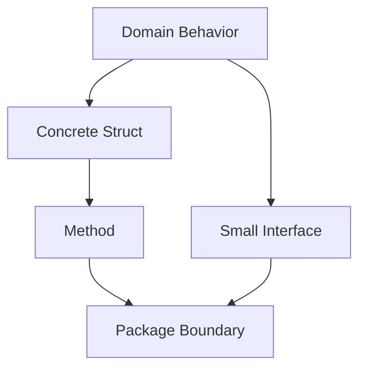
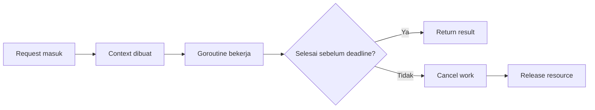
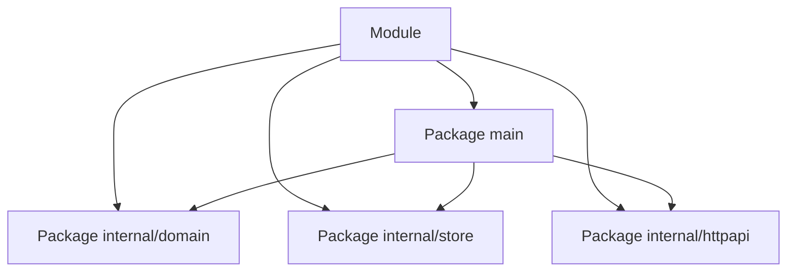
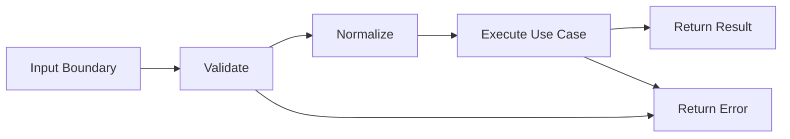
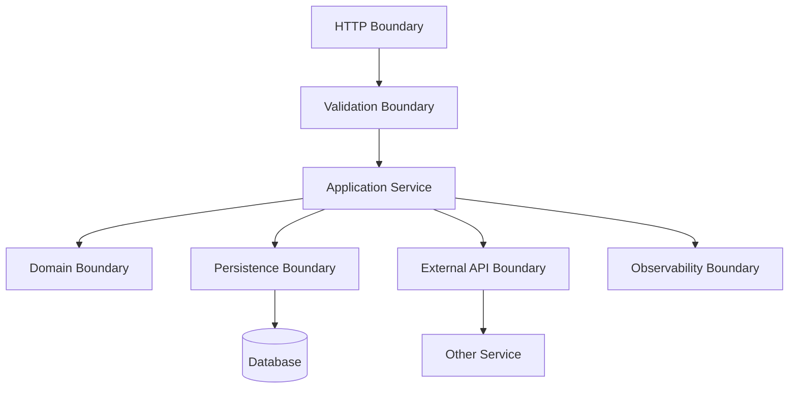
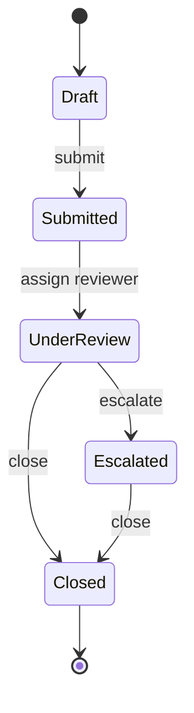

# Mental Model Go: Bahasa Kecil untuk Sistem Besar

> Target part ini: kamu tidak hanya tahu bahwa Go adalah bahasa backend yang populer, tetapi memahami **mengapa Go terasa berbeda**, apa constraint desainnya, dan bagaimana cara belajar Go secara efisien sebagai software engineer yang sudah berpengalaman.

Part ini adalah fondasi berpikir. Sintaks detail akan muncul di part berikutnya, tetapi sebelum masuk ke `var`, `func`, `struct`, `interface`, `goroutine`, dan `channel`, kita perlu menyamakan model mental.

Go bukan sekadar “C yang lebih modern”, bukan “Java tanpa class”, bukan “Node.js tapi compiled”, dan bukan “Rust yang lebih sederhana”. Go adalah bahasa yang sengaja membatasi ruang gerak agar tim besar bisa membangun software yang **jelas, stabil, mudah dioperasikan, dan mudah direview**.

---

## 1. Posisi Part Ini dalam Framework Josh Kaufman

Josh Kaufman dalam *The First 20 Hours* tidak menyarankan belajar dengan membaca sebanyak mungkin sebelum praktik. Ia menyarankan proses yang lebih tajam:

1. Pilih skill yang spesifik.
2. Tentukan target performa yang jelas.
3. Pecah skill menjadi sub-skill kecil.
4. Belajar cukup untuk bisa mengoreksi diri.
5. Hilangkan hambatan praktik.
6. Latihan terarah minimal 20 jam.

Untuk Go, target performa awal kita bukan:

> “Saya ingin tahu semua fitur Go.”

Target yang lebih tepat:

> “Saya bisa membaca, menulis, menjalankan, mengetes, dan mereview Go code sederhana secara idiomatik, serta memahami keputusan desain dasar di balik package, error handling, type, interface, dan concurrency.”

Target ini lebih operasional. Kamu bisa mengukur progresnya.

Setelah 20 jam pertama, kamu belum menjadi expert Go. Tetapi kamu harus sudah tidak tersesat ketika melihat service Go production-grade.

---

## 2. Go dalam Satu Kalimat

Go adalah bahasa pemrograman **compiled, statically typed, garbage-collected, package-oriented, concurrency-friendly**, dengan standard library kuat dan tooling resmi yang sangat terintegrasi.

Lebih praktisnya:

> Go dibuat untuk engineer yang ingin membangun software jaringan, command-line tools, backend services, infrastructure systems, dan distributed systems dengan biaya mental yang rendah.

Kekuatan Go bukan karena ia memiliki fitur paling banyak. Justru karena ia punya sedikit fitur yang dipaksa konsisten.

---

## 3. Masalah Engineering yang Ingin Diselesaikan Go

Go muncul dari problem engineering nyata:

- codebase besar;
- build lambat;
- dependency kompleks;
- concurrency sulit;
- C/C++ terlalu raw untuk banyak use case;
- Java/C# membawa banyak struktur dan ceremony;
- scripting language nyaman tetapi kurang cocok untuk binary deployment dan static guarantees;
- tim besar butuh gaya kode yang konsisten.

Go memilih jawaban yang pragmatis:

| Problem | Jawaban Go |
|---|---|
| Build lambat | compiler cepat, dependency eksplisit |
| Style kode berantakan | `gofmt` sebagai formatter standar |
| Abstraksi terlalu berat | interface kecil dan composition |
| Error tersembunyi | error sebagai return value eksplisit |
| Concurrency sulit | goroutine, channel, `sync`, `context` |
| Deployment rumit | binary compiled, cross-compilation mudah |
| Onboarding tim sulit | sintaks kecil dan idiom kuat |

Go adalah bahasa yang lebih mementingkan **operational simplicity** daripada **language expressiveness**.

Ini penting. Banyak engineer salah menilai Go karena membandingkannya di level fitur bahasa, bukan di level sistem kerja tim dan lifecycle production.

---

## 4. Filosofi Desain Go

Ada beberapa prinsip yang harus kamu internalisasi sejak awal.

### 4.1 Simplicity Is a System Property

Simplicity di Go bukan berarti kode selalu pendek. Go sering lebih verbose daripada bahasa lain, terutama pada error handling.

Tetapi verbosity itu disengaja agar program lebih eksplisit.

Contoh:

```go
value, err := loadConfig(path)
if err != nil {
    return fmt.Errorf("load config: %w", err)
}
```

Bagi sebagian orang, ini terlihat repetitif. Bagi Go engineer, ini adalah boundary failure yang jelas.

Pertanyaan Go bukan:

> “Bisakah ini dibuat lebih pendek?”

Pertanyaan Go adalah:

> “Apakah failure, dependency, dan ownership di sini jelas?”

Kode Go yang bagus sering terasa sederhana karena ia menolak menyembunyikan kompleksitas di balik magic.

---

### 4.2 Explicit Beats Clever

Go tidak memberi banyak ruang untuk trick sintaks.

Tidak ada inheritance class.
Tidak ada operator overloading.
Tidak ada exception handling tradisional.
Tidak ada macro.
Tidak ada implicit conversion antar numeric type.
Tidak ada annotation-heavy programming seperti ekosistem Java enterprise.

Konsekuensinya:

- code review lebih fokus ke logic;
- debugging lebih langsung;
- call path lebih mudah ditelusuri;
- onboarding lebih cepat;
- style antar project lebih seragam.

Trade-off-nya:

- beberapa pattern terasa repetitif;
- generic abstraction lebih terbatas dibanding TypeScript, Scala, Kotlin, atau Rust;
- framework “magical” kurang natural;
- engineer yang suka heavy abstraction sering merasa Go terlalu sederhana.

Di Go, “membosankan” sering berarti “stabil”.

---

### 4.3 Composition over Inheritance

Go tidak punya class inheritance. Reuse dilakukan dengan:

- function;
- struct composition;
- interface;
- embedding;
- package boundary.

Mental model yang benar:



Interface di Go bukan kontrak besar seperti `IUserService`, `IUserRepository`, `IUserManager` yang dibuat sejak awal. Interface idealnya muncul dari sisi consumer.

Contoh lebih Go-like:

```go
type Clock interface {
    Now() time.Time
}
```

Bukan:

```go
type EnterpriseTimeProviderFactoryManager interface {
    GetCurrentTimeWithContext(ctx context.Context) (time.Time, error)
}
```

Go menyukai interface kecil karena interface kecil lebih mudah dites, lebih mudah diganti, dan lebih sulit menjadi dumping ground.

---

### 4.4 Errors Are Values

Go memperlakukan error sebagai nilai biasa.

Artinya:

- error bisa dikembalikan;
- error bisa dibungkus;
- error bisa dibandingkan;
- error bisa diberi konteks;
- error bisa diterjemahkan di boundary;
- error bisa diuji.

Contoh:

```go
func FindCase(id string) (Case, error) {
    c, err := repo.FindByID(id)
    if err != nil {
        return Case{}, fmt.Errorf("find case %s: %w", id, err)
    }
    return c, nil
}
```

Error handling di Go bukan noise. Ia adalah bagian dari desain reliability.

Kamu perlu membedakan:

| Jenis error | Contoh | Perlakuan |
|---|---|---|
| Programmer error | nil pointer, invariant rusak | biasanya panic atau fix code |
| Domain error | case tidak boleh di-escalate | return typed/domain error |
| Infrastructure error | DB timeout, network reset | wrap, retry jika aman |
| Validation error | input invalid | return ke caller/user |
| Security error | unauthorized | translate ke HTTP 401/403 |

Part error handling akan dibahas mendalam di Part 10. Untuk sekarang, cukup pahami bahwa Go memaksa kamu mendesain failure path secara eksplisit.

---

### 4.5 Concurrency Is a First-class Operational Concern

Go terkenal karena goroutine dan channel. Tetapi kesalahan umum pemula adalah menganggap:

> “Go concurrency = pakai goroutine sebanyak mungkin.”

Yang benar:

> “Go concurrency = mengelola lifecycle pekerjaan secara eksplisit.”

Goroutine murah, tetapi bukan gratis. Goroutine bisa bocor. Channel bisa deadlock. Timeout bisa tidak dipropagasi. Context bisa disalahgunakan. Shared memory bisa race.

Go memberi tool yang sederhana, bukan jaminan desain otomatis benar.

Mental model awal:



Part 13 sampai Part 17 akan membangun concurrency dari dasar sampai memory model dan runtime.

---

## 5. Apa yang Go Optimalkan

Go bukan bahasa netral. Ia punya preferensi desain yang sangat jelas.

### 5.1 Readability

Go code biasanya dibaca jauh lebih sering daripada ditulis.

Karena itu Go menghindari fitur yang membuat kode terlalu “personal”. Kamu tidak seharusnya bisa menebak siapa penulis kode hanya dari style formatting-nya. `gofmt` menghapus debat format.

### 5.2 Fast Feedback

Go compiler cepat. `go test ./...` sering menjadi loop harian. Tooling resmi seperti `go fmt`, `go vet`, `go test`, `go doc`, `go mod`, dan `go work` membentuk workflow standar.

### 5.3 Static Confidence without Heavy Ceremony

Go memberi static typing, tetapi tidak mendorong type hierarchy kompleks. Banyak desain Go yang baik cukup berupa struct, function, dan interface kecil.

### 5.4 Production Deployment

Go menghasilkan binary. Banyak service Go bisa dideploy sebagai single binary dalam container kecil. Ini mengurangi masalah runtime environment dibanding banyak stack lain.

### 5.5 Networked and Concurrent Systems

Standard library Go sangat kuat untuk HTTP, TCP, JSON, TLS, context, testing, profiling, dan concurrency primitive. Untuk backend dan infrastructure, ini nilai besar.

---

## 6. Apa yang Go Sengaja Tidak Optimalkan

Supaya tidak salah ekspektasi, pahami juga area yang bukan fokus utama Go.

| Area | Kenyataan di Go |
|---|---|
| Abstraksi sangat ekspresif | Go cenderung menolak abstraction gymnastics |
| Functional programming kaya | Ada function value, tetapi bukan FP-first language |
| OOP klasik | Tidak ada class inheritance |
| Zero-cost manual memory control | Ada GC; untuk manual control pakai `unsafe`/cgo dengan risiko |
| Meta-programming | Reflection ada, tetapi bukan jalan utama |
| Framework magic | Go lebih cocok explicit wiring |
| Tipe sangat advanced | Generics ada, tetapi sengaja relatif sederhana |

Ini bukan kelemahan mutlak. Ini trade-off.

Go memilih predictable engineering over maximum abstraction.

---

## 7. Go Dibandingkan Bahasa yang Mungkin Kamu Kuasai

Sebagai software engineer, kamu mungkin sudah familiar dengan Java, .NET, Node.js, Python, atau Rust. Gunakan tabel ini untuk menghindari transfer mental model yang salah.

| Dimensi | Go | Java / C# | Node.js | Python | Rust |
|---|---|---|---|---|---|
| Typing | static, strong | static, strong | dynamic-ish via JS, optional TS | dynamic | static, very strict |
| Runtime | compiled + GC | VM/JIT + GC | event loop + V8 | interpreter/VM | compiled, no GC |
| Concurrency | goroutine/channel/sync | thread/future/async | event loop/promise | thread/async/multiprocessing | async/thread with ownership |
| Error | return value | exception | throw/reject | exception | `Result` |
| OOP | composition | class inheritance | prototype/class syntax | class | trait/composition |
| Deployment | binary | JVM/.NET runtime | Node runtime | Python runtime | binary |
| Learning curve | moderate | moderate | low-moderate | low | high |
| Best fit | services, infra, CLI, network systems | enterprise apps, large platforms | web apps, APIs, realtime | automation, data, scripting | systems, safety-critical performance |

Transfer yang harus dihindari:

- Jangan membawa inheritance-heavy Java style ke Go.
- Jangan membawa framework magic Spring-style ke Go.
- Jangan membawa async/await mental model Node.js ke goroutine tanpa memahami lifecycle.
- Jangan membawa Python-style implicit flexibility ke static type Go.
- Jangan membawa Rust-level ownership expectation ke Go; Go punya GC dan model safety berbeda.

---

## 8. Unit Dasar Program Go

Program Go tersusun dari package.

File `.go` dimulai dengan deklarasi package:

```go
package main
```

Lalu import:

```go
import "fmt"
```

Lalu deklarasi:

```go
func main() {
    fmt.Println("hello")
}
```

Program executable harus punya package `main` dan function `main`.



Istilah penting:

| Istilah | Arti |
|---|---|
| Module | unit versioning dan dependency, ditandai `go.mod` |
| Package | unit kompilasi dan namespace |
| File | bagian dari package |
| Identifier | nama variable, function, type, constant |
| Exported | identifier diawali huruf besar, bisa diakses package lain |
| Unexported | identifier diawali huruf kecil, private ke package |
| Command | package `main` yang menghasilkan executable |
| Library package | package yang dipakai package lain |

---

## 9. Contoh Program Pertama: Kecil tapi Serius

Kita mulai bukan dengan hanya `Hello World`, tetapi dengan program kecil yang punya input, output, dan error.

Buat file `main.go`:

```go
package main

import (
    "fmt"
    "os"
    "strings"
)

func main() {
    if len(os.Args) < 2 {
        fmt.Fprintln(os.Stderr, "usage: go run . <case-id>")
        os.Exit(1)
    }

    id := strings.TrimSpace(os.Args[1])
    if id == "" {
        fmt.Fprintln(os.Stderr, "case id must not be empty")
        os.Exit(1)
    }

    fmt.Printf("case %s accepted for review\n", id)
}
```

Jalankan:

```bash
go run . ABC-123
```

Output:

```txt
case ABC-123 accepted for review
```

Jalankan tanpa argumen:

```bash
go run .
```

Output ke stderr:

```txt
usage: go run . <case-id>
```

Apa yang bisa dipelajari dari program kecil ini?

1. `package main` membuat program executable.
2. `import` eksplisit menunjukkan dependency.
3. `main` adalah entry point.
4. `os.Args` memberi akses ke argument CLI.
5. Error user-facing ditulis ke `stderr`.
6. Program gagal dengan exit code non-zero.
7. Validasi input dilakukan dekat boundary.
8. Go lebih suka flow eksplisit daripada exception tersembunyi.

Ini contoh kecil, tetapi pola boundary-nya akan muncul di service production:



---

## 10. Cara Membaca Go Code

Saat membaca Go code, jangan mulai dari detail sintaks. Pakai urutan ini.

### 10.1 Cari Package Boundary

Tanyakan:

- Package ini mewakili konsep apa?
- Apakah package ini command, domain, adapter, atau utility?
- Apa dependency-nya?
- Apakah nama package jelas?

Contoh struktur:

```txt
caseflow/
  go.mod
  cmd/
    caseflow/
      main.go
  internal/
    domain/
      case.go
    store/
      postgres.go
    httpapi/
      handler.go
```

Bacaan awal:

- `cmd/caseflow` adalah entry point.
- `internal/domain` berisi aturan domain.
- `internal/store` adapter persistence.
- `internal/httpapi` adapter transport.

### 10.2 Cari Data Model

Lihat `struct` dan type utama.

```go
type Case struct {
    ID     string
    Status Status
}

type Status string

const (
    StatusDraft     Status = "draft"
    StatusSubmitted Status = "submitted"
    StatusClosed    Status = "closed"
)
```

Tanyakan:

- Field mana yang mutable?
- Apa invariant-nya?
- Apakah type terlalu primitive?
- Apakah status transition dikontrol?

### 10.3 Cari Behavior

Lihat method dan function.

```go
func (c Case) CanClose() bool {
    return c.Status == StatusSubmitted
}
```

Pertanyaan:

- Behavior dekat dengan data atau tersebar?
- Apakah function punya side effect?
- Apakah function mudah dites?

### 10.4 Cari Failure Path

Cari `error`, `fmt.Errorf`, `errors.Is`, `return`, dan `panic`.

```go
if !c.CanClose() {
    return fmt.Errorf("case %s cannot be closed from status %s", c.ID, c.Status)
}
```

Pertanyaan:

- Error diberi konteks?
- Error bisa dibedakan caller?
- Error domain tercampur error infrastructure?
- Ada error yang diabaikan?

### 10.5 Cari Concurrency Boundary

Cari `go`, `chan`, `select`, `sync`, `context`.

Pertanyaan:

- Siapa yang menghentikan goroutine?
- Apa yang terjadi saat context cancel?
- Apakah channel ditutup oleh owner yang benar?
- Apakah ada data race?
- Apakah backpressure jelas?

---

## 11. Go Code Smells Awal

Sebelum mempelajari detail bahasa, kenali bau desain yang sering muncul.

### 11.1 Interface Terlalu Besar

```go
type CaseService interface {
    Create(...)
    Update(...)
    Delete(...)
    Search(...)
    Export(...)
    Import(...)
    Notify(...)
    Audit(...)
}
```

Masalah:

- sulit dites;
- implementasi palsu jadi besar;
- consumer bergantung pada banyak method yang tidak dipakai;
- boundary menjadi kabur.

Lebih baik:

```go
type CaseFinder interface {
    FindByID(ctx context.Context, id string) (Case, error)
}
```

### 11.2 Package Bernama `utils`

```txt
internal/utils/string.go
internal/utils/date.go
internal/utils/http.go
```

Masalah:

- tidak punya konsep domain;
- menjadi dumping ground;
- dependency mudah kacau.

Lebih baik gunakan nama berdasarkan tanggung jawab:

```txt
internal/clock
internal/validate
internal/httpapi
internal/caseid
```

### 11.3 Error Dibuang

```go
file.Close()
```

Atau:

```go
result, _ := doWork()
```

Kadang `_` valid, tetapi harus disengaja. Default-nya: jangan buang error.

### 11.4 Goroutine Tanpa Lifecycle

```go
go processEvents(events)
```

Pertanyaan yang belum dijawab:

- kapan berhenti?
- kalau caller selesai, goroutine ikut selesai atau tidak?
- bagaimana error dikembalikan?
- bagaimana resource dibersihkan?

### 11.5 Over-abstracted Java-style Go

```go
type AbstractBaseCaseProcessorFactory interface {
    CreateProcessor(strategy Strategy) CaseProcessor
}
```

Go bukan berarti tanpa abstraction, tetapi abstraction harus muncul dari kebutuhan nyata, bukan dari kebiasaan framework lain.

---

## 12. Mental Model: Go sebagai Bahasa Boundary

Go sangat kuat untuk membangun boundary:

- boundary package;
- boundary API;
- boundary process;
- boundary network;
- boundary concurrency;
- boundary error;
- boundary lifecycle;
- boundary deployment.

Service Go yang baik biasanya jelas di setiap boundary.



Go tidak memberi framework besar untuk semua boundary ini. Kamu sebagai engineer harus mendesainnya.

Inilah mengapa Go sangat cocok untuk engineer yang kuat di architecture dan process thinking: bahasa ini tidak banyak menghalangi, tetapi juga tidak banyak menyelamatkan dari desain buruk.

---

## 13. Sub-skill Go yang Akan Kita Bangun

Berdasarkan dekomposisi Kaufman, skill “bisa Go” kita pecah menjadi sub-skill berikut.

| Sub-skill | Mengapa penting |
|---|---|
| Toolchain | Tanpa workflow stabil, latihan lambat |
| Syntax dan type | Dasar membaca dan menulis kode |
| Error handling | Reliability dan debuggability |
| Package design | Maintainability jangka panjang |
| Interface design | Testability dan extensibility |
| Testing | Feedback loop utama |
| Concurrency | Kekuatan sekaligus sumber bug Go |
| Context lifecycle | Production request control |
| Runtime awareness | Performance dan latency |
| Standard library | Produktivitas tanpa framework berat |
| HTTP dan DB | Backend service foundation |
| Observability | Operability production |
| Security | Supply chain dan input boundary |
| Performance | Measurement-driven optimization |
| Architecture | Service boundary dan distributed system |

---

## 14. Target 20 Jam Pertama

20 jam pertama harus menghasilkan kemampuan nyata, bukan hanya pengetahuan pasif.

### Jam 1–2: Orientation dan Setup

Target:

- paham posisi Go;
- install Go;
- bisa menjalankan `go version`;
- bisa membuat module;
- bisa menjalankan program sederhana.

Deliverable:

```txt
hello-go/
  go.mod
  main.go
```

### Jam 3–5: Syntax dan Type Dasar

Target:

- variable;
- constant;
- function;
- control flow;
- slice;
- map;
- struct;
- method.

Deliverable:

- CLI kecil untuk validasi input;
- function terpisah yang punya unit test.

### Jam 6–8: Error Handling dan Package

Target:

- return error;
- wrap error;
- pecah package;
- exported vs unexported;
- hindari package `utils`.

Deliverable:

```txt
internal/caseid
internal/domain
cmd/app
```

### Jam 9–11: Interface dan Testing

Target:

- interface kecil;
- table-driven test;
- fake dependency;
- deterministic test.

Deliverable:

- test suite untuk use case kecil.

### Jam 12–15: HTTP Dasar

Target:

- handler;
- JSON request/response;
- status code;
- context;
- timeout basic.

Deliverable:

- HTTP endpoint `POST /cases` dan `GET /cases/{id}` sederhana.

### Jam 16–18: Concurrency Dasar

Target:

- goroutine;
- channel;
- worker pool;
- cancellation;
- goroutine leak awareness.

Deliverable:

- background worker dengan shutdown.

### Jam 19–20: Review dan Refactor

Target:

- jalankan `go test ./...`;
- jalankan `go vet ./...`;
- rapikan package;
- tulis README;
- buat checklist improvement.

Deliverable:

- mini service yang bisa dijalankan, dites, dan direview.

---

## 15. Learning Project Seri Ini

Sepanjang seri, kita akan memakai proyek bertahap bernama `caseflow`.

`caseflow` adalah service kecil untuk mengelola lifecycle case:

- create case;
- submit case;
- assign reviewer;
- escalate case;
- close case;
- audit transition;
- expose HTTP API;
- persist ke database;
- publish event;
- observe metrics;
- handle retry/idempotency.

Kenapa domain ini bagus untuk belajar Go?

Karena ia punya:

- state transition;
- validation;
- error domain;
- persistence;
- concurrency;
- auditability;
- API contract;
- operational concern;
- distributed-system failure mode.

Kita tidak akan langsung membangun semuanya. Kita akan mulai dari kecil.



Di Part 01, kamu hanya perlu memahami bahwa Go akan membantu kita membuat boundary dan transition ini eksplisit.

---

## 16. Cara Menilai Apakah Kamu Mulai “Mengerti Go”

Kamu mulai memahami Go ketika kamu bisa menjawab pertanyaan ini saat membaca code:

1. Package ini bertanggung jawab atas apa?
2. Siapa yang memiliki data ini?
3. Apakah value ini dimutasi atau dicopy?
4. Apakah error ini punya konteks yang cukup?
5. Apakah interface ini dibuat dari sisi consumer?
6. Apakah goroutine ini punya lifecycle jelas?
7. Apakah context dipropagasi dengan benar?
8. Apakah test menguji behavior atau implementation detail?
9. Apakah dependency boundary jelas?
10. Apakah kode ini mudah dihapus atau diganti?

Top engineer bukan hanya bisa menulis code yang jalan. Mereka bisa menjelaskan **mengapa desainnya aman untuk berubah**.

---

## 17. Anti-goals Belajar Go

Supaya belajar efektif, hindari target palsu berikut.

### 17.1 Menghafal Semua Sintaks Sekaligus

Go kecil, tetapi tetap tidak perlu dihafal. Fokus pada pola yang sering muncul.

### 17.2 Membangun Framework Terlalu Cepat

Banyak engineer berpengalaman langsung ingin membuat framework internal. Di Go, tahan dulu.

Tulis explicit code.
Lihat duplikasi nyata.
Baru ekstrak abstraction.

### 17.3 Memaksakan Struktur dari Bahasa Lain

Jangan mulai dengan struktur seperti:

```txt
controllers/
services/
repositories/
models/
dtos/
interfaces/
configs/
utils/
```

Struktur ini tidak selalu salah, tetapi sering menjadi autopilot dari framework lain.

Go lebih suka package berdasarkan cohesive responsibility.

### 17.4 Menganggap Goroutine sebagai Solusi Semua Masalah

Concurrency memperbesar surface area failure. Gunakan ketika ada alasan:

- parallel I/O;
- background work;
- fan-out/fan-in;
- throughput;
- latency hiding;
- pipeline processing.

Jangan gunakan hanya agar terlihat advanced.

---

## 18. Mini Exercise Part 01

Kerjakan setelah membaca part ini.

### Exercise 1: Baca Program

Baca ulang program CLI sebelumnya dan jawab:

1. Apa input boundary-nya?
2. Apa validasi yang dilakukan?
3. Apa output suksesnya?
4. Apa output gagalnya?
5. Mengapa error ditulis ke `stderr`?
6. Mengapa program memakai `os.Exit(1)`?

### Exercise 2: Refactor Mental Model

Ubah program tadi agar validasi ada di function terpisah:

```go
func normalizeCaseID(raw string) (string, error) {
    // implement here
}
```

Kriteria:

- trim whitespace;
- reject empty string;
- return normalized ID;
- return error jika invalid.

### Exercise 3: Tulis Failure Table

Buat tabel:

| Scenario | Expected behavior | Exit code |
|---|---|---|
| no argument | print usage | 1 |
| empty argument | print validation error | 1 |
| valid id | print accepted message | 0 |

Tujuan exercise ini bukan sintaks. Tujuannya membiasakan kamu melihat program sebagai behavior dan failure path.

---

## 19. Checklist Pemahaman Part 01

Kamu siap lanjut ke Part 02 jika bisa menjelaskan:

- mengapa Go memilih simplicity dan explicitness;
- perbedaan Go dengan Java/C#/Node/Python/Rust secara mental model;
- mengapa package adalah unit desain penting;
- mengapa error handling di Go eksplisit;
- mengapa goroutine butuh lifecycle;
- apa target 20 jam pertama;
- apa anti-pattern awal yang harus dihindari.

Jika belum bisa, jangan lanjut dulu ke sintaks detail. Baca ulang bagian mental model dan kerjakan exercise.

---

## 20. Referensi Utama

Referensi yang menjadi dasar part ini:

- The Go Programming Language Specification — https://go.dev/ref/spec
- Effective Go — https://go.dev/doc/effective_go
- How to Write Go Code — https://go.dev/doc/code
- Go Documentation — https://go.dev/doc/
- Go Release History — https://go.dev/doc/devel/release
- Go Security Policy — https://go.dev/doc/security/policy
- The First 20 Hours, Josh Kaufman — framework akuisisi skill cepat berbasis deconstruction dan deliberate practice

---

# Penutup Part 01

Part ini membangun fondasi mental: Go adalah bahasa kecil untuk sistem besar. Ia memaksa explicitness, package boundary, error visibility, dan lifecycle control.

Di Part 02, kita akan menghilangkan hambatan praktik: install Go, memahami toolchain, membuat module, menjalankan command utama, menyiapkan workflow lokal, dan membangun struktur awal project `caseflow`.
