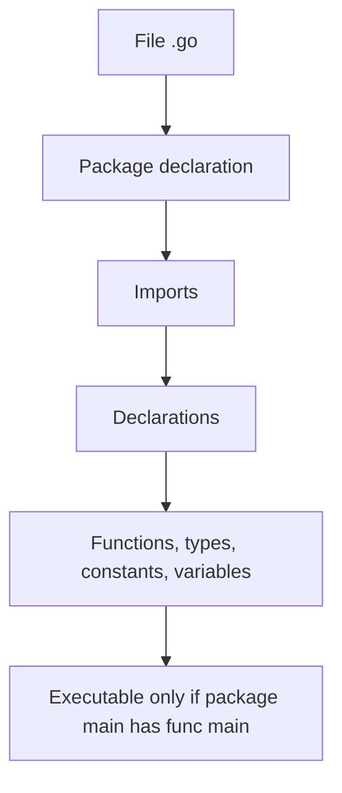
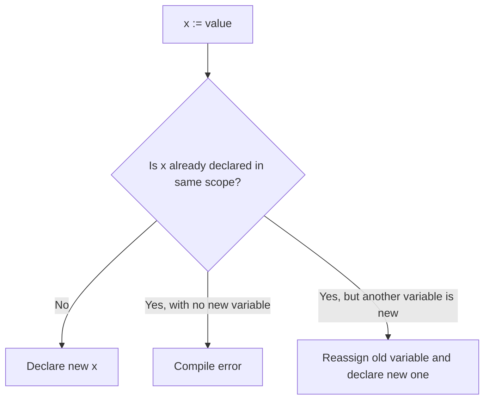
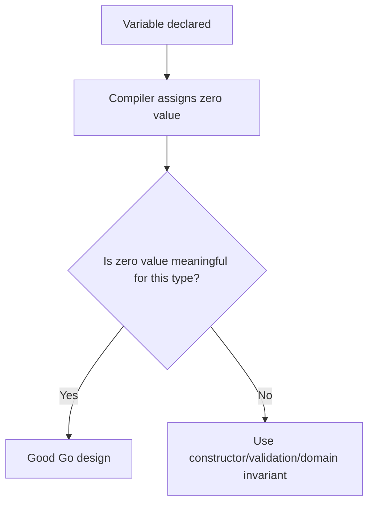
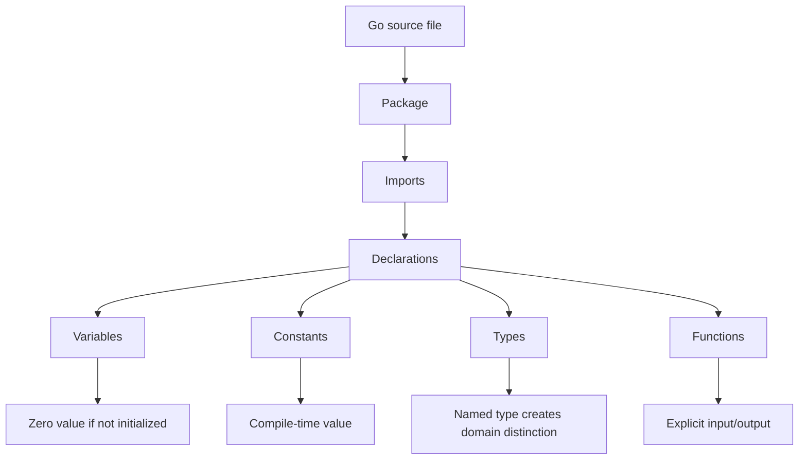

# Syntax, Values, Types, dan Zero Value

> Target part ini: kamu mampu membaca dan menulis program Go kecil dengan benar, memahami bagaimana Go memperlakukan value dan type, serta tidak tersandung oleh perbedaan mendasar antara declaration, assignment, inference, conversion, constant, dan zero value.

Part ini adalah fondasi pertama untuk menulis Go secara benar. Banyak engineer yang sudah berpengalaman di Java, C#, JavaScript, Python, atau TypeScript biasanya bisa menulis Go dalam beberapa jam. Namun ada jebakan: mereka sering membawa mental model bahasa lama ke Go.

Go terlihat sederhana, tetapi kesederhanaannya bukan berarti bebas konsekuensi. Go sengaja membuat banyak hal eksplisit: package, import, type, conversion, error, dan visibility. Compiler Go bukan hanya alat validasi sintaks. Ia adalah partner desain yang memaksa program tetap jelas.

---

## 1. Posisi Part Ini dalam Framework Josh Kaufman

Dalam kerangka *The First 20 Hours*, part ini masuk ke tahap:

1. **deconstruct the skill**: memecah kemampuan Go menjadi unit kecil;
2. **learn enough to self-correct**: belajar cukup agar error compiler bisa dibaca sebagai feedback;
3. **practice deliberately**: latihan menulis kode kecil dengan loop cepat.

Kita tidak akan mengejar semua fitur bahasa sekaligus. Kita fokus ke blok dasar yang akan muncul di hampir semua file Go:

- package declaration;
- import;
- variable;
- constant;
- type;
- function call;
- expression;
- zero value;
- conversion;
- naming.

Target setelah part ini:

```txt id="target-part-03"
Kamu bisa membuat package Go sederhana, mendeklarasikan value dengan benar, memahami default value setiap type, membaca error compiler umum, dan menjelaskan kapan Go melakukan inference serta kapan ia menolak implicit conversion.
```

---

## 2. Program Go Minimal

Program Go executable paling kecil biasanya seperti ini:

```go id="hello-go"
package main

import "fmt"

func main() {
    fmt.Println("hello, go")
}
```

Ada empat elemen penting:

| Elemen | Fungsi |
|---|---|
| `package main` | Menandakan package ini bisa dikompilasi menjadi executable jika punya `func main()` |
| `import "fmt"` | Menggunakan package standard library untuk formatting dan output |
| `func main()` | Entry point program executable |
| `fmt.Println(...)` | Memanggil function exported dari package `fmt` |

Go tidak memakai class sebagai unit organisasi. Unit organisasi utama adalah **package**.

Mental model awal:



---

## 3. Package Declaration

Setiap file Go wajib diawali dengan deklarasi package:

```go id="package-declaration"
package main
```

Package bukan namespace kosmetik. Package adalah boundary kompilasi, visibility, dependency, dan desain API.

Contoh lain:

```go id="package-domain"
package order
```

```go id="package-httpapi"
package httpapi
```

```go id="package-internal"
package internal
```

Dalam satu directory, semua file `.go` normal harus memiliki nama package yang sama. Ini berbeda dari Java, di mana package path biasanya mengikuti struktur folder secara eksplisit di dalam file. Di Go, directory adalah package boundary.

### Rule Praktis

Gunakan nama package yang:

- pendek;
- lowercase;
- tidak memakai underscore;
- tidak mengulang konteks yang sudah jelas;
- mencerminkan fungsi package, bukan layer generik berlebihan.

Contoh buruk:

```txt id="bad-package-names"
models
utils
helpers
common
orderServicePackage
```

Contoh lebih baik:

```txt id="better-package-names"
order
payment
invoice
retry
clock
validator
```

`utils` dan `common` sering menjadi tempat sampah abstraksi. Di Go, package yang baik punya alasan domain atau teknis yang jelas.

---

## 4. Import

Import digunakan untuk membawa package lain ke file saat ini.

```go id="simple-import"
import "fmt"
```

Untuk banyak package:

```go id="grouped-import"
import (
    "fmt"
    "time"
)
```

Go compiler menolak import yang tidak digunakan.

```go id="unused-import"
package main

import (
    "fmt"
    "time"
)

func main() {
    fmt.Println("hello")
}
```

Kode di atas gagal karena `time` tidak digunakan.

Ini bukan compiler yang cerewet tanpa alasan. Go ingin dependency per file tetap jujur. Import yang tidak digunakan menandakan:

- refactor belum selesai;
- kode mati;
- dependency tidak perlu;
- pembaca diberi sinyal palsu.

### Import Alias

Kadang package diberi alias:

```go id="import-alias"
import (
    crand "crypto/rand"
    mrand "math/rand"
)
```

Alias berguna ketika dua package punya nama sama atau ketika nama default tidak jelas. Namun alias tidak boleh dipakai untuk menyembunyikan desain buruk.

### Dot Import

Go mendukung dot import:

```go id="dot-import"
import . "fmt"
```

Lalu kamu bisa memanggil:

```go id="dot-import-call"
Println("hello")
```

Hindari ini dalam production code. Dot import membuat asal identifier tidak jelas. Dalam Go, clarity lebih penting daripada menghemat beberapa karakter.

### Blank Import

Blank import memakai `_`:

```go id="blank-import"
import _ "net/http/pprof"
```

Artinya package di-import hanya untuk side effect, biasanya `init()`. Ini umum untuk driver database atau registrasi handler tertentu, tetapi harus diberi komentar jika tidak jelas.

---

## 5. Declaration vs Assignment

Go membedakan declaration dan assignment.

Declaration membuat identifier baru.

```go id="var-declaration"
var count int
```

Assignment mengisi atau mengganti value pada identifier yang sudah ada.

```go id="assignment"
count = 10
```

Short variable declaration melakukan declaration sekaligus assignment:

```go id="short-declaration"
count := 10
```

`:=` hanya boleh dipakai di dalam function.

```go id="invalid-short-declaration"
package main

name := "go" // invalid: non-declaration statement outside function body

func main() {}
```

Di package scope, gunakan `var`, `const`, `type`, atau `func`.

```go id="package-scope-var"
package main

var appName = "billing-service"

func main() {}
```

---

## 6. Variable Declaration Forms

Go memberi beberapa cara deklarasi variable. Pilih berdasarkan clarity.

### 6.1 Deklarasi Type Eksplisit Tanpa Initial Value

```go id="explicit-var-zero"
var count int
var enabled bool
var name string
```

Value akan menjadi zero value:

| Type | Zero Value |
|---|---|
| `int` | `0` |
| `float64` | `0` |
| `bool` | `false` |
| `string` | `""` |
| pointer | `nil` |
| slice | `nil` |
| map | `nil` |
| channel | `nil` |
| function | `nil` |
| interface | `nil` |
| struct | struct dengan semua field zero value |

Zero value adalah konsep sentral di Go.

### 6.2 Deklarasi Type Eksplisit dengan Initial Value

```go id="explicit-var-value"
var count int = 10
```

Ini valid, tetapi sering redundant jika type jelas dari value.

### 6.3 Deklarasi dengan Type Inference

```go id="var-inference"
var count = 10
var name = "worker"
var enabled = true
```

Compiler menentukan type dari value.

### 6.4 Short Declaration

```go id="short-var"
count := 10
name := "worker"
enabled := true
```

Ini idiomatik untuk local variable yang type-nya jelas.

### 6.5 Grouped Declaration

```go id="grouped-var"
var (
    count   int
    name    = "worker"
    enabled = true
)
```

Grouped declaration berguna di package scope, tetapi jangan berlebihan di function kecil.

---

## 7. Kapan Memakai `var` dan Kapan Memakai `:=`

Rule praktis:

| Situasi | Pilihan Umum |
|---|---|
| Local variable dengan initial value jelas | `:=` |
| Variable butuh zero value eksplisit | `var` |
| Package-level variable | `var` |
| Type perlu ditegaskan untuk readability | `var x Type = value` atau `var x Type` |
| Reassignment | `=` |

Contoh idiomatik:

```go id="idiomatic-short"
func greet() {
    name := "Dina"
    fmt.Println("hello", name)
}
```

Contoh ketika `var` lebih baik:

```go id="var-better-zero"
func findUser(id string) (User, bool) {
    var user User

    // populate user conditionally...

    if user.ID == "" {
        return User{}, false
    }

    return user, true
}
```

Contoh lain:

```go id="var-better-slice"
func collectValid(items []Item) []Item {
    var valid []Item

    for _, item := range items {
        if item.Valid() {
            valid = append(valid, item)
        }
    }

    return valid
}
```

Di sini `var valid []Item` jelas menyatakan kita mulai dari nil slice dan akan append secara bertahap.

---

## 8. Short Declaration dan Shadowing

`:=` bisa membuat bug jika tidak sadar tentang shadowing.

```go id="shadowing-example"
func load() error {
    path := "config.json"

    if path := os.Getenv("CONFIG_PATH"); path != "" {
        fmt.Println("using", path)
    }

    fmt.Println("final path", path)
    return nil
}
```

`path` di dalam `if` adalah variable baru yang men-shadow `path` luar.

Shadowing kadang valid, tetapi sering membuat pembaca salah paham.

Bug umum:

```go id="shadowing-error-bug"
func process() error {
    result, err := stepOne()
    if err != nil {
        return err
    }

    if result.NeedsMoreWork {
        result, err := stepTwo(result) // shadows result and err
        if err != nil {
            return err
        }
        _ = result
    }

    return save(result) // uses old result
}
```

Perbaikan:

```go id="shadowing-error-fixed"
func process() error {
    result, err := stepOne()
    if err != nil {
        return err
    }

    if result.NeedsMoreWork {
        result, err = stepTwo(result)
        if err != nil {
            return err
        }
    }

    return save(result)
}
```

Mental model:



Contoh `:=` dengan sebagian variable baru:

```go id="short-decl-partial-new"
file, err := os.Open("input.txt")
if err != nil {
    return err
}

data, err := io.ReadAll(file) // data new, err reused
if err != nil {
    return err
}
```

Ini valid karena `data` adalah variable baru dalam scope yang sama.

---

## 9. Basic Types di Go

Go punya beberapa kategori type dasar:

### Boolean

```go id="bool-type"
var active bool = true
```

`bool` hanya menerima `true` atau `false`. Tidak ada truthy/falsy seperti JavaScript atau Python.

```go id="no-truthy"
count := 1

// invalid
// if count {
//     fmt.Println("non-zero")
// }

if count != 0 {
    fmt.Println("non-zero")
}
```

Ini bagus untuk production code. Kondisi harus eksplisit.

### Integer

```go id="integer-types"
var a int
var b int8
var c int16
var d int32
var e int64

var ua uint
var ub uint8
var uc uint16
var ud uint32
var ue uint64
```

Type `int` dan `uint` ukurannya bergantung pada arsitektur, biasanya 64-bit di sistem modern. Untuk data protocol, storage, atau wire format, gunakan ukuran eksplisit jika dibutuhkan.

### Byte dan Rune

```go id="byte-rune"
var b byte = 'A' // alias for uint8
var r rune = '世' // alias for int32
```

`byte` biasanya dipakai untuk data mentah. `rune` dipakai untuk Unicode code point.

### Floating Point

```go id="float-types"
var price float64 = 19.99
var ratio float32 = 0.75
```

Untuk uang, jangan memakai float sebagai representasi utama. Gunakan integer minor unit atau decimal library sesuai kebutuhan domain.

### Complex Number

```go id="complex-types"
var z complex128 = 1 + 2i
```

Ada, tetapi jarang dipakai dalam backend biasa.

### String

```go id="string-type"
name := "gopher"
```

String di Go immutable dan berisi byte sequence, biasanya UTF-8 encoded text.

---

## 10. Type Identity dan Conversion Eksplisit

Go tidak melakukan implicit conversion antar numeric type.

```go id="no-implicit-conversion"
var a int = 10
var b int64 = 20

// invalid
// total := a + b

total := int64(a) + b
fmt.Println(total)
```

Ini berbeda dari beberapa bahasa yang otomatis menaikkan type. Go memilih eksplisit agar tidak ada widening/narrowing diam-diam.

Conversion harus jelas:

```go id="explicit-conversion"
var count int = 42
var count64 int64 = int64(count)
```

Namun conversion bukan validation otomatis.

```go id="conversion-overflow"
var large int64 = 300
small := int8(large)
fmt.Println(small) // overflow behavior, not validation
```

Untuk boundary yang penting, validasi dulu:

```go id="safe-conversion"
func toInt8(v int64) (int8, error) {
    if v < math.MinInt8 || v > math.MaxInt8 {
        return 0, fmt.Errorf("value %d out of int8 range", v)
    }
    return int8(v), nil
}
```

### Named Type Berbeda dari Underlying Type

```go id="named-type"
type UserID string

type OrderID string

var userID UserID = "u-123"
var orderID OrderID = "o-456"

// invalid
// userID = orderID

userID = UserID(orderID)
```

Walaupun underlying type sama-sama `string`, `UserID` dan `OrderID` adalah type berbeda.

Ini sangat berguna untuk domain modeling.

```go id="domain-id-types"
type AccountID string
type TransactionID string

func LoadAccount(id AccountID) (Account, error) {
    // ...
}
```

Dengan named type, compiler membantu mencegah tertukarnya identifier domain.

---

## 11. Constants

Constant dideklarasikan dengan `const`.

```go id="basic-const"
const serviceName = "billing"
const maxRetries = 3
```

Constant di Go berbeda dari variable immutable biasa. Constant adalah compile-time value.

```go id="const-group"
const (
    StatusPending  = "pending"
    StatusApproved = "approved"
    StatusRejected = "rejected"
)
```

### Typed vs Untyped Constant

```go id="typed-untyped-const"
const timeoutSeconds = 30      // untyped numeric constant
const maxWorkers int = 10      // typed constant
```

Untyped constants memberi fleksibilitas:

```go id="untyped-flexibility"
const n = 10

var a int = n
var b int64 = n
var c float64 = n
```

Namun untuk API/domain, typed constant sering lebih aman.

```go id="typed-domain-const"
type Status string

const (
    StatusPending  Status = "pending"
    StatusApproved Status = "approved"
    StatusRejected Status = "rejected"
)
```

Dengan ini, function bisa menerima `Status`, bukan string bebas.

```go id="status-function"
func CanTransition(from Status, to Status) bool {
    switch from {
    case StatusPending:
        return to == StatusApproved || to == StatusRejected
    default:
        return false
    }
}
```

---

## 12. `iota`

`iota` adalah counter otomatis dalam const declaration group.

```go id="iota-basic"
type Priority int

const (
    PriorityLow Priority = iota
    PriorityMedium
    PriorityHigh
)
```

Hasil:

```txt id="iota-values"
PriorityLow    = 0
PriorityMedium = 1
PriorityHigh   = 2
```

Untuk enum-like value, sering lebih baik menghindari zero value yang valid tanpa sengaja.

```go id="iota-unknown"
type Priority int

const (
    PriorityUnknown Priority = iota
    PriorityLow
    PriorityMedium
    PriorityHigh
)
```

Kenapa?

Karena zero value untuk `Priority` adalah `0`. Jika `0` berarti `PriorityLow`, maka variable yang belum di-set akan tampak seperti prioritas valid.

Desain lebih defensif:

```go id="priority-string"
func (p Priority) String() string {
    switch p {
    case PriorityLow:
        return "low"
    case PriorityMedium:
        return "medium"
    case PriorityHigh:
        return "high"
    default:
        return "unknown"
    }
}
```

### Jangan Overuse `iota`

Hindari `iota` untuk value yang harus stabil di database, API public, log contract, atau wire protocol kecuali kamu mengunci nilainya secara eksplisit.

Lebih aman:

```go id="explicit-iota-like"
const (
    EventCreated = 1
    EventUpdated = 2
    EventDeleted = 3
)
```

Atau gunakan string untuk external contract:

```go id="string-contract"
type EventType string

const (
    EventCreated EventType = "created"
    EventUpdated EventType = "updated"
    EventDeleted EventType = "deleted"
)
```

---

## 13. Zero Value sebagai Desain, Bukan Kebetulan

Zero value adalah default value ketika variable dideklarasikan tanpa explicit initialization.

```go id="zero-values"
var count int
var enabled bool
var name string

fmt.Println(count)   // 0
fmt.Println(enabled) // false
fmt.Println(name)    // ""
```

Dalam Go, zero value sering sengaja dibuat useful.

Contoh `sync.Mutex`:

```go id="zero-value-mutex"
type Counter struct {
    mu    sync.Mutex
    value int
}

func (c *Counter) Inc() {
    c.mu.Lock()
    defer c.mu.Unlock()
    c.value++
}
```

Kamu tidak perlu constructor untuk `sync.Mutex`. Zero value-nya siap dipakai.

Contoh `bytes.Buffer`:

```go id="zero-value-buffer"
var buf bytes.Buffer
buf.WriteString("hello")
fmt.Println(buf.String())
```

Zero value yang useful mengurangi ceremony.

### Tetapi Tidak Semua Zero Value Aman Secara Domain

```go id="domain-zero-problem"
type User struct {
    ID    string
    Email string
}

var u User
fmt.Println(u.ID)    // ""
fmt.Println(u.Email) // ""
```

Secara teknis valid, secara domain mungkin invalid.

Maka perlu validasi boundary:

```go id="domain-validation"
func NewUser(id string, email string) (User, error) {
    if id == "" {
        return User{}, errors.New("id is required")
    }
    if email == "" {
        return User{}, errors.New("email is required")
    }

    return User{ID: id, Email: email}, nil
}
```

Mental model:



---

## 14. Nil

`nil` adalah zero value untuk beberapa reference-like types:

- pointer;
- slice;
- map;
- channel;
- function;
- interface.

```go id="nil-values"
var p *int
var s []int
var m map[string]int
var ch chan int
var fn func()
var any interface{}

fmt.Println(p == nil)
fmt.Println(s == nil)
fmt.Println(m == nil)
fmt.Println(ch == nil)
fmt.Println(fn == nil)
fmt.Println(any == nil)
```

Namun perilaku nil berbeda per type.

### Nil Slice

```go id="nil-slice-append"
var items []string
items = append(items, "a")
items = append(items, "b")
fmt.Println(items)
```

Append ke nil slice aman.

### Nil Map

```go id="nil-map-write"
var counts map[string]int

// panic: assignment to entry in nil map
// counts["a"] = 1
```

Map harus dibuat dengan `make` sebelum ditulis.

```go id="make-map"
counts := make(map[string]int)
counts["a"] = 1
```

Membaca dari nil map aman:

```go id="read-nil-map"
var counts map[string]int
fmt.Println(counts["missing"]) // 0
```

Tetapi write ke nil map panic.

### Nil Pointer

```go id="nil-pointer"
var user *User

// panic if dereferenced
// fmt.Println(user.ID)

if user != nil {
    fmt.Println(user.ID)
}
```

### Nil Interface Trap

Ini salah satu jebakan Go paling terkenal.

```go id="nil-interface-trap"
type Notifier interface {
    Notify() error
}

type EmailNotifier struct{}

func (e *EmailNotifier) Notify() error {
    return nil
}

func main() {
    var email *EmailNotifier = nil
    var notifier Notifier = email

    fmt.Println(notifier == nil) // false
}
```

Kenapa false? Karena interface value terdiri dari pasangan dynamic type dan dynamic value.

```txt id="interface-pair"
notifier = (*EmailNotifier, nil)
```

Dynamic type ada, maka interface tidak nil.

Ini akan dibahas lebih detail di part interface, tetapi sejak awal kamu harus tahu: `nil` di Go harus dipahami bersama type-nya.

---

## 15. `new` dan `make`

Go punya dua built-in yang sering membingungkan: `new` dan `make`.

### `new`

`new(T)` mengalokasikan zero value dari `T` dan mengembalikan `*T`.

```go id="new-example"
p := new(int)
fmt.Println(*p) // 0
*p = 10
fmt.Println(*p) // 10
```

Setara secara mental dengan:

```go id="new-mental"
var v int
p := &v
```

### `make`

`make` digunakan untuk membuat slice, map, dan channel siap pakai.

```go id="make-example"
s := make([]int, 0, 10)
m := make(map[string]int)
ch := make(chan int)
```

Perbedaan:

| Built-in | Dipakai untuk | Return |
|---|---|---|
| `new(T)` | semua type | `*T` |
| `make(T)` | slice, map, channel | `T` siap pakai |

Contoh salah:

```go id="new-map-wrong"
mp := new(map[string]int)

// panic if dereferenced map is written without initialization
// (*mp)["a"] = 1
```

Gunakan:

```go id="make-map-right"
mp := make(map[string]int)
mp["a"] = 1
```

Rule praktis:

- jarang perlu `new` dalam Go code sehari-hari;
- gunakan composite literal dan address-of untuk struct;
- gunakan `make` untuk map, slice dengan capacity, dan channel.

```go id="struct-literal-pointer"
user := &User{ID: "u-123", Email: "a@example.com"}
```

---

## 16. Composite Literals

Composite literal membuat value untuk struct, array, slice, atau map.

### Struct Literal

```go id="struct-literal"
type User struct {
    ID    string
    Email string
}

user := User{
    ID:    "u-123",
    Email: "dina@example.com",
}
```

Gunakan keyed field untuk struct production code. Ini lebih tahan terhadap perubahan urutan field.

Hindari ini kecuali untuk struct kecil yang sangat lokal:

```go id="unkeyed-struct-literal"
user := User{"u-123", "dina@example.com"}
```

### Slice Literal

```go id="slice-literal"
ids := []string{"u-1", "u-2", "u-3"}
```

### Map Literal

```go id="map-literal"
statusCode := map[string]int{
    "pending":  1,
    "approved": 2,
    "rejected": 3,
}
```

---

## 17. Type Alias vs New Type

Go mendukung type alias:

```go id="type-alias"
type UserID = string
```

Dan new named type:

```go id="new-named-type"
type UserID string
```

Perbedaannya besar.

Type alias berarti `UserID` benar-benar alias dari `string`. Tidak ada type safety tambahan.

```go id="alias-no-safety"
type UserID = string

func LoadUser(id UserID) {}

var raw string = "u-123"
LoadUser(raw) // valid
```

Named type membuat type baru.

```go id="named-type-safety"
type UserID string

func LoadUser(id UserID) {}

var raw string = "u-123"
// LoadUser(raw) // invalid
LoadUser(UserID(raw))
```

Gunakan named type untuk konsep domain yang penting.

Gunakan alias terutama untuk migration, compatibility, atau re-export tertentu.

---

## 18. Naming dan Visibility

Di Go, visibility ditentukan oleh huruf pertama identifier.

```go id="visibility"
type User struct { // exported
    ID    string // exported field
    email string // unexported field
}

func NewUser() User { // exported
    return User{}
}

func validateEmail(email string) bool { // unexported
    return email != ""
}
```

Identifier yang dimulai huruf besar exported dari package. Identifier yang dimulai huruf kecil hanya visible dalam package.

Ini sederhana, tetapi berdampak besar pada desain package.

### Naming Idiom

Go cenderung memakai nama pendek dalam scope sempit.

```go id="short-name-good"
for i, item := range items {
    fmt.Println(i, item)
}
```

Tetapi untuk scope lebih besar, nama harus lebih jelas.

```go id="clear-name-good"
func CalculateInvoiceTotal(lines []InvoiceLine, taxRate decimal.Decimal) decimal.Decimal {
    // ...
}
```

Nama buruk:

```go id="bad-names"
func ProcessData(data []Data) Result
func HandleThing(t Thing) error
func DoStuff() error
```

Nama baik menjelaskan domain action:

```go id="better-names"
func CalculateOverdueAmount(invoices []Invoice, asOf time.Time) Money
func ReserveInventory(ctx context.Context, order Order) error
func MarkCaseEscalated(caseID CaseID, reason EscalationReason) error
```

---

## 19. Comments dan Documentation

Exported identifier sebaiknya punya comment yang dimulai dengan nama identifier.

```go id="doc-comment"
// User represents an account that can authenticate and place orders.
type User struct {
    ID    string
    Email string
}
```

Go documentation tooling menggunakan comment ini.

Comment yang buruk:

```go id="bad-comment"
// This is a user struct.
type User struct {
    ID string
}
```

Comment yang baik menjelaskan semantic, invariant, atau contract:

```go id="good-comment"
// User represents an account known to the identity system.
// A valid User always has a non-empty ID.
type User struct {
    ID string
}
```

Jangan menulis comment untuk mengulang kode. Tulis comment untuk menjelaskan alasan, constraint, dan behavior yang tidak jelas dari kode.

---

## 20. Expression, Statement, dan Simplicity

Go tidak mencoba menjadi expression-oriented language. Banyak hal adalah statement, bukan expression.

Contoh: `if` tidak menghasilkan value.

```go id="if-not-expression"
// invalid
// result := if ok { "yes" } else { "no" }
```

Gunakan explicit assignment:

```go id="explicit-if-assignment"
result := "no"
if ok {
    result = "yes"
}
```

Atau function kecil:

```go id="function-for-expression"
func yesNo(ok bool) string {
    if ok {
        return "yes"
    }
    return "no"
}
```

Go juga tidak punya ternary operator.

Ini bukan kekurangan accidental. Go memilih readability dan uniformity.

---

## 21. Compiler sebagai Feedback Loop

Pada 20 jam pertama, jangan lihat compiler error sebagai gangguan. Compiler error adalah feedback loop utama.

Contoh error umum:

### Unused Variable

```go id="unused-variable"
func main() {
    name := "go"
}
```

Go menolak variable tidak digunakan. Alasannya sama seperti unused import: sinyal palsu.

Perbaikan:

```go id="used-variable"
func main() {
    name := "go"
    fmt.Println(name)
}
```

### Declared and Not Used

Jika sedang eksperimen, boleh pakai blank identifier sementara:

```go id="blank-identifier-temporary"
func main() {
    name := "go"
    _ = name
}
```

Namun jangan jadikan `_ = x` sebagai kebiasaan untuk menutupi desain kotor.

### Cannot Use X as Y

```go id="cannot-use"
var id string = "123"
loadUser(id) // if loadUser expects UserID
```

Ini bukan sekadar error type. Compiler memberi tahu bahwa kamu sedang melewati boundary domain tanpa explicit conversion.

---

## 22. Mini Project: Command-line Unit Converter

Kita akan membuat program kecil untuk melatih declaration, type, constants, conversion, dan error compiler.

Buat folder:

```bash id="mini-project-setup"
mkdir go-values-practice
cd go-values-practice
go mod init example.com/go-values-practice
```

Buat `main.go`:

```go id="unit-converter-main"
package main

import (
    "fmt"
    "os"
    "strconv"
)

type Unit string

const (
    UnitMeter      Unit = "m"
    UnitCentimeter Unit = "cm"
    UnitKilometer  Unit = "km"
)

func main() {
    if len(os.Args) != 3 {
        fmt.Println("usage: converter <value-in-meter> <unit: m|cm|km>")
        os.Exit(1)
    }

    meters, err := strconv.ParseFloat(os.Args[1], 64)
    if err != nil {
        fmt.Println("invalid number:", err)
        os.Exit(1)
    }

    unit := Unit(os.Args[2])
    result, err := convertFromMeters(meters, unit)
    if err != nil {
        fmt.Println("conversion error:", err)
        os.Exit(1)
    }

    fmt.Printf("%.2f %s\n", result, unit)
}

func convertFromMeters(value float64, unit Unit) (float64, error) {
    switch unit {
    case UnitMeter:
        return value, nil
    case UnitCentimeter:
        return value * 100, nil
    case UnitKilometer:
        return value / 1000, nil
    default:
        return 0, fmt.Errorf("unsupported unit %q", unit)
    }
}
```

Jalankan:

```bash id="run-converter"
go run . 1500 m
go run . 1500 cm
go run . 1500 km
go run . 1500 inch
```

Yang dilatih:

- package `main`;
- imports;
- named type `Unit`;
- typed constants;
- argument parsing;
- explicit conversion dari `string` ke `Unit`;
- function return multiple values;
- error handling dasar;
- `switch`;
- formatting output.

---

## 23. Latihan Terarah

### Latihan 1 — Eksperimen Zero Value

Buat file `zero.go`:

```go id="zero-exercise"
package main

import "fmt"

func main() {
    var count int
    var price float64
    var active bool
    var name string
    var items []string
    var counts map[string]int
    var ptr *int

    fmt.Printf("count=%v\n", count)
    fmt.Printf("price=%v\n", price)
    fmt.Printf("active=%v\n", active)
    fmt.Printf("name=%q\n", name)
    fmt.Printf("items nil? %v len=%d\n", items == nil, len(items))
    fmt.Printf("counts nil? %v len=%d\n", counts == nil, len(counts))
    fmt.Printf("ptr nil? %v\n", ptr == nil)
}
```

Pertanyaan:

1. Kenapa string kosong dicetak dengan `%q` lebih jelas?
2. Kenapa nil slice bisa punya `len`?
3. Kenapa nil map bisa dibaca tetapi tidak bisa ditulis?

### Latihan 2 — Named Type untuk Domain

Buat type:

```go id="domain-type-exercise"
type CaseID string
type UserID string
type EnforcementActionID string
```

Lalu buat function:

```go id="domain-type-function-exercise"
func AssignCase(caseID CaseID, userID UserID) error {
    if caseID == "" {
        return errors.New("case id is required")
    }
    if userID == "" {
        return errors.New("user id is required")
    }
    return nil
}
```

Coba panggil dengan urutan terbalik dan lihat compiler membantu atau tidak.

### Latihan 3 — Shadowing

Tulis function dengan bug shadowing, lalu perbaiki.

```go id="shadowing-exercise"
func normalizeName(input string) (string, error) {
    result := strings.TrimSpace(input)

    if result == "" {
        result, err := defaultName()
        if err != nil {
            return "", err
        }
        _ = result
    }

    return result, nil
}
```

Tugas:

- cari bug;
- jelaskan scope variable;
- perbaiki dengan `=`;
- buat test manual sederhana.

---

## 24. Checklist Self-correction

Gunakan checklist ini saat menulis Go dasar:

```txt id="part-03-checklist"
[ ] Apakah setiap file punya package declaration yang benar?
[ ] Apakah import yang ada benar-benar digunakan?
[ ] Apakah saya memakai := hanya di dalam function?
[ ] Apakah saya tidak membuat shadowing yang membingungkan?
[ ] Apakah type conversion dilakukan eksplisit?
[ ] Apakah named type dipakai untuk konsep domain penting?
[ ] Apakah zero value type saya aman secara teknis dan domain?
[ ] Apakah nil slice, nil map, dan nil pointer diperlakukan berbeda?
[ ] Apakah constant eksternal memakai value stabil?
[ ] Apakah nama identifier mencerminkan scope dan domain?
```

---

## 25. Common Mistakes dari Engineer Berpengalaman Bahasa Lain

### Mistake 1 — Menganggap Go Punya Implicit Conversion

```go id="mistake-implicit"
var a int = 1
var b int64 = 2
// fmt.Println(a + b)
```

Perbaiki dengan explicit conversion.

### Mistake 2 — Menggunakan `interface{}` Terlalu Cepat

Karena terbiasa dengan dynamic typing atau generic Object, beberapa engineer menulis:

```go id="mistake-interface-any"
func Process(value interface{}) error {
    // ...
}
```

Jangan lakukan ini kecuali benar-benar perlu. Mulai dari type konkret.

### Mistake 3 — Membuat Package `utils`

```txt id="mistake-utils"
utils.StringHelper
utils.DateHelper
utils.CommonHelper
```

Lebih baik package kecil dengan tujuan jelas:

```txt id="better-packages"
slug
clock
retry
money
validator
```

### Mistake 4 — Constructor untuk Semua Struct

Go tidak mewajibkan constructor.

Gunakan constructor ketika perlu menjaga invariant.

```go id="constructor-when-needed"
func NewEmail(value string) (Email, error) {
    if !strings.Contains(value, "@") {
        return Email{}, errors.New("invalid email")
    }
    return Email{value: value}, nil
}
```

Jika struct hanya data carrier internal, composite literal cukup.

### Mistake 5 — Menganggap Zero Value Selalu Valid

Zero value selalu valid secara type, tetapi tidak selalu valid secara domain.

---

## 26. Mental Model Akhir Part Ini



Go memaksa kamu menjawab beberapa pertanyaan secara eksplisit:

- Apa package boundary-nya?
- Value ini type-nya apa?
- Apakah default value aman?
- Apakah conversion ini disengaja?
- Apakah identifier ini visible keluar package?
- Apakah variable ini benar-benar digunakan?

Pertanyaan-pertanyaan itu terlihat kecil, tetapi itulah awal dari codebase yang bisa dipertanggungjawabkan.

---

## 27. Ringkasan

Hal paling penting dari part ini:

1. Go source file selalu berada dalam package.
2. Import tidak boleh unused.
3. `var` digunakan untuk declaration eksplisit, zero value, dan package scope.
4. `:=` digunakan untuk short declaration di function scope.
5. Shadowing bisa membuat bug serius.
6. Go tidak punya implicit conversion antar type berbeda.
7. Named type berguna untuk domain safety.
8. Zero value adalah bagian penting dari desain Go.
9. `nil` berbeda perilakunya tergantung type.
10. `new` mengembalikan pointer ke zero value, sedangkan `make` membuat slice/map/channel siap pakai.
11. Constant bisa typed atau untyped.
12. `iota` berguna, tetapi harus hati-hati untuk external contract.
13. Visibility ditentukan oleh huruf pertama identifier.
14. Compiler Go adalah feedback loop, bukan musuh.

Setelah ini, kita akan masuk ke control flow, functions, `defer`, multiple return values, dan error handling dasar. Di sanalah Go mulai terasa berbeda dari bahasa yang mengandalkan exception sebagai jalur failure utama.
