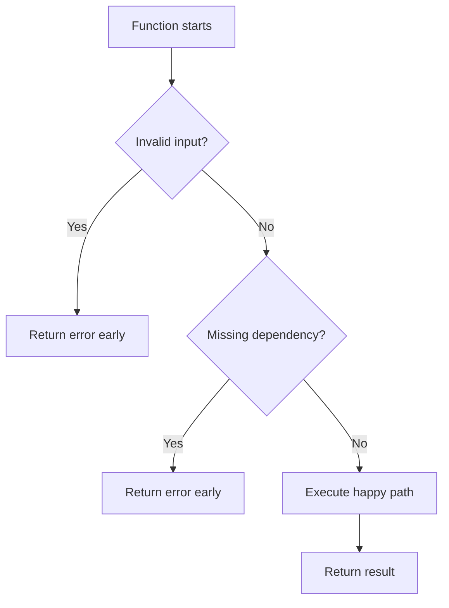
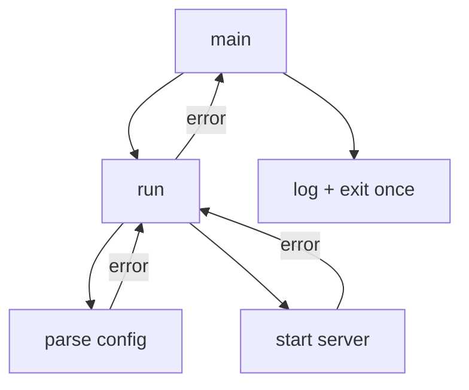
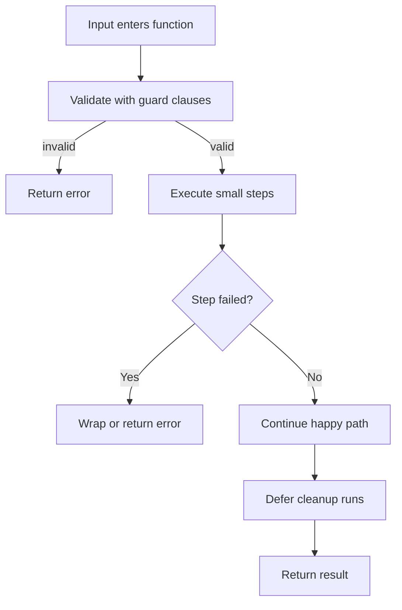

# Control Flow, Functions, dan Error Basics

> Target part ini: kamu mampu menulis flow program Go yang jelas, kecil, mudah dites, dan eksplisit terhadap failure. Kamu juga memahami kenapa Go mendorong early return, multiple return values, dan error sebagai value, bukan exception sebagai default path.

Part sebelumnya membahas value, type, declaration, zero value, dan conversion. Sekarang kita masuk ke cara Go mengeksekusi keputusan: `if`, `for`, `switch`, function, `defer`, dan error handling dasar.

Di Go, control flow biasanya sangat polos. Tidak ada ternary operator, tidak ada while keyword, tidak ada exception untuk business-as-usual failure, tidak ada implicit truthiness. Ini membuat kode Go sering terlihat repetitif bagi pemula, tetapi justru mudah direview di codebase besar.

---

## 1. Posisi Part Ini dalam Framework Josh Kaufman

Dalam kerangka Kaufman, part ini adalah latihan pada sub-skill bernilai tinggi:

- membaca flow program;
- menulis function kecil;
- mengelola failure secara eksplisit;
- mengurangi nesting;
- membangun feedback loop melalui compiler dan test manual.

Target performa setelah part ini:

```txt id="target-part-04"
Kamu bisa menulis function Go yang menerima input jelas, mengembalikan output dan error secara eksplisit, memakai guard clause untuk failure path, memakai defer untuk cleanup, serta membedakan kapan return error dan kapan panic.
```

Ini penting karena Go code production-grade sangat bergantung pada clarity flow.

---

## 2. `if`: Kondisi Eksplisit

Bentuk dasar:

```go id="if-basic"
if count > 0 {
    fmt.Println("has items")
}
```

Tidak perlu parentheses di sekitar kondisi. Braces wajib.

```go id="if-invalid-braces"
// invalid
// if count > 0
//     fmt.Println("has items")
```

Go tidak punya truthy/falsy.

```go id="no-truthy-if"
name := "gopher"

// invalid
// if name {
//     fmt.Println(name)
// }

if name != "" {
    fmt.Println(name)
}
```

Hal ini mengurangi ambiguity. Kondisi harus boolean.

---

## 3. `if` dengan Short Statement

Go mendukung short statement sebelum kondisi.

```go id="if-short-statement"
if err := validate(input); err != nil {
    return err
}
```

Variable `err` hanya hidup di scope `if`.

Contoh lain:

```go id="if-short-map"
if value, ok := cache[key]; ok {
    return value, nil
}
```

Ini idiomatik untuk:

- error handling;
- map lookup;
- type assertion;
- parsing sementara;
- operasi kecil yang hasilnya hanya dibutuhkan untuk keputusan lokal.

Namun jangan masukkan logic panjang ke short statement.

Buruk:

```go id="if-short-too-much"
if result, err := loadAndValidateAndTransformAndAuthorize(ctx, req); err != nil {
    return err
} else {
    return save(result)
}
```

Lebih baik:

```go id="if-short-better"
result, err := load(ctx, req.ID)
if err != nil {
    return err
}

if err := validate(result); err != nil {
    return err
}

if err := authorize(ctx, result); err != nil {
    return err
}

return save(ctx, result)
```

Flow lebih mudah di-debug dan diberi observability.

---

## 4. Guard Clause dan Early Return

Go code idiomatik sering memakai guard clause.

Buruk:

```go id="nested-bad"
func Process(order Order) error {
    if order.ID != "" {
        if len(order.Lines) > 0 {
            if order.CustomerID != "" {
                return save(order)
            } else {
                return errors.New("customer id is required")
            }
        } else {
            return errors.New("order lines are required")
        }
    } else {
        return errors.New("order id is required")
    }
}
```

Lebih baik:

```go id="guard-good"
func Process(order Order) error {
    if order.ID == "" {
        return errors.New("order id is required")
    }
    if len(order.Lines) == 0 {
        return errors.New("order lines are required")
    }
    if order.CustomerID == "" {
        return errors.New("customer id is required")
    }

    return save(order)
}
```

Guard clause membuat happy path tidak tenggelam.

Mental model:



Dalam codebase besar, guard clause memudahkan review karena reviewer bisa memverifikasi failure path satu per satu.

---

## 5. `for`: Satu Loop untuk Banyak Bentuk

Go hanya punya satu keyword loop: `for`.

### 5.1 C-style For

```go id="for-c-style"
for i := 0; i < 10; i++ {
    fmt.Println(i)
}
```

### 5.2 While-style For

```go id="for-while-style"
count := 0
for count < 10 {
    fmt.Println(count)
    count++
}
```

Go tidak punya keyword `while`. Bentuk di atas adalah while versi Go.

### 5.3 Infinite Loop

```go id="for-infinite"
for {
    fmt.Println("running")
    break
}
```

Infinite loop umum untuk worker, server loop, retry loop, atau event loop internal. Namun harus ada cancellation, break, return, atau context boundary pada production code.

---

## 6. `range`

`range` digunakan untuk iterasi collection.

### Slice

```go id="range-slice"
items := []string{"a", "b", "c"}

for i, item := range items {
    fmt.Println(i, item)
}
```

### Map

```go id="range-map"
counts := map[string]int{
    "a": 1,
    "b": 2,
}

for key, value := range counts {
    fmt.Println(key, value)
}
```

Urutan iterasi map tidak dijamin. Jangan menulis logic yang bergantung pada urutan map.

Jika butuh urutan stabil:

```go id="stable-map-iteration"
keys := make([]string, 0, len(counts))
for key := range counts {
    keys = append(keys, key)
}

sort.Strings(keys)

for _, key := range keys {
    fmt.Println(key, counts[key])
}
```

### String

```go id="range-string"
for i, r := range "Go世界" {
    fmt.Printf("byte index=%d rune=%c\n", i, r)
}
```

Index pada range string adalah byte index, bukan character index.

### Mengabaikan Index atau Value

```go id="range-ignore"
for _, item := range items {
    fmt.Println(item)
}

for i := range items {
    fmt.Println(i)
}
```

Blank identifier `_` menyatakan value sengaja diabaikan.

---

## 7. Pitfall `range`: Copy Value

Saat range slice of struct, value yang diterima adalah copy.

```go id="range-copy-pitfall"
type User struct {
    Name   string
    Active bool
}

users := []User{{Name: "A"}, {Name: "B"}}

for _, user := range users {
    user.Active = true
}

fmt.Println(users) // Active tetap false
```

Perbaikan dengan index:

```go id="range-copy-fixed-index"
for i := range users {
    users[i].Active = true
}
```

Atau gunakan slice of pointer jika memang mutation terhadap object identity dibutuhkan:

```go id="range-pointer-slice"
users := []*User{{Name: "A"}, {Name: "B"}}

for _, user := range users {
    user.Active = true
}
```

Namun jangan otomatis memakai pointer. Pilih berdasarkan ownership dan mutation model.

---

## 8. `break` dan `continue`

`break` keluar dari loop.

```go id="break-example"
for _, item := range items {
    if item.ID == targetID {
        found = item
        break
    }
}
```

`continue` melanjutkan ke iterasi berikutnya.

```go id="continue-example"
for _, item := range items {
    if !item.Valid() {
        continue
    }
    process(item)
}
```

`continue` sering membuat kode lebih datar dibanding nested `if`.

Buruk:

```go id="continue-alternative-bad"
for _, item := range items {
    if item.Valid() {
        if item.Enabled {
            process(item)
        }
    }
}
```

Lebih baik:

```go id="continue-alternative-good"
for _, item := range items {
    if !item.Valid() {
        continue
    }
    if !item.Enabled {
        continue
    }
    process(item)
}
```

---

## 9. `switch`

Bentuk dasar:

```go id="switch-basic"
switch status {
case "pending":
    fmt.Println("waiting")
case "approved":
    fmt.Println("done")
default:
    fmt.Println("unknown")
}
```

Go `switch` tidak otomatis fallthrough. Ini menghindari bug umum dari C-like languages.

Jika benar-benar ingin fallthrough:

```go id="fallthrough-example"
switch n {
case 1:
    fmt.Println("one")
    fallthrough
case 2:
    fmt.Println("two or after one")
}
```

Jarang diperlukan. Gunakan dengan hati-hati.

### Multiple Values per Case

```go id="switch-multiple-values"
switch status {
case "pending", "queued", "scheduled":
    return "waiting"
case "approved", "completed":
    return "done"
default:
    return "unknown"
}
```

### Switch Tanpa Expression

```go id="switch-no-expression"
switch {
case score >= 90:
    return "A"
case score >= 80:
    return "B"
case score >= 70:
    return "C"
default:
    return "D"
}
```

Ini alternatif rapi untuk rangkaian `if else`.

---

## 10. Function Basics

Function dideklarasikan dengan `func`.

```go id="func-basic"
func Add(a int, b int) int {
    return a + b
}
```

Parameter dengan type sama bisa digabung:

```go id="func-compact-params"
func Add(a, b int) int {
    return a + b
}
```

Function bisa mengembalikan multiple values.

```go id="func-multiple-return"
func Divide(a, b int) (int, error) {
    if b == 0 {
        return 0, errors.New("division by zero")
    }
    return a / b, nil
}
```

Ini pola fundamental Go: result + error.

---

## 11. Multiple Return Values

Go memakai multiple return values secara luas.

Contoh map lookup:

```go id="map-comma-ok"
value, ok := counts["a"]
if !ok {
    return 0, errors.New("missing key")
}
return value, nil
```

Contoh parsing:

```go id="parse-multiple-return"
n, err := strconv.Atoi(input)
if err != nil {
    return 0, err
}
return n, nil
```

Contoh domain:

```go id="domain-multiple-return"
func FindCase(id CaseID) (Case, bool) {
    c, ok := cases[id]
    return c, ok
}
```

Kapan memakai `bool`, kapan memakai `error`?

| Situasi | Return |
|---|---|
| Value memang mungkin tidak ada dan itu normal | `(T, bool)` |
| Operasi gagal dan caller perlu tahu sebab | `(T, error)` |
| Operasi hanya valid/invalid | `error` atau `bool`, tergantung kebutuhan detail |
| Function mutasi/side effect bisa gagal | `error` |

Contoh `(T, bool)`:

```go id="find-bool"
func FindUserByEmail(email string) (User, bool) {
    user, ok := usersByEmail[email]
    return user, ok
}
```

Contoh `(T, error)`:

```go id="load-error"
func LoadUser(ctx context.Context, id UserID) (User, error) {
    // database/network operation can fail with cause
}
```

---

## 12. Named Return Values

Go mendukung named return values:

```go id="named-return"
func SplitName(full string) (first string, last string) {
    parts := strings.Fields(full)
    if len(parts) == 0 {
        return "", ""
    }
    if len(parts) == 1 {
        return parts[0], ""
    }
    return parts[0], parts[len(parts)-1]
}
```

Named return membuat return variables menjadi local variables yang sudah dideklarasikan.

```go id="naked-return"
func CountActive(users []User) (count int) {
    for _, user := range users {
        if user.Active {
            count++
        }
    }
    return
}
```

Ini disebut naked return.

Naked return bisa rapi untuk function sangat pendek, tetapi berbahaya untuk function panjang karena pembaca harus mencari state return variable.

Prefer explicit return untuk clarity:

```go id="explicit-return-preferred"
func CountActive(users []User) int {
    count := 0
    for _, user := range users {
        if user.Active {
            count++
        }
    }
    return count
}
```

Gunakan named return terutama ketika:

- dokumentasi signature menjadi lebih jelas;
- function pendek;
- ada `defer` yang perlu melihat return error;
- return values punya meaning yang tidak jelas dari type saja.

Contoh yang cukup valid:

```go id="named-return-documentation"
func ParseWindow(input string) (start time.Time, end time.Time, err error) {
    // ...
    return start, end, nil
}
```

---

## 13. Variadic Function

Function bisa menerima jumlah argument variatif.

```go id="variadic-function"
func Sum(values ...int) int {
    total := 0
    for _, value := range values {
        total += value
    }
    return total
}
```

Pemanggilan:

```go id="variadic-call"
fmt.Println(Sum(1, 2, 3))
```

Jika sudah punya slice:

```go id="variadic-slice"
values := []int{1, 2, 3}
fmt.Println(Sum(values...))
```

Variadic berguna untuk API ergonomis, tetapi jangan dipakai untuk menyembunyikan parameter yang sebenarnya wajib.

---

## 14. Function sebagai Value

Function di Go adalah first-class value.

```go id="func-value"
func Apply(value int, fn func(int) int) int {
    return fn(value)
}

result := Apply(10, func(v int) int {
    return v * 2
})
```

Function value berguna untuk callback, strategy kecil, test hook, atau dependency injection ringan.

Namun jangan berlebihan membuat framework internal dengan function callback jika interface atau struct sederhana lebih jelas.

---

## 15. Anonymous Function dan Closure

Anonymous function bisa menangkap variable dari outer scope.

```go id="closure-basic"
func Counter() func() int {
    count := 0
    return func() int {
        count++
        return count
    }
}
```

Pemakaian:

```go id="closure-call"
next := Counter()
fmt.Println(next()) // 1
fmt.Println(next()) // 2
```

Closure kuat, tetapi harus hati-hati dalam concurrency. Jika variable yang ditangkap diakses oleh banyak goroutine, kamu perlu synchronization. Ini akan dibahas di part concurrency.

---

## 16. `defer`

`defer` menjadwalkan function call untuk dieksekusi saat function saat ini selesai.

```go id="defer-basic"
func ReadFile(path string) ([]byte, error) {
    file, err := os.Open(path)
    if err != nil {
        return nil, err
    }
    defer file.Close()

    return io.ReadAll(file)
}
```

`defer` sangat berguna untuk cleanup:

- closing file;
- unlocking mutex;
- ending trace span;
- rolling back transaction;
- recording duration;
- recovering panic pada boundary tertentu.

### Defer Dieksekusi LIFO

```go id="defer-lifo"
func main() {
    defer fmt.Println("first")
    defer fmt.Println("second")
    defer fmt.Println("third")
}
```

Output:

```txt id="defer-lifo-output"
third
second
first
```

### Argument Defer Dievaluasi Saat Defer Dipanggil

```go id="defer-arg-eval"
func main() {
    value := 1
    defer fmt.Println(value)
    value = 2
}
```

Output:

```txt id="defer-arg-output"
1
```

Karena argument `fmt.Println(value)` dievaluasi ketika `defer` dibuat.

Jika ingin membaca value terakhir, gunakan closure:

```go id="defer-closure"
func main() {
    value := 1
    defer func() {
        fmt.Println(value)
    }()
    value = 2
}
```

Output:

```txt id="defer-closure-output"
2
```

---

## 17. `defer` untuk Cleanup yang Aman

Contoh file:

```go id="defer-file-cleanup"
func CountBytes(path string) (int, error) {
    file, err := os.Open(path)
    if err != nil {
        return 0, fmt.Errorf("open file: %w", err)
    }
    defer file.Close()

    data, err := io.ReadAll(file)
    if err != nil {
        return 0, fmt.Errorf("read file: %w", err)
    }

    return len(data), nil
}
```

Contoh mutex:

```go id="defer-mutex"
func (c *Counter) Inc() {
    c.mu.Lock()
    defer c.mu.Unlock()

    c.value++
}
```

Tanpa defer, early return mudah membuat resource leak atau lock tidak dilepas.

### Hati-hati Defer dalam Loop

Buruk:

```go id="defer-loop-bad"
func ProcessFiles(paths []string) error {
    for _, path := range paths {
        file, err := os.Open(path)
        if err != nil {
            return err
        }
        defer file.Close()

        // process file
    }
    return nil
}
```

Semua file baru ditutup setelah `ProcessFiles` selesai. Jika banyak file, ini bisa menghabiskan file descriptor.

Perbaikan dengan function kecil:

```go id="defer-loop-good"
func ProcessFiles(paths []string) error {
    for _, path := range paths {
        if err := processFile(path); err != nil {
            return err
        }
    }
    return nil
}

func processFile(path string) error {
    file, err := os.Open(path)
    if err != nil {
        return err
    }
    defer file.Close()

    // process file
    return nil
}
```

Function kecil membuat scope defer tepat.

---

## 18. Error sebagai Value

Di Go, error adalah value biasa yang mengimplementasikan interface:

```go id="error-interface"
type error interface {
    Error() string
}
```

Function yang bisa gagal biasanya mengembalikan `error` sebagai return value terakhir.

```go id="error-return-last"
func Save(order Order) error {
    if order.ID == "" {
        return errors.New("order id is required")
    }
    return nil
}
```

Jika function juga mengembalikan data:

```go id="value-error-return"
func Load(id string) (Order, error) {
    if id == "" {
        return Order{}, errors.New("id is required")
    }
    return Order{ID: id}, nil
}
```

Pola umum:

```go id="error-check-pattern"
result, err := doSomething()
if err != nil {
    return err
}

use(result)
```

Bagi engineer dari bahasa exception-heavy, ini tampak repetitif. Tetapi repetition ini membuat failure path eksplisit dan mudah direview.

---

## 19. Membuat Error

### `errors.New`

Untuk error statis:

```go id="errors-new"
return errors.New("email is required")
```

### `fmt.Errorf`

Untuk error dengan context:

```go id="fmt-errorf"
return fmt.Errorf("load user %s: %w", id, err)
```

Gunakan `%w` untuk wrapping error agar caller bisa memakai `errors.Is` atau `errors.As`.

Contoh:

```go id="error-wrapping"
func LoadConfig(path string) ([]byte, error) {
    data, err := os.ReadFile(path)
    if err != nil {
        return nil, fmt.Errorf("read config %q: %w", path, err)
    }
    return data, nil
}
```

Message error sebaiknya lowercase dan tanpa punctuation akhir kecuali memang perlu.

Baik:

```txt id="good-error-message"
read config "app.json": permission denied
```

Kurang baik:

```txt id="bad-error-message"
Failed to read config file!
```

Error akan sering digabung dalam chain. Lowercase membuat chain lebih natural.

---

## 20. Error Handling sebagai Boundary Design

Jangan hanya menulis:

```go id="poor-error-context"
if err != nil {
    return err
}
```

Kadang cukup, tetapi sering kehilangan context.

Lebih baik:

```go id="better-error-context"
if err != nil {
    return fmt.Errorf("reserve inventory for order %s: %w", order.ID, err)
}
```

Namun jangan wrap berlebihan di setiap layer tanpa menambah informasi.

Buruk:

```txt id="overwrapped-error"
process: service: handler: usecase: repository: database: query failed
```

Baik:

```txt id="useful-error-chain"
reserve inventory for order o-123: update stock for sku SKU-9: deadlock detected
```

Context yang berguna menjawab:

- operasi apa yang gagal;
- entity apa yang terlibat;
- dependency/boundary mana yang gagal;
- apakah error bisa diretry atau tidak.

---

## 21. `panic`: Untuk Apa dan Kapan Tidak Dipakai

`panic` menghentikan normal control flow dan mulai unwinding stack.

```go id="panic-basic"
func MustPositive(n int) int {
    if n <= 0 {
        panic("n must be positive")
    }
    return n
}
```

Untuk production application, panic bukan mekanisme normal business failure.

Jangan:

```go id="panic-bad-business"
func CreateOrder(order Order) {
    if order.CustomerID == "" {
        panic("customer id required")
    }
}
```

Lebih baik:

```go id="error-business"
func CreateOrder(order Order) error {
    if order.CustomerID == "" {
        return errors.New("customer id is required")
    }
    return nil
}
```

### Kapan Panic Masuk Akal?

Panic bisa diterima untuk:

- programmer error yang seharusnya tidak mungkin terjadi;
- invariant internal rusak;
- initialization fatal pada startup, kadang melalui `log.Fatal` atau return error ke main;
- `MustX` helper dalam test atau setup statis;
- unrecoverable corruption.

Contoh test helper:

```go id="must-helper"
func MustParseURL(raw string) *url.URL {
    u, err := url.Parse(raw)
    if err != nil {
        panic(err)
    }
    return u
}
```

Untuk request handling, jangan biarkan panic menjatuhkan service tanpa recovery boundary. Namun recovery boundary juga tidak boleh menutupi bug tanpa observability.

---

## 22. `recover` secara Singkat

`recover` bisa menangkap panic hanya di dalam deferred function.

```go id="recover-basic"
func SafeRun(fn func()) (err error) {
    defer func() {
        if r := recover(); r != nil {
            err = fmt.Errorf("panic recovered: %v", r)
        }
    }()

    fn()
    return nil
}
```

Namun jangan menjadikan `panic/recover` sebagai try/catch versi Go.

Gunakan recover di boundary tertentu:

- HTTP middleware;
- goroutine wrapper;
- plugin execution boundary;
- worker boundary agar satu job tidak membunuh worker process;
- test harness.

Tetap log stack trace jika panic menunjukkan bug.

---

## 23. Function Size dan Shape

Function Go yang baik biasanya:

- punya input jelas;
- punya output jelas;
- failure eksplisit;
- happy path terlihat;
- side effect terbatas;
- mudah dites tanpa mock berlebihan;
- tidak terlalu banyak parameter.

Buruk:

```go id="bad-function-shape"
func Process(a string, b string, c int, d bool, e bool, f map[string]interface{}) error {
    // does validation, auth, DB, HTTP, logging, metrics, formatting
    return nil
}
```

Lebih baik:

```go id="better-function-shape"
type ProcessCommand struct {
    OrderID    OrderID
    CustomerID CustomerID
    RequestedBy UserID
}

func (s *Service) Process(ctx context.Context, cmd ProcessCommand) error {
    if err := cmd.Validate(); err != nil {
        return err
    }

    order, err := s.orders.Load(ctx, cmd.OrderID)
    if err != nil {
        return fmt.Errorf("load order %s: %w", cmd.OrderID, err)
    }

    return s.processLoadedOrder(ctx, order, cmd.RequestedBy)
}
```

Bahkan sebelum belajar method dan struct mendalam, kamu harus mulai melihat bentuk function sebagai desain.

---

## 24. Mini Project: Parser dan Validator Command

Kita buat program kecil untuk melatih flow, function, error, dan guard clause.

Buat folder:

```bash id="command-project-setup"
mkdir go-flow-practice
cd go-flow-practice
go mod init example.com/go-flow-practice
```

Buat `main.go`:

```go id="command-parser-main"
package main

import (
    "errors"
    "fmt"
    "os"
    "strconv"
)

type Command struct {
    Action string
    ID     string
    Amount int
}

func main() {
    cmd, err := parseCommand(os.Args[1:])
    if err != nil {
        fmt.Println("error:", err)
        fmt.Println("usage: app <approve|reject> <id> <amount>")
        os.Exit(1)
    }

    if err := execute(cmd); err != nil {
        fmt.Println("execution error:", err)
        os.Exit(1)
    }

    fmt.Println("ok")
}

func parseCommand(args []string) (Command, error) {
    if len(args) != 3 {
        return Command{}, fmt.Errorf("expected 3 arguments, got %d", len(args))
    }

    action := args[0]
    id := args[1]

    amount, err := strconv.Atoi(args[2])
    if err != nil {
        return Command{}, fmt.Errorf("parse amount: %w", err)
    }

    cmd := Command{
        Action: action,
        ID:     id,
        Amount: amount,
    }

    if err := validateCommand(cmd); err != nil {
        return Command{}, err
    }

    return cmd, nil
}

func validateCommand(cmd Command) error {
    if cmd.Action == "" {
        return errors.New("action is required")
    }
    if cmd.Action != "approve" && cmd.Action != "reject" {
        return fmt.Errorf("unsupported action %q", cmd.Action)
    }
    if cmd.ID == "" {
        return errors.New("id is required")
    }
    if cmd.Amount <= 0 {
        return errors.New("amount must be positive")
    }
    return nil
}

func execute(cmd Command) error {
    switch cmd.Action {
    case "approve":
        return approve(cmd.ID, cmd.Amount)
    case "reject":
        return reject(cmd.ID, cmd.Amount)
    default:
        return fmt.Errorf("unsupported action %q", cmd.Action)
    }
}

func approve(id string, amount int) error {
    fmt.Printf("approved id=%s amount=%d\n", id, amount)
    return nil
}

func reject(id string, amount int) error {
    fmt.Printf("rejected id=%s amount=%d\n", id, amount)
    return nil
}
```

Jalankan:

```bash id="command-run"
go run . approve case-123 100
go run . reject case-123 100
go run . close case-123 100
go run . approve case-123 abc
go run . approve case-123 -1
```

Yang dilatih:

- parse input;
- guard clause;
- multiple return values;
- error wrapping;
- validation;
- switch;
- function kecil;
- separation antara parse, validate, execute.

---

## 25. Refactoring: Dari Nested ke Flat Flow

Misalkan ada kode:

```go id="nested-refactor-before"
func Register(email string, age int) error {
    if email != "" {
        if strings.Contains(email, "@") {
            if age >= 18 {
                return saveUser(email, age)
            } else {
                return errors.New("age must be at least 18")
            }
        } else {
            return errors.New("email is invalid")
        }
    } else {
        return errors.New("email is required")
    }
}
```

Refactor:

```go id="nested-refactor-after"
func Register(email string, age int) error {
    if email == "" {
        return errors.New("email is required")
    }
    if !strings.Contains(email, "@") {
        return errors.New("email is invalid")
    }
    if age < 18 {
        return errors.New("age must be at least 18")
    }

    return saveUser(email, age)
}
```

Kenapa lebih baik?

- failure path jelas;
- happy path berada di bawah tanpa indentasi dalam;
- mudah menambah logging/metrics per failure;
- mudah dites table-driven;
- reviewer tidak perlu tracking nested branch.

---

## 26. Error Boundary dan Exit Boundary

Dalam aplikasi CLI atau service, bedakan function yang mengembalikan error dengan boundary yang memutuskan exit/log.

Kurang baik:

```go id="bad-os-exit-deep"
func parseConfig(path string) Config {
    data, err := os.ReadFile(path)
    if err != nil {
        fmt.Println(err)
        os.Exit(1)
    }
    // ...
    return Config{}
}
```

Lebih baik:

```go id="good-error-return-deep"
func parseConfig(path string) (Config, error) {
    data, err := os.ReadFile(path)
    if err != nil {
        return Config{}, fmt.Errorf("read config: %w", err)
    }
    _ = data
    return Config{}, nil
}
```

Lalu di `main`:

```go id="main-exit-boundary"
func main() {
    if err := run(); err != nil {
        fmt.Fprintln(os.Stderr, "error:", err)
        os.Exit(1)
    }
}

func run() error {
    cfg, err := parseConfig("config.json")
    if err != nil {
        return err
    }

    return start(cfg)
}
```

Ini pattern penting:



Keuntungan:

- business/application logic mudah dites;
- `os.Exit` tidak tersebar;
- error context bisa dikumpulkan;
- observability boundary jelas.

---

## 27. Designing Return Values

Jangan asal memilih return value. Signature function adalah contract.

### Function yang Hanya Memvalidasi

```go id="validate-signature"
func ValidateEmail(email string) error
```

Return `error` karena caller butuh alasan invalid.

### Function yang Mengecek Predicate

```go id="predicate-signature"
func IsValidEmail(email string) bool
```

Return `bool` karena caller hanya butuh ya/tidak.

### Function yang Mencari Data di Memory

```go id="find-signature"
func FindUser(users []User, id UserID) (User, bool)
```

Tidak ditemukan bukan error jika memang normal.

### Function yang Load dari Database

```go id="load-signature"
func LoadUser(ctx context.Context, id UserID) (User, error)
```

Database bisa gagal. Tidak ditemukan bisa direpresentasikan sebagai error khusus atau `(User, bool, error)` tergantung kebutuhan.

Hati-hati dengan triple return:

```go id="triple-return"
func LoadUser(ctx context.Context, id UserID) (User, bool, error)
```

Ini kadang valid, tetapi bisa membingungkan. Alternatif:

```go id="not-found-error"
var ErrUserNotFound = errors.New("user not found")

func LoadUser(ctx context.Context, id UserID) (User, error) {
    // return ErrUserNotFound when missing
}
```

Detail `errors.Is` akan dibahas di part error handling lanjutan.

---

## 28. Table-driven Manual Thinking

Bahkan sebelum masuk part testing, biasakan berpikir dalam table case.

Untuk function:

```go id="classify-score"
func ClassifyScore(score int) (string, error) {
    if score < 0 || score > 100 {
        return "", fmt.Errorf("score out of range: %d", score)
    }

    switch {
    case score >= 90:
        return "A", nil
    case score >= 80:
        return "B", nil
    case score >= 70:
        return "C", nil
    case score >= 60:
        return "D", nil
    default:
        return "F", nil
    }
}
```

Pikirkan case:

| Input | Expected | Error? |
|---:|---|---|
| -1 | `""` | yes |
| 0 | `"F"` | no |
| 59 | `"F"` | no |
| 60 | `"D"` | no |
| 70 | `"C"` | no |
| 80 | `"B"` | no |
| 90 | `"A"` | no |
| 100 | `"A"` | no |
| 101 | `""` | yes |

Ini adalah awal dari table-driven tests.

---

## 29. Latihan Terarah

### Latihan 1 — Refactor Guard Clause

Ubah function berikut menjadi guard clause:

```go id="exercise-guard-before"
func Submit(caseID string, actor string, reason string) error {
    if caseID != "" {
        if actor != "" {
            if reason != "" {
                return submit(caseID, actor, reason)
            }
            return errors.New("reason is required")
        }
        return errors.New("actor is required")
    }
    return errors.New("case id is required")
}
```

Target hasil:

- maksimal satu level indentasi untuk happy path;
- error message jelas;
- tidak mengubah behavior.

### Latihan 2 — Function Signature

Desain signature untuk operasi berikut:

1. Mengecek apakah user punya permission.
2. Memuat invoice dari database.
3. Memvalidasi command escalation.
4. Mencari item di slice memory.
5. Mengirim email notification.

Bandingkan apakah return yang tepat `bool`, `error`, `(T, bool)`, atau `(T, error)`.

### Latihan 3 — Defer Cleanup

Buat function yang membuka file, membaca isinya, dan memastikan file ditutup.

Lalu jawab:

1. Apa yang terjadi jika return sebelum `Close`?
2. Kenapa `defer` membantu?
3. Kenapa `defer` di loop bisa bermasalah?

### Latihan 4 — Error Context

Refactor kode ini:

```go id="exercise-error-context-before"
func LoadSettings(path string) (Settings, error) {
    data, err := os.ReadFile(path)
    if err != nil {
        return Settings{}, err
    }

    settings, err := parseSettings(data)
    if err != nil {
        return Settings{}, err
    }

    return settings, nil
}
```

Menjadi error yang memberi context cukup.

---

## 30. Checklist Self-correction

Gunakan checklist ini saat menulis function Go:

```txt id="part-04-checklist"
[ ] Apakah kondisi if eksplisit dan boolean?
[ ] Apakah saya menghindari nesting yang tidak perlu?
[ ] Apakah failure path memakai guard clause?
[ ] Apakah happy path mudah terlihat?
[ ] Apakah loop punya termination/cancellation yang jelas?
[ ] Apakah range atas map tidak mengandalkan urutan?
[ ] Apakah mutation pada range struct memperhatikan copy semantics?
[ ] Apakah switch tidak memakai fallthrough kecuali disengaja?
[ ] Apakah function signature mencerminkan contract yang benar?
[ ] Apakah error dikembalikan, bukan dipanic, untuk failure normal?
[ ] Apakah error diberi context di boundary yang tepat?
[ ] Apakah defer dipakai untuk cleanup resource?
[ ] Apakah defer tidak diletakkan sembarangan di loop besar?
[ ] Apakah os.Exit hanya terjadi di boundary aplikasi?
```

---

## 31. Common Mistakes

### Mistake 1 — Membawa Exception Mindset ke Go

Buruk:

```go id="exception-mindset-bad"
func MustLoadUser(id string) User {
    user, err := LoadUser(id)
    if err != nil {
        panic(err)
    }
    return user
}
```

Jika user load bisa gagal karena input, network, database, atau not found, return error.

### Mistake 2 — Terlalu Banyak `else`

Buruk:

```go id="too-much-else"
if err != nil {
    return err
} else {
    doSomething()
}
```

Lebih baik:

```go id="less-else"
if err != nil {
    return err
}

doSomething()
```

### Mistake 3 — Mengabaikan Error

Buruk:

```go id="ignore-error-bad"
data, _ := os.ReadFile("config.json")
```

Kadang `_` valid, tetapi default-nya jangan abaikan error.

Lebih baik:

```go id="handle-error-good"
data, err := os.ReadFile("config.json")
if err != nil {
    return fmt.Errorf("read config: %w", err)
}
```

### Mistake 4 — Memakai Panic untuk Validasi User Input

User input invalid adalah expected failure, bukan programmer bug.

### Mistake 5 — Function Terlalu Besar

Jika function punya banyak section seperti:

```txt id="large-function-smell"
validate
load
transform
authorize
save
notify
log
metrics
```

Pertimbangkan memecah ke function kecil dengan boundary error yang jelas.

---

## 32. Mental Model Akhir Part Ini



Go control flow menekankan tiga prinsip:

1. **Failure path harus terlihat.**
2. **Happy path jangan tenggelam dalam indentasi.**
3. **Function signature adalah kontrak desain.**

Saat kamu membaca Go code production-grade, perhatikan bentuknya:

```go id="go-flow-shape"
func Do(ctx context.Context, input Input) (Output, error) {
    if err := validate(input); err != nil {
        return Output{}, err
    }

    resource, err := acquire(ctx, input)
    if err != nil {
        return Output{}, fmt.Errorf("acquire resource: %w", err)
    }
    defer resource.Close()

    output, err := execute(ctx, resource, input)
    if err != nil {
        return Output{}, fmt.Errorf("execute: %w", err)
    }

    return output, nil
}
```

Ini bukan template kaku, tetapi shape yang sering muncul karena cocok dengan cara Go mengelola failure, resource, dan readability.

---

## 33. Ringkasan

Hal paling penting dari part ini:

1. `if` di Go butuh kondisi boolean eksplisit.
2. Short statement pada `if` berguna untuk error, map lookup, dan parsing lokal.
3. Guard clause membuat failure path jelas dan happy path datar.
4. Go hanya punya `for`, tetapi bisa membentuk C-style loop, while-style loop, dan infinite loop.
5. `range` mengembalikan copy value untuk slice of struct.
6. Iterasi map tidak punya urutan stabil.
7. `switch` tidak fallthrough secara default.
8. Function Go sering mengembalikan multiple values.
9. Error biasanya menjadi return value terakhir.
10. Named return values bisa membantu, tetapi naked return pada function panjang mengurangi clarity.
11. `defer` penting untuk cleanup, tetapi hati-hati di loop.
12. Error adalah value, bukan exception.
13. `panic` bukan untuk expected business failure.
14. `recover` hanya dipakai di boundary tertentu, bukan sebagai try/catch umum.
15. `main` sebaiknya menjadi exit boundary, sementara logic lain return error.

Setelah part ini, kamu sudah punya fondasi untuk menulis program Go kecil yang benar. Berikutnya kita akan masuk ke arrays, slices, maps, strings, bytes, dan runes—bagian yang terlihat sederhana tetapi sangat penting untuk correctness, memory behavior, dan bug aliasing di Go.
