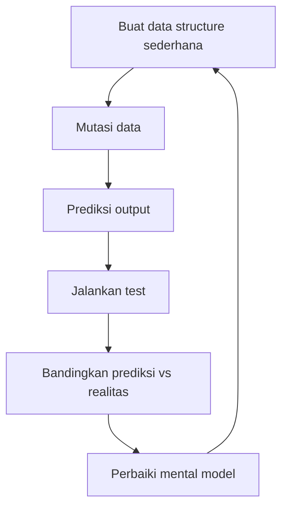
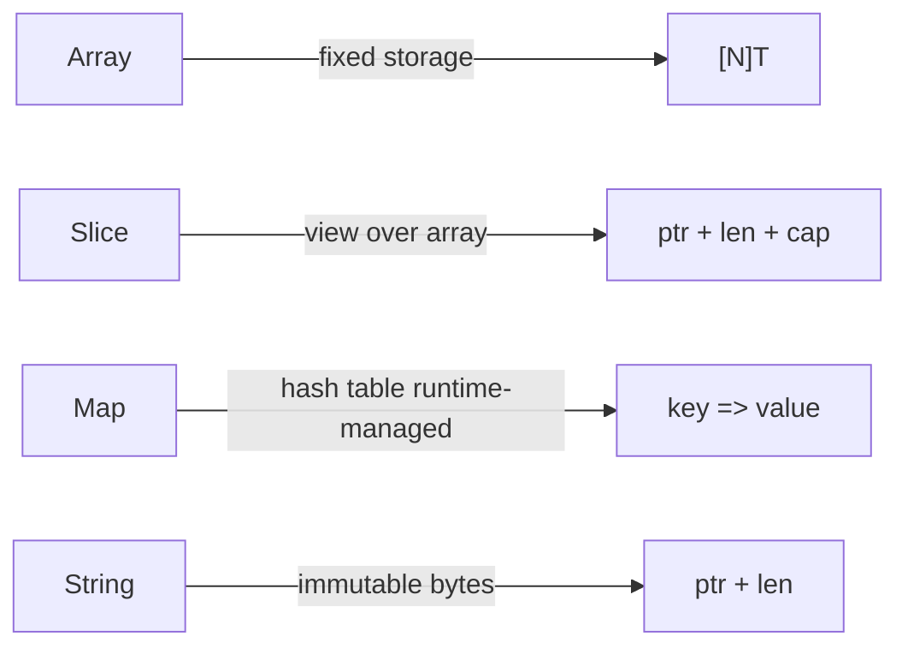
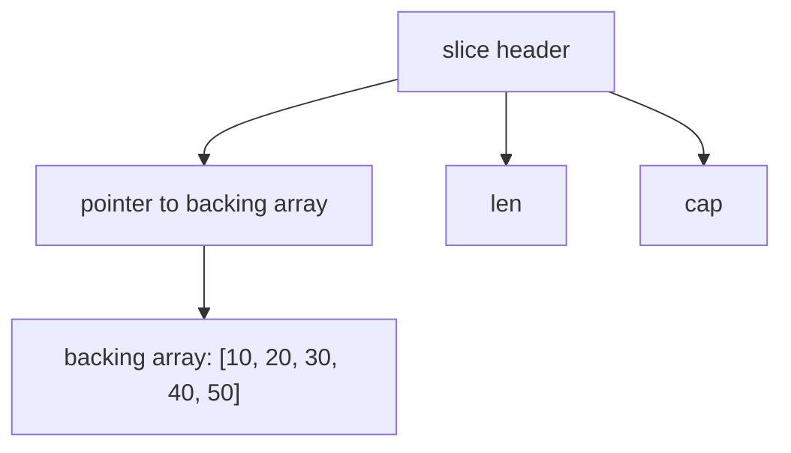

# Arrays, Slices, Maps, Strings, Bytes, dan Runes

Part ini adalah salah satu fondasi paling penting dalam Go. Banyak bug Go production bukan terjadi karena developer tidak tahu syntax, tetapi karena salah memahami **representasi data**: slice yang berbagi backing array, map yang nil, string yang immutable, byte yang bukan karakter, atau `range` yang bekerja pada rune tapi index-nya tetap byte offset.

Target part ini: kamu tidak hanya bisa memakai collection Go, tetapi paham **cost model**, **mutation boundary**, dan **failure mode**-nya.

---

## 1. Posisi Part Ini dalam Framework Kaufman

Dalam pendekatan *The First 20 Hours*, kita memecah skill besar menjadi sub-skill kecil yang paling sering dipakai. Untuk Go, collection dan text processing adalah sub-skill harian.

Sub-skill yang dilatih di part ini:

1. Memilih array, slice, map, string, `[]byte`, atau `[]rune` secara tepat.
2. Mengetahui kapan data disalin dan kapan hanya direferensikan.
3. Menghindari bug aliasing pada slice.
4. Menghindari panic dan semantic bug pada map.
5. Memproses text UTF-8 dengan benar.
6. Mendesain API yang jelas terhadap ownership dan mutability.

Learning loop yang dipakai:



---

## 2. Big Picture: Collection dan Text di Go

Go punya beberapa bentuk data sequence dan associative storage:

| Bentuk | Mutability | Ukuran | Cocok untuk | Catatan utama |
|---|---:|---:|---|---|
| Array | Mutable | Fixed | Data ukuran tetap, internal backing store | Nilainya mencakup seluruh elemen |
| Slice | Mutable view | Dynamic view | Hampir semua list dinamis | Header menunjuk backing array |
| Map | Mutable | Dynamic | Key-value lookup | Nil map tidak bisa ditulis |
| String | Immutable | Fixed byte sequence | Text UTF-8, identifier, payload read-only | Index menghasilkan byte, bukan rune |
| `[]byte` | Mutable | Dynamic | Binary data, buffer, I/O | Umum untuk encoding/decoding |
| `[]rune` | Mutable | Dynamic | Manipulasi Unicode code point | Lebih mahal dari string/byte |

Mental model sederhananya:



Kalimat penting: **slice bukan array**, dan **string bukan kumpulan karakter sederhana**.

---

## 3. Array: Fixed-size Value

Array di Go memiliki ukuran sebagai bagian dari type.

```go
package main

import "fmt"

func main() {
    var a [3]int
    b := [3]int{10, 20, 30}
    c := [...]int{10, 20, 30}

    fmt.Println(a) // [0 0 0]
    fmt.Println(b) // [10 20 30]
    fmt.Println(c) // [10 20 30]
}
```

`[3]int` dan `[4]int` adalah type berbeda.

```go
var a [3]int
var b [4]int

// a = b // compile error: cannot use b as [3]int
```

Ini berbeda dengan Java/C#/JavaScript mindset, di mana array biasanya lebih sering diperlakukan sebagai reference ke struktur dinamis atau fixed storage di heap. Di Go, array adalah value. Jika array di-assign, seluruh elemen disalin.

```go
package main

import "fmt"

func main() {
    a := [3]int{1, 2, 3}
    b := a

    b[0] = 99

    fmt.Println(a) // [1 2 3]
    fmt.Println(b) // [99 2 3]
}
```

### Kapan Memakai Array?

Array jarang dipakai langsung di application code. Biasanya array dipakai untuk:

1. Data dengan ukuran tetap secara domain.
2. Low-level optimization.
3. Backing storage internal.
4. Crypto/hash fixed-size output.
5. Interoperability dengan API tertentu.

Contoh domain ukuran tetap:

```go
type IPv4 [4]byte

type RGB [3]uint8
```

Contoh fixed hash:

```go
package main

import (
    "crypto/sha256"
    "fmt"
)

func main() {
    sum := sha256.Sum256([]byte("hello"))
    fmt.Printf("%T\n", sum) // [32]uint8
    fmt.Printf("%x\n", sum)
}
```

Di sini array masuk akal karena SHA-256 selalu menghasilkan 32 byte.

---

## 4. Slice: Abstraksi Harian untuk Sequence

Slice adalah bentuk paling umum untuk sequence dinamis di Go.

```go
names := []string{"Ayu", "Budi", "Citra"}
fmt.Println(names[0])
fmt.Println(len(names))
```

Slice memiliki tiga komponen konseptual:

1. Pointer ke elemen pertama pada backing array.
2. Length: jumlah elemen yang terlihat.
3. Capacity: jumlah elemen dari pointer sampai akhir backing array.



Contoh:

```go
package main

import "fmt"

func main() {
    xs := []int{10, 20, 30, 40, 50}
    ys := xs[1:4]

    fmt.Println(ys)      // [20 30 40]
    fmt.Println(len(ys)) // 3
    fmt.Println(cap(ys)) // 4, dari index 1 sampai akhir backing array
}
```

### Slice Literal

```go
xs := []int{1, 2, 3}
```

Ini membuat array backing store dan slice yang menunjuk ke array itu.

### Slice dari Array

```go
arr := [5]int{10, 20, 30, 40, 50}
s := arr[1:4]

fmt.Println(s) // [20 30 40]
```

Mutasi slice akan memutasi array asal.

```go
arr := [5]int{10, 20, 30, 40, 50}
s := arr[1:4]
s[0] = 99

fmt.Println(arr) // [10 99 30 40 50]
```

Inilah inti slice: **slice adalah view**, bukan kepemilikan penuh atas data.

---

## 5. `len` dan `cap`

`len` adalah jumlah elemen yang terlihat oleh slice.

`cap` adalah kapasitas backing array yang masih bisa dipakai dari posisi awal slice.

```go
xs := []int{10, 20, 30, 40, 50}
ys := xs[1:3]

fmt.Println(ys)      // [20 30]
fmt.Println(len(ys)) // 2
fmt.Println(cap(ys)) // 4
```

Visual:

```txt
xs backing array:
index: 0   1   2   3   4
value: 10  20  30  40  50
          ^ ys starts here

ys len = 2  => sees 20, 30
ys cap = 4  => can grow through 20, 30, 40, 50
```

### Full Slice Expression

Go punya full slice expression:

```go
ys := xs[1:3:3]
```

Format:

```go
s[low:high:max]
```

Capacity hasil adalah `max - low`.

Contoh:

```go
package main

import "fmt"

func main() {
    xs := []int{10, 20, 30, 40, 50}
    ys := xs[1:3:3]

    fmt.Println(ys)      // [20 30]
    fmt.Println(len(ys)) // 2
    fmt.Println(cap(ys)) // 2
}
```

Kenapa penting? Untuk membatasi append agar tidak diam-diam mengubah backing array yang sama.

---

## 6. `append`: Operasi yang Sering Disalahpahami

`append` mengembalikan slice baru.

Selalu assign hasilnya.

```go
xs := []int{1, 2, 3}
xs = append(xs, 4)
```

Jangan menulis:

```go
append(xs, 4) // compile error: append result not used
```

Jika capacity cukup, append memakai backing array yang sama. Jika tidak cukup, runtime membuat backing array baru.

```go
package main

import "fmt"

func main() {
    xs := make([]int, 0, 3)
    xs = append(xs, 1, 2)

    ys := append(xs, 3)
    zs := append(xs, 99)

    fmt.Println(xs) // [1 2]
    fmt.Println(ys) // bisa [1 2 99], bukan [1 2 3]
    fmt.Println(zs) // [1 2 99]
}
```

Ini mengejutkan kalau kamu belum menginternalisasi bahwa `ys` dan `zs` mungkin berbagi backing array.

### Bug Aliasing pada Append

Contoh yang sering muncul di production:

```go
package main

import "fmt"

func main() {
    base := []string{"a", "b", "c", "d"}

    left := base[:2]
    right := append(left, "X")

    fmt.Println(base)  // [a b X d]
    fmt.Println(left)  // [a b]
    fmt.Println(right) // [a b X]
}
```

`append(left, "X")` tidak membuat array baru karena capacity `left` masih cukup. Akibatnya `base[2]` berubah.

### Cara Aman: Copy Sebelum Append

```go
base := []string{"a", "b", "c", "d"}
left := base[:2]

right := append([]string(nil), left...)
right = append(right, "X")

fmt.Println(base)  // [a b c d]
fmt.Println(right) // [a b X]
```

Atau gunakan full slice expression:

```go
base := []string{"a", "b", "c", "d"}
left := base[:2:2]
right := append(left, "X")

fmt.Println(base)  // [a b c d]
fmt.Println(right) // [a b X]
```

Prinsip review: jika sebuah function menerima slice dan melakukan append, tanyakan: **apakah function ini boleh memutasi backing array caller?**

---

## 7. Nil Slice vs Empty Slice

Nil slice:

```go
var xs []int
fmt.Println(xs == nil) // true
fmt.Println(len(xs))   // 0
```

Empty non-nil slice:

```go
xs := []int{}
fmt.Println(xs == nil) // false
fmt.Println(len(xs))   // 0
```

Keduanya aman untuk `append` dan `range`.

```go
var xs []int
xs = append(xs, 1)
fmt.Println(xs) // [1]
```

### Kapan Nil Slice Lebih Baik?

Biasanya gunakan nil slice sebagai zero value natural.

```go
func FindIDs() []int {
    var ids []int
    return ids
}
```

### Kapan Empty Slice Lebih Baik?

Saat kamu butuh representasi JSON `[]`, bukan `null`.

```go
package main

import (
    "encoding/json"
    "fmt"
)

func main() {
    var nilSlice []int
    emptySlice := []int{}

    a, _ := json.Marshal(nilSlice)
    b, _ := json.Marshal(emptySlice)

    fmt.Println(string(a)) // null
    fmt.Println(string(b)) // []
}
```

Untuk API contract, ini penting. Banyak frontend/client membedakan `null` dan `[]`.

---

## 8. Copy Slice dengan Benar

Gunakan built-in `copy` atau `append` ke nil slice.

```go
src := []int{1, 2, 3}
dst := make([]int, len(src))
copy(dst, src)
```

Atau:

```go
dst := append([]int(nil), src...)
```

Untuk Go modern, package `slices` juga menyediakan helper seperti `Clone`.

```go
import "slices"

copyOfSrc := slices.Clone(src)
```

Secara desain API, clone penting saat function tidak ingin membocorkan internal state.

```go
type Group struct {
    members []string
}

func (g *Group) Members() []string {
    return append([]string(nil), g.members...)
}
```

Jika langsung mengembalikan `g.members`, caller bisa memutasi state internal.

```go
func (g *Group) MembersUnsafe() []string {
    return g.members
}
```

Ini bug encapsulation.

---

## 9. Deleting dari Slice

Go tidak punya built-in delete untuk slice seperti map. Pola umum:

```go
func RemoveAt[T any](xs []T, i int) []T {
    return append(xs[:i], xs[i+1:]...)
}
```

Tapi ini mempertahankan backing array dan bisa meninggalkan reference ke elemen lama, yang penting jika elemen memegang pointer besar.

Versi yang membantu GC:

```go
func RemoveAt[T any](xs []T, i int) []T {
    var zero T
    copy(xs[i:], xs[i+1:])
    xs[len(xs)-1] = zero
    return xs[:len(xs)-1]
}
```

Untuk urutan tidak penting:

```go
func RemoveAtUnordered[T any](xs []T, i int) []T {
    xs[i] = xs[len(xs)-1]
    var zero T
    xs[len(xs)-1] = zero
    return xs[:len(xs)-1]
}
```

Trade-off:

| Teknik | Menjaga urutan | Kompleksitas | Cocok untuk |
|---|---:|---:|---|
| `append(xs[:i], xs[i+1:]...)` | Ya | O(n) | Data kecil, sederhana |
| `copy` + zero last | Ya | O(n) | Elemen pointer/besar |
| swap with last | Tidak | O(1) | Set/order tidak penting |

---

## 10. Preallocation: Performance Tanpa Overengineering

Jika kamu tahu jumlah elemen yang akan ditambahkan, preallocate capacity.

```go
func Squares(n int) []int {
    result := make([]int, 0, n)
    for i := 0; i < n; i++ {
        result = append(result, i*i)
    }
    return result
}
```

Jangan lakukan ini tanpa alasan:

```go
result := make([]int, 0, 1_000_000)
```

Preallocation adalah trade-off: mengurangi reallocation, tetapi bisa menaikkan memory footprint jika estimasi salah.

Rule of thumb:

1. Jika ukuran final diketahui: preallocate.
2. Jika ukuran final dapat diperkirakan murah: preallocate konservatif.
3. Jika ukuran tidak diketahui: mulai dari nil slice dan ukur jika ada bottleneck.

---

## 11. Range pada Slice

```go
xs := []string{"a", "b", "c"}

for i, v := range xs {
    fmt.Println(i, v)
}
```

`range` meng-copy nilai elemen ke variable `v`.

```go
type User struct {
    Name string
}

users := []User{{"Ayu"}, {"Budi"}}

for _, u := range users {
    u.Name = "Changed"
}

fmt.Println(users) // [{Ayu} {Budi}]
```

Untuk mutate elemen, gunakan index.

```go
for i := range users {
    users[i].Name = "Changed"
}
```

Ini penting untuk slice of struct. Kalau slice of pointer, kamu memutasi object yang ditunjuk.

```go
users := []*User{{Name: "Ayu"}, {Name: "Budi"}}

for _, u := range users {
    u.Name = "Changed"
}
```

---

## 12. Map: Hash Table Built-in

Map adalah associative array.

```go
scores := map[string]int{
    "ayu":  90,
    "budi": 80,
}

fmt.Println(scores["ayu"])
```

Map key harus comparable. Contoh key valid:

- string
- int
- bool
- pointer
- struct yang semua field-nya comparable
- array dengan element comparable

Key tidak valid:

- slice
- map
- function

```go
// invalid: slice cannot be map key
// m := map[[]string]int{}
```

Jika butuh key gabungan, gunakan struct.

```go
type UserRoleKey struct {
    UserID string
    RoleID string
}

permissions := map[UserRoleKey]bool{}
permissions[UserRoleKey{UserID: "u1", RoleID: "admin"}] = true
```

Ini lebih aman daripada join string manual seperti `userID + ":" + roleID`, yang rawan collision jika delimiter tidak dijaga.

---

## 13. Nil Map vs Empty Map

Nil map bisa dibaca, tetapi tidak bisa ditulis.

```go
var m map[string]int

fmt.Println(m["missing"]) // 0

// m["x"] = 1 // panic: assignment to entry in nil map
```

Buat map dengan literal atau `make`.

```go
m := map[string]int{}
m["x"] = 1
```

Atau:

```go
m := make(map[string]int)
m["x"] = 1
```

Gunakan capacity hint jika masuk akal.

```go
m := make(map[string]int, expectedSize)
```

---

## 14. Comma-ok Idiom

Membaca map mengembalikan zero value jika key tidak ada. Ini berbahaya jika zero value juga value valid.

```go
ages := map[string]int{
    "baby": 0,
}

fmt.Println(ages["baby"])    // 0
fmt.Println(ages["missing"]) // 0
```

Gunakan comma-ok:

```go
age, ok := ages["baby"]
if !ok {
    fmt.Println("not found")
    return
}
fmt.Println(age)
```

Pattern ini sangat umum di Go.

---

## 15. Delete dari Map

Gunakan built-in `delete`.

```go
delete(ages, "baby")
```

Aman jika key tidak ada.

```go
delete(ages, "missing") // no-op
```

Aman pada nil map juga.

```go
var m map[string]int
delete(m, "x") // no panic
```

Tetapi assignment ke nil map tetap panic.

---

## 16. Iterasi Map Tidak Ordered

Urutan iterasi map tidak boleh diandalkan.

```go
m := map[string]int{"a": 1, "b": 2, "c": 3}

for k, v := range m {
    fmt.Println(k, v)
}
```

Jika butuh output stabil, sort keys.

```go
package main

import (
    "fmt"
    "sort"
)

func main() {
    m := map[string]int{"b": 2, "a": 1, "c": 3}

    keys := make([]string, 0, len(m))
    for k := range m {
        keys = append(keys, k)
    }
    sort.Strings(keys)

    for _, k := range keys {
        fmt.Println(k, m[k])
    }
}
```

Untuk test snapshot, response JSON, dan deterministic build output, jangan pernah bergantung pada urutan map.

---

## 17. Map Bukan Aman untuk Concurrent Write

Map built-in tidak aman untuk concurrent write tanpa synchronization.

Ini berisiko:

```go
m := map[string]int{}

go func() { m["a"] = 1 }()
go func() { m["b"] = 2 }()
```

Gunakan mutex, channel ownership, atau `sync.Map` jika kasusnya cocok.

```go
type Counter struct {
    mu sync.Mutex
    m  map[string]int
}

func NewCounter() *Counter {
    return &Counter{m: make(map[string]int)}
}

func (c *Counter) Inc(key string) {
    c.mu.Lock()
    defer c.mu.Unlock()
    c.m[key]++
}
```

`sync.Map` bukan replacement universal. Ia cocok untuk pola tertentu seperti banyak goroutine membaca dan sedikit menulis, atau key yang ditulis sekali lalu dibaca berkali-kali. Untuk domain map biasa, `map + mutex` biasanya lebih jelas.

---

## 18. String: Immutable Byte Sequence

String di Go adalah sequence byte yang immutable. Ia sering berisi UTF-8, tetapi secara type-level string adalah byte sequence.

```go
s := "hello"
fmt.Println(len(s)) // 5
fmt.Println(s[0])   // 104, byte untuk 'h'
```

Indexing string menghasilkan byte, bukan karakter.

```go
s := "é"
fmt.Println(len(s)) // 2, UTF-8 encoding uses 2 bytes
fmt.Println(s[0])   // 195
fmt.Println(s[1])   // 169
```

Jadi `len(s)` adalah jumlah byte, bukan jumlah karakter manusia.

---

## 19. Byte, Rune, dan Unicode

`byte` adalah alias untuk `uint8`.

```go
var b byte = 'A'
fmt.Println(b) // 65
```

`rune` adalah alias untuk `int32`, biasanya mewakili Unicode code point.

```go
var r rune = '世'
fmt.Println(r)      // 19990
fmt.Printf("%c\n", r) // 世
```

String literal bisa berisi UTF-8.

```go
s := "hello 世界"
fmt.Println(len(s)) // byte length
```

Gunakan `range` untuk iterasi rune.

```go
for i, r := range "hello 世界" {
    fmt.Printf("byte offset=%d rune=%c\n", i, r)
}
```

Perhatikan: index `i` tetap byte offset, bukan rune index.

---

## 20. Menghitung Panjang Text dengan Benar

Jika ingin jumlah rune:

```go
import "unicode/utf8"

count := utf8.RuneCountInString("hello 世界")
```

Atau:

```go
count := 0
for range "hello 世界" {
    count++
}
```

Namun jumlah rune pun belum tentu sama dengan “karakter yang terlihat oleh manusia”. Contoh emoji dan combining character bisa terdiri dari beberapa code point. Untuk UI text processing yang serius, kamu perlu library yang memahami grapheme cluster.

Untuk backend service, biasanya keputusan praktisnya:

| Kebutuhan | Pakai |
|---|---|
| Ukuran payload/network | byte length |
| Validasi panjang username sederhana | rune count, dengan catatan |
| UI cursor movement | grapheme cluster library |
| Binary protocol | `[]byte` |
| Immutable text | `string` |

---

## 21. Konversi `string`, `[]byte`, dan `[]rune`

String ke bytes:

```go
s := "hello"
bs := []byte(s)
bs[0] = 'H'
fmt.Println(string(bs)) // Hello
```

Konversi ini membuat copy, karena string immutable sedangkan `[]byte` mutable.

Bytes ke string:

```go
bs := []byte{'h', 'e', 'l', 'l', 'o'}
s := string(bs)
fmt.Println(s)
```

String ke runes:

```go
rs := []rune("hello 世界")
fmt.Println(len(rs))
```

`[]rune` berguna jika kamu perlu memanipulasi Unicode code point, misalnya reverse rune sederhana.

```go
func ReverseRunes(s string) string {
    rs := []rune(s)
    for i, j := 0, len(rs)-1; i < j; i, j = i+1, j-1 {
        rs[i], rs[j] = rs[j], rs[i]
    }
    return string(rs)
}
```

Catatan: ini membalik rune, bukan grapheme cluster. Untuk emoji kompleks, hasilnya belum tentu sesuai ekspektasi manusia.

---

## 22. `strings.Builder` untuk Membangun String

String immutable. Jika kamu menggabungkan string dalam loop besar, gunakan `strings.Builder`.

```go
package main

import (
    "fmt"
    "strings"
)

func JoinLines(lines []string) string {
    var b strings.Builder

    for _, line := range lines {
        b.WriteString(line)
        b.WriteByte('\n')
    }

    return b.String()
}

func main() {
    fmt.Println(JoinLines([]string{"a", "b", "c"}))
}
```

Jika ukuran bisa diperkirakan, gunakan `Grow`.

```go
var b strings.Builder
b.Grow(1024)
```

Untuk binary data, gunakan `bytes.Buffer` atau `[]byte`.

---

## 23. Common Failure Modes

### 23.1 Menganggap Slice Pasti Punya Ownership Sendiri

```go
func AddAdmin(roles []string) []string {
    return append(roles, "admin")
}
```

Pertanyaan review:

- Apakah function boleh memutasi backing array `roles`?
- Apakah caller mengharapkan input tetap aman?
- Apakah harus clone dulu?

Versi defensif:

```go
func AddAdmin(roles []string) []string {
    out := append([]string(nil), roles...)
    out = append(out, "admin")
    return out
}
```

### 23.2 Menulis ke Nil Map

```go
var counts map[string]int
counts["x"]++ // panic
```

Fix:

```go
counts := make(map[string]int)
counts["x"]++
```

### 23.3 Menganggap Map Iteration Ordered

```go
for k := range m {
    // jangan bergantung pada order
}
```

Fix: sort keys.

### 23.4 Menganggap `len(string)` Adalah Jumlah Karakter

```go
len("世界") // 6, bukan 2
```

Fix:

```go
utf8.RuneCountInString("世界") // 2
```

### 23.5 Mutasi Value Copy dari `range`

```go
for _, user := range users {
    user.Active = true // tidak mengubah users jika []User
}
```

Fix:

```go
for i := range users {
    users[i].Active = true
}
```

---

## 24. API Design dengan Slice dan Map

### 24.1 Terima Slice sebagai Input

```go
func Sum(xs []int) int {
    total := 0
    for _, x := range xs {
        total += x
    }
    return total
}
```

Input slice sebaiknya dianggap read-only kecuali function jelas-jelas mutating.

Nama function harus memberi sinyal:

```go
func SortUsers(users []User)        // mutating mungkin masuk akal
func SortedUsers(users []User) []User // non-mutating lebih jelas
```

### 24.2 Return Slice

Jika return data internal, clone.

```go
func (s *Store) IDs() []string {
    s.mu.Lock()
    defer s.mu.Unlock()

    return append([]string(nil), s.ids...)
}
```

### 24.3 Return Map

Map juga reference-like. Clone jika tidak ingin caller memutasi state internal.

```go
func CloneMap[K comparable, V any](src map[K]V) map[K]V {
    dst := make(map[K]V, len(src))
    for k, v := range src {
        dst[k] = v
    }
    return dst
}
```

Jika value-nya pointer atau slice, clone ini shallow copy. Untuk deep copy, perlu policy per domain.

---

## 25. Case Study: Role Aggregation Service

Kita akan membuat fungsi kecil yang menerima list assignment role dan mengembalikan mapping user ke role yang unik dan sorted.

### Requirement

Input:

```go
type Assignment struct {
    UserID string
    Role   string
}
```

Output:

```go
map[string][]string
```

Constraint:

1. Role kosong diabaikan.
2. Duplicate role per user dihilangkan.
3. Role output sorted agar deterministic.
4. Function tidak boleh memutasi input.

### Implementasi

```go
package roles

import "sort"

type Assignment struct {
    UserID string
    Role   string
}

func GroupRoles(assignments []Assignment) map[string][]string {
    roleSets := make(map[string]map[string]struct{})

    for _, a := range assignments {
        if a.UserID == "" || a.Role == "" {
            continue
        }

        if _, ok := roleSets[a.UserID]; !ok {
            roleSets[a.UserID] = make(map[string]struct{})
        }
        roleSets[a.UserID][a.Role] = struct{}{}
    }

    result := make(map[string][]string, len(roleSets))
    for userID, set := range roleSets {
        roles := make([]string, 0, len(set))
        for role := range set {
            roles = append(roles, role)
        }
        sort.Strings(roles)
        result[userID] = roles
    }

    return result
}
```

### Test

```go
package roles

import (
    "reflect"
    "testing"
)

func TestGroupRoles(t *testing.T) {
    input := []Assignment{
        {UserID: "u1", Role: "viewer"},
        {UserID: "u1", Role: "admin"},
        {UserID: "u1", Role: "viewer"},
        {UserID: "u2", Role: "editor"},
        {UserID: "u2", Role: ""},
        {UserID: "", Role: "admin"},
    }

    got := GroupRoles(input)
    want := map[string][]string{
        "u1": {"admin", "viewer"},
        "u2": {"editor"},
    }

    if !reflect.DeepEqual(got, want) {
        t.Fatalf("GroupRoles() = %#v, want %#v", got, want)
    }
}
```

Yang dilatih:

1. Map of set dengan `struct{}`.
2. Deterministic output dengan sorting.
3. Slice preallocation.
4. Skip invalid input.
5. Tidak bergantung pada order map.

---

## 26. Latihan Deliberate Practice

### Latihan 1: Prediksi Slice Aliasing

Tanpa menjalankan kode, prediksi output berikut:

```go
func main() {
    xs := []int{1, 2, 3, 4}
    a := xs[:2]
    b := append(a, 99)
    b[0] = 100

    fmt.Println(xs)
    fmt.Println(a)
    fmt.Println(b)
}
```

Lalu jalankan dan jelaskan backing array-nya.

### Latihan 2: Safe Clone API

Buat type:

```go
type PermissionSet struct {
    roles []string
}
```

Implementasikan:

```go
func NewPermissionSet(roles []string) PermissionSet
func (p PermissionSet) Roles() []string
```

Constraint:

1. Constructor tidak boleh menyimpan slice input langsung.
2. `Roles()` tidak boleh membocorkan internal slice.
3. Duplicate role boleh dibiarkan untuk latihan awal.

### Latihan 3: Map Frequency Counter

Buat function:

```go
func CountWords(text string) map[string]int
```

Constraint:

1. Case-insensitive.
2. Pisahkan berdasarkan whitespace.
3. Abaikan string kosong.

### Latihan 4: Unicode Reverse

Buat:

```go
func ReverseRunes(s string) string
```

Test dengan:

```go
"abc"
"世界"
"hello 世界"
```

Lalu catat keterbatasannya terhadap emoji kompleks.

### Latihan 5: Deterministic Map Output

Buat:

```go
func FormatCounts(counts map[string]int) string
```

Output harus sorted by key:

```txt
a=1
b=2
c=3
```

---

## 27. Checklist Code Review

Gunakan checklist ini saat mereview Go code yang memakai array, slice, map, dan string.

### Slice

- Apakah append result selalu di-assign?
- Apakah function memutasi input slice secara eksplisit?
- Apakah perlu clone sebelum menyimpan atau mengembalikan slice?
- Apakah full slice expression perlu untuk membatasi capacity?
- Apakah deletion dari slice membersihkan reference lama jika elemen besar/pointer?
- Apakah preallocation masuk akal?
- Apakah loop range memutasi copy, bukan elemen asli?

### Map

- Apakah map sudah diinisialisasi sebelum write?
- Apakah comma-ok dipakai saat zero value ambigu?
- Apakah output butuh deterministic order?
- Apakah map diakses concurrent tanpa lock?
- Apakah key type comparable dan tidak fragile?
- Apakah map internal dibocorkan ke caller?

### String dan Unicode

- Apakah `len(s)` dimaksudkan sebagai byte length atau character count?
- Apakah indexing string dimaksudkan mengambil byte?
- Apakah text processing perlu rune atau grapheme cluster?
- Apakah string concatenation dalam loop besar memakai `strings.Builder`?
- Apakah konversi string/byte dilakukan sadar copy cost?

---

## 28. Mental Model Ringkas

1. Array adalah fixed-size value.
2. Slice adalah view atas backing array.
3. Append bisa memakai backing array lama atau membuat yang baru.
4. Map adalah reference-like runtime-managed hash table.
5. Nil slice aman untuk append; nil map tidak aman untuk assignment.
6. Map iteration tidak ordered.
7. String adalah immutable byte sequence.
8. `byte` bukan karakter; `rune` adalah Unicode code point.
9. `range` string menghasilkan byte offset dan rune.
10. API yang baik menjelaskan ownership dan mutability.

---

## 29. Referensi Resmi

- Go Specification: https://go.dev/ref/spec
- Effective Go: https://go.dev/doc/effective_go
- Go Slices: usage and internals: https://go.dev/blog/slices-intro
- Go maps in action: https://go.dev/blog/maps
- Package `slices`: https://pkg.go.dev/slices
- Package `maps`: https://pkg.go.dev/maps
- Package `unicode/utf8`: https://pkg.go.dev/unicode/utf8
- Package `strings`: https://pkg.go.dev/strings

---

## 30. Penutup

Part ini mengubah cara melihat data di Go. Pada level syntax, slice dan map terlihat sederhana. Pada level engineering, keduanya adalah sumber keputusan penting tentang ownership, mutability, performance, deterministic behavior, dan concurrency safety.

Jika kamu bisa menjelaskan kapan slice berbagi backing array, kapan map harus disortir, dan kapan string harus diproses sebagai bytes/runes, kamu sudah melewati salah satu threshold awal dari Go beginner ke Go engineer yang mampu mengoreksi dirinya sendiri.

Di part berikutnya, kita masuk ke **structs, methods, interfaces, dan composition**: inti desain domain dan API idiomatik di Go.
