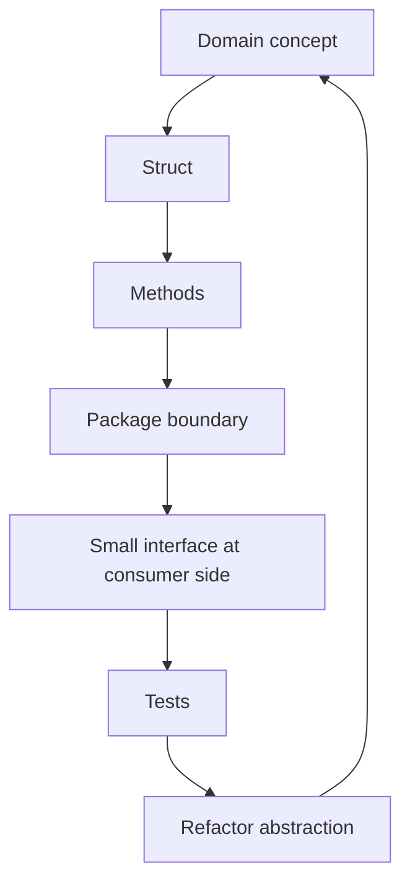
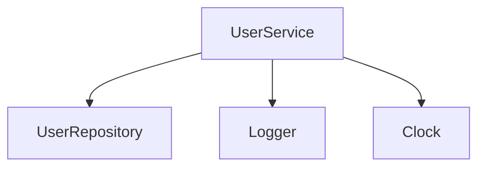
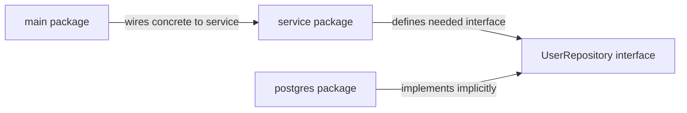
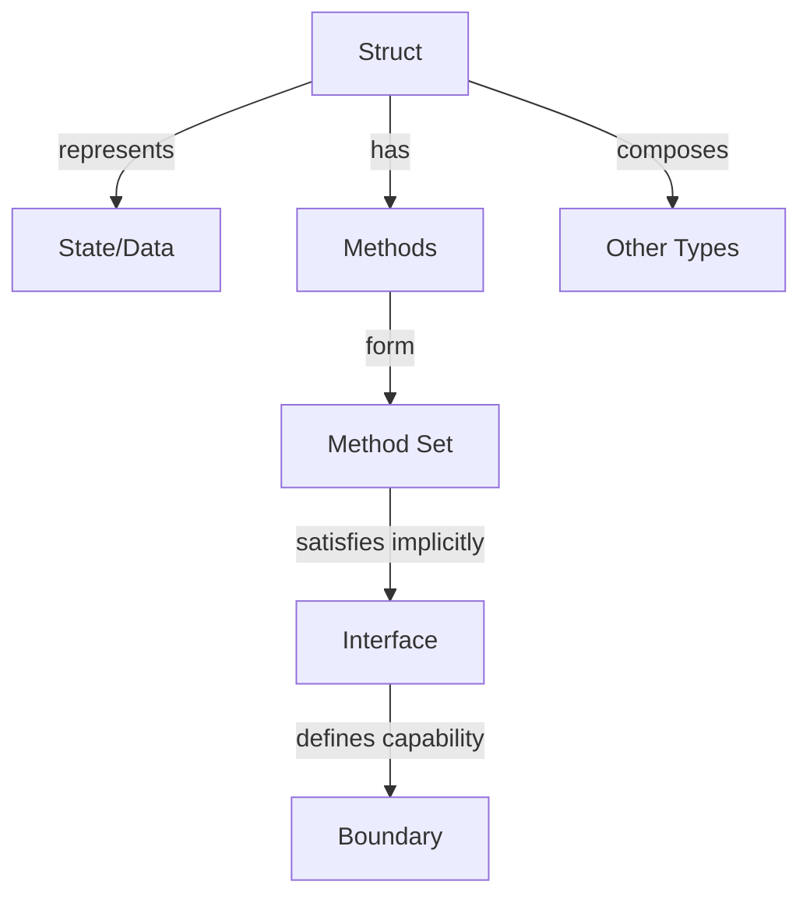

# Structs, Methods, Interfaces, dan Composition

Part ini membahas inti desain program Go: bagaimana merepresentasikan domain dengan `struct`, memberi behavior melalui `method`, mendefinisikan boundary dengan `interface`, dan menyusun sistem dengan **composition**, bukan inheritance.

Kalau kamu datang dari Java atau C#, bagian ini perlu dibaca dengan hati-hati. Di Go, interface bukan “kontrak yang harus dideklarasikan oleh class”. Go tidak punya class inheritance. Go mendorong desain yang lebih kecil, eksplisit, dan dekat dengan dependency boundary nyata.

Target part ini: kamu mampu mendesain model dan boundary Go yang idiomatik, tidak Java-ish, tidak over-abstracted, dan mudah dites.

---

## 1. Posisi Part Ini dalam Framework Kaufman

Dalam kerangka *The First 20 Hours*, kita sedang masuk ke sub-skill yang punya leverage besar: **membuat bentuk program**.

Sub-skill yang dipelajari:

1. Mendesain data dengan struct.
2. Memilih value receiver atau pointer receiver.
3. Memahami method set.
4. Memakai interface kecil di boundary yang tepat.
5. Menggunakan composition sebagai pengganti inheritance.
6. Menghindari over-engineering ala enterprise OOP.
7. Membuat desain yang mudah dites tanpa framework berat.

Mental loop-nya:



---

## 2. Struct sebagai Bentuk Data

Struct menggabungkan beberapa field menjadi satu type.

```go
package main

import "fmt"

type User struct {
    ID    string
    Name  string
    Email string
}

func main() {
    user := User{
        ID:    "u-123",
        Name:  "Ayu",
        Email: "ayu@example.com",
    }

    fmt.Println(user.Name)
}
```

Struct adalah value. Assignment menyalin seluruh field.

```go
u1 := User{ID: "u1", Name: "Ayu"}
u2 := u1
u2.Name = "Budi"

fmt.Println(u1.Name) // Ayu
fmt.Println(u2.Name) // Budi
```

Namun jika field struct berisi reference-like value seperti slice, map, pointer, channel, atau function, assignment menyalin header/reference-nya, bukan deep copy isi datanya.

```go
type Group struct {
    Members []string
}

g1 := Group{Members: []string{"Ayu", "Budi"}}
g2 := g1

g2.Members[0] = "Changed"

fmt.Println(g1.Members) // [Changed Budi]
fmt.Println(g2.Members) // [Changed Budi]
```

Jadi “struct adalah value” tidak berarti semua isinya otomatis deep copy.

---

## 3. Struct Literal dan Field Names

Gunakan field names untuk readability dan resilience terhadap perubahan urutan field.

Baik:

```go
user := User{
    ID:    "u-123",
    Name:  "Ayu",
    Email: "ayu@example.com",
}
```

Hindari untuk non-trivial struct:

```go
user := User{"u-123", "Ayu", "ayu@example.com"}
```

Unkeyed literal mudah rusak jika field ditambah atau diubah urutannya.

Exception: struct kecil di package yang sama dan sangat lokal bisa saja memakai unkeyed literal, tetapi default untuk production code adalah keyed literal.

---

## 4. Exported dan Unexported Fields

Identifier yang diawali huruf besar exported dari package.

```go
type User struct {
    ID    string
    Name  string
    email string
}
```

`ID` dan `Name` bisa diakses dari package lain. `email` tidak.

Gunakan unexported field untuk menjaga invariant.

```go
package account

import "errors"

type Account struct {
    id      string
    balance int64
}

func NewAccount(id string) (*Account, error) {
    if id == "" {
        return nil, errors.New("account id is required")
    }
    return &Account{id: id}, nil
}

func (a *Account) ID() string {
    return a.id
}

func (a *Account) Balance() int64 {
    return a.balance
}
```

Jika `balance` exported, caller bisa mengubahnya tanpa melewati aturan domain.

```go
// Buruk untuk domain invariant:
// account.Balance = -999999
```

Prinsip: **export behavior, hide representation** jika invariant penting.

---

## 5. Zero Value dan Constructor

Go tidak punya constructor khusus seperti `new Class(...)`. Biasanya constructor hanyalah function biasa dengan prefix `New`.

```go
type Cache struct {
    entries map[string]string
}

func NewCache() *Cache {
    return &Cache{
        entries: make(map[string]string),
    }
}
```

Kenapa perlu constructor? Karena zero value `Cache{}` punya nil map sehingga write akan panic.

```go
var c Cache
// c.entries["x"] = "y" // panic
```

Tapi tidak semua type butuh constructor. Jika zero value sudah valid, itu ideal.

```go
type Counter struct {
    n int64
}

func (c *Counter) Inc() {
    c.n++
}

func (c *Counter) Value() int64 {
    return c.n
}
```

`var c Counter` langsung usable.

Desain Go yang baik sering membuat zero value berguna. Tetapi jangan memaksakan zero value jika invariant domain membutuhkan validasi.

---

## 6. Methods: Function dengan Receiver

Method adalah function dengan receiver.

```go
type User struct {
    ID   string
    Name string
}

func (u User) DisplayName() string {
    if u.Name == "" {
        return u.ID
    }
    return u.Name
}
```

Receiver bukan `this`, bukan `self`, dan tidak punya makna khusus seperti di OOP klasik. Receiver adalah parameter biasa yang ditulis sebelum nama method.

```go
func (u User) DisplayName() string
```

Sama secara konseptual dengan:

```go
func DisplayName(u User) string
```

Tetapi method membuat function terikat pada type dan ikut method set type tersebut.

---

## 7. Value Receiver vs Pointer Receiver

Value receiver menyalin value receiver saat method dipanggil.

```go
type Point struct {
    X int
    Y int
}

func (p Point) Move(dx, dy int) {
    p.X += dx
    p.Y += dy
}
```

Pemanggilan:

```go
p := Point{X: 1, Y: 2}
p.Move(10, 10)
fmt.Println(p) // {1 2}
```

Karena `Move` menerima copy.

Pointer receiver bisa memutasi object asli.

```go
func (p *Point) Move(dx, dy int) {
    p.X += dx
    p.Y += dy
}
```

Sekarang:

```go
p := Point{X: 1, Y: 2}
p.Move(10, 10)
fmt.Println(p) // {11 12}
```

### Kapan Value Receiver?

Gunakan value receiver jika:

1. Type kecil.
2. Type immutable secara desain.
3. Method tidak memutasi receiver.
4. Copy tidak mahal.
5. Kamu ingin value semantics.

Contoh:

```go
type Money struct {
    Currency string
    Amount   int64
}

func (m Money) Add(other Money) Money {
    if m.Currency != other.Currency {
        panic("currency mismatch")
    }
    return Money{Currency: m.Currency, Amount: m.Amount + other.Amount}
}
```

Dalam production, jangan panic untuk domain mismatch seperti ini jika input berasal dari luar. Contoh ini hanya menunjukkan value semantics. Versi domain service lebih baik return error.

### Kapan Pointer Receiver?

Gunakan pointer receiver jika:

1. Method memutasi receiver.
2. Type besar dan copy mahal.
3. Type mengandung `sync.Mutex`, `sync.WaitGroup`, atau resource yang tidak boleh dicopy.
4. Kamu ingin konsistensi receiver method set.
5. Type merepresentasikan entity/resource dengan identity.

Contoh:

```go
type Account struct {
    id      string
    balance int64
}

func (a *Account) Deposit(amount int64) error {
    if amount <= 0 {
        return errors.New("amount must be positive")
    }
    a.balance += amount
    return nil
}
```

### Rule Praktis

Jika sebagian method butuh pointer receiver, biasanya gunakan pointer receiver untuk semua method type tersebut agar konsisten.

```go
func (a *Account) ID() string { return a.id }
func (a *Account) Deposit(amount int64) error { ... }
```

---

## 8. Method Set: Sumber Banyak Kebingungan

Method set menentukan method apa yang dimiliki sebuah type dan apakah type tersebut memenuhi interface tertentu.

Simplifikasi awal:

1. Method dengan receiver `T` masuk ke method set `T` dan `*T`.
2. Method dengan receiver `*T` hanya masuk ke method set `*T`.

Contoh:

```go
type Writer interface {
    Write(string) error
}

type File struct{}

func (f *File) Write(s string) error {
    return nil
}
```

`*File` implements `Writer`, tetapi `File` tidak.

```go
var w Writer

f := File{}
// w = f  // compile error
w = &f    // ok
```

Kenapa? Karena `Write` didefinisikan pada `*File`, bukan `File`.

Namun Go punya auto-addressing untuk method call pada variable addressable.

```go
f := File{}
f.Write("hello") // ok, compiler membaca sebagai (&f).Write("hello")
```

Tapi auto-addressing ini tidak berarti `File` memenuhi interface `Writer`.

Ini distinction penting.

---

## 9. Interface: Behavior Contract yang Implicit

Interface mendefinisikan set method.

```go
type Store interface {
    Save(ctx context.Context, user User) error
    FindByID(ctx context.Context, id string) (User, error)
}
```

Type memenuhi interface secara implicit. Tidak ada `implements`.

```go
type PostgresStore struct{}

func (s *PostgresStore) Save(ctx context.Context, user User) error {
    return nil
}

func (s *PostgresStore) FindByID(ctx context.Context, id string) (User, error) {
    return User{}, nil
}
```

Sekarang `*PostgresStore` memenuhi `Store`.

```go
var _ Store = (*PostgresStore)(nil)
```

Baris ini compile-time assertion. Ia tidak wajib, tetapi berguna untuk memastikan type memenuhi interface.

---

## 10. Interface Kecil Lebih Kuat

Go mendorong interface kecil. Interface paling idiomatik sering hanya punya satu atau dua method.

Contoh standard library:

```go
type Reader interface {
    Read(p []byte) (n int, err error)
}

type Writer interface {
    Write(p []byte) (n int, err error)
}
```

Interface kecil lebih mudah dikomposisikan.

```go
type ReadWriter interface {
    Reader
    Writer
}
```

Dalam application code, hindari interface besar seperti:

```go
type UserService interface {
    CreateUser(ctx context.Context, req CreateUserRequest) (User, error)
    UpdateUser(ctx context.Context, req UpdateUserRequest) (User, error)
    DeleteUser(ctx context.Context, id string) error
    FindUser(ctx context.Context, id string) (User, error)
    SearchUsers(ctx context.Context, q string) ([]User, error)
    DisableUser(ctx context.Context, id string) error
    EnableUser(ctx context.Context, id string) error
}
```

Interface seperti ini sering menjadi “fake class” dan membuat test berat.

Lebih baik interface didefinisikan di consumer side sesuai kebutuhan.

```go
type UserFinder interface {
    FindUser(ctx context.Context, id string) (User, error)
}
```

Prinsip: **consumer defines the interface**.

---

## 11. Accept Interfaces, Return Concrete Types

Rule populer Go:

> Accept interfaces, return concrete types.

Artinya function sering menerima dependency sebagai interface, tetapi constructor biasanya mengembalikan concrete type.

```go
type EmailSender interface {
    Send(ctx context.Context, to string, subject string, body string) error
}

type SignupService struct {
    sender EmailSender
}

func NewSignupService(sender EmailSender) *SignupService {
    return &SignupService{sender: sender}
}
```

`NewSignupService` return `*SignupService`, bukan interface.

Kenapa?

1. Caller mendapat API lengkap dari concrete type.
2. Tidak mengunci abstraction terlalu awal.
3. Interface bisa dibuat oleh consumer lain sesuai kebutuhan.
4. Testing tetap mudah karena dependency diterima sebagai interface.

Hindari:

```go
func NewSignupService(sender EmailSender) SignupServiceInterface {
    return &signupService{sender: sender}
}
```

Ini gaya OOP/DI container yang sering tidak perlu di Go.

---

## 12. Empty Interface dan `any`

`any` adalah alias untuk `interface{}`.

```go
func Print(v any) {
    fmt.Println(v)
}
```

Gunakan `any` saat memang type bebas diperlukan, misalnya generic container, logging field, JSON-ish data, atau boundary dynamic.

Jangan gunakan `any` untuk menghindari desain type yang jelas.

Buruk:

```go
func Process(input any) any {
    // banyak type switch internal
}
```

Lebih baik:

```go
func ProcessOrder(order Order) (Receipt, error) {
    ...
}
```

`any` menghilangkan compile-time information. Gunakan dengan sadar.

---

## 13. Type Assertion dan Type Switch

Jika punya interface value, kamu bisa melakukan type assertion.

```go
var v any = "hello"

s, ok := v.(string)
if !ok {
    return
}
fmt.Println(s)
```

Type switch:

```go
func Describe(v any) string {
    switch x := v.(type) {
    case string:
        return "string: " + x
    case int:
        return fmt.Sprintf("int: %d", x)
    default:
        return fmt.Sprintf("unknown: %T", x)
    }
}
```

Type assertion dan type switch berguna di boundary dynamic, tetapi jika muncul terlalu sering di domain logic, itu smell. Mungkin model type kamu kurang eksplisit.

---

## 14. Interface Value: Type + Value

Interface value menyimpan dua hal konseptual:

1. Dynamic type.
2. Dynamic value.

Ini menjelaskan bug klasik nil interface.

```go
package main

import "fmt"

type Notifier interface {
    Notify()
}

type EmailNotifier struct{}

func (e *EmailNotifier) Notify() {}

func main() {
    var email *EmailNotifier = nil
    var notifier Notifier = email

    fmt.Println(email == nil)    // true
    fmt.Println(notifier == nil) // false
}
```

`notifier` tidak nil karena ia memiliki dynamic type `*EmailNotifier`, meskipun dynamic value-nya nil.

Rule praktis:

1. Jangan return typed nil sebagai interface.
2. Jika function return interface, pastikan nil benar-benar nil interface.
3. Prefer return concrete type jika tidak ada alasan kuat return interface.

Contoh problem:

```go
func NewNotifier(enabled bool) Notifier {
    if !enabled {
        var n *EmailNotifier = nil
        return n // interface non-nil
    }
    return &EmailNotifier{}
}
```

Lebih aman:

```go
func NewNotifier(enabled bool) Notifier {
    if !enabled {
        return nil
    }
    return &EmailNotifier{}
}
```

---

## 15. Composition, Bukan Inheritance

Go tidak punya class inheritance. Go menggunakan composition.

Daripada:

```txt
BaseService
  -> UserService extends BaseService
  -> OrderService extends BaseService
```

Di Go, dependency disusun eksplisit:

```go
type Logger interface {
    Info(msg string, fields ...any)
    Error(msg string, fields ...any)
}

type UserService struct {
    users  UserRepository
    logger Logger
}
```

Service tidak “mewarisi” logger. Service memiliki logger.



Composition membuat dependency terlihat dan mudah diganti di test.

---

## 16. Embedding Struct

Embedding memungkinkan field atau method dari type embedded dipromosikan.

```go
type AuditFields struct {
    CreatedAt time.Time
    UpdatedAt time.Time
}

type User struct {
    ID string
    AuditFields
}
```

Pemakaian:

```go
u := User{}
u.CreatedAt = time.Now()
```

Secara eksplisit, field sebenarnya tetap ada:

```go
u.AuditFields.CreatedAt = time.Now()
```

Embedding bukan inheritance. Ia hanya composition dengan promotion.

Gunakan embedding untuk:

1. Komposisi data yang benar-benar natural.
2. Menghindari boilerplate kecil.
3. Membangun interface composition.

Jangan gunakan embedding hanya agar “terlihat seperti extends”.

---

## 17. Embedding Interface

Interface bisa embed interface lain.

```go
type Reader interface {
    Read(p []byte) (int, error)
}

type Writer interface {
    Write(p []byte) (int, error)
}

type ReadWriter interface {
    Reader
    Writer
}
```

Ini sangat idiomatik untuk membangun capability set dari capability kecil.

Dalam domain:

```go
type UserReader interface {
    FindByID(ctx context.Context, id string) (User, error)
}

type UserWriter interface {
    Save(ctx context.Context, user User) error
}

type UserStore interface {
    UserReader
    UserWriter
}
```

Tetap hati-hati: jangan membuat mega-interface hanya karena bisa.

---

## 18. Dependency Injection Tanpa Framework Berat

Go biasanya cukup memakai constructor injection.

```go
type UserRepository interface {
    Save(ctx context.Context, user User) error
}

type Clock interface {
    Now() time.Time
}

type UserService struct {
    repo  UserRepository
    clock Clock
}

func NewUserService(repo UserRepository, clock Clock) *UserService {
    return &UserService{
        repo:  repo,
        clock: clock,
    }
}
```

Testing menjadi sederhana.

```go
type fakeRepo struct {
    saved []User
}

func (f *fakeRepo) Save(ctx context.Context, user User) error {
    f.saved = append(f.saved, user)
    return nil
}

type fixedClock struct {
    t time.Time
}

func (c fixedClock) Now() time.Time {
    return c.t
}
```

Tidak perlu reflection-heavy container hanya untuk wiring sederhana.

---

## 19. Case Study: Signup Service

Kita desain service kecil untuk registrasi user.

### Requirement

1. Email wajib valid secara minimal.
2. User disimpan ke repository.
3. Email welcome dikirim setelah user tersimpan.
4. Service mudah dites.
5. Dependency boundary jelas.

### Domain Model

```go
package signup

import (
    "context"
    "errors"
    "strings"
    "time"
)

type User struct {
    ID        string
    Email     string
    CreatedAt time.Time
}
```

### Dependency Interfaces

Interface didefinisikan sesuai kebutuhan service.

```go
type UserRepository interface {
    Save(ctx context.Context, user User) error
}

type EmailSender interface {
    Send(ctx context.Context, to string, subject string, body string) error
}

type IDGenerator interface {
    NewID() string
}

type Clock interface {
    Now() time.Time
}
```

Interface kecil membuat test mudah dan dependency tidak dipaksa punya method yang tidak dipakai.

### Service

```go
type Service struct {
    users  UserRepository
    emails EmailSender
    ids    IDGenerator
    clock  Clock
}

func NewService(
    users UserRepository,
    emails EmailSender,
    ids IDGenerator,
    clock Clock,
) *Service {
    return &Service{
        users:  users,
        emails: emails,
        ids:    ids,
        clock:  clock,
    }
}
```

### Use Case Method

```go
var ErrInvalidEmail = errors.New("invalid email")

type SignupRequest struct {
    Email string
}

type SignupResponse struct {
    UserID string
}

func (s *Service) Signup(ctx context.Context, req SignupRequest) (SignupResponse, error) {
    email := strings.TrimSpace(strings.ToLower(req.Email))
    if !isValidEmail(email) {
        return SignupResponse{}, ErrInvalidEmail
    }

    user := User{
        ID:        s.ids.NewID(),
        Email:     email,
        CreatedAt: s.clock.Now(),
    }

    if err := s.users.Save(ctx, user); err != nil {
        return SignupResponse{}, err
    }

    if err := s.emails.Send(ctx, user.Email, "Welcome", "Thanks for signing up."); err != nil {
        return SignupResponse{}, err
    }

    return SignupResponse{UserID: user.ID}, nil
}

func isValidEmail(email string) bool {
    return strings.Contains(email, "@") && strings.Contains(email, ".")
}
```

Catatan: validasi email di sini sengaja minimal untuk latihan. Production email validation lebih kompleks dan biasanya tidak boleh over-reject alamat valid.

### Test dengan Fake

```go
package signup

import (
    "context"
    "testing"
    "time"
)

type fakeUserRepo struct {
    saved []User
    err   error
}

func (f *fakeUserRepo) Save(ctx context.Context, user User) error {
    if f.err != nil {
        return f.err
    }
    f.saved = append(f.saved, user)
    return nil
}

type fakeEmailSender struct {
    sentTo []string
    err    error
}

func (f *fakeEmailSender) Send(ctx context.Context, to, subject, body string) error {
    if f.err != nil {
        return f.err
    }
    f.sentTo = append(f.sentTo, to)
    return nil
}

type fixedIDGenerator struct{}

func (fixedIDGenerator) NewID() string { return "user-123" }

type fixedClock struct{}

func (fixedClock) Now() time.Time {
    return time.Date(2026, 6, 26, 10, 0, 0, 0, time.UTC)
}

func TestServiceSignup(t *testing.T) {
    users := &fakeUserRepo{}
    emails := &fakeEmailSender{}

    svc := NewService(users, emails, fixedIDGenerator{}, fixedClock{})

    got, err := svc.Signup(context.Background(), SignupRequest{
        Email: " AYU@EXAMPLE.COM ",
    })
    if err != nil {
        t.Fatalf("Signup() error = %v", err)
    }

    if got.UserID != "user-123" {
        t.Fatalf("UserID = %q, want %q", got.UserID, "user-123")
    }

    if len(users.saved) != 1 {
        t.Fatalf("saved users = %d, want 1", len(users.saved))
    }

    if users.saved[0].Email != "ayu@example.com" {
        t.Fatalf("saved email = %q", users.saved[0].Email)
    }

    if len(emails.sentTo) != 1 || emails.sentTo[0] != "ayu@example.com" {
        t.Fatalf("sentTo = %#v", emails.sentTo)
    }
}
```

Yang dilatih:

1. Struct untuk domain data.
2. Interface kecil untuk dependency.
3. Constructor injection.
4. Pointer receiver untuk service.
5. Test tanpa mocking framework.
6. Boundary eksplisit.

---

## 20. Anti-pattern: Java-ish Go

### 20.1 Interface untuk Semua Concrete Type

Buruk:

```go
type UserService interface {
    CreateUser(ctx context.Context, req CreateUserRequest) (User, error)
}

type userServiceImpl struct{}

func NewUserService() UserService {
    return &userServiceImpl{}
}
```

Ini sering hanya membawa pattern Java ke Go. Jika tidak ada lebih dari satu implementation nyata atau consumer-specific need, return concrete type lebih baik.

Lebih Go-like:

```go
type UserService struct {
    repo UserRepository
}

func NewUserService(repo UserRepository) *UserService {
    return &UserService{repo: repo}
}
```

### 20.2 Mega Interface

Buruk:

```go
type Repository interface {
    CreateUser(...)
    UpdateUser(...)
    DeleteUser(...)
    CreateOrder(...)
    UpdateOrder(...)
    DeleteOrder(...)
    CreatePayment(...)
    RefundPayment(...)
}
```

Ini membuat semua consumer tergantung pada terlalu banyak behavior.

Lebih baik:

```go
type UserSaver interface {
    SaveUser(ctx context.Context, user User) error
}
```

### 20.3 Getter/Setter Tanpa Invariant

Buruk:

```go
type User struct {
    name string
}

func (u *User) GetName() string { return u.name }
func (u *User) SetName(name string) { u.name = name }
```

Jika tidak ada invariant, exported field mungkin lebih sederhana.

```go
type User struct {
    Name string
}
```

Jika ada invariant, method masuk akal.

```go
func (u *User) Rename(name string) error {
    name = strings.TrimSpace(name)
    if name == "" {
        return errors.New("name is required")
    }
    u.name = name
    return nil
}
```

Nama method domain lebih baik daripada setter mekanis.

### 20.4 Embedding untuk Meniru Inheritance

Buruk:

```go
type BaseService struct {
    Logger Logger
}

type UserService struct {
    BaseService
}
```

Jika tujuan hanya reuse dependency, lebih eksplisit:

```go
type UserService struct {
    logger Logger
}
```

---

## 21. Struct Tags

Struct tag adalah metadata string pada field, sering dipakai oleh package seperti `encoding/json`.

```go
type CreateUserRequest struct {
    Email string `json:"email"`
    Name  string `json:"name"`
}
```

Contoh JSON:

```go
package main

import (
    "encoding/json"
    "fmt"
)

type User struct {
    ID    string `json:"id"`
    Email string `json:"email"`
    Name  string `json:"name,omitempty"`
}

func main() {
    b, _ := json.Marshal(User{ID: "u1", Email: "a@example.com"})
    fmt.Println(string(b)) // {"id":"u1","email":"a@example.com"}
}
```

`omitempty` menghilangkan field jika nil/zero value menurut aturan encoding.

Catatan desain:

1. Jangan campur domain model dan transport DTO secara membabi buta.
2. Struct tag adalah boundary concern.
3. Jika API contract kompleks, gunakan DTO terpisah.

---

## 22. DTO vs Domain Struct

Untuk aplikasi kecil, satu struct kadang cukup. Untuk production system, memisahkan DTO dan domain sering lebih sehat.

Transport DTO:

```go
type CreateUserHTTPRequest struct {
    Email string `json:"email"`
    Name  string `json:"name"`
}
```

Domain command:

```go
type CreateUserCommand struct {
    Email string
    Name  string
}
```

Domain entity:

```go
type User struct {
    id    string
    email string
    name  string
}
```

Mapping eksplisit terasa lebih verbose, tetapi memberi boundary jelas:

```go
func toCommand(req CreateUserHTTPRequest) CreateUserCommand {
    return CreateUserCommand{
        Email: req.Email,
        Name:  req.Name,
    }
}
```

Trade-off:

| Pendekatan | Kelebihan | Risiko |
|---|---|---|
| Satu struct untuk semua layer | Cepat, sedikit boilerplate | Boundary bocor, tag menumpuk, invariant lemah |
| DTO/domain terpisah | Boundary jelas, evolusi API aman | Mapping bertambah |

Untuk internal engineering handbook level: pilih desain sesuai kompleksitas, bukan dogma.

---

## 23. Interface Placement

Pertanyaan penting: interface diletakkan di package mana?

Rule umum Go: interface biasanya didefinisikan di package yang mengonsumsi behavior, bukan package yang mengimplementasikan.

Misal package `service` butuh menyimpan user:

```go
package service

type UserRepository interface {
    Save(ctx context.Context, user User) error
}
```

Package `postgres` menyediakan concrete implementation:

```go
package postgres

type UserRepository struct {
    db *sql.DB
}

func (r *UserRepository) Save(ctx context.Context, user service.User) error {
    ...
}
```

Package `postgres` tidak perlu mendefinisikan interface sendiri hanya untuk dirinya.



Ini menjaga dependency direction tetap sehat.

---

## 24. Naming Interface

Untuk single-method interface, nama sering memakai suffix `-er`.

```go
type Reader interface { Read([]byte) (int, error) }
type Writer interface { Write([]byte) (int, error) }
type Closer interface { Close() error }
```

Untuk domain-specific interface, gunakan nama capability yang jelas.

```go
type UserFinder interface {
    FindUser(ctx context.Context, id string) (User, error)
}

type PaymentAuthorizer interface {
    Authorize(ctx context.Context, payment Payment) error
}
```

Hindari nama terlalu generik:

```go
type Manager interface { ... }
type Processor interface { ... }
type Handler interface { ... }
```

Boleh jika konteks package sudah jelas, tetapi sering menjadi smell jika behavior tidak spesifik.

---

## 25. Receiver Naming

Receiver name pendek dan konsisten.

Baik:

```go
func (u User) DisplayName() string { ... }
func (s *Service) Signup(...) (...) { ... }
func (r *Repository) Save(...) error { ... }
```

Hindari:

```go
func (this *Service) Signup(...) (...) { ... }
func (self *Service) Signup(...) (...) { ... }
func (me *Service) Signup(...) (...) { ... }
```

Go tidak memakai `this`/`self`. Receiver adalah parameter biasa.

---

## 26. Latihan Deliberate Practice

### Latihan 1: Value vs Pointer Receiver

Buat type:

```go
type Counter struct {
    n int
}
```

Implementasikan dua versi:

```go
func (c Counter) IncValue()
func (c *Counter) IncPointer()
```

Prediksi output sebelum menjalankan:

```go
c := Counter{}
c.IncValue()
fmt.Println(c.n)
c.IncPointer()
fmt.Println(c.n)
```

Jelaskan kenapa hasilnya demikian.

### Latihan 2: Method Set dan Interface

Buat:

```go
type Flusher interface {
    Flush() error
}

type Buffer struct{}

func (b *Buffer) Flush() error { return nil }
```

Coba assignment:

```go
var f Flusher
var b Buffer
f = b
f = &b
```

Catat mana yang compile dan kenapa.

### Latihan 3: Consumer-side Interface

Buat service:

```go
type InvoiceService struct {
    payments PaymentAuthorizer
}
```

Definisikan interface minimum yang dibutuhkan `InvoiceService`, bukan interface besar dari package payment.

### Latihan 4: Encapsulation

Buat `Account` dengan invariant:

1. Balance tidak boleh negatif.
2. Deposit harus positif.
3. Withdraw harus positif dan tidak boleh melebihi balance.

Gunakan unexported field dan method domain:

```go
func (a *Account) Deposit(amount int64) error
func (a *Account) Withdraw(amount int64) error
func (a *Account) Balance() int64
```

### Latihan 5: Replace Inheritance with Composition

Ambil desain ini:

```txt
BaseRepository
  -> UserRepository
  -> OrderRepository
```

Ubah menjadi composition Go dengan explicit dependencies:

```go
type UserRepository struct {
    db     *sql.DB
    logger Logger
}
```

Tulis alasan desainnya.

---

## 27. Checklist Code Review

### Struct

- Apakah field harus exported?
- Apakah invariant domain bisa dilanggar dari luar package?
- Apakah zero value usable atau perlu constructor?
- Apakah struct mengandung slice/map yang rawan shallow copy?
- Apakah struct tag berada di boundary yang tepat?
- Apakah DTO dan domain perlu dipisahkan?

### Methods

- Apakah receiver value atau pointer sudah tepat?
- Apakah receiver name idiomatik?
- Apakah method memutasi receiver dengan jelas?
- Apakah type dengan mutex/resource tidak dicopy?
- Apakah method terlalu banyak sehingga type punya terlalu banyak responsibility?

### Interfaces

- Apakah interface didefinisikan di consumer side?
- Apakah interface terlalu besar?
- Apakah return interface benar-benar diperlukan?
- Apakah ada typed nil yang bisa menjadi non-nil interface?
- Apakah `any` dipakai karena memang perlu atau karena malas mendesain type?

### Composition

- Apakah embedding dipakai untuk composition natural atau meniru inheritance?
- Apakah dependency terlihat eksplisit?
- Apakah constructor injection cukup tanpa framework?
- Apakah test bisa memakai fake sederhana?

---

## 28. Production Heuristics

1. Domain invariant penting? Gunakan unexported fields dan constructor/method.
2. Data transfer sederhana? Exported fields dan struct tags bisa cukup.
3. Dependency boundary? Interface kecil di consumer side.
4. Concrete service? Return concrete type dari constructor.
5. Butuh polymorphism? Interface.
6. Butuh code reuse? Composition.
7. Butuh behavior opsional? Small capability interface.
8. Banyak `any` dan type switch? Mungkin desain type kurang jelas.
9. Banyak interface satu-implementasi? Mungkin over-abstracted.
10. Banyak embedding mirip inheritance? Desain perlu dipertanyakan.

---

## 29. Mental Model Ringkas



Ringkasan:

1. Struct adalah data shape.
2. Method menambahkan behavior ke type.
3. Receiver adalah parameter biasa.
4. Value receiver menyalin; pointer receiver bisa memutasi.
5. Method set menentukan interface satisfaction.
6. Interface implementation bersifat implicit.
7. Interface kecil lebih fleksibel daripada interface besar.
8. Consumer biasanya mendefinisikan interface.
9. Constructor sebaiknya return concrete type.
10. Composition menggantikan inheritance.

---

## 30. Referensi Resmi

- Go Specification: https://go.dev/ref/spec
- Effective Go: https://go.dev/doc/effective_go
- Go Wiki: Code Review Comments: https://go.dev/wiki/CodeReviewComments
- Go Wiki: Method Sets: https://go.dev/wiki/MethodSets
- Go FAQ: https://go.dev/doc/faq
- Package `encoding/json`: https://pkg.go.dev/encoding/json
- Package `context`: https://pkg.go.dev/context

---

## 31. Penutup

Struct, method, interface, dan composition adalah cara Go membangun sistem tanpa inheritance. Kekuatan Go bukan pada abstraction hierarchy yang rumit, tetapi pada boundary kecil yang eksplisit dan mudah diuji.

Jika kamu datang dari Java atau C#, jangan membawa semua kebiasaan OOP ke Go. Ambil prinsip yang masih berguna: encapsulation, dependency inversion, dan domain modeling. Tinggalkan ceremony yang tidak perlu: class hierarchy, getter/setter mekanis, interface untuk semua hal, dan container-based abstraction yang menyembunyikan wiring.

Di part berikutnya, kita masuk ke **pointers, memory, allocation, dan escape analysis**: bagian yang membuat kamu memahami kapan data dicopy, kapan dialokasikan, dan bagaimana membuat API yang sadar cost tanpa menjadi premature optimizer.
