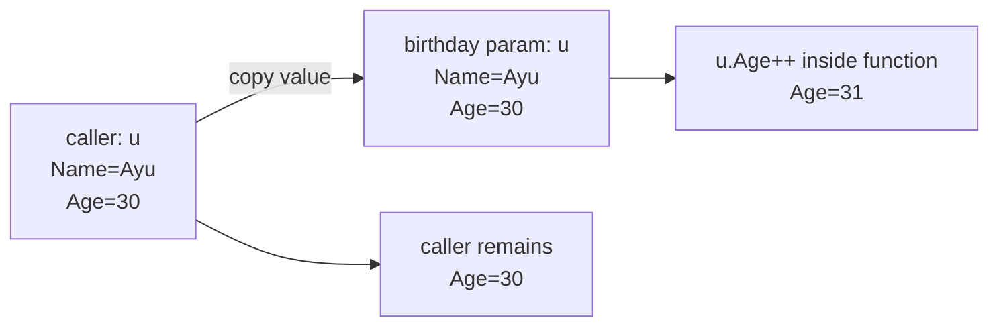
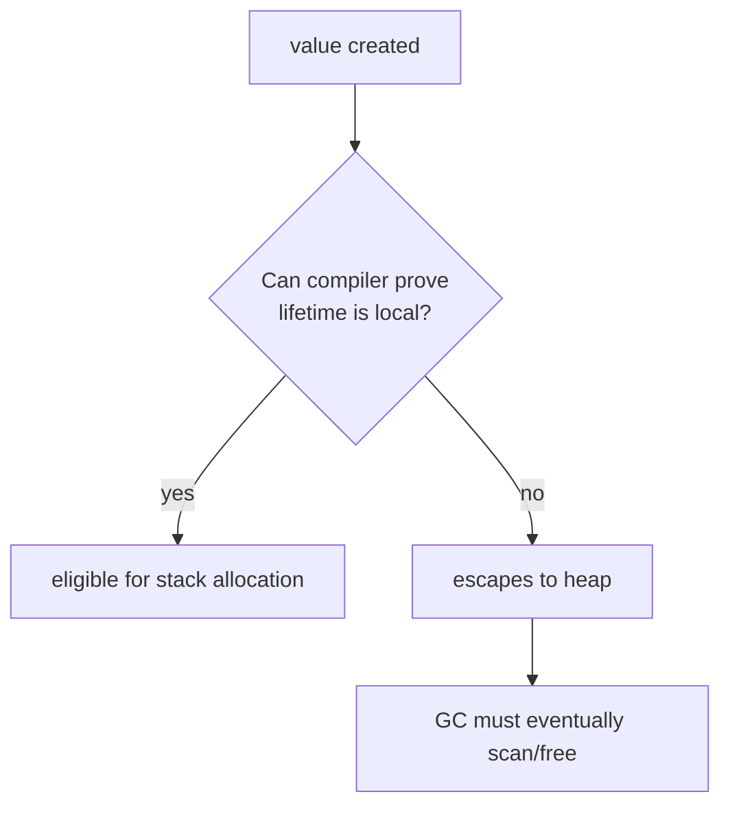
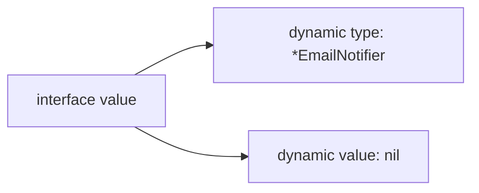
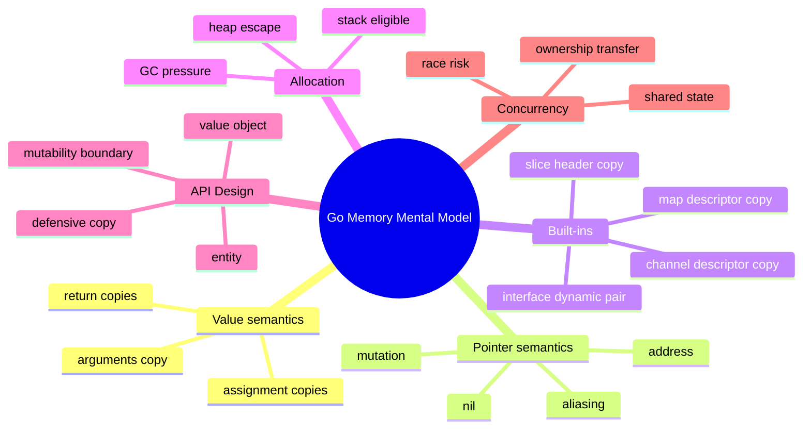

# Pointers, Memory, Allocation, dan Escape Analysis

## Posisi Part Ini dalam Framework Kaufman

Pada part sebelumnya, kita sudah membahas `struct`, method, interface, dan composition. Sekarang kita masuk ke salah satu bagian yang paling sering menyebabkan Go code terlihat benar, tetapi menyimpan bug desain: **pointer, mutability, allocation, dan ownership informal**.

Dalam framework *The First 20 Hours*, bagian ini termasuk tahap:

1. **Deconstruct the skill**  
   Kita pecah “memory di Go” menjadi value, pointer, addressability, mutability, allocation, escape, dan API boundary.

2. **Learn enough to self-correct**  
   Tujuannya bukan menjadi compiler engineer, tetapi cukup memahami sinyal compiler, allocation cost, dan bug aliasing agar bisa mengoreksi desain sendiri.

3. **Practice deliberately**  
   Latihan diarahkan ke keputusan praktis: kapan memakai value, kapan pointer, kapan copy, kapan defensive clone, dan kapan API harus immutable.

---

## Target Setelah Part Ini

Setelah menyelesaikan part ini, kamu harus bisa:

- Menjelaskan perbedaan **value semantics** dan **pointer semantics** di Go.
- Menentukan kapan method receiver sebaiknya value atau pointer.
- Membaca output escape analysis secara praktis.
- Menghindari pointer sebagai “default reflex”.
- Mendesain API dengan boundary mutability yang jelas.
- Menjelaskan kenapa slice, map, channel, function, dan interface punya karakter copy yang berbeda dari struct biasa.
- Mengenali bug akibat aliasing.
- Membuat keputusan performa berdasarkan measurement, bukan perasaan.

---

# 1. Mental Model Utama: Go Meng-copy Value

Prinsip awal:

> Assignment, argument passing, dan return value di Go bekerja dengan menyalin value.

Contoh:

```go id="o91x5u"
package main

import "fmt"

type User struct {
	Name string
	Age  int
}

func birthday(u User) {
	u.Age++
}

func main() {
	u := User{Name: "Ayu", Age: 30}

	birthday(u)

	fmt.Println(u.Age) // 30
}
```

`birthday(u)` menerima salinan `User`. Perubahan di dalam function tidak mengubah `u` di caller.

Ini berbeda dari banyak ekspektasi programmer yang datang dari Java/C#/JavaScript, karena object di sana biasanya diperlakukan melalui reference. Di Go, `struct` adalah value.

---

## 1.1 Diagram Value Copy



---

## 1.2 Value Copy Bukan Berarti Selalu Mahal

Kesalahan umum:

> “Kalau Go meng-copy value, berarti semua struct harus pointer agar cepat.”

Ini premis lemah.

Copy kecil sering lebih murah, lebih sederhana, dan lebih aman daripada pointer. Pointer bisa:

- Menambah mutability tersembunyi.
- Membuat aliasing.
- Menambah kemungkinan allocation.
- Membuat data lebih sulit dipahami di concurrent code.
- Mengurangi locality.
- Membuat API lebih sulit dijamin invariant-nya.

Di Go, pilihan value vs pointer adalah keputusan desain, bukan sekadar optimasi.

---

# 2. Pointer Basics

Pointer menyimpan alamat dari sebuah value.

```go id="j7qraj"
package main

import "fmt"

func main() {
	x := 10

	p := &x // p points to x

	fmt.Println(x)  // 10
	fmt.Println(p)  // address
	fmt.Println(*p) // 10

	*p = 20

	fmt.Println(x) // 20
}
```

Operator penting:

| Operator | Makna |
|---|---|
| `&x` | ambil address dari `x` |
| `*p` | dereference pointer `p` |
| `var p *int` | `p` adalah pointer ke `int` |
| `nil` | pointer belum menunjuk ke value |

---

## 2.1 Pointer Bisa `nil`

```go id="3675ep"
var p *int

fmt.Println(p == nil) // true
```

Dereference pointer `nil` akan panic:

```go id="ezkg1r"
var p *int

fmt.Println(*p) // panic: runtime error
```

Maka pointer dalam API berarti ada kemungkinan tambahan:

- Value tersedia.
- Value tidak tersedia (`nil`).
- Value tersedia tetapi isinya zero value.

Ini harus sengaja, bukan efek samping.

---

## 2.2 Pointer Tidak Sama dengan “Object”

Di Go, pointer bukan konsep object seperti Java reference.

```go id="vcc4uy"
type User struct {
	Name string
}

u := User{Name: "Ayu"}
p := &u
```

`p` menunjuk ke value `User`. Tetapi `User` tetap value. Pointer hanya cara mengakses value itu melalui address.

---

# 3. Function Argument: Value vs Pointer

## 3.1 Value Argument

```go id="k7e48t"
type Counter struct {
	Value int
}

func Increment(c Counter) {
	c.Value++
}

func main() {
	c := Counter{Value: 1}
	Increment(c)
	fmt.Println(c.Value) // 1
}
```

Function tidak bisa mengubah caller.

Gunakan value argument ketika:

- Function tidak perlu mengubah input.
- Struct kecil.
- Invariant lebih aman dengan copy.
- Kamu ingin caller bebas dari side effect.
- Data bersifat value object.

---

## 3.2 Pointer Argument

```go id="0bogxd"
type Counter struct {
	Value int
}

func Increment(c *Counter) {
	c.Value++
}

func main() {
	c := Counter{Value: 1}
	Increment(&c)
	fmt.Println(c.Value) // 2
}
```

Function bisa mengubah caller.

Gunakan pointer argument ketika:

- Function memang harus melakukan mutation.
- Struct besar dan copy cost relevan.
- Value mengandung synchronization primitive seperti `sync.Mutex`.
- Method harus menjaga shared state.
- Nil memiliki makna eksplisit.

---

## 3.3 Jangan Pakai Pointer Hanya karena “Biar Cepat”

Contoh API yang tidak perlu pointer:

```go id="xyhba6"
type Money struct {
	Amount   int64
	Currency string
}

func Add(a, b *Money) *Money {
	return &Money{
		Amount:   a.Amount + b.Amount,
		Currency: a.Currency,
	}
}
```

Masalah:

- `nil` tidak ditangani.
- Caller tidak tahu apakah input akan dimutasi.
- Return pointer memberi kesan shared mutable object.
- Untuk value object kecil, pointer tidak memberi manfaat desain yang jelas.

Lebih baik:

```go id="0iwajp"
type Money struct {
	Amount   int64
	Currency string
}

func Add(a, b Money) (Money, error) {
	if a.Currency != b.Currency {
		return Money{}, fmt.Errorf("currency mismatch: %s != %s", a.Currency, b.Currency)
	}

	return Money{
		Amount:   a.Amount + b.Amount,
		Currency: a.Currency,
	}, nil
}
```

`Money` adalah value object. Operasi `Add` menghasilkan value baru.

---

# 4. Addressability

Tidak semua expression bisa diambil alamatnya.

Bisa:

```go id="q449a5"
x := 10
p := &x
```

Tidak bisa:

```go id="11tdzw"
p := &10 // invalid
```

Literal tertentu bisa langsung diambil address-nya jika bentuknya composite literal:

```go id="ix64ch"
type User struct {
	Name string
}

p := &User{Name: "Ayu"}
```

---

## 4.1 Addressability dan Map Element

Map element tidak addressable.

```go id="ndzmtn"
scores := map[string]int{
	"ayu": 10,
}

p := &scores["ayu"] // invalid
```

Kenapa? Secara mental, map bisa melakukan rehash dan memindahkan bucket. Go tidak memberikan address stabil ke element map.

Jika perlu mutate value dalam map:

```go id="4tdtfn"
scores := map[string]int{
	"ayu": 10,
}

v := scores["ayu"]
v++
scores["ayu"] = v
```

Untuk struct value di map:

```go id="5ntq4l"
type User struct {
	Name string
	Age  int
}

users := map[string]User{
	"u1": {Name: "Ayu", Age: 30},
}

// users["u1"].Age++ // invalid

u := users["u1"]
u.Age++
users["u1"] = u
```

Atau gunakan pointer sebagai map value jika shared mutable entity memang disengaja:

```go id="k1y6jo"
users := map[string]*User{
	"u1": {Name: "Ayu", Age: 30},
}

users["u1"].Age++
```

Tetapi ini mengubah desain: map sekarang menyimpan reference ke entity mutable, bukan snapshot value.

---

# 5. Receiver: Value atau Pointer?

Dari Part 06, method receiver bisa value atau pointer.

```go id="8ku49x"
type Counter struct {
	Value int
}

func (c Counter) Current() int {
	return c.Value
}

func (c *Counter) Inc() {
	c.Value++
}
```

Aturan praktis:

| Kondisi | Receiver |
|---|---|
| Method harus mutate receiver | pointer |
| Struct besar | pointer, biasanya |
| Struct mengandung `sync.Mutex` atau primitive sync | pointer |
| Receiver merepresentasikan entity/stateful object | pointer, biasanya |
| Receiver merepresentasikan value object kecil | value |
| Ingin menjaga immutability | value |
| Tidak yakin dan struct kecil | mulai dengan value |

---

## 5.1 Konsistensi Receiver

Jangan campur receiver tanpa alasan kuat.

Buruk:

```go id="d06ikc"
type Account struct {
	Balance int64
}

func (a Account) BalanceValue() int64 {
	return a.Balance
}

func (a *Account) Deposit(amount int64) {
	a.Balance += amount
}

func (a Account) Withdraw(amount int64) bool {
	if a.Balance < amount {
		return false
	}
	a.Balance -= amount // mutates copy, bug
	return true
}
```

`Withdraw` terlihat seperti mutation, tetapi memakai value receiver. Ini bug desain.

Lebih benar:

```go id="hckw54"
type Account struct {
	balance int64
}

func (a *Account) Balance() int64 {
	return a.balance
}

func (a *Account) Deposit(amount int64) error {
	if amount <= 0 {
		return fmt.Errorf("amount must be positive")
	}

	a.balance += amount
	return nil
}

func (a *Account) Withdraw(amount int64) error {
	if amount <= 0 {
		return fmt.Errorf("amount must be positive")
	}
	if a.balance < amount {
		return fmt.Errorf("insufficient balance")
	}

	a.balance -= amount
	return nil
}
```

Untuk entity stateful, pointer receiver konsisten.

---

# 6. Method Set: Dampak Receiver ke Interface

Method set menentukan apakah sebuah type memenuhi interface.

```go id="oj8fmu"
type Flusher interface {
	Flush() error
}

type Buffer struct{}

func (b *Buffer) Flush() error {
	return nil
}
```

`*Buffer` memenuhi `Flusher`, tetapi `Buffer` tidak.

```go id="9vishf"
var b Buffer

var f Flusher

f = &b // ok
f = b  // compile error
```

Jika method memakai value receiver:

```go id="j2sjyt"
type Printer interface {
	Print()
}

type Report struct{}

func (r Report) Print() {}
```

Maka `Report` dan `*Report` sama-sama bisa memenuhi interface.

```go id="2ibkes"
var r Report

var p Printer

p = r  // ok
p = &r // ok
```

---

## 6.1 Rule of Thumb Method Set

Jika suatu type punya method pointer receiver, biasanya gunakan pointer ketika type itu dipakai sebagai dependency.

```go id="jcgugz"
type Store interface {
	Save(ctx context.Context, user User) error
}

type SQLStore struct {
	db *sql.DB
}

func (s *SQLStore) Save(ctx context.Context, user User) error {
	// ...
	return nil
}

func NewSQLStore(db *sql.DB) *SQLStore {
	return &SQLStore{db: db}
}
```

`SQLStore` adalah adapter stateful yang memegang dependency. Pointer masuk akal.

---

# 7. Stack vs Heap: Jangan Berpikir Terlalu Literal

Sering terdengar:

> “Local variable selalu di stack, pointer selalu di heap.”

Di Go, itu terlalu sederhana dan sering salah.

Compiler melakukan escape analysis untuk menentukan apakah sebuah value bisa tetap di stack atau harus dialokasikan di heap.

Contoh:

```go id="i9emny"
func NewCounter() *Counter {
	c := Counter{}
	return &c
}
```

`c` adalah local variable, tetapi address-nya dikembalikan. Value harus tetap hidup setelah function selesai, sehingga kemungkinan besar dialokasikan di heap.

---

## 7.1 Escape Analysis Mental Model

Sebuah value cenderung escape ke heap jika:

- Address-nya dikembalikan dari function.
- Disimpan ke interface yang tidak bisa dianalisis cukup spesifik oleh compiler.
- Ditangkap closure yang hidup lebih lama.
- Disimpan ke heap object lain.
- Ukurannya terlalu besar untuk stack dalam kondisi tertentu.
- Dipakai dengan cara yang membuat lifetime tidak bisa dibuktikan aman di stack.



Catatan penting:

- Stack vs heap adalah detail implementasi, bukan bagian dari kontrak bahasa.
- Jangan menulis API hanya demi memaksa stack.
- Gunakan escape analysis sebagai alat diagnosis, bukan agama desain.

---

# 8. Membaca Escape Analysis

Kamu bisa meminta compiler menjelaskan keputusan escape:

```bash id="migcc1"
go build -gcflags="-m=2" ./...
```

Contoh file:

```go id="6p4san"
// main.go
package main

type User struct {
	Name string
}

func NewUser(name string) *User {
	u := User{Name: name}
	return &u
}

func main() {
	_ = NewUser("Ayu")
}
```

Jalankan:

```bash id="i8dnzv"
go build -gcflags="-m=2"
```

Output bisa berisi sinyal seperti:

```txt id="rlw9g7"
u escapes to heap
```

Maknanya: compiler memutuskan `u` harus hidup di luar frame function lokal.

---

## 8.1 Jangan Panik Ketika Ada Escape

Escape bukan otomatis buruk. Banyak program Go produksi memiliki allocation heap yang wajar.

Yang perlu dicurigai:

- Allocation tinggi pada hot path.
- Allocation per request terlalu besar.
- Allocation muncul dari helper yang dipanggil sangat sering.
- Allocation disebabkan interface/closure yang bisa dihindari tanpa mengorbankan desain.
- Allocation menyebabkan GC pressure dan latency spike.

---

# 9. Allocation Cost Model

Allocation di Go punya beberapa biaya:

1. **Biaya membuat object**
2. **Biaya bookkeeping allocator**
3. **Biaya scan GC jika object mengandung pointer**
4. **Biaya cache locality**
5. **Biaya lifetime yang lebih panjang dari kebutuhan sebenarnya**

Tapi bukan berarti semua allocation harus dihindari. Engineering yang baik adalah menyeimbangkan:

- Correctness
- Readability
- API stability
- Latency
- Throughput
- Operability
- Maintainability

---

## 9.1 Allocation di Hot Path

Misalnya HTTP handler:

```go id="ac3e2n"
func (h *Handler) ServeHTTP(w http.ResponseWriter, r *http.Request) {
	reqID := fmt.Sprintf("%s:%d", r.URL.Path, time.Now().UnixNano())
	_ = reqID

	// ...
}
```

`fmt.Sprintf` nyaman, tetapi bisa melakukan allocation. Jika handler dipanggil ribuan kali per detik, ini mungkin relevan.

Tapi jangan langsung optimasi. Ukur dulu:

```bash id="9m9t56"
go test -bench=. -benchmem ./...
```

---

# 10. Nil Pointer sebagai Bagian dari Desain API

Pointer memperkenalkan state tambahan: `nil`.

Contoh buruk:

```go id="f52rmd"
func SendEmail(user *User) error {
	if user.Email == "" {
		return fmt.Errorf("email required")
	}

	// ...
	return nil
}
```

Jika caller mengirim `nil`, function panic.

Lebih baik:

```go id="8qw9s4"
func SendEmail(user User) error {
	if user.Email == "" {
		return fmt.Errorf("email required")
	}

	return nil
}
```

Atau jika `nil` memang valid:

```go id="zsk3zg"
func SendEmail(user *User) error {
	if user == nil {
		return fmt.Errorf("user required")
	}
	if user.Email == "" {
		return fmt.Errorf("email required")
	}

	return nil
}
```

Pertanyaan desain:

> Apakah absence harus direpresentasikan sebagai nil pointer, atau sebagai result `(T, bool)`, `(T, error)`, atau zero value?

---

## 10.1 Pattern Lookup

Untuk lookup, Go sering memakai `(value, bool)`:

```go id="2sq1mw"
user, ok := users[id]
if !ok {
	return User{}, false
}
```

Untuk lookup yang bisa gagal karena infrastructure/domain error:

```go id="dfklbj"
user, err := repo.FindByID(ctx, id)
if err != nil {
	return User{}, err
}
```

Hindari `*User` hanya untuk menyatakan “tidak ditemukan” jika error semantics lebih kaya dibutuhkan.

---

# 11. Value Object vs Entity

Go tidak memaksa DDD, tetapi perbedaan ini berguna.

## 11.1 Value Object

Ciri:

- Diidentifikasi oleh isi.
- Immutable secara konseptual.
- Aman di-copy.
- Operasi menghasilkan value baru.
- Cocok memakai value receiver.

Contoh:

```go id="7sm4r9"
type Email string

func NewEmail(raw string) (Email, error) {
	if !strings.Contains(raw, "@") {
		return "", fmt.Errorf("invalid email")
	}
	return Email(strings.ToLower(raw)), nil
}

func (e Email) Domain() string {
	parts := strings.SplitN(string(e), "@", 2)
	if len(parts) != 2 {
		return ""
	}
	return parts[1]
}
```

## 11.2 Entity

Ciri:

- Punya identity.
- Bisa berubah sepanjang waktu.
- Invariant harus dijaga.
- Mutasi biasanya melalui method.
- Cocok memakai pointer receiver.

```go id="hhnrwf"
type Account struct {
	id      string
	balance int64
}

func NewAccount(id string) *Account {
	return &Account{id: id}
}

func (a *Account) Deposit(amount int64) error {
	if amount <= 0 {
		return fmt.Errorf("amount must be positive")
	}

	a.balance += amount
	return nil
}
```

---

# 12. Copy Semantics untuk Built-in Types

Tidak semua copy sama dampaknya.

| Type | Ketika di-copy | Dampak |
|---|---|---|
| `int`, `bool`, `float64` | value disalin | independen |
| `struct` | semua field disalin | field pointer/slice/map tetap berbagi referensi internal |
| array | semua elemen disalin | copy penuh |
| slice | header disalin | backing array dibagi |
| map | descriptor disalin | data map dibagi |
| channel | descriptor disalin | channel sama |
| function | descriptor disalin | function sama |
| interface | dynamic type + value disalin | tergantung value di dalamnya |
| pointer | address disalin | object sama |

---

## 12.1 Slice Copy Bukan Deep Copy

```go id="7cfmx1"
a := []int{1, 2, 3}
b := a

b[0] = 99

fmt.Println(a) // [99 2 3]
```

`a` dan `b` punya slice header berbeda, tetapi backing array sama.

Deep copy:

```go id="unr8yc"
a := []int{1, 2, 3}

b := make([]int, len(a))
copy(b, a)

b[0] = 99

fmt.Println(a) // [1 2 3]
fmt.Println(b) // [99 2 3]
```

---

## 12.2 Struct dengan Slice Field

```go id="byv6fb"
type Batch struct {
	Items []string
}

func main() {
	a := Batch{Items: []string{"a", "b"}}
	b := a

	b.Items[0] = "x"

	fmt.Println(a.Items) // [x b]
}
```

Struct-nya di-copy, tetapi slice field tetap menunjuk backing array sama.

Jika ingin defensive copy:

```go id="34ds4e"
func NewBatch(items []string) Batch {
	cp := make([]string, len(items))
	copy(cp, items)

	return Batch{Items: cp}
}
```

---

# 13. Mutability Boundary

Mutability boundary menjawab:

> Siapa yang boleh mengubah data ini setelah dibuat?

Contoh API bocor:

```go id="tk8vdo"
type Config struct {
	AllowedHosts []string
}

func NewConfig(hosts []string) Config {
	return Config{AllowedHosts: hosts}
}
```

Caller masih bisa mengubah `hosts` setelah config dibuat.

```go id="21awxr"
hosts := []string{"a.com", "b.com"}
cfg := NewConfig(hosts)

hosts[0] = "evil.com"

fmt.Println(cfg.AllowedHosts) // [evil.com b.com]
```

Lebih aman:

```go id="wu9drz"
type Config struct {
	allowedHosts []string
}

func NewConfig(hosts []string) Config {
	cp := make([]string, len(hosts))
	copy(cp, hosts)

	return Config{allowedHosts: cp}
}

func (c Config) AllowedHosts() []string {
	cp := make([]string, len(c.allowedHosts))
	copy(cp, c.allowedHosts)

	return cp
}
```

Trade-off:

- Lebih banyak allocation.
- Lebih aman.
- Invariant tidak bisa dirusak caller.

Untuk config/security/domain invariant, defensive copy sering layak.

---

# 14. Ownership Informal di Go

Go tidak punya ownership system seperti Rust. Tapi Go engineer tetap harus berpikir tentang ownership secara informal.

Pertanyaan ownership:

- Siapa pemilik data?
- Siapa boleh mutate?
- Apakah caller boleh menyimpan reference?
- Apakah callee boleh menyimpan input?
- Apakah return value aman diubah caller?
- Apakah data boleh dipakai lintas goroutine?

Contoh dokumentasi ownership:

```go id="mhm95y"
// NewConfig creates a Config from hosts.
//
// The caller may reuse or mutate hosts after this function returns;
// NewConfig makes its own copy.
func NewConfig(hosts []string) Config {
	cp := append([]string(nil), hosts...)
	return Config{allowedHosts: cp}
}
```

Atau:

```go id="g36dbx"
// UseBuffer writes into buf. The caller owns buf and may reuse it only
// after UseBuffer returns.
func UseBuffer(buf []byte) error {
	// ...
	return nil
}
```

Documentation matters when ownership cannot be enforced by type system.

---

# 15. Pointer dan Concurrency

Pointer yang dibagikan lintas goroutine berarti shared mutable state.

```go id="e72g14"
type Counter struct {
	Value int
}

func main() {
	c := &Counter{}

	go func() {
		c.Value++
	}()

	go func() {
		c.Value++
	}()
}
```

Ini data race.

Solusi:

1. Hindari shared mutable state.
2. Gunakan channel untuk ownership transfer.
3. Gunakan mutex/atomic jika shared state memang diperlukan.
4. Copy data sebelum dikirim ke goroutine jika tidak ingin shared mutation.

---

## 15.1 Copy untuk Goroutine Safety

```go id="7n6e1a"
func process(users []User) {
	for _, user := range users {
		user := user // explicit per-iteration copy

		go func() {
			fmt.Println(user.Name)
		}()
	}
}
```

Pada Go modern, range variable semantics sudah diperbaiki dibanding versi lama, tetapi explicit copy tetap bisa meningkatkan kejelasan ketika code harus sangat mudah dibaca atau kompatibilitas lama relevan.

---

# 16. Pointer to Interface: Hampir Selalu Salah

Interface sudah merupakan descriptor yang bisa menyimpan dynamic value.

Biasanya jangan pakai pointer ke interface:

```go id="vi7kjr"
func UseStore(s *Store) { // buruk jika Store adalah interface
	// ...
}
```

Lebih benar:

```go id="zs7mrf"
func UseStore(s Store) {
	// ...
}
```

Pointer ke interface biasanya hanya diperlukan pada kasus sangat khusus seperti reflection atau mutation terhadap variable interface itu sendiri. Untuk application code biasa, anggap itu code smell.

---

# 17. Interface Value dan Nil Trap

Ini bug klasik Go.

```go id="f26ufp"
type Notifier interface {
	Notify() error
}

type EmailNotifier struct{}

func (e *EmailNotifier) Notify() error {
	return nil
}

func NewNotifier(disabled bool) Notifier {
	if disabled {
		var n *EmailNotifier = nil
		return n
	}

	return &EmailNotifier{}
}

func main() {
	n := NewNotifier(true)

	fmt.Println(n == nil) // false
}
```

Kenapa? Interface value terdiri dari dynamic type dan dynamic value.



Interface dianggap `nil` hanya jika dynamic type dan dynamic value sama-sama nil.

Lebih baik:

```go id="9r6ej5"
func NewNotifier(disabled bool) Notifier {
	if disabled {
		return nil
	}

	return &EmailNotifier{}
}
```

---

# 18. `new` vs Composite Literal vs `make`

## 18.1 `new`

`new(T)` mengalokasikan zero value `T` dan mengembalikan `*T`.

```go id="dr7xan"
p := new(User)
```

Setara secara konseptual dengan:

```go id="2s4cj9"
u := User{}
p := &u
```

## 18.2 Composite Literal

```go id="3kq5k0"
u := &User{Name: "Ayu"}
```

Lebih umum dan lebih ekspresif untuk struct.

## 18.3 `make`

`make` dipakai untuk slice, map, dan channel.

```go id="7ee82g"
s := make([]int, 0, 10)
m := make(map[string]int)
ch := make(chan Job, 100)
```

`make` menginisialisasi runtime descriptor/internal structure, bukan mengembalikan pointer.

---

# 19. Pointer API Design Checklist

Sebelum memakai pointer dalam API, jawab:

1. Apakah function harus mutate input?
2. Apakah `nil` adalah state valid?
3. Apakah struct cukup besar sehingga copy cost relevan?
4. Apakah type mengandung mutex atau resource handle?
5. Apakah value akan dipakai lintas goroutine?
6. Apakah caller boleh menyimpan reference?
7. Apakah callee boleh menyimpan input?
8. Apakah API jadi lebih mudah dites?
9. Apakah pointer membuat invariant lebih mudah atau lebih sulit dijaga?
10. Apakah measurement membuktikan pointer dibutuhkan untuk performa?

Jika sebagian besar jawabannya “tidak”, pakai value.

---

# 20. Case Study: Mendesain Domain API

## 20.1 Desain Awal yang Bermasalah

```go id="rzzbun"
type Order struct {
	ID     string
	Items []Item
	Total int64
}

func NewOrder(id string, items []Item) *Order {
	total := int64(0)
	for _, item := range items {
		total += item.Price
	}

	return &Order{
		ID:     id,
		Items: items,
		Total: total,
	}
}
```

Masalah:

- `Items` exported dan mutable.
- Slice tidak di-copy.
- Caller bisa mengubah items setelah order dibuat.
- `Total` bisa tidak konsisten dengan `Items`.
- Pointer return membuat kesan entity mutable tanpa invariant methods.
- Tidak ada validation.

---

## 20.2 Desain Lebih Defensif

```go id="ka0d0q"
type Item struct {
	SKU   string
	Price int64
}

type Order struct {
	id    string
	items []Item
	total int64
}

func NewOrder(id string, items []Item) (Order, error) {
	if id == "" {
		return Order{}, fmt.Errorf("order id required")
	}
	if len(items) == 0 {
		return Order{}, fmt.Errorf("order requires at least one item")
	}

	cp := make([]Item, len(items))
	copy(cp, items)

	total := int64(0)
	for _, item := range cp {
		if item.SKU == "" {
			return Order{}, fmt.Errorf("item sku required")
		}
		if item.Price < 0 {
			return Order{}, fmt.Errorf("item price must not be negative")
		}
		total += item.Price
	}

	return Order{
		id:    id,
		items: cp,
		total: total,
	}, nil
}

func (o Order) ID() string {
	return o.id
}

func (o Order) Total() int64 {
	return o.total
}

func (o Order) Items() []Item {
	cp := make([]Item, len(o.items))
	copy(cp, o.items)
	return cp
}
```

Di sini `Order` diperlakukan sebagai immutable value setelah dibuat.

Jika order harus punya lifecycle mutable seperti `Pay`, `Cancel`, `Ship`, maka pointer receiver masuk akal:

```go id="q0a4qi"
type OrderStatus string

const (
	OrderPending OrderStatus = "pending"
	OrderPaid    OrderStatus = "paid"
	OrderCanceled OrderStatus = "canceled"
)

type Order struct {
	id     string
	status OrderStatus
}

func NewOrder(id string) *Order {
	return &Order{
		id:     id,
		status: OrderPending,
	}
}

func (o *Order) Pay() error {
	if o.status != OrderPending {
		return fmt.Errorf("cannot pay order in status %s", o.status)
	}

	o.status = OrderPaid
	return nil
}
```

Desain tergantung model domain, bukan kebiasaan pointer.

---

# 21. Latihan Terarah

## Latihan 1 — Value vs Pointer

Buat type:

```go id="lk7u7i"
type Temperature struct {
	Celsius float64
}
```

Tambahkan method:

- `Fahrenheit() float64`
- `Add(delta float64) Temperature`
- `Normalize() Temperature`

Gunakan value receiver. Jelaskan kenapa.

---

## Latihan 2 — Entity Mutable

Buat type:

```go id="u2rpxc"
type Wallet struct {
	balance int64
}
```

Tambahkan:

- `Deposit(amount int64) error`
- `Withdraw(amount int64) error`
- `Balance() int64`

Gunakan pointer receiver untuk mutation dan value return untuk getter.

---

## Latihan 3 — Defensive Copy

Buat `Config` dengan field internal:

```go id="in1uet"
type Config struct {
	allowedCIDRs []string
}
```

Tambahkan:

- `NewConfig(cidrs []string) Config`
- `AllowedCIDRs() []string`

Pastikan caller tidak bisa mengubah internal state.

---

## Latihan 4 — Escape Analysis

Buat file dengan function:

```go id="13utgb"
func NewUser(name string) *User
func BuildUser(name string) User
func CaptureUser(name string) func() string
```

Jalankan:

```bash id="x8y9tn"
go build -gcflags="-m=2"
```

Catat:

- Value mana yang escape?
- Kenapa?
- Apakah escape itu problem nyata?

---

## Latihan 5 — Nil Interface Trap

Buat interface `Notifier` dan implementasi `EmailNotifier`.

Buat function yang salah:

```go id="xzkokp"
func NewNotifier(disabled bool) Notifier
```

yang mengembalikan typed nil.

Tulis test yang membuktikan `n != nil`, lalu perbaiki.

---

# 22. Checklist Review Part 07

Gunakan checklist ini saat review Go code:

- [ ] Apakah pointer dipakai karena kebutuhan desain, bukan kebiasaan?
- [ ] Apakah `nil` sebagai state API terdokumentasi?
- [ ] Apakah receiver method konsisten?
- [ ] Apakah mutable entity menggunakan pointer receiver?
- [ ] Apakah value object aman di-copy?
- [ ] Apakah slice/map field tidak membocorkan internal state?
- [ ] Apakah defensive copy dibutuhkan di boundary?
- [ ] Apakah map element mutation ditulis dengan benar?
- [ ] Apakah pointer to interface dihindari?
- [ ] Apakah nil interface trap mungkin terjadi?
- [ ] Apakah allocation di hot path sudah diukur?
- [ ] Apakah escape analysis dipakai sebagai diagnosis, bukan dogma?
- [ ] Apakah shared pointer lintas goroutine aman?
- [ ] Apakah ownership data jelas dari API atau doc comment?

---

# 23. Ringkasan Mental Model



Go tidak membuat memory management hilang. Go membuatnya lebih eksplisit pada level API.

Pointer adalah alat. Bukan default.

Value adalah default yang baik untuk banyak model.

Allocation adalah sinyal. Bukan dosa.

Escape analysis adalah alat observasi. Bukan pengganti desain.

Mutability boundary adalah inti dari Go code yang bisa dipertahankan dalam sistem besar.
