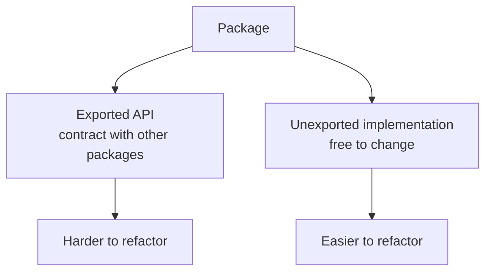
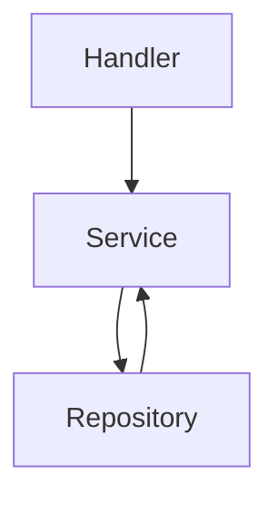
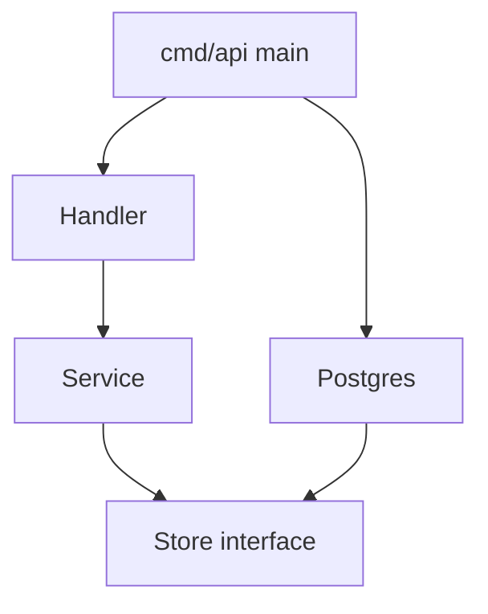
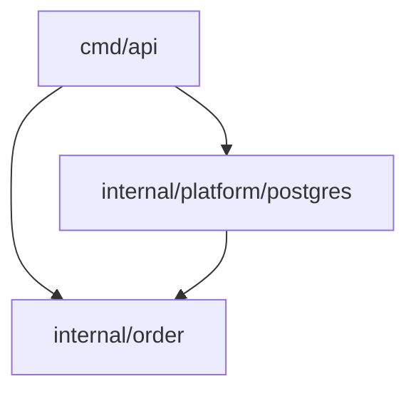
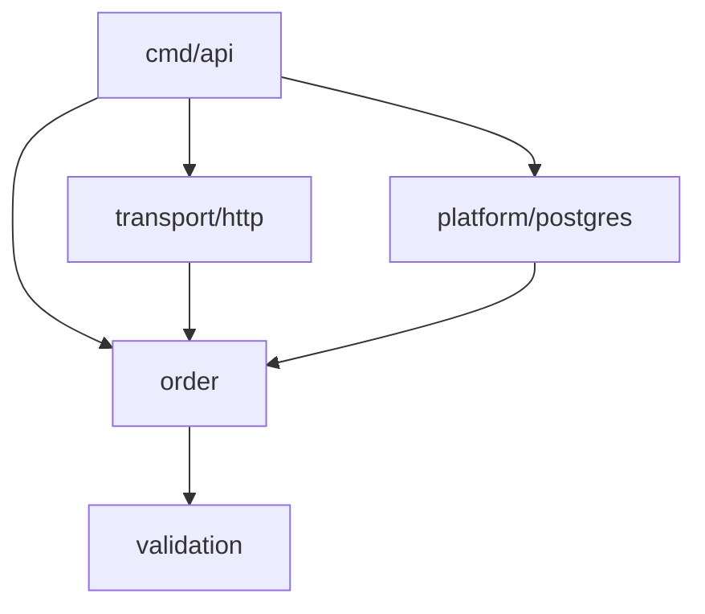
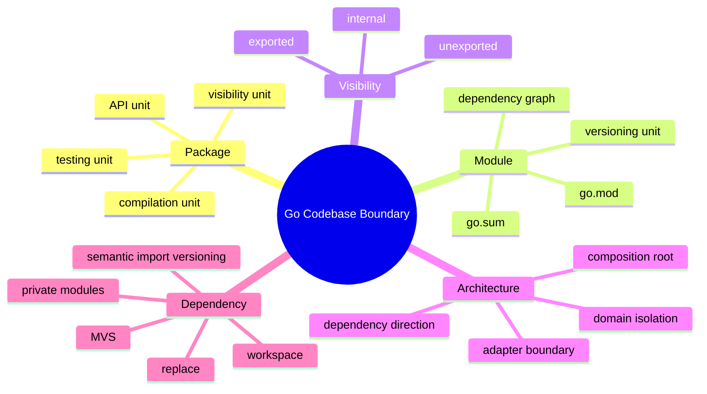

# Packages, Modules, Visibility, dan Dependency Boundaries

## Posisi Part Ini dalam Framework Kaufman

Setelah memahami value, pointer, dan memory boundary, sekarang kita naik satu level: **package dan module boundary**.

Banyak programmer bisa menulis function Go yang benar, tetapi kesulitan membuat codebase Go yang mudah tumbuh. Penyebabnya sering bukan syntax, tetapi boundary:

- Package terlalu besar.
- Package terlalu kecil.
- Interface diletakkan di tempat yang salah.
- Dependency direction kacau.
- Import cycle muncul.
- `internal` tidak dimanfaatkan.
- `go.mod` diperlakukan sebagai file ajaib.
- `replace` dibiarkan masuk ke production.
- Module dipecah terlalu cepat.

Dalam framework Kaufman, part ini adalah tahap **deconstruction** untuk skill desain codebase Go.

---

## Target Setelah Part Ini

Setelah part ini, kamu harus bisa:

- Membedakan package, module, repository, dan binary.
- Mendesain package boundary yang stabil.
- Memakai exported/unexported identifiers secara sengaja.
- Menggunakan `internal` untuk membatasi akses.
- Membaca dan merawat `go.mod` serta `go.sum`.
- Memahami `require`, `replace`, `exclude`, `retract`, dan workspace.
- Menghindari import cycle dengan dependency direction yang sehat.
- Mendesain struktur project Go untuk service produksi.
- Menentukan kapan perlu multi-module dan kapan cukup single module.
- Membuat dependency boundary yang mendukung testing, refactoring, dan operability.

---

# 1. Mental Model: Package Adalah Unit Desain Utama Go

Di Go, package bukan sekadar folder. Package adalah unit:

- Compilation
- Visibility
- Documentation
- Testing
- API
- Dependency
- Review
- Ownership

Setiap file `.go` dalam directory yang sama harus memiliki package name yang sama, kecuali file test eksternal dengan suffix `_test`.

Contoh:

```txt id="7x7fms"
billing/
  invoice.go
  payment.go
  tax.go
```

Semua file:

```go id="qhwzd8"
package billing
```

Dari luar package, user memakai exported identifiers:

```go id="h5xvqx"
invoice, err := billing.NewInvoice(...)
```

Package yang baik biasanya punya:

- Nama singkat.
- Satu alasan untuk berubah.
- API kecil.
- Internal detail tersembunyi.
- Test yang menjelaskan behavior.
- Dependency yang masuk akal.

---

## 1.1 Package Bukan Layer Otomatis

Ini struktur yang sering salah:

```txt id="02hhfs"
project/
  models/
  services/
  repositories/
  handlers/
  utils/
```

Masalah:

- Package dinamai berdasarkan technical layer, bukan domain capability.
- `models` jadi tempat semua orang menaruh data.
- `utils` jadi tempat sampah.
- Dependency mudah menyilang.
- Boundary domain lemah.

Lebih baik mulai dari capability:

```txt id="b7hmcf"
project/
  order/
  payment/
  customer/
  notification/
```

Atau untuk service kecil:

```txt id="4mo584"
project/
  internal/
    order/
    payment/
    platform/
```

Go cenderung lebih sehat jika package merepresentasikan **cohesive behavior**, bukan sekadar kategori teknis.

---

# 2. Package Name vs Import Path vs Module Path

Ini tiga konsep berbeda.

## 2.1 Package Name

Ditulis di atas file:

```go id="bn6gs3"
package billing
```

Package name adalah nama yang dipakai ketika code di-import.

```go id="urjhe7"
billing.NewInvoice(...)
```

## 2.2 Import Path

Path lengkap untuk mengimpor package:

```go id="kd66x4"
import "github.com/acme/shop/internal/billing"
```

## 2.3 Module Path

Didefinisikan di `go.mod`:

```go id="ig2al9"
module github.com/acme/shop
```

Import path package biasanya:

```txt id="1qj4cj"
<module-path>/<subdirectory>
```

Contoh:

```txt id="fx80g3"
module path:  github.com/acme/shop
directory:    internal/billing
import path:  github.com/acme/shop/internal/billing
package name: billing
```

---

# 3. Exported dan Unexported Identifiers

Go memakai huruf pertama untuk visibility:

- `User` exported
- `NewUser` exported
- `user` unexported
- `newUser` unexported

Contoh:

```go id="d6hk6h"
package account

type Account struct {
	id      string
	balance int64
}

func NewAccount(id string) *Account {
	return &Account{id: id}
}

func (a *Account) Balance() int64 {
	return a.balance
}
```

Dari luar package:

```go id="4z3es3"
acc := account.NewAccount("acc-1")

fmt.Println(acc.Balance())

// acc.balance // compile error
```

Visibility di Go adalah desain API.

---

## 3.1 Export Sekecil Mungkin

Jangan export hanya karena “mungkin nanti perlu”.

Buruk:

```go id="fr483s"
type Account struct {
	ID      string
	Balance int64
	Status  string
}
```

Semua field bisa diubah dari luar. Invariant hilang.

Lebih baik:

```go id="vc1mhc"
type Account struct {
	id      string
	balance int64
	status  Status
}

func (a *Account) ID() string {
	return a.id
}

func (a *Account) Balance() int64 {
	return a.balance
}
```

Export adalah komitmen. Setelah dipakai package lain, mengubahnya bisa menjadi breaking change.

---

# 4. Package API Surface

Package API surface adalah semua exported identifiers:

- Exported type
- Exported function
- Exported method
- Exported const
- Exported var
- Exported field
- Exported interface

Semakin besar surface, semakin mahal maintenance.



Tujuan desain package:

> Buat exported API sekecil mungkin, tetapi cukup ekspresif untuk use case nyata.

---

# 5. Naming Package

Package name harus:

- Singkat.
- Lowercase.
- Tidak pakai underscore.
- Tidak redundant dengan parent path.
- Menjelaskan konsep, bukan implementasi berlebihan.
- Enak dibaca di call site.

Buruk:

```go id="98abxe"
import "github.com/acme/shop/internal/order/orderutils"

orderutils.CalculateOrderTotal(order)
```

Lebih baik:

```go id="rxqzug"
import "github.com/acme/shop/internal/order"

order.Total()
```

Atau:

```go id="ey5obp"
import "github.com/acme/shop/internal/pricing"

pricing.Calculate(order)
```

---

## 5.1 Hindari Package Stutter

Jika package bernama `user`, jangan export type `UserService` hanya karena kebiasaan.

```go id="lqk4cw"
user.UserService
user.UserRepository
user.UserModel
```

Kadang masih masuk akal, tapi sering stutter.

Lebih baik:

```go id="7s2lkg"
user.Service
user.Repository
user.Record
```

Atau lebih domain-specific:

```go id="dpuhqp"
identity.Service
identity.Store
identity.Profile
```

Call site matters.

---

# 6. `internal` Package

Directory bernama `internal` punya aturan khusus: package di dalamnya hanya bisa di-import oleh code yang berada di parent tree dari `internal`.

Contoh:

```txt id="uomjlt"
github.com/acme/shop/
  internal/
    billing/
    payment/
  cmd/
    api/
```

Package `github.com/acme/shop/internal/billing` bisa di-import oleh:

```txt id="zuu4wp"
github.com/acme/shop/cmd/api
github.com/acme/shop/internal/payment
github.com/acme/shop/internal/...
```

Tetapi tidak bisa di-import oleh module luar:

```txt id="nnnsza"
github.com/other/app
```

`internal` adalah cara Go memberi encapsulation pada level repository/module.

---

## 6.1 Kapan Memakai `internal`

Gunakan `internal` untuk:

- Application code yang bukan library public.
- Adapter database.
- HTTP handler internal.
- Implementation detail.
- Package yang boleh berubah tanpa compatibility guarantee.
- Service production yang tidak dimaksudkan sebagai reusable SDK.

Contoh struktur:

```txt id="5uhjra"
shop/
  go.mod
  cmd/
    api/
      main.go
  internal/
    order/
      order.go
      service.go
      store.go
    payment/
      payment.go
    platform/
      postgres/
      httpserver/
```

Untuk sebagian besar backend service, default yang sehat adalah: taruh implementation di `internal`.

---

# 7. `pkg` Directory: Jangan Otomatis

Banyak repo Go lama memakai:

```txt id="jcz8br"
pkg/
```

`pkg` bukan keyword khusus di Go. Ini hanya convention komunitas.

Gunakan `pkg` jika:

- Package memang dimaksudkan untuk di-import oleh repo/module lain.
- API-nya punya compatibility expectation.
- Kamu siap mendokumentasikan dan mempertahankannya.

Jangan gunakan `pkg` hanya karena template.

Untuk service internal, sering lebih baik:

```txt id="jrj5el"
internal/
```

daripada:

```txt id="4vcdab"
pkg/
```

Karena `internal` memberi enforcement compiler-level.

---

# 8. Module: Unit Versioning dan Dependency Management

Module adalah kumpulan package yang versioned bersama.

File utama:

```txt id="70ugfi"
go.mod
```

Contoh:

```go id="kfqn9z"
module github.com/acme/shop

go 1.26

require (
	github.com/jackc/pgx/v5 v5.7.0
	github.com/go-chi/chi/v5 v5.2.0
)
```

Module menjawab:

- Ini project apa?
- Path import root-nya apa?
- Minimal Go version/language version apa?
- Dependency apa yang dibutuhkan?
- Versi dependency mana yang dipakai?

---

## 8.1 Repository vs Module

Satu repository bisa punya satu module:

```txt id="s9z2jy"
shop/
  go.mod
  cmd/
  internal/
```

Atau beberapa module:

```txt id="8wdb65"
platform/
  service-a/
    go.mod
  service-b/
    go.mod
  libs/
    auth/
      go.mod
```

Default untuk mulai:

> Satu repository, satu module.

Pecah menjadi multi-module hanya jika ada alasan kuat:

- Release cadence berbeda.
- Ownership berbeda.
- Dependency graph terlalu berat.
- Library benar-benar dipakai banyak service.
- Compatibility boundary dibutuhkan.
- Build/test isolation sangat penting.

Multi-module terlalu awal meningkatkan overhead.

---

# 9. `go.mod`

`go.mod` bukan file yang diedit sembarangan setiap saat. Ia adalah kontrak module.

Directive umum:

| Directive | Fungsi |
|---|---|
| `module` | path module |
| `go` | minimum language/toolchain semantics |
| `require` | dependency module |
| `replace` | mengganti source dependency |
| `exclude` | melarang versi tertentu |
| `retract` | menyatakan versi module tidak seharusnya dipakai |
| `toolchain` | menyarankan toolchain Go tertentu |
| `godebug` | default GODEBUG behavior untuk main package/module |

Contoh:

```go id="x7bhxs"
module github.com/acme/shop

go 1.26

require github.com/google/uuid v1.6.0
```

---

## 9.1 `go mod tidy`

Gunakan:

```bash id="3cibzd"
go mod tidy
```

Untuk:

- Menambah dependency yang benar-benar dipakai.
- Menghapus dependency yang tidak dipakai.
- Memperbarui `go.sum`.
- Menjaga module graph tetap bersih.

Praktik sehat:

```bash id="jrmhdo"
go test ./...
go mod tidy
git diff -- go.mod go.sum
```

Pastikan perubahan dependency memang disengaja.

---

# 10. `go.sum`

`go.sum` berisi checksum cryptographic untuk module content yang dipakai atau dibutuhkan untuk verifikasi.

Kesalahan umum:

> “go.sum itu lock file.”

Tidak persis. `go.sum` bukan lock file seperti `package-lock.json`. Go memakai minimal version selection dan module graph untuk menentukan versi. `go.sum` membantu verifikasi integritas module.

Praktik:

- Commit `go.sum`.
- Jangan edit manual.
- Biarkan `go mod tidy` dan `go` command mengelolanya.
- Review perubahan `go.sum` saat dependency berubah.

---

# 11. Minimal Version Selection

Go modules menggunakan pendekatan **minimal version selection**.

Mental model sederhana:

- Setiap module menyatakan minimum version dependency yang dibutuhkan.
- Build memilih versi minimum yang memenuhi seluruh requirement.
- Go tidak otomatis memilih versi terbaru hanya karena tersedia.

Contoh:

```txt id="i4b5ir"
main requires A v1.2.0
B requires A v1.4.0

selected A = v1.4.0
```

Ini membuat build lebih predictable dibanding resolver yang selalu mencari versi tertinggi berdasarkan range fleksibel.

---

# 12. Semantic Import Versioning

Untuk major version v2 ke atas, module path harus memuat suffix major version.

Contoh:

```go id="gdf40f"
module github.com/acme/lib/v2
```

Import:

```go id="i3ogk4"
import "github.com/acme/lib/v2"
```

Kenapa? Karena v2 dianggap breaking API. Dengan suffix path, Go memungkinkan v1 dan v2 coexist dalam build yang sama.

Contoh:

```go id="2r31p4"
import (
	libv1 "github.com/acme/lib"
	libv2 "github.com/acme/lib/v2"
)
```

---

# 13. `replace`: Berguna, tapi Berbahaya Jika Lupa

`replace` mengalihkan dependency ke path atau versi lain.

Contoh lokal:

```go id="e1btys"
replace github.com/acme/payments => ../payments
```

Berguna untuk development multi-repo lokal.

Tapi berbahaya jika masuk production tanpa sengaja:

- Build orang lain bisa gagal karena path lokal tidak ada.
- CI tidak reproducible.
- Release artifact tergantung state lokal.
- Dependency graph tidak jelas.

Praktik:

- Pakai `replace` lokal hanya sementara.
- Review `go.mod` sebelum commit.
- Untuk multi-module lokal, pertimbangkan `go work`.
- Untuk fork production, dokumentasikan alasannya dengan jelas.

---

# 14. Workspace dengan `go.work`

Workspace memungkinkan beberapa module lokal dipakai bersama tanpa mengubah `go.mod` masing-masing.

Contoh:

```bash id="9pe8m5"
go work init ./shop ./payments
```

Menghasilkan:

```go id="lmxsl9"
go 1.26

use (
	./shop
	./payments
)
```

Gunakan workspace untuk:

- Mengembangkan beberapa module lokal bersamaan.
- Menghindari `replace` lokal di `go.mod`.
- Memudahkan monorepo multi-module.
- Testing integrasi antar module lokal.

Praktik:

- Jangan otomatis commit `go.work` jika isinya spesifik environment developer.
- Commit `go.work` hanya jika workspace adalah bagian resmi workflow repo.

---

# 15. Private Modules

Untuk private module, Go command perlu tahu domain mana yang privat agar tidak mencoba memakai public proxy/checksum database.

Environment penting:

```bash id="y048uj"
go env -w GOPRIVATE=github.com/acme/*
```

Bisa juga:

```bash id="5t3jo5"
export GOPRIVATE=github.com/acme/*
```

Pertimbangkan juga:

- Access token Git.
- CI credentials.
- `GONOSUMDB`
- `GONOPROXY`
- Corporate module proxy.

Security point:

> Jangan membocorkan private module path ke public proxy jika organisasi melarangnya.

---

# 16. Dependency Direction

Dependency direction harus mudah digambar.

Buruk:



`Repository --> Service` menciptakan cycle.

Lebih baik:



Namun di Go, implementasi interface tidak perlu import interface secara eksplisit. Pattern yang lebih umum:

```txt id="519owy"
internal/order/
  service.go    // defines Store interface needed by Service
internal/platform/postgres/
  order_store.go // implements order.Store
cmd/api/
  main.go       // wires them together
```

Dependency:



`order` tidak import `postgres`.

Domain/application package mendefinisikan interface kecil yang dibutuhkannya. Adapter package mengimplementasikan.

---

# 17. Import Cycle

Go melarang import cycle.

Contoh:

```txt id="bvbffa"
order imports payment
payment imports order
```

Ini compile error.

Import cycle biasanya sinyal desain:

- Boundary salah.
- Shared type diletakkan di package yang salah.
- Dua package terlalu saling tahu.
- Interface ditempatkan di provider, bukan consumer.
- Utility package mulai mengimpor domain.

---

## 17.1 Cara Memecah Import Cycle

Strategi:

1. **Pindahkan interface ke consumer.**
2. **Pindahkan shared value object ke package yang lebih netral.**
3. **Gabungkan package jika memang cohesion tinggi.**
4. **Balik dependency dengan function parameter atau interface kecil.**
5. **Pindahkan wiring ke `cmd` atau package composition root.**

Contoh salah:

```txt id="pm4j3u"
payment.Service depends on order.Service
order.Service depends on payment.Service
```

Solusi desain:

```txt id="48j0nw"
order.Service depends on PaymentAuthorizer interface
payment.Adapter implements authorization
cmd/api wires order.Service with payment.Adapter
```

---

# 18. Interface Placement

Rule praktis Go:

> Interface biasanya didefinisikan di package yang menggunakannya, bukan package yang mengimplementasikannya.

Buruk:

```go id="kltq2s"
// package postgres
type Store interface {
	SaveOrder(ctx context.Context, order order.Order) error
}
```

Ini membuat package `postgres` mendikte abstraction.

Lebih baik:

```go id="fto0p2"
// package order
type Store interface {
	Save(ctx context.Context, o Order) error
}
```

Lalu:

```go id="tpeh0h"
// package postgres
type OrderStore struct {
	db *sql.DB
}

func (s *OrderStore) Save(ctx context.Context, o order.Order) error {
	return nil
}
```

`postgres.OrderStore` tidak perlu mendeklarasikan bahwa ia implement `order.Store`. Go akan mengecek implicit satisfaction saat wiring atau test.

---

## 18.1 Compile-time Interface Assertion

Kadang berguna untuk menjaga adapter tetap memenuhi contract:

```go id="rza55f"
var _ order.Store = (*OrderStore)(nil)
```

Gunakan secukupnya. Ini berguna di adapter boundary.

---

# 19. Struktur Project Service Go

Tidak ada satu struktur resmi untuk semua kasus. Tetapi untuk backend service production, struktur berikut sering sehat:

```txt id="lpvx5z"
shop/
  go.mod
  go.sum
  README.md
  Makefile

  cmd/
    api/
      main.go
    migrate/
      main.go

  internal/
    order/
      order.go
      service.go
      store.go
      errors.go
      service_test.go

    payment/
      payment.go
      service.go

    transport/
      http/
        server.go
        order_handler.go
        middleware.go

    platform/
      postgres/
        db.go
        order_store.go
      config/
        config.go
      logger/
        logger.go

  migrations/
    001_init.sql

  testdata/
```

Prinsip:

- `cmd` berisi entrypoint executable.
- `internal` berisi application implementation.
- Domain/application package tidak tergantung transport/database.
- Adapter package tergantung domain/application package.
- Wiring dilakukan di `main`.
- Migration dan deployment artifact jelas.

---

# 20. Composition Root

`main.go` seharusnya banyak melakukan wiring, bukan business logic.

```go id="s6v2pb"
func main() {
	cfg := config.MustLoad()

	log := logger.New(cfg.LogLevel)

	db, err := postgres.Open(cfg.DatabaseURL)
	if err != nil {
		log.Fatal(err)
	}
	defer db.Close()

	orderStore := postgres.NewOrderStore(db)
	orderService := order.NewService(orderStore)

	server := httptransport.NewServer(orderService, log)

	if err := server.Run(cfg.HTTPAddr); err != nil {
		log.Fatal(err)
	}
}
```

Business logic tetap di package application/domain.

Composition root:

- Membuat dependency concrete.
- Menghubungkan interface ke implementation.
- Mengatur lifecycle.
- Mengatur configuration.
- Menjadi tempat dependency graph terlihat.

---

# 21. Package Documentation

Package yang exported harus punya doc comment.

File:

```go id="2yxat4"
// Package order contains application logic for creating, paying,
// and canceling customer orders.
package order
```

Exported identifier:

```go id="hzgmqu"
// Service coordinates order use cases.
type Service struct {
	store Store
}

// NewService creates an order service using store for persistence.
func NewService(store Store) *Service {
	return &Service{store: store}
}
```

Doc comment bukan formalitas. Ia menjelaskan contract.

---

# 22. Testing Package Boundary

Ada dua style test:

## 22.1 Same-package Test

```go id="6jqz4r"
package order
```

Bisa access unexported identifiers. Cocok untuk internal behavior.

## 22.2 External Test Package

```go id="9pjrr8"
package order_test
```

Harus import package seperti user luar:

```go id="2f5bqh"
import "github.com/acme/shop/internal/order"
```

Cocok untuk menguji public API package.

Gunakan external test untuk memastikan exported API nyaman dipakai.

---

# 23. Avoid `utils`

Package `utils` sering menjadi tempat segala hal.

Buruk:

```txt id="2jyoj4"
utils/
  string.go
  date.go
  retry.go
  validation.go
  http.go
```

Masalah:

- Tidak cohesive.
- Nama call site buruk.
- Dependency mudah membesar.
- Menjadi dumping ground.

Lebih baik:

```txt id="pffmsm"
retry/
clock/
validation/
httperror/
```

Atau jika helper hanya dipakai satu package, simpan sebagai unexported function di package itu.

---

# 24. Avoid God Package

Package terlalu besar:

```txt id="vt6iz7"
app/
  account.go
  order.go
  payment.go
  shipping.go
  notification.go
  report.go
```

Masalah:

- Build unit terlalu besar.
- Test sulit fokus.
- API surface membengkak.
- Ownership kabur.
- Dependency internal kacau.

Pecah berdasarkan cohesion:

```txt id="dp8e6x"
account/
order/
payment/
shipping/
notification/
report/
```

Tetapi jangan terlalu cepat memecah. Awali sederhana, pecah ketika boundary mulai terlihat.

---

# 25. Package Size Heuristic

Package terlalu kecil jika:

- Hanya punya satu file dengan satu type trivial.
- Nama package tidak menambah makna.
- Banyak import cycle muncul karena fragmentasi.
- Caller harus import banyak package untuk satu use case.
- Abstraction lebih banyak dari behavior.

Package terlalu besar jika:

- Banyak alasan berubah.
- Banyak dependency tidak relevan untuk sebagian fitur.
- Test setup berat untuk function sederhana.
- API surface membingungkan.
- File saling terkait lemah.

Heuristic:

> Package ideal cukup besar untuk punya cohesion, cukup kecil untuk punya purpose jelas.

---

# 26. Dependency Hygiene

Command penting:

```bash id="b4c3s1"
go list -m all
go mod why -m github.com/some/dependency
go mod graph
go mod tidy
```

Gunakan untuk menjawab:

- Kenapa dependency ini ada?
- Siapa yang menarik dependency ini?
- Apakah dependency langsung atau transitive?
- Apakah versi dependency berubah?
- Apakah dependency masih dipakai?

---

## 26.1 Dependency Review Checklist

Sebelum menambah dependency:

- Apakah standard library cukup?
- Apakah dependency aktif dipelihara?
- Apakah API kecil dan stabil?
- Apakah lisensi cocok?
- Apakah dependency menarik banyak transitive dependency?
- Apakah dependency dipakai di hot path?
- Apakah security posture jelas?
- Apakah bisa diganti mudah?
- Apakah dependency worth it dibanding implementasi sendiri?

Untuk Go, standard library sangat kuat. Jangan menambah dependency untuk hal kecil tanpa alasan.

---

# 27. Build Tags

Build tags bisa mengatur file mana yang dikompilasi.

Contoh:

```go id="x62rpx"
//go:build integration

package postgres
```

File ini hanya ikut jika build tag `integration` aktif:

```bash id="un8x5p"
go test -tags=integration ./...
```

Gunakan untuk:

- Integration tests.
- OS-specific implementation.
- Optional feature.
- Expensive test suite.

Jangan gunakan build tags untuk menyembunyikan desain dependency yang kacau.

---

# 28. Generated Code Boundary

Generated code umum di Go:

- Protobuf/gRPC
- Mock
- SQL codegen
- OpenAPI client/server
- Serialization

Praktik:

- Pisahkan generated code.
- Jangan edit manual.
- Commit jika workflow organisasi membutuhkannya.
- Pastikan generation reproducible.
- Jangan biarkan generated DTO mencemari domain model.

Contoh:

```txt id="zix4te"
internal/
  order/
    order.go
  gen/
    proto/
      order.pb.go
```

Atau:

```txt id="itjjsq"
api/
  proto/
generated/
internal/
```

Boundary penting: generated type sering bukan domain type.

---

# 29. Case Study: Dari Struktur Buruk ke Struktur Sehat

## 29.1 Struktur Awal

```txt id="jnmen3"
shop/
  main.go
  models/
    order.go
    payment.go
  services/
    order_service.go
    payment_service.go
  repositories/
    order_repository.go
  utils/
    db.go
    response.go
    validation.go
```

Masalah:

- `models` dipakai semua package.
- `utils` menampung banyak concern.
- Repository tahu terlalu banyak tentang service.
- HTTP response helper bisa masuk ke domain.
- Testing service butuh database concrete.

---

## 29.2 Struktur Refactor

```txt id="2w7aoe"
shop/
  cmd/
    api/
      main.go

  internal/
    order/
      order.go
      service.go
      store.go
      errors.go

    payment/
      payment.go
      service.go

    transport/
      http/
        server.go
        order_handler.go
        response.go

    platform/
      postgres/
        db.go
        order_store.go

    validation/
      validation.go
```

Dependency flow:



`order` tidak tahu HTTP. `order` tidak tahu Postgres. Adapter tahu domain, bukan sebaliknya.

---

# 30. Practical Module Workflow

Untuk project baru:

```bash id="xwfexz"
mkdir shop
cd shop

go mod init github.com/acme/shop
mkdir -p cmd/api internal/order
```

Tambahkan code.

Jalankan:

```bash id="3bmfx1"
go test ./...
go mod tidy
```

Lihat dependency:

```bash id="jltq8b"
go list -m all
```

Upgrade dependency:

```bash id="zgq5jl"
go get github.com/google/uuid@latest
go mod tidy
go test ./...
```

Downgrade atau pin:

```bash id="wxlkhl"
go get github.com/google/uuid@v1.5.0
```

---

# 31. Versioning Internal API

Walaupun package berada dalam satu module, API internal tetap perlu disiplin.

Untuk exported type dalam `internal`:

```go id="rpaqsv"
type Service struct {
	store Store
}
```

Ini exported agar package lain dalam module bisa memakainya. Tetapi masih internal terhadap dunia luar.

Jaga tetap bersih:

- Jangan export field jika tidak perlu.
- Constructor validasi dependency.
- Method merepresentasikan use case.
- Error contract jelas.
- Interface kecil.
- Test public behavior.

---

# 32. Public Library vs Internal Service

## 32.1 Public Library

Karakter:

- API compatibility penting.
- Documentation wajib kuat.
- Breaking change mahal.
- Versioning harus disiplin.
- Surface area kecil.
- Tidak boleh bergantung pada environment spesifik.

## 32.2 Internal Service

Karakter:

- Optimized untuk delivery dan operability.
- `internal` lebih dominan.
- API package bisa berubah selama semua caller dalam repo ikut berubah.
- Boundary tetap penting untuk test dan maintenance.
- Versioning module mungkin hanya untuk build/release service.

Jangan mendesain internal service seolah-olah semua package adalah public SDK.

---

# 33. Anti-pattern Umum Package dan Module

## 33.1 Interface di Mana-mana

```go id="prpqac"
type UserService interface {
	CreateUser(...)
	UpdateUser(...)
	DeleteUser(...)
	GetUser(...)
	ListUsers(...)
}
```

Jika hanya ada satu implementation dan interface tidak dibutuhkan consumer, jangan buat dulu.

## 33.2 Package `common`

`common` sering menjadi `utils` versi enterprise.

Lebih baik nama berdasarkan behavior.

## 33.3 Exported Global Variable

```go id="4p0thm"
var DB *sql.DB
```

Masalah:

- Sulit dites.
- Lifecycle tidak jelas.
- Race risk.
- Hidden dependency.

Lebih baik inject dependency.

## 33.4 `replace` Lokal Tertinggal

```go id="sxey8u"
replace github.com/acme/lib => ../lib
```

CI atau teammate bisa rusak.

## 33.5 Multi-module Prematur

Memecah module terlalu awal membuat:

- Testing lebih rumit.
- Versioning lebih berat.
- Refactoring lebih mahal.
- Dependency management lebih sulit.

---

# 34. Latihan Terarah

## Latihan 1 — Package Boundary

Buat module:

```txt id="jf3l4s"
github.com/example/bank
```

Struktur:

```txt id="3lb8r3"
cmd/api
internal/account
internal/platform/memory
```

`account` berisi:

- `Account`
- `Service`
- `Store` interface

`memory` berisi implementation `account.Store`.

`cmd/api` melakukan wiring.

---

## Latihan 2 — Internal Enforcement

Buat package:

```txt id="tm5x6v"
internal/secret
```

Coba import dari module lain. Amati compile error.

---

## Latihan 3 — Interface Placement

Buat desain awal di mana `postgres` mendefinisikan interface. Refactor agar `order` sebagai consumer mendefinisikan interface kecil.

---

## Latihan 4 — Dependency Audit

Jalankan:

```bash id="tigynb"
go list -m all
go mod graph
go mod why -m <module>
```

Jawab:

- Dependency mana yang direct?
- Dependency mana yang transitive?
- Dependency mana yang tidak kamu pahami?
- Apakah ada dependency yang bisa dihapus?

---

## Latihan 5 — Workspace

Buat dua module lokal:

```txt id="xgdgkw"
shop/
payments/
```

Gunakan:

```bash id="ynfxbc"
go work init ./shop ./payments
```

Buat `shop` meng-import package dari `payments`. Jalankan test dari root workspace.

---

# 35. Checklist Review Part 08

Gunakan checklist ini saat review codebase Go:

- [ ] Apakah package punya purpose jelas?
- [ ] Apakah package name singkat dan enak di call site?
- [ ] Apakah exported API minimal?
- [ ] Apakah field struct diexport hanya jika memang aman?
- [ ] Apakah package `internal` dipakai untuk implementation detail?
- [ ] Apakah `pkg` dipakai hanya untuk API yang memang public/reusable?
- [ ] Apakah dependency direction bisa digambar sederhana?
- [ ] Apakah domain/application bebas dari transport/database detail?
- [ ] Apakah interface diletakkan di consumer?
- [ ] Apakah import cycle tidak muncul?
- [ ] Apakah `go.mod` bersih setelah `go mod tidy`?
- [ ] Apakah `go.sum` di-commit?
- [ ] Apakah `replace` lokal tidak tertinggal?
- [ ] Apakah private module config aman?
- [ ] Apakah generated code tidak bocor ke domain model?
- [ ] Apakah `utils`/`common` dihindari atau diberi nama lebih spesifik?
- [ ] Apakah composition root jelas?
- [ ] Apakah package punya tests yang mencerminkan public behavior?

---

# 36. Ringkasan Mental Model



Go codebase yang sehat bukan yang punya folder paling banyak. Go codebase yang sehat adalah yang dependency boundary-nya jelas, API surface-nya kecil, dan package-nya punya cohesion yang kuat.

Package adalah alat desain.

Module adalah alat versioning dan dependency.

`internal` adalah alat enforcement.

`go.mod` adalah kontrak dependency.

Boundary yang baik membuat code mudah dites, mudah direview, mudah diubah, dan lebih aman ketika sistem tumbuh.
