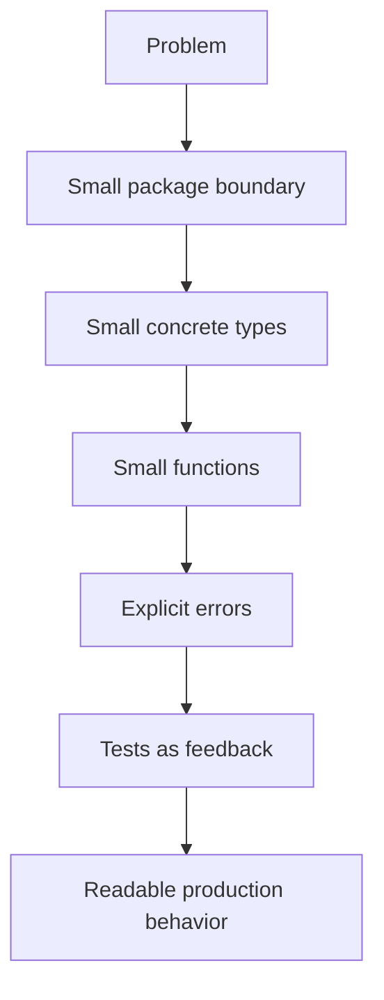

# Idiomatic Go: Dari Bisa Menulis ke Bisa Dibaca

> Target part ini: kamu bukan hanya bisa membuat program Go berjalan, tetapi bisa menulis Go yang terasa natural bagi Go engineer lain: sederhana, eksplisit, mudah direview, mudah dites, dan mudah dipelihara.

Part sebelumnya membuat kita mampu memakai syntax, type, collection, struct, method, interface, pointer, package, dan module. Tetapi **bisa menulis Go** belum sama dengan **bisa menulis Go secara idiomatik**.

Idiomatic Go adalah kemampuan membuat kode yang:

1. langsung terbaca oleh engineer Go lain,
2. memakai fitur bahasa sesuai intensinya,
3. tidak membawa style Java/C#/Node mentah-mentah,
4. menjaga API tetap kecil dan stabil,
5. menghindari abstraction sebelum dibutuhkan,
6. memakai compiler, tests, formatter, dan review sebagai feedback loop.

Dalam framework Josh Kaufman, part ini adalah bagian dari:

- **learn enough to self-correct**: kamu belajar mengenali code smell Go,
- **practice deliberately**: kamu melatih refactor kode non-idiomatik menjadi idiomatik,
- **deconstruct the skill**: idiom Go dipecah menjadi naming, package, interface, error, tests, dan API boundary.

---

## 1. Apa Itu Idiomatic Go?

Idiomatic Go bukan sekadar mengikuti style guide. Idiomatic Go adalah desain kode yang selaras dengan constraint bahasa Go.

Go sengaja memiliki sedikit fitur. Tidak ada class inheritance, annotation-heavy framework, exception, macro, implicit conversion, operator overloading, atau generic metaprogramming yang kompleks. Karena itu, kode Go yang baik biasanya tidak terlihat “canggih”. Kode Go yang baik terlihat **jelas**.

Mental model utamanya:



Go code yang baik mengoptimalkan hal-hal berikut:

| Aspek | Prioritas Go |
|---|---|
| Readability | Sangat tinggi |
| Explicitness | Sangat tinggi |
| Toolability | Sangat tinggi |
| Abstraction | Dipakai setelah kebutuhan nyata muncul |
| Cleverness | Biasanya dihindari |
| Framework magic | Biasanya dicurigai |
| Compile-time simplicity | Penting |
| Runtime predictability | Penting |

Go tidak melarang abstraction. Tetapi Go memaksa kita membuktikan bahwa abstraction itu berguna.

---

## 2. Prinsip Inti: Clear Is Better Than Clever

Banyak engineer senior dari ekosistem lain punya kecenderungan membawa pola seperti:

- class hierarchy,
- factory berlapis,
- dependency injection container,
- annotation-driven behavior,
- exception taxonomy,
- generic repository abstrak,
- inheritance-style polymorphism,
- file structure berdasarkan layer secara mekanis.

Di Go, pola-pola ini sering menghasilkan kode yang tampak enterprise tetapi sulit dibaca.

Contoh kode yang terlalu “enterprise”:

```go
package user

type AbstractUserServiceFactoryProvider interface {
    CreateUserServiceFactory() UserServiceFactory
}

type UserServiceFactory interface {
    CreateUserService() UserService
}

type UserService interface {
    CreateUser(input CreateUserInput) (*UserDTO, error)
}
```

Untuk banyak kasus, Go yang lebih baik:

```go
package user

type Store interface {
    Create(ctx context.Context, u User) error
}

type Service struct {
    store Store
}

func NewService(store Store) *Service {
    return &Service{store: store}
}

func (s *Service) Create(ctx context.Context, input CreateInput) (User, error) {
    u, err := NewUser(input.Email, input.Name)
    if err != nil {
        return User{}, err
    }
    if err := s.store.Create(ctx, u); err != nil {
        return User{}, err
    }
    return u, nil
}
```

Perbedaannya bukan hanya jumlah baris. Perbedaannya adalah **abstraction boundary**.

Versi pertama abstrak sebelum ada alasan. Versi kedua hanya membuat interface pada dependency yang benar-benar perlu diganti: `Store`.

---

## 3. Idiom 1: Nama Harus Pendek, Lokal, dan Bermakna

Go menyukai nama yang pendek untuk scope kecil dan nama yang lebih deskriptif untuk scope besar.

### 3.1 Nama pendek untuk scope pendek

```go
for i, v := range values {
    fmt.Println(i, v)
}
```

Tidak perlu:

```go
for currentIndex, currentValue := range values {
    fmt.Println(currentIndex, currentValue)
}
```

Nama seperti `i`, `n`, `r`, `w`, `ctx`, `req`, `resp`, `err`, dan `ok` umum di Go ketika scope-nya kecil dan konteksnya jelas.

Contoh idiom umum:

```go
func Copy(w io.Writer, r io.Reader) error {
    _, err := io.Copy(w, r)
    return err
}
```

`w` dan `r` cukup jelas karena type-nya `io.Writer` dan `io.Reader`.

### 3.2 Nama jelas untuk scope besar

Untuk field struct, exported function, package-level variable, atau public API, gunakan nama yang lebih deskriptif.

Kurang baik:

```go
type Svc struct {
    repo Repo
    log  Log
}
```

Lebih baik:

```go
type Service struct {
    users  UserStore
    logger Logger
}
```

### 3.3 Hindari nama yang mengulang package

Package name sudah menjadi namespace.

Kurang baik:

```go
package user

type UserService struct{}
type UserRepository struct{}
func NewUserService() *UserService { return &UserService{} }
```

Pemakaian dari package lain menjadi:

```go
user.NewUserService()
```

Ini mengulang kata `User`.

Lebih idiomatik:

```go
package user

type Service struct{}
type Store struct{}

func NewService() *Service { return &Service{} }
```

Pemakaian:

```go
user.NewService()
```

Nama lengkapnya sudah jelas karena package memberi konteks.

### 3.4 Nama interface sering berakhiran `-er`

Interface kecil sering dinamai berdasarkan capability:

```go
type Reader interface {
    Read(p []byte) (n int, err error)
}

type Writer interface {
    Write(p []byte) (n int, err error)
}

type Closer interface {
    Close() error
}
```

Untuk domain, tidak semua interface harus memakai `-er`, tetapi prinsipnya sama: nama interface sebaiknya menjelaskan capability, bukan hierarki.

```go
type UserFinder interface {
    FindByID(ctx context.Context, id UserID) (User, error)
}
```

Namun jika interface hanya dipakai internal di satu service, nama sederhana juga cukup:

```go
type userStore interface {
    FindByID(ctx context.Context, id UserID) (User, error)
    Save(ctx context.Context, user User) error
}
```

---

## 4. Idiom 2: Package Adalah Boundary, Bukan Folder Acak

Package di Go adalah unit desain. Banyak codebase Go buruk bukan karena syntax-nya, tetapi karena package boundary-nya salah.

Package yang baik punya:

1. nama kecil dan jelas,
2. cohesive responsibility,
3. API exported yang minimal,
4. dependency direction yang sehat,
5. tidak bocor detail internal,
6. mudah dites dari luar.

### 4.1 Jangan membuat package berdasarkan layer generik terlalu cepat

Struktur seperti ini sering muncul dari kebiasaan framework enterprise:

```txt
internal/
  controllers/
  services/
  repositories/
  models/
  dto/
  utils/
```

Masalahnya: package menjadi terlalu generik. Hampir semua domain bercampur di dalam `services`, `repositories`, dan `models`.

Alternatif yang lebih Go-like:

```txt
internal/
  user/
    service.go
    store.go
    model.go
    errors.go
  billing/
    service.go
    invoice.go
    store.go
  httpapi/
    server.go
    user_handler.go
    billing_handler.go
```

Aturan praktis:

- package domain mengelompokkan konsep yang berubah bersama,
- package transport seperti HTTP boleh terpisah,
- package infrastructure boleh terpisah bila implementasinya besar,
- jangan membuat `utils` sebagai tempat sampah.

### 4.2 `utils` adalah bau desain

Package `utils` biasanya berarti kita belum menemukan konsep yang benar.

Kurang baik:

```txt
internal/utils/string.go
internal/utils/time.go
internal/utils/validation.go
internal/utils/http.go
```

Lebih baik:

```txt
internal/slug/slug.go
internal/clock/clock.go
internal/validate/email.go
internal/httpx/response.go
```

Nama package harus menjawab: “ini konsep apa?” bukan “ini helper apa?”

### 4.3 Export hanya yang perlu

Go membuat visibility sangat sederhana: identifier dengan huruf besar diexport, huruf kecil tidak.

Kurang baik:

```go
type UserService struct {
    Store UserStore
    Logger Logger
}
```

Lebih aman:

```go
type Service struct {
    store  Store
    logger Logger
}
```

Jika field diexport, package lain bisa membuat state tidak valid.

---

## 5. Idiom 3: Concrete Type Dulu, Interface Belakangan

Di banyak bahasa, interface dibuat di awal sebagai kontrak. Di Go, sering lebih baik mulai dari concrete type, lalu membuat interface di sisi consumer ketika memang butuh substitusi.

### 5.1 Jangan membuat interface hanya karena ada struct

Kurang baik:

```go
type UserService interface {
    Create(ctx context.Context, input CreateInput) (User, error)
}

type userService struct {
    store UserStore
}
```

Jika hanya ada satu implementasi dan belum ada kebutuhan polymorphism, interface ini belum memberi nilai.

Lebih sederhana:

```go
type Service struct {
    store Store
}

func (s *Service) Create(ctx context.Context, input CreateInput) (User, error) {
    // ...
}
```

### 5.2 Interface sebaiknya dimiliki consumer

Misalnya package `billing` butuh mengambil user email. Jangan paksa package `user` mendefinisikan interface besar.

Kurang baik:

```go
package user

type Repository interface {
    FindByID(ctx context.Context, id ID) (User, error)
    FindByEmail(ctx context.Context, email string) (User, error)
    Save(ctx context.Context, user User) error
    Delete(ctx context.Context, id ID) error
}
```

Lebih baik, package `billing` mendefinisikan kebutuhan minimalnya sendiri:

```go
package billing

type UserEmailFinder interface {
    FindEmailByUserID(ctx context.Context, id user.ID) (string, error)
}
```

Ini membuat dependency lebih kecil dan lebih stabil.

### 5.3 Interface kecil lebih kuat daripada interface besar

Interface besar menghasilkan implementasi palsu, test rumit, dan coupling tinggi.

Kurang baik:

```go
type UserRepository interface {
    Create(ctx context.Context, u User) error
    Update(ctx context.Context, u User) error
    Delete(ctx context.Context, id ID) error
    FindByID(ctx context.Context, id ID) (User, error)
    FindByEmail(ctx context.Context, email string) (User, error)
    Search(ctx context.Context, q SearchQuery) ([]User, error)
    Count(ctx context.Context) (int, error)
}
```

Lebih baik bila consumer hanya butuh satu capability:

```go
type UserFinder interface {
    FindByID(ctx context.Context, id ID) (User, error)
}
```

---

## 6. Idiom 4: Return Concrete Type, Accept Interface Jika Berguna

Aturan praktis yang sering berguna:

> Accept interfaces, return concrete types.

Kenapa?

- menerima interface membuat function fleksibel terhadap input,
- mengembalikan concrete type membuat API jelas dan tidak menyembunyikan capability,
- interface sebagai return sering membatasi evolusi API.

Contoh baik:

```go
func WriteJSON(w io.Writer, v any) error {
    enc := json.NewEncoder(w)
    return enc.Encode(v)
}
```

`WriteJSON` tidak peduli apakah `w` adalah file, buffer, response writer, atau socket. Ia hanya butuh `io.Writer`.

Untuk constructor:

```go
type Service struct {
    store Store
}

func NewService(store Store) *Service {
    return &Service{store: store}
}
```

Constructor mengembalikan `*Service`, bukan `ServiceInterface`.

Kurang baik:

```go
func NewService(store Store) ServiceInterface {
    return &service{store: store}
}
```

Masalahnya:

1. caller tidak tahu concrete behavior,
2. API menjadi sulit diperluas,
3. testing tidak otomatis lebih baik,
4. desain menyembunyikan detail yang sebenarnya tidak perlu disembunyikan.

---

## 7. Idiom 5: Error Handling Harus Eksplisit dan Lokal

Go tidak punya exception. Error adalah value.

```go
u, err := users.FindByID(ctx, id)
if err != nil {
    return User{}, err
}
```

Sebagian engineer menganggap ini verbose. Tetapi di Go, verbosity ini sengaja: failure path terlihat di tempat failure bisa terjadi.

### 7.1 Error check dekat dengan operasi

Kurang baik:

```go
u, err := users.FindByID(ctx, id)
profile, err := profiles.FindByUserID(ctx, id)
settings, err := settingsStore.FindByUserID(ctx, id)
if err != nil {
    return nil, err
}
```

Bug: error pertama dan kedua bisa tertimpa.

Lebih baik:

```go
u, err := users.FindByID(ctx, id)
if err != nil {
    return nil, err
}

profile, err := profiles.FindByUserID(ctx, id)
if err != nil {
    return nil, err
}

settings, err := settingsStore.FindByUserID(ctx, id)
if err != nil {
    return nil, err
}
```

### 7.2 Tambahkan context, tapi jangan spam

Kurang baik:

```go
if err != nil {
    return err
}
```

Bisa terlalu miskin konteks.

Lebih baik:

```go
if err != nil {
    return fmt.Errorf("find user %s: %w", id, err)
}
```

Tetapi jangan berlebihan:

```go
return fmt.Errorf("service create user failed while calling repository create user with input user object: %w", err)
```

Error message sebaiknya seperti breadcrumb yang bisa dibaca:

```txt
create user: save user: duplicate email
```

### 7.3 Jangan log dan return error yang sama di setiap layer

Kurang baik:

```go
if err != nil {
    log.Printf("save user failed: %v", err)
    return err
}
```

Jika setiap layer melakukan ini, log menjadi duplikatif.

Lebih baik:

- low-level layer memberi context dan return error,
- boundary layer seperti HTTP handler/gRPC interceptor/logging middleware yang mencatat error.

```go
if err != nil {
    return fmt.Errorf("save user: %w", err)
}
```

---

## 8. Idiom 6: Guard Clause Mengalahkan Nesting

Go code yang baik biasanya datar.

Kurang baik:

```go
func CreateUser(ctx context.Context, input CreateInput) (User, error) {
    if input.Email != "" {
        if strings.Contains(input.Email, "@") {
            user := User{Email: input.Email}
            if err := save(ctx, user); err == nil {
                return user, nil
            } else {
                return User{}, err
            }
        } else {
            return User{}, ErrInvalidEmail
        }
    } else {
        return User{}, ErrEmailRequired
    }
}
```

Lebih idiomatik:

```go
func CreateUser(ctx context.Context, input CreateInput) (User, error) {
    if input.Email == "" {
        return User{}, ErrEmailRequired
    }
    if !strings.Contains(input.Email, "@") {
        return User{}, ErrInvalidEmail
    }

    user := User{Email: input.Email}
    if err := save(ctx, user); err != nil {
        return User{}, err
    }

    return user, nil
}
```

Keuntungan:

1. happy path mudah terlihat,
2. failure path eksplisit,
3. cognitive load rendah,
4. mudah menambah validasi baru,
5. test case mudah dipetakan.

---

## 9. Idiom 7: Defer untuk Cleanup, Bukan untuk Menyembunyikan Flow

`defer` bagus untuk cleanup yang harus terjadi setelah resource berhasil diperoleh.

```go
f, err := os.Open(path)
if err != nil {
    return err
}
defer f.Close()
```

Tetapi `Close` juga bisa gagal. Untuk write path, error close kadang penting.

```go
func WriteFile(path string, data []byte) error {
    f, err := os.Create(path)
    if err != nil {
        return err
    }

    defer func() {
        _ = f.Close()
    }()

    if _, err := f.Write(data); err != nil {
        return err
    }
    return nil
}
```

Untuk kebutuhan yang perlu menangkap error `Close`, lebih eksplisit:

```go
func WriteFile(path string, data []byte) error {
    f, err := os.Create(path)
    if err != nil {
        return fmt.Errorf("create file: %w", err)
    }

    if _, err := f.Write(data); err != nil {
        _ = f.Close()
        return fmt.Errorf("write file: %w", err)
    }

    if err := f.Close(); err != nil {
        return fmt.Errorf("close file: %w", err)
    }

    return nil
}
```

Aturan praktis:

- untuk read-only resource, `defer close` sering cukup,
- untuk write/flush/transaction, close/commit/rollback error perlu dipikirkan,
- jangan pakai `defer` untuk control flow yang membuat behavior sulit ditebak.

---

## 10. Idiom 8: Jangan Takut Repetisi Kecil

Go memilih sedikit repetisi daripada abstraction yang terlalu dini.

Misalnya, tidak semua validasi harus langsung menjadi framework generic.

Kurang baik:

```go
type Validator[T any] interface {
    Validate(T) []Violation
}

type ValidationPipeline[T any] struct {
    validators []Validator[T]
}
```

Jika kasusnya sederhana:

```go
func ValidateCreateUser(input CreateUserInput) error {
    if input.Email == "" {
        return ErrEmailRequired
    }
    if !strings.Contains(input.Email, "@") {
        return ErrInvalidEmail
    }
    if input.Name == "" {
        return ErrNameRequired
    }
    return nil
}
```

Abstraction layak dibuat ketika:

1. pola sudah muncul beberapa kali,
2. variasinya jelas,
3. abstraction mengurangi coupling,
4. abstraction tetap mudah dibaca,
5. abstraction tidak membuat error handling lebih samar.

---

## 11. Idiom 9: Comment Menjelaskan Why, Bukan What

Komentar buruk mengulang kode:

```go
// Increment i by one.
i++
```

Komentar baik menjelaskan alasan, invariant, atau behavior yang tidak obvious:

```go
// We keep the old token valid for 30 seconds to avoid rejecting requests
// already in flight during key rotation.
const tokenGracePeriod = 30 * time.Second
```

Untuk exported identifier, Go convention mendorong doc comment yang dimulai dengan nama identifier.

```go
// Service coordinates user registration and profile initialization.
type Service struct {
    store Store
}

// Create validates input, persists a new user, and returns the stored user.
func (s *Service) Create(ctx context.Context, input CreateInput) (User, error) {
    // ...
}
```

Jika comment harus menjelaskan kode yang terlalu rumit, pertimbangkan refactor.

---

## 12. Idiom 10: Table-driven Tests sebagai Feedback Loop

Walaupun testing dibahas lebih dalam di part berikutnya, idiomatic Go sangat dekat dengan table-driven test.

```go
func TestNormalizeEmail(t *testing.T) {
    tests := []struct {
        name string
        in   string
        want string
    }{
        {name: "lowercase", in: "USER@example.com", want: "user@example.com"},
        {name: "trim space", in: " user@example.com ", want: "user@example.com"},
    }

    for _, tt := range tests {
        t.Run(tt.name, func(t *testing.T) {
            got := NormalizeEmail(tt.in)
            if got != tt.want {
                t.Fatalf("NormalizeEmail(%q) = %q, want %q", tt.in, got, tt.want)
            }
        })
    }
}
```

Mengapa ini idiomatik?

1. test case eksplisit,
2. mudah menambah edge case,
3. failure message jelas,
4. mendorong function kecil,
5. membuat self-correction cepat.

---

## 13. Refactor: Dari Java-ish Go ke Idiomatic Go

Mari lihat contoh service yang terlalu banyak membawa pola enterprise.

### 13.1 Versi non-idiomatik

```go
package userservice

type IUserRepository interface {
    SaveUser(user *UserDTO) (*UserDTO, error)
    GetUserByEmail(email string) (*UserDTO, error)
}

type UserServiceImpl struct {
    UserRepository IUserRepository
}

func NewUserServiceImpl(userRepository IUserRepository) *UserServiceImpl {
    return &UserServiceImpl{UserRepository: userRepository}
}

func (service *UserServiceImpl) RegisterUser(request *RegisterUserRequestDTO) (*UserDTO, error) {
    if request == nil {
        return nil, errors.New("request is nil")
    } else {
        if request.Email == "" {
            return nil, errors.New("email is empty")
        } else {
            existing, err := service.UserRepository.GetUserByEmail(request.Email)
            if err == nil && existing != nil {
                return nil, errors.New("user already exists")
            }
            userDTO := &UserDTO{Email: request.Email, Name: request.Name}
            result, err := service.UserRepository.SaveUser(userDTO)
            if err != nil {
                return nil, err
            }
            return result, nil
        }
    }
}
```

Masalah:

1. nama package terlalu panjang,
2. prefix `I` tidak idiomatik,
3. `Impl` biasanya smell,
4. field diexport tanpa kebutuhan,
5. pointer dipakai berlebihan,
6. nesting tinggi,
7. error tidak punya taxonomy,
8. DTO bocor ke domain,
9. repository interface terlalu Java-like,
10. duplicate check ambigu: error dari `GetUserByEmail` diabaikan.

### 13.2 Versi lebih idiomatik

```go
package user

import (
    "context"
    "errors"
    "fmt"
    "strings"
)

var (
    ErrEmailRequired = errors.New("email required")
    ErrUserExists    = errors.New("user already exists")
)

type Store interface {
    FindByEmail(ctx context.Context, email string) (User, error)
    Save(ctx context.Context, user User) error
}

type Service struct {
    store Store
}

func NewService(store Store) *Service {
    return &Service{store: store}
}

type CreateInput struct {
    Email string
    Name  string
}

type User struct {
    Email string
    Name  string
}

func (s *Service) Create(ctx context.Context, input CreateInput) (User, error) {
    email := strings.TrimSpace(strings.ToLower(input.Email))
    if email == "" {
        return User{}, ErrEmailRequired
    }

    if _, err := s.store.FindByEmail(ctx, email); err == nil {
        return User{}, ErrUserExists
    } else if !errors.Is(err, ErrNotFound) {
        return User{}, fmt.Errorf("find user by email: %w", err)
    }

    user := User{Email: email, Name: strings.TrimSpace(input.Name)}
    if err := s.store.Save(ctx, user); err != nil {
        return User{}, fmt.Errorf("save user: %w", err)
    }

    return user, nil
}
```

Perbaikan:

| Area | Perbaikan |
|---|---|
| Package | `user`, bukan `userservice` |
| Interface | `Store`, kecil dan langsung relevan |
| Constructor | `NewService` mengembalikan concrete type |
| Error | sentinel error untuk domain decision |
| Flow | guard clause dan happy path datar |
| Pointer | value dipakai ketika object kecil dan tidak butuh mutasi |
| Context | lifecycle request eksplisit |
| Wrapping | infrastructure error diberi context |

---

## 14. API Design: Jangan Membuat Caller Menebak

Function Go yang baik jelas dari signature-nya.

### 14.1 Input dan output harus mencerminkan ownership

Kurang jelas:

```go
func Process(data map[string]any) map[string]any
```

Pertanyaan:

- apakah function memodifikasi input?
- schema datanya apa?
- key wajib apa?
- error bagaimana?

Lebih baik:

```go
type CreateInvoiceInput struct {
    CustomerID string
    AmountCents int64
    Currency string
}

type Invoice struct {
    ID string
    CustomerID string
    AmountCents int64
    Currency string
}

func CreateInvoice(input CreateInvoiceInput) (Invoice, error) {
    // ...
}
```

### 14.2 Hindari boolean parameter yang ambigu

Kurang baik:

```go
func SendEmail(to string, body string, async bool) error
```

Caller membaca:

```go
SendEmail(to, body, true)
```

Apa arti `true`?

Lebih jelas:

```go
type SendMode int

const (
    SendSync SendMode = iota
    SendAsync
)

func SendEmail(to string, body string, mode SendMode) error
```

Atau pisahkan function:

```go
func SendEmail(ctx context.Context, msg Message) error
func EnqueueEmail(ctx context.Context, msg Message) error
```

### 14.3 Hindari config struct raksasa tanpa invariant

Kurang baik:

```go
type Config struct {
    Timeout time.Duration
    Retry int
    EnableCache bool
    CacheTTL time.Duration
    UseTLS bool
    TLSCert string
    TLSKey string
    Debug bool
}
```

Lebih baik bila invariant dipisahkan:

```go
type ClientConfig struct {
    Timeout time.Duration
    RetryPolicy RetryPolicy
    TLS *TLSConfig
}

type RetryPolicy struct {
    MaxAttempts int
    Backoff time.Duration
}

type TLSConfig struct {
    CertFile string
    KeyFile string
}
```

---

## 15. Dependency Injection Tanpa Container

Go tidak butuh DI container untuk mayoritas service.

Dependency injection idiomatik biasanya cukup lewat constructor.

```go
type Service struct {
    users UserStore
    mailer Mailer
    clock Clock
}

func NewService(users UserStore, mailer Mailer, clock Clock) *Service {
    return &Service{
        users: users,
        mailer: mailer,
        clock: clock,
    }
}
```

Wiring dilakukan di `main` atau package composition root.

```go
func main() {
    db := openDB()
    users := postgres.NewUserStore(db)
    mailer := smtp.NewMailer(...)
    clock := systemClock{}

    svc := user.NewService(users, mailer, clock)
    server := httpapi.NewServer(svc)

    log.Fatal(server.ListenAndServe())
}
```

Keuntungan:

1. dependency graph terlihat,
2. startup failure eksplisit,
3. tidak ada runtime magic,
4. mudah diganti di test,
5. compile-time lebih membantu.

---

## 16. Nil, Empty, dan Zero Value sebagai API Design

Go memiliki zero value yang sering bisa dibuat berguna.

Contoh zero-value-friendly:

```go
type Counter struct {
    n int64
}

func (c *Counter) Inc() {
    c.n++
}

func (c *Counter) Value() int64 {
    return c.n
}
```

`var c Counter` langsung bisa dipakai.

Untuk collection, bedakan nil dan empty bila API contract membutuhkannya.

```go
var a []string        // nil slice
b := []string{}       // empty non-nil slice
```

Dalam JSON:

```go
type Response struct {
    Items []string `json:"items"`
}
```

`nil` slice dapat menjadi `null`, sedangkan empty slice menjadi `[]`.

Jika API contract mengharuskan array kosong, normalisasi:

```go
func ListItems() []Item {
    items := queryItems()
    if items == nil {
        return []Item{}
    }
    return items
}
```

Idiomatic bukan berarti selalu nil atau selalu empty. Idiomatic berarti contract jelas.

---

## 17. Common Non-idiomatic Smells

### 17.1 `Manager`, `Helper`, `Util`, `Processor` tanpa makna jelas

Nama ini bisa valid, tetapi sering menjadi tanda konsep belum matang.

Tanya:

- apa resource yang dikelola?
- apa capability yang diberikan?
- apa invariant yang dijaga?

### 17.2 Interface dengan satu implementasi di package yang sama

Tidak selalu salah, tapi curigai.

```go
type Service interface { ... }
type service struct { ... }
```

Pola ini berguna jika kamu sengaja menyembunyikan implementation detail untuk API library. Tetapi untuk aplikasi internal, sering tidak perlu.

### 17.3 File terlalu besar karena package terlalu kabur

Jika satu file berisi banyak konsep, package boundary mungkin salah.

### 17.4 Error string dimulai huruf besar atau diakhiri tanda titik

Go convention umumnya error string lower-case dan tanpa punctuation karena error sering dibungkus di context yang lebih besar.

```go
errors.New("email required")
```

Bukan:

```go
errors.New("Email required.")
```

### 17.5 Panic untuk flow normal

`panic` bukan pengganti exception.

Gunakan `panic` untuk kondisi programmer error atau invariant fatal yang tidak bisa dipulihkan, bukan untuk input user invalid.

### 17.6 Context disimpan di struct

Kurang baik:

```go
type Service struct {
    ctx context.Context
}
```

Lebih baik context lewat parameter pada operasi yang butuh lifecycle:

```go
func (s *Service) Create(ctx context.Context, input CreateInput) (User, error)
```

### 17.7 Global mutable state

Kurang baik:

```go
var db *sql.DB
```

Lebih baik inject dependency:

```go
type Store struct {
    db *sql.DB
}
```

---

## 18. Code Review Checklist untuk Idiomatic Go

Gunakan checklist ini saat review kode sendiri.

### 18.1 Naming

- Apakah nama package pendek dan jelas?
- Apakah exported identifier tidak mengulang package name?
- Apakah nama lokal cukup pendek?
- Apakah nama public API cukup deskriptif?
- Apakah interface name menjelaskan capability?

### 18.2 Package boundary

- Apakah package cohesive?
- Apakah exported API minimal?
- Apakah ada package `utils` yang bisa diberi nama lebih baik?
- Apakah dependency direction sehat?
- Apakah ada import cycle risk?

### 18.3 Interface

- Apakah interface dibuat di sisi consumer?
- Apakah interface terlalu besar?
- Apakah interface punya satu implementasi tanpa alasan kuat?
- Apakah constructor mengembalikan concrete type?

### 18.4 Error

- Apakah error dicek dekat operasi?
- Apakah error diberi context yang cukup?
- Apakah error tidak dilog berulang di setiap layer?
- Apakah domain error bisa diputuskan dengan `errors.Is` atau `errors.As`?
- Apakah panic tidak dipakai untuk flow normal?

### 18.5 Function

- Apakah happy path datar?
- Apakah nesting bisa diganti guard clause?
- Apakah parameter terlalu banyak?
- Apakah boolean parameter ambigu?
- Apakah function terlalu banyak responsibility?

### 18.6 Tests

- Apakah behavior penting punya test?
- Apakah failure path dites?
- Apakah table-driven test cocok?
- Apakah test tidak terlalu bergantung pada detail internal?

---

## 19. Latihan Terarah

### Latihan 1: Refactor naming

Ubah kode berikut menjadi lebih idiomatik:

```go
package userservice

type UserServiceManager struct{}

func (userServiceManager *UserServiceManager) CreateUserEntity(userEmailAddress string) error {
    return nil
}
```

Target:

- package lebih pendek,
- type name tidak mengulang package,
- receiver name pendek,
- function name tidak berlebihan.

Contoh solusi:

```go
package user

type Service struct{}

func (s *Service) Create(email string) error {
    return nil
}
```

### Latihan 2: Refactor interface besar

Awal:

```go
type Repository interface {
    Create(ctx context.Context, u User) error
    Update(ctx context.Context, u User) error
    Delete(ctx context.Context, id ID) error
    FindByID(ctx context.Context, id ID) (User, error)
    FindByEmail(ctx context.Context, email string) (User, error)
}
```

Jika use case hanya butuh `FindByID`, buat interface lebih kecil di consumer.

```go
type UserFinder interface {
    FindByID(ctx context.Context, id user.ID) (user.User, error)
}
```

### Latihan 3: Ratakan control flow

Awal:

```go
func Pay(ctx context.Context, input PaymentInput) error {
    if input.Amount > 0 {
        if input.Currency != "" {
            if err := charge(ctx, input); err != nil {
                return err
            } else {
                return nil
            }
        } else {
            return ErrCurrencyRequired
        }
    } else {
        return ErrInvalidAmount
    }
}
```

Solusi:

```go
func Pay(ctx context.Context, input PaymentInput) error {
    if input.Amount <= 0 {
        return ErrInvalidAmount
    }
    if input.Currency == "" {
        return ErrCurrencyRequired
    }
    if err := charge(ctx, input); err != nil {
        return fmt.Errorf("charge payment: %w", err)
    }
    return nil
}
```

---

## 20. Rubric: Apakah Kode Ini Sudah Idiomatik?

Nilai kode Go kamu dari 1 sampai 5.

| Level | Ciri |
|---:|---|
| 1 | Kode berjalan, tetapi membawa style bahasa lain secara berat |
| 2 | Syntax benar, tetapi package, interface, dan error masih tidak natural |
| 3 | Cukup idiomatik, readable, dan bisa direview |
| 4 | Boundary jelas, error matang, API kecil, tests baik |
| 5 | Kode sederhana, stabil, production-aware, mudah dievolusi, dan mudah diajarkan ke engineer lain |

Target setelah part ini: minimal level 3 untuk kode kecil dan mulai menuju level 4 untuk service code.

---

## 21. Kesalahan Berpikir yang Perlu Dihindari

### 21.1 “Go terlalu sederhana, jadi tidak butuh desain”

Salah. Go sederhana di syntax, tetapi tetap butuh desain boundary yang kuat.

### 21.2 “Kalau tidak pakai framework besar, berarti tidak enterprise”

Salah. Production-grade Go sering justru menghindari framework besar agar behavior eksplisit.

### 21.3 “Interface harus dibuat untuk semua dependency”

Salah. Interface dibuat ketika ada variasi behavior, testing seam, atau boundary yang jelas.

### 21.4 “Error handling Go cuma boilerplate”

Salah. Error handling Go adalah tempat failure model terlihat.

### 21.5 “Sedikit repetisi pasti buruk”

Salah. Sedikit repetisi bisa lebih murah daripada abstraction yang salah.

---

## 22. Ringkasan

Idiomatic Go bukan tentang membuat kode terlihat minimalis. Idiomatic Go adalah membuat kode yang:

1. mudah dibaca,
2. eksplisit,
3. kecil boundary-nya,
4. tidak over-abstracted,
5. failure path-nya jelas,
6. mudah dites,
7. mudah direview,
8. mudah dioperasikan.

Prinsip paling penting:

```txt
Prefer clarity over cleverness.
Prefer small interfaces over large abstractions.
Prefer concrete types until variation is real.
Prefer explicit errors over hidden control flow.
Prefer package cohesion over folder ceremony.
```

Setelah ini, kita masuk ke Part 10: error handling yang lebih dalam. Di sana kita akan membangun taxonomy error, domain failure model, error wrapping, sentinel error, custom error type, retryable error, validation error, dan boundary translation untuk HTTP/API.

---

## Referensi Resmi

- Effective Go — https://go.dev/doc/effective_go
- Go Code Review Comments — https://go.dev/wiki/CodeReviewComments
- Go Doc Comments — https://go.dev/doc/comment
- Go Specification — https://go.dev/ref/spec
- Organizing a Go module — https://go.dev/doc/modules/layout
