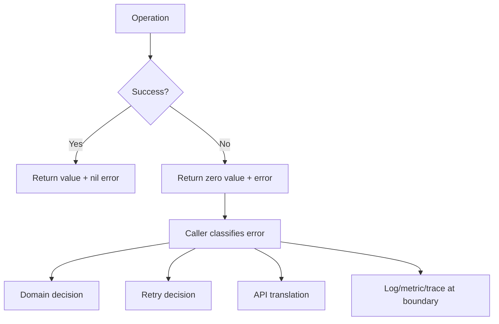
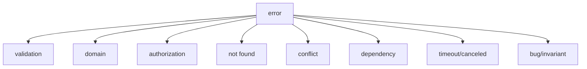

# Error Handling, Domain Failure, dan Defensive Boundaries

> Target part ini: kamu mampu mendesain error handling Go yang bukan hanya mengembalikan `err`, tetapi bisa merepresentasikan domain failure, infrastructure failure, retryability, observability, dan API boundary secara benar.

Di Go, error bukan exception. Error adalah value.

Konsekuensinya besar: failure path adalah bagian eksplisit dari desain program. Function signature memberi tahu bahwa operasi bisa gagal, caller wajib mengambil keputusan, dan setiap layer punya tanggung jawab terhadap konteks error.

Error handling yang buruk membuat service:

- sulit didebug,
- salah mapping status code,
- retry pada error yang tidak seharusnya,
- menyembunyikan root cause,
- logging duplikatif,
- gagal membedakan domain failure dan infrastructure failure,
- sulit dites di failure path.

Error handling yang baik membuat sistem bisa menjawab:

1. Apa yang gagal?
2. Di boundary mana gagal?
3. Apakah ini kesalahan user, business rule, dependency, timeout, race, atau bug?
4. Apakah boleh retry?
5. Apa response yang aman untuk client?
6. Apa informasi yang cukup untuk operator?
7. Apakah error ini bisa dipakai untuk decision logic?

---

## 1. Mental Model: Error Adalah Bagian dari Domain dan Control Flow

Di Go, error handling bukan aksesoris. Error adalah bagian dari contract.

```go
func FindUser(ctx context.Context, id UserID) (User, error)
```

Signature ini mengatakan:

- output utama adalah `User`,
- operasi bisa gagal,
- caller harus memeriksa `error`,
- `User` hanya valid jika `error == nil`, kecuali function mendokumentasikan sebaliknya.

Mental model:



Aturan umum:

```go
result, err := doSomething()
if err != nil {
    return zeroValue, err
}
// result valid here
```

Jangan membuat caller menebak apakah value valid ketika error non-nil.

---

## 2. Tiga Kategori Besar Failure

Untuk service production, error perlu diklasifikasikan minimal menjadi tiga kategori.

| Kategori | Contoh | Biasanya Retry? | Biasanya Client Fault? |
|---|---|---:|---:|
| Domain failure | email sudah terdaftar, saldo tidak cukup | Tidak | Tergantung |
| Validation failure | input kosong, format invalid | Tidak | Ya |
| Infrastructure failure | DB timeout, network error, dependency down | Mungkin | Tidak |

Kategori ini penting karena memengaruhi:

- HTTP status code,
- log level,
- metric label,
- retry behavior,
- alerting,
- incident triage,
- UX message.

Contoh buruk: semua error menjadi HTTP 500.

```go
if err != nil {
    http.Error(w, "internal server error", http.StatusInternalServerError)
    return
}
```

Contoh lebih baik:

```go
if err != nil {
    writeError(w, err)
    return
}
```

`writeError` melakukan boundary translation berdasarkan jenis error.

---

## 3. Error String: Kecil, Lower-case, dan Tanpa Titik

Error string di Go umumnya lower-case dan tidak diakhiri punctuation, karena error sering dibungkus.

Baik:

```go
var ErrEmailRequired = errors.New("email required")
```

Kurang baik:

```go
var ErrEmailRequired = errors.New("Email is required.")
```

Saat dibungkus:

```txt
create user: validate input: email required
```

Jika error string awalnya kapital dan punya titik, hasil akhirnya kurang natural:

```txt
create user: validate input: Email is required.
```

---

## 4. Sentinel Error

Sentinel error adalah variable error yang dipakai sebagai nilai identitas.

```go
var ErrNotFound = errors.New("not found")
```

Caller bisa memeriksa:

```go
u, err := store.FindByID(ctx, id)
if errors.Is(err, ErrNotFound) {
    return User{}, ErrUserNotFound
}
if err != nil {
    return User{}, fmt.Errorf("find user: %w", err)
}
```

### 4.1 Kapan sentinel error cocok?

Sentinel error cocok untuk kondisi stabil dan umum:

- not found,
- conflict,
- already exists,
- invalid state,
- permission denied,
- rate limited,
- validation category umum.

Contoh:

```go
var (
    ErrNotFound      = errors.New("not found")
    ErrConflict      = errors.New("conflict")
    ErrUnauthorized  = errors.New("unauthorized")
    ErrForbidden     = errors.New("forbidden")
    ErrInvalidInput  = errors.New("invalid input")
)
```

### 4.2 Kapan sentinel error buruk?

Sentinel error buruk jika:

1. terlalu banyak dan terlalu spesifik,
2. membawa data yang seharusnya ada di custom error,
3. menjadi API coupling yang sulit diubah,
4. berasal dari package internal tetapi dipakai sebagai contract public tanpa sengaja.

Kurang baik:

```go
var (
    ErrUserEmailAtIndex17IsInvalid = errors.New("user email at index 17 is invalid")
    ErrPaymentAttemptOnTuesdayFailed = errors.New("payment attempt on tuesday failed")
)
```

Untuk data dinamis, gunakan custom error.

---

## 5. Error Wrapping dengan `%w`

Go mendukung error wrapping dengan `fmt.Errorf` dan verb `%w`.

```go
if err := store.Save(ctx, user); err != nil {
    return fmt.Errorf("save user: %w", err)
}
```

Wrapping memberi dua manfaat:

1. menambah konteks manusiawi,
2. tetap mempertahankan error asli untuk programmatic check.

```go
if errors.Is(err, ErrNotFound) {
    // still works through wrapping chain
}
```

### 5.1 `%w` vs `%v`

```go
return fmt.Errorf("save user: %v", err)
```

`%v` memasukkan text error, tetapi tidak membungkus error untuk `errors.Is` atau `errors.As`.

```go
return fmt.Errorf("save user: %w", err)
```

`%w` mempertahankan chain error.

Aturan praktis:

- pakai `%w` jika caller mungkin perlu mengenali cause,
- pakai `%v` jika kamu sengaja ingin memutus chain,
- jangan wrap error nil.

---

## 6. `errors.Is`: Mengecek Identitas atau Kategori Error

Gunakan `errors.Is` untuk sentinel atau kategori error.

```go
if errors.Is(err, ErrNotFound) {
    return nil, ErrUserNotFound
}
```

Contoh:

```go
var ErrInsufficientBalance = errors.New("insufficient balance")

func Debit(balance, amount int64) error {
    if amount > balance {
        return ErrInsufficientBalance
    }
    return nil
}
```

Pemakaian:

```go
if err := Debit(balance, amount); errors.Is(err, ErrInsufficientBalance) {
    return "payment declined", nil
}
```

### 6.1 Jangan pakai string comparison

Buruk:

```go
if err != nil && err.Error() == "not found" {
    // ...
}
```

Masalah:

- rapuh terhadap perubahan text,
- gagal jika error dibungkus,
- tidak punya type safety.

Baik:

```go
if errors.Is(err, ErrNotFound) {
    // ...
}
```

---

## 7. `errors.As`: Mengekstrak Custom Error Type

Gunakan `errors.As` jika error membawa data.

```go
type ValidationError struct {
    Field string
    Code  string
    Msg   string
}

func (e *ValidationError) Error() string {
    return e.Field + ": " + e.Msg
}
```

Pemakaian:

```go
var validationErr *ValidationError
if errors.As(err, &validationErr) {
    fmt.Println(validationErr.Field, validationErr.Code)
}
```

`errors.As` tetap bekerja meskipun error sudah dibungkus.

```go
return fmt.Errorf("create user: %w", &ValidationError{
    Field: "email",
    Code: "required",
    Msg: "email required",
})
```

---

## 8. Custom Error Type

Custom error type berguna ketika error butuh data terstruktur.

### 8.1 Validation error

```go
type FieldError struct {
    Field string
    Code  string
    Msg   string
}

func (e FieldError) Error() string {
    return e.Field + ": " + e.Msg
}
```

Contoh pemakaian:

```go
func ValidateEmail(email string) error {
    if email == "" {
        return FieldError{Field: "email", Code: "required", Msg: "email required"}
    }
    if !strings.Contains(email, "@") {
        return FieldError{Field: "email", Code: "invalid", Msg: "email invalid"}
    }
    return nil
}
```

Boundary HTTP bisa mengekstrak:

```go
var fieldErr FieldError
if errors.As(err, &fieldErr) {
    writeJSON(w, http.StatusBadRequest, map[string]any{
        "error": "validation_failed",
        "field": fieldErr.Field,
        "code":  fieldErr.Code,
    })
    return
}
```

### 8.2 Operation error

Untuk infrastructure boundary:

```go
type OpError struct {
    Op  string
    Err error
}

func (e *OpError) Error() string {
    return e.Op + ": " + e.Err.Error()
}

func (e *OpError) Unwrap() error {
    return e.Err
}
```

Pemakaian:

```go
if err := db.QueryRowContext(ctx, q, id).Scan(&u.ID, &u.Email); err != nil {
    return User{}, &OpError{Op: "query user by id", Err: err}
}
```

Tetapi dalam banyak kasus, `fmt.Errorf("query user by id: %w", err)` cukup. Jangan membuat custom type tanpa alasan.

---

## 9. Domain Error vs Infrastructure Error

Kesalahan besar di banyak service adalah mencampur error domain dan infrastructure.

### 9.1 Domain error

Domain error adalah failure yang sah menurut aturan bisnis.

Contoh:

- user belum memenuhi syarat,
- saldo tidak cukup,
- invoice sudah dibayar,
- case sudah closed,
- transisi state tidak valid.

```go
var ErrInvalidTransition = errors.New("invalid transition")

func (c Case) Escalate() (Case, error) {
    if c.Status == StatusClosed {
        return Case{}, ErrInvalidTransition
    }
    c.Status = StatusEscalated
    return c, nil
}
```

Ini bukan bug. Ini behavior domain.

### 9.2 Infrastructure error

Infrastructure error berasal dari dependency teknis:

- DB timeout,
- connection refused,
- disk full,
- message broker unavailable,
- HTTP dependency 503,
- context deadline exceeded.

```go
if err := repo.Save(ctx, c); err != nil {
    return fmt.Errorf("save case: %w", err)
}
```

### 9.3 Boundary translation

Service layer boleh menerjemahkan infrastructure error menjadi use-case error bila perlu, tetapi jangan menghilangkan cause.

```go
if err := s.store.Save(ctx, user); err != nil {
    return User{}, fmt.Errorf("save user: %w", err)
}
```

HTTP boundary menerjemahkan:

```go
switch {
case errors.Is(err, ErrInvalidTransition):
    writeError(w, http.StatusConflict, "invalid_transition")
case errors.Is(err, context.DeadlineExceeded):
    writeError(w, http.StatusGatewayTimeout, "timeout")
default:
    writeError(w, http.StatusInternalServerError, "internal_error")
}
```

---

## 10. Error Taxonomy untuk Service Go

Untuk service production, buat taxonomy sederhana.



Contoh package `apperr` sederhana:

```go
package apperr

import "errors"

var (
    ErrInvalidInput = errors.New("invalid input")
    ErrNotFound     = errors.New("not found")
    ErrConflict     = errors.New("conflict")
    ErrUnauthorized = errors.New("unauthorized")
    ErrForbidden    = errors.New("forbidden")
    ErrDependency   = errors.New("dependency error")
)
```

Namun hati-hati: package error global bisa menjadi coupling besar. Untuk domain besar, error bisa tetap berada di package domain masing-masing.

Contoh:

```go
package casefile

var (
    ErrNotFound          = errors.New("case not found")
    ErrInvalidTransition = errors.New("invalid case transition")
    ErrAlreadyClosed     = errors.New("case already closed")
)
```

Pilih desain berdasarkan boundary.

---

## 11. Validation Failure

Validation error biasanya perlu data lebih detail daripada sentinel error tunggal.

### 11.1 Multi-field validation

```go
type Violation struct {
    Field string `json:"field"`
    Code  string `json:"code"`
    Msg   string `json:"message"`
}

type ValidationError struct {
    Violations []Violation
}

func (e *ValidationError) Error() string {
    return "validation failed"
}
```

Validasi:

```go
func ValidateCreateUser(input CreateUserInput) error {
    var violations []Violation

    if strings.TrimSpace(input.Email) == "" {
        violations = append(violations, Violation{Field: "email", Code: "required", Msg: "email required"})
    }
    if strings.TrimSpace(input.Name) == "" {
        violations = append(violations, Violation{Field: "name", Code: "required", Msg: "name required"})
    }

    if len(violations) > 0 {
        return &ValidationError{Violations: violations}
    }
    return nil
}
```

HTTP translation:

```go
var validationErr *ValidationError
if errors.As(err, &validationErr) {
    writeJSON(w, http.StatusBadRequest, map[string]any{
        "error": "validation_failed",
        "violations": validationErr.Violations,
    })
    return
}
```

### 11.2 Jangan campur validation dan persistence

Buruk:

```go
func (s *Store) Save(ctx context.Context, input CreateUserInput) error {
    if input.Email == "" {
        return ErrEmailRequired
    }
    // SQL insert...
}
```

Lebih baik:

- validasi di domain/application layer,
- store fokus pada persistence,
- store boleh mengembalikan constraint violation dari database dan diterjemahkan.

---

## 12. Not Found: Bukan Selalu Error yang Sama

`not found` bisa punya arti berbeda tergantung layer.

Di repository:

```go
var ErrNotFound = errors.New("not found")

func (s *Store) FindByID(ctx context.Context, id UserID) (User, error) {
    var u User
    err := s.db.QueryRowContext(ctx, query, id).Scan(&u.ID, &u.Email)
    if errors.Is(err, sql.ErrNoRows) {
        return User{}, ErrNotFound
    }
    if err != nil {
        return User{}, fmt.Errorf("query user by id: %w", err)
    }
    return u, nil
}
```

Di service:

```go
var ErrUserNotFound = errors.New("user not found")

func (s *Service) Get(ctx context.Context, id UserID) (User, error) {
    u, err := s.store.FindByID(ctx, id)
    if errors.Is(err, store.ErrNotFound) {
        return User{}, ErrUserNotFound
    }
    if err != nil {
        return User{}, fmt.Errorf("find user: %w", err)
    }
    return u, nil
}
```

Mengapa diterjemahkan?

- store error adalah detail persistence,
- service error adalah domain/use-case contract,
- HTTP boundary tidak perlu tahu `sql.ErrNoRows`.

---

## 13. Conflict dan Idempotency

Conflict adalah domain/application state yang tidak sesuai dengan operasi.

Contoh:

- user email sudah dipakai,
- resource version mismatch,
- invoice sudah paid,
- state transition tidak valid.

```go
var ErrEmailTaken = errors.New("email taken")

func (s *Service) Create(ctx context.Context, input CreateInput) (User, error) {
    _, err := s.store.FindByEmail(ctx, input.Email)
    if err == nil {
        return User{}, ErrEmailTaken
    }
    if !errors.Is(err, ErrNotFound) {
        return User{}, fmt.Errorf("check existing user: %w", err)
    }

    // create user
}
```

Untuk idempotency, conflict tidak selalu error fatal.

Misalnya create payment dengan idempotency key:

```go
payment, err := s.store.FindByIdempotencyKey(ctx, key)
if err == nil {
    return payment, nil
}
if !errors.Is(err, ErrNotFound) {
    return Payment{}, fmt.Errorf("find payment by idempotency key: %w", err)
}
```

Di sini `found` berarti request bisa dianggap sukses ulang.

---

## 14. Retryable vs Non-retryable Error

Dalam distributed systems, error classification harus membantu retry decision.

| Error | Retry? | Alasan |
|---|---:|---|
| validation failed | Tidak | Input salah |
| unauthorized | Tidak | Credential/permission salah |
| not found | Biasanya tidak | Resource tidak ada |
| conflict | Biasanya tidak | State tidak cocok |
| timeout | Mungkin | Dependency mungkin pulih |
| connection refused | Mungkin | Dependency transient |
| rate limited | Ya, dengan backoff | Perlu menunggu |
| context canceled by caller | Tidak | Caller membatalkan |

### 14.1 Interface untuk retryability

```go
type Retryable interface {
    Retryable() bool
}

type DependencyError struct {
    Op  string
    Err error
}

func (e *DependencyError) Error() string {
    return e.Op + ": " + e.Err.Error()
}

func (e *DependencyError) Unwrap() error {
    return e.Err
}

func (e *DependencyError) Retryable() bool {
    return true
}
```

Helper:

```go
func IsRetryable(err error) bool {
    var r Retryable
    if errors.As(err, &r) {
        return r.Retryable()
    }
    return errors.Is(err, context.DeadlineExceeded)
}
```

Pemakaian:

```go
if err != nil && IsRetryable(err) {
    // retry with backoff and budget
}
```

### 14.2 Jangan retry tanpa budget

Retry tanpa batas bisa memperparah outage.

Minimal tentukan:

- max attempts,
- timeout per attempt,
- total deadline,
- backoff,
- jitter,
- idempotency guarantee.

---

## 15. Context Error: Canceled vs Deadline Exceeded

`context.Context` membawa dua error penting:

```go
context.Canceled
context.DeadlineExceeded
```

Bedakan keduanya.

| Error | Arti |
|---|---|
| `context.Canceled` | Caller membatalkan operasi |
| `context.DeadlineExceeded` | Deadline/timeout habis |

Contoh:

```go
if err != nil {
    switch {
    case errors.Is(err, context.Canceled):
        return fmt.Errorf("request canceled: %w", err)
    case errors.Is(err, context.DeadlineExceeded):
        return fmt.Errorf("request timeout: %w", err)
    default:
        return err
    }
}
```

Mapping HTTP internal:

- canceled oleh client: sering tidak perlu log error besar,
- deadline exceeded ke upstream: bisa 504,
- internal operation timeout: bisa 503/504 tergantung boundary.

---

## 16. Panic Bukan Error Handling Biasa

`panic` bukan pengganti exception.

Gunakan `panic` untuk:

1. programmer error,
2. invariant yang mustahil dilanggar bila kode benar,
3. initialization fatal pada startup tertentu,
4. test helper tertentu.

Jangan gunakan `panic` untuk:

- input user invalid,
- record tidak ditemukan,
- dependency timeout,
- business rule violation.

Buruk:

```go
func FindUser(id string) User {
    u, err := store.Find(id)
    if err != nil {
        panic(err)
    }
    return u
}
```

Baik:

```go
func FindUser(ctx context.Context, id string) (User, error) {
    u, err := store.Find(ctx, id)
    if err != nil {
        return User{}, err
    }
    return u, nil
}
```

### 16.1 Recover hanya di boundary

Jika kamu memakai `recover`, lakukan di boundary seperti HTTP middleware agar process tidak mati karena panic tidak terduga.

```go
func Recover(next http.Handler) http.Handler {
    return http.HandlerFunc(func(w http.ResponseWriter, r *http.Request) {
        defer func() {
            if v := recover(); v != nil {
                // log panic with stack here
                http.Error(w, "internal server error", http.StatusInternalServerError)
            }
        }()
        next.ServeHTTP(w, r)
    })
}
```

Recover tidak boleh menyembunyikan bug. Ia hanya mencegah crash total pada boundary tertentu.

---

## 17. Log Error di Boundary, Bukan di Semua Layer

Bayangkan flow:

```txt
HTTP handler -> service -> repository -> database
```

Jika repository, service, dan handler semua log error yang sama, log menjadi noisy.

Buruk:

```go
func (r *Repo) Save(ctx context.Context, u User) error {
    if err := r.insert(ctx, u); err != nil {
        log.Printf("repo save failed: %v", err)
        return err
    }
    return nil
}

func (s *Service) Create(ctx context.Context, input Input) error {
    if err := s.repo.Save(ctx, user); err != nil {
        log.Printf("service create failed: %v", err)
        return err
    }
    return nil
}
```

Baik:

```go
func (r *Repo) Save(ctx context.Context, u User) error {
    if err := r.insert(ctx, u); err != nil {
        return fmt.Errorf("insert user: %w", err)
    }
    return nil
}

func (s *Service) Create(ctx context.Context, input Input) error {
    if err := s.repo.Save(ctx, user); err != nil {
        return fmt.Errorf("save user: %w", err)
    }
    return nil
}
```

Boundary:

```go
func (h *Handler) Create(w http.ResponseWriter, r *http.Request) {
    err := h.service.Create(r.Context(), input)
    if err != nil {
        h.logger.Error("create user failed", "error", err)
        h.writeError(w, err)
        return
    }
}
```

Aturan:

- wrap di layer bawah,
- classify di boundary,
- log sekali dengan context request,
- metrics/tracing di boundary atau middleware.

---

## 18. HTTP Error Translation

Salah satu boundary paling penting adalah HTTP.

Contoh mapping:

| Error | HTTP Status | Public Code |
|---|---:|---|
| validation error | 400 | `validation_failed` |
| unauthorized | 401 | `unauthorized` |
| forbidden | 403 | `forbidden` |
| not found | 404 | `not_found` |
| conflict | 409 | `conflict` |
| rate limited | 429 | `rate_limited` |
| deadline exceeded | 504 | `timeout` |
| dependency error | 503 | `dependency_unavailable` |
| unknown | 500 | `internal_error` |

Contoh implementasi:

```go
type ErrorResponse struct {
    Error   string      `json:"error"`
    Message string      `json:"message,omitempty"`
    Details any         `json:"details,omitempty"`
}

func writeError(w http.ResponseWriter, err error) {
    var validationErr *ValidationError
    if errors.As(err, &validationErr) {
        writeJSON(w, http.StatusBadRequest, ErrorResponse{
            Error:   "validation_failed",
            Message: "validation failed",
            Details: validationErr.Violations,
        })
        return
    }

    switch {
    case errors.Is(err, ErrNotFound):
        writeJSON(w, http.StatusNotFound, ErrorResponse{Error: "not_found"})
    case errors.Is(err, ErrConflict):
        writeJSON(w, http.StatusConflict, ErrorResponse{Error: "conflict"})
    case errors.Is(err, context.DeadlineExceeded):
        writeJSON(w, http.StatusGatewayTimeout, ErrorResponse{Error: "timeout"})
    default:
        writeJSON(w, http.StatusInternalServerError, ErrorResponse{Error: "internal_error"})
    }
}
```

Jangan bocorkan internal error ke public response.

Buruk:

```json
{
  "error": "pq: duplicate key value violates unique constraint users_email_key"
}
```

Lebih baik:

```json
{
  "error": "email_already_registered"
}
```

Internal detail tetap ada di log/trace.

---

## 19. Defensive Boundary: Translate Dependency Error

Repository harus menerjemahkan error dependency menjadi contract package.

Contoh SQL:

```go
func (s *Store) FindByID(ctx context.Context, id UserID) (User, error) {
    var u User
    err := s.db.QueryRowContext(ctx, `
        SELECT id, email, name FROM users WHERE id = $1
    `, id).Scan(&u.ID, &u.Email, &u.Name)

    if errors.Is(err, sql.ErrNoRows) {
        return User{}, ErrNotFound
    }
    if err != nil {
        return User{}, fmt.Errorf("query user by id: %w", err)
    }
    return u, nil
}
```

Service tidak perlu tahu `sql.ErrNoRows`.

Contoh HTTP dependency:

```go
func (c *Client) GetScore(ctx context.Context, userID string) (Score, error) {
    req, err := http.NewRequestWithContext(ctx, http.MethodGet, c.baseURL+"/score/"+userID, nil)
    if err != nil {
        return Score{}, fmt.Errorf("build score request: %w", err)
    }

    resp, err := c.http.Do(req)
    if err != nil {
        return Score{}, &DependencyError{Op: "call score service", Err: err}
    }
    defer resp.Body.Close()

    switch resp.StatusCode {
    case http.StatusOK:
        // decode
    case http.StatusNotFound:
        return Score{}, ErrNotFound
    case http.StatusTooManyRequests, http.StatusBadGateway, http.StatusServiceUnavailable, http.StatusGatewayTimeout:
        return Score{}, &DependencyError{Op: "score service unavailable", Err: fmt.Errorf("status %d", resp.StatusCode)}
    default:
        return Score{}, fmt.Errorf("score service unexpected status %d", resp.StatusCode)
    }

    // ...
}
```

---

## 20. Error Handling untuk Transaction

Transaction punya failure mode khusus:

1. begin gagal,
2. operasi gagal,
3. rollback gagal,
4. commit gagal.

Contoh sederhana:

```go
func (s *Store) Transfer(ctx context.Context, from, to AccountID, amount int64) error {
    tx, err := s.db.BeginTx(ctx, nil)
    if err != nil {
        return fmt.Errorf("begin tx: %w", err)
    }

    committed := false
    defer func() {
        if !committed {
            _ = tx.Rollback()
        }
    }()

    if err := debit(ctx, tx, from, amount); err != nil {
        return fmt.Errorf("debit account: %w", err)
    }
    if err := credit(ctx, tx, to, amount); err != nil {
        return fmt.Errorf("credit account: %w", err)
    }

    if err := tx.Commit(); err != nil {
        return fmt.Errorf("commit tx: %w", err)
    }
    committed = true
    return nil
}
```

Catatan:

- rollback error sering tidak mengubah return utama, tapi bisa dilog di boundary tertentu,
- commit error penting karena outcome bisa ambigu,
- idempotency dibutuhkan jika caller mungkin retry setelah commit outcome tidak diketahui.

---

## 21. Error Handling untuk Goroutine

Goroutine tidak otomatis mengembalikan error ke caller.

Buruk:

```go
go func() {
    if err := doWork(); err != nil {
        return // error hilang
    }
}()
```

Gunakan channel atau errgroup-style pattern.

```go
errCh := make(chan error, 1)

go func() {
    errCh <- doWork(ctx)
}()

select {
case err := <-errCh:
    if err != nil {
        return err
    }
case <-ctx.Done():
    return ctx.Err()
}
```

Untuk banyak goroutine, pattern yang akan dibahas lebih dalam di part concurrency.

Prinsipnya:

- error dari goroutine harus punya owner,
- cancellation harus jelas,
- jangan biarkan goroutine gagal diam-diam,
- jangan blokir selamanya saat mengirim error.

---

## 22. Testing Error Path

Error handling yang tidak dites biasanya salah.

### 22.1 Test sentinel error

```go
func TestServiceCreate_EmailTaken(t *testing.T) {
    store := &fakeStore{findErr: nil}
    svc := NewService(store)

    _, err := svc.Create(context.Background(), CreateInput{Email: "a@example.com"})
    if !errors.Is(err, ErrEmailTaken) {
        t.Fatalf("Create() error = %v, want ErrEmailTaken", err)
    }
}
```

### 22.2 Test wrapping tidak memutus cause

```go
func TestServiceCreate_StoreFailure(t *testing.T) {
    storeErr := errors.New("db down")
    store := &fakeStore{saveErr: storeErr}
    svc := NewService(store)

    _, err := svc.Create(context.Background(), CreateInput{Email: "a@example.com"})
    if !errors.Is(err, storeErr) {
        t.Fatalf("Create() error = %v, want wrapping storeErr", err)
    }
}
```

### 22.3 Test custom error extraction

```go
func TestValidateCreateUser(t *testing.T) {
    err := ValidateCreateUser(CreateUserInput{})

    var validationErr *ValidationError
    if !errors.As(err, &validationErr) {
        t.Fatalf("error = %T, want *ValidationError", err)
    }
    if len(validationErr.Violations) == 0 {
        t.Fatalf("violations is empty")
    }
}
```

---

## 23. Anti-pattern Error Handling

### 23.1 Ignoring error

```go
f, _ := os.Open(path)
```

Boleh hanya jika benar-benar sengaja dan aman, biasanya dengan comment atau assignment eksplisit.

```go
_ = f.Close() // read-only file; close error is not actionable here
```

### 23.2 Returning nil error on failed operation

```go
if err != nil {
    return User{}, nil
}
```

Ini sangat berbahaya karena caller menganggap operasi sukses.

### 23.3 Wrapping dengan `%v` padahal butuh `errors.Is`

```go
return fmt.Errorf("find user: %v", ErrNotFound)
```

`errors.Is` tidak akan mengenali.

### 23.4 Comparing error string

```go
if err.Error() == "not found" {
    // fragile
}
```

### 23.5 Log fatal di library/package bawah

Buruk:

```go
func Connect() *DB {
    db, err := sql.Open(...)
    if err != nil {
        log.Fatal(err)
    }
    return db
}
```

Library/package bawah tidak boleh membunuh process. Return error.

```go
func Connect() (*DB, error) {
    db, err := sql.Open(...)
    if err != nil {
        return nil, err
    }
    return db, nil
}
```

### 23.6 Panic untuk validation

```go
if input.Email == "" {
    panic("email required")
}
```

Gunakan error.

---

## 24. Case Study: Enforcement Case Transition

Misalnya kita membangun sistem regulatory case management.

Domain rule:

- case `Draft` bisa menjadi `Submitted`,
- case `Submitted` bisa menjadi `UnderReview`,
- case `UnderReview` bisa menjadi `Escalated` atau `Closed`,
- case `Closed` tidak bisa berubah.

### 24.1 Domain model

```go
type Status string

const (
    StatusDraft       Status = "draft"
    StatusSubmitted   Status = "submitted"
    StatusUnderReview Status = "under_review"
    StatusEscalated   Status = "escalated"
    StatusClosed      Status = "closed"
)

var ErrInvalidTransition = errors.New("invalid case transition")

type Case struct {
    ID     string
    Status Status
}

func (c Case) TransitionTo(next Status) (Case, error) {
    if !canTransition(c.Status, next) {
        return Case{}, ErrInvalidTransition
    }
    c.Status = next
    return c, nil
}

func canTransition(from, to Status) bool {
    switch from {
    case StatusDraft:
        return to == StatusSubmitted
    case StatusSubmitted:
        return to == StatusUnderReview
    case StatusUnderReview:
        return to == StatusEscalated || to == StatusClosed
    case StatusEscalated:
        return to == StatusClosed
    case StatusClosed:
        return false
    default:
        return false
    }
}
```

### 24.2 Service layer

```go
type CaseStore interface {
    FindByID(ctx context.Context, id string) (Case, error)
    Save(ctx context.Context, c Case) error
}

type Service struct {
    store CaseStore
}

func (s *Service) Transition(ctx context.Context, id string, next Status) (Case, error) {
    c, err := s.store.FindByID(ctx, id)
    if err != nil {
        return Case{}, fmt.Errorf("find case: %w", err)
    }

    updated, err := c.TransitionTo(next)
    if err != nil {
        return Case{}, err
    }

    if err := s.store.Save(ctx, updated); err != nil {
        return Case{}, fmt.Errorf("save case transition: %w", err)
    }

    return updated, nil
}
```

### 24.3 HTTP translation

```go
if err != nil {
    switch {
    case errors.Is(err, ErrInvalidTransition):
        writeJSON(w, http.StatusConflict, ErrorResponse{Error: "invalid_transition"})
    case errors.Is(err, ErrNotFound):
        writeJSON(w, http.StatusNotFound, ErrorResponse{Error: "case_not_found"})
    default:
        writeJSON(w, http.StatusInternalServerError, ErrorResponse{Error: "internal_error"})
    }
    return
}
```

Ini adalah contoh error handling yang regulatory-defensible:

- rule domain eksplisit,
- invalid transition bukan panic,
- persistence error tidak dicampur dengan domain error,
- boundary translation jelas,
- audit/log bisa menambahkan actor, old status, new status, dan timestamp.

---

## 25. Error Handling Checklist

### 25.1 Saat menulis function

- Apakah caller perlu tahu operasi bisa gagal?
- Apa zero value yang dikembalikan saat error?
- Apakah error punya context cukup?
- Apakah error asli masih bisa dikenali?
- Apakah function melakukan log yang seharusnya dilakukan boundary?

### 25.2 Saat mendesain domain

- Apa saja domain failure yang valid?
- Mana yang not found, conflict, invalid state, unauthorized?
- Mana yang perlu sentinel error?
- Mana yang perlu custom error type?
- Apakah error bisa dites tanpa string comparison?

### 25.3 Saat mendesain infrastructure

- Error dependency apa yang perlu diterjemahkan?
- Apakah timeout/canceled dipertahankan?
- Apakah retryability bisa dikenali?
- Apakah constraint violation database diterjemahkan ke domain conflict?

### 25.4 Saat mendesain API boundary

- Apakah mapping status code benar?
- Apakah public error tidak membocorkan internal detail?
- Apakah log punya root cause?
- Apakah metric label tidak terlalu high-cardinality?
- Apakah trace/span merekam error dengan benar?

---

## 26. Latihan Terarah

### Latihan 1: Ganti string comparison

Awal:

```go
if err != nil && err.Error() == "not found" {
    return nil, nil
}
```

Target:

- buat sentinel error,
- wrap error dengan `%w`,
- pakai `errors.Is`.

Solusi:

```go
var ErrNotFound = errors.New("not found")

if errors.Is(err, ErrNotFound) {
    return nil, nil
}
```

### Latihan 2: Buat validation error terstruktur

Buat:

```go
type Violation struct {
    Field string
    Code string
    Msg string
}

type ValidationError struct {
    Violations []Violation
}
```

Lalu implementasikan validasi `CreateUserInput`.

### Latihan 3: Buat HTTP error mapper

Input:

- `ErrNotFound`,
- `ErrConflict`,
- `ValidationError`,
- `context.DeadlineExceeded`,
- unknown error.

Output:

- 404,
- 409,
- 400,
- 504,
- 500.

### Latihan 4: Test wrapping

Pastikan error yang dibungkus masih lolos:

```go
if !errors.Is(err, ErrNotFound) {
    t.Fatalf("want ErrNotFound, got %v", err)
}
```

---

## 27. Rubric Error Handling

| Level | Ciri |
|---:|---|
| 1 | Error sering diabaikan, panic dipakai untuk flow normal |
| 2 | Error dicek, tetapi tanpa taxonomy dan context |
| 3 | Error dibungkus, sentinel/custom error mulai dipakai benar |
| 4 | Domain, validation, infrastructure, timeout, retryability dibedakan jelas |
| 5 | Error model mendukung API contract, observability, resilience, audit, dan incident response |

Target setelah part ini: minimal level 3, menuju level 4 untuk service production.

---

## 28. Ringkasan

Error handling Go adalah desain failure path.

Prinsip utama:

```txt
Error is a value.
Check error near the operation.
Add context with %w.
Use errors.Is for category or sentinel identity.
Use errors.As for structured error data.
Separate domain failure from infrastructure failure.
Translate errors at system boundaries.
Log once at the boundary.
Never compare error strings for control flow.
Do not use panic for normal failure.
```

Jika kamu bisa mendesain error dengan baik, kamu bukan hanya menulis Go yang benar. Kamu mulai menulis sistem yang bisa dioperasikan, didebug, diretry, diaudit, dan dipertanggungjawabkan.

Part berikutnya akan masuk ke testing fundamentals: unit test, table-driven test, subtest, fixture, `testdata`, golden file, helper, dan deterministic tests.

---

## Referensi Resmi

- Working with Errors in Go 1.13 — https://go.dev/blog/go1.13-errors
- Go 1.13 Release Notes: Error wrapping — https://go.dev/doc/go1.13
- Go 1.20 Release Notes: Multiple wrapped errors — https://go.dev/doc/go1.20
- Go Specification — https://go.dev/ref/spec
- Effective Go — https://go.dev/doc/effective_go
