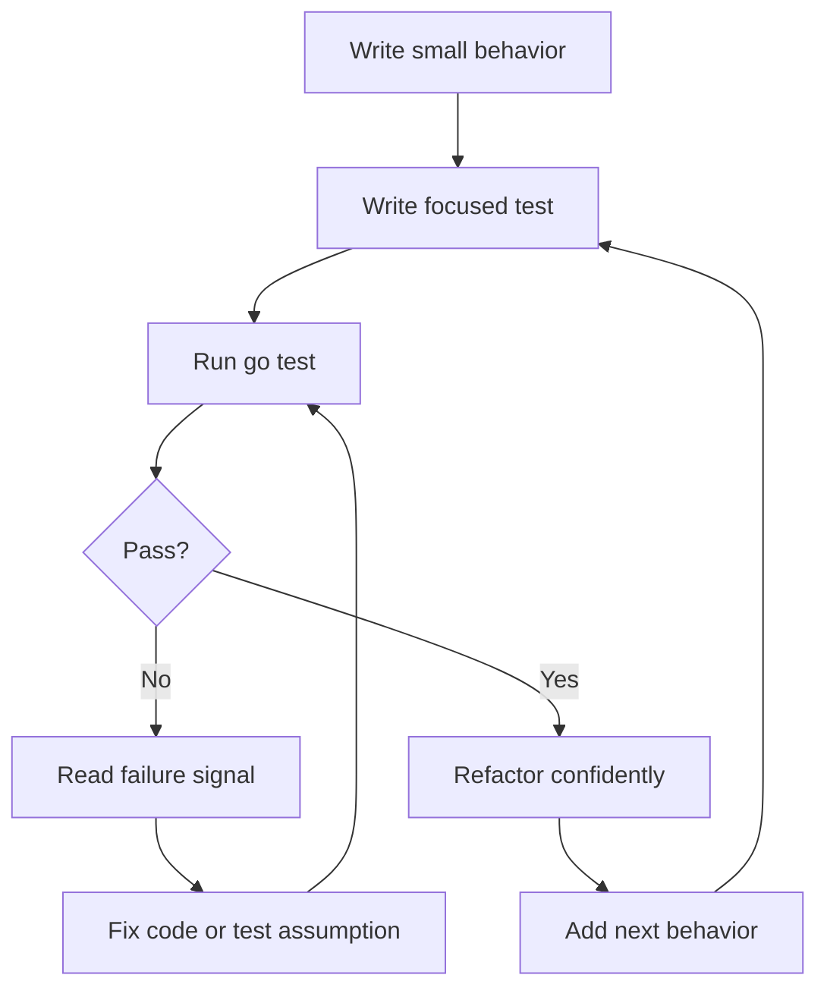
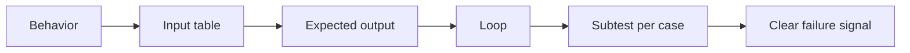

# Testing Fundamentals: Unit, Table Test, Example, dan Testdata

> Target part ini: kamu mampu menulis test Go yang sederhana, deterministik, mudah dibaca, tidak rapuh, dan benar-benar membantu mengoreksi desain program.

Testing di Go bukan sekadar aktivitas QA. Testing adalah feedback loop utama untuk belajar Go secara cepat.

Dalam framework Josh Kaufman, test adalah mekanisme **learn enough to self-correct**. Tanpa test, kamu hanya menulis kode lalu berharap benar. Dengan test yang baik, kamu punya sistem kecil yang memberi tahu:

- apakah pemahamanmu benar,
- apakah boundary function jelas,
- apakah failure path tertangani,
- apakah refactor aman,
- apakah desain terlalu sulit digunakan,
- apakah behavior domain sudah eksplisit.

Go membuat testing terasa ringan karena test adalah bagian dari toolchain standar. Tidak perlu test runner eksternal untuk mulai. File test ditulis dengan suffix `_test.go`, function test memakai signature tertentu, lalu dijalankan dengan `go test`.



---

## 1. Mental Model Testing di Go

Go testing punya filosofi yang berbeda dari banyak ecosystem enterprise.

Di banyak stack, testing sering dimulai dari framework besar, mocking library, annotation, lifecycle hook, dependency injection container, dan class hierarchy. Di Go, testing dimulai dari function biasa.

```go
func TestAdd(t *testing.T) {
    got := Add(2, 3)
    want := 5

    if got != want {
        t.Fatalf("Add(2, 3) = %d, want %d", got, want)
    }
}
```

Tidak ada magic. Tidak ada annotation. Tidak ada assertion DSL wajib. Tidak ada class test.

Konsekuensinya:

- test mudah dibaca,
- failure message harus kamu desain sendiri,
- helper harus eksplisit,
- test data harus jelas,
- setup besar biasanya menjadi smell,
- design yang sulit dites biasanya design yang terlalu terikat.

Testing di Go lebih dekat ke engineering feedback daripada ceremony.

---

## 2. Struktur File Test

File test Go harus memiliki suffix:

```txt
*_test.go
```

Contoh struktur:

```txt
calculator/
  calculator.go
  calculator_test.go
```

`calculator.go`:

```go
package calculator

func Add(a, b int) int {
    return a + b
}
```

`calculator_test.go`:

```go
package calculator

import "testing"

func TestAdd(t *testing.T) {
    got := Add(2, 3)
    want := 5

    if got != want {
        t.Fatalf("Add(2, 3) = %d, want %d", got, want)
    }
}
```

Jalankan:

```bash
go test ./...
```

Output sukses biasanya singkat:

```txt
ok      example.com/app/calculator    0.003s
```

Output gagal harus cukup informatif agar engineer tahu apa yang salah tanpa membuka debugger.

---

## 3. Internal Test vs External Test Package

Go memberi dua gaya package test.

### 3.1 Same-package test

```go
package user
```

Test berada di package yang sama dengan code production.

Keuntungan:

- bisa mengakses identifier unexported,
- cocok untuk test internal logic,
- mudah dipakai saat package masih kecil.

Kelemahan:

- test bisa terlalu dekat dengan implementation detail,
- refactor internal bisa memecahkan test padahal behavior publik tetap sama,
- test bisa memberi false confidence pada API publik.

### 3.2 External-package test

```go
package user_test
```

Test berada di package berbeda, seolah-olah menjadi consumer package tersebut.

Keuntungan:

- menguji API publik,
- memaksa package mudah digunakan,
- mengurangi coupling ke implementation detail,
- bagus untuk library dan package boundary penting.

Kelemahan:

- tidak bisa mengakses unexported identifier,
- kadang butuh setup lewat public API,
- kurang cocok untuk logic internal kecil.

### Rule of thumb

Gunakan kombinasi:

```txt
same package     -> test internal invariant penting
external package -> test public contract dan usability
```

Untuk package domain yang serius, external test sering memberi sinyal desain paling kuat.

---

## 4. Naming Test yang Baik

Convention umum:

```go
func TestFunctionName(t *testing.T) {}
func TestType_Method(t *testing.T) {}
func TestBehavior(t *testing.T) {}
```

Contoh:

```go
func TestParseUserID(t *testing.T) {}
func TestAccount_Withdraw(t *testing.T) {}
func TestWithdrawRejectsInsufficientBalance(t *testing.T) {}
```

Pilih nama yang menjawab:

- behavior apa yang diuji,
- kondisi apa yang penting,
- failure apa yang ingin dicegah.

Kurang baik:

```go
func TestUser(t *testing.T) {}
func TestLogic(t *testing.T) {}
func TestCase1(t *testing.T) {}
```

Lebih baik:

```go
func TestUserCanBeActivatedOnlyWhenEmailVerified(t *testing.T) {}
func TestWithdrawRejectsNegativeAmount(t *testing.T) {}
func TestParseUserIDRejectsEmptyString(t *testing.T) {}
```

Naming bukan kosmetik. Nama test adalah dokumentasi behavior.

---

## 5. Failure Message adalah Debugging Interface

Test yang gagal harus memberi sinyal jelas.

Buruk:

```go
if got != want {
    t.Fatal("wrong")
}
```

Lebih baik:

```go
if got != want {
    t.Fatalf("Add(2, 3) = %d, want %d", got, want)
}
```

Untuk object lebih kompleks:

```go
if diff := cmp.Diff(want, got); diff != "" {
    t.Fatalf("user mismatch (-want +got):\n%s", diff)
}
```

Dalam Go standard library, kamu bisa mulai dengan `reflect.DeepEqual`, tetapi untuk production test, library diff seperti `go-cmp` sering lebih enak dibaca.

Tanpa library eksternal:

```go
if !reflect.DeepEqual(got, want) {
    t.Fatalf("got %#v, want %#v", got, want)
}
```

Prinsip:

```txt
failure message = interface untuk engineer yang sedang debugging
```

---

## 6. `t.Fatal`, `t.Fatalf`, `t.Error`, dan `t.Errorf`

Ada dua kategori besar failure:

### Stop immediately

```go
t.Fatal("message")
t.Fatalf("message: %v", err)
```

Gunakan saat test tidak bisa lanjut.

Contoh:

```go
user, err := ParseUser(input)
if err != nil {
    t.Fatalf("ParseUser() error = %v", err)
}

if user.ID == "" {
    t.Fatal("user ID is empty")
}
```

Kalau parse gagal, mengecek `user.ID` tidak bermakna.

### Record failure and continue

```go
t.Error("message")
t.Errorf("message: %v", err)
```

Gunakan saat kamu ingin mengecek beberapa assertion sekaligus.

```go
if got.Name != want.Name {
    t.Errorf("Name = %q, want %q", got.Name, want.Name)
}
if got.Email != want.Email {
    t.Errorf("Email = %q, want %q", got.Email, want.Email)
}
```

Rule of thumb:

```txt
Fatal -> precondition gagal, test tidak valid untuk lanjut
Error -> assertion gagal, tapi test masih bisa lanjut memberi sinyal tambahan
```

---

## 7. Table-driven Test

Table-driven test adalah idiom penting di Go.

Daripada menulis banyak test function yang mirip:

```go
func TestIsAdult18(t *testing.T) {}
func TestIsAdult17(t *testing.T) {}
func TestIsAdult0(t *testing.T) {}
```

Gunakan table:

```go
func TestIsAdult(t *testing.T) {
    tests := []struct {
        name string
        age  int
        want bool
    }{
        {name: "adult at 18", age: 18, want: true},
        {name: "minor at 17", age: 17, want: false},
        {name: "zero age", age: 0, want: false},
    }

    for _, tt := range tests {
        t.Run(tt.name, func(t *testing.T) {
            got := IsAdult(tt.age)
            if got != tt.want {
                t.Fatalf("IsAdult(%d) = %v, want %v", tt.age, got, tt.want)
            }
        })
    }
}
```

Keuntungan:

- case mudah ditambah,
- struktur input-output eksplisit,
- edge case terlihat,
- failure per case bisa diisolasi dengan `t.Run`,
- nama case menjadi dokumentasi.

Mental model:



---

## 8. Jangan Membuat Table Test Terlalu Pintar

Table-driven test bisa berubah menjadi mini-framework yang sulit dibaca.

Smell:

```go
tests := []struct {
    name       string
    input      string
    setup      func(*Store)
    mutate     func(*Request)
    wantStatus int
    wantBody   any
    wantErr    error
    assert     func(t *testing.T, got Response)
    cleanup    func()
}{
    // 300 lines later...
}
```

Masalah:

- test case sulit dibaca,
- setup tersembunyi,
- behavior tidak jelas,
- failure sulit dipahami,
- table menjadi DSL pribadi.

Lebih baik pecah berdasarkan behavior:

```go
func TestCreateUserAcceptsValidInput(t *testing.T) {}
func TestCreateUserRejectsDuplicateEmail(t *testing.T) {}
func TestCreateUserRollsBackWhenAuditFails(t *testing.T) {}
```

Gunakan table untuk variasi kecil dalam behavior yang sama, bukan untuk menyatukan semua behavior ke satu test raksasa.

Rule:

```txt
Table test bagus untuk variasi input-output.
Table test buruk untuk skenario dengan setup, lifecycle, dan assertion yang sangat berbeda.
```

---

## 9. Subtests dengan `t.Run`

`t.Run` membuat subtest.

```go
func TestNormalizeEmail(t *testing.T) {
    tests := []struct {
        name  string
        input string
        want  string
    }{
        {"trim spaces", "  A@B.COM  ", "a@b.com"},
        {"lowercase", "USER@EXAMPLE.COM", "user@example.com"},
    }

    for _, tt := range tests {
        t.Run(tt.name, func(t *testing.T) {
            got := NormalizeEmail(tt.input)
            if got != tt.want {
                t.Fatalf("NormalizeEmail(%q) = %q, want %q", tt.input, got, tt.want)
            }
        })
    }
}
```

Keuntungan:

- output test lebih jelas,
- bisa menjalankan subtest tertentu,
- isolasi failure lebih baik.

Contoh menjalankan satu subtest:

```bash
go test ./... -run 'TestNormalizeEmail/lowercase'
```

Subtest sangat berguna untuk:

- table-driven test,
- grouping behavior,
- setup per scenario,
- parallel test dengan hati-hati.

---

## 10. Parallel Test

Go mendukung test paralel dengan `t.Parallel()`.

```go
func TestSomething(t *testing.T) {
    t.Parallel()

    // test body
}
```

Pada table test:

```go
func TestNormalizeEmail(t *testing.T) {
    tests := []struct {
        name  string
        input string
        want  string
    }{
        {"trim spaces", "  A@B.COM  ", "a@b.com"},
        {"lowercase", "USER@EXAMPLE.COM", "user@example.com"},
    }

    for _, tt := range tests {
        tt := tt
        t.Run(tt.name, func(t *testing.T) {
            t.Parallel()

            got := NormalizeEmail(tt.input)
            if got != tt.want {
                t.Fatalf("NormalizeEmail(%q) = %q, want %q", tt.input, got, tt.want)
            }
        })
    }
}
```

Perhatikan baris:

```go
tt := tt
```

Ini memastikan setiap closure subtest menangkap variable case yang benar, terutama untuk kompatibilitas dan kehati-hatian saat membaca pola lama.

Parallel test cocok jika:

- tidak memakai shared mutable state,
- tidak mengubah environment global,
- tidak memakai port fixed,
- tidak tergantung urutan execution,
- tidak menulis file path yang sama.

Jangan gunakan parallel test untuk mengejar performa kalau test belum deterministic.

---

## 11. Helper Test dan `t.Helper()`

Test helper mengurangi duplikasi.

```go
func mustParseUserID(t *testing.T, raw string) UserID {
    t.Helper()

    id, err := ParseUserID(raw)
    if err != nil {
        t.Fatalf("ParseUserID(%q) error = %v", raw, err)
    }
    return id
}
```

`t.Helper()` penting karena membuat line number failure menunjuk ke caller helper, bukan ke dalam helper.

Tanpa `t.Helper()`, failure sering menunjuk ke line helper, sehingga debugging lebih lambat.

Gunakan helper untuk:

- setup berulang,
- parsing fixture,
- membuat fake object,
- assertion domain khusus,
- cleanup resource.

Jangan gunakan helper untuk menyembunyikan behavior utama test.

Buruk:

```go
func TestCheckout(t *testing.T) {
    runCheckoutScenario(t)
}
```

Test utama tidak menjelaskan apa pun.

Lebih baik:

```go
func TestCheckoutRejectsExpiredCard(t *testing.T) {
    cart := newCartWithItem(t)
    card := expiredCard()

    _, err := Checkout(cart, card)

    assertErrorIs(t, err, ErrCardExpired)
}
```

Helper mendukung readability, bukan menggantikan readability.

---

## 12. Cleanup dengan `t.Cleanup`

`t.Cleanup` mendaftarkan function yang dijalankan setelah test selesai.

```go
func TestWritesFile(t *testing.T) {
    dir := t.TempDir()
    path := filepath.Join(dir, "out.txt")

    err := os.WriteFile(path, []byte("hello"), 0644)
    if err != nil {
        t.Fatalf("WriteFile() error = %v", err)
    }
}
```

`t.TempDir()` otomatis cleanup. Untuk resource lain:

```go
func newTestServer(t *testing.T) *httptest.Server {
    t.Helper()

    srv := httptest.NewServer(http.HandlerFunc(func(w http.ResponseWriter, r *http.Request) {
        w.WriteHeader(http.StatusOK)
    }))

    t.Cleanup(srv.Close)
    return srv
}
```

Keuntungan `t.Cleanup`:

- cleanup dekat dengan resource allocation,
- tetap jalan walaupun test fail,
- mengurangi lupa `defer` di banyak tempat,
- cocok untuk helper.

---

## 13. Testdata Directory

Go memiliki convention `testdata`.

File dalam `testdata` biasanya dipakai untuk fixture test dan tidak diperlakukan sebagai package Go.

Contoh:

```txt
parser/
  parser.go
  parser_test.go
  testdata/
    valid-user.json
    invalid-user.json
```

Test:

```go
func TestParseUserFromFile(t *testing.T) {
    data, err := os.ReadFile("testdata/valid-user.json")
    if err != nil {
        t.Fatalf("ReadFile() error = %v", err)
    }

    user, err := ParseUser(data)
    if err != nil {
        t.Fatalf("ParseUser() error = %v", err)
    }

    if user.Email != "ada@example.com" {
        t.Fatalf("Email = %q, want %q", user.Email, "ada@example.com")
    }
}
```

Gunakan `testdata` untuk:

- JSON/XML/CSV fixture,
- sample binary file,
- golden file,
- fuzz seed corpus,
- migration fixture,
- input kompleks yang tidak nyaman ditulis inline.

Jangan gunakan `testdata` untuk menyembunyikan test expectation yang seharusnya terlihat jelas.

---

## 14. Golden File Test

Golden file adalah file yang menyimpan expected output.

Cocok untuk:

- formatter,
- code generator,
- report generator,
- serializer,
- template renderer,
- snapshot output yang cukup besar.

Struktur:

```txt
report/
  report.go
  report_test.go
  testdata/
    invoice.input.json
    invoice.golden.txt
```

Test:

```go
func TestRenderInvoice(t *testing.T) {
    input, err := os.ReadFile("testdata/invoice.input.json")
    if err != nil {
        t.Fatalf("read input: %v", err)
    }

    got, err := RenderInvoice(input)
    if err != nil {
        t.Fatalf("RenderInvoice() error = %v", err)
    }

    want, err := os.ReadFile("testdata/invoice.golden.txt")
    if err != nil {
        t.Fatalf("read golden: %v", err)
    }

    if string(got) != string(want) {
        t.Fatalf("rendered invoice mismatch\n--- got ---\n%s\n--- want ---\n%s", got, want)
    }
}
```

Kadang golden file test dilengkapi flag update:

```go
var update = flag.Bool("update", false, "update golden files")

func TestRenderInvoice(t *testing.T) {
    got := renderForTest(t)
    goldenPath := "testdata/invoice.golden.txt"

    if *update {
        if err := os.WriteFile(goldenPath, got, 0644); err != nil {
            t.Fatalf("update golden: %v", err)
        }
    }

    want, err := os.ReadFile(goldenPath)
    if err != nil {
        t.Fatalf("read golden: %v", err)
    }

    if !bytes.Equal(got, want) {
        t.Fatalf("golden mismatch")
    }
}
```

Jalankan update:

```bash
go test ./... -update
```

Golden file berbahaya jika direview secara asal. Saat golden file berubah, reviewer harus tahu apakah perubahan itu memang expected behavior atau bug yang direkam ulang.

Checklist golden file:

- nama file jelas,
- output deterministic,
- diff mudah dibaca,
- update flag tidak dipakai sembarangan,
- perubahan golden file direview serius.

---

## 15. Example Test

Go mendukung example test.

Contoh:

```go
func ExampleNormalizeEmail() {
    fmt.Println(NormalizeEmail("  USER@EXAMPLE.COM "))
    // Output: user@example.com
}
```

Example test punya dua fungsi:

1. menjadi dokumentasi,
2. diverifikasi oleh `go test`.

Jika output tidak cocok, test gagal.

Example test sangat cocok untuk package publik karena memperlihatkan cara pakai API.

Contoh untuk type:

```go
func ExampleAccount_Withdraw() {
    acc := NewAccount("acc-1", 100)
    _ = acc.Withdraw(40)
    fmt.Println(acc.Balance())
    // Output: 60
}
```

Gunakan example test ketika:

- API perlu dokumentasi penggunaan,
- behavior mudah dijelaskan lewat output,
- kamu ingin contoh tetap compile dan tetap benar.

Jangan gunakan example test sebagai pengganti unit test lengkap.

---

## 16. Testing Error Path

Banyak test pemula hanya menguji happy path.

Padahal production failure sering berasal dari path seperti:

- invalid input,
- duplicate state,
- timeout,
- dependency error,
- permission denied,
- insufficient balance,
- corrupted file,
- empty payload,
- nil dependency,
- partial write.

Contoh error path:

```go
func TestParseUserIDRejectsEmptyString(t *testing.T) {
    _, err := ParseUserID("")
    if !errors.Is(err, ErrInvalidUserID) {
        t.Fatalf("ParseUserID(empty) error = %v, want %v", err, ErrInvalidUserID)
    }
}
```

Untuk custom error:

```go
func TestRegisterRejectsDuplicateEmail(t *testing.T) {
    svc := newUserServiceWithExistingEmail(t, "ada@example.com")

    _, err := svc.Register(context.Background(), RegisterCommand{
        Email: "ada@example.com",
    })

    var conflict *ConflictError
    if !errors.As(err, &conflict) {
        t.Fatalf("Register() error = %T %[1]v, want *ConflictError", err)
    }
    if conflict.Field != "email" {
        t.Fatalf("Conflict field = %q, want email", conflict.Field)
    }
}
```

Rule:

```txt
Every important failure mode deserves a test.
```

---

## 17. Testing Domain Logic Tanpa Infrastructure

Domain logic harus bisa dites tanpa database, HTTP server, message broker, atau file system.

Contoh domain:

```go
type Account struct {
    id      string
    balance int64
}

func (a *Account) Withdraw(amount int64) error {
    if amount <= 0 {
        return ErrInvalidAmount
    }
    if a.balance < amount {
        return ErrInsufficientBalance
    }
    a.balance -= amount
    return nil
}
```

Test:

```go
func TestAccountWithdraw(t *testing.T) {
    acc := &Account{id: "acc-1", balance: 100}

    err := acc.Withdraw(40)
    if err != nil {
        t.Fatalf("Withdraw() error = %v", err)
    }

    if got, want := acc.balance, int64(60); got != want {
        t.Fatalf("balance = %d, want %d", got, want)
    }
}
```

Failure path:

```go
func TestAccountWithdrawRejectsInsufficientBalance(t *testing.T) {
    acc := &Account{id: "acc-1", balance: 30}

    err := acc.Withdraw(40)
    if !errors.Is(err, ErrInsufficientBalance) {
        t.Fatalf("Withdraw() error = %v, want %v", err, ErrInsufficientBalance)
    }

    if got, want := acc.balance, int64(30); got != want {
        t.Fatalf("balance after failed withdraw = %d, want %d", got, want)
    }
}
```

Perhatikan invariant kedua:

```txt
failed withdrawal must not mutate balance
```

Test bagus bukan hanya mengecek error, tetapi juga memastikan state tidak rusak setelah failure.

---

## 18. Testing dengan Fake, Stub, dan Mock Minimal

Go tidak memerlukan mocking framework untuk banyak kasus.

Misal service butuh repository:

```go
type UserRepository interface {
    FindByEmail(ctx context.Context, email string) (User, error)
    Save(ctx context.Context, user User) error
}
```

Fake sederhana:

```go
type fakeUserRepository struct {
    users map[string]User
    saveErr error
}

func (r *fakeUserRepository) FindByEmail(ctx context.Context, email string) (User, error) {
    user, ok := r.users[email]
    if !ok {
        return User{}, ErrUserNotFound
    }
    return user, nil
}

func (r *fakeUserRepository) Save(ctx context.Context, user User) error {
    if r.saveErr != nil {
        return r.saveErr
    }
    r.users[user.Email] = user
    return nil
}
```

Test:

```go
func TestRegisterRejectsDuplicateEmail(t *testing.T) {
    repo := &fakeUserRepository{
        users: map[string]User{
            "ada@example.com": {Email: "ada@example.com"},
        },
    }
    svc := NewUserService(repo)

    _, err := svc.Register(context.Background(), RegisterCommand{Email: "ada@example.com"})

    if !errors.Is(err, ErrEmailAlreadyUsed) {
        t.Fatalf("Register() error = %v, want %v", err, ErrEmailAlreadyUsed)
    }
}
```

Fake cocok saat:

- behavior dependency sederhana,
- kamu butuh state in-memory,
- kamu ingin test readable,
- dependency punya interface kecil.

Mock framework sering berguna saat interaction contract kompleks, tetapi di Go interaction test yang terlalu detail sering menjadi brittle.

Rule:

```txt
Prefer fake with meaningful behavior over mock with excessive expectation.
```

---

## 19. Testing HTTP Handler

Go standard library menyediakan `net/http/httptest`.

Contoh handler:

```go
func HealthHandler(w http.ResponseWriter, r *http.Request) {
    w.WriteHeader(http.StatusOK)
    _, _ = w.Write([]byte(`{"status":"ok"}`))
}
```

Test:

```go
func TestHealthHandler(t *testing.T) {
    req := httptest.NewRequest(http.MethodGet, "/health", nil)
    rec := httptest.NewRecorder()

    HealthHandler(rec, req)

    res := rec.Result()
    defer res.Body.Close()

    if res.StatusCode != http.StatusOK {
        t.Fatalf("status = %d, want %d", res.StatusCode, http.StatusOK)
    }

    body, err := io.ReadAll(res.Body)
    if err != nil {
        t.Fatalf("ReadAll() error = %v", err)
    }

    if string(body) != `{"status":"ok"}` {
        t.Fatalf("body = %s", body)
    }
}
```

Untuk route lebih besar, test bisa memakai server:

```go
func TestCreateUserEndpoint(t *testing.T) {
    app := newTestApp(t)
    srv := httptest.NewServer(app.Router())
    t.Cleanup(srv.Close)

    body := strings.NewReader(`{"email":"ada@example.com"}`)
    res, err := http.Post(srv.URL+"/users", "application/json", body)
    if err != nil {
        t.Fatalf("Post() error = %v", err)
    }
    defer res.Body.Close()

    if res.StatusCode != http.StatusCreated {
        t.Fatalf("status = %d, want %d", res.StatusCode, http.StatusCreated)
    }
}
```

Handler test sebaiknya mengecek:

- status code,
- response body contract,
- content type,
- error mapping,
- request validation,
- method not allowed,
- malformed payload,
- cancellation atau timeout untuk kasus tertentu.

---

## 20. Testing Context dan Timeout

Production Go banyak memakai `context.Context`. Test harus bisa memverifikasi cancellation behavior.

Contoh:

```go
func TestServiceStopsWhenContextCancelled(t *testing.T) {
    ctx, cancel := context.WithCancel(context.Background())
    cancel()

    svc := NewSlowService()

    err := svc.DoWork(ctx)
    if !errors.Is(err, context.Canceled) {
        t.Fatalf("DoWork() error = %v, want context.Canceled", err)
    }
}
```

Untuk timeout:

```go
func TestServiceRespectsContextDeadline(t *testing.T) {
    ctx, cancel := context.WithTimeout(context.Background(), 10*time.Millisecond)
    defer cancel()

    svc := NewBlockingService()

    err := svc.DoWork(ctx)
    if !errors.Is(err, context.DeadlineExceeded) {
        t.Fatalf("DoWork() error = %v, want deadline exceeded", err)
    }
}
```

Hati-hati: test berbasis waktu mudah flaky.

Lebih baik desain dependency clock atau blocking channel agar test deterministic.

Buruk:

```go
time.Sleep(100 * time.Millisecond)
```

Lebih baik:

```go
select {
case <-done:
    // ok
case <-time.After(time.Second):
    t.Fatal("timeout waiting for done")
}
```

Gunakan timeout dalam test untuk mencegah hang, bukan sebagai mekanisme utama menentukan correctness.

---

## 21. Testing Concurrency Secara Aman

Test concurrency harus mencari invariant, bukan hanya “tidak crash”.

Contoh counter thread-safe:

```go
type Counter struct {
    mu sync.Mutex
    n  int
}

func (c *Counter) Inc() {
    c.mu.Lock()
    defer c.mu.Unlock()
    c.n++
}

func (c *Counter) Value() int {
    c.mu.Lock()
    defer c.mu.Unlock()
    return c.n
}
```

Test:

```go
func TestCounterConcurrentInc(t *testing.T) {
    var c Counter
    const workers = 100

    var wg sync.WaitGroup
    wg.Add(workers)

    for i := 0; i < workers; i++ {
        go func() {
            defer wg.Done()
            c.Inc()
        }()
    }

    wg.Wait()

    if got, want := c.Value(), workers; got != want {
        t.Fatalf("counter = %d, want %d", got, want)
    }
}
```

Jalankan dengan race detector:

```bash
go test ./... -race
```

Concurrency test tanpa `-race` sering tidak cukup.

Checklist concurrency test:

- tidak bergantung pada urutan goroutine,
- ada timeout untuk mencegah hang,
- semua goroutine selesai,
- channel ditutup oleh owner yang benar,
- tidak ada goroutine leak,
- race detector dijalankan di CI untuk test relevan.

---

## 22. Coverage: Berguna, tetapi Bukan Tujuan

Jalankan coverage:

```bash
go test ./... -cover
```

Coverage profile:

```bash
go test ./... -coverprofile=coverage.out
go tool cover -html=coverage.out
```

Coverage membantu menemukan area yang belum disentuh test. Tetapi coverage tinggi tidak menjamin correctness.

Contoh test coverage tinggi tapi buruk:

```go
func TestCreateUser(t *testing.T) {
    _, _ = CreateUser("ada@example.com")
}
```

Function dijalankan, tetapi behavior tidak diverifikasi.

Gunakan coverage sebagai sinyal:

- apakah failure path belum dites,
- apakah branch penting terlewat,
- apakah domain invariant belum tertutup,
- apakah package critical punya coverage rendah.

Jangan jadikan coverage sebagai satu-satunya target.

Better metric:

```txt
Can tests catch the bugs we actually fear?
```

---

## 23. Deterministic Test

Test deterministik memberi hasil sama setiap kali dijalankan.

Sumber flakiness umum:

- waktu real,
- random tanpa seed,
- shared global state,
- urutan map iteration,
- network eksternal,
- database shared,
- filesystem path fixed,
- parallel test yang mengubah environment,
- asumsi timezone,
- port fixed,
- goroutine leak.

### Time

Buruk:

```go
if time.Now().After(expiry) {
    // ...
}
```

Sulit dites.

Lebih baik inject clock:

```go
type Clock interface {
    Now() time.Time
}
```

### Random

Gunakan deterministic seed untuk test.

```go
r := rand.New(rand.NewSource(1))
```

### Environment variable

Gunakan `t.Setenv`:

```go
func TestConfigFromEnv(t *testing.T) {
    t.Setenv("APP_PORT", "8080")

    cfg, err := LoadConfig()
    if err != nil {
        t.Fatalf("LoadConfig() error = %v", err)
    }

    if cfg.Port != 8080 {
        t.Fatalf("Port = %d, want 8080", cfg.Port)
    }
}
```

### Temporary file

Gunakan `t.TempDir`:

```go
dir := t.TempDir()
path := filepath.Join(dir, "data.json")
```

Rule:

```txt
A test that sometimes fails without code change is operational debt.
```

---

## 24. Test Smells

### 24.1 Test terlalu tahu implementation

```go
if cache.items["x"].node.prev != nil {
    t.Fatal("...")
}
```

Kalau behavior public adalah `Get`, test sebaiknya lewat `Get`, bukan struktur internal, kecuali kamu memang sedang menguji invariant internal package.

### 24.2 Test bergantung urutan global

```go
func TestA(t *testing.T) { global = 1 }
func TestB(t *testing.T) { if global != 1 { ... } }
```

Test harus isolated.

### 24.3 Mock expectation terlalu detail

```txt
Expect FindByID once, then Save once, then Publish once, exactly in that order.
```

Jika order bukan contract domain, jangan test order.

### 24.4 Assertion terlalu lemah

```go
if err != nil {
    t.Fatal(err)
}
```

Ini hanya memastikan tidak error, belum memastikan output benar.

### 24.5 Test sulit dibaca karena helper berlebihan

```go
assertScenario(t, given(...), when(...), then(...))
```

DSL internal bisa berguna, tetapi sering membuat test opaque.

### 24.6 Test lambat tanpa alasan

Unit test seharusnya cepat. Test lambat perlu dikategorikan sebagai integration/e2e.

---

## 25. Struktur Test Suite yang Sehat

Untuk service Go production-grade:

```txt
service/
  internal/
    user/
      user.go
      user_test.go
    order/
      order.go
      order_test.go
    httpapi/
      handler.go
      handler_test.go
  testdata/
  integration/
    user_repository_test.go
```

Kategori test:

| Jenis Test | Tujuan | Dependency Eksternal | Kecepatan |
|---|---|---:|---:|
| Unit | Domain/function behavior | Tidak | Sangat cepat |
| Package/API | Public package contract | Tidak/minimal | Cepat |
| Integration | DB, filesystem, broker, HTTP dependency | Ya | Sedang |
| Contract | Compatibility antar service | Kadang | Sedang |
| E2E | Flow penuh | Ya | Lambat |
| Benchmark | Cost model | Tidak/terkontrol | Variatif |
| Fuzz | Edge-case discovery | Tidak/terkontrol | Bisa lama |

Part ini fokus unit/package test. Integration test akan muncul lagi pada bagian database dan service production.

---

## 26. Practice Project: Testing Domain Account

Buat package:

```txt
bank/
  account.go
  account_test.go
```

`account.go`:

```go
package bank

import "errors"

var (
    ErrInvalidAmount        = errors.New("invalid amount")
    ErrInsufficientBalance  = errors.New("insufficient balance")
    ErrAccountClosed        = errors.New("account closed")
)

type Account struct {
    id      string
    balance int64
    closed  bool
}

func NewAccount(id string, initialBalance int64) (*Account, error) {
    if id == "" {
        return nil, errors.New("account id is required")
    }
    if initialBalance < 0 {
        return nil, ErrInvalidAmount
    }
    return &Account{id: id, balance: initialBalance}, nil
}

func (a *Account) Deposit(amount int64) error {
    if a.closed {
        return ErrAccountClosed
    }
    if amount <= 0 {
        return ErrInvalidAmount
    }
    a.balance += amount
    return nil
}

func (a *Account) Withdraw(amount int64) error {
    if a.closed {
        return ErrAccountClosed
    }
    if amount <= 0 {
        return ErrInvalidAmount
    }
    if amount > a.balance {
        return ErrInsufficientBalance
    }
    a.balance -= amount
    return nil
}

func (a *Account) Close() error {
    if a.balance != 0 {
        return errors.New("cannot close account with non-zero balance")
    }
    a.closed = true
    return nil
}

func (a *Account) Balance() int64 {
    return a.balance
}
```

Tulis test untuk:

1. `NewAccount` menerima saldo awal valid.
2. `NewAccount` menolak id kosong.
3. `NewAccount` menolak saldo awal negatif.
4. `Deposit` menambah saldo.
5. `Deposit` menolak amount nol/negatif.
6. `Withdraw` mengurangi saldo.
7. `Withdraw` menolak insufficient balance.
8. Failed withdraw tidak mengubah saldo.
9. Closed account menolak deposit.
10. Closed account menolak withdraw.
11. Account hanya bisa close jika balance nol.

Contoh test:

```go
func TestAccountWithdraw(t *testing.T) {
    acc, err := NewAccount("acc-1", 100)
    if err != nil {
        t.Fatalf("NewAccount() error = %v", err)
    }

    err = acc.Withdraw(40)
    if err != nil {
        t.Fatalf("Withdraw() error = %v", err)
    }

    if got, want := acc.Balance(), int64(60); got != want {
        t.Fatalf("Balance() = %d, want %d", got, want)
    }
}
```

Table test untuk invalid amount:

```go
func TestAccountDepositRejectsInvalidAmount(t *testing.T) {
    tests := []struct {
        name   string
        amount int64
    }{
        {"zero", 0},
        {"negative", -10},
    }

    for _, tt := range tests {
        t.Run(tt.name, func(t *testing.T) {
            acc, err := NewAccount("acc-1", 100)
            if err != nil {
                t.Fatalf("NewAccount() error = %v", err)
            }

            err = acc.Deposit(tt.amount)
            if !errors.Is(err, ErrInvalidAmount) {
                t.Fatalf("Deposit(%d) error = %v, want %v", tt.amount, err, ErrInvalidAmount)
            }

            if got, want := acc.Balance(), int64(100); got != want {
                t.Fatalf("Balance() after failed deposit = %d, want %d", got, want)
            }
        })
    }
}
```

Tujuan latihan bukan banyak test, tetapi test yang menangkap invariant domain.

---

## 27. Checklist Testing Go

Gunakan checklist ini saat code review:

- Apakah nama test menjelaskan behavior?
- Apakah test punya failure message yang jelas?
- Apakah happy path dan failure path penting tercakup?
- Apakah test deterministic?
- Apakah test tidak bergantung network eksternal?
- Apakah test tidak bergantung order map iteration?
- Apakah temporary file memakai `t.TempDir`?
- Apakah env var memakai `t.Setenv`?
- Apakah helper memakai `t.Helper()`?
- Apakah cleanup memakai `t.Cleanup` saat relevan?
- Apakah table test tidak berubah menjadi DSL opaque?
- Apakah mock tidak terlalu detail terhadap implementation?
- Apakah test domain bisa jalan tanpa infrastructure?
- Apakah package public diuji sebagai consumer?
- Apakah race-prone code dites dengan `-race`?

---

## 28. Latihan 20 Jam: Slot Testing

Dalam 20 jam pertama belajar Go, alokasikan minimal 3 jam untuk testing.

Rencana:

| Waktu | Fokus | Output |
|---:|---|---|
| 30 menit | Membaca `testing` package basics | Bisa menjalankan `go test` |
| 45 menit | Unit test function kecil | 5 test passing |
| 45 menit | Table-driven test | 1 table test dengan 5 case |
| 30 menit | Error path | 3 failure test |
| 30 menit | Test helper dan `t.Helper()` | 2 helper kecil |
| 30 menit | `testdata` atau golden file | 1 fixture-based test |
| 30 menit | Coverage dan race detector | Menjalankan `-cover` dan `-race` |

Kriteria lulus:

```txt
Kamu bisa menulis package kecil, menulis test yang menjelaskan behavior, menjalankan test, membaca failure, memperbaiki kode, dan refactor tanpa takut.
```

---

## 29. Ringkasan

Testing di Go adalah skill inti, bukan pelengkap.

Hal yang harus diingat:

- Test adalah feedback loop untuk self-correction.
- File test memakai suffix `_test.go`.
- `go test ./...` adalah command default harian.
- Table-driven test cocok untuk variasi input-output.
- Subtest membuat failure lebih jelas.
- Helper harus memakai `t.Helper()`.
- `testdata` cocok untuk fixture eksternal.
- Golden file berguna tetapi harus direview hati-hati.
- Error path harus diuji sebagai behavior penting.
- Test harus deterministic.
- Coverage adalah sinyal, bukan tujuan.
- Test yang baik membuat desain package lebih jelas.

Setelah part ini, kamu seharusnya mampu membuat test suite kecil yang efektif untuk domain logic, function boundary, dan failure path.

Part berikutnya akan masuk ke benchmark, fuzzing, dan property-style thinking: bagaimana memakai test bukan hanya untuk contoh yang kamu pikirkan, tetapi juga untuk menemukan edge case yang belum kamu bayangkan.

---

## Referensi Resmi

- Go package `testing`: https://pkg.go.dev/testing
- Go tutorial: Add a test: https://go.dev/doc/tutorial/add-a-test
- Go Wiki: TableDrivenTests: https://go.dev/wiki/TableDrivenTests
- Go command `test`: https://pkg.go.dev/cmd/go/internal/test
- Effective Go: https://go.dev/doc/effective_go
