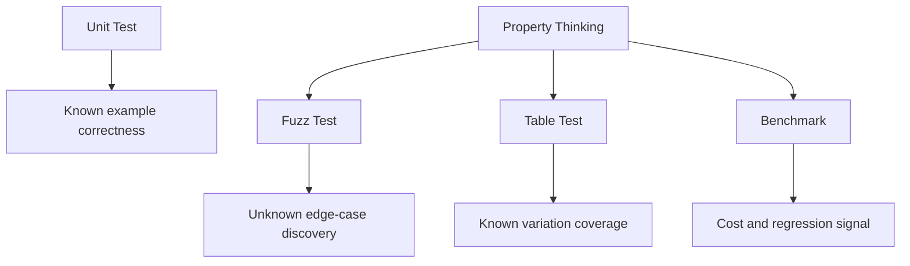
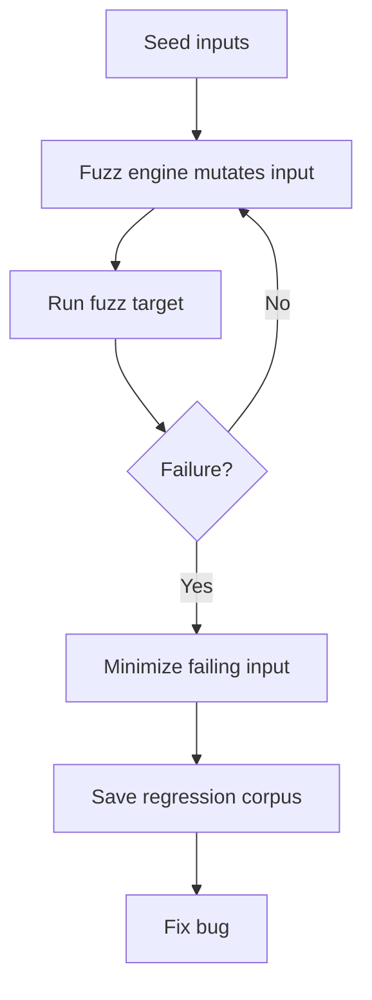
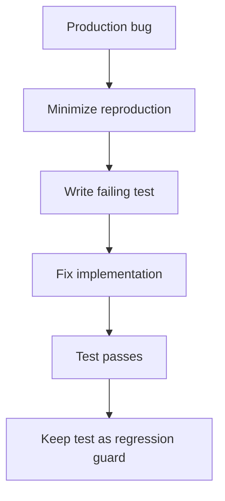

# Benchmarking, Fuzzing, dan Property-style Thinking

> Target part ini: kamu mampu memakai benchmark untuk mengukur cost, fuzzing untuk menemukan edge case, dan property-style thinking untuk mendesain test berdasarkan invariant, bukan hanya contoh input-output.

Unit test menjawab:

```txt
Apakah contoh behavior yang kita pilih sudah benar?
```

Benchmark menjawab:

```txt
Berapa cost behavior ini?
```

Fuzzing menjawab:

```txt
Apakah ada input yang belum kita bayangkan yang bisa merusak behavior ini?
```

Property-style thinking menjawab:

```txt
Invariant apa yang harus selalu benar untuk semua input valid?
```

Keempatnya saling melengkapi.



Dalam framework Kaufman, benchmark dan fuzzing memperkuat feedback loop. Kamu tidak hanya berlatih menulis kode, tetapi belajar membaca sinyal: correctness, cost, edge case, dan regression.

---

## 1. Benchmark Bukan Tebakan Performa

Engineer sering salah menebak bottleneck.

Contoh tebakan umum:

- “String concatenation pasti lambat.”
- “Pointer pasti lebih cepat dari value.”
- “Goroutine pasti mempercepat.”
- “Map pasti cukup cepat.”
- “JSON decode bukan masalah.”

Kadang benar. Sering salah konteks.

Benchmark membuat diskusi lebih konkret:

```txt
Before: menurut saya lebih cepat
After : benchmark menunjukkan 40 ns/op vs 120 ns/op, 0 allocs/op vs 2 allocs/op
```

Tetapi benchmark juga bisa menipu jika salah desain.

Tujuan part ini bukan membuat micro-benchmark sembarangan, melainkan membangun disiplin:

```txt
measure -> understand -> change -> measure again
```

---

## 2. Bentuk Benchmark Go

Benchmark ditulis di file `_test.go`.

Signature:

```go
func BenchmarkName(b *testing.B) {
    for i := 0; i < b.N; i++ {
        // code being measured
    }
}
```

Contoh:

```go
func BenchmarkNormalizeEmail(b *testing.B) {
    for i := 0; i < b.N; i++ {
        _ = NormalizeEmail("  USER@EXAMPLE.COM  ")
    }
}
```

Jalankan:

```bash
go test ./... -bench=.
```

Contoh output:

```txt
BenchmarkNormalizeEmail-8    12849382    92.3 ns/op
```

Artinya:

- benchmark bernama `BenchmarkNormalizeEmail`,
- berjalan dengan parallelism/runtime tertentu,
- loop dieksekusi sekitar 12,849,382 iterasi,
- rata-rata 92.3 nanosecond per operation.

`b.N` ditentukan oleh test runner. Jangan set manual.

---

## 3. Benchmark dengan Allocation Report

Allocation sering penting di Go karena allocation bisa meningkatkan tekanan GC.

Jalankan:

```bash
go test ./... -bench=. -benchmem
```

Output:

```txt
BenchmarkNormalizeEmail-8    12849382    92.3 ns/op    16 B/op    1 allocs/op
```

Kolom penting:

| Kolom | Makna |
|---|---|
| `ns/op` | waktu rata-rata per operation |
| `B/op` | byte allocation per operation |
| `allocs/op` | jumlah allocation per operation |

Allocation bukan selalu buruk. Tetapi allocation yang tidak perlu dalam hot path bisa berdampak pada latency dan throughput.

Rule:

```txt
Optimize allocation only after knowing path tersebut penting.
```

---

## 4. Benchmark Harus Menghindari Compiler Elimination

Compiler bisa menghapus kerja yang hasilnya tidak dipakai.

Buruk:

```go
func BenchmarkAdd(b *testing.B) {
    for i := 0; i < b.N; i++ {
        Add(1, 2)
    }
}
```

Kalau compiler bisa membuktikan hasil tidak dipakai, benchmark bisa tidak mengukur apa yang kamu kira.

Lebih aman:

```go
var sink int

func BenchmarkAdd(b *testing.B) {
    var result int
    for i := 0; i < b.N; i++ {
        result = Add(1, 2)
    }
    sink = result
}
```

Untuk object:

```go
var userSink User

func BenchmarkParseUser(b *testing.B) {
    data := []byte(`{"id":"u1","email":"ada@example.com"}`)

    var user User
    for i := 0; i < b.N; i++ {
        user, _ = ParseUser(data)
    }
    userSink = user
}
```

Gunakan sink hanya jika perlu. Jangan membuat benchmark lebih kompleks dari yang dibutuhkan.

---

## 5. Setup Cost vs Measured Cost

Kesalahan umum: setup ikut terukur.

Buruk:

```go
func BenchmarkParseUser(b *testing.B) {
    for i := 0; i < b.N; i++ {
        data := []byte(`{"id":"u1","email":"ada@example.com"}`)
        _, _ = ParseUser(data)
    }
}
```

Benchmark ini mengukur alokasi `data` juga, bukan hanya parsing.

Lebih baik:

```go
func BenchmarkParseUser(b *testing.B) {
    data := []byte(`{"id":"u1","email":"ada@example.com"}`)

    b.ResetTimer()

    for i := 0; i < b.N; i++ {
        _, _ = ParseUser(data)
    }
}
```

`b.ResetTimer()` mengabaikan waktu setup sebelum loop.

Jika setup per iteration memang bagian dari workload nyata, boleh dimasukkan. Yang penting sadar apa yang diukur.

---

## 6. `b.ReportAllocs`

Selain `-benchmem`, kamu bisa memanggil:

```go
func BenchmarkParseUser(b *testing.B) {
    b.ReportAllocs()

    data := []byte(`{"id":"u1","email":"ada@example.com"}`)
    b.ResetTimer()

    for i := 0; i < b.N; i++ {
        _, _ = ParseUser(data)
    }
}
```

Ini membuat benchmark melaporkan allocation saat benchmark dijalankan.

---

## 7. Sub-benchmark

Sub-benchmark mirip subtest.

```go
func BenchmarkNormalizeEmail(b *testing.B) {
    cases := []struct {
        name  string
        input string
    }{
        {"already_normal", "user@example.com"},
        {"upper_case", "USER@EXAMPLE.COM"},
        {"with_spaces", "  USER@EXAMPLE.COM  "},
    }

    for _, tc := range cases {
        b.Run(tc.name, func(b *testing.B) {
            for i := 0; i < b.N; i++ {
                _ = NormalizeEmail(tc.input)
            }
        })
    }
}
```

Output:

```txt
BenchmarkNormalizeEmail/already_normal-8
BenchmarkNormalizeEmail/upper_case-8
BenchmarkNormalizeEmail/with_spaces-8
```

Sub-benchmark cocok untuk membandingkan:

- ukuran input,
- algoritma,
- codec,
- mode konfigurasi,
- data shape,
- implementation lama vs baru.

---

## 8. Benchmark Ukuran Input

Bottleneck sering baru muncul pada ukuran tertentu.

```go
func BenchmarkDeduplicateStrings(b *testing.B) {
    sizes := []int{10, 100, 1000, 10000}

    for _, size := range sizes {
        b.Run(fmt.Sprintf("size_%d", size), func(b *testing.B) {
            input := makeStrings(size)
            b.ResetTimer()

            for i := 0; i < b.N; i++ {
                _ = DeduplicateStrings(input)
            }
        })
    }
}
```

Hasilnya bisa menunjukkan kompleksitas praktis.

Misalnya:

```txt
size_10       200 ns/op
size_100      2 us/op
size_1000     35 us/op
size_10000    5 ms/op
```

Ini membantu membedakan:

- cost konstan,
- cost linear,
- cost quadratic,
- cost akibat allocation,
- cost akibat hashing,
- cost akibat sorting.

---

## 9. Membandingkan Dua Implementasi

Misal ada dua implementation:

```go
func JoinSlow(parts []string) string {
    var out string
    for _, p := range parts {
        out += p
    }
    return out
}

func JoinBuilder(parts []string) string {
    var b strings.Builder
    for _, p := range parts {
        b.WriteString(p)
    }
    return b.String()
}
```

Benchmark:

```go
var stringSink string

func BenchmarkJoin(b *testing.B) {
    parts := []string{"a", "b", "c", "d", "e", "f", "g", "h"}

    b.Run("slow", func(b *testing.B) {
        var s string
        for i := 0; i < b.N; i++ {
            s = JoinSlow(parts)
        }
        stringSink = s
    })

    b.Run("builder", func(b *testing.B) {
        var s string
        for i := 0; i < b.N; i++ {
            s = JoinBuilder(parts)
        }
        stringSink = s
    })
}
```

Benchmark membantu, tetapi jangan berhenti di angka. Tanyakan:

- apakah workload representatif?
- apakah input size realistis?
- apakah readability memburuk?
- apakah improvement signifikan untuk path penting?
- apakah allocation berkurang?
- apakah complexity bertambah?

---

## 10. Benchstat untuk Membandingkan Perubahan

Untuk perubahan serius, gunakan beberapa run.

```bash
go test ./... -bench=. -benchmem -count=10 > old.txt
# ubah implementation
go test ./... -bench=. -benchmem -count=10 > new.txt
benchstat old.txt new.txt
```

`benchstat` membantu membandingkan distribusi hasil, bukan satu angka tunggal.

Satu run benchmark bisa noise karena:

- CPU scheduling,
- background process,
- thermal throttling,
- power mode,
- VM/container noise,
- GC timing,
- turbo boost.

Rule:

```txt
Never make a serious performance claim from one benchmark run.
```

---

## 11. Benchmark Smells

### 11.1 Mengukur hal yang tidak relevan

Benchmark micro-operation yang bukan bottleneck production.

### 11.2 Workload tidak realistis

Input terlalu kecil, terlalu bersih, atau tidak mencerminkan data nyata.

### 11.3 Setup ikut terukur tanpa sengaja

Gunakan `b.ResetTimer()`.

### 11.4 Hasil tidak dipakai

Compiler bisa menghilangkan computation.

### 11.5 Benchmark menyebabkan shared state pollution

State berubah antar iteration sehingga hasil makin lama makin beda.

### 11.6 Membandingkan readability buruk dengan improvement kecil

Jika improvement 1% tetapi code menjadi opaque, belum tentu layak.

### 11.7 Tidak mengukur allocation

Untuk Go, `allocs/op` sering sama pentingnya dengan `ns/op`.

---

## 12. Fuzzing: Menemukan Input yang Tidak Kamu Pikirkan

Fuzzing adalah testing otomatis yang memanipulasi input untuk mencari bug. Di Go, fuzzing native terintegrasi dengan `go test`.

Fuzzing sangat berguna untuk code yang menerima input tidak sepenuhnya terpercaya:

- parser,
- decoder,
- validator,
- URL handling,
- path handling,
- serializer/deserializer,
- token parser,
- compression/decompression,
- protocol handling,
- template rendering,
- boundary security.

Unit test menguji contoh yang kamu pilih. Fuzzing mencari contoh yang kamu tidak pilih.



---

## 13. Bentuk Fuzz Test Go

Signature:

```go
func FuzzName(f *testing.F) {
    f.Add(seed1)
    f.Add(seed2)

    f.Fuzz(func(t *testing.T, input Type) {
        // fuzz target
    })
}
```

Contoh:

```go
func FuzzParseUserID(f *testing.F) {
    f.Add("user_123")
    f.Add("")
    f.Add("../admin")
    f.Add("こんにちは")

    f.Fuzz(func(t *testing.T, raw string) {
        id, err := ParseUserID(raw)
        if err != nil {
            return
        }

        if string(id) == "" {
            t.Fatalf("ParseUserID(%q) returned empty id without error", raw)
        }
    })
}
```

Jalankan seed corpus sebagai test biasa:

```bash
go test ./...
```

Jalankan fuzzing:

```bash
go test ./... -fuzz=FuzzParseUserID
```

Batasi durasi:

```bash
go test ./... -fuzz=FuzzParseUserID -fuzztime=30s
```

---

## 14. Fuzzing Bukan Random Assertion Sembarangan

Fuzz test yang buruk:

```go
func FuzzParse(f *testing.F) {
    f.Fuzz(func(t *testing.T, s string) {
        Parse(s)
    })
}
```

Ini hanya memastikan tidak panic, dan itu pun mungkin terlalu lemah.

Lebih baik cari invariant.

Contoh invariant parser:

```txt
Jika Parse sukses, hasilnya harus memenuhi Valid().
```

```go
func FuzzParseUserID(f *testing.F) {
    f.Add("user_123")

    f.Fuzz(func(t *testing.T, raw string) {
        id, err := ParseUserID(raw)
        if err != nil {
            return
        }

        if !id.Valid() {
            t.Fatalf("ParseUserID(%q) returned invalid ID %q", raw, id)
        }
    })
}
```

Contoh invariant round-trip:

```txt
decode(encode(x)) == x
```

```go
func FuzzJSONRoundTrip(f *testing.F) {
    f.Add("ada@example.com", int64(42))

    f.Fuzz(func(t *testing.T, email string, balance int64) {
        if balance < 0 {
            return
        }

        in := User{Email: email, Balance: balance}

        data, err := EncodeUser(in)
        if err != nil {
            t.Fatalf("EncodeUser() error = %v", err)
        }

        out, err := DecodeUser(data)
        if err != nil {
            t.Fatalf("DecodeUser(EncodeUser(x)) error = %v", err)
        }

        if out != in {
            t.Fatalf("round trip mismatch: got %#v, want %#v", out, in)
        }
    })
}
```

---

## 15. Property-style Thinking

Property-style thinking berarti mendesain test dari invariant umum.

Bukan:

```txt
Untuk input A, output B.
```

Tetapi:

```txt
Untuk semua input yang memenuhi constraint X, property Y harus selalu benar.
```

Contoh property:

| Domain | Property |
|---|---|
| Normalize email | hasil tidak punya leading/trailing spaces |
| Sort | output terurut dan elemen sama dengan input |
| Encode/decode | decode(encode(x)) == x |
| Compress/decompress | decompress(compress(x)) == x |
| Parser | jika sukses, output valid |
| Sanitizer | output tidak mengandung karakter terlarang |
| Money transfer | total balance tidak berubah |
| Deduplication | output tidak punya duplicate dan semua berasal dari input |
| Pagination | tidak ada item hilang/duplikat antar page |
| State transition | transition invalid tidak mengubah state |

Fuzzing paling kuat saat kamu punya property yang jelas.

---

## 16. Contoh Property: Sort

Function:

```go
func SortInts(xs []int) []int {
    ys := append([]int(nil), xs...)
    sort.Ints(ys)
    return ys
}
```

Property:

1. output sorted,
2. output punya panjang sama,
3. output punya multiset elemen yang sama,
4. input tidak termutasi.

Fuzz:

```go
func FuzzSortInts(f *testing.F) {
    f.Add([]byte{3, 1, 2})
    f.Add([]byte{})
    f.Add([]byte{255, 0, 255})

    f.Fuzz(func(t *testing.T, data []byte) {
        input := make([]int, len(data))
        for i, b := range data {
            input[i] = int(b)
        }

        original := append([]int(nil), input...)
        got := SortInts(input)

        if !sort.IntsAreSorted(got) {
            t.Fatalf("output is not sorted: %v", got)
        }
        if len(got) != len(input) {
            t.Fatalf("len(got) = %d, want %d", len(got), len(input))
        }
        if !sameMultiset(got, original) {
            t.Fatalf("output elements differ: got %v, input %v", got, original)
        }
        if !slices.Equal(input, original) {
            t.Fatalf("input mutated: got %v, want %v", input, original)
        }
    })
}
```

Helper:

```go
func sameMultiset(a, b []int) bool {
    if len(a) != len(b) {
        return false
    }

    counts := make(map[int]int, len(a))
    for _, x := range a {
        counts[x]++
    }
    for _, x := range b {
        counts[x]--
        if counts[x] < 0 {
            return false
        }
    }
    return true
}
```

Perhatikan: kita tidak menyebut expected output untuk setiap input. Kita menyebut sifat yang selalu benar.

---

## 17. Fuzz Seed Corpus

`f.Add` menambahkan seed input.

Seed yang baik mencakup:

- empty input,
- minimal valid input,
- typical valid input,
- maximum-ish input,
- unicode,
- invalid syntax,
- reserved characters,
- path traversal pattern,
- SQL-like string,
- repeated delimiters,
- nested structure,
- very long string jika relevan.

Contoh:

```go
func FuzzNormalizePath(f *testing.F) {
    seeds := []string{
        "",
        "/",
        "/users/ada",
        "../admin",
        "/users//ada",
        "/users/%2e%2e/admin",
        "こんにちは",
        strings.Repeat("a", 1024),
    }

    for _, seed := range seeds {
        f.Add(seed)
    }

    f.Fuzz(func(t *testing.T, path string) {
        got, err := NormalizePath(path)
        if err != nil {
            return
        }
        if strings.Contains(got, "..") {
            t.Fatalf("NormalizePath(%q) = %q contains traversal", path, got)
        }
    })
}
```

Seed bukan exhaustive list. Seed adalah starting point untuk mutation engine.

---

## 18. Regression dari Fuzz Failure

Saat fuzzing menemukan failure, Go menyimpan input yang memicu failure agar bisa dijalankan ulang sebagai regression.

Workflow:

1. Jalankan fuzz.
2. Fuzz menemukan input gagal.
3. Baca failing input.
4. Reproduce dengan `go test`.
5. Perbaiki bug.
6. Pastikan input gagal menjadi regression corpus.

Mental model:

```txt
fuzz failure is not noise; it is a new test case discovered by the machine.
```

Jangan hanya mengubah fuzz test agar failure hilang. Klasifikasikan dulu:

- Apakah input valid?
- Kalau valid, apakah code salah?
- Kalau invalid, apakah function harus return error, bukan panic?
- Apakah property test terlalu kuat?
- Apakah expectation salah?
- Apakah ada vulnerability?

---

## 19. Fuzzing Security-sensitive Code

Fuzzing sangat relevan untuk security boundary.

Target bagus:

- request parser,
- token parser,
- authorization expression parser,
- file path normalizer,
- template renderer,
- markdown/html sanitizer,
- JSON schema validator,
- custom query language,
- import/export processor,
- webhook verifier,
- compression parser,
- binary protocol decoder.

Cari property seperti:

```txt
No panic for any input.
Invalid input returns error.
Successful parse produces valid object.
Normalizer never returns path outside allowed root.
Sanitizer never emits unsafe tag.
Decoder never allocates beyond configured limit.
```

Contoh path safety:

```go
func FuzzSafeJoin(f *testing.F) {
    f.Add("users/ada.txt")
    f.Add("../secret.txt")
    f.Add("/etc/passwd")

    root := "/safe/root"

    f.Fuzz(func(t *testing.T, name string) {
        got, err := SafeJoin(root, name)
        if err != nil {
            return
        }

        cleanRoot := filepath.Clean(root)
        cleanGot := filepath.Clean(got)

        if cleanGot != cleanRoot && !strings.HasPrefix(cleanGot, cleanRoot+string(os.PathSeparator)) {
            t.Fatalf("SafeJoin(%q, %q) escaped root: %q", root, name, got)
        }
    })
}
```

Fuzzing tidak membuktikan aman, tetapi memperbesar peluang menemukan edge case berbahaya.

---

## 20. Fuzzing Smells

### 20.1 Fuzz target punya side effect eksternal

Jangan fuzz function yang menulis database production, memanggil network eksternal, atau mengubah file global.

### 20.2 Fuzz terlalu lambat

Fuzz target dipanggil sangat banyak. Jaga agar cepat.

### 20.3 Property tidak jelas

Kalau test hanya memanggil function tanpa assertion, sinyalnya lemah.

### 20.4 Panic dipakai untuk invalid input

Untuk input dari luar, invalid input seharusnya error, bukan panic.

### 20.5 Fuzz test flaky

Jika fuzz target tergantung waktu, random global, atau shared state, hasilnya sulit dipercaya.

### 20.6 Fuzzing semua hal

Tidak semua function perlu fuzz. Prioritaskan parser, decoder, validator, sanitizer, dan boundary yang menerima input tidak terpercaya.

---

## 21. Benchmark dan Fuzzing untuk Function yang Sama

Misal kita punya normalizer:

```go
func NormalizeEmail(s string) string {
    s = strings.TrimSpace(s)
    s = strings.ToLower(s)
    return s
}
```

Unit test:

```go
func TestNormalizeEmail(t *testing.T) {
    tests := []struct {
        name  string
        input string
        want  string
    }{
        {"trim and lowercase", "  USER@EXAMPLE.COM  ", "user@example.com"},
        {"already normalized", "user@example.com", "user@example.com"},
    }

    for _, tt := range tests {
        t.Run(tt.name, func(t *testing.T) {
            got := NormalizeEmail(tt.input)
            if got != tt.want {
                t.Fatalf("NormalizeEmail(%q) = %q, want %q", tt.input, got, tt.want)
            }
        })
    }
}
```

Fuzz property:

```go
func FuzzNormalizeEmail(f *testing.F) {
    f.Add("  USER@EXAMPLE.COM  ")
    f.Add("")
    f.Add("こんにちは@EXAMPLE.COM")

    f.Fuzz(func(t *testing.T, input string) {
        got := NormalizeEmail(input)

        if strings.TrimSpace(got) != got {
            t.Fatalf("NormalizeEmail(%q) = %q has surrounding space", input, got)
        }
        if strings.ToLower(got) != got {
            t.Fatalf("NormalizeEmail(%q) = %q is not lowercase", input, got)
        }
    })
}
```

Benchmark:

```go
var normalizedSink string

func BenchmarkNormalizeEmail(b *testing.B) {
    inputs := []string{
        "user@example.com",
        "  USER@EXAMPLE.COM  ",
        "long.email.address+tag@subdomain.example.com",
    }

    for _, input := range inputs {
        b.Run(input, func(b *testing.B) {
            var out string
            for i := 0; i < b.N; i++ {
                out = NormalizeEmail(input)
            }
            normalizedSink = out
        })
    }
}
```

Satu function, tiga jenis feedback:

| Feedback | Pertanyaan |
|---|---|
| Unit test | Apakah contoh behavior benar? |
| Fuzz test | Apakah property selalu benar untuk input luas? |
| Benchmark | Berapa cost behavior pada input tertentu? |

---

## 22. Regression Test dari Bug Production

Setiap bug production seharusnya menjadi test.

Workflow:



Contoh bug:

```txt
NormalizeEmail tidak menghapus newline di akhir input.
```

Regression test:

```go
func TestNormalizeEmailTrimsNewline(t *testing.T) {
    got := NormalizeEmail("USER@EXAMPLE.COM\n")
    want := "user@example.com"

    if got != want {
        t.Fatalf("NormalizeEmail() = %q, want %q", got, want)
    }
}
```

Kalau bug ditemukan fuzzing, simpan inputnya sebagai seed atau corpus.

Prinsip:

```txt
A bug without a regression test is a bug that can return.
```

---

## 23. Performance Regression Guard

Benchmark bisa dipakai sebagai guard informal.

Tidak semua benchmark harus memblokir CI, karena hasil benchmark bisa noisy. Tetapi untuk package performance-critical, kamu bisa:

- menjalankan benchmark periodik,
- menyimpan hasil baseline,
- memakai benchstat di review performa,
- menjalankan benchmark pada dedicated runner,
- membuat threshold hanya untuk benchmark stabil.

Contoh script:

```bash
go test ./internal/parser -bench=. -benchmem -count=10 > parser-bench.txt
```

Review PR:

```txt
Parser allocation naik dari 1 alloc/op ke 5 alloc/op.
Apakah perubahan ini disengaja?
Apakah path ini hot?
Apakah ada cara mempertahankan readability tanpa allocation tambahan?
```

Benchmark bukan gate universal. Benchmark adalah alat untuk percakapan berbasis data.

---

## 24. Latihan: Parser UserID

Buat function:

```go
type UserID string

func ParseUserID(raw string) (UserID, error) {
    raw = strings.TrimSpace(raw)
    if raw == "" {
        return "", errors.New("user id is required")
    }
    if len(raw) > 64 {
        return "", errors.New("user id is too long")
    }
    for _, r := range raw {
        if !(r >= 'a' && r <= 'z' || r >= '0' && r <= '9' || r == '_' || r == '-') {
            return "", errors.New("user id contains invalid character")
        }
    }
    return UserID(raw), nil
}
```

Unit test:

```go
func TestParseUserID(t *testing.T) {
    tests := []struct {
        name    string
        input   string
        want    UserID
        wantErr bool
    }{
        {"valid", "user_123", "user_123", false},
        {"trim spaces", " user_123 ", "user_123", false},
        {"empty", "", "", true},
        {"uppercase", "USER", "", true},
        {"slash", "../admin", "", true},
    }

    for _, tt := range tests {
        t.Run(tt.name, func(t *testing.T) {
            got, err := ParseUserID(tt.input)
            if tt.wantErr {
                if err == nil {
                    t.Fatalf("ParseUserID(%q) error = nil, want error", tt.input)
                }
                return
            }
            if err != nil {
                t.Fatalf("ParseUserID(%q) error = %v", tt.input, err)
            }
            if got != tt.want {
                t.Fatalf("ParseUserID(%q) = %q, want %q", tt.input, got, tt.want)
            }
        })
    }
}
```

Fuzz test:

```go
func FuzzParseUserID(f *testing.F) {
    seeds := []string{
        "user_123",
        "",
        "../admin",
        "USER",
        "hello-world",
        strings.Repeat("a", 65),
    }

    for _, seed := range seeds {
        f.Add(seed)
    }

    f.Fuzz(func(t *testing.T, raw string) {
        id, err := ParseUserID(raw)
        if err != nil {
            return
        }

        if id == "" {
            t.Fatalf("ParseUserID(%q) returned empty id without error", raw)
        }
        if len(id) > 64 {
            t.Fatalf("ParseUserID(%q) returned too long id %q", raw, id)
        }
        for _, r := range string(id) {
            if !(r >= 'a' && r <= 'z' || r >= '0' && r <= '9' || r == '_' || r == '-') {
                t.Fatalf("ParseUserID(%q) returned invalid id %q", raw, id)
            }
        }
    })
}
```

Benchmark:

```go
var userIDSink UserID

func BenchmarkParseUserID(b *testing.B) {
    inputs := []string{
        "user_123",
        " user_123 ",
        "hello-world-123",
    }

    for _, input := range inputs {
        b.Run(input, func(b *testing.B) {
            var id UserID
            for i := 0; i < b.N; i++ {
                id, _ = ParseUserID(input)
            }
            userIDSink = id
        })
    }
}
```

Commands:

```bash
go test ./...
go test ./... -run TestParseUserID
go test ./... -fuzz=FuzzParseUserID -fuzztime=30s
go test ./... -bench=BenchmarkParseUserID -benchmem
```

---

## 25. Latihan: Deduplication

Function:

```go
func Deduplicate(xs []string) []string {
    seen := make(map[string]struct{}, len(xs))
    out := make([]string, 0, len(xs))

    for _, x := range xs {
        if _, ok := seen[x]; ok {
            continue
        }
        seen[x] = struct{}{}
        out = append(out, x)
    }

    return out
}
```

Properties:

1. output tidak punya duplicate,
2. semua output berasal dari input,
3. order first occurrence dipertahankan,
4. input tidak termutasi.

Table test:

```go
func TestDeduplicate(t *testing.T) {
    tests := []struct {
        name  string
        input []string
        want  []string
    }{
        {"empty", nil, nil},
        {"no duplicate", []string{"a", "b"}, []string{"a", "b"}},
        {"with duplicate", []string{"a", "b", "a"}, []string{"a", "b"}},
        {"preserve first order", []string{"b", "a", "b"}, []string{"b", "a"}},
    }

    for _, tt := range tests {
        t.Run(tt.name, func(t *testing.T) {
            got := Deduplicate(tt.input)
            if !slices.Equal(got, tt.want) {
                t.Fatalf("Deduplicate(%v) = %v, want %v", tt.input, got, tt.want)
            }
        })
    }
}
```

Fuzz dengan byte input:

```go
func FuzzDeduplicate(f *testing.F) {
    f.Add("a,b,a")
    f.Add("")
    f.Add("x,x,x")

    f.Fuzz(func(t *testing.T, raw string) {
        input := strings.Split(raw, ",")
        original := append([]string(nil), input...)

        got := Deduplicate(input)

        if !slices.Equal(input, original) {
            t.Fatalf("input mutated: got %v, want %v", input, original)
        }
        if hasDuplicate(got) {
            t.Fatalf("output has duplicate: %v", got)
        }
        for _, x := range got {
            if !contains(original, x) {
                t.Fatalf("output contains value not in input: %q", x)
            }
        }
    })
}
```

Benchmark size:

```go
func BenchmarkDeduplicate(b *testing.B) {
    for _, size := range []int{10, 100, 1000, 10000} {
        b.Run(fmt.Sprintf("size_%d", size), func(b *testing.B) {
            input := makeDuplicateInput(size)
            b.ResetTimer()

            for i := 0; i < b.N; i++ {
                _ = Deduplicate(input)
            }
        })
    }
}
```

---

## 26. How to Decide: Unit Test, Fuzz, atau Benchmark?

Gunakan matrix ini:

| Situasi | Tool Utama |
|---|---|
| Behavior domain spesifik | Unit/table test |
| Banyak variasi input-output eksplisit | Table test |
| Public API usage example | Example test |
| Parser/validator/sanitizer | Fuzz test |
| Edge case tidak mudah dihitung manual | Fuzz test |
| Hot path dicurigai lambat | Benchmark |
| Membandingkan dua implementation | Benchmark + benchstat |
| Bug production pernah terjadi | Regression test |
| Race/concurrency risk | Unit/concurrency test + `-race` |
| Compatibility antar service | Contract/integration test |

Jangan memilih tool karena terlihat advanced. Pilih berdasarkan pertanyaan engineering yang ingin dijawab.

---

## 27. Checklist Benchmark

Sebelum mempercayai benchmark:

- Apakah workload realistis?
- Apakah setup cost sengaja dimasukkan atau sudah dipisah?
- Apakah hasil computation dipakai agar tidak dieliminasi compiler?
- Apakah benchmark dijalankan lebih dari sekali?
- Apakah allocation dilaporkan?
- Apakah input size bervariasi?
- Apakah benchmark berjalan pada environment yang cukup stabil?
- Apakah improvement signifikan secara product/system?
- Apakah readability dan maintainability tetap baik?
- Apakah benchmark mengukur path yang memang penting?

---

## 28. Checklist Fuzzing

Sebelum menambahkan fuzz test:

- Apakah target menerima input tidak terpercaya?
- Apakah function cukup cepat untuk dipanggil berkali-kali?
- Apakah side effect eksternal dihindari?
- Apakah seed corpus mencakup edge case penting?
- Apakah property jelas?
- Apakah invalid input boleh return error?
- Apakah panic dianggap bug?
- Apakah failure bisa direproduksi?
- Apakah corpus regression disimpan?
- Apakah fuzzing dijalankan dengan durasi terbatas di workflow lokal/CI?

---

## 29. Latihan 20 Jam: Slot Benchmark dan Fuzzing

Dalam 20 jam pertama, alokasikan minimal 2 jam untuk benchmark dan fuzzing.

| Waktu | Fokus | Output |
|---:|---|---|
| 20 menit | Benchmark dasar | 1 benchmark jalan |
| 20 menit | `-benchmem` | membaca `ns/op`, `B/op`, `allocs/op` |
| 20 menit | Sub-benchmark | benchmark 3 input size |
| 20 menit | Fuzz test dasar | 1 fuzz target dengan seed |
| 20 menit | Property-style thinking | 3 property tertulis |
| 20 menit | Regression workflow | mengubah edge case menjadi test |

Kriteria lulus:

```txt
Kamu bisa membedakan test correctness, benchmark cost, dan fuzzing edge-case discovery; lalu memilih tool yang tepat untuk pertanyaan engineering yang tepat.
```

---

## 30. Ringkasan

Benchmark, fuzzing, dan property-style thinking adalah alat untuk meningkatkan kedalaman engineering.

Hal yang harus diingat:

- Benchmark mengukur cost, bukan membuktikan correctness.
- `b.N` dikontrol oleh test runner.
- Gunakan `-benchmem` untuk melihat allocation.
- Pisahkan setup cost dari measured cost jika perlu.
- Jangan percaya satu benchmark run untuk klaim serius.
- Fuzzing mencari input yang tidak kamu bayangkan.
- Fuzz test paling kuat jika property jelas.
- Seed corpus adalah starting point, bukan exhaustive list.
- Fuzz failure harus diperlakukan sebagai regression candidate.
- Property-style thinking membuat test lebih general daripada contoh manual.
- Bug production sebaiknya selalu menghasilkan regression test.

Setelah part ini, kamu tidak hanya bisa menulis test Go, tetapi juga mulai bisa memakai toolchain Go untuk mengukur cost dan menemukan edge case secara sistematis.

Part berikutnya akan masuk ke concurrency: goroutine, channel, select, worker pool, pipeline, backpressure, dan goroutine leak.

---

## Referensi Resmi

- Go package `testing`: https://pkg.go.dev/testing
- Go fuzzing documentation: https://go.dev/doc/security/fuzz/
- Tutorial: Getting started with fuzzing: https://go.dev/doc/tutorial/fuzz
- Go 1.18 release notes, fuzzing introduction: https://go.dev/doc/go1.18
- Go Wiki: TableDrivenTests: https://go.dev/wiki/TableDrivenTests
