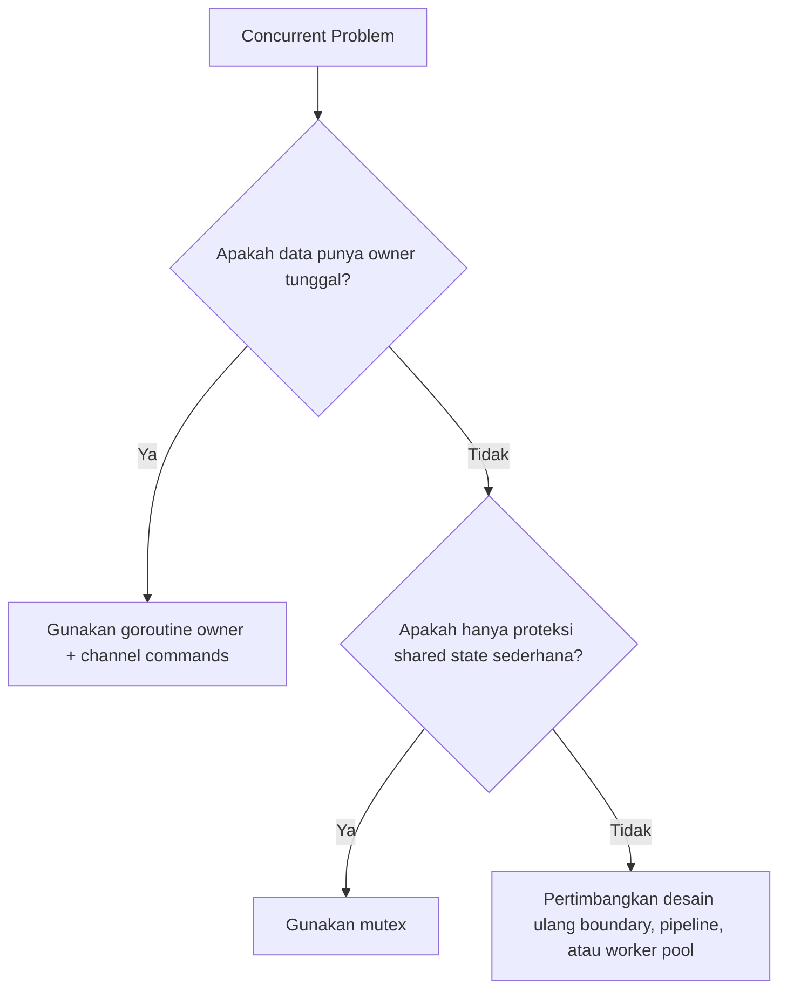
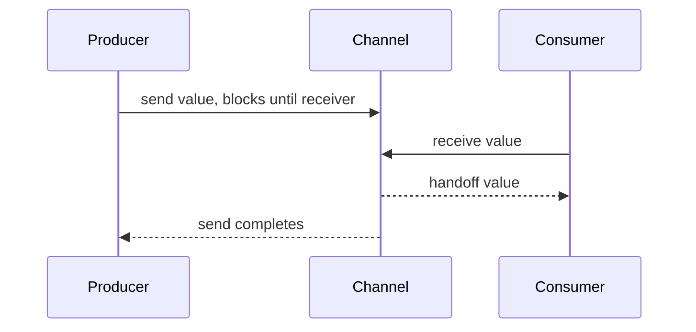
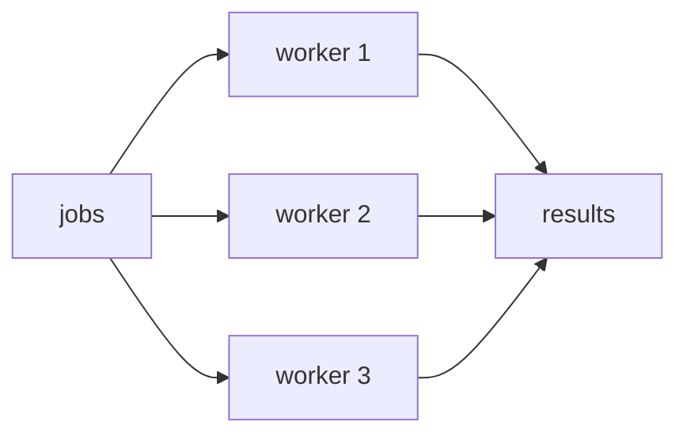
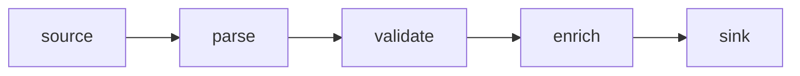

# Goroutines, Channels, dan Select: Mental Model Concurrency Go

> Target part ini: kamu mampu menulis concurrent Go code yang bukan hanya “jalan”, tetapi punya lifecycle, cancellation, ownership, backpressure, dan failure boundary yang jelas.

Concurrency di Go terlihat sederhana karena sintaksnya kecil: `go`, `chan`, `select`. Justru karena kecil, kesalahan desain sering tidak terlihat di permukaan. Goroutine yang bocor, channel yang tidak pernah ditutup, send yang blocking selamanya, worker pool yang tidak punya shutdown path, atau pipeline yang tidak propagate error adalah bug produksi yang sulit didiagnosis.

Part ini mengikuti pendekatan Kaufman: kita tidak mencoba menghafal semua pattern concurrency. Kita dekomposisi skill menjadi beberapa sub-skill penting: membuat goroutine, berkomunikasi lewat channel, memilih event dengan `select`, menutup lifecycle, mencegah leak, mengatur backpressure, dan mendesain ownership data.

---

## 1. Mental Model Utama

Go mendorong model:

```txt id="0c6q1m"
Do not communicate by sharing memory; share memory by communicating.
```

Kalimat ini bukan aturan absolut. Go tetap menyediakan `sync.Mutex`, `sync.WaitGroup`, `atomic`, dan primitive lain untuk shared memory. Maksudnya: jika alur kerja dapat dimodelkan sebagai aliran data atau event, channel sering membuat ownership lebih jelas daripada shared mutable state.

Namun channel bukan pengganti semua lock. Channel adalah alat koordinasi dan komunikasi. Mutex adalah alat proteksi shared state. Salah memilih alat menghasilkan kode yang lebih kompleks dari masalahnya.



---

## 2. Concurrency vs Parallelism

Concurrency dan parallelism sering dicampur.

**Concurrency** adalah struktur program: banyak pekerjaan dapat berjalan tumpang tindih secara logis.

**Parallelism** adalah eksekusi fisik: banyak pekerjaan benar-benar dieksekusi bersamaan di core berbeda.

Go membuat concurrency murah lewat goroutine. Apakah goroutine berjalan paralel bergantung pada scheduler, jumlah core, blocking operation, dan nilai `GOMAXPROCS`.

Contoh concurrency tanpa guarantee parallelism:

```go id="t8o4va"
package main

import "fmt"

func main() {
	go func() {
		fmt.Println("work from goroutine")
	}()

	fmt.Println("work from main")
}
```

Program ini punya bug subtle: program bisa selesai sebelum goroutine sempat menulis output. Goroutine tidak otomatis membuat program menunggu.

Versi yang benar butuh koordinasi:

```go id="s7dz28"
package main

import (
	"fmt"
	"sync"
)

func main() {
	var wg sync.WaitGroup

	wg.Add(1)
	go func() {
		defer wg.Done()
		fmt.Println("work from goroutine")
	}()

	fmt.Println("work from main")
	wg.Wait()
}
```

`sync.WaitGroup` akan dibahas lebih dalam di Part 14. Di part ini, fokusnya adalah model goroutine dan channel.

---

## 3. Goroutine: Unit Concurrency Ringan

Goroutine adalah fungsi yang berjalan secara concurrent dengan goroutine lain dalam program yang sama.

```go id="rzt8hz"
go doWork()
```

Atau anonymous function:

```go id="wc4wak"
go func() {
	// concurrent work
}()
```

Mental model yang perlu kamu pegang:

1. Goroutine murah, tetapi bukan gratis.
2. Goroutine punya stack yang dapat tumbuh.
3. Goroutine harus punya lifecycle yang jelas.
4. Goroutine yang blocked selamanya adalah leak.
5. Program tidak menunggu goroutine kecuali kamu menyuruhnya.

---

## 4. Bug Pertama: Goroutine Tanpa Lifecycle

Kode berikut sering muncul pada pemula:

```go id="rxk9xe"
func FireAndForget(job Job) {
	go func() {
		process(job)
	}()
}
```

Masalahnya bukan pada `go func`. Masalahnya adalah tidak ada jawaban untuk pertanyaan:

- Siapa yang menunggu hasilnya?
- Bagaimana error dikembalikan?
- Bagaimana jika `process` hang?
- Bagaimana jika request dibatalkan?
- Bagaimana ketika service shutdown?
- Apakah boleh job hilang?

Fire-and-forget jarang benar di backend system. Lebih sering itu berarti “failure-and-forget”.

Versi lebih sehat minimal menerima `context.Context` dan menyediakan error path:

```go id="kab1ra"
func ProcessAsync(ctx context.Context, job Job) <-chan error {
	errCh := make(chan error, 1)

	go func() {
		defer close(errCh)

		if err := process(ctx, job); err != nil {
			errCh <- err
		}
	}()

	return errCh
}
```

Catatan penting: `errCh` diberi buffer `1` agar goroutine tidak blocked jika caller tidak segera menerima error. Ini bukan solusi universal, tetapi untuk single result channel, buffer satu sering masuk akal.

---

## 5. Channel: Typed Conduit

Channel adalah conduit bertipe untuk mengirim nilai antar goroutine.

```go id="9rmwq1"
ch := make(chan string)
```

Mengirim:

```go id="em2fvq"
ch <- "hello"
```

Menerima:

```go id="oyh902"
msg := <-ch
```

Channel punya tipe:

```go id="hwzay8"
chan int
chan string
chan Order
chan error
```

Channel juga bisa diarahkan:

```go id="7amuiw"
func producer(out chan<- int) {
	out <- 1
}

func consumer(in <-chan int) {
	value := <-in
	_ = value
}
```

Directional channel membuat kontrak fungsi lebih jelas. Jika fungsi hanya mengirim, gunakan `chan<- T`. Jika hanya menerima, gunakan `<-chan T`.

---

## 6. Unbuffered Channel

Unbuffered channel dibuat tanpa capacity:

```go id="1kh0qm"
ch := make(chan int)
```

Send ke unbuffered channel akan block sampai ada receiver. Receive dari unbuffered channel akan block sampai ada sender.

```go id="3ahdv8"
func main() {
	ch := make(chan string)

	go func() {
		ch <- "ready"
	}()

	msg := <-ch
	fmt.Println(msg)
}
```

Unbuffered channel adalah mekanisme komunikasi sekaligus sinkronisasi. Ketika send dan receive bertemu, ada handoff eksplisit.



Unbuffered channel cocok untuk:

- handoff langsung;
- synchronization point;
- pipeline stage yang ingin backpressure natural;
- event yang tidak boleh ditumpuk sembarangan.

---

## 7. Buffered Channel

Buffered channel punya capacity:

```go id="p9xvfl"
ch := make(chan int, 10)
```

Send akan block hanya ketika buffer penuh. Receive akan block hanya ketika buffer kosong.

```go id="sqfm5d"
ch := make(chan int, 2)

ch <- 1
ch <- 2
// ch <- 3 // akan block jika tidak ada receiver

fmt.Println(<-ch)
fmt.Println(<-ch)
```

Buffered channel berguna untuk smoothing burst kecil. Tetapi buffer bukan pengganti desain capacity.

Jika kamu menaikkan buffer dari `10` ke `10000` hanya untuk “menghilangkan blocking”, kamu mungkin sedang menyembunyikan masalah backpressure.

---

## 8. Channel Sebagai Queue: Hati-hati

Channel sering dipakai sebagai queue. Itu boleh, tetapi jangan lupa:

- channel in-memory hilang saat process mati;
- channel tidak punya persistence;
- channel tidak punya retry durable;
- channel tidak punya visibility timeout;
- channel tidak punya dead-letter queue;
- channel tidak cocok untuk job queue lintas instance.

Channel cocok untuk koordinasi internal process. Untuk distributed queue, gunakan message broker, database-backed queue, atau persistent log sesuai kebutuhan.

---

## 9. Closing Channel

Channel dapat ditutup oleh sender:

```go id="6tj2mh"
close(ch)
```

Receiver dapat mendeteksi channel sudah ditutup:

```go id="pik1os"
value, ok := <-ch
if !ok {
	// channel closed
}
```

Atau menggunakan range:

```go id="ix3jfs"
for value := range ch {
	fmt.Println(value)
}
```

Rule penting:

```txt id="xaltnl"
Sender closes the channel. Receiver does not close it.
```

Mengapa? Karena hanya sender yang tahu kapan tidak ada lagi value yang akan dikirim.

Anti-pattern:

```go id="3hzrsq"
func consume(ch chan int) {
	defer close(ch) // buruk: consumer tidak punya ownership untuk close
	for v := range ch {
		fmt.Println(v)
	}
}
```

Jika banyak sender, close harus dikoordinasikan. Jangan biarkan banyak goroutine berebut `close`, karena `close` pada channel yang sudah closed akan panic.

---

## 10. Nil Channel

Nil channel akan block selamanya saat send atau receive.

```go id="f4dzpb"
var ch chan int

// ch <- 1    // block forever
// <-ch       // block forever
```

Ini sering bug, tetapi bisa dipakai secara sengaja dalam `select` untuk enable/disable case.

```go id="r68q16"
var out chan<- int

if ready {
	out = resultCh
}

select {
case out <- value:
	// hanya aktif jika out bukan nil
case <-ctx.Done():
	return ctx.Err()
}
```

Namun pattern nil channel harus digunakan hati-hati karena menambah complexity.

---

## 11. Select

`select` menunggu beberapa operasi channel.

```go id="f3zp5t"
select {
case msg := <-ch1:
	fmt.Println("from ch1", msg)
case msg := <-ch2:
	fmt.Println("from ch2", msg)
case <-time.After(time.Second):
	fmt.Println("timeout")
}
```

Jika beberapa case siap, Go memilih salah satu secara pseudo-random. Jangan membuat logic yang bergantung pada urutan prioritas case biasa.

---

## 12. Select dengan Context

Pattern paling umum di service Go:

```go id="s7k5b7"
select {
case result := <-resultCh:
	return result, nil
case <-ctx.Done():
	return Result{}, ctx.Err()
}
```

Ini membuat operasi cancellation-aware.

Contoh worker:

```go id="eo32df"
func worker(ctx context.Context, jobs <-chan Job, results chan<- Result) {
	for {
		select {
		case <-ctx.Done():
			return
		case job, ok := <-jobs:
			if !ok {
				return
			}

			result := process(job)

			select {
			case results <- result:
			case <-ctx.Done():
				return
			}
		}
	}
}
```

Perhatikan ada dua `select`:

1. saat menerima job;
2. saat mengirim result.

Tanpa `select` kedua, worker bisa blocked saat mengirim result jika receiver sudah berhenti.

---

## 13. Timeout: Hindari `time.After` di Loop Panjang

Untuk operasi sekali pakai, `time.After` sederhana:

```go id="zs3z7h"
select {
case v := <-ch:
	return v, nil
case <-time.After(500 * time.Millisecond):
	return 0, errors.New("timeout")
}
```

Untuk loop panjang, pertimbangkan `time.NewTimer` atau `time.NewTicker` agar lifecycle eksplisit.

```go id="53k5c5"
timer := time.NewTimer(500 * time.Millisecond)
defer timer.Stop()

select {
case v := <-ch:
	return v, nil
case <-timer.C:
	return 0, errors.New("timeout")
}
```

Untuk interval berulang:

```go id="lpnnbe"
ticker := time.NewTicker(1 * time.Second)
defer ticker.Stop()

for {
	select {
	case <-ctx.Done():
		return ctx.Err()
	case <-ticker.C:
		collectMetrics()
	}
}
```

Timer dan ticker harus dihentikan jika tidak dipakai lagi, terutama pada lifecycle panjang.

---

## 14. Fan-out dan Fan-in

**Fan-out**: satu stream pekerjaan dibagi ke banyak worker.

**Fan-in**: hasil dari banyak worker digabung ke satu stream.



Contoh worker pool sederhana:

```go id="bwyur2"
type Job struct {
	ID int
}

type Result struct {
	JobID int
	Value string
}

func worker(id int, jobs <-chan Job, results chan<- Result) {
	for job := range jobs {
		results <- Result{
			JobID: job.ID,
			Value: fmt.Sprintf("worker-%d processed job-%d", id, job.ID),
		}
	}
}

func main() {
	jobs := make(chan Job)
	results := make(chan Result)

	workerCount := 3
	jobCount := 10

	for i := 1; i <= workerCount; i++ {
		go worker(i, jobs, results)
	}

	go func() {
		defer close(jobs)
		for i := 1; i <= jobCount; i++ {
			jobs <- Job{ID: i}
		}
	}()

	for i := 0; i < jobCount; i++ {
		fmt.Println(<-results)
	}
}
```

Kode ini jalan, tetapi belum sempurna. Masalahnya:

- `results` tidak ditutup;
- tidak ada cancellation;
- tidak ada error path;
- worker bisa blocked saat mengirim result jika consumer berhenti;
- tidak ada shutdown coordination.

Versi produksi butuh desain lifecycle lebih eksplisit.

---

## 15. Worker Pool dengan Context dan Error

Contoh lebih realistis:

```go id="9ipnic"
type Job struct {
	ID int
}

type Result struct {
	JobID int
	Value string
}

func process(ctx context.Context, job Job) (Result, error) {
	select {
	case <-ctx.Done():
		return Result{}, ctx.Err()
	default:
	}

	return Result{
		JobID: job.ID,
		Value: fmt.Sprintf("processed-%d", job.ID),
	}, nil
}

func worker(
	ctx context.Context,
	jobs <-chan Job,
	results chan<- Result,
	errs chan<- error,
) {
	for {
		select {
		case <-ctx.Done():
			return
		case job, ok := <-jobs:
			if !ok {
				return
			}

			result, err := process(ctx, job)
			if err != nil {
				select {
				case errs <- err:
				case <-ctx.Done():
				}
				return
			}

			select {
			case results <- result:
			case <-ctx.Done():
				return
			}
		}
	}
}
```

Untuk production code, kamu biasanya akan memakai `errgroup` dari `golang.org/x/sync/errgroup` agar cancellation dan error propagation lebih rapi. Tetapi penting memahami primitive dasarnya dulu.

---

## 16. Pipeline

Pipeline adalah rangkaian stage. Setiap stage menerima stream input, memproses, lalu mengirim stream output.



Contoh sederhana:

```go id="zfvza3"
func gen(nums ...int) <-chan int {
	out := make(chan int)
	go func() {
		defer close(out)
		for _, n := range nums {
			out <- n
		}
	}()
	return out
}

func square(in <-chan int) <-chan int {
	out := make(chan int)
	go func() {
		defer close(out)
		for n := range in {
			out <- n * n
		}
	}()
	return out
}

func main() {
	for n := range square(gen(1, 2, 3)) {
		fmt.Println(n)
	}
}
```

Ini contoh bagus untuk konsep, tetapi belum cancellation-aware.

---

## 17. Pipeline dengan Cancellation

Masalah pipeline klasik: downstream berhenti membaca sebelum upstream selesai mengirim. Upstream akan blocked, lalu goroutine leak.

Versi lebih aman:

```go id="9ccue8"
func gen(ctx context.Context, nums ...int) <-chan int {
	out := make(chan int)

	go func() {
		defer close(out)

		for _, n := range nums {
			select {
			case out <- n:
			case <-ctx.Done():
				return
			}
		}
	}()

	return out
}

func square(ctx context.Context, in <-chan int) <-chan int {
	out := make(chan int)

	go func() {
		defer close(out)

		for {
			select {
			case <-ctx.Done():
				return
			case n, ok := <-in:
				if !ok {
					return
				}

				select {
				case out <- n * n:
				case <-ctx.Done():
					return
				}
			}
		}
	}()

	return out
}
```

Consumer:

```go id="l4km2g"
func main() {
	ctx, cancel := context.WithCancel(context.Background())
	defer cancel()

	out := square(ctx, gen(ctx, 1, 2, 3, 4, 5))

	fmt.Println(<-out)
	cancel() // hentikan upstream karena kita hanya butuh satu hasil
}
```

---

## 18. Backpressure

Backpressure adalah kemampuan sistem untuk memberi sinyal bahwa downstream tidak sanggup menerima data lebih cepat.

Tanpa backpressure:

```txt id="2ehrb4"
producer speed > consumer speed -> queue grows -> memory grows -> latency grows -> crash
```

Channel unbuffered memberi backpressure natural: producer tidak bisa send jika consumer belum siap.

Buffered channel memberi elastisitas terbatas: producer boleh sedikit lebih cepat, tetapi tetap blocked saat buffer penuh.

Unbounded queue adalah bahaya jika tidak ada limit. Di Go, channel selalu bounded jika buffered. Unbuffered berarti capacity `0`. Ini bagus karena memaksa kamu memikirkan kapasitas.

Desain capacity harus menjawab:

- berapa worker count;
- berapa maksimal queued work;
- apa yang terjadi saat queue penuh;
- apakah request ditolak, diblokir, atau dijatuhkan;
- apakah caller mendapat sinyal overload;
- apakah ada metrics queue length;
- apakah ada timeout saat enqueue.

Contoh enqueue dengan timeout:

```go id="1rqxsj"
func Enqueue(ctx context.Context, jobs chan<- Job, job Job) error {
	select {
	case jobs <- job:
		return nil
	case <-ctx.Done():
		return ctx.Err()
	case <-time.After(100 * time.Millisecond):
		return errors.New("job queue is full")
	}
}
```

Dalam code produksi, lebih baik timeout berasal dari context caller, bukan `time.After` hard-coded.

---

## 19. Goroutine Leak

Goroutine leak terjadi ketika goroutine tidak pernah selesai padahal tidak lagi berguna.

Contoh leak:

```go id="21zt6p"
func leaky() <-chan int {
	ch := make(chan int)

	go func() {
		ch <- 42 // blocked forever jika tidak ada receiver
	}()

	return ch
}

func main() {
	_ = leaky()
}
```

Goroutine di dalam `leaky` blocked saat mengirim ke channel yang tidak pernah dibaca.

Versi lebih aman:

```go id="q90q61"
func notLeaky(ctx context.Context) <-chan int {
	ch := make(chan int, 1)

	go func() {
		defer close(ch)

		select {
		case ch <- 42:
		case <-ctx.Done():
		}
	}()

	return ch
}
```

Buffer `1` dapat membantu untuk single result, tetapi context tetap penting untuk cancellation.

---

## 20. Common Leak Patterns

### 20.1 Sender Blocked

```go id="1thc94"
results <- result
```

Jika receiver berhenti, sender blocked.

Solusi:

```go id="pohmus"
select {
case results <- result:
case <-ctx.Done():
	return
}
```

### 20.2 Receiver Blocked

```go id="axdpyd"
job := <-jobs
```

Jika tidak ada sender dan channel tidak pernah ditutup, receiver blocked.

Solusi:

```go id="er1pfw"
select {
case job, ok := <-jobs:
	if !ok {
		return
	}
	_ = job
case <-ctx.Done():
	return
}
```

### 20.3 Ticker Tidak Dihentikan

```go id="owjf9d"
ticker := time.NewTicker(time.Second)
for range ticker.C {
	// work
}
```

Solusi:

```go id="nal79t"
ticker := time.NewTicker(time.Second)
defer ticker.Stop()

for {
	select {
	case <-ticker.C:
		// work
	case <-ctx.Done():
		return
	}
}
```

### 20.4 Background Goroutine Tanpa Shutdown

```go id="fb9suz"
go refreshCacheForever()
```

Solusi:

```go id="bzhha3"
go refreshCache(ctx)
```

Pastikan `refreshCache` keluar ketika `ctx.Done()` closed.

---

## 21. Ownership Data

Dalam concurrent code, pertanyaan terpenting bukan “pakai channel atau mutex?”, tetapi:

```txt id="tsdx6p"
Who owns this data at this moment?
```

Jika data dikirim lewat channel dan tidak lagi dimutasi oleh sender, ownership berpindah ke receiver.

Baik:

```go id="07x8wc"
func producer(out chan<- []byte) {
	buf := []byte("hello")
	out <- buf
	// jangan mutasi buf setelah dikirim jika receiver menganggap owner
}
```

Buruk:

```go id="7aftxe"
func producer(out chan<- []byte) {
	buf := make([]byte, 0, 1024)
	buf = append(buf, "hello"...)
	out <- buf
	buf[0] = 'H' // race atau semantic bug jika receiver sedang baca
}
```

Jika kamu mengirim pointer atau slice, kamu mengirim referensi ke data. Channel tidak otomatis melakukan deep copy.

---

## 22. Channel of Struct vs Pointer

Kirim value jika:

- struct kecil;
- immutable setelah dibuat;
- ingin menghindari shared mutation;
- copy cost rendah.

Kirim pointer jika:

- object besar;
- memang ada owner tunggal yang jelas;
- mutation dilakukan oleh satu pihak;
- identity penting.

Contoh value yang aman:

```go id="bwbzqq"
type Event struct {
	ID     string
	Amount int64
}

ch := make(chan Event)
```

Contoh pointer dengan ownership eksplisit:

```go id="6t41c6"
type Buffer struct {
	Data []byte
}

ch := make(chan *Buffer)
```

Jika pointer dikirim ke banyak consumer, kamu harus punya aturan ownership yang ketat.

---

## 23. Error Propagation di Concurrent Code

Kesalahan umum: error terjadi di goroutine, tetapi tidak pernah sampai ke caller.

Buruk:

```go id="nstyp2"
go func() {
	if err := doWork(); err != nil {
		log.Println(err)
	}
}()
```

Kode ini hanya log error. Caller tidak tahu operasi gagal.

Lebih baik:

```go id="n2w15t"
func Do(ctx context.Context) error {
	errCh := make(chan error, 1)

	go func() {
		errCh <- doWork(ctx)
	}()

	select {
	case err := <-errCh:
		return err
	case <-ctx.Done():
		return ctx.Err()
	}
}
```

Namun hati-hati: jika `doWork` tidak menghormati context, goroutine tetap bisa lanjut setelah caller return. Cancellation harus dipropagasi sampai dependency terdalam.

---

## 24. First Error Wins

Dalam banyak concurrent workflow, jika satu worker gagal, kamu ingin membatalkan sisanya.

Pattern manual:

```go id="88tvlk"
func RunAll(ctx context.Context, funcs ...func(context.Context) error) error {
	ctx, cancel := context.WithCancel(ctx)
	defer cancel()

	errCh := make(chan error, len(funcs))

	for _, fn := range funcs {
		fn := fn
		go func() {
			errCh <- fn(ctx)
		}()
	}

	for range funcs {
		if err := <-errCh; err != nil {
			cancel()
			return err
		}
	}

	return nil
}
```

Ini masih punya caveat: goroutine lain mungkin masih berjalan ketika function return, meskipun context sudah canceled. Untuk produksi, tunggu semua selesai atau gunakan `errgroup`.

---

## 25. Loop Variable Capture

Di Go modern, range variable semantics sudah lebih aman dibanding Go lama. Namun kamu tetap perlu paham closure capture agar tidak membuat bug saat menggunakan variable dari outer scope.

Safe explicit capture tetap sering dipakai karena memperjelas intent:

```go id="oh0ylg"
for _, job := range jobs {
	job := job
	go func() {
		process(job)
	}()
}
```

Untuk loop index biasa, tetap berhati-hati:

```go id="5dgobt"
for i := 0; i < 10; i++ {
	i := i
	go func() {
		fmt.Println(i)
	}()
}
```

Prinsipnya: goroutine bisa berjalan setelah iterasi berubah. Capture value yang benar jika value tersebut penting.

---

## 26. Select Default

`default` membuat `select` non-blocking.

```go id="lgb60m"
select {
case msg := <-ch:
	fmt.Println(msg)
default:
	fmt.Println("no message")
}
```

Ini berguna, tetapi bisa menyebabkan busy loop:

```go id="o2g31h"
for {
	select {
	case msg := <-ch:
		handle(msg)
	default:
		// CPU spin jika tidak ada sleep atau blocking work
	}
}
```

Jika kamu butuh loop periodik, gunakan ticker. Jika kamu butuh menunggu event, jangan pakai default.

---

## 27. Channel Close Broadcast

Closed channel dapat dipakai sebagai broadcast signal karena receive dari closed channel langsung siap.

```go id="64462f"
done := make(chan struct{})

for i := 0; i < 3; i++ {
	go func(id int) {
		<-done
		fmt.Println("stopped", id)
	}(i)
}

close(done)
```

Namun untuk cancellation modern, lebih umum gunakan `context.Context`.

`chan struct{}` tetap berguna untuk internal signal sederhana, terutama ketika tidak perlu deadline/value.

---

## 28. Semaphore dengan Buffered Channel

Buffered channel dapat dipakai sebagai semaphore untuk membatasi concurrency.

```go id="ny19ev"
func ProcessAll(ctx context.Context, items []Item, limit int) error {
	sem := make(chan struct{}, limit)
	errCh := make(chan error, len(items))

	for _, item := range items {
		item := item

		select {
		case sem <- struct{}{}:
		case <-ctx.Done():
			return ctx.Err()
		}

		go func() {
			defer func() { <-sem }()
			errCh <- process(ctx, item)
		}()
	}

	for range items {
		if err := <-errCh; err != nil {
			return err
		}
	}

	return nil
}
```

Caveat:

- error pertama tidak membatalkan pekerjaan lain;
- function return saat error bisa meninggalkan goroutine masih berjalan;
- lebih baik gunakan context cancellation dan wait group/errgroup untuk produksi.

---

## 29. Designing Concurrent APIs

API concurrent yang baik menjawab:

1. Siapa membuat goroutine?
2. Siapa menghentikan goroutine?
3. Siapa menutup channel?
4. Apakah caller wajib membaca channel sampai habis?
5. Bagaimana error dikembalikan?
6. Bagaimana cancellation bekerja?
7. Apakah function return sebelum semua goroutine selesai?
8. Apakah ada limit concurrency?
9. Apakah ada backpressure?
10. Apakah data yang dikirim immutable atau owned?

API buruk:

```go id="0k3yda"
func Watch() <-chan Event
```

Pertanyaan yang tidak terjawab:

- kapan berhenti?
- bagaimana error?
- siapa cleanup resource?

API lebih baik:

```go id="9fvfx4"
func Watch(ctx context.Context) (<-chan Event, <-chan error)
```

Atau callback style:

```go id="pszp1f"
func Watch(ctx context.Context, handle func(Event) error) error
```

Callback style sering lebih mudah mengelola lifecycle karena error dan cancellation tetap berada dalam call stack.

---

## 30. Callback vs Channel API

Channel API cocok jika:

- caller memang ingin stream;
- caller butuh compose pipeline;
- lifecycle jelas dengan context;
- error path jelas.

Callback API cocok jika:

- library ingin mengontrol lifecycle;
- error harus langsung memutus loop;
- resource cleanup penting;
- tidak ingin memaksa caller drain channel.

Channel API:

```go id="syifdl"
for event := range client.Events(ctx) {
	handle(event)
}
```

Callback API:

```go id="0fly4v"
err := client.Watch(ctx, func(event Event) error {
	return handle(event)
})
```

Tidak ada pemenang absolut. Pilih berdasarkan lifecycle dan failure semantics.

---

## 31. Production Example: Bounded Email Sender

Kita buat contoh bounded worker pool. Requirement:

- menerima email job;
- maksimal N worker;
- queue bounded;
- enqueue menghormati context;
- shutdown menunggu worker selesai;
- error per job dikembalikan lewat result;
- tidak ada goroutine leak.

```go id="a6r6j3"
type EmailJob struct {
	ID      string
	To      string
	Subject string
	Body    string
}

type EmailResult struct {
	JobID string
	Err   error
}

type EmailSender interface {
	Send(ctx context.Context, job EmailJob) error
}

type Pool struct {
	sender  EmailSender
	jobs    chan EmailJob
	results chan EmailResult
}

func NewPool(sender EmailSender, queueSize int) *Pool {
	return &Pool{
		sender:  sender,
		jobs:    make(chan EmailJob, queueSize),
		results: make(chan EmailResult, queueSize),
	}
}

func (p *Pool) Start(ctx context.Context, workers int) {
	for i := 0; i < workers; i++ {
		go p.worker(ctx)
	}
}

func (p *Pool) Submit(ctx context.Context, job EmailJob) error {
	select {
	case p.jobs <- job:
		return nil
	case <-ctx.Done():
		return ctx.Err()
	}
}

func (p *Pool) Results() <-chan EmailResult {
	return p.results
}

func (p *Pool) Stop() {
	close(p.jobs)
}

func (p *Pool) worker(ctx context.Context) {
	for {
		select {
		case <-ctx.Done():
			return
		case job, ok := <-p.jobs:
			if !ok {
				return
			}

			err := p.sender.Send(ctx, job)
			result := EmailResult{JobID: job.ID, Err: err}

			select {
			case p.results <- result:
			case <-ctx.Done():
				return
			}
		}
	}
}
```

Kode ini masih punya kelemahan: `results` tidak ditutup karena `Pool` belum melacak semua worker selesai. Itu akan diperbaiki dengan `sync.WaitGroup` di Part 14.

Pelajaran penting: channel saja tidak cukup untuk lifecycle kompleks. Kamu sering butuh kombinasi channel, context, dan sync primitive.

---

## 32. Anti-pattern: Channel untuk Getter/Setter

Buruk:

```go id="q8u2ed"
type Counter struct {
	commands chan command
}
```

Lalu semua operasi sederhana dikirim ke goroutine owner. Ini bisa benar untuk actor-like state machine, tetapi overkill untuk counter sederhana.

Lebih sederhana:

```go id="qa1xq7"
type Counter struct {
	mu sync.Mutex
	n  int
}
```

Gunakan goroutine owner jika:

- state punya event loop natural;
- operasi harus serialized;
- ada timer, I/O, atau lifecycle kompleks;
- kamu ingin menghindari banyak lock di state machine.

Gunakan mutex jika:

- state kecil;
- critical section jelas;
- tidak ada event loop natural;
- operasi cepat dan synchronous.

---

## 33. Anti-pattern: Exposing Bidirectional Channel

Buruk:

```go id="1yc0r2"
func Events() chan Event {
	return events
}
```

Caller bisa mengirim atau menutup channel. Itu merusak ownership.

Lebih baik:

```go id="pftfft"
func Events() <-chan Event {
	return events
}
```

Untuk input:

```go id="dzlpwk"
func Submit(in chan<- Job, job Job) {
	in <- job
}
```

Directional channel adalah bentuk kecil dari access control.

---

## 34. Anti-pattern: Closing Receive-only Channel

Jika function menerima `<-chan T`, compiler mencegah close:

```go id="3fwcjf"
func consume(in <-chan int) {
	// close(in) // compile error
}
```

Ini bagus. Gunakan directional channel untuk membuat ownership close mustahil dilanggar oleh caller.

---

## 35. Anti-pattern: Menggunakan Channel untuk Error Tunggal Tanpa Buffer

Buruk:

```go id="6ne1f0"
func doAsync() <-chan error {
	errCh := make(chan error)

	go func() {
		errCh <- doWork()
	}()

	return errCh
}
```

Jika caller tidak receive, goroutine blocked.

Lebih aman:

```go id="g8g7u5"
func doAsync() <-chan error {
	errCh := make(chan error, 1)

	go func() {
		errCh <- doWork()
		close(errCh)
	}()

	return errCh
}
```

Tetap tidak sempurna jika `doWork` butuh cancellation. Tambahkan context jika operasinya bisa lama.

---

## 36. Checklist Review Concurrency Go

Gunakan checklist ini saat review:

| Area | Pertanyaan |
|---|---|
| Lifecycle | Apakah setiap goroutine punya exit path? |
| Cancellation | Apakah `context.Context` dipropagasi ke operasi blocking? |
| Channel ownership | Siapa yang menutup channel? |
| Send blocking | Apakah send bisa blocked selamanya? |
| Receive blocking | Apakah receive bisa blocked selamanya? |
| Error path | Apakah error dari goroutine sampai ke caller? |
| Backpressure | Apakah queue/channel punya capacity dan overload behavior jelas? |
| Data ownership | Apakah pointer/slice yang dikirim masih dimutasi sender? |
| Shutdown | Apakah service bisa berhenti tanpa leak? |
| Observability | Apakah ada metrics untuk queue, worker, error, latency? |

---

## 37. Latihan Terarah

### Latihan 1 — Single Result Channel

Buat function:

```go id="lv0rtp"
func FetchAsync(ctx context.Context, id string) <-chan Result
```

Constraint:

- goroutine tidak boleh leak;
- result channel harus closed;
- jika context canceled, worker harus berhenti;
- result channel buffer `1`.

### Latihan 2 — Worker Pool

Buat worker pool untuk memproses `[]Job`.

Constraint:

- worker count configurable;
- input channel closed oleh producer;
- result channel closed setelah semua worker selesai;
- error path tersedia;
- tidak ada goroutine leak jika context canceled.

### Latihan 3 — Pipeline dengan Early Stop

Buat pipeline:

```txt id="chdti1"
generate -> parse -> validate -> sink
```

Consumer berhenti setelah menemukan satu item valid. Pastikan upstream berhenti juga.

### Latihan 4 — Backpressure

Buat queue bounded dengan capacity `10`. Jika queue penuh, `Submit` harus return error saat context timeout.

---

## 38. Rubrik Self-assessment

Kamu siap lanjut ke Part 14 jika bisa menjawab tanpa melihat catatan:

1. Apa beda unbuffered dan buffered channel?
2. Siapa yang harus close channel?
3. Mengapa send ke channel bisa menyebabkan goroutine leak?
4. Mengapa receive dari channel bisa blocked selamanya?
5. Kapan memakai `select` dengan `ctx.Done()`?
6. Apa itu fan-out dan fan-in?
7. Apa itu backpressure?
8. Mengapa channel bukan durable queue?
9. Kapan channel lebih tepat daripada mutex?
10. Kapan mutex lebih tepat daripada channel?

---

## 39. Ringkasan

Concurrency Go kuat karena primitive-nya kecil dan composable. Tetapi kekuatan itu baru aman jika kamu mendesain lifecycle secara eksplisit.

Pegang prinsip berikut:

```txt id="nzy1s7"
Every goroutine must have a reason to start and a path to stop.
```

Channel bukan sekadar tempat lewat data. Channel adalah kontrak komunikasi, sinkronisasi, ownership, dan backpressure. Jika kontrak itu tidak jelas, bug-nya biasanya muncul bukan saat unit test, tetapi saat production overload, shutdown, timeout, atau partial failure.

Di Part 14, kita akan masuk ke primitive `sync`: `Mutex`, `RWMutex`, `WaitGroup`, `Once`, `Cond`, `Map`, dan `atomic`. Tujuannya bukan mengganti channel, tetapi memahami kapan shared memory lebih sederhana, lebih jelas, dan lebih benar.
