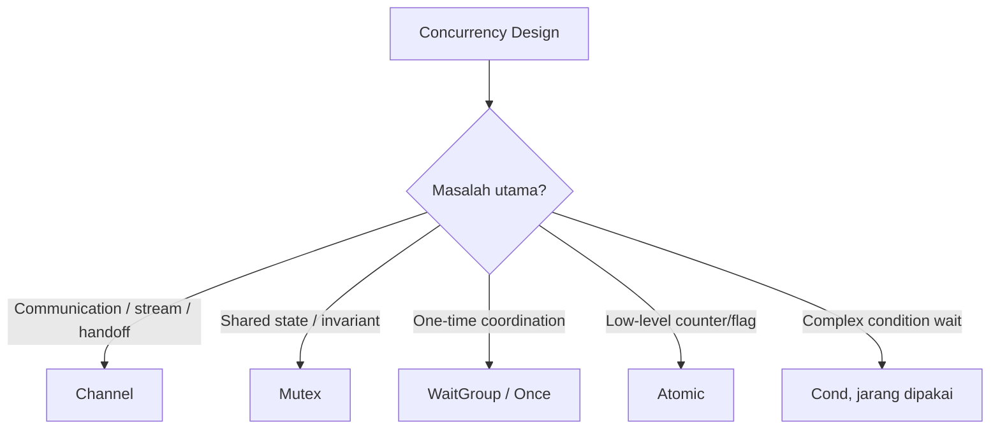

# Sync Primitives: Mutex, WaitGroup, Once, Cond, dan Atomic

> Target part ini: kamu mampu memilih antara channel dan shared-memory synchronization secara sadar, mendesain critical section yang kecil, menghindari deadlock, memahami data race, dan menggunakan primitive `sync` tanpa over-engineering.

Part sebelumnya membahas goroutine, channel, `select`, pipeline, worker pool, dan backpressure. Sekarang kita masuk ke sisi lain concurrency Go: shared memory.

Go tidak anti-mutex. Go menyediakan `sync` karena banyak masalah lebih sederhana jika state dilindungi langsung. Channel bagus untuk komunikasi dan handoff. Mutex bagus untuk melindungi invariant atas state bersama.

Kesalahan umum engineer yang baru belajar Go adalah menganggap channel selalu lebih idiomatik daripada mutex. Itu tidak benar. Idiomatic Go adalah Go yang sederhana, jelas, dan benar untuk masalahnya.

---

## 1. Channel vs Mutex: Pilihan Desain

Pertanyaan pertama:

```txt id="e7rx7o"
Apakah masalah ini tentang komunikasi antar proses kerja, atau proteksi invariant state bersama?
```

Gunakan channel jika:

- ada aliran data/event;
- ada handoff ownership;
- ada worker pool atau pipeline;
- ada fan-in/fan-out;
- kamu ingin backpressure natural;
- goroutine owner pattern membuat lifecycle lebih jelas.

Gunakan mutex jika:

- ada shared state kecil;
- operasi cepat dan synchronous;
- invariant perlu dilindungi;
- tidak ada stream/event natural;
- caller hanya butuh method call biasa;
- channel akan membuat desain menjadi actor system palsu.



---

## 2. Data Race

Data race terjadi ketika dua goroutine mengakses memory yang sama secara concurrent, setidaknya satu akses adalah write, dan tidak ada synchronization yang benar.

Contoh race:

```go id="lbzb6j"
package main

import (
	"fmt"
	"sync"
)

func main() {
	var wg sync.WaitGroup
	counter := 0

	for i := 0; i < 1000; i++ {
		wg.Add(1)
		go func() {
			defer wg.Done()
			counter++
		}()
	}

	wg.Wait()
	fmt.Println(counter)
}
```

`counter++` bukan operasi atomik. Ia terdiri dari read, add, write. Banyak goroutine dapat saling menimpa update.

Jalankan:

```bash id="5rtxw7"
go run -race main.go
```

Race detector akan membantu menemukan data race saat runtime test/execution.

---

## 3. Mutex

`sync.Mutex` melindungi critical section.

```go id="in2rgx"
type Counter struct {
	mu sync.Mutex
	n  int
}

func (c *Counter) Inc() {
	c.mu.Lock()
	defer c.mu.Unlock()

	c.n++
}

func (c *Counter) Value() int {
	c.mu.Lock()
	defer c.mu.Unlock()

	return c.n
}
```

Rule dasar:

1. Lock sebelum membaca atau menulis protected state.
2. Unlock sesegera mungkin.
3. Jangan copy struct yang berisi mutex setelah digunakan.
4. Jangan expose pointer ke protected state tanpa aturan jelas.
5. Jangan memanggil external/unknown code saat lock dipegang jika bisa dihindari.

---

## 4. Critical Section

Critical section adalah bagian kode yang berjalan saat lock dipegang.

Baik:

```go id="n8er8y"
func (c *Cache) Get(key string) (Value, bool) {
	c.mu.Lock()
	defer c.mu.Unlock()

	v, ok := c.items[key]
	return v, ok
}
```

Buruk:

```go id="ue1kuo"
func (c *Cache) GetOrFetch(ctx context.Context, key string) (Value, error) {
	c.mu.Lock()
	defer c.mu.Unlock()

	if v, ok := c.items[key]; ok {
		return v, nil
	}

	v, err := c.client.Fetch(ctx, key) // buruk: I/O saat lock dipegang
	if err != nil {
		return Value{}, err
	}

	c.items[key] = v
	return v, nil
}
```

Masalah:

- semua caller lain blocked saat network I/O;
- risiko deadlock meningkat;
- latency satu dependency memblokir cache global.

Versi lebih baik:

```go id="e5146a"
func (c *Cache) GetOrFetch(ctx context.Context, key string) (Value, error) {
	c.mu.Lock()
	v, ok := c.items[key]
	c.mu.Unlock()

	if ok {
		return v, nil
	}

	fetched, err := c.client.Fetch(ctx, key)
	if err != nil {
		return Value{}, err
	}

	c.mu.Lock()
	defer c.mu.Unlock()

	// Double-check karena goroutine lain mungkin sudah mengisi saat kita fetch.
	if v, ok := c.items[key]; ok {
		return v, nil
	}

	c.items[key] = fetched
	return fetched, nil
}
```

Ini memperkecil critical section, tetapi memperkenalkan duplicate fetch. Jika duplicate fetch tidak boleh, gunakan singleflight pattern atau koordinasi tambahan.

---

## 5. `defer Unlock` vs Manual Unlock

`defer` membuat unlock aman saat ada banyak return path.

```go id="o5tggu"
c.mu.Lock()
defer c.mu.Unlock()

if invalid {
	return err
}

return nil
```

Untuk hot path super kecil, manual unlock bisa mengurangi overhead sedikit, tetapi default engineer yang baik adalah correctness dulu.

Manual unlock:

```go id="ujh878"
c.mu.Lock()
v := c.items[key]
c.mu.Unlock()
return v
```

Pakai manual unlock jika:

- function sangat kecil;
- tidak ada branching kompleks;
- kamu butuh melepas lock sebelum operasi lain;
- kamu sudah jelas menandai boundary critical section.

---

## 6. Jangan Copy Mutex

Buruk:

```go id="zaxwde"
type Counter struct {
	mu sync.Mutex
	n  int
}

func (c Counter) Inc() { // buruk: value receiver meng-copy mutex
	c.mu.Lock()
	defer c.mu.Unlock()
	c.n++
}
```

Gunakan pointer receiver:

```go id="hbd3yd"
func (c *Counter) Inc() {
	c.mu.Lock()
	defer c.mu.Unlock()
	c.n++
}
```

Struct yang punya mutex hampir selalu memakai pointer receiver untuk method yang mengakses state.

---

## 7. Lock Melindungi Invariant, Bukan Sekadar Field

Pikirkan mutex sebagai penjaga invariant.

Contoh:

```go id="8py6py"
type Account struct {
	mu      sync.Mutex
	balance int64
	status  string
}
```

Invariant:

```txt id="7n84a6"
Jika status == "closed", balance harus 0 dan tidak boleh ada deposit baru.
```

Maka operasi terhadap `balance` dan `status` harus dilihat sebagai satu kesatuan.

Buruk jika field diproteksi lock berbeda tanpa kebutuhan jelas:

```go id="1ouhla"
type Account struct {
	balanceMu sync.Mutex
	balance   int64

	statusMu sync.Mutex
	status   string
}
```

Ini bisa membuat invariant lintas field rusak. Lock granularity harus mengikuti invariant, bukan sekadar jumlah field.

---

## 8. `sync.RWMutex`

`RWMutex` membedakan read lock dan write lock.

```go id="l2ma4y"
type Cache struct {
	mu    sync.RWMutex
	items map[string]Value
}

func (c *Cache) Get(key string) (Value, bool) {
	c.mu.RLock()
	defer c.mu.RUnlock()

	v, ok := c.items[key]
	return v, ok
}

func (c *Cache) Set(key string, value Value) {
	c.mu.Lock()
	defer c.mu.Unlock()

	c.items[key] = value
}
```

`RWMutex` cocok jika:

- read jauh lebih sering daripada write;
- read operation cukup mahal sehingga parallel read membantu;
- contention nyata terukur.

Jangan otomatis mengganti semua `Mutex` dengan `RWMutex`. `RWMutex` lebih kompleks dan tidak selalu lebih cepat.

---

## 9. Upgrade Lock Tidak Aman

Jangan mencoba upgrade dari `RLock` ke `Lock` sambil masih memegang read lock.

Buruk:

```go id="gygvua"
c.mu.RLock()
_, ok := c.items[key]
if !ok {
	c.mu.Lock() // deadlock risk
	c.items[key] = value
	c.mu.Unlock()
}
c.mu.RUnlock()
```

Lepas read lock dulu, lalu ambil write lock dan double-check.

```go id="72fgcw"
c.mu.RLock()
_, ok := c.items[key]
c.mu.RUnlock()

if !ok {
	c.mu.Lock()
	defer c.mu.Unlock()

	if _, ok := c.items[key]; !ok {
		c.items[key] = value
	}
}
```

---

## 10. Deadlock

Deadlock terjadi ketika goroutine saling menunggu selamanya.

Contoh lock order deadlock:

```go id="k2yclq"
type Pair struct {
	a sync.Mutex
	b sync.Mutex
}

func (p *Pair) First() {
	p.a.Lock()
	defer p.a.Unlock()

	p.b.Lock()
	defer p.b.Unlock()
}

func (p *Pair) Second() {
	p.b.Lock()
	defer p.b.Unlock()

	p.a.Lock()
	defer p.a.Unlock()
}
```

Jika `First` dan `Second` berjalan concurrent, masing-masing bisa memegang satu lock dan menunggu lock lain.

Solusi: tetapkan global lock ordering.

```txt id="uisvef"
Jika butuh lock A dan B, semua code path harus mengambil A sebelum B.
```

---

## 11. Jangan Panggil Callback Saat Lock Dipegang

Buruk:

```go id="szv4ar"
func (s *Store) ForEach(fn func(string, Value)) {
	s.mu.Lock()
	defer s.mu.Unlock()

	for k, v := range s.items {
		fn(k, v) // callback tidak kita kontrol
	}
}
```

Callback bisa:

- memanggil method `Store` lain;
- melakukan I/O lama;
- panic;
- mencoba lock yang sama;
- membuat deadlock.

Lebih baik copy snapshot, lalu unlock:

```go id="nirbj8"
func (s *Store) ForEach(fn func(string, Value)) {
	s.mu.Lock()
	snapshot := make(map[string]Value, len(s.items))
	for k, v := range s.items {
		snapshot[k] = v
	}
	s.mu.Unlock()

	for k, v := range snapshot {
		fn(k, v)
	}
}
```

---

## 12. WaitGroup

`sync.WaitGroup` menunggu sekumpulan goroutine selesai.

```go id="gwmnjv"
var wg sync.WaitGroup

for i := 0; i < 3; i++ {
	wg.Add(1)
	go func(id int) {
		defer wg.Done()
		fmt.Println(id)
	}(i)
}

wg.Wait()
```

Rule penting:

1. Panggil `Add` sebelum goroutine dimulai.
2. Pastikan setiap `Add(1)` punya `Done()`.
3. Gunakan `defer wg.Done()` di awal goroutine.
4. Jangan copy `WaitGroup` setelah digunakan.
5. Jangan gunakan `WaitGroup` untuk error propagation; ia hanya menunggu.

Buruk:

```go id="mkxjpd"
go func() {
	wg.Add(1) // race dengan Wait
	defer wg.Done()
	work()
}()
wg.Wait()
```

Baik:

```go id="vovzx6"
wg.Add(1)
go func() {
	defer wg.Done()
	work()
}()
wg.Wait()
```

---

## 13. Worker Pool dengan WaitGroup

Di Part 13, pool kita belum menutup `results`. Sekarang kita perbaiki.

```go id="gfpb7x"
type EmailJob struct {
	ID      string
	To      string
	Subject string
	Body    string
}

type EmailResult struct {
	JobID string
	Err   error
}

type EmailSender interface {
	Send(ctx context.Context, job EmailJob) error
}

type Pool struct {
	sender  EmailSender
	jobs    chan EmailJob
	results chan EmailResult
	wg      sync.WaitGroup
}

func NewPool(sender EmailSender, queueSize int) *Pool {
	return &Pool{
		sender:  sender,
		jobs:    make(chan EmailJob, queueSize),
		results: make(chan EmailResult, queueSize),
	}
}

func (p *Pool) Start(ctx context.Context, workers int) {
	for i := 0; i < workers; i++ {
		p.wg.Add(1)
		go p.worker(ctx)
	}

	go func() {
		p.wg.Wait()
		close(p.results)
	}()
}

func (p *Pool) Submit(ctx context.Context, job EmailJob) error {
	select {
	case p.jobs <- job:
		return nil
	case <-ctx.Done():
		return ctx.Err()
	}
}

func (p *Pool) Results() <-chan EmailResult {
	return p.results
}

func (p *Pool) Stop() {
	close(p.jobs)
}

func (p *Pool) worker(ctx context.Context) {
	defer p.wg.Done()

	for {
		select {
		case <-ctx.Done():
			return
		case job, ok := <-p.jobs:
			if !ok {
				return
			}

			err := p.sender.Send(ctx, job)
			result := EmailResult{JobID: job.ID, Err: err}

			select {
			case p.results <- result:
			case <-ctx.Done():
				return
			}
		}
	}
}
```

Sekarang `results` ditutup setelah semua worker selesai.

Masih ada desain yang perlu dipertimbangkan:

- Apa yang terjadi jika `Stop` dipanggil dua kali?
- Apakah `Submit` setelah `Stop` akan panic?
- Apakah pool perlu `Close` yang idempotent?
- Apakah `Start` boleh dipanggil dua kali?

Untuk library production-grade, lifecycle state harus lebih ketat.

---

## 14. WaitGroup Bukan Error Handling

Buruk:

```go id="3uwx3j"
var wg sync.WaitGroup

for _, item := range items {
	wg.Add(1)
	go func(item Item) {
		defer wg.Done()
		if err := process(item); err != nil {
			log.Println(err)
		}
	}(item)
}

wg.Wait()
return nil
```

Error hilang. Jika caller butuh tahu failure, sediakan error path.

Manual pattern:

```go id="0ovgbr"
func ProcessAll(ctx context.Context, items []Item) error {
	var wg sync.WaitGroup
	errCh := make(chan error, len(items))

	for _, item := range items {
		item := item
		wg.Add(1)
		go func() {
			defer wg.Done()
			if err := process(ctx, item); err != nil {
				errCh <- err
			}
		}()
	}

	wg.Wait()
	close(errCh)

	for err := range errCh {
		if err != nil {
			return err
		}
	}

	return nil
}
```

Untuk first-error-wins + cancellation, gunakan context cancellation atau `errgroup`.

---

## 15. `sync.Once`

`sync.Once` memastikan function hanya dieksekusi sekali.

```go id="k4re0f"
type ConfigLoader struct {
	once sync.Once
	cfg  Config
	err  error
}

func (l *ConfigLoader) Load() (Config, error) {
	l.once.Do(func() {
		l.cfg, l.err = readConfig()
	})

	return l.cfg, l.err
}
```

Use case:

- lazy initialization;
- loading config sekali;
- initializing expensive dependency;
- registering global resource;
- idempotent close dengan hati-hati.

Catatan: jika function dalam `Do` gagal, `Once` tetap menganggap sudah executed. Error akan disimpan dan dikembalikan terus. Jika kamu butuh retry setelah gagal, `sync.Once` biasa tidak cukup.

---

## 16. Once untuk Close Idempotent

Kadang kamu ingin `Close()` aman dipanggil berkali-kali.

```go id="bhqmd5"
type Client struct {
	closeOnce sync.Once
	closed    chan struct{}
}

func NewClient() *Client {
	return &Client{closed: make(chan struct{})}
}

func (c *Client) Close() {
	c.closeOnce.Do(func() {
		close(c.closed)
	})
}
```

Ini mencegah panic akibat close channel lebih dari sekali.

Namun jika `Close` perlu return error, `sync.Once` membuat desain lebih rumit karena error dari eksekusi pertama harus disimpan.

---

## 17. `sync.Cond`

`sync.Cond` adalah primitive untuk menunggu kondisi tertentu. Ia jarang dipakai dibanding channel, tetapi berguna untuk beberapa struktur data concurrent.

Contoh bounded queue sederhana:

```go id="z1gg9b"
type Queue struct {
	mu       sync.Mutex
	notEmpty *sync.Cond
	items    []int
}

func NewQueue() *Queue {
	q := &Queue{}
	q.notEmpty = sync.NewCond(&q.mu)
	return q
}

func (q *Queue) Push(v int) {
	q.mu.Lock()
	defer q.mu.Unlock()

	q.items = append(q.items, v)
	q.notEmpty.Signal()
}

func (q *Queue) Pop() int {
	q.mu.Lock()
	defer q.mu.Unlock()

	for len(q.items) == 0 {
		q.notEmpty.Wait()
	}

	v := q.items[0]
	q.items = q.items[1:]
	return v
}
```

Perhatikan `Wait` selalu dipakai dalam loop:

```go id="kk2buc"
for conditionNotMet {
	cond.Wait()
}
```

Jangan pakai `if`. Condition bisa berubah sebelum goroutine bangun dan mengambil lock lagi.

Dalam banyak kasus, channel lebih sederhana daripada `sync.Cond`. Gunakan `Cond` jika kamu benar-benar butuh condition variable dengan lock dan state yang eksplisit.

---

## 18. `sync.Map`

`sync.Map` adalah map concurrent khusus.

```go id="8wujwb"
var m sync.Map

m.Store("a", 1)
v, ok := m.Load("a")
if ok {
	fmt.Println(v.(int))
}
```

Gunakan `sync.Map` jika access pattern cocok, misalnya:

- entry ditulis sekali lalu dibaca berkali-kali;
- banyak goroutine mengakses key berbeda;
- kamu ingin menghindari lock global untuk pattern tertentu.

Untuk kebanyakan use case biasa, `map` + `Mutex` lebih type-safe dan mudah dipahami.

Buruk jika hanya karena malas membuat struct:

```go id="uccmwu"
var cache sync.Map // unclear key/value type
```

Lebih jelas:

```go id="3l4985"
type Cache struct {
	mu    sync.RWMutex
	items map[string]User
}
```

`sync.Map` memakai `any`, sehingga kamu kehilangan type safety compile-time dan harus type assertion.

---

## 19. Atomic

Package `sync/atomic` menyediakan operasi atomik untuk low-level synchronization.

Contoh counter:

```go id="1jlb67"
type Counter struct {
	n atomic.Int64
}

func (c *Counter) Inc() {
	c.n.Add(1)
}

func (c *Counter) Value() int64 {
	return c.n.Load()
}
```

Atomic cocok untuk:

- counter sederhana;
- flag sederhana;
- read-mostly config pointer;
- performance-sensitive low-level primitive.

Atomic tidak cocok untuk invariant multi-field yang kompleks.

Buruk:

```go id="7eanwp"
type Account struct {
	balance atomic.Int64
	status  atomic.Value
}
```

Jika invariant melibatkan `balance` dan `status`, atomic terpisah tidak cukup. Gunakan mutex.

---

## 20. Atomic Flag

```go id="q23pf3"
type Server struct {
	closed atomic.Bool
}

func (s *Server) Close() {
	if s.closed.Swap(true) {
		return
	}

	// close resources once
}

func (s *Server) IsClosed() bool {
	return s.closed.Load()
}
```

Ini sederhana dan cepat. Tetapi jika `Close` harus menutup banyak resource dengan urutan dan error handling, `sync.Once` atau mutex mungkin lebih jelas.

---

## 21. `atomic.Value`

`atomic.Value` dapat menyimpan dan membaca value secara atomik. Use case umum: konfigurasi read-mostly.

```go id="kswq60"
type Config struct {
	Timeout time.Duration
	Limit   int
}

type ConfigStore struct {
	value atomic.Value // stores Config
}

func NewConfigStore(cfg Config) *ConfigStore {
	s := &ConfigStore{}
	s.value.Store(cfg)
	return s
}

func (s *ConfigStore) Load() Config {
	return s.value.Load().(Config)
}

func (s *ConfigStore) Store(cfg Config) {
	s.value.Store(cfg)
}
```

Pastikan type yang disimpan konsisten. Jangan menyimpan `Config` lalu nanti menyimpan `*Config` ke `atomic.Value` yang sama.

---

## 22. Lock Granularity

Lock granularity adalah seberapa luas state yang dilindungi satu lock.

Coarse-grained lock:

```go id="yfa4ko"
type Store struct {
	mu    sync.Mutex
	users map[string]User
	roles map[string]Role
}
```

Fine-grained lock:

```go id="lw8yil"
type Store struct {
	usersMu sync.Mutex
	users   map[string]User

	rolesMu sync.Mutex
	roles   map[string]Role
}
```

Coarse-grained lebih sederhana dan sering cukup.

Fine-grained berguna jika:

- contention terbukti tinggi;
- state benar-benar independent;
- invariant lintas state tidak rusak;
- lock ordering jelas.

Jangan mulai dari fine-grained jika belum ada data. Complexity-nya lebih mahal daripada yang terlihat.

---

## 23. Contention

Contention terjadi ketika banyak goroutine berebut lock yang sama.

Gejala:

- latency naik saat concurrency naik;
- CPU rendah tetapi throughput mandek;
- mutex profile menunjukkan blocking;
- critical section terlalu lama;
- lock global melindungi terlalu banyak state.

Strategi:

1. Perkecil critical section.
2. Hindari I/O saat lock dipegang.
3. Gunakan sharded lock jika perlu.
4. Gunakan `RWMutex` jika read-heavy dan terbukti membantu.
5. Gunakan immutable snapshot untuk read path.
6. Gunakan channel/worker owner jika serialization natural.
7. Ukur dengan benchmark dan profile.

---

## 24. Sharded Lock

Untuk map besar dengan high concurrency, sharding bisa mengurangi contention.

```go id="46zkdh"
type shard struct {
	mu    sync.Mutex
	items map[string]Value
}

type ShardedCache struct {
	shards []shard
}

func NewShardedCache(n int) *ShardedCache {
	c := &ShardedCache{shards: make([]shard, n)}
	for i := range c.shards {
		c.shards[i].items = make(map[string]Value)
	}
	return c
}

func (c *ShardedCache) shardFor(key string) *shard {
	h := fnv.New32a()
	_, _ = h.Write([]byte(key))
	return &c.shards[int(h.Sum32())%len(c.shards)]
}

func (c *ShardedCache) Get(key string) (Value, bool) {
	s := c.shardFor(key)
	s.mu.Lock()
	defer s.mu.Unlock()

	v, ok := s.items[key]
	return v, ok
}

func (c *ShardedCache) Set(key string, value Value) {
	s := c.shardFor(key)
	s.mu.Lock()
	defer s.mu.Unlock()

	s.items[key] = value
}
```

Sharding menambah complexity. Gunakan ketika lock global benar-benar bottleneck.

---

## 25. Immutability untuk Mengurangi Lock

Jika data immutable, kamu tidak perlu lock untuk membaca setelah safe publication.

Contoh config snapshot:

```go id="kmjmhh"
type Config struct {
	Limits map[string]int
}
```

Masalah: map mutable. Jika config dibaca banyak goroutine dan map dimutasi, race.

Solusi: copy saat update, lalu publish snapshot baru.

```go id="n5tj8b"
type Config struct {
	Limits map[string]int
}

func CloneConfig(cfg Config) Config {
	limits := make(map[string]int, len(cfg.Limits))
	for k, v := range cfg.Limits {
		limits[k] = v
	}
	return Config{Limits: limits}
}
```

Lalu publish dengan `atomic.Value` atau mutex. Setelah publish, jangan mutasi snapshot.

---

## 26. Race Detector

Gunakan race detector saat test:

```bash id="x1of9c"
go test -race ./...
```

Race detector tidak membuktikan program bebas race. Ia hanya mendeteksi race pada path yang dieksekusi. Karena itu, test concurrent harus mencoba banyak interleaving dan failure path.

Praktik baik:

- jalankan `go test -race ./...` di CI untuk package penting;
- tambahkan stress test untuk concurrency primitive;
- jangan mengabaikan race report;
- jangan “memperbaiki” race dengan sleep;
- pahami shared variable mana yang tidak terlindungi.

---

## 27. Sleep Bukan Synchronization

Buruk:

```go id="rvfhjr"
go doWork()
time.Sleep(100 * time.Millisecond)
// berharap doWork selesai
```

Ini flaky. Di mesin cepat mungkin lolos. Di CI lambat gagal. Di production tidak ada guarantee.

Gunakan synchronization:

```go id="8xqyo7"
done := make(chan struct{})

go func() {
	defer close(done)
	doWork()
}()

<-done
```

Atau WaitGroup:

```go id="yh7rmf"
var wg sync.WaitGroup
wg.Add(1)
go func() {
	defer wg.Done()
	doWork()
}()
wg.Wait()
```

---

## 28. Testing Concurrent Code

Concurrent test harus menguji:

- correctness hasil;
- tidak ada race;
- cancellation;
- shutdown;
- blocked send/receive;
- duplicate work;
- ordering jika ordering dijanjikan;
- no goroutine leak jika memungkinkan.

Contoh test counter:

```go id="7mnv34"
func TestCounterConcurrent(t *testing.T) {
	var c Counter
	var wg sync.WaitGroup

	const workers = 100
	const increments = 1000

	for i := 0; i < workers; i++ {
		wg.Add(1)
		go func() {
			defer wg.Done()
			for j := 0; j < increments; j++ {
				c.Inc()
			}
		}()
	}

	wg.Wait()

	want := int64(workers * increments)
	if got := c.Value(); got != want {
		t.Fatalf("Value() = %d, want %d", got, want)
	}
}
```

Jalankan:

```bash id="05bmas"
go test -race ./...
```

---

## 29. Avoid Locking Around Logging Excessively

Logging saat lock dipegang bisa memperpanjang critical section.

Buruk:

```go id="kycg20"
c.mu.Lock()
defer c.mu.Unlock()

c.items[key] = value
logger.Info("cache updated", "key", key)
```

Lebih baik:

```go id="r6btn0"
c.mu.Lock()
c.items[key] = value
c.mu.Unlock()

logger.Info("cache updated", "key", key)
```

Catatan: jika log harus merekam state konsisten, copy informasi yang diperlukan saat lock dipegang, lalu log setelah unlock.

---

## 30. Protected State Jangan Dibocorkan

Buruk:

```go id="i6p19g"
func (c *Cache) Items() map[string]Value {
	c.mu.Lock()
	defer c.mu.Unlock()

	return c.items // caller bisa mutasi tanpa lock
}
```

Lebih baik return copy:

```go id="0twuxy"
func (c *Cache) Items() map[string]Value {
	c.mu.Lock()
	defer c.mu.Unlock()

	copyItems := make(map[string]Value, len(c.items))
	for k, v := range c.items {
		copyItems[k] = v
	}
	return copyItems
}
```

Untuk slice juga sama:

```go id="ewnkft"
func (s *Store) Users() []User {
	s.mu.Lock()
	defer s.mu.Unlock()

	users := make([]User, len(s.users))
	copy(users, s.users)
	return users
}
```

---

## 31. Lock Scope dengan Helper Function

Kadang lebih jelas membuat helper internal yang mengasumsikan lock sudah dipegang.

```go id="n99dqu"
type Store struct {
	mu    sync.Mutex
	items map[string]Value
}

func (s *Store) Set(key string, value Value) {
	s.mu.Lock()
	defer s.mu.Unlock()

	s.setLocked(key, value)
}

func (s *Store) setLocked(key string, value Value) {
	s.items[key] = value
}
```

Naming seperti `setLocked`, `mustHoldLock`, atau comment singkat membantu reviewer memahami precondition.

---

## 32. Actor-like Owner dengan Channel

Ada kasus shared state lebih jelas dimiliki satu goroutine. Misalnya state machine event-driven.

```go id="vhlgvk"
type command struct {
	name string
	reply chan int
}

type CounterActor struct {
	commands chan command
}

func NewCounterActor() *CounterActor {
	a := &CounterActor{commands: make(chan command)}
	go a.loop()
	return a
}

func (a *CounterActor) loop() {
	var n int
	for cmd := range a.commands {
		switch cmd.name {
		case "inc":
			n++
			cmd.reply <- n
		case "get":
			cmd.reply <- n
		}
	}
}
```

Ini bukan selalu lebih baik dari mutex. Untuk counter biasa, ini terlalu berat. Untuk state machine yang punya event ordering, timer, dan I/O, pattern owner goroutine bisa masuk akal.

---

## 33. Singleflight: Deduplicate Concurrent Work

Masalah cache `GetOrFetch`: banyak goroutine miss key yang sama lalu fetch bersamaan.

Solusi umum: singleflight, yaitu deduplicate work untuk key sama. Package populer ada di `golang.org/x/sync/singleflight`.

Mental model:

```txt id="epudyl"
Jika 100 goroutine meminta key yang sama, hanya 1 fetch berjalan; 99 lainnya menunggu hasil yang sama.
```

Ini bukan primitive standard library, tetapi pattern penting untuk backend Go.

---

## 34. Choosing the Simplest Correct Primitive

| Problem | Primitive umum |
|---|---|
| Menunggu goroutine selesai | `sync.WaitGroup` |
| Melindungi map | `sync.Mutex` atau `sync.RWMutex` |
| Counter sederhana | `atomic.Int64` atau `Mutex` |
| Lazy init sekali | `sync.Once` |
| Stream data | Channel |
| Worker pool | Channel + WaitGroup + context |
| First error wins | `errgroup` + context |
| Read-mostly config snapshot | `atomic.Value` atau `atomic.Pointer` |
| Complex condition wait | `sync.Cond` |
| Deduplicate concurrent call | singleflight |

---

## 35. Common Anti-patterns

### 35.1 Mutex Sebagai Field Public

Buruk:

```go id="2w6ylr"
type Cache struct {
	Mu    sync.Mutex
	Items map[string]Value
}
```

Caller bisa lock/unlock sembarangan dan merusak invariant.

Lebih baik:

```go id="9fuu2z"
type Cache struct {
	mu    sync.Mutex
	items map[string]Value
}
```

Expose behavior, bukan lock.

### 35.2 Lock Terlalu Luas

```go id="1f1aad"
mu.Lock()
defer mu.Unlock()

callNetwork()
writeDatabase()
updateMemory()
```

Pisahkan I/O dan memory update jika memungkinkan.

### 35.3 Atomic untuk Multi-field Invariant

```go id="z4g8l5"
// balance dan status harus konsisten, tetapi di-update terpisah.
balance.Store(0)
status.Store("closed")
```

Gunakan mutex untuk state yang harus berubah bersama.

### 35.4 Sleep untuk Menunggu

```go id="xj6efg"
time.Sleep(time.Second)
```

Gunakan channel, WaitGroup, context, atau condition.

### 35.5 Mengabaikan Race Detector

Jika race detector melaporkan race, asumsikan desainmu salah sampai terbukti sebaliknya.

---

## 36. Production Pattern: Concurrent Cache dengan TTL

Contoh cache sederhana:

```go id="nhcata"
type entry[V any] struct {
	value     V
	expiresAt time.Time
}

type Cache[K comparable, V any] struct {
	mu    sync.RWMutex
	items map[K]entry[V]
	now   func() time.Time
}

func NewCache[K comparable, V any]() *Cache[K, V] {
	return &Cache[K, V]{
		items: make(map[K]entry[V]),
		now:   time.Now,
	}
}

func (c *Cache[K, V]) Set(key K, value V, ttl time.Duration) {
	c.mu.Lock()
	defer c.mu.Unlock()

	c.items[key] = entry[V]{
		value:     value,
		expiresAt: c.now().Add(ttl),
	}
}

func (c *Cache[K, V]) Get(key K) (V, bool) {
	c.mu.RLock()
	item, ok := c.items[key]
	c.mu.RUnlock()

	var zero V
	if !ok {
		return zero, false
	}

	if c.now().After(item.expiresAt) {
		c.mu.Lock()
		defer c.mu.Unlock()

		// Double-check current item.
		current, ok := c.items[key]
		if ok && current.expiresAt.Equal(item.expiresAt) {
			delete(c.items, key)
		}

		return zero, false
	}

	return item.value, true
}
```

Perhatikan:

- read path memakai `RLock`;
- expired delete memakai `Lock`;
- ada double-check sebelum delete;
- `now` injectable agar test deterministic.

---

## 37. Latihan Terarah

### Latihan 1 — Counter Race

Buat counter tanpa lock. Jalankan dengan `go test -race`. Lalu perbaiki dengan:

1. `sync.Mutex`
2. `atomic.Int64`

Bandingkan readability dan use case.

### Latihan 2 — Safe Map

Buat `SafeMap[K comparable, V any]` dengan method:

```go id="d3t2dc"
Set(key K, value V)
Get(key K) (V, bool)
Delete(key K)
Len() int
Snapshot() map[K]V
```

Pastikan `Snapshot` tidak membocorkan internal map.

### Latihan 3 — Worker Pool Shutdown

Ambil worker pool dari Part 13. Tambahkan:

- `WaitGroup`;
- close result channel;
- `Close` idempotent;
- test untuk submit setelah close.

### Latihan 4 — Read-mostly Config

Buat config store dengan `atomic.Value`. Requirement:

- read tanpa lock;
- update publish snapshot baru;
- map di dalam config tidak boleh dimutasi setelah publish;
- test concurrent read/update dengan race detector.

### Latihan 5 — Lock Scope Review

Ambil satu service/repository yang pernah kamu tulis. Tandai:

- critical section;
- I/O yang terjadi saat lock dipegang;
- callback saat lock dipegang;
- data protected yang bocor keluar.

Refactor agar lock scope lebih kecil.

---

## 38. Review Checklist

| Area | Pertanyaan |
|---|---|
| Primitive choice | Apakah mutex/channel/atomic dipilih sesuai masalah? |
| Race safety | Apakah semua shared mutable state terlindungi? |
| Invariant | Apakah lock melindungi invariant yang benar? |
| Lock scope | Apakah lock dipegang sesingkat mungkin? |
| I/O | Apakah ada network/database/log lambat saat lock dipegang? |
| Callback | Apakah external callback dipanggil saat lock dipegang? |
| Copy safety | Apakah struct berisi mutex tidak dicopy setelah digunakan? |
| Error path | Apakah WaitGroup tidak dipakai sebagai pengganti error handling? |
| Shutdown | Apakah goroutine ditunggu dan channel ditutup oleh owner? |
| Race detector | Apakah package penting diuji dengan `-race`? |

---

## 39. Rubrik Self-assessment

Kamu siap lanjut jika bisa menjawab:

1. Apa definisi data race?
2. Mengapa `counter++` tidak aman secara concurrent?
3. Kapan `Mutex` lebih baik daripada channel?
4. Kapan channel lebih baik daripada `Mutex`?
5. Apa risiko memegang lock saat melakukan I/O?
6. Mengapa struct berisi mutex tidak boleh dicopy?
7. Apa perbedaan `Mutex` dan `RWMutex`?
8. Mengapa upgrade dari `RLock` ke `Lock` berbahaya?
9. Mengapa `WaitGroup` bukan mekanisme error propagation?
10. Kapan `atomic` cocok dan kapan tidak?
11. Mengapa `sync.Map` bukan default map concurrent untuk semua kasus?
12. Mengapa `time.Sleep` bukan synchronization?

---

## 40. Ringkasan

Concurrency correctness di Go bukan tentang memakai primitive paling canggih. Ia tentang memilih primitive paling sederhana yang menjaga invariant dengan jelas.

Pegang tiga prinsip ini:

```txt id="8j45zz"
Protect invariants, not just fields.
Keep critical sections small.
Every goroutine must have a lifecycle.
```

Channel membantu komunikasi dan handoff. Mutex membantu state dan invariant. WaitGroup membantu menunggu. Once membantu eksekusi sekali. Atomic membantu operasi low-level sederhana. Cond membantu condition wait khusus. Tidak ada satu primitive yang benar untuk semua masalah.

Di Part 15, kita akan membahas `context.Context`: cancellation, deadline, timeout, request lifecycle, graceful shutdown, dan desain API yang menghormati lifecycle end-to-end.
