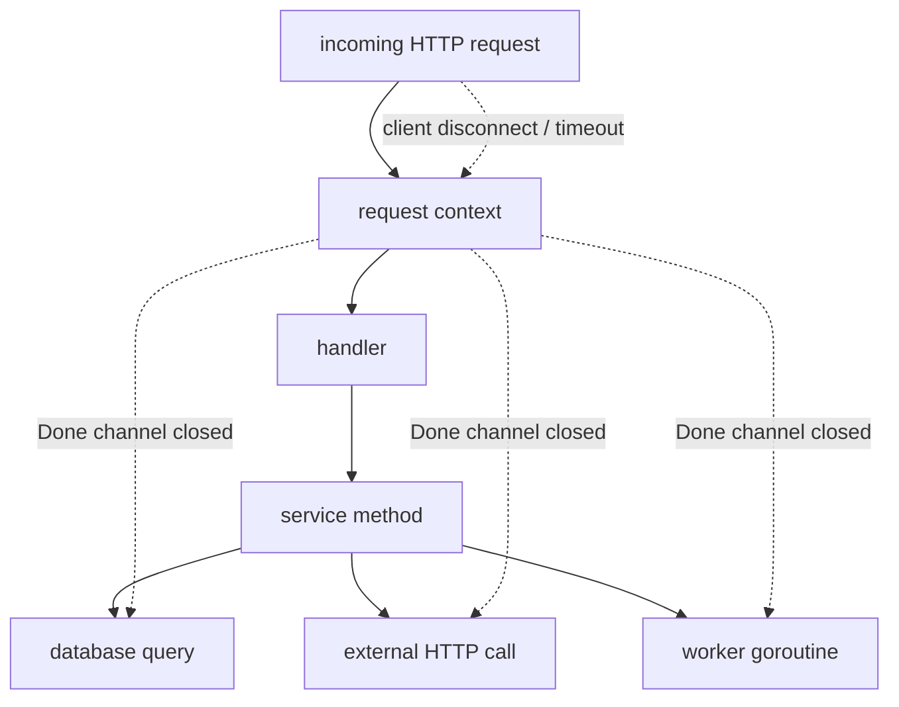
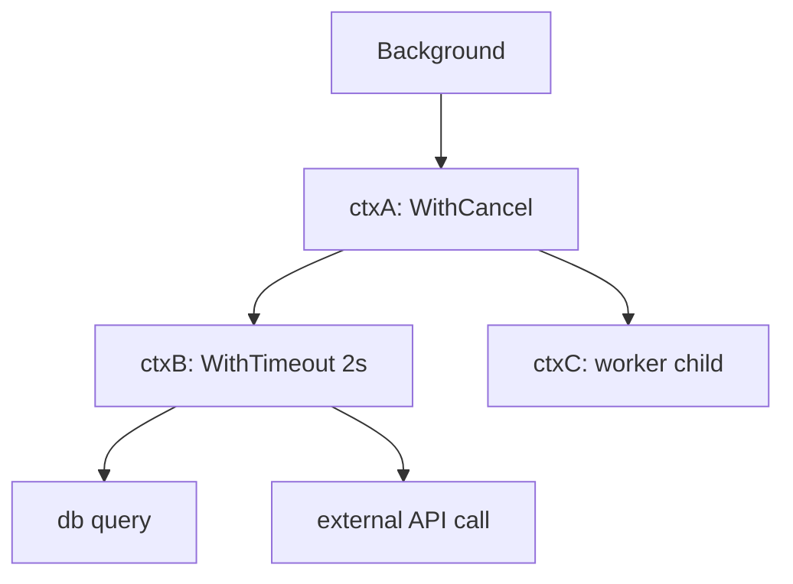
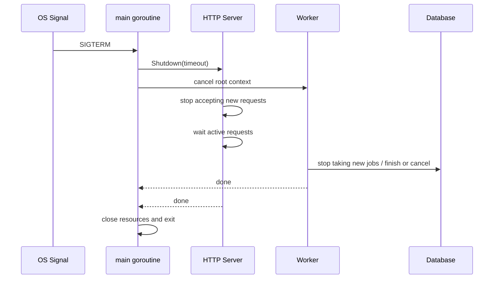
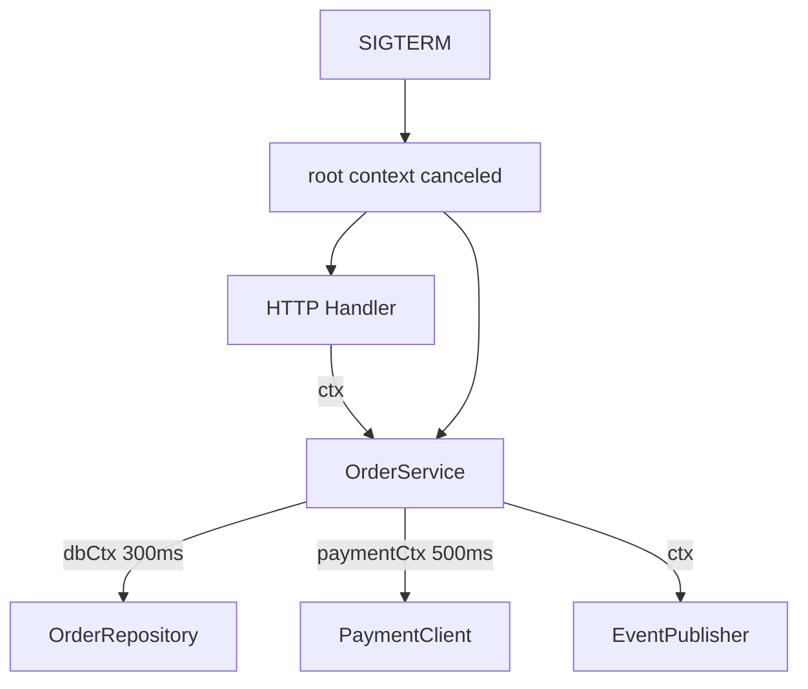

# Context, Cancellation, Deadline, dan Lifecycle Control

> Target part ini: kamu mampu mendesain kode Go yang sadar lifecycle. Goroutine, request, query database, HTTP call, job worker, dan shutdown tidak boleh hidup tanpa batas. Semua kerja yang bisa menunggu, memblokir, atau memanggil dependency harus bisa dihentikan secara eksplisit.

Part sebelumnya membahas goroutine, channel, dan sync primitives. Masalah berikutnya muncul saat sistem mulai nyata: goroutine berjalan terlalu lama, request sudah batal tetapi query database tetap jalan, client timeout tetapi downstream masih dipanggil, worker leak setelah error, atau service tidak bisa shutdown dengan bersih.

Di Go, pusat kendali lifecycle ini adalah `context.Context`.

`context.Context` bukan dependency injection container. Bukan tempat global config. Bukan tempat menyimpan logger besar, database handle, user object penuh, atau optional parameter acak.

`context.Context` adalah carrier untuk tiga hal utama:

1. cancellation signal,
2. deadline atau timeout,
3. request-scoped value yang benar-benar melintasi boundary proses/API.

Mental model paling penting:

> Context tidak melakukan cancellation untukmu. Context hanya memberi sinyal. Kode yang kamu tulis harus mendengarkan sinyal itu dan keluar dengan benar.

---

## Hubungan dengan Framework Kaufman

Dalam kerangka Josh Kaufman, part ini berada di tahap **learn enough to self-correct** dan **practice deliberately**.

Banyak engineer bisa memakai `context.WithTimeout`, tetapi belum tentu bisa menjawab:

- timeout harus dipasang di layer mana?
- apakah function ini boleh membuat context baru?
- kapan harus `defer cancel()`?
- apakah boleh menyimpan context di struct?
- bagaimana mencegah goroutine leak?
- bagaimana membedakan caller cancellation dari internal timeout?
- bagaimana graceful shutdown mengalir ke HTTP server, worker, dan database call?

Tujuan part ini bukan hafal API `context`, melainkan memahami **lifecycle ownership**.

---

## 1. Masalah yang Diselesaikan oleh Context

Bayangkan service Go menerima HTTP request:

```txt id="wsk5mn"
Client request
  -> HTTP handler
      -> service layer
          -> repository
              -> database query
          -> external payment API
          -> publish event
```

Jika client disconnect, request timeout, atau service sedang shutdown, pertanyaan pentingnya:

- siapa yang memberi tahu semua layer bahwa pekerjaan harus berhenti?
- bagaimana repository tahu bahwa query tidak perlu dilanjutkan?
- bagaimana HTTP client tahu bahwa request ke downstream harus dibatalkan?
- bagaimana goroutine tambahan tahu bahwa hasilnya tidak lagi dibutuhkan?

Tanpa context, cancellation sering berubah menjadi boolean global, channel custom di mana-mana, timeout manual yang tidak konsisten, atau goroutine yang dibiarkan menggantung.

Dengan context, lifecycle dapat dialirkan secara eksplisit.



Context membuat cancellation menjadi bagian dari kontrak API.

---

## 2. API Dasar `context.Context`

Interface `context.Context` kecil:

```go id="g6t8kh"
type Context interface {
    Deadline() (deadline time.Time, ok bool)
    Done() <-chan struct{}
    Err() error
    Value(key any) any
}
```

Maknanya:

| Method | Fungsi |
|---|---|
| `Deadline()` | Mengembalikan waktu batas jika context punya deadline. |
| `Done()` | Channel yang ditutup saat context canceled atau deadline tercapai. |
| `Err()` | Mengembalikan alasan context selesai: `context.Canceled` atau `context.DeadlineExceeded`. |
| `Value(key)` | Mengambil request-scoped value. Gunakan sangat selektif. |

Pemahaman penting:

- `Done()` adalah receive-only channel.
- Kamu tidak menutup `Done()` sendiri.
- `Done()` bisa `nil` untuk context yang tidak pernah canceled.
- `Err()` hanya meaningful setelah `Done()` closed.
- `Value()` bukan pengganti parameter function.

Contoh dasar:

```go id="muvq7b"
func waitForWork(ctx context.Context, work <-chan string) error {
    select {
    case item := <-work:
        fmt.Println("processing", item)
        return nil
    case <-ctx.Done():
        return ctx.Err()
    }
}
```

Rule of thumb:

> Setiap operasi yang bisa block harus punya jalan keluar melalui context, timeout, atau channel ownership yang jelas.

---

## 3. Root Context: `Background` dan `TODO`

Ada dua root context yang sering terlihat:

```go id="xxgaks"
ctx := context.Background()
ctx := context.TODO()
```

Gunakan `context.Background()` ketika kamu memang berada di root lifecycle:

- `main`,
- test setup,
- job scheduler root,
- command-line program root,
- server startup.

Gunakan `context.TODO()` ketika kamu sedang migrasi API dan belum tahu context yang benar.

Contoh:

```go id="g71wti"
func main() {
    ctx := context.Background()

    if err := run(ctx); err != nil {
        log.Fatal(err)
    }
}
```

Hindari ini di production code yang sudah jelas lifecycle-nya:

```go id="odk3c6"
func (s *Service) CreateOrder(req CreateOrderRequest) error {
    // Buruk: memutus lifecycle dari caller.
    ctx := context.Background()
    return s.repo.Insert(ctx, req)
}
```

Yang benar:

```go id="a7h6b9"
func (s *Service) CreateOrder(ctx context.Context, req CreateOrderRequest) error {
    return s.repo.Insert(ctx, req)
}
```

---

## 4. Function Signature yang Idiomatik

Konvensi kuat di Go:

```go id="s0eotd"
func DoSomething(ctx context.Context, arg Arg) (Result, error)
```

Context diletakkan sebagai parameter pertama.

Alasannya:

1. lifecycle terlihat jelas,
2. mudah diteruskan antar layer,
3. konsisten dengan standard library,
4. reviewer langsung tahu function ini bisa dipengaruhi cancellation/deadline,
5. tidak tersembunyi sebagai field struct.

Contoh service layer:

```go id="qr1nuu"
type OrderService struct {
    repo   OrderRepository
    client PaymentClient
}

func (s *OrderService) SubmitOrder(ctx context.Context, cmd SubmitOrderCommand) (OrderID, error) {
    if err := cmd.Validate(); err != nil {
        return "", err
    }

    orderID, err := s.repo.InsertPendingOrder(ctx, cmd)
    if err != nil {
        return "", fmt.Errorf("insert pending order: %w", err)
    }

    if err := s.client.Authorize(ctx, cmd.Payment); err != nil {
        return "", fmt.Errorf("authorize payment: %w", err)
    }

    return orderID, nil
}
```

Repository dan client menerima context yang sama dari caller. Ini membuat cancellation tree tetap utuh.

---

## 5. Jangan Simpan Context di Struct

Ini salah satu anti-pattern paling umum:

```go id="n1qdin"
type Worker struct {
    ctx context.Context // Buruk untuk kebanyakan kasus.
    db  *sql.DB
}

func (w *Worker) Process(job Job) error {
    return w.db.QueryRowContext(w.ctx, "SELECT ...").Scan(...)
}
```

Kenapa buruk?

- Context adalah request/lifecycle scoped, bukan object scoped.
- Struct bisa hidup lebih lama dari request.
- Caller kehilangan kontrol cancellation.
- Deadline lama bisa tanpa sengaja dipakai ulang.
- Testing menjadi membingungkan.

Lebih baik:

```go id="fymgxj"
type Worker struct {
    db *sql.DB
}

func (w *Worker) Process(ctx context.Context, job Job) error {
    return w.processWithDB(ctx, job)
}
```

Ada pengecualian terbatas, misalnya object yang memang merepresentasikan lifecycle tertentu seperti server runner internal. Namun untuk service, repository, client, handler, dan use case umum: **pass context explicitly**.

---

## 6. Cancellation Tree

Context membentuk tree.

```go id="38xs9d"
root := context.Background()
ctxA, cancelA := context.WithCancel(root)
ctxB, cancelB := context.WithTimeout(ctxA, 2*time.Second)
```

Jika `cancelA()` dipanggil, maka `ctxA` dan semua turunannya canceled, termasuk `ctxB`.

Jika `cancelB()` dipanggil, hanya `ctxB` dan turunannya yang canceled. Parent `ctxA` tetap hidup.



Konsekuensi desain:

- Parent cancellation menghentikan semua child.
- Child cancellation tidak menghentikan parent.
- Deadline child tidak boleh lebih longgar secara efektif dari parent.
- Context tree harus mengikuti ownership tree pekerjaan.

---

## 7. `WithCancel`: Manual Cancellation

`context.WithCancel` memberi kamu fungsi cancel eksplisit.

```go id="h73uxo"
ctx, cancel := context.WithCancel(parent)
defer cancel()
```

Gunakan saat kamu perlu menghentikan child operation karena:

- salah satu goroutine sudah menemukan error,
- result sudah cukup,
- caller membatalkan operasi,
- cleanup harus memastikan resource dilepas.

Contoh fan-out search yang berhenti setelah result pertama:

```go id="ca3jxq"
type Searcher interface {
    Search(ctx context.Context, query string) (Result, error)
}

func FirstResult(ctx context.Context, query string, searchers []Searcher) (Result, error) {
    ctx, cancel := context.WithCancel(ctx)
    defer cancel()

    type response struct {
        result Result
        err    error
    }

    responses := make(chan response, len(searchers))

    for _, searcher := range searchers {
        searcher := searcher
        go func() {
            result, err := searcher.Search(ctx, query)
            responses <- response{result: result, err: err}
        }()
    }

    var lastErr error
    for range searchers {
        select {
        case resp := <-responses:
            if resp.err == nil {
                cancel() // Stop remaining work.
                return resp.result, nil
            }
            lastErr = resp.err
        case <-ctx.Done():
            return Result{}, ctx.Err()
        }
    }

    return Result{}, lastErr
}
```

Catatan:

- channel buffered agar goroutine yang selesai setelah cancellation tidak stuck saat mengirim response,
- `cancel()` dipanggil saat result cukup,
- caller cancellation tetap dihormati.

---

## 8. `WithTimeout` dan `WithDeadline`

`WithTimeout` adalah bentuk relatif:

```go id="ztjxad"
ctx, cancel := context.WithTimeout(parent, 500*time.Millisecond)
defer cancel()
```

`WithDeadline` adalah bentuk absolut:

```go id="ad0w3s"
deadline := time.Now().Add(500 * time.Millisecond)
ctx, cancel := context.WithDeadline(parent, deadline)
defer cancel()
```

Rule penting:

> Selalu panggil `cancel`, bahkan ketika timeout akan terjadi otomatis.

Kenapa?

Karena cancel melepaskan resource internal context lebih cepat. Ini terutama penting di path yang sukses sebelum deadline.

Buruk:

```go id="f5uecc"
func Fetch(ctx context.Context, client *http.Client, req *http.Request) (*http.Response, error) {
    ctx, _ = context.WithTimeout(ctx, 2*time.Second)
    return client.Do(req.WithContext(ctx))
}
```

Baik:

```go id="vqfogt"
func Fetch(ctx context.Context, client *http.Client, req *http.Request) (*http.Response, error) {
    ctx, cancel := context.WithTimeout(ctx, 2*time.Second)
    defer cancel()

    return client.Do(req.WithContext(ctx))
}
```

---

## 9. Timeout Budget, Bukan Timeout Random

Engineer sering memasang timeout seperti ini:

```go id="demxzs"
ctx, cancel := context.WithTimeout(ctx, 30*time.Second)
```

Tanpa alasan.

Timeout yang baik harus berasal dari budget.

Contoh request SLA 1 detik:

```txt id="uxkjn2"
Total request budget: 1000ms

- auth/cache lookup:        50ms
- validation + domain:      20ms
- database transaction:    300ms
- payment API:             400ms
- event publish:           100ms
- response serialization:   30ms
- buffer:                  100ms
```

Jika setiap dependency diberi timeout 5 detik, request-level timeout 1 detik menjadi tidak meaningful kecuali semua operation benar-benar memakai parent context.

Desain yang lebih baik:

```go id="pyti20"
func (s *OrderService) SubmitOrder(ctx context.Context, cmd SubmitOrderCommand) (OrderID, error) {
    dbCtx, dbCancel := context.WithTimeout(ctx, 300*time.Millisecond)
    defer dbCancel()

    orderID, err := s.repo.InsertPendingOrder(dbCtx, cmd)
    if err != nil {
        return "", fmt.Errorf("insert pending order: %w", err)
    }

    paymentCtx, paymentCancel := context.WithTimeout(ctx, 400*time.Millisecond)
    defer paymentCancel()

    if err := s.payment.Authorize(paymentCtx, cmd.Payment); err != nil {
        return "", fmt.Errorf("authorize payment: %w", err)
    }

    return orderID, nil
}
```

Namun hati-hati: terlalu banyak timeout lokal bisa membuat behaviour susah dipahami. Untuk sistem besar, dokumentasikan timeout budget sebagai bagian dari service contract.

---

## 10. Context di HTTP Handler

`http.Request` punya context:

```go id="rb4j4j"
func (h *Handler) CreateOrder(w http.ResponseWriter, r *http.Request) {
    ctx := r.Context()

    var req CreateOrderRequest
    if err := json.NewDecoder(r.Body).Decode(&req); err != nil {
        http.Error(w, "invalid JSON", http.StatusBadRequest)
        return
    }

    id, err := h.service.CreateOrder(ctx, req)
    if err != nil {
        h.writeError(w, err)
        return
    }

    _ = json.NewEncoder(w).Encode(CreateOrderResponse{ID: id})
}
```

Ketika client disconnect atau server membatalkan request, context request akan canceled. Semua downstream call yang menerima context itu bisa ikut berhenti.

Jangan lakukan ini:

```go id="lzc7wm"
func (h *Handler) CreateOrder(w http.ResponseWriter, r *http.Request) {
    // Buruk: memutus cancellation dari HTTP request.
    ctx := context.Background()
    h.service.CreateOrder(ctx, req)
}
```

---

## 11. Context di HTTP Client

HTTP client harus punya timeout. Ada dua lapisan:

1. `http.Client{Timeout: ...}` sebagai safety net total request,
2. request context sebagai lifecycle dari caller.

Contoh:

```go id="xi0cmr"
type PaymentClient struct {
    baseURL string
    client  *http.Client
}

func NewPaymentClient(baseURL string) *PaymentClient {
    return &PaymentClient{
        baseURL: baseURL,
        client: &http.Client{
            Timeout: 5 * time.Second,
        },
    }
}

func (c *PaymentClient) Authorize(ctx context.Context, payment Payment) error {
    body, err := json.Marshal(payment)
    if err != nil {
        return fmt.Errorf("marshal payment: %w", err)
    }

    req, err := http.NewRequestWithContext(
        ctx,
        http.MethodPost,
        c.baseURL+"/authorize",
        bytes.NewReader(body),
    )
    if err != nil {
        return fmt.Errorf("build payment request: %w", err)
    }

    req.Header.Set("Content-Type", "application/json")

    resp, err := c.client.Do(req)
    if err != nil {
        return fmt.Errorf("call payment service: %w", err)
    }
    defer resp.Body.Close()

    if resp.StatusCode >= 500 {
        return fmt.Errorf("payment service unavailable: status=%d", resp.StatusCode)
    }
    if resp.StatusCode >= 400 {
        return fmt.Errorf("payment rejected: status=%d", resp.StatusCode)
    }

    return nil
}
```

Poin penting:

- jangan membuat `http.Client` baru per request,
- selalu close response body,
- context dari caller dipasang ke request,
- timeout client tetap berguna sebagai safety net.

---

## 12. Context di Database

`database/sql` menyediakan method context-aware:

```go id="m9yldi"
QueryContext
QueryRowContext
ExecContext
BeginTx
```

Gunakan itu, bukan versi tanpa context.

```go id="vejfy3"
type OrderRepository struct {
    db *sql.DB
}

func (r *OrderRepository) InsertPendingOrder(ctx context.Context, cmd SubmitOrderCommand) (OrderID, error) {
    const query = `
        INSERT INTO orders (customer_id, status, amount)
        VALUES ($1, $2, $3)
        RETURNING id
    `

    var id OrderID
    err := r.db.QueryRowContext(
        ctx,
        query,
        cmd.CustomerID,
        "pending",
        cmd.Amount,
    ).Scan(&id)
    if err != nil {
        return "", fmt.Errorf("insert order: %w", err)
    }

    return id, nil
}
```

Transaction juga harus context-aware:

```go id="cptczy"
func (r *OrderRepository) WithTx(ctx context.Context, fn func(ctx context.Context, tx *sql.Tx) error) error {
    tx, err := r.db.BeginTx(ctx, nil)
    if err != nil {
        return fmt.Errorf("begin tx: %w", err)
    }

    if err := fn(ctx, tx); err != nil {
        _ = tx.Rollback()
        return err
    }

    if err := tx.Commit(); err != nil {
        return fmt.Errorf("commit tx: %w", err)
    }

    return nil
}
```

Catatan: ketika context canceled, database driver juga harus mendukung cancellation agar query benar-benar dihentikan. Jangan asumsikan semua driver dan semua database punya perilaku sama; validasi di integration test.

---

## 13. Context di Goroutine

Goroutine yang kamu buat harus punya exit condition.

Buruk:

```go id="vnh668"
go func() {
    for {
        job := <-jobs
        process(job)
    }
}()
```

Masalah:

- jika `jobs` tidak pernah ditutup, goroutine hidup selamanya,
- tidak ada cancellation,
- shutdown tidak bisa menunggu selesai dengan jelas.

Lebih baik:

```go id="m0f4u0"
func RunWorker(ctx context.Context, jobs <-chan Job, process func(context.Context, Job) error) error {
    for {
        select {
        case <-ctx.Done():
            return ctx.Err()
        case job, ok := <-jobs:
            if !ok {
                return nil
            }
            if err := process(ctx, job); err != nil {
                return err
            }
        }
    }
}
```

Jika `process` bisa lama, ia juga harus menerima context.

---

## 14. Fan-out dengan Cancellation dan Error Propagation

Contoh worker pool sederhana:

```go id="aubdbd"
func ProcessAll(ctx context.Context, jobs []Job, workerCount int, process func(context.Context, Job) error) error {
    ctx, cancel := context.WithCancel(ctx)
    defer cancel()

    jobCh := make(chan Job)
    errCh := make(chan error, 1)
    var wg sync.WaitGroup

    worker := func() {
        defer wg.Done()
        for {
            select {
            case <-ctx.Done():
                return
            case job, ok := <-jobCh:
                if !ok {
                    return
                }
                if err := process(ctx, job); err != nil {
                    select {
                    case errCh <- err:
                        cancel()
                    default:
                    }
                    return
                }
            }
        }
    }

    wg.Add(workerCount)
    for i := 0; i < workerCount; i++ {
        go worker()
    }

    go func() {
        defer close(jobCh)
        for _, job := range jobs {
            select {
            case <-ctx.Done():
                return
            case jobCh <- job:
            }
        }
    }()

    done := make(chan struct{})
    go func() {
        wg.Wait()
        close(done)
    }()

    select {
    case err := <-errCh:
        <-done
        return err
    case <-done:
        return nil
    case <-ctx.Done():
        <-done
        return ctx.Err()
    }
}
```

Hal yang sengaja dijaga:

- error pertama membatalkan context,
- producer berhenti saat context canceled,
- worker berhenti saat channel closed atau context canceled,
- `WaitGroup` memastikan semua goroutine selesai,
- `errCh` buffered agar pengirim error tidak block.

Ini bukan satu-satunya desain, tetapi memperlihatkan prinsip: **cancellation, ownership, dan waiting harus eksplisit**.

---

## 15. `context.Value`: Gunakan Sangat Selektif

`context.Value` sering disalahgunakan.

Buruk:

```go id="qi8ezd"
ctx = context.WithValue(ctx, "db", db)
ctx = context.WithValue(ctx, "config", cfg)
ctx = context.WithValue(ctx, "logger", logger)
ctx = context.WithValue(ctx, "paymentClient", client)
```

Ini menyembunyikan dependency. Function signature terlihat sederhana, tetapi dependency real-nya tersembunyi.

Gunakan context value untuk data request-scoped yang melintasi API boundary, misalnya:

- request id,
- trace id,
- auth principal minimal,
- tenant id,
- locale,
- correlation id.

Bahkan untuk ini pun, gunakan key type khusus agar tidak collision.

```go id="ll5r28"
type contextKey string

const requestIDKey contextKey = "request-id"

func WithRequestID(ctx context.Context, requestID string) context.Context {
    return context.WithValue(ctx, requestIDKey, requestID)
}

func RequestIDFromContext(ctx context.Context) (string, bool) {
    v := ctx.Value(requestIDKey)
    requestID, ok := v.(string)
    return requestID, ok
}
```

Lebih baik lagi, bungkus aksesnya melalui function. Jangan sebarkan key context ke seluruh codebase.

---

## 16. Context dan Logging

Ada dua pendekatan umum:

### Pendekatan A: Logger eksplisit

```go id="qvfao7"
func (s *Service) CreateOrder(ctx context.Context, logger *slog.Logger, cmd Command) error {
    logger.InfoContext(ctx, "creating order", "customer_id", cmd.CustomerID)
    return nil
}
```

### Pendekatan B: Logger sebagai dependency struct, context membawa correlation data

```go id="dasmey"
type Service struct {
    logger *slog.Logger
}

func (s *Service) CreateOrder(ctx context.Context, cmd Command) error {
    requestID, _ := RequestIDFromContext(ctx)
    s.logger.InfoContext(ctx, "creating order", "request_id", requestID)
    return nil
}
```

Yang perlu dihindari:

```go id="ro2e1v"
logger := ctx.Value("logger").(*slog.Logger) // Hidden dependency.
```

Context boleh membantu logging lewat correlation metadata, tetapi jangan membuat dependency penting menjadi magic.

---

## 17. Graceful Shutdown

Production service harus bisa menerima signal dan shutdown dengan urutan jelas.

Tujuan graceful shutdown:

1. berhenti menerima request baru,
2. memberi waktu request aktif selesai,
3. membatalkan background worker,
4. flush log/metrics jika perlu,
5. close resource,
6. keluar dengan status benar.

Contoh skeleton:

```go id="mmn7g9"
func main() {
    rootCtx, stop := signal.NotifyContext(context.Background(), os.Interrupt, syscall.SIGTERM)
    defer stop()

    server := &http.Server{
        Addr:    ":8080",
        Handler: buildHandler(),
    }

    errCh := make(chan error, 1)

    go func() {
        if err := server.ListenAndServe(); err != nil && !errors.Is(err, http.ErrServerClosed) {
            errCh <- err
        }
    }()

    select {
    case <-rootCtx.Done():
        // Shutdown requested.
    case err := <-errCh:
        log.Printf("server failed: %v", err)
    }

    shutdownCtx, cancel := context.WithTimeout(context.Background(), 10*time.Second)
    defer cancel()

    if err := server.Shutdown(shutdownCtx); err != nil {
        log.Printf("graceful shutdown failed: %v", err)
        _ = server.Close()
    }
}
```

Catatan desain:

- `signal.NotifyContext` membuat root lifecycle dari OS signal,
- `server.Shutdown` diberi timeout baru agar shutdown punya budget,
- jangan pakai `rootCtx` langsung untuk shutdown jika root sudah canceled; gunakan context baru dengan timeout,
- background worker juga harus menerima root context.

---

## 18. Graceful Shutdown dengan Worker

Contoh service dengan HTTP server dan worker:



Skeleton:

```go id="ag3sjf"
type App struct {
    server *http.Server
    worker *Worker
}

func (a *App) Run(ctx context.Context) error {
    errCh := make(chan error, 2)

    go func() {
        errCh <- a.server.ListenAndServe()
    }()

    go func() {
        errCh <- a.worker.Run(ctx)
    }()

    select {
    case <-ctx.Done():
        return a.shutdown()
    case err := <-errCh:
        if errors.Is(err, http.ErrServerClosed) {
            return nil
        }
        return err
    }
}

func (a *App) shutdown() error {
    ctx, cancel := context.WithTimeout(context.Background(), 10*time.Second)
    defer cancel()

    return a.server.Shutdown(ctx)
}
```

Di aplikasi nyata, kamu perlu mengoordinasikan worker stop, queue drain, DB close, metrics flush, dan logging.

---

## 19. Context Error Translation

`ctx.Err()` mengembalikan:

- `context.Canceled`,
- `context.DeadlineExceeded`.

Jangan selalu bungkus dan hilangkan makna error.

Contoh mapping HTTP:

```go id="lmqtfv"
func writeError(w http.ResponseWriter, err error) {
    switch {
    case errors.Is(err, context.Canceled):
        // Dalam beberapa sistem, client canceled tidak perlu response detail
        // karena client mungkin sudah disconnect.
        http.Error(w, "request canceled", http.StatusRequestTimeout)
    case errors.Is(err, context.DeadlineExceeded):
        http.Error(w, "request timeout", http.StatusGatewayTimeout)
    default:
        http.Error(w, "internal server error", http.StatusInternalServerError)
    }
}
```

Mapping sebenarnya tergantung boundary:

| Error | Kemungkinan HTTP mapping | Catatan |
|---|---:|---|
| caller canceled | 499 jika gateway mendukung, atau 408/ignored | Banyak framework/gateway memakai 499 untuk client closed request. Standard Go tidak punya konstanta 499. |
| internal operation timeout | 504 | Cocok untuk downstream timeout. |
| server overloaded timeout | 503 | Jika timeout berasal dari overload/admission control. |
| validation timeout? | biasanya bukan context error | Jangan campur domain validation dengan lifecycle. |

Yang penting: cancellation bukan selalu “internal server error”.

---

## 20. Anti-pattern: Membuat Timeout Terlalu Dalam

Misalnya repository memasang timeout sendiri:

```go id="zrk6lo"
func (r *Repo) FindByID(ctx context.Context, id string) (Order, error) {
    ctx, cancel := context.WithTimeout(context.Background(), 5*time.Second)
    defer cancel()

    // Buruk: parent context hilang.
    return r.query(ctx, id)
}
```

Ini berbahaya karena:

- caller cancellation hilang,
- request deadline hilang,
- shutdown signal hilang,
- repository mengambil keputusan policy yang mungkin milik service layer.

Kalau repository butuh safety timeout, turunkan dari parent context:

```go id="pyoqnd"
func (r *Repo) FindByID(ctx context.Context, id string) (Order, error) {
    ctx, cancel := context.WithTimeout(ctx, 5*time.Second)
    defer cancel()

    return r.query(ctx, id)
}
```

Tetapi lebih baik jika timeout policy berada di boundary yang jelas, misalnya service atau adapter client, bukan tersebar random.

---

## 21. Anti-pattern: Context sebagai Optional Parameter Bag

Buruk:

```go id="jce3az"
ctx = context.WithValue(ctx, "includeDeleted", true)
ctx = context.WithValue(ctx, "sort", "created_at")
ctx = context.WithValue(ctx, "limit", 100)
```

Lebih baik:

```go id="wqkc24"
type ListOrdersQuery struct {
    IncludeDeleted bool
    Sort           string
    Limit          int
}

func (s *OrderService) ListOrders(ctx context.Context, query ListOrdersQuery) ([]Order, error) {
    // explicit and testable
}
```

Context value bukan replacement untuk request object.

---

## 22. Anti-pattern: Ignoring `ctx.Done()` dalam Loop

Buruk:

```go id="e6yj15"
func Process(ctx context.Context, items []Item) error {
    for _, item := range items {
        if err := processOne(item); err != nil {
            return err
        }
    }
    return nil
}
```

Jika `items` besar dan `processOne` cepat tapi banyak, cancellation tidak dihormati sampai selesai.

Lebih baik:

```go id="xct7a9"
func Process(ctx context.Context, items []Item) error {
    for _, item := range items {
        select {
        case <-ctx.Done():
            return ctx.Err()
        default:
        }

        if err := processOne(ctx, item); err != nil {
            return err
        }
    }
    return nil
}
```

`default` membuat check non-blocking. Ini cocok jika kamu hanya ingin polling cancellation di setiap iterasi.

---

## 23. Anti-pattern: Timeout untuk Menutup Bug Concurrency

Kadang timeout dipakai untuk “mencegah test hang”:

```go id="cq06la"
ctx, cancel := context.WithTimeout(context.Background(), 100*time.Millisecond)
defer cancel()

result := runConcurrentThing(ctx)
```

Timeout seperti ini bisa berguna sebagai safety net, tetapi jangan jadikan satu-satunya mekanisme correctness.

Jika test butuh timeout agar tidak hang, mungkin desain concurrency belum punya ownership yang jelas.

Pertanyaan review:

- siapa yang menutup channel?
- siapa yang menunggu goroutine selesai?
- siapa yang membatalkan worker saat error?
- apakah semua send/receive punya exit path?
- apakah error path diuji?

---

## 24. Designing Cancellation-aware APIs

API yang baik menjawab:

1. Apakah operation bisa block?
2. Apakah operation memanggil I/O?
3. Apakah operation membuat goroutine?
4. Apakah operation bisa lama?
5. Apakah caller perlu membatalkan operation?

Jika ya, terima `context.Context`.

Contoh boundary:

```go id="vasn9n"
type UserRepository interface {
    FindByID(ctx context.Context, id UserID) (User, error)
    Save(ctx context.Context, user User) error
}

type EmailSender interface {
    Send(ctx context.Context, msg EmailMessage) error
}

type PasswordHasher interface {
    Hash(password string) (string, error)
}
```

`PasswordHasher.Hash` mungkin tidak perlu context jika pure CPU dan cepat. Namun jika hashing sangat mahal atau configurable cost tinggi, context bisa dipertimbangkan, meski banyak library hashing tidak mendukung cancellation langsung.

Jangan otomatis memberi context ke semua function. Function pure kecil seperti ini tidak perlu:

```go id="yphqmi"
func NormalizeEmail(email string) string {
    return strings.ToLower(strings.TrimSpace(email))
}
```

Rule praktis:

> Context untuk lifecycle, bukan dekorasi signature.

---

## 25. Layering: Siapa yang Menentukan Timeout?

Ada beberapa tempat timeout bisa dipasang.

| Layer | Boleh memasang timeout? | Catatan |
|---|---:|---|
| HTTP server | Ya | Request-level budget, read/write timeout. |
| Handler | Kadang | Jika endpoint punya SLA spesifik. |
| Service/use case | Ya | Business operation budget. |
| Repository | Hati-hati | Jangan override parent; turunkan dari parent jika perlu. |
| External client adapter | Ya | Dependency-specific safety timeout. |
| Domain pure function | Tidak | Domain pure tidak punya lifecycle I/O. |

Contoh desain yang masuk akal:

```txt id="n0pyqx"
HTTP server timeout:       2s
Endpoint SLA:              1s
DB operation budget:     300ms
Payment call budget:     500ms
Event publish budget:    100ms
```

Kuncinya bukan semua layer punya timeout, tetapi timeout policy jelas dan tidak saling membatalkan secara membingungkan.

---

## 26. Context dalam Tests

Untuk unit test, biasanya gunakan:

```go id="zsa4p1"
ctx := context.Background()
```

Jika ingin menguji cancellation:

```go id="kkx3kx"
func TestWorkerStopsWhenContextCanceled(t *testing.T) {
    ctx, cancel := context.WithCancel(context.Background())
    jobs := make(chan Job)

    done := make(chan error, 1)
    go func() {
        done <- RunWorker(ctx, jobs, func(context.Context, Job) error {
            return nil
        })
    }()

    cancel()

    select {
    case err := <-done:
        if !errors.Is(err, context.Canceled) {
            t.Fatalf("expected context.Canceled, got %v", err)
        }
    case <-time.After(time.Second):
        t.Fatal("worker did not stop")
    }
}
```

Timeout di test boleh sebagai guard, tetapi assert utama tetap cancellation behavior.

Untuk test timeout:

```go id="o2e7ua"
func TestOperationReturnsDeadlineExceeded(t *testing.T) {
    ctx, cancel := context.WithTimeout(context.Background(), time.Nanosecond)
    defer cancel()

    time.Sleep(time.Millisecond)

    err := Operation(ctx)
    if !errors.Is(err, context.DeadlineExceeded) {
        t.Fatalf("expected deadline exceeded, got %v", err)
    }
}
```

Hati-hati dengan test berbasis waktu. Terlalu banyak sleep membuat test lambat dan flaky. Lebih baik desain dependency yang bisa dikontrol.

---

## 27. Context dan Observability

Context sering menjadi jalur propagation untuk tracing.

Contoh konseptual:

```go id="gl9zfw"
func (s *Service) CreateOrder(ctx context.Context, cmd Command) error {
    ctx, span := tracer.Start(ctx, "OrderService.CreateOrder")
    defer span.End()

    if err := s.repo.Save(ctx, cmd); err != nil {
        span.RecordError(err)
        return err
    }

    return nil
}
```

Tracing library biasanya menyimpan span context di dalam `context.Context`. Ini salah satu penggunaan context value yang memang sesuai karena trace metadata harus melewati API boundary.

Tetapi tetap hati-hati:

- jangan jadikan context tempat semua telemetry object,
- jangan ambil dependency utama dari context,
- pastikan context diteruskan ke downstream call.

---

## 28. Context dan Backpressure

Context bukan backpressure mechanism lengkap, tetapi membantu operation berhenti ketika caller tidak lagi punya demand.

Contoh producer:

```go id="m3jbds"
func Produce(ctx context.Context, out chan<- Event, events []Event) error {
    for _, event := range events {
        select {
        case <-ctx.Done():
            return ctx.Err()
        case out <- event:
        }
    }
    return nil
}
```

Jika receiver lambat dan context canceled, producer tidak stuck selamanya.

Tanpa context:

```go id="yvd58y"
out <- event // bisa block selamanya jika receiver berhenti
```

Dalam sistem produksi, backpressure juga butuh queue size, admission control, rate limit, worker pool, dan observability. Context adalah salah satu sinyal lifecycle, bukan seluruh solusi.

---

## 29. Context dan Request-scoped Authorization

Boleh menyimpan principal minimal di context, tetapi jangan menyimpan object besar atau mutable.

Contoh:

```go id="offq7g"
type principalKey struct{}

type Principal struct {
    Subject string
    Tenant  string
    Roles   []string
}

func WithPrincipal(ctx context.Context, p Principal) context.Context {
    return context.WithValue(ctx, principalKey{}, p)
}

func PrincipalFromContext(ctx context.Context) (Principal, bool) {
    p, ok := ctx.Value(principalKey{}).(Principal)
    return p, ok
}
```

Tetapi untuk use case yang membutuhkan authorization eksplisit, sering lebih baik memasukkan principal ke command:

```go id="oygdqt"
type ApproveCaseCommand struct {
    ActorID string
    CaseID  string
    Reason  string
}
```

Gunakan context untuk propagation, bukan untuk menyembunyikan business input.

---

## 30. Checklist Code Review Context

Gunakan checklist ini saat review Go code:

### API Contract

- Apakah function yang melakukan I/O menerima `context.Context`?
- Apakah context menjadi parameter pertama?
- Apakah function pure tidak diberi context tanpa alasan?
- Apakah context tidak disimpan di struct?

### Propagation

- Apakah context dari handler diteruskan ke service, repository, dan client?
- Apakah ada `context.Background()` di tengah request path?
- Apakah timeout child diturunkan dari parent context?

### Cancellation

- Apakah goroutine punya exit path saat context canceled?
- Apakah loop panjang mengecek `ctx.Done()`?
- Apakah channel send/receive bisa berhenti saat context canceled?
- Apakah error path membatalkan work yang tidak lagi dibutuhkan?

### Timeout

- Apakah timeout punya alasan/budget?
- Apakah `cancel()` selalu dipanggil?
- Apakah timeout tidak menyembunyikan bug concurrency?

### Values

- Apakah `context.Value` hanya untuk request-scoped metadata?
- Apakah key context memakai custom type?
- Apakah dependency penting tidak diambil dari context?

### Shutdown

- Apakah service menangani OS signal?
- Apakah HTTP server memakai graceful shutdown?
- Apakah worker menerima root context?
- Apakah shutdown punya timeout budget?

---

## 31. Latihan Terarah

### Latihan 1 — Membuat Operation Cancellation-aware

Ubah function berikut:

```go id="mg3x0m"
func ImportUsers(users []User) error {
    for _, user := range users {
        if err := saveUser(user); err != nil {
            return err
        }
    }
    return nil
}
```

Menjadi:

```go id="x03g56"
func ImportUsers(ctx context.Context, users []User) error {
    for _, user := range users {
        select {
        case <-ctx.Done():
            return ctx.Err()
        default:
        }

        if err := saveUser(ctx, user); err != nil {
            return err
        }
    }
    return nil
}
```

Lalu tulis test cancellation.

### Latihan 2 — HTTP Client Timeout

Buat `UserClient` dengan method:

```go id="nr9kp0"
FindUser(ctx context.Context, id string) (User, error)
```

Syarat:

- memakai `http.NewRequestWithContext`,
- punya `http.Client` reusable,
- membedakan status 404, 429, 5xx,
- close response body,
- test menggunakan `httptest.Server`.

### Latihan 3 — Worker Shutdown

Buat worker yang:

- membaca job dari channel,
- berhenti saat channel closed,
- berhenti saat context canceled,
- mengembalikan `context.Canceled` ketika canceled,
- tidak leak goroutine.

### Latihan 4 — Graceful Shutdown Mini Server

Buat HTTP server dengan endpoint `/slow` yang sleep 2 detik. Tambahkan graceful shutdown 5 detik. Jalankan request, kirim SIGTERM, dan amati apakah request selesai atau dibatalkan sesuai timeout.

---

## 32. Failure Mode Table

| Failure Mode | Gejala | Penyebab Umum | Pencegahan |
|---|---|---|---|
| Goroutine leak | memory naik, goroutine count naik | goroutine tidak mendengar cancellation | `select` dengan `ctx.Done()` |
| Query tetap jalan setelah client disconnect | DB load tinggi | tidak memakai `QueryContext` | pass request context ke DB |
| Timeout tidak efektif | request tetap lama | membuat `context.Background()` di tengah path | selalu turunkan dari parent |
| Shutdown lambat | deploy hang | worker tidak menerima root context | worker lifecycle eksplisit |
| Hidden dependency | test sulit, behavior magic | memakai `context.Value` untuk dependency | dependency lewat struct/parameter |
| Flaky test | test kadang gagal | sleep/timeout sebagai correctness | deterministic signal dan channel |

---

## 33. Mini Project: Cancellation-aware Order Service

Buat service kecil dengan fitur:

```txt id="xpqz42"
POST /orders
GET  /orders/{id}
```

Requirement:

- handler memakai `r.Context()`,
- service menerima `context.Context`,
- repository memakai `QueryContext`/`ExecContext`,
- payment client memakai `NewRequestWithContext`,
- endpoint create punya total budget 1 detik,
- payment call punya budget 500ms,
- database call punya budget 300ms,
- graceful shutdown 10 detik,
- log request id dari context,
- test cancellation untuk service dan client.

Architecture sketch:



---

## 34. Mental Model Final

`context.Context` adalah kontrak lifecycle.

Gunakan context untuk menjawab:

- kapan pekerjaan ini tidak lagi dibutuhkan?
- siapa yang boleh membatalkan pekerjaan ini?
- berapa lama pekerjaan ini boleh hidup?
- metadata request apa yang harus ikut melintasi boundary?

Jangan gunakan context untuk:

- menyembunyikan dependency,
- membawa config,
- membawa optional parameter,
- menyimpan object besar/mutable,
- menghindari desain API eksplisit.

Kalimat yang harus melekat:

> Cancellation is cooperative. Context only sends the signal; your code must choose to stop.

---

## 35. Ringkasan

Di part ini kamu belajar:

- `context.Context` sebagai carrier cancellation, deadline, dan request-scoped value,
- perbedaan `Background`, `TODO`, `WithCancel`, `WithTimeout`, dan `WithDeadline`,
- mengapa context menjadi parameter pertama,
- mengapa context biasanya tidak disimpan di struct,
- cara meneruskan context dari HTTP handler ke service, repository, dan HTTP client,
- cara membuat goroutine dan worker cancellation-aware,
- prinsip timeout budget,
- graceful shutdown,
- anti-pattern context yang umum,
- checklist review context untuk production Go code.

Part berikutnya akan membahas **Go Memory Model, Race Detector, dan Concurrency Correctness**. Setelah memahami lifecycle, kamu perlu memahami kapan data antar goroutine benar-benar terlihat secara aman dan bagaimana membuktikan kode concurrent bebas data race.
