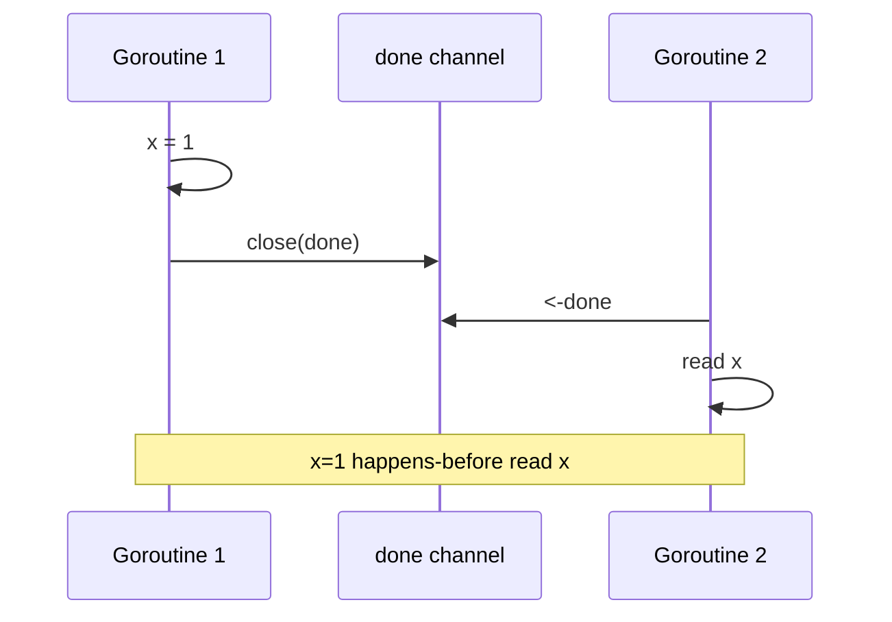
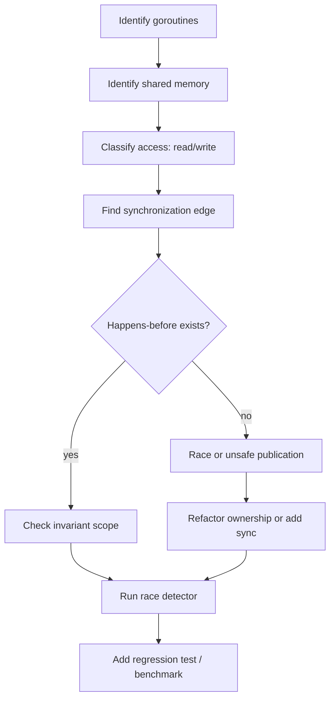

# Go Memory Model, Race Detector, dan Concurrency Correctness

> Target part ini: kamu mampu menjelaskan mengapa sebuah concurrent Go program benar, bukan hanya “tidak gagal saat dicoba”. Kamu akan memahami data race, happens-before, synchronization, race detector, dan batasan test untuk concurrency.

Part sebelumnya membahas `context.Context` sebagai mekanisme lifecycle. Sekarang kita masuk ke pertanyaan yang lebih fundamental:

> Ketika satu goroutine menulis data dan goroutine lain membaca data, kapan pembaca dijamin melihat hasil tulisan itu?

Pertanyaan ini dijawab oleh **Go Memory Model**.

Banyak bug concurrency bukan karena engineer tidak tahu `mutex` atau `channel`. Bug sering terjadi karena salah memahami visibility:

- “saya sudah set boolean `done = true`, pasti goroutine lain melihatnya”,
- “map ini hanya kadang ditulis, harusnya aman”,
- “saya close channel, jadi semua data pasti aman”,
- “test lolos 100 kali, berarti tidak race”,
- “karena assignment string atomic-ish, berarti aman”.

Semua asumsi itu berbahaya.

---

## Hubungan dengan Framework Kaufman

Dalam kerangka Josh Kaufman, ini adalah tahap **learn enough to self-correct** pada sub-skill concurrency.

Concurrency tidak bisa dipelajari hanya dengan pattern. Kamu perlu model koreksi:

1. identifikasi shared state,
2. tentukan goroutine mana yang membaca/menulis,
3. cari synchronization edge,
4. buktikan happens-before,
5. jalankan race detector,
6. review failure mode yang tidak tertangkap test.

Tanpa proses ini, concurrent code mudah terlihat benar tetapi salah secara memory model.

---

## 1. Masalah Fundamental: Visibility dan Ordering

Contoh sederhana:

```go id="ktawh6"
var ready bool
var value int

func writer() {
    value = 42
    ready = true
}

func reader() {
    for !ready {
    }
    fmt.Println(value)
}
```

Secara intuisi manusia, writer menulis `value = 42`, lalu `ready = true`. Reader menunggu `ready`, lalu mencetak `value`. Banyak orang berharap output pasti `42`.

Dalam concurrent program tanpa synchronization, harapan itu tidak valid.

Masalahnya:

- compiler boleh melakukan optimization,
- CPU punya cache dan reordering,
- goroutine dijalankan oleh scheduler,
- tidak ada hubungan synchronization antara write dan read,
- read/write terhadap `ready` sendiri adalah data race.

Program ini salah.

Versi benar dengan channel:

```go id="idc8fy"
func main() {
    done := make(chan struct{})
    var value int

    go func() {
        value = 42
        close(done)
    }()

    <-done
    fmt.Println(value)
}
```

Kenapa ini benar? Karena close channel menjadi synchronization event. Receive dari closed channel terjadi setelah close. Write `value = 42` terjadi sebelum close dalam goroutine writer. Maka read `value` setelah `<-done` dijamin melihat write tersebut.

---

## 2. Data Race: Definisi Praktis

Data race terjadi ketika:

1. dua goroutine mengakses memory location yang sama,
2. setidaknya salah satunya adalah write,
3. akses tersebut terjadi secara concurrent,
4. tidak ada synchronization yang mengatur ordering-nya.

Contoh data race:

```go id="g04al2"
var counter int

func main() {
    var wg sync.WaitGroup

    for i := 0; i < 1000; i++ {
        wg.Add(1)
        go func() {
            defer wg.Done()
            counter++
        }()
    }

    wg.Wait()
    fmt.Println(counter)
}
```

`counter++` bukan satu operasi tunggal. Secara konseptual:

```txt id="pnc9cd"
read counter
add 1
write counter
```

Banyak goroutine bisa membaca nilai sama lalu menulis hasil yang saling menimpa.

Versi benar dengan mutex:

```go id="v2u4lo"
var counter int
var mu sync.Mutex

func main() {
    var wg sync.WaitGroup

    for i := 0; i < 1000; i++ {
        wg.Add(1)
        go func() {
            defer wg.Done()

            mu.Lock()
            counter++
            mu.Unlock()
        }()
    }

    wg.Wait()
    fmt.Println(counter)
}
```

Versi benar dengan atomic:

```go id="yf98cg"
var counter atomic.Int64

func main() {
    var wg sync.WaitGroup

    for i := 0; i < 1000; i++ {
        wg.Add(1)
        go func() {
            defer wg.Done()
            counter.Add(1)
        }()
    }

    wg.Wait()
    fmt.Println(counter.Load())
}
```

---

## 3. DRF-SC: Data-Race-Free Programs Behave Sequentially Consistent

Salah satu prinsip penting memory model modern:

> Jika program bebas data race, kamu bisa bernalar seolah-olah operasi goroutine interleaved dalam urutan sequential yang konsisten dengan synchronization.

Ini sering disebut DRF-SC: **data-race-free implies sequential consistency**.

Terjemahan praktis:

- tulis program tanpa data race,
- gunakan synchronization yang jelas,
- jangan bergantung pada perilaku “kebetulan terlihat benar”,
- setelah bebas race, reasoning concurrency menjadi jauh lebih masuk akal.

Go tetap memberi batasan tertentu untuk program yang punya race, tetapi jangan jadikan itu sandaran desain. Production Go code harus dirancang bebas data race.

---

## 4. Happens-before: Bahasa untuk Membuktikan Correctness

**Happens-before** adalah hubungan ordering antar event.

Jika event A happens-before event B, maka efek memory dari A terlihat oleh B, sesuai aturan memory model.

Contoh dalam satu goroutine:

```go id="z8zg5y"
x = 1
 y = 2
```

Secara program order, `x = 1` happens-before `y = 2` dalam goroutine yang sama.

Tapi antar goroutine, kamu butuh synchronization.

```go id="ig7fs4"
x = 1
close(done)

// goroutine lain
<-done
fmt.Println(x)
```

`x = 1` happens-before `close(done)` karena program order. `close(done)` happens-before receive dari closed channel. Maka `x = 1` happens-before `fmt.Println(x)`.

Diagram:



---

## 5. Synchronization Events di Go

Beberapa operasi yang menciptakan happens-before:

| Mechanism | Happens-before relation |
|---|---|
| Goroutine creation | Statement sebelum `go f()` happens-before awal eksekusi `f`. |
| Channel send/receive | Send happens-before receive yang menerima value itu. |
| Channel close | Close happens-before receive yang mengamati channel closed. |
| Unbuffered channel | Receive dan send saling menyinkronkan lebih kuat karena rendezvous. |
| Mutex | `Unlock` happens-before `Lock` berikutnya pada mutex yang sama. |
| RWMutex | Unlock/RUnlock punya aturan synchronization terhadap Lock/RLock sesuai primitive. |
| Once | Completion function di `once.Do(f)` happens-before return dari `Do` lain. |
| Atomic | Atomic operations menyediakan synchronization sesuai aturan atomic Go. |
| WaitGroup | Dipakai untuk menunggu goroutine selesai, tetapi jangan gunakan sebagai proteksi shared mutation tanpa memahami ordering akses. |

Poin penting:

> `time.Sleep` bukan synchronization primitive.

Buruk:

```go id="jxs6c8"
go func() {
    value = 42
}()

time.Sleep(time.Millisecond)
fmt.Println(value) // tetap data race
```

Sleep hanya memberi waktu. Sleep tidak menciptakan happens-before.

---

## 6. Goroutine Creation Tidak Sama dengan Goroutine Completion

Ini benar:

```go id="xg4v1z"
x := 1
go func() {
    fmt.Println(x) // melihat x=1 aman dari sisi publication awal
}()
```

Statement sebelum `go` happens-before awal goroutine.

Tapi ini salah:

```go id="zy6fvw"
var x int

go func() {
    x = 1
}()

fmt.Println(x) // data race
```

Membuat goroutine tidak memberi synchronization saat goroutine selesai. Kamu butuh channel, WaitGroup plus akses yang benar, mutex, atau primitive lain.

Versi benar:

```go id="fxybs7"
var x int
var wg sync.WaitGroup

wg.Add(1)
go func() {
    defer wg.Done()
    x = 1
}()

wg.Wait()
fmt.Println(x)
```

`WaitGroup` di sini menunggu completion goroutine sebelum read `x`. Namun jangan menyalahgunakan WaitGroup sebagai lock untuk akses yang terjadi bersamaan.

---

## 7. Channel Send/Receive sebagai Publication

Channel sering dipakai untuk mempublikasikan data dengan aman.

```go id="bhlwbb"
type Result struct {
    Value int
}

func main() {
    ch := make(chan Result)

    go func() {
        result := Result{Value: 42}
        ch <- result
    }()

    result := <-ch
    fmt.Println(result.Value)
}
```

Send `ch <- result` happens-before receive `<-ch` yang menerima value tersebut.

Ini membuat data di `result` aman dibaca oleh receiver.

Namun hati-hati jika yang dikirim adalah pointer ke object yang masih dimutasi.

Buruk:

```go id="dcpqmw"
type Result struct {
    Values []int
}

func main() {
    ch := make(chan *Result)

    result := &Result{Values: []int{1, 2, 3}}

    go func() {
        ch <- result
        result.Values[0] = 99 // race dengan receiver
    }()

    received := <-ch
    fmt.Println(received.Values[0])
}
```

Channel mempublikasikan pointer, tetapi tidak membuat object menjadi immutable. Jika sender tetap memutasi setelah send, kamu tetap bisa race.

Solusi:

- kirim value copy,
- jangan mutate setelah publish,
- transfer ownership secara disiplin,
- lindungi shared object dengan mutex,
- gunakan immutable snapshot.

---

## 8. Close Channel sebagai Broadcast Signal

Close channel sering dipakai untuk broadcast cancellation/done signal.

```go id="dvh13p"
var value int
done := make(chan struct{})

go func() {
    value = 42
    close(done)
}()

<-done
fmt.Println(value)
```

Receive dari closed channel synchronized setelah close. Maka write sebelum close terlihat oleh read setelah receive.

Namun close channel harus punya owner jelas.

Rule:

> Channel biasanya ditutup oleh sender, bukan receiver.

Buruk:

```go id="g9qt43"
func consumer(ch chan int) {
    close(ch) // Buruk jika consumer bukan owner channel.
}
```

Jika beberapa goroutine bisa close channel yang sama, panic bisa terjadi.

Gunakan `sync.Once` jika close bisa dipicu dari beberapa path:

```go id="z05gdw"
type Stopper struct {
    done chan struct{}
    once sync.Once
}

func NewStopper() *Stopper {
    return &Stopper{done: make(chan struct{})}
}

func (s *Stopper) Stop() {
    s.once.Do(func() {
        close(s.done)
    })
}

func (s *Stopper) Done() <-chan struct{} {
    return s.done
}
```

---

## 9. Buffered Channel Ordering

Buffered channel punya aturan ordering yang lebih halus.

Contoh:

```go id="q87fdf"
ch := make(chan int, 1)
ch <- 1
ch <- 2 // block sampai ada receive
```

Buffered channel tidak selalu berarti sender dan receiver rendezvous langsung. Send bisa selesai sebelum receiver menerima jika buffer masih punya ruang.

Konsekuensi:

- buffered channel bisa mengurangi blocking,
- tetapi bisa melemahkan asumsi ordering mental,
- jangan gunakan buffer hanya untuk “memperbaiki deadlock” tanpa memahami ownership,
- buffer size adalah bagian dari desain backpressure.

Contoh semaphore dengan buffered channel:

```go id="wm169j"
type Semaphore struct {
    tokens chan struct{}
}

func NewSemaphore(n int) *Semaphore {
    return &Semaphore{tokens: make(chan struct{}, n)}
}

func (s *Semaphore) Acquire(ctx context.Context) error {
    select {
    case s.tokens <- struct{}{}:
        return nil
    case <-ctx.Done():
        return ctx.Err()
    }
}

func (s *Semaphore) Release() {
    <-s.tokens
}
```

Di sini buffer size adalah jumlah concurrency yang diizinkan.

---

## 10. Mutex: Ownership Shared State yang Eksplisit

Mutex adalah pilihan tepat ketika ada shared mutable state.

```go id="qp5i5h"
type Cache struct {
    mu    sync.Mutex
    items map[string]string
}

func NewCache() *Cache {
    return &Cache{items: make(map[string]string)}
}

func (c *Cache) Get(key string) (string, bool) {
    c.mu.Lock()
    defer c.mu.Unlock()

    value, ok := c.items[key]
    return value, ok
}

func (c *Cache) Set(key, value string) {
    c.mu.Lock()
    defer c.mu.Unlock()

    c.items[key] = value
}
```

`Unlock` happens-before `Lock` berikutnya pada mutex yang sama.

Prinsip desain:

- mutex melindungi invariant, bukan hanya line of code,
- semua akses ke protected state harus lewat mutex,
- jangan expose map/slice internal tanpa copy,
- keep lock scope kecil tetapi cukup untuk menjaga invariant,
- jangan copy struct yang mengandung mutex setelah digunakan.

Buruk:

```go id="zq4bs9"
func (c *Cache) Items() map[string]string {
    c.mu.Lock()
    defer c.mu.Unlock()

    return c.items // caller bisa mutate tanpa lock
}
```

Lebih baik:

```go id="sqz0px"
func (c *Cache) Snapshot() map[string]string {
    c.mu.Lock()
    defer c.mu.Unlock()

    snapshot := make(map[string]string, len(c.items))
    for k, v := range c.items {
        snapshot[k] = v
    }
    return snapshot
}
```

---

## 11. RWMutex: Optimasi, Bukan Default

`sync.RWMutex` memungkinkan banyak reader atau satu writer.

```go id="jukgdp"
type Registry struct {
    mu    sync.RWMutex
    items map[string]Handler
}

func (r *Registry) Get(name string) (Handler, bool) {
    r.mu.RLock()
    defer r.mu.RUnlock()

    h, ok := r.items[name]
    return h, ok
}

func (r *Registry) Set(name string, h Handler) {
    r.mu.Lock()
    defer r.mu.Unlock()

    r.items[name] = h
}
```

Jangan otomatis memakai `RWMutex` karena terlihat lebih canggih.

Pertimbangkan:

- apakah read jauh lebih banyak daripada write?
- apakah critical section cukup lama sehingga parallel read berguna?
- apakah complexity tambahan layak?
- apakah writer starvation atau contention relevan?

Untuk banyak kasus, `sync.Mutex` lebih sederhana dan cukup cepat.

---

## 12. Atomic: Tajam, Cepat, dan Mudah Disalahgunakan

Atomic cocok untuk state kecil dan operasi sederhana:

- counter,
- flag,
- pointer snapshot,
- metrics,
- once-like state internal,
- lock-free fast path yang benar-benar perlu.

Contoh counter:

```go id="znu90o"
type Metrics struct {
    requests atomic.Int64
}

func (m *Metrics) IncRequests() {
    m.requests.Add(1)
}

func (m *Metrics) Requests() int64 {
    return m.requests.Load()
}
```

Contoh flag:

```go id="v951xl"
type Gate struct {
    closed atomic.Bool
}

func (g *Gate) Close() {
    g.closed.Store(true)
}

func (g *Gate) IsClosed() bool {
    return g.closed.Load()
}
```

Anti-pattern atomic:

```go id="fsol2h"
var ready atomic.Bool
var data map[string]string

func writer() {
    data = map[string]string{"x": "y"}
    ready.Store(true)
}

func reader() string {
    if ready.Load() {
        return data["x"]
    }
    return ""
}
```

Ini bisa aman jika publication discipline benar dan `data` tidak dimutasi setelah store. Tetapi pattern seperti ini mudah salah. Untuk kebanyakan shared object kompleks, gunakan mutex.

Atomic bukan pengganti desain ownership.

---

## 13. `sync.Once`: Safe Initialization

`sync.Once` memastikan function hanya dieksekusi sekali, aman antar goroutine.

```go id="tfcyki"
type ConfigLoader struct {
    once sync.Once
    cfg  Config
    err  error
}

func (l *ConfigLoader) Load() (Config, error) {
    l.once.Do(func() {
        l.cfg, l.err = readConfigFile()
    })

    return l.cfg, l.err
}
```

Completion dari function dalam `Do` happens-before return dari `Do` lain. Jadi semua goroutine yang memanggil `Load` setelah initialization melihat `cfg` dan `err` yang sudah diset.

Hati-hati:

- jika initialization gagal, `Once` tetap dianggap sudah jalan,
- jangan gunakan `Once` jika perlu retry setelah failure kecuali desainnya eksplisit,
- jangan copy object yang berisi `Once` setelah digunakan.

---

## 14. Map Tidak Aman untuk Concurrent Access

Map Go tidak aman untuk concurrent read/write tanpa synchronization.

Buruk:

```go id="g8er4r"
var m = map[string]int{}

func main() {
    go func() {
        for {
            m["x"]++
        }
    }()

    go func() {
        for {
            fmt.Println(m["x"])
        }
    }()

    select {}
}
```

Ini bisa panic dengan pesan seperti concurrent map read and map write, atau race detector akan melaporkan data race.

Gunakan mutex:

```go id="d8u5mo"
type SafeMap struct {
    mu sync.Mutex
    m  map[string]int
}

func (s *SafeMap) Inc(key string) {
    s.mu.Lock()
    defer s.mu.Unlock()
    s.m[key]++
}

func (s *SafeMap) Get(key string) int {
    s.mu.Lock()
    defer s.mu.Unlock()
    return s.m[key]
}
```

Atau `sync.Map` untuk kasus tertentu seperti cache yang banyak read, key stabil, dan pattern access sesuai. Jangan pakai `sync.Map` sebagai default replacement untuk map + mutex.

---

## 15. Slice dan Shared Backing Array Race

Slice membawa pointer ke backing array. Copy slice bukan copy data.

```go id="yrrbag"
values := []int{1, 2, 3}
a := values
b := values

go func() {
    a[0] = 10
}()

go func() {
    fmt.Println(b[0])
}()
```

`a` dan `b` menunjuk backing array yang sama. Ini data race.

Jika ingin publish immutable snapshot, copy:

```go id="l55pin"
func Snapshot(values []int) []int {
    out := make([]int, len(values))
    copy(out, values)
    return out
}
```

Jika ingin shared mutable slice, lindungi dengan mutex.

---

## 16. Interface Value dan Pointer Race

Data race juga bisa muncul melalui interface yang menyimpan pointer.

```go id="f7dfo0"
type Counter struct {
    n int
}

func (c *Counter) Inc() {
    c.n++
}

var v any = &Counter{}

go func() {
    v.(*Counter).Inc()
}()

go func() {
    v.(*Counter).Inc()
}()
```

Walau variabel `v` sendiri tidak diubah, object di balik pointer dimutasi concurrent.

Memory location yang penting adalah `Counter.n`, bukan hanya variabel interface.

---

## 17. Loop Variable Capture

Pada Go modern, semantics loop variable telah membaik untuk banyak kasus, tetapi engineer tetap perlu memahami closure capture, terutama saat menjaga compatibility dan membaca code lama.

Pattern aman eksplisit:

```go id="sn0azo"
for _, item := range items {
    item := item
    go func() {
        process(item)
    }()
}
```

Untuk index:

```go id="fmr6fe"
for i := range items {
    i := i
    go func() {
        process(items[i])
    }()
}
```

Kenapa tetap ditulis eksplisit di handbook internal?

- memperjelas intent,
- membantu pembaca yang tahu bug historis Go,
- menghindari variasi behaviour saat membaca module lama,
- membuat ownership nilai per goroutine terlihat.

---

## 18. Race Detector: Cara Pakai

Jalankan test dengan race detector:

```bash id="riz3gq"
go test -race ./...
```

Jalankan binary dengan race detector:

```bash id="d5h01w"
go build -race -o app ./cmd/app
./app
```

Race detector hanya menemukan race pada path yang dieksekusi. Jika test tidak menjalankan path tertentu, race di path itu tidak akan ditemukan.

Artinya:

- race detector sangat penting,
- tetapi bukan bukti formal bahwa program bebas race,
- coverage concurrency scenario tetap penting,
- load/integration test dengan binary `-race` bisa menemukan race yang unit test lewatkan.

---

## 19. Membaca Output Race Detector

Contoh output biasanya berisi:

```txt id="gj9s68"
WARNING: DATA RACE
Read at 0x00c000014128 by goroutine 8:
  main.main.func2()
      /app/main.go:18 +0x44

Previous write at 0x00c000014128 by goroutine 7:
  main.main.func1()
      /app/main.go:13 +0x3c

Goroutine 8 (running) created at:
  main.main()
      /app/main.go:17 +0x104

Goroutine 7 (finished) created at:
  main.main()
      /app/main.go:12 +0xb8
```

Cara membacanya:

1. cari memory address yang sama,
2. lihat read stack,
3. lihat previous write stack,
4. lihat goroutine creation stack,
5. identifikasi shared state,
6. tambahkan synchronization atau ubah ownership.

Jangan hanya “menenangkan” race detector dengan sleep atau channel dummy. Perbaiki ownership.

---

## 20. Race Detector Example: Boolean Flag

Buruk:

```go id="m7dczf"
type Worker struct {
    stopped bool
}

func (w *Worker) Stop() {
    w.stopped = true
}

func (w *Worker) Run() {
    for !w.stopped {
        doWork()
    }
}
```

Race antara write `w.stopped = true` dan read `!w.stopped`.

Versi atomic:

```go id="nfxv1e"
type Worker struct {
    stopped atomic.Bool
}

func (w *Worker) Stop() {
    w.stopped.Store(true)
}

func (w *Worker) Run() {
    for !w.stopped.Load() {
        doWork()
    }
}
```

Versi context lebih idiomatik untuk lifecycle:

```go id="axbg5p"
func (w *Worker) Run(ctx context.Context) error {
    for {
        select {
        case <-ctx.Done():
            return ctx.Err()
        default:
            doWork()
        }
    }
}
```

Pilih primitive berdasarkan intent. Untuk lifecycle, context/channel biasanya lebih jelas daripada atomic boolean.

---

## 21. Race Detector Example: Append ke Slice Shared

Buruk:

```go id="q690dr"
var results []Result
var wg sync.WaitGroup

for _, job := range jobs {
    wg.Add(1)
    go func(job Job) {
        defer wg.Done()
        result := process(job)
        results = append(results, result)
    }(job)
}

wg.Wait()
```

`append` memutasi slice header dan mungkin backing array. Ini race.

Versi mutex:

```go id="ykd64y"
var results []Result
var mu sync.Mutex
var wg sync.WaitGroup

for _, job := range jobs {
    wg.Add(1)
    go func(job Job) {
        defer wg.Done()
        result := process(job)

        mu.Lock()
        results = append(results, result)
        mu.Unlock()
    }(job)
}

wg.Wait()
```

Versi channel aggregator:

```go id="wpsmcx"
resultsCh := make(chan Result)
var wg sync.WaitGroup

for _, job := range jobs {
    wg.Add(1)
    go func(job Job) {
        defer wg.Done()
        resultsCh <- process(job)
    }(job)
}

go func() {
    wg.Wait()
    close(resultsCh)
}()

var results []Result
for result := range resultsCh {
    results = append(results, result)
}
```

Di versi channel, hanya aggregator goroutine yang memutasi `results`.

---

## 22. Race Detector Example: Unsafe Publication

Buruk:

```go id="ly360g"
type Config struct {
    Timeout time.Duration
    URL     string
}

var config *Config

func Reload() {
    config = &Config{Timeout: time.Second, URL: "https://example.com"}
}

func Current() *Config {
    return config
}
```

Jika `Reload` dan `Current` dipanggil dari goroutine berbeda, race.

Versi `atomic.Pointer` untuk immutable config snapshot:

```go id="tpx1bb"
type Config struct {
    Timeout time.Duration
    URL     string
}

type ConfigStore struct {
    ptr atomic.Pointer[Config]
}

func (s *ConfigStore) Reload(cfg Config) {
    snapshot := cfg
    s.ptr.Store(&snapshot)
}

func (s *ConfigStore) Current() (Config, bool) {
    cfg := s.ptr.Load()
    if cfg == nil {
        return Config{}, false
    }
    return *cfg, true // return copy
}
```

Syarat penting: config yang disimpan harus diperlakukan immutable setelah `Store`.

Jika config kompleks dan mutable, gunakan mutex.

---

## 23. `WaitGroup` Bukan Lock

`WaitGroup` digunakan untuk menunggu kumpulan goroutine selesai. Ia tidak menggantikan mutex untuk akses shared state selama goroutine masih berjalan.

Contoh aman karena read terjadi setelah semua write selesai:

```go id="xba0ka"
values := make([]int, len(jobs))
var wg sync.WaitGroup

for i, job := range jobs {
    i, job := i, job
    wg.Add(1)
    go func() {
        defer wg.Done()
        values[i] = process(job)
    }()
}

wg.Wait()
fmt.Println(values)
```

Kenapa ini aman?

- setiap goroutine menulis index berbeda,
- tidak ada dua goroutine mengakses memory location yang sama secara conflicting,
- read `values` dilakukan setelah `wg.Wait()`.

Contoh tidak aman:

```go id="vpa4te"
var total int
var wg sync.WaitGroup

for _, job := range jobs {
    wg.Add(1)
    go func(job Job) {
        defer wg.Done()
        total += process(job)
    }(job)
}

wg.Wait()
fmt.Println(total)
```

`wg.Wait()` hanya memastikan semua selesai sebelum print, tetapi `total += ...` antar worker tetap race.

---

## 24. Immutable Data: Concurrency Simplifier

Salah satu cara terbaik menghindari race adalah menghindari shared mutable state.

Pattern:

```go id="num06f"
type RuleSet struct {
    rules []Rule
}

func NewRuleSet(rules []Rule) RuleSet {
    copied := make([]Rule, len(rules))
    copy(copied, rules)
    return RuleSet{rules: copied}
}

func (r RuleSet) Evaluate(input Input) Decision {
    for _, rule := range r.rules {
        if decision, ok := rule.Apply(input); ok {
            return decision
        }
    }
    return Decision{}
}
```

Jika `RuleSet` tidak pernah dimutasi setelah dibuat, banyak goroutine bisa membacanya tanpa lock.

Hati-hati dengan slice/map internal. Jangan expose tanpa copy.

```go id="qbfmk6"
func (r RuleSet) Rules() []Rule {
    out := make([]Rule, len(r.rules))
    copy(out, r.rules)
    return out
}
```

Immutability di Go bersifat disiplin desain, bukan enforced penuh oleh type system.

---

## 25. Ownership Transfer dengan Channel

Channel bisa dipakai untuk transfer ownership.

```go id="aihnvk"
type Buffer struct {
    data []byte
}

func producer(out chan<- Buffer) {
    buf := Buffer{data: make([]byte, 1024)}
    // fill buf
    out <- buf
    // producer tidak lagi menyentuh buf.data
}

func consumer(in <-chan Buffer) {
    buf := <-in
    // consumer sekarang owner buf
    _ = buf
}
```

Rule ownership:

> Setelah object dikirim untuk transfer ownership, sender tidak boleh mutate object itu lagi kecuali ada synchronization baru.

Ini bukan fitur bahasa; ini kontrak desain. Dokumentasikan jika API memakai ownership transfer.

---

## 26. Confinement: State Dimiliki Satu Goroutine

Confinement berarti state hanya diakses oleh satu goroutine. Goroutine lain berinteraksi melalui message.

Contoh actor-like counter:

```go id="gk9jix"
type Counter struct {
    commands chan command
}

type command struct {
    kind  string
    delta int
    reply chan int
}

func NewCounter(ctx context.Context) *Counter {
    c := &Counter{commands: make(chan command)}
    go c.run(ctx)
    return c
}

func (c *Counter) run(ctx context.Context) {
    var value int
    for {
        select {
        case <-ctx.Done():
            return
        case cmd := <-c.commands:
            switch cmd.kind {
            case "add":
                value += cmd.delta
            case "get":
                cmd.reply <- value
            }
        }
    }
}

func (c *Counter) Add(ctx context.Context, delta int) error {
    select {
    case c.commands <- command{kind: "add", delta: delta}:
        return nil
    case <-ctx.Done():
        return ctx.Err()
    }
}

func (c *Counter) Get(ctx context.Context) (int, error) {
    reply := make(chan int, 1)
    select {
    case c.commands <- command{kind: "get", reply: reply}:
    case <-ctx.Done():
        return 0, ctx.Err()
    }

    select {
    case value := <-reply:
        return value, nil
    case <-ctx.Done():
        return 0, ctx.Err()
    }
}
```

Kelebihan:

- tidak perlu mutex untuk `value`,
- semua mutation terjadi di satu goroutine,
- lifecycle bisa dikontrol dengan context.

Kekurangan:

- lebih banyak protocol code,
- backpressure perlu dipikirkan,
- shutdown semantics harus jelas,
- bisa overkill untuk state sederhana.

---

## 27. Channel vs Mutex: Decision Matrix

| Situasi | Bias Pilihan |
|---|---|
| Shared map/cache sederhana | `sync.Mutex` |
| Counter/flag sederhana | `sync/atomic` |
| Pipeline data antar stage | channel |
| Worker pool | channel + WaitGroup + context |
| Protect invariant multi-field | mutex |
| Broadcast stop signal | close channel atau context |
| Ownership transfer | channel |
| Many readers, few writes | mutex dulu, `RWMutex` jika terbukti perlu |
| Complex mutable object | mutex atau confinement |
| High-performance lock-free path | atomic dengan review ketat |

Kalimat praktis:

> Do not communicate by sharing memory; share memory by communicating — tetapi di Go production, mutex tetap idiomatik saat shared state memang model yang paling sederhana.

Pilih primitive berdasarkan invariant, bukan ideologi.

---

## 28. Memory Model Review Workflow

Saat review concurrent code, lakukan langkah ini:



Pertanyaan yang harus dijawab:

- State apa yang shared?
- Siapa owner mutation?
- Akses mana yang concurrent?
- Primitive apa yang menciptakan happens-before?
- Apakah synchronization melindungi seluruh invariant atau hanya sebagian field?
- Apakah object dipublish lalu masih dimutasi?
- Apakah test menjalankan interleaving yang relevan?

---

## 29. Correctness Invariant, Bukan Sekadar Lock

Contoh account transfer:

```go id="bcvan1"
type Account struct {
    mu      sync.Mutex
    balance int
}
```

Jika transfer melibatkan dua account, locking satu account per operation bisa menyebabkan invariant global salah atau deadlock.

Naif:

```go id="eo3qx0"
func Transfer(from, to *Account, amount int) error {
    from.mu.Lock()
    defer from.mu.Unlock()

    if from.balance < amount {
        return errors.New("insufficient balance")
    }
    from.balance -= amount

    to.mu.Lock()
    defer to.mu.Unlock()
    to.balance += amount

    return nil
}
```

Masalah:

- deadlock jika dua goroutine transfer A->B dan B->A,
- invariant total balance bisa terlihat intermediate jika pembaca tidak sinkron,
- lock ordering tidak jelas.

Solusi bisa berupa:

- lock ordering berdasarkan ID,
- satu ledger goroutine owner,
- database transaction,
- higher-level aggregate lock.

Contoh lock ordering sederhana:

```go id="u9c4xs"
func lockPair(a, b *Account) func() {
    if a.id < b.id {
        a.mu.Lock()
        b.mu.Lock()
        return func() {
            b.mu.Unlock()
            a.mu.Unlock()
        }
    }

    b.mu.Lock()
    a.mu.Lock()
    return func() {
        a.mu.Unlock()
        b.mu.Unlock()
    }
}
```

Concurrency correctness bukan hanya “pakai mutex”, tetapi “mutex melindungi invariant yang benar”.

---

## 30. Testing Concurrent Code

Concurrency test sulit karena bug bergantung interleaving.

Prinsip:

- hindari `time.Sleep` sebagai mekanisme utama,
- gunakan channel untuk mengontrol progress,
- test cancellation path,
- test error path,
- jalankan dengan `-race`,
- jalankan berulang jika perlu,
- desain API agar deterministic.

Contoh controlled interleaving:

```go id="o5xbd9"
func TestCacheSingleFlight(t *testing.T) {
    started := make(chan struct{})
    release := make(chan struct{})

    loader := func(context.Context, string) (string, error) {
        close(started)
        <-release
        return "value", nil
    }

    cache := NewCache(loader)

    done := make(chan struct{})
    go func() {
        _, _ = cache.Get(context.Background(), "key")
        close(done)
    }()

    <-started

    // At this point loader is in-flight.
    // Start second request and assert it waits/shares work.

    close(release)
    <-done
}
```

Channel membuat test mengontrol timing tanpa sleep acak.

---

## 31. Race Detector di CI

Rekomendasi pipeline:

```bash id="femf4z"
go test ./...
go test -race ./...
go test -run TestCriticalConcurrentFlow -race -count=50 ./...
```

Untuk repo besar, `-race` lebih lambat. Strategi umum:

- jalankan `go test ./...` di setiap commit,
- jalankan `go test -race ./...` di PR atau nightly,
- jalankan targeted stress test untuk package concurrent kritikal,
- jalankan binary `-race` di integration workload jika memungkinkan.

Jangan menghapus test race karena “lambat” tanpa mengganti dengan coverage lain.

---

## 32. Common Concurrency Smells

| Smell | Risiko | Perbaikan |
|---|---|---|
| shared map tanpa mutex | race/panic | map + mutex atau sync.Map sesuai kasus |
| boolean stop flag biasa | race | context, channel close, atomic |
| append shared slice | race/corruption | mutex atau aggregator goroutine |
| `time.Sleep` untuk sync | flaky/race tetap ada | channel/WaitGroup/Cond |
| channel ditutup receiver | panic | owner sender menutup channel |
| pointer dikirim lalu dimutasi | unsafe publication | copy/immutable/ownership transfer |
| lock hanya sebagian invariant | logical race | lock seluruh invariant |
| atomic untuk object kompleks | subtle bug | mutex atau immutable snapshot |
| goroutine tanpa exit path | leak | context/channel ownership |
| ignore race detector warning | production bug | fix root cause |

---

## 33. Mini Project: Concurrent In-memory Job Registry

Buat package `jobregistry`.

Requirement:

- bisa register job,
- bisa update status,
- bisa mengambil snapshot semua job,
- aman untuk concurrent access,
- tidak expose map/slice internal,
- punya test dengan `go test -race`,
- punya benchmark read/write,
- punya cancellation-aware watcher.

API contoh:

```go id="tlf5ur"
type Status string

const (
    StatusPending Status = "pending"
    StatusRunning Status = "running"
    StatusDone    Status = "done"
    StatusFailed  Status = "failed"
)

type Job struct {
    ID     string
    Status Status
    Error  string
}

type Registry struct {
    mu   sync.Mutex
    jobs map[string]Job
}

func NewRegistry() *Registry {
    return &Registry{jobs: make(map[string]Job)}
}

func (r *Registry) Register(job Job) error {
    r.mu.Lock()
    defer r.mu.Unlock()

    if _, exists := r.jobs[job.ID]; exists {
        return fmt.Errorf("job already exists: %s", job.ID)
    }

    r.jobs[job.ID] = job
    return nil
}

func (r *Registry) UpdateStatus(id string, status Status, errText string) error {
    r.mu.Lock()
    defer r.mu.Unlock()

    job, exists := r.jobs[id]
    if !exists {
        return fmt.Errorf("job not found: %s", id)
    }

    job.Status = status
    job.Error = errText
    r.jobs[id] = job
    return nil
}

func (r *Registry) Snapshot() []Job {
    r.mu.Lock()
    defer r.mu.Unlock()

    out := make([]Job, 0, len(r.jobs))
    for _, job := range r.jobs {
        out = append(out, job)
    }
    return out
}
```

Test concurrent:

```go id="lu8bhn"
func TestRegistryConcurrentAccess(t *testing.T) {
    registry := NewRegistry()

    var wg sync.WaitGroup
    for i := 0; i < 100; i++ {
        i := i
        wg.Add(1)
        go func() {
            defer wg.Done()

            id := fmt.Sprintf("job-%d", i)
            if err := registry.Register(Job{ID: id, Status: StatusPending}); err != nil {
                t.Errorf("register: %v", err)
                return
            }

            if err := registry.UpdateStatus(id, StatusDone, ""); err != nil {
                t.Errorf("update: %v", err)
                return
            }
        }()
    }

    wg.Wait()

    snapshot := registry.Snapshot()
    if len(snapshot) != 100 {
        t.Fatalf("expected 100 jobs, got %d", len(snapshot))
    }
}
```

Jalankan:

```bash id="iw431u"
go test -race ./...
```

---

## 34. Latihan Terarah

### Latihan 1 — Perbaiki Race Counter

Mulai dari counter race. Buat tiga versi:

1. mutex,
2. atomic,
3. channel aggregator.

Bandingkan readability, performance, dan failure mode.

### Latihan 2 — Safe Config Reload

Buat config store yang bisa reload config saat runtime.

Versi A: `sync.RWMutex`.

Versi B: `atomic.Pointer[Config]` dengan immutable snapshot.

Tulis benchmark read path dan update path.

### Latihan 3 — Race Detector Report

Sengaja buat race pada shared slice append. Jalankan `go test -race`. Simpan output dan jelaskan:

- read location,
- write location,
- goroutine creation site,
- root cause,
- fix yang dipilih.

### Latihan 4 — Ownership Transfer

Buat pipeline yang mengirim buffer antar stage. Pastikan stage sebelumnya tidak mutate buffer setelah mengirim. Tambahkan test yang akan race jika mutation masih terjadi.

### Latihan 5 — Review Invariant

Ambil kode cache atau registry yang pernah kamu tulis. Jawab:

- invariant apa yang dilindungi?
- lock mana yang melindungi invariant itu?
- apakah ada method yang expose internal state?
- apakah snapshot benar-benar copy?
- apakah ada path read tanpa lock?

---

## 35. Production Checklist

Sebelum merge concurrent Go code:

- semua shared mutable state punya owner jelas,
- semua read/write shared state punya synchronization,
- tidak ada map concurrent read/write tanpa protection,
- tidak ada append shared slice tanpa protection,
- channel close punya owner tunggal,
- goroutine punya exit path,
- context cancellation dihormati,
- object yang dipublish tidak dimutasi lagi tanpa sync,
- atomic hanya dipakai untuk state sederhana atau snapshot immutable,
- lock melindungi invariant, bukan sekadar field,
- test dijalankan dengan `-race`,
- race detector warning tidak diabaikan,
- concurrency test tidak bergantung pada sleep acak,
- code review bisa menjelaskan happens-before untuk path penting.

---

## 36. Mental Model Final

Untuk setiap concurrent design, tanyakan tiga hal:

```txt id="h1kb0u"
1. Who owns the state?
2. Who can read/write it?
3. What synchronization makes that access safe?
```

Jika jawabannya kabur, code itu belum siap production.

Bukan semua concurrency bug bisa ditangkap test. Karena itu, Go engineer yang matang tidak hanya menjalankan `go test -race`, tetapi juga bisa menjelaskan memory model di balik desainnya.

---

## 37. Ringkasan

Di part ini kamu belajar:

- definisi praktis data race,
- konsep happens-before,
- mengapa sleep bukan synchronization,
- bagaimana channel, close, mutex, once, atomic, dan goroutine creation mempengaruhi ordering,
- mengapa shared map/slice harus dilindungi,
- kapan memakai mutex, channel, atomic, atau confinement,
- cara menjalankan dan membaca race detector,
- batasan race detector,
- workflow review memory model,
- latihan untuk membangun concurrency correctness.

Part berikutnya akan membahas **Runtime Go: Scheduler, Stack, GC, dan Cost Model**. Setelah memahami correctness antar goroutine, kamu akan masuk ke cara runtime Go menjalankan goroutine, mengelola stack, melakukan garbage collection, dan mempengaruhi latency/throughput service produksi.
