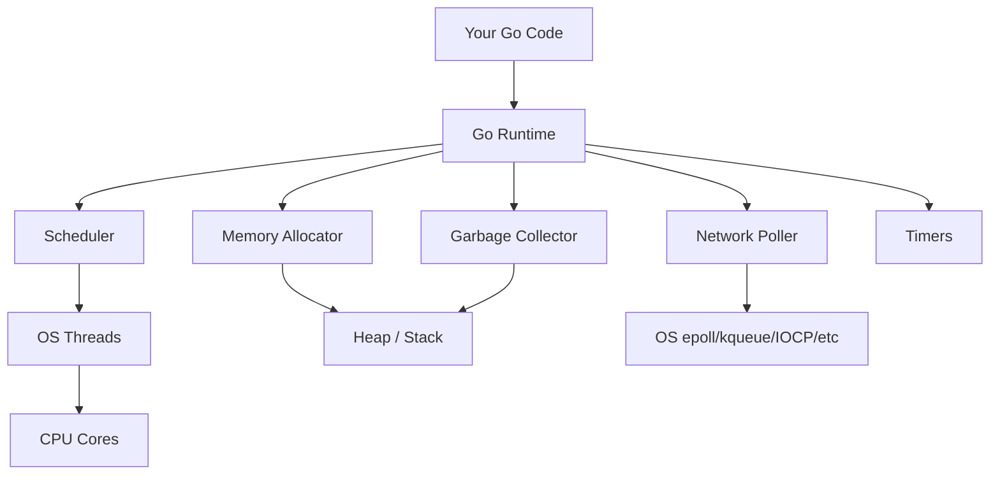
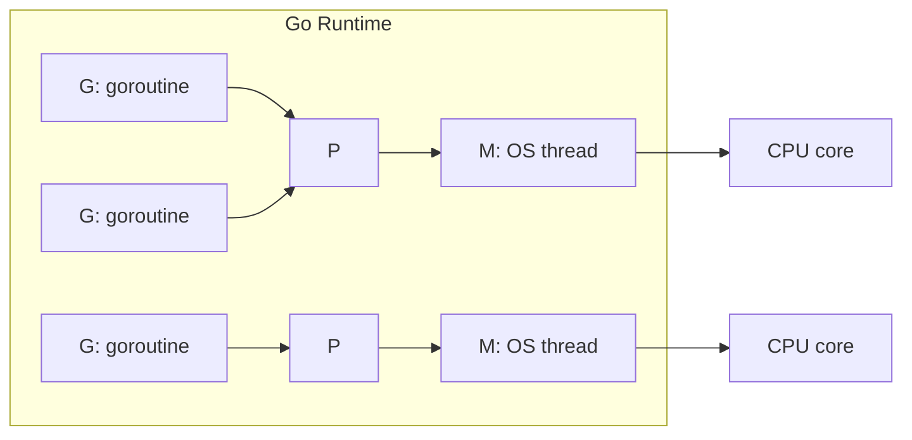
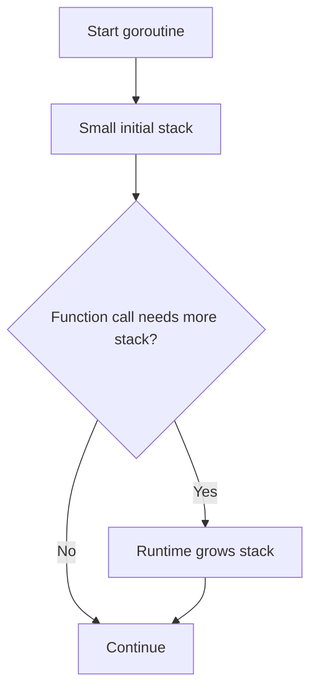
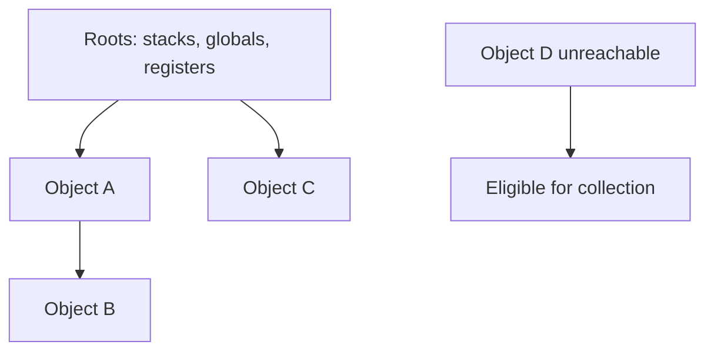
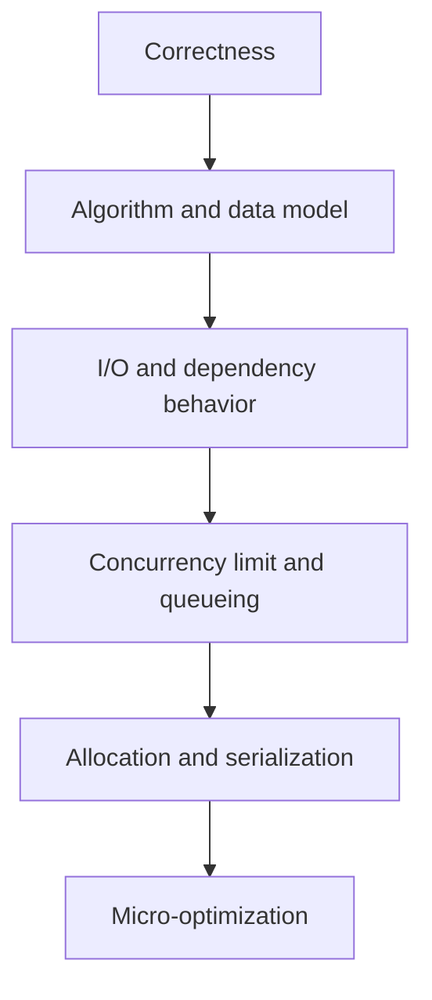
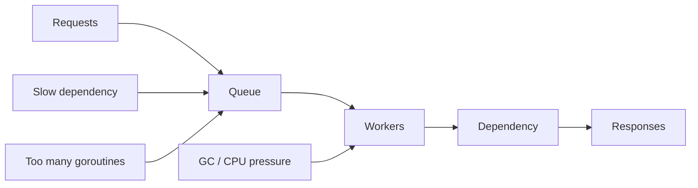
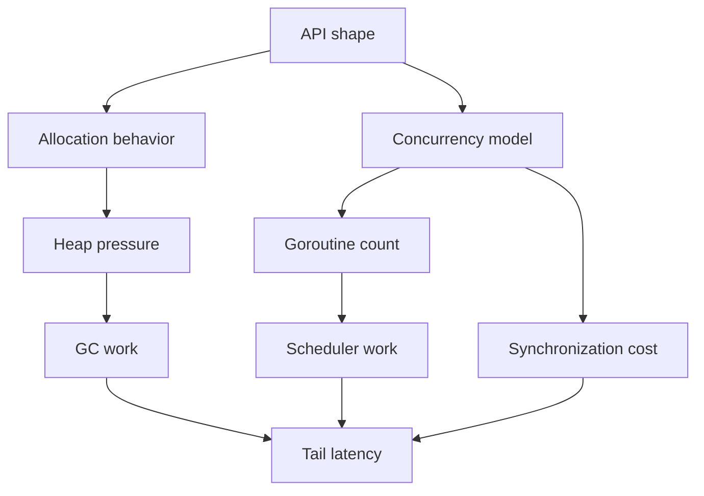

# Runtime Go: Scheduler, Stack, GC, dan Cost Model

Part ini menjawab pertanyaan yang biasanya muncul setelah kita bisa menulis Go concurrent code:

> “Kode saya sudah benar secara sintaks dan test lewat. Tapi berapa cost-nya di runtime?”

Go sengaja membuat concurrency terlihat sederhana: `go fn()`, channel, mutex, context. Namun runtime di bawahnya tetap punya mekanisme nyata: scheduler, stack, heap, garbage collector, syscall boundary, network poller, dan memory allocator.

Tujuan part ini bukan membuat kita menjadi runtime engineer. Tujuannya adalah membangun **cost model** yang cukup akurat agar kita bisa membuat keputusan desain yang baik di production.

Kita ingin bisa menjawab:

- Kapan goroutine murah, dan kapan menjadi masalah?
- Kenapa allocation kecil yang sering bisa menghancurkan latency?
- Apa hubungan pointer, escape analysis, heap, dan GC?
- Kenapa blocking syscall bisa memengaruhi scheduling?
- Apa bedanya concurrency tinggi dengan throughput tinggi?
- Metric runtime apa yang harus dilihat ketika service Go mulai melambat?
- Bagaimana cara berpikir tentang latency, memory, dan CPU tanpa premature optimization?

---

## 1. Target Skill Part Ini

Setelah menyelesaikan part ini, kita harus bisa:

1. Menjelaskan mental model scheduler Go dengan konsep `G`, `M`, dan `P`.
2. Memahami kenapa goroutine jauh lebih ringan daripada OS thread, tetapi tetap bukan gratis.
3. Menjelaskan stack goroutine yang tumbuh secara dinamis.
4. Menjelaskan hubungan allocation, heap, dan garbage collector.
5. Mengidentifikasi sumber allocation pressure dalam kode Go.
6. Memahami dampak blocking operation terhadap scheduler.
7. Membaca runtime metrics dasar untuk service Go.
8. Membuat keputusan awal antara memperbaiki algorithm, allocation, concurrency, atau I/O.
9. Menulis review checklist untuk runtime-sensitive Go code.

Dalam framework Kaufman, ini adalah tahap **learn enough to self-correct**. Kita tidak perlu menghafal semua detail internal runtime. Kita perlu cukup paham untuk mengenali bug desain dan bottleneck sebelum production memaksa kita belajar dengan cara mahal.

---

## 2. Mental Model Utama: Go Runtime Adalah Operating Layer Mini

Go program tidak langsung hanya “jalan di OS”. Ada runtime yang mengatur beberapa hal penting:

- scheduling goroutine
- stack goroutine
- memory allocation
- garbage collection
- timers
- network polling
- panic/defer handling
- reflection support
- map internals
- channel internals
- race detector integration saat enabled

Secara kasar:



Sebagai engineer, kita tidak perlu mengontrol semua ini secara manual. Namun kita harus tahu bahwa setiap abstraction punya biaya.

Contoh:

```go id="runtime-cost-simple-goroutine"
for _, job := range jobs {
    go process(job)
}
```

Kode ini terlihat murah. Tetapi jika `jobs` berisi 10 juta item, kita menciptakan tekanan besar:

- jutaan goroutine
- jutaan stack awal
- jutaan closure capture
- scheduler overhead
- memory pressure
- potensi overload dependency

Go membuat concurrency **mudah diekspresikan**, bukan otomatis aman secara kapasitas.

---

## 3. Scheduler Go: G, M, dan P

Scheduler Go sering dijelaskan dengan tiga entitas:

| Komponen | Makna Praktis |
|---|---|
| `G` | Goroutine: unit pekerjaan Go-level |
| `M` | Machine: OS thread yang menjalankan kode |
| `P` | Processor: resource scheduler yang dibutuhkan `M` untuk menjalankan `G` |

Mental model sederhana:



Interpretasi praktis:

- Banyak goroutine bisa dibuat.
- Tidak semua goroutine berjalan bersamaan.
- Yang benar-benar dieksekusi adalah goroutine yang sedang dijalankan oleh OS thread.
- Jumlah parallel execution terutama dibatasi oleh `GOMAXPROCS`, CPU core, blocking, dan scheduler decisions.

---

## 4. Concurrency vs Parallelism

Go membuat concurrency mudah, tetapi concurrency tidak sama dengan parallelism.

| Istilah | Arti |
|---|---|
| Concurrency | Banyak pekerjaan aktif secara konseptual, bisa saling menunggu |
| Parallelism | Banyak pekerjaan benar-benar berjalan pada saat yang sama di CPU berbeda |

Contoh concurrent tapi belum tentu parallel:

```go id="concurrent-not-necessarily-parallel"
go fetchUser(ctx, userID)
go fetchOrders(ctx, userID)
go fetchRisk(ctx, userID)
```

Tiga goroutine ini concurrent. Mereka bisa berjalan bergantian. Mereka menjadi parallel jika runtime menjalankannya di beberapa OS thread pada CPU core berbeda.

Untuk I/O-bound service, concurrency sering meningkatkan throughput karena banyak goroutine menunggu network/database.

Untuk CPU-bound workload, membuat terlalu banyak goroutine sering tidak membantu. CPU tetap terbatas.

Contoh CPU-bound yang bisa salah:

```go id="bad-cpu-bound-unbounded-goroutine"
for _, image := range images {
    go resize(image)
}
```

Jika `resize` CPU-heavy, lebih baik gunakan worker pool terbatas:

```go id="bounded-cpu-worker-pool"
func ProcessImages(ctx context.Context, images []Image, workers int) error {
    jobs := make(chan Image)
    var wg sync.WaitGroup

    for i := 0; i < workers; i++ {
        wg.Add(1)
        go func() {
            defer wg.Done()
            for img := range jobs {
                resize(img)
            }
        }()
    }

    for _, img := range images {
        select {
        case <-ctx.Done():
            close(jobs)
            wg.Wait()
            return ctx.Err()
        case jobs <- img:
        }
    }

    close(jobs)
    wg.Wait()
    return nil
}
```

Catatan desain:

- `workers` untuk CPU-bound biasanya dekat dengan jumlah CPU core.
- `workers` untuk I/O-bound bisa lebih tinggi, tetapi tetap harus dibatasi agar dependency tidak overload.

---

## 5. Goroutine Itu Murah, Bukan Gratis

Goroutine jauh lebih ringan daripada OS thread karena:

- stack awal kecil
- scheduling dikontrol Go runtime
- blocking network I/O bisa diintegrasikan dengan network poller
- context switch Go-level bisa lebih murah daripada OS thread switch

Namun goroutine tetap punya biaya:

- stack awal
- descriptor runtime
- scheduler bookkeeping
- captured variables pada closure
- channel/mutex contention jika berlebihan
- GC work jika goroutine membuat object heap

Anti-pattern:

```go id="unbounded-goroutine-antipattern"
func NotifyAll(users []User) {
    for _, user := range users {
        go sendEmail(user)
    }
}
```

Masalah:

- tidak ada limit concurrency
- tidak ada error collection
- tidak ada cancellation
- tidak ada backpressure
- tidak ada lifecycle ownership

Versi lebih sehat:

```go id="bounded-notification-worker-pool"
type EmailSender interface {
    Send(ctx context.Context, user User) error
}

func NotifyAll(ctx context.Context, sender EmailSender, users []User, workers int) error {
    jobs := make(chan User)
    errs := make(chan error, 1)

    var wg sync.WaitGroup
    for i := 0; i < workers; i++ {
        wg.Add(1)
        go func() {
            defer wg.Done()
            for user := range jobs {
                if err := sender.Send(ctx, user); err != nil {
                    select {
                    case errs <- err:
                    default:
                    }
                    return
                }
            }
        }()
    }

    for _, user := range users {
        select {
        case <-ctx.Done():
            close(jobs)
            wg.Wait()
            return ctx.Err()
        case err := <-errs:
            close(jobs)
            wg.Wait()
            return err
        case jobs <- user:
        }
    }

    close(jobs)
    wg.Wait()

    select {
    case err := <-errs:
        return err
    default:
        return nil
    }
}
```

Versi ini masih sederhana, tapi sudah punya:

- bounded concurrency
- cancellation
- error propagation
- lifecycle ownership

---

## 6. Stack Goroutine: Kecil dan Tumbuh Dinamis

OS thread biasanya punya stack besar. Goroutine dimulai dengan stack kecil yang bisa tumbuh sesuai kebutuhan.

Mental model:



Ini alasan goroutine bisa jauh lebih banyak daripada OS thread. Namun stack growth tetap punya cost. Recursive function yang dalam, frame besar, atau banyak goroutine aktif tetap bisa memberi tekanan memory.

Contoh frame besar yang perlu dicurigai:

```go id="large-stack-frame-example"
func process() {
    var buf [4 << 20]byte // 4 MiB stack object jika tidak escape
    _ = buf
}
```

Kode seperti ini harus ditinjau. Kadang lebih baik menggunakan buffer pool, streaming, atau alokasi eksplisit yang dikontrol.

Namun jangan otomatis berpikir “heap lebih baik”. Heap object akan menjadi pekerjaan GC. Pertanyaan yang benar:

> Object ini lifetime-nya apa, ukurannya berapa, frekuensinya berapa, dan siapa yang memilikinya?

---

## 7. Stack vs Heap: Yang Penting Bukan Tempatnya, tapi Lifetime dan Escape

Pada Go, compiler melakukan escape analysis untuk memutuskan apakah value bisa berada di stack atau harus escape ke heap.

Contoh sederhana:

```go id="escape-return-pointer"
type User struct {
    ID   string
    Name string
}

func NewUser(id, name string) *User {
    u := User{ID: id, Name: name}
    return &u
}
```

`u` kemungkinan escape karena pointer-nya dikembalikan ke caller.

Contoh lain:

```go id="no-escape-value-return"
func NewUserValue(id, name string) User {
    return User{ID: id, Name: name}
}
```

Value bisa disalin. Untuk struct kecil, ini sering lebih murah dan lebih jelas.

Untuk melihat escape analysis:

```bash id="escape-analysis-command"
go build -gcflags='-m=2' ./...
```

Contoh sinyal yang perlu dibaca:

```txt id="escape-analysis-output-example"
./user.go:10:2: u escapes to heap
./handler.go:25:19: string(body) escapes to heap
```

Jangan treat output escape analysis sebagai perintah absolut. Treat sebagai feedback:

- apakah allocation ini memang perlu?
- apakah API memaksa heap allocation?
- apakah interface conversion menyebabkan escape?
- apakah closure capture membuat object hidup lebih lama?

---

## 8. Allocation Pressure: Musuh Diam-diam Latency

Allocation pressure terjadi ketika program membuat banyak object baru di heap dalam waktu singkat.

Efeknya:

1. allocator bekerja lebih keras
2. heap tumbuh
3. GC perlu scan lebih banyak object
4. CPU dipakai untuk GC
5. latency tail bisa naik

Contoh allocation yang sering tidak terasa:

```go id="allocation-hot-path-bad"
func FormatUser(u User) string {
    return fmt.Sprintf("%s:%s", u.ID, u.Name)
}
```

`fmt.Sprintf` fleksibel, tetapi bisa mahal untuk hot path.

Alternatif sederhana:

```go id="allocation-hot-path-better"
func FormatUser(u User) string {
    return u.ID + ":" + u.Name
}
```

Untuk kasus kompleks:

```go id="strings-builder-example"
func BuildReport(items []Item) string {
    var b strings.Builder

    for _, item := range items {
        b.WriteString(item.ID)
        b.WriteByte(':')
        b.WriteString(item.Name)
        b.WriteByte('\n')
    }

    return b.String()
}
```

Tetap gunakan profiling sebelum melakukan refactor besar.

Rule of thumb:

- Di cold path, readability menang.
- Di hot path, measurement menang.
- Di boundary besar, streaming sering menang.
- Di code review, tanyakan lifetime object, bukan hanya “pakai pointer atau value?”.

---

## 9. Garbage Collector: Apa yang Perlu Dipahami Engineer Aplikasi

Go menggunakan garbage collector sehingga kita tidak perlu manual `free`. Ini meningkatkan safety dan productivity. Tetapi GC bukan sihir gratis.

GC perlu mengetahui object mana yang masih reachable. Object yang masih reachable tidak bisa dibersihkan. Object yang sudah unreachable bisa dibersihkan pada siklus GC berikutnya.

Mental model sederhana:



GC cost dipengaruhi oleh:

- jumlah allocation
- ukuran live heap
- jumlah pointer yang harus discan
- object graph complexity
- frequency allocation di hot path

Hal yang sering salah dipahami:

> “GC lambat, jadi Go tidak cocok untuk latency-sensitive service.”

Lebih akurat:

> Go bisa sangat baik untuk latency-sensitive service, tetapi kita harus mengontrol allocation, live heap, dependency latency, dan concurrency level.

Masalah latency sering bukan GC saja. Bisa jadi:

- database slow
- connection pool habis
- goroutine leak
- mutex contention
- logging blocking
- JSON payload terlalu besar
- retry storm
- allocation pressure
- kernel/network issue

GC adalah salah satu komponen cost model, bukan satu-satunya penyebab.

---

## 10. Live Heap vs Allocated Bytes

Dua angka yang sering membingungkan:

| Metric | Makna |
|---|---|
| Total allocated bytes | Total semua allocation sejak program berjalan |
| Live heap | Object yang masih hidup/reachable saat ini |

Service bisa punya total allocation sangat besar karena sudah lama berjalan, tetapi live heap stabil.

Yang lebih mengkhawatirkan:

- live heap terus naik tanpa turun
- jumlah goroutine terus naik
- GC CPU fraction naik saat traffic konstan
- latency tail naik bersama heap

Contoh memory leak Go biasanya bukan “lupa free”, tetapi reference yang tidak pernah dilepas.

Contoh map leak:

```go id="map-memory-leak-example"
type Cache struct {
    mu    sync.Mutex
    items map[string]User
}

func (c *Cache) Put(id string, user User) {
    c.mu.Lock()
    defer c.mu.Unlock()

    c.items[id] = user
}
```

Jika key tidak pernah dihapus dan input cardinality tinggi, `items` tumbuh terus.

Versi lebih sehat harus punya policy:

- TTL
- max size
- eviction
- explicit invalidation
- sharding jika contention tinggi
- metric jumlah item

---

## 11. Blocking Operation dan Scheduler

Blocking operation tidak semuanya sama.

Jenis blocking:

| Blocking | Contoh | Dampak |
|---|---|---|
| Network I/O | HTTP call, DB query | biasanya runtime dapat mengelola dengan network poller |
| Channel receive/send | menunggu channel | scheduler bisa park goroutine |
| Mutex lock | menunggu lock | goroutine block, contention bisa naik |
| Syscall blocking | file I/O tertentu, CGO, OS call | bisa menahan OS thread lebih mahal |
| CPU loop | loop berat tanpa blocking | bisa menghabiskan CPU quantum |

Contoh CPU loop yang buruk:

```go id="cpu-loop-bad"
func spin(stop *atomic.Bool) {
    for !stop.Load() {
        // busy wait
    }
}
```

Kode ini membakar CPU. Lebih baik gunakan channel, condition, timer, atau backoff:

```go id="cpu-loop-better"
func wait(ctx context.Context, done <-chan struct{}) error {
    select {
    case <-ctx.Done():
        return ctx.Err()
    case <-done:
        return nil
    }
}
```

---

## 12. Timers dan Ticker: Sumber Leak yang Sering Diremehkan

Timer dan ticker juga dikelola runtime. Pemakaiannya harus disiplin.

Anti-pattern:

```go id="ticker-leak-bad"
func poll() {
    ticker := time.NewTicker(time.Second)
    for range ticker.C {
        doWork()
    }
}
```

Masalah:

- ticker tidak pernah dihentikan
- loop tidak punya cancellation
- goroutine bisa hidup selamanya

Versi lebih baik:

```go id="ticker-with-context"
func poll(ctx context.Context, interval time.Duration) {
    ticker := time.NewTicker(interval)
    defer ticker.Stop()

    for {
        select {
        case <-ctx.Done():
            return
        case <-ticker.C:
            doWork(ctx)
        }
    }
}
```

Rule:

- `time.NewTicker` harus punya `Stop`.
- Long-running goroutine harus punya cancellation path.
- Timer/ticker di hot path harus direview.

---

## 13. Runtime Metrics Dasar

Go menyediakan runtime information melalui beberapa package:

- `runtime`
- `runtime/metrics`
- `runtime/debug`
- `net/http/pprof` untuk profiling endpoint

Part ini fokus pada metric dasar. Profiling mendalam akan dibahas di Part 24.

Contoh membaca jumlah goroutine:

```go id="runtime-num-goroutine"
package main

import (
    "fmt"
    "runtime"
)

func main() {
    fmt.Println("goroutines:", runtime.NumGoroutine())
}
```

Contoh membaca memory stats klasik:

```go id="runtime-memstats-example"
package main

import (
    "fmt"
    "runtime"
)

func main() {
    var m runtime.MemStats
    runtime.ReadMemStats(&m)

    fmt.Println("Alloc:", m.Alloc)
    fmt.Println("HeapAlloc:", m.HeapAlloc)
    fmt.Println("HeapObjects:", m.HeapObjects)
    fmt.Println("NumGC:", m.NumGC)
}
```

Contoh `runtime/metrics`:

```go id="runtime-metrics-example"
package main

import (
    "fmt"
    "runtime/metrics"
)

func main() {
    samples := []metrics.Sample{
        {Name: "/sched/goroutines:goroutines"},
        {Name: "/gc/heap/live:bytes"},
        {Name: "/gc/heap/allocs:bytes"},
    }

    metrics.Read(samples)

    for _, sample := range samples {
        fmt.Printf("%s = %v\n", sample.Name, sample.Value)
    }
}
```

Di production, jangan hanya expose angka mentah. Hubungkan dengan signal operasional:

| Runtime Signal | Pertanyaan Diagnosis |
|---|---|
| Goroutine count naik terus | ada goroutine leak? worker tidak berhenti? blocked channel? |
| Live heap naik terus | cache tanpa eviction? map tumbuh? reference tertahan? |
| Allocation rate tinggi | hot path membuat object baru? JSON/string conversion? logging? |
| GC cycles sering | allocation pressure naik? heap target kecil? |
| CPU tinggi | user code? GC? lock contention? serialization? |
| Latency tail tinggi | dependency? GC? queueing? contention? retry storm? |

---

## 14. Cost Model untuk Common Go Operations

Tabel berikut bukan angka absolut. Ini mental model relatif.

| Operation | Cost Model Praktis |
|---|---|
| Local variable kecil | sangat murah |
| Function call biasa | murah |
| Interface dispatch | murah, tapi bisa memengaruhi escape/inlining |
| Goroutine creation | murah, tapi bukan gratis |
| Channel send/receive | ada synchronization cost |
| Mutex lock uncontended | murah |
| Mutex lock contended | bisa mahal |
| Heap allocation | mahal relatif terhadap stack/local reuse |
| `fmt.Sprintf` | fleksibel, sering mahal di hot path |
| JSON encode/decode | sering signifikan di API service |
| Reflection | fleksibel, lebih mahal dan kurang static safety |
| Network call | jauh lebih mahal daripada operasi memory |
| Database query | biasanya lebih mahal dan lebih volatile |

Gunakan hierarchy ini saat optimasi:



Jangan mulai dari micro-optimization jika masalahnya query database N+1.

---

## 15. Inlining dan Escape: Kenapa API Shape Berpengaruh ke Runtime

Compiler Go dapat melakukan optimasi seperti inlining dan escape decision. Namun API shape bisa memudahkan atau menghambat.

Contoh interface yang terlalu awal:

```go id="interface-too-early-runtime"
type Processor interface {
    Process(ctx context.Context, input Input) (Output, error)
}

func Run(ctx context.Context, p Processor, inputs []Input) error {
    for _, input := range inputs {
        if _, err := p.Process(ctx, input); err != nil {
            return err
        }
    }
    return nil
}
```

Ini valid. Tetapi jika `Run` adalah hot path dan implementasi selalu satu concrete type, interface dispatch bisa menghambat optimasi tertentu.

Concrete version:

```go id="concrete-hot-path-runtime"
type UserProcessor struct {
    repo UserRepository
}

func RunUsers(ctx context.Context, p *UserProcessor, inputs []Input) error {
    for _, input := range inputs {
        if _, err := p.Process(ctx, input); err != nil {
            return err
        }
    }
    return nil
}
```

Kesimpulan:

- Interface bagus untuk boundary dan testing.
- Concrete type bagus untuk internal hot path.
- Jangan membuat semua hal interface hanya karena “abstraction”.

Ini bukan aturan absolut. Ini trade-off.

---

## 16. JSON, String, dan Byte Conversion

Di service Go, allocation sering datang dari serialization.

Contoh umum:

```go id="string-byte-conversion"
func Parse(body []byte) string {
    return string(body)
}
```

Konversi `[]byte` ke `string` biasanya membuat copy karena string immutable. Sebaliknya:

```go id="byte-string-conversion"
func Send(s string) []byte {
    return []byte(s)
}
```

Konversi `string` ke `[]byte` juga biasanya membuat copy karena `[]byte` mutable.

Di sebagian besar handler, ini tidak masalah. Tetapi pada hot path besar, repeated conversion bisa menjadi allocation source.

Pattern lebih baik untuk streaming:

```go id="json-streaming-decoder"
func DecodeUsers(r io.Reader) ([]User, error) {
    var users []User
    dec := json.NewDecoder(r)
    if err := dec.Decode(&users); err != nil {
        return nil, err
    }
    return users, nil
}
```

Untuk response:

```go id="json-streaming-encoder"
func WriteUser(w io.Writer, user User) error {
    enc := json.NewEncoder(w)
    return enc.Encode(user)
}
```

Ini menghindari pattern build-all-then-write untuk kasus yang bisa streaming.

---

## 17. Pooling: Berguna, tetapi Mudah Disalahgunakan

Go punya `sync.Pool` untuk reuse temporary object. Tetapi ini bukan general-purpose cache.

Contoh penggunaan wajar:

```go id="sync-pool-buffer-example"
var bufferPool = sync.Pool{
    New: func() any {
        return new(bytes.Buffer)
    },
}

func Render(w io.Writer, data Data) error {
    buf := bufferPool.Get().(*bytes.Buffer)
    buf.Reset()
    defer bufferPool.Put(buf)

    if err := encode(buf, data); err != nil {
        return err
    }

    _, err := w.Write(buf.Bytes())
    return err
}
```

Hal yang harus diperhatikan:

- object dari pool harus di-reset sebelum dipakai ulang
- jangan menyimpan object pool ke luar lifetime fungsi
- jangan assume object pasti tetap ada di pool
- pool bisa mengurangi allocation, tapi bisa menambah complexity
- ukur dengan benchmark sebelum dan sesudah

Anti-pattern:

```go id="sync-pool-returning-pooled-object-bad"
func BorrowBuffer() *bytes.Buffer {
    return bufferPool.Get().(*bytes.Buffer) // ownership tidak jelas
}
```

API seperti ini membuat ownership kabur. Caller bisa lupa mengembalikan, mengembalikan dua kali, atau menyimpan object terlalu lama.

---

## 18. GOMAXPROCS: Parallelism Limit

`GOMAXPROCS` menentukan jumlah logical processor yang bisa menjalankan Go code secara paralel.

Contoh membaca nilainya:

```go id="gomaxprocs-example"
package main

import (
    "fmt"
    "runtime"
)

func main() {
    fmt.Println(runtime.GOMAXPROCS(0))
}
```

Biasanya kita tidak perlu mengubahnya manual. Runtime modern sudah lebih container-aware dibanding era lama. Namun dalam environment tertentu, terutama container dengan CPU quota, kita tetap harus memastikan observability dan benchmark sesuai resource nyata.

Rule:

- Jangan mengubah `GOMAXPROCS` sebagai “optimasi default”.
- Pahami CPU limit container.
- Ukur throughput dan latency pada resource yang mirip production.
- Untuk CPU-bound worker, worker count sebaiknya dikaitkan dengan CPU capacity.

---

## 19. Latency Tail: Kenapa P99 Lebih Penting dari Average

Average latency sering menipu. Service bisa punya average 20 ms tetapi P99 2 detik.

Go runtime issue sering muncul di tail latency:

- GC cycle tertentu
- lock contention saat traffic spike
- goroutine backlog
- connection pool saturation
- allocation burst
- retry storm
- logging sink lambat

Mental model queueing:



Jika arrival rate lebih tinggi daripada service rate, queue tumbuh. Ketika queue tumbuh, latency naik. Menambah goroutine tanpa memperbaiki bottleneck sering hanya memindahkan masalah.

---

## 20. Runtime Failure Modes yang Harus Bisa Dikenali

| Failure Mode | Gejala | Kemungkinan Penyebab |
|---|---|---|
| Goroutine leak | `NumGoroutine` naik terus | channel receive tanpa close, context tidak dipakai, worker tidak berhenti |
| Heap growth | memory naik terus | cache tanpa eviction, map global, slice menahan backing array besar |
| High allocation rate | GC sering, CPU naik | JSON/string conversion, `fmt`, temporary object di loop |
| Mutex contention | throughput turun, latency naik | critical section besar, single global lock, hot map |
| Blocking I/O | goroutine banyak blocked | dependency lambat, no timeout, pool habis |
| CPU saturation | CPU tinggi, latency naik | CPU-bound workload, busy loop, serialization berat |
| Timer leak | memory/goroutine naik | ticker tidak dihentikan, timer dibuat berulang tanpa kontrol |
| Channel deadlock | service hang | send/receive tidak seimbang, no cancellation |

---

## 21. Contoh Diagnosis: Goroutine Leak

Kode bermasalah:

```go id="goroutine-leak-bad-example"
func WaitForResult(ch <-chan Result) Result {
    return <-ch
}

func Handle(ctx context.Context, ch <-chan Result) error {
    go func() {
        result := WaitForResult(ch)
        save(result)
    }()

    return nil
}
```

Masalah:

- goroutine bisa menunggu selamanya jika `ch` tidak pernah mengirim
- `ctx` diabaikan
- lifecycle tidak jelas
- error `save` tidak dikembalikan

Versi lebih sehat:

```go id="goroutine-leak-fixed-example"
func WaitForResult(ctx context.Context, ch <-chan Result) (Result, error) {
    select {
    case <-ctx.Done():
        return Result{}, ctx.Err()
    case result, ok := <-ch:
        if !ok {
            return Result{}, errors.New("result channel closed")
        }
        return result, nil
    }
}

func Handle(ctx context.Context, ch <-chan Result) error {
    result, err := WaitForResult(ctx, ch)
    if err != nil {
        return err
    }

    return save(ctx, result)
}
```

Jika memang harus async, gunakan worker lifecycle yang dimiliki oleh service, bukan goroutine liar per request.

---

## 22. Contoh Diagnosis: Slice Menahan Backing Array Besar

Bug memory yang halus:

```go id="slice-retain-large-array-bad"
func FirstLine(data []byte) []byte {
    idx := bytes.IndexByte(data, '\n')
    if idx < 0 {
        return data
    }
    return data[:idx]
}
```

Jika `data` berukuran 100 MiB dan first line hanya 50 byte, hasil `data[:idx]` tetap mereferensikan backing array 100 MiB. Selama hasil itu hidup, backing array besar tidak bisa dikumpulkan GC.

Versi yang melepas backing array:

```go id="slice-retain-large-array-fixed"
func FirstLine(data []byte) []byte {
    idx := bytes.IndexByte(data, '\n')
    if idx < 0 {
        return bytes.Clone(data)
    }
    return bytes.Clone(data[:idx])
}
```

Trade-off:

- clone membuat allocation kecil baru
- tetapi melepas referensi ke buffer besar
- ini sering benar jika hasil disimpan lama

---

## 23. Contoh Diagnosis: Logging di Hot Path

Logging structured itu penting, tetapi logging berlebihan di hot path bisa mahal.

Anti-pattern:

```go id="logging-hot-path-bad"
for _, item := range items {
    slog.Info("processing item", "id", item.ID, "payload", item.Payload)
    process(item)
}
```

Masalah:

- volume log tinggi
- serialization payload berat
- I/O logging bisa menjadi bottleneck
- sensitive data risk

Versi lebih sehat:

```go id="logging-hot-path-better"
for _, item := range items {
    if err := process(item); err != nil {
        slog.Warn("failed to process item", "id", item.ID, "error", err)
        continue
    }
}
```

Gunakan metric untuk high-volume signal. Gunakan log untuk event bermakna.

---

## 24. Runtime-aware Code Review Checklist

Gunakan checklist ini saat review kode Go yang akan masuk production.

### Goroutine

- Apakah setiap goroutine punya owner lifecycle?
- Apakah ada cancellation path?
- Apakah ada bounded concurrency?
- Apakah error dari goroutine dikumpulkan?
- Apakah channel bisa membuat goroutine block selamanya?

### Allocation

- Apakah hot path membuat object baru di loop?
- Apakah ada konversi `string` ke `[]byte` atau sebaliknya berulang?
- Apakah `fmt.Sprintf` dipakai di hot path?
- Apakah slice kecil menahan backing array besar?
- Apakah map/cache punya eviction?

### Synchronization

- Apakah lock scope minimal?
- Apakah ada global mutex untuk traffic besar?
- Apakah ada potensi deadlock?
- Apakah atomic dipakai dengan invariant yang jelas?
- Apakah race detector sudah dijalankan?

### I/O

- Apakah external call punya timeout?
- Apakah response body ditutup?
- Apakah request body dibatasi ukurannya?
- Apakah streaming lebih cocok daripada load-all?
- Apakah connection pool dikonfigurasi?

### Observability

- Apakah ada metric untuk goroutine, heap, latency, error rate?
- Apakah logging tidak terlalu noisy?
- Apakah P95/P99 dipantau, bukan hanya average?
- Apakah ada profiling path aman untuk incident?

---

## 25. Latihan 20 Jam: Runtime Awareness

Latihan ini bukan untuk menghafal runtime. Tujuannya melatih intuisi.

### Latihan 1 — Goroutine Leak Detector

Buat program yang:

1. membuat goroutine yang menunggu channel
2. tidak pernah menutup channel
3. print `runtime.NumGoroutine()` setiap detik
4. perbaiki dengan context cancellation

Checklist:

- sebelum fix, goroutine count naik
- setelah fix, goroutine count stabil
- worker berhenti saat context cancel

### Latihan 2 — Allocation Hot Path

Buat benchmark untuk dua fungsi:

1. fungsi dengan `fmt.Sprintf`
2. fungsi dengan concatenation atau `strings.Builder`

Jalankan:

```bash id="bench-allocation-hot-path"
go test -bench=. -benchmem ./...
```

Catat:

- ns/op
- B/op
- allocs/op

### Latihan 3 — Slice Backing Array

Buat fungsi yang mengambil potongan kecil dari buffer besar lalu simpan hasilnya ke slice global. Bandingkan memory saat pakai clone dan tanpa clone.

### Latihan 4 — Worker Count Experiment

Buat CPU-bound job sederhana. Uji worker count:

- 1
- 2
- jumlah CPU
- 2x jumlah CPU
- 10x jumlah CPU

Catat throughput dan CPU usage.

### Latihan 5 — Runtime Metrics Endpoint

Tambahkan endpoint internal:

```txt id="runtime-endpoint-example"
/debug/runtime
```

Return JSON sederhana:

- goroutine count
- heap alloc
- heap objects
- GC count

Jangan expose endpoint ini publik tanpa proteksi.

---

## 26. Mini Project: Runtime-aware Worker Service

Bangun service kecil:

```txt id="runtime-worker-service-requirement"
POST /jobs
GET  /jobs/{id}
GET  /debug/runtime
```

Requirement:

- job diproses async oleh worker pool
- worker count configurable
- context-aware shutdown
- job status disimpan di memory map dengan mutex
- map punya max capacity sederhana
- runtime endpoint menampilkan goroutine dan heap stats
- test race dengan `go test -race ./...`

Struktur awal:

```txt id="runtime-worker-project-structure"
runtime-worker/
  go.mod
  cmd/server/main.go
  internal/job/model.go
  internal/job/store.go
  internal/job/worker.go
  internal/httpapi/handler.go
  internal/runtimeinfo/info.go
```

Evaluasi:

- Tidak ada goroutine liar.
- Shutdown bersih.
- Race detector bersih.
- Memory tidak tumbuh tak terbatas.
- External API tidak tahu detail runtime internal.

---

## 27. Common Misconceptions

### “Goroutine itu gratis.”

Salah. Goroutine murah, bukan gratis.

### “Channel selalu lebih idiomatik daripada mutex.”

Salah. Channel bagus untuk coordination dan ownership transfer. Mutex bagus untuk shared state sederhana.

### “Pointer selalu lebih cepat daripada value.”

Salah. Pointer bisa menyebabkan heap escape, indirection, aliasing, dan GC work.

### “GC adalah penyebab utama semua latency.”

Salah. GC bisa berdampak, tetapi dependency latency, queueing, contention, dan retry storm sering lebih dominan.

### “Optimization harus dimulai dari microbenchmark.”

Salah. Mulai dari correctness, algorithm, I/O, concurrency limit, lalu allocation dan micro-optimization.

---

## 28. Ringkasan Mental Model

Runtime Go membantu kita mengeksekusi concurrency dan memory management dengan aman dan produktif. Tetapi runtime bukan pengganti desain yang benar.

Ingat model berikut:



Kode Go production-grade harus punya:

- bounded concurrency
- cancellation-aware lifecycle
- allocation awareness
- clear ownership
- observable runtime signals
- measurement before optimization

---

## 29. Checklist Penguasaan Part Ini

Kita dianggap memahami part ini jika bisa:

- menjelaskan `G`, `M`, `P` tanpa berlebihan
- menjelaskan kenapa goroutine murah tapi bukan gratis
- membedakan concurrency dan parallelism
- membaca sinyal dasar `runtime.NumGoroutine` dan heap stats
- menjelaskan allocation pressure dan dampaknya ke GC
- mengenali slice backing array retention
- menulis worker pool bounded
- menjelaskan kenapa timeout dan cancellation memengaruhi runtime stability
- menolak optimasi tanpa measurement
- membuat review checklist runtime untuk service Go

---

## 30. Penghubung ke Part Berikutnya

Part ini memberi mental model runtime. Part berikutnya masuk ke standard library I/O:

- `io.Reader`
- `io.Writer`
- `bufio`
- `os`
- `fs`
- `embed`
- `encoding/json`
- `encoding/csv`
- streaming vs load-all
- resource closing
- error handling pada boundary I/O

Kita akan memakai cost model part ini untuk menjawab pertanyaan penting:

> “Kapan data harus dibaca semua ke memory, dan kapan harus streaming?”

