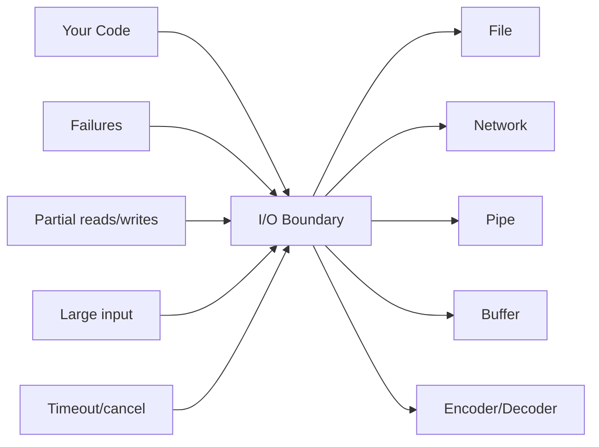
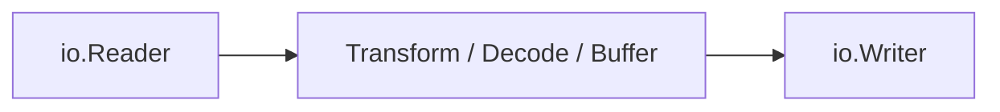
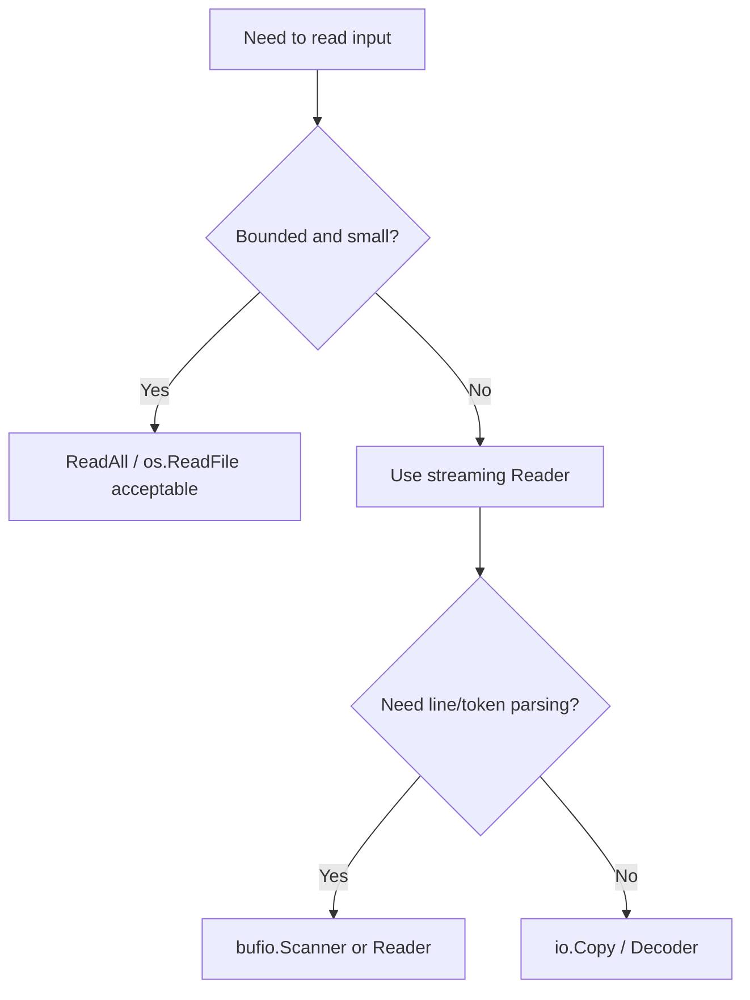
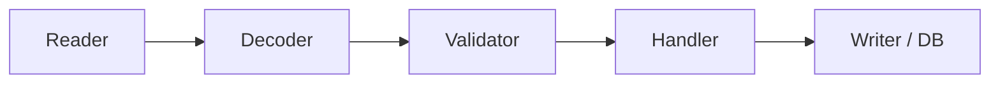
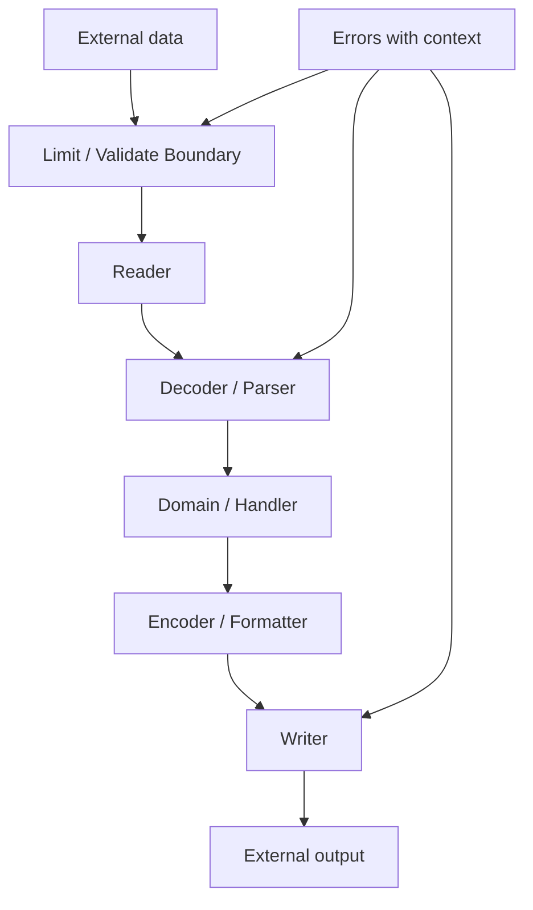

# Standard Library I/O: Files, Buffers, Readers, Writers, Encoding

Part ini membahas salah satu kekuatan terbesar Go: standard library yang kecil, konsisten, dan sangat berguna untuk membangun sistem nyata.

Fokusnya adalah I/O:

- membaca data
- menulis data
- streaming
- buffering
- file system
- embedded files
- JSON
- CSV
- resource closing
- error handling
- memory safety di boundary data besar

Di Go, I/O yang idiomatik banyak dibangun di atas dua interface kecil:

```go id="reader-writer-interface"
type Reader interface {
    Read(p []byte) (n int, err error)
}

type Writer interface {
    Write(p []byte) (n int, err error)
}
```

Dua interface ini terlihat sederhana, tetapi efek desainnya besar. Banyak package di standard library dapat disusun seperti Lego karena sepakat pada contract kecil ini.

---

## 1. Target Skill Part Ini

Setelah part ini, kita harus bisa:

1. Menjelaskan cara kerja `io.Reader` dan `io.Writer`.
2. Mendesain function yang menerima stream, bukan selalu file path atau byte slice.
3. Menggunakan `os`, `io`, `bufio`, `bytes`, dan `strings` secara tepat.
4. Membaca file kecil dan besar dengan strategi berbeda.
5. Menulis kode streaming agar memory tidak meledak.
6. Menggunakan `json.Decoder` dan `json.Encoder`.
7. Menggunakan `csv.Reader` dan `csv.Writer`.
8. Menutup resource dengan benar.
9. Menghindari bug partial read, ignored error, dan unbounded input.
10. Membuat utility I/O yang testable tanpa menyentuh filesystem nyata.

Dalam framework Kaufman, ini adalah **decomposition into reusable sub-skills**. Jika kita paham `Reader` dan `Writer`, banyak API Go langsung terasa lebih mudah.

---

## 2. Mental Model: I/O Adalah Boundary yang Mahal dan Gagal

I/O berbeda dari operasi memory biasa.

I/O bisa:

- lambat
- partial
- gagal di tengah
- memblokir
- menghasilkan data terlalu besar
- menerima input rusak
- tergantung filesystem, network, permission, atau encoding

Mental model:



Go mendorong kita menulis I/O sebagai stream. Ini penting untuk production karena data bisa sangat besar.

---

## 3. `io.Reader`: Contract Kecil, Dampak Besar

`io.Reader` punya method:

```go id="io-reader-method"
Read(p []byte) (n int, err error)
```

Maknanya:

- caller menyediakan buffer `p`
- reader mengisi hingga `len(p)` byte
- `n` adalah jumlah byte yang berhasil dibaca
- `err` menunjukkan kondisi error atau EOF
- `n` bisa lebih dari 0 meskipun `err` tidak nil

Poin terakhir sangat penting.

Kode yang salah:

```go id="reader-ignore-n-bad"
func ReadOnce(r io.Reader) ([]byte, error) {
    buf := make([]byte, 1024)
    _, err := r.Read(buf)
    if err != nil {
        return nil, err
    }
    return buf, nil
}
```

Masalah:

- mengabaikan `n`
- menganggap sekali `Read` cukup
- mengembalikan seluruh buffer, termasuk byte kosong
- salah menangani EOF

Versi lebih benar untuk read-all:

```go id="reader-readall"
func ReadAll(r io.Reader) ([]byte, error) {
    return io.ReadAll(r)
}
```

Namun `io.ReadAll` hanya cocok jika ukuran input masuk akal dan dibatasi.

Untuk streaming, gunakan loop:

```go id="reader-stream-loop"
func CountBytes(r io.Reader) (int64, error) {
    buf := make([]byte, 32*1024)
    var total int64

    for {
        n, err := r.Read(buf)
        if n > 0 {
            total += int64(n)
        }
        if err == io.EOF {
            return total, nil
        }
        if err != nil {
            return total, err
        }
    }
}
```

Rule penting:

> Selalu proses `n` sebelum menangani `err`, karena `n > 0` dan `err != nil` bisa terjadi bersamaan.

---

## 4. `io.Writer`: Partial Write dan Error Harus Diperhatikan

`io.Writer` punya method:

```go id="io-writer-method"
Write(p []byte) (n int, err error)
```

Contract-nya:

- writer mencoba menulis bytes dari `p`
- `n` adalah jumlah byte yang berhasil ditulis
- jika `n < len(p)`, harus ada error non-nil

Sering kita menggunakan helper:

```go id="writer-write-string"
func WriteGreeting(w io.Writer, name string) error {
    _, err := io.WriteString(w, "hello, "+name+"\n")
    return err
}
```

Keuntungan menerima `io.Writer`:

- bisa menulis ke file
- bisa menulis ke HTTP response
- bisa menulis ke buffer saat test
- bisa menulis ke stdout
- tidak terikat implementation tertentu

Test sederhana:

```go id="writer-test-buffer"
func TestWriteGreeting(t *testing.T) {
    var buf bytes.Buffer

    err := WriteGreeting(&buf, "gopher")
    if err != nil {
        t.Fatal(err)
    }

    got := buf.String()
    want := "hello, gopher\n"
    if got != want {
        t.Fatalf("got %q, want %q", got, want)
    }
}
```

Ini contoh desain Go yang idiomatik: depend on small interface.

---

## 5. Composition: Reader dan Writer Bisa Dirangkai

Banyak helper standard library bekerja dengan `Reader` dan `Writer`.

Contoh copy stream:

```go id="io-copy-example"
func CopyFile(dst io.Writer, src io.Reader) error {
    _, err := io.Copy(dst, src)
    return err
}
```

`io.Copy` bisa digunakan untuk:

- file ke file
- request body ke file
- file ke HTTP response
- buffer ke gzip writer
- network connection ke file

Mental model:



Contoh transform sederhana:

```go id="uppercase-copy"
func CopyUpper(dst io.Writer, src io.Reader) error {
    scanner := bufio.NewScanner(src)
    for scanner.Scan() {
        line := strings.ToUpper(scanner.Text())
        if _, err := io.WriteString(dst, line+"\n"); err != nil {
            return err
        }
    }
    return scanner.Err()
}
```

Catatan: `bufio.Scanner` punya batas token default. Untuk file besar dengan line panjang, perlu konfigurasi buffer atau gunakan `bufio.Reader`.

---

## 6. File I/O dengan `os`

Membaca file kecil:

```go id="os-read-file-small"
func LoadConfig(path string) ([]byte, error) {
    return os.ReadFile(path)
}
```

Ini baik untuk:

- config kecil
- template kecil
- file test fixture
- metadata kecil

Tidak baik untuk:

- file log ratusan MB
- upload user tidak dibatasi
- streaming dataset besar

Membuka file untuk streaming:

```go id="os-open-streaming"
func CountFileBytes(path string) (int64, error) {
    f, err := os.Open(path)
    if err != nil {
        return 0, err
    }
    defer f.Close()

    return CountBytes(f)
}
```

Menulis file:

```go id="os-write-file-small"
func SaveConfig(path string, data []byte) error {
    return os.WriteFile(path, data, 0o600)
}
```

Untuk output besar:

```go id="os-create-streaming"
func WriteReport(path string, rows []Row) error {
    f, err := os.Create(path)
    if err != nil {
        return err
    }
    defer f.Close()

    w := bufio.NewWriter(f)
    for _, row := range rows {
        if _, err := fmt.Fprintf(w, "%s,%d\n", row.Name, row.Count); err != nil {
            return err
        }
    }

    if err := w.Flush(); err != nil {
        return err
    }

    return f.Close()
}
```

Catatan: contoh di atas memanggil `f.Close()` eksplisit setelah `Flush`. `defer f.Close()` tetap ada untuk cleanup jika terjadi error sebelumnya. Dalam kode production, error dari close bisa relevan untuk file write karena data bisa gagal flush ke storage.

---

## 7. Resource Closing: Jangan Diabaikan

Pattern umum:

```go id="file-close-pattern"
f, err := os.Open(path)
if err != nil {
    return err
}
defer f.Close()
```

Untuk read-only file, error dari `Close` sering tidak penting. Untuk write, error `Close` bisa penting.

Pattern write yang lebih hati-hati:

```go id="write-close-error-pattern"
func WriteData(path string, data []byte) (err error) {
    f, err := os.Create(path)
    if err != nil {
        return err
    }

    defer func() {
        closeErr := f.Close()
        if err == nil && closeErr != nil {
            err = closeErr
        }
    }()

    _, err = f.Write(data)
    return err
}
```

Kenapa named return dipakai di sini?

- agar deferred function bisa mengubah return error
- hanya dipakai untuk kasus spesifik
- jangan jadikan pattern default untuk semua function

---

## 8. Atomic File Write

Menulis file config langsung ke path final bisa berisiko. Jika process crash di tengah write, file final bisa corrupt.

Pattern lebih aman:

1. tulis ke temporary file di directory yang sama
2. flush dan close
3. rename temporary file ke final path

Contoh:

```go id="atomic-write-file"
func AtomicWriteFile(path string, data []byte, perm fs.FileMode) error {
    dir := filepath.Dir(path)
    base := filepath.Base(path)

    tmp, err := os.CreateTemp(dir, "."+base+"-*.tmp")
    if err != nil {
        return err
    }

    tmpPath := tmp.Name()
    cleanup := true
    defer func() {
        if cleanup {
            _ = os.Remove(tmpPath)
        }
    }()

    if _, err := tmp.Write(data); err != nil {
        _ = tmp.Close()
        return err
    }

    if err := tmp.Chmod(perm); err != nil {
        _ = tmp.Close()
        return err
    }

    if err := tmp.Close(); err != nil {
        return err
    }

    if err := os.Rename(tmpPath, path); err != nil {
        return err
    }

    cleanup = false
    return nil
}
```

Catatan operational:

- atomic rename semantics bergantung filesystem.
- rename dalam directory yang sama biasanya lebih aman daripada lintas filesystem.
- untuk durability yang sangat ketat, fsync directory juga perlu dipertimbangkan.

---

## 9. `bufio.Reader` dan `bufio.Writer`

Buffering mengurangi jumlah syscall atau operasi I/O kecil.

Tanpa buffer:

```go id="write-many-small-bad"
for _, line := range lines {
    if _, err := f.Write([]byte(line + "\n")); err != nil {
        return err
    }
}
```

Dengan buffer:

```go id="write-many-small-buffered"
w := bufio.NewWriter(f)

for _, line := range lines {
    if _, err := w.WriteString(line + "\n"); err != nil {
        return err
    }
}

if err := w.Flush(); err != nil {
    return err
}
```

Rule:

- `bufio.Writer` wajib `Flush`.
- `bufio.Reader` berguna untuk read kecil berulang.
- Buffering bukan solusi semua masalah; tetap ukur jika hot path.

---

## 10. `bufio.Scanner`: Mudah untuk Line-based Input

Contoh membaca file baris demi baris:

```go id="scanner-line-example"
func CountLines(r io.Reader) (int, error) {
    scanner := bufio.NewScanner(r)

    count := 0
    for scanner.Scan() {
        count++
    }

    if err := scanner.Err(); err != nil {
        return 0, err
    }

    return count, nil
}
```

Bagus untuk:

- line kecil
- log sederhana
- input text sederhana

Hati-hati:

- default token size terbatas
- tidak cocok untuk line sangat panjang kecuali buffer dinaikkan

Menaikkan buffer:

```go id="scanner-buffer-size"
scanner := bufio.NewScanner(r)
scanner.Buffer(make([]byte, 0, 64*1024), 10*1024*1024)
```

Untuk format kompleks atau line sangat besar, `bufio.Reader` sering lebih tepat.

---

## 11. `io.LimitReader`: Lindungi Memory dari Input Tak Terbatas

Boundary I/O harus punya limit.

Anti-pattern:

```go id="unbounded-readall-bad"
func ReadBody(r io.Reader) ([]byte, error) {
    return io.ReadAll(r)
}
```

Jika reader berasal dari user input, ini bisa membuat memory habis.

Versi lebih aman:

```go id="limit-reader-example"
func ReadLimited(r io.Reader, maxBytes int64) ([]byte, error) {
    lr := io.LimitReader(r, maxBytes+1)

    data, err := io.ReadAll(lr)
    if err != nil {
        return nil, err
    }

    if int64(len(data)) > maxBytes {
        return nil, fmt.Errorf("input too large: max %d bytes", maxBytes)
    }

    return data, nil
}
```

Di HTTP handler, gunakan limit di boundary request body.

---

## 12. `io.TeeReader`, `io.MultiReader`, dan `io.MultiWriter`

Go punya adapter kecil untuk merangkai stream.

### `io.TeeReader`

Membaca dari source sambil menulis copy ke writer:

```go id="tee-reader-example"
func HashAndDecode(r io.Reader, v any) ([]byte, error) {
    h := sha256.New()
    tr := io.TeeReader(r, h)

    dec := json.NewDecoder(tr)
    if err := dec.Decode(v); err != nil {
        return nil, err
    }

    return h.Sum(nil), nil
}
```

### `io.MultiWriter`

Menulis ke banyak writer sekaligus:

```go id="multi-writer-example"
func WriteAudit(dst io.Writer, audit io.Writer, data []byte) error {
    w := io.MultiWriter(dst, audit)
    _, err := w.Write(data)
    return err
}
```

### `io.MultiReader`

Menggabungkan beberapa reader:

```go id="multi-reader-example"
func PrefixBody(prefix string, body io.Reader) io.Reader {
    return io.MultiReader(strings.NewReader(prefix), body)
}
```

Adapter kecil seperti ini membuat kode Go composable tanpa framework berat.

---

## 13. `bytes.Buffer`, `bytes.Reader`, dan `strings.Reader`

Untuk testing dan in-memory processing:

| Type | Kegunaan |
|---|---|
| `bytes.Buffer` | mutable buffer, implement Reader dan Writer |
| `bytes.Reader` | read-only reader dari `[]byte` |
| `strings.Reader` | read-only reader dari string |

Contoh test function berbasis `io.Reader`:

```go id="reader-test-strings-reader"
func TestCountLines(t *testing.T) {
    input := strings.NewReader("a\nb\nc\n")

    got, err := CountLines(input)
    if err != nil {
        t.Fatal(err)
    }

    if got != 3 {
        t.Fatalf("got %d, want 3", got)
    }
}
```

Keuntungan:

- test cepat
- tidak perlu file temporary
- function lebih reusable

---

## 14. `fs.FS`: Abstraksi File System

Package `io/fs` menyediakan interface filesystem abstrak. Ini memungkinkan function membaca dari filesystem nyata, embedded filesystem, atau test filesystem.

Contoh:

```go id="fs-read-config"
func LoadConfigFromFS(fsys fs.FS, name string) ([]byte, error) {
    return fs.ReadFile(fsys, name)
}
```

Test dengan `fstest.MapFS`:

```go id="fstest-mapfs-example"
func TestLoadConfigFromFS(t *testing.T) {
    fsys := fstest.MapFS{
        "config.json": {
            Data: []byte(`{"port":8080}`),
        },
    }

    data, err := LoadConfigFromFS(fsys, "config.json")
    if err != nil {
        t.Fatal(err)
    }

    if !bytes.Contains(data, []byte("8080")) {
        t.Fatalf("unexpected config: %s", data)
    }
}
```

Desain ini lebih baik daripada function yang selalu menerima path string jika sumber file bisa bervariasi.

---

## 15. `embed`: Membundel File ke Binary

Package `embed` memungkinkan file static dimasukkan ke binary saat compile.

Contoh:

```go id="embed-example"
package assets

import "embed"

//go:embed templates/*.html
var Templates embed.FS
```

Penggunaan:

```go id="embed-read-template"
func LoadTemplate(name string) ([]byte, error) {
    return fs.ReadFile(Templates, "templates/"+name)
}
```

Cocok untuk:

- template HTML
- migration SQL kecil
- static assets kecil
- default config

Tidak cocok untuk:

- secret
- file besar yang berubah sering
- runtime-generated data

Rule:

> Embedded file menjadi bagian dari binary. Jangan embed data yang harus bisa dirotasi secara operational tanpa rebuild.

---

## 16. JSON: `Marshal` vs `Encoder`

Untuk object kecil:

```go id="json-marshal-small"
func EncodeUser(u User) ([]byte, error) {
    return json.Marshal(u)
}
```

Untuk menulis ke stream:

```go id="json-encoder-stream"
func WriteUserJSON(w io.Writer, u User) error {
    enc := json.NewEncoder(w)
    return enc.Encode(u)
}
```

Untuk membaca dari stream:

```go id="json-decoder-stream"
func ReadUserJSON(r io.Reader) (User, error) {
    var u User
    dec := json.NewDecoder(r)
    if err := dec.Decode(&u); err != nil {
        return User{}, err
    }
    return u, nil
}
```

Perbedaan praktis:

| API | Cocok Untuk |
|---|---|
| `json.Marshal` | object kecil, butuh `[]byte` |
| `json.Unmarshal` | input kecil yang sudah ada di memory |
| `json.Encoder` | output stream, HTTP response, file |
| `json.Decoder` | input stream, request body, file |

---

## 17. JSON Strictness: Unknown Field dan Multiple Object

Default `json.Decoder` toleran terhadap unknown field. Untuk API contract yang ketat, kita bisa memakai `DisallowUnknownFields`.

```go id="json-disallow-unknown-fields"
func DecodeStrictUser(r io.Reader) (User, error) {
    var u User

    dec := json.NewDecoder(r)
    dec.DisallowUnknownFields()

    if err := dec.Decode(&u); err != nil {
        return User{}, err
    }

    if dec.More() {
        return User{}, errors.New("unexpected trailing JSON data")
    }

    return u, nil
}
```

Namun `dec.More()` bukan cara paling akurat untuk semua top-level trailing data scenario. Pattern yang lebih eksplisit adalah decode object kedua:

```go id="json-single-value-strict"
func DecodeSingleJSON(r io.Reader, v any) error {
    dec := json.NewDecoder(r)
    dec.DisallowUnknownFields()

    if err := dec.Decode(v); err != nil {
        return err
    }

    var extra any
    if err := dec.Decode(&extra); err != io.EOF {
        if err == nil {
            return errors.New("unexpected extra JSON value")
        }
        return err
    }

    return nil
}
```

Ini penting untuk API boundary yang harus menolak payload ambigu.

---

## 18. JSON Tags dan DTO Boundary

Contoh DTO:

```go id="json-dto-example"
type CreateUserRequest struct {
    Name  string `json:"name"`
    Email string `json:"email"`
}

type UserResponse struct {
    ID    string `json:"id"`
    Name  string `json:"name"`
    Email string `json:"email"`
}
```

Jangan langsung expose domain model jika domain punya invariant internal.

```go id="domain-vs-dto"
type User struct {
    id    UserID
    name  string
    email Email
}
```

Mapping eksplisit:

```go id="dto-mapping-example"
func ToUserResponse(u User) UserResponse {
    return UserResponse{
        ID:    u.ID().String(),
        Name:  u.Name(),
        Email: u.Email().String(),
    }
}
```

Kenapa ini penting di part I/O?

Karena JSON adalah boundary. Boundary harus menerjemahkan format eksternal ke model internal, bukan membocorkan semua detail internal.

---

## 19. CSV: Reader dan Writer

CSV sering terlihat sederhana, tetapi banyak bug berasal dari parsing manual dengan `strings.Split`.

Anti-pattern:

```go id="csv-split-bad"
fields := strings.Split(line, ",")
```

Ini gagal untuk:

- quoted fields
- comma dalam field
- escaped quotes
- newline dalam quoted field

Gunakan `encoding/csv`:

```go id="csv-reader-example"
func ReadUsersCSV(r io.Reader) ([]UserCSV, error) {
    cr := csv.NewReader(r)

    records, err := cr.ReadAll()
    if err != nil {
        return nil, err
    }

    users := make([]UserCSV, 0, len(records))
    for i, record := range records {
        if i == 0 {
            continue // header
        }
        if len(record) != 2 {
            return nil, fmt.Errorf("line %d: expected 2 fields, got %d", i+1, len(record))
        }

        users = append(users, UserCSV{
            Name:  record[0],
            Email: record[1],
        })
    }

    return users, nil
}
```

Untuk file besar, jangan `ReadAll`:

```go id="csv-streaming-reader"
func StreamUsersCSV(r io.Reader, handle func(UserCSV) error) error {
    cr := csv.NewReader(r)

    header, err := cr.Read()
    if err != nil {
        return fmt.Errorf("read header: %w", err)
    }
    if len(header) != 2 || header[0] != "name" || header[1] != "email" {
        return fmt.Errorf("invalid header: %v", header)
    }

    line := 1
    for {
        line++
        record, err := cr.Read()
        if err == io.EOF {
            return nil
        }
        if err != nil {
            return fmt.Errorf("line %d: %w", line, err)
        }
        if len(record) != 2 {
            return fmt.Errorf("line %d: expected 2 fields, got %d", line, len(record))
        }

        user := UserCSV{Name: record[0], Email: record[1]}
        if err := handle(user); err != nil {
            return fmt.Errorf("line %d: handle user: %w", line, err)
        }
    }
}
```

---

## 20. CSV Writer

```go id="csv-writer-example"
func WriteUsersCSV(w io.Writer, users []UserCSV) error {
    cw := csv.NewWriter(w)

    if err := cw.Write([]string{"name", "email"}); err != nil {
        return err
    }

    for _, user := range users {
        if err := cw.Write([]string{user.Name, user.Email}); err != nil {
            return err
        }
    }

    cw.Flush()
    if err := cw.Error(); err != nil {
        return err
    }

    return nil
}
```

Poin penting:

- `csv.Writer` perlu `Flush`.
- Error final dicek dengan `cw.Error()`.
- Jangan membuat CSV manual dengan string concatenation.

---

## 21. Streaming vs Load-all

Ini salah satu keputusan desain I/O paling penting.

| Strategi | Cocok Untuk | Risiko |
|---|---|---|
| Load-all | config kecil, fixture, payload kecil | memory blow-up jika input besar |
| Streaming | file besar, upload, export, ETL | kode sedikit lebih kompleks |

Decision rule:



Praktis:

- file config 2 KB: `os.ReadFile`
- request body max 1 MB: `LimitReader` + `ReadAll`
- upload 2 GB: streaming
- CSV jutaan row: streaming reader
- export besar: streaming writer

---

## 22. Temporary Files dan Directories

Untuk test atau intermediate processing:

```go id="temp-file-example"
func WriteTemp(data []byte) (string, error) {
    f, err := os.CreateTemp("", "data-*.txt")
    if err != nil {
        return "", err
    }
    defer f.Close()

    if _, err := f.Write(data); err != nil {
        return "", err
    }

    return f.Name(), nil
}
```

Untuk test, gunakan `t.TempDir()`:

```go id="test-temp-dir-example"
func TestSaveConfig(t *testing.T) {
    dir := t.TempDir()
    path := filepath.Join(dir, "config.json")

    err := SaveConfig(path, []byte(`{"port":8080}`))
    if err != nil {
        t.Fatal(err)
    }

    data, err := os.ReadFile(path)
    if err != nil {
        t.Fatal(err)
    }

    if string(data) != `{"port":8080}` {
        t.Fatalf("unexpected data: %s", data)
    }
}
```

`t.TempDir()` otomatis cleanup setelah test.

---

## 23. Path Handling: Jangan Gabung Path Manual

Anti-pattern:

```go id="path-concat-bad"
path := dir + "/" + name
```

Gunakan:

```go id="filepath-join-example"
path := filepath.Join(dir, name)
```

Untuk slash-separated path di embedded FS atau URL-like path, gunakan package `path`. Untuk OS filesystem path, gunakan `path/filepath`.

| Package | Kegunaan |
|---|---|
| `path` | slash-separated path, bukan OS-specific |
| `path/filepath` | filesystem path sesuai OS |

Security note:

Jika user mengirim path, validasi path traversal:

```go id="safe-join-example"
func SafeJoin(baseDir, name string) (string, error) {
    clean := filepath.Clean(name)
    if clean == "." || filepath.IsAbs(clean) || strings.HasPrefix(clean, ".."+string(os.PathSeparator)) || clean == ".." {
        return "", fmt.Errorf("invalid path: %q", name)
    }

    return filepath.Join(baseDir, clean), nil
}
```

Untuk security-critical file serving, gunakan API standard library yang memang dirancang untuk itu dan tetap batasi root directory.

---

## 24. Error Handling pada I/O

I/O error harus diberi context.

Kurang baik:

```go id="io-error-context-bad"
return err
```

Lebih baik:

```go id="io-error-context-good"
return fmt.Errorf("read config %s: %w", path, err)
```

Namun jangan logging dan wrapping berlebihan di setiap level.

Layering sehat:

```txt id="io-error-layering"
low-level:  read config /etc/app/config.json: permission denied
mid-level:  load service config: read config /etc/app/config.json: permission denied
boundary:   failed to start service: load service config: read config /etc/app/config.json: permission denied
```

Untuk error classification:

```go id="errors-is-fs-error"
func IsNotFound(err error) bool {
    return errors.Is(err, fs.ErrNotExist)
}
```

Contoh:

```go id="load-optional-config"
func LoadOptionalConfig(path string) ([]byte, error) {
    data, err := os.ReadFile(path)
    if err != nil {
        if errors.Is(err, fs.ErrNotExist) {
            return nil, nil
        }
        return nil, fmt.Errorf("read optional config %s: %w", path, err)
    }
    return data, nil
}
```

---

## 25. I/O dengan Context

`io.Reader` dan `io.Writer` standar tidak menerima `context.Context`. Namun banyak boundary I/O lain punya context:

- HTTP request
- database query
- command execution
- cloud SDK

Jika perlu context-aware reader, desain boundary dengan hati-hati. Contoh untuk loop yang bisa berhenti:

```go id="context-aware-copy-loop"
func CopyWithContext(ctx context.Context, dst io.Writer, src io.Reader) error {
    buf := make([]byte, 32*1024)

    for {
        select {
        case <-ctx.Done():
            return ctx.Err()
        default:
        }

        n, err := src.Read(buf)
        if n > 0 {
            if _, writeErr := dst.Write(buf[:n]); writeErr != nil {
                return writeErr
            }
        }

        if err == io.EOF {
            return nil
        }
        if err != nil {
            return err
        }
    }
}
```

Catatan penting: jika `src.Read` sendiri blocking lama dan tidak context-aware, select di atas tidak bisa membatalkan read yang sedang stuck. Untuk network/HTTP, gunakan API yang memang context-aware.

---

## 26. HTTP Body sebagai I/O Boundary

HTTP request body adalah `io.ReadCloser`.

Handler dasar:

```go id="http-body-json-handler"
func CreateUserHandler(w http.ResponseWriter, r *http.Request) {
    defer r.Body.Close()

    body := http.MaxBytesReader(w, r.Body, 1<<20) // 1 MiB

    var req CreateUserRequest
    if err := DecodeSingleJSON(body, &req); err != nil {
        http.Error(w, "invalid request body", http.StatusBadRequest)
        return
    }

    // validate and process
    w.WriteHeader(http.StatusCreated)
}
```

Poin:

- batasi body
- decode streaming
- close body
- jangan expose internal error mentah ke client
- validasi setelah decode

Untuk response JSON:

```go id="http-json-response"
func WriteJSON(w http.ResponseWriter, status int, v any) {
    w.Header().Set("Content-Type", "application/json")
    w.WriteHeader(status)

    if err := json.NewEncoder(w).Encode(v); err != nil {
        // Di titik ini status mungkin sudah terkirim.
        // Logging internal lebih realistis daripada mencoba kirim error response baru.
        slog.Warn("write json response", "error", err)
    }
}
```

HTTP akan dibahas lebih dalam di Part 19.

---

## 27. Designing Testable I/O APIs

Bandingkan dua desain.

Kurang fleksibel:

```go id="bad-file-path-api"
func ImportUsers(path string) error {
    data, err := os.ReadFile(path)
    if err != nil {
        return err
    }
    // parse data
    _ = data
    return nil
}
```

Lebih testable:

```go id="good-reader-api"
func ImportUsers(r io.Reader, handle func(UserCSV) error) error {
    return StreamUsersCSV(r, func(row UserCSV) error {
        user, err := row.ToDomain()
        if err != nil {
            return err
        }
        return handle(user)
    })
}
```

Wrapper untuk file path tetap bisa ada:

```go id="file-wrapper-api"
func ImportUsersFile(path string, handle func(UserCSV) error) error {
    f, err := os.Open(path)
    if err != nil {
        return fmt.Errorf("open users file %s: %w", path, err)
    }
    defer f.Close()

    return ImportUsers(f, handle)
}
```

Desain ini memberi dua manfaat:

- core logic mudah dites dengan `strings.Reader`
- boundary filesystem terisolasi

---

## 28. Backpressure dalam Streaming

Streaming bukan hanya hemat memory. Streaming juga bisa menjaga backpressure.

Contoh pipeline:



Jika handler lambat, decoder ikut lambat, reader ikut lambat. Ini lebih sehat daripada membaca semua data ke memory dulu.

Namun backpressure bisa rusak jika kita membuat goroutine tanpa batas:

```go id="streaming-backpressure-bad"
_ = StreamUsersCSV(r, func(user UserCSV) error {
    go save(user)
    return nil
})
```

Ini mengubah streaming menjadi unbounded async fan-out.

Versi bounded:

```go id="streaming-backpressure-bounded"
func ImportUsersBounded(ctx context.Context, r io.Reader, workers int, save func(context.Context, UserCSV) error) error {
    jobs := make(chan UserCSV)
    errs := make(chan error, 1)

    var wg sync.WaitGroup
    for i := 0; i < workers; i++ {
        wg.Add(1)
        go func() {
            defer wg.Done()
            for user := range jobs {
                if err := save(ctx, user); err != nil {
                    select {
                    case errs <- err:
                    default:
                    }
                    return
                }
            }
        }()
    }

    streamErr := StreamUsersCSV(r, func(user UserCSV) error {
        select {
        case <-ctx.Done():
            return ctx.Err()
        case err := <-errs:
            return err
        case jobs <- user:
            return nil
        }
    })

    close(jobs)
    wg.Wait()

    if streamErr != nil {
        return streamErr
    }

    select {
    case err := <-errs:
        return err
    default:
        return nil
    }
}
```

---

## 29. Common Pitfalls

### Mengabaikan `n` dari `Read`

Salah karena `Read` bisa partial.

### Menggunakan `io.ReadAll` pada input user tanpa limit

Berbahaya untuk memory.

### Lupa `Flush` pada buffered writer atau CSV writer

Data bisa tidak tertulis.

### Lupa `Close` file atau body

Resource leak.

### Manual parse CSV

Gagal pada quoted field.

### Membaca semua data besar ke memory

Membuat allocation pressure dan risiko OOM.

### Mencampur domain model dengan DTO JSON

Membocorkan invariant internal dan menyulitkan evolusi API.

### Mengabaikan error dari writer

Output bisa corrupt tanpa terdeteksi.

---

## 30. Latihan 20 Jam: I/O Mastery

### Latihan 1 — Reader/Writer Core

Buat function:

```go id="exercise-normalize-lines-signature"
func NormalizeLines(dst io.Writer, src io.Reader) error
```

Requirement:

- baca input line by line
- trim whitespace
- skip empty line
- tulis line normalized ke dst
- test dengan `strings.Reader` dan `bytes.Buffer`

### Latihan 2 — Limited JSON Decoder

Buat HTTP-style function:

```go id="exercise-decode-limited-json-signature"
func DecodeLimitedJSON(r io.Reader, maxBytes int64, v any) error
```

Requirement:

- batasi input
- reject unknown fields
- reject extra JSON value
- wrap error dengan context

### Latihan 3 — Streaming CSV Importer

Buat importer:

```go id="exercise-csv-importer-signature"
func ImportUsersCSV(r io.Reader, handle func(UserCSV) error) error
```

Requirement:

- validasi header
- proses row satu per satu
- error menyertakan nomor baris
- tidak memakai `ReadAll`

### Latihan 4 — Atomic Write

Implementasikan:

```go id="exercise-atomic-write-signature"
func AtomicWriteFile(path string, data []byte, perm fs.FileMode) error
```

Tambahkan test dengan `t.TempDir()`.

### Latihan 5 — Embedded Migration Loader

Buat folder:

```txt id="exercise-embed-structure"
migrations/
  001_create_users.sql
  002_create_orders.sql
```

Embed file tersebut dan buat:

```go id="exercise-embed-loader-signature"
func LoadMigrations(fsys fs.FS) ([]Migration, error)
```

Requirement:

- urutkan berdasarkan nama file
- baca isi file
- validasi extension `.sql`

---

## 31. Mini Project: Streaming Audit Log Processor

Bangun CLI kecil:

```bash id="audit-log-cli-example"
go run ./cmd/auditlog -input audit.csv -output summary.json
```

Input CSV:

```csv id="audit-log-input-example"
timestamp,user_id,action,resource
2026-06-27T10:00:00Z,u1,CREATE,case-1
2026-06-27T10:02:00Z,u2,APPROVE,case-1
```

Output JSON:

```json id="audit-log-output-example"
{
  "total": 2,
  "actions": {
    "CREATE": 1,
    "APPROVE": 1
  }
}
```

Requirement engineering:

- input diproses streaming
- output ditulis dengan `json.Encoder`
- file write atomic
- error menyertakan context
- test core logic dengan `strings.Reader`
- test file wrapper dengan `t.TempDir()`
- ukuran input bisa besar

Struktur:

```txt id="audit-log-project-structure"
auditlog/
  go.mod
  cmd/auditlog/main.go
  internal/audit/model.go
  internal/audit/parser.go
  internal/audit/summary.go
  internal/audit/writer.go
```

---

## 32. Production Checklist untuk I/O Code

### Input

- Apakah input user dibatasi ukurannya?
- Apakah format divalidasi?
- Apakah unknown field harus ditolak?
- Apakah error parsing punya context?
- Apakah path user divalidasi?

### Memory

- Apakah data besar diproses streaming?
- Apakah `ReadAll` hanya dipakai untuk data bounded?
- Apakah slice kecil menahan buffer besar?
- Apakah output besar tidak dirakit penuh di memory?

### Resource

- Apakah file/body ditutup?
- Apakah writer di-flush?
- Apakah error close penting ditangani?
- Apakah temporary file dibersihkan?

### Testability

- Apakah core logic menerima `io.Reader`/`io.Writer`?
- Apakah filesystem dependency bisa diganti `fs.FS`?
- Apakah test memakai `strings.Reader`, `bytes.Buffer`, atau `fstest.MapFS`?

### Security

- Apakah path traversal dicegah?
- Apakah secret tidak di-embed?
- Apakah payload terlalu besar ditolak?
- Apakah error internal tidak diekspos mentah ke client?

---

## 33. Ringkasan Mental Model

Go I/O dibangun di atas interface kecil. Semakin kita mendesain function di sekitar `Reader`, `Writer`, dan `FS`, semakin reusable dan testable kode kita.

Mental model akhir:



Gunakan prinsip:

- small interface
- streaming by default for large data
- load-all only when bounded
- close and flush explicitly
- wrap errors at meaningful boundary
- make core logic independent from filesystem

---

## 34. Checklist Penguasaan Part Ini

Kita dianggap memahami part ini jika bisa:

- menjelaskan contract `io.Reader` dan `io.Writer`
- menulis loop `Read` yang benar
- memakai `io.Copy`, `io.LimitReader`, `io.MultiWriter`, dan `io.TeeReader`
- membedakan `os.ReadFile` dan streaming file
- memakai `bufio.Scanner` dengan memahami limit-nya
- memakai `json.Decoder` untuk stream
- menolak unknown JSON field saat diperlukan
- membaca CSV besar tanpa `ReadAll`
- menulis CSV dengan `Flush` dan `Error`
- menggunakan `fs.FS` dan `embed`
- menulis I/O API yang testable
- mencegah unbounded memory usage pada input eksternal

---

## 35. Penghubung ke Part Berikutnya

Part berikutnya membahas HTTP client dan server secara production-grade.

Kita akan memakai semua konsep di part ini:

- HTTP request body adalah stream
- HTTP response adalah writer
- JSON decoding harus dibatasi
- response writing bisa gagal
- client harus reuse transport
- timeout adalah bagian dari I/O correctness

Pertanyaan utama Part 19:

> “Bagaimana membangun HTTP client dan server Go yang benar, aman, observable, dan tidak diam-diam menyebabkan resource leak?”

