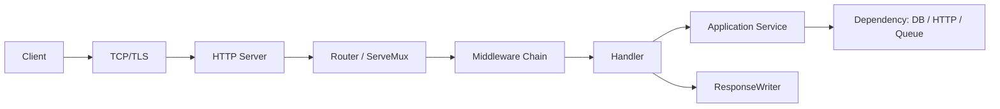
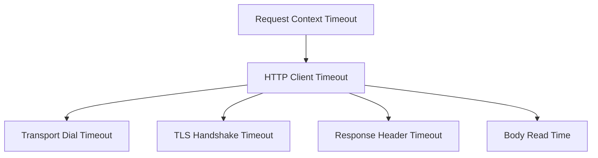

# HTTP Client dan Server yang Benar

HTTP di Go terlihat sederhana karena `net/http` memang sengaja dibuat kecil dan composable. Tetapi justru karena API-nya kecil, banyak keputusan penting tersembunyi di balik detail lifecycle: kapan body harus ditutup, kapan timeout harus dipasang, kapan client boleh di-reuse, bagaimana request dibatalkan, bagaimana response ditulis, dan bagaimana server dimatikan tanpa memutus request aktif.

Part ini membahas HTTP bukan sebagai “cara membuat endpoint”, tetapi sebagai **boundary produksi**. Dalam sistem nyata, HTTP boundary adalah tempat domain bertemu dunia luar: input tidak dipercaya, latency tidak stabil, dependency bisa lambat, client bisa disconnect, body bisa terlalu besar, dan setiap error perlu diterjemahkan menjadi contract yang dapat dipahami konsumen.

Target setelah part ini:

1. Mampu membuat HTTP server Go yang idiomatik, testable, dan aman secara lifecycle.
2. Mampu membuat HTTP client yang reusable, timeout-aware, context-aware, dan tidak menyebabkan connection leak.
3. Memahami aturan penting `http.ResponseWriter`, `http.Request`, `http.Client`, dan `http.Transport`.
4. Mampu mendesain middleware tanpa framework berat.
5. Mampu menerjemahkan error domain menjadi HTTP response yang stabil.
6. Mampu menguji handler dan client dengan `httptest`.
7. Mampu menulis checklist production-readiness untuk HTTP service Go.

---

## 1. Posisi Part Ini dalam Framework Kaufman

Dalam kerangka **The First 20 Hours**, HTTP masuk ke fase “practice something immediately useful”. Sebagai software engineer, HTTP adalah skill leverage tinggi: satu handler yang buruk bisa menyebabkan memory leak, goroutine leak, timeout cascade, retry storm, security issue, atau API contract yang sulit diperbaiki.

Kaufman menekankan dekomposisi skill. HTTP di Go kita pecah menjadi sub-skill berikut:

| Sub-skill | Pertanyaan yang Harus Bisa Dijawab |
|---|---|
| Handler model | Bagaimana request masuk dan response keluar? |
| Body lifecycle | Siapa yang membaca, membatasi, dan menutup body? |
| Error contract | Bagaimana domain failure diterjemahkan ke status code? |
| Timeout | Di mana timeout harus dipasang: client, server, context, transport? |
| Connection reuse | Kapan TCP connection bisa dipakai ulang? |
| Middleware | Bagaimana cross-cutting concern dipasang tanpa magic? |
| Testing | Bagaimana handler dan client dites tanpa server eksternal? |
| Shutdown | Bagaimana server berhenti dengan graceful, bukan brutal? |

Mental modelnya: **HTTP bukan transport stateless sederhana. HTTP adalah lifecycle object yang punya resource, deadline, cancellation, dan contract.**

---

## 2. Mental Model `net/http`

Secara minimal, server HTTP Go berputar di sekitar interface:

```go id="w6etdr"
type Handler interface {
    ServeHTTP(ResponseWriter, *Request)
}
```

`http.HandlerFunc` adalah adapter supaya function biasa bisa menjadi handler:

```go id="mpq96d"
func hello(w http.ResponseWriter, r *http.Request) {
    _, _ = w.Write([]byte("hello"))
}

http.HandleFunc("/hello", hello)
```

Namun untuk kode produksi, jangan berpikir “function menerima request”. Pikirkan ini:



Setiap layer punya tanggung jawab:

| Layer | Tanggung Jawab |
|---|---|
| Server | timeout, connection lifecycle, TLS, shutdown |
| Router | memilih handler berdasarkan method/path |
| Middleware | logging, panic recovery, auth, correlation ID, metrics |
| Handler | parse input, validate, call use case, map output/error |
| Application service | business rule, transaction, dependency orchestration |
| Client/dependency | outbound request, timeout, retry policy, decoding |

Anti-pattern besar: handler berisi semua hal sekaligus — parsing JSON, query database, business rule, logging, response formatting, retry, dan transaction. Itu membuat HTTP detail bocor ke domain.

---

## 3. Minimal Server yang Benar

Contoh paling kecil:

```go id="j7hmya"
package main

import (
    "fmt"
    "log"
    "net/http"
)

func main() {
    mux := http.NewServeMux()

    mux.HandleFunc("GET /healthz", func(w http.ResponseWriter, r *http.Request) {
        w.WriteHeader(http.StatusOK)
        _, _ = w.Write([]byte("ok"))
    })

    srv := &http.Server{
        Addr:    ":8080",
        Handler: mux,
    }

    fmt.Println("listening on :8080")
    if err := srv.ListenAndServe(); err != nil {
        log.Fatal(err)
    }
}
```

Namun ini belum production-grade. Kekurangannya:

1. Tidak ada read timeout.
2. Tidak ada write timeout.
3. Tidak ada idle timeout.
4. Tidak ada graceful shutdown.
5. `log.Fatal` pada shutdown normal akan dianggap error.
6. Tidak ada observability.
7. Tidak ada body size limit.

Versi yang lebih realistis:

```go id="iqv3tk"
package main

import (
    "context"
    "errors"
    "log/slog"
    "net/http"
    "os"
    "os/signal"
    "syscall"
    "time"
)

func main() {
    logger := slog.New(slog.NewJSONHandler(os.Stdout, nil))

    mux := http.NewServeMux()
    mux.HandleFunc("GET /healthz", healthHandler)

    srv := &http.Server{
        Addr:              ":8080",
        Handler:           loggingMiddleware(logger, mux),
        ReadHeaderTimeout: 5 * time.Second,
        ReadTimeout:       10 * time.Second,
        WriteTimeout:      30 * time.Second,
        IdleTimeout:       60 * time.Second,
    }

    errCh := make(chan error, 1)
    go func() {
        logger.Info("http server starting", "addr", srv.Addr)
        if err := srv.ListenAndServe(); err != nil && !errors.Is(err, http.ErrServerClosed) {
            errCh <- err
            return
        }
        errCh <- nil
    }()

    stopCh := make(chan os.Signal, 1)
    signal.Notify(stopCh, os.Interrupt, syscall.SIGTERM)

    select {
    case sig := <-stopCh:
        logger.Info("shutdown signal received", "signal", sig.String())
    case err := <-errCh:
        if err != nil {
            logger.Error("http server failed", "error", err)
            os.Exit(1)
        }
        return
    }

    ctx, cancel := context.WithTimeout(context.Background(), 20*time.Second)
    defer cancel()

    if err := srv.Shutdown(ctx); err != nil {
        logger.Error("graceful shutdown failed", "error", err)
        _ = srv.Close()
        os.Exit(1)
    }

    logger.Info("http server stopped")
}

func healthHandler(w http.ResponseWriter, r *http.Request) {
    w.WriteHeader(http.StatusOK)
    _, _ = w.Write([]byte("ok"))
}

func loggingMiddleware(logger *slog.Logger, next http.Handler) http.Handler {
    return http.HandlerFunc(func(w http.ResponseWriter, r *http.Request) {
        start := time.Now()
        next.ServeHTTP(w, r)
        logger.Info("http request",
            "method", r.Method,
            "path", r.URL.Path,
            "duration_ms", time.Since(start).Milliseconds(),
        )
    })
}
```

Catatan penting:

- `ReadHeaderTimeout` penting untuk mengurangi risiko slowloris-style attack.
- `ReadTimeout` membatasi waktu membaca seluruh request, termasuk body.
- `WriteTimeout` membatasi waktu menulis response.
- `IdleTimeout` mengatur keep-alive idle connection.
- `Shutdown(ctx)` melakukan graceful shutdown: listener berhenti menerima connection baru, tetapi request aktif diberi waktu selesai.

---

## 4. `ResponseWriter`: Aturan yang Sering Dilanggar

`http.ResponseWriter` terlihat seperti writer biasa, tapi ia punya aturan lifecycle.

Aturan penting:

1. Header harus diset sebelum body ditulis.
2. `WriteHeader` hanya efektif sekali.
3. Jika `Write` dipanggil tanpa `WriteHeader`, status default adalah `200 OK`.
4. Setelah body mulai ditulis, status dan header utama tidak bisa diubah secara normal.
5. Jangan menyimpan `ResponseWriter` untuk dipakai setelah handler selesai.

Contoh bug:

```go id="5jz3r6"
func bad(w http.ResponseWriter, r *http.Request) {
    _, _ = w.Write([]byte("something failed"))
    w.WriteHeader(http.StatusInternalServerError) // terlalu telat
}
```

Versi benar:

```go id="882k66"
func good(w http.ResponseWriter, r *http.Request) {
    w.Header().Set("Content-Type", "text/plain; charset=utf-8")
    w.WriteHeader(http.StatusInternalServerError)
    _, _ = w.Write([]byte("something failed"))
}
```

Untuk JSON:

```go id="s1qe30"
func writeJSON(w http.ResponseWriter, status int, v any) error {
    w.Header().Set("Content-Type", "application/json; charset=utf-8")
    w.WriteHeader(status)
    return json.NewEncoder(w).Encode(v)
}
```

Jangan mengabaikan konsekuensi encode error. Pada response kecil, error jarang terjadi. Tetapi secara desain, error masih mungkin terjadi jika connection putus saat menulis response. Biasanya kita log, bukan mencoba menulis response error kedua.

```go id="u2opao"
if err := writeJSON(w, http.StatusOK, response); err != nil {
    logger.Error("write response failed", "error", err)
}
```

---

## 5. `Request`: Body, Context, Header, dan URL

`*http.Request` adalah input boundary. Jangan percaya isinya.

Yang umum dipakai:

| Field/Method | Fungsi |
|---|---|
| `r.Context()` | lifecycle request, cancellation, deadline |
| `r.Method` | HTTP method |
| `r.URL.Path` | path |
| `r.URL.Query()` | query params |
| `r.Header` | header |
| `r.Body` | request body stream |
| `r.PathValue("id")` | path variable pada mux modern |

Contoh membaca query:

```go id="vrydfx"
func listUsers(w http.ResponseWriter, r *http.Request) {
    q := r.URL.Query()
    status := q.Get("status")
    _ = status
}
```

Contoh path variable dengan `ServeMux` modern:

```go id="wfkfet"
mux := http.NewServeMux()
mux.HandleFunc("GET /users/{id}", func(w http.ResponseWriter, r *http.Request) {
    id := r.PathValue("id")
    _, _ = w.Write([]byte("user id: " + id))
})
```

Jangan membaca body tanpa batas:

```go id="y4udzw"
body, err := io.ReadAll(r.Body) // berbahaya jika body besar
```

Lebih aman:

```go id="p14rc4"
const maxBodySize = 1 << 20 // 1 MiB

func decodeJSONBody(w http.ResponseWriter, r *http.Request, dst any) error {
    r.Body = http.MaxBytesReader(w, r.Body, maxBodySize)
    dec := json.NewDecoder(r.Body)
    dec.DisallowUnknownFields()

    if err := dec.Decode(dst); err != nil {
        return err
    }

    // Pastikan hanya satu JSON value, bukan stream diam-diam.
    if dec.Decode(&struct{}{}) != io.EOF {
        return errors.New("request body must contain a single JSON object")
    }

    return nil
}
```

Kenapa `DisallowUnknownFields` berguna?

Untuk API internal atau strict contract, unknown field sering menandakan typo client. Jika dibiarkan, client merasa field diterima padahal diabaikan.

Namun untuk public API yang membutuhkan forward compatibility, strict unknown field bisa menjadi breaking behavior. Ini trade-off contract.

---

## 6. Handler yang Tipis, Use Case yang Tebal

Handler idealnya melakukan lima hal:

1. Ambil input dari HTTP.
2. Validasi bentuk input.
3. Panggil application service.
4. Terjemahkan hasil/error ke HTTP response.
5. Jangan menyimpan state request di global variable.

Contoh struktur:

```go id="sb7hsg"
type UserService interface {
    CreateUser(ctx context.Context, cmd CreateUserCommand) (User, error)
}

type UserHandler struct {
    service UserService
    logger  *slog.Logger
}

func NewUserHandler(service UserService, logger *slog.Logger) *UserHandler {
    return &UserHandler{service: service, logger: logger}
}

func (h *UserHandler) RegisterRoutes(mux *http.ServeMux) {
    mux.HandleFunc("POST /users", h.createUser)
}
```

Request DTO:

```go id="n88yfo"
type createUserRequest struct {
    Email string `json:"email"`
    Name  string `json:"name"`
}
```

Domain command:

```go id="bpyy57"
type CreateUserCommand struct {
    Email string
    Name  string
}
```

Handler:

```go id="0f7vpn"
func (h *UserHandler) createUser(w http.ResponseWriter, r *http.Request) {
    var req createUserRequest
    if err := decodeJSONBody(w, r, &req); err != nil {
        writeError(w, http.StatusBadRequest, "invalid_request", "invalid JSON request body")
        return
    }

    cmd := CreateUserCommand{
        Email: strings.TrimSpace(req.Email),
        Name:  strings.TrimSpace(req.Name),
    }

    user, err := h.service.CreateUser(r.Context(), cmd)
    if err != nil {
        h.writeServiceError(w, err)
        return
    }

    resp := createUserResponse{
        ID:    user.ID,
        Email: user.Email,
        Name:  user.Name,
    }

    if err := writeJSON(w, http.StatusCreated, resp); err != nil {
        h.logger.Error("write create user response failed", "error", err)
    }
}
```

Response DTO:

```go id="xqcmhp"
type createUserResponse struct {
    ID    string `json:"id"`
    Email string `json:"email"`
    Name  string `json:"name"`
}
```

Perhatikan boundary:

- HTTP DTO boleh punya JSON tag.
- Domain command tidak perlu tahu JSON.
- Service menerima `context.Context` agar cancellation request bisa diteruskan.
- Handler tidak melakukan transaction secara langsung kecuali memang service boundary-nya di handler, yang biasanya bukan desain terbaik.

---

## 7. Error Contract: Jangan Bocorkan Internal Error

Kesalahan umum:

```go id="m6m6ad"
http.Error(w, err.Error(), http.StatusInternalServerError)
```

Masalahnya:

1. Internal detail bocor ke client.
2. Error format tidak stabil.
3. Client sulit melakukan automated handling.
4. Security risk jika error mengandung query, path, atau secret.

Buat error response stabil:

```go id="xwpc38"
type errorResponse struct {
    Error errorBody `json:"error"`
}

type errorBody struct {
    Code    string `json:"code"`
    Message string `json:"message"`
}

func writeError(w http.ResponseWriter, status int, code, message string) {
    _ = writeJSON(w, status, errorResponse{
        Error: errorBody{
            Code:    code,
            Message: message,
        },
    })
}
```

Contoh domain error:

```go id="j69dww"
var (
    ErrUserAlreadyExists = errors.New("user already exists")
    ErrInvalidEmail      = errors.New("invalid email")
)
```

Mapping:

```go id="9aoxmr"
func (h *UserHandler) writeServiceError(w http.ResponseWriter, err error) {
    switch {
    case errors.Is(err, ErrInvalidEmail):
        writeError(w, http.StatusBadRequest, "invalid_email", "email is invalid")
    case errors.Is(err, ErrUserAlreadyExists):
        writeError(w, http.StatusConflict, "user_already_exists", "user already exists")
    default:
        h.logger.Error("unhandled service error", "error", err)
        writeError(w, http.StatusInternalServerError, "internal_error", "internal server error")
    }
}
```

Mapping rule yang baik:

| Failure | Status | Catatan |
|---|---:|---|
| JSON invalid | 400 | Request syntax salah |
| Validation failed | 400 atau 422 | Pilih konsisten |
| Auth missing | 401 | Belum authenticated |
| Forbidden | 403 | Authenticated tapi tidak boleh |
| Not found | 404 | Resource tidak ada atau disembunyikan |
| Conflict | 409 | State conflict, duplicate, version conflict |
| Rate limited | 429 | Sertakan retry info jika ada |
| Dependency timeout | 503 atau 504 | Tergantung posisi service sebagai gateway |
| Internal bug | 500 | Jangan bocorkan detail |

---

## 8. Middleware Tanpa Magic

Middleware di Go cukup function yang menerima `http.Handler` dan mengembalikan `http.Handler`.

```go id="tv6uzj"
type Middleware func(http.Handler) http.Handler

func Chain(h http.Handler, middlewares ...Middleware) http.Handler {
    for i := len(middlewares) - 1; i >= 0; i-- {
        h = middlewares[i](h)
    }
    return h
}
```

Contoh logging middleware yang menangkap status code:

```go id="1rqdq7"
type statusRecorder struct {
    http.ResponseWriter
    status int
    bytes  int
}

func (r *statusRecorder) WriteHeader(status int) {
    r.status = status
    r.ResponseWriter.WriteHeader(status)
}

func (r *statusRecorder) Write(p []byte) (int, error) {
    if r.status == 0 {
        r.status = http.StatusOK
    }
    n, err := r.ResponseWriter.Write(p)
    r.bytes += n
    return n, err
}

func RequestLogging(logger *slog.Logger) Middleware {
    return func(next http.Handler) http.Handler {
        return http.HandlerFunc(func(w http.ResponseWriter, r *http.Request) {
            start := time.Now()
            rec := &statusRecorder{ResponseWriter: w}

            next.ServeHTTP(rec, r)

            status := rec.status
            if status == 0 {
                status = http.StatusOK
            }

            logger.Info("http request",
                "method", r.Method,
                "path", r.URL.Path,
                "status", status,
                "bytes", rec.bytes,
                "duration_ms", time.Since(start).Milliseconds(),
            )
        })
    }
}
```

Panic recovery middleware:

```go id="14huwq"
func RecoverPanic(logger *slog.Logger) Middleware {
    return func(next http.Handler) http.Handler {
        return http.HandlerFunc(func(w http.ResponseWriter, r *http.Request) {
            defer func() {
                if v := recover(); v != nil {
                    logger.Error("panic recovered", "panic", v, "path", r.URL.Path)
                    writeError(w, http.StatusInternalServerError, "internal_error", "internal server error")
                }
            }()

            next.ServeHTTP(w, r)
        })
    }
}
```

Namun ada caveat: jika panic terjadi setelah response body sebagian ditulis, middleware tidak selalu bisa mengubah response menjadi 500 secara bersih. Ini alasan lain untuk menulis handler dengan error return internal atau melakukan validasi sebelum streaming response.

Correlation ID middleware:

```go id="1v56an"
type contextKey string

const requestIDKey contextKey = "request_id"

func RequestID(next http.Handler) http.Handler {
    return http.HandlerFunc(func(w http.ResponseWriter, r *http.Request) {
        id := r.Header.Get("X-Request-ID")
        if id == "" {
            id = generateRequestID()
        }

        w.Header().Set("X-Request-ID", id)
        ctx := context.WithValue(r.Context(), requestIDKey, id)
        next.ServeHTTP(w, r.WithContext(ctx))
    })
}

func RequestIDFromContext(ctx context.Context) string {
    v, _ := ctx.Value(requestIDKey).(string)
    return v
}
```

Jangan gunakan context value untuk dependency besar seperti logger, DB, config, atau service. Context value cocok untuk metadata request-scoped seperti request ID, user ID, trace ID.

---

## 9. HTTP Client: Default yang Aman Tidak Selalu Default

Kesalahan umum di Go:

```go id="28flrq"
resp, err := http.Get("https://example.com")
```

Ini praktis untuk script kecil, tetapi buruk untuk service produksi karena default client tanpa timeout eksplisit bisa menyebabkan request menggantung lebih lama dari yang diinginkan.

Buat client reusable:

```go id="mk5l70"
type ExternalUserClient struct {
    baseURL string
    client  *http.Client
}

func NewExternalUserClient(baseURL string) *ExternalUserClient {
    transport := http.DefaultTransport.(*http.Transport).Clone()
    transport.MaxIdleConns = 100
    transport.MaxIdleConnsPerHost = 20
    transport.IdleConnTimeout = 90 * time.Second

    return &ExternalUserClient{
        baseURL: strings.TrimRight(baseURL, "/"),
        client: &http.Client{
            Timeout:   5 * time.Second,
            Transport: transport,
        },
    }
}
```

Kenapa `http.Client` harus di-reuse?

Karena `http.Client` dan terutama `Transport` mengelola connection pooling. Membuat client baru per request dapat menghilangkan reuse connection dan meningkatkan overhead TCP/TLS.

Contoh method client:

```go id="nosdoe"
func (c *ExternalUserClient) GetUser(ctx context.Context, id string) (ExternalUser, error) {
    url := c.baseURL + "/users/" + url.PathEscape(id)

    req, err := http.NewRequestWithContext(ctx, http.MethodGet, url, nil)
    if err != nil {
        return ExternalUser{}, fmt.Errorf("create request: %w", err)
    }

    req.Header.Set("Accept", "application/json")

    resp, err := c.client.Do(req)
    if err != nil {
        return ExternalUser{}, fmt.Errorf("send request: %w", err)
    }
    defer resp.Body.Close()

    if resp.StatusCode == http.StatusNotFound {
        return ExternalUser{}, ErrExternalUserNotFound
    }

    if resp.StatusCode < 200 || resp.StatusCode >= 300 {
        body, _ := io.ReadAll(io.LimitReader(resp.Body, 4<<10))
        return ExternalUser{}, fmt.Errorf("unexpected status %d: %s", resp.StatusCode, string(body))
    }

    var user ExternalUser
    if err := json.NewDecoder(resp.Body).Decode(&user); err != nil {
        return ExternalUser{}, fmt.Errorf("decode response: %w", err)
    }

    return user, nil
}
```

Aturan client penting:

1. Gunakan `NewRequestWithContext`.
2. Reuse `http.Client`.
3. Jangan lupa `defer resp.Body.Close()` setelah `err == nil`.
4. Pasang timeout.
5. Batasi error body yang dibaca.
6. Jangan retry semua request secara membabi buta.
7. Map status code dependency menjadi error internal yang meaningful.

---

## 10. Timeout: Bukan Satu Angka untuk Semua

Timeout di HTTP punya beberapa level:



`http.Client.Timeout` membatasi total waktu request, termasuk connection, redirect, dan membaca response body. Ini sederhana, tetapi kadang terlalu coarse.

Transport tuning:

```go id="51kcjt"
transport := &http.Transport{
    Proxy: http.ProxyFromEnvironment,
    DialContext: (&net.Dialer{
        Timeout:   2 * time.Second,
        KeepAlive: 30 * time.Second,
    }).DialContext,
    TLSHandshakeTimeout:   2 * time.Second,
    ResponseHeaderTimeout: 3 * time.Second,
    ExpectContinueTimeout: 1 * time.Second,
    IdleConnTimeout:       90 * time.Second,
    MaxIdleConns:          100,
    MaxIdleConnsPerHost:   20,
}

client := &http.Client{
    Transport: transport,
    Timeout:   5 * time.Second,
}
```

Rule praktis:

| Timeout | Dipakai untuk |
|---|---|
| Context timeout | Budget request dari caller |
| Client timeout | Safety cap untuk outbound HTTP |
| Dial timeout | Batas membuat koneksi baru |
| TLS handshake timeout | Batas negosiasi TLS |
| Response header timeout | Batas menunggu header pertama |
| Server read timeout | Batas membaca request dari client |
| Server write timeout | Batas menulis response ke client |
| Shutdown timeout | Batas graceful shutdown |

Dalam microservice, timeout harus mengikuti **latency budget**. Jika endpoint punya SLO 300 ms, dependency call tidak boleh diberi timeout 5 detik.

Contoh budget:

```txt id="wngngy"
Client SLO: 300 ms
API Gateway overhead: 30 ms
Service processing budget: 250 ms
DB budget: 80 ms
External HTTP dependency budget: 120 ms
Serialization/logging margin: 20 ms
```

---

## 11. Retry: Jangan Dipasang Sebelum Paham Idempotency

Retry sering dianggap solusi reliability. Padahal retry bisa memperparah outage.

Retry aman jika:

1. Operation idempotent, atau punya idempotency key.
2. Failure bersifat transient.
3. Ada timeout per attempt.
4. Ada total deadline.
5. Ada exponential backoff + jitter.
6. Ada limit attempt.
7. Ada observability.

Contoh retry sederhana untuk GET:

```go id="5zsysu"
func doWithRetry(ctx context.Context, client *http.Client, req *http.Request, attempts int) (*http.Response, error) {
    var lastErr error

    for i := 0; i < attempts; i++ {
        cloned := req.Clone(ctx)

        resp, err := client.Do(cloned)
        if err == nil && resp.StatusCode < 500 {
            return resp, nil
        }

        if resp != nil {
            _ = resp.Body.Close()
        }

        if err != nil {
            lastErr = err
        } else {
            lastErr = fmt.Errorf("server status: %d", resp.StatusCode)
        }

        backoff := time.Duration(50*(1<<i)) * time.Millisecond
        timer := time.NewTimer(backoff)
        select {
        case <-ctx.Done():
            timer.Stop()
            return nil, ctx.Err()
        case <-timer.C:
        }
    }

    return nil, lastErr
}
```

Ini belum production-grade karena belum ada jitter dan belum menangani request body replay. Untuk request dengan body, retry lebih kompleks karena body stream bisa sudah terbaca. Untuk POST, gunakan idempotency key atau jangan retry di client layer secara otomatis.

---

## 12. Testing Handler dengan `httptest`

Testing handler tidak perlu menjalankan server network.

```go id="hbufly"
func TestHealthHandler(t *testing.T) {
    req := httptest.NewRequest(http.MethodGet, "/healthz", nil)
    rec := httptest.NewRecorder()

    healthHandler(rec, req)

    res := rec.Result()
    defer res.Body.Close()

    if res.StatusCode != http.StatusOK {
        t.Fatalf("status = %d, want %d", res.StatusCode, http.StatusOK)
    }

    body, err := io.ReadAll(res.Body)
    if err != nil {
        t.Fatalf("read body: %v", err)
    }

    if string(body) != "ok" {
        t.Fatalf("body = %q, want %q", string(body), "ok")
    }
}
```

Testing JSON handler:

```go id="708t1w"
func TestCreateUser_InvalidJSON(t *testing.T) {
    svc := &fakeUserService{}
    h := NewUserHandler(svc, slog.Default())

    req := httptest.NewRequest(http.MethodPost, "/users", strings.NewReader(`{"email":`))
    req.Header.Set("Content-Type", "application/json")
    rec := httptest.NewRecorder()

    h.createUser(rec, req)

    res := rec.Result()
    defer res.Body.Close()

    if res.StatusCode != http.StatusBadRequest {
        t.Fatalf("status = %d, want %d", res.StatusCode, http.StatusBadRequest)
    }
}
```

Testing route via mux:

```go id="2r79hu"
func TestUserRoute(t *testing.T) {
    mux := http.NewServeMux()
    mux.HandleFunc("GET /users/{id}", func(w http.ResponseWriter, r *http.Request) {
        _, _ = w.Write([]byte(r.PathValue("id")))
    })

    req := httptest.NewRequest(http.MethodGet, "/users/u123", nil)
    rec := httptest.NewRecorder()

    mux.ServeHTTP(rec, req)

    if got := rec.Body.String(); got != "u123" {
        t.Fatalf("body = %q, want %q", got, "u123")
    }
}
```

---

## 13. Testing HTTP Client dengan `httptest.Server`

Untuk client, gunakan test server lokal.

```go id="v8dnhm"
func TestExternalUserClient_GetUser(t *testing.T) {
    srv := httptest.NewServer(http.HandlerFunc(func(w http.ResponseWriter, r *http.Request) {
        if r.Method != http.MethodGet {
            t.Errorf("method = %s, want GET", r.Method)
        }
        if r.URL.Path != "/users/u123" {
            t.Errorf("path = %s, want /users/u123", r.URL.Path)
        }

        w.Header().Set("Content-Type", "application/json")
        _, _ = w.Write([]byte(`{"id":"u123","email":"a@example.com"}`))
    }))
    defer srv.Close()

    client := NewExternalUserClient(srv.URL)

    got, err := client.GetUser(context.Background(), "u123")
    if err != nil {
        t.Fatalf("GetUser returned error: %v", err)
    }

    if got.ID != "u123" {
        t.Fatalf("id = %q, want %q", got.ID, "u123")
    }
}
```

Testing timeout:

```go id="fvrjvw"
func TestExternalUserClient_Timeout(t *testing.T) {
    srv := httptest.NewServer(http.HandlerFunc(func(w http.ResponseWriter, r *http.Request) {
        time.Sleep(200 * time.Millisecond)
        _, _ = w.Write([]byte(`{}`))
    }))
    defer srv.Close()

    c := &ExternalUserClient{
        baseURL: srv.URL,
        client: &http.Client{
            Timeout: 50 * time.Millisecond,
        },
    }

    _, err := c.GetUser(context.Background(), "u123")
    if err == nil {
        t.Fatal("expected timeout error")
    }
}
```

---

## 14. Request Body Lifecycle dan Connection Reuse

Client-side, jika `client.Do(req)` berhasil, `resp.Body` wajib ditutup.

```go id="mr5leb"
resp, err := client.Do(req)
if err != nil {
    return err
}
defer resp.Body.Close()
```

Agar connection bisa di-reuse, body biasanya perlu dibaca sampai EOF atau ditutup dengan benar. Dalam praktik, jika response body kecil dan Anda butuh reuse optimal, baca body. Untuk error response besar, jangan baca tanpa batas.

```go id="5of0e7"
body, _ := io.ReadAll(io.LimitReader(resp.Body, 4<<10))
```

Server-side, `r.Body` akan dikelola server, tetapi handler tetap bertanggung jawab membaca dengan aman. Jangan menganggap request body pasti kecil.

Pattern aman:

```go id="oqydxy"
r.Body = http.MaxBytesReader(w, r.Body, 1<<20)
if err := json.NewDecoder(r.Body).Decode(&dst); err != nil {
    writeError(w, http.StatusBadRequest, "invalid_request", "invalid body")
    return
}
```

---

## 15. Streaming Response

Tidak semua response harus ditampung di memory. Untuk payload besar, streaming lebih sehat.

```go id="qj21wc"
func exportUsers(w http.ResponseWriter, r *http.Request) {
    w.Header().Set("Content-Type", "text/csv; charset=utf-8")
    w.Header().Set("Content-Disposition", `attachment; filename="users.csv"`)

    cw := csv.NewWriter(w)
    defer cw.Flush()

    _ = cw.Write([]string{"id", "email"})

    for user := range streamUsers(r.Context()) {
        if err := cw.Write([]string{user.ID, user.Email}); err != nil {
            return
        }
        cw.Flush()
        if err := cw.Error(); err != nil {
            return
        }
    }
}
```

Caveat:

1. Setelah streaming dimulai, error tidak bisa selalu dikirim sebagai JSON error biasa.
2. Context cancellation harus diperiksa.
3. Jangan stream dari DB tanpa batas tanpa pagination/cursor/backpressure.
4. Observability harus mencatat partial failure.

---

## 16. File Serving dan Path Safety

`http.FileServer` berguna, tetapi path handling harus hati-hati.

```go id="zaugpj"
fsys := http.FileServer(http.Dir("./public"))
mux.Handle("GET /static/", http.StripPrefix("/static/", fsys))
```

Untuk embedded files:

```go id="m2plys"
//go:embed static/*
var staticFiles embed.FS

func registerStatic(mux *http.ServeMux) {
    fsys := http.FileServer(http.FS(staticFiles))
    mux.Handle("GET /static/", fsys)
}
```

Jangan membuat file path manual dari input user tanpa sanitasi:

```go id="udc8uc"
path := "./files/" + r.URL.Query().Get("name") // risk: traversal
```

Lebih baik gunakan identifier domain, bukan raw path dari user. Jika harus bekerja dengan path, validasi ketat dan gunakan API `fs`/`path/filepath` dengan boundary yang jelas.

---

## 17. API Contract Minimal

Contoh contract JSON yang stabil:

Success:

```json id="chx3vd"
{
  "id": "usr_123",
  "email": "a@example.com",
  "name": "A"
}
```

Error:

```json id="4vj2my"
{
  "error": {
    "code": "user_already_exists",
    "message": "user already exists"
  }
}
```

Jangan mengubah `code` tanpa versioning. Client sering melakukan branching berdasarkan error code.

API response checklist:

| Item | Pertanyaan |
|---|---|
| Status code | Apakah sesuai semantic HTTP? |
| Error code | Apakah stabil dan machine-readable? |
| Error message | Apakah aman untuk user/client? |
| Internal error | Apakah tidak bocor? |
| Content-Type | Apakah selalu benar? |
| Unknown field | Apakah policy jelas? |
| Request size | Apakah dibatasi? |
| Idempotency | Apakah write endpoint aman retry? |

---

## 18. Mini Project: User API dengan HTTP Boundary Sehat

Struktur:

```txt id="8b7nd2"
userapi/
  go.mod
  cmd/userapi/main.go
  internal/user/domain.go
  internal/user/service.go
  internal/httpapi/server.go
  internal/httpapi/user_handler.go
  internal/httpapi/json.go
  internal/httpapi/middleware.go
```

`internal/user/domain.go`:

```go id="sm2puk"
package user

type User struct {
    ID    string
    Email string
    Name  string
}

type CreateCommand struct {
    Email string
    Name  string
}
```

`internal/user/service.go`:

```go id="6v97te"
package user

import (
    "context"
    "errors"
    "strings"
)

var (
    ErrInvalidEmail = errors.New("invalid email")
    ErrDuplicate    = errors.New("duplicate user")
)

type Repository interface {
    ExistsByEmail(ctx context.Context, email string) (bool, error)
    Save(ctx context.Context, u User) error
}

type Service struct {
    repo Repository
}

func NewService(repo Repository) *Service {
    return &Service{repo: repo}
}

func (s *Service) Create(ctx context.Context, cmd CreateCommand) (User, error) {
    email := strings.TrimSpace(strings.ToLower(cmd.Email))
    name := strings.TrimSpace(cmd.Name)

    if !strings.Contains(email, "@") {
        return User{}, ErrInvalidEmail
    }

    exists, err := s.repo.ExistsByEmail(ctx, email)
    if err != nil {
        return User{}, err
    }
    if exists {
        return User{}, ErrDuplicate
    }

    u := User{ID: newID(), Email: email, Name: name}
    if err := s.repo.Save(ctx, u); err != nil {
        return User{}, err
    }

    return u, nil
}
```

`internal/httpapi/json.go`:

```go id="9v40hm"
package httpapi

import (
    "encoding/json"
    "errors"
    "io"
    "net/http"
)

const maxJSONBody = 1 << 20

func decodeJSON(w http.ResponseWriter, r *http.Request, dst any) error {
    r.Body = http.MaxBytesReader(w, r.Body, maxJSONBody)

    dec := json.NewDecoder(r.Body)
    dec.DisallowUnknownFields()

    if err := dec.Decode(dst); err != nil {
        return err
    }

    if err := dec.Decode(&struct{}{}); !errors.Is(err, io.EOF) {
        return errors.New("body must contain a single JSON value")
    }

    return nil
}

func writeJSON(w http.ResponseWriter, status int, v any) error {
    w.Header().Set("Content-Type", "application/json; charset=utf-8")
    w.WriteHeader(status)
    return json.NewEncoder(w).Encode(v)
}

func writeError(w http.ResponseWriter, status int, code, message string) {
    _ = writeJSON(w, status, map[string]any{
        "error": map[string]string{
            "code":    code,
            "message": message,
        },
    })
}
```

`internal/httpapi/user_handler.go`:

```go id="932hgs"
package httpapi

import (
    "errors"
    "log/slog"
    "net/http"
    "strings"

    "example.com/userapi/internal/user"
)

type UserHandler struct {
    service *user.Service
    logger  *slog.Logger
}

func NewUserHandler(service *user.Service, logger *slog.Logger) *UserHandler {
    return &UserHandler{service: service, logger: logger}
}

func (h *UserHandler) Register(mux *http.ServeMux) {
    mux.HandleFunc("POST /users", h.create)
}

type createUserRequest struct {
    Email string `json:"email"`
    Name  string `json:"name"`
}

type userResponse struct {
    ID    string `json:"id"`
    Email string `json:"email"`
    Name  string `json:"name"`
}

func (h *UserHandler) create(w http.ResponseWriter, r *http.Request) {
    var req createUserRequest
    if err := decodeJSON(w, r, &req); err != nil {
        writeError(w, http.StatusBadRequest, "invalid_request", "invalid JSON request")
        return
    }

    created, err := h.service.Create(r.Context(), user.CreateCommand{
        Email: strings.TrimSpace(req.Email),
        Name:  strings.TrimSpace(req.Name),
    })
    if err != nil {
        h.writeServiceError(w, err)
        return
    }

    _ = writeJSON(w, http.StatusCreated, userResponse{
        ID:    created.ID,
        Email: created.Email,
        Name:  created.Name,
    })
}

func (h *UserHandler) writeServiceError(w http.ResponseWriter, err error) {
    switch {
    case errors.Is(err, user.ErrInvalidEmail):
        writeError(w, http.StatusBadRequest, "invalid_email", "email is invalid")
    case errors.Is(err, user.ErrDuplicate):
        writeError(w, http.StatusConflict, "duplicate_user", "user already exists")
    default:
        h.logger.Error("service error", "error", err)
        writeError(w, http.StatusInternalServerError, "internal_error", "internal server error")
    }
}
```

---

## 19. Common Anti-patterns

### 19.1 `http.Get` di Production Service

```go id="7wz9ds"
resp, err := http.Get(url)
```

Masalah:

- Tidak ada timeout eksplisit.
- Sulit inject client untuk test.
- Sulit konfigurasi transport.
- Sulit observability.

Gunakan wrapper client.

---

### 19.2 Membuat `http.Client` Per Request

```go id="cuskwx"
func call() error {
    client := &http.Client{Timeout: 5 * time.Second}
    _, err := client.Get("https://example.com")
    return err
}
```

Masalah:

- Connection pooling tidak optimal.
- Resource overhead tinggi.

Buat client saat startup dan reuse.

---

### 19.3 Tidak Menutup Response Body

```go id="wyojtn"
resp, err := client.Do(req)
if err != nil {
    return err
}
return nil // leak
```

Benar:

```go id="rvc8im"
resp, err := client.Do(req)
if err != nil {
    return err
}
defer resp.Body.Close()
```

---

### 19.4 Handler Langsung Query Database

Handler yang langsung query DB bisa diterima untuk prototype, tetapi untuk sistem besar akan sulit dites, sulit dipisahkan, dan sulit menjaga domain invariant.

Lebih baik handler memanggil application service.

---

### 19.5 Mengirim Internal Error ke Client

```go id="ibg2dx"
http.Error(w, err.Error(), http.StatusInternalServerError)
```

Jangan bocorkan detail internal. Log internal error, response client pakai error code stabil.

---

## 20. Checklist Review HTTP Go

Gunakan checklist ini saat code review.

### Server

- [ ] `http.Server` dibuat eksplisit, bukan hanya `http.ListenAndServe` langsung.
- [ ] `ReadHeaderTimeout` ada.
- [ ] `ReadTimeout` dipertimbangkan.
- [ ] `WriteTimeout` dipertimbangkan.
- [ ] `IdleTimeout` dipertimbangkan.
- [ ] Graceful shutdown tersedia.
- [ ] Shutdown error dibedakan dari normal close.

### Handler

- [ ] Handler tipis.
- [ ] Body size dibatasi.
- [ ] JSON unknown field policy jelas.
- [ ] Request validation jelas.
- [ ] Error domain diterjemahkan ke HTTP status stabil.
- [ ] Internal error tidak bocor.
- [ ] Response `Content-Type` benar.
- [ ] Context diteruskan ke service/dependency.

### Client

- [ ] `http.Client` di-reuse.
- [ ] Timeout eksplisit.
- [ ] Request dibuat dengan context.
- [ ] Response body ditutup.
- [ ] Error body dibaca dengan limit.
- [ ] Retry hanya untuk operation yang aman.
- [ ] Transport tuning sesuai kebutuhan.

### Testing

- [ ] Handler dites dengan `httptest.NewRecorder`.
- [ ] Route dites lewat mux.
- [ ] Client dites dengan `httptest.Server`.
- [ ] Timeout/cancellation path dites.
- [ ] Error contract dites.

---

## 21. Latihan 2 Jam

### Latihan 1 — 25 Menit

Buat server dengan endpoint:

```txt id="y1ibw1"
GET /healthz
GET /readyz
```

Tambahkan timeout server dan graceful shutdown.

Kriteria benar:

- Server bisa dihentikan dengan `Ctrl+C`.
- Shutdown tidak dianggap error fatal.
- `ReadHeaderTimeout` ada.

---

### Latihan 2 — 30 Menit

Buat endpoint:

```txt id="w8c984"
POST /users
```

Request:

```json id="wue4rg"
{
  "email": "a@example.com",
  "name": "A"
}
```

Rules:

- Body maksimal 1 MiB.
- Unknown field ditolak.
- Email wajib mengandung `@`.
- Duplicate email menghasilkan 409.

---

### Latihan 3 — 25 Menit

Buat HTTP client untuk dependency palsu:

```txt id="byzah4"
GET /profiles/{id}
```

Rules:

- Reuse client.
- Timeout 500 ms.
- Context-aware.
- 404 dimap ke `ErrProfileNotFound`.
- 5xx dimap ke retryable error internal.

---

### Latihan 4 — 25 Menit

Tulis test:

- Handler success.
- Handler invalid JSON.
- Handler duplicate.
- Client success dengan `httptest.Server`.
- Client timeout.

---

### Latihan 5 — 15 Menit

Tambahkan middleware:

- Request ID.
- Logging status code.
- Panic recovery.

---

## 22. Ringkasan Mental Model

HTTP Go yang benar bukan tentang framework. Intinya:

1. `http.Handler` adalah boundary kecil dan composable.
2. Handler harus tipis dan context-aware.
3. Request body adalah stream tidak dipercaya; batasi dan validasi.
4. ResponseWriter punya lifecycle; header/status harus diputuskan sebelum body.
5. Error internal tidak boleh bocor ke client.
6. `http.Client` harus di-reuse dan diberi timeout.
7. `Transport` adalah tempat connection pooling dan low-level timeout hidup.
8. Retry tanpa idempotency adalah risiko.
9. `httptest` membuat HTTP code bisa dites tanpa dependency eksternal.
10. Graceful shutdown adalah bagian dari correctness, bukan ops tambahan.

---

## 23. Referensi Resmi

- `net/http` package documentation
- `httptest` package documentation
- Go blog dan dokumentasi resmi tentang context, server, dan testing
- Go Code Review Comments untuk praktik idiomatik

---

## 24. Preview Part Berikutnya

Part berikutnya membahas `database/sql`, transactions, dan consistency boundary.

Topik penting:

- `sql.DB` bukan satu koneksi.
- Connection pool harus dikonfigurasi.
- Query harus context-aware.
- Transaction harus punya boundary jelas.
- Jangan mencampur `sql.DB` dan `sql.Tx` dalam satu transaction flow.
- Repository pattern di Go harus pragmatis, bukan ceremony.
