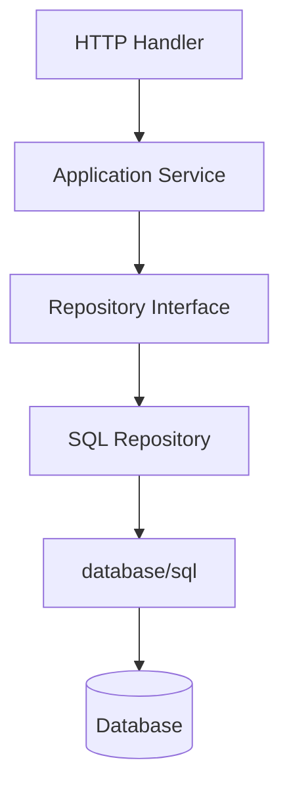
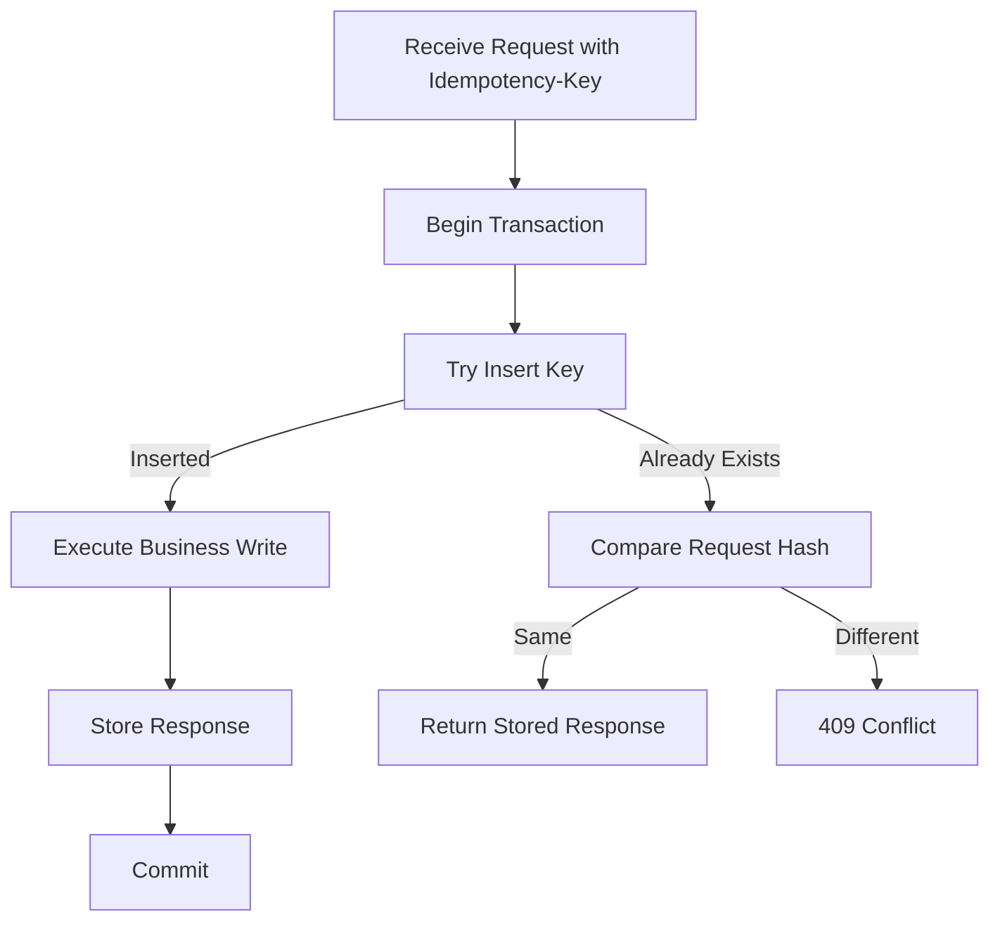
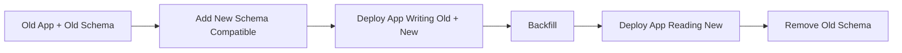

# Database Access: `database/sql`, Transactions, dan Consistency Boundary

Database code sering terlihat sederhana: buka koneksi, jalankan query, scan hasil. Namun dalam sistem produksi, database boundary adalah salah satu tempat paling banyak bug mahal muncul: connection pool exhaustion, transaction leak, inconsistent write, race antar request, query tanpa timeout, N+1 query, deadlock, duplicate write, dan error yang tidak bisa diterjemahkan secara benar.

Part ini membahas database access di Go melalui `database/sql` sebagai abstraction layer standar. Fokusnya bukan hanya “cara query”, tetapi cara mendesain **consistency boundary**: kapan satu use case harus atomik, bagaimana transaction dibatasi, bagaimana context dipakai, bagaimana pool dikontrol, bagaimana error diterjemahkan, dan bagaimana test integration dibuat tanpa membuat suite lambat dan flaky.

Target setelah part ini:

1. Memahami bahwa `*sql.DB` adalah pool handle, bukan satu koneksi.
2. Mampu mengatur connection pool secara sadar.
3. Mampu menulis query context-aware.
4. Mampu menggunakan transaction dengan commit/rollback yang benar.
5. Mampu mendesain repository dan unit-of-work pragmatis.
6. Mampu menangani nullable data secara eksplisit.
7. Mampu membuat migration dan integration test yang repeatable.
8. Mampu menganalisis consistency failure: lost update, duplicate write, partial write, dan idempotency gap.

---

## 1. Posisi Database dalam Arsitektur Go Service

Dalam service Go production-grade, database biasanya berada di belakang application service.



Boundary ideal:

| Layer | Boleh Tahu SQL? | Tanggung Jawab |
|---|---:|---|
| HTTP handler | Tidak | parse input, response mapping |
| Application service | Tidak langsung | business rule, transaction orchestration |
| Repository interface | Tidak | contract persistence dari sudut domain/use case |
| SQL repository | Ya | query, scan, persistence mapping |
| Database | Ya | storage, constraints, transaction isolation |

Jangan membuat domain object bergantung pada SQL tags, driver type, atau transaction object. Domain harus bisa diuji tanpa database.

---

## 2. `database/sql`: Abstraction, Bukan Driver

`database/sql` menyediakan interface umum untuk SQL database. Untuk database nyata, Anda tetap perlu driver, misalnya PostgreSQL driver, MySQL driver, SQLite driver, dan seterusnya.

Contoh:

```go id="jvjkza"
import (
    "database/sql"

    _ "github.com/jackc/pgx/v5/stdlib"
)

func OpenDB(dsn string) (*sql.DB, error) {
    db, err := sql.Open("pgx", dsn)
    if err != nil {
        return nil, err
    }

    return db, nil
}
```

Catatan penting: `sql.Open` tidak selalu membuat koneksi fisik saat itu juga. Ia menyiapkan handle. Gunakan `PingContext` untuk validasi konektivitas saat startup.

```go id="0l1edi"
func OpenAndPing(ctx context.Context, dsn string) (*sql.DB, error) {
    db, err := sql.Open("pgx", dsn)
    if err != nil {
        return nil, fmt.Errorf("open db: %w", err)
    }

    if err := db.PingContext(ctx); err != nil {
        _ = db.Close()
        return nil, fmt.Errorf("ping db: %w", err)
    }

    return db, nil
}
```

Mental model:

```txt id="8ft47v"
*sql.DB = concurrency-safe handle + connection pool manager
*sql.Conn = one reserved connection
*sql.Tx = transaction bound to one connection
*sql.Rows = streaming cursor/result set that must be closed
```

---

## 3. `*sql.DB` adalah Pool, Bukan Connection

Ini salah satu mental model paling penting.

`*sql.DB` aman dipakai concurrent oleh banyak goroutine. Ia mengelola pool koneksi internal. Karena itu, biasanya satu aplikasi memiliki satu `*sql.DB` per database, dibuat saat startup dan ditutup saat shutdown.

Jangan lakukan ini per request:

```go id="edeg3v"
func handler(w http.ResponseWriter, r *http.Request) {
    db, err := sql.Open("pgx", os.Getenv("DSN"))
    if err != nil {
        // ...
    }
    defer db.Close()
}
```

Masalah:

- Pool dibuat berulang.
- Connection churn.
- Startup query overhead.
- Sulit mengontrol resource.
- Dapat menyebabkan connection storm ke database.

Benar:

```go id="cwmgg2"
func main() {
    db, err := OpenAndPing(context.Background(), os.Getenv("DSN"))
    if err != nil {
        log.Fatal(err)
    }
    defer db.Close()

    repo := NewUserRepository(db)
    service := NewUserService(repo)
    _ = service
}
```

---

## 4. Connection Pool Tuning

Default pool tidak selalu cocok untuk production. Atur secara eksplisit.

```go id="kjk7u7"
func ConfigurePool(db *sql.DB) {
    db.SetMaxOpenConns(25)
    db.SetMaxIdleConns(25)
    db.SetConnMaxIdleTime(5 * time.Minute)
    db.SetConnMaxLifetime(30 * time.Minute)
}
```

Makna praktis:

| Setting | Fungsi | Risiko Jika Salah |
|---|---|---|
| `SetMaxOpenConns` | batas koneksi terbuka total | terlalu tinggi membebani DB, terlalu rendah membuat queue latency |
| `SetMaxIdleConns` | batas koneksi idle | terlalu rendah membuat reconnect sering |
| `SetConnMaxIdleTime` | usia idle sebelum ditutup | terlalu panjang bisa tahan koneksi tidak perlu |
| `SetConnMaxLifetime` | umur maksimum koneksi | membantu rotate koneksi, tapi terlalu pendek bikin churn |

Sizing bukan angka universal. Pertimbangkan:

1. Jumlah replica service.
2. Batas koneksi database.
3. Query latency.
4. Peak concurrency.
5. Transaction duration.
6. Background worker.
7. Migration/maintenance process.

Formula kasar:

```txt id="d2tgo6"
max_connections_per_instance <= floor(database_connection_budget / number_of_service_instances)
```

Jika database punya 300 koneksi tersedia untuk aplikasi dan service punya 10 replica, jangan set `MaxOpenConns = 100` per replica. Itu bisa meminta 1000 koneksi.

---

## 5. Context-aware Query

Gunakan method `Context`:

```go id="u510u0"
row := db.QueryRowContext(ctx, `
    SELECT id, email, name
    FROM users
    WHERE id = $1
`, id)
```

Bukan:

```go id="p4l7vn"
row := db.QueryRow(`SELECT id FROM users WHERE id = $1`, id)
```

Kenapa?

- Request cancellation bisa diteruskan.
- Deadline bisa membatalkan query lambat.
- Shutdown bisa lebih bersih.
- Dependency timeout bisa dikontrol di caller.

Contoh repository:

```go id="5zmqxt"
type UserRepository struct {
    db *sql.DB
}

func NewUserRepository(db *sql.DB) *UserRepository {
    return &UserRepository{db: db}
}

func (r *UserRepository) FindByID(ctx context.Context, id string) (User, error) {
    row := r.db.QueryRowContext(ctx, `
        SELECT id, email, name, created_at
        FROM users
        WHERE id = $1
    `, id)

    var u User
    if err := row.Scan(&u.ID, &u.Email, &u.Name, &u.CreatedAt); err != nil {
        if errors.Is(err, sql.ErrNoRows) {
            return User{}, ErrUserNotFound
        }
        return User{}, fmt.Errorf("find user by id: %w", err)
    }

    return u, nil
}
```

---

## 6. `QueryRow`, `Query`, dan `Exec`

Gunakan sesuai bentuk hasil.

| Method | Untuk |
|---|---|
| `QueryRowContext` | satu row |
| `QueryContext` | banyak row |
| `ExecContext` | statement tanpa result rows |

Insert dengan returning:

```go id="tgezfw"
func (r *UserRepository) Create(ctx context.Context, u User) (User, error) {
    row := r.db.QueryRowContext(ctx, `
        INSERT INTO users (email, name)
        VALUES ($1, $2)
        RETURNING id, email, name, created_at
    `, u.Email, u.Name)

    var created User
    if err := row.Scan(&created.ID, &created.Email, &created.Name, &created.CreatedAt); err != nil {
        return User{}, fmt.Errorf("insert user: %w", err)
    }

    return created, nil
}
```

Update dengan affected rows:

```go id="l71w1p"
func (r *UserRepository) Rename(ctx context.Context, id, name string) error {
    res, err := r.db.ExecContext(ctx, `
        UPDATE users
        SET name = $1, updated_at = now()
        WHERE id = $2
    `, name, id)
    if err != nil {
        return fmt.Errorf("rename user: %w", err)
    }

    n, err := res.RowsAffected()
    if err != nil {
        return fmt.Errorf("rename user rows affected: %w", err)
    }
    if n == 0 {
        return ErrUserNotFound
    }

    return nil
}
```

Query many:

```go id="5cp891"
func (r *UserRepository) ListActive(ctx context.Context, limit int) ([]User, error) {
    rows, err := r.db.QueryContext(ctx, `
        SELECT id, email, name, created_at
        FROM users
        WHERE active = true
        ORDER BY created_at DESC
        LIMIT $1
    `, limit)
    if err != nil {
        return nil, fmt.Errorf("list active users: %w", err)
    }
    defer rows.Close()

    var users []User
    for rows.Next() {
        var u User
        if err := rows.Scan(&u.ID, &u.Email, &u.Name, &u.CreatedAt); err != nil {
            return nil, fmt.Errorf("scan user: %w", err)
        }
        users = append(users, u)
    }

    if err := rows.Err(); err != nil {
        return nil, fmt.Errorf("iterate users: %w", err)
    }

    return users, nil
}
```

Aturan penting untuk `Rows`:

1. Selalu `defer rows.Close()` setelah `err == nil`.
2. Selalu cek `rows.Err()` setelah loop.
3. Jangan memuat semua data tanpa limit/pagination.
4. Jika streaming, desain backpressure dan cancellation.

---

## 7. Prepared Statement: Kapan Perlu?

Database driver biasanya sudah punya optimasi sendiri. Prepared statement manual berguna jika statement dipakai berkali-kali dalam lifecycle panjang dan driver/database mendapatkan benefit nyata.

Contoh:

```go id="obldlf"
stmt, err := db.PrepareContext(ctx, `
    INSERT INTO audit_logs (entity_id, action, created_at)
    VALUES ($1, $2, now())
`)
if err != nil {
    return err
}
defer stmt.Close()

for _, e := range events {
    if _, err := stmt.ExecContext(ctx, e.EntityID, e.Action); err != nil {
        return err
    }
}
```

Jangan memakai prepared statement untuk “mencegah SQL injection” jika sebenarnya Anda sudah menggunakan parameter placeholder. Parameterized query adalah mekanisme utama.

Jangan melakukan string concatenation untuk input user:

```go id="x5zm02"
query := "SELECT * FROM users WHERE email = '" + email + "'" // wrong
```

Benar:

```go id="u9vv0x"
row := db.QueryRowContext(ctx, `SELECT id FROM users WHERE email = $1`, email)
```

---

## 8. Nullable Data: Jangan Disembunyikan

SQL `NULL` harus dimodelkan eksplisit.

Pilihan umum:

1. `sql.NullString`, `sql.NullInt64`, `sql.NullTime`, dll.
2. Pointer field seperti `*string`.
3. Custom nullable type.
4. Hindari nullable column jika domain sebenarnya butuh value wajib.

Contoh `sql.NullString`:

```go id="yir14c"
type UserRecord struct {
    ID          string
    Email       string
    DisplayName sql.NullString
}

func (r *UserRepository) FindRecord(ctx context.Context, id string) (UserRecord, error) {
    row := r.db.QueryRowContext(ctx, `
        SELECT id, email, display_name
        FROM users
        WHERE id = $1
    `, id)

    var rec UserRecord
    if err := row.Scan(&rec.ID, &rec.Email, &rec.DisplayName); err != nil {
        return UserRecord{}, err
    }
    return rec, nil
}
```

Mapping ke domain:

```go id="2g76dv"
func recordToDomain(rec UserRecord) User {
    var displayName string
    if rec.DisplayName.Valid {
        displayName = rec.DisplayName.String
    }

    return User{
        ID:          rec.ID,
        Email:       rec.Email,
        DisplayName: displayName,
    }
}
```

Jangan membiarkan `sql.NullString` menyebar ke seluruh domain jika domain tidak peduli SQL. Simpan SQL detail di repository.

---

## 9. Transactions: Boundary Atomik

Transaction dipakai saat beberapa operasi harus berhasil atau gagal bersama.

Contoh use case:

1. Create order.
2. Insert order items.
3. Reserve inventory.
4. Insert audit event.

Jika sebagian berhasil dan sebagian gagal, state rusak.

Basic transaction:

```go id="yuxsq9"
func (s *OrderService) CreateOrder(ctx context.Context, cmd CreateOrderCommand) (Order, error) {
    tx, err := s.db.BeginTx(ctx, nil)
    if err != nil {
        return Order{}, fmt.Errorf("begin tx: %w", err)
    }
    defer tx.Rollback()

    order, err := s.orders.InsertTx(ctx, tx, cmd.Order)
    if err != nil {
        return Order{}, err
    }

    for _, item := range cmd.Items {
        if err := s.items.InsertTx(ctx, tx, order.ID, item); err != nil {
            return Order{}, err
        }
    }

    if err := tx.Commit(); err != nil {
        return Order{}, fmt.Errorf("commit tx: %w", err)
    }

    return order, nil
}
```

Kenapa `defer tx.Rollback()` tetap dipanggil walaupun commit sukses?

Karena setelah `Commit`, `Rollback` akan mengembalikan error yang bisa diabaikan. Pattern ini memastikan semua early return sebelum commit akan rollback.

---

## 10. Jangan Mencampur `db` dan `tx` dalam Transaction

Bug serius:

```go id="cxu2w9"
tx, _ := db.BeginTx(ctx, nil)
repo.InsertWithTx(ctx, tx, user)
repo.InsertAudit(ctx, audit) // memakai db, bukan tx
_ = tx.Commit()
```

`InsertAudit` berjalan di luar transaction. Jika commit gagal, audit tetap masuk. Jika rollback, audit tetap masuk. State tidak konsisten.

Solusi: repository method menerima executor abstraction.

```go id="jtlvca"
type Execer interface {
    ExecContext(ctx context.Context, query string, args ...any) (sql.Result, error)
}

type Queryer interface {
    QueryContext(ctx context.Context, query string, args ...any) (*sql.Rows, error)
    QueryRowContext(ctx context.Context, query string, args ...any) *sql.Row
}

type DBTX interface {
    Execer
    Queryer
}
```

`*sql.DB` dan `*sql.Tx` sama-sama punya method ini.

Repository:

```go id="yuq1oa"
type UserRepository struct{}

func (r *UserRepository) Insert(ctx context.Context, q DBTX, u User) error {
    _, err := q.ExecContext(ctx, `
        INSERT INTO users (id, email, name)
        VALUES ($1, $2, $3)
    `, u.ID, u.Email, u.Name)
    if err != nil {
        return fmt.Errorf("insert user: %w", err)
    }
    return nil
}
```

Service:

```go id="70gpku"
func (s *Service) Register(ctx context.Context, cmd RegisterCommand) error {
    tx, err := s.db.BeginTx(ctx, nil)
    if err != nil {
        return err
    }
    defer tx.Rollback()

    if err := s.users.Insert(ctx, tx, cmd.User); err != nil {
        return err
    }
    if err := s.audit.Insert(ctx, tx, cmd.AuditEvent); err != nil {
        return err
    }

    return tx.Commit()
}
```

Ini sederhana dan tidak butuh framework unit-of-work besar.

---

## 11. Transaction Helper

Untuk mengurangi boilerplate, buat helper:

```go id="ztv7xd"
func WithinTx(ctx context.Context, db *sql.DB, opts *sql.TxOptions, fn func(*sql.Tx) error) error {
    tx, err := db.BeginTx(ctx, opts)
    if err != nil {
        return fmt.Errorf("begin tx: %w", err)
    }

    committed := false
    defer func() {
        if !committed {
            _ = tx.Rollback()
        }
    }()

    if err := fn(tx); err != nil {
        return err
    }

    if err := tx.Commit(); err != nil {
        return fmt.Errorf("commit tx: %w", err)
    }

    committed = true
    return nil
}
```

Pemakaian:

```go id="21f0ck"
err := WithinTx(ctx, s.db, nil, func(tx *sql.Tx) error {
    if err := s.users.Insert(ctx, tx, user); err != nil {
        return err
    }
    if err := s.audit.Insert(ctx, tx, event); err != nil {
        return err
    }
    return nil
})
```

Hati-hati dengan panic. Jika service Anda ingin recover panic dan rollback, helper bisa diperluas. Namun jangan diam-diam menelan panic.

---

## 12. Isolation Level dan Consistency

Transaction bukan magic. Isolation menentukan anomaly apa yang mungkin terjadi.

Go menyediakan `sql.TxOptions`:

```go id="ox7m30"
tx, err := db.BeginTx(ctx, &sql.TxOptions{
    Isolation: sql.LevelSerializable,
    ReadOnly:  false,
})
```

Isolation level umum:

| Level | Intuisi |
|---|---|
| Read Uncommitted | Bisa membaca data belum commit, jarang dipakai |
| Read Committed | Hanya membaca data committed, umum di banyak DB |
| Repeatable Read | Row yang dibaca stabil selama transaction |
| Serializable | Seolah transaction berjalan satu per satu |

Namun behavior detail berbeda antar database. Jangan mengandalkan nama isolation tanpa membaca dokumentasi database yang digunakan.

Contoh lost update:

```txt id="ereb4r"
T1 read balance = 100
T2 read balance = 100
T1 write balance = 80
T2 write balance = 70
Final = 70, padahal seharusnya 50
```

Solusi:

1. Atomic update:

```sql id="4qsxud"
UPDATE accounts
SET balance = balance - $1
WHERE id = $2 AND balance >= $1;
```

2. Row lock:

```sql id="ry190l"
SELECT balance
FROM accounts
WHERE id = $1
FOR UPDATE;
```

3. Optimistic locking:

```sql id="r7lah3"
UPDATE documents
SET content = $1, version = version + 1
WHERE id = $2 AND version = $3;
```

Go code optimistic locking:

```go id="7u7d5d"
func (r *DocumentRepository) Update(ctx context.Context, doc Document) error {
    res, err := r.db.ExecContext(ctx, `
        UPDATE documents
        SET content = $1, version = version + 1
        WHERE id = $2 AND version = $3
    `, doc.Content, doc.ID, doc.Version)
    if err != nil {
        return fmt.Errorf("update document: %w", err)
    }

    n, err := res.RowsAffected()
    if err != nil {
        return err
    }
    if n == 0 {
        return ErrVersionConflict
    }

    return nil
}
```

---

## 13. Constraint adalah Bagian dari Domain Defense

Jangan hanya mengandalkan aplikasi untuk invariant penting.

Database constraint:

```sql id="yk8ldo"
CREATE TABLE users (
    id UUID PRIMARY KEY,
    email TEXT NOT NULL UNIQUE,
    name TEXT NOT NULL,
    created_at TIMESTAMPTZ NOT NULL DEFAULT now()
);
```

Aplikasi harus tetap validasi, tetapi database constraint adalah lapisan terakhir untuk race condition.

Contoh duplicate email:

```txt id="fh61fm"
Request A checks email not exists
Request B checks email not exists
Request A inserts email
Request B inserts email
```

Tanpa unique constraint, duplicate lolos. Dengan unique constraint, salah satu insert gagal. Aplikasi harus menerjemahkan error database menjadi `ErrDuplicate`.

Pseudo mapping:

```go id="m2guho"
func mapInsertUserError(err error) error {
    if isUniqueViolation(err) {
        return ErrDuplicateUser
    }
    return err
}
```

Implementasi `isUniqueViolation` bergantung driver/database.

---

## 14. Idempotency untuk Write Endpoint

HTTP client bisa retry karena timeout, gateway, atau network issue. Tanpa idempotency, server bisa mengeksekusi write dua kali.

Contoh risiko:

```txt id="co9d24"
Client sends POST /payments
Server charges card
Response lost due network timeout
Client retries POST /payments
Server charges card again
```

Pattern idempotency:

```sql id="gcs3n2"
CREATE TABLE idempotency_keys (
    key TEXT PRIMARY KEY,
    request_hash TEXT NOT NULL,
    response_body JSONB,
    status_code INT,
    created_at TIMESTAMPTZ NOT NULL DEFAULT now()
);
```

Flow:



Go-level rule:

- Idempotency check dan business write harus berada dalam consistency boundary yang benar.
- Jangan simpan idempotency record setelah business write di luar transaction.
- Jangan hanya mengandalkan cache untuk critical idempotency.

---

## 15. Pagination dan N+1 Query

Endpoint list tanpa pagination adalah bug performa.

Buruk:

```go id="dme4ot"
rows, err := db.QueryContext(ctx, `SELECT id, email FROM users`)
```

Lebih baik:

```go id="b0cvpw"
rows, err := db.QueryContext(ctx, `
    SELECT id, email, created_at
    FROM users
    WHERE created_at < $1
    ORDER BY created_at DESC
    LIMIT $2
`, cursor, limit)
```

N+1 query:

```go id="qbzp0f"
users := listUsers(ctx)
for _, u := range users {
    orders := listOrdersByUser(ctx, u.ID)
    _ = orders
}
```

Jika ada 100 user, ada 101 query.

Solusi:

1. Join.
2. Batch query dengan `WHERE user_id = ANY($1)` atau equivalent.
3. Precomputed/read model.
4. Endpoint contract yang tidak memaksa nested data mahal.

---

## 16. Migration: Schema adalah Bagian dari Code

Migration harus versioned dan repeatable.

Contoh folder:

```txt id="cexbbx"
migrations/
  000001_create_users.up.sql
  000001_create_users.down.sql
  000002_add_user_status.up.sql
  000002_add_user_status.down.sql
```

Contoh migration:

```sql id="2w99ww"
CREATE TABLE users (
    id UUID PRIMARY KEY,
    email TEXT NOT NULL UNIQUE,
    name TEXT NOT NULL,
    status TEXT NOT NULL DEFAULT 'active',
    created_at TIMESTAMPTZ NOT NULL DEFAULT now(),
    updated_at TIMESTAMPTZ NOT NULL DEFAULT now()
);
```

Rule migration produksi:

1. Hindari breaking schema change dalam satu deploy.
2. Gunakan expand-and-contract.
3. Tambah kolom nullable/default dulu.
4. Backfill data dengan job terkontrol.
5. Ubah aplikasi agar memakai kolom baru.
6. Setelah aman, hapus kolom lama.

Expand-and-contract:



---

## 17. Testing Database Code

Ada beberapa level test:

| Level | Tool | Tujuan |
|---|---|---|
| Unit test service | fake repository | business rule cepat |
| Repository integration test | real DB test container/local | SQL correctness |
| Migration test | real DB | schema valid |
| End-to-end test | service + DB | contract flow |

Fake repository untuk service:

```go id="zsk871"
type fakeUserRepo struct {
    byEmail map[string]User
}

func (f *fakeUserRepo) ExistsByEmail(ctx context.Context, email string) (bool, error) {
    _, ok := f.byEmail[email]
    return ok, nil
}

func (f *fakeUserRepo) Save(ctx context.Context, u User) error {
    f.byEmail[u.Email] = u
    return nil
}
```

Integration test repository:

```go id="l69aqu"
func TestUserRepository_CreateAndFind(t *testing.T) {
    db := openTestDB(t)
    migrateTestDB(t, db)

    repo := NewUserRepository(db)
    ctx := context.Background()

    created, err := repo.Create(ctx, User{
        Email: "a@example.com",
        Name:  "A",
    })
    if err != nil {
        t.Fatalf("create: %v", err)
    }

    found, err := repo.FindByID(ctx, created.ID)
    if err != nil {
        t.Fatalf("find: %v", err)
    }

    if found.Email != created.Email {
        t.Fatalf("email = %q, want %q", found.Email, created.Email)
    }
}
```

Test isolation strategy:

1. Satu database per test package.
2. Transaction rollback per test.
3. Truncate tables per test.
4. Schema-per-test untuk parallelism.
5. Container per suite jika memungkinkan.

Trade-off:

| Strategy | Cepat | Isolasi | Kompleksitas |
|---|---:|---:|---:|
| Fake repo | Sangat cepat | rendah untuk SQL | rendah |
| Transaction rollback | cepat | baik | sedang |
| Truncate | sedang | baik | sedang |
| Container per test | lambat | sangat baik | tinggi |
| Container per suite | sedang | baik | sedang |

---

## 18. Repository Pattern yang Pragmatic

Repository di Go tidak harus generic atau terlalu abstrak. Buat berdasarkan use case.

Buruk:

```go id="l1jmz2"
type Repository[T any] interface {
    Save(ctx context.Context, t T) error
    FindByID(ctx context.Context, id string) (T, error)
    FindAll(ctx context.Context) ([]T, error)
    Delete(ctx context.Context, id string) error
}
```

Masalah:

- Terlalu generic.
- Tidak menangkap query domain spesifik.
- Mendorong CRUD mental model.
- Bisa membuat transaction/use case sulit.

Lebih baik:

```go id="02i9gu"
type UserReader interface {
    FindByID(ctx context.Context, id string) (User, error)
    FindByEmail(ctx context.Context, email string) (User, error)
}

type UserWriter interface {
    Create(ctx context.Context, u User) (User, error)
    MarkSuspended(ctx context.Context, id string, reason string) error
}
```

Atau untuk service tertentu:

```go id="cni930"
type RegistrationRepository interface {
    EmailExists(ctx context.Context, email string) (bool, error)
    InsertUser(ctx context.Context, q DBTX, user User) error
    InsertWelcomeTask(ctx context.Context, q DBTX, task WelcomeTask) error
}
```

Repository interface sebaiknya didefinisikan di sisi consumer, bukan package database umum yang memaksakan semua use case.

---

## 19. Error Mapping Database

Repository harus membedakan:

| DB Error | Domain/Application Error |
|---|---|
| `sql.ErrNoRows` | `ErrNotFound` |
| unique violation | `ErrDuplicate` |
| foreign key violation | `ErrInvalidReference` atau `ErrConflict` |
| serialization failure | retryable conflict |
| timeout/cancel | dependency timeout/cancel |
| connection error | infrastructure error |

Contoh:

```go id="yg6x0b"
func (r *UserRepository) FindByEmail(ctx context.Context, email string) (User, error) {
    row := r.db.QueryRowContext(ctx, `
        SELECT id, email, name
        FROM users
        WHERE email = $1
    `, email)

    var u User
    if err := row.Scan(&u.ID, &u.Email, &u.Name); err != nil {
        if errors.Is(err, sql.ErrNoRows) {
            return User{}, ErrUserNotFound
        }
        return User{}, fmt.Errorf("find user by email: %w", err)
    }

    return u, nil
}
```

Jangan membuat handler HTTP memahami error driver database. Handler cukup memahami error application/domain.

---

## 20. Observability untuk Database

Minimal observability:

1. Query duration.
2. Error count by operation.
3. Rows affected jika relevan.
4. Pool stats.
5. Slow query logging.
6. Transaction duration.

Pool stats tersedia melalui `db.Stats()`:

```go id="5eqjze"
func LogDBStats(ctx context.Context, db *sql.DB, logger *slog.Logger) {
    ticker := time.NewTicker(30 * time.Second)
    defer ticker.Stop()

    for {
        select {
        case <-ctx.Done():
            return
        case <-ticker.C:
            s := db.Stats()
            logger.Info("db stats",
                "open_connections", s.OpenConnections,
                "in_use", s.InUse,
                "idle", s.Idle,
                "wait_count", s.WaitCount,
                "wait_duration_ms", s.WaitDuration.Milliseconds(),
                "max_open_connections", s.MaxOpenConnections,
            )
        }
    }
}
```

Interpretasi:

| Signal | Kemungkinan Masalah |
|---|---|
| `WaitCount` naik cepat | pool terlalu kecil atau query lambat |
| `InUse` selalu dekat max | saturation |
| `Idle` tinggi sekali | pool mungkin terlalu besar |
| Wait duration tinggi | request menunggu koneksi |
| transaction duration tinggi | lock contention / slow use case |

---

## 21. Long Transaction adalah Risiko

Transaction sebaiknya pendek. Jangan lakukan ini:

```go id="m2q8u3"
tx, _ := db.BeginTx(ctx, nil)
callExternalHTTP(ctx) // buruk: transaction terbuka saat network call
updateDB(ctx, tx)
tx.Commit()
```

Risiko:

- Lock ditahan lama.
- Connection pool terpakai lama.
- Deadlock lebih mungkin.
- Latency tail memburuk.
- External dependency outage bisa membuat DB ikut tersandera.

Lebih baik:

1. Validasi input.
2. Ambil data yang perlu.
3. Tutup transaction.
4. Call external jika tidak butuh atomicity DB.
5. Untuk cross-system consistency, gunakan outbox/saga, bukan transaction DB + HTTP call.

---

## 22. Outbox Pattern Singkat

Jika perlu menyimpan state DB dan mengirim event, jangan publish event langsung setelah commit tanpa recovery plan.

Masalah:

```txt id="7dmtj8"
Insert order succeeds
Commit succeeds
Publish event fails
System lain tidak tahu order dibuat
```

Outbox:

```sql id="fcsxel"
CREATE TABLE outbox_events (
    id UUID PRIMARY KEY,
    topic TEXT NOT NULL,
    payload JSONB NOT NULL,
    created_at TIMESTAMPTZ NOT NULL DEFAULT now(),
    published_at TIMESTAMPTZ
);
```

Dalam satu transaction:

```go id="ab87sq"
err := WithinTx(ctx, db, nil, func(tx *sql.Tx) error {
    if err := orders.Insert(ctx, tx, order); err != nil {
        return err
    }
    if err := outbox.Insert(ctx, tx, event); err != nil {
        return err
    }
    return nil
})
```

Background worker publish event dari outbox lalu mark published. Ini memindahkan cross-system consistency dari “distributed transaction palsu” menjadi retryable workflow.

---

## 23. Mini Project: Registration dengan Transaction dan Constraint

Schema:

```sql id="w7l3bd"
CREATE TABLE users (
    id TEXT PRIMARY KEY,
    email TEXT NOT NULL UNIQUE,
    name TEXT NOT NULL,
    created_at TIMESTAMP NOT NULL DEFAULT CURRENT_TIMESTAMP
);

CREATE TABLE audit_logs (
    id TEXT PRIMARY KEY,
    entity_id TEXT NOT NULL,
    action TEXT NOT NULL,
    created_at TIMESTAMP NOT NULL DEFAULT CURRENT_TIMESTAMP
);
```

Domain:

```go id="hsoawq"
type User struct {
    ID        string
    Email     string
    Name      string
    CreatedAt time.Time
}

type AuditLog struct {
    ID       string
    EntityID string
    Action   string
}
```

Repository:

```go id="k3zis7"
type UserRepository struct{}

func (r *UserRepository) Insert(ctx context.Context, q DBTX, u User) error {
    _, err := q.ExecContext(ctx, `
        INSERT INTO users (id, email, name)
        VALUES ($1, $2, $3)
    `, u.ID, u.Email, u.Name)
    if err != nil {
        return fmt.Errorf("insert user: %w", mapUserDBError(err))
    }
    return nil
}

type AuditRepository struct{}

func (r *AuditRepository) Insert(ctx context.Context, q DBTX, log AuditLog) error {
    _, err := q.ExecContext(ctx, `
        INSERT INTO audit_logs (id, entity_id, action)
        VALUES ($1, $2, $3)
    `, log.ID, log.EntityID, log.Action)
    if err != nil {
        return fmt.Errorf("insert audit log: %w", err)
    }
    return nil
}
```

Service:

```go id="62bwo6"
type RegistrationService struct {
    db     *sql.DB
    users  *UserRepository
    audits *AuditRepository
}

func (s *RegistrationService) Register(ctx context.Context, email, name string) (User, error) {
    email = strings.TrimSpace(strings.ToLower(email))
    name = strings.TrimSpace(name)

    if !strings.Contains(email, "@") {
        return User{}, ErrInvalidEmail
    }

    u := User{
        ID:    newID(),
        Email: email,
        Name:  name,
    }

    audit := AuditLog{
        ID:       newID(),
        EntityID: u.ID,
        Action:   "user.registered",
    }

    err := WithinTx(ctx, s.db, nil, func(tx *sql.Tx) error {
        if err := s.users.Insert(ctx, tx, u); err != nil {
            return err
        }
        if err := s.audits.Insert(ctx, tx, audit); err != nil {
            return err
        }
        return nil
    })
    if err != nil {
        return User{}, err
    }

    return u, nil
}
```

Critical invariant:

```txt id="t00p6g"
Jika user berhasil dibuat, audit log harus ikut dibuat.
Jika audit log gagal dibuat, user harus rollback.
```

Ini invariant transaction.

---

## 24. Common Anti-patterns

### 24.1 `sql.Open` Per Request

Membuat pool baru per request adalah bug resource.

---

### 24.2 Query Tanpa Context

Query tanpa context sulit dibatalkan saat request timeout atau shutdown.

---

### 24.3 Tidak Menutup `Rows`

`rows.Close()` wajib untuk membebaskan resource cursor/connection.

---

### 24.4 Tidak Mengecek `rows.Err()`

Error bisa terjadi saat iterasi, bukan hanya saat query dimulai.

---

### 24.5 Transaction Terlalu Lebar

Transaction yang menunggu HTTP call atau operasi lambat akan menahan connection dan lock.

---

### 24.6 Business Rule Hanya di Aplikasi, Constraint Tidak Ada

Race condition bisa melewati check aplikasi. Gunakan database constraint untuk invariant penting.

---

### 24.7 Repository Terlalu Generic

Repository generic CRUD sering tidak cocok dengan use case domain dan transaction boundary.

---

## 25. Checklist Review Database Go

### Connection

- [ ] `*sql.DB` dibuat saat startup, bukan per request.
- [ ] `PingContext` digunakan saat startup readiness.
- [ ] Pool dikonfigurasi: max open, max idle, idle time, lifetime.
- [ ] `db.Close()` dipanggil saat shutdown.

### Query

- [ ] Semua query memakai context.
- [ ] Parameterized query, bukan string concatenation.
- [ ] `Rows` selalu ditutup.
- [ ] `rows.Err()` dicek.
- [ ] Query list punya limit/pagination.
- [ ] Nullable data dimodelkan eksplisit.

### Transaction

- [ ] Boundary transaction berada di application service/use case.
- [ ] `defer Rollback` pattern benar.
- [ ] `Commit` error dicek.
- [ ] Tidak mencampur operasi `db` dan `tx` dalam satu transaction.
- [ ] Transaction tidak melakukan external HTTP call.
- [ ] Isolation level dipilih sadar jika perlu.

### Consistency

- [ ] Invariant penting dijaga oleh DB constraint.
- [ ] Duplicate write ditangani.
- [ ] Idempotency dipertimbangkan untuk write endpoint.
- [ ] Outbox dipertimbangkan untuk event publish.
- [ ] Optimistic/row locking dipakai jika ada lost update risk.

### Testing

- [ ] Business rule punya unit test tanpa DB.
- [ ] Repository punya integration test dengan DB nyata.
- [ ] Migration dites.
- [ ] Duplicate/constraint path dites.
- [ ] Transaction rollback path dites.

---

## 26. Latihan 2 Jam

### Latihan 1 — 20 Menit

Buat `OpenAndPing(ctx, dsn)`:

- `sql.Open`
- configure pool
- `PingContext`
- close on failure

Kriteria benar:

- Jika ping gagal, DB ditutup.
- Pool setting eksplisit.

---

### Latihan 2 — 30 Menit

Buat repository `UserRepository`:

- `Create(ctx, user)`
- `FindByID(ctx, id)`
- `FindByEmail(ctx, email)`
- `Rename(ctx, id, name)`

Kriteria benar:

- Semua method context-aware.
- `sql.ErrNoRows` dimap ke `ErrUserNotFound`.
- `RowsAffected` dicek untuk update.

---

### Latihan 3 — 30 Menit

Buat service `RegisterUser`:

- Insert user.
- Insert audit log.
- Keduanya dalam satu transaction.
- Duplicate email dimap ke conflict domain error.

Kriteria benar:

- Jika audit insert gagal, user rollback.
- Handler tidak tahu error driver database.

---

### Latihan 4 — 20 Menit

Tambahkan integration test:

- Create and find user.
- Duplicate email.
- Transaction rollback.

---

### Latihan 5 — 20 Menit

Tambahkan observability sederhana:

- Log query operation dan duration.
- Log pool stats setiap 30 detik.
- Tambahkan alert mental model: `WaitCount` naik artinya pool saturation/query lambat.

---

## 27. Ringkasan Mental Model

Database access Go yang benar berdiri di atas beberapa invariant:

1. `*sql.DB` adalah pool handle, bukan connection tunggal.
2. Query harus context-aware.
3. `Rows` adalah resource yang harus ditutup.
4. Transaction adalah consistency boundary, bukan sekadar grouping code.
5. Jangan mencampur `db` dan `tx` dalam satu transaction.
6. Constraint database adalah domain defense layer.
7. Nullable data harus eksplisit.
8. Repository sebaiknya use-case oriented, bukan generic CRUD reflex.
9. Connection pool harus disizing terhadap total replica dan budget database.
10. Cross-system consistency butuh pattern seperti outbox/saga, bukan transaction DB yang menunggu HTTP call.

---

## 28. Referensi Resmi

- `database/sql` package documentation
- Go documentation: Managing database connections
- Go documentation: Executing transactions
- Go documentation: Querying for data
- Dokumentasi driver database yang dipakai di project nyata

---

## 29. Preview Part Berikutnya

Part berikutnya membahas API design: REST, JSON, validation, idempotency, compatibility, dan contract evolution.

Kita akan naik dari database boundary ke contract boundary:

- DTO vs domain model.
- Pagination.
- Filtering.
- Status code.
- Idempotency key.
- Backward-compatible API changes.
- Versioning strategy.
- Error response sebagai machine-readable contract.
