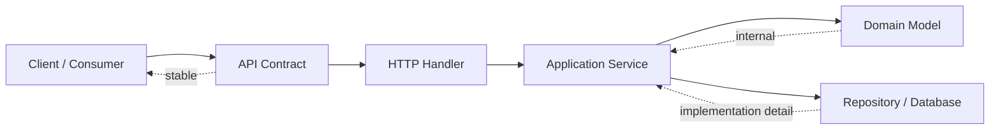
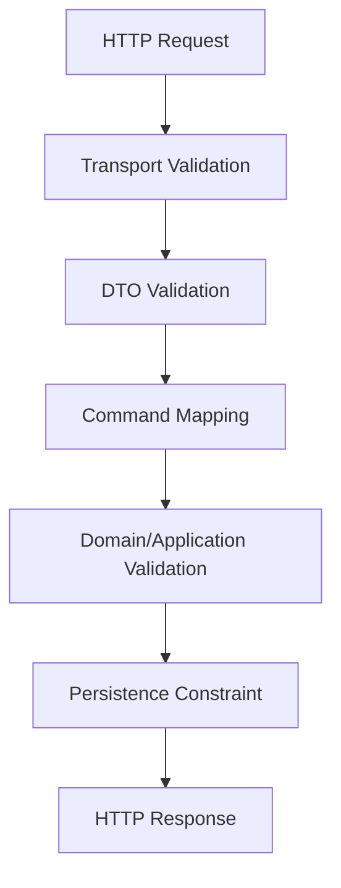
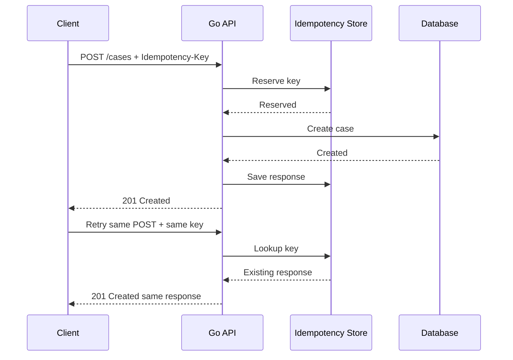

# API Design: REST, JSON, Validation, Idempotency, dan Contract

Di part sebelumnya kita membangun fondasi HTTP server/client dan database access. Sekarang kita naik satu tingkat: **API sebagai kontrak sistem**.

Bagi software engineer yang sudah terbiasa membangun backend, bagian ini penting karena banyak bug production bukan berasal dari syntax, tetapi dari kontrak yang ambigu:

- field JSON tidak konsisten;
- error response berubah tanpa sengaja;
- client tidak tahu apakah operasi aman di-retry;
- validasi tersebar di handler, service, dan database;
- pagination tidak stabil;
- API internal bocor mengikuti bentuk table database;
- perubahan kecil menjadi breaking change;
- endpoint berhasil secara teknis tetapi gagal secara bisnis.

Di Go, API design yang baik biasanya tidak dibangun dengan framework besar. Ia dibangun dari kombinasi:

- `net/http`;
- tipe eksplisit;
- boundary package yang bersih;
- error taxonomy;
- validation yang dekat dengan kontrak;
- handler tipis;
- service layer yang membawa use case;
- test yang memverifikasi contract dan failure path.

Kita akan membangun mental model API Go yang bisa dipertanggungjawabkan di production.

---

## Target Pembelajaran

Setelah menyelesaikan part ini, kita harus mampu:

1. Mendesain REST API yang tidak hanya berjalan, tetapi punya kontrak stabil.
2. Memisahkan DTO, domain model, dan persistence model.
3. Menggunakan `encoding/json` dengan sadar terhadap zero value, optional field, unknown field, dan backward compatibility.
4. Mendesain validation boundary yang jelas.
5. Membuat error response yang konsisten dan aman untuk client.
6. Mendesain pagination, filtering, sorting, dan idempotency secara production-grade.
7. Menghindari breaking change yang tidak perlu.
8. Menulis contract test untuk memastikan behavior API tidak berubah sembarangan.

---

## Hubungan dengan Framework Kaufman

Dalam kerangka Josh Kaufman, part ini berada pada tahap:

- **Deconstruct the skill**: API design dipecah menjadi contract, DTO, validation, error, idempotency, compatibility.
- **Learn enough to self-correct**: kita belajar mengenali API smell dan failure mode.
- **Deliberate practice**: kita akan membuat endpoint kecil, lalu memperbaikinya menjadi contract-grade.

Target 20 jam pertama Go bukan membuat API sempurna. Tetapi setelah kita melewati fondasi Go, API design menjadi titik latihan yang sangat bagus karena menggabungkan syntax, type system, error handling, testing, HTTP, dan database.

---

## Mental Model: API adalah Boundary, Bukan Function Remote

Kesalahan umum engineer saat membuat API adalah menganggap endpoint sebagai function yang dipanggil via HTTP.

Itu model yang lemah.

API lebih tepat dipahami sebagai **boundary antar sistem dengan kontrak jangka panjang**.



Kontrak API mencakup:

- URL;
- HTTP method;
- request body;
- query parameter;
- header;
- authentication expectation;
- status code;
- response body;
- error format;
- idempotency behavior;
- pagination behavior;
- compatibility guarantee.

Di sistem besar, contract lebih penting daripada implementasi sementara. Handler bisa direfactor. Database bisa berubah. Package internal bisa dipecah. Tetapi jika client sudah memakai API, perubahan contract menjadi mahal.

---

## Project Mini yang Akan Dipakai

Kita akan memakai domain kecil: **case management**.

Kita punya entity `Case`:

- `id`
- `title`
- `description`
- `status`
- `priority`
- `created_at`
- `updated_at`

Use case:

1. Create case.
2. Get case by ID.
3. List cases dengan pagination/filter.
4. Update status.
5. Create case secara idempotent.

Domain ini cukup sederhana, tetapi punya banyak elemen API design nyata:

- validation;
- enum;
- lifecycle status;
- idempotency;
- pagination;
- error mapping;
- compatibility.

---

## Struktur Package yang Akan Digunakan

Untuk contoh part ini, kita pakai struktur:

```txt
caseapi/
  go.mod
  cmd/api/main.go
  internal/caseapp/
    model.go
    service.go
    errors.go
  internal/httpapi/
    server.go
    cases.go
    dto.go
    errors.go
    validation.go
  internal/store/
    memory.go
```

Prinsipnya:

- `caseapp` berisi use case dan domain-level contract internal.
- `httpapi` berisi HTTP boundary dan DTO.
- `store` berisi persistence implementation.
- `cmd/api` hanya wiring.

API tidak boleh langsung mengekspos bentuk database. Database juga tidak boleh memaksa bentuk JSON.

---

## Domain Model vs DTO vs Persistence Model

Salah satu kebiasaan buruk yang sering muncul adalah menggunakan satu struct untuk semuanya:

```go
// Buruk untuk sistem yang ingin tahan lama.
type Case struct {
    ID          string    `json:"id" db:"id"`
    Title       string    `json:"title" db:"title"`
    Description string    `json:"description" db:"description"`
    Status      string    `json:"status" db:"status"`
    CreatedAt   time.Time `json:"created_at" db:"created_at"`
}
```

Ini tampak praktis, tetapi mencampur tiga concern:

1. **Domain concern**: apa itu Case secara bisnis?
2. **API concern**: bagaimana Case dikirim ke client?
3. **Database concern**: bagaimana Case disimpan?

Dalam codebase kecil, ini bisa diterima. Dalam codebase yang akan hidup lama, ini sering menjadi sumber coupling.

Model yang lebih sehat:

```go
package caseapp

import "time"

type Status string

const (
    StatusOpen       Status = "open"
    StatusInReview   Status = "in_review"
    StatusResolved   Status = "resolved"
    StatusClosed     Status = "closed"
)

type Priority string

const (
    PriorityLow    Priority = "low"
    PriorityMedium Priority = "medium"
    PriorityHigh   Priority = "high"
)

type Case struct {
    ID          string
    Title       string
    Description string
    Status      Status
    Priority    Priority
    CreatedAt   time.Time
    UpdatedAt   time.Time
}
```

DTO untuk API:

```go
package httpapi

type createCaseRequest struct {
    Title       string `json:"title"`
    Description string `json:"description"`
    Priority    string `json:"priority"`
}

type caseResponse struct {
    ID          string `json:"id"`
    Title       string `json:"title"`
    Description string `json:"description"`
    Status      string `json:"status"`
    Priority    string `json:"priority"`
    CreatedAt   string `json:"created_at"`
    UpdatedAt   string `json:"updated_at"`
}
```

Kenapa timestamp response string, bukan `time.Time` langsung?

Karena API contract sebaiknya eksplisit. `time.Time` memang encode ke RFC3339 secara default, tetapi dengan mapping eksplisit kita bisa memastikan format yang kita dokumentasikan benar-benar menjadi contract.

```go
func toCaseResponse(c caseapp.Case) caseResponse {
    return caseResponse{
        ID:          c.ID,
        Title:       c.Title,
        Description: c.Description,
        Status:      string(c.Status),
        Priority:    string(c.Priority),
        CreatedAt:   c.CreatedAt.UTC().Format(time.RFC3339Nano),
        UpdatedAt:   c.UpdatedAt.UTC().Format(time.RFC3339Nano),
    }
}
```

Rule praktis:

> Jangan biarkan tag `json` dan tag database hidup dalam struct yang sama kecuali kita sadar bahwa project memang kecil, lifetime pendek, dan contract tidak perlu evolusi besar.

---

## REST Resource Design

REST bukan sekadar memakai JSON via HTTP. REST menekankan resource dan uniform interface.

Untuk case management, endpoint dasar bisa seperti ini:

| Method | Path | Makna |
|---|---|---|
| `POST` | `/cases` | Membuat case baru |
| `GET` | `/cases/{id}` | Membaca case by ID |
| `GET` | `/cases` | List cases |
| `PATCH` | `/cases/{id}/status` | Mengubah status case |

Kenapa update status memakai sub-resource `/status`?

Karena status transition biasanya punya aturan sendiri. Ia bukan sekadar update field bebas. Dalam sistem regulasi, status bisa punya audit, permission, state machine, dan side effect.

Alternatif:

```txt
PATCH /cases/{id}
```

Boleh, tetapi harus jelas apakah request itu partial update bebas atau command bisnis.

Untuk domain lifecycle, sering lebih baik memakai command-oriented endpoint yang eksplisit:

```txt
POST /cases/{id}:resolve
POST /cases/{id}:close
```

Namun style `:action` tidak selalu disukai semua organisasi. Yang penting bukan fanatisme REST, tetapi contract yang jelas dan konsisten.

---

## Handler Tipis, Service Tebal Secukupnya

Handler sebaiknya melakukan:

1. Parse request.
2. Validate request-level rule.
3. Panggil application service.
4. Translate result/error ke HTTP response.

Handler tidak sebaiknya melakukan:

- query database langsung;
- menjalankan business rule kompleks;
- mengandung transaction orchestration besar;
- mengandung retry policy infrastructure yang tersembunyi;
- membocorkan error internal ke client.

Contoh service contract:

```go
package caseapp

import "context"

type Service struct {
    repo Repository
    ids  IDGenerator
    now  Clock
}

type Repository interface {
    Create(ctx context.Context, c Case) error
    Get(ctx context.Context, id string) (Case, error)
    List(ctx context.Context, q ListQuery) (ListResult, error)
    UpdateStatus(ctx context.Context, id string, status Status) (Case, error)
}

type IDGenerator interface {
    NewID() string
}

type Clock interface {
    Now() time.Time
}
```

Service menerima input yang sudah dibentuk sebagai command:

```go
type CreateCaseCommand struct {
    Title       string
    Description string
    Priority    Priority
}

func (s *Service) CreateCase(ctx context.Context, cmd CreateCaseCommand) (Case, error) {
    if cmd.Title == "" {
        return Case{}, ErrInvalidInput{Field: "title", Reason: "required"}
    }

    now := s.now.Now().UTC()
    c := Case{
        ID:          s.ids.NewID(),
        Title:       cmd.Title,
        Description: cmd.Description,
        Status:      StatusOpen,
        Priority:    cmd.Priority,
        CreatedAt:   now,
        UpdatedAt:   now,
    }

    if err := s.repo.Create(ctx, c); err != nil {
        return Case{}, err
    }
    return c, nil
}
```

Perhatikan bahwa service tidak tahu JSON. Itu sehat.

---

## JSON Decoding yang Defensive

`encoding/json` mudah dipakai, tetapi default behavior-nya cukup permisif. Untuk API production, kita perlu sadar terhadap beberapa hal.

### Unknown Field

Secara default, JSON decoder mengabaikan field yang tidak dikenal.

Request:

```json
{
  "title": "Late reporting",
  "priority": "high",
  "unexpected": "value"
}
```

Jika struct tidak punya field `unexpected`, default decoder tetap berhasil.

Untuk public API, kadang ini baik untuk forward compatibility. Untuk internal API yang ingin contract ketat, lebih baik tolak unknown field:

```go
func decodeJSONStrict(r *http.Request, dst any) error {
    dec := json.NewDecoder(r.Body)
    dec.DisallowUnknownFields()

    if err := dec.Decode(dst); err != nil {
        return err
    }

    if dec.Decode(&struct{}{}) != io.EOF {
        return errors.New("request body must contain a single JSON object")
    }

    return nil
}
```

Kenapa decode kedua?

Agar body seperti ini tidak diterima:

```json
{"title":"A"}
{"title":"B"}
```

JSON decoder bisa membaca object pertama lalu berhenti. Untuk API, biasanya kita ingin tepat satu JSON value.

### Body Size Limit

Jangan decode body tanpa batas ukuran.

```go
r.Body = http.MaxBytesReader(w, r.Body, 1<<20) // 1 MiB
```

Ini menghindari client mengirim body sangat besar dan menghabiskan memory.

### Content-Type

Untuk endpoint JSON, validasi content type:

```go
func requireJSONContentType(r *http.Request) error {
    ct := r.Header.Get("Content-Type")
    if ct == "" {
        return errors.New("Content-Type header is required")
    }

    mediaType, _, err := mime.ParseMediaType(ct)
    if err != nil {
        return errors.New("invalid Content-Type header")
    }
    if mediaType != "application/json" {
        return errors.New("Content-Type must be application/json")
    }
    return nil
}
```

Untuk response, selalu set:

```go
w.Header().Set("Content-Type", "application/json; charset=utf-8")
```

---

## Optional Field, Zero Value, dan Pointer DTO

Masalah umum dalam API update adalah membedakan:

- field tidak dikirim;
- field dikirim dengan empty value.

Contoh request:

```json
{}
```

versus:

```json
{"description":""}
```

Jika DTO memakai string biasa:

```go
type updateCaseRequest struct {
    Description string `json:"description"`
}
```

Keduanya menghasilkan `Description == ""`. Kita kehilangan informasi.

Untuk partial update, gunakan pointer:

```go
type updateCaseRequest struct {
    Title       *string `json:"title"`
    Description *string `json:"description"`
    Priority    *string `json:"priority"`
}
```

Lalu mapping:

```go
if req.Description != nil {
    cmd.Description = req.Description
}
```

Rule:

- Create request biasanya memakai value biasa.
- Patch request sering membutuhkan pointer atau custom optional type.
- Domain model tidak harus ikut memakai pointer hanya karena DTO butuh optional semantics.

---

## Validation Boundary

Validation bisa terjadi di beberapa layer:

1. **Transport validation**: apakah JSON valid, content type benar, path parameter ada.
2. **Contract validation**: apakah field required ada, panjang title valid, enum valid.
3. **Domain validation**: apakah state transition legal, apakah business invariant terpenuhi.
4. **Persistence validation**: unique constraint, foreign key, transaction conflict.

Jangan campur semuanya di satu tempat.



Contoh DTO validation:

```go
type fieldViolation struct {
    Field   string `json:"field"`
    Message string `json:"message"`
}

func validateCreateCaseRequest(req createCaseRequest) []fieldViolation {
    var violations []fieldViolation

    title := strings.TrimSpace(req.Title)
    if title == "" {
        violations = append(violations, fieldViolation{
            Field:   "title",
            Message: "title is required",
        })
    }
    if len(title) > 200 {
        violations = append(violations, fieldViolation{
            Field:   "title",
            Message: "title must be at most 200 characters",
        })
    }

    switch req.Priority {
    case "low", "medium", "high":
    default:
        violations = append(violations, fieldViolation{
            Field:   "priority",
            Message: "priority must be one of: low, medium, high",
        })
    }

    return violations
}
```

Kemudian mapping ke command:

```go
func toCreateCaseCommand(req createCaseRequest) caseapp.CreateCaseCommand {
    return caseapp.CreateCaseCommand{
        Title:       strings.TrimSpace(req.Title),
        Description: strings.TrimSpace(req.Description),
        Priority:    caseapp.Priority(req.Priority),
    }
}
```

Penting: jangan mapping sebelum validasi kalau mapping bisa membuat data invalid terlihat valid.

---

## Error Contract

Error response tidak boleh asal.

Buruk:

```json
{"error":"sql: no rows in result set"}
```

Masalah:

- membocorkan implementation detail;
- tidak stabil;
- client tidak tahu cara menangani;
- message bisa berubah saat dependency berubah.

Lebih baik:

```json
{
  "error": {
    "code": "case_not_found",
    "message": "case was not found",
    "request_id": "req_123"
  }
}
```

Untuk validation:

```json
{
  "error": {
    "code": "validation_failed",
    "message": "request validation failed",
    "request_id": "req_123",
    "fields": [
      {
        "field": "title",
        "message": "title is required"
      }
    ]
  }
}
```

DTO:

```go
type errorResponse struct {
    Error apiError `json:"error"`
}

type apiError struct {
    Code      string           `json:"code"`
    Message   string           `json:"message"`
    RequestID string           `json:"request_id,omitempty"`
    Fields    []fieldViolation `json:"fields,omitempty"`
}
```

Helper:

```go
func writeJSON(w http.ResponseWriter, status int, v any) {
    w.Header().Set("Content-Type", "application/json; charset=utf-8")
    w.WriteHeader(status)
    _ = json.NewEncoder(w).Encode(v)
}

func writeError(w http.ResponseWriter, status int, code, message, requestID string) {
    writeJSON(w, status, errorResponse{
        Error: apiError{
            Code:      code,
            Message:   message,
            RequestID: requestID,
        },
    })
}
```

### Mapping Domain Error ke HTTP

Domain error:

```go
package caseapp

import "errors"

var ErrNotFound = errors.New("case not found")
var ErrConflict = errors.New("case conflict")

type ErrInvalidInput struct {
    Field  string
    Reason string
}

func (e ErrInvalidInput) Error() string {
    return e.Field + ": " + e.Reason
}
```

HTTP mapping:

```go
func (s *Server) handleAppError(w http.ResponseWriter, r *http.Request, err error) {
    requestID := requestIDFrom(r.Context())

    switch {
    case errors.Is(err, caseapp.ErrNotFound):
        writeError(w, http.StatusNotFound, "case_not_found", "case was not found", requestID)

    case errors.Is(err, caseapp.ErrConflict):
        writeError(w, http.StatusConflict, "case_conflict", "case cannot be modified due to a conflict", requestID)

    default:
        s.logger.Error("request failed", "error", err, "request_id", requestID)
        writeError(w, http.StatusInternalServerError, "internal_error", "internal server error", requestID)
    }
}
```

Rule:

- Internal error detail masuk log.
- Client menerima stable code dan safe message.
- `message` boleh human-readable, tetapi `code` adalah kontrak mesin.

---

## Status Code Mapping

Status code bukan dekorasi. Ia bagian dari contract.

| Situasi | Status |
|---|---:|
| Create berhasil | `201 Created` |
| Read berhasil | `200 OK` |
| Update berhasil | `200 OK` atau `204 No Content` |
| Validation gagal | `400 Bad Request` atau `422 Unprocessable Entity` |
| Tidak authenticated | `401 Unauthorized` |
| Tidak authorized | `403 Forbidden` |
| Resource tidak ditemukan | `404 Not Found` |
| Conflict state/version | `409 Conflict` |
| Duplicate idempotency mismatch | `409 Conflict` |
| Rate limited | `429 Too Many Requests` |
| Server error | `500 Internal Server Error` |
| Dependency unavailable | `503 Service Unavailable` |

`400` vs `422` sering diperdebatkan. Pilih satu standar organisasi dan konsisten.

Praktik umum:

- `400`: request malformed, invalid JSON, invalid query param.
- `422`: request syntactically valid tetapi gagal validation semantic.

Namun banyak API cukup memakai `400` untuk semua validation error. Itu tidak salah selama konsisten.

---

## Request ID dan Correlation

Setiap API production sebaiknya punya request ID.

Jika upstream mengirim `X-Request-ID`, kita bisa validasi dan teruskan. Jika tidak ada, generate.

```go
type contextKey string

const requestIDKey contextKey = "request_id"

func requestIDMiddleware(next http.Handler) http.Handler {
    return http.HandlerFunc(func(w http.ResponseWriter, r *http.Request) {
        id := r.Header.Get("X-Request-ID")
        if id == "" {
            id = newRequestID()
        }

        ctx := context.WithValue(r.Context(), requestIDKey, id)
        w.Header().Set("X-Request-ID", id)
        next.ServeHTTP(w, r.WithContext(ctx))
    })
}

func requestIDFrom(ctx context.Context) string {
    id, _ := ctx.Value(requestIDKey).(string)
    return id
}
```

Jangan memakai context value untuk dependency besar. Untuk metadata request-scoped seperti request ID, ini masih wajar.

---

## Pagination: Offset vs Cursor

Endpoint list sering tampak sederhana:

```txt
GET /cases?page=1&page_size=20
```

Offset pagination mudah, tetapi punya masalah:

- data berubah saat user pindah halaman;
- offset besar mahal di database tertentu;
- duplikasi/skip bisa terjadi jika data baru masuk;
- sorting harus stabil.

Offset cocok untuk:

- admin UI kecil;
- dataset kecil;
- query sederhana;
- kebutuhan random access halaman.

Cursor pagination lebih stabil untuk feed besar:

```txt
GET /cases?limit=20&cursor=eyJjcmVhdGVkX2F0Ijoi..."
```

Response:

```json
{
  "data": [],
  "page": {
    "next_cursor": "...",
    "has_more": true
  }
}
```

DTO:

```go
type listCasesResponse struct {
    Data []caseResponse `json:"data"`
    Page pageInfo       `json:"page"`
}

type pageInfo struct {
    NextCursor string `json:"next_cursor,omitempty"`
    HasMore    bool   `json:"has_more"`
}
```

Query parsing:

```go
func parseListQuery(r *http.Request) (caseapp.ListQuery, []fieldViolation) {
    q := r.URL.Query()
    var violations []fieldViolation

    limit := 20
    if raw := q.Get("limit"); raw != "" {
        n, err := strconv.Atoi(raw)
        if err != nil || n < 1 || n > 100 {
            violations = append(violations, fieldViolation{
                Field:   "limit",
                Message: "limit must be an integer between 1 and 100",
            })
        } else {
            limit = n
        }
    }

    status := q.Get("status")
    if status != "" {
        switch status {
        case "open", "in_review", "resolved", "closed":
        default:
            violations = append(violations, fieldViolation{
                Field:   "status",
                Message: "status must be one of: open, in_review, resolved, closed",
            })
        }
    }

    return caseapp.ListQuery{
        Limit:  limit,
        Cursor: q.Get("cursor"),
        Status: caseapp.Status(status),
    }, violations
}
```

Rule pagination:

- Selalu batasi `limit` maksimum.
- Sorting harus deterministik.
- Cursor sebaiknya opaque untuk client.
- Jangan expose raw database offset/cursor jika itu mengikat implementation detail.

---

## Filtering dan Sorting

Filtering sebaiknya eksplisit.

Contoh:

```txt
GET /cases?status=open&priority=high&created_after=2026-01-01T00:00:00Z
```

Hindari query language bebas kecuali memang dibutuhkan:

```txt
GET /cases?q=status:open priority:high created_at>...
```

Query language bebas memberi fleksibilitas, tetapi:

- lebih sulit divalidasi;
- bisa membuka risiko injection;
- susah dioptimalkan;
- susah dijadikan contract stabil.

Sorting:

```txt
GET /cases?sort=-created_at
```

Validation:

```go
func parseSort(raw string) (caseapp.Sort, error) {
    switch raw {
    case "", "-created_at":
        return caseapp.Sort{Field: "created_at", Desc: true}, nil
    case "created_at":
        return caseapp.Sort{Field: "created_at", Desc: false}, nil
    case "priority", "-priority":
        return caseapp.Sort{Field: "priority", Desc: strings.HasPrefix(raw, "-")}, nil
    default:
        return caseapp.Sort{}, errors.New("unsupported sort field")
    }
}
```

Jangan langsung passing nama field dari query param ke SQL `ORDER BY`.

---

## Idempotency

Idempotency adalah kemampuan melakukan request yang sama lebih dari sekali tanpa menghasilkan efek samping ganda.

HTTP method punya ekspektasi umum:

| Method | Biasanya Idempotent? |
|---|---:|
| `GET` | Ya |
| `PUT` | Ya |
| `DELETE` | Ya, secara intent |
| `POST` | Tidak selalu |
| `PATCH` | Tidak selalu |

Masalah muncul saat client membuat resource:

```txt
POST /cases
```

Client timeout setelah server berhasil membuat case. Client tidak tahu apakah case sudah dibuat. Jika client retry, bisa terjadi duplicate.

Solusi: `Idempotency-Key`.

Request:

```txt
POST /cases
Idempotency-Key: 01J...
```

Server menyimpan:

- key;
- request fingerprint;
- response/result;
- status;
- expiry.

Jika request yang sama datang lagi dengan key yang sama:

- jika fingerprint sama, return response yang sama;
- jika fingerprint beda, return conflict.



Minimal interface:

```go
type IdempotencyStore interface {
    Begin(ctx context.Context, key string, fingerprint string) (IdempotencyRecord, error)
    Complete(ctx context.Context, key string, response StoredResponse) error
}
```

Namun implementasi idempotency yang benar sering membutuhkan transaksi database agar reserve key dan business write konsisten.

### Request Fingerprint

Fingerprint mencegah key yang sama dipakai untuk request berbeda.

```go
func fingerprintCreateCase(req createCaseRequest) string {
    normalized := struct {
        Title       string `json:"title"`
        Description string `json:"description"`
        Priority    string `json:"priority"`
    }{
        Title:       strings.TrimSpace(req.Title),
        Description: strings.TrimSpace(req.Description),
        Priority:    req.Priority,
    }

    b, _ := json.Marshal(normalized)
    sum := sha256.Sum256(b)
    return hex.EncodeToString(sum[:])
}
```

Untuk API production:

- key harus cukup panjang dan random;
- response replay harus punya expiry;
- request body harus difingerprint setelah normalisasi;
- conflict harus jelas;
- jangan menjadikan idempotency sebagai pengganti unique business constraint.

---

## Handler Create Case

Contoh handler yang menggabungkan prinsip di atas:

```go
func (s *Server) createCase(w http.ResponseWriter, r *http.Request) {
    if r.Method != http.MethodPost {
        writeError(w, http.StatusMethodNotAllowed, "method_not_allowed", "method not allowed", requestIDFrom(r.Context()))
        return
    }

    if err := requireJSONContentType(r); err != nil {
        writeError(w, http.StatusUnsupportedMediaType, "unsupported_media_type", err.Error(), requestIDFrom(r.Context()))
        return
    }

    r.Body = http.MaxBytesReader(w, r.Body, 1<<20)
    defer r.Body.Close()

    var req createCaseRequest
    if err := decodeJSONStrict(r, &req); err != nil {
        writeError(w, http.StatusBadRequest, "invalid_json", "request body must be a valid JSON object", requestIDFrom(r.Context()))
        return
    }

    if violations := validateCreateCaseRequest(req); len(violations) > 0 {
        writeJSON(w, http.StatusBadRequest, errorResponse{
            Error: apiError{
                Code:      "validation_failed",
                Message:   "request validation failed",
                RequestID: requestIDFrom(r.Context()),
                Fields:    violations,
            },
        })
        return
    }

    c, err := s.cases.CreateCase(r.Context(), toCreateCaseCommand(req))
    if err != nil {
        s.handleAppError(w, r, err)
        return
    }

    w.Header().Set("Location", "/cases/"+url.PathEscape(c.ID))
    writeJSON(w, http.StatusCreated, toCaseResponse(c))
}
```

Catatan penting:

- Handler eksplisit, bukan magic.
- Body dibatasi.
- JSON strict.
- Validation field-level.
- Error contract konsisten.
- Domain error tidak bocor.
- `Location` header diberikan saat create.

---

## Versioning dan Compatibility

API yang baik dirancang untuk berubah.

Backward-compatible changes:

- menambahkan optional response field;
- menambahkan optional request field;
- menambahkan enum baru jika client siap unknown value;
- menambahkan endpoint baru;
- memperluas limit maksimum dengan hati-hati.

Breaking changes:

- menghapus field response;
- mengubah tipe field;
- mengubah makna field;
- mengubah status code untuk kondisi yang sama;
- mengubah error code;
- membuat optional field menjadi required;
- mengubah ordering default list;
- mengubah pagination semantics.

### URL Versioning

```txt
/v1/cases
/v2/cases
```

Mudah dipahami, tetapi bisa mendorong duplikasi besar jika tidak dikelola.

### Header Versioning

```txt
Accept: application/vnd.company.case.v1+json
```

Lebih fleksibel, tetapi lebih sulit untuk debugging manual dan beberapa client.

Untuk banyak organisasi, `/v1` cukup pragmatis.

Yang lebih penting daripada bentuk versioning adalah governance:

- dokumentasi perubahan;
- deprecation policy;
- contract tests;
- consumer communication;
- observability usage endpoint;
- compatibility review sebelum merge.

---

## Response Envelope: Perlu atau Tidak?

Ada dua style umum.

Tanpa envelope:

```json
{
  "id": "case_123",
  "title": "Late reporting"
}
```

Dengan envelope:

```json
{
  "data": {
    "id": "case_123",
    "title": "Late reporting"
  }
}
```

Untuk single resource, tanpa envelope lebih sederhana.

Untuk list, envelope berguna:

```json
{
  "data": [],
  "page": {
    "next_cursor": "...",
    "has_more": true
  }
}
```

Rule praktis:

- Jangan pakai envelope hanya karena framework/convention.
- Pakai envelope jika butuh metadata, pagination, included resources, atau consistent error/data shape.
- Error response sebaiknya tetap konsisten.

---

## Contract Testing

Unit test handler biasa penting, tetapi API perlu contract test yang memverifikasi:

- status code;
- content type;
- response shape;
- error code;
- validation field;
- backward-compatible behavior.

Contoh test:

```go
func TestCreateCaseValidation(t *testing.T) {
    srv := newTestServer(t)

    body := strings.NewReader(`{"title":"","priority":"urgent"}`)
    req := httptest.NewRequest(http.MethodPost, "/cases", body)
    req.Header.Set("Content-Type", "application/json")
    rr := httptest.NewRecorder()

    srv.ServeHTTP(rr, req)

    if rr.Code != http.StatusBadRequest {
        t.Fatalf("status = %d, want %d", rr.Code, http.StatusBadRequest)
    }

    var got errorResponse
    if err := json.NewDecoder(rr.Body).Decode(&got); err != nil {
        t.Fatalf("decode response: %v", err)
    }

    if got.Error.Code != "validation_failed" {
        t.Fatalf("error code = %q, want validation_failed", got.Error.Code)
    }

    fields := map[string]bool{}
    for _, f := range got.Error.Fields {
        fields[f.Field] = true
    }

    if !fields["title"] {
        t.Fatal("expected title field violation")
    }
    if !fields["priority"] {
        t.Fatal("expected priority field violation")
    }
}
```

Golden response test juga bisa dipakai, tetapi hati-hati agar tidak terlalu brittle.

---

## OpenAPI: Kapan Dipakai?

OpenAPI berguna untuk:

- dokumentasi contract;
- client generation;
- governance;
- review antar tim;
- API gateway integration;
- linting contract.

Namun OpenAPI bukan pengganti desain.

Spesifikasi bisa lengkap tetapi tetap buruk jika:

- error code tidak meaningful;
- idempotency tidak jelas;
- status transition tidak terdokumentasi;
- field optional/required tidak dipikirkan;
- versioning tidak punya policy.

Praktik baik:

- jadikan OpenAPI sebagai artifact contract;
- review OpenAPI bersama code;
- test handler terhadap expectation contract;
- dokumentasikan compatibility rules.

---

## API Smell Checklist

Gunakan checklist ini saat review:

1. Apakah endpoint mengekspos table database secara mentah?
2. Apakah DTO bercampur dengan domain dan persistence model?
3. Apakah error response membocorkan detail internal?
4. Apakah setiap error punya stable machine-readable code?
5. Apakah request body dibatasi ukurannya?
6. Apakah unknown field ditangani sesuai policy?
7. Apakah optional field semantics jelas?
8. Apakah pagination stabil dan bounded?
9. Apakah retry behavior terdokumentasi?
10. Apakah create operation yang rawan duplicate mendukung idempotency?
11. Apakah status code konsisten?
12. Apakah breaking change bisa terdeteksi lewat test?
13. Apakah response timestamp memakai timezone/format yang jelas?
14. Apakah enum punya strategi ketika nilai baru muncul?
15. Apakah handler terlalu gemuk?
16. Apakah domain error diterjemahkan di boundary, bukan bocor ke client?

---

## Latihan 20 Jam: Slot untuk API Design

Jika kita mengikuti latihan terarah Kaufman, gunakan 2 jam untuk part ini:

| Waktu | Latihan |
|---:|---|
| 20 menit | Tulis endpoint `POST /cases` paling sederhana |
| 20 menit | Pisahkan DTO dan domain command |
| 20 menit | Tambahkan validation field-level |
| 20 menit | Tambahkan error response contract |
| 20 menit | Tambahkan `GET /cases/{id}` dan not found mapping |
| 20 menit | Tambahkan list pagination sederhana |
| 20 menit | Tambahkan idempotency design document, belum perlu full implementation |
| 20 menit | Tulis contract test untuk validation dan not found |
| 20 menit | Review API smell checklist |
| 20 menit | Refactor handler agar lebih tipis |

Output akhir latihan:

- minimal dua endpoint;
- DTO terpisah dari domain;
- error contract stabil;
- validation test;
- contract review checklist.

---

## Kesimpulan

API design di Go bukan tentang memilih framework paling populer. Go justru memaksa kita melihat boundary secara eksplisit.

API yang baik memiliki sifat berikut:

- kontraknya jelas;
- DTO tidak mencemari domain;
- error stabil dan aman;
- validation tidak tersebar sembarangan;
- pagination bounded;
- create operation bisa dibuat idempotent;
- breaking change dicegah dengan governance dan test;
- handler tetap tipis;
- domain tetap independen dari HTTP dan JSON.

Untuk engineer berpengalaman, bagian ini penting karena API adalah tempat technical design bertemu real-world consequences. Sekali contract dipakai client, biaya perubahan naik tajam. Desain awal tidak harus sempurna, tetapi harus punya arah evolusi yang sehat.

Di part berikutnya, kita akan membahas **CLI, configuration, secrets, dan operational interface**. Tujuannya adalah membuat service Go bukan hanya punya API, tetapi juga punya cara dikonfigurasi, dijalankan, di-debug, dan dioperasikan dengan benar.
