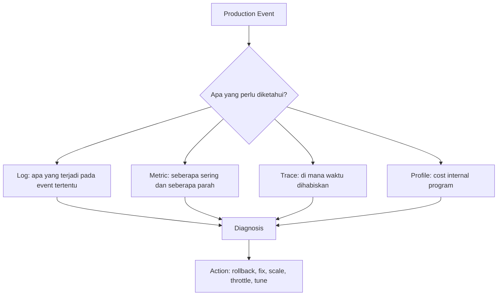
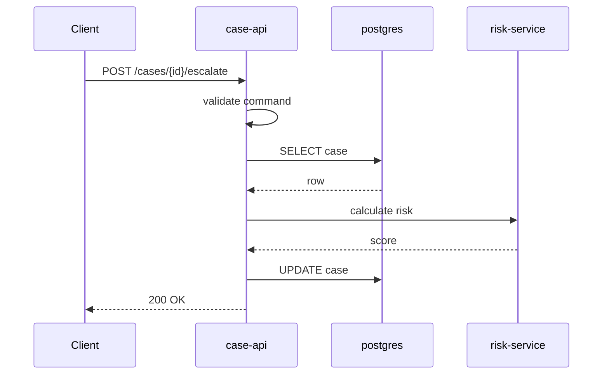
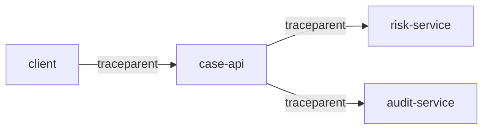
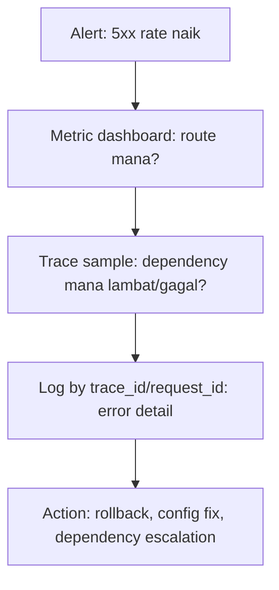
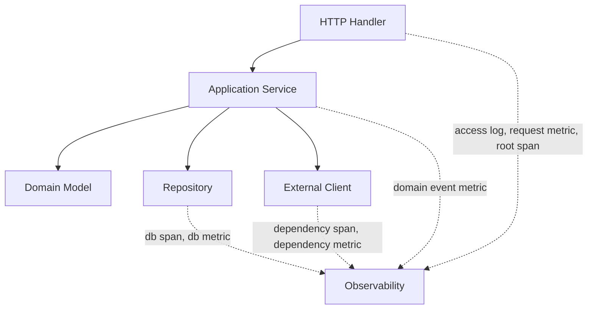

# Logging, Metrics, Tracing, dan Observability

Service yang tidak bisa diamati adalah service yang tidak benar-benar bisa dioperasikan.

Di development lokal, kita bisa menambahkan `fmt.Println`, menjalankan debugger, atau membaca error langsung dari terminal. Di production, realitasnya berbeda:

- request datang paralel;
- failure terjadi sporadis;
- dependency lambat hanya pada percentile tertentu;
- error terjadi di boundary antar-service;
- satu incident bisa melibatkan load balancer, service, database, cache, queue, worker, dan third-party API;
- bug sering tidak bisa direproduksi dengan mudah.

Karena itu, observability bukan kosmetik. Observability adalah kemampuan sistem untuk menjawab pertanyaan operasional berdasarkan signal yang diekspos sistem.

Dalam Go, observability yang baik biasanya dibangun dari kombinasi:

1. **structured logging** untuk event dan konteks detail;
2. **metrics** untuk agregasi numerik dan alerting;
3. **tracing** untuk perjalanan request lintas boundary;
4. **profiling** untuk cost internal runtime dan performa;
5. **health/readiness signal** untuk orkestrasi;
6. **runbook** untuk menghubungkan signal dengan tindakan.

Part ini fokus pada tiga pilar utama: **logging, metrics, dan tracing**. Profiling akan dibahas lebih dalam pada Part 24.

---

## Target Pembelajaran

Setelah menyelesaikan part ini, kita harus mampu:

1. Membedakan logging, metrics, tracing, profiling, dan health check.
2. Menulis structured log dengan `log/slog` secara idiomatik.
3. Mendesain field log yang stabil dan berguna untuk debugging.
4. Menyebarkan correlation ID atau request ID melalui `context.Context`.
5. Mendesain metrics berdasarkan RED dan USE method.
6. Menghindari high-cardinality metrics.
7. Membuat trace span untuk boundary penting.
8. Menghubungkan log, metrics, dan trace dalam satu mental model incident.
9. Mendesain observability untuk service Go tanpa mencampur domain logic dengan vendor-specific code.
10. Membuat checklist observability untuk code review.

---

## Hubungan dengan Framework Kaufman

Dalam kerangka Josh Kaufman, observability berperan sebagai **feedback loop**.

Tanpa feedback, latihan kita hanya menghasilkan rasa familiar. Dengan feedback, kita bisa mengoreksi model mental.

- **Learn enough to self-correct**: log, metrics, dan trace membuat kita tahu apakah asumsi desain benar.
- **Practice deliberately**: kita tidak hanya menulis endpoint, tetapi mengukur latency, error, dan dependency behavior.
- **Remove barriers to practice**: instrumentasi standar membuat debugging tidak bergantung pada ingatan individu.

Engineer yang matang tidak bertanya “kenapa service error?” dengan kosong. Ia bertanya:

- endpoint mana yang error;
- berapa ratenya;
- sejak kapan;
- dependency mana yang ikut lambat;
- request mana yang representatif;
- apakah rollback, retry, atau throttling lebih aman;
- bukti apa yang mendukung keputusan itu.

Observability memberi bahasa untuk menjawab pertanyaan tersebut.

---

## Mental Model: Observability adalah Kontrak Diagnostik

Observability bukan sekadar memasang library. Observability adalah kontrak bahwa service akan menjelaskan perilakunya kepada operator.



Setiap signal menjawab jenis pertanyaan yang berbeda.

| Signal | Pertanyaan Utama | Contoh |
|---|---|---|
| Log | Apa yang terjadi pada event/request tertentu? | Request gagal karena validasi status case tidak valid |
| Metric | Berapa banyak, seberapa cepat, seberapa sering? | Error rate naik dari 0.1% ke 5% |
| Trace | Di boundary mana latency terjadi? | 800ms habis di call ke payment service |
| Profile | Fungsi mana yang mahal secara CPU/memory/blocking? | 40% CPU habis di JSON marshal |
| Health | Apakah instance siap menerima traffic? | Database connection belum siap |

Kesalahan umum adalah memakai satu signal untuk semua hal:

- memakai log untuk alert numerik;
- memakai metrics untuk detail request individual;
- memakai trace untuk setiap event kecil;
- memakai health check untuk mendeteksi semua jenis degradasi;
- memakai profiling untuk menggantikan metrics production.

Observability yang baik justru memisahkan tanggung jawab signal.

---

## Observability vs Monitoring

Monitoring biasanya berarti sistem memberi tahu ketika kondisi tertentu terjadi.

Observability lebih luas: sistem menyediakan signal agar kita bisa bertanya hal baru tanpa harus deploy ulang.

Contoh monitoring:

```txt
HTTP 5xx rate > 2% selama 5 menit
```

Contoh observability:

```txt
Untuk request yang gagal pada endpoint /cases/{id}/escalate,
lihat apakah failure didominasi validation, dependency timeout, lock contention,
atau database conflict.
```

Monitoring menjawab: “ada masalah”.

Observability membantu menjawab: “masalahnya di mana, kenapa, dan apa tindakan yang aman”.

---

## Pilar 1: Structured Logging

Go modern memiliki package standard library `log/slog` untuk structured logging. Dibanding log string bebas, structured log menyimpan event sebagai message, level, timestamp, dan key-value attributes.

Contoh log string bebas:

```txt
failed to create case for user 123 because db timeout
```

Contoh structured log:

```json
{
  "time": "2026-06-27T10:15:30Z",
  "level": "ERROR",
  "msg": "failed to create case",
  "user_id": "123",
  "operation": "case.create",
  "error": "db timeout",
  "retryable": true
}
```

Perbedaannya besar.

Structured log bisa difilter dengan stabil:

```txt
operation = case.create AND retryable = true AND level = ERROR
```

String log sulit difilter karena formatnya tidak konsisten.

---

## Menggunakan `log/slog`

Contoh paling dasar:

```go
package main

import (
    "log/slog"
    "os"
)

func main() {
    logger := slog.New(slog.NewJSONHandler(os.Stdout, &slog.HandlerOptions{
        Level: slog.LevelInfo,
    }))

    logger.Info("service started",
        slog.String("service", "case-api"),
        slog.String("env", "local"),
    )
}
```

Output JSON lebih cocok untuk production karena mudah diparse oleh log collector.

Untuk development lokal, text handler sering lebih nyaman:

```go
logger := slog.New(slog.NewTextHandler(os.Stdout, &slog.HandlerOptions{
    Level: slog.LevelDebug,
}))
```

Rule praktis:

- gunakan JSON handler di production;
- gunakan text handler di local jika lebih mudah dibaca;
- jangan ubah schema field antar-environment;
- jangan membuat wrapper logging terlalu kompleks sejak awal.

---

## Level Logging

Level log bukan dekorasi. Level adalah sinyal urgensi dan ekspektasi tindakan.

| Level | Makna | Contoh |
|---|---|---|
| DEBUG | Detail diagnostik rendah, biasanya off di production | Parsed filter query |
| INFO | Event normal yang penting secara operasional | Service started, migration completed |
| WARN | Kondisi abnormal tetapi masih recoverable | Retry dependency call, deprecated field used |
| ERROR | Failure yang menggagalkan operasi | Create case failed karena database timeout |

Kesalahan umum:

- semua hal dilog sebagai `Info`;
- validation error user dilog sebagai `Error` terlalu sering;
- retry attempt dilog sebagai `Error` padahal final outcome sukses;
- panic dilog dua kali: saat terjadi dan saat recovery;
- log level dipakai untuk menyembunyikan desain error yang buruk.

Gunakan rule ini:

```txt
Log ERROR hanya jika operasi gagal dari perspektif caller atau sistem perlu investigasi.
```

Contoh buruk:

```go
logger.Error("invalid request", slog.Any("error", err))
```

Jika invalid request adalah input user biasa, lebih cocok:

```go
logger.Info("request rejected",
    slog.String("reason", "invalid_payload"),
    slog.String("operation", "case.create"),
)
```

Atau bahkan tidak perlu log detail jika metric `http_requests_total{status="400"}` sudah cukup.

---

## Field Log yang Baik

Field log harus stabil, rendah noise, dan mendukung query.

Field umum untuk service backend:

| Field | Contoh | Catatan |
|---|---|---|
| `service` | `case-api` | Nama service |
| `env` | `prod` | Environment |
| `version` | `1.4.2` | Build/release version |
| `request_id` | `req_abc` | Correlation per request |
| `trace_id` | `4bf92f...` | Korelasi dengan tracing |
| `operation` | `case.escalate` | Nama operasi stabil |
| `method` | `POST` | HTTP method |
| `path_template` | `/cases/{id}/escalate` | Bukan raw path jika mengandung ID |
| `status` | `500` | HTTP status |
| `duration_ms` | `31` | Durasi operation |
| `error_kind` | `dependency_timeout` | Lebih queryable dari error text |
| `dependency` | `postgres` | Boundary eksternal |

Field yang perlu dihindari:

- raw authorization header;
- password;
- token;
- full payload user;
- PII tanpa alasan dan kontrol;
- raw path dengan ID jika dipakai sebagai label metric;
- error text yang mengandung secret;
- field dinamis yang membuat schema tidak stabil.

---

## Logger sebagai Dependency

Ada dua pendekatan umum:

1. Logger global.
2. Logger di-inject ke service.

Untuk service kecil, global default logger bisa diterima. Untuk codebase production, lebih baik logger eksplisit di boundary aplikasi.

```go
type CaseService struct {
    repo   CaseRepository
    logger *slog.Logger
}

func NewCaseService(repo CaseRepository, logger *slog.Logger) *CaseService {
    return &CaseService{
        repo:   repo,
        logger: logger.With(slog.String("component", "case_service")),
    }
}
```

Dengan `.With`, kita menambahkan field kontekstual yang ikut di semua log dari komponen tersebut.

```go
s.logger.InfoContext(ctx, "case escalation requested",
    slog.String("operation", "case.escalate"),
    slog.String("case_id", caseID),
)
```

Gunakan `InfoContext`, `ErrorContext`, dan sejenisnya agar handler logger bisa mengambil metadata dari context jika dibutuhkan.

---

## Contextual Logging

Request-scoped data seperti `request_id` dan `trace_id` sering hidup di `context.Context`.

Namun hati-hati: `context.Context` bukan tempat semua hal.

Yang boleh masuk context:

- request ID;
- trace/span context;
- auth principal minimal;
- deadline/cancellation;
- metadata lintas boundary.

Yang tidak cocok masuk context:

- database handle;
- logger sebagai dependency utama;
- config;
- service object;
- optional parameter bisnis;
- data domain besar.

Contoh minimal request ID:

```go
package requestid

import "context"

type key struct{}

func With(ctx context.Context, id string) context.Context {
    return context.WithValue(ctx, key{}, id)
}

func From(ctx context.Context) (string, bool) {
    id, ok := ctx.Value(key{}).(string)
    return id, ok
}
```

Middleware:

```go
func RequestID(next http.Handler) http.Handler {
    return http.HandlerFunc(func(w http.ResponseWriter, r *http.Request) {
        id := r.Header.Get("X-Request-ID")
        if id == "" {
            id = newRequestID()
        }

        w.Header().Set("X-Request-ID", id)
        ctx := requestid.With(r.Context(), id)
        next.ServeHTTP(w, r.WithContext(ctx))
    })
}
```

Logger usage:

```go
func LogRequest(logger *slog.Logger, r *http.Request, status int, duration time.Duration) {
    attrs := []slog.Attr{
        slog.String("method", r.Method),
        slog.String("path", r.URL.Path),
        slog.Int("status", status),
        slog.Int64("duration_ms", duration.Milliseconds()),
    }

    if id, ok := requestid.From(r.Context()); ok {
        attrs = append(attrs, slog.String("request_id", id))
    }

    logger.LogAttrs(r.Context(), slog.LevelInfo, "http request completed", attrs...)
}
```

Untuk production, gunakan `path_template`, bukan raw path, agar log tetap mudah dikelompokkan.

---

## Middleware Logging HTTP

Kita perlu menangkap status code dan duration. `http.ResponseWriter` tidak menyimpan status code secara langsung, jadi kita buat wrapper.

```go
type statusRecorder struct {
    http.ResponseWriter
    status int
    bytes  int
}

func (r *statusRecorder) WriteHeader(code int) {
    r.status = code
    r.ResponseWriter.WriteHeader(code)
}

func (r *statusRecorder) Write(b []byte) (int, error) {
    if r.status == 0 {
        r.status = http.StatusOK
    }
    n, err := r.ResponseWriter.Write(b)
    r.bytes += n
    return n, err
}
```

Middleware:

```go
func AccessLog(logger *slog.Logger, next http.Handler) http.Handler {
    return http.HandlerFunc(func(w http.ResponseWriter, r *http.Request) {
        start := time.Now()
        rec := &statusRecorder{ResponseWriter: w}

        next.ServeHTTP(rec, r)

        status := rec.status
        if status == 0 {
            status = http.StatusOK
        }

        level := slog.LevelInfo
        if status >= 500 {
            level = slog.LevelError
        } else if status >= 400 {
            level = slog.LevelInfo
        }

        logger.LogAttrs(r.Context(), level, "http request completed",
            slog.String("method", r.Method),
            slog.String("path", r.URL.Path),
            slog.Int("status", status),
            slog.Int("bytes", rec.bytes),
            slog.Int64("duration_ms", time.Since(start).Milliseconds()),
        )
    })
}
```

Catatan penting:

- 4xx tidak otomatis error operasional;
- 5xx biasanya error operasional;
- log body request hanya dengan alasan kuat;
- log response body hampir selalu buruk;
- sampling mungkin dibutuhkan untuk endpoint sangat ramai.

---

## Error Logging: Jangan Double Log

Kesalahan umum Go service adalah melog error di semua layer.

```go
func (r *Repo) Save(ctx context.Context, c Case) error {
    if err := r.db.Save(ctx, c); err != nil {
        r.logger.Error("save failed", slog.Any("error", err))
        return err
    }
    return nil
}

func (s *Service) Create(ctx context.Context, cmd CreateCase) error {
    if err := s.repo.Save(ctx, c); err != nil {
        s.logger.Error("create failed", slog.Any("error", err))
        return err
    }
    return nil
}
```

Hasilnya satu failure menghasilkan banyak log error. Ini membuat incident noisy.

Pendekatan lebih baik:

- layer bawah menambahkan context ke error;
- boundary atas memutuskan log dan response;
- error taxonomy dipakai untuk level dan field.

```go
func (r *Repo) Save(ctx context.Context, c Case) error {
    if err := r.db.Save(ctx, c); err != nil {
        return fmt.Errorf("save case: %w", err)
    }
    return nil
}

func (h *Handler) ServeHTTP(w http.ResponseWriter, r *http.Request) {
    if err := h.service.Create(r.Context(), cmd); err != nil {
        h.logger.ErrorContext(r.Context(), "create case failed",
            slog.String("operation", "case.create"),
            slog.String("error_kind", classify(err)),
            slog.Any("error", err),
        )
        writeError(w, err)
        return
    }
}
```

Rule praktis:

```txt
Log error sekali di boundary yang punya konteks aksi dan konsekuensi.
```

---

## Redaction dan Data Sensitif

Production log sering dikirim ke sistem terpusat. Sekali secret masuk log, ia bisa bertahan lama di storage, backup, index, dan dashboard.

Jangan log:

- password;
- access token;
- refresh token;
- session cookie;
- private key;
- OTP;
- raw Authorization header;
- full card number;
- data personal tanpa kebutuhan jelas.

Buat type yang aman saat dilog.

```go
type Secret string

func (s Secret) LogValue() slog.Value {
    if s == "" {
        return slog.StringValue("")
    }
    return slog.StringValue("<redacted>")
}
```

`log/slog` mendukung `LogValuer`, sehingga type bisa mengontrol representasi log-nya.

```go
logger.Info("config loaded",
    slog.Any("db_password", Secret(cfg.DBPassword)),
)
```

Output:

```json
{"msg":"config loaded","db_password":"<redacted>"}
```

Ini bukan pengganti security policy, tapi guardrail yang membantu.

---

## Pilar 2: Metrics

Metrics adalah data numerik yang diagregasi berdasarkan waktu.

Metrics cocok untuk:

- alerting;
- dashboard;
- trend;
- capacity planning;
- regression detection;
- SLO/SLA tracking;
- deployment comparison.

Metrics tidak cocok untuk:

- detail payload request;
- stack trace individual;
- penjelasan panjang;
- high-cardinality detail seperti `user_id`;
- menggantikan log error.

---

## Jenis Metrics

Secara umum, kita akan sering memakai:

| Jenis | Makna | Contoh |
|---|---|---|
| Counter | Nilai naik terus | jumlah request total |
| Gauge | Nilai naik turun | jumlah goroutine saat ini |
| Histogram | Distribusi nilai | latency request |
| Summary | Distribusi dengan perhitungan client-side | jarang dipakai di sistem agregasi modern |

Contoh metrics HTTP:

```txt
http_requests_total{method="POST", route="/cases", status="201"} 12345
http_request_duration_seconds_bucket{route="/cases", le="0.1"} 12000
http_request_duration_seconds_bucket{route="/cases", le="0.5"} 12300
go_goroutines 128
```

Perhatikan label `route`, bukan raw path.

Buruk:

```txt
http_requests_total{path="/cases/12345"}
http_requests_total{path="/cases/67890"}
```

Ini menciptakan cardinality tinggi.

Baik:

```txt
http_requests_total{route="/cases/{id}"}
```

---

## Cardinality: Musuh Tersembunyi Metrics

Cardinality adalah jumlah kombinasi label unik.

Metric ini tampak masuk akal:

```txt
case_update_total{tenant_id="t-123", user_id="u-456", case_id="c-789", status="approved"}
```

Tetapi jika `tenant_id`, `user_id`, dan `case_id` sangat bervariasi, jumlah time series meledak.

Dampaknya:

- storage mahal;
- query lambat;
- monitoring system overload;
- dashboard tidak responsif;
- alert tidak stabil.

Rule praktis:

```txt
Label metric harus berdomain kecil dan stabil.
```

Label yang biasanya aman:

- method;
- route template;
- status class;
- dependency name;
- operation name;
- result type;
- error kind yang terbatas.

Label yang biasanya berbahaya:

- user ID;
- request ID;
- trace ID;
- email;
- raw URL;
- case ID;
- order ID;
- arbitrary error message;
- tenant ID, kecuali jumlah tenant kecil dan memang sengaja diobservasi.

Jika perlu mencari request individual, gunakan log atau trace, bukan label metric.

---

## RED Method untuk Service Request

RED adalah pendekatan umum untuk mengamati service request-response.

RED = Rate, Errors, Duration.

| Signal | Pertanyaan | Metric |
|---|---|---|
| Rate | Berapa request per detik? | `http_requests_total` |
| Errors | Berapa request gagal? | `http_requests_total{status=~"5.."}` |
| Duration | Seberapa lambat? | `http_request_duration_seconds` |

Untuk endpoint:

```txt
POST /cases/{id}/escalate
```

kita ingin tahu:

- berapa call per menit;
- berapa 2xx, 4xx, 5xx;
- p50/p90/p95/p99 latency;
- apakah latency naik setelah deploy;
- apakah error terkonsentrasi pada dependency tertentu.

Metrics minimal:

```txt
http_requests_total{method, route, status}
http_request_duration_seconds{method, route, status_class}
```

Status class sering lebih stabil dari status code individual:

```txt
status_class="2xx"
status_class="4xx"
status_class="5xx"
```

---

## USE Method untuk Resource

USE cocok untuk resource-level observability.

USE = Utilization, Saturation, Errors.

| Signal | Pertanyaan | Contoh |
|---|---|---|
| Utilization | Seberapa sibuk resource? | CPU usage, DB pool in use |
| Saturation | Seberapa banyak antrean/tekanan? | goroutine blocked, queue length |
| Errors | Apakah resource gagal? | connection error, timeout |

Untuk Go service, resource penting:

- CPU;
- memory;
- goroutine;
- GC;
- database pool;
- HTTP client transport;
- worker queue;
- message consumer lag;
- mutex/blocking hotspot;
- file descriptor;
- outbound dependency.

Contoh metrics DB pool:

```txt
db_pool_open_connections
db_pool_in_use_connections
db_pool_idle_connections
db_query_duration_seconds{operation}
db_query_errors_total{operation,error_kind}
```

---

## Domain Metrics

Selain technical metrics, service juga butuh domain metrics.

Untuk sistem enforcement lifecycle, contoh domain metrics:

```txt
cases_created_total{source}
cases_escalated_total{from_status,to_status,reason_kind}
case_transition_rejected_total{from_status,to_status,reason_kind}
sla_breach_total{stage}
case_backlog_current{stage,priority}
```

Domain metrics harus dirancang hati-hati. Mereka sering menjadi signal bisnis dan operasional.

Pertanyaan desain:

1. Apakah metric ini menjawab keputusan operasional?
2. Apakah label-nya bounded?
3. Apakah definisinya stabil lintas release?
4. Apakah counter naik tepat sekali per event domain?
5. Apakah metric bisa direkonsiliasi dengan database?
6. Apakah alert-nya actionable?

Metric buruk:

```txt
case_status_total{case_id="C-123", user="alice@example.com", status="review"}
```

Metric lebih baik:

```txt
case_backlog_current{stage="review", priority="high"}
```

---

## Instrumentasi Metrics Tanpa Mengotori Domain

Jangan menaruh vendor-specific metrics code di seluruh domain logic.

Buruk:

```go
func (s *CaseService) Escalate(ctx context.Context, id string) error {
    prometheus.MustCurryWith(...)
    datadog.Incr(...)
    vendor.Track(...)

    // business logic
}
```

Lebih baik gunakan interface kecil:

```go
type CaseMetrics interface {
    RecordEscalation(ctx context.Context, from, to, reason string)
    RecordTransitionRejected(ctx context.Context, from, to, reason string)
}
```

Service:

```go
type CaseService struct {
    repo    CaseRepository
    metrics CaseMetrics
}

func (s *CaseService) Escalate(ctx context.Context, id string, reason string) error {
    c, err := s.repo.Find(ctx, id)
    if err != nil {
        return fmt.Errorf("find case: %w", err)
    }

    from := c.Status
    if err := c.Escalate(reason); err != nil {
        s.metrics.RecordTransitionRejected(ctx, string(from), "escalated", classifyReject(err))
        return err
    }

    if err := s.repo.Save(ctx, c); err != nil {
        return fmt.Errorf("save case: %w", err)
    }

    s.metrics.RecordEscalation(ctx, string(from), string(c.Status), reasonKind(reason))
    return nil
}
```

Domain tetap bersih. Adapter metrics bisa diganti tanpa mengubah business rule.

---

## Pilar 3: Tracing

Tracing menjawab pertanyaan:

```txt
Untuk satu request, waktu habis di mana?
```

Trace terdiri dari span. Span merepresentasikan satu unit pekerjaan, misalnya:

- menerima HTTP request;
- validasi payload;
- query database;
- call service lain;
- publish event;
- menjalankan worker job.



Trace membantu melihat durasi masing-masing langkah:

```txt
HTTP POST /cases/{id}/escalate     950ms
  validate command                  2ms
  db.select_case                   20ms
  risk.calculate                  800ms
  db.update_case                   30ms
  encode response                   1ms
```

Tanpa trace, kita mungkin hanya tahu endpoint lambat. Dengan trace, kita tahu boundary mana yang lambat.

---

## Span yang Baik

Span harus mewakili boundary yang meaningful.

Span yang baik:

- HTTP inbound request;
- HTTP outbound dependency;
- database query logical operation;
- message publish/consume;
- background job;
- expensive computation;
- lock acquisition jika benar-benar penting;
- external API call.

Span yang buruk:

- setiap function kecil;
- setiap `if` branch;
- setiap line code;
- domain method murni yang sangat murah;
- span dengan nama dinamis seperti `case-123-update`.

Nama span harus stabil:

```txt
case.escalate
postgres.case.select
risk.calculate
queue.case_event.publish
```

Bukan:

```txt
escalate case C-123 by user U-999
```

Detail dinamis masuk attribute, bukan nama span.

---

## Trace Context Propagation

Tracing bergantung pada propagation. Jika service A memanggil service B, trace context harus dikirim ke B agar satu request terlihat utuh.

Biasanya propagation terjadi melalui HTTP headers seperti `traceparent`.



Di Go, propagation hampir selalu lewat `context.Context`.

Pattern-nya:

```go
func (s *Service) Escalate(ctx context.Context, cmd EscalateCommand) error {
    ctx, span := s.tracer.Start(ctx, "case.escalate")
    defer span.End()

    // pass ctx to repository and clients
    c, err := s.repo.Find(ctx, cmd.CaseID)
    if err != nil {
        span.RecordError(err)
        return err
    }

    if err := s.riskClient.Calculate(ctx, c); err != nil {
        span.RecordError(err)
        return err
    }

    return nil
}
```

Even jika kita belum memasang vendor tracing penuh, desain API dengan `ctx` membuat sistem siap diinstrumentasi.

---

## Correlation ID, Request ID, Trace ID

Istilah ini sering tercampur.

| ID | Makna | Scope |
|---|---|---|
| Request ID | ID unik untuk request tertentu di satu boundary | Biasanya HTTP request |
| Correlation ID | ID yang menghubungkan beberapa event/operation terkait | Bisa lintas service atau workflow |
| Trace ID | ID trace distributed tracing | Lintas span/service |
| Span ID | ID satu span dalam trace | Unit kerja tertentu |

Dalam sistem sederhana, request ID bisa cukup.

Dalam microservices, trace ID lebih kuat.

Dalam workflow panjang seperti case lifecycle, correlation ID domain juga penting:

```txt
case_id = C-2026-001
correlation_id = enforcement-run-2026-06-27-001
trace_id = 4bf92f3577b34da6a3ce929d0e0e4736
request_id = req_abc123
```

Jangan gunakan satu ID untuk semua makna jika lifecycle-nya berbeda.

---

## Menghubungkan Log, Metrics, dan Trace

Observability matang bukan berarti punya tiga dashboard terpisah. Signal harus bisa saling menunjuk.



Contoh alur incident:

1. Alert berbunyi: `case-api` 5xx rate > 2%.
2. Dashboard menunjukkan endpoint `POST /cases/{id}/escalate` dominan.
3. Trace menunjukkan span `risk.calculate` sering timeout.
4. Log dengan `trace_id` menunjukkan dependency error kind `risk_timeout`.
5. Metrics dependency menunjukkan p95 risk-service naik dari 100ms ke 2s.
6. Tindakan: aktifkan fallback, turunkan concurrency, atau rollback integrasi.

Tanpa korelasi antar-signal, investigasi menjadi tebak-tebakan.

---

## Observability dalam Layered Architecture

Instrumentasi sebaiknya ada di boundary.



Prinsip:

- handler: request log, HTTP metric, root span;
- repository: query metric/span, not business log;
- external client: dependency metric/span, retry metadata;
- service: domain metrics dan operation-level log;
- domain model: sebaiknya bebas observability concern.

Domain yang memanggil logger langsung biasanya menjadi sulit dites dan terlalu terikat infrastruktur.

---

## HTTP Observability Middleware: Skeleton

Berikut skeleton middleware observability tanpa mengikat ke vendor metrics tertentu.

```go
type HTTPMetrics interface {
    RecordRequest(ctx context.Context, method, route string, status int, duration time.Duration)
}

type RouteNamer interface {
    RouteName(r *http.Request) string
}

type ObservabilityMiddleware struct {
    logger  *slog.Logger
    metrics HTTPMetrics
    routes  RouteNamer
}

func (m ObservabilityMiddleware) Wrap(next http.Handler) http.Handler {
    return http.HandlerFunc(func(w http.ResponseWriter, r *http.Request) {
        start := time.Now()
        rec := &statusRecorder{ResponseWriter: w}

        next.ServeHTTP(rec, r)

        status := rec.status
        if status == 0 {
            status = http.StatusOK
        }

        route := m.routes.RouteName(r)
        duration := time.Since(start)

        m.metrics.RecordRequest(r.Context(), r.Method, route, status, duration)

        attrs := []slog.Attr{
            slog.String("method", r.Method),
            slog.String("route", route),
            slog.Int("status", status),
            slog.Int64("duration_ms", duration.Milliseconds()),
        }

        if id, ok := requestid.From(r.Context()); ok {
            attrs = append(attrs, slog.String("request_id", id))
        }

        level := slog.LevelInfo
        if status >= 500 {
            level = slog.LevelError
        }

        m.logger.LogAttrs(r.Context(), level, "http request completed", attrs...)
    })
}
```

Perhatikan separation of concerns:

- middleware tahu HTTP;
- metrics adapter tahu backend metrics;
- logger tahu format log;
- domain tidak tahu detail observability transport.

---

## Dependency Client Observability

Outbound dependency adalah sumber failure utama pada sistem distributed.

Setiap dependency client harus menjawab:

- dependency mana yang dipanggil;
- operation apa;
- berapa latency;
- berapa error;
- apakah timeout;
- apakah retry;
- apakah final outcome sukses;
- berapa response size jika relevan.

Contoh:

```go
type RiskClient struct {
    baseURL string
    http    *http.Client
    logger  *slog.Logger
    metrics DependencyMetrics
}

func (c *RiskClient) Calculate(ctx context.Context, caseID string) (RiskScore, error) {
    start := time.Now()
    operation := "risk.calculate"

    req, err := http.NewRequestWithContext(ctx, http.MethodPost, c.baseURL+"/risk/calculate", nil)
    if err != nil {
        return RiskScore{}, fmt.Errorf("build risk request: %w", err)
    }

    resp, err := c.http.Do(req)
    duration := time.Since(start)

    if err != nil {
        c.metrics.RecordDependency(ctx, "risk-service", operation, "error", duration)
        c.logger.WarnContext(ctx, "dependency call failed",
            slog.String("dependency", "risk-service"),
            slog.String("operation", operation),
            slog.String("error_kind", classifyHTTPClientError(err)),
            slog.Int64("duration_ms", duration.Milliseconds()),
            slog.Any("error", err),
        )
        return RiskScore{}, fmt.Errorf("call risk service: %w", err)
    }
    defer resp.Body.Close()

    if resp.StatusCode >= 500 {
        c.metrics.RecordDependency(ctx, "risk-service", operation, "5xx", duration)
        return RiskScore{}, fmt.Errorf("risk service status: %d", resp.StatusCode)
    }

    c.metrics.RecordDependency(ctx, "risk-service", operation, "success", duration)
    // decode response
    return RiskScore{}, nil
}
```

Catatan:

- dependency log sebaiknya `Warn` jika retry atau fallback masih mungkin;
- final operation failure bisa dilog `Error` di boundary atas;
- dependency metrics harus ada meskipun log disampling.

---

## Metrics untuk Worker dan Queue

Service Go sering menjalankan background worker.

Worker observability berbeda dari HTTP.

Metrics penting:

```txt
worker_jobs_started_total{worker,job_type}
worker_jobs_completed_total{worker,job_type,result}
worker_job_duration_seconds{worker,job_type,result}
worker_inflight_jobs{worker}
worker_queue_depth{queue}
worker_retries_total{worker,job_type,reason}
worker_deadletter_total{queue,reason_kind}
```

Log penting:

- worker started;
- job started jika low volume atau sampled;
- job failed final;
- retry scheduled;
- poison message detected;
- dead-letter event;
- worker shutdown completed.

Trace penting:

- consume message span;
- process job span;
- dependency calls;
- publish next event.

Jangan lupa correlation ID dari message.

```go
type Message struct {
    ID            string
    Type          string
    CorrelationID string
    Payload       []byte
}
```

Saat worker memproses message, masukkan correlation ID ke context/log/trace.

---

## Observability dan Sampling

Tidak semua signal harus disimpan penuh.

Sampling berguna ketika:

- traffic sangat tinggi;
- log volume mahal;
- debug log terlalu banyak;
- trace semua request terlalu berat;
- ada endpoint high throughput.

Tetapi sampling harus hati-hati.

Jangan sampling:

- semua error fatal;
- security audit event penting;
- financial/legal/regulatory decision event;
- irreversible command;
- state transition penting.

Boleh sampling:

- access log sukses high-volume;
- debug detail internal;
- trace request sukses normal;
- noisy dependency retry yang sudah punya metrics.

Untuk sistem regulatori, beberapa event harus diperlakukan sebagai audit trail, bukan sekadar log observability. Audit trail punya requirement berbeda: integrity, retention, immutability, access control, dan legal defensibility.

---

## Observability vs Audit Trail

Ini perbedaan penting.

| Aspek | Observability Log | Audit Trail |
|---|---|---|
| Tujuan | Debugging dan operasi | Bukti keputusan/perubahan |
| Retention | Berdasarkan kebutuhan operasional | Berdasarkan regulasi/kebijakan |
| Mutability | Bisa ephemeral/indexed | Sebaiknya immutable/append-only |
| Isi | Technical context | Actor, action, before/after, reason |
| Akses | Engineer/operator | Terkontrol, legal/compliance |
| Sampling | Kadang boleh | Umumnya tidak boleh |

Jangan menganggap log biasa cukup untuk audit trail.

Contoh audit event:

```json
{
  "event_type": "case.status_changed",
  "case_id": "C-123",
  "actor_id": "U-456",
  "from_status": "under_review",
  "to_status": "escalated",
  "reason_code": "high_risk_signal",
  "occurred_at": "2026-06-27T10:15:30Z",
  "request_id": "req_abc",
  "trace_id": "4bf92f..."
}
```

Audit event boleh dikorelasikan dengan log/trace, tetapi jangan digantikan oleh log/trace.

---

## Alerting: Signal Harus Actionable

Observability tanpa alerting masih berguna untuk debugging. Tetapi production service juga butuh alert yang actionable.

Alert buruk:

```txt
CPU > 80%
```

Kenapa buruk? Bisa jadi normal saat batch job, bisa jadi tidak berdampak user, bisa jadi autoscaling sedang bekerja.

Alert lebih baik:

```txt
case-api 5xx rate > 2% for 5 minutes on production
```

Alert lebih baik lagi jika dikaitkan dengan SLO:

```txt
case-api availability burn rate indicates 2% monthly error budget consumption in 1 hour
```

Rule alert:

1. Alert harus punya tindakan jelas.
2. Alert harus menunjukkan user impact atau risiko production nyata.
3. Alert tidak boleh hanya menandakan curiosity.
4. Alert harus punya owner.
5. Alert harus punya runbook.
6. Alert harus diuji.

Dashboard boleh banyak. Alert harus selektif.

---

## SLO dan Error Budget

SLO adalah target reliability yang bisa diukur.

Contoh:

```txt
99.9% request POST /cases/{id}/escalate berhasil tanpa 5xx dalam 30 hari.
95% request selesai di bawah 300ms.
99% request selesai di bawah 1s.
```

Error budget adalah ruang gagal yang masih diterima.

Jika SLO 99.9%, error budget adalah 0.1%.

Observability memberi data untuk menjawab:

- apakah kita sedang membakar error budget terlalu cepat;
- apakah deployment baru memperburuk SLO;
- apakah optimasi perlu diprioritaskan;
- apakah feature rollout harus dihentikan.

SLO mengubah observability dari “lihat-lihat dashboard” menjadi alat pengambilan keputusan.

---

## Common Observability Anti-patterns

### 1. Log Everything

Melog semua hal menghasilkan noise, biaya tinggi, dan informasi sulit ditemukan.

Lebih baik:

- log event penting;
- gunakan metrics untuk agregasi;
- gunakan trace untuk alur request;
- gunakan debug log terbatas atau sampling.

### 2. No Context

Log seperti ini hampir tidak berguna:

```txt
failed
```

Log harus menjawab minimal:

- operation apa;
- entity apa jika aman;
- error kind apa;
- request/correlation ID apa;
- dependency apa;
- outcome apa.

### 3. Dynamic Metric Labels

Metric dengan label `user_id`, `request_id`, atau raw path membuat cardinality meledak.

### 4. Vendor Lock-in di Domain

Jika domain logic langsung memanggil vendor observability SDK, refactor akan mahal.

### 5. Double Logging Error

Satu error dilog di repository, service, handler, middleware, dan recovery. Incident menjadi noisy.

### 6. Missing Failure Metrics

Hanya mengukur request sukses membuat sistem terlihat sehat padahal failure meningkat.

### 7. Alert on Symptoms yang Tidak Actionable

Alert harus mendorong tindakan, bukan hanya membuat engineer membuka dashboard.

### 8. No Runbook

Signal tanpa runbook membuat on-call harus mengingat semuanya saat stress.

---

## Code Review Checklist Observability

Gunakan checklist ini saat review service Go.

### Logging

- Apakah log menggunakan structured fields?
- Apakah error dilog sekali di boundary yang tepat?
- Apakah ada `request_id`, `trace_id`, atau `correlation_id`?
- Apakah field log stabil?
- Apakah secret/PII tidak bocor?
- Apakah level log masuk akal?
- Apakah validation error user tidak dianggap incident error?

### Metrics

- Apakah setiap endpoint punya rate, error, duration?
- Apakah route memakai template, bukan raw path?
- Apakah label cardinality bounded?
- Apakah dependency call punya latency/error metric?
- Apakah worker/queue punya metrics?
- Apakah domain metrics memiliki definisi stabil?

### Tracing

- Apakah request context diteruskan ke dependency?
- Apakah span dibuat pada boundary meaningful?
- Apakah span name stabil?
- Apakah error direkam pada span yang relevan?
- Apakah outbound propagation aktif?

### Operations

- Apakah dashboard menjawab pertanyaan incident utama?
- Apakah alert actionable?
- Apakah runbook tersedia?
- Apakah signal cukup untuk rollback/fix decision?

---

## Latihan Praktik

### Latihan 1: Tambahkan Structured Access Log

Ambil HTTP service dari part sebelumnya. Tambahkan middleware yang mencatat:

- method;
- route;
- status;
- duration;
- request ID;
- bytes written.

Acceptance criteria:

- output JSON di production mode;
- 5xx dilog sebagai error;
- 4xx tidak dilog sebagai error;
- tidak ada request body penuh di log.

---

### Latihan 2: Buat Metrics Interface

Buat interface:

```go
type HTTPMetrics interface {
    RecordRequest(ctx context.Context, method, route string, status int, duration time.Duration)
}
```

Implementasikan fake metrics untuk test.

Acceptance criteria:

- handler/middleware tidak bergantung ke vendor metrics;
- route memakai template;
- status dikonversi ke bounded label jika perlu.

---

### Latihan 3: Tambahkan Dependency Observability

Pada HTTP client outbound, catat:

- dependency name;
- operation;
- duration;
- result: success, timeout, 4xx, 5xx, network_error.

Acceptance criteria:

- timeout terlihat berbeda dari 500;
- context cancellation tetap dihormati;
- final error tidak double logged.

---

### Latihan 4: Desain Observability untuk Case Escalation

Untuk use case `case.escalate`, buat tabel:

| Signal | Nama | Field/Label | Tujuan |
|---|---|---|---|
| Log |  |  |  |
| Metric |  |  |  |
| Trace |  |  |  |
| Audit |  |  |  |

Pastikan audit event tidak digantikan oleh log biasa.

---

## Mini Project: Observability Slice untuk Case API

Bangun satu vertical slice:

```txt
POST /cases/{id}/escalate
```

Tambahkan:

1. request ID middleware;
2. access log middleware;
3. operation log pada service boundary;
4. dependency metric untuk repository dan external client;
5. domain metric untuk transition accepted/rejected;
6. trace span pseudo atau OpenTelemetry-ready API boundary;
7. audit event struct untuk state transition;
8. runbook singkat untuk 5xx spike.

Runbook minimal:

```md
# Runbook: case-api 5xx Spike

## Symptoms
- 5xx rate pada POST /cases/{id}/escalate naik di atas threshold.

## First Checks
1. Lihat dashboard RED untuk route terkait.
2. Cek dependency latency: postgres, risk-service, audit-service.
3. Ambil sample trace dengan status 5xx.
4. Cari log berdasarkan trace_id atau request_id.
5. Klasifikasikan error_kind dominan.

## Actions
- Jika dependency timeout: aktifkan fallback atau turunkan concurrency jika tersedia.
- Jika database conflict: cek deployment/migration terbaru.
- Jika error setelah deploy: rollback kandidat release.
- Jika input invalid meningkat: cek client rollout.

## Escalation
- Hubungi owner dependency jika error_kind mengarah ke service eksternal.
```

---

## Production Heuristics

Gunakan heuristik berikut:

1. **Logs tell stories. Metrics tell magnitude. Traces tell paths. Profiles tell cost.**
2. Jangan membuat log menjadi database event.
3. Jangan membuat metric menjadi log individual.
4. Jangan membuat trace menjadi profiler.
5. Jangan membuat health check menjadi diagnosis lengkap.
6. Route metric harus bounded.
7. Error log harus punya operation dan error kind.
8. Request context harus diteruskan ke semua dependency call.
9. Audit trail dan observability log adalah dua hal berbeda.
10. Alert harus actionable atau dihapus.

---

## Ringkasan

Observability adalah kemampuan sistem menjelaskan perilakunya di production.

Di Go, fondasi observability yang kuat biasanya terdiri dari:

- structured logging dengan `log/slog`;
- metrics berbasis RED dan USE;
- tracing pada boundary penting;
- propagation lewat `context.Context`;
- correlation ID/request ID/trace ID yang konsisten;
- field dan label yang stabil;
- separation antara domain logic dan observability adapter;
- alert dan runbook yang actionable.

Skill penting bukan hanya “memasang library observability”, tetapi mendesain signal yang menjawab pertanyaan nyata saat incident.

Jika service bisa menjawab apa yang terjadi, seberapa besar dampaknya, di mana latency/failure terjadi, dan tindakan apa yang aman, maka service tersebut jauh lebih mudah dioperasikan.

---

## Referensi Utama

- Go `log/slog`: https://pkg.go.dev/log/slog
- Structured Logging with slog: https://go.dev/blog/slog
- Go diagnostics overview: https://go.dev/doc/diagnostics
- OpenTelemetry Go documentation: https://opentelemetry.io/docs/languages/go/
- Go `net/http`: https://pkg.go.dev/net/http
