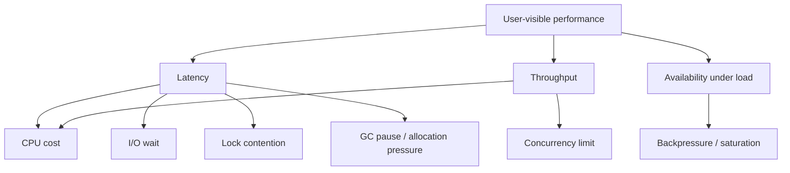
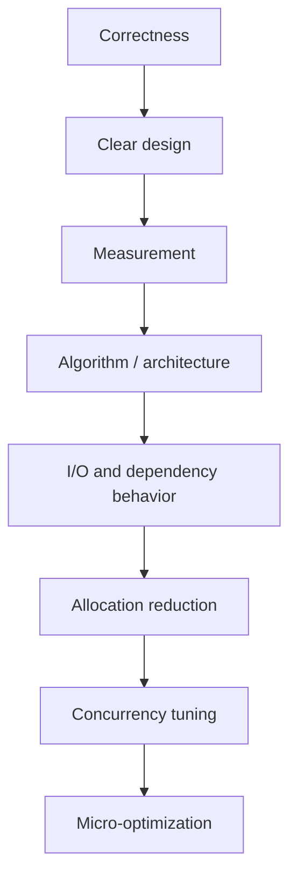

# Performance Engineering: Benchmark, PProf, Trace, dan Optimization Discipline

Performance engineering bukan aktivitas menebak bagian mana yang lambat lalu menulis kode yang lebih rumit.

Performance engineering adalah proses sistematis:

1. mendefinisikan target;
2. mengukur baseline;
3. menemukan bottleneck;
4. membuat hipotesis;
5. mengubah satu hal;
6. mengukur ulang;
7. menjaga correctness;
8. mencegah regression.

Go menyediakan tooling yang kuat untuk proses ini:

- benchmark bawaan `testing`;
- CPU profile;
- memory/heap profile;
- allocation metrics;
- goroutine profile;
- block profile;
- mutex profile;
- execution trace;
- `runtime/metrics`;
- `net/http/pprof`;
- race detector;
- compiler escape analysis.

Part ini membahas cara memakai alat tersebut sebagai engineer, bukan hanya sebagai operator command.

---

## Target Pembelajaran

Setelah menyelesaikan part ini, kita harus mampu:

1. Membedakan latency, throughput, CPU, memory, allocation, blocking, dan contention.
2. Menulis benchmark Go yang tidak misleading.
3. Membaca hasil `ns/op`, `B/op`, dan `allocs/op`.
4. Mengambil CPU dan memory profile dari benchmark maupun service berjalan.
5. Menggunakan `pprof` untuk menemukan hot path.
6. Memahami kapan memakai trace, block profile, dan mutex profile.
7. Menggunakan escape analysis untuk memahami allocation.
8. Mengoptimalkan kode tanpa merusak readability dan correctness.
9. Membuat performance regression guard di CI.
10. Menyusun performance review untuk service Go.

---

## Hubungan dengan Framework Kaufman

Dalam framework Kaufman, performance engineering adalah latihan **self-correction berbasis measurement**.

Tanpa measurement, kita hanya berlatih menebak.

- **Learn enough to self-correct**: benchmark dan profile memberi feedback objektif.
- **Deconstruct the skill**: performance dipecah menjadi CPU, memory, I/O, lock contention, GC, network, dan database.
- **Practice deliberately**: kita melakukan eksperimen kecil dengan baseline dan hasil terukur.

Top-tier engineer tidak mengoptimalkan karena “kelihatannya lambat”. Ia mengoptimalkan karena ada bukti, target, dan trade-off yang masuk akal.

---

## Mental Model: Performance adalah Cost Model yang Terukur

Performance bukan satu dimensi.



Satu endpoint lambat bisa disebabkan oleh banyak hal:

- CPU-bound parsing;
- JSON marshal/unmarshal mahal;
- terlalu banyak allocation;
- database query lambat;
- HTTP client tidak punya timeout;
- connection pool habis;
- mutex contention;
- goroutine leak;
- retry storm;
- GC pressure;
- logging sink lambat;
- queue backlog;
- lock di dependency eksternal.

Optimasi tanpa diagnosis sering memperbaiki bagian yang salah.

---

## Performance Vocabulary

| Istilah | Makna | Contoh |
|---|---|---|
| Latency | Waktu menyelesaikan satu operasi | request selesai dalam 120ms |
| Throughput | Operasi per unit waktu | 2.000 request/detik |
| CPU-bound | Bottleneck di komputasi CPU | hashing, compression, JSON encode |
| I/O-bound | Bottleneck di network/disk/database | query DB, HTTP dependency |
| Allocation | Memory baru yang dialokasikan | `B/op`, `allocs/op` |
| GC pressure | Beban garbage collector akibat allocation | heap tumbuh cepat |
| Contention | Banyak goroutine berebut resource | mutex hot spot |
| Saturation | Resource mencapai batas | DB pool penuh |
| Tail latency | Latency percentile tinggi | p99 2s meski p50 50ms |
| Regression | Performa memburuk dibanding baseline | allocation naik 10x setelah refactor |

Jangan mencampur istilah.

“Cepat” harus diterjemahkan menjadi target:

```txt
p95 latency POST /cases/{id}/escalate < 300ms pada 500 RPS dengan error rate < 0.1%.
```

Target semacam ini bisa diuji.

---

## Optimization Hierarchy

Urutan optimasi yang sehat:



Jangan mulai dari micro-optimization.

Contoh:

- mengganti `fmt.Sprintf` dengan manual concat tidak berguna jika query database 900ms;
- memakai `sync.Pool` tidak berguna jika allocation bukan bottleneck;
- menambah goroutine memperburuk sistem jika dependency sudah saturated;
- mengubah JSON library tidak berguna jika response terlalu besar karena API contract buruk;
- caching tanpa invalidation model bisa membuat correctness rusak.

Performance yang baik dimulai dari desain yang benar.

---

## Benchmark Dasar di Go

Go memakai package `testing` untuk benchmark.

File:

```txt
parser_test.go
```

Benchmark:

```go
func BenchmarkParseCaseID(b *testing.B) {
    input := "CASE-2026-000123"

    for i := 0; i < b.N; i++ {
        _, err := ParseCaseID(input)
        if err != nil {
            b.Fatal(err)
        }
    }
}
```

Jalankan:

```bash
go test -bench=. ./...
```

Dengan allocation:

```bash
go test -bench=. -benchmem ./...
```

Output contoh:

```txt
BenchmarkParseCaseID-10    50000000    23.4 ns/op    0 B/op    0 allocs/op
```

Makna:

- `23.4 ns/op`: rata-rata waktu per operasi;
- `0 B/op`: byte allocation per operasi;
- `0 allocs/op`: jumlah allocation per operasi.

---

## Benchmark yang Benar

Benchmark mudah misleading.

Contoh buruk:

```go
func BenchmarkBad(b *testing.B) {
    for i := 0; i < b.N; i++ {
        input := fmt.Sprintf("CASE-%d", i)
        ParseCaseID(input)
    }
}
```

Benchmark ini mengukur `fmt.Sprintf` dan `ParseCaseID` sekaligus.

Lebih baik:

```go
func BenchmarkParseCaseID(b *testing.B) {
    input := "CASE-2026-000123"

    b.ReportAllocs()
    b.ResetTimer()

    for i := 0; i < b.N; i++ {
        got, err := ParseCaseID(input)
        if err != nil {
            b.Fatal(err)
        }
        _ = got
    }
}
```

Gunakan `b.ResetTimer()` setelah setup.

Jika setup per-iteration diperlukan tetapi tidak ingin dihitung:

```go
for i := 0; i < b.N; i++ {
    b.StopTimer()
    input := buildLargeInput(i)
    b.StartTimer()

    _, err := Parse(input)
    if err != nil {
        b.Fatal(err)
    }
}
```

Tetapi hati-hati: `StopTimer`/`StartTimer` sendiri punya overhead. Jangan dipakai jika tidak perlu.

---

## Mencegah Compiler Menghilangkan Work

Compiler bisa mengoptimalkan hasil yang tidak dipakai.

Gunakan package-level sink saat diperlukan:

```go
var parseResult CaseID

func BenchmarkParseCaseID(b *testing.B) {
    input := "CASE-2026-000123"

    for i := 0; i < b.N; i++ {
        got, err := ParseCaseID(input)
        if err != nil {
            b.Fatal(err)
        }
        parseResult = got
    }
}
```

Ini memastikan hasil tetap dianggap observable.

Jangan terlalu paranoid, tetapi pahami bahwa benchmark kecil bisa tertipu optimizer.

---

## Sub-benchmark

Sub-benchmark berguna untuk membandingkan variasi input.

```go
func BenchmarkValidatePayload(b *testing.B) {
    cases := []struct {
        name  string
        input []byte
    }{
        {"small", smallPayload()},
        {"medium", mediumPayload()},
        {"large", largePayload()},
    }

    for _, tc := range cases {
        b.Run(tc.name, func(b *testing.B) {
            b.ReportAllocs()
            for i := 0; i < b.N; i++ {
                if err := ValidatePayload(tc.input); err != nil {
                    b.Fatal(err)
                }
            }
        })
    }
}
```

Jalankan satu sub-benchmark:

```bash
go test -bench='BenchmarkValidatePayload/large' -benchmem
```

Sub-benchmark membantu melihat scaling behavior.

---

## Membandingkan Hasil Benchmark

Jangan membandingkan hasil benchmark secara manual dari satu run.

Gunakan beberapa run:

```bash
go test -bench=BenchmarkParseCaseID -benchmem -count=10 > old.txt
# ubah kode
go test -bench=BenchmarkParseCaseID -benchmem -count=10 > new.txt
```

Lalu bandingkan dengan tool seperti `benchstat`.

Secara prinsip, kita ingin tahu:

- apakah perubahan signifikan secara statistik;
- apakah latency turun;
- apakah allocation turun;
- apakah variance naik;
- apakah trade-off readability/correctness layak.

Jika perubahan 1–2% tanpa bukti signifikan, jangan klaim menang.

---

## CPU Profile dari Benchmark

CPU profile menunjukkan waktu CPU dihabiskan di fungsi mana.

```bash
go test -bench=BenchmarkValidatePayload \
  -cpuprofile cpu.out \
  -benchmem
```

Buka:

```bash
go tool pprof cpu.out
```

Command penting di `pprof`:

```txt
top
list FunctionName
web
peek FunctionName
```

Contoh `top`:

```txt
Showing nodes accounting for 820ms, 82% of 1000ms total
      flat  flat%   sum%        cum   cum%
     300ms 30.00% 30.00%      300ms 30.00%  regexp.(*machine).add
     220ms 22.00% 52.00%      600ms 60.00%  ValidatePayload
     100ms 10.00% 62.00%      100ms 10.00%  encoding/json.checkValid
```

Makna:

- `flat`: waktu di fungsi itu sendiri;
- `cum`: waktu fungsi + fungsi yang dipanggil;
- fungsi dengan `cum` tinggi bisa menjadi orchestrator;
- fungsi dengan `flat` tinggi sering hot computation.

Jangan hanya lihat `top`. Gunakan `list` untuk melihat line-level.

---

## Memory Profile dari Benchmark

Memory profile membantu melihat allocation source.

```bash
go test -bench=BenchmarkValidatePayload \
  -memprofile mem.out \
  -benchmem
```

Buka:

```bash
go tool pprof mem.out
```

Mode umum:

```txt
top
list FunctionName
```

Perhatikan dua pertanyaan berbeda:

1. Siapa yang mengalokasikan banyak object?
2. Siapa yang membuat heap tetap hidup?

Allocation tinggi meningkatkan GC pressure meski object cepat mati.

Heap live tinggi berarti memory dipertahankan lebih lama.

---

## Profiling Service Berjalan dengan `net/http/pprof`

Untuk service HTTP internal, Go menyediakan `net/http/pprof`.

Contoh sederhana:

```go
import _ "net/http/pprof"
```

Jika service memakai default mux dan menjalankan server, endpoint pprof tersedia di:

```txt
/debug/pprof/
```

Dalam production, jangan expose endpoint ini ke internet publik.

Pattern lebih aman:

- jalankan admin server di port internal;
- bind ke localhost atau network internal;
- lindungi dengan auth/network policy;
- aktifkan hanya untuk environment tertentu jika perlu.

Contoh admin server:

```go
func startAdminServer(addr string, logger *slog.Logger) *http.Server {
    mux := http.NewServeMux()

    // register pprof handlers explicitly if needed
    // mux.HandleFunc("/debug/pprof/", pprof.Index)

    srv := &http.Server{
        Addr:              addr,
        Handler:           mux,
        ReadHeaderTimeout: 5 * time.Second,
    }

    go func() {
        logger.Info("admin server started", slog.String("addr", addr))
        if err := srv.ListenAndServe(); err != nil && !errors.Is(err, http.ErrServerClosed) {
            logger.Error("admin server failed", slog.Any("error", err))
        }
    }()

    return srv
}
```

Ambil CPU profile 30 detik:

```bash
go tool pprof http://localhost:6060/debug/pprof/profile?seconds=30
```

Ambil heap profile:

```bash
go tool pprof http://localhost:6060/debug/pprof/heap
```

Ambil goroutine dump:

```bash
curl http://localhost:6060/debug/pprof/goroutine?debug=2
```

---

## Goroutine Profile

Goroutine profile membantu menemukan:

- goroutine leak;
- goroutine blocked di channel receive/send;
- goroutine blocked di network I/O;
- worker tidak berhenti;
- shutdown tidak bersih;
- deadlock pattern.

Contoh gejala:

```txt
goroutines naik terus dari 200 ke 50.000 setelah beberapa jam
```

Kemungkinan:

- channel tidak pernah ditutup;
- goroutine menunggu context yang tidak pernah cancel;
- HTTP response body tidak ditutup;
- worker retry tanpa limit;
- ticker tidak dihentikan;
- background goroutine dibuat per request.

Pattern berbahaya:

```go
func (s *Service) Handle(ctx context.Context, req Request) error {
    go func() {
        s.doBackgroundWork(context.Background(), req.ID)
    }()
    return nil
}
```

Masalah:

- lifecycle terputus dari request;
- tidak ada backpressure;
- tidak ada cancellation;
- bisa leak saat dependency lambat.

Lebih baik gunakan worker queue dengan bounded capacity dan shutdown lifecycle eksplisit.

---

## Block Profile

Block profile menunjukkan goroutine yang blocked pada synchronization primitive, channel, select, dan semacamnya.

Aktifkan:

```go
runtime.SetBlockProfileRate(1)
```

Atau expose via pprof jika sudah diaktifkan.

Block profile berguna jika:

- latency tinggi tapi CPU rendah;
- banyak goroutine menunggu channel;
- pipeline macet;
- worker pool saturated;
- select/send/receive menjadi bottleneck.

Hati-hati: profiling block bisa punya overhead. Gunakan saat investigasi, bukan selalu aktif dengan rate agresif.

---

## Mutex Profile

Mutex profile menunjukkan contention pada mutex.

Aktifkan:

```go
runtime.SetMutexProfileFraction(1)
```

Gunakan jika:

- CPU tidak penuh tetapi latency naik;
- throughput turun saat concurrency naik;
- cache global dipakai semua request;
- satu mutex melindungi data terlalu besar;
- lock scope terlalu panjang;
- operasi I/O dilakukan di dalam lock.

Contoh buruk:

```go
func (c *Cache) GetOrLoad(ctx context.Context, key string) (Value, error) {
    c.mu.Lock()
    defer c.mu.Unlock()

    if v, ok := c.items[key]; ok {
        return v, nil
    }

    v, err := c.loader.Load(ctx, key) // I/O while holding lock
    if err != nil {
        return Value{}, err
    }

    c.items[key] = v
    return v, nil
}
```

Masalah: semua request lain tertahan selama I/O.

Perbaikan bisa berupa:

- cek cache dengan lock pendek;
- release lock sebelum I/O;
- singleflight untuk deduplicate load;
- sharded lock;
- redesign cache policy.

---

## Execution Trace

Profile menjawab “fungsi mana mahal”. Trace menjawab “runtime melakukan apa sepanjang waktu”.

Execution trace berguna untuk:

- goroutine scheduling;
- network blocking;
- syscall;
- GC timing;
- latency antar-goroutine;
- channel blocking;
- parallelism utilization;
- request lifecycle kompleks.

Ambil trace dari test:

```bash
go test -run TestScenario -trace trace.out
```

Buka:

```bash
go tool trace trace.out
```

Untuk program:

```go
f, err := os.Create("trace.out")
if err != nil {
    panic(err)
}
defer f.Close()

if err := trace.Start(f); err != nil {
    panic(err)
}
defer trace.Stop()

// workload
```

Trace bukan pengganti CPU profile. Gunakan trace saat masalah melibatkan concurrency, scheduling, blocking, atau lifecycle.

---

## Escape Analysis

Escape analysis membantu menjawab apakah value dialokasikan di stack atau heap.

Jalankan:

```bash
go build -gcflags='-m=2' ./...
```

Contoh output:

```txt
./main.go:10:9: moved to heap: user
./main.go:11:12: &User{...} escapes to heap
```

Heap allocation bukan selalu buruk. Tetapi allocation di hot path bisa meningkatkan GC pressure.

Contoh:

```go
func NewUser(name string) *User {
    return &User{Name: name}
}
```

Return pointer kemungkinan membuat value escape. Itu tidak otomatis salah. API mungkin memang butuh pointer.

Jangan mengejar zero allocation dengan merusak desain.

Gunakan escape analysis untuk memahami, bukan untuk membuat kode absurd.

---

## Allocation Reduction yang Masuk Akal

Cara umum mengurangi allocation:

1. Hindari konversi string/byte tidak perlu.
2. Preallocate slice jika ukuran bisa diperkirakan.
3. Gunakan streaming decoder untuk payload besar.
4. Hindari `fmt.Sprintf` di hot path sederhana.
5. Reuse buffer dengan hati-hati.
6. Hindari interface boxing di tight loop jika terbukti mahal.
7. Hindari closure allocation di hot path jika terbukti.
8. Gunakan `strings.Builder` untuk membangun string kompleks.
9. Gunakan `bytes.Buffer` untuk bytes.
10. Hindari reflection untuk path performa kritis.

Contoh preallocation:

```go
func CollectIDs(cases []Case) []string {
    ids := make([]string, 0, len(cases))
    for _, c := range cases {
        ids = append(ids, c.ID)
    }
    return ids
}
```

Contoh string builder:

```go
func JoinCaseKeys(ids []string) string {
    var b strings.Builder

    for i, id := range ids {
        if i > 0 {
            b.WriteByte(',')
        }
        b.WriteString(id)
    }

    return b.String()
}
```

Tetapi jangan mengganti semua string concatenation kecil dengan builder. Compiler sudah cukup pintar untuk banyak kasus sederhana.

---

## JSON Performance

JSON sering menjadi hot path di Go backend.

Masalah umum:

- payload terlalu besar;
- decode ke `map[string]any`;
- reflection cost;
- double marshal/unmarshal;
- membaca seluruh body tanpa limit;
- response mengandung field tidak perlu;
- repeated allocation pada slice/map;
- validasi dilakukan setelah decode besar.

Baseline yang aman:

```go
func decodeJSON(w http.ResponseWriter, r *http.Request, dst any) error {
    r.Body = http.MaxBytesReader(w, r.Body, 1<<20) // 1 MiB

    dec := json.NewDecoder(r.Body)
    dec.DisallowUnknownFields()

    if err := dec.Decode(dst); err != nil {
        return fmt.Errorf("decode json: %w", err)
    }

    return nil
}
```

Optimasi JSON sebaiknya dimulai dari contract:

- apakah field semua dibutuhkan?
- apakah endpoint mengirim terlalu banyak data?
- apakah pagination benar?
- apakah nested object terlalu dalam?
- apakah client butuh streaming?

Library alternatif mungkin membantu, tetapi mengganti library tanpa memperbaiki contract sering hanya memberi perbaikan kecil.

---

## Database Performance dari Perspektif Go

Banyak “Go performance issue” sebenarnya database issue.

Gejala:

- p95 HTTP latency tinggi;
- CPU Go rendah;
- goroutine banyak menunggu;
- DB pool in-use penuh;
- query duration tinggi;
- timeout meningkat.

Hal yang harus dicek:

1. Query plan.
2. Index.
3. Transaction duration.
4. N+1 query.
5. Connection pool size.
6. Context timeout.
7. Locking di database.
8. Payload result terlalu besar.
9. Scan ke type yang tidak efisien.
10. Retry yang memperburuk load.

Go-side tuning:

```go
db.SetMaxOpenConns(25)
db.SetMaxIdleConns(25)
db.SetConnMaxLifetime(30 * time.Minute)
db.SetConnMaxIdleTime(5 * time.Minute)
```

Tetapi angka ini harus berdasarkan load test dan batas database, bukan copy-paste.

---

## HTTP Client Performance

Masalah umum:

- membuat `http.Client` baru per request;
- tidak menutup response body;
- tidak punya timeout;
- transport default tidak sesuai load;
- retry tanpa backoff;
- connection reuse gagal;
- membaca response besar tanpa limit;
- dependency latency tidak dimetric.

Gunakan client reusable:

```go
client := &http.Client{
    Timeout: 2 * time.Second,
    Transport: &http.Transport{
        MaxIdleConns:        100,
        MaxIdleConnsPerHost: 20,
        IdleConnTimeout:     90 * time.Second,
    },
}
```

Selalu close body:

```go
resp, err := client.Do(req)
if err != nil {
    return err
}
defer resp.Body.Close()
```

Jika tidak membaca body penuh, connection reuse bisa terganggu. Untuk response kecil, baca dan buang jika perlu sebelum close. Untuk response besar, desain API agar tidak perlu membuang besar-besaran.

---

## Concurrency Performance: More Goroutines Bukan Selalu Lebih Cepat

Goroutine murah, tetapi tidak gratis.

Menambah concurrency membantu jika bottleneck bisa diparalelkan dan dependency punya kapasitas.

Menambah concurrency memperburuk jika:

- database pool sudah penuh;
- external API rate-limited;
- CPU sudah saturated;
- lock contention tinggi;
- queue downstream penuh;
- memory pressure meningkat;
- retry storm terjadi.

Gunakan bounded concurrency.

```go
func ProcessAll(ctx context.Context, items []Item, limit int, fn func(context.Context, Item) error) error {
    sem := make(chan struct{}, limit)
    errCh := make(chan error, 1)
    var wg sync.WaitGroup

    ctx, cancel := context.WithCancel(ctx)
    defer cancel()

    for _, item := range items {
        select {
        case <-ctx.Done():
            break
        case sem <- struct{}{}:
        }

        wg.Add(1)
        go func(item Item) {
            defer wg.Done()
            defer func() { <-sem }()

            if err := fn(ctx, item); err != nil {
                select {
                case errCh <- err:
                    cancel()
                default:
                }
            }
        }(item)
    }

    wg.Wait()

    select {
    case err := <-errCh:
        return err
    default:
        return ctx.Err()
    }
}
```

Di production, biasanya gunakan worker pool yang lebih explicit dan mudah diobservasi.

---

## Backpressure

Backpressure adalah mekanisme agar upstream tidak mengirim pekerjaan lebih cepat dari downstream.

Tanpa backpressure:

- memory queue tumbuh;
- goroutine tumbuh;
- latency naik;
- retry meningkat;
- service crash;
- dependency ikut rusak.

Pattern backpressure:

- bounded queue;
- semaphore;
- rate limit;
- timeout;
- circuit breaker;
- load shedding;
- HTTP 429/503;
- queue consumer pause;
- adaptive concurrency.

Contoh bounded queue:

```go
type WorkerPool struct {
    jobs chan Job
}

func NewWorkerPool(size int, queueSize int) *WorkerPool {
    p := &WorkerPool{
        jobs: make(chan Job, queueSize),
    }
    for i := 0; i < size; i++ {
        go p.worker()
    }
    return p
}

func (p *WorkerPool) Submit(ctx context.Context, job Job) error {
    select {
    case p.jobs <- job:
        return nil
    case <-ctx.Done():
        return ctx.Err()
    default:
        return ErrQueueFull
    }
}
```

`ErrQueueFull` bukan bug. Itu signal bahwa sistem melindungi diri.

---

## GC dan Allocation Pressure

Go garbage collector sangat baik, tetapi bukan sihir.

Jika service membuat banyak object jangka pendek di hot path, GC harus bekerja lebih banyak.

Gejala allocation pressure:

- `B/op` tinggi di benchmark;
- heap naik turun cepat;
- CPU GC meningkat;
- latency p99 naik;
- profile menunjukkan banyak allocation di path request;
- throughput turun saat traffic naik.

Strategi:

1. Ukur dulu dengan `-benchmem` dan heap profile.
2. Kurangi allocation besar di hot path.
3. Reuse buffer hanya jika ownership jelas.
4. Hindari global pooling tanpa bukti.
5. Perbaiki API yang membuat copy besar.
6. Gunakan streaming untuk data besar.
7. Hindari menyimpan pointer ke object besar lebih lama dari perlu.

`sync.Pool` bisa membantu untuk object temporer yang mahal, tetapi punya trade-off:

- object bisa hilang saat GC;
- ownership harus disiplin;
- bug data reuse bisa sulit ditemukan;
- tidak cocok untuk object yang menyimpan secret;
- tidak selalu lebih cepat.

Gunakan `sync.Pool` hanya setelah profile membuktikan allocation tersebut signifikan.

---

## Tail Latency

Rata-rata latency sering menipu.

Contoh:

```txt
p50 = 40ms
p95 = 300ms
p99 = 2000ms
average = 80ms
```

Average terlihat bagus, tetapi 1% user mengalami 2 detik.

Tail latency penting karena:

- request user sering melibatkan banyak service;
- tail latency satu dependency bisa memperburuk request global;
- retry bisa memperbesar load;
- p99 sering menunjukkan saturation atau contention.

Untuk service production, pantau:

- p50 untuk pengalaman umum;
- p95 untuk normal high latency;
- p99 untuk tail risk;
- max kadang berguna tapi sering noisy.

Optimasi tail latency sering berbeda dari optimasi average:

- timeout budget;
- hedged request dengan hati-hati;
- queue limit;
- lock scope reduction;
- connection pool tuning;
- avoiding coordinated retry;
- cancellation propagation.

---

## Performance Regression Guard

Performance regression harus dicegah sebelum production.

Minimal:

```bash
go test -bench=. -benchmem ./...
```

Tetapi menjalankan semua benchmark di CI bisa mahal dan flaky.

Strategi lebih realistis:

1. Simpan benchmark untuk package kritikal.
2. Jalankan benchmark pada PR yang menyentuh path kritikal.
3. Jalankan benchmark nightly untuk tren.
4. Bandingkan dengan baseline menggunakan threshold.
5. Jangan fail CI untuk noise kecil.
6. Wajib review jika allocation naik drastis.

Contoh policy:

```txt
- Allocation > 20% pada parser hot path: review required.
- ns/op > 15% pada authorization check: review required.
- allocs/op naik dari 0 ke >0 pada critical loop: review required.
```

Untuk service-level performance, gunakan load test terpisah.

---

## Load Testing

Benchmark function tidak sama dengan load test service.

Benchmark menjawab:

```txt
Seberapa mahal fungsi ini?
```

Load test menjawab:

```txt
Bagaimana service berperilaku di bawah traffic realistis?
```

Load test harus mendekati realitas:

- payload realistis;
- dependency realistis atau simulator yang masuk akal;
- connection reuse;
- concurrency realistis;
- data size realistis;
- read/write mix realistis;
- warm-up period;
- steady-state period;
- ramp-up dan ramp-down;
- metrics p95/p99;
- error rate;
- saturation signal.

Jangan load test hanya dengan endpoint `/health` lalu menyimpulkan service kuat.

---

## Case Study: Endpoint Lambat

Gejala:

```txt
POST /cases/{id}/escalate p95 naik dari 180ms ke 900ms setelah deploy.
```

Langkah diagnosis:

1. Cek metrics route-level.
2. Cek apakah error rate naik.
3. Ambil sample trace request lambat.
4. Lihat dependency span.
5. Ambil CPU profile jika CPU tinggi.
6. Ambil goroutine/block/mutex profile jika CPU rendah tapi latency tinggi.
7. Cek DB pool metrics.
8. Bandingkan deployment diff.
9. Reproduksi dengan benchmark/load test jika mungkin.
10. Buat fix dan ukur ulang.

Kemungkinan hasil:

| Bukti | Diagnosis |
|---|---|
| CPU profile dominan JSON marshal | response terlalu besar atau encoding hot path |
| DB span dominan | query/index/lock/pool issue |
| goroutine profile banyak blocked send | queue downstream penuh |
| mutex profile hot di cache | lock scope terlalu besar |
| heap profile allocation naik | refactor membuat allocation besar |
| trace menunjukkan risk-service lambat | dependency degradation |

Tindakan harus mengikuti bukti.

---

## Performance Anti-patterns

### 1. Premature Optimization

Mengorbankan readability untuk improvement yang tidak diukur.

### 2. Benchmark yang Mengukur Hal Salah

Setup, logging, random generation, atau network ikut terukur tanpa sengaja.

### 3. Mengabaikan Correctness

Kode cepat tapi salah bukan optimasi.

### 4. Mengoptimalkan Average, Mengabaikan Tail

User production merasakan p95/p99, bukan hanya average.

### 5. Menambah Goroutine Tanpa Backpressure

Concurrency tanpa limit bisa menjadi denial-of-service internal.

### 6. Menyalahkan GC Terlalu Cepat

Banyak masalah latency berasal dari database, lock, network, atau retry.

### 7. Menggunakan `sync.Pool` Tanpa Bukti

Pooling bisa membuat bug ownership dan tidak selalu membantu.

### 8. Tidak Menutup Response Body

HTTP connection reuse rusak dan resource bocor.

### 9. Query Database di Dalam Lock

Membuat semua goroutine menunggu I/O.

### 10. Tidak Ada Baseline

Tanpa baseline, improvement tidak bisa dibuktikan.

---

## Performance Review Checklist

### Target

- Apakah target latency/throughput jelas?
- Apakah p95/p99 didefinisikan?
- Apakah workload realistis?
- Apakah correctness tetap dipertahankan?

### Benchmark

- Apakah setup dipisahkan dari timed section?
- Apakah hasil benchmark dipakai?
- Apakah allocation dilaporkan?
- Apakah benchmark dijalankan beberapa kali?
- Apakah input merepresentasikan data nyata?

### Profiling

- Apakah CPU profile diambil pada workload yang relevan?
- Apakah heap profile menunjukkan allocation source?
- Apakah goroutine profile dicek jika ada leak/saturation?
- Apakah block/mutex profile dipakai jika latency tinggi tapi CPU rendah?
- Apakah trace dipakai untuk masalah concurrency/scheduling?

### Code

- Apakah hot path jelas?
- Apakah allocation reduction tidak merusak readability?
- Apakah lock scope minimal?
- Apakah I/O tidak dilakukan dalam lock?
- Apakah context cancellation dihormati?
- Apakah HTTP response body ditutup?
- Apakah DB pool tuning berbasis data?

### Operations

- Apakah ada metrics latency, error, throughput?
- Apakah ada dependency metrics?
- Apakah regression guard tersedia?
- Apakah dashboard menunjukkan saturation?
- Apakah rollback/fallback plan jelas?

---

## Latihan Praktik

### Latihan 1: Benchmark Parser

Buat function:

```go
func ParseCaseID(s string) (CaseID, error)
```

Tulis benchmark untuk input:

- valid pendek;
- valid panjang;
- invalid format;
- empty string.

Acceptance criteria:

- gunakan sub-benchmark;
- laporkan allocation;
- tidak mengukur setup;
- hasil benchmark dipakai agar tidak dieliminasi compiler.

---

### Latihan 2: CPU Profile JSON Endpoint

Buat endpoint yang mengembalikan list 10.000 case.

Ambil CPU profile saat load test lokal.

Jawab:

1. fungsi mana yang dominan secara CPU;
2. apakah bottleneck di encoding, data generation, atau handler;
3. perubahan apa yang paling masuk akal;
4. bagaimana hasil setelah perubahan.

---

### Latihan 3: Memory Profile dan Allocation Reduction

Buat function yang membangun slice ID dari list case.

Versi pertama tanpa preallocation.

Versi kedua dengan preallocation.

Bandingkan:

- `ns/op`;
- `B/op`;
- `allocs/op`.

Jelaskan apakah improvement layak.

---

### Latihan 4: Mutex Contention

Buat cache dengan satu mutex global. Jalankan benchmark paralel.

```go
func BenchmarkCacheParallel(b *testing.B) {
    cache := NewCache()

    b.RunParallel(func(pb *testing.PB) {
        for pb.Next() {
            _, _ = cache.Get("same-key")
        }
    })
}
```

Lalu eksperimen:

- kurangi lock scope;
- gunakan `RWMutex`;
- gunakan sharded cache;
- bandingkan hasil.

Jangan asumsikan `RWMutex` selalu lebih cepat.

---

### Latihan 5: Goroutine Leak

Buat handler yang memulai goroutine per request dan menunggu channel yang tidak pernah ditutup.

Lihat goroutine profile.

Perbaiki dengan:

- context cancellation;
- bounded worker pool;
- shutdown lifecycle.

Acceptance criteria:

- jumlah goroutine stabil setelah load berhenti;
- shutdown tidak menggantung;
- queue full ditangani eksplisit.

---

## Mini Project: Performance Investigation Report

Ambil service dari part sebelumnya. Buat laporan performa dengan format:

```md
# Performance Investigation Report

## Target
- Endpoint:
- Workload:
- Target p95:
- Target error rate:

## Baseline
- RPS:
- p50:
- p95:
- p99:
- Error rate:
- CPU:
- Memory:
- Goroutines:

## Profiles Collected
- CPU profile:
- Heap profile:
- Goroutine profile:
- Trace:

## Findings
1.
2.
3.

## Hypothesis

## Changes

## After Measurement

## Trade-offs

## Follow-up
```

Tujuannya bukan hanya mempercepat kode. Tujuannya membiasakan proses engineering yang bisa dipertanggungjawabkan.

---

## Production Heuristics

1. Jangan optimasi tanpa baseline.
2. Jangan percaya benchmark satu kali jalan.
3. Jangan pakai average sebagai satu-satunya indikator.
4. Jangan menambah concurrency tanpa backpressure.
5. Jangan menyimpan object besar lebih lama dari perlu.
6. Jangan membuka pprof publik tanpa proteksi.
7. Jangan memegang mutex saat I/O.
8. Jangan mengganti library besar tanpa profile.
9. Jangan mengorbankan correctness untuk micro-optimization.
10. Selalu ukur sebelum dan sesudah.

---

## Ringkasan

Performance engineering di Go adalah disiplin berbasis measurement.

Tool utama:

- benchmark dengan `testing`;
- `-benchmem` untuk allocation;
- CPU profile untuk hot computation;
- heap profile untuk allocation/memory;
- goroutine profile untuk leak/blocking;
- block profile untuk channel/sync blocking;
- mutex profile untuk contention;
- execution trace untuk scheduling dan concurrency;
- escape analysis untuk memahami heap allocation;
- load test untuk service-level behavior.

Urutan berpikir yang sehat:

```txt
correctness → target → baseline → profile → hypothesis → change → remeasure → guard
```

Engineer kuat bukan yang paling banyak tahu trik optimasi. Engineer kuat adalah yang bisa membuktikan bottleneck, memilih perubahan dengan trade-off terbaik, dan mencegah regression.

---

## Referensi Utama

- Go `testing` package: https://pkg.go.dev/testing
- Go `runtime/pprof`: https://pkg.go.dev/runtime/pprof
- Go `net/http/pprof`: https://pkg.go.dev/net/http/pprof
- Go diagnostics: https://go.dev/doc/diagnostics
- Go execution tracer: https://pkg.go.dev/runtime/trace
- Go memory model: https://go.dev/ref/mem
- Go 1.26 release notes: https://go.dev/doc/go1.26
