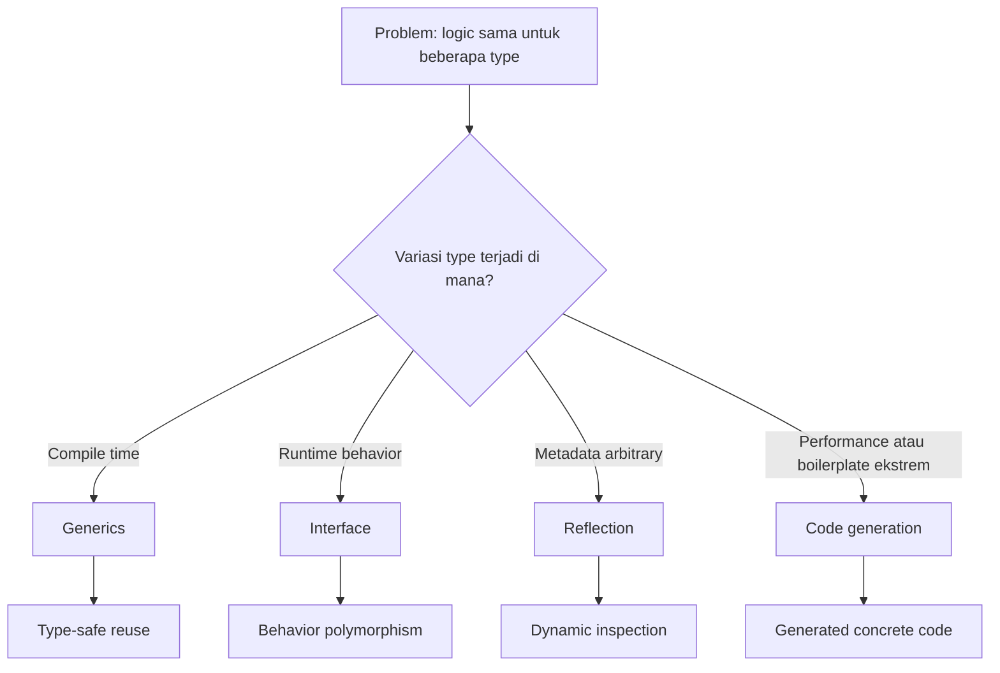
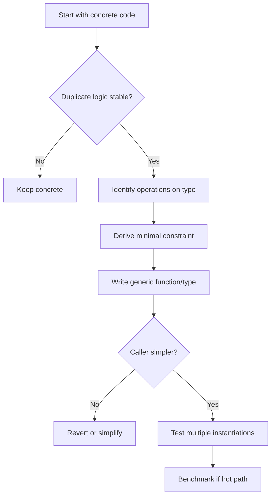

# Generics, Constraints, dan Type Parameter Design

Generics di Go bukan fitur untuk membuat kode terlihat lebih advanced.

Generics adalah alat untuk menulis logic yang sama terhadap beberapa type tanpa kehilangan static type safety.

Sebelum generics, Go biasanya memilih salah satu dari tiga pendekatan:

1. tulis fungsi konkret untuk setiap type;
2. gunakan interface dan type assertion;
3. gunakan reflection atau code generation.

Generics menambahkan opsi keempat: **compile-time reuse dengan type safety**.

Namun, Go tetap Go. Generics tidak mengubah prinsip utama bahasa ini:

- API harus sederhana;
- constraint harus minimal;
- code harus mudah dibaca;
- type abstraction harus punya alasan;
- concrete code sering lebih baik daripada abstraction prematur.

Part ini membahas generics sebagai alat desain, bukan sekadar syntax.

---

## Target Pembelajaran

Setelah menyelesaikan part ini, kita harus mampu:

1. Menjelaskan kapan generics berguna dan kapan justru memperburuk desain.
2. Menulis generic function dan generic type yang idiomatik.
3. Mendesain constraint yang kecil, jelas, dan tidak over-engineered.
4. Memahami `any`, `comparable`, type set, union type element, dan underlying type dengan `~`.
5. Membedakan interface sebagai runtime polymorphism dan interface sebagai type constraint.
6. Menulis generic collection kecil seperti `Set[T]`, `Stack[T]`, dan `Cache[K,V]`.
7. Menggunakan package standard library seperti `slices`, `maps`, dan `cmp` secara tepat.
8. Menghindari generic interface dan generic framework yang membuat kode sulit direview.
9. Menulis test untuk generic code.
10. Membuat review checklist untuk generic API.

---

## Hubungan dengan Framework Kaufman

Dalam framework Kaufman, generics adalah sub-skill yang harus didekonstruksi.

Masalah umum engineer berpengalaman saat belajar generics Go adalah membawa kebiasaan dari Java, C#, TypeScript, atau Rust, lalu mencoba memindahkan model abstraction bahasa lain ke Go.

Itu jebakan.

Kita akan belajar generics dengan urutan berikut:

1. pahami masalah yang ingin diselesaikan;
2. mulai dari concrete code;
3. temukan duplikasi yang benar-benar stabil;
4. ubah menjadi generic function atau type;
5. batasi constraint;
6. uji readability;
7. uji compile-time behavior;
8. review apakah abstraction masih worth it.

Kaufman menyebut ini sebagai **learn enough to self-correct**. Dalam generics, self-correction berarti mampu menjawab:

- apakah type parameter ini memang diperlukan?
- apakah interface biasa lebih cocok?
- apakah concrete function lebih jelas?
- apakah constraint ini terlalu luas?
- apakah API generic ini membuat caller lebih mudah atau lebih bingung?

---

## Mental Model Utama

Generics memindahkan sebagian variasi type dari runtime ke compile time.



Kalimat paling penting:

> Gunakan generics saat variasi utama ada pada type, bukan pada behavior runtime.

Contoh variasi type:

- `Min` untuk `int`, `int64`, `float64`, `string`;
- `Set[T]` untuk key yang comparable;
- `Stack[T]` untuk elemen apapun;
- `Clone[S ~[]E, E any]` untuk slice dengan named type;
- `IndexFunc[T any]` untuk mencari elemen berdasarkan predicate.

Contoh variasi behavior runtime:

- `io.Reader`;
- `http.Handler`;
- `sort.Interface` lama;
- `database/sql/driver`;
- storage adapter;
- notification sender;
- payment gateway.

Untuk variasi behavior runtime, interface biasa sering lebih tepat.

---

## Generics Bukan Pengganti Interface

Salah satu kesalahan awal adalah berpikir:

> “Sekarang Go punya generics, berarti interface tidak terlalu penting.”

Salah.

Interface dan generics menyelesaikan masalah berbeda.

| Kebutuhan | Alat yang Biasanya Cocok |
|---|---|
| Runtime polymorphism | Interface |
| Dependency boundary | Interface kecil |
| Compile-time reusable algorithm | Generic function |
| Type-safe collection | Generic type |
| Dynamic metadata | Reflection |
| Boilerplate concrete high-performance | Code generation |

Contoh interface yang tetap idiomatik:

```go
package invoice

import "context"

type Repository interface {
    Save(ctx context.Context, inv Invoice) error
    FindByID(ctx context.Context, id ID) (Invoice, error)
}
```

Repository bukan kandidat generics hanya karena entity bisa berbeda.

Generic repository seperti ini sering buruk:

```go
// Hindari sebagai default.
type Repository[T any, ID comparable] interface {
    Save(ctx context.Context, entity T) error
    FindByID(ctx context.Context, id ID) (T, error)
}
```

Masalahnya:

- domain behavior tiap aggregate sering berbeda;
- query shape berbeda;
- transaction semantics berbeda;
- error semantics berbeda;
- generic abstraction terlihat rapi tapi menyembunyikan keputusan penting.

Top-tier Go engineer tidak menggeneralisasi boundary domain terlalu cepat.

---

## Syntax Dasar Generic Function

Generic function punya type parameter list setelah nama function.

```go
func Identity[T any](v T) T {
    return v
}
```

`T any` berarti `T` dapat berupa type apapun.

Pemakaian:

```go
name := Identity[string]("gopher")
age := Identity[int](42)
```

Dalam banyak kasus, compiler bisa melakukan type inference:

```go
name := Identity("gopher")
age := Identity(42)
```

Function ini benar tapi tidak berguna. Generic yang baik menyelesaikan masalah nyata.

---

## Contoh Konkret: Contains

Tanpa generics:

```go
func ContainsString(items []string, target string) bool {
    for _, item := range items {
        if item == target {
            return true
        }
    }
    return false
}

func ContainsInt(items []int, target int) bool {
    for _, item := range items {
        if item == target {
            return true
        }
    }
    return false
}
```

Dengan generics:

```go
func Contains[T comparable](items []T, target T) bool {
    for _, item := range items {
        if item == target {
            return true
        }
    }
    return false
}
```

Kenapa constraint-nya `comparable`?

Karena operator `==` hanya valid untuk type yang comparable.

```go
names := []string{"ana", "bima", "citra"}
found := Contains(names, "bima")

ids := []int64{10, 20, 30}
exists := Contains(ids, int64(20))

_, _ = found, exists
```

Jika mencoba memakai slice of map:

```go
// Tidak compile, karena map tidak comparable.
// Contains([]map[string]int{{"a": 1}}, map[string]int{"a": 1})
```

Compiler melindungi kita.

Itulah value utama generics: reuse tanpa menghilangkan static correctness.

---

## `any` adalah Alias untuk `interface{}`

`any` bukan magic.

Secara konsep:

```go
type any = interface{}
```

Gunakan `any` saat type parameter tidak membutuhkan operasi khusus.

Contoh:

```go
type Stack[T any] struct {
    items []T
}

func (s *Stack[T]) Push(v T) {
    s.items = append(s.items, v)
}

func (s *Stack[T]) Pop() (T, bool) {
    var zero T

    if len(s.items) == 0 {
        return zero, false
    }

    last := len(s.items) - 1
    v := s.items[last]
    s.items[last] = zero // release reference for GC when T holds pointers
    s.items = s.items[:last]
    return v, true
}
```

Kenapa `Stack[T]` boleh memakai `any`?

Karena stack tidak perlu membandingkan, mengurutkan, menjumlahkan, atau memanggil method pada `T`. Ia hanya menyimpan dan mengembalikan nilai.

---

## `comparable`

`comparable` adalah predeclared constraint untuk type yang bisa dibandingkan dengan `==` dan `!=`.

Ia penting untuk key map.

```go
type Set[T comparable] map[T]struct{}

func NewSet[T comparable](items ...T) Set[T] {
    set := make(Set[T], len(items))
    for _, item := range items {
        set[item] = struct{}{}
    }
    return set
}

func (s Set[T]) Add(v T) {
    s[v] = struct{}{}
}

func (s Set[T]) Has(v T) bool {
    _, ok := s[v]
    return ok
}

func (s Set[T]) Delete(v T) {
    delete(s, v)
}

func (s Set[T]) Len() int {
    return len(s)
}
```

Pemakaian:

```go
roles := NewSet("admin", "reviewer")
roles.Add("auditor")

if roles.Has("admin") {
    // allow privileged action
}
```

Nilai `struct{}{}` sering dipakai karena tidak menyimpan payload.

Namun, untuk readability, `map[T]bool` juga bisa diterima jika value bool punya makna tambahan.

---

## Type Constraint dengan Interface

Di Go, constraint ditulis sebagai interface.

```go
type Number interface {
    ~int | ~int64 | ~float64
}

func Sum[T Number](items []T) T {
    var total T
    for _, item := range items {
        total += item
    }
    return total
}
```

Constraint `Number` bukan interface behavior runtime. Ia adalah set type yang diizinkan untuk `T`.

Ini perbedaan penting:

```go
type Writer interface {
    Write([]byte) (int, error)
}
```

`Writer` adalah behavior interface.

```go
type Integer interface {
    ~int | ~int8 | ~int16 | ~int32 | ~int64
}
```

`Integer` adalah constraint interface.

Constraint interface dengan type terms tidak dapat dipakai sembarangan sebagai value interface biasa.

Gunakan nama yang jelas agar reviewer tahu maksudnya.

---

## Type Set

Constraint mendefinisikan type set.

Type parameter hanya boleh menerima type yang berada dalam type set constraint.

Contoh:

```go
type SignedInteger interface {
    ~int | ~int8 | ~int16 | ~int32 | ~int64
}
```

Artinya, `T` boleh berupa:

- `int`
- `int8`
- `int16`
- `int32`
- `int64`
- named type yang underlying type-nya salah satu dari type tersebut

Dengan `~`, named type ikut diterima.

Tanpa `~`, hanya exact type yang diterima.

---

## Kenapa `~` Penting

Misalkan ada domain type:

```go
type Cents int64

type Points int64
```

Jika constraint ditulis begini:

```go
type Int64Only interface {
    int64
}
```

Maka `Cents` dan `Points` tidak termasuk.

Jika constraint ditulis begini:

```go
type Int64Like interface {
    ~int64
}
```

Maka named type dengan underlying type `int64` termasuk.

Contoh:

```go
type Numeric interface {
    ~int | ~int64 | ~float64
}

func Max[T Numeric](a, b T) T {
    if a > b {
        return a
    }
    return b
}
```

Pemakaian:

```go
type Cents int64

var a Cents = 100
var b Cents = 250

max := Max(a, b)
_ = max
```

Tanpa `~int64`, kode di atas tidak compile.

Rule praktis:

> Jika constraint dimaksudkan menerima named domain type, gunakan `~`.

---

## Union Type Element

Constraint bisa menggunakan union:

```go
type StringOrBytes interface {
    ~string | ~[]byte
}
```

Tapi hati-hati: operasi yang boleh dilakukan pada `T` harus valid untuk semua type dalam type set.

Contoh buruk:

```go
func Bad[T ~string | ~[]byte](v T) T {
    // Tidak semua operasi string cocok untuk []byte dan sebaliknya.
    return v
}
```

Union constraint yang terlalu luas sering membuat function tidak punya operasi berguna.

Constraint yang baik lahir dari operasi yang benar-benar dibutuhkan.

---

## Constraint Harus Mengikuti Operasi

Jangan mulai dari constraint.

Mulai dari operasi.

Contoh: kita butuh `==`.

```go
func Index[T comparable](items []T, target T) int {
    for i, item := range items {
        if item == target {
            return i
        }
    }
    return -1
}
```

Constraint: `comparable`.

Contoh: kita butuh `<`.

```go
import "cmp"

func Min[T cmp.Ordered](a, b T) T {
    if a < b {
        return a
    }
    return b
}
```

Constraint: `cmp.Ordered`.

Contoh: kita butuh method `Validate() error`.

```go
type Validatable interface {
    Validate() error
}

func ValidateAll[T Validatable](items []T) error {
    for _, item := range items {
        if err := item.Validate(); err != nil {
            return err
        }
    }
    return nil
}
```

Constraint: method requirement.

Constraint selalu harus menjawab: operasi apa yang dilakukan function ini terhadap `T`?

---

## Generic Type

Generic type punya type parameter pada declaration.

```go
type Pair[A, B any] struct {
    First  A
    Second B
}
```

Pemakaian:

```go
p := Pair[string, int]{
    First:  "age",
    Second: 42,
}
```

Namun, jangan membuat `Pair`, `Tuple`, `Option`, `Result`, atau generic abstraction lain hanya karena mungkin berguna.

Go cenderung lebih readable dengan struct bernama domain:

```go
type AccountBalance struct {
    AccountID string
    Cents     int64
}
```

Daripada:

```go
type Pair[A, B any] struct {
    First  A
    Second B
}
```

Generic type paling cocok saat type itu adalah data structure umum atau algorithmic helper, bukan domain model utama.

---

## Method pada Generic Type

Generic type bisa punya method.

```go
type Box[T any] struct {
    value T
}

func NewBox[T any](v T) Box[T] {
    return Box[T]{value: v}
}

func (b Box[T]) Value() T {
    return b.value
}
```

Receiver harus menyebut type parameter:

```go
func (b Box[T]) Value() T
```

Bukan:

```go
// Salah.
// func (b Box) Value() T
```

Catatan penting:

Go tidak mendukung method dengan type parameter baru yang hanya dimiliki method.

Artinya, pola seperti ini tidak valid:

```go
// Tidak valid di Go.
// func (b Box[T]) Map[U any](fn func(T) U) Box[U]
```

Jika butuh type parameter baru, gunakan function biasa:

```go
func MapBox[T, U any](b Box[T], fn func(T) U) Box[U] {
    return Box[U]{value: fn(b.value)}
}
```

Ini menjaga model method Go tetap sederhana.

---

## Type Inference

Compiler sering bisa menyimpulkan type parameter dari argument.

```go
func First[T any](items []T) (T, bool) {
    var zero T
    if len(items) == 0 {
        return zero, false
    }
    return items[0], true
}

name, ok := First([]string{"ana", "bima"})
_, _ = name, ok
```

Kita tidak perlu menulis:

```go
name, ok := First[string]([]string{"ana", "bima"})
```

Namun, type inference tidak selalu bisa bekerja jika type parameter hanya muncul di return type.

Contoh buruk:

```go
func Zero[T any]() T {
    var zero T
    return zero
}

// Compiler tidak bisa menebak T dari argument, karena tidak ada argument.
// z := Zero()

z := Zero[int]()
_ = z
```

Rule praktis:

> API generic yang baik biasanya memungkinkan type inference dari argument caller.

Jika caller sering harus menulis type argument eksplisit, evaluasi ulang desainnya.

---

## Generic Function vs Generic Type

Tidak semua generic harus menjadi type.

Gunakan generic function saat abstraction-nya berupa operasi.

```go
func MapSlice[T, U any](items []T, fn func(T) U) []U {
    out := make([]U, 0, len(items))
    for _, item := range items {
        out = append(out, fn(item))
    }
    return out
}
```

Gunakan generic type saat abstraction-nya punya state atau invariant.

```go
type Cache[K comparable, V any] struct {
    mu    sync.RWMutex
    items map[K]V
}
```

Function generic lebih ringan daripada type generic.

Mulai dari function jika cukup.

---

## Example: Generic Stack yang Production-aware

Stack sederhana:

```go
package stack

type Stack[T any] struct {
    items []T
}

func New[T any](capacity int) *Stack[T] {
    if capacity < 0 {
        capacity = 0
    }
    return &Stack[T]{items: make([]T, 0, capacity)}
}

func (s *Stack[T]) Push(v T) {
    s.items = append(s.items, v)
}

func (s *Stack[T]) Pop() (T, bool) {
    var zero T
    if len(s.items) == 0 {
        return zero, false
    }

    last := len(s.items) - 1
    v := s.items[last]
    s.items[last] = zero
    s.items = s.items[:last]
    return v, true
}

func (s *Stack[T]) Peek() (T, bool) {
    var zero T
    if len(s.items) == 0 {
        return zero, false
    }
    return s.items[len(s.items)-1], true
}

func (s *Stack[T]) Len() int {
    return len(s.items)
}
```

Kenapa `s.items[last] = zero` penting?

Jika `T` berisi pointer atau object besar yang mereferensikan memory lain, item yang sudah dipop bisa tetap direferensikan oleh backing array. Mengisi zero value membantu garbage collector melepas referensi tersebut.

Ini bukan micro-optimization. Ini correctness terhadap lifecycle memory.

---

## Example: Generic Set

```go
package set

type Set[T comparable] struct {
    items map[T]struct{}
}

func New[T comparable](values ...T) Set[T] {
    s := Set[T]{items: make(map[T]struct{}, len(values))}
    for _, value := range values {
        s.Add(value)
    }
    return s
}

func (s Set[T]) Add(v T) {
    if s.items == nil {
        s.items = make(map[T]struct{})
    }
    s.items[v] = struct{}{}
}

func (s Set[T]) Has(v T) bool {
    _, ok := s.items[v]
    return ok
}

func (s Set[T]) Delete(v T) {
    delete(s.items, v)
}

func (s Set[T]) Values() []T {
    out := make([]T, 0, len(s.items))
    for v := range s.items {
        out = append(out, v)
    }
    return out
}
```

Catatan desain:

- `T comparable` diperlukan karena `T` menjadi key map.
- `Values` tidak menjamin order karena map Go tidak ordered.
- Jika output order penting, caller harus sort sendiri.
- `Set` di atas tidak thread-safe.

Jangan menyembunyikan sifat unordered dari map.

---

## Example: Thread-safe Generic Cache

```go
package cache

import "sync"

type Cache[K comparable, V any] struct {
    mu    sync.RWMutex
    items map[K]V
}

func New[K comparable, V any]() *Cache[K, V] {
    return &Cache[K, V]{items: make(map[K]V)}
}

func (c *Cache[K, V]) Get(key K) (V, bool) {
    c.mu.RLock()
    defer c.mu.RUnlock()

    value, ok := c.items[key]
    return value, ok
}

func (c *Cache[K, V]) Set(key K, value V) {
    c.mu.Lock()
    defer c.mu.Unlock()

    c.items[key] = value
}

func (c *Cache[K, V]) Delete(key K) {
    c.mu.Lock()
    defer c.mu.Unlock()

    delete(c.items, key)
}

func (c *Cache[K, V]) Len() int {
    c.mu.RLock()
    defer c.mu.RUnlock()

    return len(c.items)
}
```

Generic di sini masuk akal karena:

- key type harus comparable;
- value type bisa apapun;
- cache behavior tidak bergantung pada domain tertentu;
- caller mendapat type safety tanpa type assertion.

Namun, cache ini belum production-grade untuk semua kasus. Ia belum punya:

- TTL;
- eviction;
- max size;
- metrics;
- stampede protection;
- context-aware loader;
- lifecycle cleanup.

Generics tidak otomatis membuat data structure production-ready.

---

## Constraint dengan Method Requirement

Constraint bisa meminta method.

```go
type Validator interface {
    Validate() error
}

func ValidateAll[T Validator](items []T) error {
    for _, item := range items {
        if err := item.Validate(); err != nil {
            return err
        }
    }
    return nil
}
```

Contoh type:

```go
type CreateUserRequest struct {
    Email string
}

func (r CreateUserRequest) Validate() error {
    if r.Email == "" {
        return errors.New("email is required")
    }
    return nil
}
```

Pemakaian:

```go
requests := []CreateUserRequest{{Email: "a@example.com"}}
if err := ValidateAll(requests); err != nil {
    // handle validation error
}
```

Apakah ini lebih baik daripada interface biasa?

Tergantung.

Versi non-generic:

```go
func ValidateAll(items []Validator) error {
    for _, item := range items {
        if err := item.Validate(); err != nil {
            return err
        }
    }
    return nil
}
```

Masalahnya, `[]CreateUserRequest` tidak bisa langsung dipakai sebagai `[]Validator` karena slice of concrete type bukan slice of interface.

Versi generic menghindari konversi slice dan tetap type-safe.

Ini contoh generics yang reasonable.

---

## Constraint Composition

Constraint bisa menggabungkan method dan type set.

```go
type StringKey interface {
    ~string
    Validate() error
}
```

Namun, constraint seperti ini jarang perlu.

Semakin rumit constraint, semakin tinggi biaya pemahaman.

Biasanya lebih baik memisahkan operasi:

```go
func NormalizeKey[T ~string](key T) string {
    return strings.ToLower(strings.TrimSpace(string(key)))
}

func ValidateKey(key interface{ Validate() error }) error {
    return key.Validate()
}
```

Jangan pamer kemampuan type system jika domain tidak butuh.

---

## Generic Interface: Hati-hati

Generic interface kadang berguna, tapi sering over-engineered.

Contoh yang masuk akal:

```go
type Decoder[T any] interface {
    Decode([]byte) (T, error)
}
```

Contoh pemakaian:

```go
func DecodeAll[T any](d Decoder[T], payloads [][]byte) ([]T, error) {
    out := make([]T, 0, len(payloads))
    for _, payload := range payloads {
        item, err := d.Decode(payload)
        if err != nil {
            return nil, err
        }
        out = append(out, item)
    }
    return out, nil
}
```

Tapi generic interface seperti ini sering terlalu umum:

```go
// Hindari sebagai default.
type Service[Req any, Res any] interface {
    Handle(context.Context, Req) (Res, error)
}
```

Masalah:

- nama method terlalu generic;
- tidak mengungkap domain intent;
- menyamakan semua use case;
- membuat tracing, metrics, dan error semantics lebih kabur;
- mudah menjadi framework internal yang melawan kesederhanaan Go.

Gunakan generic interface jika ada pola yang benar-benar stabil di banyak package, bukan karena ingin “arsitektur rapi”.

---

## `cmp`, `slices`, dan `maps`

Go standard library modern menyediakan package generic yang sering lebih baik daripada helper buatan sendiri.

Contoh `slices`:

```go
import "slices"

names := []string{"citra", "ana", "bima"}
slices.Sort(names)

ok := slices.Contains(names, "ana")
_ = ok
```

Contoh `maps`:

```go
import "maps"

src := map[string]int{"a": 1, "b": 2}
clone := maps.Clone(src)
_ = clone
```

Contoh `cmp`:

```go
import "cmp"

func Min[T cmp.Ordered](a, b T) T {
    return cmp.Compare(a, b) <= 0
}
```

Biasakan cek standard library sebelum membuat helper generic sendiri.

Rule praktis:

> Jangan membuat package `collection` internal jika `slices`, `maps`, dan fungsi kecil lokal sudah cukup.

---

## Generic Slice Helper: Map, Filter, Reduce?

Engineer dari JavaScript/TypeScript sering ingin membuat:

- `Map`
- `Filter`
- `Reduce`
- `FlatMap`
- `GroupBy`

Ini bisa ditulis di Go:

```go
func Filter[T any](items []T, keep func(T) bool) []T {
    out := make([]T, 0, len(items))
    for _, item := range items {
        if keep(item) {
            out = append(out, item)
        }
    }
    return out
}
```

Namun, jangan otomatis mengganti loop biasa.

Loop Go sering lebih jelas:

```go
active := make([]User, 0, len(users))
for _, user := range users {
    if user.Active {
        active = append(active, user)
    }
}
```

Dibanding:

```go
active := Filter(users, func(user User) bool {
    return user.Active
})
```

Mana lebih baik?

Tergantung konteks.

Untuk logic domain, loop eksplisit sering lebih mudah dibaca dan didebug.

Untuk algorithm reusable yang benar-benar sering dipakai, helper generic masuk akal.

Jangan mengejar functional style jika itu menurunkan readability Go.

---

## Generic Result Type: Biasanya Tidak Perlu

Bahasa lain sering punya `Result[T]` atau `Either[L,R]`.

Di Go, idiom utama tetap multiple return:

```go
user, err := repo.FindByID(ctx, id)
if err != nil {
    return User{}, err
}
```

Generic `Result[T]` biasanya membuat Go code terasa asing:

```go
type Result[T any] struct {
    Value T
    Err   error
}
```

Lalu caller harus:

```go
result := FindUser(ctx, id)
if result.Err != nil {
    return result.Err
}
user := result.Value
```

Ini tidak lebih baik daripada idiom Go.

Gunakan generic result hanya jika ada alasan kuat, misalnya batch result:

```go
type ItemResult[T any] struct {
    Item T
    Err  error
}
```

Dalam batch processing, struktur seperti ini punya makna jelas.

---

## Generic Option Type: Biasanya Tidak Perlu

Go punya zero value dan `(T, bool)` idiom.

Contoh:

```go
value, ok := cache.Get(key)
if !ok {
    // not found
}
```

Generic `Option[T]` sering tidak perlu:

```go
type Option[T any] struct {
    value T
    ok    bool
}
```

Ini bisa berguna dalam library tertentu, tapi di service Go biasa, `(T, bool)` lebih familiar dan lebih ringan.

Top-tier Go engineer tidak memindahkan abstraction dari bahasa lain tanpa melihat idiom ekosistem Go.

---

## Generic Repository: Biasanya Code Smell

Generic repository terlihat menarik:

```go
type Repository[T any, ID comparable] interface {
    Save(context.Context, T) error
    FindByID(context.Context, ID) (T, error)
}
```

Tapi dalam sistem nyata:

- `UserRepository` butuh `FindByEmail`;
- `InvoiceRepository` butuh query by due date;
- `CaseRepository` butuh lock semantics;
- `EnforcementRepository` butuh status transition history;
- transaction boundary berbeda;
- consistency requirement berbeda;
- audit requirement berbeda.

Akibatnya generic repository sering menjadi abstraction yang terlalu lemah atau terlalu bocor.

Lebih baik:

```go
type UserRepository interface {
    Save(ctx context.Context, user User) error
    FindByID(ctx context.Context, id UserID) (User, error)
    FindByEmail(ctx context.Context, email Email) (User, error)
}
```

Spesifik bukan berarti buruk. Dalam domain code, spesifik sering lebih defensible.

---

## Type Parameter Naming

Konvensi umum:

| Nama | Makna Umum |
|---|---|
| `T` | Type umum |
| `K` | Key |
| `V` | Value |
| `E` | Element |
| `S` | Slice type |
| `C` | Constraint, kadang |

Contoh:

```go
func Clone[S ~[]E, E any](s S) S {
    if s == nil {
        return nil
    }
    return append(S(nil), s...)
}
```

Kenapa `S ~[]E` bukan hanya `[]E`?

Agar named slice type tetap dipertahankan.

```go
type UserIDs []string

ids := UserIDs{"u1", "u2"}
copyIDs := Clone(ids)

// copyIDs tetap UserIDs, bukan []string.
_ = copyIDs
```

Ini contoh desain generic yang menjaga informasi type caller.

---

## Menjaga Named Type dengan Generic Function

Versi kurang baik:

```go
func CloneBad[E any](s []E) []E {
    return append([]E(nil), s...)
}
```

Jika dipakai pada named slice:

```go
type UserIDs []string

ids := UserIDs{"u1", "u2"}
clone := CloneBad(ids)

// clone bertipe []string, bukan UserIDs.
_ = clone
```

Versi lebih baik:

```go
func CloneGood[S ~[]E, E any](s S) S {
    return append(S(nil), s...)
}
```

Ini subtle tapi penting dalam API library.

Generic yang baik tidak hanya compile. Ia menjaga semantic type caller.

---

## Constraint Package Internal

Untuk constraint yang dipakai di banyak tempat, boleh membuat package internal.

Contoh:

```go
package constraints

type Integer interface {
    ~int | ~int8 | ~int16 | ~int32 | ~int64 |
        ~uint | ~uint8 | ~uint16 | ~uint32 | ~uint64 | ~uintptr
}
```

Namun, jangan membuat package constraints besar sebelum ada kebutuhan nyata.

Banyak kasus cukup memakai:

- `any`
- `comparable`
- `cmp.Ordered`
- constraint lokal di file/package yang relevan

Constraint lokal sering lebih readable:

```go
type amount interface {
    ~int64
}
```

Jika constraint hanya dipakai satu function, tidak perlu diexport.

---

## Generic dan Zero Value

Generic code sering butuh zero value.

```go
func First[T any](items []T) (T, bool) {
    var zero T
    if len(items) == 0 {
        return zero, false
    }
    return items[0], true
}
```

Jangan mencoba return `nil` untuk `T any`.

```go
// Tidak valid untuk semua T.
// func Bad[T any]() T { return nil }
```

`nil` hanya valid untuk type tertentu:

- pointer;
- slice;
- map;
- channel;
- function;
- interface.

Untuk generic `T any`, satu-satunya universal default adalah zero value via `var zero T`.

---

## Generic dan Nil

Jika constraint membatasi `T` ke pointer, `nil` bisa valid.

Contoh:

```go
type PtrTo[T any] interface {
    *T
}

func IsNilPointer[T any, P PtrTo[T]](p P) bool {
    return p == nil
}
```

Namun, pattern seperti ini jarang perlu dalam aplikasi biasa.

Jika generic code banyak bermain dengan pointer constraint dan nil semantics, evaluasi ulang: mungkin interface atau concrete code lebih jelas.

---

## Generic dan Error Handling

Generics tidak mengganti error handling idiomatik.

Tetap:

```go
func Load[T any](ctx context.Context, key string, decode func([]byte) (T, error)) (T, error) {
    var zero T

    payload, err := readPayload(ctx, key)
    if err != nil {
        return zero, err
    }

    value, err := decode(payload)
    if err != nil {
        return zero, err
    }

    return value, nil
}
```

Perhatikan:

- return zero value saat error;
- error tetap value biasa;
- generic hanya menghilangkan duplikasi type-specific decode flow.

Jangan membuat generic abstraction yang menyembunyikan error path.

---

## Generic dan Context

Hindari API generic yang menghilangkan `context.Context` dari boundary I/O.

Buruk:

```go
type Loader[K comparable, V any] interface {
    Load(K) (V, error)
}
```

Lebih baik untuk I/O:

```go
type Loader[K comparable, V any] interface {
    Load(context.Context, K) (V, error)
}
```

Jika operasi bisa block, memanggil network, database, file system, queue, atau dependency lain, context harus eksplisit.

Generics tidak boleh menghapus lifecycle control.

---

## Generic dan Concurrency

Generic data structure tidak otomatis thread-safe.

Contoh `Set[T]` berbasis map tidak aman untuk concurrent write.

Jika butuh thread-safe set:

```go
type SafeSet[T comparable] struct {
    mu    sync.RWMutex
    items map[T]struct{}
}
```

Tapi jangan membuat semua data structure thread-safe by default.

Trade-off:

| Desain | Kelebihan | Kekurangan |
|---|---|---|
| Non-thread-safe | Simple, cepat, caller mengontrol locking | Caller harus paham lifecycle |
| Thread-safe | Aman untuk shared use | Lock overhead, API lebih kompleks |
| Immutable/copy-on-write | Aman dibagikan | Allocation/copy cost |

Pilih sesuai ownership model.

---

## Generic dan Allocation

Generics biasanya tidak berarti allocation otomatis tinggi.

Namun, allocation tetap bisa muncul dari:

- append ke slice baru;
- closure dalam helper seperti `Map`/`Filter`;
- interface conversion;
- escaping ke heap;
- boxing akibat API tertentu;
- menyimpan value besar di heap-backed structure.

Contoh helper:

```go
func Map[T, U any](items []T, fn func(T) U) []U {
    out := make([]U, 0, len(items))
    for _, item := range items {
        out = append(out, fn(item))
    }
    return out
}
```

Potential cost:

- allocation untuk `out`;
- closure capture bisa escape;
- function call overhead mungkin relevan di hot path.

Jangan debat abstrak. Benchmark.

---

## Testing Generic Code

Generic code harus diuji dengan beberapa instantiation.

Contoh:

```go
func TestSet(t *testing.T) {
    t.Run("string", func(t *testing.T) {
        s := NewSet("a", "b")
        if !s.Has("a") {
            t.Fatal("expected set to contain a")
        }
    })

    t.Run("int", func(t *testing.T) {
        s := NewSet(1, 2)
        if !s.Has(2) {
            t.Fatal("expected set to contain 2")
        }
    })
}
```

Jika constraint memakai `~`, test dengan named type:

```go
type UserID string

func TestSetWithNamedType(t *testing.T) {
    s := NewSet(UserID("u1"))
    if !s.Has(UserID("u1")) {
        t.Fatal("expected set to contain user id")
    }
}
```

Generic test harus memverifikasi:

- ordinary type;
- named type;
- zero value;
- empty collection;
- nil input bila relevan;
- behavior dengan pointer/reference type;
- compile-time expectation jika memungkinkan.

---

## Benchmark Generic Code

Benchmark generic code sama seperti benchmark biasa.

```go
func BenchmarkContainsString(b *testing.B) {
    items := []string{"a", "b", "c", "d", "e"}

    b.ReportAllocs()
    for i := 0; i < b.N; i++ {
        _ = Contains(items, "d")
    }
}

func BenchmarkContainsInt(b *testing.B) {
    items := []int{1, 2, 3, 4, 5}

    b.ReportAllocs()
    for i := 0; i < b.N; i++ {
        _ = Contains(items, 4)
    }
}
```

Jangan menganggap generic helper lebih lambat atau lebih cepat tanpa pengukuran.

Untuk hot path, bandingkan:

- generic helper;
- loop manual;
- standard library helper;
- alternative data structure.

---

## Refactoring Concrete Code ke Generic Code

Jangan mulai dari generic abstraction. Mulai dari concrete code.

Langkah refactoring:

1. temukan minimal dua atau tiga implementasi konkret;
2. pastikan struktur logic benar-benar sama;
3. identifikasi operasi terhadap type;
4. turunkan constraint dari operasi itu;
5. tulis generic version kecil;
6. pindahkan test dari concrete implementation;
7. tambahkan test named type;
8. cek readability caller;
9. benchmark jika berada di hot path;
10. hapus generic jika membuat kode lebih sulit.

Contoh duplikasi:

```go
func KeysStringInt(m map[string]int) []string {
    out := make([]string, 0, len(m))
    for k := range m {
        out = append(out, k)
    }
    return out
}

func KeysIntString(m map[int]string) []int {
    out := make([]int, 0, len(m))
    for k := range m {
        out = append(out, k)
    }
    return out
}
```

Generic:

```go
func Keys[K comparable, V any](m map[K]V) []K {
    out := make([]K, 0, len(m))
    for k := range m {
        out = append(out, k)
    }
    return out
}
```

Tapi sebelum membuat ini, cek `maps.Keys` di standard library modern.

---

## API Readability Test

Sebelum menerima generic API, lihat caller.

Buruk:

```go
result, err := executor.Execute[*CreateUserCommand, *CreateUserResult, UserContext](ctx, cmd)
```

Ini mungkin type-safe, tapi tidak readable.

Lebih baik:

```go
result, err := userService.CreateUser(ctx, cmd)
```

Generics yang baik membuat caller lebih sederhana, bukan lebih cryptic.

Checklist caller:

- Apakah caller perlu menulis type argument eksplisit?
- Apakah function name masih domain-specific?
- Apakah error path jelas?
- Apakah observability label masih jelas?
- Apakah stack trace/debugging masih mudah?
- Apakah abstraction menyembunyikan policy penting?

Jika caller lebih sulit, generics gagal.

---

## Common Anti-patterns

### Anti-pattern 1: Generic Everything

```go
type Handler[Req any, Res any] interface {
    Handle(context.Context, Req) (Res, error)
}
```

Ini sering menjadi framework internal.

Framework internal mahal karena:

- onboarding sulit;
- debugging sulit;
- observability generic;
- domain language hilang;
- code review jadi abstrak.

### Anti-pattern 2: Constraint Terlalu Luas

```go
type Everything interface {
    ~int | ~int64 | ~float64 | ~string | ~[]byte
}
```

Jika operasi yang valid terhadap semua type hampir tidak ada, constraint terlalu luas.

### Anti-pattern 3: Constraint Terlalu Cepat Diexport

```go
package constraints

type DomainEntity interface {
    GetID() string
    Validate() error
    Clone() DomainEntity
}
```

Ini biasanya mencampur banyak concern.

### Anti-pattern 4: Generic Repository

Sudah dibahas: sering menyembunyikan query dan consistency semantics.

### Anti-pattern 5: Generic Functional Pipeline Berlebihan

```go
out := Reduce(Filter(Map(users, f1), f2), f3)
```

Loop eksplisit sering lebih jelas di Go.

---

## Decision Matrix

| Pertanyaan | Jika Ya | Jika Tidak |
|---|---|---|
| Logic sama untuk beberapa type? | Pertimbangkan generics | Tulis concrete code |
| Operasi terhadap type bisa dijelaskan sederhana? | Constraint kecil | Hindari generic |
| Caller lebih sederhana? | Lanjut | Batalkan |
| Standard library sudah punya? | Pakai stdlib | Baru tulis sendiri |
| Domain semantics berbeda? | Jangan generic | Bisa generic jika behavior stabil |
| Butuh runtime polymorphism? | Interface | Generic mungkin cukup |
| Butuh metadata arbitrary? | Reflection/codegen | Generic mungkin cukup |
| Ada hot path? | Benchmark | Readability lebih penting |

---

## Review Checklist untuk Generic Code

Gunakan checklist ini saat code review:

1. Apakah generics benar-benar mengurangi duplikasi yang stabil?
2. Apakah constraint mengikuti operasi yang dipakai?
3. Apakah constraint minimal?
4. Apakah nama type parameter jelas?
5. Apakah API caller tetap readable?
6. Apakah caller bisa mengandalkan type inference?
7. Apakah named type tetap terjaga jika perlu?
8. Apakah zero value ditangani benar?
9. Apakah nil semantics jelas?
10. Apakah error handling tetap idiomatik?
11. Apakah standard library sudah menyediakan fungsi sejenis?
12. Apakah generic interface benar-benar perlu?
13. Apakah test mencakup beberapa instantiation?
14. Apakah benchmark diperlukan untuk hot path?
15. Apakah abstraction ini akan bertahan saat requirement berubah?

---

## Latihan 1: Generic Set

Buat package `set` dengan API:

```go
type Set[T comparable] struct { /* ... */ }

func New[T comparable](values ...T) Set[T]
func (s Set[T]) Add(v T)
func (s Set[T]) Has(v T) bool
func (s Set[T]) Delete(v T)
func (s Set[T]) Len() int
func (s Set[T]) Values() []T
```

Test:

- string set;
- int set;
- named type `UserID string`;
- empty set;
- delete non-existing value;
- values length.

Pertanyaan review:

- Apakah zero value `Set[T]` aman dipakai?
- Apakah `Values()` perlu sorted?
- Apakah API perlu `Clear()`?
- Apakah thread-safety perlu?

---

## Latihan 2: Clone Named Slice

Implementasikan:

```go
func Clone[S ~[]E, E any](s S) S
```

Requirement:

- mempertahankan named slice type;
- nil input menghasilkan nil output;
- empty non-nil slice menghasilkan empty non-nil slice atau sesuai keputusan eksplisit;
- hasil clone tidak berbagi backing array dengan input.

Test dengan:

```go
type UserIDs []string
```

Validasi backing array:

```go
ids := UserIDs{"u1", "u2"}
clone := Clone(ids)
clone[0] = "changed"

if ids[0] == "changed" {
    t.Fatal("clone shares backing array with source")
}
```

---

## Latihan 3: Generic Cache dengan Loader

Desain cache:

```go
type Loader[K comparable, V any] interface {
    Load(context.Context, K) (V, error)
}
```

Tambahkan method:

```go
func (c *Cache[K,V]) GetOrLoad(ctx context.Context, key K, loader Loader[K,V]) (V, error)
```

Pertanyaan:

- Apa yang terjadi jika dua goroutine load key yang sama bersamaan?
- Apakah perlu singleflight?
- Apakah error harus dicache?
- Apakah perlu TTL?
- Apakah context cancellation dihormati?

Latihan ini menghubungkan generics dengan concurrency dan lifecycle.

---

## Mini Project: Domain-safe ID Utilities

Buat beberapa named ID:

```go
type UserID string
type AccountID string
type CaseID string
```

Buat generic helper:

```go
func NonEmptyID[T ~string](id T) bool {
    return strings.TrimSpace(string(id)) != ""
}
```

Kemudian evaluasi:

- Apakah helper ini cukup spesifik?
- Apakah domain validation butuh rules berbeda per ID?
- Apakah generic helper justru menyembunyikan semantics?

Pelajaran:

Generics bisa membantu di boundary teknis, tetapi domain rule sering butuh explicitness.

---

## Ringkasan Mental Model

Generics di Go harus dipakai dengan disiplin.



Kalimat kunci:

- Generics adalah compile-time reuse.
- Interface adalah runtime behavior boundary.
- Reflection adalah dynamic metadata escape hatch.
- Code generation adalah concrete code automation.
- Constraint harus mengikuti operasi.
- Caller readability lebih penting daripada abstraction elegance.
- Concrete code adalah baseline yang sah.

---

## Referensi Resmi

- Go Tutorial: Getting started with generics — https://go.dev/doc/tutorial/generics
- Go Blog: An Introduction to Generics — https://go.dev/blog/intro-generics
- Go Blog: When To Use Generics — https://go.dev/blog/when-generics
- Go Blog: Generic interfaces — https://go.dev/blog/generic-interfaces
- Go Specification: Type parameters — https://go.dev/ref/spec
- Package `cmp` — https://pkg.go.dev/cmp
- Package `slices` — https://pkg.go.dev/slices
- Package `maps` — https://pkg.go.dev/maps

---

## Checklist Selesai Part 25

Kita dianggap selesai dengan part ini jika sudah bisa:

- menjelaskan perbedaan generics dan interface;
- menulis generic function dengan `any`, `comparable`, dan `cmp.Ordered`;
- memakai `~` untuk menerima named type;
- membuat `Set[T]`, `Stack[T]`, dan `Cache[K,V]` sederhana;
- menolak generic repository jika domain semantics berbeda;
- menulis test untuk generic code dengan ordinary type dan named type;
- mereview apakah generic API membuat caller lebih sederhana.

Part berikutnya membahas reflection, unsafe, dan CGO: fitur yang membuka batas bahasa Go, tetapi harus diperlakukan sebagai area risiko tinggi.
