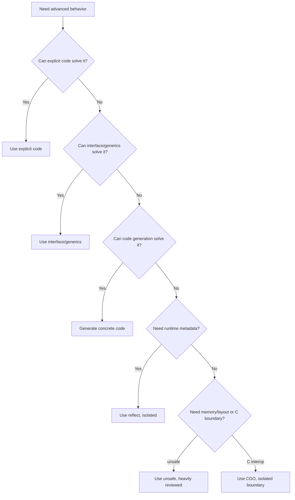
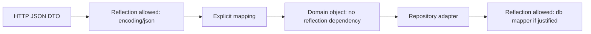
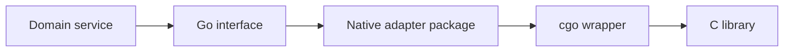
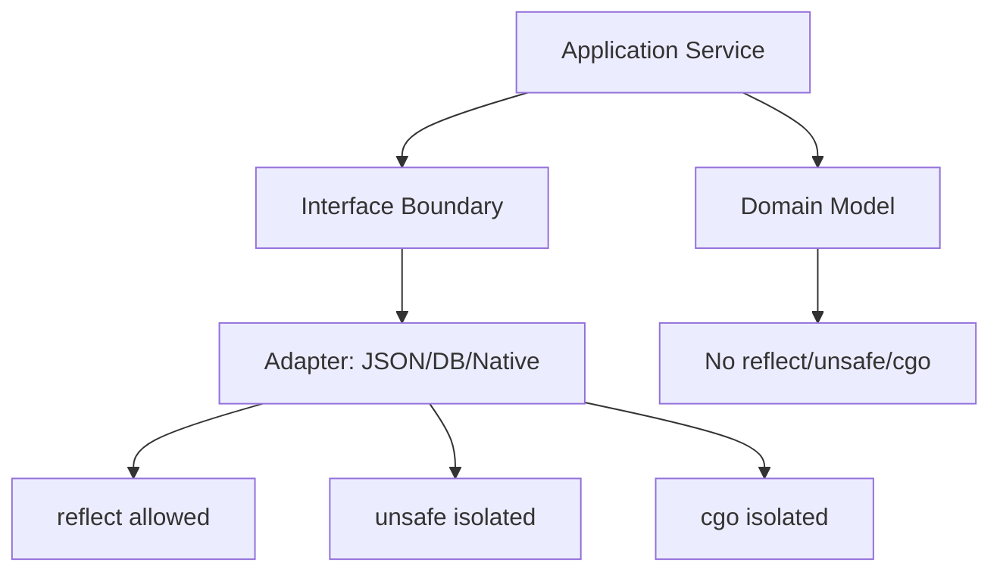
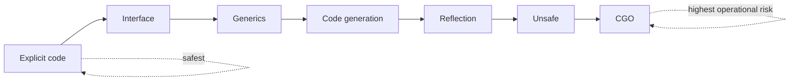

# Reflection, Unsafe, CGO, dan Boundary Berbahaya

Go menyediakan beberapa escape hatch:

- `reflect` untuk runtime type inspection dan dynamic manipulation;
- `unsafe` untuk melewati type safety tertentu;
- CGO untuk memanggil C dari Go;
- code generation sebagai alternatif compile-time untuk dynamic boilerplate.

Fitur-fitur ini berguna, tetapi berbahaya jika dipakai sebagai jalan pintas.

Top-tier Go engineer tidak menghindari fitur advanced secara dogmatis. Ia tahu kapan fitur itu benar-benar diperlukan, apa risikonya, bagaimana mengisolasinya, dan bagaimana mereviewnya.

Part ini membahas boundary berbahaya Go dengan mental model production engineering.

---

## Target Pembelajaran

Setelah menyelesaikan part ini, kita harus mampu:

1. Menjelaskan kapan reflection tepat dan kapan sebaiknya diganti explicit code, interface, generics, atau code generation.
2. Menggunakan `reflect.Type`, `reflect.Value`, `Kind`, `CanSet`, dan struct tag dengan benar.
3. Memahami failure mode umum reflection: panic, unexported field, invalid value, zero value, addressability, dan performance cost.
4. Menjelaskan apa yang dilakukan package `unsafe` dan kenapa ia tidak boleh dipakai sembarangan.
5. Memahami perbedaan `unsafe.Pointer` dan `uintptr`.
6. Mengenali risiko GC, pointer lifetime, alignment, dan portability.
7. Memahami kapan CGO justified dan biaya operasionalnya.
8. Mendesain boundary wrapper untuk reflection/unsafe/CGO agar risiko tidak menyebar ke domain code.
9. Membuat review checklist untuk kode yang memakai reflection, unsafe, atau CGO.
10. Memilih alternatif yang lebih aman sebelum memakai escape hatch.

---

## Hubungan dengan Framework Kaufman

Dalam framework Kaufman, reflection, unsafe, dan CGO termasuk sub-skill yang harus dipahami secukupnya untuk **self-correction**, bukan untuk dipakai di semua tempat.

Tujuan kita bukan menjadi “ahli trik gelap Go”.

Tujuan kita adalah mampu menjawab:

- apakah fitur ini benar-benar diperlukan?
- apa invariant yang dilanggar?
- apa risiko runtime-nya?
- apakah ada alternatif lebih sederhana?
- bagaimana membatasi blast radius?
- bagaimana mengetes dan mereviewnya?

Kaufman menekankan penghilangan hambatan praktik. Di area ini, hambatan terbesar bukan syntax, melainkan **rasa percaya diri palsu**.

Kode reflection/unsafe/CGO sering terlihat berhasil pada happy path, tetapi gagal di edge case, architecture lain, compiler version lain, race condition, atau production traffic.

---

## Peta Risiko



Urutan default:

1. explicit code;
2. small interface;
3. generics;
4. code generation;
5. reflection;
6. unsafe;
7. CGO.

Semakin ke bawah, semakin besar biaya correctness dan operasional.

---

# Bagian 1 — Reflection

## Apa itu Reflection?

Reflection adalah kemampuan program untuk melihat dan memanipulasi type/value pada runtime.

Di Go, reflection terutama ada di package `reflect`.

Dua entry point paling umum:

```go
reflect.TypeOf(v)
reflect.ValueOf(v)
```

- `TypeOf` memberi metadata type runtime.
- `ValueOf` memberi value wrapper yang bisa diinspeksi dan kadang dimanipulasi.

Contoh:

```go
package main

import (
    "fmt"
    "reflect"
)

func main() {
    v := 42

    t := reflect.TypeOf(v)
    rv := reflect.ValueOf(v)

    fmt.Println(t.Name())  // int
    fmt.Println(t.Kind())  // int
    fmt.Println(rv.Int())  // 42
}
```

Reflection membuat code lebih dynamic, tetapi mengurangi bantuan compiler.

---

## Type vs Kind

`Type` adalah type spesifik.

`Kind` adalah kategori dasar.

```go
type UserID string

var id UserID = "u1"

t := reflect.TypeOf(id)
fmt.Println(t.Name()) // UserID
fmt.Println(t.Kind()) // string
```

Perbedaan ini penting.

Jika ingin mempertahankan domain type, lihat `Type`.

Jika ingin tahu representasi umum, lihat `Kind`.

---

## Inspect Struct Field

```go
type User struct {
    ID    string `json:"id" validate:"required"`
    Email string `json:"email" validate:"required,email"`
}

func InspectStruct(v any) {
    t := reflect.TypeOf(v)

    if t.Kind() == reflect.Pointer {
        t = t.Elem()
    }

    if t.Kind() != reflect.Struct {
        return
    }

    for i := 0; i < t.NumField(); i++ {
        field := t.Field(i)
        fmt.Println(field.Name, field.Type, field.Tag.Get("json"))
    }
}
```

Struct tag adalah salah satu alasan reflection banyak dipakai:

- JSON encoder;
- validation library;
- ORM;
- config loader;
- dependency injection container;
- schema generator;
- logging redactor.

Namun, struct tag bukan domain model. Ia metadata untuk boundary tertentu.

---

## Struct Tag Discipline

Contoh wajar:

```go
type CreateUserRequest struct {
    Email string `json:"email"`
    Name  string `json:"name"`
}
```

Contoh yang mulai berbahaya:

```go
type User struct {
    ID       string `json:"id" db:"id" validate:"required" audit:"key" mask:"false" elastic:"id" kafka:"user_id"`
    Email    string `json:"email" db:"email" validate:"email" audit:"pii" mask:"true" elastic:"email" kafka:"email"`
    Password string `json:"password" db:"password_hash" validate:"required" audit:"secret" mask:"true" elastic:"-" kafka:"-"`
}
```

Masalah:

- domain model tercemar banyak transport/persistence concern;
- perubahan satu boundary bisa memengaruhi boundary lain;
- tag menjadi mini-language yang sulit direview;
- reflection library berbeda bisa punya interpretasi berbeda;
- security rule tersebar dalam string tag.

Rule praktis:

> Struct tag sebaiknya berada di DTO atau adapter boundary, bukan di core domain object yang panjang umur.

---

## Value, Addressability, dan Settable

Reflection bisa membaca banyak hal, tetapi tidak selalu bisa mengubah.

Contoh tidak settable:

```go
v := reflect.ValueOf(42)
fmt.Println(v.CanSet()) // false
```

Kenapa?

Karena `ValueOf(42)` menerima copy nilai, bukan address yang bisa dimodifikasi.

Untuk mengubah nilai, gunakan pointer lalu `Elem()`:

```go
x := 42
v := reflect.ValueOf(&x).Elem()

fmt.Println(v.CanSet()) // true
v.SetInt(100)

fmt.Println(x) // 100
```

Mental model:

- `CanAddr`: value punya address;
- `CanSet`: value bisa dimodifikasi via reflection;
- `Elem`: dereference pointer/interface;
- unexported field biasanya tidak bisa diset dari package lain.

---

## Common Panic di Reflection

Reflection sering panic jika asumsi salah.

Contoh:

```go
v := reflect.ValueOf("hello")
fmt.Println(v.Int()) // panic: reflect: call of reflect.Value.Int on string Value
```

Harus cek kind:

```go
func AsInt(v any) (int64, bool) {
    rv := reflect.ValueOf(v)
    switch rv.Kind() {
    case reflect.Int, reflect.Int8, reflect.Int16, reflect.Int32, reflect.Int64:
        return rv.Int(), true
    default:
        return 0, false
    }
}
```

Reflection code harus defensif.

Rule:

> Setiap pemanggilan method reflect yang kind-specific harus dilindungi check `Kind()` atau `Type()`.

---

## Invalid Value

`reflect.Value{}` adalah invalid value.

```go
var v reflect.Value
fmt.Println(v.IsValid()) // false
```

Memanggil banyak method pada invalid value bisa panic.

Selain itu, `ValueOf(nil)` menghasilkan zero `Value` invalid:

```go
v := reflect.ValueOf(nil)
fmt.Println(v.IsValid()) // false
```

Tetapi typed nil berbeda:

```go
var p *User = nil
v := reflect.ValueOf(p)
fmt.Println(v.IsValid()) // true
fmt.Println(v.IsNil())   // true
```

Reflection memperbesar jebakan nil interface yang sudah ada di Go.

---

## Generic vs Reflection

Sebelum generics, banyak helper collection memakai reflection.

Buruk:

```go
func Contains(slice any, target any) bool {
    rv := reflect.ValueOf(slice)
    for i := 0; i < rv.Len(); i++ {
        if reflect.DeepEqual(rv.Index(i).Interface(), target) {
            return true
        }
    }
    return false
}
```

Lebih baik dengan generics:

```go
func Contains[T comparable](items []T, target T) bool {
    for _, item := range items {
        if item == target {
            return true
        }
    }
    return false
}
```

Keuntungan generics:

- compile-time type safety;
- tidak perlu `any` untuk input;
- tidak perlu `reflect.Value`;
- tidak panic karena kind salah;
- lebih mudah dibaca;
- biasanya lebih mudah dioptimalkan.

Reflection masih cocok jika struktur type baru diketahui saat runtime.

---

## Kapan Reflection Tepat?

Reflection masuk akal untuk:

1. encoding/decoding generic;
2. membaca struct tag;
3. schema generation;
4. validation library;
5. config binding;
6. dependency injection framework kecil, meskipun sering tidak perlu;
7. test helper tertentu;
8. logging redaction berbasis tag;
9. migration tool;
10. adapter library.

Reflection kurang cocok untuk:

- domain business logic;
- hot path request processing;
- mengganti interface kecil;
- mengganti generics;
- menghindari explicit mapping;
- membuat framework internal yang sulit dilacak.

---

## Reflection di Boundary, Bukan Core

Arsitektur sehat:



Domain code seharusnya tidak peduli:

- JSON tag;
- DB tag;
- validation tag library;
- ORM metadata;
- dynamic field traversal.

Reflection boleh ada di adapter. Jangan jadikan ia model pemrograman inti.

---

## Example: Redaction dengan Reflection

Kadang reflection berguna untuk logging/security.

Contoh DTO:

```go
type UserLog struct {
    ID    string `log:"id"`
    Email string `log:"redact"`
    Token string `log:"omit"`
}
```

Redactor sederhana:

```go
func Redact(v any) map[string]any {
    out := map[string]any{}

    rv := reflect.ValueOf(v)
    rt := reflect.TypeOf(v)

    if rv.Kind() == reflect.Pointer {
        if rv.IsNil() {
            return out
        }
        rv = rv.Elem()
        rt = rt.Elem()
    }

    if rv.Kind() != reflect.Struct {
        return out
    }

    for i := 0; i < rv.NumField(); i++ {
        field := rt.Field(i)
        value := rv.Field(i)

        if !value.CanInterface() {
            continue
        }

        tag := field.Tag.Get("log")
        switch tag {
        case "omit":
            continue
        case "redact":
            out[field.Name] = "[REDACTED]"
        case "", "id":
            out[field.Name] = value.Interface()
        }
    }

    return out
}
```

Review pertanyaan:

- Apakah tag berada di DTO log khusus?
- Apakah default-nya aman?
- Apakah unexported field ditangani?
- Apakah pointer nil ditangani?
- Apakah nested struct perlu?
- Apakah field sensitif bisa lolos karena lupa tag?

Untuk keamanan, default allow bisa berbahaya. Kadang default omit lebih aman.

---

## Performance Cost Reflection

Reflection punya biaya:

- runtime type inspection;
- dynamic dispatch;
- allocation dari `Interface()` atau helper tertentu;
- hilangnya compile-time optimization tertentu;
- panic path jika salah kind;
- code lebih sulit dipahami.

Namun, jangan membuat klaim performance tanpa benchmark.

Reflection di startup/config parsing sering tidak masalah.

Reflection di hot path ribuan request per detik perlu bukti.

Rule praktis:

| Lokasi | Reflection Biasanya OK? | Catatan |
|---|---|---|
| Startup config | Ya | Tidak hot path |
| JSON encode/decode | Ya | Standard library umum memakai reflection |
| Request middleware hot path | Hati-hati | Ukur allocation/latency |
| Domain rule | Tidak | Pakai explicit code |
| ORM heavy mapping | Tergantung | Bisa jadi bottleneck |
| Test helper | Ya | Jaga clarity |

---

## Reflection Alternatives

Sebelum reflection, pertimbangkan:

### 1. Explicit Code

```go
func ToDomain(req CreateUserRequest) (User, error) {
    email, err := NewEmail(req.Email)
    if err != nil {
        return User{}, err
    }
    return User{Email: email, Name: req.Name}, nil
}
```

Explicit mapping verbose tapi jelas.

### 2. Interface

```go
type Validatable interface {
    Validate() error
}
```

### 3. Generics

```go
func First[T any](items []T) (T, bool)
```

### 4. Code Generation

Generate mapper/validator concrete saat build.

Keuntungan code generation:

- runtime lebih sederhana;
- type-safe output;
- bisa direview hasilnya;
- tidak memakai reflection di hot path.

Kekurangan:

- build pipeline lebih kompleks;
- generated code bisa besar;
- debugging source generator perlu skill tambahan.

---

# Bagian 2 — Unsafe

## Apa itu `unsafe`?

Package `unsafe` menyediakan operasi yang sengaja melewati sebagian type safety Go.

Ia memungkinkan:

- konversi pointer tertentu;
- inspeksi ukuran/alignment/offset;
- operasi memory layout;
- interop low-level;
- optimasi tertentu;
- implementasi library/system-level code.

Namun, kode yang memakai `unsafe` dapat menjadi non-portable dan lebih sulit dijamin oleh compatibility promise.

Ingat:

> `unsafe` berarti compiler tidak lagi melindungi kita sepenuhnya.

---

## Kenapa `unsafe` Ada?

Go tetap perlu membangun:

- runtime;
- standard library tertentu;
- serialization high-performance;
- memory-mapped data;
- syscall boundary;
- CGO boundary;
- zero-copy optimization;
- specialized data structure.

Tanpa escape hatch, beberapa pekerjaan low-level akan mustahil atau terlalu mahal.

Namun, sebagian besar application code tidak membutuhkan `unsafe`.

Jika service backend biasa memiliki banyak `unsafe`, itu sinyal arsitektur perlu direview.

---

## `unsafe.Sizeof`, `Alignof`, dan `Offsetof`

Contoh:

```go
type Header struct {
    A byte
    B int64
    C byte
}

fmt.Println(unsafe.Sizeof(Header{}))
fmt.Println(unsafe.Alignof(Header{}))
```

Struct memory layout dipengaruhi alignment dan padding.

Field order dapat memengaruhi ukuran struct.

```go
type Poor struct {
    A byte
    B int64
    C byte
}

type Better struct {
    B int64
    A byte
    C byte
}
```

Namun, jangan reorder field publik hanya untuk ukuran jika itu merusak readability atau compatibility serialization.

Gunakan measurement.

---

## `unsafe.Pointer` vs `uintptr`

`unsafe.Pointer` adalah pointer yang dapat dikonversi ke/dari pointer type lain dalam pola tertentu.

`uintptr` adalah integer besar cukup untuk menyimpan bit pattern pointer.

Perbedaan kritis:

- `unsafe.Pointer` masih dipahami GC sebagai pointer;
- `uintptr` adalah angka, bukan pointer;
- GC tidak melacak pointer yang disimpan sebagai `uintptr`.

Buruk:

```go
p := unsafe.Pointer(&buf[0])
u := uintptr(p)

// Banyak operasi lain...

p2 := unsafe.Pointer(u) // berbahaya: object bisa sudah pindah/lifetime berubah
_ = p2
```

Lebih aman jika arithmetic dilakukan dalam satu expression sesuai aturan unsafe yang diizinkan:

```go
p := unsafe.Pointer(uintptr(unsafe.Pointer(&buf[0])) + offset)
_ = p
```

Tetap harus sangat hati-hati. Pointer arithmetic adalah area risiko tinggi.

---

## GC dan Pointer Lifetime

Go garbage collector harus tahu object mana yang masih direferensikan.

Jika pointer disembunyikan sebagai integer, GC bisa tidak melihatnya.

Akibat:

- object dianggap tidak lagi hidup;
- memory bisa direclaim;
- pointer bisa menjadi dangling;
- bug muncul nondeterministic.

Rule praktis:

> Jangan menyimpan pointer sebagai `uintptr` melewati statement tempat ia dihitung.

Gunakan `runtime.KeepAlive` jika perlu memastikan object tetap hidup sampai titik tertentu.

Contoh konseptual:

```go
func UseBuffer(buf []byte) {
    ptr := unsafe.Pointer(&buf[0])

    callLowLevel(ptr, len(buf))

    runtime.KeepAlive(buf)
}
```

`runtime.KeepAlive` memberi sinyal bahwa `buf` harus dianggap hidup sampai baris tersebut.

---

## Unsafe String/Bytes Conversion

Konversi string ke `[]byte` normal membuat copy karena string immutable.

```go
b := []byte(s)
```

Konversi unsafe bisa menghindari copy, tetapi berbahaya.

Masalah utama:

- string immutable;
- `[]byte` mutable;
- jika slice hasil konversi dimodifikasi, invariant string dilanggar;
- memory bisa tidak valid jika lifetime salah;
- security bug bisa muncul jika data sensitif ikut dibagikan.

Modern Go menyediakan helper unsafe seperti `unsafe.String`, `unsafe.StringData`, dan `unsafe.SliceData`, tetapi tetap berada dalam package `unsafe`.

Artinya, caller tetap bertanggung jawab penuh atas invariant.

Default aman:

```go
b := []byte(s) // copy, aman
```

Gunakan zero-copy unsafe hanya jika:

1. hot path terbukti lewat profiling;
2. data tidak akan dimutasi;
3. lifetime jelas;
4. ada test dan benchmark;
5. fungsi diisolasi kecil;
6. review dilakukan oleh engineer yang paham unsafe.

---

## Unsafe dan Struct Layout

Mengandalkan layout struct bisa berbahaya jika:

- arsitektur CPU berbeda;
- alignment berbeda;
- field berubah;
- compiler behavior berubah;
- serialization format mengharapkan layout tertentu.

Jangan gunakan unsafe layout sebagai format persistence/network kecuali benar-benar paham konsekuensinya.

Lebih aman:

- encoding eksplisit;
- `encoding/binary`;
- protobuf/flatbuffers/capnproto jika sesuai;
- generated serializer;
- documented binary format.

Unsafe layout optimization sering terlihat cepat, tapi maintenance cost tinggi.

---

## Unsafe Boundary Pattern

Jika harus memakai unsafe, isolasi.

Buruk:

```go
// unsafe tersebar di domain code
func (u User) FastBytes() []byte {
    return unsafe.Slice(unsafe.StringData(u.Email), len(u.Email))
}
```

Lebih baik:

```go
package zerocopy

import "unsafe"

// StringBytes returns a read-only byte view of s.
// The returned slice must never be mutated.
// The caller must not retain it beyond the lifetime of s.
func StringBytes(s string) []byte {
    if len(s) == 0 {
        return nil
    }
    return unsafe.Slice(unsafe.StringData(s), len(s))
}
```

Lalu di package lain, beri nama yang mengekspresikan constraint:

```go
view := zerocopy.StringBytes(payload)
```

Review lebih mudah karena unsafe terkonsentrasi.

---

## Unsafe Review Checklist

Sebelum menerima kode `unsafe`, jawab:

1. Apa masalah nyata yang tidak bisa diselesaikan dengan safe Go?
2. Apakah ada benchmark/profiling yang membuktikan kebutuhan?
3. Apakah unsafe code diisolasi dalam package kecil?
4. Apakah fungsi punya dokumentasi invariant?
5. Apakah caller memahami ownership dan mutability?
6. Apakah pointer disimpan sebagai `uintptr`?
7. Apakah pointer lifetime aman terhadap GC?
8. Apakah perlu `runtime.KeepAlive`?
9. Apakah alignment aman?
10. Apakah code portable lintas architecture?
11. Apakah race detector masih relevan?
12. Apakah ada fuzz/property test?
13. Apakah ada safe fallback?
14. Apakah hasil benchmark cukup signifikan untuk trade-off?
15. Apakah maintenance cost diterima team?

Jika tidak bisa menjawab, jangan merge.

---

# Bagian 3 — CGO

## Apa itu CGO?

CGO memungkinkan Go code memanggil C code.

Contoh sangat sederhana:

```go
package main

/*
#include <stdlib.h>
*/
import "C"

import "fmt"

func main() {
    fmt.Println(C.RAND_MAX)
}
```

Import pseudo-package `C` diproses oleh cgo tool.

CGO membuka akses ke library C, tetapi juga membawa complexity C ke dalam Go project.

---

## Kapan CGO Justified?

CGO bisa justified jika:

- harus memakai library C existing yang mature;
- perlu OS/system API yang belum tersedia di Go;
- perlu interop dengan database/driver/native SDK tertentu;
- migrasi bertahap dari C/C++ ke Go;
- performance critical library sudah tersedia di C dan rewrite tidak realistis;
- hardware/vendor SDK hanya menyediakan C API.

CGO biasanya tidak justified untuk:

- menghindari belajar Go standard library;
- micro-optimization tanpa benchmark;
- memanggil C utility kecil yang mudah ditulis di Go;
- membuat build lebih rumit tanpa alasan kuat.

---

## Biaya CGO

CGO menambah biaya:

| Area | Dampak |
|---|---|
| Build | Perlu C compiler/toolchain |
| Cross compilation | Lebih rumit |
| Deployment | Native library harus tersedia |
| Performance | Crossing boundary punya overhead |
| Memory | Ownership Go vs C harus jelas |
| Debugging | Stack trace dan tooling lebih kompleks |
| Security | C memory safety risk masuk ke sistem Go |
| Portability | OS/architecture differences meningkat |
| Testing | CI matrix lebih kompleks |

CGO bukan hanya keputusan coding. Ia keputusan operasional.

---

## Memory Ownership di CGO

Saat melewati boundary Go-C, ownership harus eksplisit.

Contoh C allocation:

```go
cs := C.CString("hello")
defer C.free(unsafe.Pointer(cs))
```

`C.CString` mengalokasikan memory C. Go GC tidak membebaskannya.

Harus dipanggil `C.free`.

Jika lupa, memory leak terjadi di luar kendali GC Go.

---

## Pointer Passing Rules

Salah satu area tersulit CGO adalah aturan pointer Go yang diberikan ke C.

Intuisi dasarnya:

- Go pointer menunjuk memory yang dikelola Go GC;
- C tidak boleh menyimpan Go pointer seenaknya;
- C memory tidak dikelola Go GC;
- boundary harus menjamin lifetime dan ownership.

Jangan memberikan pointer Go ke C lalu menyimpannya untuk dipakai setelah call selesai, kecuali mengikuti aturan resmi dengan sangat hati-hati.

Lebih aman:

- copy data ke C memory;
- gunakan handle/id registry di Go;
- panggil balik Go melalui boundary yang jelas;
- batasi lifetime ke durasi call;
- dokumentasikan ownership.

---

## CGO Wrapper Pattern

Jangan sebarkan `import "C"` ke banyak package.

Buruk:

```go
package domain

// import "C" ada di banyak file domain
```

Lebih baik:



Contoh:

```go
package imagecodec

type Encoder interface {
    Encode(input []byte) ([]byte, error)
}
```

Implementation CGO berada di package adapter:

```go
package nativecodec

// #cgo LDFLAGS: -lcodec
// #include "codec.h"
import "C"
```

Domain hanya melihat interface Go.

---

## Build Tags untuk CGO

Gunakan build tags untuk menyediakan fallback atau memisahkan platform.

```go
//go:build cgo

package nativecodec
```

Fallback pure Go:

```go
//go:build !cgo

package nativecodec
```

Ini membantu:

- CI tanpa C library;
- local development;
- platform unsupported;
- testing pure Go path;
- deployment minimal.

---

## CGO dan Container

Jika binary memakai CGO, deployment container harus memperhatikan:

- libc variant;
- dynamic library;
- architecture;
- base image;
- security patching;
- runtime dependency;
- cross-compilation;
- static vs dynamic linking.

Go pure binary sering mudah dideploy. CGO bisa menghapus keuntungan itu.

Jangan mengaktifkan CGO tanpa memikirkan image, CI, dan production runtime.

---

## Testing CGO

Testing CGO harus mencakup:

- unit wrapper Go;
- integration dengan C library nyata;
- memory leak check bila tersedia;
- race/concurrency behavior;
- error code mapping;
- invalid input;
- platform matrix;
- fallback path;
- build tag path.

Jangan hanya test happy path.

C boundary harus dianggap untrusted dependency.

---

# Bagian 4 — Code Generation sebagai Alternatif

## Kenapa Code Generation?

Jika reflection dipakai untuk menghindari boilerplate, code generation sering lebih baik.

Contoh target generation:

- mapper DTO-domain;
- deep copy;
- enum stringer;
- validation;
- SQL query binding;
- mock;
- serializer;
- OpenAPI client/server;
- protobuf/gRPC;
- database model.

Keuntungan:

- compile-time type checking;
- runtime lebih cepat;
- generated code bisa dibaca;
- tidak perlu reflect di hot path.

Kekurangan:

- generator harus dipelihara;
- build workflow lebih kompleks;
- generated diff bisa besar;
- developer harus tahu kapan regenerate.

---

## `go generate`

`go generate` menjalankan command yang ditulis di komentar khusus.

Contoh:

```go
//go:generate go run ./cmd/gen-mapper
```

Lalu:

```bash
go generate ./...
```

`go generate` bukan bagian otomatis dari `go build`. CI harus memutuskan apakah generated code harus dicek konsisten.

Pattern umum:

```bash
go generate ./...
git diff --exit-code
```

Jika ada diff, generated code belum diupdate.

---

## Reflection vs Code Generation

| Kriteria | Reflection | Code Generation |
|---|---|---|
| Runtime flexibility | Tinggi | Rendah/sedang |
| Type safety | Lebih rendah | Tinggi |
| Performance | Bisa lebih mahal | Biasanya lebih baik |
| Build complexity | Rendah | Lebih tinggi |
| Debuggability | Lebih sulit | Lebih mudah jika generated code readable |
| Hot path suitability | Hati-hati | Lebih cocok |
| Dynamic schema | Cocok | Kurang cocok |

Rule praktis:

- dynamic metadata saat runtime: reflection;
- repetitive concrete code yang stabil: code generation;
- reusable algorithm typed: generics;
- behavior boundary: interface;
- simple case: explicit code.

---

# Bagian 5 — Architecture Boundary

## Jangan Biarkan Escape Hatch Menyebar

Reflection, unsafe, dan CGO harus berada di adapter layer atau utility package kecil.



Jika domain object punya dependency ke `reflect`, `unsafe`, atau `C`, itu sinyal desain buruk kecuali domain-nya memang low-level systems programming.

---

## Boundary Documentation Template

Untuk package yang memakai escape hatch, tulis dokumentasi seperti ini:

```go
// Package zerocopy provides narrowly-scoped zero-copy helpers.
//
// Safety rules:
//   - Returned byte slices must be treated as read-only.
//   - Callers must not retain returned views beyond the source lifetime.
//   - Functions in this package are only intended for profiled hot paths.
//   - Prefer safe conversions unless benchmark proves the need.
package zerocopy
```

Untuk CGO:

```go
// Package nativecodec wraps libcodec through cgo.
//
// Ownership rules:
//   - C allocations must be released by this package.
//   - Go pointers are not retained by C after calls return.
//   - Public API exposes only Go types.
//   - The package has a pure-Go fallback when built without cgo.
package nativecodec
```

Dokumentasi bukan formalitas. Ia kontrak keselamatan.

---

## Observability untuk Boundary Berbahaya

Untuk reflection/unsafe/CGO di production path, observability penting.

Tambahkan:

- error counter;
- panic recovery di boundary yang tepat;
- latency metric;
- input size metric;
- fallback counter;
- native error code mapping;
- version info native library;
- debug logging terbatas;
- feature flag untuk disable path berisiko jika memungkinkan.

CGO dan unsafe bug sering sulit direproduksi. Sinyal produksi membantu diagnosis.

---

## Security Consideration

Reflection bisa membuka risiko:

- field sensitif ikut terlog;
- validation tag salah;
- mass assignment;
- bypass explicit mapping;
- panic karena input tak terduga.

Unsafe bisa membuka risiko:

- memory corruption;
- data leak karena shared buffer;
- use-after-free style bug;
- race yang tidak jelas;
- invariant immutable dilanggar.

CGO bisa membuka risiko:

- C memory safety vulnerability;
- dependency native usang;
- supply chain library C;
- undefined behavior;
- crash process akibat bug native.

Security review wajib jika fitur ini menyentuh untrusted input.

---

# Bagian 6 — Latihan

## Latihan 1: Struct Tag Inspector

Buat function:

```go
func JSONFields(v any) ([]string, error)
```

Requirement:

- menerima struct atau pointer to struct;
- menolak nil pointer;
- menolak non-struct;
- membaca tag `json`;
- mengabaikan `json:"-"`;
- menghapus option seperti `omitempty`;
- tidak panic pada unexported field.

Test:

- struct biasa;
- pointer;
- nil pointer;
- non-struct;
- field tanpa tag;
- tag dengan option;
- tag `-`.

Tujuan:

- memahami `Type`, `Kind`, `Elem`, field tag;
- menulis reflection defensif.

---

## Latihan 2: Redactor Aman

Buat redactor dengan policy default deny.

```go
type LogUser struct {
    ID    string `log:"allow"`
    Email string `log:"redact"`
    Token string // default omit
}
```

Function:

```go
func SafeFields(v any) map[string]any
```

Rule:

- hanya field `log:"allow"` yang keluar asli;
- field `log:"redact"` keluar `[REDACTED]`;
- field tanpa tag diomit;
- unexported field diomit;
- nested struct tidak perlu untuk versi pertama.

Diskusi:

- Kenapa default deny lebih aman?
- Bagaimana jika field baru ditambah?
- Apakah redaction sebaiknya compile-time/generated?

---

## Latihan 3: Unsafe Wrapper Review

Tulis wrapper zero-copy string-to-bytes, lalu tulis review memo.

```go
func ReadOnlyBytes(s string) []byte
```

Memo harus menjawab:

1. Kenapa safe conversion tidak cukup?
2. Benchmark apa yang membuktikan kebutuhan?
3. Apa invariant mutability?
4. Apa lifetime rule?
5. Bagaimana mencegah caller memodifikasi slice?
6. Apakah nama function cukup memperingatkan?
7. Apakah package documentation cukup jelas?

Setelah itu, bandingkan dengan versi safe:

```go
func CopyBytes(s string) []byte {
    return []byte(s)
}
```

Pelajaran:

Jika sulit menulis memo safety, jangan pakai unsafe.

---

## Latihan 4: CGO Boundary Design

Tanpa harus menjalankan library C nyata, desain package wrapper untuk native image encoder.

Public API:

```go
type Encoder interface {
    Encode(ctx context.Context, input []byte) ([]byte, error)
}
```

Buat desain package:

```txt
/internal/nativecodec
/internal/nativecodec/cgo_encoder.go
/internal/nativecodec/purego_encoder.go
```

Requirement:

- build tag `cgo` dan `!cgo`;
- public API tidak mengekspos C type;
- error C dimapping ke error Go;
- C allocation dibebaskan di wrapper;
- context cancellation dipertimbangkan;
- fallback pure Go tersedia.

Diskusi:

- Apakah C call bisa dibatalkan?
- Apa yang terjadi jika C library hang?
- Bagaimana observability error code?
- Bagaimana container image memastikan library tersedia?

---

# Bagian 7 — Review Rubric

## Reflection Review Rubric

Terima reflection jika:

- berada di adapter/helper boundary;
- input type dicek defensif;
- nil dan invalid value ditangani;
- tidak panic untuk input wajar;
- unexported field tidak dipaksa;
- performance bukan hot path atau sudah diukur;
- ada test untuk edge case;
- ada alternatif yang sudah dipertimbangkan.

Tolak reflection jika:

- dipakai di domain rule;
- mengganti interface sederhana;
- mengganti generic function sederhana;
- menyembunyikan mapping penting;
- menyebabkan panic pada input normal;
- membuat security redaction default allow tanpa alasan.

---

## Unsafe Review Rubric

Terima unsafe jika:

- ada alasan kuat dan terukur;
- scope sangat kecil;
- invariant terdokumentasi;
- caller tidak perlu memahami detail unsafe terlalu banyak;
- lifetime jelas;
- mutability jelas;
- ada safe fallback atau safe alternative documented;
- test dan benchmark tersedia.

Tolak unsafe jika:

- hanya untuk “biar cepat” tanpa benchmark;
- pointer disimpan sebagai `uintptr` lama;
- invariant tidak bisa dijelaskan;
- dipakai di banyak package;
- menyentuh untrusted input tanpa security review;
- membuat portability tidak jelas.

---

## CGO Review Rubric

Terima CGO jika:

- native dependency memang diperlukan;
- wrapper mengisolasi `import "C"`;
- ownership Go/C jelas;
- C allocation dibebaskan;
- pointer passing mengikuti aturan;
- build/deployment story jelas;
- fallback atau platform strategy jelas;
- CI mencakup environment yang relevan;
- error code native dimapping dengan baik.

Tolak CGO jika:

- pure Go cukup;
- hanya micro-optimization spekulatif;
- native library tidak jelas supply chain-nya;
- deployment runtime tidak siap;
- C pointer ownership kabur;
- domain code langsung tergantung C type.

---

## Ringkasan Mental Model



Urutan default adalah dari aman ke berisiko.

Reflection, unsafe, dan CGO bukan fitur untuk dihindari total. Mereka adalah alat untuk kasus tertentu.

Tapi semakin rendah level alatnya, semakin besar kewajiban engineer untuk membuktikan:

- correctness;
- safety;
- performance benefit;
- operational readiness;
- maintainability;
- reviewability.

---

## Referensi Resmi

- Package `reflect` — https://pkg.go.dev/reflect
- Package `unsafe` — https://pkg.go.dev/unsafe
- Package `runtime` — https://pkg.go.dev/runtime
- Command cgo — https://pkg.go.dev/cmd/cgo
- Go Memory Model — https://go.dev/ref/mem
- Go Specification — https://go.dev/ref/spec
- Go generate — https://go.dev/blog/generate

---

## Checklist Selesai Part 26

Kita dianggap selesai dengan part ini jika sudah bisa:

- menjelaskan `Type` vs `Kind`;
- memakai `ValueOf`, `TypeOf`, `Elem`, `CanSet`, dan struct tag secara aman;
- menulis reflection code yang tidak panic pada input umum;
- menjelaskan kenapa unsafe harus diisolasi;
- membedakan `unsafe.Pointer` dan `uintptr`;
- menjelaskan risiko GC/lifetime/mutability dalam unsafe conversion;
- menjelaskan kapan CGO justified;
- mendesain wrapper CGO yang tidak membocorkan C type ke domain code;
- memilih code generation sebagai alternatif reflection saat cocok;
- membuat review checklist untuk boundary berbahaya.

Part berikutnya membahas security engineering di Go: dependency vulnerability, `govulncheck`, TLS, crypto hygiene, secrets, input validation, dan supply chain risk.
