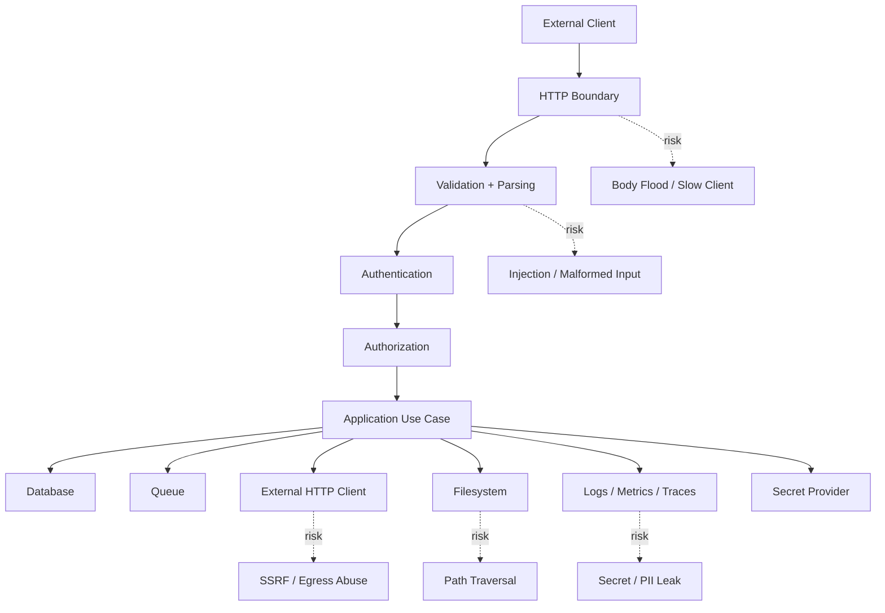
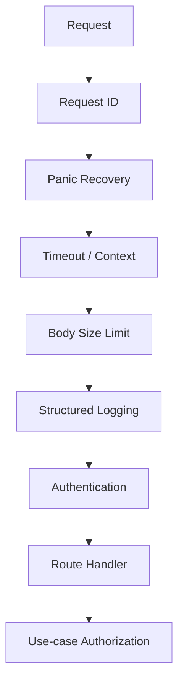
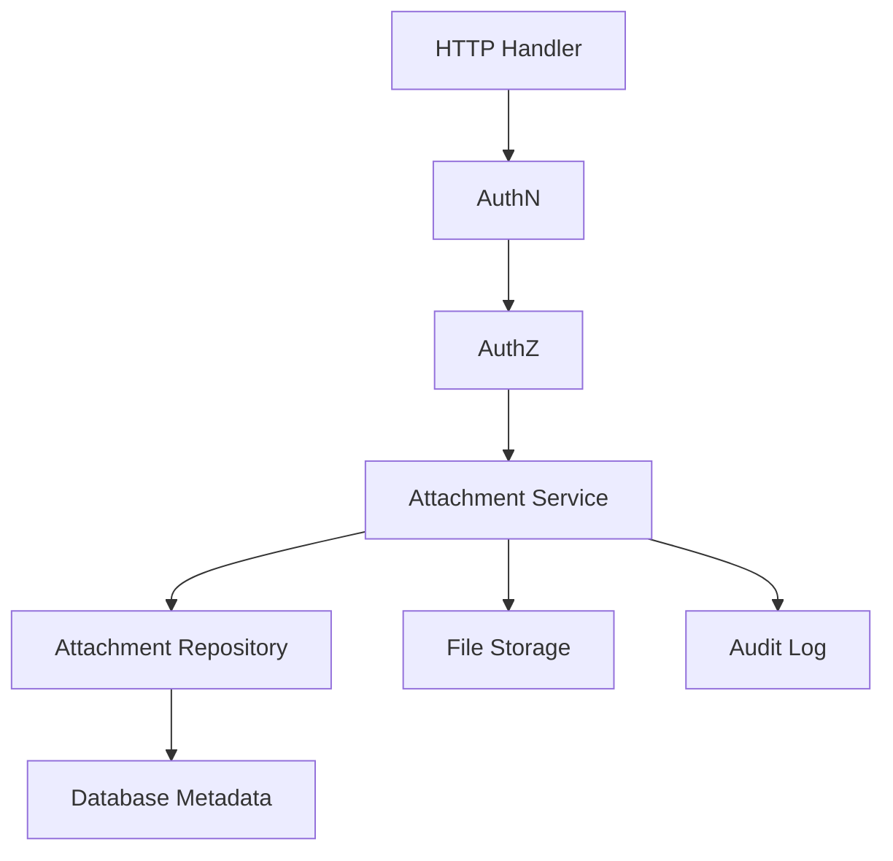

# Security Engineering in Go

Security engineering bukan fitur tambahan setelah service selesai.

Security adalah bagian dari desain boundary: input, output, dependency, secret, identity, transport, persistence, log, observability, build artifact, dan operasi production.

Di Go, banyak hal membantu keamanan:

- binary statically linked relatif mudah diaudit dan didistribusikan;
- standard library menyediakan HTTP, TLS, crypto, template escaping, path handling, dan testing primitives;
- module system membuat dependency eksplisit;
- `govulncheck` membantu mendeteksi vulnerability yang benar-benar reachable;
- type system dan explicit error handling mendorong boundary yang jelas.

Namun Go tidak otomatis membuat aplikasi aman.

Aplikasi Go tetap bisa rentan terhadap:

- injection;
- broken authentication;
- authorization bug;
- SSRF;
- path traversal;
- insecure deserialization;
- secret leakage;
- TLS misconfiguration;
- weak crypto choice;
- dependency compromise;
- overly permissive logging;
- race condition pada state security;
- missing timeout yang membuka denial of service;
- insecure container/build pipeline.

Part ini membahas security sebagai engineering discipline, bukan checklist kosmetik.

---

## Target Pembelajaran

Setelah menyelesaikan part ini, kita harus mampu:

1. Menjelaskan threat model dasar untuk Go backend service.
2. Menjalankan dan membaca hasil `govulncheck`.
3. Membedakan dependency vulnerability yang reachable, imported, dan transitive.
4. Mendesain input validation yang berada di boundary yang tepat.
5. Menghindari path traversal, SSRF, command injection, log injection, dan template injection.
6. Memakai TLS dan HTTP client/server dengan timeout serta konfigurasi yang aman.
7. Memahami crypto hygiene: jangan membuat algoritma sendiri, gunakan package yang tepat, dan bedakan hashing, encryption, MAC, signature, serta password hashing.
8. Mengelola secret tanpa membocorkannya ke log, error, config dump, atau repository.
9. Membuat security test untuk boundary berisiko.
10. Membuat checklist security review untuk Go service production-grade.

---

## Hubungan dengan Framework Kaufman

Dalam framework Kaufman, security adalah skill yang harus didekomposisi.

Security terlalu luas jika dipelajari sebagai satu topik besar.

Kita pecah menjadi sub-skill:

- threat modeling;
- dependency scanning;
- input validation;
- output encoding;
- authentication;
- authorization;
- transport security;
- secret handling;
- crypto usage;
- filesystem boundary;
- network egress boundary;
- logging hygiene;
- build supply chain;
- incident-readiness.

Target 20 jam pertama bukan menjadi penetration tester.

Targetnya adalah mampu menulis Go service yang tidak melakukan kesalahan keamanan dasar dan mampu mengoreksi diri saat melihat boundary yang lemah.

---

## Mental Model Security untuk Go Service

Security service Go bisa dipikirkan sebagai boundary graph.



Security failure biasanya terjadi saat boundary terlalu percaya pada input atau terlalu banyak detail internal bocor ke luar.

Prinsip yang dipakai sepanjang part ini:

> Data yang datang dari luar boundary selalu hostile sampai divalidasi.

> Error internal tidak otomatis aman untuk dikirim ke user.

> Log internal tidak otomatis aman untuk menyimpan secret atau PII.

> Dependency eksternal bukan bagian dari trust boundary kita.

> Timeout adalah security control, bukan hanya performance control.

---

## Threat Model Ringkas

Threat model adalah jawaban eksplisit atas pertanyaan:

1. Apa aset yang dilindungi?
2. Siapa aktor yang bisa menyerang?
3. Dari boundary mana mereka masuk?
4. Apa dampak jika berhasil?
5. Kontrol apa yang mencegah, mendeteksi, dan membatasi dampak?

Contoh untuk service Go internal:

| Asset | Threat | Boundary | Control |
|---|---|---|---|
| User data | Unauthorized read | API endpoint | AuthN, AuthZ, audit log |
| Admin operation | Privilege escalation | Handler/use case | Role check, approval workflow |
| Database | SQL injection | Query builder/repository | Parameterized query |
| Internal network | SSRF | HTTP client feature | Allowlist, URL validation, egress policy |
| Secret | Leakage | Logs/config dump | Redaction, secret provider, no debug dump |
| Availability | DoS | HTTP server | timeout, body limit, rate limit, queue limit |
| Artifact integrity | Supply chain compromise | Build pipeline | pinned dependency, SBOM, signed artifact |

Threat model tidak harus panjang. Yang penting eksplisit.

---

## Dependency Vulnerability dan `govulncheck`

Go memiliki tooling vulnerability management yang berfokus pada sinyal yang relevan bagi codebase.

`govulncheck` menganalisis source atau binary dan mencoba mempersempit laporan ke vulnerability yang reachable berdasarkan fungsi yang dipanggil secara langsung maupun transitif.

Instalasi:

```bash id="install-govulncheck"
go install golang.org/x/vuln/cmd/govulncheck@latest
```

Jalankan pada module:

```bash id="run-govulncheck"
govulncheck ./...
```

Jalankan pada binary:

```bash id="run-govulncheck-binary"
govulncheck -mode=binary ./bin/service
```

Contoh CI step:

```yaml id="ci-govulncheck"
name: Security

on:
  pull_request:
  push:
    branches: [main]

jobs:
  govulncheck:
    runs-on: ubuntu-latest
    steps:
      - uses: actions/checkout@v4
      - uses: actions/setup-go@v5
        with:
          go-version-file: go.mod
      - run: go install golang.org/x/vuln/cmd/govulncheck@latest
      - run: govulncheck ./...
```

Interpretasi hasil:

| Status | Arti | Tindakan |
|---|---|---|
| Vulnerability reachable | Ada call path ke fungsi rentan | Prioritas tinggi, patch atau mitigasi |
| Module vulnerable tapi fungsi tidak dipanggil | Risiko lebih rendah, tetap evaluasi upgrade | Jadwalkan update dependency |
| Standard library vulnerability | Tergantung versi Go | Upgrade Go toolchain |
| Binary affected | Artifact production berisiko | Rebuild dengan toolchain/dependency aman |

Jangan memperlakukan scanner sebagai oracle tunggal.

Scanner membantu menemukan known vulnerabilities. Ia tidak menemukan bug authorization, secret leakage, business logic abuse, atau desain retry yang membuka DoS.

---

## Dependency Hygiene

Dependency adalah supply chain.

Setiap dependency membawa:

- kode yang akan berjalan di process kita;
- transitive dependency lain;
- release cadence;
- maintenance risk;
- license risk;
- vulnerability history;
- API stability risk.

Prinsip dependency Go:

1. Pakai standard library jika cukup.
2. Tambahkan dependency hanya jika value-nya jelas.
3. Hindari package besar untuk kebutuhan kecil.
4. Pin versi melalui `go.mod` dan `go.sum`.
5. Review transitive dependency saat library baru ditambahkan.
6. Jalankan `govulncheck` secara reguler.
7. Update dependency dengan test suite, bukan manual confidence.
8. Hindari dependency yang mengambil alih architecture service.

Command penting:

```bash id="dependency-commands"
go list -m all
go mod graph
go mod why -m example.com/some/module
go get example.com/some/module@latest
go mod tidy
govulncheck ./...
```

Contoh review saat dependency baru diajukan:

```txt id="dependency-review-template"
Dependency: github.com/example/lib
Purpose: parse X format
Alternative: standard library? existing internal package?
Runtime critical path: yes/no
Transitive dependencies: <count>
Maintainer activity: active/stale
Security history: known CVE? govulncheck result?
License: compatible?
Replacement cost: low/medium/high
Decision: approve/reject/needs wrapper
```

Top-tier engineer tidak anti-dependency. Ia anti-dependency yang tidak dipahami.

---

## Input Validation: Boundary, Bukan Domain Noise

Validation harus terjadi dekat boundary, tetapi invariant domain tetap harus dijaga di domain.

Ada dua jenis validation:

| Jenis | Lokasi | Contoh |
|---|---|---|
| Syntactic validation | API/transport boundary | required field, max length, enum format |
| Semantic/domain validation | domain/use case | account active, transition allowed, user authorized |

Contoh DTO boundary:

```go id="request-dto-validation"
type CreateCaseRequest struct {
    Title       string `json:"title"`
    Description string `json:"description"`
    Priority    string `json:"priority"`
}

func (r CreateCaseRequest) Validate() error {
    if strings.TrimSpace(r.Title) == "" {
        return ValidationError{Field: "title", Reason: "required"}
    }
    if len(r.Title) > 200 {
        return ValidationError{Field: "title", Reason: "too_long"}
    }
    switch r.Priority {
    case "low", "medium", "high":
        return nil
    default:
        return ValidationError{Field: "priority", Reason: "invalid"}
    }
}
```

Domain invariant tidak boleh hanya berada di DTO:

```go id="domain-invariant"
type Case struct {
    id       CaseID
    title    string
    priority Priority
    status   Status
}

func NewCase(id CaseID, title string, priority Priority) (Case, error) {
    title = strings.TrimSpace(title)
    if title == "" {
        return Case{}, ErrEmptyTitle
    }
    if !priority.Valid() {
        return Case{}, ErrInvalidPriority
    }
    return Case{id: id, title: title, priority: priority, status: StatusOpen}, nil
}
```

Kenapa invariant tetap di domain?

Karena domain object bisa dibuat dari banyak entry point:

- HTTP handler;
- CLI command;
- migration;
- queue consumer;
- test fixture;
- admin job;
- internal use case.

Jika invariant hanya di HTTP layer, entry point lain bisa membuat state invalid.

---

## Strict JSON Decoding

Default `encoding/json` cukup permisif. Untuk API contract serius, gunakan decoding yang lebih ketat.

Contoh:

```go id="strict-json-decoder"
func decodeJSON[T any](w http.ResponseWriter, r *http.Request, maxBytes int64) (T, error) {
    var zero T

    r.Body = http.MaxBytesReader(w, r.Body, maxBytes)
    dec := json.NewDecoder(r.Body)
    dec.DisallowUnknownFields()

    var dst T
    if err := dec.Decode(&dst); err != nil {
        return zero, fmt.Errorf("decode json: %w", err)
    }

    if dec.More() {
        return zero, errors.New("multiple json values are not allowed")
    }

    return dst, nil
}
```

Catatan:

- `http.MaxBytesReader` membatasi request body;
- `DisallowUnknownFields` mencegah client mengirim field yang tidak dikontrakkan;
- error internal sebaiknya diterjemahkan ke error response yang stabil;
- jangan echo raw malformed input ke response atau log tanpa sanitization.

---

## SQL Injection

Dengan `database/sql`, gunakan parameterized query.

Buruk:

```go id="sql-injection-bad"
query := "SELECT id, email FROM users WHERE email = '" + email + "'"
rows, err := db.QueryContext(ctx, query)
```

Baik:

```go id="sql-injection-good"
row := db.QueryRowContext(ctx,
    `SELECT id, email FROM users WHERE email = $1`,
    email,
)
```

Untuk dynamic filter, jangan menyambung user input sebagai SQL identifier sembarangan.

Buruk:

```go id="dynamic-order-bad"
query := "SELECT id, title FROM cases ORDER BY " + r.URL.Query().Get("sort")
```

Baik:

```go id="dynamic-order-good"
func orderBy(input string) (string, error) {
    switch input {
    case "created_at":
        return "created_at", nil
    case "priority":
        return "priority", nil
    case "status":
        return "status", nil
    default:
        return "", ValidationError{Field: "sort", Reason: "invalid"}
    }
}

column, err := orderBy(r.URL.Query().Get("sort"))
if err != nil {
    return err
}

query := fmt.Sprintf(`SELECT id, title FROM cases ORDER BY %s`, column)
```

Parameter binding melindungi value, bukan identifier seperti column/table name. Untuk identifier, gunakan allowlist.

---

## Path Traversal

Path traversal terjadi saat user bisa membuat path keluar dari direktori yang diizinkan.

Buruk:

```go id="path-traversal-bad"
func download(w http.ResponseWriter, r *http.Request) {
    name := r.URL.Query().Get("file")
    http.ServeFile(w, r, "./uploads/"+name)
}
```

Input `../../etc/passwd` bisa berbahaya.

Pendekatan lebih aman:

```go id="safe-file-open"
func safeJoin(baseDir, name string) (string, error) {
    if name == "" {
        return "", errors.New("empty filename")
    }
    if strings.Contains(name, "\x00") {
        return "", errors.New("invalid filename")
    }

    cleanName := filepath.Clean(name)
    if filepath.IsAbs(cleanName) || strings.HasPrefix(cleanName, ".."+string(os.PathSeparator)) || cleanName == ".." {
        return "", errors.New("path escapes base directory")
    }

    full := filepath.Join(baseDir, cleanName)

    rel, err := filepath.Rel(baseDir, full)
    if err != nil {
        return "", err
    }
    if rel == ".." || strings.HasPrefix(rel, ".."+string(os.PathSeparator)) {
        return "", errors.New("path escapes base directory")
    }

    return full, nil
}
```

Lebih baik lagi: jangan izinkan user memilih path langsung.

Gunakan object ID:

```txt id="file-id-not-path"
GET /files/01HZ3W7S6FJH4J3J2N8VK7QG3M
```

Lalu lookup metadata di database:

```go id="file-metadata-lookup"
type FileRecord struct {
    ID          string
    StorageKey  string
    OwnerUserID string
    ContentType string
}
```

Dengan begitu user tidak pernah mengirim path filesystem.

---

## SSRF: Server-Side Request Forgery

SSRF terjadi saat service membuat request ke URL yang dikontrol user, lalu user menyalahgunakannya untuk mengakses internal network atau metadata service.

Buruk:

```go id="ssrf-bad"
func fetchPreview(ctx context.Context, rawURL string) ([]byte, error) {
    req, _ := http.NewRequestWithContext(ctx, http.MethodGet, rawURL, nil)
    resp, err := http.DefaultClient.Do(req)
    if err != nil {
        return nil, err
    }
    defer resp.Body.Close()
    return io.ReadAll(resp.Body)
}
```

Masalah:

- URL bebas;
- bisa mengarah ke `localhost`;
- bisa mengarah ke private IP;
- bisa follow redirect ke internal address;
- tidak ada timeout/body limit;
- tidak ada allowlist scheme/host.

Pendekatan lebih aman:

```go id="ssrf-safer-client"
type Fetcher struct {
    client       *http.Client
    allowedHosts map[string]struct{}
}

func NewFetcher(allowedHosts []string) *Fetcher {
    hosts := make(map[string]struct{}, len(allowedHosts))
    for _, h := range allowedHosts {
        hosts[strings.ToLower(h)] = struct{}{}
    }

    return &Fetcher{
        allowedHosts: hosts,
        client: &http.Client{
            Timeout: 5 * time.Second,
            CheckRedirect: func(req *http.Request, via []*http.Request) error {
                if len(via) >= 3 {
                    return errors.New("too many redirects")
                }
                return nil
            },
        },
    }
}

func (f *Fetcher) Fetch(ctx context.Context, raw string) ([]byte, error) {
    u, err := url.Parse(raw)
    if err != nil {
        return nil, ValidationError{Field: "url", Reason: "invalid"}
    }
    if u.Scheme != "https" {
        return nil, ValidationError{Field: "url", Reason: "scheme_not_allowed"}
    }

    host := strings.ToLower(u.Hostname())
    if _, ok := f.allowedHosts[host]; !ok {
        return nil, ValidationError{Field: "url", Reason: "host_not_allowed"}
    }

    req, err := http.NewRequestWithContext(ctx, http.MethodGet, u.String(), nil)
    if err != nil {
        return nil, err
    }

    resp, err := f.client.Do(req)
    if err != nil {
        return nil, err
    }
    defer resp.Body.Close()

    if resp.StatusCode != http.StatusOK {
        return nil, fmt.Errorf("unexpected status: %d", resp.StatusCode)
    }

    return io.ReadAll(io.LimitReader(resp.Body, 1<<20))
}
```

Untuk security tinggi, host allowlist saja belum cukup karena DNS rebinding. Kombinasikan dengan:

- egress firewall;
- service mesh policy;
- network policy;
- DNS resolution guard;
- block private ranges;
- redirect validation;
- metadata IP blocking;
- dedicated proxy.

Security control terbaik untuk SSRF sering berada di network layer plus application validation.

---

## Command Injection

Jangan gabungkan input user ke shell command.

Buruk:

```go id="command-injection-bad"
cmd := exec.Command("sh", "-c", "convert "+filename+" output.png")
```

Baik:

```go id="command-injection-good"
cmd := exec.CommandContext(ctx, "convert", inputPath, outputPath)
cmd.Env = []string{"PATH=/usr/bin:/bin"}
cmd.Dir = workDir
out, err := cmd.CombinedOutput()
if err != nil {
    return fmt.Errorf("convert failed: %w", err)
}
```

Tetap validasi `inputPath`, `outputPath`, ukuran file, content type, timeout, dan resource usage.

Jika command menjalankan binary eksternal pada input tidak terpercaya, anggap itu sandboxing problem, bukan sekadar Go problem.

---

## Template Escaping

Gunakan `html/template` untuk HTML, bukan `text/template`.

Buruk:

```go id="template-bad"
t := template.Must(texttemplate.New("page").Parse(`<div>{{.Name}}</div>`))
```

Baik:

```go id="template-good"
t := template.Must(template.New("page").Parse(`<div>{{.Name}}</div>`))
```

`html/template` melakukan contextual escaping untuk HTML.

Namun escaping tidak menggantikan validation. Jangan memasukkan user-controlled data ke context berbahaya tanpa memahami escaping context, seperti JavaScript URL, raw HTML, atau template yang dibangun dinamis.

---

## Logging Hygiene

Log adalah security boundary.

Jangan log:

- password;
- token;
- API key;
- session cookie;
- refresh token;
- authorization header;
- full credit card number;
- raw private key;
- excessive PII;
- request body penuh tanpa alasan;
- SQL query dengan sensitive value;
- config dump lengkap.

Contoh redaction:

```go id="redaction-type"
type SecretString string

func (s SecretString) String() string {
    if s == "" {
        return ""
    }
    return "<redacted>"
}

type Config struct {
    HTTPAddr string
    DBURL    SecretString
    APIKey   SecretString
}
```

Structured logging:

```go id="secure-logging"
logger.InfoContext(ctx, "request completed",
    slog.String("request_id", requestID),
    slog.String("method", r.Method),
    slog.String("path", r.URL.Path),
    slog.Int("status", status),
    slog.Duration("duration", elapsed),
)
```

Jangan:

```go id="logging-bad"
logger.Info("request", "headers", r.Header, "body", string(body))
```

Karena header bisa memuat `Authorization`, `Cookie`, dan secret lain.

---

## Authentication dan Authorization Boundary

Authentication menjawab: siapa aktor ini?

Authorization menjawab: apakah aktor ini boleh melakukan aksi ini pada resource ini?

Kesalahan umum: authentication dianggap cukup.

Contoh buruk:

```go id="authz-bad"
func (h *Handler) GetCase(w http.ResponseWriter, r *http.Request) {
    user := auth.UserFromContext(r.Context())
    if user == nil {
        http.Error(w, "unauthorized", http.StatusUnauthorized)
        return
    }

    id := chi.URLParam(r, "id")
    c, err := h.cases.Get(r.Context(), id)
    // missing: does user have access to this case?
    _ = c
    _ = err
}
```

Lebih baik:

```go id="authz-good"
type Authorizer interface {
    CanReadCase(ctx context.Context, actor Actor, caseID CaseID) error
}

func (h *Handler) GetCase(w http.ResponseWriter, r *http.Request) {
    actor, ok := auth.ActorFromContext(r.Context())
    if !ok {
        writeError(w, ErrUnauthenticated)
        return
    }

    caseID, err := ParseCaseID(chi.URLParam(r, "id"))
    if err != nil {
        writeError(w, err)
        return
    }

    if err := h.authz.CanReadCase(r.Context(), actor, caseID); err != nil {
        writeError(w, err)
        return
    }

    c, err := h.cases.Get(r.Context(), caseID)
    if err != nil {
        writeError(w, err)
        return
    }

    writeJSON(w, http.StatusOK, c)
}
```

Authorization sebaiknya menjadi use-case-level invariant, bukan hanya middleware global.

Middleware cocok untuk coarse-grained check seperti "harus login".

Use case cocok untuk object-level permission seperti "boleh membaca case X".

---

## TLS dan HTTP Security

Untuk service internet-facing, TLS biasanya ditangani load balancer, ingress, reverse proxy, atau service mesh.

Tetapi Go service tetap harus memahami TLS karena:

- internal mTLS mungkin dipakai;
- HTTP client ke dependency eksternal harus aman;
- test dan local tooling butuh konfigurasi;
- salah konfigurasi bisa menurunkan security posture.

Contoh HTTP server dengan timeout:

```go id="secure-http-server"
srv := &http.Server{
    Addr:              ":8080",
    Handler:           routes,
    ReadHeaderTimeout: 5 * time.Second,
    ReadTimeout:       10 * time.Second,
    WriteTimeout:      30 * time.Second,
    IdleTimeout:       60 * time.Second,
    MaxHeaderBytes:    1 << 20,
}
```

Timeout membantu availability.

Tanpa timeout, slow client dapat menahan resource terlalu lama.

Contoh TLS server jika Go langsung terminate TLS:

```go id="tls-server-config"
srv := &http.Server{
    Addr:    ":8443",
    Handler: routes,
    TLSConfig: &tls.Config{
        MinVersion: tls.VersionTLS12,
    },
    ReadHeaderTimeout: 5 * time.Second,
}

if err := srv.ListenAndServeTLS("server.crt", "server.key"); err != nil && !errors.Is(err, http.ErrServerClosed) {
    return err
}
```

Contoh HTTP client:

```go id="secure-http-client"
client := &http.Client{
    Timeout: 10 * time.Second,
    Transport: &http.Transport{
        Proxy: http.ProxyFromEnvironment,
        TLSClientConfig: &tls.Config{
            MinVersion: tls.VersionTLS12,
        },
        MaxIdleConns:        100,
        MaxIdleConnsPerHost: 10,
        IdleConnTimeout:     90 * time.Second,
    },
}
```

Jangan disable verification:

```go id="tls-bad"
TLSClientConfig: &tls.Config{InsecureSkipVerify: true}
```

`InsecureSkipVerify` hanya boleh muncul dalam test/lab yang sangat terkontrol, dan sebaiknya ditolak oleh lint atau review policy di production code.

---

## Crypto Hygiene

Aturan pertama crypto: jangan membuat crypto sendiri.

Gunakan package standard library atau library well-maintained yang sesuai.

Bedakan kebutuhan:

| Kebutuhan | Primitive |
|---|---|
| Hash integritas non-secret | SHA-256/BLAKE2-style hash |
| Password storage | Password hashing KDF, bukan SHA biasa |
| Message authentication | HMAC |
| Encryption authenticated | AEAD seperti AES-GCM atau ChaCha20-Poly1305 |
| Signature | Ed25519/ECDSA/RSA-PSS sesuai kebutuhan |
| Random security | `crypto/rand`, bukan `math/rand` |

Contoh token random:

```go id="crypto-random-token"
func NewToken(n int) (string, error) {
    b := make([]byte, n)
    if _, err := rand.Read(b); err != nil {
        return "", err
    }
    return base64.RawURLEncoding.EncodeToString(b), nil
}
```

Buruk:

```go id="math-rand-token-bad"
token := fmt.Sprintf("%d", rand.Int63()) // math/rand jika import-nya math/rand
```

Untuk password, jangan simpan hash SHA-256 biasa:

```go id="password-hash-bad"
sum := sha256.Sum256([]byte(password))
```

Gunakan password hashing KDF seperti bcrypt, scrypt, atau argon2 via dependency yang terpercaya dan direview.

Poin penting:

- password hashing harus lambat dan salted;
- encryption key harus dari secret manager/KMS, bukan hard-coded;
- nonce/IV harus unik sesuai aturan mode cipher;
- error crypto jangan diabaikan;
- jangan log plaintext atau key;
- rotasi key harus didesain.

---

## Secret Management

Secret bukan config biasa.

Secret meliputi:

- database password;
- API key;
- OAuth client secret;
- JWT signing key;
- private key;
- webhook secret;
- encryption key;
- service account credential.

Aturan:

1. Jangan commit secret.
2. Jangan hard-code secret dalam binary.
3. Jangan mencetak secret saat startup.
4. Jangan mengirim secret ke metrics/tracing.
5. Jangan menyimpan secret dalam error string.
6. Jangan memberi default secret production.
7. Validasi secret ada saat startup.
8. Dukung rotasi jika secret long-lived.
9. Pisahkan secret per environment.
10. Batasi permission secret provider.

Contoh startup validation:

```go id="secret-startup-validation"
type Config struct {
    HTTPAddr string
    DBURL    string
    JWTKey   string
}

func (c Config) Validate() error {
    var errs []error
    if c.HTTPAddr == "" {
        errs = append(errs, errors.New("HTTP_ADDR is required"))
    }
    if c.DBURL == "" {
        errs = append(errs, errors.New("DB_URL is required"))
    }
    if len(c.JWTKey) < 32 {
        errs = append(errs, errors.New("JWT_KEY must be at least 32 bytes"))
    }
    return errors.Join(errs...)
}
```

Jangan membuat fallback seperti ini:

```go id="secret-default-bad"
key := os.Getenv("JWT_KEY")
if key == "" {
    key = "dev-secret" // dangerous if accidentally used in production
}
```

Jika perlu local default, batasi dengan environment eksplisit:

```go id="secret-dev-only"
if cfg.Env == "development" && cfg.JWTKey == "" {
    cfg.JWTKey = "dev-only-secret-not-for-production"
}
```

Dan validasi production menolak default.

---

## JWT dan Token Handling

JWT sering disalahgunakan karena terlihat sederhana.

Hal yang harus dijaga:

- validasi signature;
- validasi algorithm;
- validasi issuer;
- validasi audience;
- validasi expiry;
- validasi not-before;
- clock skew;
- key rotation;
- revocation strategy;
- token scope;
- token lifetime.

Jangan menerima token hanya karena payload bisa di-decode.

Payload JWT adalah base64url, bukan enkripsi.

Jangan menyimpan secret dalam claim JWT.

Contoh claim aman:

```json id="jwt-claims-example"
{
  "sub": "user_123",
  "iss": "https://auth.example.com",
  "aud": "case-service",
  "exp": 1790000000,
  "scope": "case:read case:write"
}
```

JWT cocok untuk bearer token yang pendek masa berlakunya. Untuk permission yang sering berubah, tetap cek authorization ke sumber kebenaran atau gunakan token lifetime pendek.

---

## CORS

CORS bukan authentication.

CORS mengatur browser mana yang boleh membaca response dari origin lain.

Kesalahan umum:

```http id="cors-bad"
Access-Control-Allow-Origin: *
Access-Control-Allow-Credentials: true
```

Untuk credentialed request, gunakan origin allowlist eksplisit.

Contoh policy:

```go id="cors-allowlist"
func allowedOrigin(origin string) bool {
    switch origin {
    case "https://app.example.com", "https://admin.example.com":
        return true
    default:
        return false
    }
}
```

CORS tidak melindungi API dari server-to-server request, curl, bot, atau attacker yang tidak menggunakan browser.

Authorization tetap wajib.

---

## Rate Limiting dan Abuse Control

Rate limiting adalah availability dan abuse-control mechanism.

Dimensi rate limit:

- per IP;
- per user;
- per tenant;
- per API key;
- per route;
- per expensive operation;
- per write action.

Jangan hanya memakai in-memory limiter jika service scale horizontal dan butuh global quota.

In-memory limiter cukup untuk:

- local protection;
- best-effort throttle;
- non-critical admin endpoint;
- per-instance expensive operation guard.

Distributed limiter butuh Redis, gateway, service mesh, atau API gateway.

Jangan rate-limit semua endpoint sama. Login, export, search, upload, dan webhook punya risk profile berbeda.

---

## Denial of Service Controls

DoS tidak selalu berupa traffic besar.

DoS bisa berasal dari request kecil yang mahal:

- body sangat besar;
- JSON nested dalam;
- regex catastrophic backtracking;
- search query tanpa limit;
- pagination limit terlalu besar;
- upload tanpa quota;
- goroutine per item tanpa bound;
- retry storm;
- unbounded queue;
- missing timeout.

Kontrol dasar:

```go id="dos-controls-summary"
server := &http.Server{
    ReadHeaderTimeout: 5 * time.Second,
    ReadTimeout:       10 * time.Second,
    WriteTimeout:      30 * time.Second,
    IdleTimeout:       60 * time.Second,
    MaxHeaderBytes:    1 << 20,
}
```

Body limit:

```go id="body-limit"
r.Body = http.MaxBytesReader(w, r.Body, 1<<20) // 1 MiB
```

Pagination limit:

```go id="pagination-limit"
func normalizeLimit(n int) int {
    if n <= 0 {
        return 50
    }
    if n > 200 {
        return 200
    }
    return n
}
```

Worker bound:

```go id="bounded-workers"
sem := make(chan struct{}, 10)
for _, item := range items {
    sem <- struct{}{}
    go func(item Item) {
        defer func() { <-sem }()
        process(item)
    }(item)
}
```

Lebih baik gunakan worker pool dan context cancellation daripada membuat goroutine tidak terbatas.

---

## Secure Error Response

Error response harus stabil untuk client, tetapi tidak membocorkan detail internal.

Buruk:

```go id="error-leak-bad"
http.Error(w, err.Error(), http.StatusInternalServerError)
```

Baik:

```go id="safe-error-response"
type ErrorResponse struct {
    Code      string `json:"code"`
    Message   string `json:"message"`
    RequestID string `json:"request_id,omitempty"`
}

func writeError(w http.ResponseWriter, r *http.Request, err error) {
    status := http.StatusInternalServerError
    code := "internal_error"
    msg := "internal server error"

    switch {
    case errors.Is(err, ErrUnauthenticated):
        status = http.StatusUnauthorized
        code = "unauthenticated"
        msg = "authentication required"
    case errors.Is(err, ErrForbidden):
        status = http.StatusForbidden
        code = "forbidden"
        msg = "access denied"
    case errors.As(err, new(ValidationError)):
        status = http.StatusBadRequest
        code = "validation_error"
        msg = "invalid request"
    }

    writeJSON(w, status, ErrorResponse{
        Code:      code,
        Message:   msg,
        RequestID: requestIDFromContext(r.Context()),
    })
}
```

Log internal bisa menyimpan detail error dengan request ID, tetapi tetap tidak boleh memuat secret.

---

## Audit Trail vs Observability Log

Audit log berbeda dari application log.

Application log menjawab:

- apa yang terjadi pada request?
- error apa yang muncul?
- latency berapa?
- dependency mana yang gagal?

Audit log menjawab:

- siapa melakukan aksi apa?
- pada resource apa?
- kapan?
- dari context mana?
- hasilnya apa?
- apakah approval/authorization terjadi?

Contoh audit event:

```go id="audit-event"
type AuditEvent struct {
    EventID    string
    ActorID    string
    Action     string
    Resource   string
    ResourceID string
    Decision   string
    Reason     string
    CreatedAt  time.Time
    RequestID  string
}
```

Audit log harus:

- immutable atau append-only jika memungkinkan;
- memiliki retention policy;
- tidak menyimpan secret;
- cukup detail untuk investigasi;
- tidak bergantung pada log debug volatile;
- diuji dalam use case sensitif.

Untuk regulatory systems, audit trail sering menjadi bagian dari defensibility model, bukan observability tambahan.

---

## Security Testing

Security testing tidak harus selalu kompleks.

Mulai dari test boundary.

### Test Strict JSON

```go id="test-strict-json"
func TestDecodeJSONRejectsUnknownField(t *testing.T) {
    body := strings.NewReader(`{"title":"case","unknown":true}`)
    req := httptest.NewRequest(http.MethodPost, "/cases", body)
    rec := httptest.NewRecorder()

    _, err := decodeJSON[CreateCaseRequest](rec, req, 1<<20)
    if err == nil {
        t.Fatal("expected error")
    }
}
```

### Test Path Traversal

```go id="test-path-traversal"
func TestSafeJoinRejectsTraversal(t *testing.T) {
    _, err := safeJoin("/app/uploads", "../../etc/passwd")
    if err == nil {
        t.Fatal("expected traversal to be rejected")
    }
}
```

### Test Authorization

```go id="test-authz"
func TestGetCaseRejectsUnauthorizedUser(t *testing.T) {
    svc := NewCaseService(repo, authzDenyAll{})

    _, err := svc.GetCase(context.Background(), Actor{ID: "u1"}, CaseID("c1"))
    if !errors.Is(err, ErrForbidden) {
        t.Fatalf("expected forbidden, got %v", err)
    }
}
```

### Fuzz URL Parser

```go id="fuzz-url-validation"
func FuzzValidateWebhookURL(f *testing.F) {
    f.Add("https://example.com/webhook")
    f.Add("http://localhost:8080")
    f.Add("file:///etc/passwd")

    f.Fuzz(func(t *testing.T, raw string) {
        _ = validateWebhookURL(raw)
    })
}
```

Security test yang baik mengabadikan asumsi boundary.

---

## Secure Middleware Stack

Contoh urutan middleware:



Catatan:

- recovery mencegah panic membunuh process, tetapi panic tetap harus di-log dan diperbaiki;
- body size limit sebaiknya terjadi sebelum decode;
- authentication bisa middleware, authorization sering use-case-specific;
- logging harus redacted;
- timeout harus propagate via context.

---

## Security Checklist untuk Code Review Go

Gunakan checklist ini saat review PR.

### Input Boundary

- Apakah semua input eksternal divalidasi?
- Apakah JSON unknown field ditolak jika contract strict?
- Apakah body size dibatasi?
- Apakah pagination punya maksimum?
- Apakah file upload punya size/content-type policy?
- Apakah enum memakai allowlist?

### AuthN/AuthZ

- Apakah endpoint butuh authentication?
- Apakah object-level authorization dilakukan?
- Apakah admin action punya kontrol tambahan?
- Apakah tenant boundary tidak bisa dilewati?
- Apakah authorization diuji?

### Data Access

- Apakah SQL memakai parameterized query?
- Apakah dynamic identifier memakai allowlist?
- Apakah transaction boundary jelas?
- Apakah sensitive data tidak dikembalikan tanpa perlu?

### Network

- Apakah outbound HTTP punya timeout?
- Apakah URL user-controlled dibatasi?
- Apakah SSRF dipertimbangkan?
- Apakah redirect policy aman?
- Apakah TLS verification tidak dimatikan?

### Secrets

- Apakah secret tidak di-log?
- Apakah config dump aman?
- Apakah default production secret ditolak?
- Apakah key/token punya rotasi?

### Logging/Audit

- Apakah PII/secret tidak bocor?
- Apakah audit event dibuat untuk aksi sensitif?
- Apakah request ID/correlation ID tersedia?
- Apakah error response tidak membocorkan stack/internal detail?

### Dependency/Supply Chain

- Apakah dependency baru justified?
- Apakah `govulncheck` bersih atau hasilnya dimitigasi?
- Apakah `go.mod` dan `go.sum` masuk review?
- Apakah dependency transitive dipahami?

### Availability

- Apakah timeout, limit, dan backpressure ada?
- Apakah goroutine unbounded?
- Apakah retry bisa menyebabkan retry storm?
- Apakah queue punya DLQ/poison handling?

---

## Anti-pattern Security di Go

| Anti-pattern | Kenapa buruk | Alternatif |
|---|---|---|
| `http.DefaultClient` untuk production dependency | timeout tidak eksplisit | custom `http.Client` |
| `InsecureSkipVerify: true` | TLS identity tidak diverifikasi | trust root/mTLS benar |
| log full headers/body | token/PII bocor | redacted structured log |
| SQL string concatenation | injection | parameterized query |
| path dari query langsung ke filesystem | path traversal | object ID + metadata lookup |
| user-controlled URL bebas | SSRF | allowlist + egress policy |
| secret default production | compromise massal | fail-fast startup |
| authorization hanya di UI | API bisa dipanggil langsung | server-side authz |
| scanner dianggap cukup | logic bug tidak terdeteksi | threat model + review + tests |
| crypto custom | mudah salah | standard vetted primitive |

---

## Latihan Terarah

### Latihan 1 — Jalankan `govulncheck`

Pada service latihan:

```bash id="exercise-govulncheck"
govulncheck ./...
```

Tulis hasil:

```txt id="govulncheck-report-template"
Date:
Go version:
Module:
Result:
Reachable vulnerabilities:
Imported vulnerable modules:
Action:
Owner:
Due date:
```

### Latihan 2 — Harden JSON Handler

Ambil handler dari Part 19 atau Part 21.

Tambahkan:

- body size limit;
- strict JSON decode;
- validation error response;
- request ID;
- safe internal logging.

### Latihan 3 — Tambahkan Object-level Authorization

Buat use case:

```txt id="authz-exercise"
Actor A can read case C only if:
- actor belongs to same tenant, and
- actor has role case_reader or case_admin, and
- case is not sealed unless actor has sealed_case_access.
```

Tulis test untuk:

- unauthenticated;
- wrong tenant;
- missing role;
- sealed case without permission;
- allowed actor.

### Latihan 4 — SSRF Guard

Buat function `ValidateOutboundURL(raw string) error`.

Harus menolak:

- empty URL;
- non-HTTPS;
- localhost;
- private IP;
- metadata IP;
- host tidak di allowlist;
- malformed URL.

### Latihan 5 — Security Review

Review service latihan dengan checklist di atas.

Buat file:

```txt id="security-review-output"
docs/security-review.md
```

Isi minimal:

- scope;
- assets;
- threat table;
- findings;
- severity;
- mitigation;
- residual risk.

---

## Mini Project: Secure Case Attachment Download

Buat endpoint:

```txt id="attachment-endpoint"
GET /cases/{case_id}/attachments/{attachment_id}
```

Requirement:

1. User harus authenticated.
2. User harus authorized membaca case.
3. Attachment lookup berdasarkan ID, bukan path user.
4. File path tidak boleh keluar dari storage base directory.
5. Response harus set content type aman.
6. Error internal tidak bocor.
7. Access harus diaudit.
8. Test mencakup unauthorized, forbidden, not found, traversal attempt, dan success.

Architecture:



Ini latihan kecil tetapi realistis karena menyentuh auth, path safety, audit, error handling, dan testability.

---

## Referensi Resmi

- Go Security — https://go.dev/doc/security/
- Security Best Practices for Go Developers — https://go.dev/doc/security/best-practices
- Go Vulnerability Management — https://go.dev/doc/security/vuln/
- govulncheck tutorial — https://go.dev/doc/tutorial/govulncheck
- govulncheck package — https://pkg.go.dev/golang.org/x/vuln/cmd/govulncheck
- Package `crypto/tls` — https://pkg.go.dev/crypto/tls
- Package `crypto/rand` — https://pkg.go.dev/crypto/rand
- Package `net/http` — https://pkg.go.dev/net/http
- Package `html/template` — https://pkg.go.dev/html/template
- Package `database/sql` — https://pkg.go.dev/database/sql

---

## Checklist Selesai Part 27

Kita dianggap selesai dengan part ini jika sudah bisa:

- menjelaskan threat model service Go;
- menjalankan `govulncheck ./...` dan membaca hasilnya;
- menilai dependency baru dari aspek supply chain;
- membuat strict JSON decoder dengan body limit;
- mencegah SQL injection dengan parameterized query dan allowlist identifier;
- mencegah path traversal dengan object ID atau safe path validation;
- menjelaskan risiko SSRF dan kontrol mitigasinya;
- membuat HTTP client/server dengan timeout aman;
- menjelaskan kenapa `InsecureSkipVerify` berbahaya;
- membedakan hashing, password hashing, encryption, MAC, signature, dan random secure;
- mengelola secret tanpa logging leakage;
- membedakan authentication dan authorization;
- membuat security test untuk boundary penting;
- memakai checklist security review sebelum merge.

Part berikutnya membahas build, release, container, dan deployment pipeline: bagaimana mengubah Go service yang aman di source code menjadi artifact production yang reproducible, kecil, terverifikasi, dan siap dioperasikan.
