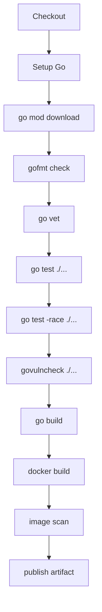
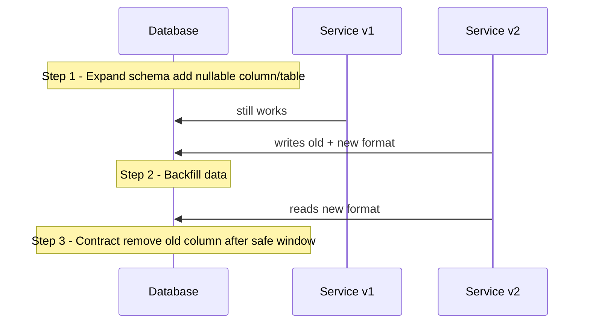
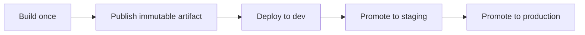

# Build, Release, Container, dan Deployment Pipeline

Source code yang benar belum cukup.

Production membutuhkan artifact yang bisa dipercaya.

Artifact yang baik harus:

- reproducible;
- versioned;
- tested;
- scanned;
- small enough;
- observable;
- configurable;
- deployable;
- rollbackable;
- traceable ke commit, dependency, dan build pipeline.

Go cocok untuk pipeline modern karena `go build` menghasilkan binary yang mudah didistribusikan, cross compilation relatif sederhana, dependency dikunci di `go.mod`/`go.sum`, dan runtime dependency bisa kecil.

Namun pipeline tetap bisa buruk jika:

- build tidak deterministic;
- version tidak tertanam;
- binary tidak dites;
- container terlalu besar;
- image berjalan sebagai root;
- secret masuk build layer;
- migration tidak terkontrol;
- rollback tidak dipikirkan;
- CI hanya menjalankan happy path;
- artifact tidak bisa ditelusuri ke source.

Part ini membahas bagaimana membawa Go service dari source code menuju production artifact yang layak.

---

## Target Pembelajaran

Setelah menyelesaikan part ini, kita harus mampu:

1. Menjelaskan perbedaan `go run`, `go build`, `go install`, dan `go test` dalam workflow engineering.
2. Membuat binary Go dengan version metadata.
3. Menggunakan build flags penting seperti `-o`, `-ldflags`, `-trimpath`, `-race`, dan build tags.
4. Melakukan cross compilation dengan `GOOS` dan `GOARCH`.
5. Mendesain Dockerfile multi-stage untuk Go service.
6. Membuat image kecil yang berjalan sebagai non-root user.
7. Memahami kapan `CGO_ENABLED=0` tepat dan kapan tidak.
8. Menambahkan CI pipeline untuk fmt, vet, test, race, vulncheck, build, container scan, dan artifact publish.
9. Menghasilkan release artifact yang traceable.
10. Mendesain deployment dan rollback strategy yang realistis.

---

## Hubungan dengan Framework Kaufman

Dalam framework Kaufman, build/release adalah bagian dari menghilangkan hambatan praktik.

Jika setiap latihan atau deployment membutuhkan ritual manual, pembelajaran melambat dan production risk naik.

Target kita:

- satu command untuk test;
- satu command untuk build;
- satu command untuk container image;
- pipeline otomatis untuk validasi;
- artifact yang punya metadata;
- rollback path yang jelas.

Skill ini penting karena software engineer senior tidak hanya bertanggung jawab atas code path, tetapi juga delivery path.

---

## Mental Model Delivery Pipeline

```mermaid id="go-delivery-pipeline"
flowchart LR
    A["Source Code"] --> B["Static Checks"]
    B --> C["Tests"]
    C --> D["Security Scan"]
    D --> E["Build Binary"]
    E --> F["Package Container"]
    F --> G["Scan Image"]
    G --> H["Publish Artifact"]
    H --> I["Deploy"]
    I --> J["Observe"]
    J --> K["Rollback / Roll Forward"]
```



Pipeline yang baik bukan sekadar automation.

Pipeline adalah enforcement layer untuk engineering standard.

---

## `go run`, `go build`, `go install`, dan `go test`

| Command | Tujuan | Kapan dipakai |
|---|---|---|
| `go run` | compile dan menjalankan langsung | local quick execution |
| `go build` | compile package dan dependency menjadi binary | release/build artifact |
| `go install` | compile dan install binary ke `GOBIN`/`GOPATH/bin` | install tools/CLI |
| `go test` | compile dan menjalankan test | validation |

Contoh:

```bash id="basic-go-commands"
go run ./cmd/case-service
go build -o bin/case-service ./cmd/case-service
go install golang.org/x/vuln/cmd/govulncheck@latest
go test ./...
```

`go build` harus menjadi command yang dipakai pipeline untuk menghasilkan artifact. Jangan mengandalkan `go run` untuk production.

---

## Project Layout untuk Build yang Jelas

Layout umum:

```txt id="build-project-layout"
case-service/
├── cmd/
│   └── case-service/
│       └── main.go
├── internal/
│   ├── app/
│   ├── config/
│   ├── httpapi/
│   ├── persistence/
│   └── version/
├── migrations/
├── Dockerfile
├── Makefile
├── go.mod
└── go.sum
```

Prinsip:

- `cmd/<binary-name>` berisi entry point;
- business logic tidak ditaruh di `main.go`;
- package `internal/version` bisa menyimpan metadata;
- Dockerfile berada dekat repo root agar build context jelas;
- migration punya lifecycle sendiri.

`main.go` sebaiknya tipis:

```go id="main-thin"
package main

import (
    "context"
    "log/slog"
    "os"

    "example.com/case-service/internal/app"
    "example.com/case-service/internal/config"
)

func main() {
    ctx := context.Background()

    cfg, err := config.Load()
    if err != nil {
        slog.Error("load config", "error", err)
        os.Exit(2)
    }

    if err := app.Run(ctx, cfg); err != nil {
        slog.Error("service stopped", "error", err)
        os.Exit(1)
    }
}
```

---

## Makefile sebagai Operational Interface Lokal

Makefile tidak wajib, tetapi berguna sebagai interface konsisten.

```makefile id="go-makefile"
APP := case-service
PKG := ./cmd/$(APP)
BIN := bin/$(APP)
VERSION ?= dev
COMMIT := $(shell git rev-parse --short HEAD 2>/dev/null || echo unknown)
DATE := $(shell date -u +%Y-%m-%dT%H:%M:%SZ)

LDFLAGS := -X 'example.com/case-service/internal/version.Version=$(VERSION)' \
           -X 'example.com/case-service/internal/version.Commit=$(COMMIT)' \
           -X 'example.com/case-service/internal/version.BuildDate=$(DATE)'

.PHONY: fmt vet test race vuln build clean

fmt:
	gofmt -w .

vet:
	go vet ./...

test:
	go test ./...

race:
	go test -race ./...

vuln:
	govulncheck ./...

build:
	go build -trimpath -ldflags "$(LDFLAGS)" -o $(BIN) $(PKG)

clean:
	rm -rf bin
```

Dengan ini, developer dan CI memakai command yang sama.

---

## Version Injection dengan `-ldflags`

Production binary harus bisa menjawab:

- versi apa ini?
- commit apa?
- kapan dibangun?
- Go version apa?
- dirty build atau clean build?

Package version:

```go id="version-package"
package version

import "runtime"

var (
    Version   = "dev"
    Commit    = "unknown"
    BuildDate = "unknown"
)

type Info struct {
    Version   string `json:"version"`
    Commit    string `json:"commit"`
    BuildDate string `json:"build_date"`
    GoVersion string `json:"go_version"`
}

func Get() Info {
    return Info{
        Version:   Version,
        Commit:    Commit,
        BuildDate: BuildDate,
        GoVersion: runtime.Version(),
    }
}
```

Build:

```bash id="ldflags-build"
go build -trimpath \
  -ldflags "-X 'example.com/case-service/internal/version.Version=1.4.2' \
            -X 'example.com/case-service/internal/version.Commit=$(git rev-parse --short HEAD)' \
            -X 'example.com/case-service/internal/version.BuildDate=$(date -u +%Y-%m-%dT%H:%M:%SZ)'" \
  -o bin/case-service ./cmd/case-service
```

Expose endpoint internal:

```go id="version-handler"
func VersionHandler(w http.ResponseWriter, r *http.Request) {
    writeJSON(w, http.StatusOK, version.Get())
}
```

Endpoint version membantu incident response dan rollback verification.

---

## Build Flags Penting

### `-o`

Menentukan output binary:

```bash id="build-o"
go build -o bin/case-service ./cmd/case-service
```

### `-trimpath`

Menghapus path lokal dari binary untuk build yang lebih reproducible dan tidak membocorkan path workstation/CI.

```bash id="build-trimpath"
go build -trimpath -o bin/case-service ./cmd/case-service
```

### `-ldflags`

Mengirim linker flags, sering dipakai untuk version injection dan stripping.

```bash id="build-ldflags"
go build -ldflags "-s -w" -o bin/case-service ./cmd/case-service
```

Catatan: `-s -w` mengurangi ukuran binary tetapi bisa mengurangi detail debug. Jangan gunakan secara dogmatis jika profiling/debugging production membutuhkan simbol.

### `-race`

Build/test dengan race detector.

```bash id="race-build-test"
go test -race ./...
go build -race -o bin/case-service-race ./cmd/case-service
```

Biasanya `-race` dipakai di test/staging, bukan production normal, karena overhead.

### `-tags`

Mengaktifkan build constraints.

```bash id="build-tags"
go test -tags=integration ./...
go build -tags=netgo -o bin/case-service ./cmd/case-service
```

---

## Build Constraints dan Build Tags

Build constraints menentukan file mana yang masuk build.

Contoh:

```go id="integration-build-tag"
//go:build integration

package persistence_test

import "testing"

func TestPostgresRepositoryIntegration(t *testing.T) {
    // requires real postgres
}
```

Jalankan:

```bash id="run-integration-tag"
go test -tags=integration ./...
```

Contoh file platform-specific:

```txt id="platform-files"
config_linux.go
config_windows.go
```

Aturan:

- gunakan build tags untuk boundary jelas: integration test, platform-specific code, optional implementation;
- jangan gunakan build tags untuk menyembunyikan behavior bisnis;
- dokumentasikan tags di README/Makefile;
- pastikan CI menjalankan kombinasi tags penting.

---

## Cross Compilation

Go mendukung cross compilation melalui environment variable.

Contoh:

```bash id="cross-compilation"
GOOS=linux GOARCH=amd64 go build -o bin/case-service-linux-amd64 ./cmd/case-service
GOOS=linux GOARCH=arm64 go build -o bin/case-service-linux-arm64 ./cmd/case-service
GOOS=darwin GOARCH=arm64 go build -o bin/case-service-darwin-arm64 ./cmd/case-service
```

Matrix umum:

| GOOS | GOARCH | Target |
|---|---|---|
| linux | amd64 | server x86_64 |
| linux | arm64 | ARM server/container |
| darwin | arm64 | macOS Apple Silicon |
| windows | amd64 | Windows |

Caveat:

- jika memakai CGO, cross compilation lebih rumit;
- dependency native perlu compiler/library target;
- `CGO_ENABLED=0` mempermudah static-ish binary, tetapi tidak selalu cocok;
- timezone, DNS resolver, dan libc behavior perlu dipahami jika image sangat minimal.

---

## `CGO_ENABLED=0`: Kapan Tepat?

Banyak Dockerfile Go memakai:

```bash id="cgo-disabled-build"
CGO_ENABLED=0 GOOS=linux go build -o /out/case-service ./cmd/case-service
```

Kelebihan:

- binary lebih mudah dijalankan di image minimal;
- tidak perlu libc dynamic dependency;
- cocok untuk scratch/distroless static-style deployment;
- cross compilation lebih mudah.

Risiko/caveat:

- package yang membutuhkan CGO tidak bisa dipakai;
- beberapa behavior resolver/user lookup bisa berbeda;
- integrasi native library tidak tersedia;
- performance/compatibility tertentu bisa berubah.

Rule of thumb:

- pure Go HTTP service: sering cocok dengan `CGO_ENABLED=0`;
- service dengan SQLite CGO/native library: tidak cocok;
- service dengan dependency C/security module khusus: evaluasi detail;
- jangan copy-paste tanpa test di runtime image final.

---

## Dockerfile Multi-stage

Contoh production-oriented Dockerfile:

```dockerfile id="dockerfile-multistage"
# syntax=docker/dockerfile:1

FROM golang:1.26 AS build
WORKDIR /src

COPY go.mod go.sum ./
RUN go mod download

COPY . .

ARG VERSION=dev
ARG COMMIT=unknown
ARG BUILD_DATE=unknown

RUN CGO_ENABLED=0 GOOS=linux GOARCH=amd64 go build \
    -trimpath \
    -ldflags="-s -w \
      -X 'example.com/case-service/internal/version.Version=${VERSION}' \
      -X 'example.com/case-service/internal/version.Commit=${COMMIT}' \
      -X 'example.com/case-service/internal/version.BuildDate=${BUILD_DATE}'" \
    -o /out/case-service ./cmd/case-service

FROM gcr.io/distroless/static-debian12:nonroot
WORKDIR /
COPY --from=build /out/case-service /case-service
USER nonroot:nonroot
EXPOSE 8080
ENTRYPOINT ["/case-service"]
```

Kualitas Dockerfile ini:

- build dan runtime stage terpisah;
- runtime image kecil;
- berjalan sebagai non-root;
- version metadata tertanam;
- `go.mod` dan `go.sum` dicopy lebih awal untuk cache dependency;
- binary final saja yang masuk runtime.

---

## Scratch vs Distroless vs Alpine

| Base image | Kelebihan | Kekurangan |
|---|---|---|
| `scratch` | sangat kecil, attack surface rendah | tidak ada shell, CA cert perlu dicopy, debugging sulit |
| distroless | kecil, non-root variant, ada CA cert pada varian tertentu | tetap minim tool debug |
| alpine | kecil dan punya package manager | musl behavior, surface lebih besar dari distroless |
| debian/ubuntu | familiar dan mudah debug | lebih besar, surface lebih luas |

Untuk Go service production, distroless sering menjadi default seimbang.

`scratch` cocok jika tim memahami konsekuensinya.

Alpine tidak otomatis buruk, tetapi jangan dipakai hanya karena "kecil" tanpa memahami musl, CA certificate, user, dan debugging trade-off.

---

## Jangan Masukkan Secret ke Build

Buruk:

```dockerfile id="docker-secret-bad"
ARG DB_PASSWORD
ENV DB_PASSWORD=$DB_PASSWORD
```

Masalah:

- secret bisa masuk image layer;
- bisa terbaca dari history/metadata;
- image yang sama bisa tersebar ke registry;
- rotasi secret butuh rebuild image.

Benar:

- image tidak mengandung secret;
- secret di-inject saat runtime via secret manager, Kubernetes Secret, Vault, cloud secret service, atau environment yang dikontrol;
- application validate secret saat startup;
- logs tidak mencetak secret.

---

## Non-root User

Container sebaiknya tidak berjalan sebagai root.

Distroless nonroot:

```dockerfile id="distroless-nonroot"
FROM gcr.io/distroless/static-debian12:nonroot
USER nonroot:nonroot
```

Jika base image sendiri:

```dockerfile id="manual-nonroot"
RUN addgroup --system app && adduser --system --ingroup app app
USER app:app
```

Jangan mengandalkan non-root sebagai satu-satunya security control. Ia mengurangi blast radius, tetapi tidak memperbaiki bug authorization, SSRF, injection, atau secret leakage.

---

## Health Check dan Runtime Contract

Service production harus punya operational contract.

Endpoint umum:

| Endpoint | Tujuan |
|---|---|
| `/healthz` | process hidup |
| `/readyz` | siap menerima traffic |
| `/version` | metadata build |
| `/metrics` | metrics |
| `/debug/pprof` | profiling, biasanya dibatasi |

Readiness tidak sama dengan liveness.

```go id="health-readiness"
func Healthz(w http.ResponseWriter, r *http.Request) {
    w.WriteHeader(http.StatusOK)
    _, _ = w.Write([]byte("ok"))
}

func Readyz(checks ...func(context.Context) error) http.HandlerFunc {
    return func(w http.ResponseWriter, r *http.Request) {
        ctx, cancel := context.WithTimeout(r.Context(), 2*time.Second)
        defer cancel()

        for _, check := range checks {
            if err := check(ctx); err != nil {
                http.Error(w, "not ready", http.StatusServiceUnavailable)
                return
            }
        }
        w.WriteHeader(http.StatusOK)
        _, _ = w.Write([]byte("ready"))
    }
}
```

Liveness sebaiknya tidak mengecek dependency berat. Jika database down lalu liveness gagal, orchestrator bisa restart semua pod dan memperburuk insiden.

Readiness boleh mengecek dependency yang diperlukan untuk menerima traffic.

---

## CI Pipeline Minimum

Pipeline minimum untuk Go service:



Contoh GitHub Actions:

```yaml id="github-actions-go-ci"
name: Go CI

on:
  pull_request:
  push:
    branches: [main]

jobs:
  test:
    runs-on: ubuntu-latest
    steps:
      - uses: actions/checkout@v4
      - uses: actions/setup-go@v5
        with:
          go-version-file: go.mod

      - name: Download modules
        run: go mod download

      - name: Check formatting
        run: |
          test -z "$(gofmt -l .)"

      - name: Vet
        run: go vet ./...

      - name: Test
        run: go test ./...

      - name: Race test
        run: go test -race ./...

      - name: Install govulncheck
        run: go install golang.org/x/vuln/cmd/govulncheck@latest

      - name: Vulnerability check
        run: govulncheck ./...

      - name: Build
        run: go build -trimpath -o bin/case-service ./cmd/case-service
```

Untuk repo besar, race test bisa dipisah atau dijadwalkan jika terlalu mahal, tetapi critical package sebaiknya tetap tercakup.

---

## Release Pipeline

Release pipeline berbeda dari PR validation.

PR validation menjawab: apakah perubahan aman digabung?

Release pipeline menjawab: artifact mana yang akan dipromosikan ke environment?

Release metadata:

```txt id="release-metadata"
version: 1.7.0
commit: a1b2c3d
build_date: 2026-06-27T10:15:00Z
go_version: go1.26.x
module: example.com/case-service
image: registry.example.com/case-service:1.7.0
image_digest: sha256:...
sbom: attached
vulnerability_scan: passed/accepted-risk
migration_required: yes/no
rollback_notes: ...
```

Prinsip penting:

- deploy berdasarkan immutable digest, bukan mutable tag saja;
- release notes harus menyebut migration dan compatibility impact;
- artifact yang sama dipromosikan antar environment;
- jangan rebuild artifact berbeda untuk staging dan production;
- config berubah per environment, binary/image sebaiknya sama.

---

## Semantic Versioning untuk Service vs Library

Untuk library Go public, semantic import versioning penting.

Untuk service internal, semver tetap berguna tetapi maknanya beda.

| Jenis | Version meaning |
|---|---|
| Public library | API compatibility untuk consumer code |
| Internal service | release identity dan deployment traceability |
| Public API service | contract compatibility untuk client |
| CLI tool | user-facing command/API compatibility |

Service bisa memakai:

- calendar versioning;
- semantic versioning;
- git SHA only;
- build number.

Yang penting:

- unik;
- traceable;
- otomatis;
- terlihat di `/version`;
- terhubung ke changelog dan artifact digest.

---

## SBOM dan Supply Chain Awareness

SBOM atau Software Bill of Materials adalah daftar komponen software dalam artifact.

Untuk Go service, SBOM membantu menjawab:

- module apa yang masuk build?
- versi dependency apa?
- image base apa?
- apakah artifact terdampak vulnerability baru?

Minimal, simpan:

```bash id="go-version-metadata"
go version -m ./bin/case-service
```

Output `go version -m` dapat menunjukkan module metadata yang tertanam dalam binary.

Contoh:

```bash id="go-version-m-command"
go version -m bin/case-service
```

Untuk container/image, gunakan tooling organisasi seperti Syft/Trivy/Grype atau cloud-native scanner yang sudah disetujui tim.

Materi ini tidak mengunci satu vendor. Prinsipnya: artifact harus bisa diinventarisasi.

---

## Container Image Tagging

Tag yang umum:

```txt id="image-tags"
registry.example.com/case-service:1.7.0
registry.example.com/case-service:1.7.0-a1b2c3d
registry.example.com/case-service:main-a1b2c3d
registry.example.com/case-service:sha-a1b2c3d
```

Jangan deploy production hanya berdasarkan `latest`.

Lebih aman:

```txt id="deploy-by-digest"
registry.example.com/case-service@sha256:9c2f...
```

Tag bisa berubah. Digest menunjuk content immutable.

---

## Database Migration dalam Release

Migration adalah salah satu sumber risiko terbesar dalam deployment backend.

Prinsip:

1. Migration harus versioned.
2. Migration harus idempotent jika memungkinkan.
3. Backward compatibility harus dijaga saat rolling deployment.
4. Expand-contract lebih aman daripada breaking migration langsung.
5. Rollback database tidak selalu mungkin.
6. Migration harus punya owner dan observability.

Expand-contract pattern:



Contoh urutan aman:

1. Add column nullable.
2. Deploy app yang menulis old + new.
3. Backfill.
4. Deploy app yang membaca new.
5. Setelah semua aman, remove old.

Jangan deploy app yang membutuhkan column baru sebelum migration expand selesai.

---

## Deployment Strategy

Strategi umum:

| Strategy | Kelebihan | Risiko |
|---|---|---|
| Rolling update | sederhana, minim downtime | butuh backward compatibility |
| Blue/green | cutover jelas, rollback cepat | butuh resource ganda |
| Canary | risk gradual | butuh observability dan routing |
| Recreate | sederhana | downtime |

Go service stateless cocok untuk rolling/canary jika:

- config backward-compatible;
- database migration aman;
- graceful shutdown benar;
- readiness probe akurat;
- idempotency untuk request write;
- retry policy client aman.

---

## Graceful Shutdown dalam Deployment

Container orchestrator biasanya mengirim SIGTERM.

Service harus:

1. berhenti menerima traffic baru;
2. memberi waktu request berjalan selesai;
3. membatalkan background worker;
4. flush log/metrics jika perlu;
5. close database connection;
6. exit sebelum hard kill.

Contoh:

```go id="graceful-shutdown-release"
func Run(ctx context.Context, srv *http.Server, logger *slog.Logger) error {
    errCh := make(chan error, 1)
    go func() {
        if err := srv.ListenAndServe(); err != nil && !errors.Is(err, http.ErrServerClosed) {
            errCh <- err
            return
        }
        errCh <- nil
    }()

    sigCh := make(chan os.Signal, 1)
    signal.Notify(sigCh, syscall.SIGINT, syscall.SIGTERM)
    defer signal.Stop(sigCh)

    select {
    case err := <-errCh:
        return err
    case sig := <-sigCh:
        logger.Info("shutdown signal received", "signal", sig.String())
    case <-ctx.Done():
        logger.Info("context canceled")
    }

    shutdownCtx, cancel := context.WithTimeout(context.Background(), 30*time.Second)
    defer cancel()

    return srv.Shutdown(shutdownCtx)
}
```

Graceful shutdown bukan hanya operasi; ini bagian dari correctness. Tanpanya, write request bisa terputus di tengah dan menciptakan state ambigu.

---

## Rollback Strategy

Rollback bukan “deploy versi lama” secara otomatis.

Rollback harus mempertimbangkan:

- database schema compatibility;
- data yang sudah ditulis versi baru;
- queue message format;
- cache format;
- external side effect;
- idempotency;
- migration irreversible;
- feature flag state.

Rollback checklist:

```txt id="rollback-checklist"
Release:
Previous version:
Can previous binary read current DB schema? yes/no
Can previous binary process new queue messages? yes/no
Were external side effects introduced? yes/no
Is feature flag reversible? yes/no
Is data migration reversible? yes/no
Rollback command:
Verification endpoint:
Owner:
```

Kadang roll forward lebih aman daripada rollback, terutama jika schema/data sudah berubah.

Top-tier engineer menulis release notes dengan rollback reality, bukan rollback fantasy.

---

## Config Per Environment

Binary/image sama, config berbeda.

Contoh config:

```txt id="environment-config"
HTTP_ADDR=:8080
LOG_LEVEL=info
DB_MAX_OPEN_CONNS=20
DB_MAX_IDLE_CONNS=10
OUTBOUND_TIMEOUT=5s
FEATURE_NEW_SEARCH=false
```

Prinsip:

- config divalidasi saat startup;
- default aman untuk local, bukan production;
- production missing config harus fail fast;
- secret tidak dicetak;
- perubahan config besar perlu review;
- feature flag punya owner dan expiry.

---

## Feature Flag dalam Release

Feature flag membantu decouple deploy dari release.

Tetapi flag bisa menjadi technical debt.

Gunakan flag untuk:

- gradual rollout;
- kill switch;
- risky dependency path;
- tenant-specific enablement;
- migration phase.

Jangan gunakan flag untuk:

- menyembunyikan code yang tidak dites;
- mengganti authorization;
- membuat logic bercabang terlalu lama;
- permanent configuration yang seharusnya domain policy.

Flag harus punya:

```txt id="feature-flag-metadata"
name: new_case_search
owner: case-platform-team
created: 2026-06-27
purpose: canary new search backend
default: false
expiry: 2026-07-31
rollback behavior: disable flag
metrics: search_error_rate, search_latency_p95
```

---

## Artifact Promotion

Anti-pattern:

```txt id="artifact-antipattern"
build staging image from staging branch
build production image from main later
```

Masalah:

- staging dan production tidak menjalankan artifact identik;
- bug bisa muncul karena build environment berbeda;
- hasil testing staging kurang kuat.

Pattern lebih baik:



Build once, promote many.

Environment-specific behavior berasal dari config, bukan rebuild.

---

## Release Notes yang Berguna

Release notes engineering harus membantu operator dan reviewer.

Template:

```md id="release-notes-template"
# Release 1.7.0

## Summary

- Add idempotent case creation endpoint.
- Harden outbound webhook client timeout and SSRF allowlist.

## Risk

Medium. Changes write path and outbound HTTP dependency.

## Database Migration

- 202606271015_add_idempotency_keys.sql
- Expand-only, backward compatible with v1.6.x.

## Config Changes

- New: IDEMPOTENCY_TTL=24h
- New: WEBHOOK_ALLOWED_HOSTS

## Rollout Plan

1. Deploy to staging.
2. Run smoke tests.
3. Enable feature flag for internal tenant.
4. Canary 5% production traffic.
5. Full rollout if p95 latency and error rate stable.

## Rollback Plan

- Disable feature flag first.
- If needed, deploy v1.6.4.
- DB migration is backward compatible; no rollback required.

## Observability

Watch:

- case_create_error_rate
- idempotency_conflict_total
- webhook_client_latency_p95
- process_resident_memory_bytes
```

---

## Smoke Test Setelah Deploy

Smoke test memastikan artifact hidup dan contract dasar berjalan.

Contoh script:

```bash id="smoke-test-script"
#!/usr/bin/env bash
set -euo pipefail

BASE_URL=${BASE_URL:?BASE_URL required}

curl -fsS "$BASE_URL/healthz" >/dev/null
curl -fsS "$BASE_URL/readyz" >/dev/null
curl -fsS "$BASE_URL/version" | jq .

# Optional authenticated smoke test
# curl -fsS -H "Authorization: Bearer $TOKEN" "$BASE_URL/api/v1/cases?limit=1" >/dev/null
```

Smoke test bukan pengganti test suite. Ia hanya validasi cepat setelah deploy.

---

## Deployment Readiness Checklist

### Build

- `go test ./...` pass.
- `go test -race ./...` pass atau risk accepted.
- `go vet ./...` pass.
- `govulncheck ./...` pass atau ada exception yang disetujui.
- Binary dibangun dengan version metadata.
- Artifact traceable ke commit.

### Container

- Image multi-stage.
- Runtime image minimal.
- Tidak berjalan sebagai root.
- Tidak mengandung secret.
- Expose port benar.
- Entrypoint jelas.
- Image scan pass atau risk accepted.

### Config

- Config production divalidasi.
- Secret tidak punya default production.
- Config baru terdokumentasi.
- Feature flag punya owner.

### Database

- Migration backward-compatible.
- Backfill plan jelas jika diperlukan.
- Rollback/roll-forward plan realistis.
- Migration diuji di staging-like database.

### Operations

- `/healthz` ada.
- `/readyz` ada.
- `/version` ada.
- Metrics/log/tracing tersedia.
- Dashboard atau query observability siap.
- Alert tidak noisy.
- Runbook diperbarui.

### Rollout

- Strategy jelas: rolling, canary, blue/green.
- Error budget/risk dipertimbangkan.
- Smoke test tersedia.
- Rollback owner jelas.
- Monitoring window disepakati.

---

## Mini Project: Production Release untuk Case Service

Ambil service latihan dari part sebelumnya.

Tambahkan:

1. Package `internal/version`.
2. Endpoint `/version`.
3. Makefile dengan target `fmt`, `vet`, `test`, `race`, `vuln`, `build`.
4. Dockerfile multi-stage.
5. Non-root runtime image.
6. GitHub Actions CI.
7. Release notes template.
8. Smoke test script.
9. Deployment readiness checklist.

Struktur akhir:

```txt id="mini-project-release-layout"
case-service/
├── cmd/case-service/main.go
├── internal/version/version.go
├── internal/httpapi/version_handler.go
├── scripts/smoke.sh
├── docs/release-notes-template.md
├── docs/deployment-readiness.md
├── Dockerfile
├── Makefile
├── .github/workflows/ci.yml
├── go.mod
└── go.sum
```

Acceptance criteria:

```bash id="release-acceptance"
make fmt
make vet
make test
make race
make vuln
make build
./bin/case-service --version
```

Container:

```bash id="container-acceptance"
docker build \
  --build-arg VERSION=0.1.0 \
  --build-arg COMMIT=$(git rev-parse --short HEAD) \
  --build-arg BUILD_DATE=$(date -u +%Y-%m-%dT%H:%M:%SZ) \
  -t case-service:0.1.0 .

docker run --rm -p 8080:8080 case-service:0.1.0
```

Smoke:

```bash id="smoke-acceptance"
BASE_URL=http://localhost:8080 ./scripts/smoke.sh
```

---

## Anti-pattern Build dan Release

| Anti-pattern | Dampak | Alternatif |
|---|---|---|
| build manual di laptop | tidak reproducible | CI build |
| binary tanpa version | incident sulit | version injection |
| deploy `latest` | tidak traceable | immutable digest |
| image berisi source code dan toolchain | attack surface besar | multi-stage build |
| container root | blast radius lebih besar | non-root user |
| secret saat build | secret bocor di layer | runtime secret injection |
| staging rebuild terpisah | artifact beda | build once, promote many |
| migration breaking saat rolling deploy | downtime/error | expand-contract |
| rollback tanpa cek schema | rollback gagal | rollback checklist |
| pprof publik | info leak/DoS | batasi network/auth |

---

## Referensi Resmi

- Go command documentation — https://pkg.go.dev/cmd/go
- Compile and install the application — https://go.dev/doc/tutorial/compile-install
- Go Modules Reference — https://go.dev/ref/mod
- Package `go/build` and build constraints — https://pkg.go.dev/go/build
- Build constraints documentation — https://pkg.go.dev/cmd/go#hdr-Build_constraints
- Go Vulnerability Management — https://go.dev/doc/security/vuln/
- govulncheck tutorial — https://go.dev/doc/tutorial/govulncheck
- Package `net/http` — https://pkg.go.dev/net/http
- Package `runtime/debug` — https://pkg.go.dev/runtime/debug

---

## Checklist Selesai Part 28

Kita dianggap selesai dengan part ini jika sudah bisa:

- membedakan `go run`, `go build`, `go install`, dan `go test`;
- membuat binary dengan `-o`, `-trimpath`, dan `-ldflags`;
- melakukan version injection ke package `internal/version`;
- menjelaskan build tags dan memakai `//go:build` untuk integration tests;
- melakukan cross compilation dengan `GOOS` dan `GOARCH`;
- menjelaskan trade-off `CGO_ENABLED=0`;
- membuat Dockerfile multi-stage untuk Go service;
- menjalankan container sebagai non-root;
- mencegah secret masuk image layer;
- membuat CI pipeline minimum untuk Go service;
- memahami release artifact, tag, digest, dan promotion;
- menulis release notes yang memuat migration, config, rollout, rollback, dan observability;
- membuat deployment readiness checklist;
- menjalankan smoke test setelah deploy.

Part berikutnya membahas project architecture di Go: package boundary, domain, service, adapter, dependency direction, internal package, modular monolith, dan clean architecture secara pragmatis tanpa ceremony berlebihan.
