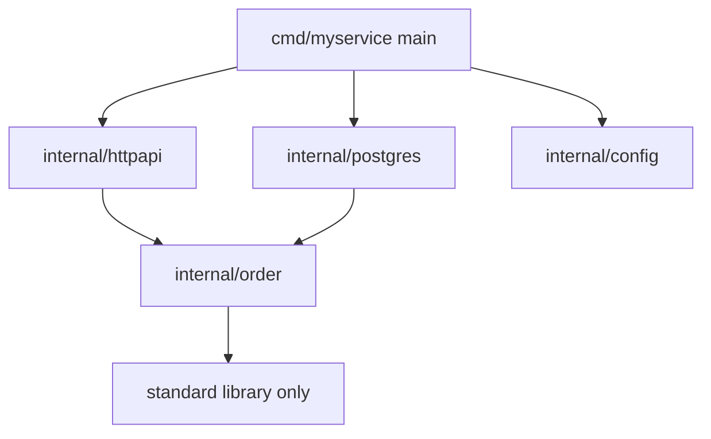
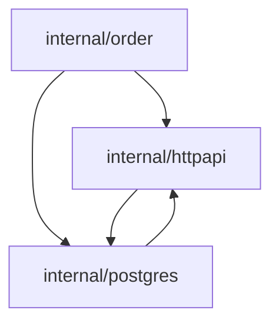
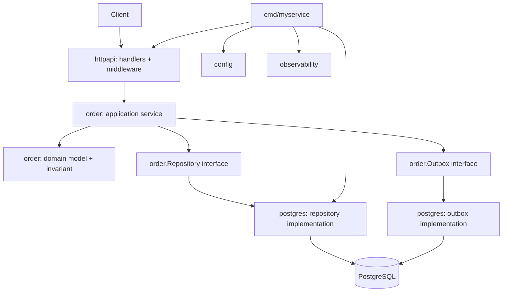

# Project Architecture: Package Boundary, Domain, Service, Adapter

> Target part ini: kamu mampu mendesain codebase Go yang tidak hanya “jalan”, tetapi punya boundary yang jelas, mudah dites, mudah direview, tahan terhadap perubahan requirement, dan tidak berubah menjadi spaghetti dependency setelah beberapa bulan di production.

Part ini adalah titik transisi dari “menulis Go yang benar” menjadi “mendesain sistem Go yang bisa bertahan lama”.

Di Go, arsitektur bukan dimulai dari framework. Arsitektur dimulai dari **package boundary**.

Go tidak mendorong hierarchy besar, dependency injection container, annotation magic, inheritance tree, atau folder-by-layer yang dipaksakan. Go mendorong struktur yang bisa dibaca, bisa dikompilasi cepat, bisa diuji, dan dependency-nya eksplisit.

---

## 1. Mental Model Utama

Arsitektur Go yang baik punya tiga kualitas:

1. **Dependency direction jelas**  
   Domain tidak bergantung pada HTTP, database, queue, framework, config, logger, atau external SDK.

2. **Boundary kecil dan eksplisit**  
   Package tidak menjadi tempat “semua hal yang mirip nama”-nya dikumpulkan. Package adalah unit desain.

3. **Behavior dekat dengan data yang relevan**  
   Domain object bukan hanya DTO kosong. Tetapi juga jangan dipaksa menjadi object-oriented entity yang terlalu berat.

Go architecture yang matang biasanya terasa sederhana dari luar, tetapi keputusan boundary-nya sangat sengaja.

---

## 2. Framework Kaufman untuk Part Ini

Dalam konteks Josh Kaufman, arsitektur project adalah sub-skill yang harus didekomposisi.

Skill besar:

> “Mampu membangun service Go yang maintainable.”

Sub-skill-nya:

| Sub-skill | Pertanyaan Korektif |
|---|---|
| Package design | Apakah package ini punya alasan eksis yang jelas? |
| Dependency direction | Apakah domain bisa dites tanpa database dan HTTP? |
| Interface placement | Apakah interface didefinisikan oleh consumer, bukan provider? |
| Boundary modelling | Apakah perubahan external dependency tidak merusak domain? |
| Testability | Apakah use case bisa dites dengan fake sederhana? |
| Operability | Apakah struktur project memudahkan debugging dan release? |
| Evolution | Apakah menambah fitur tidak memaksa rewrite besar? |

Tujuan deliberate practice:

> Ambil feature kecil, desain package boundary-nya, implementasikan, lalu review apakah dependency graph tetap sehat.

---

## 3. Go Bukan Java, Bukan C#, Bukan Node.js

Engineer yang sudah berpengalaman sering membawa kebiasaan dari platform lain.

### 3.1 Kebiasaan Java/C# yang Harus Dikurangi

Contoh berbahaya:

```txt
src/
  main/
    java/
      com/company/app/
        controllers/
        services/
        repositories/
        models/
        dto/
        exceptions/
        configs/
```

Jika diterjemahkan mentah ke Go:

```txt
internal/
  controllers/
  services/
  repositories/
  models/
  dto/
  configs/
```

Ini terlihat familiar, tetapi sering salah untuk Go.

Masalahnya:

- package `models` menjadi dumping ground;
- package `services` menjadi tempat semua business logic;
- package `repositories` menjadi abstraksi terlalu dini;
- import antar package menjadi membingungkan;
- nama package tidak menjelaskan capability;
- boundary mengikuti jenis teknis, bukan domain/use case.

Go lebih suka package berdasarkan **capability** atau **bounded context kecil**, bukan sekadar layer teknis.

---

## 4. Package adalah Boundary Desain

Package di Go bukan folder kosmetik.

Package menentukan:

- namespace;
- visibility;
- API surface;
- import dependency;
- test boundary;
- review boundary;
- compile boundary;
- ownership boundary.

Rule praktis:

> Jika kamu tidak bisa menjelaskan tanggung jawab package dalam satu kalimat pendek, package itu belum matang.

Contoh buruk:

```txt
internal/common
internal/utils
internal/helpers
internal/models
internal/services
```

Kenapa buruk?

- Terlalu umum.
- Tidak punya boundary domain.
- Menarik dependency acak.
- Menjadi tempat circular dependency lahir.
- Membuat ownership kabur.

Contoh lebih baik:

```txt
internal/account
internal/payment
internal/caseflow
internal/decision
internal/audit
internal/notification
```

Atau untuk service kecil:

```txt
internal/order
internal/postgres
internal/httpapi
internal/config
internal/observability
```

---

## 5. Struktur Project Minimal yang Sehat

Untuk service Go kecil-menengah:

```txt
myservice/
  cmd/
    myservice/
      main.go
  internal/
    app/
      app.go
    order/
      order.go
      service.go
      repository.go
      errors.go
      service_test.go
    postgres/
      order_repository.go
    httpapi/
      server.go
      order_handler.go
      middleware.go
    config/
      config.go
    observability/
      logging.go
      metrics.go
  migrations/
  testdata/
  go.mod
  go.sum
  Makefile
  README.md
```

Ini bukan template universal. Ini starting point.

Prinsipnya:

- `cmd/<binary>` hanya composition root;
- `internal/<domain>` berisi domain dan application behavior;
- adapter database dipisah dari domain;
- adapter HTTP dipisah dari domain;
- config/logging/observability tidak bocor ke domain;
- migration dan deployment artefact eksplisit.

---

## 6. Composition Root

`main.go` seharusnya bukan tempat business logic.

`main.go` adalah tempat wiring:

- load config;
- setup logger;
- connect database;
- construct repositories;
- construct services;
- construct HTTP server;
- start lifecycle;
- handle shutdown.

Contoh:

```go
package main

import (
	"context"
	"log/slog"
	"os"
	"os/signal"
	"syscall"
	"time"

	"example.com/myservice/internal/config"
	"example.com/myservice/internal/httpapi"
	"example.com/myservice/internal/order"
	"example.com/myservice/internal/postgres"
)

func main() {
	ctx, stop := signal.NotifyContext(context.Background(), syscall.SIGINT, syscall.SIGTERM)
	defer stop()

	logger := slog.New(slog.NewJSONHandler(os.Stdout, nil))

	cfg, err := config.Load()
	if err != nil {
		logger.Error("load config failed", "error", err)
		os.Exit(1)
	}

	db, err := postgres.Open(ctx, cfg.DatabaseURL)
	if err != nil {
		logger.Error("open database failed", "error", err)
		os.Exit(1)
	}
	defer db.Close()

	orderRepo := postgres.NewOrderRepository(db)
	orderService := order.NewService(orderRepo)

	server := httpapi.NewServer(httpapi.ServerConfig{
		Addr:         cfg.HTTPAddr,
		OrderService: orderService,
		Logger:       logger,
	})

	errCh := make(chan error, 1)
	go func() {
		errCh <- server.ListenAndServe()
	}()

	select {
	case <-ctx.Done():
		shutdownCtx, cancel := context.WithTimeout(context.Background(), 10*time.Second)
		defer cancel()

		if err := server.Shutdown(shutdownCtx); err != nil {
			logger.Error("shutdown failed", "error", err)
			os.Exit(1)
		}
	case err := <-errCh:
		logger.Error("server failed", "error", err)
		os.Exit(1)
	}
}
```

`main` boleh terlihat panjang karena wiring eksplisit. Yang tidak boleh adalah business rule berada di `main`.

---

## 7. Domain Package

Domain package harus menjawab:

> “Konsep bisnis apa yang dimodelkan package ini?”

Contoh package `order`:

```txt
internal/order/
  order.go
  status.go
  command.go
  service.go
  repository.go
  errors.go
```

### 7.1 Domain Entity

```go
package order

import (
	"errors"
	"time"
)

type Status string

const (
	StatusPending   Status = "pending"
	StatusApproved  Status = "approved"
	StatusCancelled Status = "cancelled"
)

type Order struct {
	ID        ID
	Customer  CustomerID
	Status    Status
	Items     []Item
	CreatedAt time.Time
	UpdatedAt time.Time
}

type ID string
type CustomerID string

type Item struct {
	SKU      string
	Quantity int
	PriceCents int64
}

func New(customer CustomerID, items []Item, now time.Time) (Order, error) {
	if customer == "" {
		return Order{}, errors.New("customer is required")
	}
	if len(items) == 0 {
		return Order{}, errors.New("order must contain at least one item")
	}
	for _, item := range items {
		if item.SKU == "" {
			return Order{}, errors.New("item sku is required")
		}
		if item.Quantity <= 0 {
			return Order{}, errors.New("item quantity must be positive")
		}
		if item.PriceCents < 0 {
			return Order{}, errors.New("item price cannot be negative")
		}
	}

	return Order{
		Customer:  customer,
		Status:    StatusPending,
		Items:     append([]Item(nil), items...),
		CreatedAt: now,
		UpdatedAt: now,
	}, nil
}
```

Catatan:

- `New` menjaga invariant.
- `items` disalin agar caller tidak bisa mutate backing array.
- Tipe `ID` dan `CustomerID` memperjelas domain.
- Tidak ada JSON tag.
- Tidak ada SQL tag.
- Tidak ada logger.
- Tidak ada HTTP status.

Domain tidak perlu tahu transport.

---

## 8. Domain Invariant

Invariant adalah aturan yang harus selalu benar.

Contoh invariant order:

- order harus punya customer;
- order minimal punya satu item;
- quantity item harus positif;
- pending order bisa dibatalkan;
- approved order tidak bisa diedit sembarangan;
- cancelled order tidak bisa di-approve.

Implementasi:

```go
func (o *Order) Cancel(now time.Time) error {
	if o.Status == StatusCancelled {
		return nil
	}
	if o.Status == StatusApproved {
		return ErrApprovedOrderCannotBeCancelled
	}

	o.Status = StatusCancelled
	o.UpdatedAt = now
	return nil
}
```

Error domain:

```go
var ErrApprovedOrderCannotBeCancelled = errors.New("approved order cannot be cancelled")
```

Invariant harus dekat dengan data yang dijaga.

Jika rule tersebar di handler, repository, dan service lain, sistem akan rapuh.

---

## 9. DTO Bukan Domain Model

DTO digunakan di boundary, misalnya HTTP JSON.

```go
type CreateOrderRequest struct {
	CustomerID string `json:"customer_id"`
	Items      []struct {
		SKU        string `json:"sku"`
		Quantity   int    `json:"quantity"`
		PriceCents int64  `json:"price_cents"`
	} `json:"items"`
}
```

Domain model:

```go
type Order struct {
	ID       ID
	Customer CustomerID
	Status   Status
	Items    []Item
}
```

Jangan mencampur:

```go
type Order struct {
	ID       string `json:"id" db:"id" validate:"required"`
	Customer string `json:"customer_id" db:"customer_id"`
	Status   string `json:"status" db:"status"`
}
```

Masalahnya:

- domain bocor ke HTTP;
- domain bocor ke database;
- validation external menjadi domain rule palsu;
- perubahan schema/API memaksa domain berubah;
- testing domain menjadi ribet.

Rule:

> JSON tags berada di transport DTO. SQL mapping berada di adapter persistence. Domain tetap bersih.

---

## 10. Application Service

Application service mengorkestrasi use case.

Ia biasanya:

- menerima command/input;
- validasi application-level;
- load aggregate/entity;
- panggil domain behavior;
- simpan perubahan;
- publish event jika perlu;
- translate error boundary.

Contoh:

```go
type Service struct {
	repo Repository
	clock Clock
}

func NewService(repo Repository, clock Clock) *Service {
	return &Service{
		repo:  repo,
		clock: clock,
	}
}

type Clock interface {
	Now() time.Time
}

type CreateCommand struct {
	CustomerID string
	Items      []Item
}

func (s *Service) Create(ctx context.Context, cmd CreateCommand) (Order, error) {
	customerID := CustomerID(cmd.CustomerID)

	order, err := New(customerID, cmd.Items, s.clock.Now())
	if err != nil {
		return Order{}, err
	}

	id, err := s.repo.NextID(ctx)
	if err != nil {
		return Order{}, err
	}
	order.ID = id

	if err := s.repo.Save(ctx, order); err != nil {
		return Order{}, err
	}

	return order, nil
}
```

Application service bukan tempat menaruh semua logic. Ia mengorkestrasi.

Domain object menjaga invariant. Repository menyimpan. Adapter menghubungkan external world.

---

## 11. Interface Didefinisikan oleh Consumer

Ini idiom penting Go.

Provider tidak harus membuat interface besar.

Buruk:

```go
package postgres

type OrderRepository interface {
	FindByID(ctx context.Context, id string) (Order, error)
	Save(ctx context.Context, order Order) error
	Delete(ctx context.Context, id string) error
	List(ctx context.Context) ([]Order, error)
	Count(ctx context.Context) (int, error)
}
```

Lebih baik:

```go
package order

type Repository interface {
	NextID(ctx context.Context) (ID, error)
	Save(ctx context.Context, order Order) error
	FindByID(ctx context.Context, id ID) (Order, error)
}
```

Interface berada di package yang membutuhkan behavior tersebut.

Kenapa?

- Interface tetap kecil.
- Test fake mudah.
- Provider bisa implement tanpa tahu interface.
- Boundary mengikuti kebutuhan use case.

---

## 12. Adapter Persistence

Package `postgres` tahu SQL. Domain tidak.

```go
package postgres

import (
	"context"
	"database/sql"
	"errors"

	"example.com/myservice/internal/order"
)

type OrderRepository struct {
	db *sql.DB
}

func NewOrderRepository(db *sql.DB) *OrderRepository {
	return &OrderRepository{db: db}
}

func (r *OrderRepository) FindByID(ctx context.Context, id order.ID) (order.Order, error) {
	const query = `
		SELECT id, customer_id, status, created_at, updated_at
		FROM orders
		WHERE id = $1
	`

	var row orderRow
	err := r.db.QueryRowContext(ctx, query, string(id)).Scan(
		&row.ID,
		&row.CustomerID,
		&row.Status,
		&row.CreatedAt,
		&row.UpdatedAt,
	)
	if errors.Is(err, sql.ErrNoRows) {
		return order.Order{}, order.ErrNotFound
	}
	if err != nil {
		return order.Order{}, err
	}

	items, err := r.findItems(ctx, id)
	if err != nil {
		return order.Order{}, err
	}

	return row.toDomain(items)
}
```

Mapping row:

```go
type orderRow struct {
	ID         string
	CustomerID string
	Status     string
	CreatedAt  time.Time
	UpdatedAt  time.Time
}

func (r orderRow) toDomain(items []order.Item) (order.Order, error) {
	return order.Restore(order.RestoreParams{
		ID:        order.ID(r.ID),
		Customer:  order.CustomerID(r.CustomerID),
		Status:    order.Status(r.Status),
		Items:     items,
		CreatedAt: r.CreatedAt,
		UpdatedAt: r.UpdatedAt,
	})
}
```

Kadang domain perlu `Restore` untuk rehydrate dari storage tanpa menerapkan rule creation.

```go
type RestoreParams struct {
	ID        ID
	Customer  CustomerID
	Status    Status
	Items     []Item
	CreatedAt time.Time
	UpdatedAt time.Time
}

func Restore(p RestoreParams) (Order, error) {
	if p.ID == "" {
		return Order{}, errors.New("order id is required")
	}
	if p.Customer == "" {
		return Order{}, errors.New("customer is required")
	}
	if !p.Status.Valid() {
		return Order{}, errors.New("invalid order status")
	}
	if len(p.Items) == 0 {
		return Order{}, errors.New("order must contain at least one item")
	}

	return Order{
		ID:        p.ID,
		Customer:  p.Customer,
		Status:    p.Status,
		Items:     append([]Item(nil), p.Items...),
		CreatedAt: p.CreatedAt,
		UpdatedAt: p.UpdatedAt,
	}, nil
}
```

---

## 13. Adapter HTTP

HTTP adapter tahu JSON, status code, request ID, route, middleware.

Domain tidak.

```go
package httpapi

import (
	"encoding/json"
	"errors"
	"net/http"

	"example.com/myservice/internal/order"
)

type OrderHandler struct {
	service *order.Service
}

func NewOrderHandler(service *order.Service) *OrderHandler {
	return &OrderHandler{service: service}
}

func (h *OrderHandler) Create(w http.ResponseWriter, r *http.Request) {
	var req createOrderRequest
	if err := decodeJSON(r, &req); err != nil {
		writeError(w, http.StatusBadRequest, "invalid_request", err.Error())
		return
	}

	cmd, err := req.toCommand()
	if err != nil {
		writeError(w, http.StatusBadRequest, "validation_failed", err.Error())
		return
	}

	created, err := h.service.Create(r.Context(), cmd)
	if err != nil {
		h.writeCreateError(w, err)
		return
	}

	writeJSON(w, http.StatusCreated, orderResponseFromDomain(created))
}

func (h *OrderHandler) writeCreateError(w http.ResponseWriter, err error) {
	switch {
	case errors.Is(err, order.ErrCustomerNotAllowed):
		writeError(w, http.StatusForbidden, "customer_not_allowed", "customer is not allowed to create order")
	default:
		writeError(w, http.StatusInternalServerError, "internal_error", "internal server error")
	}
}
```

Mapping request ke command:

```go
type createOrderRequest struct {
	CustomerID string `json:"customer_id"`
	Items      []struct {
		SKU        string `json:"sku"`
		Quantity   int    `json:"quantity"`
		PriceCents int64  `json:"price_cents"`
	} `json:"items"`
}

func (r createOrderRequest) toCommand() (order.CreateCommand, error) {
	if r.CustomerID == "" {
		return order.CreateCommand{}, errors.New("customer_id is required")
	}

	items := make([]order.Item, 0, len(r.Items))
	for _, item := range r.Items {
		items = append(items, order.Item{
			SKU:        item.SKU,
			Quantity:   item.Quantity,
			PriceCents: item.PriceCents,
		})
	}

	return order.CreateCommand{
		CustomerID: r.CustomerID,
		Items:      items,
	}, nil
}
```

---

## 14. Dependency Direction

Ideal dependency:



Yang harus dihindari:



Rule:

> Inner package tidak tahu outer package.

Domain tidak tahu transport. Domain tidak tahu database. Domain tidak tahu framework.

---

## 15. Clean Architecture, Tapi Go-style

Clean Architecture sering disalahpahami menjadi folder ceremony:

```txt
entities/
usecases/
interfaces/
infrastructure/
```

Ini bisa bekerja, tetapi sering terlalu abstrak untuk Go.

Go-style lebih sederhana:

```txt
internal/order
internal/postgres
internal/httpapi
```

Di dalam `order`, bisa ada entity dan use case.

```txt
internal/order/
  order.go
  service.go
  repository.go
```

Di dalam `postgres`, ada adapter persistence.

```txt
internal/postgres/
  order_repository.go
```

Di dalam `httpapi`, ada adapter transport.

```txt
internal/httpapi/
  order_handler.go
```

Clean Architecture bukan nama folder. Clean Architecture adalah dependency direction.

---

## 16. Modular Monolith di Go

Untuk banyak organisasi, modular monolith adalah pilihan awal yang lebih baik daripada microservices.

Modular monolith:

- satu deployable;
- beberapa bounded module/package;
- boundary internal jelas;
- transaksi lokal lebih mudah;
- observability lebih sederhana;
- refactor lebih murah;
- bisa diekstrak jadi service nanti jika boundary sudah matang.

Contoh:

```txt
internal/
  caseflow/
  enforcement/
  evidence/
  decision/
  audit/
  notification/
  postgres/
  httpapi/
```

Boundary antar module harus tetap disiplin.

Buruk:

```go
caseflow imports enforcement internals
enforcement imports decision internals
decision imports caseflow internals
```

Lebih baik gunakan application-level interface atau event.

---

## 17. Internal Package Strategy

`internal` membuat package tidak bisa diimport dari luar parent tree.

Contoh:

```txt
myservice/
  internal/
    order/
    postgres/
```

Package di luar module tidak bisa import:

```go
import "example.com/myservice/internal/order"
```

Ini bagus untuk service code, karena API internal bebas berubah.

Untuk reusable library, jangan letakkan di `internal` jika memang ingin digunakan module lain.

Rule praktis:

| Code | Lokasi |
|---|---|
| Binary entrypoint | `cmd/<name>` |
| Service internal code | `internal/<package>` |
| Reusable public library | top-level package |
| DB migrations | `migrations` |
| Integration fixtures | `testdata` |
| Generated API docs | `api` atau `docs` |
| Deployment manifests | `deploy` atau `infra` |

---

## 18. Anti-pattern: `pkg` sebagai Tempat Semua Hal

Banyak project Go memakai folder `pkg`.

Tidak selalu salah, tetapi sering disalahgunakan.

```txt
pkg/
  utils/
  models/
  constants/
  helpers/
```

Ini biasanya buruk.

`pkg` sebaiknya hanya untuk package yang memang dimaksudkan sebagai public reusable package oleh project lain.

Jika hanya untuk service internal, pakai `internal`.

---

## 19. Anti-pattern: Interface di Semua Tempat

Buruk:

```go
type UserService interface {
	Create(ctx context.Context, req CreateUserRequest) (User, error)
	Update(ctx context.Context, req UpdateUserRequest) (User, error)
	Delete(ctx context.Context, id string) error
}
```

Lalu implementasi:

```go
type userService struct {}
```

Jika hanya ada satu implementasi dan interface tidak dibutuhkan oleh consumer, ini abstraction noise.

Go tidak membutuhkan interface untuk setiap concrete type.

Gunakan interface ketika:

- consumer hanya butuh subset behavior;
- test fake dibutuhkan;
- ada multiple implementation nyata;
- dependency external perlu dibatasi;
- boundary crossing perlu distabilkan.

Jangan gunakan interface hanya karena “best practice enterprise”.

---

## 20. Anti-pattern: Utility Package

Buruk:

```txt
internal/utils
```

Isi:

```go
func ParseTime(...)
func SendEmail(...)
func HashPassword(...)
func Retry(...)
func ToOrderStatus(...)
```

Ini tidak punya cohesion.

Alternatif:

```txt
internal/clock
internal/mail
internal/password
internal/retry
internal/order
```

Nama package harus menunjukkan konsep.

---

## 21. Anti-pattern: Global State

Buruk:

```go
var DB *sql.DB
var Logger *slog.Logger
var Config Config
```

Masalah:

- test sulit;
- initialization order rapuh;
- hidden dependency;
- race risk;
- multi-tenant/multi-instance sulit;
- shutdown lifecycle kabur.

Lebih baik dependency eksplisit:

```go
type Service struct {
	repo   Repository
	logger *slog.Logger
}
```

Logger boleh lewat dependency, tetapi hati-hati jangan sampai domain bergantung pada logging untuk rule bisnis.

---

## 22. Anti-pattern: Import Cycle

Import cycle biasanya sinyal desain package salah.

Contoh:

```txt
order imports payment
payment imports order
```

Solusi:

1. Pindahkan shared type ke package yang lebih tepat.
2. Gunakan interface pada consumer side.
3. Gabungkan package jika memang cohesion-nya tinggi.
4. Perkenalkan domain event.
5. Hilangkan dependency yang tidak perlu.

Jangan membuat package `common` sebagai reflex. Itu sering hanya menyembunyikan desain yang belum selesai.

---

## 23. Package Split Heuristic

Kapan package harus dipisah?

Pisahkan jika:

- ada alasan dependency boundary;
- ada lifecycle berbeda;
- ada external technology berbeda;
- ada ownership berbeda;
- test boundary menjadi lebih jelas;
- API surface bisa dijaga kecil.

Jangan pisahkan jika:

- hanya karena file sudah panjang;
- hanya karena ingin mirip framework;
- hanya karena nama layer teknis;
- membuat import bolak-balik;
- membuat developer harus lompat 10 file untuk membaca satu use case.

Rule sederhana:

> File panjang belum tentu masalah. Dependency tidak jelas hampir selalu masalah.

---

## 24. File Organization di Dalam Package

Contoh package `order`:

```txt
internal/order/
  order.go
  status.go
  command.go
  service.go
  repository.go
  errors.go
  event.go
  service_test.go
  order_test.go
```

Tidak wajib dipisah terlalu granular.

Jika package masih kecil, ini cukup:

```txt
internal/order/
  order.go
  service.go
  service_test.go
```

Jangan membuat file hanya karena “satu struct satu file”. Itu kebiasaan Java yang tidak perlu.

---

## 25. Naming Package

Nama package sebaiknya:

- pendek;
- lower-case;
- tanpa underscore;
- singular jika mewakili konsep;
- tidak mengulang parent path;
- tidak terlalu umum.

Buruk:

```txt
orderutils
order_service
models
common
handler
repository
```

Baik:

```txt
order
audit
decision
postgres
httpapi
clock
retry
```

Package name digunakan saat memanggil identifier.

```go
order.NewService(...)
postgres.NewOrderRepository(...)
httpapi.NewServer(...)
```

Hindari stutter:

```go
order.NewOrderService(...)
```

Lebih baik:

```go
order.NewService(...)
```

Karena sudah ada prefix package `order`.

---

## 26. Error Boundary dalam Architecture

Domain error:

```go
var ErrNotFound = errors.New("order not found")
var ErrInvalidTransition = errors.New("invalid order status transition")
```

HTTP translation:

```go
switch {
case errors.Is(err, order.ErrNotFound):
	writeError(w, http.StatusNotFound, "order_not_found", "order not found")
case errors.Is(err, order.ErrInvalidTransition):
	writeError(w, http.StatusConflict, "invalid_transition", "invalid order transition")
default:
	writeError(w, http.StatusInternalServerError, "internal_error", "internal server error")
}
```

Database error tidak boleh langsung bocor ke client.

Buruk:

```json
{
  "error": "pq: duplicate key value violates unique constraint orders_customer_id_key"
}
```

Baik:

```json
{
  "code": "duplicate_order",
  "message": "order already exists"
}
```

Boundary bertanggung jawab menerjemahkan error.

---

## 27. Transaction Boundary

Transaction biasanya berada di application service atau unit-of-work abstraction, bukan di handler.

Buruk:

```go
func (h *Handler) Create(w http.ResponseWriter, r *http.Request) {
	tx, _ := h.db.BeginTx(r.Context(), nil)
	// business logic here
}
```

Lebih baik:

```go
func (s *Service) Create(ctx context.Context, cmd CreateCommand) (Order, error) {
	return s.uow.Do(ctx, func(ctx context.Context, tx Tx) (Order, error) {
		// use repositories bound to tx
	})
}
```

Sederhana bisa begini:

```go
type UnitOfWork interface {
	Do(ctx context.Context, fn func(ctx context.Context, repos Repositories) error) error
}

type Repositories struct {
	Orders Repository
}
```

Jangan over-engineer dari awal. Jika satu repository cukup, transaction bisa langsung di repository method. Tetapi saat use case menyentuh banyak aggregate/table, boundary harus jelas.

---

## 28. Domain Event

Domain event berguna untuk decoupling internal module.

```go
type Event interface {
	EventName() string
	OccurredAt() time.Time
}

type OrderCreated struct {
	OrderID ID
	At      time.Time
}

func (e OrderCreated) EventName() string {
	return "order.created"
}

func (e OrderCreated) OccurredAt() time.Time {
	return e.At
}
```

Service bisa mengembalikan event:

```go
type CreateResult struct {
	Order  Order
	Events []Event
}
```

Application layer bisa menyimpan outbox:

```go
result, err := s.orders.Create(ctx, cmd)
if err != nil {
	return err
}

if err := s.repo.Save(ctx, result.Order); err != nil {
	return err
}

for _, event := range result.Events {
	if err := s.outbox.Save(ctx, event); err != nil {
		return err
	}
}
```

Event bukan solusi semua masalah. Gunakan jika ada kebutuhan decoupling, audit, async processing, atau integration boundary.

---

## 29. Architecture Diagram

Contoh arsitektur service Go:



Perhatikan:

- `httpapi` depends on `order`;
- `postgres` depends on `order`;
- `order` tidak depends on `httpapi` atau `postgres`;
- `main` melakukan wiring.

---

## 30. Testing Architecture

### 30.1 Domain Test

```go
func TestOrder_Cancel(t *testing.T) {
	now := time.Date(2026, 6, 27, 10, 0, 0, 0, time.UTC)

	o, err := order.New("customer-1", []order.Item{
		{SKU: "sku-1", Quantity: 1, PriceCents: 1000},
	}, now)
	if err != nil {
		t.Fatal(err)
	}

	err = o.Cancel(now.Add(time.Minute))
	if err != nil {
		t.Fatal(err)
	}

	if got, want := o.Status, order.StatusCancelled; got != want {
		t.Fatalf("status = %s, want %s", got, want)
	}
}
```

### 30.2 Service Test dengan Fake

```go
type fakeRepo struct {
	nextID order.ID
	saved  []order.Order
}

func (r *fakeRepo) NextID(ctx context.Context) (order.ID, error) {
	return r.nextID, nil
}

func (r *fakeRepo) Save(ctx context.Context, o order.Order) error {
	r.saved = append(r.saved, o)
	return nil
}

func (r *fakeRepo) FindByID(ctx context.Context, id order.ID) (order.Order, error) {
	for _, o := range r.saved {
		if o.ID == id {
			return o, nil
		}
	}
	return order.Order{}, order.ErrNotFound
}
```

Test:

```go
func TestService_Create(t *testing.T) {
	repo := &fakeRepo{nextID: "ord-1"}
	clock := fixedClock{now: time.Date(2026, 6, 27, 10, 0, 0, 0, time.UTC)}
	service := order.NewService(repo, clock)

	created, err := service.Create(context.Background(), order.CreateCommand{
		CustomerID: "customer-1",
		Items: []order.Item{
			{SKU: "sku-1", Quantity: 2, PriceCents: 1500},
		},
	})
	if err != nil {
		t.Fatal(err)
	}

	if created.ID != "ord-1" {
		t.Fatalf("id = %q, want %q", created.ID, "ord-1")
	}
	if len(repo.saved) != 1 {
		t.Fatalf("saved count = %d, want 1", len(repo.saved))
	}
}
```

### 30.3 HTTP Test dengan Fake Service

Untuk HTTP layer, kamu bisa fake application service atau pakai real service dengan fake repo.

Pilih berdasarkan tujuan test:

| Tujuan | Strategi |
|---|---|
| Test status code, JSON, validation | fake service |
| Test use case end-to-end tanpa DB | real service + fake repo |
| Test SQL mapping | integration test database |
| Test full API contract | `httptest` + real dependencies semampunya |

---

## 31. Architecture Decision Record

Untuk keputusan penting, tulis ADR singkat.

```md
# ADR-001: Use modular monolith before extracting services

## Status

Accepted

## Context

Order, payment, and audit modules are still evolving rapidly.
Splitting them into services now would increase deployment and consistency complexity.

## Decision

We will keep them in one Go binary with internal package boundaries.
Cross-module communication uses explicit interfaces or domain events.

## Consequences

Positive:
- Simpler transaction management
- Faster refactoring
- Lower operational overhead

Negative:
- Requires discipline to avoid package coupling
- Service extraction needs later migration plan
```

ADR membantu defensibility. Sangat penting untuk sistem regulatori, audit, enforcement, dan case management.

---

## 32. Review Checklist: Package Architecture

Gunakan checklist ini saat review PR.

### Package Boundary

- Apakah package punya tanggung jawab jelas?
- Apakah nama package cukup spesifik?
- Apakah package mengandung terlalu banyak konsep?
- Apakah ada `utils`, `common`, atau `helpers` yang bisa dipecah?

### Dependency Direction

- Apakah domain bebas dari HTTP/database/framework?
- Apakah adapter bergantung ke domain, bukan sebaliknya?
- Apakah ada import cycle?
- Apakah dependency external terkonsentrasi di adapter?

### Interface

- Apakah interface didefinisikan oleh consumer?
- Apakah interface cukup kecil?
- Apakah interface dibuat sebelum ada kebutuhan?
- Apakah concrete type lebih tepat?

### Domain

- Apakah invariant dijaga di domain?
- Apakah domain model tercemar JSON/SQL tags?
- Apakah constructor/restore function menjaga valid state?
- Apakah mutation method menjaga transition rule?

### Testing

- Apakah domain bisa dites tanpa network/database?
- Apakah service bisa dites dengan fake?
- Apakah adapter punya integration test?
- Apakah error boundary dites?

### Evolution

- Apakah menambah use case baru akan mudah?
- Apakah mengganti DB/transport tidak merusak domain?
- Apakah public API package terlalu luas?
- Apakah ada dependency yang sebaiknya internal?

---

## 33. Latihan Praktik 2 Jam

Bangun mini-service `caseflow`.

Requirement:

- Case bisa dibuat.
- Case punya status: `draft`, `submitted`, `under_review`, `approved`, `rejected`, `closed`.
- Case draft bisa disubmit.
- Submitted case bisa masuk review.
- Under review bisa approved/rejected.
- Closed case tidak bisa diubah.
- Setiap transition menghasilkan audit event.
- HTTP API hanya adapter.
- Repository interface berada di domain/application package.
- Persistence adapter boleh in-memory dulu.

Struktur:

```txt
caseflow/
  cmd/caseflow/main.go
  internal/casecase/
    case.go
    status.go
    service.go
    repository.go
    event.go
    errors.go
    service_test.go
  internal/memory/
    case_repository.go
  internal/httpapi/
    server.go
    case_handler.go
```

Tugas:

1. Implement domain transition.
2. Implement service.
3. Implement fake/in-memory repo.
4. Implement HTTP handler.
5. Tulis test untuk valid dan invalid transition.
6. Buat diagram dependency.
7. Review dengan checklist di atas.

---

## 34. Rubric Penilaian

| Level | Indikator |
|---|---|
| Beginner | Bisa membuat project Go tetapi semua logic bercampur di handler |
| Junior | Memisahkan handler, service, repository, tetapi boundary masih framework-driven |
| Intermediate | Domain bebas dari HTTP/DB, service testable dengan fake |
| Senior | Boundary stabil, error translation rapi, transaction dan lifecycle jelas |
| Staff-level | Bisa menjelaskan trade-off modular monolith vs service split, failure mode, ownership, dan evolution path |

---

## 35. Kesalahan yang Sering Terjadi

1. Membuat terlalu banyak package terlalu awal.
2. Membuat interface untuk semua concrete type.
3. Menaruh interface di provider package.
4. Membocorkan JSON/SQL tag ke domain.
5. Mengandalkan global DB/logger/config.
6. Membuat `utils` sebagai tempat sampah.
7. Mengabaikan transaction boundary.
8. Membuat service layer sebagai god object.
9. Menganggap Clean Architecture adalah folder, bukan dependency direction.
10. Memecah microservice sebelum modular boundary matang.

---

## 36. Kesimpulan

Architecture Go yang baik tidak terlihat “megah”. Ia terlihat sederhana, tetapi sangat sengaja.

Kunci utamanya:

- package adalah boundary desain;
- domain tidak bergantung pada transport atau database;
- interface didefinisikan oleh consumer;
- adapter menerjemahkan dunia luar ke domain;
- `main` menjadi composition root;
- modular monolith sering lebih sehat daripada microservices prematur;
- struktur project harus mendukung testing, review, operability, dan evolusi.

Setelah part ini, kamu seharusnya bisa melihat codebase Go bukan sebagai kumpulan file, tetapi sebagai graph dependency yang harus dijaga tetap sehat.
