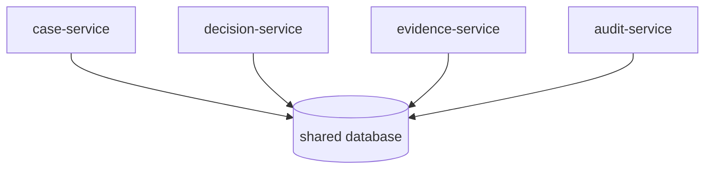
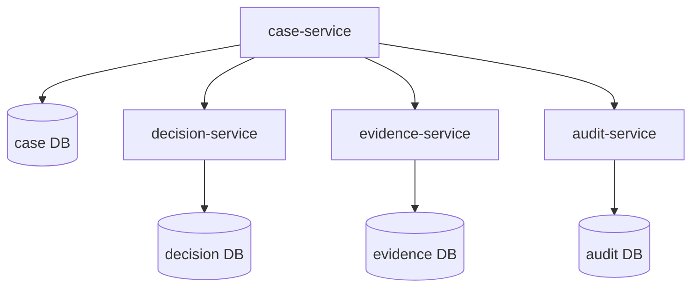
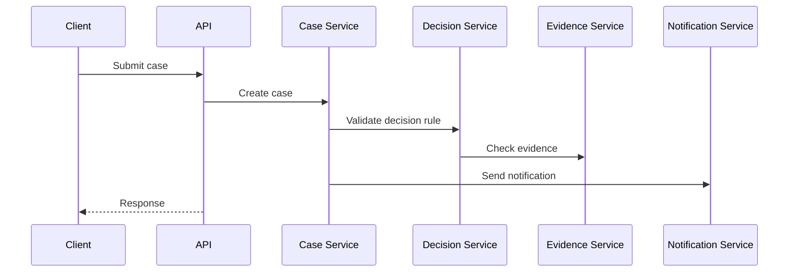
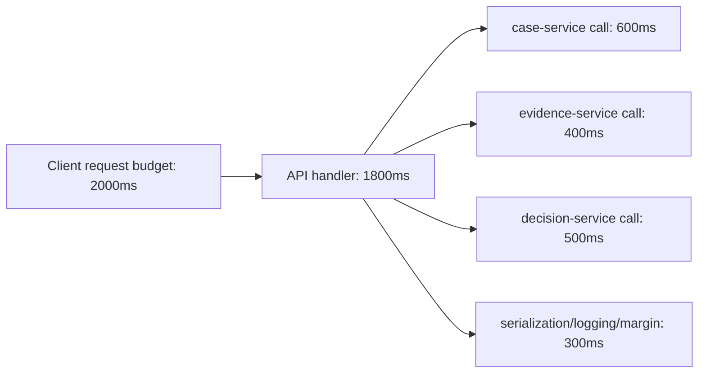
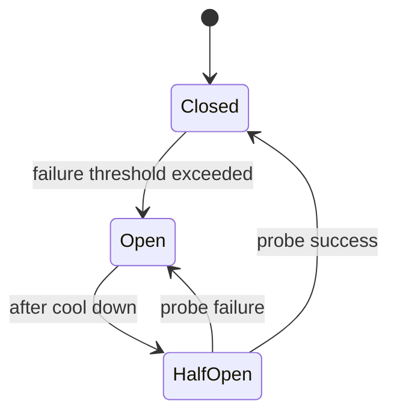
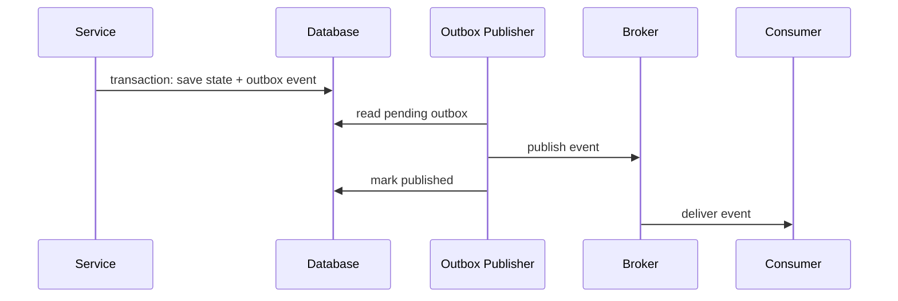
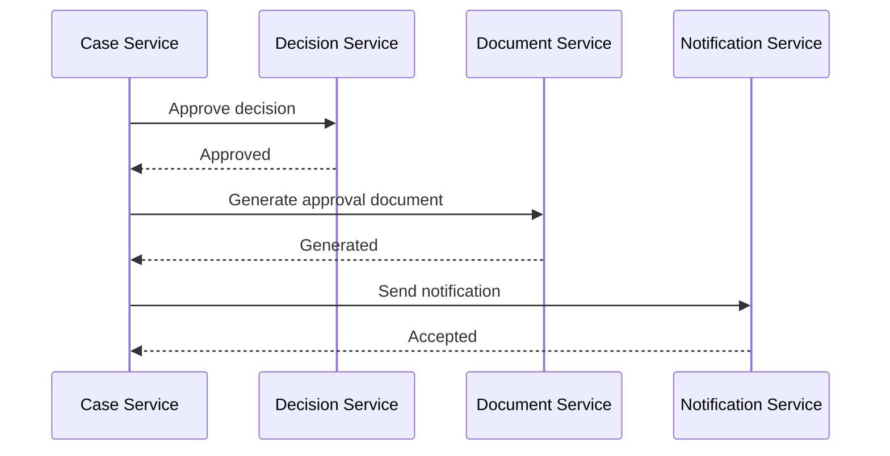
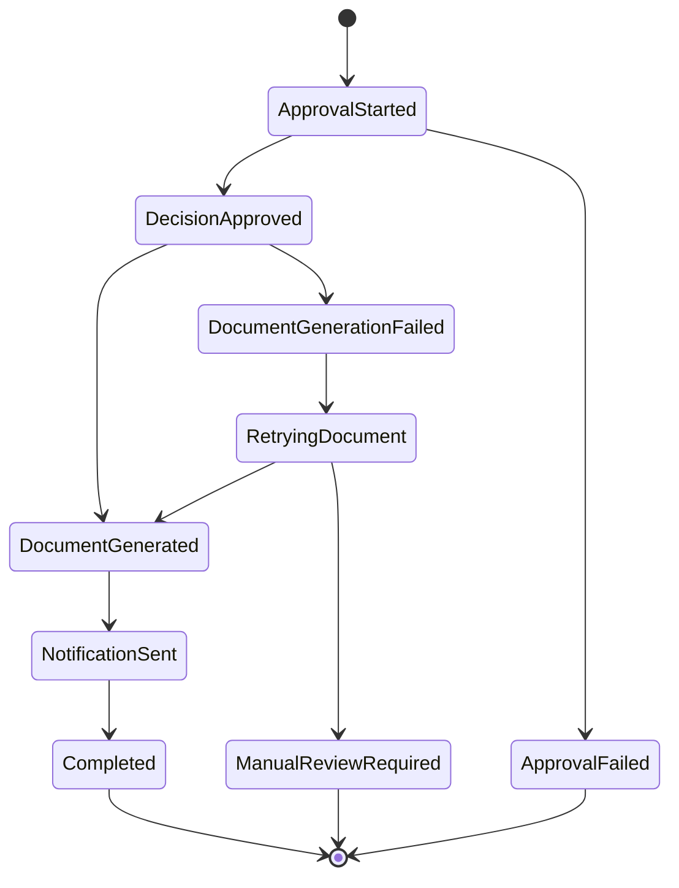

# Microservices dengan Go: Communication, Contracts, dan Failure Boundary

> Target part ini: kamu mampu memutuskan kapan microservices masuk akal, mendesain boundary yang benar, memilih komunikasi yang sesuai, dan membangun client/server Go yang tahan partial failure.

Microservices bukan tujuan. Microservices adalah alat untuk mengelola skala organisasi, deployment, ownership, dan runtime isolation.

Jika boundary salah, microservices hanya mengubah function call lokal menjadi distributed failure.

Go cocok untuk microservices karena:

- binary kecil dan deployment sederhana;
- HTTP dan networking kuat di standard library;
- concurrency model cocok untuk I/O-bound services;
- startup cepat;
- memory footprint relatif efisien;
- observability dan profiling cukup matang;
- cocok untuk containerized workloads.

Tetapi Go tidak otomatis membuat microservice architecture menjadi benar.

---

## 1. Mental Model: Microservice adalah Boundary Operasional

Sebuah service bukan hanya folder berbeda.

Service punya:

- deployable sendiri;
- database atau persistence ownership sendiri;
- API contract sendiri;
- scaling profile sendiri;
- lifecycle sendiri;
- monitoring sendiri;
- incident ownership sendiri;
- failure mode sendiri.

Jika dua komponen selalu deploy bersama, selalu berubah bersama, dan selalu membutuhkan transaksi yang sama, mereka mungkin belum layak dipisah menjadi microservices.

---

## 2. Framework Kaufman untuk Part Ini

Dalam framework Kaufman, microservices perlu didekomposisi.

Skill besar:

> “Mampu membangun dan mereview service Go dalam sistem terdistribusi.”

Sub-skill:

| Sub-skill | Pertanyaan Korektif |
|---|---|
| Boundary design | Apakah service punya ownership data dan business capability jelas? |
| Communication | Apakah call sync/async dipilih karena kebutuhan, bukan tren? |
| Contract | Apakah client bisa tetap berjalan saat provider berubah? |
| Timeout | Apakah setiap remote call punya deadline? |
| Retry | Apakah retry aman, bounded, dan tidak memperburuk outage? |
| Idempotency | Apakah write operation aman diulang? |
| Observability | Apakah request bisa ditelusuri lintas service? |
| Failure handling | Apakah partial failure sudah dianggap kondisi normal? |

Deliberate practice:

> Desain dua service kecil, tulis contract, implement client timeout/retry, lalu buat failure-mode table.

---

## 3. Jangan Mulai dari Microservices

Mulai dari modular monolith jika:

- domain masih berubah cepat;
- tim kecil;
- ownership belum jelas;
- observability belum matang;
- deployment pipeline belum stabil;
- transaksi masih sering lintas domain;
- belum ada alasan scaling berbeda.

Microservices masuk akal jika:

- tim berbeda punya lifecycle berbeda;
- domain boundary sudah stabil;
- bottleneck scaling berbeda;
- compliance/ownership butuh isolation;
- release cadence berbeda;
- failure isolation bernilai tinggi;
- data ownership jelas.

Rule keras:

> Microservice boundary yang buruk lebih mahal daripada monolith yang disiplin.

---

## 4. Boundary Service yang Sehat

Service boundary sehat biasanya berbasis business capability.

Contoh untuk enforcement lifecycle platform:

```txt
case-service
evidence-service
decision-service
notification-service
audit-service
identity-service
document-service
```

Boundary buruk:

```txt
controller-service
repository-service
validation-service
database-service
```

Service bukan layer teknis. Service adalah capability yang bisa dimiliki, dioperasikan, dan berevolusi.

---

## 5. Ownership Data

Microservices sehat biasanya tidak share database table sembarangan.

Buruk:



Masalah:

- schema change menjadi coupling lintas service;
- ownership tidak jelas;
- transaksi tersembunyi;
- service bisa bypass invariant service lain;
- audit dan compliance risk meningkat.

Lebih baik:



Tidak berarti harus database server terpisah sejak awal. Tetapi ownership schema harus jelas.

---

## 6. Communication Style

Pilihan utama:

| Style | Cocok Untuk | Risiko |
|---|---|---|
| REST/HTTP | Public/internal API, resource-oriented operation | Contract drift, weak typing |
| gRPC | Low-latency internal RPC, typed contract | Proto governance, gateway complexity |
| Message queue | Async workflow, decoupling, event propagation | At-least-once, ordering, poison messages |
| Streaming | Continuous data/event flow | Backpressure, consumer lag |
| Batch | Large periodic sync | Staleness, retry window besar |

Tidak ada default universal.

Tanya:

- Apakah caller butuh jawaban langsung?
- Apakah operation bisa asynchronous?
- Apakah write harus idempotent?
- Apakah ordering penting?
- Apakah throughput lebih penting dari latency?
- Apakah consumer boleh tertinggal?
- Apakah contract harus strongly typed?

---

## 7. Sync vs Async

### 7.1 Synchronous Call

Contoh:

```txt
case-service -> decision-service: validate decision eligibility
```

Cocok jika:

- caller butuh jawaban segera;
- operation singkat;
- failure bisa dikembalikan ke user;
- consistency butuh immediate check.

Risiko:

- latency chain;
- cascading failure;
- retry storm;
- tight availability coupling.

### 7.2 Asynchronous Message

Contoh:

```txt
case-service publishes CaseSubmitted
notification-service sends email later
audit-service records audit asynchronously
```

Cocok jika:

- tidak butuh jawaban langsung;
- side effect bisa eventually consistent;
- consumer banyak;
- decoupling lebih penting.

Risiko:

- duplicate message;
- ordering issue;
- delayed processing;
- poison message;
- harder debugging.

---

## 8. Latency Chain

Jika satu request memanggil lima service berurutan:



Maka latency total bukan hanya rata-rata. Tail latency bisa memburuk drastis.

Jika setiap service p95 = 100ms, chain lima service bisa membuat p95 end-to-end jauh lebih besar, terutama saat dependency tidak independen.

Rule:

> Remote call di critical path harus sedikit, bounded, observable, dan punya fallback behavior.

---

## 9. Timeout Budget

Setiap remote call wajib punya timeout.

Tanpa timeout, service bisa menggantung, worker habis, connection pool penuh, lalu outage menyebar.

Contoh HTTP client Go:

```go
type Client struct {
	baseURL string
	http    *http.Client
}

func NewClient(baseURL string) *Client {
	return &Client{
		baseURL: baseURL,
		http: &http.Client{
			Timeout: 2 * time.Second,
		},
	}
}
```

Lebih baik: timeout via context per operation.

```go
func (c *Client) GetCase(ctx context.Context, id string) (Case, error) {
	ctx, cancel := context.WithTimeout(ctx, 500*time.Millisecond)
	defer cancel()

	req, err := http.NewRequestWithContext(ctx, http.MethodGet, c.baseURL+"/cases/"+id, nil)
	if err != nil {
		return Case{}, err
	}

	resp, err := c.http.Do(req)
	if err != nil {
		return Case{}, err
	}
	defer resp.Body.Close()

	if resp.StatusCode != http.StatusOK {
		return Case{}, decodeError(resp)
	}

	var out Case
	if err := json.NewDecoder(resp.Body).Decode(&out); err != nil {
		return Case{}, err
	}

	return out, nil
}
```

Timeout harus mengikuti budget end-to-end.

Jika API gateway punya 2 detik, service internal tidak boleh masing-masing mengambil 2 detik.

---

## 10. Timeout Budget Diagram



Budget bukan angka asal. Budget harus mempertimbangkan:

- user experience;
- upstream timeout;
- downstream SLA;
- retry policy;
- load profile;
- failure behavior.

---

## 11. Retry Bukan Obat Universal

Retry membantu untuk failure sementara.

Retry berbahaya untuk:

- validation error;
- authorization error;
- permanent not found;
- non-idempotent write;
- overload downstream;
- long-running operation;
- ambiguous commit tanpa idempotency key.

Retry policy harus menjawab:

- error apa yang retryable?
- berapa max attempt?
- berapa delay?
- pakai jitter?
- apakah operation idempotent?
- apakah context deadline masih cukup?
- apakah retry akan memperburuk downstream?

Contoh helper retry sederhana:

```go
type RetryConfig struct {
	MaxAttempts int
	BaseDelay   time.Duration
	MaxDelay    time.Duration
}

func Do(ctx context.Context, cfg RetryConfig, fn func(context.Context) error) error {
	var last error

	for attempt := 1; attempt <= cfg.MaxAttempts; attempt++ {
		if err := ctx.Err(); err != nil {
			return err
		}

		err := fn(ctx)
		if err == nil {
			return nil
		}
		last = err

		if !IsRetryable(err) {
			return err
		}
		if attempt == cfg.MaxAttempts {
			break
		}

		delay := backoff(cfg.BaseDelay, cfg.MaxDelay, attempt)
		timer := time.NewTimer(delay)

		select {
		case <-ctx.Done():
			timer.Stop()
			return ctx.Err()
		case <-timer.C:
		}
	}

	return last
}
```

Jitter penting di production agar semua client tidak retry bersamaan.

---

## 12. Idempotency

Idempotency adalah kemampuan mengulang operation tanpa menggandakan efek.

Untuk write API:

```http
POST /payments
Idempotency-Key: 4b7b9d1c-...
```

Server menyimpan key dan response.

```go
type IdempotencyStore interface {
	Begin(ctx context.Context, key string) (Decision, error)
	Complete(ctx context.Context, key string, response StoredResponse) error
}
```

Operation yang perlu idempotency:

- payment;
- case submission;
- decision approval;
- document generation;
- notification dispatch;
- external integration callback;
- queue consumer processing.

Tanpa idempotency, retry bisa menggandakan side effect.

---

## 13. Circuit Breaker

Circuit breaker mencegah service terus memanggil dependency yang sedang gagal.

State:



Gunakan circuit breaker jika:

- dependency sering gagal;
- call mahal;
- caller punya fallback;
- failure cepat lebih baik daripada menunggu timeout;
- outage cascading pernah terjadi.

Jangan gunakan circuit breaker sebagai pengganti timeout. Timeout tetap wajib.

---

## 14. Bulkhead

Bulkhead membatasi resource untuk dependency tertentu.

Contoh:

- worker pool per downstream;
- connection pool terpisah;
- semaphore per operation;
- queue capacity bounded.

Tanpa bulkhead, satu dependency lambat bisa menghabiskan semua goroutine/connection.

Contoh semaphore:

```go
type LimitedClient struct {
	sem chan struct{}
	next *Client
}

func NewLimitedClient(next *Client, limit int) *LimitedClient {
	return &LimitedClient{
		sem:  make(chan struct{}, limit),
		next: next,
	}
}

func (c *LimitedClient) GetCase(ctx context.Context, id string) (Case, error) {
	select {
	case c.sem <- struct{}{}:
		defer func() { <-c.sem }()
	case <-ctx.Done():
		return Case{}, ctx.Err()
	}

	return c.next.GetCase(ctx, id)
}
```

---

## 15. Backpressure

Backpressure berarti sistem memberi sinyal “jangan kirim lebih cepat dari kemampuan saya memproses.”

Tanpa backpressure:

- memory naik;
- queue membengkak;
- latency naik;
- timeout meningkat;
- retry bertambah;
- outage makin buruk.

Di Go:

- gunakan buffered channel dengan kapasitas jelas;
- jangan membuat goroutine tak terbatas;
- gunakan worker pool;
- batasi request body;
- batasi concurrency outbound;
- gunakan context cancellation;
- expose queue length metric.

Buruk:

```go
for _, item := range items {
	go process(item)
}
```

Lebih baik:

```go
jobs := make(chan Job, 100)

for i := 0; i < workerCount; i++ {
	go worker(ctx, jobs)
}

for _, item := range items {
	select {
	case jobs <- item:
	case <-ctx.Done():
		return ctx.Err()
	}
}
```

---

## 16. REST Contract

REST cocok untuk resource-oriented API.

Contoh case API:

```http
POST /cases
GET /cases/{id}
POST /cases/{id}/submit
POST /cases/{id}/review
POST /cases/{id}/approve
POST /cases/{id}/reject
```

Contract harus jelas:

- request schema;
- response schema;
- error schema;
- status code;
- idempotency behavior;
- pagination;
- sorting/filtering;
- compatibility rule;
- deprecation policy.

Error response:

```json
{
  "code": "invalid_transition",
  "message": "case cannot be approved from draft status",
  "request_id": "req-123"
}
```

Jangan expose internal error:

```json
{
  "error": "sql: no rows in result set"
}
```

---

## 17. gRPC Contract

gRPC cocok untuk internal typed RPC.

Contoh proto:

```proto
syntax = "proto3";

package case.v1;

option go_package = "example.com/platform/api/case/v1;casev1";

service CaseService {
  rpc GetCase(GetCaseRequest) returns (GetCaseResponse);
  rpc SubmitCase(SubmitCaseRequest) returns (SubmitCaseResponse);
}

message GetCaseRequest {
  string id = 1;
}

message GetCaseResponse {
  Case case = 1;
}

message Case {
  string id = 1;
  string status = 2;
  string subject_id = 3;
}
```

Compatibility rule:

- jangan reuse field number;
- jangan rename semantic tanpa versi;
- jangan ubah meaning field diam-diam;
- field baru harus optional-compatible;
- breaking change perlu versioning;
- enum evolution harus hati-hati.

---

## 18. Message Contract

Event harus merepresentasikan fakta yang sudah terjadi.

Baik:

```json
{
  "event_id": "evt-123",
  "event_type": "case.submitted",
  "occurred_at": "2026-06-27T10:00:00Z",
  "case_id": "case-123",
  "submitted_by": "user-456",
  "version": 1
}
```

Buruk:

```json
{
  "action": "send_email_now"
}
```

Event bukan command.

- Event: sesuatu sudah terjadi.
- Command: minta sesuatu dilakukan.

Contoh:

| Jenis | Nama |
|---|---|
| Event | `case.submitted` |
| Event | `decision.approved` |
| Command | `send.notification` |
| Command | `generate.document` |

---

## 19. At-least-once Reality

Kebanyakan message system memberi at-least-once delivery.

Artinya consumer harus siap menerima duplicate.

Consumer harus idempotent.

```go
func (c *Consumer) Handle(ctx context.Context, msg Message) error {
	processed, err := c.store.AlreadyProcessed(ctx, msg.ID)
	if err != nil {
		return err
	}
	if processed {
		return nil
	}

	if err := c.process(ctx, msg); err != nil {
		return err
	}

	return c.store.MarkProcessed(ctx, msg.ID)
}
```

Tetapi ini belum cukup jika `process` dan `MarkProcessed` tidak atomic. Solusi yang lebih kuat biasanya memakai transaction atau inbox pattern.

---

## 20. Outbox Pattern

Outbox menyelesaikan masalah:

> “Bagaimana menyimpan state dan publish event secara atomic?”

Tanpa outbox:

```go
saveOrder()
publishEvent()
```

Jika save berhasil tetapi publish gagal, event hilang.

Dengan outbox:

```go
tx := begin()
saveOrder(tx)
saveOutboxEvent(tx)
commit(tx)
```

Publisher membaca outbox table dan mengirim event.



Outbox tidak membuat exactly-once end-to-end. Tetapi membuat state change dan event creation atomic di database lokal.

---

## 21. Inbox Pattern

Inbox membantu consumer idempotent.

```txt
inbox_messages
  message_id
  consumer_name
  processed_at
```

Dalam satu transaction:

1. cek apakah message sudah diproses;
2. jika belum, apply side effect;
3. insert/mark inbox processed;
4. commit.

Dengan begitu duplicate message tidak menggandakan efek.

---

## 22. Partial Failure

Dalam distributed system, partial failure adalah normal.

Contoh:

- caller timeout, provider tetap sukses;
- provider sukses, response hilang;
- message terkirim, ack gagal;
- database commit sukses, process crash sebelum response;
- retry membuat duplicate;
- clock antar service berbeda;
- schema baru belum didukung consumer lama;
- network partition;
- dependency lambat, bukan mati.

Desain matang memperlakukan ini sebagai first-class scenario.

---

## 23. Ambiguous Outcome

Kasus paling sulit:

> Client mengirim write request, lalu timeout. Apakah write berhasil?

Jawaban bisa:

- gagal sebelum sampai server;
- sampai server tetapi gagal validasi;
- sukses commit tetapi response hilang;
- masih diproses;
- sukses sebagian.

Solusi:

- idempotency key;
- operation status endpoint;
- client-generated request ID;
- durable operation record;
- retry dengan same key;
- audit trail.

Contoh:

```http
POST /cases
Idempotency-Key: req-123
```

Jika timeout, client retry dengan key yang sama.

Server mengembalikan hasil yang sama jika operation sebelumnya sudah selesai.

---

## 24. Service Client Design di Go

Jangan menyebar `http.Get` di seluruh codebase.

Buat typed client.

```go
type CaseClient struct {
	baseURL string
	http    *http.Client
}

func NewCaseClient(baseURL string, httpClient *http.Client) *CaseClient {
	if httpClient == nil {
		httpClient = &http.Client{Timeout: 2 * time.Second}
	}

	return &CaseClient{
		baseURL: strings.TrimRight(baseURL, "/"),
		http:    httpClient,
	}
}

func (c *CaseClient) Submit(ctx context.Context, id string) error {
	ctx, cancel := context.WithTimeout(ctx, 500*time.Millisecond)
	defer cancel()

	url := c.baseURL + "/cases/" + url.PathEscape(id) + "/submit"
	req, err := http.NewRequestWithContext(ctx, http.MethodPost, url, nil)
	if err != nil {
		return err
	}

	resp, err := c.http.Do(req)
	if err != nil {
		return classifyTransportError(err)
	}
	defer resp.Body.Close()

	switch resp.StatusCode {
	case http.StatusNoContent:
		return nil
	case http.StatusConflict:
		return ErrInvalidTransition
	case http.StatusNotFound:
		return ErrCaseNotFound
	default:
		return decodeUnexpected(resp)
	}
}
```

Typed client:

- centralizes timeout;
- centralizes error mapping;
- centralizes metrics;
- centralizes tracing;
- centralizes retry;
- centralizes contract behavior.

---

## 25. Service Server Design di Go

Server harus:

- enforce request size limit;
- decode strict JSON;
- validate boundary;
- use context;
- return stable error contract;
- log with request ID;
- expose metrics;
- support graceful shutdown;
- avoid leaking internal error.

```go
func decodeJSON(r *http.Request, dst any) error {
	r.Body = http.MaxBytesReader(nil, r.Body, 1<<20)

	dec := json.NewDecoder(r.Body)
	dec.DisallowUnknownFields()

	if err := dec.Decode(dst); err != nil {
		return err
	}
	if dec.Decode(&struct{}{}) != io.EOF {
		return errors.New("request body must contain a single JSON object")
	}
	return nil
}
```

Catatan: di handler nyata, `http.MaxBytesReader` membutuhkan `ResponseWriter`. Helper bisa menerima `w`.

---

## 26. Contract Testing

Contract testing memastikan provider dan consumer sepakat.

Minimal:

- schema test;
- golden response test;
- backward compatibility check;
- generated client test;
- consumer-driven contract jika perlu.

Untuk REST:

```txt
api/openapi.yaml
```

Untuk gRPC:

```txt
api/proto/case/v1/case.proto
```

CI harus memeriksa breaking change.

Breaking change contoh:

- menghapus field response;
- mengubah type field;
- mengubah status code sukses;
- mengubah semantic enum;
- membuat field request lama tiba-tiba wajib;
- mengubah error code.

---

## 27. Versioning

Versioning bukan hanya `/v1`.

Versioning berarti compatibility policy.

REST:

```http
/api/v1/cases
```

gRPC:

```proto
package case.v1;
```

Event:

```json
{
  "event_type": "case.submitted",
  "version": 1
}
```

Rule:

- additive change lebih aman;
- breaking change butuh versi baru;
- versi lama punya deprecation window;
- consumer migration harus dilacak;
- observability harus bisa membedakan versi.

---

## 28. Observability Lintas Service

Setiap request perlu:

- request ID;
- trace ID;
- span per remote call;
- structured logs;
- metrics per route/dependency;
- error code;
- latency histogram;
- retry count;
- timeout count;
- circuit breaker state;
- queue lag untuk async.

Tanpa observability, microservices menjadi distributed guessing.

Log contoh:

```go
logger.InfoContext(ctx, "calling decision service",
	"case_id", caseID,
	"dependency", "decision-service",
	"timeout_ms", 500,
)
```

Metric contoh:

```txt
http_client_requests_total{dependency="decision-service",status="timeout"}
http_client_request_duration_seconds_bucket{dependency="decision-service"}
queue_lag_seconds{consumer="notification-service"}
```

---

## 29. Failure-mode Table

Sebelum implementasi, buat tabel failure.

Contoh `case-service -> decision-service`:

| Failure | Dampak | Handling |
|---|---|---|
| Timeout | Case submission tidak bisa memastikan eligibility | Return 503 atau mark pending validation |
| 409 conflict | Business rule menolak transition | Return 409 ke client |
| 404 decision rule missing | Misconfiguration | Alert + return 500/failed dependency |
| 429 rate limited | Downstream overload | Bounded retry with jitter |
| 500 | Dependency error | Retry jika safe, fallback jika ada |
| Slow response | Thread/goroutine pressure | Timeout + bulkhead |
| Schema mismatch | Decode error | Alert contract regression |
| Partial commit | Ambiguous state | Idempotency key + status check |

Tabel ini membuat desain defensible.

---

## 30. Distributed Transaction: Hindari 2PC Jika Bisa

Transaksi lintas service mahal.

Alternatif:

- local transaction + outbox;
- saga;
- compensation;
- idempotency;
- eventual consistency;
- reconciliation job.

Contoh saga case approval:



Jika document generation gagal setelah decision approved, pilihan:

- retry generation;
- mark approval document pending;
- compensate decision jika aturan bisnis mengizinkan;
- escalate manual handling.

Tidak semua failure harus rollback. Dalam sistem regulatori, audit trail dan state eksplisit sering lebih benar daripada rollback diam-diam.

---

## 31. Saga State Machine

Saga sebaiknya eksplisit.



Jangan sembunyikan workflow panjang dalam chain function call tanpa state durable.

---

## 32. Deployment Coupling

Microservices bisa deploy terpisah. Tetapi contract harus mendukung rolling deployment.

Scenario:

1. Provider versi baru deploy dulu.
2. Consumer lama masih berjalan.
3. Consumer baru deploy kemudian.
4. Provider lama mungkin rollback.

Agar aman:

- provider harus backward compatible;
- consumer harus tolerate unknown field;
- field baru jangan wajib mendadak;
- event schema evolution harus additive;
- gRPC field number jangan reuse;
- database migration harus expand-contract.

---

## 33. Expand-Contract Migration

Untuk perubahan schema/API:

1. Expand: tambah field/table/endpoint baru.
2. Deploy provider yang menulis dua format jika perlu.
3. Deploy consumer yang membaca format baru.
4. Monitor.
5. Contract: hapus format lama setelah aman.

Ini lebih aman daripada big bang change.

---

## 34. Security Boundary

Microservices menambah surface area.

Perhatikan:

- service-to-service auth;
- mTLS atau token internal;
- least privilege;
- network policy;
- input validation tetap wajib;
- jangan percaya internal caller sepenuhnya;
- audit trail untuk action penting;
- secret rotation;
- SSRF dari internal HTTP client;
- log tidak boleh bocor PII/secret;
- authorization harus di boundary yang benar.

Internal bukan berarti trusted penuh.

---

## 35. Go Implementation Skeleton

Struktur dua service:

```txt
platform/
  services/
    case-service/
      cmd/case-service/main.go
      internal/casecase/
      internal/httpapi/
      internal/postgres/
      internal/decisionclient/
    decision-service/
      cmd/decision-service/main.go
      internal/decision/
      internal/httpapi/
      internal/postgres/
  api/
    openapi/
    proto/
```

Client package:

```txt
case-service/internal/decisionclient
```

Domain `casecase` tidak perlu tahu HTTP detail decision-service. Service layer bisa bergantung pada interface:

```go
type DecisionChecker interface {
	CheckEligibility(ctx context.Context, caseID ID) (Eligibility, error)
}
```

Adapter `decisionclient` implement interface itu.

---

## 36. Example Boundary

Package `casecase`:

```go
type DecisionChecker interface {
	CheckEligibility(ctx context.Context, caseID ID) (Eligibility, error)
}

type Service struct {
	repo     Repository
	decision DecisionChecker
}

func (s *Service) Submit(ctx context.Context, id ID) error {
	c, err := s.repo.FindByID(ctx, id)
	if err != nil {
		return err
	}

	eligibility, err := s.decision.CheckEligibility(ctx, id)
	if err != nil {
		return err
	}
	if !eligibility.Allowed {
		return ErrNotEligible
	}

	if err := c.Submit(); err != nil {
		return err
	}

	return s.repo.Save(ctx, c)
}
```

Adapter:

```go
package decisionclient

type Client struct {
	http *http.Client
	baseURL string
}

func (c *Client) CheckEligibility(ctx context.Context, caseID casecase.ID) (casecase.Eligibility, error) {
	// HTTP call to decision-service
}
```

Direction:

```txt
casecase defines interface
decisionclient implements it
main wires both
```

---

## 37. Common Anti-patterns

### 37.1 Distributed Monolith

Ciri:

- service harus deploy bersama;
- database shared;
- sync call terlalu banyak;
- contract sering breaking;
- ownership tidak jelas;
- local development sulit;
- satu request butuh 10 service;
- observability minim.

### 37.2 Chatty Services

Terlalu banyak call kecil.

Buruk:

```txt
GET /case/{id}
GET /case/{id}/owner
GET /case/{id}/documents
GET /case/{id}/status
GET /case/{id}/comments
```

Lebih baik jika use case membutuhkan view aggregate:

```txt
GET /case/{id}/summary
```

### 37.3 Retry Storm

Semua client retry saat dependency lambat, sehingga dependency makin overload.

Solusi:

- retry bounded;
- jitter;
- circuit breaker;
- rate limit;
- queue;
- load shedding;
- backpressure.

### 37.4 Ignoring Cancellation

Handler selesai karena client disconnect, tetapi downstream call tetap berjalan.

Solusi:

- selalu pakai `r.Context()`;
- pass context ke DB/HTTP/gRPC;
- worker harus listen `ctx.Done()`.

### 37.5 Fake Exactly-once

Mengklaim exactly-once tanpa desain idempotency dan deduplication.

Lebih jujur:

> Delivery bisa duplicate. Handler harus idempotent.

---

## 38. Review Checklist Microservices

### Boundary

- Apakah service punya business capability jelas?
- Apakah data ownership jelas?
- Apakah service bisa deploy mandiri?
- Apakah boundary bukan sekadar technical layer?

### Contract

- Apakah API/schema punya versioning?
- Apakah change backward compatible?
- Apakah error code stabil?
- Apakah contract diuji di CI?

### Runtime

- Apakah semua outbound call punya timeout?
- Apakah retry bounded dan pakai jitter?
- Apakah write operation idempotent?
- Apakah ada backpressure/bulkhead?

### Observability

- Apakah trace ID dipropagasikan?
- Apakah dependency latency terukur?
- Apakah timeout/retry/error per dependency terlihat?
- Apakah queue lag terlihat?

### Failure

- Apakah partial failure sudah ditabelkan?
- Apakah ambiguous outcome punya strategi?
- Apakah duplicate event aman?
- Apakah compensation/reconciliation tersedia?

### Security

- Apakah service-to-service auth jelas?
- Apakah internal API tetap validasi input?
- Apakah secret tidak masuk log?
- Apakah least privilege diterapkan?

---

## 39. Latihan Praktik 3 Jam

Bangun dua service kecil:

1. `case-service`
2. `decision-service`

Requirement:

- `case-service` punya endpoint `POST /cases`.
- `case-service` punya endpoint `POST /cases/{id}/submit`.
- Saat submit, `case-service` memanggil `decision-service` untuk eligibility check.
- Call ke `decision-service` wajib punya timeout 500ms.
- Jika decision timeout, return `503 dependency_unavailable`.
- Jika decision menolak, return `409 not_eligible`.
- Jika submit sukses, status case berubah menjadi `submitted`.
- Gunakan typed client.
- Buat fake decision server dengan `httptest`.
- Buat test untuk:
  - success;
  - not eligible;
  - timeout;
  - invalid transition;
  - decision returns malformed JSON.

Tambahkan failure-mode table di README.

---

## 40. Rubric Penilaian

| Level | Indikator |
|---|---|
| Beginner | Bisa membuat dua HTTP service yang saling call |
| Junior | Menambahkan timeout dan basic error handling |
| Intermediate | Typed client, stable error contract, test timeout/failure |
| Senior | Idempotency, retry bounded, observability, contract compatibility |
| Staff-level | Bisa menentukan boundary yang tepat, menolak microservices prematur, memodelkan partial failure, dan merancang evolution path |

---

## 41. Kesimpulan

Microservices dengan Go bukan tentang membuat banyak binary.

Intinya:

- service boundary adalah boundary operasional;
- data ownership harus jelas;
- sync call harus sedikit, bounded, dan observable;
- async event butuh idempotency dan duplicate handling;
- timeout wajib;
- retry harus hati-hati;
- circuit breaker, bulkhead, dan backpressure adalah alat untuk mencegah cascading failure;
- contract compatibility adalah syarat rolling deployment;
- partial failure adalah kondisi normal;
- outbox/inbox membantu reliability, bukan magic exactly-once;
- modular monolith sering lebih baik sebelum boundary benar-benar matang.

Jika kamu bisa membuat service Go yang sederhana, contract-nya stabil, failure mode-nya eksplisit, dan observability-nya cukup untuk debugging production, kamu sudah jauh melampaui level “bisa bikin microservice”.
