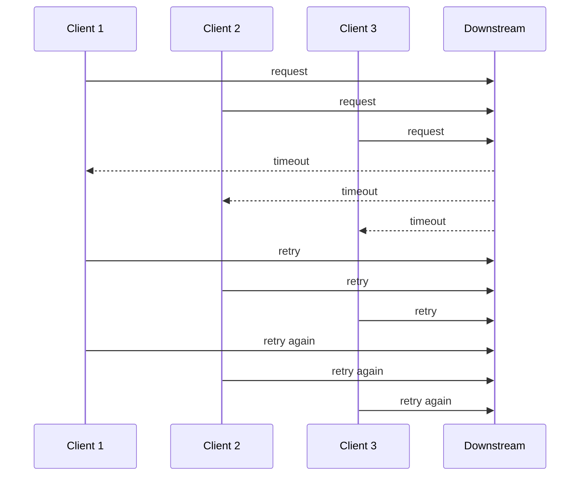
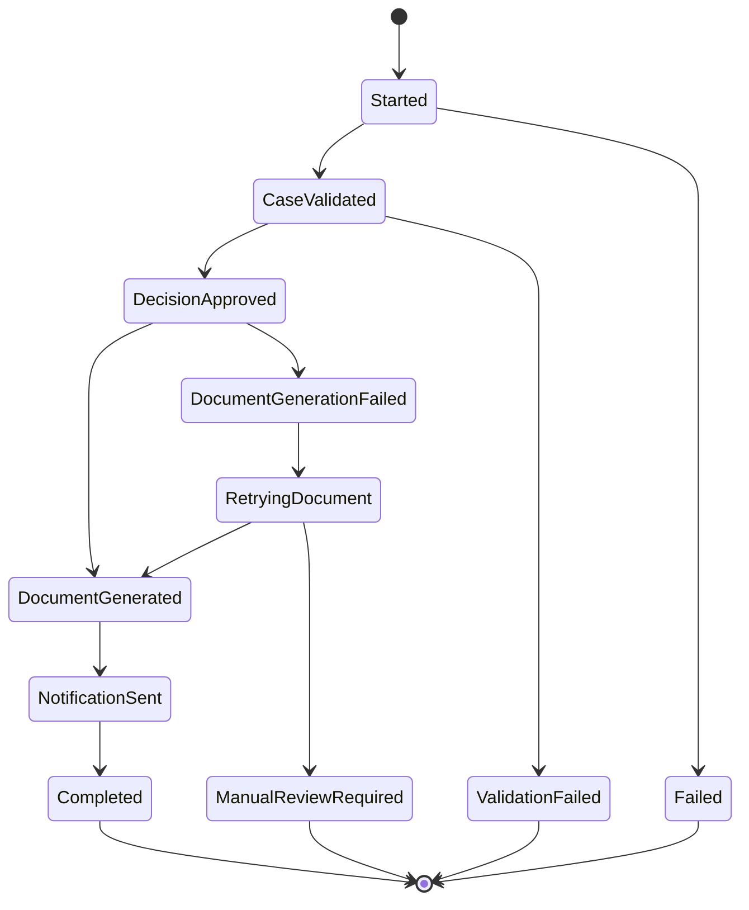
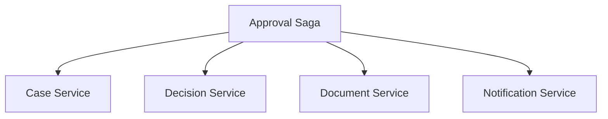
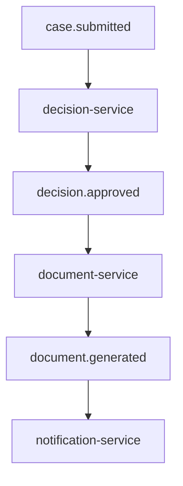

# Resilience Patterns: Retry, Idempotency, Queue, dan Saga

> Target part ini: kamu mampu mendesain service Go yang tidak rapuh saat menghadapi timeout, duplicate request, duplicate message, dependency lambat, queue backlog, partial failure, dan proses bisnis panjang yang tidak bisa diselesaikan dalam satu transaksi lokal.

Resilience bukan berarti sistem tidak pernah gagal.

Resilience berarti sistem:

- membatasi dampak failure;
- menghindari memperburuk failure;
- bisa pulih;
- bisa diretry dengan aman;
- bisa diaudit;
- bisa direkonsiliasi;
- bisa dijelaskan saat incident review.

Di sistem produksi, kegagalan bukan edge case. Kegagalan adalah bagian dari domain runtime.

---

## 1. Mental Model Utama

Distributed system tidak memberikan kepastian sederhana.

Hal-hal berikut bisa terjadi:

- request timeout tetapi server berhasil commit;
- retry menggandakan side effect;
- message dikirim dua kali;
- message diproses tetapi ack gagal;
- database commit sukses tetapi process crash sebelum response;
- worker mengambil job tetapi mati di tengah;
- consumer tertinggal;
- external service lambat;
- dependency overload;
- payload versi baru tidak dipahami consumer lama;
- compensation gagal;
- manual intervention dibutuhkan.

Maka resilience pattern bukan dekorasi. Ia adalah bagian dari correctness.

---

## 2. Framework Kaufman untuk Part Ini

Dalam kerangka Josh Kaufman, resilience harus dipecah menjadi sub-skill.

Skill besar:

> “Mampu membuat sistem Go tetap aman dan bisa pulih walaupun operasi tidak selalu berhasil.”

Sub-skill:

| Sub-skill | Pertanyaan Korektif |
|---|---|
| Timeout | Apakah operasi bisa berhenti saat budget habis? |
| Retry | Apakah retry aman, bounded, dan tidak menyebabkan storm? |
| Idempotency | Apakah operasi aman diulang? |
| Queue | Apakah async processing punya backpressure dan retry policy? |
| Outbox | Apakah state change dan event creation atomic? |
| Inbox | Apakah consumer aman terhadap duplicate message? |
| Saga | Apakah workflow panjang punya state eksplisit? |
| Compensation | Apakah undo/repair bukan asumsi kosong? |
| Reconciliation | Apakah sistem bisa memperbaiki drift? |
| Observability | Apakah failure bisa dilihat, bukan ditebak? |

Deliberate practice:

> Ambil satu workflow write penting, lalu desain ulang dengan timeout, idempotency, outbox, retry bounded, DLQ, dan runbook.

---

## 3. Resilience Dimulai dari Classification

Jangan langsung menambahkan retry.

Pertama, klasifikasikan failure.

| Failure | Retry? | Catatan |
|---|---:|---|
| Network timeout | Mungkin | Butuh idempotency untuk write |
| Connection reset | Mungkin | Bisa transient |
| HTTP 429 | Ya, bounded | Hormati `Retry-After` jika ada |
| HTTP 500 | Mungkin | Jangan retry tanpa batas |
| HTTP 503 | Mungkin | Dependency unavailable |
| Validation error | Tidak | Perbaiki input |
| Auth error | Tidak | Token/permission issue |
| Conflict business rule | Tidak | Domain failure |
| Duplicate request | Tidak sebagai failure | Kembalikan hasil sebelumnya |
| Malformed response | Tidak langsung | Contract/compatibility issue |
| Context canceled | Tidak | Caller sudah tidak menunggu |
| Deadline exceeded | Tergantung | Retry di layer lebih tinggi bisa aman jika idempotent |

Di Go, jangan hanya mengembalikan `error`. Buat error bisa diklasifikasikan.

```go
type Kind string

const (
	KindTemporary   Kind = "temporary"
	KindTimeout     Kind = "timeout"
	KindRateLimited Kind = "rate_limited"
	KindValidation  Kind = "validation"
	KindConflict    Kind = "conflict"
	KindInternal    Kind = "internal"
)

type Failure struct {
	Kind Kind
	Err  error
}

func (f Failure) Error() string {
	if f.Err == nil {
		return string(f.Kind)
	}
	return string(f.Kind) + ": " + f.Err.Error()
}

func (f Failure) Unwrap() error {
	return f.Err
}

func IsRetryable(err error) bool {
	var f Failure
	if errors.As(err, &f) {
		return f.Kind == KindTemporary ||
			f.Kind == KindTimeout ||
			f.Kind == KindRateLimited
	}
	return false
}
```

Klasifikasi yang salah membuat resilience berbahaya.

---

## 4. Timeout adalah Fondasi

Retry tanpa timeout adalah bom waktu.

Setiap operasi remote harus punya deadline:

- HTTP client;
- database query;
- queue publish;
- queue consume;
- external SDK;
- filesystem/network storage;
- lock acquisition;
- background worker;
- shutdown.

Contoh helper:

```go
func withOperationTimeout(parent context.Context, timeout time.Duration) (context.Context, context.CancelFunc) {
	if deadline, ok := parent.Deadline(); ok {
		remaining := time.Until(deadline)
		if remaining < timeout {
			return context.WithTimeout(parent, remaining)
		}
	}
	return context.WithTimeout(parent, timeout)
}
```

Tetapi hati-hati: jika parent context sudah punya deadline lebih pendek, jangan memperpanjang secara diam-diam.

---

## 5. Retry Policy yang Aman

Retry harus bounded.

Komponen retry policy:

- max attempts;
- max elapsed time;
- base delay;
- max delay;
- jitter;
- retryable error classifier;
- context cancellation;
- idempotency requirement;
- metric per attempt.

Contoh:

```go
type RetryPolicy struct {
	MaxAttempts int
	BaseDelay   time.Duration
	MaxDelay    time.Duration
}

func Retry(ctx context.Context, policy RetryPolicy, fn func(context.Context) error) error {
	if policy.MaxAttempts <= 0 {
		policy.MaxAttempts = 1
	}

	var last error

	for attempt := 1; attempt <= policy.MaxAttempts; attempt++ {
		if err := ctx.Err(); err != nil {
			return err
		}

		err := fn(ctx)
		if err == nil {
			return nil
		}

		last = err

		if !IsRetryable(err) {
			return err
		}
		if attempt == policy.MaxAttempts {
			break
		}

		delay := jitter(backoff(policy.BaseDelay, policy.MaxDelay, attempt))
		timer := time.NewTimer(delay)

		select {
		case <-ctx.Done():
			timer.Stop()
			return ctx.Err()
		case <-timer.C:
		}
	}

	return last
}
```

Backoff:

```go
func backoff(base, max time.Duration, attempt int) time.Duration {
	if base <= 0 {
		base = 50 * time.Millisecond
	}
	if max <= 0 {
		max = time.Second
	}

	d := base << (attempt - 1)
	if d > max {
		return max
	}
	return d
}

func jitter(d time.Duration) time.Duration {
	if d <= 0 {
		return d
	}
	n := rand.Int63n(int64(d))
	return time.Duration(n)
}
```

Catatan production:

- gunakan random source yang aman untuk concurrency jika dipakai global;
- jangan retry request body non-replayable tanpa buffering yang aman;
- jangan retry non-idempotent write tanpa idempotency key;
- jangan retry setelah context deadline habis.

---

## 6. Retry Storm

Retry storm terjadi saat banyak client retry bersamaan ketika dependency sedang lambat.



Mitigasi:

- exponential backoff;
- jitter;
- circuit breaker;
- bulkhead;
- rate limit;
- load shedding;
- queue;
- retry budget;
- respect server signal seperti `Retry-After`;
- disable retry untuk failure permanen.

---

## 7. Retry Budget

Retry budget membatasi tambahan traffic akibat retry.

Contoh rule:

> Dalam window 1 menit, retry traffic tidak boleh melebihi 10% request asli.

Secara sederhana:

```go
type RetryBudget struct {
	mu       sync.Mutex
	primary int
	retry   int
	limit   float64
}

func (b *RetryBudget) AllowRetry() bool {
	b.mu.Lock()
	defer b.mu.Unlock()

	if b.primary == 0 {
		return false
	}

	ratio := float64(b.retry+1) / float64(b.primary)
	if ratio > b.limit {
		return false
	}

	b.retry++
	return true
}
```

Implementasi production biasanya memakai window berbasis waktu dan metric.

Tujuannya bukan sempurna. Tujuannya mencegah retry menjadi traffic amplifier.

---

## 8. Idempotency: Operasi Aman Diulang

Idempotency penting untuk:

- API write;
- queue consumer;
- payment;
- notification;
- document generation;
- workflow approval;
- external callback;
- import batch;
- scheduled job.

Contoh HTTP:

```http
POST /cases/case-123/submit
Idempotency-Key: 01J2Z...
```

Semantik:

- request pertama diproses;
- response disimpan;
- retry dengan key sama mengembalikan response yang sama;
- key sama dengan payload berbeda harus ditolak;
- key punya TTL;
- key scope harus jelas: user/service/operation.

---

## 9. Idempotency Store

Interface:

```go
type IdempotencyStore interface {
	Begin(ctx context.Context, scope Scope, key string, requestHash string) (Record, Decision, error)
	Complete(ctx context.Context, id string, response StoredResponse) error
	Fail(ctx context.Context, id string, failure StoredFailure) error
}

type Decision string

const (
	DecisionProcess Decision = "process"
	DecisionReplay  Decision = "replay"
	DecisionConflict Decision = "conflict"
	DecisionInFlight Decision = "in_flight"
)

type Scope struct {
	TenantID string
	UserID   string
	Route    string
}

type Record struct {
	ID       string
	Response *StoredResponse
	Failure  *StoredFailure
}
```

Decision:

| Decision | Meaning |
|---|---|
| `process` | caller pertama, lanjut proses |
| `replay` | request pernah sukses, kembalikan response lama |
| `conflict` | key sama tetapi hash request beda |
| `in_flight` | request sedang diproses |

---

## 10. Idempotent Handler Skeleton

```go
func (h *Handler) SubmitCase(w http.ResponseWriter, r *http.Request) {
	key := r.Header.Get("Idempotency-Key")
	if key == "" {
		writeError(w, http.StatusBadRequest, "missing_idempotency_key", "Idempotency-Key is required")
		return
	}

	body, err := io.ReadAll(http.MaxBytesReader(w, r.Body, 1<<20))
	if err != nil {
		writeError(w, http.StatusBadRequest, "invalid_body", "request body too large or invalid")
		return
	}

	hash := sha256.Sum256(body)
	requestHash := hex.EncodeToString(hash[:])

	scope := Scope{
		TenantID: tenantFrom(r.Context()),
		UserID:   userFrom(r.Context()),
		Route:    "POST /cases/{id}/submit",
	}

	record, decision, err := h.idempotency.Begin(r.Context(), scope, key, requestHash)
	if err != nil {
		writeError(w, http.StatusInternalServerError, "idempotency_error", "could not process idempotency key")
		return
	}

	switch decision {
	case DecisionReplay:
		writeStoredResponse(w, *record.Response)
		return
	case DecisionConflict:
		writeError(w, http.StatusConflict, "idempotency_conflict", "idempotency key was used with a different request")
		return
	case DecisionInFlight:
		writeError(w, http.StatusConflict, "request_in_flight", "request with this idempotency key is still processing")
		return
	case DecisionProcess:
		// continue
	}

	result, err := h.service.Submit(r.Context(), decodeSubmit(body))
	if err != nil {
		_ = h.idempotency.Fail(r.Context(), record.ID, StoredFailureFromError(err))
		h.writeServiceError(w, err)
		return
	}

	resp := responseFromResult(result)
	if err := h.idempotency.Complete(r.Context(), record.ID, resp.ToStored()); err != nil {
		// Important: operation may have succeeded but response storage failed.
		// Log loudly and expose metric. This is an ambiguous operational problem.
		h.logger.ErrorContext(r.Context(), "idempotency completion failed", "error", err, "key", key)
	}

	writeResponse(w, resp)
}
```

Catatan:

- untuk response replay, simpan status code + body + headers penting;
- jangan menyimpan data sensitif berlebihan;
- request hash mencegah key reuse yang salah;
- idempotency record harus dibuat secara atomic.

---

## 11. Queue sebagai Shock Absorber

Queue berguna untuk:

- menyerap burst;
- memproses async;
- decouple producer dan consumer;
- retry pekerjaan;
- mengatur rate ke downstream;
- menjaga durability pekerjaan.

Tetapi queue bukan magic.

Queue menambahkan:

- lag;
- duplicate delivery;
- ordering issue;
- poison message;
- DLQ;
- replay;
- schema evolution;
- operational monitoring.

Rule:

> Queue memindahkan kompleksitas dari request path ke processing path. Kompleksitasnya tidak hilang.

---

## 12. Worker Pool Go untuk Queue

Skeleton:

```go
type Message struct {
	ID      string
	Payload []byte
	Attempt int
}

type Queue interface {
	Receive(ctx context.Context) (Message, error)
	Ack(ctx context.Context, msg Message) error
	Nack(ctx context.Context, msg Message, delay time.Duration) error
	DeadLetter(ctx context.Context, msg Message, reason string) error
}

type Consumer struct {
	queue Queue
	handler Handler
	workers int
}

type Handler interface {
	Handle(ctx context.Context, msg Message) error
}

func (c *Consumer) Run(ctx context.Context) error {
	jobs := make(chan Message, c.workers)

	var wg sync.WaitGroup
	for i := 0; i < c.workers; i++ {
		wg.Add(1)
		go func() {
			defer wg.Done()
			c.worker(ctx, jobs)
		}()
	}

	for {
		msg, err := c.queue.Receive(ctx)
		if err != nil {
			if ctx.Err() != nil {
				close(jobs)
				wg.Wait()
				return ctx.Err()
			}
			// log and continue with backoff
			continue
		}

		select {
		case jobs <- msg:
		case <-ctx.Done():
			close(jobs)
			wg.Wait()
			return ctx.Err()
		}
	}
}

func (c *Consumer) worker(ctx context.Context, jobs <-chan Message) {
	for {
		select {
		case <-ctx.Done():
			return
		case msg, ok := <-jobs:
			if !ok {
				return
			}
			c.handleOne(ctx, msg)
		}
	}
}
```

---

## 13. Queue Retry Policy

```go
func (c *Consumer) handleOne(ctx context.Context, msg Message) {
	err := c.handler.Handle(ctx, msg)
	if err == nil {
		_ = c.queue.Ack(ctx, msg)
		return
	}

	if !IsRetryable(err) {
		_ = c.queue.DeadLetter(ctx, msg, err.Error())
		return
	}

	if msg.Attempt >= 5 {
		_ = c.queue.DeadLetter(ctx, msg, "max attempts exceeded: "+err.Error())
		return
	}

	delay := retryDelay(msg.Attempt)
	_ = c.queue.Nack(ctx, msg, delay)
}
```

Policy harus menjawab:

- max attempt berapa?
- delay berapa?
- retryable error apa?
- kapan masuk DLQ?
- apakah order penting?
- apakah duplicate aman?
- apakah handler idempotent?
- apakah poison message bisa diinspeksi?
- apakah replay DLQ aman?

---

## 14. Dead-letter Queue

DLQ adalah tempat message yang gagal diproses setelah retry policy habis.

DLQ harus punya:

- original payload;
- metadata;
- attempt count;
- failure reason;
- timestamp;
- consumer name;
- trace/request ID;
- replay mechanism;
- access control;
- redaction policy untuk data sensitif.

DLQ tanpa proses review hanya kuburan message.

Runbook DLQ:

1. Lihat error reason.
2. Klasifikasikan: data bad, bug, dependency, schema mismatch.
3. Jika bug, deploy fix.
4. Replay subset kecil.
5. Monitor.
6. Replay batch lebih besar.
7. Catat incident jika berdampak bisnis.

---

## 15. Poison Message

Poison message adalah message yang selalu gagal karena payload/semantic tidak valid.

Contoh:

- enum tidak dikenal;
- required field kosong;
- reference ID tidak ada;
- payload terlalu besar;
- schema incompatible;
- business state tidak valid.

Jangan retry poison message tanpa batas. Itu hanya membakar resource.

Pisahkan error:

```go
var ErrPoisonMessage = errors.New("poison message")
```

```go
if errors.Is(err, ErrPoisonMessage) {
	_ = queue.DeadLetter(ctx, msg, err.Error())
	return
}
```

---

## 16. Outbox Pattern

Masalah:

```go
saveCase()
publishCaseSubmitted()
```

Jika `saveCase` sukses tetapi `publishCaseSubmitted` gagal, state berubah tetapi event hilang.

Outbox:

```go
tx := db.BeginTx(ctx, nil)
saveCase(tx)
insertOutbox(tx, event)
tx.Commit()
```

Publisher terpisah:

```go
for {
	events := loadPendingOutbox(ctx, limit)
	for _, event := range events {
		if err := broker.Publish(ctx, event); err != nil {
			continue
		}
		markPublished(ctx, event.ID)
	}
}
```

Outbox menjamin state change dan event record atomic dalam database lokal.

Bukan berarti publish exactly-once. Consumer tetap harus idempotent.

---

## 17. Outbox Table

Contoh schema:

```sql
CREATE TABLE outbox_events (
    id              TEXT PRIMARY KEY,
    aggregate_type  TEXT NOT NULL,
    aggregate_id    TEXT NOT NULL,
    event_type      TEXT NOT NULL,
    payload         JSONB NOT NULL,
    occurred_at     TIMESTAMPTZ NOT NULL,
    available_at    TIMESTAMPTZ NOT NULL DEFAULT now(),
    published_at    TIMESTAMPTZ NULL,
    attempts        INTEGER NOT NULL DEFAULT 0,
    last_error      TEXT NULL
);

CREATE INDEX idx_outbox_pending
ON outbox_events (available_at)
WHERE published_at IS NULL;
```

Operational fields penting:

- `attempts`;
- `last_error`;
- `available_at`;
- `published_at`;
- `aggregate_id`;
- `event_type`.

---

## 18. Inbox Pattern

Inbox menyelesaikan duplicate message di consumer.

Schema:

```sql
CREATE TABLE inbox_messages (
    consumer_name TEXT NOT NULL,
    message_id    TEXT NOT NULL,
    processed_at  TIMESTAMPTZ NOT NULL,
    PRIMARY KEY (consumer_name, message_id)
);
```

Processing:

```go
func (h *Handler) Handle(ctx context.Context, msg Message) error {
	return h.uow.Do(ctx, func(ctx context.Context, tx Tx) error {
		processed, err := tx.Inbox.AlreadyProcessed(ctx, h.name, msg.ID)
		if err != nil {
			return err
		}
		if processed {
			return nil
		}

		if err := h.apply(ctx, tx, msg); err != nil {
			return err
		}

		return tx.Inbox.MarkProcessed(ctx, h.name, msg.ID)
	})
}
```

Inbox harus satu transaction dengan side effect lokal agar duplicate tidak menggandakan perubahan.

---

## 19. Exactly-once Illusion

Dalam banyak sistem, “exactly once” end-to-end adalah ilusi jika dilihat dari business effect.

Yang lebih realistis:

- at-least-once delivery;
- idempotent consumer;
- deduplication key;
- transactional outbox;
- transactional inbox;
- reconciliation;
- observability.

Jangan menjanjikan exactly-once kecuali kamu bisa menjelaskan boundary teknisnya secara presisi.

Kalimat yang lebih defensible:

> Sistem menggunakan at-least-once delivery dengan idempotent processing untuk memastikan duplicate message tidak menggandakan business effect.

---

## 20. Saga

Saga adalah koordinasi beberapa local transaction untuk workflow panjang.

Cocok jika:

- proses menyentuh beberapa service;
- tidak bisa memakai transaksi lokal tunggal;
- workflow punya beberapa langkah;
- failure perlu compensation atau manual review;
- state harus durable dan auditable.

Contoh case approval:

1. validate case;
2. approve decision;
3. generate document;
4. notify party;
5. record audit;
6. close workflow.

Tidak aman jika hanya dibuat sebagai chain function call tanpa state.

---

## 21. Saga State Machine



State machine membuat failure eksplisit.

Dalam sistem regulatori, ini penting karena:

- audit trail wajib jelas;
- rollback diam-diam bisa berbahaya;
- manual override harus tercatat;
- state transition harus defensible;
- compensating action harus punya otorisasi.

---

## 22. Orchestration vs Choreography

### Orchestration

Ada coordinator.



Kelebihan:

- state terpusat;
- mudah dipahami;
- mudah diaudit;
- cocok untuk workflow kompleks.

Kekurangan:

- coordinator bisa menjadi bottleneck;
- coupling ke semua participant;
- butuh desain state machine matang.

### Choreography

Service bereaksi terhadap event.



Kelebihan:

- decoupled;
- participant independen;
- cocok untuk side effects.

Kekurangan:

- flow sulit dilihat;
- debugging lebih sulit;
- circular event risk;
- audit end-to-end butuh observability kuat.

Rule:

> Workflow regulatori yang panjang dan defensible biasanya lebih aman dengan orchestration eksplisit atau setidaknya process manager yang durable.

---

## 23. Compensation

Compensation bukan rollback teknis. Compensation adalah business action untuk memperbaiki efek sebelumnya.

Contoh:

| Langkah | Compensation |
|---|---|
| Reserve stock | Release stock |
| Approve decision | Mark decision revoked with reason |
| Generate document | Mark document superseded |
| Send notification | Send correction notice |
| Charge payment | Refund payment |

Tidak semua action bisa dikompensasi.

Email yang sudah terkirim tidak bisa “dibatalkan”. Yang bisa dilakukan adalah mengirim correction.

Untuk sistem compliance, compensation harus:

- terotorisasi;
- tercatat;
- punya reason;
- idempotent;
- tidak menghapus audit lama.

---

## 24. Reconciliation Job

Reconciliation memperbaiki drift.

Contoh drift:

- case status submitted tetapi tidak ada audit event;
- outbox event pending terlalu lama;
- document generated tetapi notification belum terkirim;
- payment captured tetapi order masih pending;
- external system state berbeda dari internal state.

Reconciliation job:

```go
func (j *Reconciler) Run(ctx context.Context) error {
	cases, err := j.repo.FindSubmittedWithoutAudit(ctx, 100)
	if err != nil {
		return err
	}

	for _, c := range cases {
		if err := j.audit.EnsureCaseSubmitted(ctx, c.ID); err != nil {
			j.logger.ErrorContext(ctx, "reconcile case audit failed", "case_id", c.ID, "error", err)
			continue
		}
	}

	return nil
}
```

Reconciliation bukan tanda desain gagal. Dalam distributed systems, reconciliation adalah safety net.

---

## 25. Idempotent Scheduled Job

Scheduled job juga harus idempotent.

Buruk:

```go
func SendDailyReminder() {
	users := findUsers()
	for _, u := range users {
		sendEmail(u)
	}
}
```

Jika job restart, email terkirim dua kali.

Lebih baik:

```go
func SendDailyReminder(ctx context.Context, day time.Time) error {
	users := findUsersNeedingReminder(ctx, day)

	for _, u := range users {
		key := fmt.Sprintf("daily-reminder:%s:%s", day.Format("2006-01-02"), u.ID)
		if alreadyDone(ctx, key) {
			continue
		}

		if err := sendEmail(ctx, u); err != nil {
			return err
		}

		markDone(ctx, key)
	}

	return nil
}
```

Tetap perhatikan atomicity antara `sendEmail` dan `markDone`.

Untuk efek eksternal, gunakan provider idempotency key jika tersedia.

---

## 26. Load Shedding

Load shedding berarti sengaja menolak sebagian request agar sistem inti tetap sehat.

Contoh:

- return 503 saat queue penuh;
- reject low-priority request;
- disable expensive feature;
- limit per tenant;
- drop optional async work;
- degrade response.

Di Go:

```go
type Shedder struct {
	sem chan struct{}
}

func NewShedder(limit int) *Shedder {
	return &Shedder{sem: make(chan struct{}, limit)}
}

func (s *Shedder) Middleware(next http.Handler) http.Handler {
	return http.HandlerFunc(func(w http.ResponseWriter, r *http.Request) {
		select {
		case s.sem <- struct{}{}:
			defer func() { <-s.sem }()
			next.ServeHTTP(w, r)
		default:
			writeError(w, http.StatusServiceUnavailable, "overloaded", "service is overloaded")
		}
	})
}
```

Load shedding lebih baik daripada membiarkan semua request timeout lambat.

---

## 27. Rate Limiting

Rate limit melindungi sistem dari abuse dan overload.

Dimensi rate limit:

- per IP;
- per user;
- per tenant;
- per API key;
- per operation;
- per downstream dependency.

Rate limit harus mengembalikan error contract stabil:

```json
{
  "code": "rate_limited",
  "message": "too many requests",
  "retry_after_seconds": 30
}
```

Rate limiting internal juga penting untuk melindungi downstream.

---

## 28. Resilience Observability

Metric wajib:

```txt
retry_attempts_total{dependency,operation,result}
timeouts_total{dependency,operation}
idempotency_replays_total{route}
idempotency_conflicts_total{route}
queue_lag_seconds{queue,consumer}
queue_messages_inflight{queue,consumer}
dead_letter_total{queue,consumer,reason}
outbox_pending_total{event_type}
outbox_oldest_pending_age_seconds
saga_state_total{workflow,state}
compensation_total{workflow,result}
```

Log wajib memuat:

- operation ID;
- idempotency key hash, bukan key mentah jika sensitif;
- trace ID;
- aggregate ID;
- attempt number;
- failure classification;
- saga state;
- queue message ID.

---

## 29. Failure-mode Table: Case Submission

| Failure | Detection | Handling | Metric |
|---|---|---|---|
| Client timeout after commit | Idempotency replay | Retry with same key returns stored response | `idempotency_replays_total` |
| Duplicate submit | Domain status already submitted | Return success or conflict sesuai contract | `duplicate_submit_total` |
| Decision service timeout | Context deadline | Return 503 or mark pending validation | `dependency_timeout_total` |
| DB deadlock | SQL error classifier | Retry transaction if safe | `transaction_retry_total` |
| Outbox publish fails | Outbox pending age | Retry publisher, alert if old | `outbox_oldest_pending_age_seconds` |
| Consumer duplicate message | Inbox table | Ignore duplicate | `inbox_duplicate_total` |
| Poison event | Handler classification | Move to DLQ | `dead_letter_total` |
| Saga stuck | State age threshold | Alert + runbook | `saga_stuck_total` |

---

## 30. Resilience Review Checklist

### Timeout

- Apakah semua remote operation punya timeout?
- Apakah timeout mengikuti budget end-to-end?
- Apakah context dipropagasikan?
- Apakah cleanup tetap terjadi saat cancel?

### Retry

- Apakah retry hanya untuk error retryable?
- Apakah max attempt jelas?
- Apakah backoff dan jitter dipakai?
- Apakah retry berhenti saat context selesai?
- Apakah ada retry budget?

### Idempotency

- Apakah write endpoint penting memakai idempotency key?
- Apakah key scoped dengan benar?
- Apakah request hash dicek?
- Apakah replay response konsisten?
- Apakah in-flight request ditangani?

### Queue

- Apakah handler idempotent?
- Apakah retry policy jelas?
- Apakah DLQ punya runbook?
- Apakah poison message tidak diretry tanpa batas?
- Apakah queue lag dimonitor?

### Saga

- Apakah workflow state durable?
- Apakah setiap state punya allowed transition?
- Apakah compensation eksplisit?
- Apakah manual review state tersedia?
- Apakah stuck workflow bisa dideteksi?

### Observability

- Apakah retry, timeout, DLQ, outbox, saga state terlihat?
- Apakah logs punya correlation ID?
- Apakah alert berdasarkan symptom, bukan noise?

---

## 31. Latihan Praktik 4 Jam

Bangun workflow `case submission`.

Requirement:

1. `POST /cases/{id}/submit` wajib memakai `Idempotency-Key`.
2. Submit memanggil `decision-service`.
3. Decision timeout menghasilkan `503 dependency_unavailable`.
4. Submit sukses menyimpan case status `submitted`.
5. Submit sukses juga menulis outbox event `case.submitted`.
6. Outbox publisher mem-publish event ke in-memory broker.
7. Audit consumer menerima event dan mencatat audit log.
8. Audit consumer memakai inbox untuk deduplication.
9. Jika audit consumer gagal 3 kali, message masuk DLQ.
10. Tambahkan metric/log sederhana untuk retry, DLQ, dan outbox pending.

Test:

- idempotent replay;
- idempotency conflict;
- decision timeout;
- outbox event created with case submit;
- duplicate message ignored by inbox;
- poison message goes to DLQ;
- saga/workflow stuck detection jika kamu menambahkan state machine.

---

## 32. Rubric Penilaian

| Level | Indikator |
|---|---|
| Beginner | Menambahkan retry sederhana di HTTP client |
| Junior | Memakai timeout dan max retry |
| Intermediate | Menambahkan idempotency untuk write API dan DLQ untuk queue |
| Senior | Outbox/inbox, retry budget, failure classification, dan observability |
| Staff-level | Mendesain workflow durable, compensation, reconciliation, dan failure-mode table yang defensible |

---

## 33. Kesimpulan

Resilience bukan kumpulan library. Resilience adalah desain correctness di bawah ketidakpastian.

Prinsip utama:

- timeout sebelum retry;
- retry harus bounded, classified, dan memakai jitter;
- write operation penting harus idempotent;
- queue memberi decoupling tetapi membawa duplicate, lag, dan DLQ;
- outbox menjaga state change dan event record atomic;
- inbox membuat consumer aman terhadap duplicate;
- saga membuat workflow panjang eksplisit;
- compensation adalah business action, bukan rollback magic;
- reconciliation adalah safety net;
- observability membuat resilience bisa dioperasikan.

Jika kamu bisa menjelaskan apa yang terjadi saat commit sukses tetapi response hilang, saat message diproses dua kali, dan saat workflow stuck setengah jalan, kamu sudah berpikir seperti engineer production-grade.
