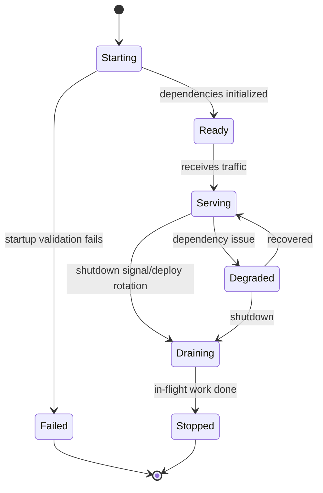
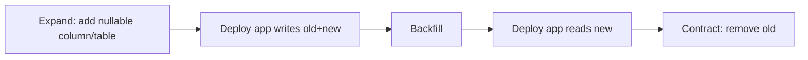
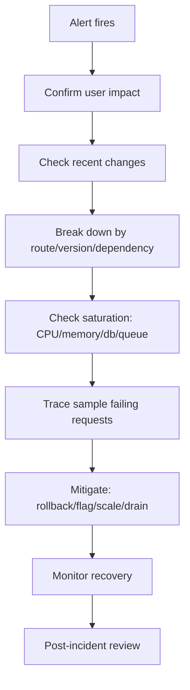

# Production Operations: Health Check, Shutdown, Deployment, dan Runtime Control

> Target part ini: kamu mampu membuat service Go yang tidak hanya benar secara kode, tetapi bisa dijalankan, dimonitor, dihentikan, dideploy, direstart, dan didebug dengan aman di production.

Banyak service gagal bukan karena algoritmanya salah, tetapi karena lifecycle dan operasinya buruk:

- shutdown memutus request aktif;
- readiness mengaku sehat padahal database belum siap;
- liveness membunuh service saat dependency lambat;
- deployment mengirim traffic terlalu cepat;
- config salah baru ketahuan setelah traffic masuk;
- profiling tidak tersedia saat incident;
- queue consumer tetap mengambil job saat service seharusnya drain;
- migration merusak versi lama;
- rollback tidak aman.

Production operations adalah bagian dari desain sistem.

---

## 1. Mental Model Utama

Service production punya lifecycle:



Kode Go harus memahami lifecycle ini.

`main()` bukan sekadar memanggil `ListenAndServe`. `main()` adalah process supervisor kecil untuk service kamu.

---

## 2. Framework Kaufman untuk Part Ini

Dalam kerangka Kaufman, production operations adalah sub-skill yang bisa dilatih.

Skill besar:

> “Mampu mengoperasikan service Go dengan aman.”

Sub-skill:

| Sub-skill | Pertanyaan Korektif |
|---|---|
| Startup | Apakah config dan dependency divalidasi sebelum ready? |
| Readiness | Apakah service hanya menerima traffic saat benar-benar siap? |
| Liveness | Apakah process stuck bisa dideteksi tanpa membunuh service sehat? |
| Shutdown | Apakah request/job aktif diberi waktu selesai? |
| Draining | Apakah service berhenti menerima work baru sebelum mati? |
| Deployment | Apakah rolling deploy aman terhadap versi lama/baru? |
| Runtime control | Apakah profiling/debugging bisa dilakukan dengan aman? |
| Runbook | Apakah operator tahu apa yang harus dilakukan saat alert? |

Deliberate practice:

> Buat service kecil, tambahkan startup validation, readiness/liveness, graceful shutdown, drain worker, profiling endpoint, dan runbook.

---

## 3. Startup yang Benar

Startup harus melakukan:

1. load config;
2. validate config;
3. initialize logger;
4. initialize metrics/tracing;
5. connect dependency penting;
6. run compatibility check ringan;
7. construct service graph;
8. start server;
9. baru nyatakan ready.

Jangan menerima traffic sebelum dependency kritis siap.

Contoh:

```go
func main() {
	ctx, stop := signal.NotifyContext(context.Background(), syscall.SIGINT, syscall.SIGTERM)
	defer stop()

	logger := slog.New(slog.NewJSONHandler(os.Stdout, nil))

	cfg, err := config.Load()
	if err != nil {
		logger.Error("load config failed", "error", err)
		os.Exit(1)
	}
	if err := cfg.Validate(); err != nil {
		logger.Error("invalid config", "error", err)
		os.Exit(1)
	}

	db, err := postgres.Open(ctx, cfg.DatabaseURL)
	if err != nil {
		logger.Error("open database failed", "error", err)
		os.Exit(1)
	}
	defer db.Close()

	if err := db.PingContext(ctx); err != nil {
		logger.Error("database ping failed", "error", err)
		os.Exit(1)
	}

	app := buildApp(cfg, db, logger)

	if err := run(ctx, app, logger); err != nil {
		logger.Error("service stopped with error", "error", err)
		os.Exit(1)
	}
}
```

Startup failure harus fail fast. Jangan jalan dalam keadaan setengah rusak.

---

## 4. Readiness vs Liveness

Ini sering tertukar.

### Readiness

Menjawab:

> “Apakah instance ini siap menerima traffic?”

Readiness boleh false saat:

- startup belum selesai;
- database migration belum compatible;
- service sedang draining;
- dependency critical tidak tersedia;
- warmup belum selesai;
- queue consumer belum siap.

### Liveness

Menjawab:

> “Apakah process ini masih hidup atau stuck parah?”

Liveness sebaiknya tidak bergantung pada dependency eksternal seperti database. Jika database down dan semua pod bunuh diri karena liveness gagal, outage makin buruk.

| Probe | Tujuan | Boleh cek DB? |
|---|---|---:|
| Readiness | menerima traffic atau tidak | Ya, jika DB critical |
| Liveness | process stuck atau tidak | Umumnya tidak |
| Startup | memberi waktu boot sebelum liveness aktif | Ya, ringan |

---

## 5. Health Endpoint Design

```go
type HealthState struct {
	mu       sync.RWMutex
	ready    bool
	draining bool
	started  time.Time
}

func NewHealthState() *HealthState {
	return &HealthState{started: time.Now()}
}

func (s *HealthState) SetReady(v bool) {
	s.mu.Lock()
	defer s.mu.Unlock()
	s.ready = v
}

func (s *HealthState) SetDraining(v bool) {
	s.mu.Lock()
	defer s.mu.Unlock()
	s.draining = v
}

func (s *HealthState) Ready() bool {
	s.mu.RLock()
	defer s.mu.RUnlock()
	return s.ready && !s.draining
}

func (s *HealthState) Live() bool {
	return true
}
```

Handlers:

```go
func ReadinessHandler(state *HealthState) http.HandlerFunc {
	return func(w http.ResponseWriter, r *http.Request) {
		if !state.Ready() {
			w.WriteHeader(http.StatusServiceUnavailable)
			_, _ = w.Write([]byte("not ready\n"))
			return
		}
		w.WriteHeader(http.StatusOK)
		_, _ = w.Write([]byte("ready\n"))
	}
}

func LivenessHandler(state *HealthState) http.HandlerFunc {
	return func(w http.ResponseWriter, r *http.Request) {
		if !state.Live() {
			w.WriteHeader(http.StatusServiceUnavailable)
			_, _ = w.Write([]byte("not live\n"))
			return
		}
		w.WriteHeader(http.StatusOK)
		_, _ = w.Write([]byte("live\n"))
	}
}
```

---

## 6. Dependency Health

Readiness bisa mengecek dependency critical, tetapi jangan terlalu mahal.

```go
type Checker interface {
	Name() string
	Check(ctx context.Context) error
}

type DBChecker struct {
	db *sql.DB
}

func (c DBChecker) Name() string {
	return "database"
}

func (c DBChecker) Check(ctx context.Context) error {
	ctx, cancel := context.WithTimeout(ctx, 200*time.Millisecond)
	defer cancel()
	return c.db.PingContext(ctx)
}
```

Aggregate:

```go
func DependencyReadiness(checkers []Checker) http.HandlerFunc {
	return func(w http.ResponseWriter, r *http.Request) {
		ctx, cancel := context.WithTimeout(r.Context(), 500*time.Millisecond)
		defer cancel()

		results := make(map[string]string)
		status := http.StatusOK

		for _, checker := range checkers {
			if err := checker.Check(ctx); err != nil {
				results[checker.Name()] = err.Error()
				status = http.StatusServiceUnavailable
			} else {
				results[checker.Name()] = "ok"
			}
		}

		writeJSON(w, status, results)
	}
}
```

Catatan:

- jangan expose secret/error internal berlebihan di public endpoint;
- health endpoint biasanya internal-only;
- timeout health check harus pendek;
- gunakan cache jika check mahal.

---

## 7. Graceful Shutdown

Graceful shutdown berarti:

1. menerima signal;
2. readiness menjadi false;
3. berhenti menerima request baru;
4. beri waktu request aktif selesai;
5. hentikan worker/consumer;
6. flush logs/metrics/traces;
7. close resource;
8. exit.

HTTP server:

```go
func runHTTP(ctx context.Context, srv *http.Server, logger *slog.Logger) error {
	errCh := make(chan error, 1)

	go func() {
		logger.Info("http server starting", "addr", srv.Addr)
		errCh <- srv.ListenAndServe()
	}()

	select {
	case <-ctx.Done():
		shutdownCtx, cancel := context.WithTimeout(context.Background(), 10*time.Second)
		defer cancel()

		logger.Info("http server shutting down")
		if err := srv.Shutdown(shutdownCtx); err != nil {
			return err
		}
		return nil

	case err := <-errCh:
		if errors.Is(err, http.ErrServerClosed) {
			return nil
		}
		return err
	}
}
```

`Shutdown` menutup listener, menutup idle connections, dan menunggu active connections selesai sampai context habis.

---

## 8. Draining

Shutdown sebaiknya tidak langsung memanggil `Shutdown`.

Sequence yang lebih aman:

```go
func run(ctx context.Context, app *App, logger *slog.Logger) error {
	errCh := make(chan error, 1)

	app.Health.SetReady(true)

	go func() {
		errCh <- app.HTTP.ListenAndServe()
	}()

	select {
	case <-ctx.Done():
		logger.Info("shutdown signal received")

		app.Health.SetDraining(true)
		app.Health.SetReady(false)

		// beri load balancer / orchestrator waktu berhenti mengirim traffic
		time.Sleep(5 * time.Second)

		shutdownCtx, cancel := context.WithTimeout(context.Background(), 20*time.Second)
		defer cancel()

		if err := app.HTTP.Shutdown(shutdownCtx); err != nil {
			return err
		}

		if err := app.Workers.Stop(shutdownCtx); err != nil {
			return err
		}

		return nil

	case err := <-errCh:
		if errors.Is(err, http.ErrServerClosed) {
			return nil
		}
		return err
	}
}
```

Di Kubernetes, delay draining harus diselaraskan dengan `terminationGracePeriodSeconds` dan readiness probe behavior.

---

## 9. Worker Shutdown

Worker harus berhenti mengambil job baru dan menyelesaikan job aktif.

```go
type WorkerGroup struct {
	cancel context.CancelFunc
	done   chan struct{}
}

func StartWorkers(parent context.Context, n int, queue Queue, handler Handler) *WorkerGroup {
	ctx, cancel := context.WithCancel(parent)
	wg := &sync.WaitGroup{}

	for i := 0; i < n; i++ {
		wg.Add(1)
		go func(workerID int) {
			defer wg.Done()
			runWorker(ctx, workerID, queue, handler)
		}(i)
	}

	done := make(chan struct{})
	go func() {
		wg.Wait()
		close(done)
	}()

	return &WorkerGroup{
		cancel: cancel,
		done:   done,
	}
}

func (g *WorkerGroup) Stop(ctx context.Context) error {
	g.cancel()

	select {
	case <-g.done:
		return nil
	case <-ctx.Done():
		return ctx.Err()
	}
}
```

Worker:

```go
func runWorker(ctx context.Context, id int, queue Queue, handler Handler) {
	for {
		msg, err := queue.Receive(ctx)
		if err != nil {
			if ctx.Err() != nil {
				return
			}
			continue
		}

		handleCtx, cancel := context.WithTimeout(ctx, 30*time.Second)
		err = handler.Handle(handleCtx, msg)
		cancel()

		if err != nil {
			_ = queue.Nack(context.Background(), msg)
			continue
		}

		_ = queue.Ack(context.Background(), msg)
	}
}
```

Catatan:

- ack/nack sering perlu context tersendiri agar masih bisa menyelesaikan saat parent canceled;
- jangan mulai job baru setelah drain;
- lease/visibility timeout queue harus sesuai durasi job.

---

## 10. Signal Handling

Gunakan `signal.NotifyContext`.

```go
ctx, stop := signal.NotifyContext(context.Background(), syscall.SIGINT, syscall.SIGTERM)
defer stop()
```

Untuk second signal, beberapa service memilih exit paksa:

```go
go func() {
	<-ctx.Done()
	stop()

	force := make(chan os.Signal, 1)
	signal.Notify(force, syscall.SIGINT, syscall.SIGTERM)
	<-force

	os.Exit(1)
}()
```

Hati-hati dengan exit paksa. Gunakan hanya sebagai fallback ketika graceful shutdown menggantung.

---

## 11. Readiness Saat Dependency Degraded

Tidak semua dependency harus membuat readiness false.

Klasifikasikan dependency:

| Dependency | Critical? | Jika Down |
|---|---:|---|
| Primary database | Ya | Not ready atau degraded |
| Cache | Tergantung | Bisa degraded jika fallback DB ada |
| Metrics backend | Tidak | Tetap ready, log error |
| Email provider | Tidak untuk read API | Feature-specific degraded |
| Decision service | Ya untuk submit | Endpoint-specific failure |
| Object storage | Ya jika upload endpoint utama | Degraded/endpoint failure |

Readiness global false jika instance tidak bisa melayani traffic utama.

Tetapi jangan membuat seluruh service not ready hanya karena fitur optional down.

---

## 12. Runtime Profiling

Go menyediakan profiling runtime yang sangat berguna saat incident.

Untuk internal server:

```go
import _ "net/http/pprof"
```

Jika menggunakan default mux:

```go
go func() {
	_ = http.ListenAndServe("127.0.0.1:6060", nil)
}()
```

Lebih aman: jalankan di admin listener internal-only.

```go
adminMux := http.NewServeMux()
adminMux.HandleFunc("/healthz/live", live)
adminMux.HandleFunc("/healthz/ready", ready)

// register pprof endpoints manually or with default mux only on internal port
adminServer := &http.Server{
	Addr:    cfg.AdminAddr,
	Handler: adminMux,
}
```

Penting:

- jangan expose pprof ke internet;
- lindungi dengan network policy/auth;
- profiling bisa berdampak performa;
- dokumentasikan cara mengambil profile.

---

## 13. Runtime Debug Endpoints

Admin endpoint berguna:

| Endpoint | Fungsi |
|---|---|
| `/healthz/live` | liveness |
| `/healthz/ready` | readiness |
| `/metrics` | Prometheus metrics |
| `/debug/pprof/` | profiling |
| `/debug/config` | config redacted |
| `/debug/build` | version/commit/build time |
| `/debug/routes` | route list jika perlu |
| `/debug/drain` | manual drain jika sangat dibutuhkan |

Jangan membuat debug endpoint yang bisa mutate state tanpa auth kuat.

---

## 14. Build Info Endpoint

Inject version saat build:

```bash
go build \
  -ldflags "-X main.version=$VERSION -X main.commit=$COMMIT -X main.buildTime=$BUILD_TIME" \
  -o myservice ./cmd/myservice
```

Go:

```go
var (
	version   = "dev"
	commit    = "none"
	buildTime = "unknown"
)

func BuildHandler(w http.ResponseWriter, r *http.Request) {
	writeJSON(w, http.StatusOK, map[string]string{
		"version": version,
		"commit": commit,
		"build_time": buildTime,
	})
}
```

Ini sangat membantu incident:

- versi mana sedang running;
- commit mana;
- apakah rollback benar terjadi;
- apakah semua instance sudah updated.

---

## 15. Configuration Reload

Tidak semua config aman direload.

Aman direload biasanya:

- log level;
- feature flag local;
- rate limit threshold;
- sampling rate;
- non-critical tuning.

Tidak aman direload sembarangan:

- database URL;
- encryption key;
- auth issuer;
- schema mode;
- queue topic;
- service identity.

Reload harus atomic.

```go
type RuntimeConfig struct {
	mu sync.RWMutex
	value Config
}

func (c *RuntimeConfig) Get() Config {
	c.mu.RLock()
	defer c.mu.RUnlock()
	return c.value
}

func (c *RuntimeConfig) Update(next Config) {
	c.mu.Lock()
	defer c.mu.Unlock()
	c.value = next
}
```

Untuk high-read config, `atomic.Value` bisa dipakai:

```go
type AtomicConfig struct {
	value atomic.Value // stores Config
}

func (c *AtomicConfig) Get() Config {
	return c.value.Load().(Config)
}

func (c *AtomicConfig) Update(next Config) {
	c.value.Store(next)
}
```

Pastikan `Config` immutable atau tidak dimodifikasi setelah store.

---

## 16. Feature Flag

Feature flag berguna untuk:

- gradual rollout;
- kill switch;
- experiment;
- tenant-specific enablement;
- operational mitigation.

Tetapi feature flag bisa menjadi technical debt.

Rule:

- setiap flag punya owner;
- setiap flag punya expiry;
- default aman;
- perubahan flag tercatat;
- flag penting terlihat di debug config;
- flag tidak menggantikan authorization.

Contoh:

```go
type Flags interface {
	Enabled(ctx context.Context, name string, attrs Attributes) bool
}
```

Gunakan di boundary yang jelas:

```go
if h.flags.Enabled(r.Context(), "case.new-validation", attrsFromRequest(r)) {
	err = h.service.SubmitWithNewValidation(r.Context(), cmd)
} else {
	err = h.service.Submit(r.Context(), cmd)
}
```

Jangan menyebar flag terlalu dalam sehingga domain logic bercabang liar.

---

## 17. Deployment Strategy

### Rolling Deployment

Instance diganti bertahap.

Syarat:

- readiness benar;
- graceful shutdown benar;
- backward compatibility;
- migration expand-contract;
- no sticky hidden state;
- metrics per version.

### Blue-Green

Dua environment, switch traffic.

Cocok untuk:

- release besar;
- rollback cepat;
- traffic switch jelas.

Risiko:

- environment drift;
- database migration tetap sulit.

### Canary

Sebagian kecil traffic ke versi baru.

Cocok untuk:

- mengurangi blast radius;
- memvalidasi metric;
- rollout bertahap.

Butuh:

- metric per version;
- rollback otomatis/manual jelas;
- compatibility.

---

## 18. Database Migration Safety

Migration production harus backward compatible.

Expand-contract:



Anti-pattern:

- drop column sebelum semua app berhenti membaca;
- rename column tanpa compatibility;
- membuat field baru wajib sebelum semua writer mengisi;
- migration lama dan blocking di table besar;
- rollback app tetapi schema tidak compatible.

Go service harus punya startup check jika butuh minimum schema version.

---

## 19. Startup Schema Check

```go
func CheckSchemaVersion(ctx context.Context, db *sql.DB, required int) error {
	var current int
	err := db.QueryRowContext(ctx, `SELECT version FROM schema_version ORDER BY version DESC LIMIT 1`).Scan(&current)
	if err != nil {
		return err
	}
	if current < required {
		return fmt.Errorf("schema version %d is below required %d", current, required)
	}
	return nil
}
```

Jangan terlalu sering melakukan expensive migration check di readiness. Startup check cukup untuk banyak kasus.

---

## 20. Rollback Strategy

Rollback bukan hanya deploy versi lama.

Pertanyaan rollback:

- Apakah versi lama compatible dengan schema baru?
- Apakah event format baru bisa dibaca versi lama?
- Apakah data yang sudah ditulis versi baru valid untuk versi lama?
- Apakah feature flag bisa mematikan path baru?
- Apakah external side effect bisa dikompensasi?
- Apakah migration reversible?
- Apakah rollback tested?

Jika tidak, namanya bukan rollback. Itu gambling.

---

## 21. Resource Limits

Go service harus aware terhadap resource limit container.

Perhatikan:

- CPU quota;
- memory limit;
- GOMAXPROCS;
- GOMEMLIMIT;
- connection pool;
- goroutine count;
- request body limit;
- queue worker count;
- file descriptor;
- outbound concurrency.

Jika memory limit 512MB tetapi service bisa membaca upload 1GB ke memory, limit tidak berarti.

---

## 22. Connection Pool Tuning

Database:

```go
db.SetMaxOpenConns(25)
db.SetMaxIdleConns(25)
db.SetConnMaxLifetime(30 * time.Minute)
db.SetConnMaxIdleTime(5 * time.Minute)
```

Tuning harus mempertimbangkan:

- jumlah instance;
- database max connection;
- query latency;
- transaction duration;
- worker count;
- burst traffic.

Jika 20 pod masing-masing `MaxOpenConns=100`, database bisa menerima 2000 koneksi. Mungkin terlalu banyak.

HTTP transport:

```go
transport := &http.Transport{
	MaxIdleConns:        100,
	MaxIdleConnsPerHost: 20,
	IdleConnTimeout:     90 * time.Second,
}

client := &http.Client{
	Transport: transport,
	Timeout:   2 * time.Second,
}
```

Jangan membuat `http.Client` baru per request.

---

## 23. Operational Metrics

Minimal service metrics:

```txt
process_uptime_seconds
build_info{version,commit}
http_requests_total{route,method,status}
http_request_duration_seconds_bucket{route,method}
http_requests_in_flight{route}
dependency_requests_total{dependency,operation,status}
dependency_request_duration_seconds_bucket{dependency,operation}
db_queries_total{operation,status}
db_query_duration_seconds_bucket{operation}
queue_lag_seconds{queue,consumer}
queue_inflight_messages{queue,consumer}
goroutines
memory_heap_bytes
gc_pause_seconds
```

Golden signals:

- latency;
- traffic;
- errors;
- saturation.

Untuk internal resource, gunakan USE:

- utilization;
- saturation;
- errors.

---

## 24. Alerting

Alert harus action-oriented.

Buruk:

```txt
CPU > 80%
```

Bisa noise.

Lebih baik:

```txt
p95 latency > SLO for 10 minutes
5xx rate > 2% for 5 minutes
queue oldest message age > 15 minutes
outbox pending age > 5 minutes
readiness failure > 30% instances
error budget burn rate high
```

Alert harus punya runbook.

Jika tidak ada tindakan yang jelas, itu mungkin dashboard, bukan alert.

---

## 25. Runbook

Runbook minimal:

```md
# Runbook: High HTTP 5xx Rate

## Symptom

5xx rate for case-service exceeds 2% for 5 minutes.

## Impact

Users may fail to submit or update cases.

## First Checks

1. Check recent deployment version.
2. Check dependency error metrics.
3. Check database connection pool saturation.
4. Check logs by trace/request ID.
5. Check p95/p99 latency by route.

## Mitigation

1. Roll back if started after deployment.
2. Disable feature flag `case.new-validation` if error isolated.
3. Scale service if CPU/memory saturated.
4. Reduce worker count if database overloaded.
5. Put service in degraded mode if dependency optional.

## Escalation

Contact service owner and database owner.

## Post-incident

Create incident report with timeline, root cause, blast radius, and prevention.
```

Runbook membuat operasi tidak bergantung pada ingatan satu orang.

---

## 26. Incident Debugging Flow



Saat incident, jangan langsung mencari root cause sempurna. Mitigasi dulu jika dampak user nyata.

---

## 27. Runtime Profiling During Incident

CPU spike:

```bash
go tool pprof http://localhost:6060/debug/pprof/profile?seconds=30
```

Heap:

```bash
go tool pprof http://localhost:6060/debug/pprof/heap
```

Goroutine:

```bash
curl http://localhost:6060/debug/pprof/goroutine?debug=2
```

Block/mutex profile perlu diaktifkan dengan hati-hati:

```go
runtime.SetBlockProfileRate(1)
runtime.SetMutexProfileFraction(5)
```

Jangan aktifkan profil mahal permanen tanpa alasan.

---

## 28. Common Production Failure di Go

### 28.1 Goroutine Leak

Gejala:

- goroutine count naik terus;
- memory naik;
- shutdown lambat;
- blocked send/receive channel.

Penyebab:

- channel tidak ditutup;
- worker tidak listen context;
- send ke channel tanpa receiver;
- HTTP response body tidak ditutup;
- ticker tidak dihentikan.

### 28.2 Connection Leak

Gejala:

- database connection pool habis;
- HTTP client lambat;
- file descriptor naik.

Penyebab:

- `rows.Close()` lupa;
- `resp.Body.Close()` lupa;
- transaction tidak commit/rollback;
- client baru per request.

### 28.3 Shutdown Tidak Bersih

Gejala:

- request gagal saat deployment;
- duplicate job;
- partial processing;
- data inconsistent.

Penyebab:

- tidak drain;
- worker langsung mati;
- ack/nack tidak selesai;
- timeout shutdown terlalu pendek.

### 28.4 Memory Blow-up

Penyebab:

- baca body/file besar ke memory;
- unbounded slice/map;
- queue in-memory tanpa batas;
- log payload besar;
- cache tanpa eviction.

---

## 29. Production Readiness Checklist

### Startup

- Config divalidasi.
- Dependency critical dicek.
- Schema version compatible.
- Logger/metrics/tracing siap.
- Build info tersedia.

### Health

- Liveness tidak bergantung pada dependency eksternal berat.
- Readiness false saat startup dan draining.
- Dependency readiness timeout pendek.
- Health endpoint internal-only jika detail sensitif.

### Shutdown

- Signal handling benar.
- Readiness false sebelum shutdown.
- Drain delay disesuaikan orchestrator.
- HTTP shutdown punya timeout.
- Worker stop gracefully.
- Logs/metrics/traces flush.

### Runtime

- pprof tersedia secara aman.
- Metrics cukup untuk latency/error/saturation.
- Goroutine/memory/GC terlihat.
- Debug config redacted.
- Version endpoint tersedia.

### Deployment

- Rolling deploy aman.
- Migration backward compatible.
- Rollback plan valid.
- Feature flag untuk risky path.
- Canary metric per version.

### Security

- Admin endpoint tidak public.
- Debug endpoint terlindungi.
- Secret tidak muncul di logs/config endpoint.
- Least privilege untuk service identity.

---

## 30. Latihan Praktik 3 Jam

Ambil service dari part sebelumnya, tambahkan production operations.

Requirement:

1. Tambahkan `/healthz/live`.
2. Tambahkan `/healthz/ready`.
3. Readiness false saat startup belum selesai.
4. Readiness false saat shutdown/draining.
5. Tambahkan graceful shutdown untuk HTTP server.
6. Tambahkan worker yang bisa stop gracefully.
7. Tambahkan build info endpoint.
8. Tambahkan config validation.
9. Tambahkan pprof di admin port internal.
10. Tambahkan runbook `docs/runbook-high-5xx.md`.
11. Tambahkan metric/log untuk startup, shutdown, dan worker stop.

Test:

- readiness true setelah service started;
- readiness false saat draining;
- server menolak traffic baru saat shutdown;
- worker berhenti saat context canceled;
- config invalid membuat startup gagal;
- build info endpoint mengembalikan version/commit.

---

## 31. Rubric Penilaian

| Level | Indikator |
|---|---|
| Beginner | Service bisa dijalankan dan menerima HTTP request |
| Junior | Ada health endpoint sederhana |
| Intermediate | Readiness/liveness benar, graceful shutdown HTTP berjalan |
| Senior | Worker draining, admin endpoint aman, deployment/migration/rollback dipikirkan |
| Staff-level | Operability lengkap: SLO, runbook, profiling, failure mode, safe rollout, dan incident debugging flow |

---

## 32. Kesimpulan

Production operations adalah bagian dari software design.

Prinsip utama:

- startup harus fail fast jika config/dependency critical salah;
- readiness berarti siap menerima traffic;
- liveness berarti process tidak stuck, bukan dependency selalu sehat;
- graceful shutdown harus drain sebelum mati;
- worker harus berhenti mengambil job baru dan menyelesaikan job aktif;
- profiling/debug endpoint harus tersedia tetapi aman;
- deployment butuh compatibility, bukan sekadar image baru;
- migration harus expand-contract;
- rollback harus diuji sebagai skenario nyata;
- metrics, logs, traces, dan runbook membuat incident bisa ditangani;
- service yang tidak bisa dioperasikan belum production-ready.

Setelah part ini, kamu seharusnya bisa melihat service Go sebagai process hidup dengan lifecycle penuh, bukan hanya kumpulan handler dan function.
