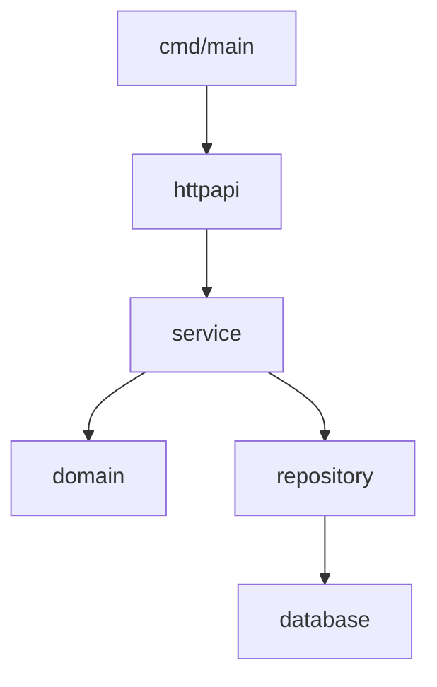
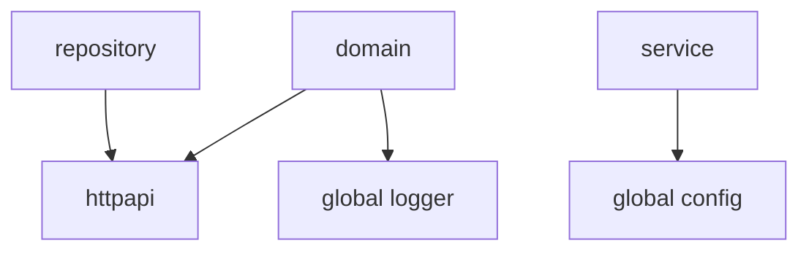
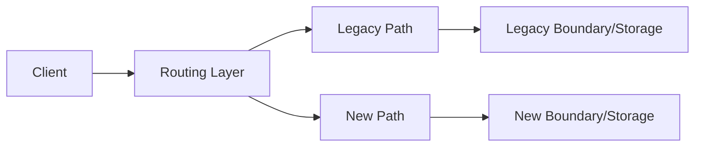
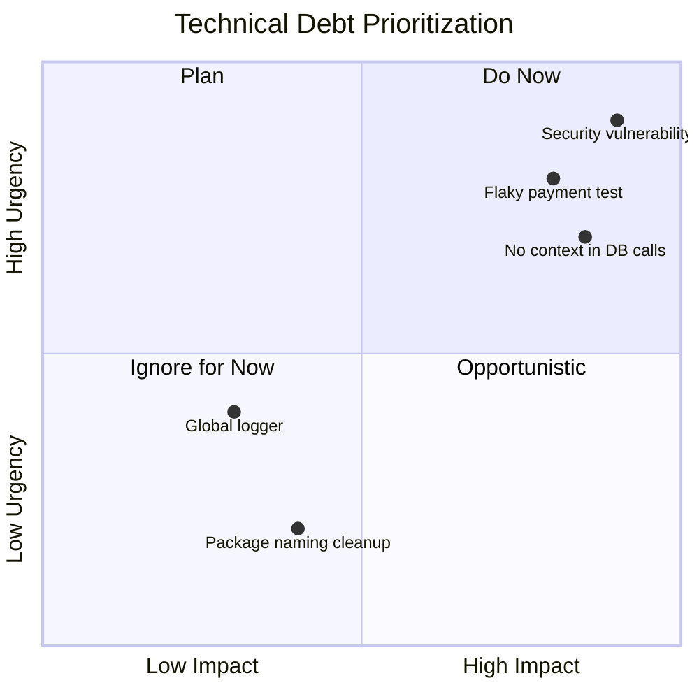

# Modernisasi dan Maintainability: Refactoring, Migration, dan Codebase Governance

> Target part ini: kamu mampu merawat codebase Go yang sudah hidup di production, memodernisasi tanpa big bang rewrite, mengurangi technical debt secara terukur, dan menjaga kualitas engineering lewat governance yang ringan tetapi tegas.

Software yang sukses biasanya menjadi legacy.

Bukan karena engineer buruk, tetapi karena sistem berubah:

- requirement bertambah;
- domain makin kompleks;
- dependency berubah;
- Go version naik;
- traffic naik;
- security requirement meningkat;
- organisasi berubah;
- ownership berpindah;
- bug lama membentuk workaround;
- integrasi eksternal berubah;
- observability yang dulu cukup sekarang kurang.

Maintainability bukan soal membuat kode terlihat cantik. Maintainability adalah kemampuan codebase untuk terus berubah tanpa biaya perubahan naik secara eksponensial.

---

## 1. Mental Model Utama

Modernisasi codebase Go harus incremental.

Rewrite besar sering menggoda karena code lama terasa buruk. Tetapi rewrite besar biasanya gagal karena:

- business behavior lama tidak terdokumentasi;
- edge case tersembunyi;
- integration contract tidak jelas;
- migration data sulit;
- tim harus maintain dua sistem;
- feature delivery berhenti;
- rollback rumit;
- stakeholder kehilangan sabar;
- bug lama muncul lagi dengan bentuk baru.

Prinsip yang lebih sehat:

> Refactor under tests, migrate behind boundaries, measure risk, and preserve behavior intentionally.

---

## 2. Framework Kaufman untuk Part Ini

Dalam kerangka Josh Kaufman, maintainability adalah skill lanjutan yang perlu dipecah.

Skill besar:

> “Mampu mengubah sistem Go yang sudah berjalan tanpa merusak production.”

Sub-skill:

| Sub-skill | Pertanyaan Korektif |
|---|---|
| Code reading | Apa behavior aktual sistem, bukan asumsi kita? |
| Characterization test | Bisakah behavior lama dikunci sebelum refactor? |
| Package refactor | Apakah dependency graph menjadi lebih sehat? |
| API migration | Apakah caller lama tetap berjalan? |
| Dependency update | Apakah update aman dan bisa rollback? |
| Data migration | Apakah schema/data berubah secara compatible? |
| Technical debt governance | Apakah debt diprioritaskan berdasarkan risiko? |
| Review discipline | Apakah PR kecil, terukur, dan bisa direview? |
| Deprecation | Apakah path lama punya sunset plan? |
| Operability | Apakah modernisasi meningkatkan debugging dan reliability? |

Deliberate practice:

> Ambil satu package buruk, tambahkan tests, pisahkan boundary, migrasikan caller satu per satu, ukur hasilnya, dan dokumentasikan keputusan.

---

## 3. Maintainability Bukan Aesthetic

Kode “bersih” yang salah lebih buruk daripada kode “jelek” yang benar.

Refactoring production harus menjaga behavior.

Urutan kerja:

1. pahami behavior;
2. tambahkan characterization tests;
3. identifikasi seams;
4. lakukan refactor kecil;
5. jalankan test;
6. deploy kecil;
7. monitor;
8. ulangi.

Jangan mulai dengan rename besar tanpa test.

---

## 4. Gejala Codebase Mulai Membusuk

Tanda-tanda maintainability menurun:

- package `utils`, `common`, `shared`, `models` membesar;
- handler berisi business logic;
- repository tahu HTTP concept;
- domain model penuh JSON/SQL/validation tag;
- cyclic dependency mulai muncul;
- test lambat dan flaky;
- config tersebar;
- global state banyak;
- context tidak dipropagasikan;
- error string dicocokkan manual;
- migration sering membuat outage;
- release butuh “orang tertentu”;
- dependency tidak pernah diupdate;
- observability tidak menjawab incident;
- bug fix kecil menyentuh banyak package;
- reviewer tidak yakin dampak perubahan.

Satu gejala belum tentu fatal. Kombinasi gejala menunjukkan governance lemah.

---

## 5. Codebase Assessment

Sebelum refactor, buat assessment.

### 5.1 Dependency Graph

Gunakan mental model:



Cari pelanggaran:



Pelanggaran dependency direction adalah refactoring candidate yang kuat.

### 5.2 Hotspot

Hotspot adalah file/package yang sering berubah dan sering bug.

Kriteria:

- churn tinggi;
- bug tinggi;
- kompleksitas tinggi;
- ownership kabur;
- test rendah;
- production incident terkait.

Prioritaskan hotspot, bukan file yang hanya “kurang cantik”.

---

## 6. Characterization Test

Characterization test mengunci behavior saat ini.

Tujuannya bukan membuktikan desain ideal. Tujuannya memastikan refactor tidak mengubah behavior tanpa sadar.

Contoh fungsi legacy:

```go
func CalculatePenalty(status string, daysLate int, previousViolations int) int {
	if status == "closed" {
		return 0
	}
	if daysLate <= 0 {
		return 0
	}
	base := daysLate * 100
	if previousViolations > 2 {
		base *= 2
	}
	if status == "under_review" {
		base = base / 2
	}
	return base
}
```

Test karakterisasi:

```go
func TestCalculatePenalty_CurrentBehavior(t *testing.T) {
	tests := []struct {
		name               string
		status             string
		daysLate           int
		previousViolations int
		want               int
	}{
		{
			name:   "closed case has no penalty",
			status: "closed",
			daysLate: 10,
			previousViolations: 5,
			want: 0,
		},
		{
			name:   "under review halves penalty after repeat multiplier",
			status: "under_review",
			daysLate: 10,
			previousViolations: 3,
			want: 1000,
		},
		{
			name:   "negative days has no penalty",
			status: "open",
			daysLate: -1,
			previousViolations: 10,
			want: 0,
		},
	}

	for _, tt := range tests {
		t.Run(tt.name, func(t *testing.T) {
			got := CalculatePenalty(tt.status, tt.daysLate, tt.previousViolations)
			if got != tt.want {
				t.Fatalf("got %d, want %d", got, tt.want)
			}
		})
	}
}
```

Setelah behavior terkunci, refactor lebih aman.

---

## 7. Refactoring Strategy: Mikroskopik, Bukan Heroik

Refactor aman biasanya kecil:

- extract function;
- rename lokal;
- move type;
- introduce adapter;
- split package;
- replace global with dependency;
- add interface at consumer boundary;
- add context;
- wrap error;
- add test;
- remove dead code;
- simplify conditional;
- isolate side effect.

Refactor berbahaya:

- pindah banyak package sekaligus;
- rewrite handler + service + repository dalam satu PR;
- mengubah schema dan behavior bersamaan;
- mengganti framework sambil refactor domain;
- mengubah public API tanpa compatibility;
- menghapus tests karena gagal;
- rename besar tanpa behavior change yang jelas.

Rule:

> Satu PR refactor harus bisa dijelaskan dengan satu tujuan struktural.

---

## 8. Strangler Fig Pattern

Untuk modernisasi besar, gunakan strangler fig.



Langkah:

1. Tambahkan boundary/routing.
2. Implement path baru untuk subset kecil.
3. Mirror traffic jika aman.
4. Compare output.
5. Gradual rollout.
6. Migrasikan caller/use case.
7. Decommission path lama.

Ini lebih aman daripada big bang.

---

## 9. Package Split

Package besar sering perlu dipecah.

Contoh buruk:

```txt
internal/service/
  case.go
  decision.go
  evidence.go
  audit.go
  notification.go
  repository.go
  errors.go
```

Refactor bertahap:

```txt
internal/caseflow/
internal/decision/
internal/evidence/
internal/audit/
internal/notification/
```

Jangan langsung pindahkan semua.

Langkah aman:

1. identifikasi cohesive subset;
2. tambah tests;
3. pindahkan type internal dulu;
4. update import;
5. pastikan tidak ada cycle;
6. pertahankan compatibility wrapper jika perlu;
7. hapus wrapper setelah caller pindah.

---

## 10. Compatibility Wrapper

Jika package lama dipakai banyak caller, buat wrapper sementara.

```go
// Deprecated: use internal/caseflow.Service instead.
type CaseService = caseflow.Service

// Deprecated: use caseflow.NewService.
func NewCaseService(repo caseflow.Repository) *caseflow.Service {
	return caseflow.NewService(repo)
}
```

Komentar `Deprecated:` berguna untuk tooling dan pembaca.

Deprecation harus punya rencana penghapusan.

---

## 11. Interface Cleanup

Legacy code sering punya interface besar.

Buruk:

```go
type Repository interface {
	CreateCase(ctx context.Context, c Case) error
	UpdateCase(ctx context.Context, c Case) error
	DeleteCase(ctx context.Context, id string) error
	GetCase(ctx context.Context, id string) (Case, error)
	ListCases(ctx context.Context) ([]Case, error)
	CreateEvidence(ctx context.Context, e Evidence) error
	GetEvidence(ctx context.Context, id string) (Evidence, error)
	CreateAudit(ctx context.Context, a Audit) error
}
```

Refactor:

```go
type CaseRepository interface {
	Save(ctx context.Context, c Case) error
	FindByID(ctx context.Context, id ID) (Case, error)
}

type EvidenceRepository interface {
	Save(ctx context.Context, e Evidence) error
	FindByCaseID(ctx context.Context, caseID ID) ([]Evidence, error)
}

type AuditWriter interface {
	Record(ctx context.Context, event AuditEvent) error
}
```

Interface kecil membuat test lebih sederhana dan dependency lebih jelas.

---

## 12. Menghapus Global State

Legacy:

```go
var DB *sql.DB
var Logger *slog.Logger
var Config AppConfig
```

Target:

```go
type Service struct {
	repo   Repository
	clock  Clock
	logger *slog.Logger
}
```

Migrasi bertahap:

1. buat constructor yang menerima dependency;
2. ubah call site baru;
3. biarkan wrapper lama sementara;
4. pindahkan global hanya ke composition root;
5. hapus global setelah caller selesai.

Contoh wrapper:

```go
// Deprecated: use NewService with explicit dependencies.
func NewDefaultService() *Service {
	return NewService(defaultRepo, defaultClock, defaultLogger)
}
```

Jangan biarkan deprecated wrapper hidup selamanya.

---

## 13. Context Migration

Legacy code sering tidak context-aware.

Buruk:

```go
func (r *Repository) Find(id string) (Case, error) {
	row := r.db.QueryRow("SELECT ... WHERE id=$1", id)
}
```

Migrasi:

```go
func (r *Repository) Find(ctx context.Context, id string) (Case, error) {
	row := r.db.QueryRowContext(ctx, "SELECT ... WHERE id=$1", id)
}
```

Masalah: banyak caller harus berubah.

Strategi:

1. mulai dari boundary paling luar: HTTP handler sudah punya `r.Context()`;
2. ubah service method;
3. ubah repository method;
4. ubah external client;
5. hapus method lama.

Wrapper sementara:

```go
// Deprecated: use Find(ctx, id).
func (r *Repository) FindLegacy(id string) (Case, error) {
	return r.Find(context.Background(), id)
}
```

Gunakan wrapper hanya sebagai transisi.

---

## 14. Error Migration

Legacy:

```go
if err.Error() == "not found" {
	// ...
}
```

Target:

```go
if errors.Is(err, ErrNotFound) {
	// ...
}
```

Langkah:

1. definisikan sentinel/domain error;
2. wrap dengan `%w`;
3. ubah caller memakai `errors.Is`;
4. hapus string matching;
5. test error boundary.

Contoh:

```go
var ErrCaseNotFound = errors.New("case not found")

func (r *Repository) Find(ctx context.Context, id ID) (Case, error) {
	var row caseRow
	err := r.db.QueryRowContext(ctx, query, id).Scan(&row.ID, &row.Status)
	if errors.Is(err, sql.ErrNoRows) {
		return Case{}, ErrCaseNotFound
	}
	if err != nil {
		return Case{}, fmt.Errorf("find case %s: %w", id, err)
	}
	return row.toDomain()
}
```

HTTP layer:

```go
switch {
case errors.Is(err, caseflow.ErrCaseNotFound):
	writeError(w, http.StatusNotFound, "case_not_found", "case not found")
default:
	writeError(w, http.StatusInternalServerError, "internal_error", "internal server error")
}
```

---

## 15. Dependency Update Governance

Dependency update bukan tugas kosmetik. Ia punya risiko:

- breaking behavior;
- security fix;
- performance regression;
- transitive dependency conflict;
- licensing issue;
- module path change;
- generated code mismatch.

Workflow:

1. cek changelog/release notes;
2. update minor/patch dulu;
3. jalankan test;
4. jalankan integration test;
5. jalankan `go mod tidy`;
6. jalankan vulnerability scan;
7. deploy canary jika dependency critical;
8. monitor.

Command:

```bash
go list -m -u all
go get example.com/dependency@v1.2.3
go mod tidy
go test ./...
```

Jangan update semua dependency besar dalam satu PR tanpa alasan.

---

## 16. Go Version Migration

Go version migration harus diperlakukan sebagai engineering change.

Checklist:

- baca release notes;
- update `go` directive di `go.mod`;
- update CI image;
- update Docker build image;
- update local tooling;
- jalankan test dengan race jika relevan;
- jalankan benchmark untuk hotspot;
- cek `go vet`;
- cek linter compatibility;
- cek generated code tools;
- cek dependency compatibility;
- rollout bertahap.

Contoh:

```go
module example.com/myservice

go 1.26
```

Jangan hanya update local Go lalu lupa CI/container.

---

## 17. API Compatibility

Public API Go package harus hati-hati.

Breaking change:

- rename exported type/function;
- hapus exported identifier;
- ubah signature;
- ubah semantic error;
- ubah field exported struct;
- ubah behavior tanpa dokumentasi;
- ubah module path;
- ubah major version tanpa semantic import versioning.

Untuk service internal, compatibility tetap penting pada HTTP/gRPC/event contract.

---

## 18. Deprecation Policy

Deprecation yang sehat:

- ada komentar `Deprecated:`;
- ada replacement jelas;
- ada deadline atau release target;
- ada owner;
- ada tracking issue;
- ada usage search;
- ada migration guide;
- ada removal PR terpisah.

Contoh:

```go
// Deprecated: use SubmitCase instead. This method will be removed after 2026-09-30.
func ApproveCase(ctx context.Context, id string) error {
	return SubmitCase(ctx, SubmitCommand{ID: id})
}
```

Tanpa removal plan, deprecated code menjadi fossil.

---

## 19. Code Generation Migration

Beberapa codebase Go memakai generated code:

- protobuf;
- OpenAPI;
- mocks;
- SQL query generator;
- GraphQL;
- stringer;
- enum generator.

Governance:

- generator version harus dipin;
- generated files jangan diedit manual;
- command generate terdokumentasi;
- CI memverifikasi generated output up to date;
- perubahan generated code direview secukupnya;
- contract source lebih penting dari output generated.

Tambahkan:

```go
//go:generate go run ./cmd/tools/generate
```

Atau Makefile:

```makefile
generate:
	go generate ./...
```

---

## 20. Test Modernization

Legacy test sering:

- flaky;
- lambat;
- bergantung urutan;
- pakai sleep;
- butuh external service;
- tidak deterministic;
- assertion lemah;
- test data global.

Perbaikan:

- gunakan `t.TempDir`;
- gunakan fake clock;
- gunakan context timeout;
- hindari real sleep;
- gunakan `httptest`;
- gunakan test database isolated;
- gunakan `t.Cleanup`;
- gunakan table tests;
- pisahkan unit/integration;
- test failure path.

Contoh menghindari sleep:

Buruk:

```go
time.Sleep(2 * time.Second)
if got := worker.Done(); !got {
	t.Fatal("not done")
}
```

Lebih baik:

```go
select {
case <-done:
case <-time.After(2 * time.Second):
	t.Fatal("timeout waiting for worker")
}
```

Lebih baik lagi: desain worker agar bisa dikontrol dengan fake clock atau channel.

---

## 21. Flaky Test Governance

Flaky test harus dianggap production risk.

Policy:

- flaky test tidak boleh diabaikan;
- quarantine hanya sementara;
- issue wajib dibuat;
- owner jelas;
- root cause dicari;
- timeout tidak dinaikkan tanpa alasan;
- test harus deterministic.

Kategori flaky:

| Penyebab | Solusi |
|---|---|
| Real time/sleep | fake clock/event synchronization |
| Shared state | isolate state, `t.TempDir` |
| Network external | fake server |
| Randomness | fixed seed |
| Order dependency | reset state |
| Race | `go test -race` |
| Resource contention | reduce parallelism or isolate |

---

## 22. Technical Debt Register

Technical debt harus dicatat dengan risiko, bukan rasa kesal.

Format:

```md
# Debt: Global database handle in case service

## Symptom

Repository and handler access package-level `db`.

## Risk

- Tests require real database.
- Shutdown lifecycle unclear.
- Hard to introduce transaction boundary.
- Hidden coupling across package.

## Impact

Medium-high. Affects case submission and audit write path.

## Proposed Migration

1. Introduce explicit repository constructor.
2. Pass db from composition root.
3. Migrate handlers.
4. Remove global.

## Owner

Case platform team.

## Target

2026-Q3.
```

Debt register membantu prioritisasi.

---

## 23. Prioritization Matrix



Prioritaskan debt yang:

- sering menyebabkan incident;
- menghambat delivery penting;
- membuat security risk;
- membuat compliance/audit risk;
- membuat migration besar sulit;
- membuat test tidak dipercaya.

---

## 24. Governance Ringan

Governance bukan birokrasi.

Governance berarti aturan ringan yang menjaga sistem tetap sehat.

Contoh:

- semua handler harus context-aware;
- no new global mutable state;
- no package named `utils`;
- no new exported type tanpa doc jika public package;
- error wrapping wajib untuk infrastructure error;
- domain package tidak boleh import HTTP/database;
- dependency baru harus punya alasan;
- migration harus expand-contract;
- new queue consumer harus idempotent;
- debug endpoint tidak boleh public;
- feature flag harus punya owner dan expiry.

Aturan kecil, ditegakkan konsisten, lebih baik daripada dokumen besar yang tidak dipakai.

---

## 25. Review Checklist untuk PR Modernisasi

### Scope

- Apakah PR terlalu besar?
- Apakah tujuan struktural jelas?
- Apakah behavior berubah atau hanya refactor?
- Jika behavior berubah, apakah disebut eksplisit?

### Safety

- Apakah ada characterization test?
- Apakah test failure path ada?
- Apakah rollback path jelas?
- Apakah migration backward compatible?

### Architecture

- Apakah dependency direction membaik?
- Apakah package boundary lebih jelas?
- Apakah interface lebih kecil?
- Apakah global state berkurang?

### Operation

- Apakah metrics/logs tetap cukup?
- Apakah config/deploy berubah?
- Apakah runbook perlu update?
- Apakah dashboard/alert terdampak?

### Cleanup

- Apakah deprecated path punya removal plan?
- Apakah dead code dihapus?
- Apakah docs diperbarui?
- Apakah generated code konsisten?

---

## 26. Migration Plan Template

```md
# Migration Plan: Move case submission to caseflow package

## Goal

Move case submission business logic from HTTP handler into `internal/caseflow`.

## Non-goals

- No database schema change.
- No API contract change.
- No new workflow behavior.

## Current State

`httpapi.SubmitCase` validates request, loads DB row, mutates status, writes audit.

## Target State

`caseflow.Service.Submit` owns transition and audit event creation.
HTTP handler maps request/response only.

## Steps

1. Add characterization tests for current submit behavior.
2. Create `internal/caseflow` package.
3. Move status transition into domain method.
4. Introduce repository interface in `caseflow`.
5. Implement adapter using existing DB queries.
6. Update handler to call service.
7. Add service tests with fake repo.
8. Deploy behind feature flag if needed.
9. Remove old helper functions.
10. Update docs and runbook.

## Rollback

Revert handler wiring to old path. No schema change.

## Risks

- Behavior mismatch on invalid transition.
- Audit event missing on specific error path.

## Validation

- Unit tests.
- Integration tests.
- Compare logs in staging.
- Canary 10% traffic.
```

---

## 27. Modernisasi dengan Feature Flag

Feature flag berguna untuk migrasi behavior.

```go
func (h *Handler) Submit(w http.ResponseWriter, r *http.Request) {
	if h.flags.Enabled(r.Context(), "caseflow.new-submit", attrsFrom(r)) {
		h.submitV2(w, r)
		return
	}
	h.submitV1(w, r)
}
```

Tetapi flag harus sementara.

Flag debt muncul jika:

- flag tidak punya owner;
- flag tidak punya expiry;
- kombinasi flag terlalu banyak;
- test matrix meledak;
- path lama dan baru divergen;
- observability tidak membedakan path.

Tambahkan metric:

```txt
feature_flag_path_total{flag="caseflow.new-submit",path="v2"}
```

---

## 28. Observability untuk Migration

Saat migrasi, tambahkan observability khusus.

Metric:

```txt
migration_path_requests_total{migration,path,status}
migration_behavior_mismatch_total{migration}
migration_latency_seconds{migration,path}
```

Log:

```go
logger.InfoContext(ctx, "migration path selected",
	"migration", "caseflow.new-submit",
	"path", "v2",
	"case_id", caseID,
)
```

Untuk shadow/mirror mode:

- jangan menghasilkan side effect ganda;
- bandingkan output;
- log mismatch;
- jangan expose hasil shadow ke user.

---

## 29. Shadow Execution

Shadow execution menjalankan path baru tanpa mempengaruhi user.

```go
resultV1, errV1 := h.old.Submit(ctx, cmd)

go func() {
	shadowCtx, cancel := context.WithTimeout(context.Background(), 2*time.Second)
	defer cancel()

	resultV2, errV2 := h.new.DryRunSubmit(shadowCtx, cmd)
	compareAndRecord(cmd.ID, resultV1, errV1, resultV2, errV2)
}()

return resultV1, errV1
```

Hati-hati:

- shadow path tidak boleh mutate state;
- jangan pakai context request jika sudah selesai;
- batasi concurrency;
- jangan leak data sensitif;
- jangan shadow semua traffic jika mahal.

---

## 30. Large Codebase Ownership

Untuk codebase besar, ownership harus eksplisit.

Gunakan `CODEOWNERS` atau mekanisme setara:

```txt
/internal/caseflow/      @case-platform-team
/internal/decision/      @decision-team
/internal/audit/         @audit-platform-team
/api/proto/              @platform-architecture
/migrations/             @database-reviewers
```

Ownership bukan gatekeeping. Ownership memastikan reviewer punya konteks domain dan operational impact.

---

## 31. Architecture Fitness Function

Fitness function adalah check otomatis atau semi-otomatis untuk menjaga architecture.

Contoh:

- no import from `internal/httpapi` inside `internal/caseflow`;
- no package named `utils`;
- all HTTP clients must use configured transport;
- no `context.Background()` inside request path;
- no direct SQL in handler;
- no public debug endpoint;
- no dependency with known vulnerability.

Sebagian bisa dicek dengan lint/custom script.

Contoh sederhana:

```bash
if grep -R 'context.Background()' internal/httpapi internal/*/service.go; then
  echo "context.Background used in request path"
  exit 1
fi
```

Tidak semua perlu otomatis. Tetapi rule penting sebaiknya tidak bergantung pada ingatan reviewer.

---

## 32. Documentation Governance

Dokumentasi minimal yang penting:

| Dokumen | Isi |
|---|---|
| README | cara run, test, build |
| ARCHITECTURE.md | package boundary, dependency direction |
| ADR | keputusan penting |
| RUNBOOK | operasi saat alert |
| MIGRATIONS.md | aturan schema migration |
| SECURITY.md | threat model dan secret handling |
| API docs | contract HTTP/gRPC/event |

Dokumentasi harus dekat dengan code dan diperbarui saat PR terkait.

---

## 33. Modernisasi Domain Regulatori

Untuk enforcement/case management, modernisasi perlu ekstra hati-hati.

Perhatikan:

- audit trail tidak boleh hilang;
- state transition harus defensible;
- historical decision harus tetap bisa dibaca;
- data retention policy;
- legal hold;
- permission model;
- manual override;
- reason code;
- evidence integrity;
- immutable events;
- external reporting;
- migration traceability.

Jangan “membersihkan” data historis hanya karena tidak cocok dengan model baru.

Model baru harus bisa menjelaskan data lama.

---

## 34. Latihan Praktik 4 Jam

Ambil service `caseflow` dari part sebelumnya.

Legacy state:

- handler mengubah status langsung;
- audit ditulis manual di handler;
- repository global;
- error string matching;
- tidak ada context di DB call;
- tidak ada service test.

Tugas modernisasi:

1. Tambahkan characterization tests untuk current behavior.
2. Buat package `internal/caseflow`.
3. Pindahkan transition rule ke domain method.
4. Buat `Service.Submit(ctx, cmd)`.
5. Buat repository interface kecil.
6. Buat audit writer interface kecil.
7. Ubah handler menjadi adapter.
8. Ganti string matching dengan `errors.Is`.
9. Hilangkan global repository.
10. Tambahkan migration plan di `docs/migration-caseflow.md`.
11. Tambahkan ADR singkat.
12. Tambahkan review checklist di PR description.

Success criteria:

- API response tidak berubah kecuali disengaja;
- test lama tetap lulus;
- test service baru ada;
- dependency direction membaik;
- handler lebih pendek;
- domain bebas HTTP/DB;
- rollback path jelas.

---

## 35. Rubric Penilaian

| Level | Indikator |
|---|---|
| Beginner | Bisa rename dan memindahkan file |
| Junior | Bisa refactor kecil dengan test tetap lulus |
| Intermediate | Bisa memisahkan handler/service/domain dengan characterization test |
| Senior | Bisa menjalankan migration incremental dengan compatibility dan observability |
| Staff-level | Bisa mengelola governance codebase, prioritas technical debt, migration plan, ownership, dan architecture fitness function |

---

## 36. Kesimpulan

Maintainability adalah kemampuan sistem untuk berubah dengan aman.

Prinsip utama:

- jangan rewrite besar jika refactor bertahap cukup;
- characterization test mengunci behavior sebelum perubahan;
- package split harus mengikuti dependency dan cohesion;
- interface harus mengecilkan coupling, bukan menambah ceremony;
- global state harus dipindahkan ke composition root;
- context dan error handling harus dimigrasikan secara sistematis;
- dependency update butuh governance;
- deprecation harus punya removal plan;
- technical debt harus diprioritaskan berdasarkan risiko;
- feature flag dan shadow mode membantu migrasi aman;
- architecture fitness function menjaga rule penting tetap hidup;
- dokumentasi, ADR, runbook, dan ownership adalah bagian dari engineering system.

Setelah part ini, kamu seharusnya mampu bukan hanya menulis service Go baru, tetapi juga memperbaiki service Go lama tanpa merusak production dan tanpa kehilangan kepercayaan tim.
