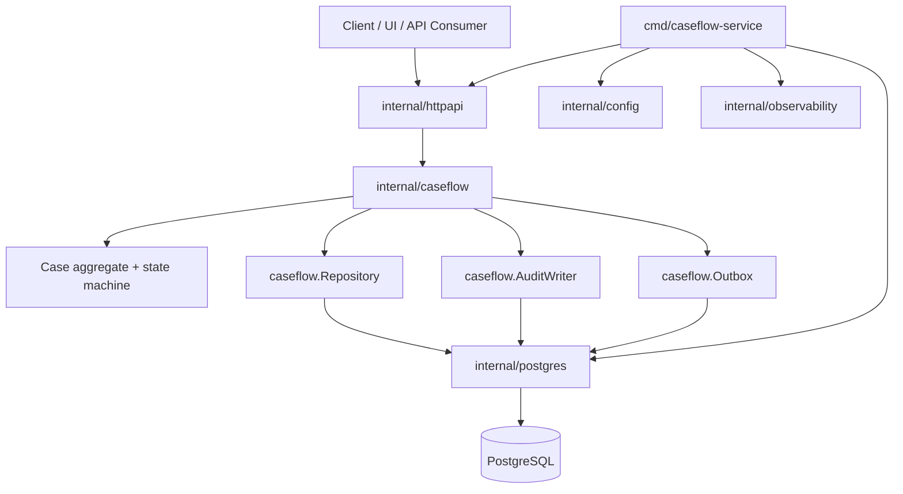
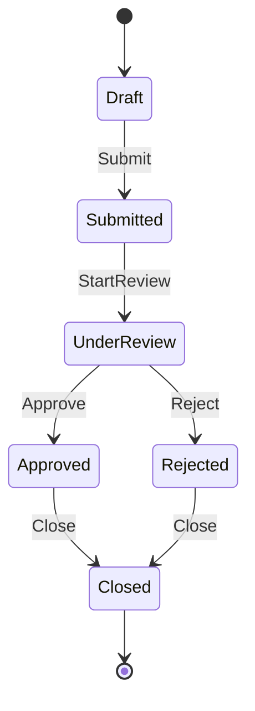
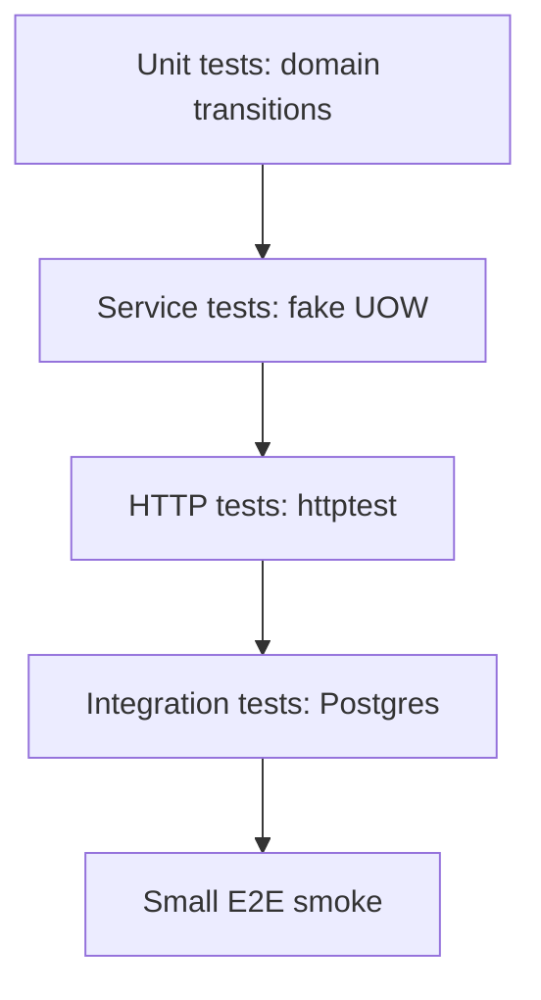

# Capstone I: Membangun Production-grade Go Service dari Nol

> Target part ini: kamu membangun satu service Go yang cukup realistis untuk dinilai sebagai production-grade: desain domain jelas, API stabil, persistence aman, test cukup, observability tersedia, security baseline masuk, container siap, dan operasi punya runbook.

Part ini adalah konsolidasi.

Kita akan membangun service bernama:

```txt
caseflow-service
```

Domain:

> Case management workflow untuk lifecycle enforcement/regulatory case.

Service ini tidak akan dibuat sebagai tutorial “hello world”. Kita akan mendesain seperti internal engineering handbook: requirement, invariant, state machine, API contract, package boundary, failure mode, testing strategy, dan production readiness.

---

## 1. Scope Capstone

Service harus mendukung:

1. Create case.
2. Submit case.
3. Assign reviewer.
4. Start review.
5. Approve case.
6. Reject case.
7. Close case.
8. Record audit event untuk transition penting.
9. Persist state di database.
10. Expose HTTP API.
11. Support idempotency untuk write operation penting.
12. Emit outbox event.
13. Provide health check.
14. Graceful shutdown.
15. Structured logging.
16. Metrics-ready boundary.
17. Config validation.
18. Container build.
19. CI pipeline.
20. Runbook.

Kita tidak akan membangun semua integrasi eksternal nyata. Tetapi boundary-nya harus siap.

---

## 2. Target Arsitektur



Dependency direction:

- `httpapi` depends on `caseflow`;
- `postgres` depends on `caseflow`;
- `caseflow` depends only on standard library and small interfaces it owns;
- `main` wires everything.

---

## 3. Repository Structure

```txt
caseflow-service/
  cmd/
    caseflow-service/
      main.go
  internal/
    caseflow/
      case.go
      status.go
      command.go
      service.go
      repository.go
      audit.go
      outbox.go
      errors.go
      clock.go
      service_test.go
      case_test.go
    httpapi/
      server.go
      case_handler.go
      request.go
      response.go
      error.go
      middleware.go
      health.go
      case_handler_test.go
    postgres/
      db.go
      case_repository.go
      audit_repository.go
      outbox_repository.go
      transaction.go
      migrations.go
    config/
      config.go
    observability/
      logger.go
      metrics.go
  migrations/
    001_init.sql
  docs/
    architecture.md
    runbook-high-5xx.md
    adr-001-modular-monolith.md
  Dockerfile
  Makefile
  go.mod
  go.sum
  README.md
```

Tidak semua file harus besar. Struktur ini menunjukkan boundary.

---

## 4. Domain State Machine

Status:

```txt
draft
submitted
under_review
approved
rejected
closed
```

Allowed transitions:



Invalid:

- draft tidak bisa langsung approved;
- submitted tidak bisa closed langsung;
- under_review tidak bisa submit lagi;
- approved tidak bisa rejected;
- closed tidak bisa berubah.

Rule:

> State transition adalah domain invariant, bukan HTTP handler logic.

---

## 5. Domain Model

`internal/caseflow/case.go`

```go
package caseflow

import (
	"errors"
	"time"
)

type ID string
type UserID string
type TenantID string

type Case struct {
	ID          ID
	TenantID    TenantID
	Subject     string
	Description string
	Status      Status
	ReviewerID  UserID
	CreatedBy   UserID
	CreatedAt   time.Time
	UpdatedAt   time.Time
	Version     int64
}

type NewCaseParams struct {
	ID          ID
	TenantID    TenantID
	Subject     string
	Description string
	CreatedBy   UserID
	Now         time.Time
}

func NewCase(p NewCaseParams) (Case, error) {
	if p.ID == "" {
		return Case{}, errors.New("case id is required")
	}
	if p.TenantID == "" {
		return Case{}, errors.New("tenant id is required")
	}
	if p.Subject == "" {
		return Case{}, errors.New("subject is required")
	}
	if p.CreatedBy == "" {
		return Case{}, errors.New("created by is required")
	}
	if p.Now.IsZero() {
		return Case{}, errors.New("now is required")
	}

	return Case{
		ID:          p.ID,
		TenantID:    p.TenantID,
		Subject:     p.Subject,
		Description: p.Description,
		Status:      StatusDraft,
		CreatedBy:   p.CreatedBy,
		CreatedAt:   p.Now,
		UpdatedAt:   p.Now,
		Version:     1,
	}, nil
}
```

`status.go`

```go
package caseflow

type Status string

const (
	StatusDraft       Status = "draft"
	StatusSubmitted   Status = "submitted"
	StatusUnderReview Status = "under_review"
	StatusApproved    Status = "approved"
	StatusRejected    Status = "rejected"
	StatusClosed      Status = "closed"
)

func (s Status) Valid() bool {
	switch s {
	case StatusDraft, StatusSubmitted, StatusUnderReview, StatusApproved, StatusRejected, StatusClosed:
		return true
	default:
		return false
	}
}
```

---

## 6. Domain Transitions

```go
func (c *Case) Submit(now time.Time) error {
	if c.Status != StatusDraft {
		return ErrInvalidTransition
	}
	c.Status = StatusSubmitted
	c.UpdatedAt = now
	c.Version++
	return nil
}

func (c *Case) AssignReviewer(reviewer UserID, now time.Time) error {
	if c.Status != StatusSubmitted && c.Status != StatusUnderReview {
		return ErrInvalidTransition
	}
	if reviewer == "" {
		return ErrReviewerRequired
	}
	c.ReviewerID = reviewer
	c.UpdatedAt = now
	c.Version++
	return nil
}

func (c *Case) StartReview(now time.Time) error {
	if c.Status != StatusSubmitted {
		return ErrInvalidTransition
	}
	if c.ReviewerID == "" {
		return ErrReviewerRequired
	}
	c.Status = StatusUnderReview
	c.UpdatedAt = now
	c.Version++
	return nil
}

func (c *Case) Approve(now time.Time) error {
	if c.Status != StatusUnderReview {
		return ErrInvalidTransition
	}
	c.Status = StatusApproved
	c.UpdatedAt = now
	c.Version++
	return nil
}

func (c *Case) Reject(now time.Time) error {
	if c.Status != StatusUnderReview {
		return ErrInvalidTransition
	}
	c.Status = StatusRejected
	c.UpdatedAt = now
	c.Version++
	return nil
}

func (c *Case) Close(now time.Time) error {
	if c.Status != StatusApproved && c.Status != StatusRejected {
		return ErrInvalidTransition
	}
	c.Status = StatusClosed
	c.UpdatedAt = now
	c.Version++
	return nil
}
```

`errors.go`

```go
package caseflow

import "errors"

var (
	ErrNotFound          = errors.New("case not found")
	ErrInvalidTransition = errors.New("invalid case transition")
	ErrReviewerRequired = errors.New("reviewer is required")
	ErrConflict         = errors.New("case version conflict")
	ErrUnauthorized     = errors.New("unauthorized")
)
```

---

## 7. Restore dari Database

Constructor `NewCase` untuk create baru. Untuk rehydrate dari DB, gunakan `RestoreCase`.

```go
type RestoreCaseParams struct {
	ID          ID
	TenantID    TenantID
	Subject     string
	Description string
	Status      Status
	ReviewerID  UserID
	CreatedBy   UserID
	CreatedAt   time.Time
	UpdatedAt   time.Time
	Version     int64
}

func RestoreCase(p RestoreCaseParams) (Case, error) {
	if p.ID == "" {
		return Case{}, errors.New("case id is required")
	}
	if p.TenantID == "" {
		return Case{}, errors.New("tenant id is required")
	}
	if !p.Status.Valid() {
		return Case{}, errors.New("invalid case status")
	}
	if p.Version <= 0 {
		return Case{}, errors.New("version must be positive")
	}

	return Case{
		ID:          p.ID,
		TenantID:    p.TenantID,
		Subject:     p.Subject,
		Description: p.Description,
		Status:      p.Status,
		ReviewerID:  p.ReviewerID,
		CreatedBy:   p.CreatedBy,
		CreatedAt:   p.CreatedAt,
		UpdatedAt:   p.UpdatedAt,
		Version:     p.Version,
	}, nil
}
```

Restore tetap menjaga invariant minimal.

---

## 8. Commands

`command.go`

```go
package caseflow

type CreateCommand struct {
	TenantID    TenantID
	Subject     string
	Description string
	ActorID     UserID
	IdempotencyKey string
}

type SubmitCommand struct {
	TenantID TenantID
	CaseID   ID
	ActorID  UserID
	IdempotencyKey string
}

type AssignReviewerCommand struct {
	TenantID   TenantID
	CaseID     ID
	ReviewerID UserID
	ActorID    UserID
}

type StartReviewCommand struct {
	TenantID TenantID
	CaseID   ID
	ActorID  UserID
}

type ApproveCommand struct {
	TenantID TenantID
	CaseID   ID
	ActorID  UserID
}

type RejectCommand struct {
	TenantID TenantID
	CaseID   ID
	ActorID  UserID
	Reason   string
}

type CloseCommand struct {
	TenantID TenantID
	CaseID   ID
	ActorID  UserID
}
```

Command adalah input application service. Ia bukan HTTP request DTO.

---

## 9. Repository Interfaces

`repository.go`

```go
package caseflow

import "context"

type Repository interface {
	NextID(ctx context.Context) (ID, error)
	Save(ctx context.Context, c Case) error
	FindByID(ctx context.Context, tenantID TenantID, id ID) (Case, error)
}
```

Audit:

```go
type AuditWriter interface {
	Record(ctx context.Context, event AuditEvent) error
}
```

Outbox:

```go
type Outbox interface {
	Save(ctx context.Context, event OutboxEvent) error
}
```

Unit of work untuk transaction:

```go
type UnitOfWork interface {
	Do(ctx context.Context, fn func(ctx context.Context, tx Tx) error) error
}

type Tx interface {
	Cases() Repository
	Audit() AuditWriter
	Outbox() Outbox
}
```

---

## 10. Audit Event

`audit.go`

```go
package caseflow

import "time"

type AuditEvent struct {
	ID        string
	TenantID  TenantID
	CaseID    ID
	ActorID   UserID
	Action    string
	From      Status
	To        Status
	Reason    string
	CreatedAt time.Time
}

const (
	ActionCreated        = "case.created"
	ActionSubmitted      = "case.submitted"
	ActionReviewerAssigned = "case.reviewer_assigned"
	ActionReviewStarted  = "case.review_started"
	ActionApproved       = "case.approved"
	ActionRejected       = "case.rejected"
	ActionClosed         = "case.closed"
)
```

Audit adalah domain/operational requirement, bukan log.

Log bisa hilang/dirotate. Audit harus persisted dengan semantic jelas.

---

## 11. Outbox Event

`outbox.go`

```go
package caseflow

import "time"

type OutboxEvent struct {
	ID          string
	TenantID    TenantID
	AggregateID ID
	EventType   string
	Payload     []byte
	OccurredAt  time.Time
}

const (
	EventCaseCreated   = "case.created"
	EventCaseSubmitted = "case.submitted"
	EventCaseApproved  = "case.approved"
	EventCaseRejected  = "case.rejected"
	EventCaseClosed    = "case.closed"
)
```

Outbox membuat state change dan event record disimpan dalam transaksi yang sama.

---

## 12. Clock

`clock.go`

```go
package caseflow

import "time"

type Clock interface {
	Now() time.Time
}

type RealClock struct{}

func (RealClock) Now() time.Time {
	return time.Now().UTC()
}
```

Clock interface membuat test deterministic.

---

## 13. Service

`service.go`

```go
package caseflow

import (
	"context"
	"encoding/json"
)

type Service struct {
	uow   UnitOfWork
	clock Clock
	ids   IDGenerator
}

type IDGenerator interface {
	NewID() string
}

func NewService(uow UnitOfWork, clock Clock, ids IDGenerator) *Service {
	return &Service{
		uow:   uow,
		clock: clock,
		ids:   ids,
	}
}
```

Create:

```go
func (s *Service) Create(ctx context.Context, cmd CreateCommand) (Case, error) {
	var created Case

	err := s.uow.Do(ctx, func(ctx context.Context, tx Tx) error {
		now := s.clock.Now()

		id, err := tx.Cases().NextID(ctx)
		if err != nil {
			return err
		}

		c, err := NewCase(NewCaseParams{
			ID:          id,
			TenantID:    cmd.TenantID,
			Subject:     cmd.Subject,
			Description: cmd.Description,
			CreatedBy:   cmd.ActorID,
			Now:         now,
		})
		if err != nil {
			return err
		}

		if err := tx.Cases().Save(ctx, c); err != nil {
			return err
		}

		audit := AuditEvent{
			ID:        s.ids.NewID(),
			TenantID:  cmd.TenantID,
			CaseID:    c.ID,
			ActorID:   cmd.ActorID,
			Action:    ActionCreated,
			To:        c.Status,
			CreatedAt: now,
		}
		if err := tx.Audit().Record(ctx, audit); err != nil {
			return err
		}

		event, err := s.outboxEvent(EventCaseCreated, c, now)
		if err != nil {
			return err
		}
		if err := tx.Outbox().Save(ctx, event); err != nil {
			return err
		}

		created = c
		return nil
	})

	return created, err
}
```

Helper outbox:

```go
func (s *Service) outboxEvent(eventType string, c Case, now time.Time) (OutboxEvent, error) {
	payload, err := json.Marshal(map[string]any{
		"case_id": c.ID,
		"tenant_id": c.TenantID,
		"status": c.Status,
		"version": c.Version,
	})
	if err != nil {
		return OutboxEvent{}, err
	}

	return OutboxEvent{
		ID:          s.ids.NewID(),
		TenantID:    c.TenantID,
		AggregateID: c.ID,
		EventType:   eventType,
		Payload:     payload,
		OccurredAt:  now,
	}, nil
}
```

---

## 14. Submit Use Case

```go
func (s *Service) Submit(ctx context.Context, cmd SubmitCommand) (Case, error) {
	var updated Case

	err := s.uow.Do(ctx, func(ctx context.Context, tx Tx) error {
		c, err := tx.Cases().FindByID(ctx, cmd.TenantID, cmd.CaseID)
		if err != nil {
			return err
		}

		from := c.Status
		now := s.clock.Now()

		if err := c.Submit(now); err != nil {
			return err
		}

		if err := tx.Cases().Save(ctx, c); err != nil {
			return err
		}

		if err := tx.Audit().Record(ctx, AuditEvent{
			ID:        s.ids.NewID(),
			TenantID:  cmd.TenantID,
			CaseID:    c.ID,
			ActorID:   cmd.ActorID,
			Action:    ActionSubmitted,
			From:      from,
			To:        c.Status,
			CreatedAt: now,
		}); err != nil {
			return err
		}

		event, err := s.outboxEvent(EventCaseSubmitted, c, now)
		if err != nil {
			return err
		}
		if err := tx.Outbox().Save(ctx, event); err != nil {
			return err
		}

		updated = c
		return nil
	})

	return updated, err
}
```

Pattern yang sama berlaku untuk approve/reject/close.

---

## 15. Database Schema

`migrations/001_init.sql`

```sql
CREATE TABLE cases (
    id           TEXT NOT NULL,
    tenant_id    TEXT NOT NULL,
    subject      TEXT NOT NULL,
    description  TEXT NOT NULL,
    status       TEXT NOT NULL,
    reviewer_id  TEXT NOT NULL DEFAULT '',
    created_by   TEXT NOT NULL,
    created_at   TIMESTAMPTZ NOT NULL,
    updated_at   TIMESTAMPTZ NOT NULL,
    version      BIGINT NOT NULL,
    PRIMARY KEY (tenant_id, id)
);

CREATE TABLE audit_events (
    id          TEXT PRIMARY KEY,
    tenant_id   TEXT NOT NULL,
    case_id     TEXT NOT NULL,
    actor_id    TEXT NOT NULL,
    action      TEXT NOT NULL,
    from_status TEXT NOT NULL,
    to_status   TEXT NOT NULL,
    reason      TEXT NOT NULL,
    created_at  TIMESTAMPTZ NOT NULL
);

CREATE TABLE outbox_events (
    id             TEXT PRIMARY KEY,
    tenant_id       TEXT NOT NULL,
    aggregate_id    TEXT NOT NULL,
    event_type      TEXT NOT NULL,
    payload         JSONB NOT NULL,
    occurred_at     TIMESTAMPTZ NOT NULL,
    available_at    TIMESTAMPTZ NOT NULL DEFAULT now(),
    published_at    TIMESTAMPTZ NULL,
    attempts        INTEGER NOT NULL DEFAULT 0,
    last_error      TEXT NULL
);

CREATE INDEX idx_outbox_pending
ON outbox_events (available_at)
WHERE published_at IS NULL;
```

Production migration perlu tool migration. Untuk capstone, schema cukup sebagai baseline.

---

## 16. Postgres Repository

`postgres/case_repository.go`

```go
package postgres

import (
	"context"
	"database/sql"
	"errors"
	"fmt"

	"example.com/caseflow-service/internal/caseflow"
)

type CaseRepository struct {
	q queryer
}

type queryer interface {
	QueryRowContext(ctx context.Context, query string, args ...any) *sql.Row
	ExecContext(ctx context.Context, query string, args ...any) (sql.Result, error)
}

func NewCaseRepository(q queryer) *CaseRepository {
	return &CaseRepository{q: q}
}
```

Find:

```go
func (r *CaseRepository) FindByID(ctx context.Context, tenantID caseflow.TenantID, id caseflow.ID) (caseflow.Case, error) {
	const query = `
		SELECT id, tenant_id, subject, description, status, reviewer_id,
		       created_by, created_at, updated_at, version
		FROM cases
		WHERE tenant_id = $1 AND id = $2
	`

	var row caseRow
	err := r.q.QueryRowContext(ctx, query, string(tenantID), string(id)).Scan(
		&row.ID,
		&row.TenantID,
		&row.Subject,
		&row.Description,
		&row.Status,
		&row.ReviewerID,
		&row.CreatedBy,
		&row.CreatedAt,
		&row.UpdatedAt,
		&row.Version,
	)
	if errors.Is(err, sql.ErrNoRows) {
		return caseflow.Case{}, caseflow.ErrNotFound
	}
	if err != nil {
		return caseflow.Case{}, fmt.Errorf("find case %s/%s: %w", tenantID, id, err)
	}

	return row.toDomain()
}
```

Save dengan optimistic concurrency bisa memakai version.

```go
func (r *CaseRepository) Save(ctx context.Context, c caseflow.Case) error {
	const query = `
		INSERT INTO cases (
			id, tenant_id, subject, description, status, reviewer_id,
			created_by, created_at, updated_at, version
		)
		VALUES ($1,$2,$3,$4,$5,$6,$7,$8,$9,$10)
		ON CONFLICT (tenant_id, id)
		DO UPDATE SET
			subject = EXCLUDED.subject,
			description = EXCLUDED.description,
			status = EXCLUDED.status,
			reviewer_id = EXCLUDED.reviewer_id,
			updated_at = EXCLUDED.updated_at,
			version = EXCLUDED.version
	`

	_, err := r.q.ExecContext(ctx, query,
		string(c.ID),
		string(c.TenantID),
		c.Subject,
		c.Description,
		string(c.Status),
		string(c.ReviewerID),
		string(c.CreatedBy),
		c.CreatedAt,
		c.UpdatedAt,
		c.Version,
	)
	if err != nil {
		return fmt.Errorf("save case %s/%s: %w", c.TenantID, c.ID, err)
	}
	return nil
}
```

Untuk production penuh, gunakan optimistic concurrency check yang memastikan version lama sesuai. Capstone review di Part 35 akan mengkritisi ini.

---

## 17. Unit of Work

`postgres/transaction.go`

```go
type UnitOfWork struct {
	db *sql.DB
}

func NewUnitOfWork(db *sql.DB) *UnitOfWork {
	return &UnitOfWork{db: db}
}

func (u *UnitOfWork) Do(ctx context.Context, fn func(context.Context, caseflow.Tx) error) error {
	tx, err := u.db.BeginTx(ctx, nil)
	if err != nil {
		return err
	}
	defer tx.Rollback()

	repos := &txRepos{
		cases:  NewCaseRepository(tx),
		audit:  NewAuditRepository(tx),
		outbox: NewOutboxRepository(tx),
	}

	if err := fn(ctx, repos); err != nil {
		return err
	}

	return tx.Commit()
}

type txRepos struct {
	cases  *CaseRepository
	audit  *AuditRepository
	outbox *OutboxRepository
}

func (r *txRepos) Cases() caseflow.Repository {
	return r.cases
}

func (r *txRepos) Audit() caseflow.AuditWriter {
	return r.audit
}

func (r *txRepos) Outbox() caseflow.Outbox {
	return r.outbox
}
```

`defer tx.Rollback()` aman setelah commit; rollback akan gagal tetapi bisa diabaikan.

---

## 18. HTTP API Contract

Endpoints:

| Method | Path | Behavior |
|---|---|---|
| `POST` | `/cases` | create case |
| `GET` | `/cases/{id}` | get case |
| `POST` | `/cases/{id}/submit` | submit draft case |
| `POST` | `/cases/{id}/reviewer` | assign reviewer |
| `POST` | `/cases/{id}/start-review` | start review |
| `POST` | `/cases/{id}/approve` | approve under-review case |
| `POST` | `/cases/{id}/reject` | reject under-review case |
| `POST` | `/cases/{id}/close` | close approved/rejected case |

Error response:

```json
{
  "code": "invalid_transition",
  "message": "case transition is not allowed",
  "request_id": "req-123"
}
```

Success response:

```json
{
  "id": "case-123",
  "tenant_id": "tenant-1",
  "subject": "Late reporting",
  "description": "Entity failed to submit required report",
  "status": "submitted",
  "reviewer_id": "",
  "created_by": "user-1",
  "created_at": "2026-06-27T10:00:00Z",
  "updated_at": "2026-06-27T10:05:00Z",
  "version": 2
}
```

---

## 19. HTTP Handler

`httpapi/case_handler.go`

```go
type CaseService interface {
	Create(ctx context.Context, cmd caseflow.CreateCommand) (caseflow.Case, error)
	Submit(ctx context.Context, cmd caseflow.SubmitCommand) (caseflow.Case, error)
}

type CaseHandler struct {
	service CaseService
	logger  *slog.Logger
}

func NewCaseHandler(service CaseService, logger *slog.Logger) *CaseHandler {
	return &CaseHandler{
		service: service,
		logger:  logger,
	}
}
```

Create:

```go
func (h *CaseHandler) Create(w http.ResponseWriter, r *http.Request) {
	var req createCaseRequest
	if err := decodeJSON(w, r, &req); err != nil {
		writeError(w, r, http.StatusBadRequest, "invalid_request", err.Error())
		return
	}

	cmd, err := req.toCommand(authFrom(r.Context()))
	if err != nil {
		writeError(w, r, http.StatusBadRequest, "validation_failed", err.Error())
		return
	}

	created, err := h.service.Create(r.Context(), cmd)
	if err != nil {
		h.writeServiceError(w, r, err)
		return
	}

	writeJSON(w, http.StatusCreated, caseResponseFromDomain(created))
}
```

Submit:

```go
func (h *CaseHandler) Submit(w http.ResponseWriter, r *http.Request) {
	id := pathValue(r, "id")
	if id == "" {
		writeError(w, r, http.StatusBadRequest, "missing_case_id", "case id is required")
		return
	}

	auth := authFrom(r.Context())

	cmd := caseflow.SubmitCommand{
		TenantID: auth.TenantID,
		CaseID:   caseflow.ID(id),
		ActorID:  auth.UserID,
		IdempotencyKey: r.Header.Get("Idempotency-Key"),
	}

	updated, err := h.service.Submit(r.Context(), cmd)
	if err != nil {
		h.writeServiceError(w, r, err)
		return
	}

	writeJSON(w, http.StatusOK, caseResponseFromDomain(updated))
}
```

---

## 20. Error Translation

```go
func (h *CaseHandler) writeServiceError(w http.ResponseWriter, r *http.Request, err error) {
	switch {
	case errors.Is(err, caseflow.ErrNotFound):
		writeError(w, r, http.StatusNotFound, "case_not_found", "case not found")
	case errors.Is(err, caseflow.ErrInvalidTransition):
		writeError(w, r, http.StatusConflict, "invalid_transition", "case transition is not allowed")
	case errors.Is(err, caseflow.ErrReviewerRequired):
		writeError(w, r, http.StatusBadRequest, "reviewer_required", "reviewer is required")
	case errors.Is(err, caseflow.ErrUnauthorized):
		writeError(w, r, http.StatusForbidden, "forbidden", "not allowed")
	default:
		h.logger.ErrorContext(r.Context(), "request failed", "error", err)
		writeError(w, r, http.StatusInternalServerError, "internal_error", "internal server error")
	}
}
```

Internal error tidak bocor ke client.

---

## 21. Strict JSON Decode

```go
func decodeJSON(w http.ResponseWriter, r *http.Request, dst any) error {
	r.Body = http.MaxBytesReader(w, r.Body, 1<<20)

	dec := json.NewDecoder(r.Body)
	dec.DisallowUnknownFields()

	if err := dec.Decode(dst); err != nil {
		return err
	}

	if dec.Decode(&struct{}{}) != io.EOF {
		return errors.New("request body must contain a single JSON object")
	}

	return nil
}
```

Boundary harus defensif.

---

## 22. Middleware

Minimal middleware:

- request ID;
- logging;
- panic recovery;
- timeout;
- auth placeholder;
- metrics placeholder.

```go
func RequestID(next http.Handler) http.Handler {
	return http.HandlerFunc(func(w http.ResponseWriter, r *http.Request) {
		id := r.Header.Get("X-Request-ID")
		if id == "" {
			id = newRequestID()
		}
		ctx := context.WithValue(r.Context(), requestIDKey{}, id)
		w.Header().Set("X-Request-ID", id)
		next.ServeHTTP(w, r.WithContext(ctx))
	})
}
```

Timeout:

```go
func Timeout(d time.Duration, next http.Handler) http.Handler {
	return http.TimeoutHandler(next, d, `{"code":"timeout","message":"request timed out"}`)
}
```

Untuk production serius, custom timeout middleware sering lebih fleksibel daripada `http.TimeoutHandler`.

---

## 23. Testing Strategy

Test pyramid:



Target:

- domain transition lengkap;
- service transaction behavior;
- audit/outbox creation;
- HTTP status/error mapping;
- JSON validation;
- repository SQL mapping;
- health/shutdown behavior;
- idempotency path jika diimplementasi penuh.

---

## 24. Domain Test

```go
func TestCase_Submit(t *testing.T) {
	now := time.Date(2026, 6, 27, 10, 0, 0, 0, time.UTC)

	c, err := caseflow.NewCase(caseflow.NewCaseParams{
		ID: "case-1",
		TenantID: "tenant-1",
		Subject: "Late reporting",
		CreatedBy: "user-1",
		Now: now,
	})
	if err != nil {
		t.Fatal(err)
	}

	err = c.Submit(now.Add(time.Minute))
	if err != nil {
		t.Fatal(err)
	}

	if c.Status != caseflow.StatusSubmitted {
		t.Fatalf("status = %s, want %s", c.Status, caseflow.StatusSubmitted)
	}
	if c.Version != 2 {
		t.Fatalf("version = %d, want 2", c.Version)
	}
}
```

Invalid transition:

```go
func TestCase_ApproveFromDraftFails(t *testing.T) {
	c := newTestCase(t)

	err := c.Approve(time.Now())
	if !errors.Is(err, caseflow.ErrInvalidTransition) {
		t.Fatalf("err = %v, want ErrInvalidTransition", err)
	}
}
```

---

## 25. Service Test dengan Fake UOW

Fake harus cukup untuk test behavior, bukan meniru database penuh.

```go
type fakeUOW struct {
	tx *fakeTx
}

func (u *fakeUOW) Do(ctx context.Context, fn func(context.Context, caseflow.Tx) error) error {
	return fn(ctx, u.tx)
}

type fakeTx struct {
	cases  *fakeCases
	audit  *fakeAudit
	outbox *fakeOutbox
}

func (t *fakeTx) Cases() caseflow.Repository { return t.cases }
func (t *fakeTx) Audit() caseflow.AuditWriter { return t.audit }
func (t *fakeTx) Outbox() caseflow.Outbox { return t.outbox }
```

Test submit menghasilkan audit dan outbox:

```go
func TestService_Submit_WritesAuditAndOutbox(t *testing.T) {
	now := time.Date(2026, 6, 27, 10, 0, 0, 0, time.UTC)
	c := newDraftCase(t, now)

	tx := &fakeTx{
		cases: &fakeCases{items: map[caseflow.ID]caseflow.Case{c.ID: c}},
		audit: &fakeAudit{},
		outbox: &fakeOutbox{},
	}

	svc := caseflow.NewService(&fakeUOW{tx: tx}, fixedClock{now: now.Add(time.Minute)}, fixedIDs{})

	updated, err := svc.Submit(context.Background(), caseflow.SubmitCommand{
		TenantID: c.TenantID,
		CaseID: c.ID,
		ActorID: "user-1",
	})
	if err != nil {
		t.Fatal(err)
	}

	if updated.Status != caseflow.StatusSubmitted {
		t.Fatalf("status = %s", updated.Status)
	}
	if len(tx.audit.events) != 1 {
		t.Fatalf("audit count = %d, want 1", len(tx.audit.events))
	}
	if len(tx.outbox.events) != 1 {
		t.Fatalf("outbox count = %d, want 1", len(tx.outbox.events))
	}
}
```

---

## 26. HTTP Test

```go
func TestCreateCase_InvalidJSON(t *testing.T) {
	handler := httpapi.NewCaseHandler(fakeService{}, slog.Default())

	req := httptest.NewRequest(http.MethodPost, "/cases", strings.NewReader(`{"subject":`))
	rec := httptest.NewRecorder()

	handler.Create(rec, req)

	if rec.Code != http.StatusBadRequest {
		t.Fatalf("status = %d, want %d", rec.Code, http.StatusBadRequest)
	}
}
```

Test error translation:

```go
func TestSubmit_InvalidTransition(t *testing.T) {
	svc := fakeService{
		submitErr: caseflow.ErrInvalidTransition,
	}
	handler := httpapi.NewCaseHandler(svc, slog.Default())

	req := httptest.NewRequest(http.MethodPost, "/cases/case-1/submit", nil)
	rec := httptest.NewRecorder()

	handler.Submit(rec, req)

	if rec.Code != http.StatusConflict {
		t.Fatalf("status = %d, want %d", rec.Code, http.StatusConflict)
	}
}
```

---

## 27. Observability

Structured logs:

```go
logger.InfoContext(ctx, "case submitted",
	"tenant_id", cmd.TenantID,
	"case_id", cmd.CaseID,
	"actor_id", cmd.ActorID,
)
```

Metrics to expose:

```txt
http_requests_total{route,method,status}
http_request_duration_seconds_bucket{route,method}
case_transitions_total{from,to,result}
audit_events_total{action,result}
outbox_events_total{event_type,result}
outbox_pending_total
db_queries_total{operation,result}
```

Trace spans:

- HTTP request span;
- service use case span;
- DB query span;
- outbox write span.

Even if capstone does not implement full OpenTelemetry, boundary must be ready.

---

## 28. Security Baseline

Minimum:

- strict JSON decode;
- request body size limit;
- tenant ID from auth context, not body;
- authorization placeholder at handler/service boundary;
- no internal error leak;
- no secrets in logs;
- config redaction;
- admin endpoint internal-only;
- SQL parameter binding;
- context timeout;
- idempotency for important writes;
- audit event persisted.

Tenant isolation rule:

> Every repository query for case must include `tenant_id`.

This is not optional in multi-tenant systems.

---

## 29. Health and Shutdown

Health:

```go
GET /healthz/live
GET /healthz/ready
```

Readiness false:

- before DB connected;
- before server fully started;
- during draining;
- if critical dependency fails.

Graceful shutdown:

1. signal received;
2. readiness false;
3. drain delay;
4. shutdown HTTP;
5. stop workers;
6. close DB;
7. flush telemetry.

---

## 30. Makefile

```makefile
APP=caseflow-service

.PHONY: fmt test vet build run

fmt:
	gofmt -w ./cmd ./internal

vet:
	go vet ./...

test:
	go test ./...

test-race:
	go test -race ./...

build:
	go build -trimpath -o bin/$(APP) ./cmd/$(APP)

run:
	go run ./cmd/$(APP)
```

---

## 31. Dockerfile

```dockerfile
FROM golang:1.26 AS build

WORKDIR /src

COPY go.mod go.sum ./
RUN go mod download

COPY . .

RUN CGO_ENABLED=0 GOOS=linux go build \
    -trimpath \
    -ldflags="-s -w" \
    -o /out/caseflow-service \
    ./cmd/caseflow-service

FROM gcr.io/distroless/static-debian12:nonroot

COPY --from=build /out/caseflow-service /caseflow-service

USER nonroot:nonroot

ENTRYPOINT ["/caseflow-service"]
```

Untuk production nyata, pertimbangkan SBOM, image scanning, dan provenance.

---

## 32. CI Pipeline

Minimal GitHub Actions:

```yaml
name: ci

on:
  pull_request:
  push:
    branches: [main]

jobs:
  test:
    runs-on: ubuntu-latest
    steps:
      - uses: actions/checkout@v4
      - uses: actions/setup-go@v5
        with:
          go-version: '1.26'
      - run: go mod download
      - run: gofmt -w ./cmd ./internal && git diff --exit-code
      - run: go vet ./...
      - run: go test ./...
      - run: go test -race ./...
      - run: go build -trimpath ./cmd/caseflow-service
```

Untuk repo besar, race test bisa dipisah karena lebih lambat.

---

## 33. Architecture Decision Record

`docs/adr-001-modular-monolith.md`

```md
# ADR-001: Build caseflow-service as modular monolith

## Status

Accepted

## Context

Case workflow, audit, and outbox behavior need strong consistency.
The domain is still evolving and team ownership is currently shared.

## Decision

Implement as one Go service with internal package boundaries:
- `caseflow` owns domain/application behavior
- `httpapi` owns transport
- `postgres` owns persistence
- `main` owns wiring

## Consequences

Positive:
- Easier transaction boundary
- Simpler deployment
- Faster refactoring
- Clear package boundary

Negative:
- Requires discipline to avoid coupling
- Future service extraction needs migration plan
```

---

## 34. Runbook

`docs/runbook-high-5xx.md`

```md
# Runbook: High 5xx Rate in caseflow-service

## Symptom

HTTP 5xx rate exceeds threshold for 5 minutes.

## Impact

Users may fail to create, submit, or review cases.

## First Checks

1. Check recent deployment.
2. Check error rate by route.
3. Check database query errors.
4. Check DB connection pool saturation.
5. Check outbox pending age.
6. Check logs by request ID.
7. Check p95/p99 latency.

## Mitigation

1. Rollback if correlated with deployment.
2. Disable risky feature flag if relevant.
3. Scale service if CPU/memory saturated.
4. Reduce worker count if DB overloaded.
5. Put write endpoints in degraded mode if necessary.

## Escalation

Contact caseflow owner and database owner.

## Post-incident

Record timeline, root cause, user impact, and prevention tasks.
```

---

## 35. Capstone Implementation Plan

Urutan implementasi:

1. Create repo and module.
2. Add Makefile.
3. Implement domain status and transitions.
4. Add domain tests.
5. Implement service interfaces.
6. Implement fake UOW tests.
7. Implement HTTP DTO and handlers.
8. Add HTTP tests.
9. Add Postgres schema.
10. Implement repository mapping.
11. Add integration test if environment available.
12. Add config.
13. Add health endpoints.
14. Add graceful shutdown.
15. Add structured logging.
16. Add Dockerfile.
17. Add CI.
18. Add docs/ADR/runbook.
19. Run production readiness checklist.
20. Prepare final review in Part 35.

---

## 36. Production Readiness Checklist

### Domain

- All state transitions tested.
- Invalid transitions tested.
- Domain has no HTTP/SQL tags.
- Restore validates persisted state.
- Versioning/concurrency strategy understood.

### API

- Strict JSON decode.
- Body size limit.
- Stable error contract.
- Internal errors not leaked.
- Tenant comes from auth context.
- Idempotency for important writes.

### Persistence

- Queries include tenant ID.
- Transaction boundary clear.
- Audit and outbox written atomically.
- SQL errors wrapped.
- Migrations documented.

### Testing

- Domain tests.
- Service tests.
- HTTP tests.
- Repository/integration tests.
- Failure path tests.
- Race test clean where relevant.

### Operations

- Config validation.
- Readiness/liveness.
- Graceful shutdown.
- Build info.
- Logs structured.
- Metrics planned/implemented.
- Runbook present.

### Security

- No secrets in logs.
- Admin endpoint protected.
- SQL parameterized.
- Request body bounded.
- Authorization boundary explicit.
- Audit trail persisted.

---

## 37. What Good Looks Like

A good capstone submission is not the one with most code.

A good capstone submission has:

- simple package graph;
- domain invariant near domain data;
- clear application service;
- explicit transaction boundary;
- adapter-only HTTP/database concerns;
- tests that catch wrong transition;
- stable error response;
- defensive input handling;
- audit and outbox correctness;
- graceful shutdown;
- clear README and runbook;
- reviewable PRs;
- known trade-offs documented.

---

## 38. Kesimpulan

Part ini membangun service Go production-grade dari nol dengan cara yang defensible.

Kunci yang harus terlihat:

- architecture dimulai dari boundary;
- state machine adalah domain invariant;
- HTTP bukan tempat business rule;
- database bukan domain model;
- transaction boundary harus eksplisit;
- audit bukan log biasa;
- outbox adalah reliability boundary;
- test harus mencakup behavior dan failure path;
- health/shutdown/config/logging adalah bagian dari service design;
- Docker/CI/runbook membuat service bisa dioperasikan.

Di Part 35, kita akan melakukan review capstone ini seperti review internal engineering: correctness, security, performance, concurrency, operability, maintainability, failure modeling, dan rubric menuju top-tier Go engineer.
