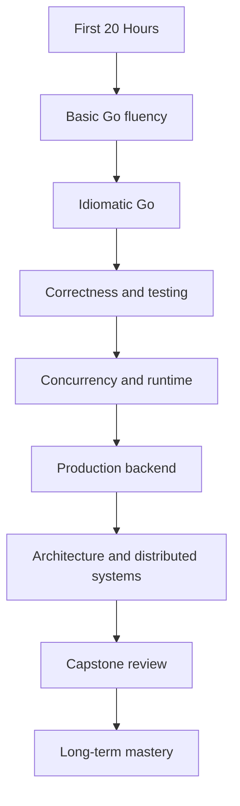
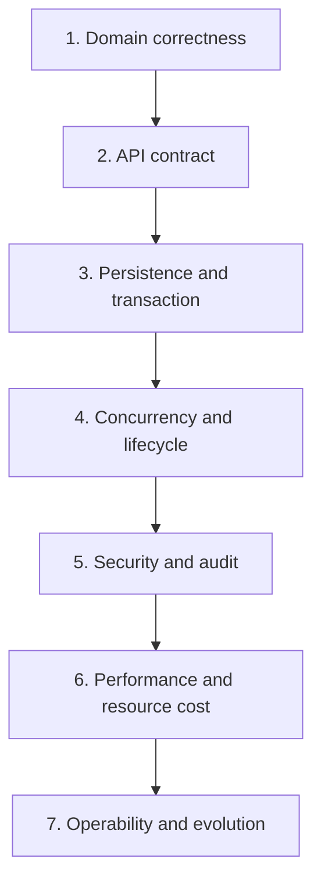
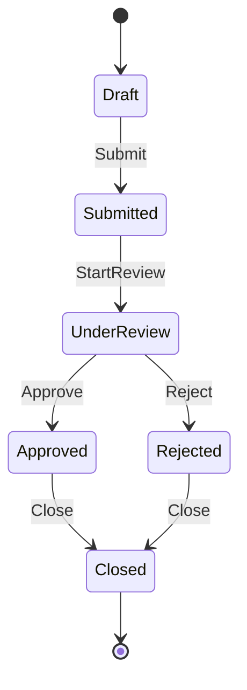
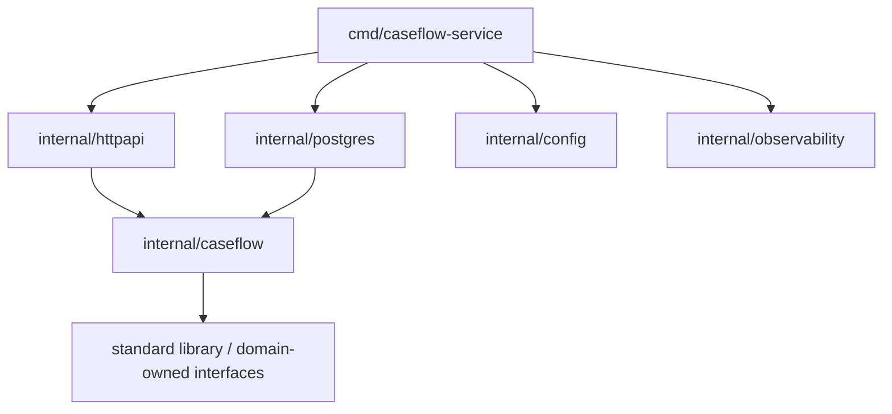
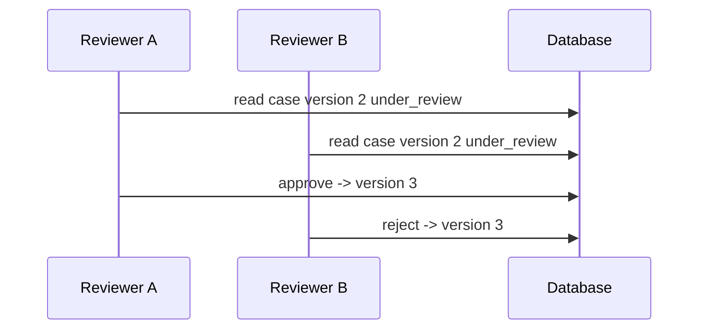
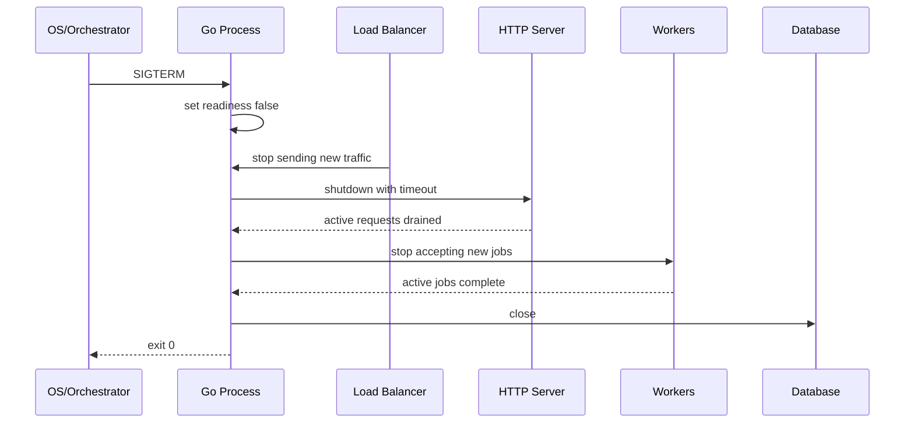
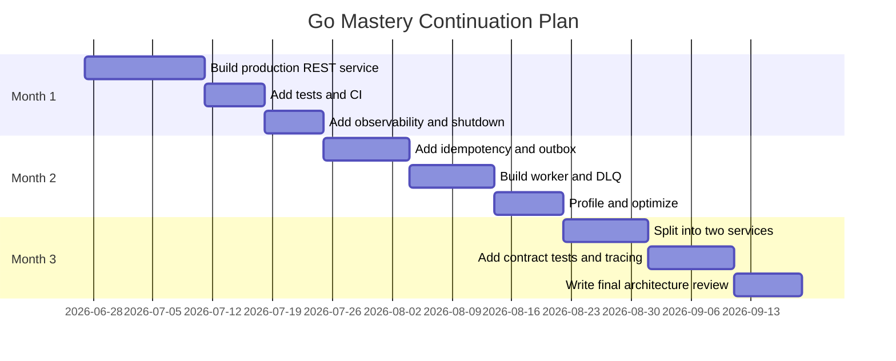

# Capstone II: Architecture Review, Failure Modeling, dan Top 1% Go Engineer Rubric

> Target part ini: kamu mampu mereview service Go seperti engineer senior/staff: bukan hanya “apakah kode jalan”, tetapi apakah desainnya benar, tahan failure, aman, observable, maintainable, dan layak dipertanggungjawabkan di production.

Part ini adalah bagian terakhir seri.

Di Part 34, kita membangun desain capstone `caseflow-service`. Di Part 35, kita melakukan review menyeluruh.

Review ini sengaja dibuat seperti internal engineering review, bukan tutorial biasa.

Pertanyaan utamanya:

> Jika service ini masuk production dan menjadi bagian dari sistem regulatori/enforcement, apakah kita bisa mempertanggungjawabkan correctness, security, auditability, operability, dan evolution path-nya?

---

## 1. Apa yang Dimaksud “Top 1% Go Engineer”?

“Top 1%” di sini bukan berarti hafal semua detail runtime atau bisa menulis kode paling clever.

Untuk konteks software engineer production-grade, “top-tier” berarti mampu:

- memahami bahasa Go secara idiomatik;
- menjaga simplicity tanpa menjadi dangkal;
- mendesain package boundary yang sehat;
- menulis concurrency code yang benar;
- membangun service yang observable dan operable;
- mendesain failure handling;
- memikirkan security dan auditability;
- melakukan review yang menemukan risiko nyata;
- menjaga maintainability codebase;
- menghubungkan keputusan kode dengan dampak sistem;
- menjelaskan trade-off secara jernih.

Engineer top-tier bukan hanya mempercepat delivery. Ia mengurangi risiko sistemik.

---

## 2. Framework Kaufman: Dari 20 Jam ke Mastery

Josh Kaufman menekankan bahwa 20 jam pertama berguna untuk melewati fase tidak kompeten menjadi cukup kompeten untuk praktik mandiri.

Dalam seri ini:



20 jam pertama bukan akhir. Ia adalah launchpad.

Setelah seri ini, targetmu bukan lagi “belajar Go dari nol”, tetapi:

> menggunakan Go sebagai alat untuk membangun sistem yang benar, aman, cepat, dan bisa dioperasikan.

---

## 3. Review Philosophy

Review production-grade harus memeriksa tujuh lapisan:



Kesalahan umum reviewer junior:

- hanya melihat style;
- fokus pada naming tetapi melewatkan race;
- melihat happy path saja;
- tidak mengecek error translation;
- tidak memikirkan rollback;
- tidak bertanya “apa yang terjadi jika request timeout setelah commit?”;
- tidak mengecek tenant isolation;
- tidak mengecek shutdown behavior;
- tidak melihat dependency direction.

Reviewer senior/staff mencari risiko yang tidak terlihat di demo.

---

## 4. Capstone Recap

Capstone `caseflow-service` memiliki:

- domain state machine;
- package `caseflow`;
- adapter `httpapi`;
- adapter `postgres`;
- unit of work;
- audit event;
- outbox event;
- strict JSON decode;
- stable error contract;
- health check;
- graceful shutdown;
- Dockerfile;
- CI;
- runbook.

State machine:



Target review:

- apakah transition ini dijaga di semua path?
- apakah audit tercatat untuk setiap transition penting?
- apakah persistence menyimpan state dengan aman?
- apakah API menolak invalid transition dengan contract stabil?
- apakah tenant isolation konsisten?
- apakah service bisa shutdown tanpa memutus work secara brutal?
- apakah failure mode eksplisit?

---

## 5. Architecture Review

### 5.1 Dependency Direction

Target dependency:



Pelanggaran yang harus dicari:

- `caseflow` import `net/http`;
- `caseflow` import `database/sql`;
- `caseflow` import `postgres`;
- `caseflow` membaca environment variable;
- domain model punya JSON tag;
- repository mengembalikan HTTP status;
- handler menjalankan SQL langsung.

Rule:

> Domain/application core harus bisa dites tanpa HTTP server, database, config file, queue, dan external SDK.

### 5.2 Package Cohesion

Pertanyaan review:

- Apakah `caseflow` punya konsep yang jelas?
- Apakah `httpapi` hanya transport?
- Apakah `postgres` hanya persistence?
- Apakah `config` tidak bocor ke domain?
- Apakah `observability` tidak menjadi global dependency?
- Apakah ada package bernama `utils`, `common`, atau `helpers`?
- Apakah interface didefinisikan oleh consumer?

Jika jawaban tidak jelas, boundary belum matang.

---

## 6. Domain Correctness Review

Domain correctness adalah prioritas pertama.

Untuk `caseflow-service`, invariant utama:

| Invariant | Harus Dijaga Di |
|---|---|
| Case baru mulai dari `draft` | `NewCase` |
| Draft bisa submit | `Case.Submit` |
| Submitted bisa start review jika reviewer ada | `Case.StartReview` |
| Under review bisa approve/reject | `Case.Approve`, `Case.Reject` |
| Approved/rejected bisa close | `Case.Close` |
| Closed tidak bisa berubah | semua transition method |
| Tenant ID wajib | constructor/restore/repository |
| Version bertambah saat mutation | transition methods |
| Audit ditulis saat transition | service layer |
| Outbox ditulis saat event penting | service layer dalam transaction |

### 6.1 Review Domain Methods

Cek apakah transition method:

- memvalidasi current status;
- tidak menerima invalid zero value;
- update `UpdatedAt`;
- increment version;
- tidak melakukan I/O;
- tidak menulis log;
- tidak tahu actor permission kecuali memang rule domain;
- mengembalikan error domain yang bisa dikenali dengan `errors.Is`.

Contoh review comment:

```txt
Approve currently allows transition from submitted to approved.
This violates the state machine. Approval should require under_review.
Please add a domain test for draft->approve and submitted->approve invalid paths.
```

### 6.2 State Transition Table

Buat table eksplisit:

| From | Action | To | Valid? |
|---|---|---|---:|
| draft | submit | submitted | Yes |
| draft | approve | approved | No |
| submitted | start_review | under_review | Yes, if reviewer exists |
| submitted | close | closed | No |
| under_review | approve | approved | Yes |
| under_review | reject | rejected | Yes |
| approved | close | closed | Yes |
| rejected | close | closed | Yes |
| closed | submit | submitted | No |
| closed | approve | approved | No |

Setiap row invalid penting harus punya test.

---

## 7. Application Service Review

Application service harus mengorkestrasi, bukan menyembunyikan domain rule.

Cek:

- apakah service mengambil entity dari repository;
- apakah service memanggil domain method;
- apakah service menyimpan entity setelah mutation;
- apakah audit dan outbox ditulis dalam transaction yang sama;
- apakah error dari repository di-wrap atau diterjemahkan dengan benar;
- apakah service tidak mengembalikan infrastructure detail ke HTTP;
- apakah transaction boundary jelas.

### 7.1 Audit dan Outbox Atomicity

Untuk transition penting:

```txt
load case
apply transition
save case
write audit event
write outbox event
commit
```

Harus dalam satu transaction.

Jika audit ditulis setelah commit, ada risiko:

- state berubah tetapi audit hilang;
- outbox event hilang;
- compliance gap;
- event consumer tidak tahu state berubah.

Untuk sistem regulatori, ini risiko serius.

### 7.2 Idempotency Gap

Part 34 menyebut idempotency key di command, tetapi implementasi lengkap store belum ditulis.

Review harus mencatat:

```txt
Create/Submit commands include IdempotencyKey but Service does not yet enforce idempotency.
This is a production gap for retry-safe write operations.
Either implement an idempotency store in the transaction boundary or remove the field until supported.
```

Ini contoh review matang: menemukan gap antara contract dan behavior.

---

## 8. API Contract Review

API contract harus stabil dan predictable.

Cek:

- status code konsisten;
- error code stabil;
- internal error tidak bocor;
- request body size dibatasi;
- unknown field ditolak jika strict contract diinginkan;
- response timestamp format konsisten;
- tenant ID tidak diambil dari body jika auth context tersedia;
- idempotency behavior terdokumentasi;
- route action jelas;
- pagination jika list endpoint ada;
- versioning strategy ada.

### 8.1 Error Contract

Baik:

```json
{
  "code": "invalid_transition",
  "message": "case transition is not allowed",
  "request_id": "req-123"
}
```

Buruk:

```json
{
  "error": "pq: duplicate key violates constraint cases_pkey"
}
```

Review checklist:

| Error | HTTP Status | Error Code |
|---|---:|---|
| not found | 404 | `case_not_found` |
| invalid transition | 409 | `invalid_transition` |
| reviewer required | 400 | `reviewer_required` |
| unauthorized | 403 | `forbidden` |
| invalid JSON | 400 | `invalid_request` |
| internal DB error | 500 | `internal_error` |

Jangan ubah error code sembarangan karena client bisa bergantung padanya.

---

## 9. Persistence Review

Persistence review mencari risiko data correctness.

Cek:

- semua query case memakai `tenant_id`;
- repository mapping menjaga status valid;
- `RestoreCase` dipakai saat membaca DB;
- transaction boundary jelas;
- `rows.Close()` dipanggil jika query multi-row;
- `sql.ErrNoRows` diterjemahkan ke domain error;
- error SQL di-wrap;
- optimistic concurrency benar;
- migration backward compatible;
- index mendukung query utama;
- audit table append-only secara logis;
- outbox pending query efisien.

### 9.1 Optimistic Concurrency Gap

Part 34 menunjukkan `Save` memakai upsert tanpa compare old version.

Ini bisa menyebabkan lost update.

Scenario:



Tanpa optimistic check, write terakhir menang.

Solusi:

- simpan `previous_version`;
- update dengan `WHERE version = previous_version`;
- jika affected rows 0, return `ErrConflict`.

Contoh design:

```go
type Case struct {
	// ...
	Version int64
	originalVersion int64
}
```

Atau command service menyimpan expected version.

SQL:

```sql
UPDATE cases
SET status = $1,
    reviewer_id = $2,
    updated_at = $3,
    version = version + 1
WHERE tenant_id = $4
  AND id = $5
  AND version = $6
```

Jika rows affected = 0:

```go
return caseflow.ErrConflict
```

Review comment:

```txt
Current Save uses upsert and does not protect against lost updates.
For review/approval workflows, concurrent approval/rejection must be conflict-safe.
Please add optimistic concurrency or serialize transition writes.
```

---

## 10. Transaction Review

Pertanyaan:

- apakah transaction dimulai di application boundary?
- apakah semua write terkait berada dalam transaction sama?
- apakah rollback dipanggil via defer?
- apakah commit error ditangani?
- apakah transaction tidak mencakup remote call lambat?
- apakah context punya timeout?
- apakah retry transaction aman untuk deadlock/serialization error?
- apakah isolation level cukup?

Rule:

> Jangan memegang DB transaction sambil menunggu remote service jika bisa dihindari.

Untuk `caseflow-service`, audit/outbox lokal bisa dalam transaction. Remote publish event tidak boleh di dalam transaction; gunakan outbox.

---

## 11. Concurrency Review

Walaupun business logic tampak sequential, service production tetap concurrent.

Cek:

- shared state dilindungi mutex/atomic;
- no global mutable state;
- no goroutine leak;
- context cancellation dipropagasikan;
- worker pool bounded;
- channel close ownership jelas;
- shutdown tidak race dengan request handling;
- logger aman digunakan;
- config reload atomic jika ada;
- race detector clean.

### 11.1 Race Detector

Command wajib:

```bash
go test -race ./...
```

Tetapi race detector hanya menemukan path yang dieksekusi. Tambahkan test concurrency untuk area kritis:

- idempotency store;
- in-memory fake jika dipakai di server;
- health state;
- runtime config;
- worker group;
- outbox publisher state.

### 11.2 Goroutine Lifecycle

Review semua `go func()`.

Setiap goroutine harus menjawab:

- siapa yang membatalkan?
- kapan selesai?
- bagaimana error dilaporkan?
- apakah panic recovery diperlukan?
- apakah ada wait group?
- apakah context dipakai?
- apakah channel bisa block selamanya?

Comment contoh:

```txt
This goroutine has no cancellation path and may leak on shutdown.
Please pass context and make the send/select cancellation-aware.
```

---

## 12. Lifecycle and Shutdown Review

Production service harus mati dengan benar.

Cek:

- signal handling `SIGTERM`;
- readiness false saat draining;
- drain delay sebelum shutdown;
- `http.Server.Shutdown`;
- worker stop;
- DB close;
- telemetry flush;
- second signal behavior;
- shutdown timeout;
- no new jobs after drain.

Shutdown sequence ideal:



Jika service langsung exit saat SIGTERM, rolling deploy bisa menyebabkan user-visible errors.

---

## 13. Security Review

Security review tidak boleh jadi checklist kosmetik.

Cek:

### 13.1 Input

- request body dibatasi;
- JSON strict;
- unknown field policy jelas;
- path parameter divalidasi;
- enum divalidasi;
- string length dibatasi;
- file upload jika ada dibatasi;
- error tidak membocorkan parser/internal detail berlebihan.

### 13.2 AuthN/AuthZ

- tenant ID dari token/session, bukan body;
- actor ID dari auth context;
- role permission dicek;
- reviewer assignment punya authorization;
- approval/rejection butuh permission;
- service-to-service call jika ada authenticated;
- admin endpoint protected.

### 13.3 Data Isolation

Untuk multi-tenant:

```txt
Every read/write query must include tenant_id.
```

Review SQL:

```sql
SELECT ... FROM cases WHERE id = $1
```

Ini bug security.

Harus:

```sql
SELECT ... FROM cases WHERE tenant_id = $1 AND id = $2
```

### 13.4 Audit

Audit event harus:

- append-only secara praktis;
- menyimpan actor;
- menyimpan action;
- menyimpan from/to status;
- menyimpan timestamp;
- menyimpan reason untuk rejection/override;
- tidak bergantung pada application log;
- queryable untuk investigation.

### 13.5 Secrets

- no secret in logs;
- config endpoint redacted;
- env var tidak dicetak seluruhnya;
- DB URL tidak ditulis mentah ke log;
- admin endpoint tidak public.

---

## 14. Performance Review

Performance review bukan “optimalkan semuanya”.

Mulai dari cost model.

Cek:

- request body tidak dibaca unbounded;
- JSON encode/decode wajar;
- DB query indexed;
- no N+1 query;
- connection pool tuned;
- HTTP client reused;
- allocation hotspot diketahui;
- large slice/map bounded;
- queue bounded;
- benchmark untuk parser/hot path;
- pprof tersedia;
- no unnecessary reflection in hot path.

### 14.1 Performance Budget

Untuk API utama:

| Route | Target |
|---|---:|
| `POST /cases` | p95 < 200ms tanpa dependency eksternal |
| `POST /cases/{id}/submit` | p95 < 250ms |
| `GET /cases/{id}` | p95 < 100ms |
| health endpoints | p95 < 20ms |

Angka ini contoh. Production harus disesuaikan dengan SLO.

### 14.2 Profiling Discipline

Jangan optimasi berdasarkan rasa.

Workflow:

```txt
measure -> profile -> identify hotspot -> change -> benchmark -> compare -> document
```

Command:

```bash
go test -bench=. -benchmem ./...
go test -run=^$ -bench=BenchmarkSubmit -cpuprofile cpu.out ./internal/caseflow
go tool pprof cpu.out
```

---

## 15. Observability Review

Service production harus bisa menjawab:

- request mana yang gagal?
- route mana paling error?
- dependency mana lambat?
- DB query mana mahal?
- case transition mana sering gagal?
- outbox backlog berapa?
- audit write gagal atau tidak?
- versi build mana bermasalah?
- apakah error naik setelah deployment?
- apakah tenant tertentu terdampak?

Minimal signals:

```txt
http_requests_total{route,method,status}
http_request_duration_seconds_bucket{route,method}
case_transition_total{from,to,result}
audit_write_total{action,result}
outbox_pending_total
outbox_oldest_pending_age_seconds
db_query_duration_seconds_bucket{operation}
dependency_request_duration_seconds_bucket{dependency}
process_build_info{version,commit}
```

Structured log wajib punya:

- request ID;
- tenant ID;
- case ID jika ada;
- actor ID jika aman;
- operation;
- error classification;
- latency;
- version.

---

## 16. Failure Modeling

Failure modeling adalah pembeda utama engineer matang.

Untuk setiap workflow penting, tanyakan:

> “Apa yang terjadi jika langkah ini gagal setelah langkah sebelumnya berhasil?”

### 16.1 Workflow Submit Case

Steps:

1. decode request;
2. auth context resolved;
3. idempotency begin;
4. load case;
5. validate transition;
6. save case status;
7. write audit;
8. write outbox;
9. commit;
10. store idempotency response;
11. return HTTP response.

Failure table:

| Step | Failure | Expected Handling |
|---|---|---|
| Decode request | invalid JSON | 400, no state change |
| Auth | missing/invalid user | 401/403, no state change |
| Idempotency begin | store unavailable | 500 or 503, no state change |
| Load case | not found | 404 |
| Validate transition | invalid state | 409 |
| Save case | DB error | rollback, 500 |
| Write audit | DB error | rollback, 500 |
| Write outbox | DB error | rollback, 500 |
| Commit | commit error | ambiguous, log/metric, return 500 |
| Store idempotency response | fails after commit | operation succeeded, replay may not work; alert |
| Return response | client disconnected | state may be committed; retry must use idempotency |

### 16.2 Ambiguous Commit

Commit error is tricky.

If DB driver returns error on commit, state might or might not have committed depending on failure.

Mitigation:

- idempotency key;
- operation record;
- read-after-failure reconciliation;
- audit/outbox correlation ID;
- log high severity;
- metric;
- client retry same key.

Review comment:

```txt
Commit failure should be treated as ambiguous outcome.
For idempotent write operations, store operation identity inside the same transaction so retry can discover final state.
```

---

## 17. Idempotency Review

For write APIs, idempotency should answer:

- key required or optional?
- key scope?
- request hash stored?
- response replayed?
- in-flight handling?
- TTL?
- conflict behavior?
- operation status?
- same key different payload?
- same key different user/tenant?
- storage transaction boundary?

For `caseflow-service`, recommended table:

```sql
CREATE TABLE idempotency_keys (
    scope          TEXT NOT NULL,
    key            TEXT NOT NULL,
    request_hash   TEXT NOT NULL,
    status         TEXT NOT NULL,
    response_code  INTEGER NULL,
    response_body  JSONB NULL,
    created_at     TIMESTAMPTZ NOT NULL,
    updated_at     TIMESTAMPTZ NOT NULL,
    expires_at     TIMESTAMPTZ NOT NULL,
    PRIMARY KEY (scope, key)
);
```

Scope example:

```txt
tenant:{tenant_id}:user:{user_id}:route:POST /cases/{id}/submit
```

Idempotency is not just header parsing. It is a persistence and correctness feature.

---

## 18. Outbox Review

Outbox review:

- outbox written in same transaction as state change;
- publisher separate;
- publish retry bounded;
- pending age monitored;
- duplicate publish safe;
- event has stable schema;
- event has ID;
- event has aggregate ID;
- event has occurred_at;
- event versioning considered;
- DLQ or failed state exists;
- replay procedure documented.

Outbox does not remove need for idempotent consumers.

Event example:

```json
{
  "event_id": "evt-123",
  "event_type": "case.submitted",
  "version": 1,
  "tenant_id": "tenant-1",
  "case_id": "case-123",
  "status": "submitted",
  "occurred_at": "2026-06-27T10:00:00Z"
}
```

---

## 19. Testing Review

A production-grade Go service should test behavior, not implementation detail only.

### 19.1 Required Tests

| Layer | Test |
|---|---|
| Domain | all valid transitions |
| Domain | invalid transitions |
| Domain | restore invalid persisted status |
| Service | submit writes case + audit + outbox |
| Service | repository error rolls back |
| Service | invalid transition does not write audit/outbox |
| HTTP | invalid JSON |
| HTTP | error mapping |
| HTTP | request body too large |
| HTTP | unknown field |
| Persistence | `ErrNotFound` mapping |
| Persistence | tenant isolation |
| Persistence | optimistic conflict |
| Operations | readiness false during drain |
| Concurrency | race detector clean |

### 19.2 Test Smell

- test only happy path;
- mocks too strict;
- no failure path;
- real sleeps;
- shared global test state;
- no race test;
- DB tests not isolated;
- tests assert error string instead of `errors.Is`;
- handler tests depend on network port;
- flaky tests ignored.

### 19.3 Coverage

Coverage is signal, not goal.

High coverage with poor assertions is false confidence.

Better:

- critical transition coverage;
- failure path coverage;
- boundary coverage;
- concurrency lifecycle coverage;
- contract coverage.

---

## 20. Code Review Comments: Examples

### 20.1 Domain Leakage

```txt
The domain Case struct has JSON tags. This couples the domain model to HTTP representation.
Please move JSON tags to httpapi response DTO and keep caseflow.Case transport-agnostic.
```

### 20.2 Interface Too Large

```txt
This Repository interface includes methods not used by Service.Submit.
Please define the smallest interface required by the consumer or split by use case.
```

### 20.3 Missing Context

```txt
This database call uses QueryRow instead of QueryRowContext.
Please pass the request context so cancellation/deadline propagates.
```

### 20.4 Error String Matching

```txt
This code compares err.Error().
Please expose a sentinel/domain error and use errors.Is so wrapping remains safe.
```

### 20.5 Missing Tenant Filter

```txt
This query filters by case id only. In a multi-tenant service, every case query must include tenant_id.
This is a data isolation bug.
```

### 20.6 Goroutine Leak

```txt
This goroutine sends to a channel without a context-aware select.
If the receiver exits, this can block forever. Please add cancellation path.
```

### 20.7 Unbounded Read

```txt
This handler reads the entire body without MaxBytesReader.
Please bound request body size before decoding JSON.
```

---

## 21. Production Readiness Scorecard

Use this scorecard before release.

| Area | Score 0 | Score 1 | Score 2 |
|---|---|---|---|
| Domain correctness | rules in handler | some domain methods | state machine fully tested |
| API contract | ad hoc errors | stable basic errors | documented, tested, versioned |
| Persistence | direct SQL scattered | repository boundary | transaction, tenant, conflict safe |
| Idempotency | none | header parsed | durable replay/conflict behavior |
| Audit | logs only | audit writes some actions | durable complete audit trail |
| Outbox | direct publish | outbox partial | transactional outbox + monitoring |
| Concurrency | unreviewed | race test basic | lifecycle and leak reviewed |
| Security | basic validation | auth + no leak | tenant isolation, audit, admin protected |
| Observability | logs only | logs + metrics | traces, SLO, runbook |
| Shutdown | Ctrl+C exit | HTTP shutdown | drain + workers + telemetry |
| Testing | happy path | failure paths | contract, integration, race, operations |
| Maintainability | package sprawl | basic layers | clear dependency graph + ADR |

Interpretation:

- 0–8: prototype;
- 9–16: internal demo;
- 17–22: early production candidate;
- 23–24: strong production readiness baseline.

Scorecard is not a substitute for judgment. It makes judgment visible.

---

## 22. Staff-level Review Lens

Staff-level review asks broader questions:

### 22.1 Business Correctness

- What user/business harm happens if this transition is wrong?
- Is audit sufficient for investigation?
- Are manual overrides modeled?
- Is rejection reason mandatory?
- Are historical states preserved?
- Can we explain a decision months later?

### 22.2 Systemic Risk

- Can this service cause cascading failure?
- Can retry amplify outage?
- Can a bad deployment corrupt data?
- Can a schema migration break old binaries?
- Can one tenant access another tenant's data?
- Can queue backlog silently grow?
- Can outbox stuck state go unnoticed?

### 22.3 Evolution

- What happens when we add `appealed` status?
- What happens when approval requires two reviewers?
- What happens when audit schema changes?
- What happens when service is split?
- What happens when Go version changes?
- What happens when DB becomes bottleneck?

### 22.4 Operability

- Can on-call understand the service at 3 AM?
- Is there a runbook?
- Are alerts actionable?
- Can we profile CPU/memory safely?
- Can we roll back?
- Can we disable risky path?

---

## 23. Evolution Scenarios

### 23.1 Add Appeal Workflow

New status:

```txt
appealed
appeal_under_review
appeal_approved
appeal_rejected
```

Bad design impact:

- handler conditionals explode;
- audit action inconsistent;
- DB enum migration painful;
- tests missing invalid transitions.

Good design:

- state machine centralized;
- transition tests table-driven;
- audit helper reused;
- status string allows additive values if validated in domain;
- API contract versioned if needed.

### 23.2 Add Two-person Approval

Requirement:

> A case cannot be approved by the same reviewer who submitted or initially reviewed it.

Good design needs:

- actor identity in command;
- reviewer history;
- authorization boundary;
- domain/application rule;
- audit event;
- invalid transition/error code;
- test.

### 23.3 Split Audit Service

If audit becomes separate service:

- keep local audit/outbox until new service reliable;
- publish audit events through outbox;
- consumer idempotent;
- do not remove local audit until compliance approves;
- migration plan with reconciliation;
- ensure historical audit remains queryable.

Architecture should allow this without rewriting domain.

---

## 24. Performance and Scalability Evolution

Potential bottlenecks:

| Bottleneck | Signal | Mitigation |
|---|---|---|
| DB write contention | conflict/deadlock | optimistic concurrency, partitioning |
| Outbox backlog | pending age grows | scale publisher, tune batch |
| Audit table growth | query slow | partition/index/archive |
| JSON encode/decode | CPU profile | optimize DTO/hot path |
| Connection pool | wait count high | tune pool, reduce transaction time |
| Large list endpoint | memory/latency | pagination, streaming |
| Goroutine growth | goroutine metric | fix leak, bound worker |

Do not shard/split prematurely. Measure first.

---

## 25. Maintainability Review

Check:

- package names clear;
- no unnecessary abstraction;
- no global mutable state;
- no giant service object;
- no framework lock-in in domain;
- no generated code manually edited;
- docs match code;
- ADR exists for major decisions;
- dependency updates manageable;
- tests readable;
- feature flags have expiry;
- deprecated code has removal plan.

Maintainability is not “few files”. It is low cognitive load under change.

---

## 26. Final Rubric: Go Engineer Skill Ladder

### Level 1 — Basic Go Programmer

Can:

- write syntax;
- use slices/maps/structs;
- run `go test`;
- build simple HTTP handler.

Limitations:

- weak package design;
- error handling ad hoc;
- little concurrency understanding;
- little production awareness.

### Level 2 — Productive Go Developer

Can:

- write idiomatic functions;
- use interfaces reasonably;
- write table tests;
- handle errors with wrapping;
- use context in HTTP/DB calls.

Limitations:

- may overuse interfaces;
- may not model failure deeply;
- may not profile/operate service.

### Level 3 — Solid Backend Go Engineer

Can:

- design package boundaries;
- build HTTP/database service;
- write unit/integration tests;
- use goroutines/channels safely for common cases;
- implement graceful shutdown;
- add logging/metrics;
- review basic production risks.

Limitations:

- may need help with distributed failure;
- may not catch subtle race/resource issues;
- may not design long-term migration path.

### Level 4 — Senior Go Engineer

Can:

- model domain invariants;
- design transaction boundaries;
- implement idempotency/outbox/inbox;
- profile and optimize with evidence;
- secure service boundaries;
- design resilient clients;
- review concurrency and lifecycle;
- manage migrations safely;
- lead codebase refactoring.

Limitations:

- may still focus mostly on service-level decisions.

### Level 5 — Staff-level Go/System Engineer

Can:

- reason across services and teams;
- reject premature microservices;
- design evolution paths;
- model partial failure and ambiguous outcomes;
- build governance without bureaucracy;
- align code decisions with compliance/operability;
- mentor through review;
- write ADRs and runbooks that guide teams;
- balance correctness, speed, cost, and risk.

This is the level this series is aiming toward.

---

## 27. Personal Mastery Map

After finishing the series, evaluate yourself:

| Area | Question | Score 1–5 |
|---|---|---:|
| Language | Can I explain value vs pointer, interface, method set, zero value? | |
| Packages | Can I design dependency direction without import cycles? | |
| Errors | Can I classify domain/infrastructure/retryable errors? | |
| Testing | Can I test failure paths and concurrency behavior? | |
| Concurrency | Can I prevent leaks, races, and cancellation bugs? | |
| Runtime | Can I explain allocation, GC, scheduler basics? | |
| HTTP | Can I build safe client/server boundaries? | |
| Database | Can I design transaction and consistency boundary? | |
| Security | Can I detect tenant/auth/input/audit risks? | |
| Observability | Can I debug production from logs/metrics/traces? | |
| Resilience | Can I design retry/idempotency/outbox/inbox/saga? | |
| Operations | Can I implement health/shutdown/deploy/rollback/runbook? | |
| Architecture | Can I explain trade-offs and evolution path? | |

Focus next learning on areas with score below 4.

---

## 28. Recommended Next Projects

### Project 1 — Production REST Service

Build:

- CRUD + workflow state machine;
- Postgres;
- migrations;
- audit;
- idempotency;
- outbox;
- health;
- Docker;
- CI.

Goal:

> Prove you can build one service end-to-end.

### Project 2 — Concurrent Worker System

Build:

- queue consumer;
- bounded workers;
- retry policy;
- DLQ;
- inbox deduplication;
- metrics;
- graceful shutdown.

Goal:

> Prove you can manage concurrency and async failure.

### Project 3 — Service-to-service Integration

Build:

- two services;
- typed client;
- timeout budget;
- retry with jitter;
- circuit breaker;
- contract tests;
- tracing.

Goal:

> Prove you can handle distributed failure.

### Project 4 — Legacy Refactor

Take messy code and:

- add characterization tests;
- split package;
- remove global state;
- migrate error handling;
- add context;
- write ADR;
- preserve behavior.

Goal:

> Prove you can improve codebase safely.

---

## 29. What to Read Next

Recommended topics after this series:

1. Go release notes for every new Go version.
2. Go memory model.
3. Effective Go.
4. Go Code Review Comments.
5. Standard library source code.
6. `net/http` internals.
7. `database/sql` behavior and driver docs.
8. OpenTelemetry instrumentation.
9. Distributed systems failure patterns.
10. SRE books: SLO, error budget, incident management.
11. Database transaction isolation.
12. Secure coding and threat modeling.
13. API compatibility and schema evolution.
14. Queue semantics and stream processing.
15. Runtime profiling and performance engineering.

Reading is not enough. Pair every topic with a project and review.

---

## 30. Final Practice: Engineering Review Document

Create `docs/final-review.md` for your capstone.

Template:

```md
# Final Engineering Review: caseflow-service

## Summary

What does this service do?

## Architecture

Package graph and dependency direction.

## Domain Model

State machine and invariants.

## API Contract

Endpoints, error model, idempotency behavior.

## Persistence

Tables, transaction boundary, concurrency strategy.

## Security

Auth, tenant isolation, input validation, audit, secrets.

## Observability

Logs, metrics, traces, dashboards, alerts.

## Operations

Health, shutdown, deployment, rollback, runbook.

## Failure Model

Failure-mode table for create/submit/approve.

## Known Gaps

List remaining risks honestly.

## Decision

Ready / not ready / ready with conditions.

## Follow-up Actions

Prioritized action list.
```

The review document is as important as the code. It shows judgment.

---

## 31. Final Failure-mode Table Template

Use this for every critical operation.

| Step | Failure | User Impact | System Impact | Handling | Observability | Follow-up |
|---|---|---|---|---|---|---|
| Decode request | invalid JSON | request rejected | none | 400 | request metric | none |
| Auth | invalid token | request rejected | none | 401/403 | auth metric | investigate if spike |
| Load entity | DB timeout | request fails | dependency pressure | 503/500 | db timeout metric | check DB |
| Apply transition | invalid state | conflict | none | 409 | transition metric | client fix |
| Save state | conflict | retry needed | concurrent write | 409 | conflict metric | review UX |
| Write audit | DB error | request fails | no partial commit | rollback | audit error metric | investigate |
| Write outbox | DB error | request fails | event not emitted | rollback | outbox error metric | investigate |
| Commit | unknown | ambiguous | possible committed state | log high severity | commit error metric | reconciliation |
| Response | client disconnected | client unsure | state may commit | idempotent retry | access log | none |

---

## 32. Final Checklist Before Calling a Go Service Production-ready

### Language and Code

- Code formatted with `gofmt`.
- `go test ./...` passes.
- `go test -race ./...` passes for relevant packages.
- `go vet ./...` passes.
- Errors use wrapping and `errors.Is`/`errors.As`.
- Context propagated through I/O.
- No avoidable global mutable state.

### Architecture

- Dependency direction clear.
- Domain independent from HTTP/database.
- Interfaces small and consumer-owned.
- `main` is composition root.
- `internal` packages used appropriately.
- ADR exists for major architecture decisions.

### Correctness

- Domain invariants tested.
- Invalid transitions tested.
- Transaction boundary explicit.
- Audit and outbox atomic with state change.
- Tenant isolation enforced.
- Optimistic concurrency or serialization strategy exists.

### API

- Stable request/response contract.
- Stable error code.
- Strict/bounded input handling.
- Idempotency documented and implemented where claimed.
- Internal errors not leaked.

### Security

- AuthN/AuthZ boundary clear.
- Secrets not logged.
- Admin/debug endpoints protected.
- SQL parameterized.
- Audit trail durable.
- Dependency vulnerability scan included.

### Operations

- Readiness/liveness correct.
- Graceful shutdown.
- Build info endpoint.
- Structured logging.
- Metrics for golden signals.
- Runbook.
- Rollback plan.
- Migration strategy.

### Resilience

- Timeout budget.
- Retry policy bounded.
- Idempotency for writes.
- Outbox/inbox for async.
- DLQ strategy.
- Reconciliation for drift.
- Failure-mode table.

If many boxes are unchecked, the service is not production-ready. It may still be a valid prototype, but call it honestly.

---

## 33. Common Final Mistakes

1. Claiming idempotency because a header exists.
2. Writing audit after commit.
3. Publishing events directly inside request transaction.
4. Letting domain import database package.
5. Using global DB/logger/config everywhere.
6. Ignoring tenant ID in queries.
7. Returning raw SQL errors to clients.
8. Retrying non-idempotent writes.
9. Missing shutdown drain.
10. Exposing pprof publicly.
11. Having health checks that kill service during dependency outage.
12. Updating schema in a non-backward-compatible way.
13. Treating logs as audit.
14. Ignoring ambiguous commit.
15. Calling a prototype production-ready.

---

## 34. How to Continue After This Series

Recommended 12-week mastery plan:



Focus:

- ship;
- measure;
- review;
- refactor;
- document;
- repeat.

---

## 35. Seri Selesai

Seri ini dimulai dari:

```txt
learn-go-part-01.mdx
```

Dan selesai di:

```txt
learn-go-part-35.mdx
```

Total:

```txt
35 part
```

Cakupan besar:

1. Mental model Go.
2. Toolchain dan workflow.
3. Syntax, values, types, zero value.
4. Control flow, functions, errors.
5. Arrays, slices, maps, strings, bytes, runes.
6. Structs, methods, interfaces, composition.
7. Pointers, memory, escape analysis.
8. Packages, modules, dependency boundaries.
9. Idiomatic Go.
10. Error handling.
11. Testing.
12. Benchmarking and fuzzing.
13. Goroutines, channels, select.
14. Sync primitives.
15. Context and lifecycle.
16. Memory model and race detector.
17. Runtime, scheduler, GC.
18. Standard library I/O.
19. HTTP client/server.
20. Database access.
21. API design.
22. CLI/config/secrets.
23. Observability.
24. Performance engineering.
25. Generics.
26. Reflection, unsafe, CGO.
27. Security engineering.
28. Build, release, container, deployment.
29. Project architecture.
30. Microservices.
31. Resilience patterns.
32. Production operations.
33. Modernization and maintainability.
34. Capstone build.
35. Capstone review and mastery rubric.

---

## 36. Penutup

Go adalah bahasa kecil, tetapi engineering dengan Go tidak kecil.

Kekuatan Go muncul saat kamu menggunakan kesederhanaannya untuk membuat sistem yang:

- mudah dibaca;
- mudah diuji;
- mudah dideploy;
- mudah didebug;
- tahan failure;
- jelas boundary-nya;
- rendah ceremony;
- tinggi reliability;
- bisa dipertanggungjawabkan.

Jangan ukur skill Go dari seberapa banyak fitur yang kamu tahu. Ukur dari seberapa baik kamu bisa mengambil requirement yang ambigu, memodelkan domain, menjaga invariant, membuat failure eksplisit, menulis kode yang bisa direview, dan mengoperasikan service dengan tenang.

Itulah perbedaan antara “bisa Go” dan “bisa engineering dengan Go”.

**Seri selesai.**
