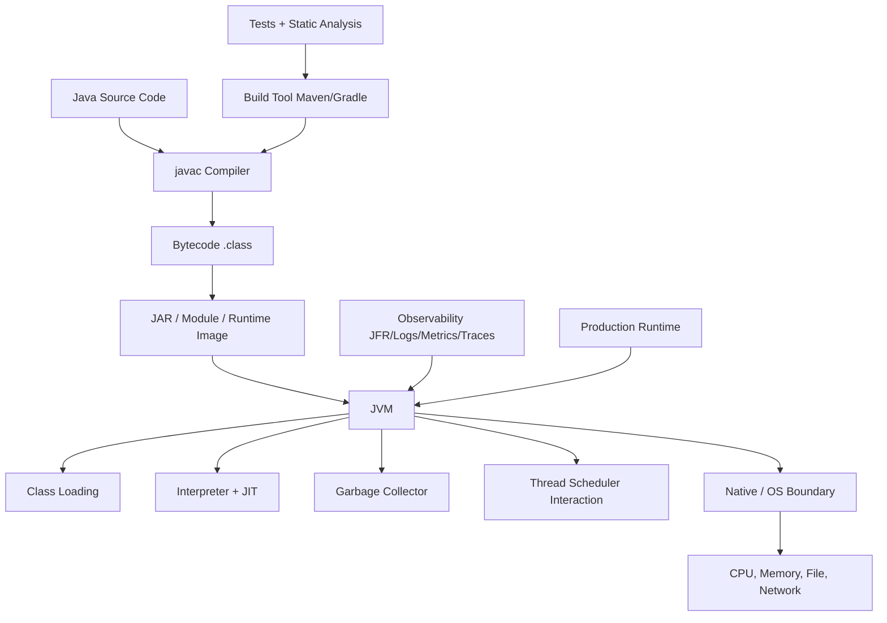
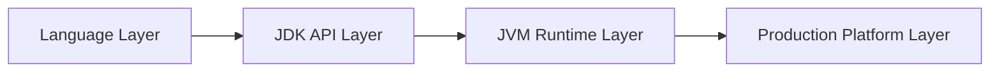
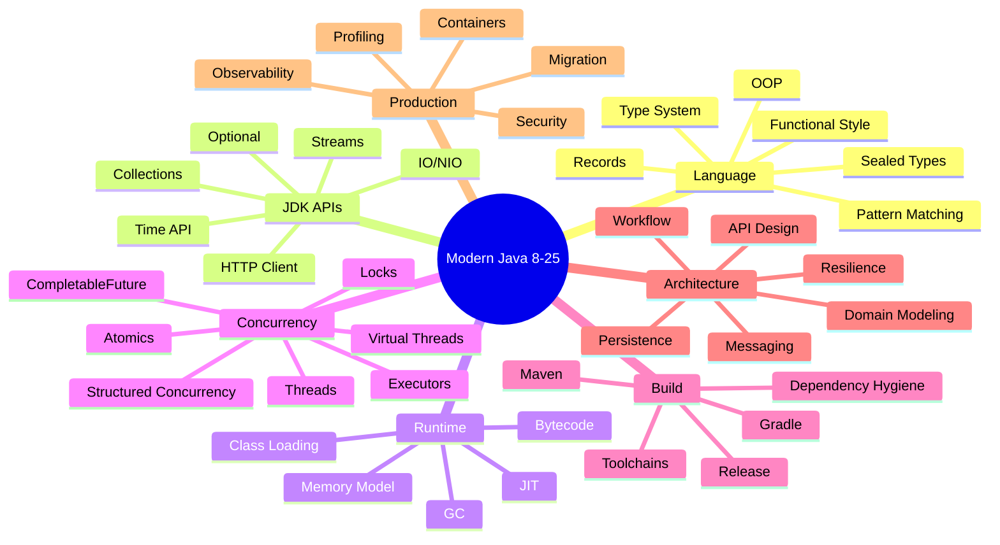
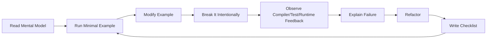
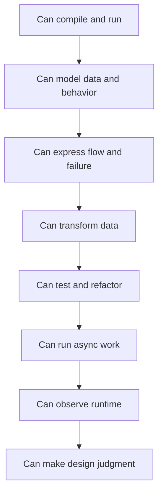
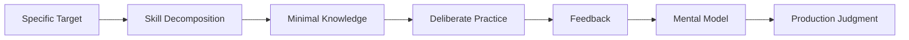

# Modern Java 8–25 Part 001: Kaufman Skill Map untuk Modern Java

> **Nama file:** `learn-modern-java-8-to-25-part-001-kaufman-skill-map.mdx`  
> **Scope:** cara belajar Java modern secara efektif, terstruktur, dan production-oriented.  
> **Output:** skill map, target performa, learning loop, practice backlog, dan rubrik evaluasi.

---

## 1. Kenapa Part Ini Penting

Banyak engineer belajar Java dengan urutan yang keliru:

1. hafal syntax;
2. langsung pakai framework;
3. copy pattern;
4. baru sadar ada masalah runtime, concurrency, dependency, GC, atau migration saat production incident terjadi.

Untuk software engineer berpengalaman, masalahnya bukan “belum bisa coding”. Masalahnya adalah **membangun mental model Java sebagai platform engineering system**.

Java bukan hanya bahasa. Java adalah kombinasi dari:

- language syntax;
- type system;
- compiler;
- bytecode;
- JVM;
- standard library;
- concurrency model;
- garbage collector;
- module system;
- build ecosystem;
- packaging model;
- runtime observability;
- migration surface;
- production operating model.

Kalau kita belajar Java hanya dari syntax, kita akan berhenti di level “bisa menulis program”. Target seri ini lebih tinggi: **mampu mengambil keputusan teknis Java secara defensible**.

---

## 2. Prinsip Kaufman yang Dipakai dalam Seri Ini

Framework dari *The First 20 Hours* dipakai sebagai metode akuisisi skill, bukan sebagai janji bahwa 20 jam cukup untuk menjadi expert. Untuk Java, 20 jam pertama dipakai untuk mencapai **operational fluency**: cukup mampu membaca, menulis, menjalankan, menguji, dan memperbaiki program Java modern dengan feedback cepat.

Inti pendekatannya:

1. **Tentukan target performa yang spesifik.**
2. **Pecah skill besar menjadi sub-skill kecil.**
3. **Pelajari secukupnya untuk mulai praktik dan mengoreksi diri.**
4. **Singkirkan hambatan praktik.**
5. **Komit ke latihan terfokus minimal 20 jam.**

Dalam konteks Java:

- targetnya bukan “menguasai Java”;
- targetnya adalah “mampu membangun, membaca, menguji, mendiagnosis, dan memodernisasi sistem Java dengan judgment yang baik”.

---

## 3. Target Performa Seri

Target performa harus konkret. Kalau tidak, pembelajaran berubah menjadi konsumsi konten pasif.

Setelah menyelesaikan seri ini, pembaca ditargetkan mampu:

- membuat project Java dari nol dengan Maven atau Gradle;
- menjalankan beberapa JDK berbeda secara terkontrol;
- memahami perbedaan Java 8, 11, 17, 21, dan 25 sebagai baseline engineering;
- memakai lambda, streams, records, sealed classes, pattern matching, virtual threads, dan fitur modern lain dengan alasan desain yang jelas;
- mendesain API Java yang stabil dan evolvable;
- memahami source compatibility, binary compatibility, dan runtime compatibility;
- memahami classpath, module path, class loading, bytecode, heap, stack, metaspace, dan garbage collection;
- menulis concurrent code yang benar, bukan hanya terlihat cepat;
- melakukan profiling dengan JFR, JMC, thread dump, GC logs, dan async-profiler;
- merencanakan migration Java 8 ke 11, 17, 21, atau 25;
- membuat production readiness checklist untuk aplikasi Java;
- menjelaskan trade-off teknis Java kepada engineer lain.

### 3.1 Definisi “Top 1%” dalam Seri Ini

“Top 1%” tidak didefinisikan sebagai status, gelar, atau klaim absolut. Dalam seri ini, istilah tersebut berarti engineer yang punya kombinasi kemampuan berikut:

| Dimensi | Engineer biasa | Engineer kuat | Target top-tier |
|---|---|---|---|
| Language | tahu syntax | tahu idiom modern | tahu konsekuensi desain dari tiap idiom |
| Runtime | tahu JVM menjalankan Java | tahu heap/GC/thread | bisa mendiagnosis latency, memory, GC, contention |
| API Design | bisa buat method/class | bisa buat abstraction | bisa menjaga compatibility jangka panjang |
| Concurrency | pakai executor/future | tahu locking dan async | bisa model correctness, cancellation, backpressure, saturation |
| Migration | upgrade dependency | upgrade JDK | punya staged migration plan + rollback + compatibility audit |
| Production | deploy service | monitor logs | desain observability, readiness, incident workflow |
| Judgment | mengikuti best practice | tahu trade-off | memilih solusi berdasarkan constraint nyata |

---

## 4. Mental Model Java sebagai Platform

Gunakan diagram ini sebagai peta awal.



Kesalahan umum: memperlakukan Java source code sebagai seluruh sistem. Padahal production behavior ditentukan oleh interaksi antara source code, compiler, bytecode, JVM, OS, dependency, configuration, traffic, dan observability.

### 4.1 Empat Lapisan Java



#### Language Layer

Contoh:

- class;
- interface;
- enum;
- generics;
- lambda;
- records;
- sealed classes;
- pattern matching;
- switch expressions.

Pertanyaan yang harus bisa dijawab:

- Apakah model ini mutable atau immutable?
- Apakah type hierarchy ini terbuka atau tertutup?
- Apakah API ini aman terhadap perubahan masa depan?
- Apakah flow ini explicit atau implicit?

#### JDK API Layer

Contoh:

- collections;
- streams;
- `Optional`;
- `java.time`;
- `CompletableFuture`;
- `HttpClient`;
- `Path`/`Files`;
- virtual threads;
- structured concurrency;
- foreign function and memory API.

Pertanyaan yang harus bisa dijawab:

- Apakah API ini blocking?
- Apakah API ini lazy?
- Apakah API ini thread-safe?
- Apa ownership resource-nya?
- Apa failure contract-nya?

#### JVM Runtime Layer

Contoh:

- class loading;
- bytecode;
- heap;
- stack;
- metaspace;
- JIT;
- GC;
- Java Memory Model;
- thread scheduling;
- safepoint;
- object allocation.

Pertanyaan yang harus bisa dijawab:

- Apakah object ini dialokasikan di heap?
- Apakah code ini menyebabkan allocation pressure?
- Apakah latency berasal dari CPU, lock, I/O, GC, atau dependency eksternal?
- Apakah visibility antar thread benar?

#### Production Platform Layer

Contoh:

- build pipeline;
- Docker/container runtime;
- memory limit;
- logging;
- metrics;
- tracing;
- JFR;
- dependency vulnerability;
- rollout strategy;
- rollback strategy.

Pertanyaan yang harus bisa dijawab:

- Bagaimana kita tahu service sehat?
- Bagaimana kita tahu deployment baru menyebabkan regression?
- Bagaimana mendiagnosis p99 latency?
- Bagaimana memigrasikan JDK tanpa breaking change?

---

## 5. Decomposition Map: Skill Java yang Harus Dipisahkan

Belajar “Java” terlalu besar. Pecah menjadi sub-skill.



Setiap sub-skill punya tiga level:

1. **Recognition** — bisa mengenali konsep saat membaca code.
2. **Use** — bisa memakai konsep dalam kasus sederhana.
3. **Judgment** — bisa memilih, menolak, atau memodifikasi pendekatan berdasarkan constraint.

Target seri ini adalah level ketiga.

---

## 6. Learning Loop yang Akan Dipakai

Setiap part harus dipelajari dengan loop berikut.



Penjelasan:

- **Read Mental Model**: pahami konsep inti.
- **Run Minimal Example**: jangan hanya membaca.
- **Modify Example**: ubah parameter, tipe, visibility, dependency, atau executor.
- **Break It Intentionally**: buat error compilation, runtime exception, race condition, failing test.
- **Observe Feedback**: baca error message, stack trace, log, metric, dump.
- **Explain Failure**: jelaskan dengan bahasa sendiri.
- **Refactor**: buat code lebih jelas atau lebih aman.
- **Write Checklist**: ubah pelajaran menjadi aturan operasional.

Top-tier engineer tidak hanya tahu solusi. Mereka tahu **bagaimana solusi gagal**.

---

## 7. First 20 Hours Plan untuk Java

Ini bukan seluruh seri. Ini adalah ramp-up awal agar pembaca cepat punya fluency.

### 7.1 Distribusi 20 Jam

| Jam | Fokus | Output |
|---:|---|---|
| 1 | Setup multi-JDK, Maven/Gradle, IDE, JShell | bisa compile/run/test |
| 2 | Source → bytecode → runtime | paham javac/java/jar/javap |
| 3 | Class, object, interface, enum | bisa model domain kecil |
| 4 | Generics dan collections | bisa pilih collection tepat |
| 5 | Error handling dan contracts | bisa desain failure flow |
| 6 | Lambda dan functional interface | bisa pass behavior |
| 7 | Streams dan collectors | bisa transform data safely |
| 8 | Optional dan java.time | bisa handle null/time dengan benar |
| 9 | Unit testing JUnit | bisa validasi behavior |
| 10 | Refactoring small app | bisa improve design |
| 11 | Executor dan CompletableFuture | bisa async sederhana |
| 12 | Debugging stack trace/thread dump basic | bisa investigasi error |
| 13 | Records/sealed intro | bisa model immutable data |
| 14 | Switch expression/pattern intro | bisa simplify branching |
| 15 | Build dependency hygiene | bisa baca dependency tree |
| 16 | Logging dan observability dasar | bisa trace execution |
| 17 | JVM memory basics | bisa baca heap/stack intuition |
| 18 | GC/JIT overview | bisa hindari klaim performance palsu |
| 19 | Mini project | service/domain kecil end-to-end |
| 20 | Review, explain, checklist | self-assessment dan next plan |

### 7.2 Kenapa Urutannya Begitu

Urutan ini mengikuti prinsip dependency antar konsep.



Tidak masuk akal belajar GC tuning sebelum bisa membaca allocation pattern. Tidak efektif belajar virtual threads sebelum tahu blocking, executor, dan thread pool. Tidak sehat belajar Spring dulu sebelum paham JDK API dan failure contract.

---

## 8. Skill Backlog untuk Seluruh Seri

Gunakan backlog ini sebagai daftar latihan, bukan daftar bacaan.

### 8.1 Language Backlog

- Tulis class immutable manual.
- Ubah class immutable menjadi record.
- Buat sealed hierarchy untuk command/result/error.
- Refactor `if-else` panjang menjadi switch expression.
- Gunakan pattern matching untuk menghapus unsafe cast.
- Desain enum yang membawa behavior.
- Tulis generic method dengan bounded type.
- Jelaskan kapan `var` boleh dipakai dan kapan tidak.

### 8.2 JDK API Backlog

- Implementasikan transformasi collection dengan loop.
- Implementasikan ulang dengan stream.
- Bandingkan readability dan performance hypothesis.
- Tulis custom collector sederhana.
- Gunakan `Optional` sebagai return type.
- Desain API tanpa `Optional` di field.
- Gunakan `Clock` untuk test time-dependent code.
- Baca file besar tanpa memuat seluruh isi ke memory.

### 8.3 Runtime Backlog

- Compile class lalu baca bytecode dengan `javap`.
- Buat contoh static initialization order.
- Buat memory leak dengan static map.
- Ambil heap dump.
- Buat thread dump dari program yang deadlock.
- Jalankan program dengan GC logging.
- Buat microbenchmark salah, lalu perbaiki dengan JMH.

### 8.4 Concurrency Backlog

- Buat race condition sederhana.
- Perbaiki dengan `synchronized`.
- Perbaiki dengan atomic class.
- Bandingkan konsekuensi desainnya.
- Buat `CompletableFuture` chain dengan timeout.
- Buat cancellation path.
- Jalankan blocking workload dengan platform thread dan virtual thread.
- Deteksi bottleneck connection pool saat virtual thread dipakai.

### 8.5 Production Backlog

- Buat structured logs.
- Tambahkan correlation ID.
- Tambahkan metric latency.
- Ambil JFR recording.
- Baca flame graph CPU.
- Buat Docker image Java.
- Set memory limit container.
- Simulasikan rollout Java 17 ke 21.
- Buat migration checklist Java 8 ke 25.

---

## 9. Mental Model: Java Version Timeline

Java modern sebaiknya dipahami dalam anchor release, bukan setiap versi secara terpisah.

| Release | Peran dalam seri | Kenapa penting |
|---|---|---|
| Java 8 | legacy enterprise baseline | lambda, streams, default methods, `java.time` |
| Java 9 | platform boundary shift | modules, JShell, jlink |
| Java 11 | LTS modernization baseline | HttpClient, removal legacy Java EE/CORBA modules |
| Java 17 | LTS modern language anchor | records, sealed classes, stronger encapsulation |
| Java 21 | LTS concurrency/platform anchor | virtual threads, sequenced collections, pattern matching |
| Java 25 | latest LTS line in this series | modern LTS target, accumulated language/runtime/platform evolution |

Java punya feature release tiap enam bulan. Artinya, kemampuan penting bukan hanya “tahu fitur Java 25”, tetapi **bisa membaca evolusi fitur**: preview → final, incubator → standard, experimental → production policy.

---

## 10. Rubrik Self-Assessment

Gunakan rubrik ini sebelum lanjut ke part berikutnya.

### 10.1 Level 1 — Familiar

Anda berada di level ini jika:

- tahu Java punya class, interface, collection, stream;
- bisa menjalankan program sederhana;
- bisa mengikuti tutorial;
- tapi masih sering bingung saat code tidak berjalan.

Risiko:

- mudah copy-paste;
- tidak tahu kenapa solusi bekerja;
- sulit debugging.

### 10.2 Level 2 — Productive

Anda berada di level ini jika:

- bisa membuat service atau library kecil;
- bisa menulis unit test;
- bisa memakai Maven/Gradle;
- bisa membaca stack trace;
- bisa memakai Java 8 idiom.

Risiko:

- runtime mental model masih dangkal;
- concurrency sering berdasarkan asumsi;
- performance masih berdasarkan feeling.

### 10.3 Level 3 — Senior-Practical

Anda berada di level ini jika:

- bisa memisahkan domain, application, infrastructure boundary;
- bisa memilih collection/concurrency primitive dengan alasan;
- bisa membaca thread dump dan GC log dasar;
- bisa menulis migration plan;
- bisa review API compatibility.

Risiko:

- masih mungkin over-engineer;
- belum tentu kuat di JVM internals;
- belum tentu punya systematic incident playbook.

### 10.4 Level 4 — Top-Tier Java Engineer

Anda mendekati level ini jika:

- bisa menjelaskan Java dari source sampai runtime;
- bisa mendesain sistem Java dengan failure mode eksplisit;
- bisa mengoreksi desain orang lain tanpa dogmatis;
- bisa mendiagnosis issue production berbasis evidence;
- bisa menilai fitur baru Java secara governance-aware;
- bisa membuat trade-off antara simplicity, compatibility, throughput, latency, operability, dan migration cost.

---

## 11. Anti-Pattern Pembelajaran Java

### 11.1 Framework-First Learning

Langsung belajar Spring Boot tanpa memahami Java/JDK/JVM sering menciptakan ilusi produktivitas.

Gejala:

- bisa membuat endpoint;
- tidak tahu kenapa dependency conflict terjadi;
- tidak tahu kenapa startup lambat;
- tidak tahu kenapa request thread habis;
- tidak tahu kenapa transaction boundary bocor;
- tidak tahu kenapa serialization gagal.

Solusi:

- pahami Java core;
- pahami JDK API;
- pahami JVM runtime;
- baru gunakan framework sebagai acceleration layer.

### 11.2 Syntax-Only Learning

Menghafal syntax Java 17/21/25 tidak cukup.

Contoh:

```java
record Money(String currency, long amount) {}
```

Pertanyaan yang lebih penting:

- Apakah `amount` memakai minor unit?
- Apakah currency harus ISO-4217?
- Apakah amount boleh negatif?
- Apakah record ini valid jika dibuat dari deserialization?
- Apakah invariant dijaga di constructor?
- Apakah equality semantics sesuai domain?

### 11.3 Performance by Folklore

Contoh klaim berbahaya:

- “Stream selalu lambat.”
- “Reflection selalu buruk.”
- “Virtual thread pasti lebih cepat.”
- “GC tuning menyelesaikan memory problem.”
- “Reactive selalu lebih scalable.”

Performance harus dibuktikan dengan measurement.

Minimal evidence:

- benchmark yang benar;
- profiler;
- metric production;
- allocation profile;
- thread dump;
- GC log;
- load test;
- regression comparison.

### 11.4 Version Worship

Versi baru tidak otomatis membuat sistem lebih baik.

Pertanyaan yang harus dijawab sebelum upgrade:

- Apa alasan upgrade?
- Apa dependency yang belum compatible?
- Apa risiko runtime behavior berubah?
- Apa rollback plan?
- Apa test coverage cukup?
- Apa observability cukup untuk mendeteksi regression?

---

## 12. Practice System untuk Seri Ini

Buat repository belajar dengan struktur seperti ini:

```text
modern-java-8-to-25-lab/
  README.md
  docs/
    notes/
    decision-records/
  labs/
    part-001-skill-map/
    part-002-practice-environment/
    part-003-source-to-runtime/
  examples/
    language/
    collections/
    concurrency/
    jvm/
    architecture/
  scripts/
    java-version.sh
    run-tests.sh
    run-jfr.sh
    dump-threads.sh
  build.gradle.kts
  pom.xml
```

Setiap part sebaiknya menghasilkan minimal:

- satu catatan mental model;
- satu contoh code;
- satu failure case;
- satu checklist;
- satu pertanyaan review;
- satu improvement ke repository.

---

## 13. Engineering Notes: Cara Membaca Fitur Java Baru

Saat membaca fitur Java baru, jangan mulai dari syntax. Mulai dari problem.

Template:

```text
Feature:
Problem solved:
Previous workaround:
New model:
Compatibility impact:
Runtime impact:
Readability impact:
Failure modes:
Production adoption rule:
When not to use:
```

Contoh untuk virtual threads:

```text
Feature: Virtual Threads
Problem solved: cost tinggi dari thread-per-request jika memakai platform threads
Previous workaround: reactive/event loop/asynchronous callback
New model: cheap thread abstraction managed by JVM
Compatibility impact: blocking code bisa tetap terlihat synchronous
Runtime impact: bottleneck pindah ke downstream resources seperti DB pool
Failure modes: pinning, unbounded concurrency, ThreadLocal misuse
Production adoption rule: gunakan dengan concurrency limit dan observability
When not to use: CPU-bound workload tanpa blocking I/O
```

---

## 14. Checklist Selesai Part 001

Sebelum lanjut ke Part 002, pastikan Anda bisa menjawab:

- Apa target performa belajar Java Anda?
- Apa perbedaan belajar Java sebagai bahasa vs sebagai platform?
- Apa saja sub-skill besar dalam Modern Java?
- Apa learning loop yang akan dipakai di setiap part?
- Kenapa Java 8, 11, 17, 21, dan 25 dipakai sebagai anchor?
- Apa perbedaan operational fluency dan mastery?
- Apa anti-pattern utama dalam belajar Java?
- Bagaimana Anda akan mengukur progress?

---

## 15. Latihan Part 001

### Latihan 1 — Tulis Target Performa

Buat file:

```text
docs/notes/part-001-target-performance.md
```

Isi:

```markdown
# Target Performance

Dalam 20 jam pertama, saya ingin mampu:

1. ...
2. ...
3. ...

Saya akan menganggap target tercapai jika saya bisa:

- [ ] compile dan run project Java dari terminal
- [ ] menulis unit test
- [ ] memakai Java 8 functional idiom
- [ ] menjelaskan source-to-runtime path
- [ ] membaca stack trace
- [ ] membuat mini project
```

### Latihan 2 — Buat Skill Inventory

Buat tabel:

```markdown
| Skill | Current Level 1-5 | Evidence | Next Practice |
|---|---:|---|---|
| Java language |  |  |  |
| Collections |  |  |  |
| Streams |  |  |  |
| Concurrency |  |  |  |
| JVM |  |  |  |
| Build tools |  |  |  |
| Testing |  |  |  |
| Performance |  |  |  |
| Production |  |  |  |
```

### Latihan 3 — Buat Practice Contract

Tulis komitmen:

```markdown
# 20-Hour Practice Contract

Saya akan latihan Java selama 20 jam pertama dengan aturan:

- durasi per sesi: ...
- waktu latihan: ...
- environment: ...
- distraction yang dihapus: ...
- evidence setiap sesi: commit, notes, test, benchmark, atau profiling output
```

---

## 16. Kesimpulan

Part ini bukan tentang Java syntax. Part ini adalah **sistem belajar**.

Untuk menjadi kuat di Java modern, urutan berpikirnya adalah:



Mulai Part 002, kita akan menghapus hambatan praktik: multi-JDK setup, build tool, IDE, JShell, static analysis, test loop, dan template repository.

---

## Referensi

- Josh Kaufman, *The First 20 Hours: How to Learn Anything... Fast*. Ringkasan prinsip rapid skill acquisition juga tersedia di WIRED: https://www.wired.com/story/learn-new-skills-in-20
- OpenJDK JDK Project release model: https://openjdk.org/projects/jdk/
- JEP 322: Time-Based Release Versioning: https://openjdk.org/jeps/322
- OpenJDK JDK 25 project page: https://openjdk.org/projects/jdk/25/
- Oracle Java SE Support Roadmap: https://www.oracle.com/java/technologies/java-se-support-roadmap.html
