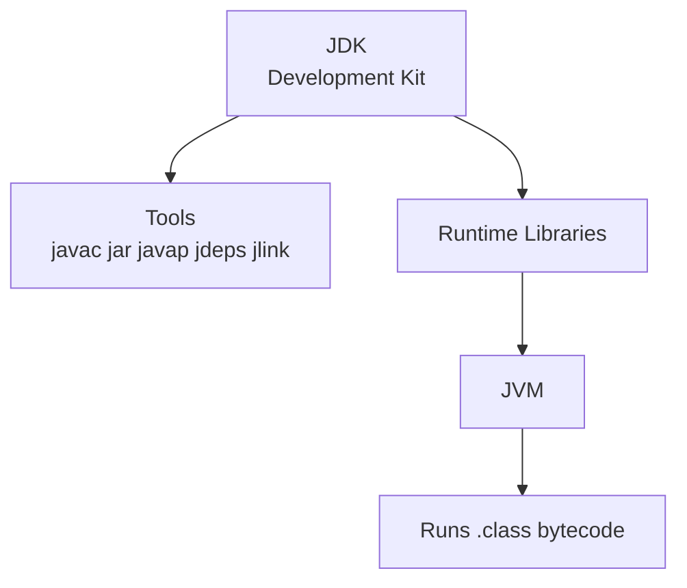
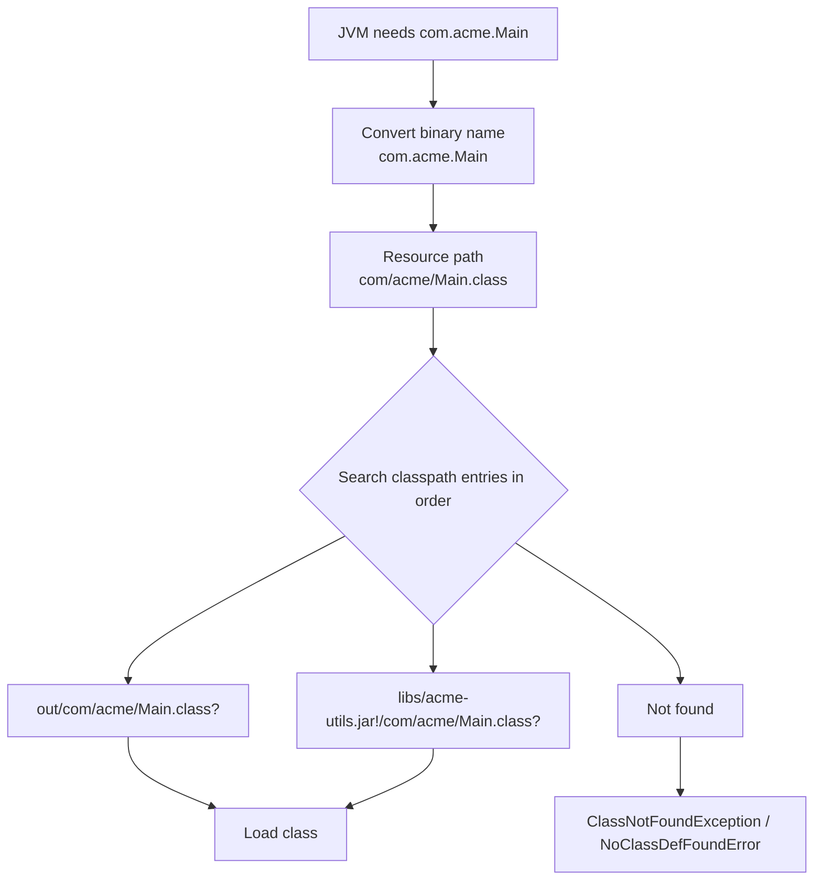
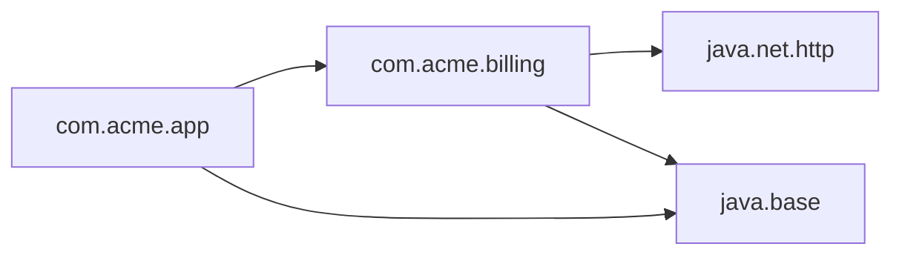
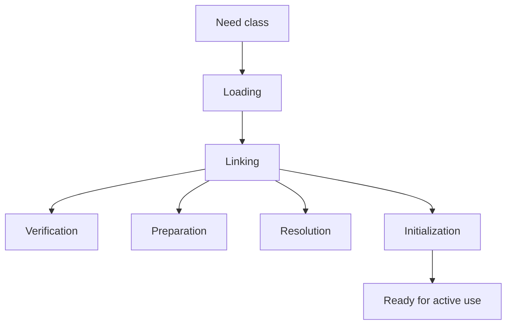

# Part 003 — Dari `.java` ke Running Program: Source, Bytecode, Classpath, Module Path, dan Runtime

> Seri: `modern-java-8-to-25`  
> File: `learn-modern-java-8-to-25-part-003-source-to-runtime.mdx`  
> Posisi: Part 003 dari 035  
> Target fase Kaufman: **menghilangkan friction teknis** dan membangun **feedback loop paling pendek** antara kode, compiler, bytecode, dan runtime.

---

## 1. Kenapa Part Ini Penting

Banyak engineer bisa menulis Java, tetapi tidak benar-benar punya model mental tentang apa yang terjadi setelah tombol **Run** ditekan.

Akibatnya, ketika terjadi error seperti ini:

```text
Error: Could not find or load main class com.acme.Main
Caused by: java.lang.ClassNotFoundException: com.acme.Main
```

atau ini:

```text
Exception in thread "main" java.lang.NoClassDefFoundError: com/acme/BillingService
```

atau ini:

```text
java.lang.UnsupportedClassVersionError: com/acme/Main has been compiled by a more recent version of the Java Runtime
```

mereka menebak-nebak.

Part ini membangun mental model agar kita bisa menjawab dengan jelas:

- Apa yang dilakukan `javac`?
- Apa isi file `.class`?
- Apa bedanya source code, bytecode, dan runtime object?
- Apa bedanya classpath dan module path?
- Kenapa package harus cocok dengan folder?
- Kenapa error bisa muncul saat compile, start-up, class loading, linking, atau runtime?
- Apa yang sebenarnya terjadi saat JVM menjalankan `main`?
- Bagaimana cara membaca bytecode minimal dengan `javap`?
- Bagaimana cara membuat JAR sederhana tanpa Maven/Gradle?

Dalam kerangka **The First 20 Hours**, ini adalah bagian yang mengurangi friction terbesar. Engineer yang tidak memahami pipeline source-to-runtime akan selalu bergantung pada IDE/build tool. Engineer yang paham pipeline ini bisa debug dari command line, CI, container, dan production runtime.

---

## 2. Target Skill Setelah Part Ini

Setelah menyelesaikan part ini, kamu harus mampu:

1. Menjelaskan perjalanan file `.java` menjadi program berjalan.
2. Menggunakan `javac`, `java`, `jar`, `javap`, dan `jdeps` secara dasar.
3. Membedakan compile-time error, class loading error, linking error, initialization error, dan runtime exception.
4. Menjelaskan classpath sebagai daftar lokasi pencarian class.
5. Menjelaskan module path sebagai graph modul dengan boundary yang lebih eksplisit.
6. Membuat dan menjalankan JAR sederhana.
7. Membaca bytecode sederhana untuk memahami bahwa Java bukan langsung dieksekusi sebagai source code.
8. Mendiagnosis error umum seperti `ClassNotFoundException`, `NoClassDefFoundError`, dan `UnsupportedClassVersionError`.
9. Menjelaskan static initialization dan risikonya.
10. Memahami kapan memakai command line langsung, kapan memakai Maven/Gradle, dan kapan IDE menyembunyikan detail penting.

---

## 3. Mental Model Utama

Java berjalan melalui pipeline ini:

```mermaid id="source-runtime-pipeline"
flowchart LR
    A[Source Code<br/>.java] --> B[javac<br/>Java Compiler]
    B --> C[Bytecode<br/>.class]
    C --> D[Packaging<br/>JAR / exploded classes]
    D --> E[Runtime Discovery<br/>classpath / module path]
    E --> F[Class Loading]
    F --> G[Linking<br/>verify / prepare / resolve]
    G --> H[Initialization<br/>static fields & static blocks]
    H --> I[Execution<br/>main / methods / objects]
    I --> J[JIT / GC / Runtime Services]
```



Ringkasnya:

| Tahap | Pertanyaan yang Dijawab |
|---|---|
| Source | Apa yang ditulis developer? |
| Compile | Apakah source valid menurut Java Language Specification? |
| Bytecode | Instruksi portabel apa yang dihasilkan untuk JVM? |
| Packaging | Bagaimana class dan resource dikumpulkan? |
| Discovery | Di mana runtime mencari class? |
| Loading | Bagaimana class ditemukan dan dibawa ke JVM? |
| Linking | Apakah class valid dan siap dieksekusi? |
| Initialization | Apa efek static sebelum object dibuat? |
| Execution | Method mana yang dipanggil dan object apa yang dibuat? |

Kesalahan besar dalam belajar Java adalah menyatukan semua tahap ini menjadi satu konsep bernama “run”. Padahal masalah berbeda terjadi di tahap berbeda.

---

## 4. Setup Folder Minimal

Buat struktur berikut:

```text
source-to-runtime-lab/
  src/
    com/
      acme/
        Main.java
        Money.java
  out/
```

Isi `Money.java`:

```java
package com.acme;

public record Money(String currency, long cents) {
    public Money {
        if (currency == null || currency.isBlank()) {
            throw new IllegalArgumentException("currency is required");
        }
        if (cents < 0) {
            throw new IllegalArgumentException("cents must be non-negative");
        }
    }

    public Money add(Money other) {
        if (!currency.equals(other.currency)) {
            throw new IllegalArgumentException("currency mismatch");
        }
        return new Money(currency, cents + other.cents);
    }
}
```

Isi `Main.java`:

```java
package com.acme;

public class Main {
    public static void main(String[] args) {
        Money first = new Money("IDR", 10_000);
        Money second = new Money("IDR", 5_000);
        System.out.println(first.add(second));
    }
}
```

Compile:

```bash
javac -d out src/com/acme/*.java
```

Run:

```bash
java -cp out com.acme.Main
```

Output:

```text
Money[currency=IDR, cents=15000]
```

Ini adalah loop Java paling fundamental:

```text
write .java -> javac -> .class -> java -cp -> running program
```

Kalau kamu hanya bisa menjalankan Java dari IDE, skill source-to-runtime belum terbentuk.

---

## 5. Apa Itu `.java`?

File `.java` adalah source code yang mengikuti grammar Java Language Specification.

Dalam Java klasik, file `.java` biasanya berisi satu top-level public class/record/interface/enum yang namanya sama dengan nama file.

Contoh:

```java
public class Main {
}
```

harus berada di:

```text
Main.java
```

Jika class berada dalam package:

```java
package com.acme;

public class Main {
}
```

maka secara konvensi dan secara praktis harus berada di folder:

```text
com/acme/Main.java
```

Package bukan sekadar folder. Package adalah namespace Java. Tetapi build tool dan compiler menggunakan folder untuk menemukan file secara konsisten.

### Kesalahan Umum

```java
package com.acme;

public class Main {}
```

namun disimpan sebagai:

```text
src/Main.java
```

Lalu compile/run dilakukan secara asal. Ini bisa menghasilkan kebingungan karena binary name class tetap:

```text
com.acme.Main
```

bukan:

```text
Main
```

Nama yang dipakai runtime adalah **fully qualified class name**.

---

## 6. `javac`: Compiler Java

`javac` menerima source code Java dan menghasilkan bytecode `.class`.

Command:

```bash
javac -d out src/com/acme/*.java
```

Artinya:

| Bagian | Makna |
|---|---|
| `javac` | jalankan Java compiler |
| `-d out` | taruh hasil `.class` ke folder `out` |
| `src/com/acme/*.java` | compile semua source Java tersebut |

Setelah compile:

```text
out/
  com/
    acme/
      Main.class
      Money.class
```

Folder output mengikuti package.

### Compile-Time Error

Compile-time error muncul sebelum program bisa dijalankan.

Contoh:

```java
Money money = new Money("IDR", "1000");
```

Compiler akan menolak karena constructor `Money(String, long)` tidak cocok dengan argumen `String, String`.

Error seperti ini bagus. Compiler mencegah bug masuk runtime.

### Compile-Time Tidak Menjamin Runtime Aman

Kode ini bisa compile:

```java
Money money = new Money("IDR", -1000);
```

Tetapi gagal saat runtime karena invariant record constructor menolak `cents < 0`.

Itulah batas compiler: compiler memvalidasi struktur bahasa dan type, bukan semua aturan bisnis.

---

## 7. `.class`: Bytecode, Bukan Native Machine Code

File `.class` berisi bytecode untuk JVM.

Bytecode bukan source code dan bukan native machine code x86/ARM. Bytecode adalah instruksi virtual yang distandarkan oleh JVM Specification.

Lihat isi bytecode:

```bash
javap -classpath out com.acme.Main
```

Output sederhana:

```text
Compiled from "Main.java"
public class com.acme.Main {
  public com.acme.Main();
  public static void main(java.lang.String[]);
}
```

Lihat bytecode lebih detail:

```bash
javap -classpath out -c com.acme.Main
```

Contoh output disederhanakan:

```text
public static void main(java.lang.String[]);
  Code:
     0: new           #7    // class com/acme/Money
     3: dup
     4: ldc           #9    // String IDR
     6: ldc2_w        #11   // long 10000l
     9: invokespecial #13   // Method com/acme/Money."<init>":(Ljava/lang/String;J)V
    12: astore_1
    ...
```

Yang penting bukan menghafal setiap instruksi, tetapi memahami bahwa:

1. Java source dikompilasi menjadi instruksi level JVM.
2. JVM menjalankan bytecode tersebut.
3. JIT compiler dapat mengoptimasi bytecode menjadi native machine code saat runtime.
4. Banyak error runtime terkait class discovery/resolution terjadi karena JVM bekerja pada binary class, bukan source file.

---

## 8. JDK, JRE, JVM: Jangan Disamakan

| Istilah | Makna Praktis |
|---|---|
| JVM | Mesin virtual yang menjalankan bytecode |
| JRE | Runtime environment untuk menjalankan aplikasi Java |
| JDK | Development kit: compiler, runtime, tools, library, docs |

Dalam praktik modern, developer biasanya menginstal JDK. JDK mencakup tool penting seperti:

- `java`
- `javac`
- `jar`
- `javap`
- `jdeps`
- `jlink`
- `jshell`
- `jcmd`
- `jfr`
- `jpackage`

Mental model:



Kalau mesin production hanya perlu menjalankan aplikasi, secara konsep dia butuh runtime. Tetapi dalam deployment modern, image aplikasi sering memakai JDK/JRE distribution atau custom runtime image hasil `jlink`.

---

## 9. `java`: Launcher Runtime

`java` menjalankan aplikasi.

Untuk class biasa:

```bash
java -cp out com.acme.Main
```

Artinya:

| Bagian | Makna |
|---|---|
| `java` | jalankan Java launcher |
| `-cp out` | pakai folder `out` sebagai classpath |
| `com.acme.Main` | cari class dengan binary name ini |

Runtime tidak mencari `Main.java`. Runtime mencari `com/acme/Main.class` di classpath.

Kalau kamu menjalankan:

```bash
java -cp out Main
```

akan gagal karena class sebenarnya bernama:

```text
com.acme.Main
```

Bukan:

```text
Main
```

---

## 10. Classpath: Daftar Lokasi Pencarian Class

Classpath adalah daftar lokasi tempat JVM mencari class dan resource.

Lokasi bisa berupa:

- folder berisi `.class`
- file `.jar`
- beberapa path dipisahkan separator OS

Contoh Linux/macOS:

```bash
java -cp out:libs/acme-utils.jar com.acme.Main
```

Contoh Windows:

```powershell
java -cp out;libs/acme-utils.jar com.acme.Main
```

Mental model:



Classpath adalah salah satu sumber bug paling klasik di Java.

### Classpath Ordering

Jika dua JAR berisi class dengan nama binary sama:

```text
libs/v1/acme-core.jar!/com/acme/Money.class
libs/v2/acme-core.jar!/com/acme/Money.class
```

classpath ordering menentukan mana yang ditemukan dulu.

Ini bisa menghasilkan bug halus:

- local jalan, CI gagal
- CI jalan, container gagal
- test jalan, production gagal
- method ada saat compile, tetapi hilang saat runtime

### Classpath Tidak Punya Strong Boundary

Classpath tradisional tidak punya konsep eksplisit tentang:

- modul mana membaca modul mana
- package mana yang diekspor
- package mana yang dibuka untuk reflection
- dependency graph valid atau tidak

Semua entry pada classpath masuk ke satu dunia besar yang disebut **unnamed module** pada era JPMS.

Itu alasan Java 9 memperkenalkan module system.

---

## 11. JAR: Packaging Class dan Resource

JAR adalah ZIP dengan metadata Java.

Buat JAR dari hasil compile:

```bash
jar --create --file app.jar -C out .
```

Lihat isi JAR:

```bash
jar --list --file app.jar
```

Output:

```text
META-INF/
META-INF/MANIFEST.MF
com/
com/acme/
com/acme/Main.class
com/acme/Money.class
```

Run dengan classpath JAR:

```bash
java -cp app.jar com.acme.Main
```

### Executable JAR

Agar bisa menjalankan:

```bash
java -jar app.jar
```

JAR perlu manifest dengan `Main-Class`.

Buat file `manifest.mf`:

```text
Main-Class: com.acme.Main
```

Perhatikan: manifest biasanya butuh newline di akhir file.

Buat JAR:

```bash
jar --create --file app.jar --manifest manifest.mf -C out .
```

Run:

```bash
java -jar app.jar
```

### `java -jar` dan Classpath

Saat memakai `java -jar app.jar`, option `-cp` biasanya diabaikan untuk mencari class aplikasi utama. Dependency harus disediakan melalui mekanisme lain, misalnya `Class-Path` di manifest atau launcher script.

Dalam aplikasi modern, Maven/Gradle sering membuat:

- thin JAR + dependency folder
- fat/uber JAR
- layered JAR
- container image
- custom runtime image

Tetapi semua itu tetap berdiri di atas konsep class discovery yang sama.

---

## 12. Module Path: Graph Dependensi yang Lebih Eksplisit

Java 9 memperkenalkan Java Platform Module System atau JPMS.

Classpath bertanya:

> “Di mana class ini bisa ditemukan?”

Module path bertanya:

> “Modul apa yang tersedia, modul mana membaca modul mana, dan package mana yang diekspor?”

Contoh module descriptor:

```java
module com.acme.billing {
    exports com.acme.billing.api;
    requires java.net.http;
}
```

Maknanya:

- Modul bernama `com.acme.billing`.
- Package `com.acme.billing.api` boleh dipakai modul lain.
- Modul ini bergantung pada `java.net.http`.

Diagram:



### Classpath vs Module Path

| Aspek | Classpath | Module Path |
|---|---|---|
| Unit discovery | class/resource | module |
| Dependency graph | implisit | eksplisit |
| Encapsulation | lemah | kuat |
| Split package | bisa terjadi | dibatasi |
| Cocok untuk | legacy/simple app | library/platform boundary yang jelas |

Kita akan membahas JPMS khusus di Part 012. Untuk sekarang, pahami bahwa module path bukan “classpath versi baru”. Ia adalah model boundary berbeda.

---

## 13. Package dan Visibility

Package memberi namespace dan mempengaruhi visibility.

Java punya visibility:

| Modifier | Visible Dari |
|---|---|
| `public` | semua package/modul yang bisa membaca/export |
| `protected` | package yang sama + subclass |
| no modifier | package-private, hanya package yang sama |
| `private` | class yang sama |

Contoh:

```java
package com.acme.billing;

class BillingCalculator {
    long calculate(long amount) {
        return amount;
    }
}
```

Karena tidak `public`, class ini package-private. Bagus untuk implementation detail.

Top-tier Java engineer banyak memakai package-private untuk menjaga API surface kecil.

### API Surface Rule

Jangan jadikan semuanya `public`.

Setiap `public` type adalah kontrak jangka panjang. Kontrak jangka panjang mahal karena:

- sulit dihapus
- sulit diubah
- perlu compatibility thinking
- berpotensi dipakai pihak lain secara tak terduga

Default mental model:

```text
private first -> package-private if needed -> public only as explicit API
```

---

## 14. Main Method: Entry Point Program Java

Bentuk klasik:

```java
public class Main {
    public static void main(String[] args) {
        System.out.println("Hello");
    }
}
```

Kenapa seperti itu?

| Bagian | Makna |
|---|---|
| `public` | runtime bisa mengakses dari luar class |
| `static` | tidak perlu membuat object dulu |
| `void` | tidak mengembalikan value |
| `main` | nama entry point konvensional |
| `String[] args` | argumen command line |

Run:

```bash
java Main a b c
```

`args` berisi:

```text
["a", "b", "c"]
```

### Java 25: Compact Source Files dan Instance Main Methods

Pada Java 25, compact source files dan instance main methods difinalisasi melalui JEP 512. Ini mengurangi ceremony untuk program kecil dan pembelajaran awal.

Contoh compact source file:

```java
void main() {
    IO.println("Hello from Java 25");
}
```

Ide utamanya bukan membuat dialek Java baru, tetapi memberi on-ramp lebih sederhana. Untuk engineering production, bentuk klasik dengan package, class, build tool, test, dan modul tetap penting.

Gunakan compact source untuk:

- eksperimen kecil
- scratch file
- teaching
- CLI sangat kecil
- demonstrasi konsep

Jangan jadikan compact source sebagai struktur utama sistem production besar.

---

## 15. Class Loading: Ketika Class Dibutuhkan

JVM tidak selalu memuat semua class saat program mulai. Class dapat dimuat saat pertama kali dibutuhkan.

Secara spesifikasi, JVM melakukan:

1. Loading
2. Linking
3. Initialization

Loading berarti menemukan binary representation class/interface dan membuat representasi class di JVM.

Linking biasanya terdiri dari:

1. Verification
2. Preparation
3. Resolution

Initialization menjalankan static initialization.



### Loading

JVM mencari `.class` sesuai binary name.

Contoh binary name:

```text
com.acme.Main
```

Resource path:

```text
com/acme/Main.class
```

Jika tidak ditemukan:

- `ClassNotFoundException` sering muncul saat loading eksplisit, misalnya `Class.forName(...)`.
- `NoClassDefFoundError` sering muncul saat class yang sebelumnya diketahui compiler ternyata tidak tersedia saat runtime.

### Linking

Pada linking, JVM memastikan class valid dan siap dipakai.

Contoh masalah linking:

- bytecode invalid
- method/field yang direferensikan tidak ada
- class version tidak cocok
- dependency binary incompatible

### Initialization

Initialization menjalankan:

- static field initializer
- static block

Contoh:

```java
public class Config {
    static final String ENV;

    static {
        ENV = System.getenv("APP_ENV");
        if (ENV == null) {
            throw new IllegalStateException("APP_ENV is required");
        }
    }
}
```

Jika class `Config` dipakai dan `APP_ENV` tidak ada, initialization gagal.

Ini bisa muncul sebagai:

```text
ExceptionInInitializerError
```

Static initialization adalah tempat yang berbahaya untuk operasi yang bisa gagal, lambat, blocking, atau membutuhkan dependency eksternal.

---

## 16. Static Initialization Order

Perhatikan kode ini:

```java
public class InitOrder {
    static int a = value("a", 1);

    static {
        value("static block", 0);
    }

    static int b = value("b", 2);

    static int value(String name, int result) {
        System.out.println(name);
        return result;
    }

    public static void main(String[] args) {
        System.out.println("main");
    }
}
```

Output:

```text
a
static block
b
main
```

Static members dieksekusi sesuai urutan deklarasi textual.

Masalah production yang sering muncul:

- static field membaca config terlalu awal
- static field membuat thread pool sebelum observability siap
- static block membuka koneksi database
- static singleton menyembunyikan dependency
- static initializer gagal dan class menjadi unusable

Rule praktis:

```text
Static initialization should be deterministic, cheap, local, and side-effect-light.
```

---

## 17. Constructor vs Static Initialization vs Instance Initialization

Contoh:

```java
public class LifecycleDemo {
    static String staticValue = log("static field");

    static {
        log("static block");
    }

    String instanceValue = log("instance field");

    {
        log("instance block");
    }

    public LifecycleDemo() {
        log("constructor");
    }

    static String log(String message) {
        System.out.println(message);
        return message;
    }

    public static void main(String[] args) {
        new LifecycleDemo();
        new LifecycleDemo();
    }
}
```

Output:

```text
static field
static block
instance field
instance block
constructor
instance field
instance block
constructor
```

Static initialization berjalan sekali per class loader. Instance initialization berjalan setiap object dibuat.

---

## 18. Error Taxonomy: Compile, Load, Link, Init, Runtime

Top-tier debugging dimulai dengan klasifikasi error.

| Error | Tahap | Contoh Penyebab |
|---|---|---|
| Syntax/type error | Compile | source tidak valid |
| `ClassNotFoundException` | Loading eksplisit | class tidak ada di classpath/module path |
| `NoClassDefFoundError` | Loading/resolution | class ada saat compile, hilang saat runtime |
| `UnsupportedClassVersionError` | Linking | compile dengan JDK lebih baru, run dengan JDK lebih lama |
| `NoSuchMethodError` | Linking/resolution | dependency runtime beda versi dari compile-time |
| `ExceptionInInitializerError` | Initialization | static initializer throw exception |
| `NullPointerException` | Runtime execution | reference null dipakai |
| `IllegalArgumentException` | Runtime execution | contract input dilanggar |

### `ClassNotFoundException` vs `NoClassDefFoundError`

`ClassNotFoundException` biasanya checked exception dari mekanisme loading eksplisit:

```java
Class.forName("com.acme.Plugin");
```

`NoClassDefFoundError` biasanya error saat JVM mencoba memakai class yang dibutuhkan bytecode tetapi tidak tersedia saat runtime.

Contoh real-world:

- compile memakai library versi A
- runtime container tidak membawa library tersebut
- fat JAR packaging salah
- dependency scope di Maven salah, misalnya `provided` padahal runtime butuh
- shading menghapus/merelokasi class

### `NoSuchMethodError`

Ini sering lebih berbahaya karena class ditemukan, tetapi method yang diharapkan tidak ada.

Biasanya karena versi dependency tidak sama:

```text
Compile-time: acme-lib 2.0 has method validate(String)
Runtime:      acme-lib 1.5 does not have validate(String)
```

Compiler sudah berhasil karena melihat versi 2.0. Runtime gagal karena yang tersedia versi 1.5.

---

## 19. Java Version dan Class File Version

Java compiler menghasilkan `.class` dengan version tertentu.

Jika kamu compile dengan JDK baru lalu run dengan JVM lama, bisa muncul:

```text
UnsupportedClassVersionError
```

Contoh:

```bash
javac --release 25 -d out src/com/acme/Main.java
java8 -cp out com.acme.Main
```

JVM Java 8 tidak bisa menjalankan class file Java 25.

### `--release`

Gunakan `--release` untuk menargetkan API dan class file versi tertentu.

Contoh compile agar compatible dengan Java 17:

```bash
javac --release 17 -d out src/com/acme/*.java
```

Ini lebih aman daripada hanya memakai `-source` dan `-target`, karena `--release` juga membatasi API platform yang tersedia sesuai target release.

Rule praktis:

```text
For library/application compatibility, prefer --release over source/target when compiling for older Java versions.
```

---

## 20. `javap`: Membaca Kontrak Binary

`javap` berguna untuk melihat public/protected API binary dari class.

Contoh:

```bash
javap -classpath out com.acme.Money
```

Output disederhanakan untuk record:

```text
public final class com.acme.Money extends java.lang.Record {
  public com.acme.Money(java.lang.String, long);
  public com.acme.Money add(com.acme.Money);
  public final java.lang.String toString();
  public final int hashCode();
  public final boolean equals(java.lang.Object);
  public java.lang.String currency();
  public long cents();
}
```

Record menghasilkan beberapa method otomatis:

- constructor canonical
- accessor per component
- `equals`
- `hashCode`
- `toString`

Ini penting untuk API design. Walaupun source terlihat ringkas, binary surface tetap nyata.

### `javap -v`

Untuk detail:

```bash
javap -classpath out -v com.acme.Money
```

Gunakan saat perlu melihat:

- major version
- constant pool
- flags
- method descriptors
- attributes
- record metadata

Tidak perlu menghafal semua output. Cukup tahu tool ini ada dan kapan dipakai.

---

## 21. `jdeps`: Melihat Dependensi

`jdeps` menganalisis dependensi class/JAR.

Contoh:

```bash
jdeps --class-path app.jar app.jar
```

Atau:

```bash
jdeps --print-module-deps app.jar
```

Manfaat:

- melihat package/module yang dipakai
- persiapan migration ke JPMS
- mencari dependency ke internal JDK API
- membantu membuat custom runtime dengan `jlink`

Di Part 012 dan Part 033, `jdeps` akan dipakai lebih serius untuk migration Java 8 ke Java modern.

---

## 22. Resource Loading: Bukan Hanya Class

Classpath juga dipakai untuk resource.

Contoh file:

```text
src/main/resources/app.properties
```

Di runtime, bisa dibaca:

```java
try (var input = Main.class.getResourceAsStream("/app.properties")) {
    if (input == null) {
        throw new IllegalStateException("resource not found");
    }
    var properties = new java.util.Properties();
    properties.load(input);
    System.out.println(properties);
}
```

Perhatikan `/app.properties` berarti absolute dari root classpath.

Tanpa slash:

```java
Main.class.getResourceAsStream("app.properties")
```

maka JVM mencari relatif terhadap package `com/acme/`.

Bug resource loading sering terjadi saat:

- file ada di source tree tapi tidak masuk build output
- path relatif salah
- resource ada di JAR berbeda
- case-sensitive filesystem berbeda antara dev dan Linux production
- class loader berbeda di app server/plugin system

---

## 23. IDE Menyembunyikan Banyak Hal

IDE sangat berguna, tetapi juga bisa membuat mental model lemah.

IDE biasanya otomatis:

- menentukan source root
- menentukan output folder
- menyusun classpath
- menambahkan dependency
- menjalankan test runner
- memilih JDK
- mengatur working directory
- mengisi environment variables

Jika program hanya jalan di IDE tapi gagal di terminal, berarti konfigurasi runtime belum dipahami.

Checklist ketika “jalan di IDE, gagal di terminal”:

1. JDK sama?
2. Working directory sama?
3. Classpath sama?
4. Environment variables sama?
5. Resource masuk output folder?
6. Dependency runtime tersedia?
7. VM options sama?
8. Program arguments sama?
9. Current module/classpath mode sama?
10. Versi library sama?

---

## 24. Production Relevance

Konsep part ini muncul langsung di production.

### Container Startup Failure

Error:

```text
Error: Could not find or load main class com.acme.Main
```

Kemungkinan:

- Dockerfile salah copy JAR
- `ENTRYPOINT` salah nama class
- manifest tidak punya `Main-Class`
- JAR bukan executable JAR
- working directory salah

### Dependency Version Conflict

Error:

```text
java.lang.NoSuchMethodError: 'void com.fasterxml.jackson.databind.ObjectMapper.findAndRegisterModules()'
```

Kemungkinan:

- runtime membawa Jackson versi lama
- dependency management salah
- transitive dependency override
- fat JAR shading salah

### Java Version Mismatch

Error:

```text
UnsupportedClassVersionError
```

Kemungkinan:

- build memakai JDK 25
- runtime container memakai JDK 17
- Maven/Gradle toolchain tidak dikunci
- base image tidak sesuai

### Resource Missing

Error:

```text
java.lang.IllegalStateException: resource not found
```

Kemungkinan:

- resource tidak masuk JAR
- path salah
- test resource ada, main resource tidak ada
- packaging plugin salah

---

## 25. Practice: 90 Menit Source-to-Runtime Lab

### Latihan 1 — Compile Manual

Buat project manual tanpa Maven/Gradle.

Target:

```bash
javac -d out src/com/acme/*.java
java -cp out com.acme.Main
```

Kriteria selesai:

- bisa compile
- bisa run
- bisa menjelaskan folder output

### Latihan 2 — Baca Bytecode

Jalankan:

```bash
javap -classpath out -c com.acme.Main
javap -classpath out com.acme.Money
```

Tulis jawaban:

- method apa saja yang ada di `Money.class`?
- apa bedanya source record dengan binary API record?
- instruksi bytecode mana yang memanggil constructor?

### Latihan 3 — Buat JAR

```bash
jar --create --file app.jar -C out .
java -cp app.jar com.acme.Main
```

Lalu buat executable JAR:

```bash
printf "Main-Class: com.acme.Main\n" > manifest.mf
jar --create --file app.jar --manifest manifest.mf -C out .
java -jar app.jar
```

### Latihan 4 — Pecahkan Error Sengaja

Ubah command menjadi:

```bash
java -cp out Main
```

Amati error.

Lalu hapus `Money.class`:

```bash
rm out/com/acme/Money.class
java -cp out com.acme.Main
```

Amati error.

Tulis klasifikasi:

- error terjadi di tahap apa?
- apakah compile-time, loading, linking, initialization, atau runtime?

### Latihan 5 — Static Initialization Failure

Buat:

```java
package com.acme;

public class BrokenConfig {
    static final String APP_ENV = require("APP_ENV");

    static String require(String key) {
        String value = System.getenv(key);
        if (value == null) {
            throw new IllegalStateException(key + " is required");
        }
        return value;
    }
}
```

Pakai di `main`:

```java
System.out.println(BrokenConfig.APP_ENV);
```

Run tanpa `APP_ENV`.

Tulis:

- error apa yang muncul?
- kapan class `BrokenConfig` diinisialisasi?
- kenapa static initialization seperti ini berisiko?

---

## 26. Review Checklist

Sebelum lanjut Part 004, pastikan kamu bisa menjawab:

- Apa bedanya `.java` dan `.class`?
- Apa fungsi `javac -d out`?
- Apa yang dicari JVM saat menjalankan `java -cp out com.acme.Main`?
- Kenapa nama class harus fully qualified?
- Apa itu classpath?
- Apa itu JAR?
- Apa bedanya `java -cp app.jar com.acme.Main` dan `java -jar app.jar`?
- Apa itu module path secara konseptual?
- Apa yang terjadi pada loading, linking, initialization?
- Kenapa static initializer sebaiknya sederhana?
- Bagaimana membedakan `ClassNotFoundException` dan `NoClassDefFoundError`?
- Kapan memakai `javap`?
- Kapan memakai `jdeps`?
- Kenapa `--release` penting?

---

## 27. Mental Model Final

Simpan model ini:

```text
Java source is not the program that runs.
The compiled class is not discovered magically.
Runtime behavior depends on class discovery, binary compatibility, initialization, and execution context.
```

Atau dalam bentuk praktis:

```text
.java -> javac -> .class -> classpath/module path -> class loading -> linking -> initialization -> execution
```

Engineer yang menguasai pipeline ini bisa debug Java di luar IDE, di CI, di container, di build pipeline, dan di production incident.

---

## 28. Kesalahan Berpikir yang Harus Dihindari

### 1. “Kalau compile, pasti jalan”

Salah. Compile hanya membuktikan source valid terhadap dependency compile-time. Runtime punya dependency, classpath, version, config, resource, dan environment sendiri.

### 2. “Classpath cuma folder”

Salah. Classpath adalah search space yang bisa berisi folder dan JAR. Ordering classpath bisa mengubah behavior.

### 3. “JAR itu executable by default”

Salah. JAR hanya archive. Agar bisa `java -jar`, ia butuh manifest yang benar atau format launcher tertentu.

### 4. “Static itu aman karena simple”

Salah. Static state sering menjadi sumber coupling, initialization failure, test pollution, dan hidden dependency.

### 5. “Module path adalah classpath baru”

Tidak tepat. Module path membawa graph dependensi dan encapsulation model yang berbeda.

---

## 29. Referensi Resmi dan Lanjutan

- Java SE 25 Specifications: https://docs.oracle.com/javase/specs/
- Java Virtual Machine Specification, Java SE 25: https://docs.oracle.com/javase/specs/jvms/se25/html/index.html
- Java Language Specification, Java SE 25: https://docs.oracle.com/javase/specs/jls/se25/html/index.html
- OpenJDK JDK 25 Project: https://openjdk.org/projects/jdk/25/
- JEP 512 — Compact Source Files and Instance Main Methods: https://openjdk.org/jeps/512
- Oracle JDK Tools Documentation: https://docs.oracle.com/en/java/javase/25/docs/specs/man/index.html

---

## 30. Apa Berikutnya

Part 004 akan masuk ke model yang paling menentukan kualitas desain Java: **type system dan object model**.

Kita akan membahas:

- class
- object identity
- primitive vs reference
- interface
- abstract class
- inheritance
- composition
- records
- sealed hierarchy
- enum
- equality
- mutability
- nullability

Kalau Part 003 menjelaskan bagaimana Java berjalan, Part 004 menjelaskan bagaimana Java membentuk model dunia.
