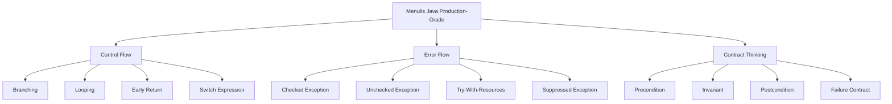
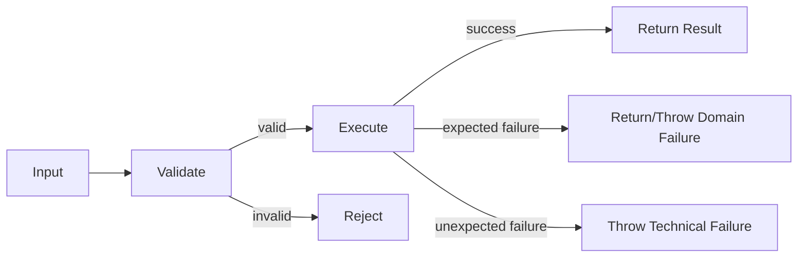
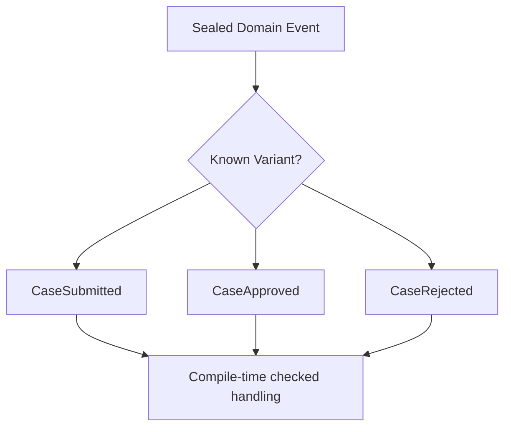
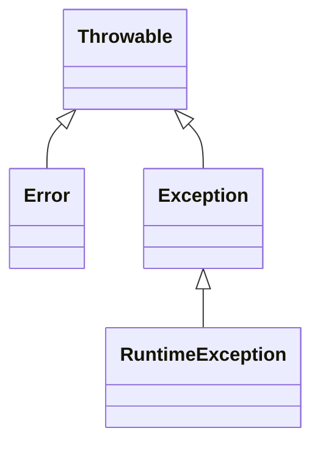
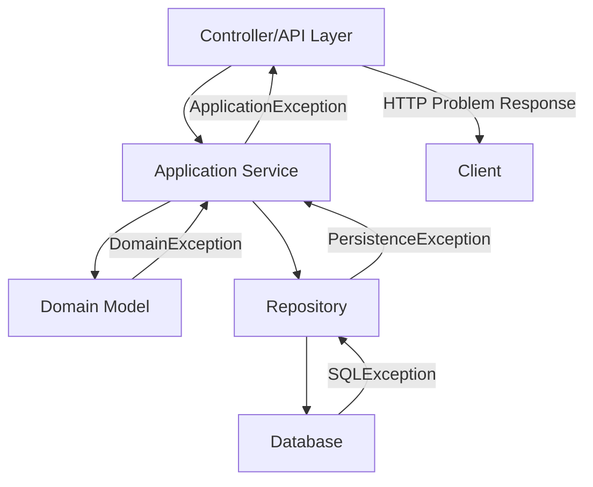
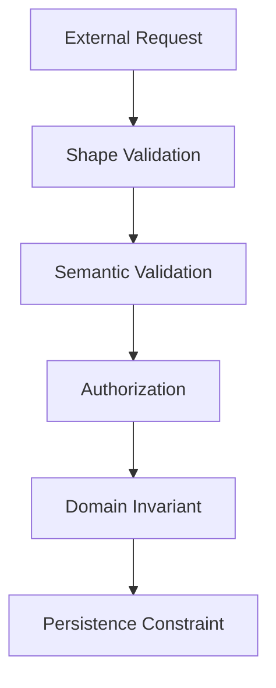
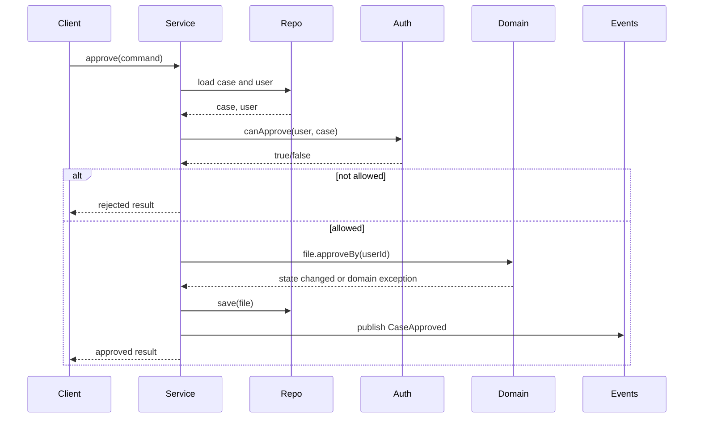

# Modern Java 8–25 Part 005 — Control Flow, Error Flow, dan Contract Thinking

> **Posisi dalam seri:** Phase 1 — Skill Map, Friction Removal, dan Execution Model  
> **Target utama:** mampu mendesain alur eksekusi dan alur kegagalan Java yang eksplisit, mudah diuji, dan production-ready.  
> **Framework Kaufman:** part ini adalah sub-skill inti: *mengendalikan flow program dan mendesain kontrak kegagalan*.

---

## 1. Kenapa Part Ini Penting

Banyak engineer belajar control flow sebagai syntax:

```java
if (condition) {
    // ...
} else {
    // ...
}
```

Itu benar, tetapi tidak cukup.

Dalam sistem production, control flow bukan hanya soal memilih cabang kode. Control flow adalah cara kita menyatakan:

- kapan sebuah operasi boleh dilanjutkan,
- kapan harus berhenti,
- kapan sebuah kondisi dianggap invalid,
- kapan kegagalan harus di-retry,
- kapan kegagalan harus dikembalikan ke caller,
- kapan failure harus menjadi domain event,
- kapan failure berarti bug internal,
- kapan failure berarti input user salah,
- kapan failure berarti dependency eksternal sedang rusak.

Skill yang ingin dibangun di part ini adalah **flow literacy**: kemampuan membaca, menulis, dan mengevaluasi alur program Java sebagai jaringan keputusan, kontrak, dan failure boundary.

Dalam kerangka Josh Kaufman, ini adalah bagian dari **deconstruct the skill**. Kita memecah “menulis Java yang baik” menjadi sub-skill yang lebih spesifik:



Jika flow salah, sistem akan tetap compile. Tetapi bug-nya muncul sebagai:

- validasi yang tidak konsisten,
- exception yang tertelan,
- transaksi setengah jalan,
- retry terhadap operasi non-idempotent,
- resource leak,
- error message yang misleading,
- branching kompleks yang sulit diuji,
- domain state yang tidak mungkin tetapi tetap bisa terjadi.

Part ini mengajarkan cara melihat itu sejak desain kode, bukan setelah incident.

---

## 2. Mental Model: Normal Flow vs Error Flow

Setiap operasi punya dua jalur utama:



Kita bisa membagi flow menjadi:

| Flow | Pertanyaan utama | Contoh |
|---|---|---|
| Normal flow | Apa yang terjadi jika semua precondition terpenuhi? | order dibuat, file dibaca, payment diproses |
| Expected failure flow | Kegagalan apa yang memang bagian dari domain? | saldo tidak cukup, order sudah closed, email invalid |
| Technical failure flow | Kegagalan apa yang berasal dari runtime/dependency? | DB down, timeout, disk full, permission denied |
| Bug flow | Kegagalan apa yang menunjukkan program melanggar invariant sendiri? | `NullPointerException`, impossible state, duplicate id internal |

Kesalahan umum: semua failure diperlakukan sama.

Contoh buruk:

```java
try {
    paymentService.charge(order);
} catch (Exception e) {
    return false;
}
```

Kode ini menyembunyikan informasi penting:

- Apakah kartu ditolak?
- Apakah payment gateway timeout?
- Apakah order null?
- Apakah terjadi bug serialization?
- Apakah charge sebenarnya sukses tetapi response gagal diterima?

Dalam sistem nyata, `false` terlalu miskin sebagai model error.

Versi lebih baik:

```java
public PaymentResult charge(Order order) {
    requireChargeable(order);

    try {
        GatewayResponse response = gateway.charge(order.paymentRequest());
        return PaymentResult.approved(response.transactionId());
    } catch (CardDeclinedException e) {
        return PaymentResult.declined(e.reasonCode());
    } catch (GatewayTimeoutException e) {
        throw new PaymentUnavailableException("Payment gateway timed out", e);
    }
}
```

Di sini:

- input invalid ditolak lebih awal,
- domain failure menjadi result,
- infrastructure failure tetap exception,
- cause tidak hilang.

---

## 3. Statement vs Expression

Di Java, banyak construct tradisional adalah statement.

Statement melakukan aksi:

```java
int score;

if (passed) {
    score = 100;
} else {
    score = 0;
}
```

Expression menghasilkan nilai:

```java
int score = passed ? 100 : 0;
```

Java modern memperluas gaya expression, terutama melalui **switch expression**.

```java
String label = switch (status) {
    case NEW -> "New";
    case IN_PROGRESS -> "In Progress";
    case DONE -> "Done";
    case CANCELLED -> "Cancelled";
};
```

Perbedaan mental model:

| Bentuk | Fokus | Risiko |
|---|---|---|
| Statement | melakukan langkah | mutable variable, branch lupa assign |
| Expression | menghasilkan nilai | expression terlalu padat jika logic kompleks |

Expression bagus ketika operasi memang ingin menjawab pertanyaan tunggal:

- status ini label-nya apa?
- role ini permission-nya apa?
- error code ini severity-nya apa?
- event ini command handler-nya apa?

Expression buruk ketika kita memaksa banyak side effect masuk ke satu ekspresi.

Bad:

```java
String result = switch (command.type()) {
    case CREATE -> {
        audit.log(command);
        repository.save(command.payload());
        metrics.increment("created");
        yield "created";
    }
    case DELETE -> {
        audit.log(command);
        repository.delete(command.id());
        metrics.increment("deleted");
        yield "deleted";
    }
};
```

Kode ini compile, tetapi flow-nya mencampur mapping, side effect, persistence, audit, dan metrics.

Lebih baik:

```java
CommandHandler handler = switch (command.type()) {
    case CREATE -> createHandler;
    case DELETE -> deleteHandler;
};

CommandResult result = handler.handle(command);
```

Expression dipakai untuk memilih strategi, bukan menjejalkan seluruh workflow.

---

## 4. `if`: Guard Clause dan Branching yang Bisa Dibaca

`if` adalah construct sederhana, tetapi sering menjadi sumber complexity.

Contoh nested flow:

```java
public void approve(CaseFile file, User approver) {
    if (file != null) {
        if (approver != null) {
            if (file.isPending()) {
                if (approver.canApprove(file)) {
                    file.approveBy(approver);
                } else {
                    throw new ForbiddenException();
                }
            } else {
                throw new InvalidCaseStateException();
            }
        } else {
            throw new IllegalArgumentException("approver is required");
        }
    } else {
        throw new IllegalArgumentException("file is required");
    }
}
```

Nested code memaksa pembaca menjaga banyak state di kepala.

Gunakan **guard clause** untuk menolak kondisi invalid lebih awal:

```java
public void approve(CaseFile file, User approver) {
    Objects.requireNonNull(file, "file is required");
    Objects.requireNonNull(approver, "approver is required");

    if (!file.isPending()) {
        throw new InvalidCaseStateException(file.status());
    }

    if (!approver.canApprove(file)) {
        throw new ForbiddenException(approver.id(), file.id());
    }

    file.approveBy(approver);
}
```

Keuntungan:

- happy path terlihat jelas,
- invalid state diputus lebih awal,
- nesting menurun,
- test case lebih mudah ditulis.

### 4.1 Guard Clause Bukan Sekadar Style

Guard clause adalah cara menyatakan **precondition**.

```java
public Money withdraw(Money amount) {
    if (amount.isNegativeOrZero()) {
        throw new IllegalArgumentException("amount must be positive");
    }

    if (balance.isLessThan(amount)) {
        throw new InsufficientBalanceException(balance, amount);
    }

    balance = balance.minus(amount);
    return amount;
}
```

Di sini ada dua jenis precondition:

| Condition | Jenis | Artinya |
|---|---|---|
| amount harus positif | programming/API precondition | caller memberikan argumen invalid |
| balance cukup | domain precondition | operasi domain tidak bisa dilakukan |

Keduanya sama-sama `if`, tetapi beda makna. Engineer yang baik tidak hanya melihat syntax, tetapi melihat jenis kontraknya.

---

## 5. Early Return vs Single Exit

Ada style lama yang menyarankan satu titik return. Di Java modern, single exit tidak selalu lebih baik.

Contoh single exit yang melelahkan:

```java
public EligibilityResult check(Customer customer) {
    EligibilityResult result;

    if (customer == null) {
        result = EligibilityResult.invalid("customer is required");
    } else if (!customer.isVerified()) {
        result = EligibilityResult.rejected("customer is not verified");
    } else if (customer.hasOverdueInvoice()) {
        result = EligibilityResult.rejected("customer has overdue invoice");
    } else {
        result = EligibilityResult.approved();
    }

    return result;
}
```

Early return membuat decision table lebih langsung:

```java
public EligibilityResult check(Customer customer) {
    if (customer == null) {
        return EligibilityResult.invalid("customer is required");
    }

    if (!customer.isVerified()) {
        return EligibilityResult.rejected("customer is not verified");
    }

    if (customer.hasOverdueInvoice()) {
        return EligibilityResult.rejected("customer has overdue invoice");
    }

    return EligibilityResult.approved();
}
```

Rule praktis:

- gunakan early return untuk validation, guard, dan fast rejection,
- gunakan single return jika memang membantu mengelola resource atau transaksi,
- jangan memaksakan salah satu sebagai dogma.

---

## 6. Loop: Iteration, Search, Accumulation, dan Side Effect

Loop bukan hanya `for`. Loop biasanya punya niat:

| Intent | Bentuk umum | Alternatif modern |
|---|---|---|
| iterate all | `for` | `forEach`, stream terminal op |
| search first match | `for` + `return` | `stream().filter().findFirst()` |
| accumulate | `for` + mutable result | `reduce`, collector |
| transform | `for` + add to list | `map` + collect/toList |
| side effect | `for` | biasanya tetap `for` lebih jelas |

Contoh search imperative:

```java
public Optional<User> findActiveUser(List<User> users, String email) {
    for (User user : users) {
        if (user.email().equalsIgnoreCase(email) && user.active()) {
            return Optional.of(user);
        }
    }
    return Optional.empty();
}
```

Versi stream:

```java
public Optional<User> findActiveUser(List<User> users, String email) {
    return users.stream()
            .filter(user -> user.email().equalsIgnoreCase(email))
            .filter(User::active)
            .findFirst();
}
```

Keduanya valid. Pertanyaannya bukan “mana yang lebih modern”, tetapi:

- mana yang lebih jelas?
- apakah pipeline punya side effect?
- apakah ordering penting?
- apakah data besar?
- apakah butuh short-circuit?
- apakah error handling di dalam pipeline tetap terbaca?

### 6.1 Loop yang Lebih Jujur Daripada Stream

Stream bisa buruk jika dipakai untuk flow yang penuh side effect:

```java
orders.stream()
        .filter(Order::isPending)
        .forEach(order -> {
            repository.lock(order.id());
            paymentService.charge(order);
            order.markPaid();
            repository.save(order);
        });
```

Lebih jujur:

```java
for (Order order : orders) {
    if (!order.isPending()) {
        continue;
    }

    repository.lock(order.id());
    paymentService.charge(order);
    order.markPaid();
    repository.save(order);
}
```

Imperative code bukan berarti legacy. Untuk workflow penuh side effect, imperative sering lebih aman dibaca.

---

## 7. `switch`: Dari Fall-Through ke Exhaustive Decision

### 7.1 Switch Statement Tradisional

```java
String label;

switch (status) {
    case NEW:
        label = "New";
        break;
    case IN_PROGRESS:
        label = "In Progress";
        break;
    case DONE:
        label = "Done";
        break;
    default:
        label = "Unknown";
}
```

Masalah umum:

- lupa `break`,
- assignment mutable,
- `default` menyembunyikan enum baru,
- logic bercampur side effect.

### 7.2 Switch Expression

```java
String label = switch (status) {
    case NEW -> "New";
    case IN_PROGRESS -> "In Progress";
    case DONE -> "Done";
};
```

Switch expression lebih kuat karena menghasilkan value.

Jika `status` adalah enum, compiler dapat membantu exhaustiveness.

```java
enum CaseStatus {
    DRAFT,
    SUBMITTED,
    UNDER_REVIEW,
    APPROVED,
    REJECTED
}

String nextActionLabel(CaseStatus status) {
    return switch (status) {
        case DRAFT -> "Submit";
        case SUBMITTED -> "Assign reviewer";
        case UNDER_REVIEW -> "Approve or reject";
        case APPROVED -> "Archive";
        case REJECTED -> "Revise";
    };
}
```

Jika nanti enum bertambah, misalnya `CANCELLED`, compiler memaksa kita mengevaluasi dampaknya.

Itulah alasan `default` tidak selalu baik.

Bad for domain evolution:

```java
return switch (status) {
    case DRAFT -> "Submit";
    case SUBMITTED -> "Assign reviewer";
    default -> "No action";
};
```

Kode ini compile saat enum baru ditambahkan, tetapi bisa salah secara domain.

Rule:

- untuk enum/domain finite set, hindari `default` jika exhaustive checking lebih berguna,
- untuk input eksternal yang benar-benar tidak terkendali, `default` valid,
- untuk sealed hierarchy, gunakan exhaustive switch agar perubahan domain terdeteksi compiler.

---

## 8. Pattern Matching sebagai Flow Control Modern

Java modern memperkuat pattern matching. Kita akan bahas lebih dalam di part data-oriented programming, tetapi fondasinya relevan untuk control flow.

Sebelum pattern matching:

```java
if (event instanceof CaseApprovedEvent) {
    CaseApprovedEvent approved = (CaseApprovedEvent) event;
    notifyApprover(approved.caseId());
}
```

Dengan pattern matching for `instanceof`:

```java
if (event instanceof CaseApprovedEvent approved) {
    notifyApprover(approved.caseId());
}
```

Ini bukan hanya lebih pendek. Ini mengurangi kemungkinan bug karena variable hasil cast hanya valid dalam scope yang aman.

Contoh dengan sealed type:

```java
sealed interface CaseEvent permits CaseSubmitted, CaseApproved, CaseRejected {}
record CaseSubmitted(String caseId) implements CaseEvent {}
record CaseApproved(String caseId, String approverId) implements CaseEvent {}
record CaseRejected(String caseId, String reason) implements CaseEvent {}
```

Switch bisa menjadi dispatch yang eksplisit:

```java
String auditMessage(CaseEvent event) {
    return switch (event) {
        case CaseSubmitted submitted -> "Case submitted: " + submitted.caseId();
        case CaseApproved approved -> "Case approved by " + approved.approverId();
        case CaseRejected rejected -> "Case rejected: " + rejected.reason();
    };
}
```

Mental model-nya:



Ini menjadikan control flow lebih dekat dengan domain model.

---

## 9. Exception Model di Java

Java punya tiga keluarga throwable utama:



Secara praktis:

| Jenis | Biasanya berarti | Harus ditangani? |
|---|---|---|
| Checked exception | caller perlu sadar dan menangani/menyatakan failure | compile-time enforced |
| RuntimeException | programming error, invalid state, atau failure yang tidak praktis dipaksa checked | tidak enforced |
| Error | kondisi serius JVM/runtime | biasanya jangan ditangkap |

Contoh checked exception:

```java
public String readConfig(Path path) throws IOException {
    return Files.readString(path);
}
```

Contoh unchecked exception:

```java
public User getUser(String id) {
    if (id == null || id.isBlank()) {
        throw new IllegalArgumentException("id must not be blank");
    }
    return repository.findById(id)
            .orElseThrow(() -> new UserNotFoundException(id));
}
```

### 9.1 Checked Exception: Kapan Berguna

Checked exception berguna jika:

- caller realistis bisa melakukan recovery,
- failure adalah bagian eksplisit dari contract,
- API berada di boundary yang jelas,
- tidak menimbulkan wrapping berlapis yang mengaburkan cause.

Contoh:

```java
public interface DocumentStore {
    Document load(DocumentId id) throws DocumentStoreUnavailableException;
}
```

Tetapi checked exception bisa buruk jika bocor terlalu jauh:

```java
public void approveCase(String caseId) throws SQLException, IOException, TimeoutException {
    // ...
}
```

Caller sekarang tahu terlalu banyak detail internal. Apakah approve case memang seharusnya tahu ada SQL dan IOException? Biasanya tidak.

Lebih baik mapping ke exception boundary:

```java
public void approveCase(String caseId) {
    try {
        workflow.approve(caseId);
    } catch (SQLException e) {
        throw new CasePersistenceException("Failed to approve case " + caseId, e);
    } catch (IOException e) {
        throw new CaseDocumentException("Failed to load document for case " + caseId, e);
    }
}
```

### 9.2 RuntimeException: Jangan Jadikan Tempat Sampah

Unchecked exception sering dipakai untuk semua hal karena praktis. Itu bisa membuat API tampak bersih tetapi contract-nya kabur.

Bad:

```java
public void submit(CaseFile file) {
    if (file == null) {
        throw new RuntimeException("bad file");
    }

    if (!file.isDraft()) {
        throw new RuntimeException("bad state");
    }
}
```

Better:

```java
public void submit(CaseFile file) {
    Objects.requireNonNull(file, "file is required");

    if (!file.isDraft()) {
        throw new InvalidCaseStateException(file.id(), file.status(), CaseStatus.DRAFT);
    }
}
```

Exception type adalah bagian dari komunikasi desain.

---

## 10. Exception sebagai Boundary Contract

Setiap layer sebaiknya punya error language sendiri.



Contoh:

```java
try {
    caseService.submit(command);
    return ResponseEntity.accepted().build();
} catch (CaseNotFoundException e) {
    return problem(404, "case_not_found", e.getMessage());
} catch (InvalidCaseStateException e) {
    return problem(409, "invalid_case_state", e.getMessage());
} catch (AccessDeniedException e) {
    return problem(403, "access_denied", e.getMessage());
}
```

Layer boundary menerjemahkan error ke bahasa caller.

Jangan membiarkan exception terlalu low-level bocor ke API:

```json
{
  "error": "java.sql.SQLIntegrityConstraintViolationException"
}
```

Itu buruk karena:

- mengekspos detail internal,
- sulit dipahami client,
- tidak stabil jika storage diganti,
- berpotensi membuka informasi sensitif.

---

## 11. Exception Taxonomy

Untuk sistem besar, buat taxonomy.

Contoh:

```java
public abstract class ApplicationException extends RuntimeException {
    private final String errorCode;

    protected ApplicationException(String errorCode, String message) {
        super(message);
        this.errorCode = errorCode;
    }

    protected ApplicationException(String errorCode, String message, Throwable cause) {
        super(message, cause);
        this.errorCode = errorCode;
    }

    public String errorCode() {
        return errorCode;
    }
}
```

Domain exception:

```java
public abstract class DomainException extends ApplicationException {
    protected DomainException(String errorCode, String message) {
        super(errorCode, message);
    }
}

public final class InvalidCaseStateException extends DomainException {
    public InvalidCaseStateException(String caseId, CaseStatus actual, CaseStatus expected) {
        super(
                "invalid_case_state",
                "Case %s must be %s but was %s".formatted(caseId, expected, actual)
        );
    }
}
```

Infrastructure exception:

```java
public final class CasePersistenceException extends ApplicationException {
    public CasePersistenceException(String message, Throwable cause) {
        super("case_persistence_failed", message, cause);
    }
}
```

Mapping ke API:

```java
int httpStatus(ApplicationException exception) {
    return switch (exception.errorCode()) {
        case "invalid_case_state" -> 409;
        case "case_not_found" -> 404;
        case "access_denied" -> 403;
        case "case_persistence_failed" -> 503;
        default -> 500;
    };
}
```

Lebih matang lagi: gunakan sealed hierarchy.

```java
sealed interface ServiceFailure permits NotFoundFailure, ConflictFailure, UnavailableFailure {}
record NotFoundFailure(String code, String message) implements ServiceFailure {}
record ConflictFailure(String code, String message) implements ServiceFailure {}
record UnavailableFailure(String code, String message) implements ServiceFailure {}
```

---

## 12. Try-With-Resources

Resource adalah sesuatu yang harus ditutup:

- file,
- socket,
- stream,
- JDBC connection,
- lock wrapper tertentu,
- client response body,
- temporary resource.

Sebelum Java 7, resource sering ditutup di `finally`.

```java
BufferedReader reader = null;
try {
    reader = Files.newBufferedReader(path);
    return reader.readLine();
} finally {
    if (reader != null) {
        reader.close();
    }
}
```

Try-with-resources lebih aman:

```java
try (BufferedReader reader = Files.newBufferedReader(path)) {
    return reader.readLine();
}
```

Resource yang dipakai harus implement `AutoCloseable` atau `Closeable`.

### 12.1 Suppressed Exception

Kasus penting:

- exception terjadi di body,
- exception juga terjadi saat `close()`.

Try-with-resources mempertahankan exception utama dari body, dan exception dari close menjadi suppressed exception.

```java
try (FailingResource resource = new FailingResource()) {
    resource.doWork();
} catch (Exception e) {
    for (Throwable suppressed : e.getSuppressed()) {
        log.warn("Suppressed while closing", suppressed);
    }
}
```

Dalam debugging production, suppressed exception bisa menjelaskan resource cleanup failure yang tersembunyi.

### 12.2 Jangan Menelan Exception Saat Close

Bad:

```java
try {
    writer.write(payload);
} finally {
    try {
        writer.close();
    } catch (IOException ignored) {
    }
}
```

Masalah:

- close failure hilang,
- data mungkin belum flush,
- operasi dianggap sukses padahal tidak.

Try-with-resources biasanya lebih aman dan lebih informatif.

---

## 13. `finally`: Kapan Masih Dipakai

Try-with-resources bukan pengganti semua `finally`.

`finally` masih berguna untuk cleanup non-resource atau restoring state:

```java
boolean previous = context.isReadOnly();
context.setReadOnly(true);
try {
    return queryService.findCases(filter);
} finally {
    context.setReadOnly(previous);
}
```

Atau untuk timing:

```java
long start = System.nanoTime();
try {
    return operation.execute();
} finally {
    metrics.recordDuration("operation", System.nanoTime() - start);
}
```

Hati-hati: `return` di `finally` adalah red flag.

Bad:

```java
try {
    return compute();
} finally {
    return fallback();
}
```

Ini menimpa return dari `try`, dan bisa menyembunyikan exception.

---

## 14. Fail-Fast vs Fail-Safe

### 14.1 Fail-Fast

Fail-fast berarti berhenti segera saat invariant/precondition dilanggar.

```java
public CaseFile(CaseId id, CaseStatus status) {
    this.id = Objects.requireNonNull(id, "id is required");
    this.status = Objects.requireNonNull(status, "status is required");
}
```

Cocok untuk:

- constructor,
- domain invariant,
- internal API,
- security boundary,
- data corruption prevention.

### 14.2 Fail-Safe

Fail-safe berarti tetap berjalan dengan degradasi terkendali.

```java
public RiskScore calculateRisk(CaseFile file) {
    try {
        return externalRiskEngine.score(file);
    } catch (RiskEngineUnavailableException e) {
        log.warn("Risk engine unavailable, using default risk", e);
        return RiskScore.unknown();
    }
}
```

Cocok untuk:

- optional enrichment,
- observability pipeline,
- non-critical recommendation,
- graceful degradation.

### 14.3 Jangan Salah Menempatkan

Bad fail-safe:

```java
public void transfer(Account from, Account to, Money amount) {
    try {
        from.debit(amount);
        to.credit(amount);
    } catch (Exception e) {
        log.warn("Transfer failed, ignoring", e);
    }
}
```

Untuk transfer uang, ignore exception adalah data corruption risk.

Bad fail-fast:

```java
public String displayAvatar(User user) {
    if (cdn.isUnavailable()) {
        throw new RuntimeException("CDN down");
    }
    return cdn.avatarUrl(user.id());
}
```

Untuk UI avatar, fallback mungkin lebih tepat.

---

## 15. Defensive Programming dan Invariant

Invariant adalah kondisi yang harus selalu benar.

Contoh `Money`:

```java
public record Money(String currency, long cents) {
    public Money {
        if (currency == null || currency.isBlank()) {
            throw new IllegalArgumentException("currency is required");
        }
        if (cents < 0) {
            throw new IllegalArgumentException("cents must not be negative");
        }
    }
}
```

Invariant:

- currency tidak boleh kosong,
- cents tidak boleh negatif.

Setelah object terbentuk, object selalu valid.

Ini jauh lebih baik daripada membiarkan object invalid lalu validasi di mana-mana.

Bad:

```java
public record Money(String currency, long cents) {}
```

Lalu setiap caller harus mengingat:

```java
if (money.currency() == null || money.cents() < 0) {
    // reject
}
```

Itu bukan desain defensif; itu distribusi bug.

---

## 16. Contract Thinking

Setiap method punya kontrak.

```java
public ApprovalResult approve(CaseId caseId, UserId approverId)
```

Kontraknya bukan hanya signature. Kita perlu tahu:

### 16.1 Input Contract

- Apakah `caseId` boleh null?
- Apakah `approverId` harus user aktif?
- Apakah role user dicek di method ini atau caller?

### 16.2 State Contract

- Case harus status apa?
- Apakah case boleh sudah approved?
- Apakah operation idempotent?

### 16.3 Output Contract

- Jika sukses, apa yang dijamin?
- Apakah status berubah?
- Apakah event diterbitkan?
- Apakah audit log dibuat?

### 16.4 Failure Contract

- Case tidak ditemukan: return result atau throw exception?
- User tidak punya permission: exception apa?
- DB gagal: exception apa?
- Duplicate request: success idempotent atau conflict?

### 16.5 Concurrency Contract

- Bagaimana jika dua approver approve bersamaan?
- Apakah method thread-safe?
- Apakah transaction boundary di dalam method?
- Apakah optimistic lock dipakai?

Signature tidak menjawab semua itu. Dokumentasi, naming, type design, dan test harus membantu.

---

## 17. Result Object vs Exception

Tidak semua failure harus exception.

Gunakan result object jika failure adalah bagian normal dari domain decision.

```java
sealed interface ApprovalResult permits ApprovalResult.Approved, ApprovalResult.Rejected {
    record Approved(String caseId) implements ApprovalResult {}
    record Rejected(String caseId, String reason) implements ApprovalResult {}
}
```

```java
public ApprovalResult approve(CaseFile file, User approver) {
    if (!approver.canApprove(file)) {
        return new ApprovalResult.Rejected(file.id(), "approver is not allowed");
    }

    if (!file.isUnderReview()) {
        return new ApprovalResult.Rejected(file.id(), "case is not under review");
    }

    file.approve(approver.id());
    return new ApprovalResult.Approved(file.id());
}
```

Gunakan exception jika:

- caller melanggar contract,
- dependency gagal,
- invariant internal rusak,
- operasi tidak dapat dilanjutkan secara normal.

### 17.1 Matrix Keputusan

| Situation | Lebih cocok | Alasan |
|---|---|---|
| Input null ke internal API | exception | programming error |
| User salah isi form | result/validation error | expected user feedback |
| File config tidak ditemukan saat startup | exception | aplikasi tidak valid untuk jalan |
| Search tidak menemukan data | `Optional`/empty result | bukan exceptional |
| Approve case yang sudah closed | domain exception/result | tergantung boundary |
| Database timeout | exception | infrastructure failure |
| Payment declined | result | expected business outcome |
| Payment gateway unknown result | exception + reconciliation | ambiguous infrastructure/domain state |

---

## 18. Validation Flow

Validation sering menjadi sumber duplikasi.

Pisahkan validation berdasarkan level:



| Level | Contoh | Tempat umum |
|---|---|---|
| Shape validation | field wajib, format email | controller/request DTO |
| Semantic validation | tanggal mulai sebelum tanggal akhir | application service |
| Authorization | user boleh approve? | application service/security layer |
| Domain invariant | closed case tidak bisa diubah | domain model |
| Persistence constraint | unique key | database/repository |

Bad: semua validasi di controller.

```java
if (request.status().equals("APPROVED") && request.reason() != null) {
    // domain rule hidden in controller
}
```

Better: controller hanya request-level, domain rule tetap di domain.

```java
CaseFile file = repository.get(command.caseId());
file.approve(command.approverId());
```

Domain object menjaga invariant sendiri.

---

## 19. Control Flow untuk State Machine

Untuk workflow/case management, control flow sering seharusnya dimodelkan sebagai state transition.

```java
enum CaseStatus {
    DRAFT,
    SUBMITTED,
    UNDER_REVIEW,
    APPROVED,
    REJECTED,
    CLOSED
}
```

Bad:

```java
public void transition(CaseStatus from, CaseStatus to) {
    if (from == CaseStatus.DRAFT && to == CaseStatus.SUBMITTED) {
        return;
    }
    if (from == CaseStatus.SUBMITTED && to == CaseStatus.UNDER_REVIEW) {
        return;
    }
    if (from == CaseStatus.UNDER_REVIEW && to == CaseStatus.APPROVED) {
        return;
    }
    if (from == CaseStatus.UNDER_REVIEW && to == CaseStatus.REJECTED) {
        return;
    }
    throw new InvalidCaseStateException();
}
```

Lebih eksplisit:

```java
public boolean canTransitionTo(CaseStatus target) {
    return switch (this) {
        case DRAFT -> target == SUBMITTED;
        case SUBMITTED -> target == UNDER_REVIEW;
        case UNDER_REVIEW -> target == APPROVED || target == REJECTED;
        case APPROVED, REJECTED -> target == CLOSED;
        case CLOSED -> false;
    };
}
```

Atau pakai transition table:

```java
private static final Map<CaseStatus, Set<CaseStatus>> ALLOWED_TRANSITIONS = Map.of(
        DRAFT, Set.of(SUBMITTED),
        SUBMITTED, Set.of(UNDER_REVIEW),
        UNDER_REVIEW, Set.of(APPROVED, REJECTED),
        APPROVED, Set.of(CLOSED),
        REJECTED, Set.of(CLOSED),
        CLOSED, Set.of()
);

public boolean canTransition(CaseStatus from, CaseStatus to) {
    return ALLOWED_TRANSITIONS.getOrDefault(from, Set.of()).contains(to);
}
```

Matrix berguna jika transition banyak. Switch berguna jika behavior per state lebih penting.

---

## 20. Error Flow untuk Distributed Systems

Di sistem lokal, exception sering cukup. Di sistem distributed, error flow lebih rumit.

Pertanyaan penting:

- Apakah request sudah sampai ke dependency?
- Apakah dependency mengeksekusi tetapi response hilang?
- Apakah retry aman?
- Apakah operasi idempotent?
- Apakah caller bisa membedakan failure sementara vs permanen?
- Apakah perlu reconciliation?

Contoh payment:

```java
try {
    PaymentResponse response = gateway.charge(request);
    return PaymentResult.approved(response.transactionId());
} catch (CardDeclinedException e) {
    return PaymentResult.declined(e.reason());
} catch (GatewayTimeoutException e) {
    throw new PaymentStateUnknownException(request.idempotencyKey(), e);
}
```

Timeout pada payment tidak selalu berarti charge gagal. Bisa berarti hasil tidak diketahui.

Jangan menulis:

```java
catch (GatewayTimeoutException e) {
    return PaymentResult.declined("timeout");
}
```

Itu bisa menyebabkan double charge jika caller retry tanpa idempotency.

---

## 21. Logging Exception dengan Benar

Bad:

```java
catch (Exception e) {
    log.error("Error: " + e.getMessage());
    throw e;
}
```

Masalah:

- stack trace hilang jika tidak pass throwable,
- message bisa null,
- context minim.

Better:

```java
catch (GatewayTimeoutException e) {
    log.warn("Payment gateway timeout for orderId={}, idempotencyKey={}",
            order.id(), request.idempotencyKey(), e);
    throw new PaymentStateUnknownException(request.idempotencyKey(), e);
}
```

Rule:

- log dengan context yang cukup,
- jangan log secret/card/token,
- jangan log dan throw di setiap layer jika menyebabkan duplicate noise,
- wrap exception dengan cause,
- gunakan severity sesuai dampak.

Severity guideline:

| Severity | Kapan |
|---|---|
| debug | detail investigasi lokal/non-prod |
| info | state transition normal penting |
| warn | recoverable/degraded/expected but notable |
| error | request gagal atau sistem kehilangan kemampuan |

---

## 22. Anti-Pattern Error Handling

### 22.1 Catch-All dan Ignore

```java
try {
    process();
} catch (Exception ignored) {
}
```

Ini hampir selalu buruk.

Pengecualian: cleanup best-effort yang benar-benar tidak kritikal, tetapi tetap biasanya perlu log debug/warn.

### 22.2 Throw Exception Baru Tanpa Cause

```java
catch (IOException e) {
    throw new RuntimeException("failed");
}
```

Cause hilang.

Better:

```java
catch (IOException e) {
    throw new DocumentReadException("Failed to read document " + id, e);
}
```

### 22.3 Exception untuk Control Flow Rutin

Bad:

```java
try {
    User user = repository.getByEmail(email);
    return true;
} catch (UserNotFoundException e) {
    return false;
}
```

Jika not found adalah hasil normal, gunakan `Optional`.

```java
return repository.findByEmail(email).isPresent();
```

### 22.4 Leaky Low-Level Exception

Bad:

```java
public void approve(String id) throws SQLException {
    // ...
}
```

Service API tidak perlu mengekspos SQL jika caller tidak bisa melakukan recovery SQL-specific.

### 22.5 Boolean Result untuk Error Kaya Makna

Bad:

```java
boolean submit(CaseFile file)
```

Kenapa false?

- invalid state?
- missing field?
- duplicate?
- unauthorized?
- repository failure?

Better:

```java
SubmitResult submit(CaseFile file)
```

atau exception taxonomy.

---

## 23. Designing Method Contracts

Gunakan template berikut saat mendesain method penting.

```java
/**
 * Approves a case that is currently under review.
 *
 * Preconditions:
 * - caseId must not be null
 * - approverId must not be null
 * - case must exist
 * - case must be UNDER_REVIEW
 * - approver must have approval permission
 *
 * Postconditions on success:
 * - case status becomes APPROVED
 * - approval audit entry is recorded
 * - CaseApproved event is published transactionally
 *
 * Failure contract:
 * - CaseNotFoundException if case does not exist
 * - InvalidCaseStateException if case is not UNDER_REVIEW
 * - AccessDeniedException if approver lacks permission
 * - CasePersistenceException if state cannot be persisted
 */
public void approve(CaseId caseId, UserId approverId) {
    // ...
}
```

Tidak semua method butuh komentar sepanjang itu. Tetapi method yang menjadi boundary penting sebaiknya punya kontrak eksplisit, setidaknya di test dan type design.

---

## 24. Example: Refactoring Flow Buruk ke Flow Matang

### 24.1 Versi Awal

```java
public String approve(String caseId, String userId) {
    try {
        CaseFile file = repository.find(caseId);
        User user = userRepository.find(userId);

        if (file.status().equals("UNDER_REVIEW")) {
            if (user.role().equals("SUPERVISOR")) {
                file.setStatus("APPROVED");
                repository.save(file);
                email.send(file.ownerEmail(), "approved");
                return "OK";
            } else {
                return "NO_PERMISSION";
            }
        } else {
            return "BAD_STATUS";
        }
    } catch (Exception e) {
        return "ERROR";
    }
}
```

Masalah:

- stringly typed status,
- string result miskin makna,
- catch-all,
- email side effect dalam transaction path tanpa jelas failure handling,
- permission hard-coded,
- no cause preservation,
- no idempotency consideration,
- domain invariant tidak dijaga oleh domain object.

### 24.2 Versi Lebih Matang

```java
public ApprovalResult approve(ApproveCaseCommand command) {
    Objects.requireNonNull(command, "command is required");

    CaseFile file = repository.get(command.caseId())
            .orElseThrow(() -> new CaseNotFoundException(command.caseId()));

    User approver = userRepository.get(command.approverId())
            .orElseThrow(() -> new UserNotFoundException(command.approverId()));

    if (!authorization.canApprove(approver, file)) {
        return ApprovalResult.rejected("approver_not_allowed");
    }

    file.approveBy(approver.id());
    repository.save(file);
    eventPublisher.publish(new CaseApproved(file.id(), approver.id()));

    return ApprovalResult.approved(file.id());
}
```

Domain method:

```java
public void approveBy(UserId approverId) {
    Objects.requireNonNull(approverId, "approverId is required");

    if (status != CaseStatus.UNDER_REVIEW) {
        throw new InvalidCaseStateException(id, status, CaseStatus.UNDER_REVIEW);
    }

    this.status = CaseStatus.APPROVED;
    this.approvedBy = approverId;
    this.approvedAt = clock.instant();
}
```

Flow lebih jelas:



---

## 25. Testing Flow dan Error Contract

Flow yang baik harus mudah diuji.

Contoh test normal flow:

```java
@Test
void approveCaseWhenUnderReviewAndUserAllowed() {
    CaseFile file = CaseFile.underReview("CASE-1");
    User approver = User.supervisor("USER-1");

    ApprovalResult result = service.approve(new ApproveCaseCommand(file.id(), approver.id()));

    assertThat(result).isEqualTo(ApprovalResult.approved(file.id()));
    assertThat(file.status()).isEqualTo(CaseStatus.APPROVED);
}
```

Test invalid state:

```java
@Test
void rejectApprovalWhenCaseIsDraft() {
    CaseFile file = CaseFile.draft("CASE-1");
    User approver = User.supervisor("USER-1");

    assertThatThrownBy(() -> file.approveBy(approver.id()))
            .isInstanceOf(InvalidCaseStateException.class)
            .hasMessageContaining("UNDER_REVIEW");
}
```

Test infrastructure failure wrapping:

```java
@Test
void wrapRepositoryFailureWithApplicationException() {
    when(repository.save(any())).thenThrow(new SQLException("deadlock"));

    assertThatThrownBy(() -> service.approve(command))
            .isInstanceOf(CasePersistenceException.class)
            .hasCauseInstanceOf(SQLException.class);
}
```

### 25.1 Test Matrix

| Scenario | Expected |
|---|---|
| valid approve | approved result |
| case not found | `CaseNotFoundException` |
| user not found | `UserNotFoundException` |
| user lacks permission | rejected result or `AccessDeniedException` |
| case not under review | `InvalidCaseStateException` |
| repository fails | `CasePersistenceException` with cause |
| duplicate request | idempotent success or conflict |
| event publish fails | depends on transactional outbox design |

---

## 26. Control Flow Complexity Metrics

Kita tidak perlu terlalu mekanis, tetapi beberapa sinyal berguna:

- nested `if` lebih dari 2 level,
- method lebih dari satu level abstraksi,
- `catch (Exception)` tanpa alasan jelas,
- `default` pada enum switch yang seharusnya exhaustive,
- boolean parameter yang mengubah flow besar,
- return string/error code tanpa type,
- side effect tersembunyi dalam stream,
- method yang melakukan validasi, authorization, persistence, notification, dan mapping sekaligus.

Refactoring yang sering membantu:

| Problem | Refactoring |
|---|---|
| nested branch | guard clause |
| long decision tree | strategy/switch expression/table |
| string status | enum/sealed type |
| boolean result | result object |
| low-level exception leak | exception translation |
| resource leak risk | try-with-resources |
| mixed abstraction | extract method/application service/domain method |

---

## 27. Practice Plan Menurut Kaufman

Tujuan 20 jam awal bukan menghafal semua edge case exception. Tujuannya adalah membuat flow design menjadi refleks.

### 27.1 Latihan 90 Menit

Buat mini-domain `CaseFile`:

- status: `DRAFT`, `SUBMITTED`, `UNDER_REVIEW`, `APPROVED`, `REJECTED`, `CLOSED`,
- transition rules,
- method `submit`, `assignReviewer`, `approve`, `reject`, `close`,
- error contract eksplisit.

Deliverable:

- enum atau sealed type untuk status,
- exception taxonomy,
- result object untuk operasi yang expected fail,
- test matrix minimal 15 test.

### 27.2 Latihan 60 Menit

Refactor kode berikut:

```java
public String process(String status, boolean admin, boolean valid) {
    try {
        if (valid) {
            if (status.equals("NEW")) {
                if (admin) {
                    return "APPROVED";
                } else {
                    return "WAITING";
                }
            } else if (status.equals("OLD")) {
                return "ARCHIVED";
            }
        }
        return "ERROR";
    } catch (Exception e) {
        return "ERROR";
    }
}
```

Target refactor:

- enum status,
- no catch-all,
- explicit validation,
- switch expression,
- result type.

### 27.3 Latihan 45 Menit

Buat resource class yang mengimplementasikan `AutoCloseable` dan sengaja throw exception di body dan close. Amati `getSuppressed()`.

### 27.4 Latihan 60 Menit

Ambil method production lama yang punya branching kompleks. Buat:

- flow diagram,
- list precondition,
- list postcondition,
- list failure contract,
- refactor dengan guard clause/switch/result object.

---

## 28. Checklist Production

Sebelum merge code yang mengandung flow penting, cek:

- [ ] Apakah happy path mudah terlihat?
- [ ] Apakah invalid input ditolak dekat boundary?
- [ ] Apakah domain invariant dijaga di domain object?
- [ ] Apakah expected failure dibedakan dari technical failure?
- [ ] Apakah exception type cukup spesifik?
- [ ] Apakah cause exception dipertahankan?
- [ ] Apakah `catch (Exception)` punya alasan kuat?
- [ ] Apakah resource ditutup dengan try-with-resources?
- [ ] Apakah suppressed exception relevan untuk debugging?
- [ ] Apakah enum/sealed switch exhaustive?
- [ ] Apakah `default` menyembunyikan perubahan domain?
- [ ] Apakah retry aman terhadap idempotency?
- [ ] Apakah error message tidak membocorkan secret/internal detail?
- [ ] Apakah test mencakup normal, expected failure, technical failure, dan edge case?

---

## 29. Mental Model Akhir

Control flow adalah struktur keputusan. Error flow adalah struktur kegagalan. Contract thinking adalah cara memastikan caller dan callee punya pemahaman yang sama tentang apa yang boleh terjadi.

Engineer yang kuat tidak bertanya:

> “Exception ini harus ditangkap atau dilempar?”

Mereka bertanya:

> “Failure ini bagian dari domain, pelanggaran kontrak, dependency failure, atau bug internal?”

Itulah perbedaan antara menulis Java yang compile dan mendesain Java yang bisa dioperasikan.

---

## 30. Ringkasan

Di part ini kita membahas:

- statement vs expression,
- guard clause,
- early return,
- loop intent,
- switch expression,
- pattern matching sebagai flow control modern,
- checked vs unchecked exception,
- exception translation,
- try-with-resources,
- suppressed exception,
- fail-fast vs fail-safe,
- defensive programming,
- invariant,
- method contract,
- result object vs exception,
- validation layering,
- state machine flow,
- distributed error flow,
- logging exception,
- testing flow contract.

Part berikutnya masuk ke **Java 8 Functional Mindset**: lambda, method reference, functional interface, default method, dan bagaimana Java mulai membawa behavior sebagai value ke dalam desain API.

---

## Referensi

- Java Language Specification, Java SE 25 Edition — https://docs.oracle.com/javase/specs/jls/se25/html/index.html
- Java Tutorials: The try-with-resources Statement — https://docs.oracle.com/javase/tutorial/essential/exceptions/tryResourceClose.html
- Java Tutorials: Unchecked Exceptions — The Controversy — https://docs.oracle.com/javase/tutorial/essential/exceptions/runtime.html
- JDK 25 Documentation — https://docs.oracle.com/en/java/javase/25/
